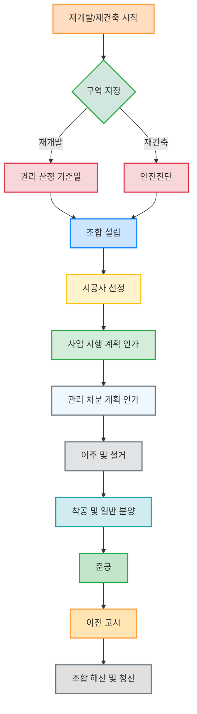

## 한 권으로 끝내는 돈 되는 재건축 재개발: 복잡한 부동산 투자를 쉽게 이해하는 방법
이 책은 재건축과 재개발 투자를 처음 접하는 사람들을 위해 복잡한 용어와 절차를 쉽고 명확하게 설명해 주는 안내서야. 한 번 읽으면 사업 절차를 이해하고, 두 번 읽으면 감정평가액을 추정하며, 세 번 읽으면 분담금을 계산할 수 있게 될 거야. 이 책을 통해 재건축과 재개발이 시간을 돈으로 바꾸는 투자라는 것을 알게 될 거야. 

## 1. 재건축과 재개발, 뭐가 다를까?

재건축과 재개발은 낡은 동네를 새롭게 바꾸는 사업인데, 둘 사이에는 중요한 차이가 있어. 마치 낡은 옷을 수선하는 것과 아예 새 옷을 만드는 것과 비슷하다고 생각하면 돼. 

1. **재건축은 아파트를 아파트로 바꾸는 거야.**
  - 기존에 있던 낡은 아파트를 부수고 새로운 아파트를 짓는 것을 말해. 
  - 주변에 도로, 상하수도, 공원 같은 기반 시설(생활에 필요한 기본적인 시설)은 이미 잘 갖춰져 있는 경우가 많아. 
  - 예를 들면, 목동 아파트나 잠실 주공 아파트처럼 낡은 아파트를 허물고 다시 짓는 경우가 많지. 
  - 사업 기간은 재개발보다 짧은 편이지만, 투자 이익도 상대적으로 짧을 수 있어. 
2. **재개발은 낡은 동네 전체를 바꾸는 거야.**
  - 빌라나 단독 주택처럼 낡은 집들이 모여 있는 동네를 부수고 새로운 아파트를 짓는 것을 말해. 
  - 주변에 도로, 상하수도, 공원 같은 기반 시설이 부족해서, 집뿐만 아니라 이런 시설들도 새로 싹 깔아야 하는 경우가 많아. 
  - 소유자가 많고 이해관계자(사업에 얽힌 사람들)도 많아서 사업 기간이 긴 편이야. 
  - 하지만 초창기에 투자하면 많은 투자 수익을 볼 수 있는 장점도 있어. 
  - 가끔 아파트인데도 빌라촌 한가운데 있어서 재개발로 묶이거나, 빌라를 허무는데 재건축으로 분류되는 예외적인 경우도 있어. 
  - 예를 들어, 방배동에서 많이 하던 단독 주택 재건축 사업이 그런 케이스였는데, 지금은 폐지된 사업 유형이야. 

## 2. 재개발/재건축 사업의 종류와 특징

재개발과 재건축은 크게 보면 정비 사업이라고 부르는데, 그 안에서도 여러 가지 종류가 있어. 마치 요리에도 한식, 중식, 일식처럼 다양한 종류가 있는 것과 같아. 

1. **정비 사업의 큰 그림**
  - 우리가 흔히 말하는 재개발, 재건축은 '도시 및 주거 환경 정비법'이라는 법에서 정한 사업들이야. 
  - 리모델링은 이 정비 사업에 포함되지 않아. 리모델링은 '주택법'으로 하는 사업이라서 정비 사업과는 달라. 
  - 택지 개발 사업은 신도시를 만드는 형태라고 보면 돼. 
2. **재개발의 세부 종류**
  - 재개발은 크게 주택 정비형과 도시환경 정비형으로 나눌 수 있어. 
  - **주택 정비형 **재개발**:** 지도에서 노란색 계열로 표시되는 주거지(사람들이 사는 곳)에서 하는 재개발이야. 
  - 예를 들어, 돈의문 뉴타운 1구역은 주거지였기 때문에 경희궁자이 아파트를 지었어. 
  - **도시환경 정비형 **재개발**:** 지도에서 빨간색 계열로 표시되는 상업지(상점이나 회사가 많은 곳)에서 하는 재개발이야. 
  - 상업지는 용적률(땅 면적 대비 건물 연면적 비율)이 높아서 보통 높은 오피스 빌딩 같은 건물을 많이 지어. 
  - 돈의문 뉴타운 3구역은 상업지였기 때문에 오피스 건물을 지었지. 
  - 가로 주택 정비 사업이나 소규모 재건축 같은 작은 사업들은 '빈집 및 소규모 주택 정비에 관한 특례법'으로 따로 관리되고 있어. 
3. **뉴타운과 재정비 촉진 지구**
  - 뉴타운은 여러 재개발 사업 구역을 한꺼번에 묶어서 광역적으로(넓은 지역을 한 번에) 계획하는 것을 말해. 
  - 원래 서울시 조례(지방 자치 단체의 규칙)로 시작됐다가 나중에 전국으로 확대되면서 '도시 재정비 촉진을 위한 특별법(도촉법)'이 만들어졌어. 
  - 도촉법이 만들어지기 전에 지정된 곳은 뉴타운, 이후에 지정된 곳은 재정비 촉진 지구라고 불러. 
  - 예를 들어, 한남 3구역은 원래 '한남 3 촉진 구역'이라고 불려야 해. 
  - 뉴타운은 전체적인 계획을 함께 세우기 때문에, 한 구역의 계획이 바뀌면 다른 구역에도 영향을 미쳐서 함께 바꿔야 하는 특징이 있어. 
4. 신속 통합 기획** (신통 기획)**
  - 신통 기획은 서울시가 기존 재개발/재건축 사업의 틀 안에서 사업을 더 빨리 진행할 수 있도록 인센티브(혜택)를 주고 규정을 완화해 주는 사업이야. 
  - 공공(정부나 지자체)의 요구를 일정 부분 수용하는 대신 용적률 같은 혜택을 얻는 형태지. 

## 3. 재개발/재건축 사업의 성공 조건

재개발/재건축 사업은 단순히 좋은 위치에 있다고 성공하는 게 아니야. 마치 배를 타고 망망대해를 항해하는 것과 같아서, 여러 가지 조건이 잘 맞아야 무사히 목적지에 도착할 수 있어. 

1. **주민들의 단결이 가장 중요해.**
  - 모든 주민이 한마음 한뜻으로 뭉쳐야 사업이 순조롭게 진행될 수 있어. 
  - 사업 방식이나 개인의 이득/손실 문제로 갈등이 생기면 사업이 지연되거나 실패할 수도 있어. 
2. **시대를 잘 만나야 해.**
  - 부동산 시장이 상승장(가격이 오르는 시기)일 때 사업이 더 잘 진행돼. 
  - 하락장(가격이 떨어지는 시기)에서는 아무리 좋은 위치라도 사업이 어려워질 수 있어. 
3. **사업성이 좋아야 해.**
  - 사업성은 결국 용적률(땅 면적 대비 건물 연면적 비율)에 달려 있어. 
  - **용적률이 높을수록 사업성이 좋아:**
  - 우리 아파트가 원래는 작았는데, 법적으로 지을 수 있는 최대 크기가 훨씬 크다면, 그만큼 더 많은 집을 지을 수 있어. 
  - 늘어난 집들을 일반 분양(조합원이 아닌 사람들에게 파는 것)해서 돈을 벌고, 그 돈으로 공사비를 충당하고도 남으면 조합원들은 돈을 돌려받거나 분담금(추가로 내야 하는 돈)을 줄일 수 있어. 
  - 하지만 요즘은 중층(중간 높이) 아파트 재건축이 많아져서, 남는 용적률이 많지 않은 경우가 많아. 
  - **원래 집들의 면적 구성도 중요해:**
  - 아무리 용적률이 남아 있어도, 원래 집들이 다 소형(작은 평수)이라면 문제가 될 수 있어. 
  - 작은 집들이 요즘 사람들이 선호하는 큰 평수로 늘어나는 것만으로도 허용된 용적률을 거의 다 채워버릴 수 있거든. 
  - 이렇게 되면 일반 분양할 집이 거의 없어져서, 조합원들이 공사비를 주머니에서 더 많이 내야 해. 
  - 이런 경우를 '대지 지분(집이 깔고 앉은 땅의 비율)이 작다'고 표현해. 
  - **면적대가 비슷한 단지가 유리해:**
  - 이웃끼리 면적대가 비슷하면 이해관계도 비슷해서 사업 추진 과정에서 잡음이 적은 편이야. 
  - 하지만 대형(큰 평수)과 소형(작은 평수)이 섞여 있으면, 이해관계가 달라서 분쟁이 생기기 쉬워. 
  - 대형 평수는 거래가 드물고, 단위 면적당 가격으로 따지면 소형보다 불리한 경우도 많아서 갈등의 원인이 되기도 해. 
  - 이런 이유로 소형 면적대 집들을 떼어내서 따로 재건축하는 경우도 있어. 

## 4. 재개발/재건축 사업 절차: 긴 여정의 시작

재개발/재건축 사업은 여러 단계를 거쳐 진행돼. 마치 아이돌이 데뷔해서 앨범을 내고 활동하는 과정과 비슷하다고 생각하면 돼. 

1. **구역 지정: 데뷔조가 되는 첫걸음**
  - 재개발/재건축을 하려면 먼저 우리 동네가 '정비 구역'으로 지정되어야 해. 이게 바로 데뷔조가 되는 첫걸음이야. 
  - **구역 지정 절차:**
  - 옛날에는 관(정부나 지자체)에서 알아서 구역을 지정했지만, 요즘은 주민들이 먼저 신청해. 이걸 '주민 입안 제한'이라고 해. 
  - 주민들이 신청하면 관에서 타당성(사업의 적절성)을 검토하고, 주민들의 동의를 다시 물어봐. 
  - 주민들의 동의율(머릿수 기준 2/3, 토지 면적 기준 1/2)을 채우면 구역 지정 절차를 밟게 돼. 
  - 이 과정에서 '정비 계획'이라는 러프한 밑그림(청사진)을 세우게 돼. 
  - **구역 지정 조건 (서울시 기준):**
  - 면적이 1만 제곱미터 이상이어야 해. 
  - 노후도** 조건:** 동네 집들의 노후도(낡은 정도)가 동수 기준으로 60%를 넘어야 해. 
  - **선택 요건 (넷 중 하나만 맞아도 돼):** 
  - 연면적(건물 전체 바닥 면적) 기준으로 노후도가 60% 이상. 
  - 호수 밀도(단위 면적당 가구 수)가 너무 빽빽하거나(1헥타르당 60가구 이상). 
  - 과소 필지(땅이 너무 작게 쪼개진 곳, 90제곱미터 미만)가 전체의 40% 이상. 
  - 접도율(도로에 접한 집의 비율)이 너무 적거나(전체의 40% 이하). 
  - 재개발 구역 중에는 6미터 이하의 도로와 만나지 않는 집들이 많아서 쿠팡맨이 차로 못 들어가는 곳도 많아. 
  - **구역 지정 시 주의할 점:**
  - 구역 모양이 삐뚤삐뚤하거나 십자가 모양으로 생겨서 일부 집이 개발에서 빠지는 경우가 있어. 
  - 이렇게 되면 나중에 도로 확장 같은 토지 이용 효율이 떨어지고, 빠진 집들을 나중에 수용해야 하는 문제가 생길 수 있어. 
  - 상가(가게)는 영업을 계속해야 하므로, 재개발에 동의하지 않는 경우가 많아. 
  - 상가를 가진 사람들은 나중에 아파트 배정을 두고도 갈등이 생기기 때문에, 아예 상가를 빼고 사업을 진행하거나 토지 분할 소송을 통해 상가를 떼어내는 경우도 있어. 
2. 권리 산정 기준일**: **지분 쪼개기 금지
  - 재개발에서는 '권리 산정 기준일'이라는 날짜가 아주 중요해. 이 날짜는 '지분 쪼개기(땅을 쪼개서 여러 사람에게 파는 행위)'를 금지하는 날이야. 
  - **지분 쪼개기란?**
  - 단독 주택을 허물고 여러 가구의 빌라를 지어서 파는 행위를 말해. 
  - 이렇게 하면 한 채의 집이 여러 채의 집으로 쪼개져서 조합원이 늘어나게 돼. 
  - 조합원이 너무 많아지면 나중에 지을 새 아파트 수가 부족해지거나, 일반 분양할 집이 줄어들어 사업성이 나빠져. 
  - **권리 산정 기준일의 의미:**
  - 이 날짜 이후에 지분 쪼개기를 한 물건은 새 아파트를 받을 자격이 없어. 
  - 정확히는, 쪼개진 여러 집 중에서 한 사람만 대표 조합원으로 인정해서 새 아파트를 받을 수 있어. 
  - 이 날짜는 늦어도 구역 지정일 이전에 시도지사(특별시, 광역시의 시장 또는 도지사)가 고시해. 
  - **다물건(여러 개의 **물건**) 문제:**
  - 한 사람이 여러 채의 집을 가지고 있어도 원칙적으로는 새 아파트를 한 채만 받을 수 있어. 
  - 만약 조합 설립 이후에 다주택자가 나머지 집을 팔았다면, 그 집을 산 사람들은 새 아파트를 받을 수 없어. 
  - 이런 억울한 일을 당하지 않으려면 매도인(파는 사람)에게 확인하고, 조합에 직접 문의하며, 중개업소에 특약(특별한 약속)을 걸어야 해. 
  - **서울시 조례 변경 (2010년 7월 15일):**
  - 이 날짜를 기준으로 서울시 조례가 크게 바뀌었어. 
  - 신조례(새로운 조례)부터 권리 산정 기준일 개념이 도입되었고, 구조례(옛날 조례)를 적용받는 구역에는 이 개념이 없어. 
  - 따라서 내가 물건을 사려는 동네가 어떤 조례를 적용받는지 꼭 확인해야 해. 
3. 안전진단**: 재건축의 첫 관문**
  - 재건축은 재개발과 달리 '안전진단'이라는 절차를 반드시 거쳐야 해. 마치 건물이 튼튼한지 의사에게 진찰받는 것과 같아. 
  - **안전진단 신청 조건:**
  - 보통 지은 지 30년이 넘은 아파트가 재건축을 시도할 수 있다고 알려져 있어. 
  - 이 30년 기준은 1986년에 지어진 건물들이 2017년에 30년이 되면서 통일된 거야. 
  - **안전진단 등급:**
  - 안전진단은 점수에 따라 A, B, C, D, E 5가지 등급으로 나뉘어. 
  - **E등급:** 즉시 재건축. 건물이 너무 위험해서 당장 재건축해야 한다는 의미야. 
  - 상계주공 8단지(포레나 노원)가 E등급을 받아 재건축한 케이스야. 
  - **D등급:** 조건부 재건축. 한 번 더 절차를 거쳐 재건축 여부를 결정해. 
  - **B, C등급:** 리모델링 허용. 재건축은 안 되지만 리모델링(건물을 고쳐 쓰는 것)은 할 수 있어. 
  - B등급은 수직 증축(건물 높이를 올리는 것)이 가능하고, C등급은 수평 증축(건물을 옆으로 늘리는 것)만 가능해. 
  - **A등급:** 짱 튼튼. 재건축할 필요 없이 그냥 살아도 된다는 의미야. 
  - **안전진단 '통과'의 의미:**
  - 우리가 흔히 '안전진단 통과'라고 말하는 건 사실 '안전하지 않다'는 의미야. 
  - 건물이 위험하다는 판정을 받아야 재건축을 할 수 있기 때문에, 주민들은 오히려 건물이 위험하다는 결과에 좋아해. 
  - **평가 기준의 변화:**
  - 안전진단 평가 기준은 정권마다 조금씩 달라져. 건물의 구조 안전성(진짜 무너질 것 같냐)에 가중치를 둘지, 주거 환경(주차장 같은 불편함)에 가중치를 둘지에 따라 결과가 달라질 수 있어. 
4. 조합 설립**: 사업의 주체가 되는 과정**
  - 구역 지정이 끝나면 사업을 이끌어갈 '조합'을 설립해야 해. 마치 아이돌 그룹이 정식으로 결성되는 것과 같아. 
  - 추진 위원회** 설립:**
  - 조합을 설립하기 전에 먼저 '추진 위원회'를 만들어. 
  - 추진 위원회는 토지 등 소유자(땅이나 건물을 가진 사람)의 50% 동의만 있으면 설립할 수 있어. 
  - 추진 위원회의 목적은 '조합 설립'이야. 조합 설립을 위한 동의서를 모으고, 정비 업체 선정 등 초기 단계를 준비하는 역할을 해. 
  - **조합 설립 인가:**
  - 추진 위원회가 조합으로 강화되려면 더 높은 동의율이 필요해. 
  - **재개발 기준:** 토지 등 소유자의 75% 동의(머릿수 기준)와 토지 면적의 50% 동의가 필요해. 
  - 땅을 크게 가진 대지주들이 동의하지 않으면 면적 기준을 맞추기 어려워서 사업이 지연될 수 있어. 
  - **재건축 기준:** 토지 등 소유자의 70% 동의(머릿수 기준)와 토지 면적의 70% 동의가 필요해. 
  - 여기에 '동별 동의율(각 동마다 50% 동의)'도 맞춰야 해. 한 동에서 반대하는 사람이 많으면 조합 설립이 어려울 수 있어. 
  - 특히 한강변처럼 조망권(경치를 볼 수 있는 권리)이 좋은 동에서 동의를 안 하는 경우가 많아. 
  - **재개발과 재건축의 **조합원** 제도 차이:**
  - **재개발은 **강제 조합원** 제도:** 내가 동의하지 않았어도 다른 사람들이 동의율을 채워 조합이 설립되면 나도 강제로 조합원이 돼. 
  - 나중에 '현금 청산(새 아파트를 받지 않고 돈으로 보상받는 것)'을 선택해서 사업에서 빠질 수는 있어. 
  - **재건축은 임의 조합원 제도:** 내가 처음에 조합 설립에 동의하지 않았다면, 아예 사업과 관계없는 사람이 돼. 
  - 나중에 조합이 내 집을 '매도 청구(소송을 통해 강제로 집을 사들이는 것)'해서 취득하게 돼. 
  - 조합원이 아닌 사람의 물건은 새 아파트를 받을 수 없기 때문에, 경매로 싸게 나왔다고 샀다가 낭패를 볼 수도 있어. 
  - **조합원 지위 양도 금지:**
  - 투기 과열 지구(부동산 투기가 심한 지역)에서는 재건축 조합이 설립된 이후부터 조합원 지위(조합원으로서의 권리)를 사고파는 것이 금지돼. 
  - 재개발은 '관리 처분 계획 인가' 이후부터 지위 양도가 금지돼. 

## 5. 시공사 선정 및 사업 시행 계획 인가

조합이 설립되면 이제 우리 동네에 멋진 새 아파트를 지어줄 건설사를 뽑고, 구체적인 건축 계획을 세워서 허가를 받아야 해. 마치 아이돌 그룹이 소속사를 정하고 앨범 콘셉트를 확정하는 것과 같아. 

1. 시공사** 선정: 우리 집을 지어줄 파트너 찾기**
  - 조합은 여러 건설사 중에서 우리 아파트를 지어줄 '시공사(건설사)'를 선정해. 
  - **선정 과정:**
  - 건설사들은 조합원들을 유혹하기 위해 좋은 조건을 내세우며 경쟁해. 
  - 입찰(경쟁)에 참여한 업체들을 대상으로 총회(조합원 전체 회의)를 통해 투표로 선정해. 
  - 건설사들은 분양가, 미분양 시 책임, 이주비(이사 비용) 지원 등 다양한 공약을 내세워. 
  - **문제점:**
  - 시공사 선정 과정에서 과열 경쟁이나 뇌물 문제가 발생하기도 했어. 
  - 선정 후에도 공사비 인상, 마감재(건물 내부 마감 재료) 변경 등으로 조합과 갈등이 생겨 계약을 해지하고 재선정하는 경우도 많아. 
  - 인기 없는 구역은 아무도 입찰하지 않아 여러 차례 유찰(입찰자가 없어 실패하는 것)되면서 공사비가 계속 오르기도 해. 
  - 두 번 이상 유찰되면 '수의 계약(특정 업체와 직접 계약하는 것)'을 할 수 있어. 
  - **공동 사업 시행자:**
  - 사업을 빨리 진행하기 위해 시공사를 '공동 사업 시행자(사업의 주인이 되는 건설사)'로 선정하는 경우도 있어. 
  - 건설사들이 인허가(허가와 승인) 노하우가 많고 속도전이 필요할 때 이런 방식을 선택해. 
  - 반포주공 1단지 1, 2, 4주구가 재건축 초과 이익 환수제(재건축으로 얻는 이익에 세금을 부과하는 제도)를 피하기 위해 현대건설을 공동 사업 시행자로 선정한 사례가 있어. 
2. 사업 시행 계획 인가**: 구체적인 설계도 그리기**
  - 시공사를 선정하면 이제 '사업 시행 계획'을 수립하고 인가(허가)를 받아야 해. 이건 아파트의 외관, 가구 수, 층수 등 아주 구체적인 건축 계획을 그리는 단계야. 
  - **계획 내용:**
  - 아파트 외관, 가구 수, 층수, 면적대 배치 등 건축 계획을 세부적으로 짜. 
  - 교통 환경 영향 평가, 교육 환경 영향 평가 등 5만 가지 심의(검토)를 거쳐야 해. 
  - 재개발/재건축으로 인해 주변 학교나 교통에 미치는 영향을 평가하는 거야. 
  - 이 단계에서 인허가에 가장 오래 걸리고, 계획이 반려(거부)되어 다시 수정해야 하는 경우가 많아. 
  - **정비 계획과의 차이:**
  - 구역 지정 단계에서 세운 '정비 계획'이 스케치(대략적인 밑그림)라면, '사업 시행 계획'은 눈코입을 그리고 메이크업을 해나가는 단계라고 보면 돼. 
  - 정비 계획은 큰 틀을 잡는 것이고, 사업 시행 계획은 훨씬 디테일하게 들어가는 거야. 

## 6. 관리 처분 계획 인가: 정산의 시간

사업 시행 계획 인가가 끝나면 이제 '관리 처분 계획'을 세워서 인가를 받아야 해. 이건 누가 얼마를 내고 얼마를 받을지, 재산 관계를 모두 정리하는 정산의 시간이야. 

1. **관리 처분 계획의 의미:**
  - 우리끼리 정산하는 것이 쉽지 않아서 복잡하지만, 인허가 자체는 오래 걸리지 않아. 
  - 사업을 진행하면서 발생한 모든 재산 변동을 정리하고, 일반 분양가도 정해서 수익을 따져봐. 
  - 사업 계획이 변경되면 정비 계획, 사업 시행 계획, 그리고 관리 처분 계획까지 계속 뒤로 돌아가서 수정해야 해. 
2. 조합원 분양 신청** 및 **분담금 계산**:**
  - 조합원들은 새 아파트를 받기 위해 분양 신청을 해. 
  - 분담금**(추가로 내야 하는 돈) 계산 원리:**
  - 새로 지을 아파트의 조합원 분양가에서 나의 현재 집 가격(감정 평가액)을 빼면 내가 얼마를 더 내야 하는지 분담금이 나와. 
  - 감정 평가**:** 내가 집을 얼마에 샀든, 조합에서는 우리 구역 전체에 대한 감정 평가를 진행해서 집집마다 가격을 정해. 이걸 '종전 자산 평가'라고 해. 
  - 아파트는 면적이나 동에 따라 비슷비슷하게 평가되지만, 재개발은 집집마다 위치, 면적, 형태가 달라서 감정 평가액이 크게 차이 날 수 있어. 
  - 프리미엄(P)**:** 내가 집을 살 때 감정가보다 더 많이 낸 돈을 말해. 재개발의 미래 가치를 보고 지불한 돈이지. 
  - 프리미엄은 감정가 계산 시에는 들어가지 않아. 
  - 비례율**:** 감정가에 비례율을 곱해서 '권리 가액(재개발 전 내 재산의 가치)'을 구해. 
  - 비례율은 사업의 수익률 개념으로, 보통 100%에 맞춰. 100%가 넘으면 수익이 나는 거고, 낮으면 조합원들이 돈을 더 내야 해. 
  - 비례율이 높으면 감정가가 높았던 집의 권리 가액이 더 커지기 때문에, 평형 배정(어떤 평수의 아파트를 받을지) 순위를 결정할 때 불란(갈등)의 씨앗이 될 수 있어. 
  - **총 **투자금**:** 내가 처음에 집을 산 매매가에 분담금을 더한 금액이 새 아파트를 받기까지 총 들어가는 돈이야. 
  - 예를 들어, 10억짜리 단독 주택을 샀는데 감정가가 3억이고 프리미엄이 7억이라면, 조합원 분양가가 7억일 때 분담금 4억을 더 내서 총 14억이 들어가는 셈이야. 
  - 분양 대상자** 선정:**
  - 새 아파트를 받을 권리를 가진 사람(분양 대상자)을 정해야 해. 
  - 인기 있는 평수나 좋은 자리에 경쟁이 생기면 '권리 가액'이 높은 사람이 우선권을 가져. 
  - 원래 자산 가치가 높았던 사람(큰 집에 살았거나 대지 지분이 넓었던 사람)이 유리한 거지. 
  - **청산자:**
  - 이 단계에서 새 아파트를 분양받지 않고 사업에서 나가는 사람들을 '청산자'라고 불러. 
  - 재개발은 강제 조합원 제도이기 때문에, 처음에 반대했어도 이 단계에서 현금 청산을 선택해서 나갈 수 있어. 
3. **세금 관련 변화:**
  - 관리 처분 계획 인가부터 재개발/재건축은 세법상 '입주권(새 아파트를 받을 권리)'으로 전환돼. 
  - 투기 과열 지구의 재개발은 관리 처분 계획 인가부터 조합원 지위 양도가 금지돼. 

## 7. 이주, 철거, 착공 및 일반 분양: 결실을 맺는 단계

관리 처분 계획 인가가 나면 이제 실제로 집을 비우고 낡은 건물을 허물고 새 건물을 짓기 시작해. 그리고 일반인들에게 새 아파트를 분양하는 단계로 넘어가. 

1. **이주 및 철거: 낡은 것을 비우는 시간**
  - **이주:** 조합원들이 집을 비우고 이사 나가는 기간을 줘. 
  - 이주 철거가 한꺼번에 몰리면 전세 시장이 왜곡될 수 있어서, 관(지자체)에서 시기를 조절하기도 해. 
  - 마지막까지 안 나가는 집들 때문에 사업이 지연되는 경우가 많아. 
  - 재개발은 영세한 세입자들이 옮겨갈 곳이 마땅치 않아 남는 경우가 많고, 재건축도 개포주공 1단지처럼 마지막 한 집이 안 나가서 강제 집행을 한 사례가 있어. 
  - 상가들은 영업에 대한 문제가 걸려 있어서, 재개발은 영업 보상이 의무지만 재건축은 그렇지 않아. 
  - 조합은 안 나가는 집들에 대해 '매도 청구(소송을 통해 강제로 집을 사들이는 것)'를 해서 모든 단지를 조합 소유로 만들어야 해. 
  - **철거:** 집을 비우면 낡은 건물을 철거해. 
  - 옛날 집에서는 석면(유해 물질)이 나와서 사업이 지연되는 경우도 있어. 둔촌주공이 석면 문제로 1년 이상 지연된 사례가 있어. 
  - 철거가 끝나면 건물이 없어지고 '멸실(건물이 사라지는 것)' 상태가 돼. 
  - 멸실이 되면 주택이 없어지므로 주택분 종부세(종합부동산세)를 내지 않아도 돼. 
  - 멸실 상태에서 집을 사면 주택분 취득세 중과(세금을 더 많이 내는 것)를 피하고 토지에 대한 취득세(4.6%)만 내게 돼. 
  - 나중에 준공될 때 건물분에 대한 '원시 취득세율(최초로 건물을 취득할 때 내는 세금, 2.8%)'을 한 번 더 내게 돼. 
2. **착공 및 **일반 분양**: 새 아파트의 탄생**
  - 철거가 끝나고 땅만 남으면 이제 새 아파트를 짓기 시작해. 이걸 '착공'이라고 해. 
  - 일반 분양**:** 보통 착공과 동시에 일반 분양(조합원이 아닌 사람들에게 아파트를 파는 것)을 해. 
  - **후분양:** 분양가 규제(정부가 분양가를 통제하는 것)가 심할 때는 조합들이 '후분양(건물을 다 짓고 나서 분양하는 것)'을 선택하기도 해. 
  - 건물을 짓는 동안 집값이 더 오를 것이라는 기대가 있다면, 나중에 분양해서 더 많은 이득을 얻으려는 계산이지. 
  - 과거에는 강남 정도에서만 후분양을 할 수 있었지만, 지금은 많이 보편화되었어. 
  - 준공**:** 건물이 다 지어지면 '준공(건축 공사가 완료되는 것)'이 돼. 
  - 준공 시점부터 '재건축 초과 이익 환수제(재건축으로 얻는 이익에 세금을 부과하는 제도)'의 1인당 평균 이익을 따지기 시작해. 
  - 준공 이후에도 하자(건물 결함) 문제로 언론의 주목을 받기도 해. 
3. 이전 고시** 및 조합 해산: 마지막 정리**
  - 준공 후에는 '이전 고시(새 아파트의 소유권을 나누어 주는 것)'라는 단계를 거쳐. 
  - 건물을 다 부수고 새 아파트를 만들었으니, 이 땅을 다시 나누고 소유권을 정리하는 과정이야. 
  - 이 과정에서 소송 같은 문제가 생기면 '미등기 아파트(등기가 안 된 아파트)'가 될 수 있어. 공덕자이 같은 경우가 준공 후 9년 동안 등기가 안 난 사례가 있어. 
  - 미등기 아파트는 매매나 전세가 복잡하고, 정책 대출도 안 나오는 경우가 많아. 
  - 이전 고시까지 끝나면 조합은 돈을 정리하고 '해산(조합 활동을 끝내는 것)' 및 '청산(남은 재산을 정리하는 것)' 절차를 밟아. 
  - 하지만 이때부터는 조합원들이 조합 운영에 관심이 없어서, 조합이 해산되지 않고 남아 있는 경우도 많아. 

