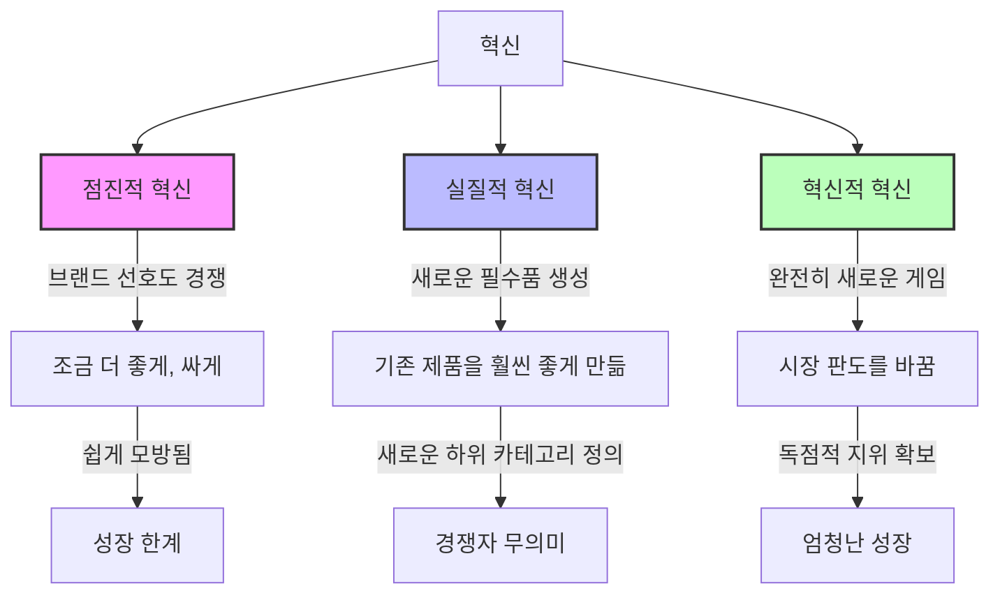
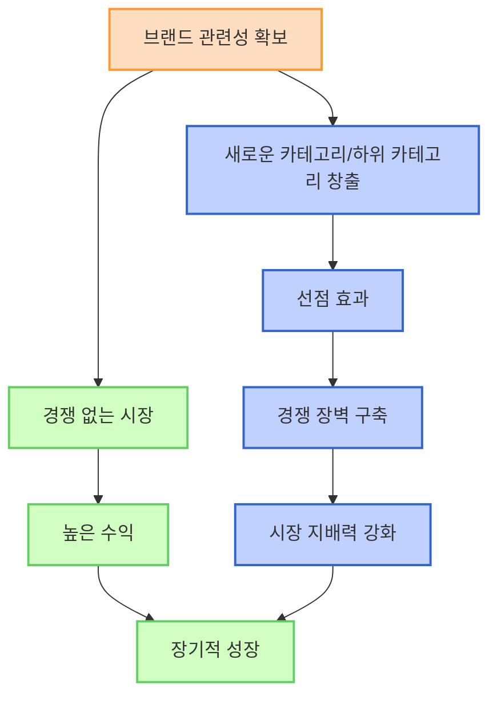
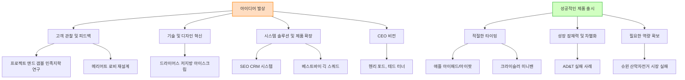
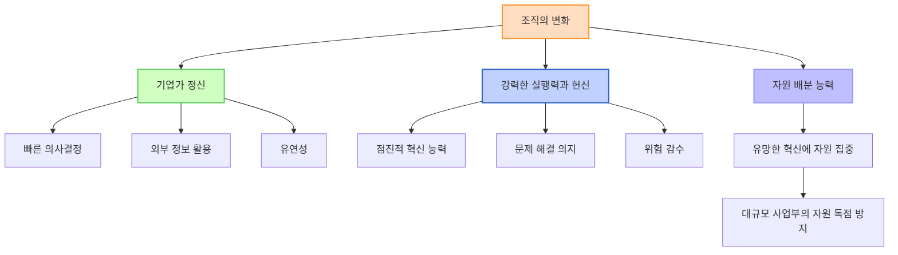

## 데이비드 아커의 '브랜드 관련성' 요약: 경쟁자를 무의미하게 만드는 법
이 책은 빠르게 변하는 시장에서 기업들이 어떻게 경쟁자들을 압도하고 지속적인 성장을 이룰 수 있는지 알려주는 책이야. 단순히 제품을 조금 더 좋게 만드는 '브랜드 선호도' 경쟁을 넘어, 아예 새로운 시장을 만들어서 '브랜드 관련성'을 확보하는 전략을 제시하고 있어. 혁신을 통해 새로운 카테고리나 하위 카테고리를 만들고, 그 시장의 독점적인 리더가 되는 방법을 다양한 사례와 함께 설명해 줄 거야.

## 1. 브랜드 관련성이란 무엇일까? 

브랜드 관련성은 소비자가 물건을 살 때 어떤 제품 종류(카테고리)나 세부 종류(하위 카테고리)를 고를지, 그리고 그 안에서 어떤 브랜드를 고려할지 결정하는 첫 두 단계를 말해. 마치 네가 점심으로 뭘 먹을지(카테고리: 한식, 중식, 일식), 그리고 어떤 식당을 갈지(고려 브랜드: 김밥천국, 백반집) 정하는 것과 같다고 보면 돼.

1. **브랜드 관련성의 두 단계**
  1. **제품 카테고리/**하위 카테고리** 선택**: 소비자가 어떤 종류의 제품을 살지 결정하는 단계야. 예를 들어, "SUV를 사야겠다"라고 마음먹는 거지.
  2. **고려 브랜드 결정**: 선택한 카테고리 안에서 어떤 브랜드들을 살펴볼지 정하는 단계야. "아우디, BMW, 벤츠, 캐딜락 중에서 골라볼까?" 하는 식이지.
2. **브랜드 선호도와의 차이점**
  1. 브랜드 선호도: 관련성 있는 브랜드들 중에서 최종적으로 하나를 선택하는 단계야. "BMW가 제일 마음에 들어!" 하고 결정하는 거지.
  2. **마케터들의 실수**: 대부분의 마케터들은 이 '브랜드 선호도' 경쟁에 너무 많은 시간과 돈을 쓴다고 해. 하지만 진짜 성장은 '브랜드 관련성'을 확보하는 데서 온다는 거야.

## 2. 왜 브랜드 관련성이 중요할까? 

시장은 생각보다 잘 변하지 않아. 사람들이 익숙한 걸 계속 찾기 때문이지. 마치 네가 매일 가던 식당만 가는 것처럼 말이야. 그래서 마케팅에 아무리 돈을 많이 써도 시장 점유율(시장에서 차지하는 비율)이 크게 바뀌는 경우는 드물어.

1. **시장의 엄청난 **관성:
  1. **일본 맥주 시장 사례**: 일본 맥주 시장은 50년 동안 시장 점유율이 크게 바뀐 적이 딱 네 번밖에 없었어. 
  - 세 번은 새로운 하위 카테고리(예: 드라이 맥주)가 등장했을 때였고, 한 번은 두 개의 하위 카테고리가 동시에 재정의(리포지셔닝)되었을 때였지. 
  - 기린(Kirin) 맥주는 20년 넘게 시장의 60%를 차지했는데, 아사히 드라이(Asahi Dry)라는 새로운 종류의 맥주가 나오자 1년 반 만에 10%를 잃었어. 
  2. **컴퓨터 산업 사례**: 1960년대 IBM이 지배하던 컴퓨터 시장도 마찬가지야. 새로운 리더들은 IBM보다 마케팅을 잘해서가 아니라, 마이크로컴퓨터나 네트워크 워크스테이션 같은 완전히 새로운 하위 카테고리를 만들어서 시장을 바꿨어. 
2. **마케팅의 한계**:
  1. 대부분의 마케팅 비용은 시장에 큰 변화를 주지 못해. 
  2. 프록터 앤드 갬블(P&G)의 세제 사업부 책임자는 시장 점유율이 0.1%만 올라도 기뻐했다고 해. 그만큼 시장을 바꾸는 게 어렵다는 뜻이야. 
3. **진정한 성장의 열쇠**:
  1. 진정한 성장은 새로운 '필수품(must-have)'을 만들고, 새로운 카테고리나 하위 카테고리를 정의하는 혁신에서 나와. 
  2. 이런 혁신은 경쟁자들이 아예 고려 대상조차 되지 못하게 만들어서 시장을 독점할 수 있게 해줘. 

## 3. 브랜드 선호도 경쟁과 브랜드 관련성 경쟁의 차이점 

두 가지 경쟁 방식은 완전히 달라. 마치 단거리 경주와 마라톤처럼 말이야.

1. 브랜드 선호도** 경쟁 (단거리 경주)**
  1. **전략**: 점진적인 혁신(incremental innovation)이야. 매년 조금 더 좋게, 조금 더 싸게, 조금 더 빠르게 만드는 거지. 
  2. **마케팅**: "우리 브랜드가 다른 브랜드보다 더 좋아요!"라고 설득하는 데 집중해. 
  3. **문제점**:
  - 대부분의 점진적인 혁신은 금방 따라 할 수 있어. 
  - 이런 경쟁으로는 브랜드가 크게 성장하기 어려워. 
  - 결국 수익은 줄고 힘든 싸움만 계속될 뿐이야. 
2. 브랜드 관련성** 경쟁 (마라톤)**
  1. **전략**: 실질적이고 혁신적인(substantial or transformational) 혁신을 통해 새로운 '필수품'을 만들고, 완전히 새로운 카테고리나 하위 카테고리를 정의하는 거야. 
  2. **마케팅**: 새로운 카테고리나 하위 카테고리가 시장에서 승리하도록 만드는 데 집중해. 브랜드 자체보다는 카테고리를 알리는 데 힘쓰는 거지. 
  3. **목표**: 경쟁자들의 브랜드가 아예 고려 대상조차 되지 않게 만드는 거야. 마치 네가 새로운 게임을 만들어서 혼자만 플레이하는 것과 같아. 
  4. **경제학 101**: 독점(monopoly)을 만들고 독점 상황에서 경쟁하는 것과 같다고 보면 돼. 

## 4. 혁신의 종류와 중요성 

혁신에는 세 가지 종류가 있어. 어떤 혁신인지 정확히 아는 게 중요해.

1. 점진적 혁신** (**Incremental Innovation**)**
  1. **특징**: 브랜드 선호도에 약간의 영향을 주지만, 새로운 '필수품'을 만들지는 못해. 
  2. **예시**: 휴대폰 카메라 화소가 조금 더 좋아지는 것 같은 거야.
  3. **문제점**: 이걸 실질적인 혁신처럼 관리하면 자원 낭비가 심해. 
2. 실질적 혁신** (**Substantial Innovation**)**
  1. **특징**: 사람들이 이미 아는 카테고리 안에서 제품을 너무나도 좋게 만들어서, 그게 없으면 안 되는 '필수품'이 되는 거야. 
  2. **예시**: 방탄복에 '케블라(Kevlar)'라는 신소재를 넣어서 훨씬 안전하게 만드는 것과 같아. 사람들이 방탄복을 사는 건 똑같지만, 케블라가 없으면 안 된다고 생각하게 되는 거지. 
  3. **결과**: 새로운 하위 카테고리를 정의하고 경쟁자들을 무의미하게 만들어. 
3. **혁신적 혁신 (**Transformational Innovation**)**
  1. **특징**: 아예 게임의 판도를 완전히 바꿔버리는 혁신이야. 
  2. **예시**: 세일즈포스닷컴(Salesforce.com)이 클라우드 컴퓨팅을 도입해서 소프트웨어 시장을 완전히 바꾼 것과 같아. 
  3. **결과**: 완전히 새로운 시장을 창출하고 독점적인 지위를 확보할 수 있어.

## 5. 브랜드 관련성 확보의 엄청난 보상 

브랜드 관련성 경쟁에서 이기면 정말 엄청난 보상이 따라와. 마치 아무도 없는 황금 광산을 발견하는 것과 같아.

1. **경쟁 없는 독점 시장**:
  1. **크라이슬러 미니밴**: 1982년 크라이슬러가 미니밴을 처음 내놓았을 때, 16년 동안 경쟁자가 거의 없었어. 
  - 첫해에 20만 대를 팔았고, 지금까지 1,300만 대를 팔았지. 
  - 이 미니밴 덕분에 크라이슬러는 회사를 살릴 수 있었어. 
  2. **엔터프라이즈 렌터카**: 사고가 나거나 차가 수리 중일 때 빌리는 렌터카 서비스를 처음 시작해서 35년 동안 경쟁자가 없었어. 
  - 지금은 허츠(Hertz)보다 두 배나 크고 수익도 훨씬 많아. 
2. **높은 수익과 성장**:
  1. **사업 시작 사례 분석**: 108개의 신규 사업 시작 사례를 분석했더니, 새로운 카테고리나 하위 카테고리를 만든 14%의 기업들이 전체 매출의 38%, 전체 이익의 61%를 차지했어. 
  2. **맥킨지 연구**: 1,000개 기업을 40년간 연구한 결과, 새로운 시장에 진입한 기업들은 첫해에 평균보다 133% 높은 투자 수익률(ROI)을 기록했고, 10년 후에도 여전히 높은 수익을 유지했어. 
  3. **신제품 성공의 비결**: 신제품 성공은 '차별화(differentiation)'와 밀접하게 관련되어 있고, 이 차별화는 새로운 카테고리나 하위 카테고리를 만드는 것과 연결돼. 

## 6. 브랜드 관련성 경쟁에서 이기는 방법 

브랜드 관련성 경쟁에서 이기려면 마케터들이 익숙하지 않은 새로운 역할을 해야 해. 새로운 카테고리를 정의하고 경쟁자들이 쉽게 들어오지 못하게 장벽을 만들어야 하는 거지.

1. **최고의 실행력으로 압도하기 (Execute Over the Top)** 
  1. **개념**: 너무나 뛰어난 서비스나 실행력으로 경쟁자들이 감히 따라올 엄두를 못 내게 만드는 거야.
  2. **자포스(Zappos.com) 사례**: 온라인 신발 판매점인 자포스는 24시간 연중무휴 고객센터를 운영해. 한밤중에 피자집을 찾아주거나, 경쟁사에서 신발을 사서 고객에게 배달해준 일화도 있어. 
  - 이런 '과도한' 서비스는 10가지 핵심 가치(예: '재미있고 조금 이상하게 행동하라')를 바탕으로 해. 
  - 이런 문화와 서비스는 다른 회사가 쉽게 따라 할 수 없는 강력한 장벽이 돼. 
2. **끊임없이 혁신하기 (Continuously Innovate)** 
  1. **개념**: 계속해서 새로운 제품을 내놓거나 기존 제품을 개선해서 경쟁자들이 따라잡기 힘들게 '움직이는 목표물'이 되는 거야.
  2. **애플(Apple) 사례**: 아이팟(iPod)을 시작으로 나노(Nano), 셔플(Shuffle), 터치(Touch), 아이패드(iPad)까지 계속해서 새로운 제품을 내놓았어. 
  3. **크라이슬러 미니밴 사례**: 16년 동안 경쟁자가 없었던 이유 중 하나는 크라이슬러가 운전석 슬라이딩 도어, 탈착식 좌석, 회전식 좌석 등을 계속 추가하며 혁신했기 때문이야. 
3. **카테고리의 **대표 브랜드** 되기 (Become the **Exemplar**)** 
  1. **개념**: 새로운 카테고리나 하위 카테고리를 대표하는 브랜드가 되는 거야. 마치 '대일밴드' 하면 반창고를 떠올리는 것처럼 말이야.
  2. **장점**:
  - 경쟁자들이 어색한 위치에 놓이게 돼. 경쟁자들이 관련성을 얻으려면 오히려 네 브랜드의 대표성을 강화해줘야 하는 상황이 생기지. 
  - 카테고리를 정의하고 이끌어갈 수 있는 힘이 생겨. 
  - 브랜드가 자동으로 카테고리와 연결돼서 마케팅 비용을 절약할 수 있어. 
  3. **사례**:
  - **프리우스(Prius)**: 하이브리드 자동차 시장에서 10년 동안 경쟁자가 거의 없었고, 전 세계 하이브리드 시장의 50% 이상을 차지했어. 
  - **ESPN**: 스포츠 채널 카테고리를 오랫동안 지배했어. 
  - **세일즈포스닷컴(Salesforce.com)**: 클라우드 컴퓨팅을 도입하며 이 분야의 대표 브랜드가 되었어. 
  4. **대표 브랜드가 되는 방법**:
  - **브랜드가 아닌 카테고리를 마케팅**: 세일즈포스닷컴은 클라우드 컴퓨팅이 왜 기존 방식보다 우수한지, 왜 '필수품'인지에 대해서만 이야기했어. 
  - **초기 시장 리더가 되기**: 꼭 최초일 필요는 없지만, 초기에 시장을 장악하고 지배해야 해. 
  - 진정성 있는 브랜드** 되기 (Authentic Brand)**: 아사히 드라이 맥주가 나왔을 때, 기린도 '기린 드라이'를 내놓았지만 실패했어. 아사히가 이룬 혁신에 대한 스토리가 있었기 때문에 기린은 진정성이 없다고 느껴졌던 거지. 
4. **카테고리 확장하기 (**Enrich the Category**)** 
  1. **개념**: 단순히 제품의 기능적인 이점을 넘어, 고객의 더 넓은 관심사나 삶의 영역으로 카테고리를 확장하는 거야.
  2. **팸퍼스(Pampers) 사례**: 팸퍼스는 단순히 기저귀를 파는 것을 넘어 '아기 돌보기(baby care)'라는 카테고리로 확장했어. 
  - 팸퍼스 빌리지 웹사이트는 임신부터 아기 성장 단계별 정보, 육아 커뮤니티까지 제공해서 엄마들에게 '필수품'이 되었어. 
  - 고객들은 단순히 기저귀를 사는 것을 넘어, '아기 돌보기'라는 공통 관심사를 공유하는 브랜드와 관계를 맺고 싶어 하는 거지. 
5. **브랜드화된 차별점 만들기 (**Branded Differentiators**)** 
  1. **개념**: 혁신적인 기술이나 특징에 고유한 이름을 붙여서 브랜드화하는 거야.
  2. **장점**:
  - 사람들은 혁신 자체는 따라 할 수 있어도, 그 혁신에 붙은 브랜드 이름은 따라 할 수 없어. 
  - 브랜드화된 차별점은 더 높은 가격을 정당화할 수 있게 해줘. 
  3. **사례**:
  - **온스타(OnStar)**: 제너럴 모터스(GM)의 차량 안전 및 통신 서비스에 '온스타'라는 이름을 붙여서 혁신을 소유했어. 
  - **웨스틴 헤븐리 베드(Westin Heavenly Bed)**: 웨스틴 호텔의 특별한 침대에 이름을 붙여서 차별화했어. 
  - **아우디 콰트로(Quattro)**: 아우디의 사륜구동 시스템에 '콰트로'라는 이름을 붙여서 기술을 브랜드화했어. 

## 7. 브랜드 관련성 위협에 대응하는 방법 

기존 브랜드도 새로운 카테고리가 등장하거나 에너지를 잃으면 관련성을 잃을 수 있어. 마치 오래된 가게가 새로운 트렌드를 따라가지 못하는 것과 같지. 이럴 때 어떻게 대응해야 할까?

1. **하던 일을 계속 잘하기 (Stick to Your Knitting)** 
  1. **개념**: 새로운 트렌드에 휩쓸리지 않고, 기존의 강점을 더욱 강화해서 충성 고객을 유지하는 전략이야.
  2. **인앤아웃 버거(In-N-Out Burger) 사례**: 건강한 식단이라는 트렌드에도 불구하고, 인앤아웃 버거는 햄버거, 감자튀김, 셰이크만 고집하며 매우 잘 만들었어. 
  - 건강에 관심 없는 고객이나 가끔은 '일탈'을 즐기고 싶은 고객들을 대상으로 시장을 유지하는 거지. 
2. **동등한 수준 확보하기 (Gain Parity)** 
  1. **개념**: 경쟁자의 새로운 카테고리에서 최고가 될 필요는 없지만, 최소한 고객들이 '고려할 만하다'고 느낄 정도로 수준을 맞추는 거야.
  2. **맥도날드 맥카페(McCafe) 사례**: 스타벅스 때문에 고객을 잃자, 맥도날드는 맥카페를 도입했어. 
  - 맥카페 커피가 스타벅스보다 좋지는 않았지만, "맥도날드는 커피가 맛없어서 아침 간식으로 안 돼"라는 인식을 없앨 만큼은 충분히 괜찮았어. 
3. **재정의(리포지셔닝)하기 (Reposition)** 
  1. **개념**: 브랜드의 정체성을 시대의 변화에 맞춰 새롭게 정의하는 거야.
  2. **L.L. Bean 사례**: 원래 사냥, 낚시, 캠핑 용품 회사였지만, 이런 활동에 대한 관심이 줄어들자 '아웃도어 회사'로 브랜드를 재정의해서 고객 기반을 유지했어. 
4. **인수합병하기 (Acquire)** 
  1. **개념**: 제품 라인에 부족한 부분이 생기면 관련 회사를 인수해서 시너지를 내고 더 나은 선택지를 제공하는 거야.
  2. **시스코(Cisco) 사례**: 시스코는 제품 라인에 빈틈이 생기면 회사를 인수해서 시스코의 기술과 결합해 더 강력한 솔루션을 만들었어. 
5. **사업에 **활력** 불어넣기 (Product Vitality)** 
  1. **개념**: 새로운 제품을 계속 추가해서 브랜드에 에너지를 불어넣는 거야.
  2. **도브(Dove) 사례**: 도브는 원래 2억 달러 규모의 비누 회사였지만, 바디워시, 페이셜 케어, 데오도란트, 샴푸, 남성용 제품 등을 추가하면서 30억 달러가 넘는 회사로 성장했어. 
6. 브랜드 활력소** 만들기 (Branded Energizer)** 
  1. **개념**: 브랜드에 에너지를 줄 수 있는 활동이나 캠페인을 만들어서 브랜드와 연결하는 거야.
  2. **에이본(Avon) 유방암 걷기 캠페인 사례**: 에이본은 '유방암 퇴치를 위한 걷기 캠페인'을 개발해서 엄청난 에너지와 인지도를 얻었어. 
  - 이 캠페인은 20년 동안 6억 4천만 달러를 모금하고 1억 명의 여성에게 교육을 제공하는 등 단순한 마케팅 기법을 넘어선 진정성 있는 활동이 되었어. 

## 8. 아이디어 발상과 성공적인 제품 출시를 위한 고려사항 

새로운 카테고리를 만들 아이디어는 어디서 올까? 그리고 그 아이디어를 어떻게 성공적으로 시장에 내놓을 수 있을까?

1. **아이디어는 어디서 오는가?** 
  1. **고객 관찰 및 피드백**:
  - **헨리 포드**: "사람들에게 무엇을 원하냐고 물었다면, 그들은 더 빠른 말을 원한다고 했을 것이다." 
  - **프록터 앤드 갬블**: 민족지학적 연구(사람들의 생활 방식을 직접 관찰하는 연구)를 통해 수많은 새로운 하위 카테고리를 개발했어. 
  - **메리어트**: 호텔 로비에서 비즈니스맨들의 상호작용을 관찰한 후, 로비를 완전히 재설계해서 토론 공간과 테이블을 만들었어. 
  - **퀵큰(Quicken)**: 창업자가 아내가 인터넷으로 청구서 결제와 기록 관리에 어려움을 겪는 것을 보고 시작했어. 
  - **암앤해머(Arm and Hammer)**: 고객 피드백을 활용해 탈취 제품으로 확장했어. 
  2. **기술 및 디자인 혁신**:
  - **드라이어스(Dreyer's)**: 새로운 공정으로 부드러운 저지방 아이스크림을 만들었어. 
  - **디자인**: 어떤 사람들에게는 디자인 자체가 '필수품'이 되기도 해. 
  3. **시스템 솔루션 및 제품 확장**:
  - **SEO**: 1995년 CRM(고객 관계 관리)이라는 개념을 만들고, 여러 소프트웨어 프로그램을 묶어서 하나의 시스템 솔루션으로 제공했어. 
  - **베스트바이(Best Buy)**: '긱 스쿼드(Geek Squad)'라는 작은 회사를 인수해서 소비자 가전 고객들에게 '필수품'인 기술 지원 서비스를 제공했어. 
  4. **CEO의 비전**: 헨리 포드, 테드 터너 같은 CEO들의 강력한 비전이 새로운 카테고리를 만들기도 해. 
  - 마이크 하퍼는 심장마비 후 건강한 냉동식품의 필요성을 느껴 새로운 카테고리를 만들었어. 
2. **성공적인 제품 출시를 위한 필수 고려사항** 
  1. **타이밍이 전부다 (Timing is Everything)**: 시장, 기술, 회사 모두 준비되어 있어야 해. 
  - **스티브 잡스**: 아이패드는 마이크로소프트가 10년 전에, 아이팟은 소니가 2년 전에 먼저 내놓았지만, 애플이 타이밍을 제대로 맞춰 성공했어. 
  - **소니의 실패**: 소니는 아이팟과 비슷한 제품을 먼저 내놓았지만, 너무 비싸고, 노래를 16곡밖에 못 넣고, 복잡한 다운로드 시스템 때문에 실패했어. 
  - **크라이슬러 미니밴**: 리 아이아코카는 포드에 있을 때 미니밴을 제안했지만, 포드는 전륜구동 기술이 없었고, 스테이션 왜건 사업이 너무 잘돼서 타이밍이 맞지 않았어. 
  2. **성장 잠재력과 **차별화: 모든 좋은 아이디어가 시장에서 성공하는 건 아니야. 
  - AD&T는 휴대폰, 컴퓨터, 케이블 브로드밴드 사업에서 실패했어. 
  - 성장 잠재력이 충분하고, 기존 트렌드와 차별화될 수 있는지 평가해야 해. 
  3. **필요한 역량 확보**: 제품 성공에 필요한 역량을 회사가 가지고 있는지 확인해야 해. 
  - 슈윈(Schwinn)은 산악자전거 시장에 진입하려다 실패했어. 
  - 시장이 이미 포화 상태라면 서두르지 않는 것이 좋아. 
  4. **고객 관심과 지속 가능성**: 충분한 고객이 관심을 보이고, 제품이 시장에서 오래 살아남을 수 있어야 해. 

## 9. 브랜드 관련성 경쟁을 위한 조직의 변화 

브랜드 관련성 경쟁에서 이기려면 회사도 바뀌어야 해. 세 가지 상충되는 특징을 동시에 가져야 하는 어려운 일이야.

1. **기업가 정신 (Entrepreneurial Spirit)**
  1. **특징**: 빠르고, 외부 정보를 잘 활용하고, 유연해야 해. 
  2. **예시**: 마치 스타트업처럼 민첩하게 움직이는 거지.
2. **강력한 실행력과 헌신 (Commitment)**
  1. **특징**: 새로운 아이디어를 발견하면 쉽게 포기하지 않고, 문제를 해결하기 위해 헌신해야 해. 
  2. **문제점**: 많은 기업들이 너무 일찍 포기하거나 위험을 회피하는 경향이 있어. 
  3. **찰스 오라일리 교수**: 기업은 이 두 가지(기업가 정신과 헌신)를 동시에 해내야 한다고 말했어. 
3. **자원 배분 능력 (Resource Allocation)**
  1. **특징**: 유망한 혁신에 충분한 자원을 배분할 수 있어야 해. 
  2. **문제점**: 대규모 사업부들이 자원을 독점해서 새로운 혁신이 제대로 성장하지 못하는 경우가 많아. 
  3. **마이크로소프트 사례**: 윈도우와 오피스 사업이 너무 크고 수익성이 좋아서, 다른 혁신적인 아이디어들이 제대로 지원받기 어려웠어. 
  4. **목표**: 새로운 카테고리나 하위 카테고리를 만들 잠재력이 있는 혁신에 충분한 자금을 지원해서, 기술 개발부터 시장 출시, 장벽 구축까지 모든 단계를 보호해야 해. 

## 10. 서비스 산업에서의 브랜드 관련성 경쟁 

서비스 회사도 브랜드 관련성 경쟁을 할 수 있어. 오히려 제품 회사보다 더 쉬울 때도 있다고 해.

1. **조직의 가치와 문화 활용**:
  1. **개념**: 서비스는 '조직'을 통해 제공되기 때문에, 조직의 가치, 프로그램, 문화, 역사가 누가 관련성 있는지를 정의하는 데 중요한 역할을 해. 
  2. **예시**:
  - 환경 보호에 적극적인 회사와만 거래하고 싶어 하는 고객들이 있어. 
  - 혁신을 중요하게 생각하거나, 자포스처럼 고객 서비스를 최우선으로 하는 조직의 가치가 새로운 하위 카테고리를 정의할 수 있어. 
  3. **장점**: 프로그램, 사람, 문화를 복제하는 것은 제품을 복제하는 것보다 훨씬 어려워. 
2. **고객 접점(Touch Point) 변화**:
  1. **개념**: 서비스 회사는 고객과의 접점을 다양하게 변화시켜 새로운 하위 카테고리를 만들 수 있는 많은 수단을 가지고 있어. 
  2. **예시**: 버진 항공(Virgin Airlines)처럼 독특한 문화를 가진 회사는 고객 경험을 통해 새로운 하위 카테고리를 만들 수 있어. 
  3. **애플의 채용 문화**: 애플은 직원이 조금이라도 불행하면 4,000달러를 주고 그만두게 할 정도로 사람과 문화에 대한 규율이 강해. 

## 11. 블루오션 전략과의 차이점 

데이비드 아커의 '브랜드 관련성' 개념은 '블루오션 전략' 같은 다른 혁신 관련 책들과 비슷한 점도 있지만, 네 가지 중요한 차이점이 있어.

1. **브랜딩의 중요성**:
  1. 브랜드 관련성: 브랜딩이 새로운 카테고리나 하위 카테고리를 만드는 데 어떤 역할을 하는지 강조해. 
  2. 블루오션** 전략**: 브랜딩에 대해 거의 언급하지 않아. 
2. **하위 카테고리의 중요성**:
  1. 브랜드 관련성: 카테고리뿐만 아니라 '하위 카테고리'의 중요성을 강조해. 새로운 카테고리가 하나 생길 때, 하위 카테고리는 20개 정도 생긴다고 해. 
  2. **블루오션 전략**: 주로 완전히 새로운 카테고리를 만드는 것에 초점을 맞춰. 
3. 실질적 혁신**(**Substantial Innovation**)의 강조**:
  1. **브랜드 관련성**: 혁신적 혁신뿐만 아니라 '실질적 혁신'의 중요성도 다뤄. 
  2. **블루오션 전략**: 주로 혁신적 혁신에 집중하는 경향이 있어.
4. 경쟁 장벽** 구축의 중요성**:
  1. **브랜드 관련성**: 경쟁자들이 쉽게 들어오지 못하도록 '장벽'을 만드는 것의 중요성을 강조해. 
  2. **블루오션 전략**: 이런 장벽 구축에 대한 관심이 제한적이야. 

## 12. 브랜드 관련성 경쟁의 실제 사례들 

브랜드 관련성 경쟁은 현실에서 어떻게 나타날까? 몇 가지 사례를 통해 더 자세히 알아보자.

1. **그루폰(Groupon) 사례**:
  1. **초고속 성장**: 그루폰은 엄청나게 빠르게 성장한 회사로 주목받았어. 
  2. **클론(모방 기업)의 등장**: 하지만 그루폰과 비슷한 사업 모델을 가진 수많은 클론들이 빠르게 등장했지. 
  3. **대응 전략**:
  - **지속적인 혁신**: 그루폰은 끊임없이 혁신해서 '움직이는 목표물'이 되어야 해. 이베이(eBay)가 계속 혁신해서 오랫동안 시장을 지켰던 것처럼 말이야. 
  - **강력한 팔로워 기반 구축**: 그루폰은 구매자와 판매자 모두에게 거대한 팔로워 기반을 구축해서, 다른 경쟁자들이 쉽게 진입하지 못하게 해야 해. 
  - **애플 아이패드 참고**: 애플이 강력한 경쟁자들 속에서도 아이패드 시장을 지키는 방법을 참고할 수 있어. 
2. **노키아(Nokia)와 윈도우 모바일(Windows Mobile) 사례**:
  1. **노키아의 위기**: 노키아는 한때 휴대폰 시장의 강자였지만, 스마트폰이라는 새로운 하위 카테고리가 등장하면서 뒤처졌어. 
  2. **마이크로소프트와의 동맹**: 노키아는 마이크로소프트와 손잡고 윈도우 모바일로 관련성을 되찾으려 했어. 
  3. **성공 가능성**: 성공 확률은 낮거나 중간 정도지만, 둘 모두에게는 최선의 전략이었을 거야. 
3. **소니(Sony) 사례**:
  1. **과거의 영광**: 1980년대 소니는 워크맨(Walkman) 같은 혁신적인 제품으로 애플과 같은 위상을 가졌어. 
  2. **모리타 아키오의 부재**: 창업자인 모리타 아키오(Akio Morita)는 스티브 잡스와 같은 천재적인 CEO였는데, 그의 부재가 소니의 혁신 동력 상실에 영향을 미쳤을 수 있어. 
  3. **조직의 **사일로**(Silo) 문제**: 소니는 부서 간 장벽(사일로) 문제로 시너지를 내지 못하고 있어. 
  4. **디지털 전환의 어려움**: 1980년대의 성공은 아날로그 제품에 기반했는데, 디지털 시대로 전환하면서 아날로그의 강점을 잃고 어려움을 겪었어. 
  5. **여전한 잠재력**: 여전히 일본에서 5위 안에 드는 브랜드이고 훌륭한 기술력을 가지고 있지만, 이를 시장의 성공으로 연결하는 데 어려움을 겪고 있어. 

