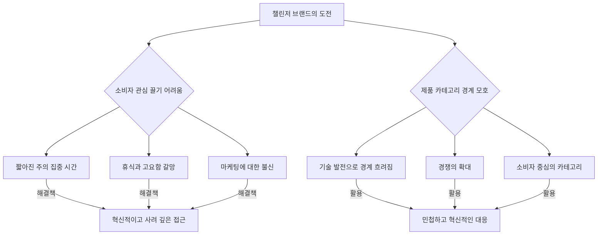

## 1. 큰 물고기를 잡아먹는 작은 물고기: 챌린저 브랜드의 비밀 
이 책은 시장에서 이미 자리를 잡은 큰 기업들(큰 물고기)과 경쟁하며 성장하는 작은 기업들(챌린저 브랜드)의 이야기를 다룬다. 챌린저 브랜드가 어떻게 자신들의 약점을 강점으로 바꾸고, 독특한 전략으로 시장을 뒤흔들며 성공할 수 있는지 그 비법을 알려준다.

### 1.1. 챌린저 브랜드란 무엇일까? 

1. **작은 물고기의 큰 야망**: 챌린저 브랜드는 단순히 시장에서 작은 회사를 말하는 게 아니다. 
  - 가지고 있는 자원(돈, 인력 등)보다 훨씬 큰 목표를 가지고 있는 회사들을 말한다. 
  - 이 목표를 이루기 위해 자원 부족이라는 현실적인 어려움을 기꺼이 받아들이고 해결하려는 의지가 있는 회사들이다. 
2. **다양한 형태의 도전**: 챌린저 브랜드는 여러 가지 방식으로 큰 물고기에 도전할 수 있다. 
  - **경쟁사와의 대결**: 코카콜라에 맞서는 펩시, PC에 맞서는 맥처럼 직접적인 경쟁사와 싸우는 경우다. 
  - **산업 전체에 도전**: 대체육 회사가 기존 육류 산업 전체에 도전하거나, 스마트 온도조절기 회사인 네스트(Nest)가 기존 냉난방 시스템에 새로운 방식을 제시하는 것처럼 산업의 판도를 바꾸려 한다. 
  - **문화적 통념에 도전**: 비누 브랜드인 도브(Dove)가 '아름다움'에 대한 고정관념에 도전하며 다양한 여성의 아름다움을 보여주는 캠페인을 펼치는 것처럼, 사회의 문화적 통념에 맞서는 경우도 있다. 

### 1.2. 왜 챌린저 브랜드가 되어야 할까? 

1. **큰 물고기의 **관성**(惰性)을 깨야 해**: 큰 브랜드는 이미 시장에서 너무나 강력해서, 작은 브랜드가 아무리 좋은 마케팅을 해도 큰 브랜드가 그 공로를 가로채는 경우가 많다. 
  - 예를 들어, 건전지 광고를 보면 사람들은 듀라셀(Duracell) 토끼를 떠올리지만, 실제로는 에너자이저(Energizer) 토끼였다는 이야기가 있다. 
  - 이처럼 큰 브랜드가 만들어 놓은 '블랙홀' 같은 관성을 깨려면, 챌린저 브랜드는 완전히 다르고 독특한 방식으로 접근해야 한다. 
2. **소비자는 더 이상 '소비자'가 아니야**: 요즘 사람들은 광고에 쉽게 넘어가지 않고, 자기 삶에 바쁘다. 
  - 아이들 학교 보내고, 회사에서 승진 걱정하고, 좋아하는 드라마 볼 시간 맞추는 등 자기 일에 바쁜 평범한 사람들이다. 
  - 이들은 광고를 보고 싶어 하지 않기 때문에, 챌린저 브랜드는 사람들의 시선을 사로잡을 만큼 아주 특별하고 눈에 띄는 존재가 되어야 한다. 
3. **소비자는 점점 더 '비합리적'으로 변하고 있어**: 요즘 소비자들은 과거에는 상상할 수 없었던 것들을 동시에 원한다. 
  - 예를 들어, 시속 500마일로 날아가는 비행기 안에서 무료로 엄청 빠른 와이파이를 쓰고 싶어 한다. 
  - 빠른 스포츠카이면서 동시에 친환경적인 차(테슬라처럼)를 원하는 식이다. 
  - 챌린저 브랜드는 이런 '비합리적인' 소비자들의 요구를 가장 먼저 충족시켜주는 역할을 해야 한다. 

### 1.3. 챌린저 브랜드의 8가지 신조(信條) 

챌린저 브랜드는 성공하기 위해 8가지 공통된 행동 양식, 즉 '신조'를 따른다. 이 신조들은 어떤 회사든 적용할 수 있는 반복적인 패턴이다.

1. 지능적인 순진함**(**Intelligent Naivety**)**: 경험이 없다는 것이 오히려 장점이 될 수 있다. 
  - 기존 산업의 관습이나 고정관념에 얽매이지 않고, 신선한 시각으로 '왜 이렇게 해야 하지?'라는 질문을 던진다. 
  - 넷플릭스의 창업자 리드 헤이스팅스나 아마존의 제프 베조스처럼 해당 분야에 직접적인 경험이 없었지만, 새로운 시각으로 시장을 혁신했다. 
  - **사례: 메소드(**Method**) 세제**: 세제 산업 경험이 없던 에릭 라이언은 '왜 세제 용기는 예쁘면 안 될까?'라는 단순한 질문을 던졌다. 
  - 그 결과, 세련된 디자인과 친환경적인 세제를 만들어 미국에서 7번째로 빠르게 성장하는 생활용품 브랜드가 되었다. 
2. 등대 정체성**(**Lighthouse Identity**)**: 브랜드가 무엇을 믿고 어떤 변화를 만들고 싶은지 명확하게 보여주는 것이다. 
  - 단순히 고객이 원하는 것을 따라가는 것이 아니라, 브랜드가 가진 강력한 신념과 가치를 세상에 알리고, 그 가치에 공감하는 사람들을 끌어모은다. 
  - **사례: **캠퍼**(Camper) 신발**: '천천히 걸어라, 뛰지 마라(Walk, Don't Run)'는 슬로건처럼, 느린 삶의 가치를 강조하며 고객들에게 신발 이상의 라이프스타일을 제안한다. 
  - **사례: 애플(Apple)**: 창의성과 독창성을 상징하며, 애플 제품을 사용하는 것이 곧 자신의 개성과 가치를 표현하는 수단이 된다. 
3. **모멘텀(**Momentum**)**: 챌린저 브랜드는 끊임없이 새로운 것을 시도하고, 사람들의 기대를 뛰어넘으며 흥미를 유발해야 한다. 
  - 마치 응원하고 싶은 약자처럼, 다음에는 무엇을 할지 궁금하게 만들고, 항상 한 발 앞서 나가는 모습을 보여준다. 
4. 소비자 통찰**(Consumer Insight)**: 고객의 겉모습(나이, 성별 등)을 넘어, 그들의 마음속 깊은 곳에 있는 욕구, 동기, 꿈을 이해하는 것이다. 
  - 마치 인류학자처럼 고객의 행동을 관찰하고 연구하여 숨겨진 진실을 찾아내고, 이를 통해 고객에게 진정으로 의미 있는 메시지를 전달한다. 
5. **차별점(**Points of Difference**)**: 혼잡한 시장에서 우리 브랜드가 왜 특별하고, 무엇이 다른지 명확하게 보여주는 것이다. 
  - 단순히 더 좋은 기능이나 싼 가격을 넘어, 고객에게 잊을 수 없는 특별한 경험을 제공해야 한다. 
  - **사례: 고프로(GoPro)**: 단순히 카메라를 파는 것이 아니라, 모험과 탐험, 숨 막히는 순간을 포착하는 라이프스타일을 제안하며 차별화에 성공했다. 
6. 가치** 창조(Creating Value)**: 고객에게 진정으로 가치 있는 것을 제공하는 것이다. 
  - 단순히 남들과 다르기 위해 다른 것이 아니라, 고객의 문제를 해결하고, 필요를 충족시키며, 삶을 더 풍요롭게 만들어주는 해결책을 제공해야 한다. 
  - **사례: 와비파커(Warby Parker)**: 비싼 안경 시장에서 고품질의 세련된 안경을 합리적인 가격에 제공하며, 안경 구매 경험 자체를 혁신했다. 
7. **문화와 가치(Culture and Values)**: 챌린저 브랜드는 기업 내부의 문화와 가치를 명확히 하고, 이를 통해 직원과 고객 모두에게 영감을 주어야 한다. 
  - 기업의 핵심 가치를 빠르게 정립하고, 이를 바탕으로 '해적 정신(Pirate Inside)'처럼 기존 질서에 도전하는 문화를 만든다. 
8. **상징의 활용(Use of Powerful **Symbols**)**: 강력한 상징이나 행동을 통해 소비자의 고정관념을 깨고, 브랜드에 대한 인식을 재평가하게 만든다. 
  - **사례: **타겟**(Target)과 **마이클 그레이브스: 저렴한 이미지가 강했던 타겟이 유명 건축가 마이클 그레이브스와 협업하여 디자이너 제품 라인을 선보였다. 
  - 이 제품들이 휘트니 미술관에 전시되면서, 타겟은 '싸구려'라는 인식을 깨고 세련된 브랜드로 재평가받았다. 

### 1.4. 챌린저 브랜드의 4가지 핵심 전략 

챌린저 브랜드가 성공하기 위해 반복적으로 사용하는 4가지 핵심 전략이 있다.

1. 지능적인 순진함**(**Intelligent Naivety**)을 받아들여**: 기존 시장의 규칙에 얽매이지 않고, 새로운 시각으로 카테고리를 바라본다. 
  - 새로운 선택 기준** 제시**: 큰 물고기가 정해놓은 규칙으로는 이길 수 없으니, 완전히 새로운 선택 기준을 제시해야 한다. 
  - **사례: 와비파커(Warby Parker)**: 안경이 왜 그렇게 비싼지 의문을 제기하며, '집에서 안경 5개 써보기' 같은 새로운 구매 방식을 도입했다. 
  - 이들은 안경 산업에 경험이 없었기에 이런 '바보 같은' 질문을 던질 수 있었다. 
  - **사례: 브루독(BrewDog)**: 2007년 스코틀랜드에서 '왜 영국 맥주는 스텔라나 하이네켄밖에 없을까?'라는 불만에서 시작했다. 
  - 기존 맥주 시장의 '지루하고 맛없는' 맥주에 대한 분노가 새로운 맥주를 만들게 된 계기가 되었다. 
2. **카테고리의 '생각 리더(**Thought Leader**)'가 되어라**: 시장에서 가장 큰 회사가 아니라, 가장 혁신적인 아이디어를 가진 회사가 되어야 한다. 
  - **기존 관습을 전략적으로 깨부수기**: 은행, 항공사 등 각 산업에는 고유한 마케팅 방식이 있는데, 챌린저 브랜드는 이런 관습을 뒤집고 완전히 다른 방식으로 접근한다. 
  - **세상에 '주목하라!'고 외치기**: 단순히 무작위로 관습을 깨는 것이 아니라, 강력한 신념과 변화를 만들겠다는 의지를 가지고 행동한다. 
  - **사례: 브루독(BrewDog)**: 세상에서 가장 독한 맥주를 만들고, 죽은 동물 박제에 맥주를 담거나, 올림픽 금지 약물로 맥주를 만드는 등 기상천외한 방식으로 미디어의 주목을 받았다. 
  - 이런 행동들은 단순히 홍보를 넘어, '맥주는 하이네켄이나 스텔라로 끝나지 않는다'는 메시지를 전달하고, 사람들에게 새로운 맥주에 대한 인식을 심어주었다. 
  - 챌린저 브랜드에게 가장 큰 위험은 '거절'이 아니라 '무관심'이기 때문에, 사람들의 관심을 끌기 위해 '비합리적'인 행동도 서슴지 않는다. 
3. **'**등대 정체성**(**Lighthouse Identity**)'으로 신념을 보여줘**: 브랜드가 무엇을 믿고, 어떤 괴물(문제)과 싸우고 있는지 명확하게 밝힌다. 
  - **'우리는 \_\_\_이고, \_\_\_를 믿는다'**: 이 문장을 통해 브랜드의 정체성과 신념을 세상에 선언한다. 
  - **도브(Dove)**: "우리는 도브이고, 아름다움은 모든 형태와 크기에서 온다고 믿으며, 아름다움에 대한 신화를 깨고 있다." 
  - **아우디(Audi)**: "우리는 아우디이고, 럭셔리가 정체되어 있다고 믿으며, 럭셔리는 진보해야 한다." 
  - **버진 아메리카(Virgin America)**: "우리는 버진 아메리카이고, 비행에 다시 화려함을 불어넣을 때라고 믿는다." 
  - **'무엇을 사는가'가 아니라 '무엇에 동참하는가'**: 요즘 소비자들은 단순히 제품을 사는 것을 넘어, 그 브랜드가 가진 가치와 신념에 동참하고 싶어 한다. 
  - 이러한 목적 지향적인 브랜드(Purpose-driven brands)가 지난 10년간 가장 빠르게 성장했다는 연구 결과도 있다. 
4. **'**할 수 있다**(Can-do)'는 정신으로 도전 유지하기**: 챌린저 브랜드는 수많은 '안 되는 이유'에 직면하지만, '우리는 \_\_\_하면 할 수 있다'는 긍정적인 태도로 문제를 해결한다. 
  - 제약** 속에서 창의성 발휘**: 자원 부족이나 기존의 관습 같은 제약 속에서도 창의적인 해결책을 찾아 도전을 계속한다. 
  - **사례: 와비파커(Warby Parker)**: '안경은 온라인으로 팔 수 없다'는 통념에 맞서, '집으로 5개 보내서 써보게 하면 할 수 있다'는 홈 트라이온 프로그램을 만들었다. 
  - **사례: 브루독(BrewDog)**: 2008년 금융 위기 때 자금 조달이 어려워지자, '팬들에게 돈을 빌리면 할 수 있다'는 생각으로 크라우드펀딩(Crowdfunding)을 시작했다. 
  - 이를 통해 4,500만 파운드(약 750억 원)를 모금하고, 미국 오하이오에 양조장을 지을 수 있었다. 

### 1.5. 챌린저 정신을 유지하는 방법 

1. **계속해서 '무엇이 잘못되었나?' 질문하기**: 사업을 처음 시작할 때 가졌던 '지능적인 순진함'을 잃지 않고, 끊임없이 기존 카테고리에 의문을 제기한다. 
  - '왜 이렇게 해야 하지?', '무엇이 우리를 화나게 하는가?' 같은 '바보 같은' 질문을 계속 던진다. 
2. **경쟁사 감사(Audit)하기**: 경쟁사들이 제품, 마케팅 측면에서 무엇을 하는지 분석하고, 우리는 그 반대로 무엇을 할 수 있을지 고민한다. 
3. **다른 카테고리의 '코드' 빌려오기**: 다른 산업에서 성공적인 요소를 가져와 우리 산업에 적용해본다. 
  - **사례: 러쉬(Lush)**: 바디샵(Body Shop)을 떠난 창업자들이 '왜 화장품 매장은 재미없을까?'라는 질문을 던졌다. 
  - 그들은 홀푸드(Whole Foods) 마켓처럼 다채롭고 오감을 자극하는 경험을 화장품 매장에 적용하여 성공했다. 
4. **창업자의 본능 유지하기**: 창업 초기의 도전 정신과 독특한 시각을 잃지 않도록 노력한다. 
  - 모든 카테고리에는 고유한 '관습'이 있지만, 챌린저 브랜드는 이를 깨고 새로운 길을 개척한다. 
  - **사례: 맥 코스메틱(MAC Cosmetics)**: 미용 산업의 '스타 여배우' 모델 관습을 깨고, 드랙퀸(Drag Queen) 루폴(RuPaul)이나 레즈비언 컨트리 가수 같은 파격적인 모델을 기용했다. 
5. **'괴물'을 찾아 이야기 만들기**: 모든 흥미로운 이야기에는 갈등과 긴장, 그리고 '괴물'이 있다. 
  - 해리포터에 볼드모트가 없으면 마법사 흉내 내는 아이들 이야기에 불과하고, 아기 돼지 삼형제에 늑대가 없으면 그냥 숲속 산책 이야기에 불과하다. 
  - 우리 브랜드가 어떤 '괴물'(문제)과 싸우고 있는지 명확히 하고, 그 이야기를 통해 사람들의 공감을 얻는다. 

## 2. 챌린저 브랜드의 원칙, 우리 삶에도 적용될 수 있을까? 

챌린저 브랜드의 원칙들은 비즈니스 세계를 넘어 우리 개인의 삶과 커리어에도 적용될 수 있다.

1. **삶의 '골리앗'에 맞서는 법**: 우리는 살면서 거대한 장애물(골리앗)처럼 느껴지는 문제들에 부딪히곤 한다. 
  - 창의적인 열정을 추구하거나, 어떤 대의를 옹호하거나, 혹은 우리를 가로막는 내면의 한계(내면의 골리앗)에서 벗어나려 할 때도 챌린저 정신이 필요하다. 
  - 챌린저 브랜드의 사고방식은 이런 도전에 맞설 때 회복력과 지략을 발휘하는 데 도움을 줄 수 있다. 
2. **'**지능적인 순진함**'으로 새로운 시작**: 전문가가 아니라는 것이 오히려 큰 장점이 될 수 있다. 
  - 어떤 일에 대해 '초보자의 마음'으로 접근하고, 남들이 당연하게 여기는 '바보 같은' 질문을 던지면서 새로운 돌파구를 찾을 수 있다. 
  - 이는 '정해진 방식'에 얽매이지 않고 호기심을 가지고 새로운 가능성을 탐색할 수 있는 허락과 같다. 
3. **'**등대 정체성**'으로 나만의 **가치** 찾기**: 우리 삶의 핵심 가치, 즉 우리를 이끄는 원칙이 무엇인지 명확히 하는 것이다. 
  - 내가 무엇을 지지하고, 세상에 무엇을 기여하고 싶은지 분명히 알면, 마치 나침반처럼 어려움을 헤쳐나가고 자신에게 충실할 수 있다. 
  - 또한, 같은 가치를 공유하는 사람들을 끌어모아 공동체를 형성하는 데도 도움이 된다. 
4. **'모멘텀'으로 끊임없이 나아가기**: 항상 앞으로 나아가고, 한계를 뛰어넘으며, 위험을 감수하는 자세를 갖는 것이다. 
  - 사업을 운영하지 않더라도, 삶을 모험처럼 여기고 배우고 성장하는 데 열린 마음을 갖는 기업가 정신과 같다. 
5. **'가치 창조'로 긍정적인 영향 주기**: 챌린저 브랜드가 고객에게 가치를 제공하듯이, 우리도 스스로에게 '어떻게 기여할 수 있을까? 어떻게 긍정적인 영향을 줄 수 있을까?'라고 질문할 수 있다. 
  - 이는 직업, 취미, 관계, 지역 사회 활동 등 다양한 방식으로 이루어질 수 있으며, 우리 모두는 변화를 만들 잠재력을 가지고 있다. 

## 3. 챌린저 브랜드가 직면하는 현실적인 어려움 

챌린저 브랜드는 시장에서 성공하기 위해 여러 가지 현실적인 어려움을 극복해야 한다.

1. **소비자의 관심 끌기 어려움**: 현대 사회는 정보 과부하 시대라서 사람들의 주의를 끄는 것이 매우 어렵다. 
  - **짧아진 주의 집중 시간**: 사람들은 끊임없이 스마트폰을 보고, 소셜 미디어를 스크롤하며, 여러 가지 일을 동시에 처리하기 때문에 주의 집중 시간이 점점 짧아지고 있다. 
  - **휴식과 고요함에 대한 갈망**: 바쁜 일상 속에서 사람들은 광고나 방해 없이 조용히 쉬고 싶어 한다. 
  - **마케팅에 대한 불신**: 과거의 기만적인 광고 관행 때문에 마케팅 메시지에 대한 사람들의 신뢰가 크게 떨어졌다. 
  - 한 연구에 따르면, 브랜드에 대한 소비자 신뢰는 1997년 50% 이상에서 2006년 25% 수준으로 급락했다. 
  - 이러한 환경에서 챌린저 브랜드는 혁신적이고 사려 깊은 접근 방식으로 소비자의 관심을 사로잡고 신뢰를 구축해야 한다. 
2. **제품 카테고리의 경계가 모호해짐**: 과거에는 제품 카테고리가 명확했지만, 기술 발전으로 그 경계가 흐려지고 있다. 
  - **경쟁의 확대**: 예를 들어, 아이폰은 단순히 전화기가 아니라 카메라, 웹 브라우저, 엔터테인먼트 시스템의 역할도 한다. 
  - 따라서 아이폰 회사는 다른 스마트폰 회사뿐만 아니라 니콘(Nikon)이나 캐논(Canon) 같은 카메라 회사와도 경쟁해야 한다. 
  - **소비자 중심의 카테고리**: 이제 제품 카테고리는 기업이 정하는 것이 아니라, 소비자들이 제품을 어떻게 사용하는지에 따라 달라진다. 
  - 챌린저 브랜드는 이러한 변화를 받아들이고, 제품이 전통적인 분류를 벗어날 수 있다는 점을 활용하여 민첩하고 혁신적으로 시장에 대응해야 한다. 

