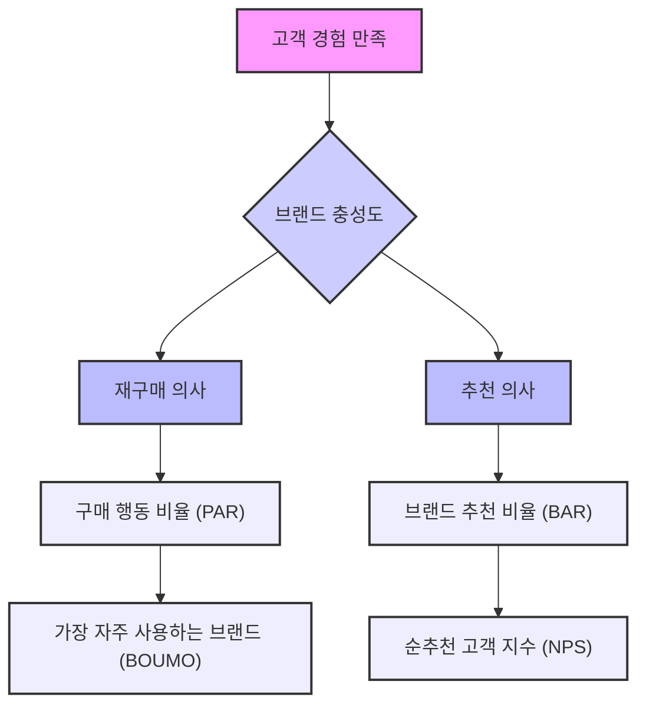
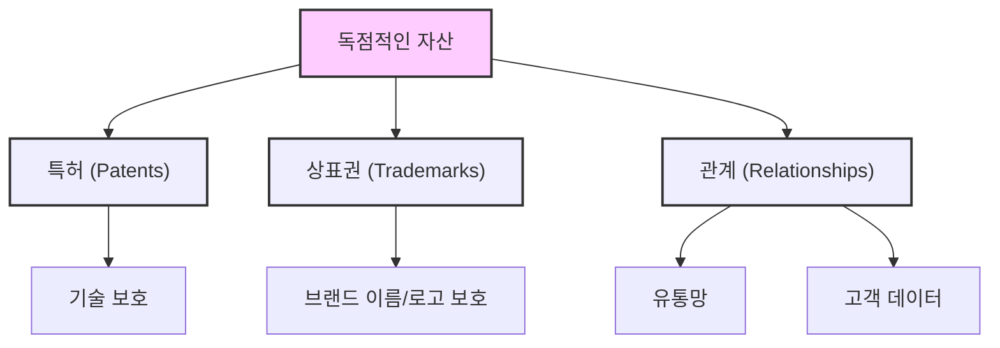

## 데이비드 아커의 '브랜드 에쿼티 관리' 요약
이 책은 브랜드가 어떻게 경쟁에서 이기고 돈을 더 많이 벌 수 있는지 알려주는 책이야. 데이비드 아커라는 사람이 쓴 책인데, 이 사람은 마케팅의 아버지라고 불리는 필립 코틀러처럼 '현대 브랜딩의 아버지'라고 불리는 대단한 사람이야. 이 책에서는 브랜드가 얼마나 가치 있는지, 그리고 그 가치를 어떻게 키우고 관리하는지 5가지 중요한 요소(브랜드 충성도, 인지도, 인지된 품질, 브랜드 연상, 그리고 특허 같은 독점적인 것들)를 통해 설명해 줄 거야. 

## 1. 브랜드 에쿼티란 무엇일까? 

브랜드 에쿼티는 쉽게 말해 '브랜드의 가치'를 숫자로 나타낸 거라고 보면 돼. 우리가 어떤 물건을 관리하려면 그게 얼마나 좋은지, 나쁜지 알아야 하잖아? 마치 키를 재야 키가 컸는지 알 수 있는 것처럼 말이야.  브랜드도 똑같아. 얼마나 가치 있는지 측정해야 잘 관리할 수 있거든. 데이비드 아커는 이 브랜드 에쿼티를 5가지 중요한 요소로 나눴어. 

1. 브랜드 인지도** (**Brand Awareness**)**
  1. 사람들이 우리 브랜드를 얼마나 잘 알고 있는지 말하는 거야. 
  2. 예를 들어, "생수 브랜드 아는 거 말해보세요!" 했을 때, 사람들이 '아쿠아', '삼다수'처럼 우리 브랜드를 바로 떠올리는 정도를 말해. 
2. 브랜드 연상** (**Brand Association**)**
  1. 우리 브랜드를 들었을 때 사람들이 어떤 이미지를 떠올리는지 말하는 거야. 
  2. 예를 들어, '레모나' 하면 '비타민C', '피로회복' 같은 걸 떠올리는 것처럼 말이야. 
3. 인지된 품질** (**Perceived Quality**)**
  1. 사람들이 우리 브랜드를 얼마나 좋다고 생각하는지 말하는 거야. 
  2. 실제로 품질이 좋든 나쁘든, 사람들이 '이 브랜드는 품질이 좋아!'라고 느끼는 정도를 말해. 
4. 브랜드 충성도** (**Brand Loyalty**)**
  1. 사람들이 우리 브랜드를 얼마나 꾸준히 좋아하고 계속 사주는지 말하는 거야. 
  2. 한번 사보고 좋아서 계속 우리 브랜드만 찾고, 다른 사람한테도 추천해 주는 걸 말해. 
5. **독점적인 자산 (**Proprietary Assets**)**
  1. 특허나 상표권처럼 우리 브랜드만 가지고 있는 특별한 권리들을 말해. 
  2. 이런 것들이 있으면 다른 회사들이 우리 브랜드를 함부로 따라 할 수 없어서 우리 브랜드 가치를 더 높여줘.

## 2. 브랜드 인지도를 높이는 방법 

브랜드 인지도는 사람들이 우리 브랜드를 얼마나 잘 알고 있는지를 말하는 거야. 마치 학교에서 친구들 이름을 얼마나 많이 아는지랑 비슷하다고 보면 돼.  인지도는 그냥 '안다'는 것만으로는 부족하고, 여러 단계가 있어.

1. **인지도의 4가지 단계** 
  1. **맨 위 (**Top of Mind**, TOM)** 
  - 어떤 제품 종류를 말했을 때, 사람들이 가장 먼저, 그리고 저절로 떠올리는 브랜드야.
  - 예를 들어, "생수 브랜드 뭐 아세요?" 했을 때, "아쿠아!" 하고 바로 나오는 게 TOM이야.
  2. **떠올리는 브랜드 (**Brand Recall**)** 
  - TOM 다음으로 저절로 떠올리는 브랜드들이야.
  - "아쿠아 다음엔 삼다수, 그다음엔 아이시스..." 이렇게 순서대로 떠올리는 것들이지.
  - 보통 사람들은 한 종류에서 7~9개 정도의 브랜드를 떠올릴 수 있다고 해. 
  3. **알아보는 브랜드 (**Brand Recognition**)** 
  - 사람들이 먼저 말하지는 못해도, 우리가 "오아시스라는 생수 아세요?" 하고 물어보면 "아, 그거요! 알아요!" 하고 알아보는 브랜드야.
  - 마치 친구 이름을 바로 말하진 못해도, 사진을 보여주면 "아, 이 친구 알아!" 하는 것과 비슷해.
  4. **전혀 모르는 브랜드 (**Unaware of Brand**)** 
  - 이름을 말해줘도 "전혀 모르겠는데요?" 하는 브랜드야.
  - 이 단계에 있는 브랜드는 사람들이 아예 모르는 상태라고 보면 돼.
2. **인지도를 높이는 전략** 
  1. **반복해서 보여주기** 
  - 사람들이 우리 브랜드를 계속 보고 듣게 해야 해.
  - 광고를 자주 하거나, 여러 곳에 우리 브랜드 이름을 노출시키는 거지.
  2. **기억에 남는 요소 만들기** 
  - 특별한 슬로건이나 노래(징글)를 만들어서 사람들이 쉽게 기억하게 해.
  - 예를 들어, "침대는 과학입니다" 같은 슬로건처럼 말이야.
  3. **상징적인 이미지 만들기** 
  - 애플의 한입 베어 문 사과처럼, 우리 브랜드를 대표하는 그림이나 로고를 만드는 거야.
  4. **홍보 활동하기** 
  - 뉴스에 나오거나, 사람들이 우리 브랜드에 대해 이야기하게 만드는 거지.
  5. **행사 후원하기** 
  - 스포츠 경기나 콘서트 같은 행사를 후원해서 우리 브랜드를 알리는 거야.
  6. **브랜드 확장하기** 
  - 우리 브랜드 이름을 다른 제품에도 사용해서 더 많은 사람에게 알리는 거지.

## 3. 브랜드 연상을 만드는 방법 

브랜드 연상은 사람들이 우리 브랜드를 들었을 때 저절로 떠올리는 생각이나 이미지를 말해. 마치 '코카콜라' 하면 '시원함', '즐거움' 같은 걸 떠올리는 것처럼 말이야.  이런 연상은 우리 브랜드를 다른 브랜드와 다르게 만들고, 사람들이 우리 제품을 사고 싶게 만드는 중요한 역할을 해. 

1. **브랜드 연상의 종류** 
  1. **제품 특징 (**Product Attributes**)**
  - "이건 달콤한 맛이 나는 생수야!" (예: 레몬 맛 생수)처럼 제품 자체의 특징을 떠올리는 거야.
  2. **고객 혜택 (Customer Benefits)**
  - "이걸 쓰면 피부가 좋아져!"처럼 제품을 사용했을 때 얻는 좋은 점을 떠올리는 거지.
  3. **상대적인 가격 (**Relative Price**)**
  - "이 브랜드는 좀 비싸지만 고급스러워" 또는 "이 브랜드는 싸고 가성비가 좋아"처럼 가격과 관련된 이미지를 떠올리는 거야.
  4. **사용자 또는 고객 (User or Customer)**
  - "이 브랜드는 젊은 사람들이 많이 써"처럼 누가 이 제품을 사용하는지를 떠올리는 거지.
  5. **유명인 또는 홍보대사 (Celebrities/**Spokespersons**)**
  - "이 제품은 BTS가 광고하는 거야!"처럼 유명인이 떠오르는 경우야.
  6. **생활 방식 또는 개성 (Lifestyle/Personality)**
  - "이 브랜드는 자유롭고 모험적인 사람들을 위한 거야"처럼 특정 생활 방식이나 성격을 떠올리는 거지.
  7. **제품 종류 (Product Class)**
  - "이 브랜드는 스마트폰을 만드는 회사야"처럼 어떤 종류의 제품을 만드는지 떠올리는 거야.
  8. **경쟁사 (Competitors)**
  - "이 브랜드는 삼성폰이랑 경쟁하는 회사야"처럼 경쟁 브랜드를 떠올리는 경우도 있어.
  9. **지리적 영역 (Geographical Area)**
  - "이 브랜드는 프랑스에서 온 고급 와인이야"처럼 특정 지역을 떠올리는 거지.
2. **브랜드 연상을 효과적으로 만드는 방법** 
  1. **브랜드 포지셔닝과 일치시키기**
  - 우리가 "우리 브랜드는 친환경적이야!"라고 말하면, 사람들이 실제로 우리 브랜드를 친환경적이라고 떠올리게 해야 해.
  - 이게 잘 되면 브랜드 연상이 잘 만들어진 거라고 볼 수 있어.
  2. **너무 많은 특징을 내세우지 않기** 
  - 이것도 좋고 저것도 좋다고 너무 많은 특징을 강조하면 사람들이 혼란스러워할 수 있어.
  - 몇 가지 핵심적인 특징에 집중해서 명확한 이미지를 만드는 게 중요해.
  3. 브랜드 정체성 시스템** 활용하기** 
  - 우리 브랜드가 어떤 제품인지, 어떤 회사인지, 어떤 사람들을 위한 것인지, 어떤 상징을 가지고 있는지 명확하게 정하고, 이걸 모든 홍보 활동에 일관되게 담아내는 거야.
  - 테슬라가 '혁신'과 '지속 가능성'을 계속 강조해서 사람들이 테슬라 하면 이 두 가지를 떠올리게 하는 것처럼 말이야.

## 4. 인지된 품질을 높이는 방법 

인지된 품질은 사람들이 우리 제품이나 서비스가 얼마나 좋다고 생각하는지를 말해. 실제로 품질이 아주 좋지 않아도, 사람들이 '이 브랜드는 믿을 수 있어!'라고 느끼게 만드는 게 중요해.  마치 어떤 식당이 엄청나게 맛있지는 않아도, '이 식당은 항상 깨끗하고 친절해'라고 느끼면 좋은 식당이라고 생각하는 것과 비슷해. 

1. **인지된 품질의 중요성** 
  1. **구매 결정에 영향**
  - 사람들이 물건을 살지 말지 결정할 때, 품질이 좋다고 생각하면 더 쉽게 구매해.
  2. **가격과 위치 결정**
  - 품질이 좋다고 생각하면 더 비싸게 팔 수도 있고, 시장에서 더 좋은 위치를 차지할 수 있어.
  - '프리미엄', '고급', '가성비' 같은 이미지를 만드는 데 영향을 줘.
2. **인지된 품질을 측정하는 방법** 
  1. **점수 매기기**
  - 사람들에게 "이 제품의 품질에 몇 점을 주시겠어요?" 하고 물어보는 거야.
  - 5점 척도나 10점 척도처럼 점수를 매기게 해서 객관적으로 측정할 수 있어.
  2. **경쟁사와 비교**
  - 우리 브랜드만 측정하는 게 아니라, 경쟁사 브랜드의 품질도 함께 측정해야 해.
  - 우리 브랜드가 8점이라고 좋아할 게 아니라, 경쟁사가 9.5점이면 우리가 더 노력해야 한다는 걸 알 수 있지. 
3. **제품 품질과 서비스 품질** 
  1. **제품 품질 (Product **Quality**)**
  - 제품이 얼마나 잘 작동하는지 (성능), 어떤 기능이 있는지 (기능), 얼마나 오래 쓸 수 있는지 (내구성) 같은 것들을 측정해. 
  - 예를 들어, 생수라면 '맛', '깨끗함' 같은 걸 측정하고, 스마트폰이라면 '카메라 성능', '배터리 수명' 같은 걸 측정하는 거지. 
  2. **서비스 품질 (Service Quality)**
  - 서비스는 눈에 보이지 않기 때문에 '신뢰성', '확신', '유형성', '공감', '반응성' 같은 요소들을 측정해 (이걸 'RATER'라고 불러). 
  - 예를 들어, 콜센터 직원이 얼마나 친절하게 응대하는지, 문제가 생겼을 때 얼마나 빨리 해결해 주는지 같은 것들을 측정하는 거야.
4. **인지된 품질을 높이는 전략** 
  1. **실제 제품/서비스 개선** 
  - 아무리 홍보를 잘해도 제품 자체가 나쁘면 소용없어.
  - 실제로 좋은 제품과 서비스를 제공해서 사람들이 직접 경험하고 '진짜 좋네!'라고 느끼게 해야 해.
  2. **품질 문화 만들기** 
  - 회사 전체가 품질을 가장 중요하게 생각하고, 모든 직원이 품질 향상을 위해 노력하는 문화를 만드는 거야.
  3. **고객 의견 듣기** 
  - 고객들이 무엇을 원하는지, 어떤 점이 불편한지 계속 물어보고 개선해야 해.
  4. **성과 측정 및 직원 격려** 
  - 품질 개선 노력이 얼마나 효과가 있었는지 측정하고, 잘한 직원들에게 보상해서 더 열심히 하게 만드는 거지.
  5. **기대치 높이기** 
  - 우리 제품이 얼마나 좋은지 계속 알려서 고객들이 더 높은 기대를 가지게 만드는 거야.
  6. **보증 제도 활용** 
  - "만족하지 못하면 100% 환불!"처럼 확실한 보증을 제공해서 고객들이 안심하고 구매하게 해.
  - 보증은 쉽고, 조건 없이, 이해하기 쉬워야 해.
  7. **가격으로 품질 암시** 
  - 특히 저렴한 소비재의 경우, 가격이 품질을 나타내는 지표가 될 수 있어.
  - 너무 싸게만 팔면 품질이 안 좋다고 생각할 수도 있거든.

## 5. 브랜드 충성도를 높이는 방법 

브랜드 충성도는 고객들이 우리 브랜드를 얼마나 꾸준히 좋아하고 계속해서 구매하며, 심지어 다른 사람에게 추천까지 하는지를 말해.  마치 좋아하는 연예인이 있으면 그 연예인 나오는 드라마는 꼭 보고, 친구들한테도 "이 드라마 꼭 봐!" 하고 추천하는 것과 비슷하다고 보면 돼. 

1. **브랜드 충성도의 두 가지 핵심 요소** 
  1. **재구매 의사 (Buy Again)**
  - "다음에 또 이 제품을 사시겠어요?" 하고 물었을 때 "네!"라고 대답하는 거야.
  - 이전에 사용해보고 만족했기 때문에 다시 구매하고 싶어 하는 마음이지. 
  2. **추천 의사 (Recommend)**
  - "이 제품을 다른 사람에게 추천하시겠어요?" 하고 물었을 때 "네!"라고 대답하는 거야.
  - 다른 사람에게 추천한다는 건 그만큼 우리 브랜드를 깊이 신뢰하고 있다는 뜻이야. 왜냐하면 추천했다가 친구가 실망하면 나도 민망하잖아? 
2. **충성도의 5가지 단계** 
  1. **스위처 (**Switchers**)**
  - 가격이 싸거나 편하면 언제든지 다른 브랜드로 갈아탈 준비가 되어 있는 고객이야.
  2. **습관적인 구매자 (**Habitual Buyers**)**
  - 다른 대안을 적극적으로 찾아보지는 않지만, 특별한 이유가 생기면 바꿀 수도 있는 고객이야.
  3. 만족한 구매자** (Satisfied Buyers)**
  - 우리 브랜드에 만족하지만, 다른 브랜드에서 더 좋은 조건을 제시하면 바꿀 가능성이 있는 고객이야.
  4. **친구 (Friends)**
  - 우리 브랜드를 즐겨 사용하고 좋아하지만, 아직 '이 브랜드가 나를 정의한다'고까지는 생각하지 않는 고객이야.
  5. **헌신적인 고객 (Committed Customers)**
  - 우리 브랜드가 마치 자기 자신을 나타내는 것처럼 생각하고, 어떤 상황에서도 우리 브랜드를 떠나지 않는 가장 충성스러운 고객이야.
3. **브랜드 충성도를 측정하는 방법** 
  1. **5A **고객 경로** (5A Customer Path)** 
  - 사람들이 제품을 알게 되고(Aware), 관심을 가지고(Appeal), 정보를 찾아보고(Ask), 구매하고(Act), 마지막으로 추천하는(Advocate) 5단계 과정을 말해.
  - 이 중에서 '구매(Act)'와 '추천(Advocate)'이 바로 브랜드 충성도를 나타내는 부분이야.
  2. 구매 행동 비율** (Purchase Action Ratio, PAR)** 
  - 우리 브랜드를 아는 사람 중에서 실제로 구매한 사람이 얼마나 되는지 비율로 나타내는 거야.
  - 예를 들어, 100명이 우리 브랜드를 아는데 30명이 샀다면, PAR은 30%가 되는 거지.
  3. **가장 자주 사용하는 브랜드 (**Brand Used Most Often**, BOUMO)** 
  - 여러 브랜드 중에서 고객이 가장 자주 사용하는 브랜드가 무엇인지 물어보는 거야.
  - 예를 들어, 여러 생수를 마시지만 '아쿠아'를 가장 자주 마신다면, 아쿠아가 BOUMO가 되는 거지.
  4. **브랜드 추천 비율 (Brand Advocacy Ratio, BAR)** 
  - 우리 브랜드를 아는 사람 중에서 다른 사람에게 추천하는 사람이 얼마나 되는지 비율로 나타내는 거야.
  - 100명이 우리 브랜드를 아는데 20명이 추천한다면, BAR은 20%가 되는 거지.
  5. **순추천 고객 지수 (**Net Promoter Score**, NPS)** 
  - "이 브랜드를 다른 사람에게 얼마나 추천하시겠어요?" 하고 0점부터 10점까지 점수를 매기게 해서 충성도를 측정하는 방법이야.
4. **브랜드 충성도를 높이는 전략** 
  1. **훌륭한 **고객 경험** 제공 (**Customer Experience**)** 
  - 고객이 우리 브랜드와 만나는 모든 순간(매장 직원, 콜센터, 웹사이트 등)에 만족감을 느끼게 해야 해.
  - 고객이 행복하고 만족하면 다시 찾아오고, 다른 사람에게도 추천하게 될 거야.
  2. **기존 고객 유지에 집중** 
  - 새로운 고객을 유치하는 것보다 기존 고객을 유지하는 것이 훨씬 쉽고 비용도 적게 들어.
  - 기존 고객이 만족하면 그들이 새로운 고객을 데려오기도 해.
  3. **고객에게 가치 제공** 
  - 고객이 우리 제품이나 서비스를 통해 얻는 가치가 크다고 느끼게 해야 해.
  4. **충성도에 대한 보상** 
  - 오랫동안 우리 브랜드를 사용해 준 고객들에게 특별한 할인이나 혜택을 제공해서 고마움을 표현하는 거야.
  5. **고객과 가까이 지내기** 
  - 고객의 목소리에 귀 기울이고, 그들의 필요를 이해하려고 노력해야 해.

## 6. 브랜드 에쿼티를 구성하는 독점적인 자산 

독점적인 자산은 우리 브랜드만 가지고 있는 특별한 권리나 강점들을 말해. 마치 나만 가지고 있는 특별한 보물 지도나 비밀 레시피 같은 거라고 보면 돼.  이런 자산들은 다른 회사들이 우리 브랜드를 쉽게 따라 하지 못하게 만들어서 우리 브랜드의 가치를 더욱 높여줘.

1. **특허 (**Patents**)**
  1. 우리 브랜드가 개발한 특별한 기술이나 제품에 대해 정부가 주는 독점적인 권리야.
  2. 다른 회사들은 이 특허가 없으면 우리 기술을 함부로 사용할 수 없어.
2. **상표권 (Trademarks)**
  1. 우리 브랜드의 이름, 로고, 디자인 같은 것을 다른 회사들이 사용하지 못하게 보호해 주는 권리야.
  2. 이것 덕분에 사람들이 우리 브랜드를 다른 브랜드와 헷갈리지 않고 쉽게 알아볼 수 있어.
3. **관계 (Relationships)**
  1. 고객들과의 좋은 관계, 유통 업체들과의 튼튼한 관계, 그리고 우리 브랜드에 대한 중요한 정보나 데이터 같은 것들을 말해.
  2. 이런 관계들은 우리 브랜드가 시장에서 더 강한 위치를 차지하고, 새로운 기회를 만드는 데 도움을 줘.

## 7. 효과적인 브랜드 포지셔닝과 이름, 상징, 슬로건의 힘 

브랜드 포지셔닝은 우리 브랜드가 고객의 마음속에 어떤 특별한 위치를 차지하게 할지 정하는 거야. 마치 운동장에서 내가 어떤 포지션(공격수, 수비수)을 맡을지 정하는 것과 비슷하다고 보면 돼.  그리고 우리 브랜드의 이름, 상징, 슬로건은 이 포지셔닝을 사람들에게 잘 알리는 데 아주 중요한 역할을 해.

1. **효과적인 브랜드 포지셔닝** 
  1. **경쟁사와 차별화**
  - 다른 브랜드들과는 다른 우리 브랜드만의 특별한 점을 강조해야 해.
  - 예를 들어, 다른 생수들이 다 비슷할 때, "이 생수는 미네랄이 풍부해요!"처럼 특별한 점을 내세우는 거지.
  2. **가격 포지셔닝** 
  - 우리 제품이 다른 제품들과 비교했을 때 어떤 가격대에 위치할지 정하는 거야.
  - 너무 비싸지도 싸지도 않게, 적절한 가격으로 고객에게 가치를 전달해야 해.
  3. **사용 목적 또는 타겟 고객** 
  - "이 제품은 운동하는 사람들을 위한 거야!" 또는 "이건 아침 식사 대용으로 딱이야!"처럼 특정 사용 목적이나 고객층을 정해서 포지셔닝할 수 있어.
  4. **고객 기대치 이해** 
  - 고객들이 우리 브랜드에 무엇을 기대하는지 정확히 이해하고, 그 기대에 맞춰 포지셔닝해야 해.
2. **회사 이름의 중요성** 
  1. **브랜드의 정체성**
  - 회사 이름은 우리 브랜드의 얼굴이자 정체성이라고 할 수 있어.
  - 한번 정하면 바꾸기 어렵고, 바꾸면 고객들이 혼란스러워할 수 있어. 
  2. **기억하기 쉽고 단순하게** 
  - 애플(Apple)처럼 짧고 기억하기 쉬운 이름이 좋아.
  3. **경쟁사와 다르게** 
  - 다른 회사 이름과 헷갈리지 않게 독특한 이름을 만들어야 해.
  4. **감정을 불러일으키고 메시지를 담기** 
  - 이름만 들어도 좋은 느낌이 들거나, 우리 브랜드의 특징을 알 수 있는 이름이 좋아.
  - 예를 들어, '조이(Joy)'라는 이름은 기쁨을 떠올리게 하잖아.
  5. **법적으로 사용 가능하고 독특해야 함** 
  - 다른 회사가 이미 사용하고 있는 이름은 쓸 수 없으니, 법적으로 문제가 없는지 확인해야 해.
3. **상징과 슬로건의 힘** 
  1. **상징 (**Symbols**)** 
  - 애플의 한입 베어 문 사과처럼, 우리 브랜드를 대표하는 그림이나 로고를 말해.
  - 이런 상징은 사람들이 우리 브랜드를 쉽게 기억하고, 좋은 이미지를 떠올리게 해.
  - 기하학적인 모양, 제품 포장, 만화 캐릭터 등 다양한 형태가 될 수 있어.
  2. 슬로건** (Slogans)** 
  - "Just Do It"처럼 우리 브랜드의 핵심 메시지를 짧고 강렬하게 전달하는 문구를 말해.
  - 슬로건은 상징보다 유연해서 시간이 지나면서 바꿀 수도 있어.
  - 기억하기 쉽고, 구체적이며, 우리 브랜드와 잘 연결되는 슬로건이 좋아.
  - 예를 들어, 아메리칸 익스프레스의 "Don't leave home without it" (집을 떠날 때 꼭 챙겨라)처럼 긴급함과 필요성을 느끼게 하는 슬로건이 있어.

