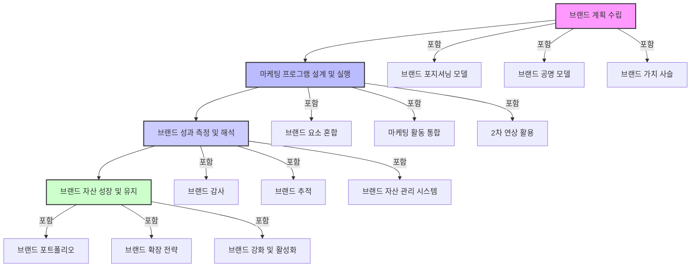

## 켈러의 전략적 브랜드 관리: 우리 브랜드 똑똑하게 키우는 법
이 책은 케빈 레인 켈러 교수가 쓴 '전략적 브랜드 관리'라는 책의 내용을 쉽게 풀어낸 요약본이야. 브랜드가 뭔지, 어떻게 하면 브랜드를 튼튼하게 만들고, 잘 관리해서 오랫동안 사랑받게 할 수 있는지 알려주는 책이라고 보면 돼. 마치 우리 아이를 잘 키우는 육아법처럼, 브랜드를 성공적으로 키우는 비법을 알려주는 책이야. 

## 1. 브랜드와 브랜드 관리: 이름표 이상의 의미 

브랜드는 그냥 이름이나 로고가 아니야. 마치 친구의 이름표가 그 친구의 성격이나 약속을 담고 있듯이, 브랜드는 제품이나 서비스가 소비자에게 주려는 약속과 가치를 담고 있는 거야. 

1. **브랜드의 역할**:
  1. 차별화: 시장에 비슷한 제품이 너무 많잖아? 그럴 때 우리 제품을 다른 제품과 다르게 보이게 해주는 중요한 도구야. 
  2. **위험 감소**: 소비자들이 물건을 살 때 '이거 괜찮을까?' 하고 걱정하잖아. 브랜드는 그런 걱정을 줄여주고 믿음을 주는 역할을 해. 
  3. **신뢰와 충성심**: 한 번 좋았던 브랜드는 계속 찾게 되잖아? 그게 바로 신뢰와 충성심을 키워주는 거야. 
2. **브랜드 관리의 변화**:
  1. 옛날에는 제품 자체에만 집중했다면, 이제는 소비자들이 브랜드를 어떻게 생각하는지에 더 신경 쓰는 방향으로 바뀌었어. 
  2. 브랜드는 단순히 회사 자산이 아니라, 소비자들이 물건을 고를 때 아주 중요한 영향을 미치는 요소가 된 거지. 
  3. 그래서 효과적인 브랜드 관리는 소비자들이 브랜드를 어떻게 인식하는지 잘 이해하고, 마케팅 활동을 통해 이런 인식을 좋게 만들어가는 과정이라고 보면 돼. 

## 2. 브랜드 자산 (Brand Equity): 브랜드의 숨겨진 힘 

브랜드 자산은 마치 친구가 가진 '인기'나 '좋은 평판' 같은 거야. 브랜드가 좋으면 사람들이 그 브랜드를 더 좋아하고, 더 많이 찾게 되잖아? 그게 바로 브랜드 자산이야. 

1. **브랜드 자산의 두 기둥**:
  1. 브랜드 인지도** (**Brand Awareness**)**: 사람들이 우리 브랜드를 얼마나 잘 알고 있는지 말하는 거야.
  - 물건을 살 때 우리 브랜드가 가장 먼저 떠오르면 좋겠지? 그게 바로 높은 브랜드 인지도의 중요성이지. 
  - 광고, 후원, 홍보 같은 활동으로 브랜드 인지도를 높일 수 있어. 
  2. 브랜드 이미지** (**Brand Image**)**: 사람들이 우리 브랜드에 대해 어떤 생각을 가지고 있는지 말하는 거야.
  - 제품 품질처럼 기능적인 생각일 수도 있고, 브랜드의 성격처럼 감성적인 생각일 수도 있어. 
  - 브랜드의 위치를 잘 정하고 (포지셔닝), 메시지를 잘 전달하고, 특별한 경험을 제공해서 브랜드 이미지를 좋게 만들 수 있어. 
2. **고객 기반 **브랜드 자산** (**Customer-Based Brand Equity**, CBBE)**:
  1. 이건 소비자의 입장에서 브랜드가 어떤 가치를 만들어내는지 이해하는 데 초점을 맞춘 개념이야. 
  2. 켈러는 소비자들이 브랜드에 대해 긍정적인 생각과 좋은 경험을 할 때 강력한 브랜드 자산이 만들어진다고 말해. 

## 3. 브랜드 포지셔닝 (Brand Positioning): 소비자 마음속에 자리 잡기 

브랜드 포지셔닝은 마치 친구들 사이에서 '나는 이런 사람이야!' 하고 자기만의 자리를 잡는 것과 같아. 우리 브랜드가 소비자들의 마음속에 특별하고 가치 있는 자리로 기억되도록 만드는 과정이지. 

1. **포지셔닝의 중요성**:
  1. 브랜드 포지셔닝은 소비자들이 우리 브랜드를 어떻게 인식하는지에 직접적인 영향을 주기 때문에, 브랜드 자산을 쌓는 데 아주 중요해. 
2. **두 가지 핵심 요소**:
  1. **공통점 (**Points of Parity**, POP)**: 우리 브랜드가 경쟁 브랜드들과 공유하는 특징이나 장점이야.
  - 예를 들어, 스마트폰이라면 '전화가 잘 터진다' 같은 기본적인 기능은 다 갖춰야 하잖아? 이런 게 공통점이야. 
  - 이건 소비자들이 그 제품 카테고리에 대해 기대하는 기본적인 조건을 충족시켜주는 역할을 해. 
  2. 차별점** (**Points of Difference**, POD)**: 우리 브랜드만이 가지고 있는 독특한 특징이나 장점이야.
  - 예를 들어, 어떤 스마트폰은 '카메라 기능이 압도적으로 좋다'거나 '디자인이 특별하다' 같은 점이 차별점이 될 수 있어. 
  - 이런 차별점은 목표 고객들에게 의미 있고 매력적이어야 해. 
3. **성공적인 포지셔닝을 위한 조건**:
  1. 소비자들이 무엇을 필요로 하고 원하는지, 그리고 경쟁 브랜드들은 어떤지 깊이 이해해야 해. 
  2. 브랜드 포지셔닝은 모든 마케팅 활동의 방향을 잡아주고, 브랜드가 원하는 이미지와 일관성을 유지하도록 도와주는 역할을 해. 

## 4. 브랜드 요소 (Brand Elements) 선택: 브랜드의 얼굴 만들기 

브랜드 요소는 마치 사람의 이름, 얼굴, 목소리, 옷차림처럼 브랜드를 알아보고 다른 브랜드와 구별하게 해주는 여러 가지 구성 요소들을 말해. 

1. **브랜드 요소의 종류**:
  1. 브랜드 이름, 로고, 상징, 캐릭터, 슬로건, 포장 등이 있어. 
2. 브랜드 요소** 선택 기준**:
  1. **기억하기 쉬워야 해 (Memorability)**: 이름이나 로고가 쉽게 기억나야겠지? 
  2. **의미가 있어야 해 (Meaningfulness)**: 브랜드의 본질을 잘 전달해야 해. 
  3. **호감이 가야 해 (Likability)**: 시각적으로 매력적이거나 듣기 좋아야 해. 
  4. **적용 가능해야 해 (Transferability)**: 다른 제품이나 시장에도 잘 어울려야 해. 
  5. **적응 가능해야 해 (Adaptability)**: 시간이 지나도 변화에 맞춰 유연하게 바뀔 수 있어야 해. 
  6. **보호 가능해야 해 (Protectability)**: 법적으로 보호받을 수 있어야 해. 
3. **브랜드 요소의 역할**:
  1. 브랜드 이름은 기억하기 쉽고 발음하기 쉬우면서 브랜드의 핵심을 전달해야 해. 
  2. 로고나 상징은 시각적으로 매력적이고 바로 알아볼 수 있어야 해. 
  3. 브랜드 캐릭터나 슬로건은 브랜드에 개성과 감성적인 매력을 더할 수 있어. 
  4. 포장은 제품 경험을 좋게 하고 브랜드 메시지를 강화할 수 있지. 
4. **일관성과 유연성**:
  1. 브랜드 요소들은 서로 일관성을 유지해서 통일된 브랜드 정체성을 만들어야 해. 
  2. 하지만 브랜드가 성장하고 시장 상황이 변하면, 브랜드 요소들도 유연하게 진화할 수 있어야 해. 

## 5. 브랜드 자산 구축을 위한 마케팅 프로그램 설계 

브랜드 자산을 튼튼하게 만들려면, 마치 맛있는 요리를 만들 때 여러 재료를 잘 섞는 것처럼, 마케팅 프로그램들을 잘 설계해야 해. 

1. 마케팅 믹스** (Marketing Mix)**:
  1. 켈러는 제품 (Product), 가격 (Price), 유통 (Place), 홍보 (Promotion)라는 네 가지 요소를 마케팅 믹스라고 부르며, 각각이 강력한 브랜드를 만드는 데 어떻게 기여하는지 설명해. 
  2. 성공적인 브랜드 구축의 핵심은 브랜드 포지셔닝과 잘 맞고, 목표 고객들에게 공감을 얻을 수 있는 통합적인 마케팅 프로그램을 만드는 거야. 
2. **각 요소의 역할**:
  1. **제품 (Product)**: 제품의 품질과 혁신은 브랜드 자산을 쌓는 데 아주 중요해. 
  2. **가격 (Price)**: 가격 전략은 브랜드가 가진 가치를 강화하는 데 영향을 줘. 
  3. **유통 (Place)**: 유통 채널 (제품을 파는 곳)은 목표 고객들이 브랜드를 쉽게 접할 수 있도록 신중하게 선택해야 하고, 매장 환경도 브랜드 이미지와 잘 어울려야 해. 
  4. **홍보 (Promotion)**: 광고, 판매 촉진, 홍보, 다이렉트 마케팅 같은 활동들은 브랜드에 대한 긍정적인 인식을 만들고, 소비자들이 브랜드에 참여하도록 유도해야 해. 
  5. 특히 요즘처럼 인터넷이 발달한 세상에서는 디지털 마케팅과 소셜 미디어를 잘 활용하는 것이 브랜드 자산을 쌓는 데 중요하다고 켈러는 강조해. 

## 6. 통합 마케팅 커뮤니케이션 (IMC): 일관된 메시지 전달 

통합 마케팅 커뮤니케이션 (IMC)은 마치 오케스트라의 지휘자처럼, 모든 마케팅 활동이 하나의 목소리를 내도록 조율하는 거야. 광고, 홍보, SNS 등 여러 채널에서 나오는 메시지가 모두 일관되어야 소비자들이 브랜드를 더 잘 이해하고 믿게 되겠지? 

1. **IMC의 중요성**:
  1. IMC는 모든 브랜드 메시지가 다양한 채널과 접점에서 일관성을 유지하도록 해서, 브랜드 포지셔닝을 강화하고 소비자들의 신뢰를 쌓는 데 도움을 줘. 
2. **커뮤니케이션 믹스 요소**:
  1. 광고, 판매 촉진, 홍보, 다이렉트 마케팅, 디지털 마케팅 등 다양한 커뮤니케이션 도구들을 효과적으로 통합해서 통일된 브랜드 메시지를 만들어야 해. 
3. **글로벌 IMC의 도전**:
  1. 전 세계적으로 브랜드를 관리할 때는 문화적 차이나 시장 상황 때문에 IMC를 관리하기가 어려울 수 있어. 
  2. 켈러는 전 세계적으로 일관된 브랜드 정체성을 유지하면서도, 각 지역의 특성에 맞춰 유연하게 적용하는 하이브리드 접근 방식을 제안해. 

## 7. 2차 브랜드 연상 (Secondary Brand Associations): 다른 것에서 힘 빌리기 

2차 브랜드 연상은 마치 내가 좋아하는 연예인이 입은 옷을 보고 '나도 저 옷 입으면 멋있어 보일 거야!' 하고 생각하는 것과 비슷해. 우리 브랜드를 다른 유명한 사람, 장소, 물건, 또는 다른 브랜드와 연결해서 브랜드 자산을 키우거나 강화하는 방법이야. 

1. **2차 브랜드 연상의 종류**:
  1. 유명인 광고 (셀럽 마케팅), 후원, 파트너십, 공동 브랜드 (코브랜딩), 원산지 효과 (예: 독일산 자동차는 튼튼하다) 등이 있어. 
2. **활용의 이점**:
  1. 우리 브랜드가 아직 약하거나 새로운 시장에 진출할 때, 2차 브랜드 연상은 강력한 도구가 될 수 있어. 
  2. 예를 들어, 인기 있는 연예인과 협력해서 그 연예인의 팬들에게 우리 브랜드를 알리고 이미지를 좋게 만들 수 있지. 
  3. 또는 특정 국가가 가진 좋은 이미지 (예: 장인정신, 혁신)를 활용해서 소비자들에게 어필할 수도 있어. 
3. **주의할 점**:
  1. 하지만 2차 브랜드 연상에는 위험도 따르는데, 만약 연결된 대상 (연예인이나 파트너 브랜드)이 문제가 생기면 우리 브랜드에도 부정적인 이미지가 옮겨갈 수 있어. 
  2. 그래서 브랜드의 포지셔닝과 가치에 잘 맞는 대상을 신중하게 선택하고 관리하는 것이 중요해. 

## 8. 브랜드 자산 측정 및 관리 시스템: 브랜드 건강 검진 

브랜드 자산 측정 및 관리 시스템은 마치 우리 몸의 건강을 정기적으로 검진하고 관리하는 것과 같아. 우리 브랜드가 얼마나 건강한지, 어디가 아픈지 알아내서 적절한 치료를 해주는 시스템이라고 보면 돼. 

1. **측정 방법**:
  1. 브랜드 감사** (**Brand Audit**)**: 브랜드의 전반적인 건강 상태를 점검하는 거야. 
  2. **브랜드 추적 연구 (Brand Tracking Studies)**: 시간이 지남에 따라 브랜드 자산이 어떻게 변하는지 꾸준히 지켜보는 거야. 
  3. 브랜드 가치 평가** (Brand Valuation)**: 브랜드의 금전적인 가치를 측정하는 거야. 
2. **질적 연구와 양적 연구**:
  1. **질적 연구**: 포커스 그룹이나 심층 인터뷰처럼 사람들의 생각이나 감정을 깊이 이해하는 방법이야. 
  2. **양적 연구**: 설문조사나 실험처럼 숫자로 브랜드 연상의 강도를 측정하고 변화를 추적하는 방법이야. 
3. **종합적인 시스템의 중요성**:
  1. 켈러는 브랜드 자산 측정 시스템이 전체 브랜드 관리 과정에 통합되어야 한다고 강조해. 
  2. 그래야 브랜드의 건강 상태를 계속 확인하고, 필요에 따라 마케팅 전략을 조절해서 브랜드 자산을 유지하거나 더 좋게 만들 수 있어. 

## 9. 시간 경과에 따른 브랜드 관리: 오래가는 브랜드 만들기 

시간이 지나면서 브랜드도 나이를 먹고 변화를 겪게 돼. 마치 사람이 나이가 들면서 건강 관리를 해야 하듯이, 브랜드도 오랫동안 사랑받으려면 꾸준히 관리해야 해. 

1. 브랜드 활성화** (Brand **Revitalization**)**:
  1. 브랜드가 예전만큼 인기가 없거나 시대에 뒤떨어진다고 느껴질 때, 다시 새롭게 만들거나 위치를 바꿔서 소비자들에게 매력적으로 보이게 하는 과정이야. 
  2. 브랜드의 포지셔닝, 메시지, 마케팅 프로그램을 바꾸는 것이 포함될 수 있어. 
2. 브랜드 확장** (Brand Extensions)**:
  1. 기존 브랜드를 이용해서 새로운 제품 카테고리나 시장에 진출하는 것을 말해. 
  2. **장점**: 이미 쌓아놓은 브랜드 자산을 활용해서 새로운 제품을 출시할 때 위험을 줄일 수 있어. 
  3. **단점**: 하지만 제대로 관리하지 않으면 기존 브랜드의 이미지가 희석될 수 있으니 조심해야 해. 
3. **일관된 정체성 유지**:
  1. 켈러는 시간이 지나도 일관된 브랜드 정체성을 유지하고, 모든 브랜드 활동이 브랜드의 핵심 가치와 포지셔닝에 부합하도록 하는 것이 중요하다고 강조해. 

## 10. 지리적 경계를 넘는 브랜드 관리: 전 세계로 뻗어나가기 

요즘은 전 세계가 하나로 연결되어 있잖아? 그래서 브랜드도 여러 나라에서 활동해야 하는데, 각 나라마다 문화나 경제, 법이 달라서 쉽지 않아. 마치 여러 나라 친구들과 사귀는 것처럼, 각 나라의 특성을 이해하고 맞춰나가야 해. 

1. **글로벌 브랜드 관리 접근 방식**:
  1. 표준화** (Standardization)**: 모든 시장에서 똑같은 브랜드 포지셔닝과 마케팅 프로그램을 사용하는 거야.
  - 전 세계적으로 일관된 브랜드 이미지를 만들고, 비용을 절감할 수 있다는 장점이 있어. 
  2. **적응 (**Adaptation**)**: 각 시장의 독특한 특성에 맞춰 브랜드 포지셔닝과 마케팅 프로그램을 조절하는 거야.
  - 현지 소비자들에게 더 잘 어필할 수 있지만, 비용이 더 많이 들고 관리하기가 복잡할 수 있어. 
  3. **하이브리드 전략 (Hybrid Strategies)**: 표준화와 적응을 적절히 섞어서 사용하는 방식이야.
  - 전 세계적인 일관성과 현지 관련성 사이에서 균형을 맞추는 거지. 
2. **글로벌 **브랜드 자산** 관리의 도전**:
  1. 각 시장에서 브랜드의 명성을 지키고 관리해야 하고, 국경을 넘는 브랜드 연상과 관련된 위험도 고려해야 해. 
3. **문화적 감수성과 시장 조사**:
  1. 글로벌 브랜딩에서는 각 시장의 문화적 차이, 소비자 행동, 경쟁 환경을 이해하는 것이 아주 중요해. 
  2. 성공적인 글로벌 브랜드는 현지 선호도에 적응하면서도, 강력하고 일관된 글로벌 브랜드 정체성을 유지하는 브랜드라고 켈러는 말해. 
4. 브랜드 아키텍처** (**Brand Architecture**)**:
  1. 여러 시장에서 다양한 브랜드를 어떻게 관리할지 결정하는 것을 말해. 
  2. 하나의 글로벌 브랜드를 사용할지, 지역별로 다른 브랜드를 만들지, 아니면 둘을 섞을지 결정하는 거야. 
  3. 이 결정은 회사의 전체 전략, 제품이나 서비스의 특성, 각 시장의 경쟁 상황 등 여러 요인에 따라 달라져. 
5. **글로벌 시장에서의 브랜드 보호**:
  1. 상표권이나 저작권 같은 지적 재산을 각기 다른 법률 체계를 가진 여러 나라에서 보호하는 것은 어려운 일이야. 
  2. 켈러는 위조품, 상표권 침해, 부정적인 홍보 같은 잠재적인 위협으로부터 브랜드의 명성과 자산을 보호하기 위해 적극적인 브랜드 관리가 중요하다고 강조해. 
  3. 법적인 조치, 모니터링, 그리고 문제가 생겼을 때 빠르게 대응하는 전략을 포함하는 포괄적인 접근 방식이 필요하다고 말해. 

## 11. 전략적 브랜드 관리 프로세스: 브랜드 성공의 로드맵 

전략적 브랜드 관리 프로세스는 마치 건물을 지을 때 설계도를 만들고, 재료를 준비하고, 건물을 짓고, 나중에 보수하는 것처럼, 브랜드를 만들고, 측정하고, 관리하는 전체적인 과정이야. 

1. **브랜드 관리의 4단계**:
  1. **브랜드 계획 수립 (Identifying and Developing Brand Plans)**:
  - 브랜드 포지셔닝 모델, 브랜드 공명 모델, 브랜드 가치 사슬 같은 것들을 통해 우리 브랜드가 어떤 모습으로 소비자들에게 다가갈지 계획하는 단계야. 
  - 이 단계에서는 브랜드의 '정신 지도 (mental maps)', 경쟁 환경, 공통점과 차별점, 핵심 브랜드 연상, 그리고 브랜드 슬로건 (brand mantras) 같은 것들을 정하게 돼. 
  2. **브랜드 마케팅 프로그램 설계 및 실행 (Designing and Implementing Brand Marketing Programs)**:
  - 광고, 유통, 가격 책정 같은 마케팅 활동들을 어떻게 할지 계획하고 실행하는 단계야. 
  - 브랜드 요소들을 잘 조합하고, 마케팅 활동들을 통합하고, 다른 브랜드와의 2차 연상을 활용하는 것들이 여기에 포함돼. 
  3. 브랜드 성과 측정** 및 해석 (**Measuring and Interpreting Brand Performance**)**:
  - 우리 브랜드가 얼마나 잘하고 있는지, 소비자들은 어떻게 생각하는지 측정하고 분석하는 단계야. 
  - 브랜드 가치 사슬, 브랜드 감사, 브랜드 추적, 브랜드 자산 관리 시스템 같은 도구들을 사용해서 브랜드의 건강 상태를 확인하는 거지. 
  4. **브랜드 자산 성장 및 유지 (Growing and Sustaining Brand Equity)**:
  - 브랜드가 오랫동안 사랑받고 계속 성장할 수 있도록 관리하는 단계야. 
  - 브랜드 포트폴리오 (여러 브랜드 관리), 브랜드 확장 전략, 브랜드 강화 및 활성화 같은 활동들이 여기에 해당돼. 
  - 이 단계는 브랜드의 수명 주기와도 관련이 깊어서, 브랜드가 오래도록 기억되고 사랑받을 수 있도록 하는 중요한 과정이야. 

## 12. 브랜드의 다양한 관점: 브랜드를 바라보는 여러 시선 

브랜드는 보는 사람에 따라 여러 가지 모습으로 보일 수 있어. 마치 친구를 어떤 면에서 보느냐에 따라 다르게 느껴지는 것처럼 말이야. 

1. **시각적 관점 (Visual Outlook)**:
  1. 브랜드의 이름이나 로고, 포장 디자인처럼 눈에 보이는 요소들을 통해 브랜드를 정의하는 거야. 
  2. 아커(Aaker) 교수는 브랜드를 "제품이나 서비스를 식별하고 경쟁사와 차별화하기 위한 이름이나 상징"이라고 정의했어. 
  3. 이 관점은 브랜드의 시각적 정체성이 법적으로 보호받는 데도 중요해. 
2. **지각적 관점 (Perceptual Outlook)**:
  1. 브랜드가 소비자들에게 어떻게 느껴지는지, 즉 감각, 이성, 감성에 어떻게 어필하는지를 통해 브랜드를 정의하는 거야. 
  2. 예를 들어, 맥도날드 햄버거를 좋아하는 아이들이 맛 (감각), 친구와 나눠 먹는 즐거움 (감성), 그리고 한정된 용돈으로 뭘 살지 고민하는 것 (이성)이 모두 브랜드 경험에 영향을 미치는 거지. 
  3. 이 관점은 브랜드의 어떤 요소가 소비자에게 잘 통하는지 파악해서 전략을 세우는 데 유용해. 
3. 포지셔닝** 관점 (Positioning Outlook)**:
  1. 브랜드가 소비자들의 마음속에 어떤 특별한 위치를 차지하는지를 통해 브랜드를 정의하는 거야. 
  2. 라이스(Ries)와 트라우트(Trout)는 "포지셔닝은 제품에 하는 것이 아니라, 소비자의 마음에 하는 것"이라고 말했어. 
  3. 광고를 통해 소비자들의 마음에 특정 이미지를 심어주는 것이 중요하며, 브랜드 이름과 슬로건이 핵심적인 역할을 해. 
  4. 예를 들어, '도전 정신'을 강조하는 음료 브랜드의 슬로건처럼 말이야. 
4. 부가 가치** 관점 (Added Value Outlook)**:
  1. 브랜드가 제품이나 서비스에 더해주는 특별한 가치를 통해 브랜드를 정의하는 거야. 
  2. 구글이 단순히 검색 엔진을 넘어 '구글링하다'라는 동사가 될 정도로 특별한 가치를 제공하는 것처럼 말이야. 
  3. 브랜드는 식별 가능한 제품, 서비스, 사람, 장소에 소비자가 필요로 하는 독특한 부가 가치를 더해서 만들어지는 거야. 
  4. 도일(Doyle)은 브랜드 성공(S)은 제품의 효과(P)와 독특한 정체성(D), 그리고 부가 가치(AV)의 조합이라고 설명했어 (S = P <em> D </em> AV). 
5. 이미지** 관점 (Image Outlook)**:
  1. 소비자들이 브랜드에 대해 가지고 있는 느낌, 생각, 태도 같은 것들이 모여서 만들어지는 이미지를 통해 브랜드를 정의하는 거야. 
  2. 브랜드 이미지가 사용자의 실제 모습이나 이상적인 모습과 잘 맞을 때, 그 브랜드는 더 많이 사용되고 즐거움을 줄 수 있어. 
  3. 애플이나 나이키처럼 상징적인 요소들이 브랜드 이미지를 형성하는 데 중요한 역할을 해. 
  4. 브랜드 이미지는 사람마다 다르게 생각하고 느낄 수 있기 때문에, '보는 사람의 마음에 달려 있다'고 볼 수 있어. 
6. **개성 관점 (**Personality** Outlook)**:
  1. 브랜드를 마치 사람처럼 개성을 가진 존재로 묘사하는 거야. 
  2. 바비 인형이나 리바이스 청바지처럼, 어떤 제품은 그 자체로 특정 성격을 가지고 있다고 느껴지잖아? 
  3. 알트(Alt)와 그릭스(Griggs)는 '가정적인', '뻔뻔한', '단호한' 같은 40가지 성격 특성을 이용해서 브랜드 개성을 측정하는 도구 (BPI)를 개발하기도 했어. 
  4. 이런 다차원적인 접근 방식은 브랜드가 경쟁 환경에서 어떤 위치에 있는지 파악하는 데 도움을 줘. 

이처럼 다양한 관점들은 브랜드 관리의 여러 측면 (전략 수립, 실행, 시장 조사, 타겟팅 등)에 각각 기여하며, 브랜드를 더 깊이 이해하고 성공적으로 관리하는 데 필요한 통찰력을 제공해. 

