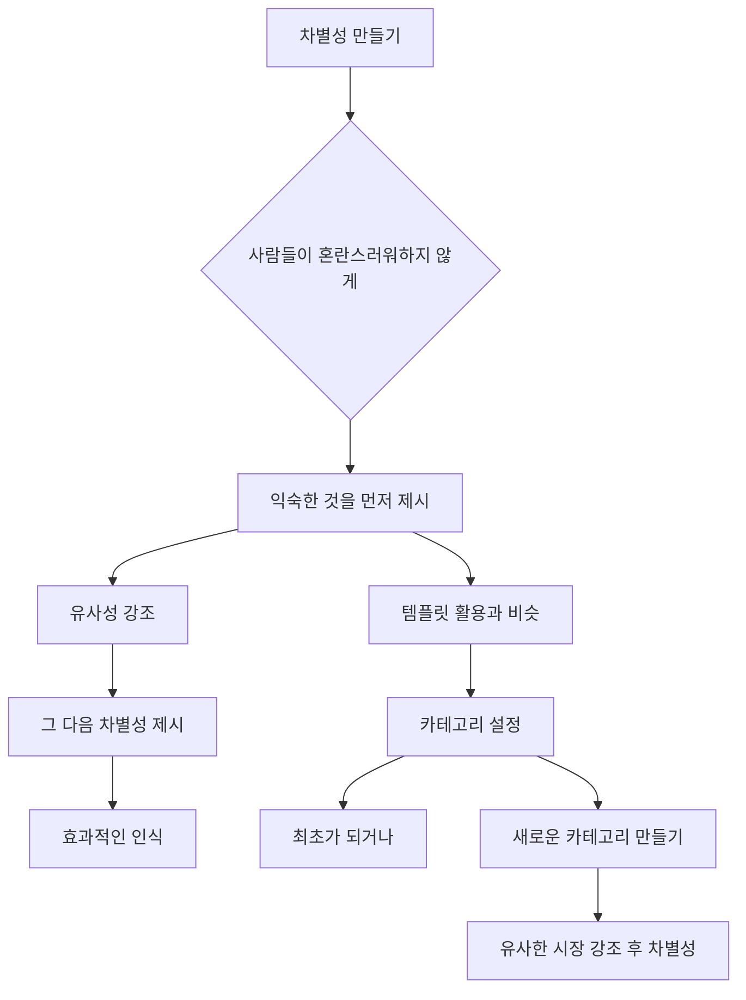
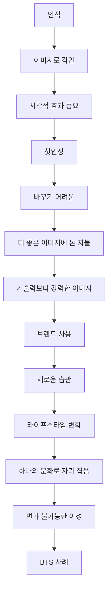
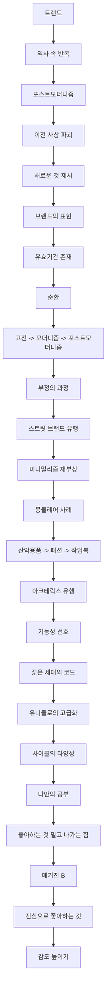

## 나음보다 다름: 나만의 감각으로 세상을 바꾸는 법
이 책은 홍성태, 조수용 저자가 마케팅과 브랜딩의 핵심을 '다름'에서 찾고, 어떻게 하면 남들과 다른 독보적인 존재가 될 수 있는지 알려주는 책이야. 단순히 더 나은 것(나음)을 추구하기보다, 자신만의 특별함(다름)을 찾아 브랜드를 만들고 유지하는 방법을 이야기해. 

## 1. 마케팅, 브랜딩, 광고, 영업, 헷갈리지 마! 

마케팅, 브랜딩, 광고, 영업이라는 말들이 비슷하게 들릴 수 있지만, 사실은 다 다른 역할을 하는 거야. 마치 요리사가 재료를 준비하고, 셰프가 요리를 만들고, 웨이터가 음식을 서빙하고, 홍보 담당자가 식당을 알리는 것처럼 말이야.

1. 마케팅** (Marketing)**: 제품이 만들어지는 순간부터 소비자의 손에 들어가기까지의 모든 과정을 총괄하는 경영 시스템이야. 
  1. 이건 마치 농부가 씨앗을 심고, 키우고, 수확해서 시장에 내놓는 모든 과정과 같아.
2. 브랜딩** (Branding)**: 내가 보여주고 싶은 대로 남들에게 보여지도록 만드는 과정이야. 
  1. 예를 들어, 내가 '친절한 사람'으로 보이고 싶으면, 항상 웃고 먼저 인사하는 행동을 하는 것과 같아.
  2. '퍼스널 브랜딩'은 개인에게도 중요하고, 기업들도 자신만의 이미지를 만드는 데 힘쓰고 있어. 
3. 광고** (Advertising)**: 제품이나 서비스를 사람들에게 보여줘서 판매를 늘리는 활동이야. 
  1. TV에서 맛있는 음식 광고를 보고 '저거 먹고 싶다!' 생각하는 것처럼, 사람들의 구매 욕구를 자극하는 거지.
4. 영업** (Sales)**: 고객이 우리가 제공하는 제품이나 서비스를 선택하도록 설득하는 일이야. 
  1. 매장에서 점원이 옷을 추천해주고, 내가 그 옷을 사도록 돕는 것과 비슷해.

## 2. 왜 '다름'이 중요할까? 

예전에는 그냥 잘 만들고 잘 팔면 됐지만, 지금은 세상이 너무 빨리 변해서 '다름'이 없으면 살아남기 힘들어. 마치 수많은 가게 중에 나만의 특별한 메뉴가 없으면 손님들이 기억하지 못하는 것과 같아.

1. **변화하는 시대의 생존 전략**:
  1. 예전에는 회사에 들어가면 평생 일하고 노후 걱정 없었지만, 지금은 직업을 여러 개 가져야 하고 계속 새로운 것을 배워야 해. 
  2. 내가 나를 잘 알리고(브랜딩) 팔지 못하면(마케팅), 시대에 뒤처질 수밖에 없어. 
  3. 국가나 개인도 자신을 마케팅하고 브랜딩하는 것이 아주 중요해졌어. 
2. **소비자의 머릿속에 각인시키는 힘**:
  1. 마케팅은 단순히 물건을 파는 게 아니라, 소비자의 머릿속에 내가 원하는 이미지를 심어주는 거야. 
  2. 사람들은 자신이 경험한 것을 전부라고 착각하고, 그 경험을 바탕으로 다른 사람에게 이야기해. 
  3. 이런 '입소문 마케팅(바이럴 마케팅)'이 가장 강력한 이유도, 우리는 믿는 사람의 말을 더 신뢰하기 때문이야. 
  4. 기업들이 엄청난 돈을 마케팅에 쏟아붓는 이유도 바로 소비자의 머릿속에 인식을 심어주기 위해서야. 
3. **독점과 독보적인 존재**:
  1. 사업은 결국 '독점'이 되어야 성공할 수 있어. 
  2. 이 책의 제목처럼 '나음보다 다름'이 중요한 건, 다르다는 것이 곧 독보적이고 독점적인 위치를 만든다는 의미야. 
  3. 나만의 특별함을 가지고 어떻게 브랜딩하고 마케팅할지가 이 책의 핵심 내용이야. 

## 3. 실제와 인식의 차이: 맥도날드 이야기 

우리가 생각하는 '실제'와 사람들이 머릿속에 가지고 있는 '인식'은 다를 수 있어. 마케팅은 이 '인식'을 어떻게 만들어내느냐의 싸움이야.

1. **맥도날드의 성공 비결**:
  1. 맥도날드 햄버거가 세상에서 제일 맛있다고 생각하는 사람은 많지 않을 거야. (개인적으로 버거킹이 더 맛있다고 생각하는 사람도 많아.) 
  2. 하지만 '햄버거' 하면 가장 먼저 맥도날드를 떠올리는 건, 맥도날드가 맛이 아니라 다른 것에 집중해서 소비자에게 인식을 심어줬기 때문이야. 
  3. 맥도날드는 '빠르고, 깨끗하고, 더 나은 서비스, 더 높은 가치'를 강조했어. 
  4. 초창기에는 화장실까지 아주 깨끗하게 관리했어. 사람들은 '화장실이 이렇게 깨끗하면 햄버거도 분명 청결하게 만들 거야'라고 자연스럽게 인식하게 된 거지. 
  5. 이처럼 실제 햄버거 만드는 과정을 보여주지 않아도, 화장실 하나로 인식을 심어줄 수 있었던 거야. 
2. **인식의 중요성**:
  1. 마케팅은 결국 어떤 '인식'을 만들어낼 것인가의 게임이야. 
  2. 한번 머릿속에 박힌 인식은 쉽게 변하지 않는다는 점이 중요해. 

## 4. 차별성을 만드는 방법: 유사성과 차별성 

무조건 '우리는 달라!'라고 외치면 사람들은 혼란스러워해. 처음 보는 것을 바로 받아들이기 어렵기 때문이야. 그래서 사람들에게 익숙한 것부터 시작해서 '비슷한데 뭐가 다른지'를 보여주는 전략이 필요해.

1. **유사성으로 시작, 차별성으로 마무리**:
  1. 사람들이 한 번도 들어보거나 본 적 없는 것을 갑자기 내세우면 인식시키기 힘들어. 
  2. 마치 템플릿을 활용하는 것처럼, 상대가 익숙한 것을 먼저 던져주는 거야. 이걸 '유사성'이라고 해. 
  3. 예를 들어, 외국인에게 서울을 설명할 때, "일본 도쿄와 비슷한 곳인데, 서울은 이런 점이 달라"라고 설명하면 훨씬 이해하기 쉬워. 
  4. 사람들이 잘 아는 카테고리(청량음료 시장의 코카콜라, 펩시처럼)를 먼저 언급하고, "우리도 비슷한데, 이런 점이 달라"라고 말하는 거지. 
2. **비타500의 성공 전략**:
  1. 비타500이 처음 나왔을 때, 강장제 시장은 박카스가 독점하고 있었어. 
  2. 비타500은 박카스 병과 비슷한 크기와 컨셉으로 '우리도 박카스와 비슷해'라고 먼저 인식을 시켰어. 
  3. 그다음, '그런데 우리는 비타민이 들어간 영양 음료이고, 약국뿐만 아니라 슈퍼나 편의점에서도 팔아'라고 차별점을 강조했지. 
  4. 이렇게 익숙함 속에서 다름을 보여주는 것이 훨씬 효과적이야. 
3. **'**마케팅 불변의 법칙**'과 '최초'의 중요성**:
  1. '마케팅 불변의 법칙'에서도 가장 강조하는 것은 '최초'가 되라는 거야. 
  2. 만약 최초가 될 수 없다면, '다른 카테고리'를 만들어서 그 안에서 최초가 되어야 해. 
  3. 예를 들어, 최초의 여성용 핸드백처럼 새로운 카테고리를 만들어서 그 안에서 1등이 되는 거지. 
  4. 항상 새로운 포지션, 새로운 카테고리를 만드는 것에 집중해야 해. 
  5. 개인 브랜딩도 마찬가지야. '행동하는 독서'처럼 나만의 키워드를 찾아서 새로운 카테고리를 만드는 노력이 필요해. 

## 5. 진짜 '다름'을 보여주는 5가지 차별성: 가격, 가성비, 기능, 품질, 명성 

단순히 '다르다'고 말하는 것만으로는 부족해. 진짜 뭐가 다른지 구체적인 차별점을 보여줘야 하는데, 크게 5가지가 있어. 이 5가지 차별성은 마치 계단처럼, 아래에서 위로 갈수록 더 강력한 힘을 가져.

1. **가격 (Price)**:
  1. 가장 쉽게 따라 할 수 있는 차별성이지만, 자본이 많은 경쟁자가 나타나면 금방 뒤처질 수 있어. 
  2. 누구보다 싸게 파는 것은 결코 쉬운 일이 아니야. 
2. 가성비** (Value for Money)**:
  1. 가격보다 강력하지만, 이것도 만만치 않아. 
  2. 노브랜드나 월마트처럼 원가 절감과 판매량 극대화를 통해 가성비를 실현하려면 엄청난 노하우가 필요해. 
  3. 월마트는 '매일매일 더 싸게'라는 모토를 실현하기 위해 독보적인 노하우를 가지고 있었어. 
  4. 삼성 핸드폰도 한때 가성비로 유명했지만, 지금은 중국 샤오미에 뒤처지기 시작했어. 
  5. 패션 브랜드 '자라(ZARA)'는 가성비와 함께 '속도'로 승부해. 
  - 4만 벌 팔릴 것 같으면 1만 8천 벌만 만들고, 빠르게 단종시킨 후 새로운 디자인을 내놓아. 
  - 아인슈타인의 'E=mc²' 공식처럼, 속도가 붙으면 파괴력이 제곱으로 상승한다는 것을 아는 회사야. 
3. **기능 (Function)**:
  1. 많은 기술을 가지고 있어도, 소비자에게는 딱 한 가지 강력한 강점만 인식시켜야 해. 
  2. "이것도 좋고 저것도 좋아"라고 하면 소비자들은 헷갈려. 
  3. 애플(Apple)이 이 전략을 잘 사용해. 
  - 애플은 한 발만 더 앞선 기술, 아주 작은 변화로 자신들의 철학을 이어가. 
  - 아이폰 13이 12와 큰 변화가 없어도, 카메라 기능 강화처럼 딱 한 가지 강점만 내세워 마케팅하고 엄청나게 팔려. 
4. **품질 (Quality)**:
  1. 최고 수준의 성능과 내구성은 기본이고, 신뢰성을 줘야 해. 
  2. 아무리 품질이 좋아도 디자인이나 서비스가 뒷받침되지 않으면 안 돼. 
  3. 품질이 좋은 제품이 강력한 브랜드를 갖는 것은 당연하지만, 의외로 품질이 뛰어나도 브랜드를 갖추지 못하는 회사도 많아. 
5. 명성** (Reputation)**:
  1. 가장 강력한 차별성으로, 명품처럼 보지도 않고 믿고 살 수 있는 힘이야. 
  2. 개인에게는 '평판'이 중요해. 내가 없는 자리에서 내 이야기가 어떻게 움직이는지가 평판이야. 
  3. 이런 명성을 어떻게 갖출지 고민해야 해. 

## 6. 인식과 이미지: 시각적 효과와 습관, 그리고 문화 

사람들은 어떤 것을 '이미지'로 기억해. 그래서 눈으로 보는 것(시각적인 효과)이 아주 중요해. 이 이미지가 쌓여 습관이 되고, 나중에는 문화가 되면 아무도 바꿀 수 없는 강력한 힘이 돼.

1. **이미지로 각인되는 인식**:
  1. 인식은 주로 이미지로 각인되기 때문에, 시각적인 효과가 아주 중요해. 
  2. 개인 브랜딩을 할 때도 외모를 가꾸는 것부터 시작해야 해. 
  3. 첫인상은 0.3초 만에 결정되고, 한번 박힌 인식을 바꾸는 데는 3개월 이상 걸릴 정도로 어려워. 
  4. 사람들은 더 좋은 이미지에 기꺼이 돈을 지불해. 
  5. 때로는 기술력보다 이미지가 더 강력한 브랜드가 될 수 있어. 
2. **습관에서 문화로**:
  1. 브랜드를 사용하는 것은 새로운 습관이 되고, 라이프스타일로 변해. 
  2. 이것이 하나의 '문화'로 자리 잡으면, 그때는 어떤 것으로도 바꿀 수 없는 강력한 힘을 갖게 돼. 
  3. BTS(방탄소년단)가 전 세계에서 하나의 문화로 자리 잡은 것처럼, 그 아성을 깨려면 엄청난 시간과 노력이 필요할 거야. 

## 7. 나만의 '단어 독점'과 평판 관리 

나를 나타내는 단어를 독점하는 것은 강력한 브랜딩 방법이야. 그리고 사회적 책임과 평판 관리도 아주 중요해.

1. **단어 **독점** (Word Monopoly)**:
  1. '마케팅 불변의 법칙'에서도 '단어 독점'이라는 표현을 썼어. 
  2. 나이키(Nike) 하면 'Just do it', 애플(Apple) 하면 'Different'처럼, 나를 나타내는 하나의 단어를 브랜딩화할 필요가 있어. 
  3. 명함이나 나를 나타내는 모든 곳에 이 단어를 만들어내야 해. 
  4. 피카소의 작품을 보면 누구 작품인지 알 수 있듯이, 나를 떠올리게 하는 단어를 만드는 것이 중요해. 
  5. 에너자이저와 듀라셀이 '오래가는'이라는 타이틀을 갖기 위해 얼마나 노력했는지 생각해봐. 
2. **사회적 책임과 **평판:
  1. 이제는 단순히 제품을 잘 만들고 잘 알리는 것만으로는 부족해. 
  2. 사회적 기여를 하고, '착한 기업'이라는 인식을 주지 않으면 소비자들에게 잊힐 가능성이 커. 
  3. 여기서도 '평판'이 아주 중요하게 작용해. 

## 8. 최초, 유일, 최고: 강력한 브랜드를 위한 3가지 키워드 

강력한 브랜드를 만들려면 '최초', '유일(Only One)', '최고(Best)'라는 세 가지 키워드를 목표로 해야 해.

1. **최초 (First)**:
  1. 무조건 최초가 되는 것이 가장 좋아. 
  2. 만약 최초가 될 수 없다면, 카테고리를 바꿔서라도 최초처럼 보이게 만들어야 해. 
2. **유일 (Only One)**:
  1. 어떤 한 부분에서는 내가 최고라는 '전문성'을 부여해야 해. 
  2. 그 분야 하면 내가 떠오를 수 있도록 만드는 것이 중요해. 
  3. 사람들은 자신이 참여한 제품에 더 신뢰를 갖는 경향이 있어. 
  4. 요즘 기업들은 소비자가 직접 디자인하거나 조합하는 '주문 전 생산' 방식을 통해 애정을 갖게 만들어. 
3. **최고 (Best)**:
  1. 최고의 제품이 되려면 '시장 점유율', '유명 인사가 좋아하는 제품', '전통 있는 제품' 중 하나라도 제대로 인식시켜야 해. 

## 9. 꿈과 동경: 명품을 사는 이유와 헤리티지의 중요성 

사람들은 두 가지 종류의 꿈을 꿔. 그리고 이 꿈들이 명품을 구매하는 이유가 되기도 해.

1. 기대적 동경** (Aspirational Desire)**:
  1. "나도 저런 사람이 되고 싶어"라고 생각하며 노력하는 꿈이야. 
  2. 우리가 일반적으로 '꿈'이라고 부르는 것들이 여기에 해당해. 
2. 상징적 동경** (Symbolic Desire)**:
  1. "나는 절대 저런 사람이 될 수 없어"라고 생각하지만, 그 사람이 가진 물건(가방, 보석 등)을 가짐으로써 만족감을 느끼는 거야. 
  2. 우리가 명품을 구매하는 주된 이유가 바로 이 상징적 동경 때문이야. 
3. 헤리티지** (Heritage)와 계승 발전**:
  1. 오래된 제품이나 브랜드가 주는 '역사성'은 우리에게 신뢰를 줘. 
  2. 하지만 단순히 오래되었다고 해서 사람들이 선호하는 것은 아니야. 
  3. 시대에 맞춰 '계승'하면서도 '발전'하는 노력이 필요해. 
  4. 개인도 마찬가지야. 나이가 많다고 해서 저절로 인정받는 것이 아니라, 끊임없이 배우고 새로운 문화를 접목시켜야 다른 사람에게 신뢰를 줄 수 있어. 

## 10. 이중적 차별: 인식 속의 '최초, 유일, 최고' 

실제 제품의 기능이나 특징보다, 사람들이 머릿속에 가지고 있는 '인식'이 더 중요할 때가 있어. 이 인식 속에 '최초, 유일, 최고'라는 키워드를 심어주는 것이 핵심이야.

1. **딤채 김치냉장고 사례**:
  1. 딤채 김치냉장고는 단순히 기능이 좋아서라기보다, '김치냉장고를 처음 시작한 브랜드'라는 인식 때문에 신뢰를 얻었어. 
  2. 실제 제품의 어떤 특징보다, '최초', '유일', '최고'라는 키워드를 가지고 사람들의 머릿속에 인식을 심어주는 것이 중요해. 
2. **창의력은 충돌에서 나온다**:
  1. 차별성을 만들려면 엄청난 창의력이 필요하다고 생각하지만, 창의력은 없던 것에서 나오는 게 아니야. 
  2. 완전히 다른 두 가지를 충돌시킬 때 새로운 시각, 느낌, 소리, 향 등이 쏟아져 나와. 
  3. 이런 충돌에서 나오는 '스파크'가 스토리가 되고, 새로운 아이템으로 재창출되는 거야. 
  4. 전혀 관계없어 보이는 다양한 경험들을 머릿속에서 충돌시키면, 남들이 갖지 못한 새로운 것을 만들어낼 수 있어. 

## 11. 변치 않는 철학으로 브랜드를 유지하는 법 

어렵게 만든 브랜드를 오래 유지하려면, 처음 가졌던 '철학'과 '아이덴티티(정체성)'를 끝까지 지켜야 해.

1. **애플의 '**Think Different**'**:
  1. 애플은 'Think Different(다르게 생각하라)'라는 철학을 시대가 변해도 계속 유지하고 있어. 
  2. 패키지나 제품 디자인은 바뀌어도, '애플이 만들면 뭔가 다를 거야'라는 기대 심리를 계속 심어주는 거지. 
2. **개인의 아이덴티티 유지**:
  1. 기업뿐만 아니라 개인도 마찬가지야. 시대가 빠르게 변해도 나만의 고유한 아이덴티티(정체성)를 잃지 않아야 해. 
  2. 나를 나타내는 '한 글자' 같은 핵심 철학을 어떻게 유지하면서 변화에 맞춰갈지 고민해야 해. 

## 12. 나만의 감각을 키우는 방법 

나만의 감각, 즉 '크리에이티브함'은 특별한 아이디어를 내는 것이 아니라, '내가 무엇을 좋아하는지'를 정확히 아는 것에서 시작해.

1. **크리에이티브함의 본질**:
  1. 크리에이티브는 기발하고 통통 튀는 아이디어를 내는 것이 아니야. 
  2. 결과적으로는 핵심을 남길 수 있는 '자기의 지혜'를 찾는 것이라고 볼 수 있어. 
2. **내가 좋아하는 것을 찾는 과정**:
  1. '내가 뭘 좋아하는지'를 정확히 아는 것이 쉽지 않지만, 우리 삶의 가장 중요한 기본 에티켓이라고 할 수 있어. 
  2. '내가 좋아하는 것'이라는 말 속에는 '다른 사람이 나를 어떻게 볼지'에 대한 균형감각이 포함되어 있어. 
  - 무인도에 혼자 있어도 할 것인지 생각해보면, 진짜 좋아하는 것과 남에게 보이기 위해 좋아하는 것을 구분할 수 있어. 
  3. 다른 사람은 뭘 좋아하는지 계속 '관찰'해야 해. 
  - "저 사람은 저걸 왜 좋아하지? 진짜 좋아하는 이유가 뭐지?"라고 계속 질문하고 쌓아가야 해. 
  - 이렇게 쌓다 보면 나름대로 정리가 되고, 나의 기준이 잡히면서 내가 좋아하는 것이 뚜렷해져. 
  - 동시에 사람들이 나를 어떻게 볼지에 대한 감각도 함께 생겨나. 

## 13. 버릴 용기: 핵심만 남기는 힘 

내가 무엇을 좋아하는지 알게 되면, 그것만 남기고 나머지를 과감하게 버릴 수 있는 '용기'가 생겨. 이 용기가 바로 '다름'을 만드는 힘이야.

1. **더 나은 세상이 아닌 '나다운 세상'**:
  1. 내가 뭘 좋아하는지 모르면, 다른 사람들이 좋아하는 것을 다 합치려고 해. 
  2. 누가 올지 모르니 모든 고객의 합집합을 만들려 하고, 계속 '더 나은 것'만 더하게 돼. 
  3. 하지만 내가 진짜 좋아하는 것을 알게 되는 순간, 그것만 남기고 나머지를 버리면 그때부터 달라지기 시작해. 
2. **성공하는 카페들의 공통점**:
  1. 전 세계에서 잘 되는 카페들은 대부분 '세상에서 제일 후진 위치'에 있고, '인테리어도 없어'. 
  2. 이들은 '나는 어떤 커피를 좋아하지?', '나는 어디서 마시는 걸 좋아하지?'라는 질문에 끝까지 답하고, 그것만 남기고 나머지를 버린 거야. 
  3. 그 결과, 그들의 취향을 좋아하는 사람들이 늘어났고, 그들은 자신만의 철학을 계속 유지하고 있어. 
  4. 이들은 비즈니스도 잘하고, 한국 시장의 커피 트렌드나 소비자 불편함도 잘 알고 있어. 
  5. 이것이 진정한 크리에이티브라고 할 수 있어. 

## 14. 내면의 힘을 키우는 교육: 국어와 인문학 

내면의 힘을 키우고 나만의 세계에 집중하려면, '국어'와 '인문학'적인 관점에서 세상을 이해하는 것이 중요해. 이건 마치 내가 어떤 말을 했을 때 상대방이 어떻게 받아들일지 고민하는 것과 같아.

1. **국어 교육의 본질**:
  1. 국어는 단순히 언어를 배우는 것을 넘어, '내 생각을 말하고 전달하는 것', '상대방의 말을 듣고 이해하는 것', '글을 쓰고 읽는 것'의 기본이라고 할 수 있어. 
  2. 윤동주 시인의 시를 읽을 때도, '그 당시 시인이 무슨 이야기를 하고 싶었을까?'라고 생각하면 진짜 소통하는 느낌을 받을 수 있어. 
  3. 브랜드 캠페인을 하든, 책을 쓰든, 결국 내 머릿속에 있는 것을 상대방에게 넣고, 상대방의 피드백을 듣는 과정이 중요해. 
  4. 우리는 국어를 이런 관점으로 대한 적이 없어서 이 부분이 부족한 경우가 많아. 
2. 인문학적** 관점의 브랜딩**:
  1. 국어는 인문학으로 연결되고, 인문학적 관점에서 브랜드를 보면 더 깊이 이해할 수 있어. 
  2. 이 브랜드를 만든 사람들이 무슨 생각을 하고, 나에게 무슨 이야기를 하려 하는지 알 수 있어. 
  3. 내가 이 옷을 입거나 신발을 신음으로써 무슨 이야기를 하고 싶은지, 그걸 본 사람은 나를 어떻게 인식할지 고민하는 것이 중요해. 
  4. 이것은 상업적인 것이 아니라, '무인도에서도 나이키 신발을 신을 것인가?'처럼 아주 현실적인 질문이야. 
  5. 이런 관심을 계속 반복하면, '내가 이렇게 얘기하면 사람들이 이렇게 받는구나', '내 생각과 다르네'라는 것을 알게 되면서 점차 나만의 브랜드가 생겨나는 거야. 

## 15. 대기업 CEO의 경영 철학: 핵심만 지키고 나머지는 위임 

카카오 대표이사까지 지낸 저자는 작은 가게를 운영하든, 거대 기업을 경영하든 '핵심만 지키고 나머지는 과감하게 위임하는 것'이 중요하다고 말해. 마치 오케스트라 지휘자가 모든 악기를 다 연주하는 것이 아니라, 전체적인 흐름과 중요한 부분만 지휘하는 것과 같아.

1. **핵심 원칙 지키기**:
  1. 카카오 대표이사 시절, 복잡하고 힘든 일들이 많았지만, '중요한 것만 지키면 된다'는 원칙을 고수했어. 
  2. 꼭 챙겨야 할 것만 잘 골라서 지키고, 나머지는 함께 일하는 동료들에게 과감하게 맡기는 거야. 
  3. 네이버 시절에도 '사람들이 놀라지 않아야 하는 제품'의 특성을 이해하고, 점진적으로 개선하는 것에 집중했어. 
  4. '오늘 아침에 딱 켰는데 뭘 어떻게 쓰는 거야?'라는 상황이 발생하지 않도록, 사용자의 경험을 계속 관찰하고 쌓아갔어. 
  5. 너무 많이 변화하면 사람들이 헤맬 수 있기 때문에, 끝은 정해져 있지만 가는 길은 조절하는 것이 중요해. 
2. 매거진 B** 발행인의 역할**:
  1. 매거진 B의 경우, 책 내용은 편집장에게 전적으로 맡기고, 저자는 '표지 사진 고르는 것'과 '브랜드 선정'만 해. 
  2. 발행인의 글은 가끔 마음에 통할 때만 쓰고, 독자들이 발행인의 글을 많이 읽지 않는다는 것을 알고 있기 때문에, 자신이 가장 만족할 때까지 쓰는 것에 집중해. 

## 16. 쉬는 시간의 발견: 진짜 필요한 것과 자존감 교육 

바쁜 일상에서 벗어나 쉬는 시간을 가지면서, 저자는 '진짜 필요한 것'이 무엇인지 깨닫고, 자녀 교육에서는 '자존감'을 키워주는 것이 가장 중요하다고 말해. 마치 복잡한 짐을 다 내려놓고 나니, 정말 소중한 것들만 남는 것을 발견하는 것과 같아.

1. **쉬면서 얻는 깨달음**:
  1. 평생 쉬지 않고 일하다가 처음으로 쉬는 시간을 가지면서, 눈에 보이는 것들이 많아졌어. 
  2. 사람들을 많이 만나지 않고 집에만 있다 보니, 생각보다 많은 것이 '진짜 필요 없어진다'는 느낌을 받았어. 
  3. 옷이나 가진 것들을 많이 정리하면서, 자신을 돌보지 못했다는 것을 깨닫고 충분한 시간을 가지고 있어. 
2. **자녀 교육의 핵심: **자존감:
  1. 저자는 자신과 주변 사람들을 보면서 '자존감'이 가장 중요하다고 생각하게 되었어. 
  2. 자존감은 '자기에 대한 자부심'과 '자기에 대한 존경심'을 의미해. 
  3. 자존감을 키우는 가장 중요한 마음가짐은 '내 아이를 나보다 더 낫거나 나랑 동등하다고 인식하는 것'이야. 
  4. 아이가 어떤 선택을 하거나 고민할 때, '분명히 나보다 더 나을 가능성이 높다'고 생각하고 터무니없어 보여도 존중해주는 것이 중요해. 
  5. 이것이 진정한 자존감을 만들어주는 대화라고 믿어. 
  6. 부모가 아이의 말을 진짜로 듣고 존중할 때, 아이는 시행착오를 통해 스스로 배우고 올바른 선택을 할 수 있게 돼. 
  7. 부모가 '아니야, 네가 해보는 게 나을 것 같아'라고 강요하는 것도 잘못된 것이고, 아이 스스로 판단하게 해야 해. 
  8. 부모가 아이를 존중해야 아이가 부모에게 솔직하게 이야기할 수 있어. 
  9. 때로는 아이가 부모를 가르쳐주기도 하고, 부모의 진심이 아이에게 전달될 때도 있어. 
  10. 결국 최고의 교육은 자녀의 자존감을 키워주는 것이고, 이는 '듣는 척'이 아니라 '진짜로 듣는 것'에서 시작돼. 
  11. 아이들이 부모보다 더 다양한 정보를 얻고 판단력이 뛰어날 수 있다는 것을 인정해야 해. 
  12. 부모가 아이를 인정해주면, 자녀들은 스스로 헤쳐나갈 수 있는 힘을 가지게 돼. 

## 17. 트렌드의 순환과 나만의 공부 

패션이나 브랜드 트렌드는 마치 계절이 바뀌듯 계속 순환해. 중요한 건 이런 트렌드를 이해하고, 내가 진짜 좋아하는 것을 찾아 꾸준히 '나만의 공부'를 하는 거야.

1. **트렌드의 반복과 순환**:
  1. 최근의 스트릿 패션(스프링) 같은 유행은 역사 속에서 계속 반복되어 왔어. 
  2. 미술 공부에서 '포스트모더니즘'이 이전 사상을 파괴하고 새로운 것을 보여주기 위해 일어났던 것처럼, 브랜드에서도 이런 일이 벌어져. 
  3. 이런 트렌드는 유효기간이 있고, 시간이 지나면 끝나고 또 다른 트렌드가 올라와. 
  4. 지금은 거칠고 터프한 스트릿 브랜드가 유행하지만, 언젠가는 다시 미니멀하고 섬세한 스타일이 올라올 거야. 
  5. 몽클레어(Moncler) 같은 브랜드도 산악용품에서 패션으로, 다시 작업복 같은 기능성으로 선호도가 바뀌는 것처럼 트렌드는 순환해. 
  6. 요즘 젊은 세대가 아크테릭스(Arc'teryx) 같은 기능성 브랜드를 좋아하는 것도 이런 트렌드의 일부야. 
  7. 유니클로(Uniqlo)가 다시 고급화를 추구하는 것처럼, 모든 트렌드는 각기 다른 사이클을 가지고 있어. 
2. **나만의 공부와 진심**:
  1. 저자는 '의미를 만들어내는 것'이 자신의 목적지였고, 이를 위해 '새로 공부하는 방법'을 찾았어. 
  2. 국영수는 나라에서 공부하라는 과목이었지만, 매거진 B는 저자가 스스로 공부하는 과목이었어. 
  3. 진심으로 좋아하는 것을 공부하고 밀고 나가는 힘이 중요해. 
  4. 저자가 매거진 B를 만든 사람을 만나 깊은 대화를 나눌 수 있었던 것도, 그 브랜드를 진심으로 좋아했기 때문이야. 

## 18. 미래에 대한 고민과 감도 키우기 

저자는 앞으로도 매거진 B를 잘 가꾸고, 자신의 특별한 경험(디자인 전공 후 대기업 CEO까지)을 다른 사람들과 나누는 방법을 고민하고 있어. 그리고 나만의 감각을 키우는 아주 사소하지만 중요한 팁도 알려줘.

1. **매거진 B를 돌보는 일**:
  1. 한국에서 탄생한 11년 차 잡지 브랜드인 매거진 B는 아주 귀한 존재이기 때문에, 헛되지 않게 잘 가꾸는 것이 저자의 중요한 일이야. 
  2. 함께 일하는 동료들이 오랫동안 행복하게 일할 수 있도록 하는 것도 저자의 기본 목표야. 
2. **경험 나누기**:
  1. 디자인을 공부하고 대기업 CEO까지 했던 특별한 경험을 어떻게 하면 주변 사람들과 나눌 수 있을지 고민하고 있어. 
  2. 디자인하는 사람들과 경영하는 사람들이 서로 만나지 못하는 영역에서, 자신이 나눌 수 있는 것이 무엇인지 계속 생각하고 있어. 
3. 감도**(感度) 키우는 팁**:
  1. 나만의 감각을 키우는 가장 사소한 팁은 '좋아하는 상황에 대해 외우려고 노력하는 것'이야. 
  2. 최근 일주일간 좋았던 순간을 떠올리고, 그 상황을 영화 감독처럼 그대로 복제해 보는 거야. 
  - 하늘은 어땠고, 건물은 어땠고, 문 손잡이는 어땠고, 바닥은 어땠고, 공기는 어땠고, 음악은 뭐가 나왔는지 등 아주 디테일하게 떠올려보는 거지. 
  3. 이런 노력을 하면 순간순간의 '감도'가 높아지고, 다른 사람들이 뭘 보는지도 알게 돼. 
  4. 대충 먹고 나오는 식당에 대해 나중에 누가 물어보면 '별로야'라고 말하는 것은 아무 의미 없는 대화지만, '그 그릇에 그렇게 내주는 건 진짜 괜찮지 않았어?'라고 말하는 순간, 그 사람은 다른 사람이 되는 거야. 
  5. 무조건 모든 것에 다 그럴 필요는 없고, 내가 관심을 가졌더니 저절로 외워지는 '대상물'이 있을 거야. 
  6. 그것을 계속 쌓아가다 보면, 나중에 돌아봤을 때 그 분야의 전문가처럼 되어 있을 거야. 
  7. 결국 '좋아하는 것을 외워봐라', 즉 '영화 감독처럼 복기할 수 있으면 된다'는 의미야. 
  8. 이것은 '농도'를 중요하게 생각하는 것과 같아. 강한 사람들이 민감해지고, 나에게 뭐가 반응하는지 해체할 수 있게 되면서 감각이 커지는 거지. 

