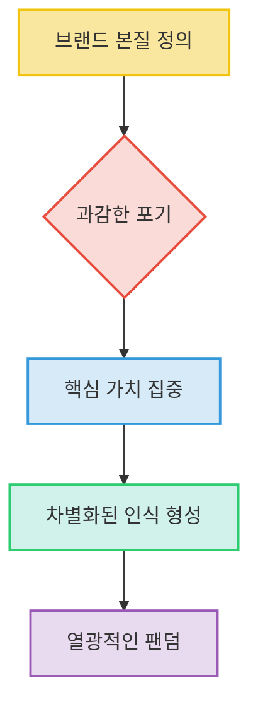
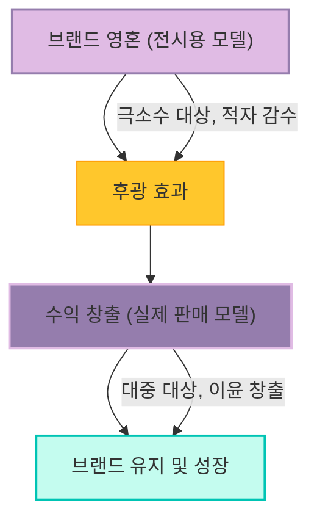
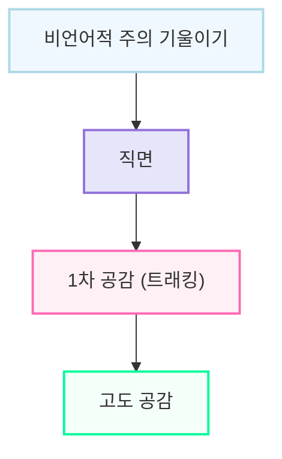
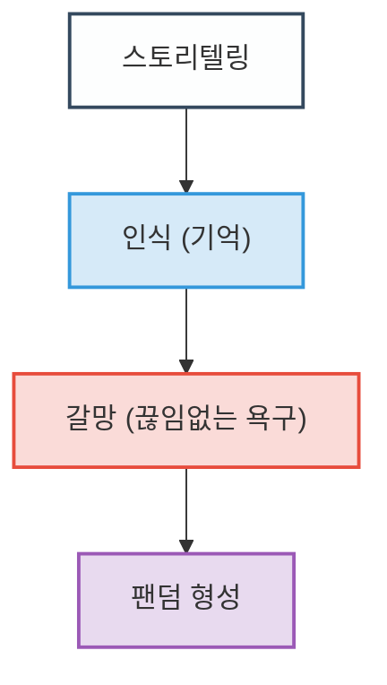

## 모든 비즈니스는 브랜딩이다: 소비자의 마음을 사로잡는 마법 같은 이야기
이 책은 단순히 제품을 파는 것을 넘어, 소비자의 마음속에 특별한 의미를 심어주는 '브랜딩'의 본질을 알려주는 마케팅 필독서야. 홍성태 교수님이 다양한 사례를 통해 브랜딩이 무엇인지, 어떻게 해야 성공적인 브랜딩을 할 수 있는지 쉽고 재미있게 설명해 줄 거야. 이 책을 읽으면 모든 비즈니스가 결국은 소비자의 인식과 감성을 움직이는 싸움이라는 걸 알게 될 거야.

## 1. 브랜딩은 제품 경쟁이 아니라 인식의 싸움이야 

브랜딩은 단순히 제품의 품질이나 기능으로 경쟁하는 게 아니야. 마치 마술사가 사람들의 눈을 속이듯이, 소비자의 머릿속에 어떤 인식을 심어주느냐가 훨씬 중요해.

1. 포르쉐** **이야기:
  - 포르쉐는 운전석이 좁고 불편하고, 사이드 미러도 작고, 트렁크에 골프백 하나도 안 들어가는 스포츠카를 만들어 .
  - 상식적으로는 망해야 할 것 같지만, 이 차는 불티나게 팔리고 전 세계 사람들의 드림카가 되었어 .
  - 이건 품질이나 편의성 같은 객관적인 지표를 스스로 버리고, '가장 빠른 스포츠카'라는 본질에만 집중했기 때문이야 .
  - 포르쉐는 불편함을 감수하고라도 '극한의 질주'라는 인식을 소비자에게 심어준 거지.

2. 게토레이** **이야기:
  - 초창기 게토레이는 맛이 끔찍해서 상업적으로 실패할 뻔했어 . 찝찔하고 시큼하고 밍밍한 맛이었지 .
  - 당시 시장에는 콜라나 환타처럼 달콤하고 청량한 음료들이 가득했어 .
  - 게토레이는 맛으로 경쟁하는 대신, '달지 않아야 한다', '흡수가 빨라야 한다', '몸 전체를 적셔야 한다'는 메시지로 소비자 인식을 바꿨어 .
  - 맛이 밍밍하다는 단점을 오히려 '인체에 가장 빠르게 흡수되는 과학적 증거'라고 포장한 거야 .
  - 소비자들은 게토레이를 마시면서 '나는 수분을 보충하는 중'이라는 과학적 인식을 마시게 된 거지 .

3. 하이트 맥주** **이야기:
  - 만년 2위였던 하이트가 오비맥주를 이긴 비결은 '물'에 대한 인식 싸움이었어 .
  - 당시 낙동강 페놀 오염 사건으로 사람들이 수돗물 마시는 것을 무서워했어 .
  - 하이트는 이 공포를 이용해서 '지하 150m 100% 천연 암반수'라는 컨셉을 내세웠어 .
  - 사실 맥주 양조에 물 종류가 결정적인 영향을 미치지는 않지만 , 소비자들은 '이 맥주는 오염되지 않은 깨끗한 물'이라는 심리적 면죄부를 얻게 된 거야 .
  - 결국 소비자들은 액체를 산 게 아니라 '안전함'이라는 스토리를 산 셈이지 .

## 2. 브랜딩의 핵심은 '업의 본질'을 정의하는 거야 

성공적인 브랜딩을 하려면, 우리가 하는 일의 진짜 정체성, 즉 '업의 본질'이 무엇인지 정확히 알아야 해. 마치 건물을 지을 때 튼튼한 기초 공사를 하는 것과 같아.

1. 삼성** 이건희 회장의 **프랑크푸르트 선언:
  - 1993년 이건희 회장은 불량 애니콜 휴대폰 15만 대를 불태우는 화형식을 했어 .
  - 이때 회의실에서 임원들에게 "우리가 만드는 컴퓨터와 가전제품의 업의 본질이 도대체 뭐냐?"고 물었어 .
  - 리더가 파는 물건의 본질을 모르면 그 회사는 껍데기만 만드는 공장에 불과하다는 뼈아픈 일갈이었지 .
  - 한 임원이 "컴퓨터는 생물이고, 가전제품은 건어물입니다"라고 대답했어 .
  - 컴퓨터는 생물: 몇 달만 지나도 구형이 되고 가치가 폭락하는 생선처럼, 컴퓨터 산업은 재고를 쌓아두는 게 아니라 얼마나 빨리 최신 부품을 조립해서 직송하느냐의 속도전이야 .
  - **가전제품은 건어물**: 냉장고나 세탁기는 창고에 6개월 둔다고 빨래가 덜 되지는 않아 . 유통 기한이 길고 썩지 않으니, 속도보다는 거대한 물류 창고를 효율적으로 관리하고 배송 비용을 줄이는 안정성이 중요해 .
  - 이처럼 사업 전략도 업의 본질에 따라 근본부터 달라져야 한다는 통찰을 보여준 거야 .

2. 암트랙**(미국 철도 회사) **이야기:
  - 암트랙은 스스로를 '철도 회사'라고만 정의해서 돈을 잘 벌 때도 정체성을 의심할 필요를 못 느꼈어 .
  - 임원들이 기차역 효율성만 볼 때, 머리 위로는 비행기가 날아가고 옆으로는 고속도로가 뚫리기 시작했지 .
  - 경쟁자가 다른 차원에서 나타나면서 암트랙의 수익성은 속절없이 추락했어 .
  - 만약 암트랙이 스스로를 '운송 회사', 즉 사람과 화물을 이동시키는 회사라고 정의했다면, 항공 산업에 투자하거나 물류 트럭 네트워크를 인수했을 수도 있었을 거야 .
  - 어떻게 정의하느냐가 사업이 뻗어나갈 세계의 크기를 결정하는 잔인한 교훈을 주는 사례야 .

3. 디즈니** **이야기:
  - 디즈니가 스스로를 '만화 영화 만드는 회사'로만 정의했다면 애니메이션 스튜디오 하나로 남았을 거야 .
  - 하지만 디즈니는 본질을 '엔터테인먼트', 즉 사람들에게 즐거움을 파는 일로 정의했어 .
  - 이러한 정의 덕분에 스포츠 채널 ESPN, 방송국 ABC를 인수하고, 테마파크를 짓고, 디즈니 플러스로 전 세계 거실까지 점령하는 무서운 확장성을 보여줬지 .
  - '즐거움'이라는 본질만 유지하면 형태는 무한히 변신할 수 있다는 것을 보여주는 사례야 .

4. **크루즈 회사 **이야기:
  - 보통 크루즈 회사는 '여객 운송업'이라고 생각하기 쉽지만, 이 회사는 본질을 '추억 만들기'로 재정의했어 .
  - 승선 시간을 오후 4시로 고집하는데 , 이는 고객이 방에 짐을 풀고 갑판에 나왔을 때 바다 한가운데로 떨어지는 숨 막히는 붉은 낙조를 정면으로 보게 하기 위함이야 .
  - 밤에는 갑판 조명을 다 끄고 쏟아지는 별빛 아래서 춤추게 만들었지 .
  - 물리적인 서비스 양을 줄이더라도, 고객의 뇌리에 평생 남을 강렬한 장면을 연출하는 데 자원을 쏟아부은 거야 .

5. 오토피아** 숙박업소 **이야기:
  - 오토피아가 스스로를 '편리하고 깨끗한 방'이라고 정의했다면 주변 호텔들과 가격 경쟁을 했을 거야 .
  - 하지만 오토피아는 공간의 본질을 '디지털 디톡스와 온전한 쉼, 선조들의 정취를 느끼는 곳'으로 비틀었어 .
  - 객실에 TV가 없고 인터넷이 느리다는 단점이 오히려 '속세와 단절된 프리미엄 힐링 서비스'로 둔갑한 거지 .
  - 전통 다도나 명상 같은 새로운 가치를 비싸게 팔 수 있게 되었어 .

## 3. 진짜 고수들은 물건 대신 '은유(메타포)'를 팔아 

물건을 파는 게 아니라, 그 물건이 상징하는 강력한 의미, 즉 '은유'를 파는 것이 중요해. 마치 시인이 시를 통해 감동을 주듯이 말이야.

1. **루베크 교수의 시**:
  - "나한테 옷을 팔려고 하지 말아요. 대신 세련된 의상, 멋진 스타일, 그리고 매혹적인 외모를 팔아주세요." 
  - "나한테 보험을 팔려고 하지 마세요. 대신 마음의 평화와 내 가족과 나를 위한 안정된 미래를 팔아주세요." 
  - "내게 집을 팔 생각은 마세요. 대신 안락한 가정과 휴식, 그리고 다시 팔 때 이익을 팔아주세요." 
  - "나한테 장난감을 팔려고 하지 마세요. 대신 내 아이들의 행복하고 멋진 시간들을 팔아주세요." 
  - "나한테 비행기 티켓 팔아주지 말아주세요. 대신 제시간에 안전하게 도착할 수 있다는 약속을 팔아주세요." 
  - 이 시는 고객의 관점에서 '무엇을 원하는지'를 정확히 짚어주는 거야 .

2. **스티브 잡스의 아이폰 프레젠테이션**:
  - 잡스는 아이폰을 소개할 때 "터치 스크린 달린 고사양 스마트폰을 만들었습니다"라고 스펙을 나열하지 않았어 .
  - 대신 "음악 듣는 아이팟, 사진 찍는 카메라, 인터넷 하는 기기, 근데 전화도 됩니다"라고 말했지 .
  - 소비자가 아이폰으로 일상에서 어떤 경험을 누릴지 시각화시켜 버린 거야 .

3. **애플의 'Think Different' 캠페인**:
  - 문법적으로는 'Think Differently'가 맞지만, 애플은 '다르게 행동하라'는 부사 대신 '다름'이라는 가치 그 자체를 명사형으로 받아들이라는 강력한 은유를 던졌어 .

## 4. 과감한 포기가 열광적인 팬덤을 만들어 

날카로운 은유를 소비자에게 각인시키려면, 다른 매력들을 과감히 포기하고 하나의 본질에 집중해야 해. 마치 조각가가 불필요한 부분을 깎아내어 걸작을 만들듯이 말이야.

1. **볼보 **이야기:
  - 볼보는 숨 막히는 속도감을 과시하지 않아 .
  - 대신 꽉 막힌 도로를 보여주면서 "당신은 안전합니까?"라고 묻지 .
  - '안전'이라는 하나의 본질을 위해 다른 매력을 다 포기한 거야 .

2. 포르쉐** **이야기:
  - 포르쉐는 '가장 빠른 스포츠카'라는 본질을 지키기 위해 비좁은 좌석이나 짐이 안 들어가는 트렁크를 방치했어 .
  - 만약 포르쉐가 승차감을 타협해서 누구나 편하게 타는 차가 되었다면, 더 이상 '드림카'가 아니라 수많은 고급 세단 중 하나로 전락했을 거야 .
  - 타협하는 순간 대중성은 얻을지 몰라도, 열광적인 팬덤은 산산조각 난다는 것을 보여주는 사례야 .

3. **에르메스, 앱솔루트 보드카 **이야기:
  - 에르메스가 최신 유행에 맞춰 가방 모양을 바꾸거나, 앱솔루트 보드카가 원가 절감한다고 시그니처 병 모양을 평범하게 바꾼다면, 고객이 비싼 돈을 주고 살 결정적인 이유가 사라질 거야 .

## 5. 브랜드의 영혼을 지키면서 돈도 버는 '이중 구조' 전략 

브랜드의 본질(영혼)을 지키면서 동시에 돈도 많이 버는 방법이 있어. 바로 '이중 구조' 전략이야. 마치 영화관에서 영화는 싸게 보여주고 팝콘으로 돈을 버는 것과 비슷해.

1. **맥도날드 **이야기:
  - 맥도날드 매장 앞에는 990원 햄버거 같은 엄청 싼 미끼 상품 포스터가 붙어 있어 .
  - 이 990원 햄버거는 팔아봤자 남는 게 거의 없는 '전시용' 또는 '홍보용' 상품이야 .
  - 진짜 돈은 고객이 햄버거와 함께 시키는 감자튀김과 콜라에서 벌어들여 .
  - 햄버거는 고객을 매장으로 유인하는 '미끼' 역할을 하고, 감자튀김과 콜라가 '캐시카우(수익원)' 역할을 하는 거지.

2. **샤넬 **이야기:
  - 샤넬은 패션쇼에서 수천만 원, 수억 원 하는 맞춤복인 '오트 쿠튀르'를 선보여 .
  - 이 옷들은 극소수 부자들만 입고, 심지어 쇼를 열수록 적자가 날 수도 있어 .
  - 하지만 이 오트 쿠튀르의 압도적인 장엄함이 사람들 머릿속에 '샤넬은 범접할 수 없는 궁극의 럭셔리'라는 후광 효과를 각인시켜 .
  - 진짜 돈은 공항 면세점이나 백화점에서 평범한 사람들이 큰맘 먹고 사는 5만 원짜리 샤넬 립스틱이나 향수에서 벌어들여 .
  - 1억 원짜리 드레스는 못 사지만, 그 드레스가 뿜어내는 럭셔리한 아우라의 조각을 립스틱으로 사는 셈이지 .
  - 맥도날드의 햄버거와 감자튀김, 샤넬의 드레스와 립스틱이 비즈니스 구조상 완전히 똑같은 역할을 한다는 것이 놀랍지 .

## 6. 본질이 스며들면 노동이 사명감으로 폭발해 

업의 본질이 조직의 말단까지 스며들면, 직원들은 단순히 생계를 위한 노동이 아니라 거대한 사명감을 가지고 일하게 돼. 마치 작은 부품 하나하나가 모여 거대한 우주선을 움직이는 것처럼 말이야.

1. **나사(NASA) 미항공우주국 일화**:
  - 1960년대 우주 개발 경쟁 때, 존슨 부통령이 나사 본부를 방문했어 .
  - 복도에서 청소부 직원이 콧노래를 부르며 청소를 하고 있었지 .
  - 부통령이 "고된 청소일을 하는데 뭐가 그렇게 신나서 노래를 부르냐"고 묻자 ,
  - 청소부는 "부통령 각하, 저는 단순한 청소를 하는 게 아닙니다. 저는 인류를 달에 보내는 우주 탐사 프로젝트를 돕고 있는 중입니다"라고 대답했어 .
  - 이처럼 자신이 하는 작은 행동 하나가 브랜드가 세상에 던지려는 '인류의 진보' 같은 본질과 어떻게 연결되는지 이해할 때, 엄청난 주인 의식이 탄생하는 거야 .

## 7. 고객의 감정을 이해하는 8가지 방법: 희로애락애오욕구 

사람의 마음을 움직이려면 감정을 이해해야 해. 홍성태 교수님은 인간의 감정을 8가지로 나누어 설명했어. 마치 사람의 마음을 들여다보는 마법의 거울 같아.

1. **기쁨 (喜)**: 관계에서 발생하는 긍정적인 감정이야 .
  - **예시**: 기쁜 순간에 떠오르는 '봄베이 사파이어 진'이나, 언제나 행복한 순간을 상징하는 '코카콜라'처럼, 브랜드들은 기쁨을 주요 메시지로 삼아 .

2. **즐거움 (樂)**: 스스로 느끼는 긍정적인 감정이야 .
  - **예시**: '닌텐도 위'처럼 자기 만족을 유도하는 마케팅에 유용하게 쓰여 .
  - 기쁨이 타인과의 관계에서 오는 것이라면, 즐거움은 자신에게서 오는 감정이라고 보면 돼 .

3. **사랑 (愛)**: 관계에서 발생하는 감정으로, 가족의 사랑이나 애국심처럼 다양한 형태로 나타나 .
  - **예시**: 가족의 사랑을 강조하는 '맥도날드'나, 애국심을 마케팅에 활용하는 '트렉스타' 같은 한국 브랜드들이 있어 .

4. 욕구** (欲)**: 자연발생적으로 생기는 욕구로, 결핍이나 필요에 의해 생기는 '니즈(Needs)'와 비슷해 .
  - **예시**: 안전 욕구를 자극하는 보험 상품이나, 건강 욕구를 자극하는 루테인, 비타민 같은 영양제들이 있어 .

5. **노여움 (怒)**: 관계에서 발생하는 부정적인 감정이야 .
  - 자사 브랜드에는 노여움이 생기지 않도록 관리하고, 경쟁 브랜드에는 전략적으로 노여움을 창출하지 않는 것이 중요해 .
  - **예시**: '바나나는 원래 하얀색이다'라는 음료는 노란색 바나나 우유(단지 우유)에 대한 노여움을 유발해서 성공한 사례라고 볼 수 있어 .

6. **슬픔 (哀)**: 자연발생적인 감정이야 .
  - 스스로 생기는 즐거움과 결합하면 좋은 마케팅 전략이 나올 수도 있어 .
  - **예시**: 장례식 같은 상품이나 마케팅은 슬픔이라는 감성에 직접적으로 접근하는 경우라고 볼 수 있어 .

7. **미움 (惡)**: 노여움과 비슷하게 대상이 뚜렷한 감정이야 .
  - 국가 차원에서는 국민의 마음을 하나로 모을 때, 시장의 강자에 대응할 때는 좋은 전략을 짤 수 있게 해주는 감정이야 .

8. **두려움 (懼)**: 현대인에게 중요한 감정으로, 미래에 대한 두려움이 보험 같은 상품을 만들었어 .
  - **예시**: 가짜에 대한 두려움 때문에 다이아몬드를 살 때 보증서를 받으려고 하는 것처럼 말이야 .
  - 두려움 역시 즐거움과 결합시키면 스릴을 즐기는 오락물처럼 감정을 배가시킬 수 있어 .

## 8. 고객의 마음을 얻는 '공감'의 4단계 

사람을 끄는 매력의 원천은 '공감'이야. 고객의 문제를 해결해 주는 것은 당연하고, 고객과 연결되려면 공감이 필수적이지. 마치 친구의 이야기를 진심으로 들어주는 것과 같아.

1. 비언어적 주의 기울이기:
  - 말없이 눈을 맞춰주는 정도의 공감이야 .
  - 상대방의 이야기를 들을 준비가 되어 있다는 것을 보여주는 사전 작업이라고 보면 돼 .

2. **직면**:
  - 해결책을 제시하기보다 고객의 문제를 그대로 마주하고 알아보는 형태의 커뮤니케이션이야 .
  - "무엇이 문제인가요?", "고객님이 원하는 것은 무엇을 해결해 드릴까요?"처럼 고객의 입장에서 문제를 파악하는 거지 .

3. 1차 공감** (**트래킹**)**:
  - 고객이 직면한 형태를 그대로 따라가는 행동이야 .
  - 심리학 용어로는 '트래킹(Tracking)'이라고 하는데, 고객의 감정이나 상황을 그대로 받아들이고 표현하는 것을 의미해 .

4. **고도 공감**:
  - 가장 고차원적인 공감 형태로, 상대방의 입장보다 앞서서 공감해보는 거야 .
  - "아, 나라면 그럴 수도 있었겠다", "고객님, 그 상황에서는 그런 문제가 있으셨을 수도 있겠네요"처럼 상대방의 마음을 미리 헤아려주는 거지 .
  - 이렇게 공감을 잘해야 고객과 연결되어 메시지를 효과적으로 전달할 수 있어 .

## 9. 디자인은 기업을 살리고 죽이는 무기야 

브랜딩에서 디자인은 빼놓고 이야기할 수 없어. 마치 사람의 첫인상처럼, 디자인은 브랜드의 이미지를 결정하는 중요한 요소야.

1. 브랜드** 컬러의 중요성**:
  - 배달의민족의 민트색, 코카콜라의 빨간색, 맥도날드의 노란색과 빨간색처럼 브랜드 컬러는 매우 중요해 .
  - 교수님은 "기업을 살리고 죽이는 가장 큰 무기는 없지만, 악화시키고 고착시키는 무기는 디자인이다"라고 말했어 .

2. **전략 있는 **디자인:
  - 예쁘고 좋은 디자인이 아니라, 컨셉과 포지셔닝이 확보된 '전략 있는 디자인'이 브랜딩에서 중요해 .
  - 디자인으로 부가되는 가치는 크게 세 가지야.
  - **실용적 가치**: 디자인이 고객에게 특정 행동을 유도하는 거야. 예를 들어, 저것 대신 이것을 사게 만드는 거지 .
  - **사회적 가치**: 안 사도 되는 것을 사게 만들거나, 더 비싼 값을 받게 해주는 거야 .
  - **개인적 가치**: 디자인이 좋아서 관련 제품을 계속 사게 만드는 거야. 예를 들어, 아이폰을 쓰고 맥북, 애플 워치, 아이패드까지 갖고 싶게 만드는 것처럼 말이야 .

3. **앱솔루트 보드카 사례**:
  - 앱솔루트 보드카를 한 번도 안 먹어본 사람은 있어도, 그 디자인을 기억 못 하는 사람은 없어 .
  - 전 세계 럭셔리 브랜드 순위에서 1위를 한 까닭도 디자인의 큰 역할 때문이야 .
  - 맹물 같은 알코올인 보드카는 차별화가 쉽지 않지만, 앱솔루트는 독특한 병 디자인으로 브랜드 1위가 될 수 있었어 .

## 10. 호랑이는 가죽을 남기고, 브랜드는 '스토리'를 남겨 

인간은 본능적으로 스토리에 약해. 브랜드에 스토리가 있으면 단순히 기억을 넘어 끊임없는 욕구, 즉 '갈망'을 만들어낼 수 있어. 마치 옛날이야기가 수천 년이 지나도 재미있는 것처럼 말이야.

1. **스토리의 중요성**:
  - "호랑이는 가죽을 남기지만, 브랜드는 스토리를 남긴다"는 말처럼, 브랜드에 대한 스토리의 중요성을 강조해 .
  - 그리스 로마 신화나 옛날이야기가 수천 년이 지나도 지루하지 않은 이유는 스토리에 약한 인간의 본성 때문이야 .

2. **인식에서 갈망으로**:
  - 스토리가 있으면 소비자의 인식이 '기억'을 넘어 '갈망'의 단계로 넘어간다고 해 .
  - 인식은 단순히 기억하는 것이지만, 갈망은 끊임없이 원하는 욕구를 함께 찾게 되는 것을 의미해 .
  - 브랜드 스토리를 통해 고객이 브랜드를 인지하고 기억하는 것을 넘어, 갈구하는 팬덤으로 이어지게 만드는 것이 중요해 .

## 11. 고객을 '사람'으로 이해하는 '엔터테인먼트' 요소 

제품을 사용하는 사람을 단순히 '소비자'로 볼 것이 아니라, 재미있고 개성 있는 삶을 살아가는 한 명의 '인간'으로 봐야 해. 마치 친구의 삶을 이해하려는 노력과 같아.

1. **VALS (Values, Attitudes, Lifestyles) 분석**:
  - 소비자들과 희로애락을 함께하고, 그들의 가치(Values)와 라이프스타일(Lifestyles)을 파악하는 것이 중요해 .
  - 이러한 가치와 라이프스타일을 얼마나 잘 파악하는지가 브랜드 간 경쟁에서 승패를 좌우한다고 해 .

2. AIO** (Activities, Interests, Opinions) 분석**:
  - 소비자를 '제품을 구매하는 이들(Consumer)'이 아니라 '하루를 즐겁게 살려는 이들(People)'로 봐야 해 .
  - 소비자의 행동을 이해하고, 그들의 전반적인 하루를 파악하는 것이 중요해 .
  - **Activities (활동)**: 고객이 24시간 동안 무엇을 하는지 .
  - **Interests (흥미)**: 무엇에 흥미를 느끼는지 .
  - **Opinions (의견)**: 세상의 이슈에 대해 어떤 생각을 가지고 있는지 .
  - 이러한 AIO 분석을 통해 고객을 더 깊이 이해할 수 있어.

3. **스티브 잡스의 관찰력**:
  - 아이폰의 성공은 잡스의 뛰어난 소비자 관찰력 덕분이야 .
  - 잡스는 소비자들이 꿈꾸는 새로운 라이프스타일을 창출해냈어 .

## 12. 브랜드에도 '자아(에고)'가 필요해 

브랜드도 사람처럼 살아있는 '자아(Ego)'가 중요해. 자아는 브랜드의 정체성을 식별하고, 사람들의 마음을 끌어당기는 데 도움을 줘. 마치 사람의 개성처럼 말이야.

1. **자아의 역할**:
  - 자아를 통해 브랜드가 매력적인지 아닌지를 구별하게 돼 .
  - 이 자아가 바로 '페르소나(Persona)'라고 볼 수 있어 .
  - 정체성**(Identity)**: 브랜드를 식별하는 데 도움을 줘 .
  - **인성(Persona)**: 브랜드를 매력적으로 만들고 사람들을 끌어당기는 데 도움을 줘 .

2. 브랜드** 컨셉은 영혼**:
  - 홍성태 교수님은 브랜드 컨셉을 '영혼'에 비유했어 .
  - 브랜드는 과거에 머무르지 않고, 현재 진행형(ing 브랜딩)이 되어야 해 .
  - 살아있는 생명체처럼 브랜드 컨셉을 끊임없이 고민하고 발전시켜야 해 .
  - 로고나 이미지 같은 겉모습도 중요하지만, 영혼이 없다면 고객은 브랜드를 기억해주지 않을 거야 .

