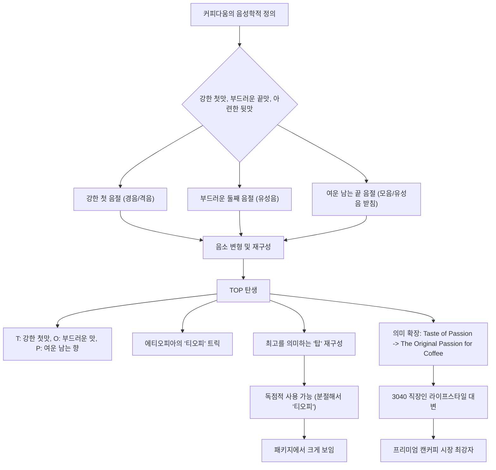
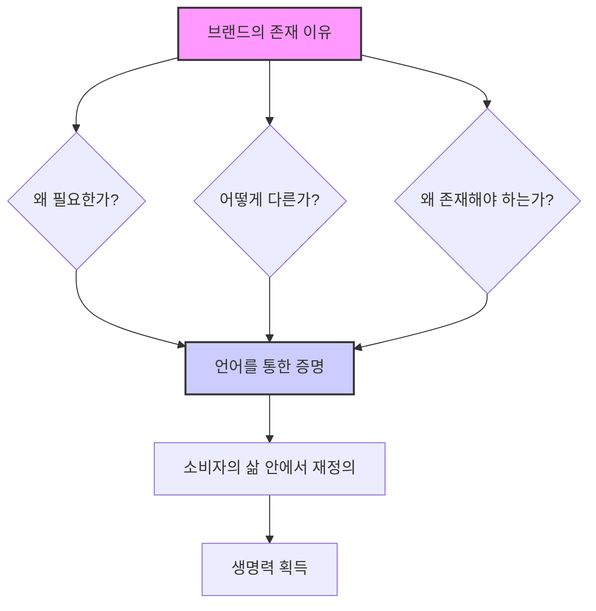
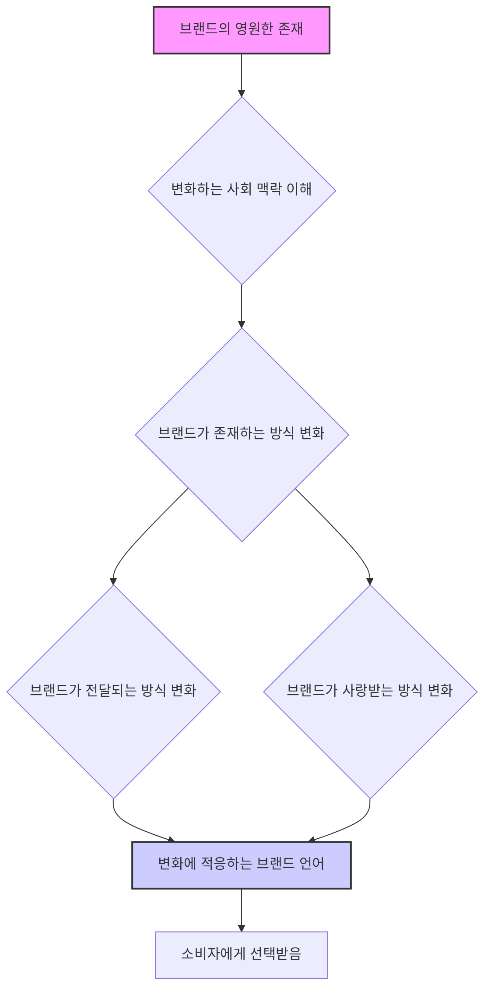

## 책 소개
이 책은 민은정 작가가 25년간 브랜드 언어 전문가(버벌리스트)로 활동하며 쌓은 경험과 통찰을 담고 있어. 브랜드의 이름, 슬로건, 스토리, 메시지 같은 언어적 요소가 어떻게 브랜드를 성공으로 이끄는지, 그리고 소비자의 마음을 사로잡는 브랜드 언어 전략은 무엇인지 실제 사례를 통해 쉽고 재미있게 알려주는 책이야. 브랜딩에 관심 있는 사람이라면 누구나 읽어보면 좋을 거야.

## 본문 정리

## 1. 브랜드 언어 전문가, 버벌리스트는 어떤 일을 할까? 

1. **브랜드에 생명을 불어넣는 사람**: 버벌리스트는 제품이나 서비스에 이름을 붙여 생명을 주는 일을 해.
  - 이름뿐만 아니라 슬로건, 스토리, 메시지 같은 언어적인 요소들을 더해서 브랜드의 매력을 엄청나게 키우고, 현실에서 살아 움직이게 만드는 역할을 하는 사람이야.
  - 마치 아기가 태어나면 이름을 지어주고, 그 아기가 어떤 사람으로 자랄지 이야기를 만들어주는 것과 비슷하다고 보면 돼.
2. **다양한 히트 브랜드를 만든 산파 역할**: 민은정 작가는 25년 동안 500개가 넘는 프로젝트를 진행하면서 수많은 히트 브랜드를 탄생시켰어.
  - 예를 들어, 2018년 평창 동계 올림픽 슬로건인 "패션 커넥티드(Passion. Connected.)", 대한민국 관광 브랜드 "이매진 유어 코리아(Imagine Your Korea)" 같은 것들이 있지. 
  - 그 외에도 기아 K9, 오피러스, 로체, 알페온, 싼타페, 코나, 아난티, 자연은, 국립공원 베이스 등 우리가 잘 아는 브랜드 이름들이 모두 그의 손을 거쳐 탄생했어. 
3. **브랜드의 운명을 결정하는 순간**: 작가는 브랜드의 운명이 이름이 붙여지는 그 순간에 결정된다고 믿어. 
  - 브랜드가 세상을 지배하는 시대에, 브랜드 이름을 짓고 그 이야기를 만들어주는 것이 세상에서 가장 의미 있는 일이라고 생각해. 
  - 이 책은 이런 매력적인 순간들을 많은 사람들과 나누고, 브랜딩에 대한 깊은 통찰을 주기 위해 기획된 거야. 

## 2. 브랜드 언어의 중요성: 왜 이름이 중요할까? 

1. **기업의 가장 중요한 자산, 브랜드**: 브랜드는 기업에게 가장 중요한 재산과 같아. 
  - 브랜드가 좋으면 제품 가격을 더 높게 받을 수 있고(프라이스 프리미엄), 고객들이 다른 회사로 떠나지 않게 막아주며, 어려운 상황에서도 회사가 계속 살아남을 수 있게 해주는 힘이 있어. 
  - 특히 요즘처럼 4차 산업혁명 시대에는 고객과 만나는 방식(터치 포인트)이나 제품을 찾아보는 과정(탐색 프로세스)이 계속 바뀌고 있어서, 브랜딩의 역할이 점점 더 중요해지고 있어. 
2. 브랜딩** 활동의 핵심, 언어**: 브랜딩은 시장과 고객을 분석하고, 고객에게 최고의 경험을 주는 모든 과정을 말하는데, 이 모든 과정이 다 중요해. 
  - 그중에서도 브랜드의 개념(콘셉트)과 이름을 만들고, 그걸 효과적으로 전달하는 슬로건과 스토리를 만드는 '버벌 브랜딩'이 가장 중요하다고 할 수 있어. 
  - 특히 브랜드 이름을 짓는 '브랜드 네이밍'은 모든 전략적인 계획이 결국 이름으로 모이고, 디자인이나 홍보의 기준도 이름이 되는 경우가 많기 때문에 더욱 중요해. 
3. **언어는 브랜드의 집**: 독일 철학자 하이데거는 "언어는 존재의 집"이라고 말했는데, 이 말을 브랜드에 적용하면 "언어는 브랜드의 집"이라고 할 수 있어. 
  - 브랜드의 정체성(어떤 브랜드인지)은 언어로 정해지고, 브랜드는 언어로 만들어진 이 틀을 벗어날 수 없어. 
  - 브랜드의 첫인상과 운명을 결정하는 것도 브랜드 이름이고, 브랜드의 성격을 드러내는 건 슬로건, 브랜드에 인격을 부여하는 건 브랜드 스토리야. 
  - 고객과 대화하는 것과 같은 브랜드 메시지와 콘텐츠는 브랜드의 매력을 완성하고 고객과의 관계를 계속 이어가게 해줘. 
  - 결국 브랜드 언어의 목표는 브랜드를 기억하게 하고, 공감하게 하며, 인간적인 매력을 부여하고, 영원히 살아있게 하는 것이라고 할 수 있어. 

## 3. 브랜드 언어 전문가가 부족한 현실 
1. **전문가 부족**: 우리나라에는 브랜드 이름에 대한 전략적인 이론과 풍부한 경험을 가진 브랜드 언어 전문가가 많지 않아. 
  - 그래서 브랜드 언어 개발에 관심 있는 일반인이나 학생, 실무에 도움을 받고 싶은 마케터나 브랜드 담당자를 위한 관련 서적도 많지 않은 것이 현실이야. 
  - 이 책은 민은정 작가가 직접 진행했던 프로젝트들을 바탕으로 쓰였기 때문에, 브랜드 개발에 대한 실용적인 통찰을 주고, 배경지식이 없는 일반인도 흥미롭게 읽을 수 있을 거야. 

## 4. 브랜드 언어의 힘: 감각을 자극하고 상상하게 하는 언어 

1. **상상하게 만드는 언어의 힘**: 언어의 가장 큰 가치 중 하나는 사람들에게 상상력을 불어넣는 힘이야. 
  - 브랜드는 이런 언어의 힘을 잘 활용해야 해. 
  - 만약 브랜드가 의도한 대로 소비자가 맛이나 향기를 상상하고 느낄 수 있다면, 그보다 더 효과적인 브랜딩은 없을 거야. 
2. **다양한 느낌을 주는 언어**: 언어는 가벼운 것과 무거운 것, 고급스러운 것과 친근한 것까지, 우리가 의도한 대로 다르게 느끼도록 만들 수 있어. 
  - 소비자들이 우리 브랜드를 어떻게 느낄지 상상하면서, 그 느낌을 만들어주는 틀(프레임)을 언어로 만들어야 해. 
  - 언어로 사람들의 감각을 자극하고, 오감으로 상상하게 만드는 것이 중요하다고 할 수 있어. 

## 5. 성공적인 브랜드 네이밍 사례: TOP와 카누 

1. **커피다움에서 태어난 **TOP: 동서식품의 프리미엄 원두 캔커피 'TOP'은 어떻게 탄생했을까? 
  - **커피 전문가들의 자부심**: 동서식품 담당자들은 "커피에 대해서라면 대한민국에서 우리가 가장 잘 안다"는 자부심이 대단했어. 
  - **'**커피다움**'의 기준**: 그래서 브랜드 이름을 평가할 때 가장 중요한 기준은 '커피다움'을 느낄 수 있는가였어. 커피 전문가들이 직관적으로 느끼는 '커피다움'이 없으면 아무리 좋은 이름 후보라도 가차 없이 탈락시켰지. 
  - 음성학적 정의: '커피다움'이란 무엇일까? 작가는 커피 맛을 음성학적으로 정의했어. 
  - 커피 맛은 향에서 시작하고, 입안에 머금었을 때 첫맛은 강하고, 목을 넘어갈 때 끝맛은 부드러우며, 마시고 나면 아련한 여운이 남아. 
  - 이것을 소리로 바꾸면 '강한 첫 음절', '부드러운 둘째 음절', '여운이 남는 끝 음절'이 돼. 
  - 강한 소리는 'ㅋ, ㅌ, ㅍ, ㅊ' 같은 거센 소리(격음)나 'ㄲ, ㄸ, ㅃ, ㅉ' 같은 된소리(경음)로 만들고, 부드러운 소리는 'ㅁ, ㄴ, ㅇ, ㄹ'처럼 성대가 울리는 소리(유성음)로 만들어. 
  - 이름이 불린 후 여운을 남기려면 마지막 음절이 받침 없는 모음이나 유성음 받침으로 끝나서 공기 중에 진동이 남아야 해. 
  - **TOP의 탄생**: 이런 음성학적 기준에 따라 여러 소리를 변형하고 재구성한 결과, 'TOP'이라는 이름이 눈에 띄었어. 
  - 'T'는 커피의 강한 첫맛, 'O'는 부드러운 맛, 'P'는 여운이 남는 향을 각각 표현해. 
  - **숨겨진 트릭**: 커피콩이 처음 발견된 에티오피아의 '에'와 '아'를 빼면 '티오피'가 남고, 커피와 '티오피'의 마지막 글자가 모두 '피'로 끝나는 직관적인 트릭도 숨어있어. 
  - **최고의 의미**: 'TOP'은 '최고'를 뜻하는 단어 '탑(Top)'을 재구성한 것이기도 해. '최고'라는 단어는 누구나 탐내지만 법적으로 독점할 수 없는데, '티오피'라고 분절해서 읽으면 독점적인 사용이 가능해져. 
  - **시각적 효과**: 게다가 알파벳 3개로 구성되어 패키지에서 경쟁 브랜드 이름보다 훨씬 크게 보여서, 진열대에서 눈에 확 띄는 효과도 있어. 
  - **의미 확장**: 나중에 'TOP'의 의미를 '테이스트 오브 패션(Taste of Passion)'으로 풀었고, 이는 '더 오리지널 패션 포 커피(The Original Passion for Coffee)'라는 메시지로 발전해서 30~40대 직장인들의 라이프스타일을 대변하는 프리미엄 캔커피의 존재 이유를 표현했어. 
  - **시장 최강자**: 'TOP'은 롯데칠성음료의 '칸타타'와 함께 프리미엄 원두 캔커피 시장의 최강자가 되었어. 음료수 시장은 브랜드의 역할이 매우 큰 시장이라, 획기적인 계기가 없으면 브랜드 순위가 잘 바뀌지 않아. 

2. **새로운 카테고리를 연 **카누: 동서식품의 인스턴트 원두커피 '카누'는 어떻게 새로운 시장을 만들었을까? 
  - **믹스 커피의 변화**: 1976년 동서식품이 세계 최초로 믹스 커피를 선보인 후, 한국인들은 믹스 커피의 달콤한 맛에 익숙해졌어. 
  - 하지만 카제인나트륨 논란, 건강 트렌드 변화, 커피 전문점의 폭발적인 증가 등으로 믹스 커피 시장은 점점 어려워졌지. 
  - **위기를 기회로**: 동서식품은 차별화된 추출 방식으로 원두커피 맛을 구현한 인스턴트 커피를, 그것도 가장 익숙한 봉지 커피 형태로 내놓으면서 위기를 기회로 바꿨어. 
  - **'**봉황을 접는 것**'**: 작가는 원두커피의 깊은 맛을 즐기고 싶다는 요구와 드립 커피를 내릴 시간이 없다는 상반된 요구를 동시에 충족시키는 것을 '봉황을 접는 것'이라고 표현했어. 
  - 친근하면서도 전문적이고, 아주 쉬우면서도 새로운, 서로 모순되는 두 가지 가치를 모두 포기할 수 없을 때 쓰는 말이야. 마치 상상 속 동물인 봉황처럼 말이지. 
  - 새로운 카테고리** 창출**: 이 프로젝트에서 가장 우려했던 점은 새로운 브랜드가 믹스 커피 카테고리에 갇히는 것이었어. '타 먹는 원두커피'라는 새로운 카테고리를 만들어야 했지. 
  - 소비자가 "이건 다른 제품이다"라고 직관적으로 느낄 수 있어야 하는데, 이걸 가능하게 하는 것이 바로 브랜딩이야. 
  - 그래서 기존 커피 브랜딩 규칙을 의도적으로 무시하고, 부드럽고 여성스러운 분위기 대신 시크하고 강렬한 브랜드를 개발하는 데 집중했어. 
  - **카누의 탄생**: 심플하고 임팩트 있으며, 새로운 카테고리를 대표하고, 다양한 맛으로 확장 가능하면서도 '커피다움'을 잃지 않는 이름이 필요했어. 
  - 한국 발음으로 두 음절, 영어 스펠링 다섯 개를 넘지 않는 후보들 중에서 '카누(KANU)'가 눈에 띄었어. 
  - '일반적인 커피가 아니다'라는 의미를 담고 있었지. 
  - '새로운 커피(New Cafe)'라는 아이디어를 발전시켜 '카페 뉴(Cafe New)'를 만들고, 이걸 줄여서 '카누'로 완성했어. 
  - **음성학적 매력**: '카누'가 선택된 중요한 이유는 음성학적 매력 때문이야. 생소한 이름이 기억에 남으려면 거친 소리(무성음)로 시작하는 것이 유리해. 
  - '카'의 강한 소리에 '누'의 부드러운 소리(유성음)가 따라붙어 부드러운 맛을 표현하는 것은 'TOP'과 같은 공식이야. 
  - **커피 연상**: '카'로 시작하는 이름은 '카페'를 자연스럽게 연상시켜 커피다움을 표현하려 한 것도 'TOP'과 공통점이야. 
  - **K 스펠링**: 카이스트 실험 결과, 한국인 뇌에서 알파벳 'K'가 가장 활발하게 반응한다는 점을 고려해 'C' 대신 'K'를 사용했어. 
  - 슬로건: 제품의 속성을 설명하는 대신, "세상에서 가장 작은 카페"라는 슬로건으로 브랜드 개념을 잡았어. 
  - 이 문구는 카페에서 맛있는 원두커피를 집이나 사무실에서 간편하게 즐긴다는 제품 특성의 상징성과 공감대를 더해줬지. 

## 6. 네이밍이 실패하는 10가지 이유 

1. **"**이름 짓기** 누구나 할 수 있는 거 아닌가요?"**: 누구나 할 수는 있지만, 아무나 잘할 수는 없어. 
  - 언어적인 소양, 시장과 브랜딩 전략, 법률 지식이 모두 필요하기 때문이야. 
2. **"최대한 빨리 만들어 주세요"**: 서두르면 망해. 
  - 좋은 이름은 충분히 생각하고 숙성될 시간이 필요해. 
3. **"이름에 모든 것을 담아주세요"**: 너무 많은 것을 담으려 하면 아무것도 집중되지 않아. 
  - 결국 애매모호한 이름이 되어 실패하게 돼. 
4. **"우리 제품은 국내용 제품인데요"**: 요즘은 사업에 국경이 없잖아. 
  - 어디까지 진출할지 모르니, 처음부터 글로벌 브랜드 기준을 넘어서는 이름을 만드는 것이 중요해. 
5. **"모든 상표권과 도메인을 완벽하게 확보해야 합니다"**: 지금 시점에서 변형 없이 완벽한 닷컴 주소를 확보할 수 있는 이름은 없어. 
  - 이름에 적절한 확장자를 더해서 주소를 확보하거나, 이미 팔린 도메인을 구입하는 전략을 선택해야 해. 
6. **"무조건 1등 브랜드보다 더 좋은 이름으로 해주세요"**: 브랜드는 아기처럼 자라나는 것이고, 이름은 그 탄생이야. 
  - 새로 만든 이름을 이미 시장에서 성공한 경쟁 브랜드와 비교하면 당연히 부족하게 느껴질 수밖에 없어. 성공한 브랜드는 이름에 디자인과 메시지, 스토리가 더해져 완성된 것이기 때문이야. 
  - 갓 태어난 아기를 다 자란 어른과 비교하는 것과 같다고 보면 돼. 
7. **"이건 제 취향이 아닙니다"**: 네이밍은 개인의 취향이 아니라 전략이야. 
  - 이름을 결정할 때는 '마음에 드느냐, 들지 않느냐'가 아니라 '전략적으로 옳으냐, 옳지 않으냐'로 판단해야 해. 
8. **"의견이 통일되지 않네요"**: 단어는 사전적인 의미(외연적 의미)와 머릿속에 떠오르는 이미지(내연적 의미)의 합이야. 
  - 사람마다 경험이 다르기 때문에 단어를 보고 느끼는 내연적 의미도 달라져. 그래서 의견이 통일되지 않는 것은 당연한 일이야. 
9. **"디자인은 우리가 알아서 하겠습니다"**: 이름과 디자인은 뿌리가 같아. 
  - 같은 개념을 하나는 언어로, 다른 하나는 시각적으로 표현하는 것이기 때문에, 브랜드의 개념, 이름, 디자인을 일관성 있게 개발해야 해. 
  - 이름과 디자인을 따로 개발하면 일관성이 사라져서 실패할 수 있어. 
10. **"이제 다 된 건가요?"**: 네이밍은 브랜드 스토리와 홍보(커뮤니케이션)로 완성돼. 
  - 아무리 좋은 이름이라도 효과적으로 활용하지 못하면 소용없어. 이름을 보완하고 강조하는 메시지와 스토리를 개발해서 시너지 효과를 내야 해. 
  - 브랜딩은 한 사람의 인격을 만들고 키우는 것과 같아서, 브랜드도 나이가 들면서 더 성숙하고 매력 있어져야 해. 

## 7. 브랜드의 존재 이유를 증명하는 언어의 힘 

1. **존재 이유를 증명해야 하는 브랜드**: 우리 모두는 왜 사는지(존재 이유)를 증명하며 살아가잖아. 브랜드도 마찬가지야. 
  - 세상에는 비슷한 브랜드가 너무 많기 때문에, 우리 브랜드가 왜 필요한지, 다른 브랜드와 어떻게 다른지, 왜 존재해야 하는지를 증명해야 해. 
  - 사람은 존재 이유를 증명하지 못해도 살아가지만, 브랜드는 이걸 증명하지 못하면 시장에서 사라져 버려. 
2. **언어가 가장 효과적인 도구**: 짧은 시간 안에 존재 이유를 설득하고 증명하는 데 가장 효과적인 도구는 바로 '언어'야. 
  - 우리 브랜드를 회사 입장이 아니라, 소비자의 삶 속에서 바라보고, 소비자의 언어로 존재 이유를 다시 정의해야 해. 

## 8. 이름이 가치를 만드는 방식: 언어 프레임의 중요성 

1. **이름이 만드는 인식**: 셰익스피어는 "장미를 다른 이름으로 불러도 장미는 지금처럼 향기로울 것"이라고 말했지만, 작가는 김춘수 시인의 "내가 그의 이름을 불러 주기 전에는 그는 다만 하나의 몸짓에 지나지 않았다. 내가 그의 이름을 불러 주었을 때 그는 나에게로 와서 꽃이 되었다"는 말에 공감해. 
  - 우리는 언어를 통해 대상을 느끼고 인식하기 때문에, 대상을 어떻게 인식할지 틀(프레임)을 만들어주는 것이 바로 언어의 역할이야. 
  - 예를 들어, 똑같은 맛인데 '냉커피'에서는 옛날 다방 맛이 나고, '아이스 아메리카노'에서는 스타벅스 맛이 나는 것처럼 말이야. 
  - '계피'보다는 '시나몬'이 더 맛있게 느껴지는 것도 같은 이치지. 
2. **유니클로 히트텍 사례**: 유니클로의 '히트텍'은 '빨간 내복'으로 불리던 내복에 대한 인식을 완전히 바꿔버렸어. 
  - 패션 감각 없는 나이 든 사람들이 입는 옷이었던 내복을, 패션을 해치지 않는 얇고 기능적인 옷으로 끌어올린 것이 바로 '히트텍'이라는 이름의 힘이야. 
3. **기존 언어 프레임을 버리지 못하는 이유**: 많은 브랜드들이 쉽고 명료한 답을 찾을 수 있는데도 먼 길을 돌아가는 이유는 뭘까? 
  - 미래의 변화를 알면서도 기존의 언어 틀(프레임)을 버리지 못했기 때문이야. 
  - "나는 원래 그랬어"라고 말하며 변화를 거부하는 브랜드는 결국 시장에서 사라질 수밖에 없어. 

## 9. 이름의 길이는 어느 정도가 좋을까? 
1. **가장 짧은 이름, 한 글자**: 가장 짧은 이름은 한 글자로 된 이름이야. 
  - 잘 만든 한 글자 이름은 그 안에 모든 이야기(기승전결)가 다 담겨 있어야 해. 
  - '땅', '흙', '물', '불', '산' 같은 한 글자 단어들을 생각해보면, 그 안에 힘(포스)과 강렬함(임팩트), 그리고 모든 이야기가 느껴질 거야. 

## 10. 브랜드 시대의 정서를 대변하는 언어의 힘 

1. **사랑받고 함께 살아가는 브랜드**: 브랜드는 사람들에게 사랑받고, 사람들 사이에서 함께 살아갈 때 의미가 있어. 
  - 사람들이 SNS에 쇼핑 목록을 올리는 것도, 그 브랜드가 자신을 대변한다고 믿기 때문이야. 
  - 사람들의 감성(정서)과 가치관은 시대의 흐름에 따라 계속 변해. 
  - 브랜드는 소비자를 이해하고 그들의 감성을 대변한다고 느끼게 해야 해. 때로는 긍정적인 시대정신을 스스로 만들어 나가는 리더 같은 모습을 보여주는 것도 잊지 말아야 해. 
2. **역사성과 변화의 **딜레마: 디자인은 세련되게 바꿀 수 있지만, 이름을 바꾸는 것은 기존 고객을 배신하는 것과 같아. 
  - 그렇다고 옛것만 고집하면 새로운 고객을 끌어모으기 힘들지. 이게 바로 '진퇴양난의 딜레마'야. 
  - 책에는 이런 딜레마를 극복하고 성공한 사례들이 다양하게 소개되어 있어. 
3. **이름에서 가족을 발견하다: **패밀리 보이스: 기업이 '패밀리 보이스'를 적용할 때는 몇 가지 주의할 점이 있어. 
  - 브랜드 정체성** 반영**: 브랜드의 고유한 특징(정체성)을 잘 담아야 해. 
  - **지속 가능한 주제**: 오랫동안 유지할 수 있는 주제여야 해. 
  - **적용 기준**: 패밀리 보이스를 적용하는 명확한 기준이 있어야 해. 
  - 메르세데스 벤츠나 BMW 같은 자동차 회사들이 '패밀리 룩'을 유지하는 것처럼, 브랜드도 자신만의 철학, 목소리, 전략을 담아 일관되게 전달해야 해. 

## 11. 시대의 맥락을 읽는 브랜드 언어 

1. **브랜드로 세상을 이해하는 사회**: 우리는 브랜드로 세상을 이해하는 사회에 살고 있어. 브랜드는 사회의 중요한 구성원이지. 
  - 이런 사회에서 브랜드가 영원히 존재하려면, 변화하는 사회의 흐름(맥락)을 이해하고 함께 가야 해. 
  - 브랜드가 존재하고, 전달되고, 사랑받는 방식은 시간과 기술의 흐름에 따라 계속 달라져. 
  - 이런 변화된 방식에 잘 적응하는 브랜드 언어를 만들어서, 달라진 맥락에서도 소비자에게 선택받을 수 있도록 해야 해. 
2. 단순하고 날카로운 이름: 강한 것은 구구절절 길게 말하지 않아. 잘 벼려진 칼날이 단순하면서도 상대를 위협하는 날카로움이 있는 것처럼, 이름도 그래야 해. 
  - 아주 단순하면서도 날카로운, '촌철살인' 같은 이름이 필요하다는 거야. 
3. **새로운 카테고리의 언어 전략**: 어떤 분야를 새롭게 시작하는 선구자(프론티어)의 언어 전략은 두 가지가 있어. 
  - 완전히 새로운 언어를 창조하는 것.
  - 또는 서비스의 특징을 직관적으로 말해주는 것. 

## 12. 버벌리스트가 되기 위한 4가지 자세 

1. **마그리트처럼 **낯설게 보기: 새롭지 않은 것을 새롭게 보이도록 해야 해. 
  - 그러려면 브랜딩을 하는 사람 스스로가 익숙한 것을 낯선 시선으로 볼 줄 알아야 해. 익숙한 것을 낯설게 볼 때 새로운 의미를 발견할 수 있어. 
2. 피카소처럼 몰입하기: 어떤 주제에 끝없이 파고들다 보면, 세상 모든 것이 그 주제를 중심으로 돌아가는 것처럼 느껴질 때가 있어. 
  - 이런 경지에 이르러야 세상 모든 익숙한 것들이 그 주제와 연결되어 다른 의미를 뿜어내게 돼. 
3. 마티스처럼 계속하기: 몰입하는 힘은 계속하는 힘과 연결되어 있어. 
  - 좋은 아이디어는 누가 더 많이 생각했는지의 싸움이야. 중간까지만 파고들면 중간 정도의 결과밖에 나오지 않아. 
4. **꼿꼿하게 **거절당하기: 어떤 프로젝트든 수백, 수천 가지 아이디어가 나오지만, 그중에서 선택되는 것은 단 하나뿐이야. 
  - 다시 말해, 단 하나의 결과물이 선택되기 위해서는 수백, 수천 개의 아이디어가 거절당한다는 뜻이지. 
  - 이런 거절을 꼿꼿하게 견디는 사람이 결국 최고의 아이디어를 탄생시킬 수 있어. 

