## 브랜드로 남는다는 것: 평범함을 넘어 특별함으로 가는 길
이 책은 마케팅 전문가 홍성태 교수가 제자와의 대화를 통해 브랜딩의 핵심을 쉽고 재미있게 풀어낸 책이야. 어떻게 하면 우리 브랜드가 사람들의 마음속에 오래도록 기억되고 사랑받을 수 있을지, 그 비법을 알려주는 책이라고 보면 돼. 단순히 물건을 파는 것을 넘어, 고객의 마음을 사로잡는 브랜드가 되기 위한 구체적인 방법들을 배울 수 있을 거야.

## 1. 브랜딩, 딱 두 가지만 기억해! 

브랜딩이 어렵다고 생각할 수 있지만, 사실 딱 두 가지만 잘하면 돼. 마치 맛있는 요리를 만들 때 좋은 재료와 뛰어난 요리 솜씨가 필요한 것처럼 말이야.

1. 컨셉 잡기** (의미 설정)**:
  - 우리 브랜드가 고객에게 어떤 의미로 다가가고 싶은지, 무엇을 말하고 싶은지 명확하게 정하는 거야.
  - 예를 들어, "우리는 단순히 신발을 파는 게 아니라, 당신의 도전을 응원하는 브랜드야!"처럼 말이지.
2. 브랜드 체험:
  - 그 컨셉을 고객이 직접 느끼고 경험하게 해주는 것이 중요해.
  - 아무리 좋은 컨셉이라도 고객이 경험하지 못하면 아무 소용이 없겠지?

## 2. '왜?'라는 질문으로 업의 본질을 찾아봐 

사람들이 왜 특정 제품이나 서비스를 이용하는지, '왜?'라는 질문을 계속 던져보는 것이 중요해. 마치 어린아이가 궁금한 게 많아서 계속 "엄마, 이건 왜 이래?" 하고 묻는 것처럼 말이야.

1. 고착 개념** 탈피**:
  - 사람들은 보통 브랜드를 특정 제품이나 서비스로만 생각하는 경향이 있어. 예를 들어, 나이키는 신발 가게, 배스킨라빈스는 아이스크림 가게처럼 말이야. 이걸 고착 개념이라고 해. 
  - 하지만 이런 고착 개념에 갇히지 않고, '왜 사람들이 우리 가게에 올까?'를 깊이 생각해 보면, 우리 사업의 진짜 본질을 찾을 수 있어. 
  - 신세계 스타필드를 생각해 봐. 사람들은 비싼 물건을 사기보다 식당가에서 시간을 보내는 경우가 많아. 정용진 부회장의 의도는 바로 고객의 '시간'을 빼앗는 것이었지. 
  - 이처럼 발상을 뒤집어 보면 새로운 제품이나 서비스 아이디어를 많이 발견할 수 있을 거야. 
2. **'왜' 질문의 힘**:
  - 사람들이 왜 치킨과 맥주를 함께 먹으러 가는지, 왜 요가복을 따로 사는지, 왜 한의원에 꾸준히 가는지 스스로에게 질문하고 답을 찾아봐. 
  - 이 질문을 통해 우리 브랜드가 고객에게 제공하는 진짜 가치가 무엇인지 알게 될 거야.
  - 예를 들어, 돈가스 가게 '카츠 오도'는 단순히 돈가스를 파는 곳이 아니라, 손님들의 발걸음을 소중히 여기고 행복한 시간을 제공하는 곳이라는 본질을 찾았어. 

## 3. 우리 브랜드의 핵심을 찾아 응축하기 

우리 브랜드가 소비자에게 말하고 싶은 강점이나 특징을 형용사로 쭉 나열해 봐. 아마 10가지도 넘을 거야. 그걸 절반으로 줄이고, 또 절반으로 줄여봐. 마치 여러 재료를 넣고 끓여서 진한 육수를 만드는 것처럼, 핵심만 남기는 과정이야.

1. 핵심 가치** 응축**:
  - 이 과정을 통해 우리 브랜드의 진짜 핵심에 다가갈 수 있어.
  - 구성원들과 함께 이 작업을 해보면 브랜드에 대해 깊이 고민하는 좋은 기회가 될 거야. 
  - 피카소가 황소 그림을 단순한 선 몇 개로 표현하기까지 수많은 연습과 본질에 대한 이해가 필요했던 것처럼, 우리 브랜드의 본질도 꾸준히 지켜가면서 응축해야 해. 
2. **변화 속의 한결같음**:
  - '한결같다', '변함없다'는 말이 변화가 없다는 뜻이 아니야. 
  - 사람이든 제품이든 지루함 없이 계속 사랑받으려면 초심을 잃지 않으면서도 끊임없이 변신해야 해. 
  - 마치 애플이 아이팟에서 시작해 아이폰, 맥북 등 다양한 제품을 내놓으면서도 '단순함'이라는 본질을 유지하는 것처럼 말이야. 

## 4. 비즈니스의 중심축, 피봇(Pivot)을 활용해 

비즈니스에서 **피봇(Pivot)**은 기존 사업의 핵심 자산을 활용해서 사업 방향을 바꾸거나 확장하는 전략이야. 마치 농구 선수가 한 발을 축으로 다른 발을 움직여 방향을 바꾸는 것처럼 말이지.

1. **피봇의 **핵심 자산:
  - 기업의 핵심 자산은 제품의 고유한 형태나 원료, 충성도 높은 고객층, 운송 수단, 생산 시설 같은 유형 자산, 풍부한 경험이 축적된 기술력, 강력한 브랜딩 등이 될 수 있어. 
  - 이런 핵심 자산을 축으로 삼아 새로운 기회를 찾아야 해.
2. **끊임없는 **피봇** 실천**:
  - 개인이나 기업 모두 끊임없이 피봇을 실천해야 해. 
  - 예를 들어, 마이크로소프트가 윈도우즈 판매 수익을 포기하고 클라우드 서비스에 집중하여 새로운 먹거리를 찾은 것처럼 말이야. 
  - 현재의 먹거리를 스스로 파괴하고 혁신해야 경쟁자가 들어오기 전에 새로운 기회를 만들 수 있어. 

## 5. 미션과 비전, 가슴 뛰는 꿈을 꾸고 밀고 나가! 

우리 기업이 왜 세상에 존재하는지, 그리고 어떤 미래를 꿈꾸는지 명확히 해야 해.

1. 미션:
  - 우리 기업이 세상에 존재할 이유를 말해. 마치 우리 삶의 목적과 같은 거야. 
2. 비전:
  - 가슴 설레게 하는 미래의 꿈이야. 마치 밤하늘의 북극성처럼, 조직의 역량을 한곳으로 모으는 초점이 되지. 
3. **성공의 두 가지 요소**:
  - 성공한 경영자들에게는 공통적으로 두 가지 요소가 있었어. 
  - **상상력**: 남들이 보지 못하는 것을 상상해서 비전을 품는 능력.
  - **추진력**: 그 비전을 말로만 끝내지 않고 어떻게든 밀고 나가는 힘. 
  - 비전 중심 경영이 성공하려면, 위기감을 고조시키고, 강력한 혁신 주도 그룹을 만들고, 비전을 충분히 소통하며, 단기적인 성공을 만들어 확산해야 해. 

## 6. 차별점을 만드는 세 가지 방법: FOB! 

이 세상에 우리 브랜드를 특별하게 만드는 방법은 딱 세 가지야. 이걸 **FOB (First, Only, Best)**라고 기억하면 돼.

1. **최초 (First)**:
  - 아무도 시도하지 않은 것을 가장 먼저 하는 거야.
2. **유일 (Only)**:
  - 우리만이 할 수 있는 독특한 것을 만드는 거야.
3. **최고 (Best)**:
  - 다른 어떤 브랜드보다 뛰어난 품질이나 서비스를 제공하는 거야.
  - 유럽의 하버드라고 불리는 인시아드 대학, 요가복의 룰루레몬, 커피계의 애플 블루보틀 등이 이런 차별점을 가진 성공 사례들이지. 

## 7. 이상적인 고객, '뮤즈'를 설정해 봐 

시장의 선두가 된 브랜드들은 누가 우리 제품을 입을지, 누가 우리 서비스를 이용할지 **이상적인 타겟(뮤즈)**을 칼같이 설정했어. 마치 예술가가 영감을 주는 뮤즈를 정하는 것처럼 말이야.

1. 뮤즈** 설정의 중요성**:
  - 룰루레몬은 '모션'이라는 가상의 뮤즈를 정했어. 연봉 10만 달러를 버는 30대 골퍼들처럼 구체적으로 말이지. 
  - 골프웨어 브랜드 로저 라인은 출범 당시 직원들에게 "우리의 타깃 연령은 딱 34세입니다"라고 명확히 말했어. 
  - 이렇게 구체적인 타겟을 설정하면, 그들을 위한 제품과 서비스를 더 효과적으로 만들 수 있어.

## 8. 고객 접점에서 공감 능력을 발휘해 

브랜딩의 완성은 결국 고객과 직접 만나는 고객 접점에서 이루어져. 아무리 멋진 광고를 해도, 고객을 만나는 직원이 영혼 없는 태도를 보이면 고객은 실망하게 돼.

1. **공감의 중요성**:
  - 고객 접점에서 가장 중요한 능력은 바로 공감이야. 
  - 콜센터 직원의 영혼 없는 공감은 고객을 허탈하게 만들 수 있어. 
  - 판매원들은 무의식중에 상대방도 자신처럼 생각하고 행동할 거라고 지레짐작하는 경향이 있는데, MBTI 같은 도구를 활용해서 고객의 성향을 이해하고 공감하는 노력이 필요해. 
  - '카츠 오도'의 사례처럼, 친절함은 고객의 발걸음을 소중히 여기는 마음에서 우러나오는 공감의 표현이라고 할 수 있지. 

## 9. 짧고 강렬하게, 숏폼 스토리텔링 

요즘은 모든 스토리가 **숏폼(Short-form)**으로 변해가고 있어. 마치 짧은 영상 클립처럼 말이야.

1. **숏폼의 시대**:
  - 정보가 너무 많아서 사람들의 주의 집중 시간이 짧아졌기 때문에, 길게 늘어지는 이야기에는 흥미를 잃기 쉬워. 
  - 짧고 간결하게 핵심을 전달하는 것이 중요해.
  - 일단 짧아야 다른 사람에게 공유하기도 편하겠지?

## 10. 조직을 움직이는 지식과 소통 

기업의 성공은 결국 **지식**과 **소통**에 달려있어. 마치 몸의 각 부분이 유기적으로 연결되어 움직이는 것처럼 말이야.

1. **지식의 힘**:
  - 지식만이 사업의 성패를 결정한다고 해도 과언이 아니야. 
  - 만약 어떤 팀이 목표 매출을 두 배나 달성했는데도 내년 목표를 높이는 것에 부담을 느낀다면, 그것은 그 성과가 '노력' 때문이지 '지식' 때문이라고 생각하지 않기 때문일 수 있어. 
  - 조직이 지식 관점을 갖는다면, '이 정도는 우리 실력으로 충분히 할 수 있어'라는 자신감을 가질 수 있게 돼. 
  - 지식의 반대말은 돈, 시간, 노력이라고 할 수 있어. 
2. **군중이 조직이 되려면**:
  - 단순히 사람들이 모여있는 군중이 목표를 달성하는 **조직**이 되려면 세 가지가 필요해. 
  - **공통의 목적**: 모두가 같은 목표를 바라봐야 해.
  - **협력 의사**: 서로 돕고 함께 일하려는 마음이 있어야 해.
  - **커뮤니케이션**: 서로의 생각과 상황을 끊임없이 공유하고 소통해야 해.
  - 특히 커뮤니케이션이 부족하면 같은 팀인데도 옆 사람이 무슨 일을 하는지 모르는 경우가 많아. 
  - 함께 토론하고, 리더가 비전을 이야기해주고, 구성원들이 직접 그림을 그리게 하는 등 다양한 방법으로 소통을 강화해야 해. 

```mermaid
graph TD
    A["브랜딩의 핵심"] --> B["컨셉 설정"]
    A --> C["브랜드 체험"]
    D["업의 본질 찾기"] --> E["고착 개념 탈피"]
    D --> F["'왜?' 질문 던지기"]
    G["브랜드 핵심 응축"] --> H["형용사 나열 및 축소"]
    G --> I["변화 속 한결같음 유지"]
    J["비즈니스 피봇"] --> K["핵심 자산 활용"]
    J --> L["끊임없는 방향 전환 및 확대"]
    M["미션과 비전"] --> N["존재 이유 설정 (미션)"]
    M --> O["미래 꿈 설정 (비전)"]
    M --> P["상상력과 추진력"]
    Q["차별점 만들기"] --> R["First (최초)"]
    Q --> S["Only (유일)"]
    Q --> T["Best (최고)"]
    U["고객 타겟 설정"] --> V["이상적인 뮤즈 설정"]
    W["고객 접점"] --> X["공감 능력 발휘"]
    Y["스토리텔링"] --> Z["숏폼 콘텐츠 활용"]
    AA["조직의 성장"] --> BB["지식의 중요성"]
    AA --> CC["효과적인 커뮤니케이션"]
```

