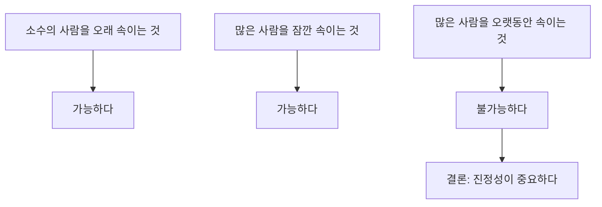
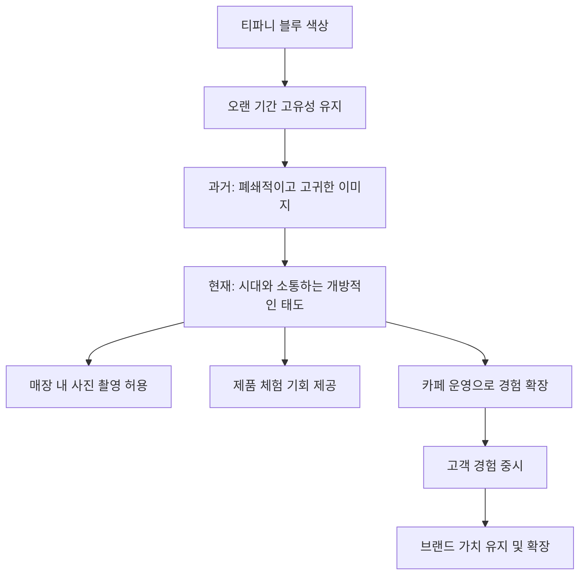

## 오래가는 것들의 비밀: 나만의 가치를 찾아 흔들리지 않는 브랜드 만들기
이 책은 죽어가는 브랜드를 살리고, 새로운 브랜드를 성공시키는 '기적의 손' 이랑주 박사님의 노하우를 담고 있어. 40개국 200개 기업, 1000개 가게를 연구하며 얻은, 오래도록 사랑받는 브랜드가 되는 7가지 비밀을 알려줄 거야. 단순히 예쁘게 꾸미는 비주얼 머천다이징을 넘어, 브랜드의 <u>본질적인 가치</u>를 찾아 튼튼한 뿌리를 내리는 방법을 알려주는 책이라고 보면 돼. 

## 1. 소비의 변화: 가치를 쫓는 시대 

옛날에는 사람들이 꼭 필요한 물건만 샀어. 그러다 조금 살만해지니까 비싼 사치품을 사기 시작했지. 하지만 지금은 단순히 비싼 물건을 샀다고 해서 사람들이 그 가치를 크게 인정해주지 않아. 

1. **가치 소비의 등장**:
  1. 요즘 사람들은 '이 신발을 사면 하나는 기부돼', '이걸 사면 내가 더 가치 있는 사람이 된 것 같아' 같은 <u>의미 있는 소비</u>에 돈을 쓴다는 거야. 
  2. 소비의 방향이 이렇게 바뀌고 있다는 점을 이해하는 게 중요해. 

## 2. 오래가는 브랜드의 핵심: 나만의 고유한 이미지와 가치 

오래가는 브랜드들은 자기만의 뚜렷한 가치와 이미지를 가지고 있어. 마치 노란색 단지 모양을 보면 '바나나 우유'가 딱 떠오르는 것처럼 말이야. 

1. **바나나 우유의 사례**: 
  1. 1970년대, 우유를 잘 못 마시는 사람들이 많았어. 그래서 빙그레는 사람들이 친근하게 느낄 수 있도록 <u>달 항아리 모양</u>의 단지 우유를 만들었지. 
  2. 이 단지 모양은 사람들에게 '친근함'을 주며 강렬하게 각인되었어. 
  3. 보관이나 생산이 어려워 중국 시장에서는 평범한 모양으로 출시했다가 실패했고, 다시 단지 모양으로 바꾸자 성공했어. 
  4. 이처럼 바나나 우유는 편의점에서 가장 잘 팔리는 제품이 되었고, 모두가 사랑하는 브랜드가 되었어. 
  5. 최근에는 목욕탕에서 바나나 우유를 마시던 문화가 사라지자, '옐로 카페' 같은 바나나 우유 테마 카페를 만들어 새로운 경험을 제공하며 변화에 적응하고 있어. 
2. **벨기에 와플과 프랑스 와플의 사례**: 
  1. 벨기에 와플은 두껍고 쫀득한 느낌이 있어. 
  2. 하지만 프랑스에서는 얇고 입에 쏙 들어가는 와플을 만들었어. 프랑스 사람들은 '우아하게' 먹는 것을 좋아하기 때문이지. 
  3. 이처럼 똑같은 와플이라도 <u>자신만의 스타일</u>을 찾아 '프랑스식 와플'이라는 고유한 이미지를 만들었어. 
3. 브랜드** 이미지의 **반복과 연결: 
  1. 사람들에게 기억되고 싶다면 <u>반복하고 연결</u>해야 해. 
  2. 스타벅스를 예로 들면, 녹색 로고를 중심으로 컵, 유니폼 등 곳곳에 녹색 이미지를 반복적으로 보여줘. 
  3. 이런 반복적인 노출은 사람들이 스타벅스를 떠올릴 때 무의식적으로 녹색을 연상하게 만들어. 
  4. 배스킨라빈스의 분홍색처럼, 아이스크림과 직접적인 관련이 없어도 반복적으로 연결되면 특정 색깔이 브랜드를 상징하게 되는 거야. 
  5. 색깔뿐만 아니라 이미지, 음악(CF 송) 등 다양한 요소를 반복적으로 연결하여 브랜드 인식을 강화할 수 있어. 

## 3. 빨리 가려 하지 마라: 본질을 찾는 6가지 질문 

빨리 성공하고 싶은 마음에 유행을 쫓아 남의 것을 따라 하면 오래가지 못해.  오래가는 브랜드를 만들려면 <u>나만의 고유한 가치</u>를 찾아야 해. 

1. **1000개의 매장을 상상하며 시작하라**: 
  1. 처음 하나의 매장을 만들 때부터 '이 매장이 1000개가 된다면 어떨까?'라고 상상해야 해. 
  2. 애플 스토어처럼 전 세계 어디를 가도 똑같은 조명, 각도, 물건 배치로 통일된 경험을 제공하는 것처럼 말이야. 
  3. 이렇게 깊이 있는 고민을 하면 남들이 쉽게 따라 할 수 없는 <u>나만의 독창적인 </u>브랜드를 만들 수 있어. 
2. **나만의 위치를 찾는 6가지 질문**: 
  1. **사명은 무엇인가?**: 내가 이 매장을 연 이유, 이 일을 시작한 근본적인 목적은 무엇일까? 
  2. **고객은 누구인가?**: 어떤 사람들이 내 고객이 될까? 
  3. **고객의 의견은 무엇인가?**: 고객들은 무엇을 불편해하고, 어떤 것을 원하는가? 
  - (예시: 작가 김새의 오디오 방송)
  - **고객**: 밤에 머리가 복잡하고 힘든데 공부는 하고 싶고, 책 읽을 시간 없는 30~50대 여성들. 
  - **불편함**: 종교색이 강하거나 야단치는 내용, 광고가 너무 많은 방송. 
  - **해결책**: 야단치지 않고 동기 부여, 종교색 배제, 광고 최소화, 긍정적이고 편안한 내용. 
  4. **내 목적은 무엇인가?**: 돈을 많이 버는 것, 나를 알리는 것 외에 나의 소명(진정한 부름)과 가까운 다른 목적은 없을까? 
  - (예시: 작가 김새의 오디오 방송)
  - **목적**: 사람들이 기적을 체험하고, 자신을 사랑하며, 삶이 긍정적으로 변화하는 것을 돕는 것. 
  5. **오래가는 방법은 무엇인가?**: 이 목적을 위해 아주 오래 지속될 수 있는 방법은 무엇일까? 
  6. **세상과 어떻게 연결할 것인가?**: 어떤 방식으로 나를 세상에 보여줄까? 
  - (예시: 작가 김새의 오디오 방송)
  - 연결: 유튜브 채널 운영, 악플 없는 네이버 카페 커뮤니티 구축. 
3. **본질을 찾는 과정**: 
  1. 이 질문들을 계속 던지면 <u>내 브랜드의 뿌리가 튼튼해져</u>. 뿌리가 튼튼해야 좋은 열매를 맺을 수 있어. 
  2. 위기가 닥쳤을 때도 '유니폼 색깔 때문인가?' 같은 엉뚱한 걱정 대신, '우리는 과연 고객에게 자신감을 주고 있는 걸까?'처럼 <u>본질적인 질문</u>을 다시 할 수 있게 돼. 
  3. (예시: 책방의 본질) 
  - **초기 생각**: '책이 많고, 온라인보다 직접 와서 사는 걸 좋아하는 고객을 위한 곳.' 
  - **문제점**: '없는 게 없는 책방'은 온라인 서점과 다를 바 없어. 
  - 본질** 재정의**: '사람들이 책과 사랑에 빠지게 하는 곳.' 
  - **전략 변화**: 책을 빽빽하게 꽂기보다 편안하게 볼 수 있도록 배치하고, 눈부시지 않은 조명을 사용하는 등 고객 경험에 집중. 
  4. 이렇게 나만의 전략과 상징을 찾으면 누구도 가져갈 수 없는 <u>단단한 씨앗</u>이 되고, 뿌리가 깊어져 풍성한 열매를 맺게 돼. 

## 4. 나만의 상징적인 이야기 (Symbolic Story) 만들기 

사람들의 마음을 움직이는 건 평범한 이미지가 아니라, <u>그 사람만이 할 수 있는 특별한 이야기</u>야. 이걸 마케팅에서는 <u>심볼릭 스토리(Symbolic Story)</u>라고 불러. 

1. **복숭아 이야기의 감동**: 
  1. 이랑주 박사님은 사람들에게 '복숭아에 대해 30초 동안 3가지 이야기를 해보세요'라고 질문해. 
  2. 대부분은 어려워하지만, 어떤 사람은 '어머니가 복숭아 알레르기가 있었는데, 아이들이 좋아해서 고무장갑을 끼고 복숭아를 씻어주셨다'는 이야기를 해. 
  3. 이 이야기는 듣는 모든 사람에게 감동을 주고 공감을 얻어. 
  4. 이처럼 <u>개인의 진심이 담긴 이야기</u>가 사람들의 마음을 파고들어 브랜드를 특별하게 만드는 거야. 
2. **엉뚱함이 매력이 되는 사례**: 
  1. 어떤 베이커리 카페의 로고가 '물개'였어. 빵집과 물개는 전혀 어울리지 않지? 
  2. 하지만 이 엉뚱함 때문에 사람들이 '왜 빵집 로고가 물개지?'라며 궁금해하고, 이야깃거리가 되어 입소문이 나게 돼. 
  3. 나만의 사연이 담긴 엉뚱함은 사람들의 <u>환호</u>를 이끌어낼 수 있어. 
3. **직원들에게 본질을 묻는 방법**: 
  1. 이랑주 박사님은 브랜드 컨설팅 시, 직원들을 앉혀놓고 '자신(브랜드)에 대해 떠오르는 것 10가지를 30초 안에 스케치북에 적으라'고 해. 
  2. 대부분의 사람들은 10개를 채우기 어려워하지만, 이렇게 적힌 단어들을 모아 중복되는 것을 묶고, 큰 단어들을 시각화하는 작업을 통해 브랜드의 본질을 찾아가는 거야. 

## 5. 나만의 문장으로 브랜드를 정의하라 

당신의 가게는 무엇을 파는 곳이야? 이 질문에 대한 <u>나만의 문장</u>을 가지고 있어야 해. 

1. **'여유를 편집해서 파는 곳'**: 
  1. 어떤 가게는 차, 그릇, 신발 등 여러 가지를 팔아서 잘 되기 어려워 보였어. 
  2. 하지만 사장님은 "여기는 <u>여유를 편집해서 파는 곳</u>이에요"라고 말했어. 
  3. 실제로 그 가게의 옷들은 몸에 딱 붙지 않고 여유로워 보이는 스타일이었고, 향 같은 것도 팔았어. 삶의 여유를 느끼는 데 필요한 모든 물건을 파는 곳이었던 거지. 
2. **'자신감을 만들어 주는 곳'**: 
  1. 어떤 회사는 자신감을 만들어 주는 곳이라고 정의했어. 
  2. 그렇다면 유니폼 색깔은 순수한 흰색이나 노란색, 핑크색보다는 <u>자존감을 상징하는 보라색</u>이 더 어울리겠지. 
  3. 이처럼 '나는 어떤 사람이지?', '나는 뭘 팔고 있지?', '나는 왜 이걸 시작했지?'를 파악하고, <u>나만의 문장으로 정의</u>하는 것이 중요해. 
3. **브랜드의 시작**: 
  1. 이런 질문을 통해 '나는 사랑을 담아서 파는 뭔가를 해야겠어'처럼 <u>자신만의 정의</u>를 내리는 순간부터 브랜드가 시작되는 거야. 
  2. 이것이 죽어가는 것도 살릴 수 있는 힘이 되고, 계속 파고들어 나만의 것을 만들다 보면 <u>원조 </u>브랜드가 되어 오래갈 수 있어. 

## 6. 모방이 아닌 창조: 나만의 고유한 법칙 찾기 

우리나라 제조업이 빨리 몰락한 이유 중 하나는 창조적인 개념 없이 <u>모방에만 익숙했기 때문</u>이라는 분석도 있어.  나만의 고유한 기술이나 생각하는 시간이 부족했던 거지. 

1. **파버카스텔의 사례**: 
  1. 연필 회사 파버카스텔의 디자이너들은 박람회장에 가도 다른 회사 팸플릿을 가져오지 않아. 
  2. 왜냐하면 남의 것을 보면 <u>자신만의 아이디어가 시작되기 어렵다</u>고 생각하기 때문이야. 
  3. 이처럼 나만의 이미지 찾기 질문을 계속 던지면 남의 것을 많이 참고하지 않아도 <u>더 좋은 새로운 것</u>을 만들어낼 수 있어. 
2. **블루보틀의 사례**: 
  1. 블루보틀 창업자는 음악을 하던 사람인데, '늦어도 맛있는 커피'를 고집했어. 
  2. 공장 커피 대신 핸드드립으로 좋은 원두를 사용하는 것만 고집했더니 대박이 났지. 
  3. 블루보틀의 선명한 로고처럼, <u>나만의 고유한 이미지</u>를 만들고 고집하는 것이 중요해. 
3. **흔들리지 않는 전통**: 
  1. 흔들리지 않고 피는 꽃은 없어. <u>흔들리는 진통이 흔들리지 않는 전통을 낳는다</u>는 말처럼, 자신에 대한 믿음을 가지고 흔들리면서 버텨나가면 언젠가 중심을 찾게 돼. 
  2. 빨리 성공하려는 방법들을 기웃거리지 말고, <u>나만의 고유한 법칙</u>을 찾을 수 있다고 믿어야 해. 

## 7. 경험을 선사하는 브랜드: 삼진어묵과 애플의 본질 

오래가는 브랜드는 단순히 물건을 파는 것을 넘어, 고객에게 특별한 경험을 선사해. 

1. **애플 스토어의 경험**: 
  1. 애플 매장은 물건을 많이 팔게 하는 전략 대신, '경험하는 곳'이라는 본질을 내세워. 
  2. 고객들은 물건을 마음껏 만져보고 사용해보면서 <u>제품을 경험</u>할 수 있어. 
2. **삼진어묵의 변신**: 
  1. 삼진어묵은 처음에는 부산의 수많은 어묵 납품업체 중 하나에 불과했어. 
  2. 하지만 '대한민국에서 가장 좋은 어묵을 만드는 가장 역사 깊은 곳'으로 <u>자체 브랜드를 재정의</u>했지. 
  3. 어묵을 '저렴한 반찬거리'에서 '간식'으로 정의를 바꾸면서, 어묵 크로켓, 어묵 꼬치 등 80개가 넘는 다양한 간식류 제품을 개발했어. 
  4. 즉석에서 튀겨주는 간식은 큰 인기를 얻었고, 장애인들을 고용하여 어묵을 만드는 모습은 <u>살아있는 </u>비주얼이 되었어. 
  5. 심지어 어묵을 '우주 단백질'로 정의하며 우주 비행사가 어묵을 쇼핑하는 이미지를 만들기도 했어. 
  6. 이처럼 삼진어묵은 죽어가던 것을 살리고, <u>오래가게 만드는 힘</u>을 보여주었어. 
3. **박카스의 **국토대장정: 
  1. 박카스는 원래 소화제였지만, <u>마케팅을 통해 </u>브랜드<u> 이미지를 확장</u>했어. 
  2. 매년 대학생 국토대장정을 지원하며, 학생들이 박카스를 통해 <u>특별한 경험</u>을 할 수 있도록 해. 
  3. 국토대장정에 참여했던 학생들은 박카스에 대한 좋은 기억을 가지게 되고, 나중에 아플 때 박카스를 찾게 될 거야. 
  4. 이처럼 기업이 고객에게 <u>경험을 선사</u>하는 마케팅은 브랜드에 대한 긍정적인 인식을 심어주고, 오래도록 기억되게 만들어. 
4. **SC제일은행의 오디오북 낭독자 오디션**: 
  1. SC제일은행은 청각 장애인을 위한 오디오북 낭독자 오디션을 매년 진행해. 
  2. 이런 활동에 참여하는 것만으로도 기업의 이미지가 긍정적으로 달라 보일 수 있어. 
5. M&M** 초콜릿의 특징**: 
  1. M&M 초콜릿은 맛있고, 무엇보다 <u>손에 녹지 않는다는 장점</u>이 있어. 
  2. 실제로 M&M은 '손에 묻지 않는 초콜릿'이라는 점을 마케팅 포인트로 내세웠어. 
  3. 이처럼 제품의 <u>고유한 특징</u>을 명확히 하고, 이를 통해 고객의 불편함을 해소해주는 것이 중요해. 

## 8. 포기하지 않는 용기: 나만의 길을 걷는 힘 

힘들어도 포기하지 않으면 새로운 길이 보이고, 그렇게 발견한 길은 <u>오랫동안 걸을 수 있는 나만의 길</u>이 돼. 

1. 발뮤다** 창업자의 이야기**: 
  1. 발뮤다 창업자 테라오 게이치 씨는 알루미늄 부품을 깎아 제품을 만들었지만 하나도 팔리지 않아 파산 위기에 처했어. 
  2. 너무 힘들 때 '산들바람이 주는 상쾌함'을 기억하고, 그 바람을 재현하는 선풍기 '그린 팬'을 만들었지. 
  3. 돈도 능력도 없는 절망적인 순간에 마음 깊은 곳에서 솟아나는 에너지를 느끼며 성공할 수 있었어. 
  4. 이처럼 힘들어도 포기하지 않으면 <u>나만의 길</u>을 찾을 수 있다는 것을 보여주는 사례야. 
2. **나에게 맞는 일을 찾아라**: 
  1. 오래오래 할 생각이라면 <u>나에게 맞지 않는 일은 할 수 없어</u>. 
  2. '이게 요즘 잘 되니까 빨리 성공하고 싶어'라는 생각으로 시작하면 결국은 접다 만 종이처럼 흐지부지될 수 있어. 
  3. 내가 평생 돈을 받지 않고도 할 수 있는 일, 정말 좋아하는 일을 찾아야 해. 
  4. 나 자신의 영역에서 시간을 효율적으로 사용하고, 자신과 어울리지 않는 불필요한 일은 과감히 줄여야 해. 
  5. 쉬운 길이 눈에 보일 때일수록 '이 길이 오래 가도 좋은 나만의 길인지' 깊이 생각해야 해. 
3. **꾸준함의 중요성**: 
  1. 자기 계발처럼 장기적으로 해야 하는 일은 꾸준히 하는 것이 정말 힘들어. 
  2. '그때 꾸준히 했더라면 어땠을까?' 하고 후회하는 경우가 많지. 
  3. (예시: 피아노) 어렸을 때부터 중학생 때까지 피아노를 쳤지만, 꾸준히 하지 않아 성인이 되어도 칠 만한 곡이 없는 것처럼 아쉬움이 남을 수 있어. 
  4. 관심 없는 일은 아예 버리더라도, 일단 시작한 일은 최소 6개월 정도 꾸준히 해보면서 자신에게 필요한지 판단하는 것이 중요해. 
  5. 매일 발을 씻는 것처럼 루틴<u>(습관)</u>을 만들면 꾸준히 무언가를 할 수 있는 동력이 돼. 
  6. 결국 오래가는 것들은 <u>고유의 향기</u>를 풍기며, 그 향기는 꾸준함이 뒷받침될 때 비로소 가능해. 

## 9. 진정성 있는 브랜드: 많은 사람을 오랫동안 속일 수 없다 

소수의 사람을 오랫동안 속일 수도 있고, 많은 사람을 잠깐 속일 수도 있지만, <u>많은 사람을 오랫동안 속일 수는 없어</u>. 

1. **진정성의 가치**: 
  1. 결국 중요한 것은 진정성이야. 
  2. 얼마나 다온지, 얼마나 진실한지, 얼마나 오래갈 수 있는지가 브랜드의 핵심 가치라고 보면 돼. 
  3. 힘들어도 포기하지 않고, 흔들리면서도 중심을 찾아 뿌리를 튼튼하게 만들면 좋은 열매를 맺을 수 있을 거야. 

## 10. 시대와 소통하는 브랜드: 티파니 블루의 변화 

티파니는 '티파니 블루'라는 고유한 색깔을 오랫동안 유지해왔어.  하지만 시대가 변하면서 고객과의 소통 방식도 달라졌지. 

1. **티파니의 변화**: 
  1. 예전에는 매장에 들어가기조차 어려울 정도로 폐쇄적이고 고귀한 이미지를 유지했어. 
  2. 하지만 요즘에는 시대와 소통하며 고객들이 매장에서 자유롭게 사진을 찍고, 제품을 만져볼 수 있게 해. 
  3. 심지어 카페를 만들어 고객들이 티파니의 분위기를 경험할 수 있도록 했어. 
  4. 이처럼 <u>고유한 정체성(티파니 블루)은 유지</u>하되, 고객 경험과 소통 방식은 <u>시대에 맞춰 변화</u>시키는 것이 오래가는 브랜드의 비결이야. 

