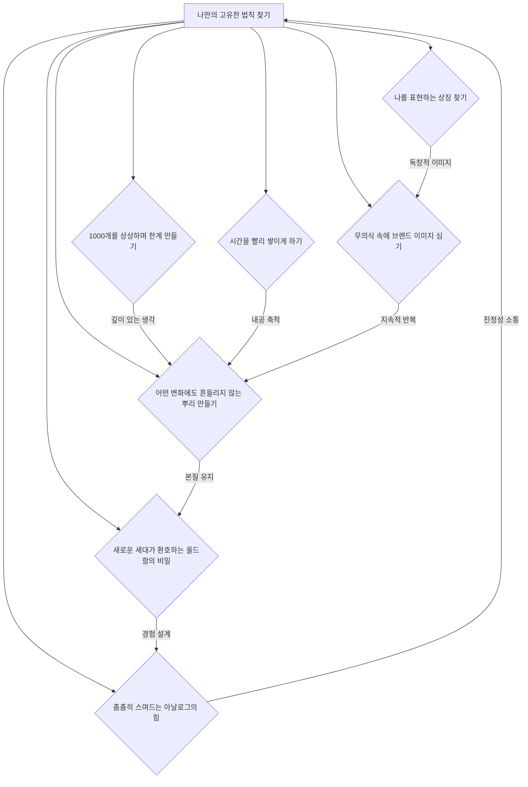

## 오래가는 것들의 비밀: 나만의 가치를 찾아 흔들리지 않는 브랜드 만들기
이 책은 40개 나라, 200개 기업, 1000개 가게의 성공 노하우를 분석하여, 빠르게 변하는 세상 속에서 어떻게 하면 나만의 브랜드를 만들고 오래도록 사랑받을 수 있는지 그 비밀을 알려준다. 단순히 물건을 잘 파는 기술을 넘어, 브랜드의 본질적인 가치를 발견하고 이를 시각적으로 표현하며 고객과 깊이 소통하는 방법을 제시한다. 이랑주 박사님은 이 책을 통해 흔들리는 시대에도 굳건히 살아남는 브랜드의 철학과 실질적인 전략을 이야기한다.

## 1. 소비의 변화: 가치를 사는 시대 

옛날에는 사람들이 꼭 필요한 물건만 샀어. 그러다가 조금 살만해지니까 비싼 사치품을 사기 시작했지. 그런데 지금은 어떨까? 단순히 비싼 물건을 샀다고 해서 사람들이 그 가치를 크게 인정해주지 않아.

1. **소비의 방향 **변화:
  - 이제 사람들은 물건 자체보다는 그 물건이 주는 <u>가치</u>에 돈을 쓴다.
  - 예를 들어, 신발을 하나 사면 다른 하나는 기부된다거나, 이 물건을 사는 행위 자체가 나에게 의미 있게 느껴지는 것에 지갑을 여는 거야.
  - 이처럼 소비의 방향이 '필요'에서 '사치'를 거쳐 '가치'로 바뀌고 있다.

## 2. 오래가는 브랜드의 핵심: 나만의 이미지와 가치 

오래가는 브랜드들은 자기만의 특별한 가치를 가지고 있고, 그 가치가 사람들의 마음속에 이미지로 딱 박혀있어. 마치 노란 단지 모양을 보면 바나나 우유가 떠오르는 것처럼 말이야.

1. **바나나 우유의 비밀**:
  - 1970년대, 우유를 잘 못 마시는 사람들이 많았을 때, 달 항아리 모양을 본떠 단지 모양의 바나나 우유가 나왔다. 
  - 이 독특한 단지 모양은 사람들에게 친근함을 주며 강렬한 인상을 남겼다. 
  - 중국에서 평범한 모양으로 출시했을 때는 외면받았지만, 다시 단지 모양을 유지하자 편의점 최고 인기 상품이 되었다. 
  - 이처럼 바나나 우유는 '노란색 단지'라는 <u>고유한 이미지</u>로 사람들의 기억 속에 자리 잡았다. 
  - 최근에는 목욕탕 문화가 사라지자 '옐로 카페'를 만들어 새로운 경험을 제공하며 변화에 발맞추고 있다. 

2. **와플의 변신**:
  - 벨기에 와플은 두껍고 큼직한 모양이 특징이다. 
  - 하지만 프랑스로 건너오면서 얇고 우아하게 먹을 수 있는 '메르트 와플'로 바뀌었다. 
  - 이는 "프랑스 사람은 프랑스식 와플을 먹어야지, 우리는 우아하게 먹을 거라고"라는 생각에서 시작된 <u>나만의 스타일</u>을 찾는 과정이었다. 
  - 똑같은 와플이라도 '나만의 것'을 찾아 사람들에게 특별한 경험을 제공하는 것이 오래가는 브랜드의 비결이다. 

3. **원조가 되는 생각**:
  - 오래가는 브랜드를 만들려면 언젠가 '내가 원조가 될 거야'라는 생각을 가져야 한다. 
  - 남들이 흉내 낼 수 없는 <u>나만의 이미지</u>를 만드는 것이 중요하다. 

## 3. 빨리 가려다 망하는 길: 남 따라 하기의 함정 

빨리 성공하고 싶은 마음에 남이 성공한 것을 무작정 따라 하면 결국 오래가지 못한다.

1. **조급함의 문제**:
  - 1인 기업가나 새로 시작하는 가게들이 오래가지 못하는 이유는 마음이 너무 급해서 빨리 성공하고 싶어 하기 때문이다. 
  - "핑크가 유행이니 핑크 커피숍을 열어야지"처럼 남이 성공한 것을 그대로 가져다 쓰려고 한다. 
  - 하지만 이렇게 비슷비슷한 가게들 사이에서는 고객이 굳이 그곳을 찾아야 할 이유가 없다. 

2. **선택과 집중의 부재**:
  - 이랑주 박사님이 컨설팅했던 꽃집 사례를 보면, 사장님은 원래 프로방스풍 꽃집을 원했지만, 고객들이 양철 화분, 유리 화병 등을 찾자 이것저것 다 갖다 놓았다. 
  - 결국 60개가 넘는 화분들이 아무런 카테고리 없이 난잡하게 쌓여 매출이 오르지 않았다. 
  - 만약 프로방스풍 화분만 60개가 있는 곳이었다면, 사람들은 그곳을 특별하게 여기고 찾아왔을 것이다. 
  - 작은 매장이 살아남으려면 <u>나만의 특별한 무언가</u>가 있어야 한다. 
  - 대형 온라인 서점처럼 많은 책을 갖다 놓는 서점은 온라인으로 가면 되기 때문에 굳이 오프라인에서 성공하기 어렵다. 
  - 요즘 잘나가는 작은 서점들은 주인만의 테마와 셀렉션(선택)이 있는 곳이다. 

3. **모방의 한계**:
  - 서울대와 26년간 연구한 책 '축적의 시간'에 따르면, 우리나라 제조업이 빨리 몰락한 이유는 창조적인 개념 없이 카피<u>(모방)에만 익숙했기 때문</u>이라고 한다. 
  - 나만의 고유한 기술이나 생각에 대한 시간이 부족했다는 것이다. 
  - 파버카스텔 같은 오래된 연필 회사 디자이너들은 박람회에서 다른 회사 팸플릿을 가져오지 않는다. 자기만의 것을 만들기 위해서다. 

## 4. 오래가는 브랜드의 시작: '나'를 아는 6가지 질문 

오래가는 브랜드를 만들려면 '나는 누구인가?'라는 질문에서 시작해야 한다. 마치 나무가 튼튼한 뿌리를 내려야 좋은 열매를 맺는 것처럼, 브랜드도 자기만의 뿌리가 튼튼해야 한다. 

1. **나만의 위치 찾기 **6가지 질문:
  - **사명은 뭐지?**: 내가 이 매장을 연 이유, 이걸 시작한 이유가 무엇인지 계속 탐구한다. 
  - **고객은 누구야?**: 어떤 사람이 내 고객이 될지 명확히 정한다. 
  - **고객들은 어떤 의견을 가지고 있지?**: 고객들이 무엇을 불편해하는지 파악한다. 
  - **무엇을 해결해야 할까?**: 고객의 불편함을 해결하기 위한 방법을 찾는다. 
  - **우리는 어떤 사람이 됩니까?**: 이 문제를 해결한 후 우리 브랜드의 목표를 재정의한다. 
  - **미래에 어떤 이름으로 불리고 싶으세요?**: 앞으로의 미래 고객과 세상에 어떻게 연결할 것인지 생각한다. 

2. **질문의 중요성**:
  - 이 질문들을 계속 던지면 브랜드의 <u>뿌리가 건강해진다</u>. 
  - 위기 상황이 닥쳤을 때도 "우리 유니폼 색깔이 보라색이어서 그런가?"가 아니라 "우리는 과연 고객에게 자신감을 주고 있는 걸까?"처럼 <u>바른 질문</u>을 하고 <u>바른 해답</u>을 찾을 수 있다. 
  - 결국 브랜드의 본질을 찾는 과정이다. 

3. **서점 사례**:
  - 어떤 서점에 "여기는 어떤 곳이에요?"라고 물었더니 "없는 책이 없는 서점입니다"라고 답했다. 
  - "우리 고객은 어떤 사람이에요?"라고 물으니 "온라인에서 안 오고 직접 와서 매장에서 사는 걸 좋아하는 사람이죠"라고 했다. 
  - 하지만 책이 빡빡하게 꽂혀 있고 조명이 너무 밝아 고객들이 불편함을 겪고 있었다. 
  - 다시 질문을 통해 본질을 찾으니 "우리는 사람들이 <u>책과 사랑에 빠지게 하는 곳</u>이다"라는 답이 나왔다. 
  - 그 결과, 더 많은 책을 갖다 놓는 대신, 사람들이 편안하게 책을 볼 수 있는 공간을 만들고 로맨틱 소설 코너에 로맨틱한 향을 놓는 등 고객 경험을 개선했다. 

## 5. 나만의 상징과 스토리 만들기: 심볼릭 스토리 

사람들의 마음을 움직이는 건 누구나 아는 평범한 이야기가 아니라, <u>나만 할 수 있는 특별한 이야기</u>다. 이걸 '심볼릭 스토리(Symbolic Story)'라고 부른다.

1. **복숭아와 고무장갑 이야기**:
  - "복숭아 하면 무엇이 떠오르나요?"라는 질문에 대부분은 물복, 딱복, 황도 등을 떠올린다. 
  - 하지만 어떤 사람은 '고무장갑'을 떠올렸다. 
  - 그 이유는 복숭아 알레르기가 심한 엄마가 아이들을 위해 고무장갑을 끼고 복숭아를 씻어주셨던 추억 때문이었다. 
  - 이처럼 <u>나만 아는 특별한 사연</u>이 사람들에게 감동을 주고 공감을 얻게 된다. 
  - 만약 복숭아 잼 브랜드를 만든다면, 고무장갑을 낀 복숭아 캐릭터를 만들고 이 스토리를 담아 사람들의 마음을 사로잡을 수 있다. 

2. **엉뚱함의 매력**:
  - 베이커리 카페 로고가 '물개'인 경우가 있었다. 
  - 사람들은 "왜 베이커리 로고가 물개지?"라고 궁금해하며 이야깃거리가 된다. 
  - 이처럼 <u>나만의 사연이 담긴 엉뚱함</u>은 사람들의 환호를 이끌어낸다. 

3. **여유를 파는 가게**:
  - 어떤 가게는 차, 그릇, 신발 등 다양한 물건을 팔았지만 묘하게 사람들을 끌어당겼다. 
  - 사장님은 "여기는 <u>여유를 편집해서 파는 곳</u>이에요"라고 설명했다. 
  - 실제로 그곳에서 파는 옷들은 몸에 딱 붙지 않고 여유로워 보이는 스타일이었고, 삶의 여유를 느끼는 데 필요한 향 같은 물건들도 함께 팔았다. 
  - 이처럼 '무엇을 파는 곳인지'를 명확한 문장으로 정의하는 것이 중요하다. 

4. **자신감을 만들어주는 회사**:
  - "우리 회사는 <u>자신감을 만들어 주는 곳</u>이야"라고 정의한 회사가 있었다. 
  - 이 정의에 따라 유니폼 색깔도 자존감을 상징하는 보라색으로 바꾸고, 직원들의 헤어스타일이나 립스틱 색깔까지 자신감 있는 모습으로 통일했다. 
  - 단순히 아름다움을 넘어 '자신감'이라는 가치를 제공하는 브랜드가 된 것이다. 

5. **'쓰기'에서 시작해서 '그리기'로 끝나는 **브랜딩:
  - 브랜딩은 <u>나만의 언어를 찾는 '쓰기'</u>에서 시작해서, 그 언어를 시각적으로 표현하는 <u>'그리기'로 완성</u>된다. 
  - 나만의 언어를 찾기 위해 '복숭아로 말하기'처럼 우리 브랜드에 대한 단어를 추출하는 연습을 할 수 있다. 
  - 예를 들어, 에스테틱(피부 관리) 컨설팅에서 '자신감'이라는 키워드를 찾았고, 이를 통해 고객 응대 방식, 직원들의 헤어스타일, 유니폼 등 모든 비주얼을 '뷰티 자신감'에 맞춰 바꿨다. 

## 6. 1000개를 상상하며 한계를 만들고, 본질을 경험하게 하라 

하나의 매장을 만들 때도 마치 1000개의 매장을 만들 것처럼 깊이 생각하고 설계해야 한다.

1. **애플의 전략**:
  - 애플은 전 세계 어느 매장을 가도 똑같은 조명, 똑같은 각도, 똑같은 방식으로 물건을 만져볼 수 있도록 해놓았다. 
  - 이는 '매장 1개가 1000개가 되면 어떨까?'라는 질문에서 시작된 것이다. 
  - 애플 매장은 단순히 물건을 많이 파는 곳이 아니라, 고객이 제품을 <u>경험하는 곳</u>이라는 본질에 집중했다. 
  - 이처럼 처음 한계를 만들 때 1000개를 상상하면 깊이 있는 생각을 할 수 있고, 남들이 쉽게 카피할 수 없는 <u>고유한 정체성</u>을 만들 수 있다. 

2. **삼진어묵의 변신**:
  - 삼진어묵은 원래 부산의 180개 어묵 납품업체 중 하나에 불과했다. 
  - 하지만 '대한민국에서 가장 좋은 어묵을 만드는 가장 역사 깊은 곳'으로 <u>자체 브랜드를 재정의</u>했다. 
  - 어묵을 '저렴한 반찬거리'에서 '간식'으로 정의를 바꾸고, 어묵 크로켓, 어묵 꼬치 등 80개가 넘는 다양한 간식류 제품을 개발했다. 
  - 즉석에서 튀겨주는 서비스와 장애인 고용을 통해 <u>살아있는 비주얼</u>을 만들었다. 
  - 나아가 어묵을 '우주 단백질'로 정의하며 우주 비행사가 삼진어묵을 먹는 이미지를 만드는 등 <u>미래 지향적인 브랜드</u>로 확장하고 있다. 

3. **과일 가게의 성공**:
  - 비슷비슷한 과일 가게들 사이에서, 어떤 사장님은 백화점에 갈 일이 없는 아이들도 열대과일을 볼 수 있게 하고 싶다는 철학을 가졌다. 
  - 그래서 가게 한가운데 커다란 열대과일 나무를 심고 과일을 주렁주렁 달아 <u>시각적인 </u>변화를 주었다. 
  - 남은 열대과일로 주스를 만들어 파는 작은 주스 가게를 옆에 오픈하여 <u>새로운 가치</u>를 창출했다. 
  - 이러한 비주얼 브랜딩 전략으로 방송국에서도 찾아오는 유명한 가게가 되었다. 

## 7. 흔들리는 진통이 전통을 만든다: 포기하지 않는 마음 

오래가는 브랜드는 한 번에 만들어지지 않는다. 흔들리고 고통스러운 과정을 겪으며 단단해진다.

1. 발뮤다** 창업자의 이야기**:
  - 발뮤다 창업자 테라오 게이치 씨는 파산 위기에 처했을 때, 산들바람이 주는 상쾌함을 기억했다. 
  - 그는 주머니에 동전 한 푼 없을 때, 그 산들바람을 재현해내는 '그린 팬'을 만들었다. 
  - 돈도 능력도 없었지만, 마음 깊은 곳에서 솟아나는 에너지를 느끼며 포기하지 않았다. 
  - 이랑주 박사님은 이 사례를 통해 "힘들어도 그 순간이 오기 전에 포기하면 안 된다"고 강조한다. 
  - 포기하지 않으면 새로운 길이 보이고, 그 길은 오래도록 걸을 수 있는 <u>나만의 길</u>이 된다. 

2. **흔들림의 의미**:
  - "흔들리는 진통이 흔들리지 않는 전통을 낳는다"는 말처럼, 자기 자신에 대한 믿음을 가지고 흔들리면서 버텨나가면 언젠가 중심을 찾게 된다. 
  - 빨리 성공하려는 방법들을 기웃거리지 말고, <u>나만의 고유한 법칙</u>을 찾으려고 노력해야 한다. 
  - 오래 간다는 것은 계속해서 변화해왔다는 말과 같다. 
  - 이는 생명체가 죽어 나가는 세포와 다시 생성되는 세포처럼, 존재 자체가 변화를 통해 유지되는 철학적인 의미를 담고 있다. 

3. **진정성의 힘**:
  - "소수의 사람을 오래 속일 수도 있고, 많은 사람들을 잠깐 속일 수도 있지만, 많은 사람을 오랫동안 속일 수는 없다." 
  - 결국 중요한 것은 진정성이다. 얼마나 진실하고, 얼마나 오래갈 수 있는지다. 
  - 나에게 맞지 않는 일인데도 요즘 잘 된다고 해서 빨리 성공하고 싶어 하면, 결국 제대로 접지 못한 종이처럼 된다. 
  - 쉬운 길이 눈에 보일 때일수록, 이 길이 <u>오래 가도 좋은 나만의 길인지</u> 깊이 생각해야 한다. 

## 8. 브랜딩의 7가지 비밀: 나만의 고유한 법칙 찾기 

이 책에서는 오래가는 브랜드를 만들기 위한 7가지 방법을 제시한다. 이 모든 방법은 결국 '내가 누구인지'를 끊임없이 묻고 <u>나만의 고유한 법칙</u>을 찾는 과정이다.

1. **1개가 아닌 1000개를 상상하기**:
  - 하나의 매장을 만들 때도 전 세계 1000개의 매장을 상상하며 깊이 있게 설계한다. 
  - 이는 넓게 상상하고 깊게 들여다보며 긴 호흡으로 일을 계획하라는 의미다. 

2. **시간을 빨리 쌓이게 하는 법**:
  - 특정 분야에서 두각을 나타내려면 내공을 쌓아야 하는데, 이는 절대적으로 시간에 비례한다. 
  - 같은 시간이라도 몰입 정도에 따라 성과가 달라지므로, 한 가지 주제에 미친 듯이 빠져들어야 한다. 
  - 이를 위해 불필요한 것들을 덜어내고 집중해야 한다. 

3. **나를 표현하는 **상징 찾기:
  - 나만의 언어와 스토리를 통해 브랜드를 상징하는 이미지를 만든다. 
  - 모양, 냄새, 색깔, 기억까지도 상징이 될 수 있다. 
  - 예를 들어, 바나나 우유의 단지 모양처럼 이미지는 곧 추억이 된다. 

4. **무의식에까지 스며들게 하려면**:
  - 고객의 눈을 통해 뇌를 거쳐 마음속에 브랜드 이미지를 각인시킨다. 
  - 시각적인 요소(비주얼)를 통해 고객의 뇌를 바꾸는 것이 중요하다. 

5. **어떤 변화에도 흔들리지 않는 뿌리 만들기**:
  - 브랜드의 가치관과 철학을 명확히 하고, 이를 구성원과 고객이 공유하게 한다. 
  - 가치관이 공유되면 매뉴얼 없이도 그에 부합하는 행동을 하게 된다. 
  - JYP 엔터테인먼트가 연습생들에게 회사의 가치관이 담긴 노트를 주는 것처럼, 철학을 공유하는 것이 중요하다. 

6. **새로운 세대가 환호하는 올드함의 비밀**:
  - 브랜드의 본질은 지키되, 시대의 변화와 고객의 니즈에 맞춰 끊임없이 변화하고 새로운 경험을 제공한다. 
  - 티파니 같은 명품 브랜드가 카페를 오픈하여 고객들이 브랜드를 경험하게 하는 것처럼, '경험 설계'가 중요하다. 
  - 고객들은 브랜드를 경험하고 그 브랜드의 '부족(팬)'이 되어 널리 알리기를 원한다. 

7. **촘촘히 스며드는 **아날로그의 힘:
  - 오감을 통해 브랜드를 경험하게 하는 설계를 촘촘하게 한다. 
  - 억지로 SNS 리뷰를 유도하기보다, 고객이 감동하여 자발적으로 공유하고 싶게 만드는 진정성 있는 경험을 제공한다. 
  - 스티브 잡스가 "아무리 우수한 기술력을 가지고 있어도 비주얼이 컨트롤되지 않으면 브랜드가 되지 못한다"고 말했듯이, 기술력을 담는 공간과 비주얼이 중요하다. 

