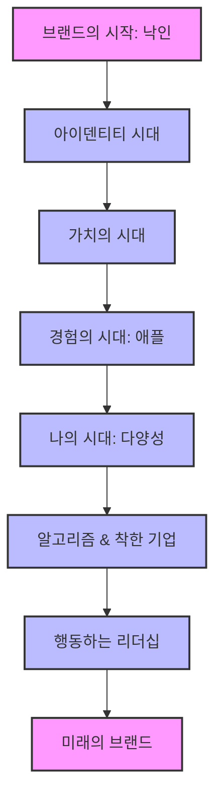
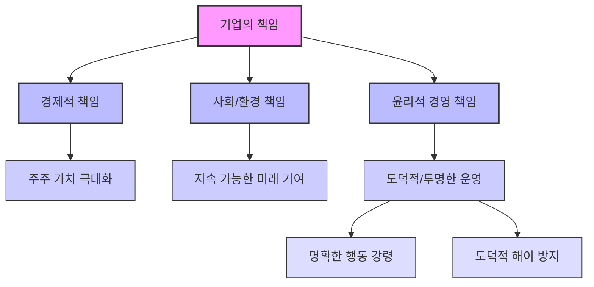

## 브랜드, 시대를 읽는 거울: 변화하는 가치와 기업의 역할
이 책은 우리가 매일 접하는 브랜드들이 어떻게 탄생하고 진화해왔는지, 그리고 미래에는 어떤 모습으로 변화할지 흥미롭게 탐구한다. 특히, 단순히 제품을 넘어 고객 경험과 사회적 가치를 중시하는 현대 브랜드의 중요성을 강조하며, 기업이 급변하는 시대에 어떻게 대응해야 하는지 심도 있는 통찰을 제공한다.

## 1. 브랜드의 탄생과 진화: 낙인에서 경험의 시대로 

브랜드는 아주 오래전부터 존재해왔다. 처음에는 소유를 나타내는 단순한 표식에서 시작했지만, 시간이 흐르면서 그 역할과 의미가 크게 변화했다.

1. 아이덴티티** 시대 (Identity Era): 내 것임을 알리는 낙인** 
  - 브랜드의 가장 오래된 유래는 노르웨이어 'brandr'에서 찾을 수 있다. 
  - 이는 '태운다'는 뜻으로, 가축에 소유주의 낙인을 찍어 자신의 것임을 표시하는 행위에서 시작되었다. 
  - 이 시기 브랜드는 단순히 '누구의 것인가'를 알려주는 정체성(아이덴티티)의 역할을 했다. 

2. 가치의 시대** (Age of Value): 돈을 버는 수단** 
  - 시간이 지나면서 브랜드는 기업이 경제적 이익을 창출하는 중요한 수단이 되었다. 
  - 기업들은 브랜드를 통해 제품의 가치를 높이고, 더 많은 수익을 얻기 위해 노력했다. 

3. **경험의 시대 (Age of Experience): 애플이 바꾼 패러다임** 
  - 21세기에 들어서면서 애플(Apple)과 같은 기업들이 브랜드의 역할을 완전히 새로운 차원으로 끌어올렸다. 
  - 브랜드는 단순히 제품이나 서비스의 자산을 넘어, 고객에게 특별한 경험을 제공하는 중요한 수단이 되었다. 
  - 애플 제품을 구매하는 과정, 매장에서의 서비스, 제품 사용 경험 등 모든 과정이 브랜드 경험의 일부가 된 것이다. 
  - 이는 제품 자체를 넘어선 총체적인 경험을 통해 고객과 소통하는 시대를 열었다. 

## 2. 한국인의 특별한 브랜드 사랑: 가치 판단의 기준 

한국에서는 유독 브랜드를 중요하게 여기는 경향이 강하다. 이는 심리학적인 배경과 사회적 맥락이 복합적으로 작용한 결과이다.

1. **가치 판단의 근거: 불확실성 속의 기준** 
  - 사람들은 살면서 알고 싶지만 알 수 없는 것들이 많다. 예를 들어, 10년 안에 100억을 벌 확률 같은 것들이다. 
  - 한국은 전쟁 이후 모든 것이 부족하고 판단 기준이 없던 시기를 겪었다. 
  - 이러한 불확실성 속에서 '명사화된 브랜드'는 제품이나 서비스의 가치를 판단하는 아주 좋은 근거가 되었다. 
  - 마치 길을 잃었을 때 나침반처럼, 브랜드가 좋은 선택을 위한 기준점이 된 것이다.

2. **맥락 중심 사고와 **브랜드 파워 
  - 한국인들은 다른 나라 사람들보다 '맥락 위주의 사고'를 많이 하는 경향이 있다. 
  - 이는 외국 심리학자들도 흥미롭게 지켜보는 부분이다. 
  - 예를 들어, "요즘 어떻게 지내냐"는 친구의 질문에 "그랜저로 대답했다"는 광고 문구는 한국의 독특한 브랜드 파워를 보여준다. 
  - 네덜란드 친구가 이 광고를 영어로 번역하면 "How are you? Grandeur."라고 이해하기 어려워하는 것처럼, 브랜드가 단순한 제품을 넘어 개인의 상황이나 가치를 대변하는 역할을 하는 것이다. 
  - 아파트 이름에 특정 건설사의 브랜드를 강조하는 것도 이러한 맥락 중심 사고와 브랜드 효과가 결합된 사례이다. 
  - 동네나 주소 대신 브랜드 이름을 말하는 것은 전 세계적으로 한국에서만 볼 수 있는 독특한 현상이다. 

## 3. '나의 시대'와 다양성: 개인화된 경험의 중요성 

과거에는 애플(Apple)과 같은 하나의 브랜드가 시대를 주도했지만, 이제는 고객 개개인이 브랜드를 이끌어가는 '나의 시대(Age of Me)'가 도래했다.

1. **개인의 개성과 **다양성** 존중** 
  - 현대 사회는 '미 제너레이션(Me Generation)'이라고 불리는 세대가 주도하며, 각자의 개성과 필요(니즈), 욕구가 매우 다양해지고 있다. 
  - 이제 사람들을 하나의 카테고리로 묶는 것이 어려워졌고, 기업들은 85억 명의 다양한 니즈를 만족시키기 위해 노력해야 한다. 
  - 이는 기업에게 '다양성(Diversity)'이라는 중요한 과제를 안겨주었다. 

2. **다양성 트렌드에 대한 기업의 대응** 
  - 기업들은 다양성 트렌드를 따라가지 못하면 매출 감소는 물론, 평판까지 나빠질 수 있다. 
  - **바비인형(Barbie Doll)**: 예전에는 전형적인 모습의 인형이었지만, 요즘은 다양한 인종, 체형, 직업을 가진 바비인형이 출시된다. 
  - 명품 브랜드: 광고 모델 선정 시 인종 다양성을 반드시 고려한다. 
  - **유니레버(Unilever)**: 홈페이지에 사람의 모습을 사진 대신 일러스트레이션으로 처리하여, 히잡을 쓴 여성 등 다양한 인물을 포함함으로써 리스크를 줄이고 다양성을 확보하는 전략을 사용한다. 

3. **주도권의 변화: '너 빼고 다 샀다'는 이제 통하지 않아** 
  - 심리학에서는 사람들의 선호도나 취향이 바뀌는 것 외에, '주도권을 내가 가져오려는 경향성'이 증가한다고 설명한다. 
  - 과거 한국에서 "너 빼고 다 샀다"는 식의 광고는 유행을 따르지 않으면 안 된다는 압박감을 주었다. 
  - 하지만 이제는 유행을 쫓지 않고 자신만의 개성을 추구하는 흐름이 강해졌다. 
  - 애니메이션 캐릭터처럼 입는 친구, 50대 남성 패션을 자랑스럽게 입는 친구, 반바지에 검은 양말, 슬리퍼를 신는 친구 등 다양한 취향이 존재한다. 
  - **메로나 슬리퍼 사례**: 빙그레와 콜라보한 메로나 슬리퍼를 중학생들에게 보여줬을 때, 30명 중 3명만 좋아하고 27명은 관심이 없었다. 
  - 과거 같으면 90%가 관심 없으니 만들지 않았겠지만, 이제 기업들은 "이런 걸 열 종류 더 만들면 되겠네"라고 생각한다. 
  - 이는 대형 브랜드일수록 작은 브랜드와의 공존성을 높여 다양한 취향에 어필할 수 있다는 의미이다. 

## 4. 알고리즘과 '착한 기업': 다양성 시대의 브랜드 전략 

다양한 개인의 취향을 모두 만족시키기 어려운 시대에, 기업들은 알고리즘 기술과 '착한 기업'이라는 공통된 가치를 통해 대응하고 있다.

1. **알고리즘 기술을 통한 **개인화 
  - 넷플릭스(Netflix)나 스포티파이(Spotify)처럼 빅테크 기업들은 알고리즘 기술을 활용하여 개인의 취향과 선호에 맞춰 콘텐츠를 추천한다. 
  - 어떤 회사에는 '최고 알고리즘 책임자(Chief Algorithm Officer)'라는 직책까지 있을 정도로 개인화된 서비스 제공에 집중한다. 
  - 이는 85억 명의 다양한 니즈를 만족시키기 위한 가장 현실적인 방법이다. 

2. **'착한 기업'에 대한 공통된 니즈** 
  - 알고리즘만으로는 모든 것을 해결할 수 없으므로, 기업들은 다양성 속에서도 '공통된 니즈'를 찾아야 한다. 
  - 그중 하나가 바로 '착한 기업'에 대한 인식이다. 
  - 소비자들은 기업을 바라보는 잣대가 달라져, 사회와 지구의 지속 가능성에 기여하는 기업을 선호한다. 
  - 특히 젊은 세대일수록 이러한 경향이 강해, 기업의 사회적 실천 여부가 구매 결정에 큰 영향을 미친다. 

3. 기업의 사회적 책임**: '**코퍼레이션 시티즌**'** 
  - 기업은 이제 단순한 이윤 추구 집단을 넘어 '글로벌 시민(Global Citizen)'으로서의 역할을 해야 한다는 인식이 커지고 있다. 
  - 현대 사회는 전쟁, 식량 부족, 기후 변화 등 놀라운 일들이 많이 발생하며, 이를 해결하기 위한 기업의 역할이 중요해졌다. 
  - 기업은 엄청난 고객, 소통 접점, 그리고 실행할 수 있는 경제력을 가지고 있기 때문에 가장 큰 영향력을 발휘할 수 있는 집단이다. 
  - **나이키(Nike) 사례**: 동남아 하청업체의 아동 노동 문제가 불거지자, 나이키는 이를 '자신의 책임'으로 인정하고 공급망(Supply Chain) 전체를 엄격하게 모니터링하는 시스템을 구축했다. 
  - 이는 소비자의 '착한 기업' 요구가 기업의 행동을 변화시킨 대표적인 사례이다. 

## 5. 행동하는 리더십: 파타고니아와 마이크로소프트 

기업의 사회적 책임이 중요해지면서, '행동하는 리더십(Action-Oriented Leadership)'을 보여주는 브랜드들이 주목받고 있다.

1. **파타고니아(Patagonia): 지구를 유일한 주주로 삼다** 
  - 파타고니아는 브랜드 평가에서 가장 많이 언급되는 사례 중 하나이다. 
  - 2022년 9월 15일 뉴욕타임스 기사 헤드라인은 "억만장자가 더 이상 없다(Billionaire No More)"였다. 
  - 창업자 이본 쉬나드(Yvon Chouinard)는 "우리의 유일한 주주는 지구다"라고 선언하며, 기업 지분 100%를 비영리 단체에 기부했다. 
  - 연간 영업이익 약 1억 달러를 지속적으로 기부하겠다고 밝혔다. 
  - 이는 급진적이고 '미친 리더십'으로 불리기도 하지만, 기업의 사회적 책임을 보여주는 중요한 본보기이다. 
  - **창업자의 비전**: 1973년 설립 당시부터 쉬나드는 등산을 하며 자연 파괴를 목격하고, 자연을 손상시키지 않는 제대로 된 장비를 만들겠다는 비전을 가지고 있었다. 
  - 대량 생산보다는 자신의 비전을 실천하는 데 집중했다. 
  - **'팔지 않겠다'는 정신**: 월스트리트 금융인들이 파타고니아 옷을 입고 다니며 유명해졌지만, IT 기업이나 금융 기업이 대량 주문을 요청했을 때 "우리는 그렇게 팔지 않는다"며 거절했다. 
  - 이러한 정신은 오히려 '착한 기업'을 선호하는 소비자들에게 열광적인 지지를 받았다. 

2. **마이크로소프트(Microsoft): 인류와 지구의 성취를 돕다** 
  - '행동하는 리더십'은 명확한 존재 이유(Purpose)와 비전(Vision)을 정하고, 이에 따른 전략적 로드맵을 구축하며 실천하는 것을 의미한다. 
  - 세계에서 가장 큰 기업 중 하나인 마이크로소프트는 4천조 원 이상의 기업 가치를 가지고 있다. 
  - **초기 비전**: 과거에는 '생산성 증대(Productivity)'를 핵심 브랜드 전략으로 삼아, 전 세계 사람들과 기업의 성취를 돕는 것이 비전이었다. 
  - **변화된 비전**: 최근에는 비전을 "우리의 기술을 통해 인류를 넘어서, 인류와 동시에 이 지구가 또한 성취를 하는 데 있어 함께하겠다"로 바꿨다. 
  - AI 기술 등 다양한 사업 영역에서 이 비전을 구현하기 위한 명확한 실행 계획을 세우고 실천하고 있다. 
  - 이는 기업이 세상에 미치는 영향력이 가장 강하기 때문에, 사회적 책임을 다하는 것이 중요함을 보여준다. 

## 6. 기업의 세 가지 책임: 경제, 사회/환경, 그리고 윤리 

기업은 단순히 돈을 버는 것을 넘어, 세 가지 중요한 책임을 다해야 한다.

1. **경제적 책임감**: 주주 가치 극대화 
  - 기업의 가장 기본적인 존재 목적은 주주(회사에 투자한 사람들)의 가치를 높이는 것이다. 
  - 이는 기업이 이윤을 창출하고 성장해야 한다는 의미이다. 

2. **사회 및 환경 책임감**: 지속 가능한 미래 기여 
  - 기업은 우리가 살고 있는 사회와 지구가 지속 가능하도록 역할을 해야 한다. 
  - 환경 보호, 지역 사회 공헌, 공정한 노동 환경 조성 등이 이에 해당한다. 

3. **윤리적 경영 책임감**: 도덕적이고 투명한 운영 
  - 경제적, 사회/환경적 책임을 다하는 과정에서 기업은 높은 도덕적, 윤리적 기준을 지켜야 한다. 
  - **에어비앤비(Airbnb) 사례**: 에어비앤비에는 '최고 진정성 책임자(Chief Integrity Officer, CIO)'라는 사장급 직책이 있다. 
  - 이 CIO는 "윤리의 가장 큰 적은 불명확함(Ambiguity)"이라고 말하며, 윤리 경영을 위한 행동 강령을 명확히 만들고 내재화해야 한다고 강조한다. 
  - 아무리 오랫동안 윤리 경영을 해왔더라도, 단 한 번의 도덕적 해이(Moral Hazard)가 발생하면 모든 것을 무너뜨릴 수 있기 때문이다. 
  - 명확하고 구체적인 실천이 없으면 그것은 진정한 윤리가 아니다. 
  - 대부분의 글로벌 기업들은 ESG(환경, 사회, 지배구조) 리포트, 지속 가능성(Sustainability) 리포트, 행동 강령(Code of Conduct) 등을 문서화하고 공개하여 윤리 경영 성과를 보고한다. 

## 7. 버드라이트의 실패와 러쉬의 성공: 진정성의 중요성 

기업이 시대의 흐름을 읽고 사회적 책임을 다하는 것은 매우 중요하지만, 그 과정에서 '진정성'이 없으면 큰 실패로 이어질 수 있다.

1. **버드라이트(Bud Light)의 실패: **진정성** 없는 **다양성** 마케팅** 
  - 버드라이트는 22년 동안 미국 최다 판매 맥주 브랜드로, 고객들에게 '친구' 같은 존재였다. 
  - 하지만 다양성 구현을 위해 유명 성소수자 인플루언서 딜런 멀베이니(Dylan Mulvaney)에게 자신의 얼굴이 새겨진 맥주캔을 선물하고 이를 홍보했다. 
  - **실수**: 버드라이트의 주 고객층은 노동자, 나이 든 보수적인 성향의 사람들이 많았는데, 이들은 트랜스젠더나 성소수자에 대한 반감이 있었다. 
  - 이러한 고객층의 특성을 고려하지 않고 '흉내만 낸' 다양성 마케팅을 펼친 것이 문제였다. 
  - **대응 실패**: 논란이 커지자 버드라이트는 명확한 신념이나 의지를 설명하지 않고, 단순히 "여러 사람에게 협찬한 것 중 하나"라고 해명하며 딜런 멀베이니를 배제했다. 
  - 이로 인해 보수적인 고객층은 물론, 젊은 성소수자 지지층까지 모두 잃게 되었다. 
  - **결과**: 유명 래퍼 키드 록(Kid Rock)이 버드라이트 캔을 부수는 영상을 올리면서 불매 운동이 확산되었고, 한 달 만에 기업 가치 60억 달러(약 7~8조 원)가 증발하는 엄청난 손실을 입었다. 
  - 이는 충성도가 높은 맥주 시장에서 단 한 번의 마케팅 실수가 기업을 나락으로 떨어뜨릴 수 있음을 보여주는 교훈적인 사례이다. 
  - **교훈**: 진정성 없는 마케팅은 양쪽 고객 모두에게 외면받을 수 있으며, 기업의 가치와 신념을 명확히 전달하는 것이 중요하다. 

2. **러쉬(Lush)의 성공: 신념을 지킨 용감한 브랜드** 
  - 러쉬는 화장품 및 욕실 용품 브랜드로, '동물 실험 반대(Animal Test)'라는 명확한 신념을 가지고 있다. 
  - 동물 실험을 의무화하는 국가에는 아예 시장 진입을 하지 않는다. 
  - **창업자의 신념**: 주주들이 눈앞의 이익을 포기하는 것에 반대했지만, 창업자 마크 콘스탄틴(Mark Constantine)은 "기업의 신념과 이익 중 하나를 고르라면 기꺼이 가치와 신념을 고르겠다"고 인터뷰했다. 
  - 어떤 상황에서도 굴하지 않고 신념을 밀어붙이는 용감한 행동이었다. 
  - **제품 철학**: 러쉬는 원래 헤어샵에서 일하던 사람들이 '내가 쓰고 싶은 제품을 만들자'는 생각으로 시작했다. 
  - 화학물질이 아닌 식물성 재료로 제품을 만들고, 동물 실험을 하지 않는 것을 차별점으로 삼았다. 
  - 공장 대신 '키친(Kitchen)'이라는 표현을 사용하여, 마치 명품을 만들 듯 정성을 다해 제품을 만든다는 이미지를 강조한다. 
  - **결과**: 과대 포장 없이 예쁘고 향기 좋으며 안전한 제품, 그리고 창업자의 정신과 마케팅의 진정성이 결합되어 고객들의 엄청난 충성도를 얻었다. 
  - 이는 지혜롭고 영리하게 시대를 읽고 신념을 지킨 브랜드의 성공 사례이다. 

## 8. 시대를 대표하는 브랜드가 되기 위한 조건 

브랜드를 통해 사회와 역사를 읽을 수 있듯이, 기업의 흥망성쇠는 시대의 변화와 브랜드의 대응 방식에 달려 있다.

1. **위기 극복과 롱텀 비전의 중요성** 
  - 기업의 역사를 길게 보면 흥망성쇠가 더욱 명확하게 보인다. 
  - **실패 사례**:
  - **제너럴 일렉트릭(GE)**: 과거 한국 기업들이 배우려 했던 세계 최고의 기업이었지만, 위기를 극복하지 못하고 잊혀진 기업이 되었다. 
  - **도시바(Toshiba)**: 존경받던 기업이었으나, 최고 경영진의 부정(Integrity 문제)으로 인해 회복하기 어려워졌다. 
  - **성공 사례**:
  - **이케아(IKEA)**: 가구 회사로 불이 나 망할 뻔했지만 위기를 극복하고 살아남았다. 
  - **레고(Lego)**: 작은 회사에서 시작했지만, '레고'라는 브랜드 하나로 도시와 나라가 번성하는 사례를 만들었다. 
  - 글로벌 브랜드가 되기까지 순탄한 기업은 없으며, 세상의 변화를 읽는 것과 동시에 '내 신념을 지키겠다'는 롱텀 비전을 가지고 실현하는 것이 중요하다. 

2. **스스로 정의 내리는 시대: 벤치마킹의 한계** 
  - 과거에는 스티브 잡스(Steve Jobs) 사망 후 삼성전자가 가장 슬퍼했다는 농담처럼, 벤치마킹(Benchmarking)할 대상이 많았다. 
  - 하지만 이제는 더 이상 따라할 사람이 없으므로, 기업 스스로 길을 열어가야 한다. 
  - "우리가 어디로 가야 할지, 우리는 어떤 기업인지, 우리는 어떤 브랜드인지 스스로 정의 내리고 그 가치에 대한 고민을 하지 않으면, 이젠 길은 보이지 않을 것이며 더욱더 우리는 작은 암초에도 오히려 부딪혀서 큰 상처가 나는 그런 개인과 기업들이 된다"는 말이 시사하는 바가 크다. 

3. **미래를 위한 두 가지 핵심 전략: 아이코닉 무브와 **행동하는 리더십 
  - 현재 시대를 '지배하는' 브랜드는 없지만, 시대를 '대표하는' 빅테크 기업들은 존재한다. 
  - 하지만 10년 후에는 완전히 다른 양상이 펼쳐질 수 있으므로, 기업들은 급변하는 시대에 대응해야 한다. 
  - **아이코닉 무브(Iconic Move)**: 경쟁의 판도를 바꿀 수 있는 대담한 도전을 의미한다. 
  - 브랜드가 지향하는 가치를 명확히 설정하고, 이를 기준으로 사업적, 영업적, 마케팅적으로 과감한 도전을 해야 한다. 
  - 행동하는 리더십**(Acting Leadership)**: 기업이 사회적 문제 해결에 적극적으로 기여하는 것을 의미한다. 
  - 미래가 불투명하고 어려운 시대에, 기업은 사람들의 염원(니즈)을 정확히 알고 이를 해결하는 데 일조해야 한다. 
  - 이 두 가지 전략을 통해 기업은 10년 후에도 시대를 대표하는 브랜드로 남아 있을 수 있다. 
  - 이는 기업뿐만 아니라 우리 후손들에게도 중요한 메시지를 전달한다. 

