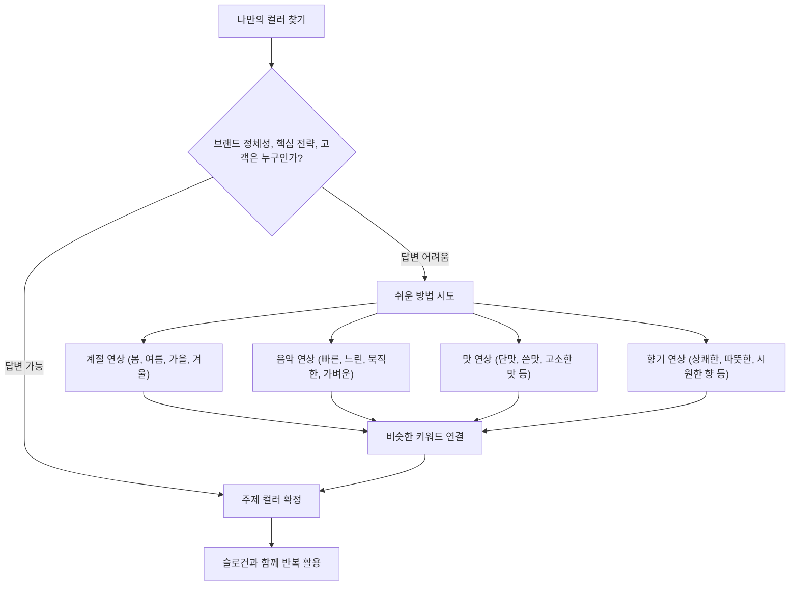

## 위닝 컬러: 색깔로 사람의 마음을 사로잡는 마법 같은 과학
이 책 '위닝 컬러'는 사람의 마음을 움직이는 색깔의 비밀을 알려주는 책이야. 우리가 무심코 지나치는 색깔 하나하나에 어떤 의미가 숨어 있고, 어떻게 활용해야 사람들의 마음을 사로잡고 성공할 수 있는지 과학적인 근거와 실제 사례를 통해 쉽게 설명해 줘. 저자는 30년간 유통 현장에서 비주얼 전략가로 일하며 쌓은 노하우를 바탕으로, 색깔이 어떻게 우리의 뇌와 감정에 영향을 미치는지 알려주고, 이를 비즈니스와 개인 브랜딩에 적용하는 방법을 알려주는 책이라고 보면 돼.

## 1. 색깔이 우리 뇌에 미치는 놀라운 영향 

우리는 세상을 눈으로 보잖아? 그런데 우리 눈은 사실 뇌의 일부라고 생각하면 돼. 그래서 우리가 보는 색깔 하나하나가 우리 뇌에 엄청난 영향을 미친다고 해.

1. **시각의 힘**:
  - 사람이 정보를 받아들이는 다섯 가지 감각(오감) 중에서 시각이 무려 87%를 차지해. 마치 우리가 어떤 정보를 얻을 때 대부분 눈으로 본다는 뜻이야.
  - 그 87%의 시각 정보 중에서도 65%는 색깔이 결정한다고 해. 그러니까 우리가 어떤 것을 볼 때 색깔이 가장 먼저, 그리고 가장 크게 영향을 미친다는 거지.
  - 예를 들어, 검정색, 파란색, 흰색, 노란색 등 다양한 색깔을 보면 우리 뇌에서는 여러 가지 반응이 일어나.

2. **색깔이 감정에 미치는 영향**:
  - 빨간색을 보면 심장이 두근거리고 흥분되는 느낌이 들고, 파란색을 보면 마음이 편안해지고 시원한 느낌이 들잖아? 이건 인간이 아주 오래전부터 경험해 온 본능적인 반응이야.
  - 하늘을 보면서 파란색을 떠올리면 왠지 모르게 경쾌하고 시원한 기분이 드는 것처럼, 색깔은 우리 몸과 마음에 큰 영향을 줘.
  - 이런 색깔의 힘을 잘 알면 물건을 파는 것부터 우리 건강을 지키는 것까지 다양한 분야에서 활용할 수 있어.

## 2. 고객의 뇌리에 박히는 '위닝 컬러' 전략 

고객의 마음을 사로잡고 기억 속에 남으려면 어떻게 해야 할까? 마치 평범한 소들 사이에 보라색 소 한 마리가 서 있으면 모두가 그 소를 보러 달려가는 것처럼, 우리 브랜드도 특별한 색깔로 고객의 뇌리에 박혀야 해.

1. **고객은 우리에게 관심이 없어**:
  - 고객들은 하루에도 수많은 광고와 마케팅에 노출돼. 푸시 알림, 유튜브 광고 등 너무 많은 정보 때문에 스트레스를 받고, 대부분의 마케팅은 고객의 뇌에 도달하기도 전에 사라져 버려.
  - 고객들은 우리 제품이나 브랜드에 관심이 있는 게 아니라, 자기 자신의 일상(아이가 학교에 잘 갔는지, 엄마가 병원에 잘 도착했는지 등)에 더 관심이 많아.
  - 이런 복잡한 고객의 머릿속에 우리 제품을 어떻게 각인시키고 기억하게 만들지가 중요해.

2. **색깔은 가장 빠른 커뮤니케이션 도구**:
  - 글, 이미지, 색깔 중에서 고객에게 가장 빠르게 다가가는 건 색깔이야. 바쁜 현대 사회에서는 메시지를 빠르게 전달하지 못하면 고객은 기다려주지 않아.
  - 그래서 색깔을 모르면 고객과 빠르게 소통하기 어려워. 색깔은 고객의 뇌에 직접적으로 영향을 미쳐서 우리 브랜드를 기억하게 만드는 가장 강력한 도구야.
  - 이처럼 고객의 뇌를 점령하고 이기게 만드는 색깔, 그게 바로 '위닝 컬러'라고 부르는 이유야.

3. **'보랏빛 소'처럼 압도적인 색깔**:
  - 유명한 마케터 세스 고딘은 '보랏빛 소가 온다'는 책에서 한 번 봐도 잊히지 않을 정도로 압도적이지 않으면 고객은 기억하지 못한다고 했어.
  - 제품이든 매장이든, 압도적으로 좋아야만 사람들이 사진을 찍고 공유하면서 입소문을 내게 돼.
  - 이런 혁신적이고 압도적인 색깔을 만드는 것이 중요해.

4. **성공적인 '**위닝 컬러**' 사례**:
  - 스타벅스: 초록색을 주제 색깔로 사용해서 전 세계적으로 각인시켰어.
  - 코카콜라: 빨간색으로 시원하고 활기찬 이미지를 만들었지.
  - **배스킨라빈스**: 핑크색 스푼만 봐도 아이스크림이 떠오를 정도로 강력한 인상을 줘. 나뚜루 아이스크림보다 배스킨라빈스가 더 맛있다고 증명할 수는 없지만, 사람들은 무의식적으로 핑크색 스푼을 보면 배스킨라빈스를 떠올리게 돼.
  - 카카오: 노란색으로 친근하고 편리한 이미지를 구축했어.
  - 마켓컬리: 새벽 배송이라는 핵심 전략과 고급스러운 식자재라는 정체성을 보라색으로 표현해서 성공했어. 보라색은 고급스러움과 귀족을 상징하는 색깔이거든.

## 3. 색깔로 새로운 소비자를 만들고 매출을 늘리는 방법 

색깔은 단순히 예쁘게 보이는 것을 넘어, 새로운 고객을 만들고 매출을 크게 늘리는 마법 같은 힘을 가지고 있어.

1. **파커 만년필의 혁신**:
  - 1921년, 파커(Parker)라는 회사에서 빨간색 만년필을 만들었어. 그전까지 만년필은 주로 남자들이 쓰는 물건이었고, 색깔도 남색, 회색, 검정색이 대부분이었지.
  - 하지만 1920년대에 여성들의 사회 진출이 늘어나면서, 여성들도 펜을 쓸 기회가 많아졌어.
  - 파커는 기존의 남성적인 색깔 대신, 빨간색 립스틱과 비슷한 색깔로 펜을 만들고, 남자 펜보다 얇게 디자인했어.
  - 결과는 대성공! 빨간색 만년필은 여성 소비자들에게 폭발적인 인기를 얻었고, 매출이 크게 늘었어.
  - 이 사례는 색깔 마케팅의 시작이라고 불릴 정도로 중요한 의미를 가져.

2. **색깔 변화의 세 가지 효과**:
  - **새로운 소비자 발굴**: 기존에 없던 색깔을 사용해서 새로운 고객층을 끌어들일 수 있어.
  - **매출 확대**: 기존 제품의 형태는 그대로 두고 색깔만 바꿔도 매출이 크게 늘어나는 효과를 볼 수 있어. 마치 새우깡이 블랙 새우깡으로 나오면서 기존 제품과 새로운 제품 모두 판매량이 늘어난 것처럼 말이야.
  - **판매 수명 연장**: 색깔 변화를 통해 제품의 판매 수명을 늘리고, 고객에게 지속적인 새로움을 제공할 수 있어.

3. **색깔과 가치의 연결**:
  - 우리가 "하늘을 봐"라고 하면 각자 다른 하늘(파란 하늘, 노을 지는 하늘 등)을 떠올리지만, "파란 하늘을 봐"라고 하면 모두가 똑같이 청량한 파란 하늘을 떠올리게 돼.
  - 이처럼 제품이나 브랜드 이름 앞에 특정 색깔을 붙이면, 고객의 뇌는 그 색깔이 주는 감정을 느끼게 돼.
  - 온라인 쇼핑몰, 유튜브 채널, 커뮤니티 등을 만들 때 우리가 전달하고 싶은 가치와 색깔을 연결하는 것이 아주 중요해.

## 4. 매일 가도 설레는 공간의 비밀: 변하는 색깔과 변하지 않는 색깔 

매일 가도 질리지 않고 늘 설레는 공간의 비밀은 바로 '변하는 색깔'과 '변하지 않는 색깔'을 잘 활용하는 데 있어. 마치 스타벅스가 초록색이라는 브랜드 색깔은 지키면서도 시즌마다 새로운 색깔로 매장을 꾸미는 것처럼 말이야.

1. **브랜드의 주제 색깔은 지켜야 해**:
  - 특정 브랜드는 자신만의 주제 색깔을 가지고 있어. 스타벅스의 초록색, 코카콜라의 빨간색처럼 말이야.
  - 이 주제 색깔은 1년 365일 꾸준히 사용해서 고객들에게 반복적으로 보여줘야 해. 그래야 고객들이 그 색깔을 보고 브랜드를 신뢰하고 기억하게 돼.
  - 스타벅스는 1971년에는 갈색 로고를 썼지만, 1987년에 합병하면서 긍정적인 느낌을 주는 초록색으로 바꿨어. 이는 하워드 슈츠 대표가 색깔에 대한 뛰어난 감각을 가지고 있었기 때문이야.

2. **지루함을 깨는 시즌 색깔**:
  - 하지만 30년 내내 똑같은 색깔만 보여주면 고객들은 지루함을 느낄 수 있어.
  - 스타벅스는 이 지루함을 '시즌 색깔'로 깨뜨려. 1년에 7번, 약 50일 간격으로 시즌을 바꿔가며 새로운 색깔을 선보여.
  - **7번의 시즌**: 신년, 봄, 가정의 달, 여름, 가을, 할로윈, 크리스마스.
  - **스타벅스의 봄**: 2월 4일 입춘이 되면 스타벅스 매장에는 핑크색 벚꽃 메뉴와 텀블러, POP(광고물) 등이 가득해져. 고객들은 입구부터 메뉴판, 선물 카드까지 핑크색을 3번 이상 반복해서 보게 돼.
  - **크리스마스**: 크리스마스가 되면 매장 입구부터 안쪽까지 빨간색과 초록색 등 크리스마스 분위기의 색깔로 꾸며져.

3. **계절을 알리면 지갑이 열려**:
  - 사람들은 계절이 바뀌면 뭔가 새로운 것을 준비해야겠다는 생각을 해. 작년 봄에 뭘 입었는지 기억이 안 나는 것처럼 말이야.
  - 스타벅스는 이런 사람들의 심리를 이용해서 시즌 메뉴와 상품을 통해 변화에 대한 욕구를 자극하고, 고객의 뇌에 좋은 기억과 추억을 만들어줘.
  - 온라인 쇼핑몰도 마찬가지야. 메인 배너의 색깔을 시즌에 맞게 바꿔야 해. "계절을 알리면 지갑이 열린다"는 말이 괜히 있는 게 아니야.
  - 백화점 식품관에서 2월 4일에 딸기를 전진 배치하고, 다른 층에서는 핑크색 원피스를 걸어두는 것도 같은 이유야. 고객의 변화 욕구를 자극하는 거지.
  - 하지만 사람들은 결국 안정적인 것을 찾기 때문에, 핑크색 원피스를 보고 예쁘다고 생각해도 결국 검정색 옷을 사는 경우가 많아. 그래서 변화의 욕구와 안정의 욕구를 동시에 만족시켜주는 색깔 전략이 필요해.

4. **패턴과 함께 쓰는 시즌 색깔**:
  - 시즌 색깔을 사용할 때는 단순히 색깔만 쓰는 것이 아니라, 그 색깔을 상징하는 무늬나 패턴과 함께 쓰는 것이 효과적이야.
  - 예를 들어, 여름에는 파란색 스트라이프, 조개 무늬, 야자수 패턴 등을 함께 활용해서 고객들에게 계절감을 더 강하게 전달할 수 있어.
  - 노티드 도넛이 맥주나 유치원 가방을 만드는 것처럼, 브랜딩은 고객이 자주 만나고 익숙하게 느끼도록 하는 것이 중요해. 끌리메도 시즌별 기획 제품을 만들어 고객과 소통했어.
  - 오프라인 매장에서도 포토존을 만들고, 직원들이 사진을 찍어 온라인에 올리도록 유도해서 온라인과 오프라인을 연결하는 것이 중요해.

## 5. 색깔이 시간을 다르게 흐르게 만드는 마법 

색깔은 우리가 느끼는 시간의 속도까지 바꿀 수 있어. 마치 빨간 방에서는 시간이 빨리 흐르는 것 같고, 파란 방에서는 시간이 느리게 흐르는 것처럼 말이야.

1. **빨간 방과 파란 방 실험**:
  - EBS에서 진행한 실험에서, 사람들을 빨간 방과 파란 방에 각각 20분씩 가두고 시계 없이 20분이 지났다고 생각하면 나오라고 했어.
  - **빨간 방**: 사람들은 평균 14분에서 17분 만에 20분이 지났다고 생각하고 나왔어. 답답함을 느끼고 숨이 안 쉬어진다고 말하는 사람도 있었지. 빨간색은 심장 박동수를 높여서 순간적인 몰입은 좋지만, 오래 있으면 불안감을 증폭시키는 경향이 있어. 고대 이집트에서는 죄수들의 방을 빨간색으로 칠해서 정신적으로 힘들게 만들었다고 해.
  - **파란 방**: 사람들은 20분이 훨씬 지났는데도 20분이 안 지났다고 생각하고 나왔어. 누워 있거나 잠을 자는 등 편안함을 느꼈지.
  - 이처럼 색깔은 우리가 느끼는 시간의 속도에 큰 영향을 줘.

2. **공간에 적용하는 색깔의 마법**:
  - **회사 사무실**: 파란색이나 차가운 계열의 색깔을 사용하면 직원들이 8시간을 일해도 "벌써 하루가 다 갔어?"라고 느끼게 할 수 있어. 반대로 빨간색 공간에서는 시계만 보면서 시간이 안 간다고 느낄 수 있지.
  - **예식장**: 예식 시간이 짧은데도 오랫동안 정성스럽게 치러지는 것처럼 보이게 하기 위해 붉은 카펫을 많이 깔아. 붉은색은 시간을 빨리 흐르게 느끼게 하는 효과가 있거든.

## 6. 몸과 마음의 균형을 잡아주는 색깔의 힘 

색깔은 우리의 몸과 마음, 그리고 학습 능력에도 영향을 미쳐. 마치 초록색 숲길을 걸으면 마음이 편안해지고, 빨간색을 보면 집중력이 높아지는 것처럼 말이야.

1. **색깔별 신체 및 감정 영향**:
  - 빨간색: 신체의 활력과 관련이 깊어. 순간적인 집중력을 높이는 데 좋아.
  - 노란색: 감정에 영향을 미쳐. 활기와 에너지를 주는 색깔이야.
  - **파란색**: 지성과 내면의 안정에 영향을 미쳐. 창의력을 높이는 데 도움이 돼.
  - **초록색**: 신체, 감정, 지성 이 세 가지의 균형을 잡아주는 역할을 해. 스트레스를 줄이고 마음을 편안하게 해줘.

2. **아이 학습에 활용하는 색깔**:
  - **순간 집중력 높이기 (빨간색)**: 아이 공부방에 빨간색 벽지를 바르기보다는 빨간색 액자, 화분, 매트 등 10% 정도의 빨간색 포인트를 주면 순간 집중력을 높일 수 있어. 빨간펜 학습지가 효과적인 이유도 여기에 있어. 빨간색은 우리 눈에 가장 빨리 맺히는 색깔이거든.
  - **창의력 높이기 (파란색)**: 파란색은 아이들의 창의력을 높이는 데 아주 좋아. 소아마비 백신을 개발한 솔크 박사가 푸른 바다와 하늘을 보고 영감을 얻어 연구소를 지을 때도 푸른색을 강조했다고 해. 솔크 연구소에서는 푸른색 환경 덕분에 노벨상 수상자가 많이 나왔다고 해.
  - **주의**: 너무 많은 빨간색은 불안감을 증폭시킬 수 있으니 주의해야 해.

3. **스트레스 해소 및 건강 관리 (**초록색**)**:
  - 스트레스를 많이 받거나 두통이 있을 때는 초록색을 많이 보는 것이 좋아. 숲길을 걷거나 초록색 식물을 가까이 두는 것이 도움이 돼.
  - 스마트폰을 많이 봐서 눈이 피로할 때도 모니터 바탕화면을 초록색으로 설정하거나 주변에 초록색 식물을 두면 동공이 풀어져서 눈의 피로를 줄일 수 있어.
  - 초록색은 몸의 균형을 잡아주는 색깔이라 다이어트할 때 초록색 접시에 초록색 야채를 담아 먹으면 식욕 조절에도 도움이 된다고 해.

4. **감정 순화 (**핑크색**)**:
  - 뾰족해진 감정을 순화시키는 데는 핑크색이 효과적이야. 특히 파스텔 핑크는 여성들이 감정적으로 상처받았을 때 마음을 편안하게 해주는 역할을 해.
  - 부부 싸움 후 핑크색 꽃을 선물하는 것도 이런 이유 때문이야.

## 7. 색깔로 병을 낫게 하는 과학적인 방법 

색깔은 병을 낫게 하는 데도 사용돼. 마치 약의 색깔만 바꿔도 환자들이 더 효과가 좋다고 느끼는 것처럼 말이야.

1. **색깔 침 치료**:
  - 일본에서는 침을 놓을 때 색깔을 활용하기도 해. 위장이 안 좋으면 노란색 종이를 붙이고, 염증이 있으면 파란색 종이를 붙여서 침을 놓는 식이야. 동양과 서양 모두 색깔을 이용해 병을 고치려는 시도가 있었어.

2. **약의 색깔 변화**:
  - 과거에는 약의 색깔이 대부분 흰색이었어. 그런데 약사들이 약을 잘못 주는 오류가 많이 발생했지.
  - 이 문제를 해결하기 위해 약통과 약의 색깔을 바꾸기 시작했어.
  - **소화기 계통**: 노란색 약
  - **염증 계통**: 푸른색 약
  - **뇌 관련**: 붉은색 약
  - **신경 계통**: 연보라색 약
  - **간이나 신장 계통**: 연한 연두색 약
  - 이렇게 색깔을 바꾸니 오류가 줄어들었을 뿐만 아니라, 환자들이 약의 효과를 더 좋게 느끼는 현상까지 나타났어. 똑같은 위장약인데 노란색으로 바꿨더니 "특효약이다!"라고 반응한 사례도 있어.

3. **일상생활 속 색깔 활용**:
  - 목에 염증이 생겼을 때는 붉은색 스카프 대신 푸른색 스카프를 매면 염증이 빨리 가라앉는 효과가 있어.
  - 평소에 열이 많은 사람은 푸른색 계열의 옷을 입으면 몸의 열을 내리는 데 도움이 돼.

## 8. 나만의 '위닝 컬러'를 찾는 공식 

나만의 '위닝 컬러'를 찾아서 고객의 뇌리에 강력하게 각인시키는 방법은 무엇일까? 마치 스타벅스가 초록색, 배스킨라빈스가 핑크색을 자신만의 색깔로 만든 것처럼 말이야.

1. **브랜드 컬러를 만드는 공식**:
  - **정체성**: 우리 브랜드를 왜 이용해야 하는가? (예: 고급스러운 식자재)
  - **핵심 전략**: 다른 곳과 차별화되는 우리만의 전략은 무엇인가? (예: 새벽 배송)
  - **고객**: 우리 고객은 누구인가? (예: 조금 비싸더라도 좋은 식자재를 원하는 사람)
  - 이 세 가지 질문에 답할 수 있다면, 우리 브랜드의 주제 색깔을 정할 수 있어.

2. **쉬운 방법으로 **컬러** 찾기**:
  - 만약 위 세 가지 질문에 답하기 어렵다면, 다음 네 가지 요소를 통해 컬러를 연상해 볼 수 있어.
  - **계절**: 우리 브랜드가 봄, 여름, 가을, 겨울 중 어떤 계절과 어울리는가?
  - **음악**: 우리 브랜드가 빠른, 느린, 묵직한, 가벼운 음악 중 어떤 느낌인가?
  - **맛**: 우리 브랜드가 단맛, 쓴맛, 고소한 맛 등 어떤 맛으로 표현될 수 있는가?
  - **향기**: 우리 브랜드가 상쾌한, 따뜻한, 시원한 향 중 어떤 향기와 어울리는가?
  - 이 키워드들을 적어보면 비슷한 느낌의 색깔이 떠오를 거야. 그 색깔을 슬로건과 함께 우리만의 컬러로 정하고 반복해서 사용하면 돼.

3. 톤** 조절로 차별화**:
  - "이미 빨간색은 SK가, 파란색은 삼성이 가져갔는데 뭘 써야 하냐?"고 고민할 수 있어. 이럴 때는 '톤'을 조절하면 돼.
  - **밝은 톤**: 밝고 경쾌한 느낌을 줘. 예능 프로그램에서 밝은 색 옷을 입는 것처럼 말이야.
  - **짙은 톤**: 신뢰감과 전문적인 느낌을 줘. 뉴스 앵커나 전문가들이 짙은 색 옷을 입는 것처럼 말이야.
  - 예를 들어, 밀키트 스타트업 '블루 에이프런'은 고객의 불안감을 잠재우고 신뢰를 주기 위해 밝은 파랑이 아닌 짙은 남색에 가까운 파란색을 선택해서 성공했어.
  - 신생 기업일수록 남들이 쓰지 않는 도전적인 색깔을 사용해서 고객의 눈에 띄고, 핵심 소비자의 취향에 맞는 색깔을 선정하는 것이 중요해.

4. **개인 브랜딩에 활용하는 **컬러:
  - 개인의 비즈니스에서도 퍼스널 컬러를 활용할 수 있어.
  - **열정과 도전**: 붉은 계열
  - **정확한 지성**: 푸른색 계열
  - **감정과 공감**: 노란색 계열
  - 예를 들어, 보험 영업사원이 고객에게 공감하는 이미지를 주고 싶다면 노란색 스카프, 행커칩, 안경, 시계줄, 명함, 선물 리본 등 노란색 포인트를 꾸준히 사용하면 돼. 처음에는 아무도 관심 없겠지만, 1년 정도 꾸준히 하면 "그 노란 옷 입고 오신 분"처럼 기억될 거야.
  - 강의나 컨설팅을 할 때도 클라이언트의 로고 색깔(예: 삼성의 파란색)을 맞춰 입으면 유대감과 친밀감을 형성하는 데 도움이 돼.

## 9. 평범한 사람도 비주얼 전문가가 될 수 있다 

누구나 비주얼 전문가가 될 수 있어. 마치 먹방 유튜버가 플레이팅과 의상, 컵까지 색깔을 맞춰서 자신만의 이미지를 만드는 것처럼 말이야.

1. 비주얼** 전문가가 되는 길**:
  - **명확한 이미지 설정**: 내가 어떤 이미지로 고객에게 다가가고 싶은지 분명하게 정하는 것이 중요해.
  - **색깔 공부**: 색깔에 대한 두려움을 없애고 많이 써보고 접해보면서 용기를 얻어야 해.
  - **관찰과 연구**: 주변의 성공적인 사례들을 보면서 "왜 저렇게 했을까?", "왜 눈에 띌까?"를 끊임없이 관찰하고 연구하는 습관을 들여야 해.
  - **반복과 지속**: 한두 번 시도하고 포기하는 것이 아니라, 꾸준히 반복해서 자신만의 색깔을 각인시켜야 해.

2. **설득 비용을 줄이는 비주얼**:
  - 비주얼을 만드는 것은 단순히 예쁘게 꾸미는 것이 아니라, 고객을 설득하는 데 드는 시간과 노력을 줄이기 위함이야.
  - **끌리메 사례**: 에스테틱 브랜드 끌리메는 기술은 좋았지만 비주얼이 통일되지 않아 고객의 기억 속에 혼란을 줬어.
  - **스탠다드 구축**: 전국 매장의 인테리어와 색깔을 핑크색 주제 컬러로 통합했어.
  - 설득 비용** 절감**: 카운터를 안으로 빼고, 에스테티션의 손 모양을 형상화한 '뷰티 터널'을 만들었어. 터널을 지나면 30회 관리 후 작아진 얼굴 사진 30개와 1000개의 고객 후기(데이터)를 시각화한 공간을 만들어 고객이 직접 보고 설득되도록 했어.
  - **시즌 **컬러** 활용**: 핑크색 주제 컬러에 7번의 시즌 컬러를 바꿔가며 매번 새로움을 느끼게 했고, 이는 폭발적인 성장으로 이어졌어.
  - 이처럼 공간과 제품이 스스로 말하게 하는 것이 비주얼 마케팅의 핵심이야.

3. **SNS 시대의 **비주얼 전략:
  - 인스타그램 같은 SNS에서 잘 나오려면 조명과 색깔을 잘 써야 해.
  - **조명의 **색온도: 백화점 1층은 3500켈빈(따뜻한 노란빛)으로 되어 있어 피부 결을 가장 예쁘게 보이게 해줘. 4500켈빈이 넘어가면 거울을 보고 자존감이 떨어질 수 있어.
  - **음식점 조명**: 푸른빛이 도는 6000~7000켈빈의 밝은 조명은 음식에 쓴맛이 나게 할 수 있으니 피해야 해. 따뜻한 색온도의 조명이 음식을 더 맛있게 보이게 해줘.
  - **거울 앞 조명**: 의류, 액세서리, 화장품 매장에서는 거울 앞에 3000켈빈 이상의 따뜻한 조명을 사선으로 비추면 주름이 덜 보이고 얼굴이 화사해 보여서 고객의 기분을 좋게 만들 수 있어.
  - **음식 **플레이팅: SNS에 음식을 올릴 때는 보색 대비를 활용해서 선명하고 예쁘게 보이도록 해야 해. 노란색 음식은 보라색 그릇에, 붉은색 음식은 흰색 그릇에 담는 식이야. 테이블보도 시즌에 맞는 컬러로 바꿔가며 활용하면 좋아.

이처럼 '위닝 컬러'는 색깔이 단순한 취향의 문제가 아니라, 우리의 뇌와 감정, 행동에 영향을 미치는 과학이라는 것을 알려줘. 이 책을 통해 색깔의 비밀을 알고 자신만의 '위닝 컬러'를 찾아 성공적인 삶을 만들어갈 수 있을 거야.

