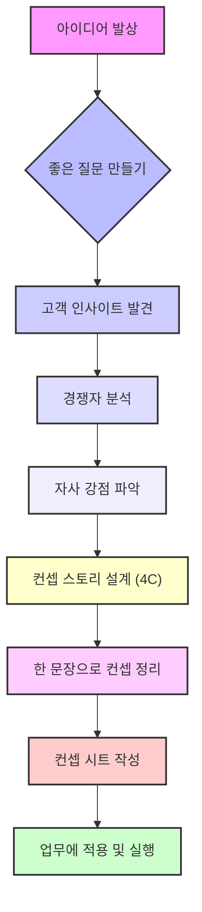

## 컨셉 수업: 번뜩이는 아이디어를 잘 팔리는 비즈니스로 만드는 5단계 실전 공식!
이 책은 비즈니스에서 성공하기 위해 필요한 '컨셉'이 무엇인지 알려주는 책이야. 단순히 좋은 아이디어를 떠올리는 것을 넘어, 그 아이디어를 고객의 마음을 사로잡는 강력한 컨셉으로 만들고, 실제 비즈니스에 적용하는 구체적인 방법을 5단계로 나눠서 설명해 줘. 마치 옆에서 선생님이 하나하나 가르쳐주는 것처럼 친절하고 실용적인 내용으로 가득 차 있어.

## 1. 컨셉, 그게 뭔데? 

컨셉은 그냥 멋진 아이디어가 아니야. 마치 복잡한 퍼즐 조각들을 하나로 꿰뚫는 실 같은 거라고 보면 돼. 이 실이 있어야 모든 조각이 하나의 그림을 만들 수 있잖아? 컨셉도 마찬가지로, 어떤 대상을 <u>일관성 있게 이해하게 해주는 새로운 관점</u>이자, <u>새로운 의미를 만들어내는 일</u>이야. 

1. **컨셉의 원래 의미** 
  1. 컨셉은 '함께 갖는다'는 뜻을 가진 '콘(con)'과 '세트(cept)'가 합쳐진 단어야.
  2. 이건 '공유된 생각과 인식'을 의미해.
  3. 예를 들어, 식당에서 컵을 줄 때 손잡이가 아닌 컵 입구 부분을 잡고 주면 '개념이 없다'고 하잖아? 이건 컵을 다루는 '공유된 생각과 인식(컨셉)'이 없다는 뜻이야. 
2. **컨셉은 **가치의 설계도 
  1. 컨셉은 비즈니스와 관련된 모든 사람에게 <u>명확한 판단 기준</u>을 제공해 줘. 마치 건물을 짓기 전에 설계도가 있어야 어디에 어떤 재료를 쓸지 결정할 수 있는 것처럼 말이야. 
  2. 모든 의사 결정에 <u>일관성</u>을 부여해. 컨셉이 없으면 큰 방향부터 작은 디테일까지 모두 제멋대로가 될 수 있어. 
  3. 고객이 돈을 지불하는 <u>이유</u>가 돼. 고객은 단순히 물건을 사는 게 아니라, 그 물건이 주는 '의미'에 돈을 내는 거거든. 
3. **쓸모의 시대는 끝났어, 의미의 시대야!** 
  1. 요즘은 쓸모 있는 상품이나 서비스는 너무 많아서, 단순히 기능이 좋다고 해서 팔리지 않아.
  2. 사람들은 물건이 주는 '의미'를 중요하게 생각해.
  3. 예를 들어, 옛날에는 어둠을 밝히는 용도로만 쓰이던 양초가 전구의 발명으로 쓸모를 잃었지만, 지금은 '따뜻한 분위기'나 '향기'를 즐기는 '캔들'이라는 새로운 의미를 얻어서 더 비싸게 팔리기도 해. 
  4. 이처럼 기술이나 기능이 아무리 발전해도, 비즈니스의 본질적인 질문은 '누구를 위해 무엇을 창조할 것인가'로 바뀌지 않아. 
4. **컨셉은 말이 일하게 하는 거야** 
  1. 제대로 된 컨셉은 모호한 아이디어를 동료들에게 명확하게 전달해 줘.
  2. 컨셉이 사람들의 입을 통해 퍼져나가면, 내가 직접 회의에 참석하지 않아도 새로운 아이디어를 만들어내거나, 결제권자 앞에서 프레젠테이션 성공률을 높여주기도 해. 
  3. 컨셉은 팀 빌딩, 교섭, 프레젠테이션, 마케팅 등 여러 현장에서 혼자서 열심히 일하는 것과 같아. 
  4. 바빠서 새로운 아이디어에 몰두할 시간이 없는 사람일수록 컨셉을 배우는 것이 이득인 셈이야. 
  5. 마치 투자자들이 돈이 스스로 일하게 만들듯이, 기획자는 '말'이 스스로 일하도록 만들어야 해. 

## 2. 컨셉을 만드는 5단계 공식 

컨셉을 만드는 건 타고난 센스나 직감에만 의존하는 게 아니야. 누구나 따라 할 수 있는 <u>설계된 과정</u>이 있어. 이 책에서는 컨셉을 만드는 과정을 5단계로 나눠서 설명해 줘. 

1. **컨셉이 무엇인지 제대로 이해하기** 
  1. 이건 위에서 설명한 내용과 같아. 컨셉이 단순히 아이디어가 아니라, 새로운 의미를 창조하는 일이라는 걸 아는 게 중요해.
2. **컨셉을 이끄는 좋은 질문 만들기** 
  1. 컨셉은 좋은 질문에서 시작돼. 마치 보물찾기를 할 때 좋은 단서가 있어야 보물을 찾을 수 있는 것처럼 말이야. 
  2. **질문의 좋고 나쁨** 
  1. **자유도**: 질문이 이끌어내는 답의 폭이 넓을수록 좋은 질문이야. 선택지가 많아지는 거지.
  2. **임팩트**: 질문에 답했을 때 사회나 생활에 미치는 영향력이 클수록 좋은 질문이야.
  3. 질문을 바꾸는 재구성 
  1. 어리석은 질문, 나쁜 질문, 퀴즈 같은 질문은 좋은 질문으로 바꿔야 해.
  2. 예를 들어, 느린 엘리베이터 문제에서 '엘리베이터 속도를 높이려면?'이라는 질문은 나쁜 질문이야. '불평하는 사람들을 임대하지 않으면?'은 어리석은 질문이고, '계단을 사용하면?'은 퀴즈 같은 질문이지. 
  3. 좋은 질문은 '기다리는 시간이 짧게 느껴지려면 어떻게 하면 좋을까?'야. 이렇게 질문을 바꾸면 거울을 설치하거나, 광고를 보여주는 등 새로운 아이디어가 나올 수 있어. 
  4. **질문의 레벨** 
  1. **레벨 1 (말 보살피기)**: 시키는 대로 말을 잘 보살피는 거야. (예: 말에게 좋은 식단을 먹이는 것) 
  2. **레벨 2 (말 빨리 달리게 하기)**: 어떻게 하면 말을 빨리 달리게 할 수 있을지 고민하는 거야. 
  3. **레벨 3 (**전제 조건** 의심하기)**: '왜 우리는 맨날 말을 타고만 가려고 하지?'처럼 고정관념을 벗어나 스스로 의문을 제기하는 거야. 
  4. **레벨 4 (**새로운 패러다임**)**: '수레바퀴를 달아서 마차를 만들면 어떨까?'처럼 새로운 방식을 제안하는 거야. 
  5. **레벨 5 (사회 전제 뒤집기)**: '역과 역으로 이어진 교통 시스템을 재편성해서 이동시켜 주는 것'처럼 사회나 업계의 전제를 뒤집는 큰 질문을 제시하고 새로운 장면을 만들어내는 거야. 
  5. **아우디 사례** 
  1. 아우디는 르망 레이스에서 '우리 차가 다른 차보다 빠르지 않다면 어떻게 승리할 수 있을까?'라는 질문을 던졌어.
  2. 단순히 '더 빠른 엔진'을 만드는 대신, '레이스 전체에서 이길 수 있는 차'라는 관점으로 접근했지.
  3. 그래서 디젤 엔진을 선택해서 연비를 좋게 만들고, 피트인(정비) 시간을 줄여서 전체 레이스에서 우승할 수 있었어.
3. **고객에게 다가갈 **컨셉** 스토리를 설계하기** 
  1. 컨셉은 단순히 단어가 아니라, 고객의 마음을 움직이는 '이야기'로 만들어야 해.
  2. 인사이트형 스토리 설계** (**4C 컨셉**)** 
  1. 이건 마치 영웅이 어려움에 처한 사람을 구하는 이야기처럼, 고객의 문제를 해결해주는 스토리를 만드는 방법이야.
  2. **4개의 C**로 구성돼.
  - **Customer (고객)**: 고객이 어떤 어려움을 겪고 있는지. 
  - **Competitor (경쟁자)**: 경쟁자들이 그 어려움을 어떻게 해결해주지 못하는지. 
  - **Company (자사)**: 우리 회사가 어떤 해결책을 제시할 수 있는지. 
  - Concept** (**컨셉**)**: 그래서 우리 회사의 컨셉은 무엇인지. 
  3. **스타벅스 사례** 
  - **고객**: 집과 직장을 오가느라 스트레스가 쌓여있어. 도시에는 제대로 숨 쉴 곳이 없어. 
  - **경쟁자**: 아무도 도시에서 편히 쉴 곳을 주지 않아. 눈치 보게 만들고, 1인 1잔을 요구해. 
  - **자사**: 그래서 스타벅스는 넓은 공간, 고급스러운 소파, 기분 좋은 음악과 커피를 제공해서 편히 쉴 수 있는 공간을 만들어. 
  - **컨셉**: 그러므로 스타벅스는 '집과 직장 사이에 있는 제3의 장소'가 되는 거야. 
  4. **토스 사례** 
  - **고객**: 은행 업무가 힘들고 어려워.
  - **경쟁자**: 전통 금융은 전통 방식만 고수하고, 공인인증서 같은 복잡한 절차를 요구해.
  - **자사**: 그래서 토스는 인증 없이 소액도 편하게 결제할 수 있게 해줘.
  - **컨셉**: 그러므로 토스는 '무인증 소액 결제'로 금융을 혁신하는 거야.
  5. **크몽 사례** 
  - **고객**: 전문가 채용이 어려워.
  - **경쟁자**: 대부분의 프리랜서나 아웃소싱 업체는 기회비용이 많이 들고, 결정하려면 PT나 견적서 등 복잡한 절차가 필요해.
  - **자사**: 그래서 크몽은 단타(단기 프로젝트)도 가능하고 소액으로도 전문가를 고용할 수 있게 해줘.
  - **컨셉**: 그러므로 크몽은 '재능 플랫폼'을 만드는 거야.
  6. **가인지 캠퍼스 사례** 
  - **고객**: 경영하기 힘들어. 경영을 배우고 시작하지 않았는데 막상 지식이 없어.
  - **경쟁자**: 다른 경영 컨설팅 회사는 비싸고 적용이 잘 안 돼.
  - **자사**: 그래서 가인지 캠퍼스는 바로 적용 가능하고, 설명과 자료를 함께 제공해 줘.
  - **컨셉**: 그러므로 가인지 캠퍼스는 '경영자 고민 해결'을 위한 곳이야.
  3. **고객 인사이트란?** 
  1. 고객 인사이트는 <u>겉으로 드러난 것만 보는 게 아니라, 아직 충족되지 않은 </u>숨겨진 욕구를 찾아내는 거야.
  2. 마치 빙산의 일각처럼, 사람들이 의식하지 못하는 95%의 무의식적인 행동이나 욕구를 찾아내는 거지. 
  3. 인사이트는 'A이지만 B'라는 기본 구문으로 서술할 수 있어. A와 B는 서로 모순되는 두 가지 심리를 나타내. 
  - 키트 오이식스: 식사 준비에 품을 많이 들이고 싶지는 않지만, 부실하게 먹고 싶지는 않다. 
  - 더 퍼스트 테이크: 부담 없이 음악을 즐기고 싶지만, 아티스트의 진심을 느끼고 싶다. 
  - **페브리즈**: 집 냄새는 없애고 싶지만, 빨래를 하기는 귀찮다. 
  4. **경쟁자 분석** 
  1. 경쟁 상대를 분석하면 우리 브랜드의 가치를 발견할 수 있어.
  2. 세 가지 관점에서 경쟁 상대의 약점이나 소홀함을 찾아내면, 그게 우리 브랜드의 기회가 돼.
  - **범주 (Category)**: 같은 범주 안의 경쟁자는 누구인가? (예: 여행업에서 '어린이 여행' 전문) 
  - **과제 (**Job**)**: 같은 역할을 하는 경쟁자는 어디 있는가? 
  - **시간 (Time)**: 같은 시간을 두고 겨루는 경쟁자는 누구인가? 
  5. **자사만의 **베네핏** (Benefit)** 
  1. 우리 회사의 강점을 세 가지 관점으로 나눠서 생각해봐.
  - **팩트 (Fact)**: 상품이나 서비스가 가진 객관적인 사실은 무엇인가? (예: 저소음 파워 테크놀로지 특허 기술) 
  - **메리트 (Merit)**: 타깃과 상관없는 일반적인 이익은 무엇인가? 
  - **베네핏 (Benefit)**: 타깃에게 강하게 어필하는 이익은 무엇인가? (예: 잠든 아기를 깨우지 않는다) 
  6. 비전형** 스토리 설계** 
  1. 이건 마치 회사의 과거와 미래를 잇는 이야기 형식이야.
  2. 조직이 목표로 삼아야 할 이상적인 미래를 제시하고, 그것을 위해 지금 해야 할 일을 컨셉으로 지정하는 거지.
  3. 미션** (Mission)**: 조직이 계속 짊어져야 할 사회적 사명이야. '우리는 무엇을 만드는가?'를 통해 보편적 가치를 묻는 거지. 
  - 미션은 기업의 존재 이유를 이야기하고, 본업을 제외하고는 말할 수 없어. 
  - 기업의 역사에서 유래하며, 고객과 연관이 많아. 
  4. 비전** (Vision)**: 목표로 삼아야 할 이상적인 미래야. '우리는 무엇이 목표인가?'를 눈에 보이는 말로 서술하는 거지. 
  - 비전을 작성할 때는 '해상도를 높이고(구체적으로)', '안전지대(Comfort Zone)를 뛰어넘는(과감하게)' 것이 중요해. 
  - 예를 들어, 스페이스X는 '사람들이 여러 행성에서 사는 미래를 준비하는 것'을 비전으로 삼고 있어. 
  5. **미션, 컨셉, 비전의 관계** 
  - 미션과 비전 사이에 컨셉이 있어. 컨셉은 비전을 향한 첫걸음이자 현재에 해당돼.
  - 컨셉을 설명할 때는 '이상적인 미래의 풍경', '구체적인 말', '모두가 같은 방향을 보게 하는 것', '추진력을 만드는 것'이 중요해. 
4. **임팩트 있는 한 문장 설계하기** 
  1. 아무리 좋은 컨셉도 한 문장으로 명확하게 전달하지 못하면 힘을 잃어.
  2. **의미를 정리하는 **세 점 정리법 
  1. 이건 마치 점 세 개를 찍어서 정리하는 것처럼, 'A가 B하도록 C 역할을 한다'는 문장 구조를 제안하는 거야.
  2. **A (고객)**: 주어 (예: 경영자가) 
  3. **B (**목적**)**: 동사 (예: 사랑으로 경영할 수 있도록) 
  4. **C (역할)**: 명사 (예: 경영 지식을 제공하는 역할을 맡는다) 
  5. **예시**: '경영자가 사랑으로 경영할 수 있도록 가인지 컨설팅 그룹은 경영 지식을 제공하는 역할을 맡는다.' 
  3. **핵심만 남기기 (목적형, 역할형, 연결형)** 
  1. 세 점 정리법으로 작성한 문장 중에서 새로운 의미를 낳는 것이 '목적'인지 '역할'인지에 따라 컨셉의 형태가 달라져.
  2. **목적형**: 고객이 목적을 달성하도록 돕는 역할 (예: 에어비앤비 - 전 세계 어디든 내 집처럼) 
  3. **역할형**: 우리가 이런 역할을 맡는다 (예: 스타벅스 - 제3의 장소) 
  4. **연결형**: 동사 + 명사로 서술 (예: 기름과 소금을 줄이는 건강 요리) 
  4. **날카롭게 다듬기 (**두 단어 규칙**)** 
  1. 모든 컨셉은 두 가지 개념, 즉 영단어 두 개의 조합으로 표현할 수 있어.
  2. 예: Pocketable Radio (주머니 속의 라디오), Summer Place (여름 장소), Radical Transparency (급진적 투명성) 
  3. 두 가지 개념을 중심으로 뉘앙스를 조절하고, 연상법, 우연법, 유희법 등을 활용해 말을 고르는 거야. 
5. **상품 기획, 마케팅 등 업무에 적용하기** 
  1. 컨셉은 단순히 머릿속 아이디어가 아니라, 실제 업무에 적용되어야 해.
  2. 컨셉 시트** (템플릿)** 
  1. 이 책에서 가장 중요한 부분 중 하나인데, 컨셉을 한 장으로 정리할 수 있는 양식이야.
  2. **기본 뼈대**: 타겟 고객, 인사이트, 컨셉, 키 베네핏(핵심 편익), 서브 베네핏(보조 편익), 팩트(객관적 사실)로 구성돼. 
  3. **스케치**: 물건이 아니라 '사람'을 중심으로 그려야 해. 
  4. **베네핏과 팩트**: 이 두 가지는 항상 세트로 정리해야 해. 
  5. **가상 청소기 브랜드 '에어리즈' 사례** 
  - **타겟 고객**: 어린 자녀를 둔 맞벌이 부부 (구매력이 높고 시장 규모가 커) 
  - **인사이트**: 흡입력이 강한 건 좋지만 시끄러운 건 싫어. (이건 맞벌이 부부에게 너무나 공감되는 이야기지) 
  - **컨셉**: '강한 흡입력에 못지않은 고요함' 
  - **팩트 (기술)**:
  - 저소음 파워 테크놀로지 특허 기술로 소음 40데시벨 이하. 
  - 에어로 진공 시스템으로 99% 흡입률. 
  - 360도 회전 롤러 탑재로 고르지 않은 면에서도 밀착력 좋음. 
  - **베네핏 (고객 편의)**:
  - 잠든 아기를 깨우지 않는다. (40데시벨 이하의 소음이 주는 편익) 
  - 아기가 기어 다녀도 안심할 수 있는 바닥. (99% 흡입률이 주는 편익) 
  - 한 손으로도 쓱쓱 가볍게 밀 수 있다. (360도 회전 롤러가 주는 편익) 
  - 이처럼 기술적인 '팩트'를 고객이 얻을 수 있는 '편익(베네핏)'으로 바꿔서 설명하는 것이 중요해.
  6. **가상 요거트 브랜드 '크리미 나이트' 사례** 
  - **타겟 고객**: 20대 후반에서 30대 일하는 여성. 
  - **인사이트**: 하루를 마치고 보상을 얻고 싶지만, 칼로리가 신경 쓰여. (여성들에게 공감되는 이야기지) 
  - **컨셉**: '아침을 바꾸는 밤의 요거트' 
  - **팩트 (생산 능력)**:
  - 풍부한 국산 과일. 
  - 커스터드 크림처럼 만드는 독자적인 제조법. 
  - 저지방 우유 사용, 당분 최소화. 
  - 수면 중 장내 환경을 다스린다는 조사 결과. 
  - 습관화를 통해 상쾌하게 아침에 일어날 수 있음. 
  - **베네핏 (고객 편익)**:
  - **핵심 편익**: 만족스러운 포만감. 
  - **보조 편익**: 낮은 칼로리, 변비 예방. 
  - **기타**: 장내 환경을 다스려 미용과 수면의 질 개선 기대. 
  3. **마케팅 컨셉은 글로 정리한다** 
  1. 고객, 사용자의 눈높이로 써야 해. 회사 안에서만 통하는 표현이나 어려운 단어는 피해야 해. 
  2. 멋진 카피를 지나치게 고집하지 말고, 기능적인 표현에 집중해야 해. 
  3. 200~300자 정도로 다듬어서 쉽게 읽을 수 있는 분량으로 정리하는 것이 좋아. 
  4. **가치는 몇 줄짜리 간략한 글로 정리한다** 
  1. 간단하게, 구구절절해지지 않도록 글자 수를 최소로 정리해야 해. 
  2. 명확하게, 되도록 구체적으로 써야 해. 
  3. 기억하기 쉽게, 운율이나 리듬에 신경 써서 쉽게 읽고 기억할 수 있도록 써야 해. 
  5. **KPI를 언어적 목표로 바꾸기** 
  1. 회사 내부에서 사용하는 핵심 성과 지표(KPI)를 고객과 연관이 있는 언어로 바꿔주어야 해.
  2. 예를 들어, '1일 5회전'이라는 KPI는 '한 시간이면 충분히 만족할 수 있는 서비스를 만들자'로 바꾸는 거야.
  3. '객단가 3만 원'은 '고급 요리집 맛을 이자카야 가격으로 즐기게 하자'로 바꾸고, '고객 만족도 점수 3.8'은 '올 때마다 놀라운 경험을 주는 집이 되자'로 바꿔야 직원들이 컨셉을 가지고 행동할 수 있어.
  6. **컨셉의 레이어 (계층)** 
  1. 컨셉에도 크고 작은 단계가 있어.
  2. **브랜드 컨셉**: 가장 오래가고 적용 범위가 넓은 컨셉이야. 회사 전체의 정체성을 나타내.
  3. **제품 컨셉**: 특정 제품이나 서비스에 대한 컨셉이야.
  4. **커뮤니케이션 컨셉**: 마케팅이나 광고 등 고객과의 소통에 사용되는 컨셉이야.

## 3. 좋은 컨셉의 4가지 조건 

컨셉이 아무리 좋아 보여도, 이 4가지 조건을 충족하지 못하면 실패할 확률이 높아. 마치 건물을 지을 때 튼튼한 기초가 필요한 것처럼 말이야.

1. **고객의 눈높이에서 썼는가?** 
  1. 컨셉은 고객이 쉽게 이해하고 공감할 수 있는 말로 표현되어야 해.
  2. **MP3 플레이어 사례** 
  1. '500기가 용량의 MP3 플레이어'는 기술적인 설명이라 고객에게 와닿지 않아.
  2. 하지만 스티브 잡스의 '주머니 속의 천 곡'은 고객이 얻을 수 있는 가치를 명확하게 보여줘서 큰 성공을 거뒀지.
  3. 기업이 아무리 '혁신적인 서비스'라고 말해도, 고객이 받아들이지 않으면 소용없어. 고객이 행복해할 수 있는 방식으로 컨셉을 정리하는 게 중요해. 
2. **세상에 단 하나뿐인 아이디어가 있는가?** 
  1. 컨셉은 우리 회사만의 독특하고 유일한 아이디어를 담고 있어야 해.
  2. **유니클로 사례** 
  1. 유니클로는 '라이프웨어(LifeWear)'라는 단어를 만들어서 '품질 좋은 상품을 저렴한 가격으로 제공하고, 사람들의 생활에 필요한 것을 끊임없이 고민하는 옷'이라는 컨셉을 제시했어.
  2. 이 단어 하나로 유니클로의 편안함, 과하지 않은 디자인, 합리적인 가격 등이 모두 설명되지?
  3. 때로는 모두를 기쁘게 하려고 하기보다, <u>일부 매니아층을 타겟으로 미움받을 각오</u>도 되어 있어야 해. 
  4. 이세이 미야케** 사례** 
  1. 일본의 패션 브랜드 이세이 미야케는 '한 장의 천'이라는 컨셉으로 동양과 서양을 초월하는 세계적 의류를 목표로 했어.
  2. 몸과 천이 만드는 공간의 실루엣, 편안한 감촉을 한 장의 천으로 입체적으로 만들어 보편적인 패션을 선보였지.
  5. 에버레인** 사례** 
  1. 미국의 패션 브랜드 에버레인은 '급진적 투명성(Radical Transparency)'을 컨셉으로 내세웠어.
  2. 불투명한 가격 책정이나 환경에 해로운 대량 폐기 문제를 정면으로 마주하고, 모든 정보를 자세히 공개해서 젊은 세대의 지지를 얻었지.
  6. 프레데릭 말** 사례** 
  1. 향수업계에 새로운 바람을 불어넣은 프레데릭 말의 브랜드 컨셉은 '향기 출판사'야.
  2. 겉으로 드러나지 않던 조향사를 전면에 내세우고, 브랜드에 '재능 있는 조향사와 함께하는 편집자'라는 이미지를 부여해서 개성과 자극을 안겨주었어.
  7. 가나자와 21세기 미술관** 사례** 
  1. 이 미술관은 '마을에 펼쳐진 공원 같은 미술관'이라는 컨셉을 바탕으로 탄생했어.
  2. 360도 전면이 유리로 둘러싸여 어느 방향에서든 사람이 오고 갈 수 있도록 설계되어 뒷면이 존재하지 않아. 예술 애호가뿐만 아니라 시민에게도 사랑받는 곳이지.
3. **규모를 예측할 수 있는가?** 
  1. 해당 컨셉으로 비즈니스의 목표를 달성할 수 있는 시장 규모가 보장되어야 해.
  2. 아무리 좋은 아이디어라도 시장이 너무 작으면 성공하기 어렵겠지?
4. **심플한 말로 썼는가?** 
  1. 컨셉은 쉽고 간결하며, 이해하기 쉬운 말로 표현되어야 해.
  2. 마치 짧고 강렬한 문구처럼, 듣는 사람의 마음을 움직이고 흥분을 담을 수 있어야 해.
  3. **에어비앤비 사례** 
  1. 에어비앤비는 처음에는 '빈방을 빌려주는 부업'이라는 컨셉으로 시작했어. 
  2. 하지만 시간이 지나면서 '여행의 의미'를 바꾸기 시작했지. 
  3. 단순히 숙박을 제공하는 것을 넘어, '현지인과 친구가 되어 낯선 곳에 속하는 경험'이라는 새로운 가치를 발견했어. 
  4. 그래서 컨셉을 'Going(가는 것)', 'Traveling(여행하는 것)', 'Staying(숙박하는 것)'이 아닌, 'Belong(속하는 것)'으로 바꿨어. 
  5. 이 컨셉 덕분에 코로나 상황에서도 오히려 성장할 수 있었지. 여행이 어려워도 '현지에 속하는 경험'은 가능했으니까. 
  6. '전 세계 어디든 내 집처럼'이라는 한 문장으로 컨셉을 명확하게 전달했어. 
  4. **스타벅스 사례** 
  1. 스타벅스는 '제3의 장소'라는 컨셉을 가지고 있어. 집(제1의 장소)과 직장/학교(제2의 장소) 사이에서 편히 쉴 수 있는 공간을 제공하는 거지. 
  2. 이 컨셉 덕분에 스타벅스는 가격으로 경쟁하지 않고, 공간과 상품의 가치를 극대화할 수 있었어. 
  3. **'**제3의 장소**' 컨셉을 위한 노력** 
  - **입지**: 사람들의 스트레스가 높은 곳을 선택해서 존재 의의를 알릴 수 있도록 했어. 
  - **인테리어**: 넓고 편안한 의자와 소파, 콘센트 등을 제공해서 오래 머물러도 눈치 보이지 않게 했어. 
  - **접객**: 고객을 친근하게 대하지만, 너무 허물없이 대하지는 않아. 집과 직장 사이의 공간이니까 딱 그만큼만 친절한 거지. 
  - **소리**: 대화나 작업을 방해하지 않는 편안한 음량의 음악을 유지해. 
  - **향기**: 매장을 커피 향으로만 채우고, 흡연은 엄격하게 금지했어. 
  - 이러한 요소들이 '제3의 장소'라는 컨셉을 일관성 있게 만들어주는 거야.
  5. 쉘젤라이브** (안전모) 사례** 
  1. 가리비 껍데기를 폐기하는 업체가 코로나 시기에 도산하면서 쌓인 껍데기를 어떻게 처리할지 고민했어.
  2. 이 껍데기로 어부들을 보호하는 안전모를 만들 수 있겠다는 아이디어가 나왔지.
  3. '머리를 보호하고 지구를 보호하자'는 컨셉으로 쉘(껍데기) 헬멧을 만들자, 사람들이 프리미엄 헬멧으로 인식하고 팔리기 시작했어.
  6. 도쿄의 흰색 티셔츠 전문점** (샵 FF FF fft) 사례** 
  1. 오로지 흰색 티셔츠만 파는 가게인데, 지금은 전 세계 관광객이 찾아오는 명소가 되었어.
  2. '흰색 티셔츠를 입는 날이 가장 아름다운 날'이라는 가치를 제안했기 때문이야.
  3. '당신의 삶에서 가장 아름다운 날, 당신이 돋보일 수 있도록 흰색 티셔츠를 입는 것'이라는 컨셉이 먹힌 거지.
  7. **동사형 컨셉의 중요성** 
  1. 컨셉을 명사로 잡으면 사고가 프레임 안에 갇히기 쉬워.
  2. 하지만 컨셉을 동사로 잡으면 사고가 열리고 새로운 아이디어를 떠올릴 수 있어.
  3. **통학 버스 디자인 사례** 
  - '통학 버스를 디자인합시다'라고 하면 노란색 스쿨버스만 생각하게 돼.
  - 하지만 '학교에 가는 방법을 디자인한다'고 생각하면 로켓, 헬리콥터, 말을 타고 가는 것 등 다양한 아이디어가 나올 수 있어.
  4. 나이키 런클럽** 사례** 
  - 나이키는 러닝화의 기술력만 내세우는 대신, '달린다'는 동사에 집중해서 나이키 런클럽 앱을 만들었어.
  - 사람들의 공감대를 형성하고 달리는 것을 일상생활로 만들면서 큰 성공을 거뒀지.
  5. 애플도 아이폰의 역할을 설명할 때 '관계의 연결'을 정서적으로 전달하기 위해 동사형, 형용사형, 정서에 기반한 이야기를 많이 사용했어. 
  6. **국내 사례 (동사형 **컨셉**)** 
  - **일상적이고 평범한 것**: '쉬다, 대화하다, 즐기다' (스타벅스, 블루보틀)
  - **움직임과 탐험**: '움직이다, 탐험하다, 구경하다' (스타필드 수원 별마당, 올리브영 성수 가든)
  - 비일상적인** 놀라움**: '놀라다, 두근거리다, 감동하다' (템버린즈, 젠틀몬스터)

## 4. 컨셉은 비정상적인 생각에서 시작돼 

이 책에서 설명하는 컨셉 만드는 방법은 논리적이고 체계적이지만, 정말 사회에 큰 의미를 가져다줄 컨셉은 <u>논리를 뛰어넘는 비정상적인 생각</u>에서 시작돼. 마치 몬스터를 길들이는 고삐처럼, 상식에서 벗어난 생각일수록 프레임워크를 통해 매력적인 컨셉으로 완성될 가능성이 높아. 

1. **처음에는 주위를 놀라게 하고 어처구니없게 만들었던 컨셉들** 
  1. **스페이스X**: 인류가 여러 행성에서 살 수 있는 날을 꿈꾸며 만든 재사용 가능 로켓.
  2. **퍼스널 컴퓨터**: 거대한 컴퓨터가 당연했던 시대에 어린이도 사용할 수 있도록 구상한 컴퓨터.
  3. **에어비앤비**: 빈방에 묵을 수 있는 서비스를 만들어 전 세계를 내 집처럼 편안하게 만들자는 스타트업.
  4. 에버레인: 업계가 감춘 어두운 이면을 투명하게 밝혀 원가와 공장 생산 공정까지 자세히 공개하는 의류 기업.
2. **상식적인 논리에서 벗어나야 해** 
  1. 처음부터 틀에 담아야 한다는 생각에 뻔한 것을 떠올리거나 위축되어 규모를 줄이려 하면 평범한 컨셉밖에 나오지 않아.
  2. 세상이 쉽게 받아들일 만한 바른 논리 대신, <u>자기 안에 있는 </u>소수 의견을 건져 올려봐. 
  3. 아무리 풍족한 사람이라도 지금의 생활이나 사회에 대해 어느 정도 '분노'를 느끼기 마련이야. 또는 '이런 미래가 되었으면 좋겠다'고 남몰래 '상상'하고 있을지도 몰라. 아니면 '나는 이게 너무 좋아'하고 남다른 '애정'을 마음속 깊이 숨기고 있을지도 모르지. 
  4. 이러한 '분노, 상상, 애정' 같은 지극히 개인적인 감정을 종이에 써보는 거야. 종이에 옮겨진 말들은 새로운 비즈니스를 창출하는 희소 자원과 같아. 
  5. 주위 사람이 이상하게 볼지도 모른다고 주저하는 것에 틀림없이 새로운 가치가 숨어 있어. 
3. **유행어에 흔들리지 마** 
  1. 비즈니스 하는 사람들은 유행하는 주제에 달려들기를 좋아해. 소사이어티 5.0, WEB 3.0, AI, 블록체인 같은 새로운 말들이 끊임없이 나타나지. 
  2. 하지만 이러한 유행어는 평론가나 투자자 같은 외부의 대상을 위한 것이야. 
  3. 최전선에서 가치를 만들어 나가는 사람들은 이러한 유행에 동조하는 기색을 보여도 결코 흔들리지 않아. 
  4. 그들은 대신 새로운 생활이나 사회에 관한 구체적인 생각, 즉 '컨셉'을 이야기하려 해. 아직 아무도 언어로 하지 못한 것을 거칠게나마 자신의 말로 표현하려 하지. 

