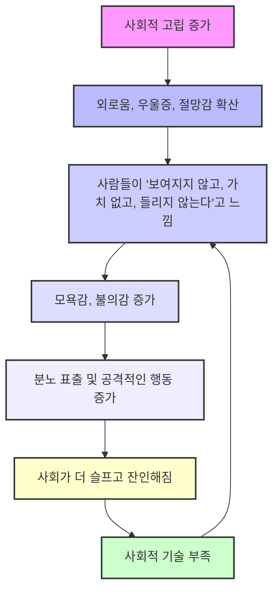
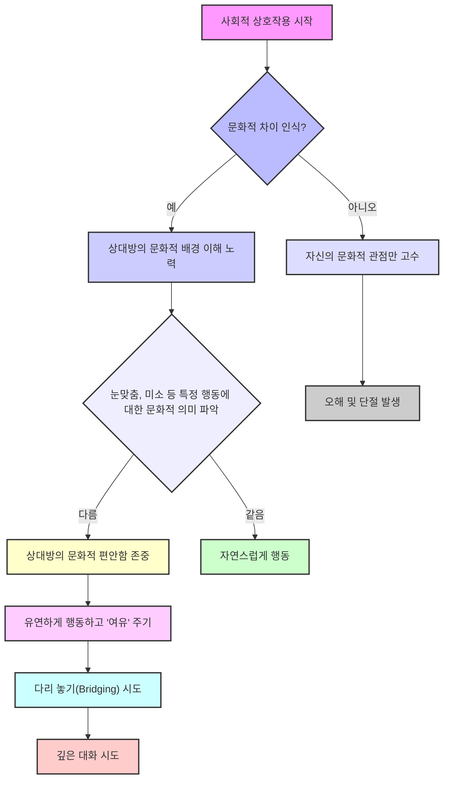
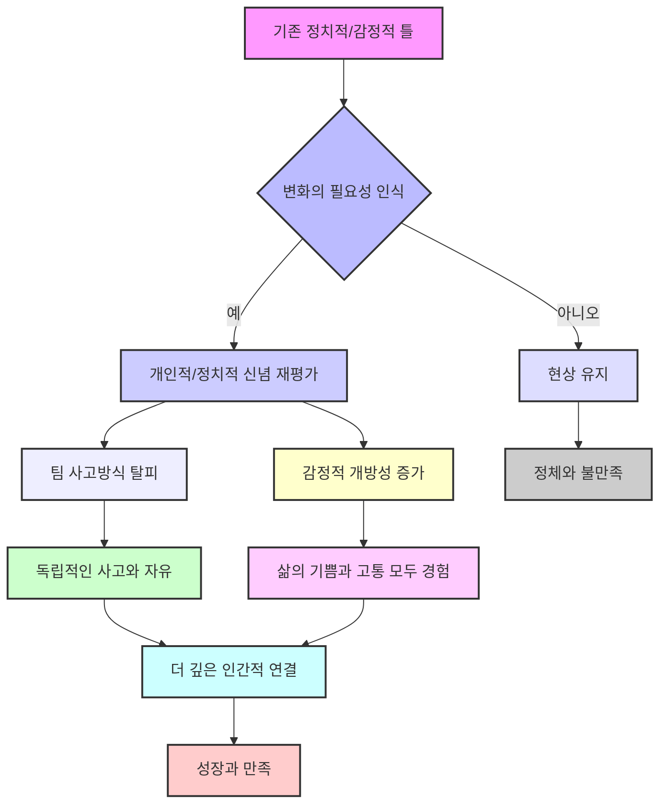

## 데이비드 브룩스의 '사람을 아는 방법': 타인을 깊게 보고 깊게 보이는 기술
이 책은 우리가 다른 사람들을 진정으로 이해하고, 그들이 자신을 '보여지고, 가치 있고, 들린다'고 느끼게 하는 방법을 알려주는 실용적인 안내서이다. 저자는 사회적 기술을 배우고 연습함으로써 더 의미 있는 관계를 맺고, 분열된 사회에서 인간성을 회복할 수 있다고 말한다.

## 1. '보여진다'는 것의 힘: 조명가와 축소자 

우리가 다른 사람들과 관계를 맺을 때, 크게 두 가지 유형의 사람이 있다고 한다. 마치 무대 위에서 배우를 빛나게 하는 조명처럼 다른 사람을 특별하게 느끼게 하는 '조명가(illuminators)'와, 반대로 다른 사람을 보이지 않게 만들고 기운 빠지게 하는 '축소자(diminishers)'이다.

1. **조명가(**Illuminators**)**는 다른 사람의 강점을 알아보고 칭찬하며, 그들이 스스로의 최고 모습을 볼 수 있도록 돕는 사람이다.
  - 이들은 긍정적이고 지지적인 분위기를 만들어서 사람들이 성장하고 발전하도록 격려한다.
  - 예를 들어, 윈스턴 처칠의 어머니 제니 제롬이 벤자민 디즈레일리와 식사했을 때, 디즈레일리는 제롬을 특별하게 느끼게 해주어 그녀가 영국에서 가장 똑똑한 사람이라고 생각하게 만들었다고 한다. 
2. 축소자**(Diminishers)**는 다른 사람에게 관심이 없고, 그들을 고정관념으로 판단하며, 질문하지 않고 무시하는 사람이다. 
  - 이들은 다른 사람의 자신감과 자존감을 깎아내려, 자신의 능력과 가치에 의문을 품게 만든다.
  - 예를 들어, 제니 제롬이 윌리엄 글래드스턴과 식사했을 때, 글래드스턴은 그녀를 보이지 않는 사람처럼 느끼게 했다고 한다. 
3. **조명가가 되는 방법** 
  - 인문학(문학, 연극, 예술 등)을 공부하여 다른 사람에 대한 이해를 높이는 것이 중요하다.
  - 다른 사람을 이해하지 못하면 자신도 불행하고 주변 사람들도 불행하게 만들 수 있기 때문이다.

## 2. 사람을 제대로 보지 못하는 이유 

우리가 다른 사람을 제대로 보지 못하고 그들을 특별하게 느끼게 해주지 못하는 데에는 여러 가지 이유가 있다.

1. **자신의 자만심(ego)**: 자기 자신에게만 너무 집중해서 다른 사람에게 관심을 기울이지 못하는 경우이다. 
2. **불안감(anxiety)**: 다른 사람과의 관계에서 오는 불안감 때문에 제대로 소통하지 못하는 경우이다. 
3. **순진함(being naive)**: 다른 사람의 복잡한 내면을 이해하지 못하고 겉모습만 보고 판단하는 경우이다. 
4. **다른 사람이 자신보다 덜 똑똑하다고 생각하는 것**: 다른 사람의 생각이나 감정을 무시하고 자신의 관점만 옳다고 여기는 태도이다. 
5. 객관주의**(objectivism)**: 사람들을 개개인이 아닌 집단으로 묶어서 보는 경향이다. 
  - 예를 들어, 특정 지역 사람들은 이럴 것이라고 미리 판단하는 것이다.
6. **본질주의(**essentialism**)**: 어떤 사람에 대해 한 가지 사실만 알고 그것으로 그 사람의 모든 것을 단정 짓는 것이다. 
  - 예를 들어, 어떤 사람이 한 번 실수를 했다고 해서 그 사람을 항상 실수하는 사람으로 낙인찍는 것이다.
7. 고정된 사고방식**(static mindset)**: 시간이 지나면서 변하는 사람의 모습을 업데이트하지 않고 과거의 정보로만 판단하는 것이다. 
  - 사람은 계속 변하고 성장하는데, 예전 모습에만 갇혀서 보는 것이다.

## 3. 사람을 알아가는 세 가지 단계 

다른 사람을 잘 알고 존중받는다고 느끼게 하려면 세 가지 단계를 거쳐야 한다.

### 3.1. 첫 번째 시선 (First Gaze): 경외심을 가지고 바라보기 
1. **무의식적인 질문들**: 처음 사람을 만날 때, 우리는 무의식적으로 "내가 당신에게 중요한 사람인가?", "나를 존중해 줄 것인가?" 같은 질문들을 던진다. 
  - 이 질문에 대한 답은 말하기 전에 눈빛으로 전달된다. 
2. **경외심과 존중**: 모든 사람을 신의 형상으로 만들어진, 무한한 가치와 존엄성을 가진 존재로 대하는 것이 중요하다. 
  - 이것은 종교와 상관없이, 모든 사람을 깊이 존중하는 태도를 의미한다.
  - 사람은 해결해야 할 문제가 아니라, 결코 끝을 알 수 없는 신비로운 존재라고 생각해야 한다. 
3. **예시: 지미 더렐 목사**: 텍사스 와코에서 만난 라루 도르시 선생님은 엄격한 분이었지만, 지미 더렐 목사가 그녀를 "최고예요! 사랑해요!"라고 외치며 껴안자, 그녀는 아홉 살 소녀처럼 환하게 변했다. 
  - 지미 목사는 모든 사람을 신의 형상으로 보고, 무한한 가치를 지닌 존재로 대했기 때문이다. 
4. **관심은 도덕적인 행동**: 우리가 세상에 어떤 관심을 기울이느냐가 우리가 어떤 사람인지를 결정한다. 

### 3.2. 동행 (Accompaniment): 함께 시간을 보내며 존재하기 
1. **타인 중심적인 태도**: 동행은 피아니스트가 가수를 돋보이게 하듯이, 다른 사람을 빛나게 하려는 타인 중심적인 태도를 의미한다. 
  - 깊은 대화가 아니더라도, 함께 시간을 보내는 것 자체가 중요하다.
2. **함께 놀기**: 놀이는 깊은 대화 없이도 사람들을 연결해주는 강력한 방법이다. 
  - 농구나 카드 게임처럼 함께 놀면서 사람들은 더 자연스럽고 솔직한 모습을 보여준다.
  - 저자는 아들이 어릴 때 말을 못 해도 함께 놀면서 깊은 유대감을 형성했다고 한다. 
3. **단순한 존재감**: 때로는 그저 옆에 있어주는 것만으로도 큰 위로가 된다. 
  - 저자의 학생 질리언이 아버지의 죽음으로 힘들어할 때, 친구들은 아무 말 없이 그저 옆에 서서 안아주었다. 이것이 그녀에게 가장 필요한 위로였다. 
4. **동행을 삶에 적용하는 방법** 
  - 사랑하는 사람들과 함께하는 활동에 시간을 할애하고, 그 순간에 온전히 집중한다.
  - 놀이를 대화의 부담 없이 유대감을 형성하는 도구로 활용한다.
  - 정기적인 활동이나 전통을 만들어 함께 즐거운 시간을 보낸다.
  - 사랑하는 사람들의 작은 특징들을 관찰하고 소중히 여겨 유대감을 강화한다.

### 3.3. 대화 (Conversation): 질문하고 경청하며 깊이 연결되기 
1. **좋은 대화의 특징**: 좋은 대화는 단순히 서로에게 말을 던지는 것이 아니라, 한 사람이 말하면 다른 사람이 그 위에 덧붙여 발전시켜 나가는 것이다. 
  - 대화는 한 곳에서 시작해서 예상치 못한 곳으로 흘러갈 수 있다.
2. **더 나은 대화가가 되기 위한 팁** 
  - **관심을 켜고 끄는 스위치처럼 다루기**: 60%만 집중하는 것이 아니라, 100% 집중하거나 아예 집중하지 않는 것이다. 
  - **소리 내어 듣기(**Loud Listener**)**: 앤디 크라우치처럼 "아멘, 맞아, 설교해!"와 같이 적극적으로 반응하며 듣는 것이다. 
  - **상대방을 '증인'이 아닌 '작가'로 만들기**: "상사가 그 말을 할 때 어디에 앉아 있었나요?"처럼 구체적인 질문을 해서 상대방이 이야기를 더 자세히 풀어나가게 돕는다. 
  - **침묵을 두려워하지 않기**: 대화 중 잠시 멈추는 것은 상대방이 생각할 시간을 주어 더 사려 깊은 답변을 할 수 있게 한다. 
  - **'더 잘난 사람'이 되지 않기(Don't be a Topper)**: 상대방이 자신의 문제를 이야기할 때, "나도 알아, 내 아들도 그래"라며 자신의 이야기를 꺼내지 않는 것이다. 이는 상대방의 이야기에 관심이 없다는 인상을 줄 수 있다. 
  - **'보석 같은 진술'을 중심에 두기**: 논쟁 중에도 서로 동의하는 핵심적인 부분을 잊지 않고, 관계를 지키는 데 집중하는 것이다. 
  - **불일치 아래의 불일치 찾기**: 세금 정책처럼 표면적인 의견 차이 뒤에 숨겨진 철학적, 가치관적 차이를 탐구하는 것이다. 
3. **좋은 질문의 중요성**: 대화의 질은 질문의 질에 달려 있다. 
  - **아이들처럼 호기심 갖기**: 아이들은 "결혼했어요?", "이혼했어요?", "아직도 그 사람을 사랑해요?"처럼 솔직하고 깊은 질문을 잘한다. 
  - **개방형 질문**: "어디 출신이세요?", "이름은 어떻게 지어졌나요?", "자신에 대해 중요하지 않다고 생각하는 것 중 가장 좋아하는 것은 무엇인가요?"와 같이 상대방이 이야기를 풀어나갈 수 있는 질문을 한다. 
  - **구체적인 경험에 대한 질문**: "밤 11시 이후에 마지막으로 식료품점에 간 경험에 대해 이야기해주세요"처럼 구체적인 상황을 물어보면 더 풍부한 이야기가 나온다. 
  - **삶을 돌아보게 하는 질문**: "지금 어떤 갈림길에 서 있나요?", "두렵지 않다면 무엇을 할 건가요?", "어떤 재능을 가지고 있지만 사용하지 않고 있나요?"와 같이 깊이 있는 질문을 통해 상대방의 삶을 조망하게 한다. 
  - **조상에 대한 질문**: "조상들이 당신의 삶에 어떻게 나타나나요?"와 같은 질문은 자신의 정체성과 가치관을 이해하는 데 도움이 된다. 

## 4. 어려운 상황에서의 사회적 기술 

우리는 평범하지 않은 시대를 살고 있기 때문에, 불리한 상황에서도 다른 사람들과 깊은 사회적 연결을 맺는 기술이 필요하다.

### 4.1. 절망에 빠진 친구를 돕는 방법 
1. **우울증에 대한 이해**: 우울증은 단순히 슬픔의 연장선이 아니라, 현실을 인식하는 도구의 오작동과 같다. 
  - 우울증에 걸린 사람은 "너는 쓸모없어, 아무도 네가 없어져도 그리워하지 않을 거야"와 같은 거짓된 목소리에 시달린다. 
2. **피해야 할 실수**:
  - **해결책 제시**: "예전에 베트남으로 봉사 활동 갔었잖아, 다시 해보는 건 어때?"처럼 아이디어를 주는 것은 우울증 환자에게 에너지가 부족하다는 것을 이해하지 못한다는 인상을 준다. 
  - **긍정적인 면 강조**: "네 삶은 정말 멋져, 주변에 있는 것에 감사해"라고 말하는 것은 그들이 즐기지 못하는 것을 즐기라고 강요하는 것이 되어 오히려 더 나쁘게 만든다. 
3. **친구의 역할**:
  - **상황의 어려움 인정**: "정말 힘든 상황이구나"라고 상황의 어려움을 인정해주는 것이 중요하다. 
  - **변함없는 지지**: "내가 항상 옆에 있을게, 절대 떠나지 않을 거야"라고 말하며 버림받지 않을 것이라는 확신을 주는 것이 중요하다. 
  - **작은 연락**: 하루 종일 답장을 기대하지 않고 짧은 문자 메시지를 보내는 것도 도움이 될 수 있다. 
4. **고통을 통한 힘**: 빅터 프랭클은 자살을 생각하는 사람들에게 "삶은 당신에게 기대를 멈추지 않았다"고 말했다. 
  - 고통을 겪은 사람들은 다른 사람의 고통을 이해하고 위로할 수 있는 신뢰성을 갖게 된다. 
  - "상처 없이는 당신의 힘이 어디에 있겠는가? 당신의 후회야말로 사람들의 마음을 떨리게 하는 낮은 목소리를 만든다." 

### 4.2. 이념적 차이를 넘는 대화 
1. **방어적인 태도 피하기**: 이념적, 계층적, 인종적 차이를 넘는 대화에서는 비판과 비난이 있을 수 있다. 
  - 이때 방어적으로 "나는 좋은 사람이야, 너는 내가 겪는 일을 이해 못 해"라고 반응하기 쉽다. 
2. **상대방의 입장에서 서기**: 상대방의 관점에서 서서 "내가 무엇을 놓치고 있나요? 당신의 관점에 대해 더 이야기해주세요"라고 세 번 이상 다른 방식으로 질문하는 것이 중요하다. 
  - 세 번째, 네 번째 답변은 처음보다 훨씬 깊고 풍부하며 복잡한 내용을 담고 있을 것이다. 
3. **존중의 중요성**: 모든 대화에서 존중은 공기와 같다. 
  - 존중이 있을 때는 아무도 알아채지 못하지만, 존중이 없을 때는 그것만이 유일한 관심사가 된다. 
4. **두 가지 수준의 대화**: 대화는 표면적인 주제와 그 아래 흐르는 감정이라는 두 가지 수준에서 진행된다. 
  - 우리가 하는 모든 말은 상대방을 더 안전하게 느끼게 하거나 덜 안전하게 느끼게 하며, 존중을 보여주거나 보여주지 않는다. 
  - 따라서 그 아래의 감정적인 대화에 주의를 기울이는 것이 중요하다. 

## 5. '보여진다'고 느낄 때의 경험 

다른 사람에게 '보여진다'고 느끼는 것은 우리 삶에 큰 영향을 미친다.

1. **일상 속 작은 순간들**: '보여진다'고 느끼는 순간들은 거창한 것이 아니라, 일상 속 작은 순간들에서 온다. 
  - **선생님의 칭찬**: 2학년 딸이 수업에서 어려움을 겪을 때, 선생님이 "너는 말하기 전에 생각하는 것을 정말 잘하는구나"라고 칭찬하자, 딸은 자신의 약점이라고 생각했던 것을 강점으로 바꾸었다. 
  - **선생님의 따끔한 충고**: 저자가 11학년 때 선생님이 "데이비드, 너는 겉만 번지르르하게 넘어가려 하는구나, 그만해"라고 말했을 때, 비록 창피했지만 선생님이 자신을 정말 잘 알고 있다고 느꼈다. 
  - **아버지의 이해**: 13살 때 술에 취해 현관에 쓰러져 있던 딸에게 엄격한 아버지는 소리 지르는 대신, 조용히 안아 침대에 눕히고 "벌은 없을 거야, 너는 그저 경험을 한 것뿐이야"라고 말했다. 딸은 25년이 지난 후에도 아버지가 자신을 진정으로 이해했던 순간으로 기억한다. 
2. **공감의 중요성**: 랍비 엘리엇 클라의 이야기처럼, 뇌 손상으로 쓰러지는 여성은 사람들이 자신을 일으켜 세우는 것보다, 누군가 자신과 함께 바닥에 앉아주는 것을 원했다. 
  - 공감은 내가 편안한 것이 아니라, 상대방이 그 순간에 무엇을 필요로 하는지 아는 것이다. 
  - 이러한 공감의 순간에 사람들은 진정으로 '보여진다'고 느낀다. 

## 6. '보는 행위'의 창조적인 힘 

다른 사람을 잘 '보는 행위'는 관계와 사회를 변화시키는 창조적인 힘을 가지고 있다.

1. **프랭클린 루즈벨트와 린든 존슨**: 1933년 루즈벨트 대통령은 28세의 젊은 의원 린든 존슨을 만나고 "다음 몇 세대 동안 이 나라의 권력 균형은 남서부로 이동할 것이고, 저 아이 린든 존슨이 우리의 첫 남서부 출신 대통령이 될 수도 있겠군"이라고 말했다. 
  - 이는 사람을 꿰뚫어 보는 통찰력의 예시이다.
2. **영화 '굿 윌 헌팅'**: 로빈 윌리엄스가 연기한 치료사는 맷 데이먼이 연기한 천재 윌에게 "나는 너에게서 똑똑하고 자신감 있는 남자를 보지 않아, 건방지고 겁에 질린 어린애를 봐"라고 말한다. 
  - 그는 윌이 가장 숨기고 싶어 하는 '삶에 대한 두려움'을 꿰뚫어 보았다. 
  - 이것은 '책 지식'과 '경험을 통해 얻는 개인적인 지혜'의 차이를 보여주며, 윌이 나아가야 할 방향을 제시한다. 
3. **죽음을 앞둔 아버지**: 캐서린 슐츠의 책 '잃어버린 것과 찾은 것'에 나오는 이야기이다. 
  - 말수가 많던 아버지가 병으로 말을 잃었을 때, 가족들은 병실에 모여 서로에게 하고 싶었던 말을 전했다. 
  - 아버지는 눈물을 흘리며 가족들의 얼굴을 바라보았고, 그 순간 자신이 항상 가족의 중심이었고 사랑의 원천이었음을 이해했다. 
  - 이것은 한 사람이 '잘 보여진 채로' 죽음을 맞이하는 감동적인 예시이다.

## 7. '보는 사람'이 되는 기쁨과 인간성 회복 

다른 사람을 '보여지게 하는 것'만큼이나, 우리가 다른 사람을 '보는 사람'이 되는 것도 큰 기쁨이다.

1. **아내를 '바라보는(**Beholding**)' 순간**: 저자는 어느 날 저녁, 아내가 현관에 서서 난초를 바라보는 모습을 보며 "나는 그녀를 알아, 정말 속속들이 알아"라는 깊은 감각을 느꼈다. 
  - 그것은 아내의 성격 특성이나 생각에 대한 지식이 아니라, 그녀 존재의 흐름, 성격의 빛남, 강렬함과 불안감의 순간들을 '보는 것'이었다. 
  - 마치 아내의 시선으로 세상을 보는 것 같았고, 이 순간을 표현할 수 있는 유일한 단어는 '바라봄(beholding)'이었다. 
  - '바라봄'은 단순히 관찰하거나 검사하는 것이 아니라, 그 사람의 풍부한 의식과 삶을 창조하는 방식을 온전히 이해하고 감사하는 것이다. 
2. **인간성 회복의 길**: 비인간화 시대에 다른 사람을 '보는 것'은 비인간화에 맞서 싸우는 가장 실용적이고 효과적인 방법이다. 
  - 사람들이 서로를 보지 못하고 잔인해지는 시대에, 우리는 움츠러들거나 방어적이 되기 쉽다. 
  - 하지만 저자가 존경하는 '도전적인 인본주의자들'은 "나는 무감각해지지 않을 거야, 장벽을 세우지 않을 거야, 다른 사람들에게 전쟁을 선포하지 않을 거야"라고 말한다. 
  - 그들은 상대방의 관점을 이해하고, 존중과 호기심을 가지고 그 사람을 인정하려 노력한다. 
  - 존중, 신뢰, 호기심을 가지고 나서는 것은 순진한 것이 아니라, 잔인한 비인간화 시대에 우리가 할 수 있는 가장 실용적이고 효과적인 행동이다. 

## 8. 신앙과 인간 관계의 교차점 

저자는 자신의 신앙 여정과 그것이 사람을 이해하는 방식에 어떻게 영향을 미쳤는지 이야기한다.

1. 신앙 여정: 저자는 뉴욕타임스에서 보수 칼럼니스트로 일하며 '메카의 수석 랍비' 같다고 농담할 정도로 소수였다. 
  - 지난 10~15년간 신앙을 갖게 되면서, 신앙이 없는 사람들에게 신앙이 '미친 것'이 아니라는 것을 보여주고 싶었다. 
  - 어릴 적 유대인 가정에서 자랐지만 성공회 학교를 다니며 유대교와 기독교 이야기를 모두 접했다. 
  - 신앙은 지적인 믿음이 아니라, '영적인 경험'을 통해 찾아왔다. 
  - 뉴욕 펜 스테이션 지하철에서 모든 사람에게 '영혼'이 있다는 것을 깨달았다. 영혼은 크기, 무게, 색깔, 모양이 없지만 무한한 가치와 존엄성을 부여한다. 
  - 만약 모든 사람에게 영혼이 있다면, 영혼을 부여하는 존재(신)가 있을 것이라고 생각했다. 
  - 이러한 초월적인 경험들이 쌓이면서, 어느 순간 자신이 '믿는 사람'이 되었다는 것을 깨달았다. 
2. **신앙의 본질**: 저자에게 신앙은 '믿음'이라기보다는 '갈망'과 '열망'에 가깝다. 
  - 그레고리 니사의 정의처럼, 천국은 '끝없는 갈망'이다. 
  - 무엇을 갈망하느냐에 따라 그 갈망의 성격이 결정된다. 돈을 갈망하면 탐욕스러워지고, 권력을 갈망하면 불안해진다. 
  - 하지만 '관대함' 자체를 갈망하면 아름다운 형태의 갈망이 된다. 
  - 신앙은 머리에서 벗어나 마음을 삶의 중심에 두는 여정이었다. 

## 9. 저자의 개인적인 성장과 책 집필 동기 

저자는 자신의 삶의 여정이 '피상성에서 깊이로 나아가려는 시도'였다고 말하며, 이 책을 통해 자신도 감정적으로 더 개방되기를 바랐다고 한다.

1. **감정적으로 억제된 어린 시절**:
  - 저자는 '생각은 유대인처럼, 행동은 영국인처럼'이라는 가훈 아래 감정 표현에 서툰 유대인 가정에서 자랐다. 
  - 어릴 때부터 다른 아이들과 놀기보다 관찰하는 것을 좋아했고, 저널리스트로서의 기질을 보였다. 
2. **지적인 환경**:
  - 시카고 대학교는 '재미가 죽는 곳'이라고 불릴 정도로 매우 지적인 곳이었고, 저자는 그곳에서 역사와 시민학을 전공하며 지적인 삶을 살았다. 
  - 저널리즘과 PBS 뉴스아워에서의 일도 사람들을 관찰하고 판단하는 다소 냉철한 직업이었다. 
3. **감정적 둔감함의 상징**:
  - 수백 번의 야구 경기에서 한 번도 공을 잡지 못했지만, 아들과 함께 간 경기에서 배트가 무릎에 떨어졌을 때도 아무런 감정 표현 없이 멍하니 앉아 있었다. 
  - 이것은 저자가 얼마나 감정적으로 억제되어 있었는지를 보여주는 상징적인 순간이었다. 
4. **성장과 변화의 계기**:
  - 육아, 공개적인 실패와 굴욕, 그리고 감정에 대해 배우기 위해 '사회적 동물(The Social Animal)'이라는 책을 쓰면서 저자는 마음을 열기 시작했다. 
  - 오프라 윈프리는 저자에게 "이렇게 많이 변한 사람은 거의 본 적이 없어요. 예전에는 감정적으로 너무 막혀 있었어요"라고 말하며 그의 변화를 인정했다. 
  - 프레데릭 뷔히너의 말처럼, 삶의 고통과 고뇌로부터 자신을 차단하면 삶의 신성한 원천으로부터도 자신을 차단하게 된다는 것을 깨달았다. 
  - 저자는 치료 대신 책을 쓰는 방식으로 자신을 변화시키려 노력했다. 
5. **책 집필 동기**:
  - 많은 사람들이 '보이지 않고, 가치 없고, 들리지 않는다'고 느끼는 고통을 이야기하는 것을 들으면서 이 책을 쓰게 되었다. 
  - 흑인들은 백인들이 자신들이 겪는 불의를 이해하지 못한다고 말했고, 시골 사람들은 도시 엘리트들이 자신들을 보지 못한다고 느꼈다. 
  - 외로운 아이들, 깨진 결혼 생활 속에서 배우자가 자신을 이해하지 못한다고 느끼는 사람들의 이야기가 저자를 움직였다. 
  - 저자 개인적으로도 더 깊이 있는 사람이 되고 싶었고, 개인적인 변화와 사회적인 변화가 동시에 일어난다고 믿었다. 
  - 저자는 자신을 '빵을 찾은 거지가 다른 거지들에게 빵을 찾은 곳을 알려주는' 사람, 즉 '작가'보다는 '선생님'이라고 생각한다. 

## 10. 사회적 고립과 비인간화의 확산 

저자는 자신이 더 인간적인 존재로 변화하는 동안, 사회는 오히려 덜 인간적이고 더 비인간적으로 변하고 있다고 지적한다.

1. **사회적 고립의 통계**:
  - 자살률 30% 증가, 우울증 급증 
  - 미국인의 36%가 자주 외로움을 느낀다고 보고 
  - 청소년의 45%가 대부분의 시간 동안 절망적이고 희망이 없다고 말함 
  - 친한 친구가 없다고 말하는 사람의 수가 4배 증가 
  - 로맨틱한 관계에 있지 않은 미국인이 36% 증가 
  - 가장 낮은 행복 범주에 속한다고 평가하는 미국인이 50% 증가 
2. **'보이지 않는다'는 감정의 결과**: 사람들이 '보여지지 않고, 가치 없고, 들리지 않는다'고 느낄 때, 그것을 모욕이자 불의로 여겨 분노를 표출하게 된다. 
  - 결과적으로 슬픔이 많아진 사회는 결국 더 잔인해진다. 
  - 식당에서 무례한 행동으로 쫓겨나는 손님, 환자들의 학대로 간호사들이 직업을 떠나는 현상 등이 그 예시이다. 
3. **근본적인 원인**: 이러한 현상의 근본적인 원인은 우리가 서로를 마땅히 받아야 할 존중으로 대하지 않기 때문이다. 
  - 기술(소셜 미디어), 사회학(시민 생활 참여 감소), 경제(소득 불평등) 등 여러 요인이 있지만, 가장 직접적인 원인은 '서로를 배려하는 기술'의 부족이다. 
4. **사회적 기술의 부재**: 좋은 친구, 부모, 교사, 동료가 되기 위해서는 특정 사회적 기술이 필요하다. 
  - 예를 들어, 잘 경청하는 방법, 적절한 때에 취약성을 드러내는 방법, 비판을 배려하는 방식으로 전달하는 방법, 잘 반대하는 방법, 고통받는 사람과 함께 있어주는 방법 등이다. 
  - 우리는 이러한 기술을 더 이상 가르치지 않으며, 그 결과 사람들은 '사회적 무지' 속에 살고 있다. 
  - 이 책은 다른 사람을 알고 그들이 '알려지고, 보여지고, 들린다'고 느끼게 하는 기술들을 안내하려는 시도이다. 

## 11. 대화 기술의 실제와 문화적 차이 

우리는 스스로 생각하는 것보다 대화 기술이 좋지 않을 수 있으며, 문화적 차이도 고려해야 한다.

1. **대화 기술에 대한 과대평가**:
  - 텍사스 대학교의 연구에 따르면, 사람들은 낯선 사람과 대화할 때 상대방의 생각을 20%만 정확하게 이해한다. 
  - 친구와 가족의 경우에도 35%로 증가할 뿐이다. 
  - 어떤 사람들은 0%의 정확도를 보이면서도 100% 정확하다고 착각하기도 한다. 
2. **문화적 차이의 이해**:
  - 서아프리카 문화권에서는 눈맞춤이 익숙하지 않을 수 있다. 
  - 미국처럼 다양한 문화권의 사람들이 모인 곳에서는 이러한 문화적 차이를 이해하고 서로에게 '여유'를 주는 것이 중요하다. 
  - 자폐 스펙트럼에 있는 사람들에게는 눈맞춤이 뜨거운 난로를 만지는 것처럼 너무 많은 자극이 될 수 있다. 
  - 미국 사회는 서아프리카나 아시아 사회보다 더 개인주의적이다. 
3. 사회적 자본**: 연결과 다리 놓기**:
  - **연결(**Bonding**)**: 자신과 비슷한 사람들과 유대감을 형성하는 것이다. 
  - **다리 놓기(**Bridging**)**: 자신과 완전히 다른 사람들을 만나 그들의 문화를 이해하는 것이다. 이것이 더 흥미로운 부분이다. 
  - 우리는 150명 정도의 비슷한 사람들과 무리를 이루도록 진화했지만, 지금은 다양성이 넘치는 사회에 살고 있으며, 우리의 사회적 기술은 이러한 사회에 적합하지 않을 수 있다. 
  - **가나 출신 학생 자라의 예시**:
  - 미국 학생들은 졸업 후 개인적인 목표(변호사, 은행가 등)를 말했지만, 자라는 자신의 마을이 자신을 돕기 위해 이곳에 왔기 때문에 마을 사람들과 함께 목표를 논의할 것이라고 말했다. 이는 공동체적인 접근 방식을 보여준다. 
  - 예일대 학생 알렉스가 저자에게 무례하게 말했을 때, 자라는 "교수님, 알렉스가 교수님께 말하는 방식이 마음에 들지 않습니다"라고 지적했고, 다른 학생들도 자라의 의견에 동의했다. 이는 존중과 품위에 대한 문화적 차이를 보여준다. 
4. **낯선 사람과의 대화의 힘**:
  - 시카고 대학교의 사회 심리학자 니콜라스 에플리는 통근 열차에서 사람들이 낯선 사람과 대화하는 것을 꺼리지만, 대화 후에는 훨씬 더 행복해한다는 것을 발견했다. 
  - 우리는 사람들이 대화를 얼마나 즐길지, 얼마나 깊이 들어가고 싶어 할지 과소평가하는 경향이 있다. 
  - 저자도 비행기에서 헤드폰을 끼고 낯선 사람과의 대화를 피했지만, 이제는 대화를 시도하고 그 경험을 소중히 여긴다. 
  - 노스웨스턴 대학교의 연구자 댄 맥아담스는 사람들에게 삶의 최고점, 최저점, 전환점에 대해 4시간 동안 이야기하게 했을 때, 많은 사람들이 돈을 받지 않으려 할 정도로 "몇 년 만에 최고의 오후였다"고 말했다는 것을 발견했다. 
  - 사람들은 자신의 이야기를 들어주는 것을 매우 기뻐한다. 

## 12. 정치적, 감정적 변화의 어려움과 보상 

저자는 자신의 정치적, 감정적 변화가 쉽지 않았지만, 그 과정에서 얻은 자유와 깊은 연결의 가치를 강조한다.

1. **정치적 변화**:
  - 저자의 정치적 영웅은 에드먼드 버크(점진적 변화)와 알렉산더 해밀턴(사회 이동성)이다. 
  - 하지만 공화당이 너무 다른 방향으로 이동하면서, 저자는 더 이상 보수적이라고 생각하지 않게 되었다. 
  - 자본주의의 불공정한 분배, 미국 내 인종 문제는 국가적 범죄라고 생각하며, 최근에는 배상금에 대한 칼럼도 썼다. 
  - '팀 정신'에서 벗어나 스스로 생각하는 것이 놀랍도록 해방감을 준다고 말한다. 
  - 이제는 어떤 팀에도 속해 있지 않지만, 그것이 자유롭다고 느낀다. 
2. **감정적 변화**:
  - 저자는 예전에는 "다른 사람들은 고통받지만 나는 얕고 행복해, 그걸로 됐어"라고 생각했다. 
  - 하지만 이제는 때로는 기쁨에 넘치게 행복하고, 때로는 정말 슬프고 고통스럽다고 느낀다. 
  - 감정은 양날의 검이지만, 그렇게 사는 것이 더 낫다고 생각한다. 
  - 소설가 프레데릭 뷔히너는 "삶의 고통으로부터 자신을 차단하면, 삶 자체의 신성한 원천으로부터도 자신을 차단하게 된다"고 말했다. 
  - 우리가 가장 원하는 것은 누군가 우리의 얼굴을 온전히 이해하고 존중하며 바라보는 것이고, 가장 두려워하는 것도 바로 그것이다. 
  - 때때로 자신의 비밀을 털어놓는 것이 중요하다. 그렇게 하면 세상에 팔려고 하는 '가짜 자신'에 속지 않고, 다른 사람도 자신의 비밀을 털어놓기 쉽게 만들 수 있다. 

## 13. 사람의 본질과 삶의 과제 

사람을 이해하려면 그 사람이 세상을 어떻게 보고 무엇을 중요하게 여기는지 알아야 한다.

1. **사람은 곧 관점이다**: 치료사 어빈 얄롬은 "사람은 그 자체가 관점이다"라고 말했다. 
  - 환자들이 치료 세션 요약을 각자의 관점에서 작성했을 때, 모두 다른 내용이 나왔다. 
  - 이는 우리가 무언가를 듣거나 볼 때, 뇌가 이미 가지고 있는 정보와 경험을 바탕으로 처리하고 해석하기 때문이다. 
2. **삶의 네 가지 주요 과제**: 우리는 살면서 네 가지 주요 과제를 수행한다. 
  - **제국적 과제(Imperial Task)**: 세상에서 자신의 존재감을 확립하고 정체성을 만드는 것이다. 
  - 이 시기에는 자기중심적으로 보일 수 있고, 관심과 칭찬에 대한 욕구가 커질 수 있다. 
  - **대인 관계 과제(Interpersonal Task)**: 다른 사람들과 어울리고 관계를 맺으려는 욕구가 커지는 것이다. 
  - 이들은 다른 사람의 눈을 통해 세상을 경험하고, 인간성을 전체적으로 이해하는 데 능숙하다. 
  - **경력 통합 과제(Career Consolidation)**: 특정 분야에서 자신의 진정한 열정을 찾고, 세상에 기여하는 것이다. 
  - 완벽주의나 숙달에 대한 욕구에 의해 움직이며, 자기 통제력이 강하다. 
  - 이 시기에는 자아에 의해 움직이는 것처럼 보일 수 있지만, 조지 발리언트의 말처럼 "발달적 이기주의가 달성되어야만 우리는 자신을 기꺼이 내어줄 수 있다." 
  - **생산적 과제(Generative Task)**: 다른 사람들에게 봉사할 수 있는 사람이 되는 것이다. 
  - 부모가 되면서 사랑을 주는 방식을 배우고, 세상에 기여하는 '주는 논리'를 채택하게 된다. 

## 14. 삶의 이야기와 지혜 

자신의 삶의 이야기를 이해하고 다른 사람의 이야기를 듣는 것은 지혜를 얻는 중요한 방법이다.

1. **삶의 이야기(Life Stories)**: 삶의 이야기는 우리의 기복을 이야기하고 기억하는 방법이다. 
  - 이것은 사람을 이해하고, 그들이 '들린다'고 느끼게 하는 황금 열쇠이다. 
  - 자신의 이야기를 할 줄 모르면 자신의 정체성을 알 수 없다. 
  - 이야기를 가지면 현재의 고통을 더 용감하게 마주할 수 있다. 왜냐하면 그 고통이 자신의 이야기 속에서 더 강한 인물을 만들고 미래에 좋은 결과를 가져올 것이라고 알기 때문이다. 
  - **두 가지 사고 방식**: 심리학자 제롬 브루너는 두 가지 사고 방식을 구분했다. 
  - **패러다임 모드(**Paradigmatic Mode**)**: 데이터를 분석하고 가설을 제시하는, 즉 의견을 말하는 방식이다. 
  - 내러티브 모드**(Narrative Mode)**: 개인적인 이야기를 하고, 삶을 형성한 작은 영향들과 사건들에 대해 이야기하는 방식이다. 
2. **조상이 삶에 미치는 영향**: 조상의 가치, 경험, 생활 방식은 우리를 형성한다. 
  - 이것을 '세대 간 전이(intergenerational transmission)'라고 부르며, 특성, 행동, 기억이 대대로 전해지는 것이다. 
  - 가족 역사를 깊이 들여다보면 자신의 성격과 현재의 선택에 대해 더 많이 알 수 있다. 
  - 조상의 영향은 회복력이나 직업 윤리처럼 긍정적일 수도 있지만, 분노 문제나 불안처럼 해로울 수도 있다. 
3. 지혜**(Wisdom)란 무엇인가**: 지혜는 지식과 지능을 넘어선 것이다. 
  - 단순한 IQ가 아니라 감정을 포함한 방식으로 삶을 사는 것이다. 
  - 지혜는 어려운 상황에서 문제를 해결하는 데 도움이 될 뿐만 아니라, 그 상황에서 침착함을 유지하는 데도 도움이 된다. 
  - 지혜는 시야를 넓혀 상황을 평가하고 다른 사람의 관점에서 볼 수 있게 하여 그들을 더 잘 알게 한다. 
  - **지혜를 얻는 방법**:
  - 명상하고 일기를 써서 자신의 행동을 반성하고 더 나은 미래를 위해 개선할 점을 분석한다. 
  - 다른 사람의 말을 주의 깊게 듣고 그들의 의견을 고려하여 자신의 관점을 넓힌다. 
  - 서두르지 않고 계획을 실행하기 전에 생각하여 현명한 결정을 내린다. 

