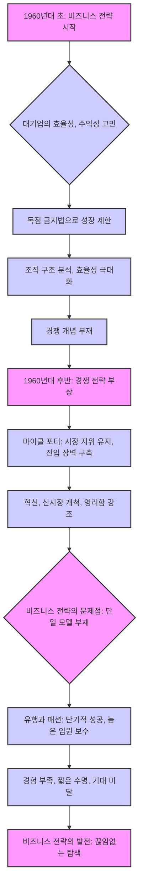
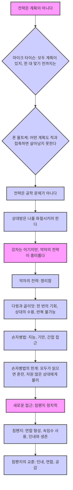
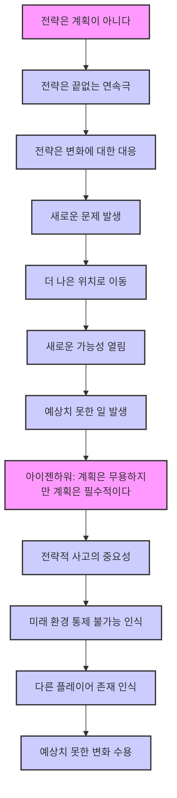
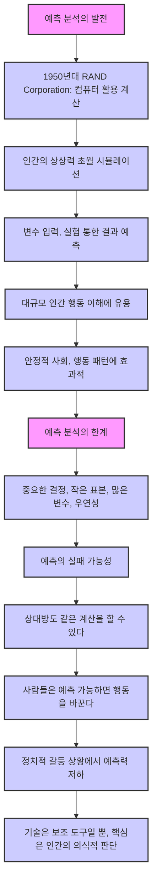

## 전략: 역사를 통해 배우는 지혜
이 책은 전략이라는 아이디어가 어떻게 발전해왔는지 역사 속 다양한 사례를 통해 보여주는 책이야. 전략은 단순히 계획을 세우는 게 아니라, 변화하는 상황에 맞춰 계속해서 움직이고 적응하는 과정이라는 걸 알려줄 거야.

## 1. 전략의 시작과 발전: 고대부터 나폴레옹까지 

1. **전략이라는 말의 탄생**:
  1. 전략(Strategy)이라는 단어는 그리스어 '스트라토스(stratos)'에서 왔어. 이건 '장군의 기술'이라는 뜻이야. 
  2. 이 단어가 지금처럼 쓰이기 시작한 건 18세기 말에서 19세기 초쯤이야. 
    3  물론 그전에도 전략적인 행동은 있었지만, 이때부터 '전략'이라는 개념 자체에 관심을 갖기 시작한 거지. 
2. **계몽주의 시대의 영향**:
  1. 전략이라는 개념은 계몽주의 시대의 생각과도 연결돼. 계몽주의는 '이성과 과학을 잘 활용하면 세상을 더 잘 이해하고 예측하고 통제할 수 있다'고 믿었거든. 
  2. 전략도 마찬가지야. 상대방보다 세상을 더 잘 이해하고 그에 맞춰 행동하면 이길 수 있다는 믿음에서 시작된 거야. 
3. **나폴레옹의 등장과 전략의 의미 변화**:
  1. 나폴레옹은 전쟁 방식을 완전히 바꾼 천재적인 장군이었어. 그래서 나폴레옹 시대 이후 전략이라는 단어는 더 큰 의미를 갖게 됐지. 
  2. 나폴레옹 전쟁에 참전했던 스위스의 조미니(Jomini)와 프로이센의 클라우제비츠(Clausewitz)는 나폴레옹의 전략을 분석하면서 19세기 내내 전쟁과 전략에 대한 우리의 생각을 형성하는 데 큰 영향을 미쳤어. 

## 2. 결정적 전투의 환상과 현실: 나폴레옹 전쟁의 교훈 

1. **결정적 전투의 아이디어**:
  1. 조미니와 클라우제비츠가 강조한 핵심은 '결정적 전투'였어. 한 번의 큰 전투에서 이기면 전쟁 전체를 끝낼 수 있다는 생각이었지. 
  2. 나폴레옹의 초기 성공들이 이런 생각에 힘을 실어줬어. 전투에서 이기면 전쟁에서 이기는 거라고 믿었던 거야. 
2. **결정적 전투의 문제점: 1812년 러시아 원정**:
  1. 하지만 나폴레옹의 1812년 러시아 원정은 결정적 전투라는 아이디어의 문제점을 여실히 보여줬어. 
  2. 나폴레옹은 보로디노 전투에서 이겼지만, 러시아군은 충분한 예비 병력을 가지고 있었기 때문에 완전히 패배하지 않았어. 
  3. 나폴레옹은 러시아의 수도 모스크바를 점령했지만, 도시는 버려지고 불타버렸어. 결국 나폴레옹은 고립되어 퇴각할 수밖에 없었지. 
  4. 이건 마치 게임에서 보스를 쓰러뜨렸는데, 알고 보니 보스가 계속 부활하고 주변 환경이 나를 공격하는 상황과 비슷해. 
  5. 스페인에서 일어난 게릴라전(guerrilla warfare)도 비슷한 교훈을 줬어. 정규군이 패배해도 민중의 저항이 계속되면 전쟁을 끝내기 어렵다는 걸 보여준 거야. 
3. **기술 발전과 결정적 승리의 어려움**:
  1. 지난 200년 동안 무기 기술이 발전하면서 결정적 승리는 더 어려워졌어. 
  2. 무기의 사거리, 살상력, 수량이 늘어나고, 철도 같은 운송 수단으로 병력을 빠르게 이동시킬 수 있게 되면서 전쟁은 소모전(attrition)이 될 가능성이 커졌어. 
  3. 특히 핵무기를 가진 강대국들 사이의 전쟁은 한쪽이 완전히 항복하는 방식으로 끝내기 매우 어려워. 
  4. '상호 확증 파괴(Mutual Assured Destruction)'라는 말처럼, 서로를 완전히 파괴할 수 있기 때문에 아무도 핵전쟁을 시작하려 하지 않는 거지. 

## 3. 정치적 전략과 혁명가들의 고민: 약자의 전략 

1. **약자의 **전략**: **혁명 이론:
  1. 책에서는 '약자의 전략'을 설명하기 위해 혁명 이론(revolutionary theory)부터 살펴봐. 
  2. 혁명가들은 현재 상황과 자신들이 이루고 싶은 목표 사이의 간극이 엄청나게 크기 때문에, 누구보다 전략에 대해 많이 고민하는 사람들이야. 
  3. 1830년대에 전문 혁명가들이 등장했을 때, 프랑스 혁명이라는 성공 사례와 불안정한 민중의 정서가 그들에게 희망을 줬어. 
  4. 마르크스(Marx) 같은 사람들은 사회가 어떻게 발전할지에 대한 '과학적 법칙'을 발견했다고 믿었고, 자신들의 승리가 필연적이라고 생각했지. 
2. **혁명가들의 좌절과 새로운 사고**:
  1. 하지만 실제 혁명은 그들이 예측한 대로 일어나지 않았고, 그들의 방식도 달랐어. 
  2. 혁명가들의 좌절은 정치적 행동에 대한 새로운 사고로 이어졌어. 특히 사람들의 '생각'을 어떻게 움직이고 조작할 것인가에 대한 고민이 깊어졌지. 
  3. 사람들이 왜 자신들이 억압받고 착취당한다는 사실을 깨닫지 못하는지, 즉 '허위 의식(false consciousness)'의 원인이 무엇인지 탐구하기 시작한 거야. 
3. **내러티브의 중요성**:
  1. 이런 생각들은 결국 '내러티브(narrative)'의 중요성으로 이어졌어. 내러티브는 '이야기'라는 뜻인데, 사람들이 어떤 사건을 어떻게 받아들이고 행동하게 만들지 '이야기 틀'을 짜는 능력이 중요해진 거지. 
  2. 정치인들은 물론, 군대에서도 '민심(hearts and minds)'을 얻는 것이 중요하다고 생각하게 됐어. 단순히 힘으로 제압하는 것보다 사람들이 우리 편을 지지하게 만드는 것이 중요하다는 걸 깨달은 거야. 

## 4. 비즈니스 전략의 발전과 유행: 기업의 생존과 혁신 

1. **비즈니스 전략의 시작**:
  1. 비즈니스 전략에 대한 책들은 1960년대 초에야 등장하기 시작했어. 
  2. 처음에는 군사 전략처럼 대기업, 즉 미국의 거대 기업들의 문제에 초점을 맞췄지. 
  3. 이 기업들은 독점 금지법 때문에 사업을 무한정 확장하기 어려웠고, 주로 수익성과 효율성을 높이는 데 관심이 많았어. 
  4. 그래서 초기 비즈니스 전략은 조직 구조를 분석해서 효율성을 극대화하는 데 집중했어. 이때는 '경쟁'이라는 단어가 잘 등장하지도 않았지. 
2. **경쟁 전략의 부상**:
  1. 1960년대 후반으로 가면서 '경쟁 전략(competitive strategy)'의 중요성이 커졌어. 
  2. 하버드의 마이클 포터(Michael Porter) 같은 학자들은 시장 지위를 유지하고 경쟁자들이 시장에 진입하지 못하도록 장벽을 세우는 방법을 연구했어. 
  3. 이후에는 혁신, 새로운 시장 개척, 그리고 다른 기업들보다 더 영리하게 행동하는 것에 대한 관심이 늘어났지. 
3. **비즈니스 전략의 문제점과 유행**:
  1. 하지만 비즈니스 전략은 군사 전략처럼 모든 논의를 아우르는 단일하고 강력한 모델을 갖지 못했어. 
  2. 대신 수많은 전략들이 유행처럼 나타났다 사라지곤 했지. 
  3. 최고 경영자들이 이런 유행을 따르는 이유는 다른 회사들도 다 따르기 때문에 뒤처지지 않으려는 심리도 있었고, 유행을 따르는 것이 높은 임원 보수와 연결되기도 했어. 
  4. 하지만 이런 전략들이 약속한 만큼의 결과를 내지 못하거나 수명이 짧은 경우가 많았어. 

## 5. 전략에 대한 새로운 접근: 계획이 아닌 적응 

1. **전략은 계획이 아니다**:
  1. 이 책에서 주장하는 핵심 중 하나는 '전략은 계획이 아니다'라는 거야. 
  2. 복싱 선수 마이크 타이슨(Mike Tyson)이 "모두 계획이 있지, 한 대 맞기 전까지는"이라고 말한 것처럼, 아무리 완벽한 계획도 현실에서는 예상치 못한 변수에 부딪히게 돼. 
  3. 프로이센의 폰 몰트케(Von Moltke) 장군도 "어떤 계획도 적과 접촉하면 살아남지 못한다"고 했어. 
  4. 전략은 공학 문제와 달라. 공학은 물리적인 속성을 다루기 때문에 예측 가능하지만, 전략은 나를 좌절시키려는 '지능적인 상대방'을 다루기 때문이야. 
  5. 예를 들어, 레이건 대통령의 전략 방위 구상(SDI)은 미사일 공격을 막는 것이 복수하는 것보다 낫다고 했지만, 달에 사람을 보내는 것과 달리 미사일은 스스로 싸우려 한다는 점이 달랐어. 
2. **약자의 **전략**: 영리함의 한계**:
  1. 물론 강자는 대부분 이기지만, 전략에서 정말 흥미로운 부분은 '약자가 어떻게 이기는가' 하는 점이야. 
  2. 약자가 강자를 이기는 한 가지 방법은 '영리함'이야. 다윗과 골리앗 이야기가 대표적이지. 
  3. 다윗은 갑옷도 없이 물매와 돌멩이로 골리앗을 쓰러뜨렸어. 하지만 이 이야기에는 몇 가지 경고가 있어. 
  1. **한 번의 기회**: 다윗의 돌멩이가 빗나갔다면 두 번의 기회는 없었을 거야. 
  2. **상대의 수용**: 필리스틴(Philistines)족이 다윗의 승리를 받아들였기 때문에 가능했어. 만약 그들이 불공평하다고 생각하고 달려들었다면 이스라엘은 여전히 위험했을 거야. 
  3. **반복 불가능**: 다음번에는 골리앗이 더 좋은 헬멧을 쓰고 다윗의 움직임을 더 주의 깊게 살폈을 거야. 
  4. 이처럼 속임수와 기만으로 이기는 '트릭스터(trickster)' 전략은 한계가 있어. 오디세우스(Odysseus)처럼 처음에는 성공해도 결국 아무도 믿지 않게 되거든. 
3. **손자병법과 그 한계**:
  1. 상대방보다 영리해지는 전략의 대표적인 예는 중국의 손자병법(Sun Tzu's Art of War)이야. 
  2. 손자병법은 상대방보다 더 나은 정보(intelligence)를 가지고 기만하는 것을 강조해. 상대가 강하다고 생각하면 약한 척하고, 약하다고 생각하면 강한 척하는 식이지. 
  3. 이 책은 '고통 없이 큰 결과를 얻고 싶어 하는' 사람들에게 매우 인기가 많아. 특히 비즈니스 분야에서 많이 읽히지. 
  4. 하지만 손자병법에도 한계가 있어. 만약 상대방도 손자병법을 읽고 똑같이 영리하게 행동한다면, 서로 속고 속이는 혼란만 가중될 거야. 
  5. 또, 자원이 훨씬 많은 상대방에게는 영리함만으로는 한계가 있을 수 있어. 
4. **새로운 접근: 침팬지 정치학**:
  1. 책에서는 전략에 대한 다른 접근 방식을 제시하는데, 바로 '침팬지 정치학(Chimpanzee Politics)'이라는 책에서 영감을 얻었어. 
  2. 1970년대 벨기에 앤트워프 동물원(Antwerp Zoo)에서 프란스 드 발(Frans de Waal)이라는 학자가 침팬지 무리를 관찰했어. 
  3. 그는 우두머리 수컷(alpha male)이 도전을 받을 때, 더 크고 강한 침팬지가 아니라 '영리한' 침팬지들이 도전한다는 것을 발견했어. 
  4. 이들은 속임수를 쓰기도 하지만, 주로 '연합(coalition)'을 형성해서 다른 침팬지들과 힘을 합쳤어. 
  5. 침팬지들은 또한 '인내(endurance)'를 중요하게 여겼어. 즉각적인 승리보다는 살아남아서 버티다가 기회가 왔을 때 움직이는 거지. 
  6. 이런 침팬지들의 행동에서 얻을 수 있는 교훈은 '인내', '연합', 그리고 '공감(empathy)'이야. 
  7. 공감은 상대방이 어떻게 생각하고 행동할지 이해하는 능력인데, 침팬지들도 다른 개체의 마음을 이해하는 '마음 이론(theory of mind)'을 가지고 있었어. 
  8. 이것은 상대방의 '내러티브(narrative)'를 이해하고 변화시키는 것이 행동을 바꾸는 데 중요하다는 점을 다시 한번 보여줘. 

## 6. 처칠의 전략: 생존과 연합의 힘 

1. **처칠의 초기 **전략**: 생존**:
  1. 침팬지의 교훈을 윈스턴 처칠(Winston Churchill)의 사례에 적용해볼 수 있어. 
  2. 1940년 5월, 처칠이 영국 총리가 되었을 때, 영국은 나치 독일의 블리츠크리크(Blitzkrieg, 전격전)에 의해 모든 동맹국들이 무너지고 홀로 남겨진 상황이었어. 
  3. 당시 가장 큰 문제는 '영국이 어떻게 독일을 이길 것인가'가 아니라, '영국이 히틀러와 평화 협상을 해야 하는가'였어. 
  4. 처칠은 협상하지 않기로 결정하고, 내각 동료들을 설득했어. 당장은 버티고 살아남는 것이 중요하다고 판단한 거지. 
  5. 이처럼 많은 전략은 공격보다는 '생존'에 초점을 맞추는 경우가 많아. 
2. **승리를 위한 **연합:
  1. 처칠은 결국 승리가 올 것이라고 믿었지만, 그 방법은 전임자 네빌 체임벌린(Neville Chamberlain)과는 달랐어. 
  2. 그는 미국과의 관계가 핵심이라고 생각하고, 루즈벨트(Roosevelt) 대통령과 서신을 주고받으며 영국에 도움을 주고 결국 전쟁에 참전하도록 설득했어. 
  3. 1941년 12월 7일, 일본의 진주만 공격으로 미국이 참전하고, 다음 날 히틀러가 미국에 선전포고를 하면서 처칠은 "마침내 우리가 이겼다"고 말했어. 
  4. 전쟁이 끝나려면 아직 몇 년이 남았지만, 그는 이제 힘의 균형이 바뀌었고 영국이 살아남을 수 있다는 것을 알았던 거야. 
  5. 또한, 소련이 전쟁에 참전했을 때, 처칠은 과거의 반볼셰비키(anti-Bolshevik) 입장을 버리고 스탈린(Stalin)과 동맹을 맺었어. 
  6. 그는 "히틀러가 지옥을 침공한다면, 나는 하원 의회에서 사탄을 칭찬할 것"이라고 말하며 연합의 중요성을 강조했어. 

## 7. 전략의 본질: 목표가 아닌 과정 

1. **전략은 목표 설정이 아니다**:
  1. 전략은 단순히 목표를 설정하고 그것을 달성하는 방법을 찾는 것이 아니야. 
  2. 전략은 '현재 직면한 문제에 대한 대응'이야. 궁극적인 목표에 도달하는 것이 아니라, 전략이 없었을 때보다 '더 나은 위치'에 도달하는 것이 중요해. 
  3. 이것은 단기적인 목표일 수도 있고, 조금 더 장기적인 목표일 수도 있지만, 처음부터 최종 목표를 정해놓고 가는 경우는 드물어. 
2. **궁극적인 목표는 없다**:
  1. 궁극적인 목표에 집착하지 말아야 하는 두 번째 이유는, 사실 삶에는 '궁극적인 목표'라는 것이 거의 없기 때문이야. 
  2. 결정적 전투나 결정적 혁명처럼, 어떤 승리도 '어느 정도까지'만 결정적일 뿐이야. 
  3. 전투에서 이기고 적이 항복해도, 그 다음에는 평화를 구축하는 등 또 다른 문제들이 생겨. 
  4. 선거에서 이겨서 정부를 구성해도, 새로운 문제들에 직면하게 돼. 
  5. 기업을 인수해도, 두 회사를 합병하는 새로운 과제가 생기지. 
  6. 혁명이 성공해서 정권이 무너져도, 새로운 사회를 건설해야 하는 문제가 남아. 
3. **전략은 끝없는 연속극**:
  1. 전략은 '3막짜리 연극'이 아니라 '연속극(soap opera)'과 같아. 한 단계가 끝나면 또 다른 단계가 시작되고, 계속해서 이어지는 인간 활동의 일부인 거지. 
  2. 따라서 전략은 고정된 계획이 아니라, 변화하는 환경에 대한 '대응'으로 생각해야 해. 
  3. 새로운 문제들이 생겨날 때마다 더 나은 위치로 가기 위해 무엇을 할 수 있을지 계속 고민해야 하는 거야. 
  4. 새로운 가능성이 열리기도 하고, 어떤 가능성은 닫히기도 하면서 계속해서 움직이는 거지. 
  5. 큰 캠페인을 시작할 때, 처음 기대했던 곳에 도달하는 경우는 거의 없어. 운이나 우연 같은 요소들이 항상 영향을 미 미치거든. 

## 8. 전략적 사고의 중요성: 계획은 무용하지만 계획은 필수적이다 

1. **전략적 사고의 필요성**:
  1. 이 책을 통해 사람들이 얻기를 바라는 것은 첫째, 전략에 대해 사람들이 얼마나 다양하게 생각해왔는지 이해하는 것이야. 
  2. 둘째, 시대의 큰 사상인 정치 이론이 사람들의 행동과 문제 해결 방식에 얼마나 큰 영향을 미쳤는지 아는 것이지. 
  3. 셋째, 전략가들의 주장에 대해 조금은 신중해지는 거야. 
2. **계획은 무용하지만 계획은 필수적이다**:
  1. 아이젠하워(Eisenhower) 대통령이 "계획은 무용하지만 계획은 필수적이다"라고 말한 것처럼, 전략 자체는 필수적이야. 
  2. 무엇을 하려는지 명확하고 의식적으로, 그리고 신중하게 생각하는 것이 중요해. 
  3. 하지만 항상 미래 환경을 완전히 통제할 수 없다는 것을 인식해야 해. 
  4. 다른 플레이어들이 존재하고, 아무도 예상치 못한 일들이 일어나서 우리가 원하는 것을 바꿀 수 있다는 점을 기억해야 해. 

## 9. 역사 속 결정적 승리의 사례와 그 한계 

1. **결정적 승리의 실제 사례**:
  1. 역사 속에서 '결정적 승리'가 실제로 일어난 경우가 있냐는 질문에, 저자는 몇 가지 사례를 들어. 
  2. 1967년 '6일 전쟁(Six Day War)'이 대표적이야. 이스라엘이 먼저 공격해서 강력한 연합군을 상대로 승리했지. 
  3. 하지만 이스라엘은 당시 점령했던 영토에서 여전히 분쟁을 겪고 있어. 단기적으로는 결정적이었지만, 장기적으로는 그렇지 않았던 거지. 
  4. 방글라데시(Bangladesh)의 독립도 인도가 파키스탄과의 전쟁에서 승리했기 때문에 가능했어. 
  5. 일반적으로 전쟁이 빨리 끝나면 결과가 더 결정적인 경향이 있어. 상대방이 방심했을 때 말이야. 
2. **결정적 승리의 그림자**:
  1. 하지만 결정적 승리에도 '오래 남는 기억'이 있어. 
  2. 1870년 프랑스-프로이센 전쟁(Franco-Prussian War)에서 독일이 승리하고 알자스-로렌(Alsace-Lorraine)을 프랑스에서 빼앗았지만, 그에 대한 프랑스의 분노는 계속 남아있었어. 
  3. 1918년 독일이 패배했지만, 그 분노는 사라지지 않았지. 
  4. 이처럼 어떤 것도 겉보기만큼 결정적이지는 않아. 단지 우리를 다른 단계로 이동시킬 뿐인 거지. 

## 10. 전략과 전술의 경계 허물기: 현장의 중요성 

1. **전략과 전술의 전통적 구분**:
  1. 전통적으로 군사 분야에서는 전략(strategy)과 전술(tactics)을 명확히 구분했어. 
  2. 정치 지도자, 참모총장, 야전 사령관, 그리고 최하위의 현장 지휘관(예: 소대장) 순으로 위계가 있었고, 전술은 가장 낮은 단계의 개념으로 여겨졌지. 
2. **경계의 모호성: 전략적 하사(**Strategic Corporal**)**:
  1. 하지만 저자는 이런 구분이 모호해지고 있다고 주장해. 원칙적으로는 전략과 전술의 규모와 결과가 다르지만, 근본적인 원리는 같다는 거야. 
  2. 최근에는 '전략적 하사(Strategic Corporal)'라는 개념도 등장했어. 
  3. 예를 들어, 적대적인 도시 한가운데서 시위대를 마주한 젊은 소대장이 내리는 결정은 엄청난 결과를 초래할 수 있어. 상부의 지시를 기다릴 시간 없이 몇 초 안에 결정을 내려야 하는 상황이지. 
  4. 이처럼 현장에서의 작은 결정이 전체 전략에 큰 영향을 미칠 수 있다는 거야. 
3. **작전 수준(Operational Level)의 문제점**:
  1. 군사 전략에서 '작전 수준(operational level)'이라는 개념이 발전했는데, 이것은 전술과 군사 전략 사이의 중간 단계로 '정치와 무관한 영역'으로 묘사되곤 해. 
  2. 장군들은 정치와 무관한 영역을 좋아하겠지만, 사실 군사력이 적용되는 모든 순간은 정치적 함의를 가지고 있어. 
  3. 따라서 저자는 전략과 전술의 구분을 넘어, 이런 위계적인 사고방식 자체에 도전하고 있어. 

## 11. 워싱턴의 정치적 전략: 위기 속의 역학 

1. **정부 셧다운(Government Shutdown) 위기**:
  1. 워싱턴에서 정부 셧다운과 재정 절벽(fiscal cliff)을 둘러싼 정치적 위기는 흥미로운 전략적 사례를 보여줘. 
  2. 이것은 단순히 의회 대 행정부, 또는 공화당 대 민주당의 문제가 아니야. 
  3. 핵심 질문은 '왜 일부 공화당 하원의원들이 엄청난 압력에도 불구하고 자신들의 입장을 고수할 수 있는가' 하는 점이야. 
2. **공화당 의원들의 동기**:
  1. 여론조사 결과는 공화당 하원의원들의 행동이 인기가 없다는 것을 보여줬고, 많은 공화당원들도 불만을 가졌어. 
  2. 하지만 이 의원들은 자신들의 지역구가 재조정(redistricting)되어 안전하고, 부유한 후원자들로부터 직접 자금을 받을 수 있기 때문에 당의 압력에 굴하지 않아도 된다고 느꼈어. 
  3. 그들은 개인적인 결과에 대한 걱정 없이 자신들의 '성전(crusade)'을 추구할 수 있었던 거지. 
  4. 그들은 대통령이 먼저 양보할 것이라고 생각했을 수도 있어. 
3. **전략적 문제의 본질**:
  1. 이 상황은 고전적인 전략적 문제야. 단순히 어떤 전술을 채택할 것인가의 문제가 아니라, 전체적인 상황이 어떻게 구성되고 '프레임(frame)'되는가의 문제인 거지. 
  2. 하원의장은 이 상황을 '타협 부족'의 문제로 보이게 하고 싶어 하고, 대통령은 '강탈과 협박'의 문제로 보이게 하고 싶어 해. 
  3. 이 위기는 미국의 통치 능력과 국제적 명성에 심각한 영향을 미치기 때문에 매우 중요해. 
  4. 하지만 전략적 문제로서 이 사례는 많은 중요한 점들을 드러내고 있어. 

## 12. 예측 분석과 전략의 미래: 기술의 한계 

1. **예측 분석의 발전**:
  1. 컴퓨팅 파워와 예측 분석(predictive analytics)의 발전이 전략을 어떻게 바꿀지에 대한 질문이 있어. 
  2. 이것은 1950년대 랜드 연구소(RAND Corporation)에서 시작됐어. 그들은 컴퓨터를 사용해서 인간의 마음으로는 할 수 없는 계산을 하고, 상황을 시뮬레이션(simulate)할 수 있다는 가능성을 처음으로 봤지. 
  3. 그 이후로 변수들을 입력하고 공학자처럼 실험을 통해 결과를 예측할 수 있다는 믿음이 계속 이어져 왔어. 
2. **예측 분석의 유용성과 한계**:
  1. 대규모 인간 행동을 이해하는 데는 예측 분석이 유용할 수 있어. 예를 들어, 안정적인 사회에서 비교적 안정적인 행동 패턴을 다룰 때는 흥미로운 결과를 줄 수 있지. 
  2. 하지만 정말 중요한 결정, 표본 크기가 작고 변수가 많으며 우연의 가능성이 큰 상황에서는 예측이 빗나갈 가능성이 커. 
  3. 게다가 상대방도 똑같은 계산을 하고 같은 결론에 도달해서 그에 맞춰 행동할 수 있다는 점도 고려해야 해. 
  4. 사람들은 예측 가능해지면 자신의 행동을 바꾸는 경향이 있어. 
  5. 따라서 정치적인 상황, 즉 사람들이 갈등 속에 있다는 것을 의식하는 상황에서는 예측 분석의 유용성이 떨어진다고 저자는 말해. 

## 13. 프로세스 혁신과 전략의 변화: OODA 루프와 비즈니스 프로세스 재설계 

1. **OODA 루프(OODA Loop)**:
  1. 프로세스 혁신이 전략에 어떻게 기여하는지에 대한 질문에, 저자는 존 보이드(John Boyd)의 OODA 루프를 언급해. 
  2. 보이드는 전투기 조종사 출신으로, 공중전(dogfight) 매뉴얼을 썼어. 그는 'OODA 루프(Observe, Orient, Decide, Act: 관찰, 판단, 결정, 행동)'라는 아이디어를 개발했지. 
  3. 이것은 단순히 화력이 더 강한 것보다 상대방보다 더 빠르고 정확하게 생각하는 것이 중요하다는 개념이야. 
  4. OODA 루프는 유용한 도구 중 하나로, SWOT 분석(SWOT analysis)처럼 전략적 사고를 돕는 틀이라고 볼 수 있어. 
2. **비즈니스 프로세스 재설계(**Business Process Re-engineering**)**:
  1. 저자가 책에서 다룬 또 다른 프로세스 혁신은 '비즈니스 프로세스 재설계(Business Process Re-engineering, BPR)'야. 
  2. 이것은 1990년대 중반에 유행했던 개념으로, 조직이나 회사의 특정 프로세스를 구성 요소로 분해하고, 각각을 분석한 다음, 더 효율적인 형태로 재조립하는 방식이야. 
  3. BPR은 디지털 혁명(digital revolution)을 활용하여 효율성을 높이고 가치를 창출할 수 있는 방법으로 각광받았어. 
3. **BPR의 문제점과 교훈**:
  1. 하지만 BPR은 곧 '인력 감축(redundancy)'과 연관되기 시작했어. 변화의 효과를 보여주기 위해 인력을 줄이는 경우가 많았거든. 
  2. 결과적으로 BPR에 대한 이야기가 나오면 직원들은 불안해했고, 저항이 생겼어. 
  3. 과대광고되었던 다른 유행들처럼, BPR도 성공 사례들이 지속되지 않거나 다른 이유로 성공한 것으로 밝혀지면서 결국 사라졌어. 
  4. BPR을 둘러싼 '상처 입은 자를 돕고, 고군분투하는 자를 쏴라' 같은 과격한 언어(macho language)도 저항을 불러일으키는 데 한몫했지. 
  5. 이러한 사례들은 '과대광고'에 대한 경고를 줘. 어떤 조직이든 프로세스를 개선해야 하지만, 모든 문제의 열쇠가 되는 '만능 해결책'이 있다고 믿는 것은 위험하다는 거야. 

