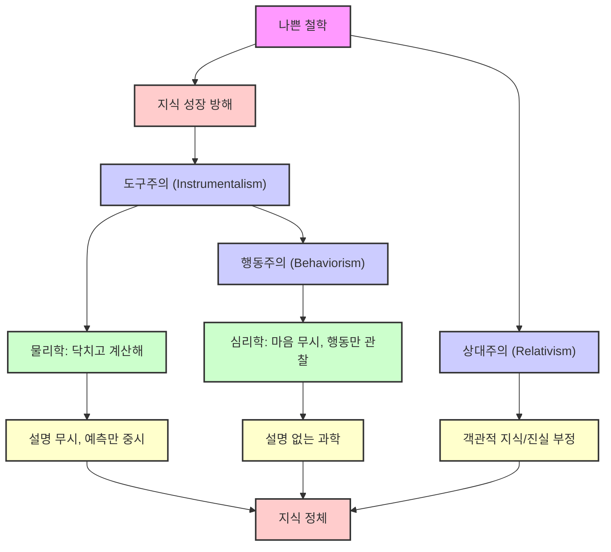
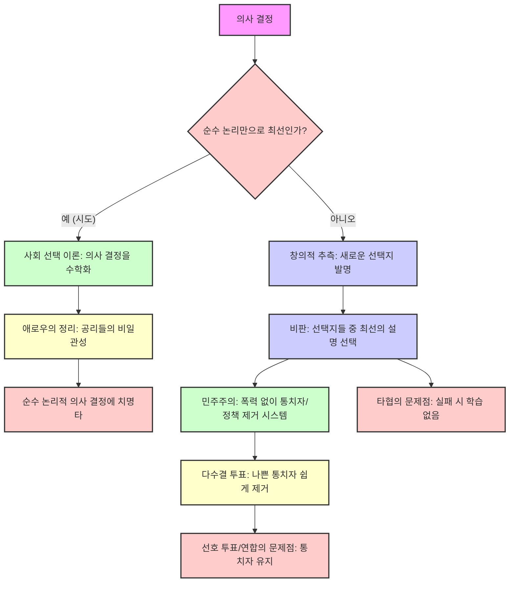
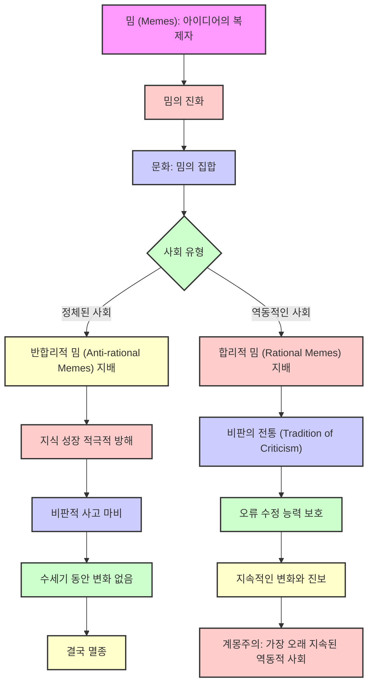
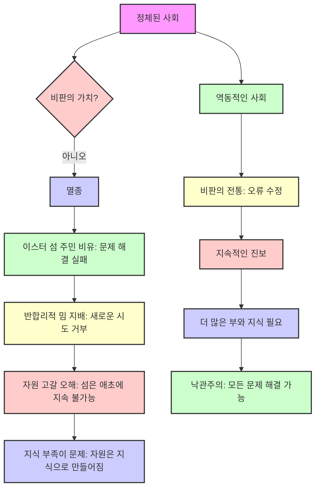

## 무한의 시작: 지식과 진보의 끝없는 여정
이 책은 인간의 지식과 진보가 무한한 잠재력을 가지고 있으며, 우리가 현실을 이해하는 여정은 이제 막 시작되었다고 말한다. 데이비드 도이치는 창의적인 지식 생성과 문제 해결을 통해 인간이 이해하고 해결할 수 있는 것에는 본질적인 한계가 없다고 주장한다. 그는 과학, 철학, 인공지능, 문화 진화 등 다양한 분야를 넘나들며 지식의 성장이 현실 자체를 재정의할 수 있는 원동력임을 강조한다.

## 1. 지식과 진보의 무한한 시작 

데이비드 도이치의 책 "무한의 시작"은 우리가 지식과 진보의 끝없는 여정의 시작점에 서 있다는 것을 강조한다. 마치 거대한 우주선이 이제 막 이륙을 시작한 것처럼, 우리의 이해와 능력은 무한히 확장될 수 있다는 거야.

1. **무한한 잠재력의 시작**:
  - 이 책의 핵심 메시지는 인간의 지식과 진보에 본질적인 한계가 없다는 것이다. 
  - 우리가 문제를 해결하고 새로운 것을 발견할 때마다, 또 다른 질문과 가능성이 열리면서 끝없는 학습과 발견의 고리가 이어진다. 
  - 이것은 마치 끝없이 펼쳐진 미지의 바다를 탐험하는 것과 같아서, 한 섬을 발견하면 또 다른 섬이 보이는 것과 같다.

2. **역사 속 '**무한의 시작**'**:
  - 역사에는 진보가 폭발적으로 일어난 특별한 순간들이 있었다. 
  - 생명의 출현: 생명이 나타나기 전에는 화학 반응이 많지 않았지만, 생명과 유전 코드가 생겨나면서 새로운 단백질과 반응들이 폭발적으로 증가했다. 
  - 이것은 마치 텅 빈 도화지에 처음으로 색깔이 입혀지면서 무한한 그림을 그릴 수 있게 된 것과 같다.
  - **인간의 등장과 **계몽주의: 인간이 등장하고 계몽주의 시대에 새로운 방식으로 아이디어를 다루기 시작하면서 또 다른 진보의 폭발이 일어났다. 
  - 빅뱅이 모든 원자를 만들었지만, 생명이나 계몽주의 같은 특별한 사건들이 없었다면, 이 원자들은 그저 지루하게 섞이기만 했을 것이다. 
  - 로켓 같은 기술은 계몽주의가 없었다면 불가능했을 것이다. 
  - 이러한 사건들은 마치 우주의 빅뱅처럼 새로운 것들을 시작하게 한 특별하고 강력한 순간들이다. 

3. **진보의 한계는 있는가?**:
  - 이러한 진보가 계속될 수 있을까, 아니면 언젠가 끝이 올까? 
  - 우리의 유전자, 뇌의 능력, 심지어 물리학 법칙 때문에 진보에 한계가 있을 수도 있다는 의문이 제기된다. 
  - 하지만 도이치는 이러한 한계가 없다고 주장하며, 우리가 계속해서 새로운 지식을 만들고 문제를 해결할 수 있다고 본다. 
  - 이것은 마치 스카이다이버가 땅에 닿기 전까지는 괜찮다고 말하는 것과 같다. 언젠가 한계에 부딪히면 재앙이 될 수 있으므로, 우리는 미리 그 한계를 이해해야 한다. 

4. **인간은 왜 특별한가?**:
  - 인간은 왜 다른 모든 생명체와 다르게 특별한 능력을 가지고 있을까? 
  - 예를 들어, 인간은 달에 10번 이상 착륙했지만, 다른 어떤 생명체도 달에 가본 적이 없을 뿐만 아니라 달의 존재조차 모른다. 
  - 이것은 마치 모든 동물이 땅에서만 살 때, 인간만이 하늘을 날아다니는 법을 배운 것과 같다.
  - 우리가 인간을 특별하게 만드는 것이 무엇인지 이해하지 못하면, 그 능력을 재현하거나 발전시킬 수 없을 것이다. 
  - 궁극적으로는 우리의 뇌를 백업하고 업로드하여 영원히 살 수 있게 하는 것과 같은 목표를 달성하기 위해서도 이 질문은 중요하다. 

5. 어려운 탐색** 문제 해결 능력**:
  - 수많은 가능성 중에서 좋은 해결책을 찾아내는 것은 마치 거대한 건초 더미에서 바늘을 찾는 것만큼 어렵다. 
  - 로켓을 설계하거나 좋은 시를 쓰는 것처럼, 수많은 잘못된 방법들 속에서 올바른 것을 찾아내는 것은 매우 어려운 일이다. 
  - 하지만 인간은 이런 어려운 탐색 문제를 계속해서 해결해낸다. 
  - 생물학적 진화도 시간이 오래 걸리지만 좋은 해결책을 찾아내기도 한다. 
  - 우리의 마음은 컴퓨터조차 해내지 못하는 특별한 일을 하고 있으며, 이것은 정말 미스터리한 능력이다. 
  - 이러한 능력 덕분에 우리는 현실을 통제하고 설명하는 지식(설명 지식)을 발견할 수 있었다. 

## 2. 현실의 가능성과 시스템의 능력 

현실이 무엇을 허용하고, 우리가 어떤 시스템으로 그 가능성을 활용할 수 있는지 이해하는 것은 매우 중요해. 마치 놀이터에 어떤 놀이기구가 있고, 내가 어떤 놀이기구를 탈 수 있는지 아는 것과 같지.

1. **현실이 허용하는 것**:
  - 현실은 많은 것을 허용하지만, 모든 것을 허용하지는 않는다. 
  - **불가능한 것**: 빛보다 빠르게 이동하거나 에너지를 무에서 창조하는 것은 불가능하다. 
  - **가능한 것**: 인간이 지금까지 해낸 모든 일은 물론, 수많은 화학 반응들도 가능하다. 
  - **가능성과 바람직함의 교차점**: 우리가 하고 싶은 일(바람직한 것)이 현실적으로 가능한 일(가능한 것)과 얼마나 겹치는지 아는 것이 중요하다. 
  - 만약 우리가 원하는 대부분의 일이 불가능하다면, 우리는 매우 좋지 않은 우주에 살고 있는 셈이다. 
  - 하지만 다행히도 우리가 원하는 많은 것이 가능하다. 
  - **가능성의 크기**:
  - 가능성의 공간이 유한한가, 아니면 무한한가? 
  - "무한의 시작"이라는 책 제목처럼, 가능성은 무한하다고 주장한다. 
  - **계산 단계의 무한성**: 우리가 역사의 한 시점에서 앞으로 나아갈 때, 계산할 수 있는 단계의 수에 한계가 없을 수 있다. 
  - 마치 끝없이 계단을 오를 수 있는 것처럼, 계속해서 새로운 것을 발견하고 생각할 수 있다는 의미다.
  - **저장 공간의 무한성**: 새로운 지식을 계속 배우고 저장할 수 있는 라이브러리(저장 공간)의 크기에도 한계가 없어야 한다. 
  - 만약 라이브러리가 특정 시점에서 더 이상 커질 수 없다면, 그것은 진보의 한계가 될 것이다.
  - **기회의 무한성**: 새로운 지식을 발견하고 문제를 해결할 수 있는 실제적인 기회 또한 무한해야 한다. 
  - 아무리 많은 단계를 밟고 많은 것을 저장할 수 있어도, 더 이상 발견할 '좋은 것'이 없다면 진보는 멈출 것이다.
  - 우리는 이러한 무한한 가능성을 희망해야 한다. 그렇지 않으면 언젠가 진보가 불가능한 지점에 도달할 것이다. 

2. **특정 시스템의 능력**:
  - 현실이 많은 것을 허용하더라도, 특정 시스템(인간, 사회, 동물, AI 등)이 그 모든 것을 할 수 있는 것은 아니다. 
  - **불완전하거나 비보편적인 시스템**:
  - 대부분의 동물은 가능한 화학 반응 중 일부만 수행할 수 있는 지식만 가지고 있으며, 더 많은 것을 발견할 수 없다. 
  - 이것은 마치 특정 놀이기구만 탈 수 있는 제한된 키를 가진 것과 같다.
  - 이러한 시스템은 할 수 있는 일의 범위가 제한적이다. 
  - **완전하거나 보편적인 시스템**:
  - 반면, 어떤 시스템은 가능한 모든 것을 할 수 있는 능력을 가질 수 있다. 
  - 인간(그리고 잠재적으로 AI나 외계인)은 이러한 보편적인 시스템이라고 주장한다. 
  - 이것은 마치 놀이터의 모든 놀이기구를 탈 수 있는 무제한 키를 가진 것과 같다.
  - 인간은 끊임없이 성장하고 발전할 수 있으며, 다른 시스템처럼 특정 지점에서 멈추지 않는다. 
  - 수십억 년 동안 지구에 존재했던 다른 종들이 달에 가지 못한 것을 보면, 인간의 능력이 얼마나 특별한지 알 수 있다. 
  - 결론적으로, 현실이 많은 것을 허용하더라도, 그 가능성을 얼마나 활용할 수 있는지는 시스템 자체의 능력에 달려 있다. 
  - 인간은 올바른 지식만 있다면 가능한 모든 것을 할 수 있는 잠재력을 가지고 있다. 

## 3. 지식의 두 가지 역할: 원하는 것을 만들고 패턴을 포착하기 

지식은 마치 마법 지팡이처럼 두 가지 중요한 일을 할 수 있어. 하나는 우리가 원하는 것을 정확히 만들어내는 것이고, 다른 하나는 세상의 숨겨진 규칙(패턴)을 알아내는 것이지.

1. **특정 사건을 발생시키는 역할**:
  - 지식은 많은 가능성 중에서 우리가 원하는 특정 결과를 만들어내는 데 도움을 준다. 
  - **동전 던지기 비유**:
  - **자발적인 과정 (**Spontaneous Process**)**: 동전을 던져 앞면이 나올 확률은 50%다. 이것은 우리가 결과를 통제하지 않고 무작위성에 의존하는 것이다. 
  - 마치 주사위를 던져 원하는 숫자가 나오기를 바라는 것과 같다.
  - **통제된 과정 (Controlled Process)**: 만약 내가 동전을 앞면으로 놓으라고 지시하면, 거의 100% 확률로 앞면이 나올 것이다. 
  - 이것은 내가 앞면과 뒷면을 구별하고, 원하는 결과를 만들 수 있는 능력이 있기 때문이다.
  - **복잡한 순서 만들기**: 만약 "앞면, 앞면, 앞면, 뒷면, 뒷면, 뒷면..."과 같은 특정 동전 순서 100개를 원한다면, 무작위로는 거의 불가능하다. 
  - 하지만 지시와 지식이 있다면, 나는 그 순서대로 동전을 놓을 수 있다. 
  - **지식의 힘**: 지식은 우리가 원하지 않는 일이 일어나지 않게 하고, 원하는 일이 일어날 가능성을 훨씬 높여준다. 
  - 이것은 특정 단백질을 만들거나 복잡한 일련의 단계를 수행하는 것과 같은 더 복잡한 상황에도 적용된다. 
  - 올바른 정보가 있다면, 모든 단계에서 올바른 일이 일어날 수 있다. 

2. **현실의 패턴을 포착하는 역할**:
  - 지식은 특정 사건을 만드는 것 외에도, 현실에 존재하는 규칙이나 패턴을 이해하는 데 도움을 준다. 
  - **패턴의 예시**: 중력, 매일 해가 뜨는 것, 사람들의 일관된 성격 등이 있다. 
  - 내가 노름 맥도날드를 좋아한다는 것을 알면, 내가 또 노름 맥도날드 농담을 할 것이라고 예측할 수 있다.
  - **마음속의 모델**:
  - 우리는 실제 사물(예: 자동차)에 대한 아이디어를 마음속에 가지고 있다. 
  - 이 아이디어가 실제 사물과 정확히 일치한다면, 우리는 직접 행동하지 않고도(예: 차고에 가지 않고도) 그 사물에 대해 생각하고 올바른 답을 얻을 수 있다. 
  - **빠르고 안전함**: 마음속으로 생각하는 것은 실제 사물과 상호작용하는 것보다 훨씬 빠르고 안전하다. 
  - 호랑이와 싸우기 전에 머릿속으로 어떻게 대처할지 생각하는 것이 훨씬 안전하다. 
  - **보편적인 패턴 포착**:
  - 지식은 작은 패턴(예: 모든 호랑이에 대한 지식)뿐만 아니라, 중력처럼 시공간 전체에 걸쳐 모든 행성에 영원히 적용되는 거대한 보편적인 패턴도 포착할 수 있다. 
  - 이러한 보편적인 패턴을 알면, 우리는 현실에서 수많은 시도를 할 필요가 없다. 
  - 물건을 놓으면 떨어진다는 것을 알기 때문에, 매번 직접 해볼 필요가 없는 것과 같다.
  - 이것은 우리의 사고에 영향을 미쳐, 무엇이 효과가 있고 무엇이 효과가 없는지 훨씬 효율적으로 파악할 수 있게 해준다. 
  - 이러한 지식을 데이비드 도이치는 설명 지식<mark>(explanatory knowledge)</mark>이라고 부른다. 이는 현실에 실제로 존재하는 것과 그것이 어떻게 작동하는지를 반영하는 지식이다. 

## 4. 지식의 성장: 변이와 선택의 과정 

지식을 얻는 과정은 마치 씨앗을 심고 좋은 열매를 고르는 것과 같아. 새로운 아이디어를 마구 만들어내고(변이), 그중에서 좋은 것만 골라내는(선택) 과정이 필요하다는 거야.

1. 지식** 생성의 기본 과정**:
  - 새로운 지식을 얻으려면 기존 지식이나 사물에서 새로운 것을 만들어내는 과정이 필요하다. 
  - **변이 (Variation)**:
  - 이것은 마치 씨앗을 뿌려 다양한 식물을 자라게 하는 것과 같다. 
  - 기존의 것에서 새로운 것을 만들어내는 과정으로, <mark>추측(conjecture)</mark>하거나 새로운 아이디어를 떠올리는 것과 같다. 
  - 모든 새로운 것이 다 좋은 것은 아니지만, 가끔은 기존보다 더 나은 것이 만들어져야 한다. 
  - 생물학적 진화도 대부분의 돌연변이가 나쁘지만, 가끔 좋은 돌연변이가 생겨난다. 
  - **선택 (Selection)**:
  - 변이만으로는 자원이 너무 많이 소모되므로, 좋은 것만 남기고 나쁜 것은 버리는 과정이 필요하다. 
  - 이것은 마치 자라난 식물 중에서 좋은 열매만 골라내는 것과 같다.
  - 선택은 많은 것 중에서 좋은 것을 가려내고, 나쁜 것은 제거하거나 영향을 미치지 못하게 하는 과정이다. 
  - 자연 선택에서는 약한 개체가 잡아먹히고, 회의에서는 비효율적인 아이디어가 거부되는 것처럼, 다양한 기준이 적용된다. 

2. **다윈의 진화론을 넘어**:
  - 이러한 변이와 선택 과정은 원래 다윈의 생물학적 진화론에서 시작되었다. 
  - 하지만 칼 포퍼는 이 원리가 생물학뿐만 아니라 훨씬 더 많은 분야에 적용된다고 주장했다. 
  - **보편적인 **지식 생성** 원리**:
  - 인간이 지식을 창조하는 방식, 외계 지성체, 심지어 학습하는 동물이나 AI 알고리즘에도 적용된다. 
  - 모든 지식 생성 과정에는 새로운 아이디어를 내고(변이), 그중에서 좋은 것을 골라내는(선택) 두 가지 기본 과정이 필요하다. 

## 5. 더 나은 지식 창조 시스템: 인간의 특별함 

모든 지식 창조자가 똑같지는 않아. 어떤 시스템은 지식을 훨씬 더 잘 만들고, 어떤 시스템은 그렇지 못하다는 거야. 마치 어떤 요리사는 맛있는 음식을 뚝딱 만들지만, 어떤 요리사는 그렇지 못한 것과 같지. 인간이 왜 달에 갈 수 있었는지, 그 특별함은 어디에서 오는 걸까?

1. 변이** (Variation)의 질**:
  - **나쁜 변이**: 세상이 마녀나 신에 의해 움직인다고 믿는 사람들은 대부분 나쁜 아이디어를 만들어낼 것이다. 
  - 마녀를 믿어서는 로켓을 만들 수 없는 것과 같다.
  - **좋은 변이**: 물리학이나 시공간 같은 좋은 아이디어를 가진 사람들은 더 좋은 아이디어를 효율적으로 만들어낼 수 있다. 
  - 애초에 마녀 같은 나쁜 아이디어를 생각조차 하지 않는 것이 시간 낭비를 줄이는 좋은 방법이다. 
  - 결론적으로, 더 많은 좋은 아이디어를 만들어내고, 나쁜 아이디어는 아예 생각하지 않는 것이 좋은 변이의 특징이다. 

2. 선택** (Selection)의 정확성**:
  - **나쁜 선택**: 좋은 아이디어와 나쁜 아이디어를 제대로 구별하지 못하고, 좋은 것을 놓치는 선택 방법은 좋지 않다. 
  - **좋은 선택**: 좋은 선택 방법은 나쁜 아이디어를 쉽게 걸러내고, 좋은 아이디어를 정확히 찾아낸다. 
  - **효율성**: 좋은 선택은 효율적이어야 한다. 
  - 예를 들어, "고양이가 둘로 갈라져 길을 걸어가는 것을 봤다"는 말을 들으면, 우리는 질량 보존의 법칙이나 고양이의 능력에 대한 기존 지식과 충돌하여 즉시 그 아이디어를 거부할 수 있다. 
  - "던진 물건은 반드시 떨어진다"는 간단한 규칙으로, 누군가 던진 물건이 떨어지지 않았다는 주장을 즉시 반박할 수 있다. 
  - 인간은 정신적 시뮬레이션, 논리적 규칙, 실제 실험, 토론 등 다양한 강력한 선택 방법을 가지고 있다. 
  - 이러한 선택의 효율성과 정확성이 인간을 자연 선택과 구별하는 중요한 요소이다. 

3. **주의 (**Attention**)의 집중**:
  - **관련성**: 우리는 어떤 상황에서 어떤 아이디어가 관련 있는지 파악하고, 그 아이디어에 집중해야 한다. 
  - **나쁜 주의**: 머리를 부딪혔을 때 고래나 외계 행성 같은 관련 없는 아이디어를 생각하는 것은 문제 해결에 도움이 되지 않는다. 
  - **좋은 주의**: 머리를 부딪혔을 때 머리, 벽, 3D 공간 이동 같은 관련 아이디어를 생각하면 문제 해결에 도움이 된다. 
  - **인간과 생물학적 진화의 차이**:
  - 생물학적 진화에서는 다음 돌연변이가 상황에 대한 아이디어에 의해 유도되지 않는다. 
  - 기린이 목이 더 길어져야 한다고 해서 다음 돌연변이가 목을 길게 만들지는 않는다. 심장이 멈추는 돌연변이가 생길 수도 있다. 
  - 하지만 인간은 머리를 부딪히면 그 상황에 대해 생각하고, 그 생각이 다음 시도나 아이디어에 영향을 미친다. 
  - 수십억 개의 돌연변이 중에서 문제를 해결할 수 있는 것은 극히 일부이므로, 관련 아이디어에 집중하는 것은 엄청난 효율성을 가져온다. 

4. 표현력** (Expressive Power)의 범위**:
  - **제한된 표현력**: 유전자는 단백질을 만드는 데는 뛰어나지만, 우주선이나 블랙홀 같은 아이디어를 DNA에 직접 담을 수는 없다. 
  - 이것은 마치 특정 언어만 말할 수 있는 것과 같다.
  - **보편적인 표현력**: 인간은 블랙홀, 퀘이사, 부엌 식탁 등 어떤 아이디어든 생각하고 표현할 수 있는 능력을 가지고 있다. 
  - 이것은 마치 어떤 언어든 말할 수 있는 것과 같다.
  - 표현력이 넓을수록 더 많은 가능성을 탐색하고 해결할 수 있다. 

5. **결론**: 이러한 변이, 선택, 주의, 표현력의 차이가 인간이 달에 갈 수 있었던 이유이며, 다른 모든 생명체가 달의 존재조차 모르는 이유이다. 

## 6. 무한한 진보의 시작: 미스터리 해결과 미래 

우리가 처음 던졌던 미스터리들을 다시 살펴보면, 인간의 특별함과 무한한 진보의 가능성이 더욱 명확해진다. 마치 거대한 퍼즐 조각들이 하나씩 맞춰지면서 전체 그림이 드러나는 것과 같지.

1. 어려운 탐색** 문제 해결**:
  - 현실의 방대한 가능성 속에서 좋은 해결책을 찾는 것은 매우 어려운 문제이다. 
  - 하지만 인간은 변이, 선택, 주의, 표현력이라는 강력한 지식 창조 능력을 통해 이 문제를 해결할 수 있다. 
  - 다른 시스템들은 대부분 이 능력이 부족하다. 
  - 이러한 능력 덕분에 우리는 현실을 통제하고 설명하는 지식(설명 지식)을 발견할 수 있었다. 
  - 우리는 수십억 년 동안 쓰레기 더미에 갇혀 있던 다른 생명체들과 달리, 좋은 것을 찾아낼 수 있는 능력을 가지고 있다. 

2. **진보의 도약과 지식의 새로운 형태**:
  - 생명, 인간, 계몽주의와 같은 진보의 도약은 항상 지식과 지식 창조 방식의 새로운 변화와 관련이 있었다. 
  - **생명의 기원**: DNA처럼 수십억 개의 문자로 이루어진 정보를 만들고 수정할 수 있는 능력이 생기면서 복잡성이 폭발적으로 증가했다. 
  - 마치 하드 드라이브가 1비트에서 수십억 비트로 확장되어 엄청난 양의 정보를 저장할 수 있게 된 것과 같다.
  - **인간의 등장**: 정보가 단백질뿐만 아니라 블랙홀, 퀘이사, 부엌 식탁 등 모든 것을 지칭할 수 있는 표현력의 성장이 있었다. 
  - 계몽주의: 문화가 자기 비판적이고, 좋은 설명을 찾는 엄격한 기준을 가지게 되면서 지식 창조 방식이 강력해졌다. 
  - 이러한 새로운 기준은 나쁜 아이디어를 거부하고 좋은 아이디어를 찾는 데 훨씬 더 민감한 도구가 되었다. 
  - 이러한 도약들은 모두 새로운 종류의 지식 창조와 현실과의 새로운 관계를 포함했다. 

3. **진보의 한계는 없다**:
  - 현실은 무한한 가능성을 허용하는 것처럼 보이며, 인간은 그 가능성을 활용하는 데 뛰어나다. 
  - 우리는 유전자나 신체적 한계(무거운 물건을 들거나 특정 파장의 빛을 보는 것)를 극복하는 방법을 발견해왔다. 
  - 이것은 마치 장애물 경주에서 계속해서 새로운 장애물을 만나지만, 매번 그것을 뛰어넘는 방법을 찾아내는 것과 같다.
  - 비록 하나의 문제를 해결하는 데 수천 년이 걸릴 수도 있지만, 우리는 결국 모든 문제를 해결할 수 있을 것으로 보인다. 
  - 따라서 우리의 시작점이 우리의 진보를 제한하지 않을 것이며, 우리는 계속해서 새로운 것을 발견하고 모든 장벽을 극복할 수 있다. 

4. **항상 '**무한의 시작**'에 서 있다**:
  - 우리가 아무리 많은 진보를 이루더라도, 우리는 항상 무한의 시작점에 서 있을 것이다. 
  - 어떤 숫자를 선택하든, 그 뒤에는 항상 무한한 숫자가 존재한다. 
  - 이것은 우리가 아무리 미래로 나아가더라도, 항상 새로운 가능성과 미지의 영역이 펼쳐져 있을 것이라는 의미다. 
  - 우리는 역사의 끝이 아니라, 항상 새로운 것을 만들어낼 수 있는 시작점에 서 있다. 

5. **인간은 현실의 창(Window of Reality)**:
  - 현실이 허용하는 모든 가능성 중에서, 대부분의 일은 저절로 일어나지 않는다. 
  - 돌이 떨어지거나 특정 화학 반응이 일어나는 것과 같은 자발적인 과정은 극히 일부에 불과하다. 
  - 대부분의 흥미로운 일들은 지식이 있어야만 일어날 수 있다. 
  - 그리고 인간만이 가능한 모든 지식을 생산할 수 있는 능력을 가지고 있기 때문에, 결국 인간이 있어야만 현실의 많은 일들이 일어날 수 있다. 
  - 우리는 단순히 현실을 따라가는 존재가 아니라, 현실에서 일어날 수 있는 대부분의 일을 가능하게 하는 '창'과 같은 존재이다. 
  - 인간이 없었다면, 우주는 훨씬 더 지루했을 것이다. 
  - 우리는 우주적으로 중요한 존재이며, 모든 사람은 이해하고 발견할 수 있는 근본적인 능력을 공유한다. 

## 7. 설명의 도달 범위 

설명은 단순히 눈에 보이는 것을 넘어서는 힘을 가지고 있어. 마치 눈앞의 작은 점을 보고도 그 뒤에 숨겨진 거대한 우주를 이해하는 것과 같지.

1. 지식** 생성의 새로운 관점**:
  - 데이비드 도이치는 지식 생성에 대한 새로운 관점을 제시한다. 
  - 경험주의**(**Empiricism**)의 한계**:
  - 과거에는 지식이 세상을 관찰하고 그 관찰에서 파생된다고 생각했다. 
  - 하지만 "보는 것이 믿는 것이 아니다"라는 사실 때문에 경험주의는 옳지 않다. 
  - **별 관찰 비유**: 밤하늘의 별을 보면 작고 희미한 빛으로 보이지만, 실제 별은 뜨겁고 밝은 거대한 핵융합로이다. 
  - 아무리 반복해서 관찰해도 별의 본질에 가까워질 수 없다. 
  - 망원경으로 봐도 별은 여전히 점으로 보인다. 
  - 우리는 별의 중심에서 일어나는 반응을 직접 관찰할 수 없다. 
  - **추측과 비판**:
  - 우리는 별에 대한 지식을 추측<mark>(conjecture)</mark>하고 <mark>가설(guess)</mark>을 세워서 얻는다. 
  - 그리고 망원경 같은 관찰 도구를 사용하여 그 이론들을 <mark>비판(criticize)</mark>한다. 
  - 비판을 견뎌낸 이론은 새로운 지식으로 받아들여진다. 
  - 이것은 칼 포퍼가 제시한 <mark>추측과 반박(conjecture and refutation)</mark>의 방법이다. 

2. **좋은 설명의 기준**:
  - 데이비드 도이치는 좋은 설명<mark>(good explanation)</mark>이 무엇인지에 대한 중요한 통찰을 제공한다. 
  - **포퍼의 **반증 가능성**(Falsifiability)의 한계**:
  - 포퍼는 과학과 비과학을 <mark>반증 가능성</mark>으로 구분했다. 즉, 틀렸음을 증명할 수 있는 이론이 과학적이라는 것이다. 
  - 하지만 "세상이 다음 주 화요일에 끝날 것이다"와 같은 이론은 반증 가능하지만 과학적이지 않다. 
  - "풀 1kg을 먹으면 감기가 낫는다"는 이론도 반증 가능하지만 과학적이지 않다. 
  - **도이치의 통찰**: 우리가 과학뿐만 아니라 모든 분야에서 추구하는 것은 좋은 설명이다. 
  - **현실 설명**: 좋은 설명은 세상에서 실제로 무슨 일이 일어나고 있는지 설명한다. 
  - **변형하기 어려움 (**Hard to Vary**)**: 좋은 설명은 <mark>변형하기 어렵다</mark>. 즉, 설명의 모든 부분이 목적을 가지고 있으며, 작은 변화도 설명을 망가뜨린다. 
  - 마치 정교한 기계의 부품처럼, 하나라도 바꾸면 제대로 작동하지 않는 것과 같다.
  - **실험과 관찰의 역할**: 실험과 관찰은 우리가 이미 추측한 이론들 중에서 선택하는 역할을 한다. 
  - **중력의 예시**: 뉴턴의 중력 이론과 아인슈타인의 일반 상대성 이론처럼 여러 설명이 있을 때, 우리는 실험을 통해 두 이론의 예측을 비교하고, 일치하지 않는 이론을 반박한다. 
  - 관찰과 일치하는 이론은 현재까지 가장 좋은 설명으로 남는다. 

3. **설명의 **도달 범위** (Reach)**:
  - 우리가 만들어내는 설명은 <mark>도달 범위(reach)</mark>를 가진다. 
  - **문제 해결 능력**: 설명은 원래 해결하려던 문제를 해결할 뿐만 아니라, 더 넓은 범위의 문제에도 적용된다. 
  - **일반 상대성 이론의 예시**: 뉴턴 중력 이론이 해결하지 못했던 문제를 해결했을 뿐만 아니라, 팽창하는 우주, 블랙홀, 중성자별, GPS 시스템과 같은 아무도 상상하지 못했던 현상까지 설명한다. 
  - 이것은 마치 하나의 도구가 원래 목적 외에 수많은 다른 용도로도 사용될 수 있는 것과 같다.

4. **핵심 요약**: 지식 생성은 진실을 추측하고, 그 추측을 비판하는 과정이다. 이 과정은 점진적으로 <mark>변형하기 어려운(</mark>hard-to-vary<mark>)</mark> 좋은 설명을 만들어내며, 이러한 설명은 관찰에서 직접 도출될 수 없다. 

## 8. 현실에 더 가까이: 지식과 객관성 

지식은 우리를 현실에 더 가까이 데려다주는 나침반과 같아. 눈에 보이는 것 너머의 진실을 찾아내고, 우리의 오류를 끊임없이 고쳐나가면서 말이지.

1. 과학적 실재론**(Scientific Realism)**:
  - <mark>실재론(realism)</mark>은 현실이 우리의 생각과 독립적으로 존재하며, 우리의 지식은 그 현실에 대해 객관적일 수 있다는 주장이다. 
  - **객관적인 **지식: 지식은 주관적인 믿음이 없어도 객관적으로 존재할 수 있다. 
  - 책이나 컴퓨터에 저장된 지식은 인류가 사라져도 외계인이 발견하여 해독할 수 있다. 
  - 이것은 마치 책에 쓰인 이야기가 작가의 생각과 별개로 존재하며, 누가 읽어도 같은 내용을 전달하는 것과 같다.

2. **현실에 가까워지는 방법**:
  - 때로는 현실에 더 가까워지기 위해 우리와 현실 사이에 여러 도구를 두어야 한다. 
  - **별 관찰 비유**: 맨눈으로 별을 보는 것은 별의 본질에 가까워지지 못한다. 
  - 하지만 망원경과 컴퓨터를 사용하면 별의 현실을 더 잘 이해할 수 있다. 
  - 이것은 마치 멀리 있는 것을 보기 위해 안경을 쓰는 것과 같다.
  - **이론 의존적인 관찰 (**Theory-Laden** Observation)**:
  - 우리는 사물을 직접적으로 볼 수 없다. 모든 관찰은 이론에 의해 영향을 받는다. 
  - 천문학자가 망원경으로 별을 볼 때, 망원경이 어떻게 작동하는지, 렌즈에 오류는 없는지 등을 이해해야 한다. 
  - 컴퓨터로 이미지를 처리할 때도, 실제 우주에 없는 오류가 도입될 수 있다. 
  - 심지어 우리가 눈으로 보는 것조차 빛이 눈에 들어와 뇌에서 정보로 변환되는 복잡한 과정이다. 
  - 이것은 마치 그림을 그릴 때, 어떤 색깔을 사용할지 미리 정해두는 것과 같다. 우리의 관찰도 미리 가진 이론의 영향을 받는다.

3. 지식** 성장의 본질**:
  - 지식 성장은 기존 이론의 오류를 식별하고 수정하는 과정이다. 
  - **창의적인 존재**: 토마스 에디슨과 같은 사람들이 과학을 발전시키고 설명 지식을 성장시키는 창의적인 존재이다. 
  - **영감의 중요성**: 에디슨은 혁신이 99%의 땀과 1%의 영감이라고 했지만, 사실 땀 흘리는 부분은 자동화될 수 있고, 중요한 것은 <mark>상상력(imagination)</mark>과 <mark>영감(inspiration)</mark>이다. 
  - 과학은 문제를 찾아 사랑에 빠지고, 해결책을 찾는 창의적인 과정이다. 
  - 이것은 마치 새로운 요리를 만들 때, 레시피를 그대로 따르는 것보다 새로운 재료를 상상하고 조합하는 것이 더 중요한 것과 같다.

4. **핵심 요약**: 지식 성장은 기존 설명의 오류를 찾아내고 수정하는 것이다. 때로는 현실의 일부를 이해하기 위해 망원경이나 컴퓨터 같은 기술과 다른 설명들을 우리와 현실 사이에 두어야만 진실에 더 가까워질 수 있다. 

## 9. 불꽃: 인간의 특별함과 무한한 진보 

인간은 우주에서 특별한 존재야. 마치 어둠 속에서 빛을 밝히는 작은 불꽃처럼, 우리의 창의력은 무한한 진보를 가능하게 하고, 우주를 변화시킬 힘을 가지고 있다는 거야.

1. **평범함의 원리(**Principle of Mediocrity**)에 대한 반박**:
  - 많은 지식인들은 인간이 특별하지 않다는 <mark>평범함의 원리(Principle of Mediocrity)</mark>를 받아들인다. 
  - 우리는 박테리아에서 포유류로 이어지는 연속선상의 존재이며, 단지 조금 더 발전했을 뿐이라고 생각한다. 
  - 돌고래나 유인원이 똑똑하고, 인간은 전쟁이나 오염을 일으키는 어리석은 존재라고 비난한다. 
  - **우주론적 원리(Cosmological Principle)의 오해**:
  - 지구도 특별하지 않은, 평범한 행성이라고 말한다. 
  - 하지만 "플래닛 B는 없다"는 주장과 달리, 이미 수많은 외계 행성들이 발견되었다. 
  - 이것은 마치 모든 사람이 똑같다고 말하면서, 특별한 재능을 가진 사람의 존재를 부정하는 것과 같다.

2. **인간의 특별함**:
  - 데이비드 도이치는 이 모든 것이 틀렸다고 주장한다. 
  - **우리는 특별하다**: 인간은 특별하며, 지구가 특별한 이유는 우리가 이곳에 있기 때문이다. 
  - **환경 변형 능력**: 우리는 어떤 환경이든 살기 좋게 만들 수 있다. 
  - 지구 환경은 우리에게 겨우 적합할 뿐이며, 대부분의 장소는 살기 어렵다. 
  - 우리가 살기 좋은 곳으로 만들고 있으며, 곧 우주도 그렇게 만들 것이다. 
  - 이것은 마치 황무지를 개척하여 비옥한 땅으로 만드는 농부와 같다.
  - **창의적 혁신**: 우주와 지구는 위험하기 때문에, 오직 창의적인 혁신만이 우리가 스스로를 지탱할 수 있게 한다. 

3. **지식의 불꽃**:
  - 계몽주의<mark>(</mark>Enlightenment<mark>)</mark>와 지식은 무한한 미래로 나아가는 무한한 진보를 가능하게 하는 <mark>불꽃(spark)</mark>이다. 
  - 설명 지식: 이것은 인간의 문제를 해결하는 <mark>설명 </mark>지식<mark>(explanatory knowledge)</mark>이다. 
  - **유일한 지식**: 우주에 알려진 다른 종류의 지식은 생물학적 지식뿐이다. 이는 느리고 점진적인 맹목적인 돌연변이와 선택을 통해 유용한 적응을 찾아내는 과정이다. 
  - **인간은 촉매**: 우리는 비활성적이고 쓸모없는 물질을 이해하고 지식을 창조하여 유용한 자원으로 만든다. 
  - 이 자원을 통해 우리는 환경을 살기 좋은 곳으로 변화시키기 시작한다. 
  - 궁극적으로 우리의 환경은 우주 전체가 될 것이다. 
  - 이것은 마치 흙을 금으로 바꾸는 연금술사와 같다. 우리의 지식은 무가치한 것을 가치 있는 것으로 바꾼다.
  - **우주로의 확장**: 지식 창조의 이러한 증가는 지구를 넘어 태양계, 은하계, 그리고 그 너머로 확장될 것이다. 
  - 계몽주의는 어둡고 적대적인 우주에서 이제 막 빛을 발하기 시작한 불꽃과 같다. 
  - 결국 우리는 우주를 살기 좋게 만들어 생명을 불어넣을 수 있을 것이다. 
  - 이것은 무한한 진보의 시작에 불과하다. 

4. **핵심 요약**: 지구는 우리가 아는 한, 끝없이 지식을 창조하는 유일한 곳이다. 하지만 우리의 계몽주의 전통은 다른 행성과 별, 그리고 언젠가 우주 전체로 퍼져나갈 것이다. 

## 10. 창조는 창조되어야 한다 

창조는 저절로 생겨나는 것이 아니라, 누군가에 의해 만들어져야 해. 마치 요리 레시피가 저절로 생기지 않고, 요리사가 만들어야 하는 것과 같지. 생명체의 DNA나 우주의 물리 법칙도 마치 디자인된 것처럼 보이지만, 그 뒤에는 다른 이야기가 숨어있다는 거야.

1. **두 가지 종류의 **지식:
  - 지식은 문제를 해결하는 유용한 정보이다. 
  - 생물학적 지식:
  - 유기체의 DNA에 있는 정보는 유용하며 지식으로 간주된다. 
  - 이것은 유기체의 생존 문제, 즉 유전자가 유전자 풀을 통해 퍼지고 복제되는 문제를 해결한다. 
  - **자연 선택에 의한 진화**: 다윈이 설명한 자연 선택에 의한 진화 과정을 통해 나타난다. 
  - DNA 돌연변이는 주어진 환경에서 무엇이 작동할지에 대한 추측<mark>(guesses)</mark>과 같다. 
  - 대부분의 돌연변이는 나쁘지만, 드물게 유리한 돌연변이가 다음 세대로 이어진다. 
  - 이것은 마치 수많은 시도 끝에 우연히 성공적인 방법을 찾아내는 것과 같다.
  - 설명 지식** (Explanatory Knowledge)**:
  - 인간의 마음속에 있는 설명 지식은 의도적으로 변화될 수 있다. 
  - 사람들은 문제를 보고, 기존 지식을 고려하며, 새로운 아이디어를 상상하여 지식을 창조한다. 
  - 이것은 진정한 <mark>창조 행위(act of creation)</mark>이다. 
  - 생물학적 지식 생성 뒤에는 마음이 없지만, 설명 지식은 인간의 자유롭고 의식적인 선택에 의해 만들어진다. 

2. **지식의 **도달 범위** (Reach)**:
  - 생물학적 지식은 특정 유기체나 종의 생존을 보장하는 데 그친다. 
  - 하지만 설명 지식은 <mark>도달 범위(reach)</mark>가 넓다. 
  - **원자 구조의 예시**: 원자 구조에 대한 과학자의 관심은 결국 방사능의 원인을 밝히고, 핵분열 반응을 통해 수억 명의 사람들에게 전기를 공급할 가능성으로 이어진다. 
  - 설명 지식은 창조자가 처음에는 상상할 수 없었던 영역까지 도달한다. 

3. **잘못된 **지식 생성** 이론**:
  - 라마르크주의**(Lamarckism)**: 기린의 목이 길어진 것은 기린이 목을 늘리려고 노력했기 때문이라는 생각처럼, 생물학적 지식이 어떤 외삽(extrapolation) 과정을 통해 획득된다는 이론이다. 
  - 귀납주의**(**Inductivism**)**: 관찰에서 설명 지식이 외삽된다는 생각이다. 
  - 두 이론 모두 지식이 경향에서 저절로 나타난다고 가정하므로 틀렸다. 

4. **우주의 미세 조정(**Fine-Tuning**) 미스터리**:
  - 자연 선택은 생명체의 "디자인된 것처럼 보이는" 문제를 해결했다. 
  - 하지만 우주 전체의 물리 법칙과 상수(중력 상수, 전자의 전하 등)도 마치 생명 친화적으로 "디자인된 것처럼" 보인다. 
  - **설계자 가설의 문제**: 우주의 미세 조정이 설계자에 의해 해결된다는 주장은 생물학의 창조론과 같은 결함을 가진다. 
  - 우리는 아직 미세 조정의 원인을 설명할 수 없지만, 이는 단지 우리가 충분히 알지 못하기 때문이다. 
  - "디자인된 것처럼 보인다"고 해서 "디자인되었다"고 단정해서는 안 된다. 
  - 다중 우주**(**Multiverse**) 가설의 한계**: 다른 우주들이 다른 법칙을 가진 다중 우주를 가정하는 것도 문제를 해결하지 못한다. 
  - 이 개념은 너무 쉽게 변형될 수 있어서 어떤 법칙이라도 설명할 수 있기 때문에 좋은 설명이 아니다. 

5. **핵심 요약**: 생물학적 유기체와 생명을 허용하는 우주의 물리 상수는 모두 디자인된 것처럼 보이지만, 겉모습은 속일 수 있다. 다윈은 생명이 왜 디자인된 것처럼 보이는지 해결했지만, 자연 상수가 왜 미세 조정된 것처럼 보이는지에 대한 질문은 아직 해결되지 않았다. 

## 11. 추상적인 것의 현실성 

추상적인 것들도 실제 세상에 영향을 미치는 현실적인 존재라는 거야. 마치 눈에 보이지 않는 규칙이나 아이디어가 우리 삶을 움직이는 것과 같지.

1. 환원주의**(Reductionism)의 한계**:
  - 물리 우주에서 일어나는 일은 물리 법칙이 기본 입자에 작용하여 결정된다고 생각할 수 있다. 
  - 하지만 이러한 설명은 현실을 거의 설명하지 못하며, 예측적일 뿐이다. 
  - 결정론**(Determinism)의 문제**: 낮은 수준의 설명(기본 입자)이 높은 수준의 설명(문화, 선택)보다 반드시 우월하다고 잘못 가정하는 <mark>환원주의(reductionism)</mark>의 한 형태이다. 
  - 실제로는 대부분의 경우, <mark>창발적(emergent)</mark> 설명이 유일하게 적절한 설명이다. 

2. **구리 원자 비유**:
  - 런던 국회의사당 광장에 있는 윈스턴 처칠 동상 코끝에 있는 구리 원자를 생각해보자. 
  - **결정론적 예측**: 빅뱅에서 물질이 생성되고, 별의 핵에서 구리가 융합되어 지구에 도달한 후, 물리 법칙에 따라 동상 코끝에 있게 되었다는 설명이다. 
  - 이 설명은 어떤 입자, 어떤 물체에도 적용될 수 있지만, 예측적일 뿐 설명적이지 않다. 
  - **진정한 설명 (창발적 설명)**: 동상 코끝에 구리 원자가 있는 이유는 다음과 같다. 
  - 동상은 청동이나 황동으로 만들어지는데, 이 금속에는 구리가 포함되어 부식을 방지한다. 
  - 동상이 그곳에 있는 이유는 윈스턴 처칠이 파시즘으로부터 서구와 계몽주의를 지키는 데 기여했기 때문이다. 
  - 우리는 위대한 지도자들을 기리기 위해 동상을 세운다. 
  - 이 설명은 문화, 선택, 전쟁과 같은 물리적 힘이나 기본 입자로 환원될 수 없는 추상적인 개념들을 포함한다. 

3. **추상적인 것의 현실성**:
  - 숫자(그것을 나타내는 숫자 기호가 아니라)와 같은 <mark>추상적인 것(</mark>abstractions<mark>)</mark>도 현실이다. 
  - **소수(Prime Number)의 예시**:
  - 현재 알려진 가장 큰 소수는 물리적 현실에 존재하지 않을 수 있다. 컴퓨터에 기록되거나 종이에 인쇄되지 않았을 수도 있다. 
  - 하지만 그것은 존재하며, 사람들에게 그것을 찾도록 동기를 부여한다. 
  - 이것은 마치 눈에 보이지 않는 아이디어가 사람들의 행동을 이끄는 것과 같다.
  - **인과적 효과**: 추상적인 것은 물리적 현실에서 실제로 인과적 효과를 가질 수 있으며, 입자와 물리적 힘의 작용으로만 환원될 수 없다. 

4. 자유 의지**(Free Will)와 마음(Mind)**:
  - <mark>자유 의지(free will)</mark>는 가장 논란이 많은 추상적인 개념 중 하나이다. 
  - 자유 의지는 선택하고, 이전에 없던 지식을 자유롭게 창조하는 능력이다. 
  - 우리의 <mark>마음(mind)</mark>도 추상적인 개념이다. 
  - 마음은 현재 뇌의 뉴런에 구현되어 있지만, 원칙적으로 뇌에서 일어나는 모든 일은 컴퓨터의 실리콘 작동으로 모방될 수 있다. 
  - 이는 마음이 뇌의 뉴런 발화와 동일하지 않다는 것을 의미한다. 
  - 이것은 마치 컴퓨터 프로그램이 특정 하드웨어에서 실행되지만, 그 프로그램 자체가 하드웨어와 동일하지 않은 것과 같다.

5. **핵심 요약**: 비물리적인 것, 즉 물리적 구현과 독립적인 추상적인 것들은 물리적인 것에 영향을 미칠 수 있다. 물리적 상호작용으로만 사건을 설명하는 것은 완전한 설명이 아니며, 우리는 아이디어와 같은 실제 존재하는 추상적인 개념들을 자주 언급해야 한다. 

## 12. 보편성으로의 도약 

보편성으로의 도약은 마치 특정 언어만 말할 수 있던 사람이 모든 언어를 말할 수 있게 되는 것과 같아. DNA, 알파벳, 컴퓨터, 그리고 인간의 마음처럼, 어떤 한계를 넘어 모든 것을 아우르는 능력을 갖게 되는 것을 말한다.

1. 보편성**(**Universality**)의 중요성**:
  - 보편성<mark>(universality)</mark>으로의 도약은 인간(그리고 잠재적으로 외계 지성체나 인공 일반 지능)을 다른 모든 생명체와 구별하는 핵심 요소이다. 
  - 이것은 설명 지식을 생성할 수 없는 존재들과의 차이를 만든다. 

2. **다양한 보편성의 예시**:
  - **DNA 코드**:
  - 우리가 아는 첫 번째 보편성은 DNA 코드이다. 
  - DNA는 제한된 수의 유기체만 만들 수 있는 것이 아니라, 모든 가능한 탄소 기반 생명체를 탐색할 수 있다. 
  - 박테리아, 아메바, 물고기, 새, 포유류, 곤충, 공룡 등 아미노산으로 만들어질 수 있는 모든 생명체를 만들 수 있다. 
  - 이것은 생명을 위한 보편적인 코드이다. 
  - **의사소통 방식**:
  - **그림 문자(Pictograms)**: 처음에는 단어를 그림으로 표현하는 그림 문자를 사용했다. 
  - 새로운 단어가 생기면 새로운 그림이 필요했기 때문에 보편적이지 않았다. 
  - **알파벳**: 현재의 알파벳 시스템(예: 영어 알파벳)은 보편적이다. 
  - 단어가 길어지거나 짧아질 수는 있지만, 글자나 단어가 부족해지는 일은 없다. 
  - 이것은 마치 몇 개의 기본 블록으로 무한한 구조물을 만들 수 있는 것과 같다.
  - **숫자 시스템**:
  - **로마 숫자**: 로마 숫자는 크고 복잡한 계산을 효율적으로 수행하기 어려웠다. 
  - **인도-아라비아 숫자**: 0부터 9까지의 현대 인도-아라비아 숫자 시스템은 보편적이다. 
  - 자릿수를 바꾸는 것만으로 어떤 숫자든 쉽게 표현하고 계산할 수 있다. 
  - 이것은 마치 10개의 숫자만으로 모든 숫자를 표현할 수 있는 것과 같다.
  - **컴퓨터 (튜링 머신)**:
  - 기술에서 가장 중요한 보편성의 예시는 컴퓨터, 즉 <mark>튜링 머신(</mark>Turing machine<mark>)</mark>이다. 
  - 튜링 머신은 어떤 계산 장치의 작업이든 수행할 수 있는 장치이다. 
  - 원칙적으로 보편적인 컴퓨터는 지능으로 프로그래밍될 수 있다. 
  - **양자 컴퓨터 (Quantum Computer)**:
  - 데이비드 도이치는 양자 컴퓨터 개념으로 보편성에 한 단계 더 나아갔다. 
  - 양자 컴퓨터는 양자 물리학 법칙을 활용하여 특정 계산을 훨씬 효율적으로 수행할 수 있다. 
  - 모든 물리 시스템을 효율적으로 시뮬레이션할 수 있으며, 여기에는 인간의 뇌도 포함된다. 
  - 인간의 뇌가 컴퓨터라는 것은 비유가 아니라 문자 그대로의 진실이다. 
  - 이러한 컴퓨터들은 오류 수정에 의존하며, 디지털 장치이다. 

3. **설명적 **보편성** (**Explanatory Universality**)**:
  - 우주에서 가장 중요한 보편성으로의 도약은 바로 우리, 즉 <mark>설명적 </mark>보편성<mark>(explanatory </mark>universality<mark>)</mark>으로의 도약이다. 
  - 다른 동물들도 생각할 수 있다고 해도, 그들의 생각은 유전자에 의해 고정된 제한된 범위의 것에 국한된다. 
  - 하지만 인간은 세상을 설명하는 능력에서 보편적이다. 
  - 이것은 우리가 물리 법칙과 특별한 관계를 맺고 있음을 의미한다. 우리의 마음속에서 일어나는 일이 시간이 지남에 따라 외부의 현실과 점점 더 비슷해지기 때문이다. 

4. **핵심 요약**: 많은 시스템이 시간이 지남에 따라 점진적으로 개선되지만, 어떤 시스템은 갑작스러운 능력의 증가를 통해 특정 종류의 모든 작업을 수행할 수 있는 지점에 도달한다. 예를 들어, 초기 인류는 현실에 대해 일부를 설명할 수 있었지만, 오늘날의 인간은 설명 가능한 모든 것을 설명할 수 있다. 

## 13. 인공 창의성 

인공지능은 아직 진정한 창의성을 가지고 있지 않아. 마치 레시피대로 요리하는 로봇은 아무리 잘해도 새로운 요리를 창조할 수 없는 것과 같지. 진정한 창의성은 규칙을 깨고 새로운 것을 만들어내는 데서 나오거든.

1. **인공지능(AI)의 한계**:
  - 현재의 <mark>인공지능(AI)</mark>은 컴퓨터가 항상 해왔던 계산, 외삽(extrapolating), 그리고 놀라운 일을 거의 하지 않는 작업의 점진적인 개선에 불과하다. 
  - **프로그램된 대로만 작동**: 컴퓨터 게임을 하도록 만들어진 프로그램은 정확히 그 일만 한다. 시를 쓰기로 결정하지 않는다. 
  - 컴퓨터는 프로그램된 대로만 작동하며, 불복종하지 않는다. 
  - **창의성은 불복종**: 창의성<mark>(</mark>creativity<mark>)</mark>은 이전에 알려지거나 받아들여졌던 것에 반하는 <mark>불복종(disobedience)</mark>을 요구한다. 
  - 이것은 컴퓨터 프로그램이 새로운 것을 창조하지 못하고, 오직 프로그래머만이 창조한다는 것을 의미한다. 
  - **체스 그랜드마스터를 이기는 컴퓨터**: 인상적이지만, 이는 순수한 계산 능력과 영리한 프로그래밍 덕분이다. 
  - 새로운 지식을 창조하는 것이 아니라, 알려진 가능성 중에서 계산하는 것이다. 
  - 즐거워하지도 않고, 다른 어떤 일도 할 수 없다. 
  - **진정한 **인공 일반 지능**(**AGI**)**: 우리와 같은 지능을 가진 <mark>인공 일반 지능(AGI)</mark>은 고정된 레퍼토리가 없다. 
  - 우리는 컴퓨터와 달리 새로운 작업을 발명할 수 있다. 
  - 이것은 마치 정해진 악보만 연주하는 로봇과 달리, 새로운 곡을 작곡하는 음악가와 같다.

2. 진화 알고리즘**(Evolutionary Algorithms)의 오해**:
  - <mark>진화 알고리즘(evolutionary algorithms)</mark>도 실제 진화를 시뮬레이션하는 예시가 아니다. 
  - **로봇 학습 비유**: 다리 달린 로봇이 시행착오를 통해 걷는 법을 배우도록 설계된 경우, 이는 고정된 작업(걷는 법 배우기)과 학습 기준이 주어졌기 때문에 놀라운 일이 아니다. 
  - 하지만 만약 로봇이 프로그래밍되지 않은 채 왈츠를 추기 시작한다면, 그것은 진정한 진화의 인상적인 모습일 것이다. 
  - 만약 아무도 본 적 없는 아름다운 새로운 춤을 발명한다면, 우리는 진정한 인공지능, 즉 사람을 보고 있다고 생각해야 한다. 
  - 그때까지는 모두 멍청한 컴퓨터일 뿐이다. 
  - **프로그래머의 **지식: 프로그래머가 진화 알고리즘을 작성할 때, 그들은 자신의 설명 지식을 코드에 넣는 것이다. 
  - 이 지식은 프로그래머가 생각하지 못했던 문제까지 해결할 수 있지만, 이는 코드가 스스로 생각한다는 의미가 아니다. 
  - 단지 문제가 발생했을 때, 코드가 이미 그 문제에 대한 해결책을 가지고 있었을 뿐이다. 

3. 사고 실험**: 진정한 진화 알고리즘**:
  - 진정한 진화 알고리즘은 프로그래머의 지식 없이 거의 지식 없이 시작해야 한다. 
  - 걷는 로봇의 프로그램을 무작위 숫자로 바꾸고, 프로그램이 실행될 때마다 더 많은 무작위 숫자를 도입한다. 
  - 만약 몇 년 후에 로봇이 여전히 걷는다면, 다른 프로그램에서 프로그래머의 지식이 아니라 진화가 작업을 달성했다는 아이디어를 반박할 수 있을 것이다. 
  - 진화는 맹목적이며 돌연변이는 무작위적이다. 
  - 이 사고 실험은 우리가 실제 자연 선택에 의한 진화가 어떻게 작동하는지 아주 자세히 이해하지 못한다는 것을 보여준다. 
  - 우리는 일부 종에서 복잡성이 증가했다는 것을 알지만, 정확히 왜 그런지는 설명할 수 없다. 

4. **"프로그래밍할 수 없다면, 이해하지 못한 것이다"**:
  - 이 격언은 진화적 창의성과 설명적 창의성 모두에 적용된다. 
  - 우리는 이 둘 중 어느 것도 시뮬레이션하도록 컴퓨터를 프로그래밍하는 방법을 이해하지 못한다. 
  - 이는 우리가 DNA나 인간의 마음에서 보편성이 어떻게 작동하고 표현되는지 이해하지 못하기 때문이다. 

5. **핵심 요약**: "프로그래밍할 수 없다면, 이해하지 못한 것이다." 우리는 생물학적 지식의 생성 능력도, 설명 지식의 생성 능력도 컴퓨터로 시뮬레이션할 수 없다. 코드를 작성하기 전에 먼저 이 둘에 대한 알고리즘을 만들어야 할 것이다. 

## 14. 무한을 엿보는 창 

무한은 단순히 엄청나게 큰 숫자가 아니야. 마치 끝없이 펼쳐진 우주처럼, 우리의 상상력을 뛰어넘는 개념이며, 우리가 지식을 탐구하는 방식에 깊은 영향을 미친다는 거야.

1. 힐베르트의 무한 호텔**(Hilbert's **Infinity** Hotel)**:
  - 수학적 무한대는 겉보기에 역설적인 상황을 만들어낼 수 있다. 
  - 무한** 호텔 비유**: 방이 무한히 많고 모두 가득 찬 호텔을 상상해보자. 
  - 손님이 한 명 더 오면, 모든 손님이 다음 번호 방으로 옮기면 1번 방이 비게 된다. 
  - 마지막 방이 없기 때문에 문제가 되지 않는다. 
  - 이것은 마치 무한한 공간에서는 아무리 많은 물건을 넣어도 항상 빈 공간을 만들 수 있는 것과 같다.

2. **셀 수 없는 무한대 (Uncountable Infinity)**:
  - 하지만 무한 호텔도 압도될 수 있다. 
  - **셀 수 있는 무한대 (Countable Infinity)**: 무한 호텔의 방 번호는 1, 2, 3...처럼 셀 수 있다. 
  - 칸토어의 대각선 논법** (Cantor's Diagonal Argument)**: 게오르크 칸토어는 <mark>대각선 논법(diagonal argument)</mark>을 사용하여 어떤 무한대는 다른 무한대보다 크다는 것을 증명했다. 
  - **0과 1 사이의 소수점 숫자**: 무한 호텔의 방에 0과 1 사이의 모든 소수점 숫자를 할당한다고 상상해보자. 
  - **새로운 숫자 구성**: 각 방에 할당된 숫자의 첫 번째 자리, 두 번째 자리, 세 번째 자리 등을 각각 다르게 하여 새로운 소수점 숫자를 구성할 수 있다. 
  - 이렇게 구성된 숫자는 어떤 방에도 할당되지 않은 숫자가 된다. 
  - 이것은 <mark>셀 수 없는 무한대(uncountable infinity)</mark>를 증명하는 방법이다. 
  - 마치 모든 자연수를 다 세어도, 그 사이에 있는 모든 실수를 다 셀 수는 없는 것과 같다.

3. **무한의 시작에 서 있는 우리**:
  - 정수를 셀 때, 어디서 시작하든 항상 시작점에 비정상적으로 가깝다. 왜냐하면 끝에서 항상 무한히 멀리 떨어져 있기 때문이다. 
  - 우리는 물리적 현실에서 "무한의 시작"에 살고 있으며, 항상 그 시작점에 비정상적으로 가깝다. 
  - 다중 우주**(**Multiverse**)**: 우리는 우주를 셀 수 없는 다중 우주에 살고 있을 수 있으며, 따라서 시간이 지남에 따라 무한히 많은 복사본으로 분화되는 우리 각자의 복사본이 있을 수 있다. 
  - **물리학의 역할**: 우리는 물리 법칙이 우리가 알고, 증명하고, 계산하고, 설명할 수 있게 해주기 때문에 어떤 것이 참인지 거짓인지 알 수 있다. 
  - 우리의 뇌는 물리적 대상이고, 증명과 설명은 물리적 과정이기 때문에, 우리의 지식은 물리학에 의해 제한된다. 

4. **핵심 요약**: 우리는 항상 무한의 시작점에 서 있으며, 먼 미래의 사람들에 비해 비정상적으로 원시적이다. 우리는 조상들에 비해 운이 좋지만, 후손들에 비해서는 엄청나게 운이 없는 셈이다. 

## 15. 낙관주의: 지식으로 모든 문제를 해결한다 

낙관주의는 단순히 "모든 것이 잘 될 거야"라고 막연히 믿는 게 아니야. 마치 어떤 어려운 문제든 해결할 수 있다고 믿고, 실제로 해결책을 찾아 나서는 과학자처럼, 지식으로 모든 문제를 극복할 수 있다는 합리적인 태도를 말한다.

1. 낙관주의의 원리** (Principle of **Optimism**)**:
  - 데이비드 도이치는 <mark>낙관주의(optimism)</mark>를 "모든 악은 불충분한 지식 때문에 발생하며, 모든 문제는 해결 가능하다"는 관점으로 정의한다. 
  - 물리 법칙이 문제 해결을 막지 않는 한, 필요한 지식을 창조함으로써 문제를 해결할 수 있다. 
  - **악(Evil)의 원인**: 고통이나 악을 유발하는 문제는 우리가 그 문제를 해결하는 방법을 모르기 때문에 발생한다. 
  - 연쇄 살인범이나 지진, 사이클론 같은 악도 마찬가지다. 
  - 모든 살인을 막는 방법을 안다면 그렇게 할 것이지만, 우리는 모른다. 
  - 사람들이 악한 행동을 하는 것은 도덕적으로 더 나은 방법을 모르기 때문이다. 
  - 이것은 마치 길을 잃었을 때, 지도가 없어서 헤매는 것과 같다. 지도가 있다면 길을 찾을 수 있을 것이다.

2. **도덕적 진보의 가능성**:
  - 도덕성도 물리학이나 수학처럼 객관적인 진보가 가능하다. 
  - 우리의 선택에는 객관적으로 더 좋거나 나쁜 것이 있으며, 궁극적으로는 최적의 선택이 존재할 것이다. 
  - 우리의 가치관도 개선될 수 있는 주장이며, 틀릴 수 있다. 
  - 이것은 도덕성에도 객관적인 옳고 그름이 있다는 것을 의미한다. 

3. **폴리빌리즘(**Fallibilism**)과 진보**:
  - 우리는 어떤 영역에서도 지식이 결코 완전해질 수 없으므로, 항상 좋은 설명을 찾아야 한다. 
  - <mark>폴리빌리즘(fallibilism)</mark>은 우리가 틀릴 수 있다는 주장이다. 
  - 이것은 낙관적인 관점이다. 왜냐하면 틀릴 수 있다는 것은 오류를 수정할 수 있는 능력을 의미하고, 따라서 객관적인 진보의 가능성을 의미하기 때문이다. 
  - 이것은 마치 시험에서 틀린 문제를 고쳐서 다음에는 더 잘할 수 있는 것과 같다.

4. **개방적이고 역동적인 사회**:
  - 사회적 차원에서는 비판의 전통<mark>(tradition of criticism)</mark>을 가진 개방적이고 역동적인 사회가 필요하다. 
  - 비판의 전통은 아무것도 당연하게 여기지 않고, 점진적인 방법을 통해 우리의 가장 좋은 설명을 객관적으로 개선하려는 시도를 의미한다. 
  - 핵심은 오류 수정이다. 오류를 찾아내고 수정하는 방법을 추측하는 것이다. 
  - 오류 수단(means of error correction)을 보존하는 것은 문명을 보존하는 것이며, 이는 진보와 문제 해결을 보존하는 것이다. 

5. **미래 예측의 불가능성**:
  - 과거에는 소행성이 지구에 충돌하면 항상 충돌했지만, 이제는 우리의 기술로 소행성을 막을 수 있다. 
  - 문명이 소행성에 의해 파괴될 확률을 말하는 것은 인간의 지식과 선택이 없다는 가정하에 이루어진다. 
  - 우리는 미래에 사람들이 무엇을 선택할지, 어떤 지식을 창조할지 예측할 수 없기 때문에 미래를 신뢰할 수 있게 예언할 수 없다. 
  - 이것은 기후 변화나 바이러스에도 마찬가지다. 
  - 문제는 확률의 문제가 아니라 지식의 문제이며, 모든 문제는 해결 가능하다. 

6. **핵심 요약**: 모든 악은 지식 부족 때문이다. 문제 해결에 필요한 부를 계속 창조한다면, 우리는 미래의 미지의 문제에 대비할 수 있는 최상의 위치에 있을 것이다. 

## 16. 소크라테스의 꿈: 지식의 본질과 도덕적 진보 

소크라테스의 꿈은 지식이 무엇인지, 그리고 우리가 어떻게 도덕적으로 더 나은 존재가 될 수 있는지에 대한 깊은 질문을 던져. 마치 고대 철학자와 현대 과학자가 만나 지식의 본질을 탐구하는 것과 같지.

1. 지식의 본질:
  - 데이비드 도이치는 헤르메스와 소크라테스 간의 대화를 통해 지식이 무엇이며 어떻게 창조되는지 설명한다. 
  - **추측적 **지식: 모든 지식은 추측<mark>(conjectural)</mark>이며, <mark>가설(guesses)</mark>이다. 
  - **객관적 지식**: 하지만 지식은 객관적이며, 현실을 추적하고, 누가 무엇을 믿든 상관없이 독립적으로 존재한다. 
  - **정당화된 참된 믿음(**Justified True Belief**)의 부정**: 고대인들이 말하는 것처럼 지식이 <mark>정당화된 참된 믿음(justified true belief)</mark>의 형태가 아니다. 
  - 참이라고 정당화하는 기준은 너무 높고, 지식을 믿는 것은 때로는 부조리하거나 잘못된 일일 수 있다. 
  - 예를 들어, 지구가 평평하다고 믿는 것은 잘못된 일이다. 
  - 집의 기초를 놓을 때 땅이 완벽하게 평평하다고 가정하는 것은 합리적이지만, 그것을 믿을 필요는 없다. 
  - 뉴턴의 중력 법칙을 믿을 필요는 없지만, 그것이 지식이라는 것을 안다. 
  - 사실 뉴턴의 법칙은 틀렸다는 것을 알지만, 여전히 문제를 해결하는 지식이다. 
  - **감각의 한계**: "보는 것이 믿는 것이다"라는 주장은 과학의 흥미로운 부분을 무시한다. 
  - 우리는 원자나 공기 중의 산소를 볼 수 없지만, 그것들에 대해 안다. 
  - 지식은 주로 감각이 제공하는 정보에 관한 것이 아니다. 오히려 감각이 우리를 잘못 이끄는 오해를 수정하는 것에 가깝다. 
  - 우리의 감각과 생각은 항상 우리를 잘못 이끌 수 있으므로, 모든 것을 의심할 수 있다. 
  - 지금 당장 어떤 지식에 대한 오해를 생각할 수 없다고 해서, 그 지식이 영원히 참이라는 의미는 아니다. 
  - 이것은 마치 눈에 보이는 것만 믿는 사람이 보이지 않는 공기의 존재를 부정하는 것과 같다.

2. **도덕적 진보와 **오류 수정:
  - 하나의 중심적인 도덕적 원칙이 있을 수 있는데, 그것은 바로 오류 수정<mark>(error correction)</mark>의 수단을 결코 파괴해서는 안 된다는 것이다. 
  - "해야 한다"는 것은 도덕적 주장이고, 오류 수정은 인식론(epistemology)의 영역이다. 
  - 구성자 이론**(Constructor Theory)**: 오류를 수정하는 것이 무엇이 가능하고, 물리적으로 어떻게 오류를 수정할 수 있는지는 물리학의 문제일 수 있다. 
  - 미래에는 도덕성의 물리학이 있을 수도 있다. 
  - 물리학이 도덕적으로 무엇을 해야 할지 알려주지는 못하더라도, 무엇이 불가능한지는 알려줄 수 있을 것이다. 

3. **소크라테스 문제와 철학의 본질**:
  - 이 장은 소크라테스가 실제로 무엇을 말하고 생각했는지에 대한 소크라테스 문제<mark>(Socratic problem)</mark>에 대한 관점을 담고 있다. 
  - 우리가 아는 소크라테스의 생각은 플라톤의 글을 통해 걸러진 것이다. 
  - 소크라테스는 <mark>폴리빌리스트(</mark>fallibilist<mark>)</mark>였던 반면, 플라톤은 그렇지 않았다. 
  - 플라톤은 천재였지만, 인식론, 정치 철학, 도덕성, 수학 등에서 많은 부분 틀렸다. 
  - 따라서 플라톤이 스승인 소크라테스를 오해했을 수도 있다. 
  - **오해는 자연스러운 상태**: 포퍼가 경고했듯이, 오해받지 않도록 말하는 것은 불가능하다. 
  - **철학의 방향**: 대학에서 철학은 철학의 역사에 너무 많은 관심을 기울인다. 
  - 물리학이나 화학처럼 아이디어나 이론의 원본 출처를 거의 참조하지 않고, 아이디어 자체를 받아들이고 진보하는 과학과 더 비슷해야 한다. 

4. **핵심 요약**: 지식은 감각에서 파생되는 것이 아니라, 우리가 마음속에서 추측하고, 관찰과 다른 반박을 통해 그 추측을 비판하는 과정을 통해 창조된다. 관찰의 목적은 이미 추측된 이론들 중에서 결정하는 것이다. 

## 17. 다중 우주 

다중 우주는 우리가 사는 우주가 전부가 아니라는 놀라운 생각이야. 마치 하나의 영화가 여러 가지 결말을 가지고 동시에 상영되는 것처럼, 양자 역학은 우리가 관찰하는 것보다 훨씬 더 거대한 현실이 존재한다고 말한다.

1. **양자 이론과 **다중 우주:
  - 양자 이론의 실험은 우리가 관찰하는 것보다 훨씬 거대한 물리적 현실을 통해서만 제대로 설명될 수 있다. 
  - 과학은 우리가 직접 관찰할 수 없는 더 많은 것들을 포함하는 방향으로 현실의 크기를 계속 확장해왔다. 
  - 우리가 보는 입자의 움직임을 설명하기 위해, 우리는 보이지 않는 존재들의 존재를 가정해야 한다. 
  - 이러한 거대한 존재들의 집합을 우리는 다중 우주<mark>(multiverse)</mark>라고 부른다. 

2. 마흐-젠더 간섭계**(Mach-Zehnder Interferometer) 실험**:
  - 이 실험은 다중 우주의 현실을 보여주는 많은 실험 중 하나이다. 
  - **실험 과정**: 두 개의 반투과 거울과 두 개의 일반 거울을 사용한다. 반투과 거울은 광자(빛 입자)가 통과하거나 반사되도록 한다. 
  - **첫 번째 거울**: 첫 번째 거울에서는 광자가 통과할지 반사될지 예측할 수 없으며, 각각 50%의 확률을 가진다. 
  - **두 번째 거울**: 실험 끝의 두 번째 반투과 거울에서는 광자가 항상 "광자 나옴" 화살표에서만 감지되고, "아무것도 없음" 화살표에서는 감지되지 않는다. 
  - 왜 첫 번째 거울처럼 50/50이 아닐까? 
  - **다중 우주 설명**: 진실은 첫 번째 거울에서 광자가 <mark>다중 우주적 객체(multiversal object)</mark>라는 것이다. 
  - 광자는 여러 우주에 존재한다. 
  - 우리는 하나의 우주(또는 우주 그룹)에 있기 때문에 광자가 X 경로 또는 Y 경로 중 하나로 가는 것만 감지하지만, 실제로는 두 경로를 모두 통과한다. 
  - 두 번째 거울에서 두 광자가 간섭하여 항상 한 방향으로만 가게 되는 것은 광자가 두 경로를 모두 통과해야만 설명할 수 있다. 
  - 이것은 다른 우주에 있는 광자의 대응물이 간섭하고 있다는 것을 의미한다. 
  - 만약 우리가 다중 우주에 살지 않는다면, 첫 번째 거울처럼 50/50으로 분할될 것으로 예상해야 한다. 
  - **우주의 분화**: 첫 번째 거울에서 광자가 두 그룹으로 분화하고, 따라서 우주와 그 우주의 관찰자들도 분화한다. 
  - 우리가 볼 수 있는 모든 물체는 다중 우주적 객체이며, 우리가 관찰하는 우주와 다른 많은 우주에 존재한다. 

3. **양자 계산과 **다중 우주:
  - 양자 계산 이론은 다중 우주가 존재해야 한다고 요구한다. 
  - 양자 컴퓨터는 우리 우주 전체 크기의 컴퓨터도 할 수 없는 계산을 수행할 수 있다. 
  - 이는 양자 컴퓨터가 다른 우주의 계산 능력을 활용하여 간섭을 통해 계산하기 때문이다. 
  - 양자 컴퓨터가 하는 일을 단일 고전적 역사에 의존하여 설명할 수 없으며, 우리가 점유하지 않은 역사의 존재를 가정해야 한다. 
  - 이것은 물리적 현실이 단일 고전적 우주 이상이라는 증거이다. 
  - 다중 우주는 여러 개의 반평행하고, 때로는 거의 상호작용하지 않거나 전혀 상호작용하지 않는 우주들로 이루어져 있다. 

4. 다중 우주** 속의 인간**:
  - 이러한 관점에서 사람은 지식이 성장하는 <mark>정보 흐름의 채널(channel of information flow)</mark>이다. 
  - 이 지식은 다중 우주에서 가장 오래 지속되는 구조 중 하나가 될 수 있다. 

5. **핵심 요약**: 물리 우주는 우리가 관찰할 수 있는 것보다 훨씬 거대하다. 우리에게서 차단된 거의 자율적인 영역을 다른 우주라고 부르며, 우리 우주와 함께 전체 집합을 다중 우주라고 부른다. 

## 18. 물리학자의 나쁜 철학 역사 

물리학자들이 왜 다중 우주를 잘 받아들이지 못할까? 그건 바로 '나쁜 철학' 때문이야. 마치 눈앞의 현상만 보고 그 뒤에 숨겨진 진짜 이유를 보지 못하게 만드는 안경과 같지.

1. **에버렛 **다중 우주**(Everett **Multiverse**)의 외면**:
  - 에버렛의 양자 다중 우주 이론이 널리 알려지거나 진지하게 받아들여지지 않는 이유는 나쁜 철학<mark>(bad philosophy)</mark> 때문이다. 
  - 20세기 초 물리학자들은 일종의 상대주의<mark>(relativism)</mark>와 도구주의<mark>(instrumentalism)</mark>로 후퇴했다. 

2. **도구주의(Instrumentalism)**:
  - <mark>도구주의(instrumentalism)</mark>는 "닥치고 계산해(shut up and calculate)"라는 생각과 같다. 
  - 과학은 현실에서 실제로 무슨 일이 일어나고 있는지 이해하고 설명하는 것보다, 단순히 실험 결과를 예측하는 것에 불과하다는 생각이다. 
  - **양자 이론의 **측정 문제:
  - 양자 이론은 입자가 동시에 여러 위치에 있고 여러 속도를 가진다고 설명한다. 
  - 하지만 우리가 입자를 관찰하면 항상 한 위치에서만 발견된다. 
  - 이러한 모순을 해결하기 위해, 관찰 행위가 우리가 관찰하는 것을 제외한 모든 가능성을 붕괴시키거나 사라지게 한다고 주장했다. 
  - 이것은 관찰자, 즉 인간의 의식을 근본 물리학의 중심에 놓는 결과를 낳았고, 양자 이론에 대한 온갖 터무니없는 주장으로 이어졌다. 
  - 이러한 "관찰이 입자의 모든 위치를 파괴한다"는 생각은 <mark>측정 문제(measurement problem)</mark>라고 불린다. 
  - 이것이 어떻게 일어나는지 아무도 설명할 수 없었고, 사람들은 한동안 해답을 찾는 것을 포기했다. 
  - **나쁜 철학의 영향**: 이 모든 것은 <mark>나쁜 철학</mark>에 의해 동기 부여되었다. 
  - 나쁜 철학은 단순히 틀린 것이 아니라, 지식의 성장을 적극적으로 방해한다. 
  - 과학이 실험 결과 예측에만 집중해야 한다는 생각은 현실에 대한 실제 설명을 개선하는 것을 막는다. 
  - 결국 설명 자체를 과학의 일부로 인정하지 않게 된다. 

3. **심리학의 **행동주의**(Behaviorism)**:
  - 나쁜 철학은 물리학뿐만 아니라 심리학과 같은 다른 과학 분야에도 영향을 미쳤다. 
  - <mark>행동주의(behaviorism)</mark>는 심리학에 적용된 도구주의이다. 
  - 마음을 직접 관찰할 수 없기 때문에, 인간의 행동과 그 경향만을 관찰하여 사람들이 왜 그렇게 행동하는지 이해하는 대용으로 삼는다는 주장이다. 
  - 이는 인간의 마음에 대한 좋은 설명을 갖는 것을 부정한다. 
  - **행복의 예시**: 항우울제가 사람을 객관적으로 더 행복하게 만들 수도 있지만, 단순히 행복의 기준을 낮출 수도 있다. 
  - 현재로서는 이 두 가지 가능성을 구별할 수 있는 좋은 설명이나 실험이 없다. 
  - 행복은 문제를 계속 해결하는 상태일 수 있지만, 행동주의는 행동만을 보고, 마음속의 생각과 아이디어가 행동을 유발하는 인과적 연결을 탐구하지 않는다. 
  - 이것을 설명 없는 과학<mark>(explanationless science)</mark>이라고 부른다. 
  - 실험을 하고 논문을 쓰고 그래프를 만들더라도, 특정 정신 상태가 무엇인지에 대한 설명이 없다면, 그것을 극대화하거나 결함을 치료할 수 없다. 

4. 상대주의**(Relativism)**:
  - <mark>상대주의(relativism)</mark>는 객관적인 지식과 객관적인 진실의 가능성을 부정하는 나쁜 철학의 한 형태이다. 
  - 비트겐슈타인 이후 크게 확산되었는데, 그는 대부분의 철학이 언어 퍼즐에 불과하다고 생각했다. 
  - 모든 문제를 언어 퍼즐로 축소하는 것은 위험하며, 오늘날 특정 형태의 <mark>워키즘(wokism)</mark>에서 볼 수 있는 상대주의를 낳는다. 

5. **핵심 요약**: 도구주의는 과학의 목적이 실험 결과를 예측하는 것이라는 생각이다. 이것은 현실이나 진실, 또는 좋은 설명을 찾을 가능성을 부정함으로써 지식의 성장을 적극적으로 방해하는 나쁜 철학의 한 종류이다. 

## 19. 선택: 비판과 창의성으로 더 나은 길을 찾다 

선택은 단순히 주어진 것 중에서 고르는 게 아니야. 마치 요리사가 기존 재료로만 요리하는 게 아니라, 새로운 재료를 상상해서 더 맛있는 요리를 만들어내는 것과 같지. 우리는 창의적으로 새로운 선택지를 만들고, 비판을 통해 최선을 찾아야 한다.

1. **선택의 본질**:
  - 사람들이 선택을 할 때, 순수한 논리나 수학적인 과정이 항상 최선의 선택으로 이끄는 것은 아니다. 
  - 사람들은 기존에 없던 새로운 선택지를 <mark>창의적으로 </mark>추측<mark>(creatively conjecture)</mark>한다. 
  - 따라서 기존 선택지를 저울질하는 과정이 될 수 없다. 왜냐하면 기존 선택지는 항상 바뀔 수 있기 때문이다. 

2. 사회 선택 이론**(Social Choice Theory)의 한계**:
  - <mark>사회 </mark>선택<mark> 이론(social choice theory)</mark>은 사람들의 의사 결정을 순수하게 논리적인 과정으로 만들려는 시도이다. 
  - 애로우의 정리**(Arrow's Theorem)**: 이 책에서 논의된 가장 유명한 정리 중 하나는 <mark>애로우의 정리</mark>이다. 
  - 이 정리는 그룹이 합의에 도달하는 방법에 관한 것이다. 
  - 애로우는 합리적인 선택을 위해 그룹이 지켜야 할 일련의 <mark>공리(axioms)</mark>로 시작한다. 
  - 예를 들어, 그룹이 특정 결정에 만장일치로 동의하면, 그 결정이 채택되어야 한다는 공리이다. 
  - <mark>독재자 없음 공리(no dictator axiom)</mark>: 모든 사람이 이미 동의하지 않는 한, 한 사람이 전체 그룹을 대표할 수 없다는 공리이다. 
  - **문제점**: 애로우는 이러한 논란의 여지가 없는 공리들이 논리적으로 서로 일관되지 않다는 것을 보여주었다. 
  - 즉, 이 모든 공리를 동시에 만족시킬 수 없다. 
  - 이것은 의사 결정이 항상 완벽하게 논리적인 과정일 수 없다는 치명적인 문제이다. 

3. **비판을 통한 의사 결정**:
  - 논리를 포기해야 할까? 아니다. 
  - 우리는 새로운 선택지를 만들고, 기존 선택지나 새로운 선택지에 대한 좋은 설명을 찾는다. 
  - 그리고 다른 선택지들을 <mark>비판(criticize)</mark>하고 <mark>반박(refute)</mark>함으로써 선택한다. 
  - 이것이 실제로 의사 결정이 작동하는 방식이다. 저울질하는 과정이 아니라 비판하는 과정이다. 
  - **객관적인 의사 결정**: 진정으로 객관적인 의사 결정은 객관적인 과학과 더 비슷하다. 
  - 사회적 차원에서는 이론이나 정책을 가지고, 그중 하나를 제외한 모든 것을 반박하려고 노력한다. 
  - 비판 과정을 견뎌낸 것이 우리의 가장 좋은 설명이나 정책으로 받아들여진다. 
  - 만약 만족스러운 것이 없다면, 우리는 창의력을 사용하여 더 나은 이론이나 정책을 발명한다. 

4. **민주주의와 투표 시스템**:
  - <mark>민주주의(democracy)</mark>는 의사 결정을 위한 정부 시스템이다. 
  - 민주주의의 질은 가장 좋은 통치자가 선출되었는지 여부가 아니라, 통치자와 정책을 폭력 없이 쉽게 제거할 수 있는지 여부로 판단해야 한다. 
  - **다수결 투표(Plurality Voting)**: 다수결 투표 시스템이 가장 좋은 투표 시스템이다. 
  - 나쁜 통치자를 더 쉽게 제거할 수 있기 때문이다. 
  - 선호 투표 시스템에서는 나쁜 통치자가 연합을 형성하여 권력을 유지할 수 있다. 
  - 정당이 많을수록 연합이 더 많이 형성될 수 있고, 이는 유권자들이 원하지 않아도 권력을 유지하기 위한 거래가 이루어진다는 것을 의미한다. 

5. **타협(Compromise)의 문제점**:
  - <mark>타협(compromise)</mark>은 과분하게 좋은 평판을 가지고 있다. 
  - 타협은 애초에 누구의 첫 번째 선택도 아니었던 이론이나 정책이다. 
  - 따라서 타협이 실패하면(필연적으로 자주 실패한다), 관련된 모든 사람이 "나는 애초에 그걸 원하지 않았어"라고 말할 수 있다. 
  - 결과적으로 타협이 실패했을 때 아무도 배우는 것이 없다. 

6. **핵심 요약**: 선택을 하는 것은 여러 선택지 중에서 가장 좋은 설명을 선택하는 것이다. 유일하게 합리적인 방법은 모든 선택지를 비판하여 하나를 제외한 모든 것을 반박하는 것이다. 만약 만족스러운 것이 없다면, 창의력을 사용하여 더 나은 선택지를 만들어내고, 폭력의 위협이 없다면 타협하지 마라. 

## 20. 꽃은 왜 아름다운가? 미학의 객관성 

꽃은 왜 아름다울까? 단순히 내 눈에 예뻐서가 아니라, 그 아름다움 뒤에는 객관적인 이유가 숨어있다는 거야. 마치 수학 공식처럼, 아름다움에도 보편적인 규칙이 있다는 거지.

1. 미학**(Aesthetics)의 객관성**:
  - 미학, 예술, 음악, 아름다움은 모두 <mark>객관적인 </mark>지식<mark>(objective knowledge)</mark>의 영역이다. 
  - 사람들이 주관적인 선호를 가지고 있다는 것은 부인할 수 없지만, 어떤 것이 다른 것보다 진정으로 더 아름답다는 객관적인 사실이 없다는 의미는 아니다. 
  - 소음과 음악 사이뿐만 아니라, 다른 시대의 음악 사이에도 객관적인 차이가 존재한다. 
  - 원시인의 드럼 소리와 현대 음악, 동굴 벽화와 현대 3D 컴퓨터 생성 예술 사이에도 차이가 있다. 
  - 원시인들도 그림을 더 잘 그리는 방법을 알고 싶어 했을 것이고, 실제로 더 나은 방법이 존재한다. 
  - 음악가와 작곡가의 휴지통이 시간이 지남에 따라 채워지는 것은 그들이 객관적인 기준에 도달하려고 노력하기 때문이다. 
  - 어떤 소리는 다른 소리 조합보다 더 조화롭고 아름답다. 
  - 오늘날 모든 음악가를 최악에서 최고로 순위를 매길 수 없다고 해서 객관적인 기준이 없다는 의미는 아니다. 
  - 단지 우리가 그 기준에 대해 아직 많이 모르고, 주관적인 취향에 의해 가려질 때가 있을 뿐이다. 

2. **아름다움의 기능**:
  - 아름다움(매력)은 인간이 고대부터 만들어내고 자신을 둘러싸려고 노력해온 것이다. 
  - **예술 작품의 아름다움**: 예술 작품은 사람들이 갤러리에 계속해서 다시 찾아오는 것을 보면 객관적으로 아름답다. 
  - **아름다움의 거부**: 일부 예술은 아름다움의 개념을 거부하고 도발하거나 정치적 메시지를 전달하는 데 중점을 둔다. 
  - 하지만 이러한 아름다움의 거부가 객관적인 아름다움과 매력의 존재를 부정하는 증거는 아니다. 
  - 창조론이 자연 선택에 문제가 있다는 것을 보여주지 않는 것과 마찬가지로, 현대 미술관의 뒤샹 소변기가 고전 미술관의 예술이 객관적으로 더 낫지 않다는 것을 증명하지 않는다. 

3. **꽃의 아름다움**:
  - 꽃은 곤충에게 매력적이지만, 사람들에게도 매력적이다. 
  - 꽃이 자연에서 아름다움을 만들고 있는 것은 곤충과 사람 모두를 끌어들이는 역할을 한다. 
  - 여기에는 설명되어야 할 어떤 객관적인 아름다움의 기준이 작동하고 있을 것이다. 
  - **진화적 설명**: 꽃은 다양한 종에게 신호를 보내는 방법이 필요했기 때문에 아름답다. 
  - 곤충은 꽃과 함께 진화했고, 꽃은 곤충을 유인하기 위해 아름답게 진화했다. 
  - 우리 인간도 객관적인 아름다움을 추구하기 때문에 꽃을 아름답다고 느낀다. 
  - 이것은 단지 우리의 의견이 아니라, 실제로 꽃이 아름답기 때문이다. 
  - **인간의 아름다움 추구**: 인간은 서로에게 우리가 좋아하는 것을 신호하기 위해 객관적인 아름다움을 감상하는 법을 배운다. 
  - 한 사람과 다른 사람 사이의 선호와 지식에는 큰 차이가 있다. 
  - 따라서 우리가 서로에게 신호를 보내려면 객관적인 아름다움을 이해해야 하고, 점점 더 아름다운 것을 창조할 것이다. 
  - 이것은 우리가 서로에게 창의적인 결과물을 신호하고 끌어들이는 방식이다. 
  - 가장 좋은 방법은 아름다움, 정의와 같은 객관적인 기준을 찾는 것이다. 

4. **핵심 요약**: 아름다움에는 개인적인 취향과 선호가 있지만, 객관적인 기준도 존재한다. 이 중 일부는 꽃에서 진화했고, 많은 부분은 우리의 창의적이고 예술적인 노력을 통해 이제 막 발견하기 시작했다. 

## 21. 문화의 진화: 정체된 사회와 역동적인 사회 

문화도 마치 생명체처럼 진화해. 어떤 문화는 새로운 아이디어를 받아들이고 발전하지만(역동적인 사회), 어떤 문화는 옛것만 고집하다가 사라지기도 하지(정체된 사회). 비판을 소중히 여기는 것이 문화가 살아남는 비결이라는 거야.

1. 밈**(**Memes**)의 개념**:
  - 이 장은 <mark>밈(memes)</mark>에 대한 새롭고 깊은 통찰을 담고 있다. 
  - 밈은 리처드 도킨스가 만든 개념으로, 유전자의 추상적인 유사체이다. 
  - 지식(정보)을 포함하고 복제될 수 있으며, 복잡한 방식으로 행동을 지시할 수 있다. 
  - 밈은 진화한다. 
  - 밈은 시간이 지남에 따라 점진적으로 변할 수 있는 일종의 아이디어이다. 

2. **문화의 진화와 사회 유형**:
  - 문화는 많은 밈으로 구성된다. 
  - 도이치는 문화 간의 중요한 차이를 <mark>역동적인 사회(dynamic societies)</mark>와 <mark>정체된 사회(static societies)</mark>로 구분한다. 
  - **정체된 사회 (**Static Society**)**:
  - 대부분 <mark>반합리적 밈(</mark>anti-rational memes<mark>)</mark>에 의해 지배된다. 
  - 반합리적 밈은 지식의 성장을 적극적으로 방해하는 아이디어이다. 
  - 이것은 단순히 비합리적인 아이디어(나쁜 아이디어)가 아니라, "이것을 비판해서는 안 된다"고 말하며 사람의 비판적 능력을 마비시키는 밈이다. 
  - 예를 들어, "이 성경에 이의를 제기하면 죽임을 당할 수 있다"는 생각은 비판을 막고, 결국 비판적 사고 자체를 멈추게 한다. 
  - 이러한 사회에서는 수세기 동안 거의 아무것도 변하지 않는다. 
  - 과거의 많은 사회가 멸종한 이유는 그들이 창의력을 사용하여 모든 것을 똑같이 유지했기 때문이다. 
  - 이것은 마치 변화를 두려워하여 새로운 것을 시도하지 않고 옛 방식만 고집하는 사람과 같다.
  - **역동적인 사회 (Dynamic Society)**:
  - 우리 사회처럼 <mark>합리적 밈(</mark>rational memes<mark>)</mark>에 의해 지배된다. 
  - 합리적 밈은 사람의 비판적 능력에 의존하여 스스로 복제된다. 
  - 사람은 아이디어를 비판하려고 시도하지만, 유효한 비판을 찾지 못하고, 좋은 아이디어라고 생각하여 전달한다. 
  - 과학 이론, 음악, 농담 등이 이에 해당한다. 
  - 이러한 사회에서는 변하지 않는 것이 바로 <mark>변화(change)</mark>이다. 
  - 계몽주의<mark>(</mark>Enlightenment<mark>)</mark>는 가장 오래 지속된 역동적인 사회의 예시이다. 
  - 계몽주의는 비판의 전통<mark>(tradition of criticism)</mark>이라는 특별한 합리적 밈을 가지고 있다. 
  - 이 밈은 "모든 것이 비판의 대상이 될 수 있다"는 생각에 기반하며, 언론의 자유와 같은 제도를 통해 진보의 수단을 보호한다. 
  - 이것은 마치 끊임없이 새로운 것을 시도하고, 실패를 통해 배우며, 더 나은 방법을 찾아가는 사람과 같다.

3. **현실의 사회**:
  - 완벽하게 정체된 사회나 완벽하게 역동적인 사회는 없다. 
  - 우리 문화도 완벽한 역동적인 사회는 아니며, 진보를 늦추는 위협(예: 워키즘, 정치적 올바름)이 존재한다. 
  - 하지만 대체로 우리 사회는 매우 견고하고 좋은 역동적인 사회의 예시이며, 역사상 가장 좋은 사회이다. 
  - 우리는 항상 무한의 시작점에 서 있으므로, 우리 사회도 끊임없이 더 역동적인 것으로 변화하고 있다. 

4. **핵심 요약**: 우리와 같은 역동적인 사회는 비판을 소중히 여기고, 합리적 밈의 전파를 통해 아이디어의 오류를 수정하는 능력을 보호한다. 이는 반합리적 밈이 지배하여 비판적 능력을 마비시키고 아이디어 개선을 주저하게 만드는 정체된 사회와 극명한 대조를 이룬다. 

## 22. 창의성의 진화: 정체에서 역동으로 

창의성도 진화하는 거야. 옛날에는 창의력을 써서 모든 걸 똑같이 유지했지만, 이제는 새로운 걸 만들고 혁신하는 데 창의력을 사용하지. 마치 옛날에는 똑같은 그림만 그리던 화가가 이제는 자신만의 독특한 작품을 만들어내는 것과 같아.

1. **인간의 정의와 **창의성:
  - 인간은 <mark>창의적인 존재(creative entities)</mark>이다. 
  - 우리의 특징은 설명 지식<mark>(</mark>explanatory knowledge<mark>)</mark>을 창조할 수 있다는 것이다. 
  - 우주에 존재하는 다른 지성체(외계인, 인공 일반 지능)도 환경을 설명할 수 있을 것이다. 

2. **정체된 사회에서의 창의성**:
  - 인류 역사의 대부분 동안, 원시 사회의 사람들은 많은 설명을 하지 못했고, 따라서 많은 진보를 이루지 못했다. 
  - 계몽주의와 산업 혁명이 왜 수천 년 더 일찍 일어나지 않았을까? 
  - 그 이유는 그들이 가진 창의력을 모든 것을 <mark>정체(static)</mark>되고 <mark>변화하지 않게(unchanging)</mark> 유지하는 데 사용했기 때문이다. 
  - 정체된 사회에서는 좋은 사람으로 인정받고, 짝을 찾고, 존경을 얻는 방법은 사회의 밈(문화)을 더욱 엄격하게 따르고, 순종적이며, 창의적이지 않은 태도를 보이는 것이었다. 
  - 이것은 마치 모두가 똑같은 옷을 입는 사회에서, 가장 똑같은 옷을 입는 사람이 가장 존경받는 것과 같다.

3. 밈**(Meme)의 복제와 **창의성:
  - 밈의 복제에는 창의성이 필요하다. 
  - 우리는 서로의 마음에 직접 접근할 수 없기 때문에 밈을 직접 복사할 수 없다. 
  - 우리가 밈을 복제할 때, 우리는 그 <mark>의미(meaning)</mark>를 복제하는 것이다. 
  - **모방(Imitation)의 한계**:
  - 수잔 블랙모어 같은 일부 학자들은 밈 복제가 모방을 통해 일어난다고 주장했지만, 데이비드 도이치는 이것이 불가능하다고 설명한다. 
  - 우리는 사람들의 마음속 아이디어에 직접 접근할 수 없다. 
  - 우리는 행동을 관찰하지만, 그 행동을 직접 복사하는 것도 아니다. 
  - **아이의 손 흔들기 비유**: 아이가 누군가에게 손을 흔드는 것을 배우는 간단한 예를 생각해보자. 
  - 만약 행동을 그대로 복사하는 것이라면, 아이는 상대방이 서 있던 곳으로 가서 그 위치에서 손을 흔들어야 할까? 
  - 팔 높이를 맞추기 위해 의자 위에 서야 할까? 
  - 어른의 팔에 있는 털까지 복사해야 할까? 
  - 정확히 무엇이 복사되거나 모방되는 것일까? 
  - **포퍼의 통찰**: 칼 포퍼는 과학 철학 강의를 "관찰하라"는 한 단어로 시작하고 기다렸다. 
  - 학생들이 "무엇을 관찰해야 합니까?"라고 묻자, 포퍼는 "바로 그거다"라고 답했다. 
  - 관찰하기 전에 무엇을 어떻게 관찰할지에 대한 <mark>이론(theory)</mark>이 필요하다. 
  - 이것은 포퍼의 가장 깊은 통찰 중 하나였다. 
  - **밈 복제와 이론**: 밈을 복제하려고 할 때도, 우리는 먼저 이론을 가지고 상황에 접근해야 한다. 
  - 아이는 손을 흔드는 사람을 보고, 무엇이 올바른 행동인지 추측하고, 세상으로부터 피드백을 받는다. 
  - 부모가 "누군가 손을 흔들 때 달려갈 필요 없어, 그냥 서서 손을 흔들면 돼"라고 가르쳐주면서 아이는 배우게 된다. 
  - 아이는 무엇이 올바른지 추측하고, 결국 그것을 이해한다. 

4. **동물의 모방과 인간의 창의성**:
  - 유인원이나 앵무새는 모방할 수 있지만, 인간처럼 지식을 구성할 수는 없다. 
  - 그들은 밈을 가지고 있지만, 그 밈의 레퍼토리는 유전자에 의해 고정되어 있다. 
  - 그들의 뇌는 밈의 순서를 여러 방식으로 바꿀 수 있을 만큼 충분히 진화했지만, 레퍼토리는 고정되어 있다. 
  - 이것은 마치 100개의 퍼즐 조각으로 수천 가지의 다른 그림을 만들 수 있지만, 새로운 퍼즐 조각을 만들 수는 없는 것과 같다. 
  - 행동 전달**(Behavior Passing)**: 유인원이나 앵무새가 소리나 수화 같은 행동을 모방하는 것을 <mark>행동 전달(behavior passing)</mark>이라고 부른다. 
  - 이것은 겉보기에는 인간의 사고나 창의성과 비슷해 보이지만, 실제로는 설명적 유형의 창의성이 필요하지 않다. 
  - **인간의 차이**: 인간은 항상 새로운 퍼즐 조각을 발명하며, 따라서 가능한 행동의 레퍼토리가 무한하다. 
  - 우리는 유전적 한계를 오래전에 벗어났다. 
  - 대부분의 진화는 유전자 밖에서 일어난다. 
  - 유전적 진화는 서막에 불과했으며, 우리 우주 진화 역사의 대부분은 밈의 진화에 관한 것이다. 

5. **핵심 요약**: 인류 역사의 대부분 동안, 사람들은 창의력을 사용하여 모든 것을 똑같이 유지했다. 정체된 사회에서는 순응적이고 순종적인 것이 더 인정받는 방법이었기 때문이다. 하지만 역동적인 사회에서는 혁신적이고 창의적인 것이 두드러지는 방법이다. 

## 23. 지속 불가능한 정체된 사회: 비판의 가치 

비판을 소중히 여기지 않는 사회는 결국 사라진다는 거야. 마치 이스터 섬 사람들이 새로운 방법을 찾지 못하고 옛 방식만 고집하다가 멸망한 것처럼 말이지. 지식은 가장 중요한 자원이며, 지식의 성장은 예측 불가능하기 때문에 우리는 낙관적이어야 한다.

1. **비판의 중요성**:
  - 비판이 사회에서 가치 있게 여겨지지 않으면, 그 사회는 멸종할 것이다. 
  - **이스터 섬 주민 비유**: 이스터 섬 주민들은 미신을 달래기 위해 거대한 기념물을 지었다. 
  - 비극, 질병, 기근 등 어떤 재앙이 닥칠수록 기념물 건설 속도는 빨라졌다. 
  - 그들은 새로운 것을 시도하거나 기존 방식을 비판하는 데 실패했고, 결국 멸종했다. 
  - 사라진 문명들은 제때 문제를 해결하지 못한 증거이다. 
  - 이것은 마치 문제가 생길 때마다 더 열심히 춤만 추고 해결책을 찾지 않는 사람과 같다.

2. **진보와 자원**:
  - 우리는 비판을 소중히 여기기 때문에 독특하다. 
  - 하지만 비판의 전통을 보존하는 제도 또한 보호해야 한다. 
  - 진보는 빠르거나 느리게, 때로는 중단되기도 하지만, 끊임없이 계속되어 왔다. 하지만 이것이 필연적인 것은 아니다. 
  - 진보를 위해서는 자원과 에너지가 필요하다. 

3. **지속 불가능성에 대한 오해**:
  - 데이비드 애튼버러와 같은 자연주의자들은 이스터 섬의 비극이 자원을 지속 불가능하게 소비한 예시라고 말하지만, 이것은 틀렸다. 
  - **섬의 한계**: 이스터 섬은 애초에 주민들을 지탱할 수 없었다. 
  - 나무가 충분하지 않았고, 충분히 빨리 자라지 않았다. 
  - 경작지가 부족했고, 식수도 부족했다. 
  - 폭풍과 가뭄이 닥쳤고, 작물은 날씨나 해충에 의해 파괴되었다. 
  - 물 공급원에 박테리아가 침투했다. 
  - 만약 그들이 다른 곳으로 항해하는 방법을 알았거나, 기존 자원을 사용하는 방법을 알았다면 살아남았을 것이다. 
  - **자원의 정의**: 어떤 것도 그것을 자원으로 사용하는 방법을 아는 지식이 발견되기 전까지는 자원이 아니다. 
  - 자원은 풍부하다. 
  - 지구는 우리를 무한한 미래까지 지탱할 수 없다. 
  - **이스터 섬의 교훈**: 이스터 섬의 교훈은 우리가 더 빠르게 진보해야 한다는 것이다. 
  - 우리는 더 많은 에너지와 저렴한 에너지가 필요하다. 
  - 우리는 문제가 해결 가능하다는 낙관적인 태도를 가져야 한다. 

4. **미래의 문제와 **지식:
  - 기후 변화와 같은 많은 문제가 우리 앞에 놓여 있다. 
  - 이러한 문제나 더 나쁜 문제에서 살아남으려면 더 많은 부<mark>(wealth)</mark>가 필요하다. 
  - **부의 정의**: 부는 우리가 할 수 있는 물리적 변형의 레퍼토리이다. 
  - 더 많은 부를 가지려면 더 많은 저렴한 자원을 찾고 활용해야 한다. 
  - 소행성이나 바이러스가 닥쳤을 때, 우리의 부만이 우리를 지탱할 것이다. 
  - 우리가 가진 것은 오직 우리의 지식뿐이다. 
  - 우주에 있는 모든 것을 이해하고 어떤 문제든 해결할 수 있는 독특한 능력이다. 

5. **지식 성장의 예측 불가능성**:
  - 수십 년 동안 사람들은 파멸을 예고하는 잘못된 미래 예측(예: 새로운 빙하기, 지구 온난화)을 해왔다. 
  - 전문가들의 설명을 진지하게 받아들여야 하지만, 진보를 늦추고 부를 권위자들의 손에 집중시키는 것은 해결책이 아니다. 
  - 그것은 빠른 지식 성장과 진보를 만들어내지 못한다. 
  - **문제 해결을 위한 지식**: 문제를 해결하려면 지식이 필요하며, 그 지식은 어디에서든 나올 수 있다. 
  - 가난한 나라에서 글을 배우기 위해 고군분투하는 아이가 매우 저렴한 전기와 반도체를 가지고 있다면, 웹을 통해 더 빠르게 배우고, 기후 변화 문제를 해결하는 데 필요한 물리학을 배울 수도 있다. 
  - 아무도 어떤 자원이 아직 발견되지 않았는지, 그리고 어떤 새로운 연료원이나 대기 중 이산화탄소를 제거하는 방법이 현재의 정치적 논의를 무의미하게 만들지 알 수 없다. 
  - **컬러 TV의 예시**: 한때 컬러 TV는 유로퓸이라는 희귀 원소가 필요했고, 공급이 유한했기 때문에 언젠가 사라질 것이라고 생각했다. 
  - 하지만 이제는 LCD 기술을 사용하여 유로퓸 없이 빨간색 픽셀을 생산한다. 
  - **교훈**: 지식의 성장은 예측 불가능하며, 우리는 사람들이 배우고 발견할 수 있는 창의적인 능력을 믿고 낙관적인 태도를 가져야 한다. 

6. **핵심 요약**: 어떤 것도 그것이 왜 자원인지에 대한 지식이 발견되기 전까지는 자원이 아니다. 바위를 순수한 금속으로, 우라늄 광석을 전기로 바꾸는 것은 오직 지식뿐이다. 

## 24. 무한의 시작: 끝없는 탐구와 진보 

우리는 모든 것을 다 발견할 끝에 다다른 것이 아니야. 오히려 이제 막 시작했을 뿐이지. 마치 끝없이 펼쳐진 미지의 바다를 항해하는 배처럼, 우리의 탐구와 진보는 영원히 계속될 것이라는 거야.

1. **"과학의 끝"에 대한 반박**:
  - 우리가 발견할 모든 것을 거의 다 발견했고, 심지어 물리 법칙 자체도 거의 다 발견했다는 주장이 있다. 
  - 19세기 말 뉴턴 물리학 시대에도 뉴턴이 물리 법칙을 발견한 것은 행운이라고 생각했다. 
  - 아인슈타인의 상대성 이론과 양자 이론은 이러한 생각이 틀렸음을 보여주었지만, 그 생각은 사라지지 않았다. 
  - 존 호건의 "과학의 끝"이라는 책은 많은 과학자들의 이러한 분위기를 담고 있다. 
  - **최종 이론(Final Theory)의 환상**: 사람들은 네 가지 알려진 힘이 통합된 <mark>최종 이론(final theory)</mark>을 이야기하며, 티셔츠에 인쇄할 수 있는 방정식 하나로 모든 것을 예측할 수 있을 것이라고 생각한다. 
  - 신경과학을 완전히 이해하면 인간의 마음을 완전히 이해할 것이고, 유전학을 완전히 이해하면 생물학이 거의 끝날 것이라고 생각한다. 
  - 이 모든 것은 매우 비관적인 생각이다. 
  - 진보가 특정 장소나 완전히 끝날 것이라고 말한다. 
  - 또한 우리가 오류를 범하지 않는다고 말하지만, 우리의 <mark>폴리빌리티(</mark>fallibility<mark>)</mark>는 우리가 완벽한 지식을 가질 수 없다는 것을 의미한다. 

2. **끝없는 진보**:
  - 오류는 우리와 우리의 지식의 일부이며, 이것은 멋진 일이다. 
  - 이는 오류 수정이 영원히 계속되어야 한다는 것을 의미한다. 
  - <mark>최종 이론(final theory)</mark>은 있을 수 없으며, 따라서 진보에는 더 이상의 발견이 불가능한 한계가 없다. 
  - 우리는 단지 표면을 긁고 있을 뿐이며, 항상 그럴 것이다. 
  - **중력 통합의 예시**: 중력을 세 가지 기본 힘과 통합하는 방법을 찾더라도, 우리는 "왜 G는 그 값인가?", "왜 그 힘을 가지는가?", "왜 우리 우주에서는 그 법칙이 작동하고 다른 것은 아닌가?"와 같은 질문을 할 것이다. 
  - 우리는 더 깊이 파고들고 싶어 할 것이다. 
  - 다른 물리 법칙을 가진 다른 우주가 실제로 존재할까? 
  - 다른 법칙이 가능하다면, 어디에 있을까? 
  - 가능하지 않다면, 왜 불가능할까? 
  - 더 깊은 현실에 대한 우리의 미래 이해는 아직 우리 앞에 놓여 있다. 

3. **잘못된 아이디어의 배제**:
  - 우리는 지금 당장 몇 가지 나쁜 아이디어를 배제할 수 있다. 
  - **양자 불멸성(Quantum Immortality)의 문제**: 다중 우주에 살기 때문에 불멸할 수 있다는 주장이 있다. 
  - 이것은 이 우주에서 죽더라도 다른 우주에서는 계속 존재한다는 이론이다. 
  - 하지만 우리는 다중 우주에서 의식의 위치를 정확히 이해하지 못한다. 
  - 양자 자살을 하지 않은 사람이 갑자기 자살한 사람이 될 이유가 없다. 
  - 실제로 자살한 사람은 더 이상 이 사고 실험의 일부가 아니다. 
  - 우리는 충분히 알지 못한다. 
  - **시뮬레이션 가설의 배제**: 우리는 매트릭스나 플라톤의 동굴에 살고 있거나, 데카르트의 악마에게 속고 있거나, 단순히 현실을 꿈꾸고 있다는 생각을 배제할 수 있다. 
  - 이러한 것들과 논리적으로 동등한 가장 최근의 유명한 예시는 보스트롬의 시뮬레이션 논증이다. 
  - 미래에 사람들이 전체 우주나 다중 우주를 시뮬레이션할 슈퍼컴퓨터를 만들 것이고, 이러한 시뮬레이션된 현실의 수가 기본 현실의 수보다 많을 것이므로, 우리는 시뮬레이션 안에 있다고 가정해야 한다는 주장이다. 

4. **초인간으로의 진화**:
  - 우리는 이미 고대인이나 동굴에 그림을 그리던 사람들에 비해 <mark>초인간(superhuman)</mark>이다. 
  - 우리는 계속해서 수명을 연장하고 도달 범위를 확장할 수 있다. 

5. **책의 마지막 메시지**:
  - 이 책의 마지막 세 문장을 인용하는 것으로 마무리한다. 
  - "진보하거나 장기적으로 살아남을 수 있는 유일한 사고방식은 창의성과 비판을 통해 좋은 설명을 추구하는 방식이다." 
  - "어쨌든 우리 앞에 놓인 것은 무한이다." 
  - "우리가 선택할 수 있는 것은 무지의 무한이 될 것인지, 아니면 지식의 무한이 될 것인지, 옳고 그름, 죽음과 삶 중 무엇이 될 것인지뿐이다." 
  - 이것은 21세기 가장 획기적인 책이라고 여겨진다. 

6. **핵심 요약**: 인간은 지식과 진보의 무한한 여정의 시작점에 서 있다. 지식 창조에는 본질적인 한계가 없으며, 모든 문제 해결은 새로운 질문으로 이어져 끝없는 발견과 발전을 보장한다. 우리는 비판적 사고, 창의성, 낙관주의를 통해 현실을 끊임없이 변화시키고, 무한한 호기심과 잠재력으로 미래를 만들어갈 수 있다. 

