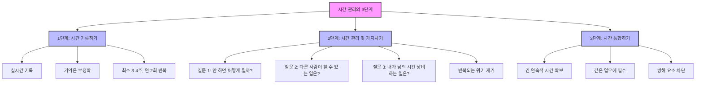
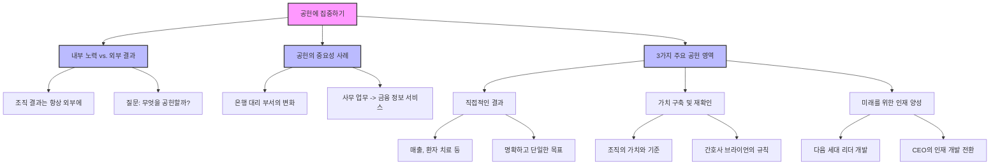
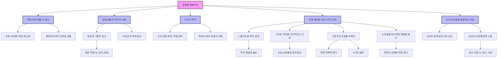
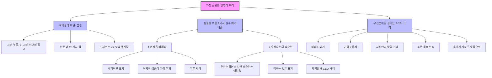

## 피터 드러커의 $《$효과적인 경영자$》$: 제대로 일하는 습관 만들기
이 책은 피터 드러커가 쓴 $《$효과적인 경영자$》$라는 책의 핵심 내용을 담고 있어. 이 책은 단순히 관리하는 방법을 알려주는 게 아니라, 개인의 훈련을 통해 지식을 실제 결과로 바꾸는 방법을 알려주는 마스터 클래스라고 보면 돼. 이 책의 목표는 지식을 실제적이고 지속적인 결과로 바꾸는 방법을 배우는 거야.

## 1. 효과적인 경영자란 누구일까? 

경영자라고 하면 보통 높은 자리에 앉아 지시만 하는 사람을 떠올리잖아? 그런데 드러커는 경영자를 훨씬 넓은 의미로 정의했어.

1. **경영자의 새로운 정의**:
  1. 경영자는 조직의 성과에 실질적으로 영향을 미치는 기여를 책임지는 사람이야 .
  2. 즉, 손으로 하는 일(육체노동)이 아니라 머리로 생각하고 지식을 활용해서 일하는 사람(지식 근로자)이라면 누구나 경영자라고 할 수 있어 .
  3. 예를 들어, 화학 엔지니어, 수간호사, 시장 조사원, 시스템 분석가, 대학교 학장 등 모두가 경영자인 셈이야 .
  4. 이런 사람들의 효과성이 우리 사회 전체의 효과성에 영향을 미친다고 드러커는 말했어 .

2. **지식 근로자의 중요성**:
  1. 과거 100년 전에는 대부분의 일이 수작업(매뉴얼 작업)이었어. 신발을 만들거나 다리를 짓는 것처럼 눈에 보이는 결과물이 있었지 .
  2. 이때는 얼마나 빨리 일을 처리하는지(효율성)가 중요했어 .
  3. 하지만 지금은 대부분의 사람이 지식 근로자야. 아이디어나 정보를 만들어내지 .
  4. 지식 근로자의 결과물은 다른 사람이 그것을 행동으로 옮기기 전까지는 아무 쓸모가 없어 .
  5. 그래서 지식 근로자는 단순히 효율적인 것을 넘어, '제대로 된 일'을 하는 것(효과성)에 집중해야 해 .

## 2. 효과성과 지능은 달라! 

똑똑한 사람이 항상 일을 잘하는 건 아니라는 사실, 알고 있었어? 드러커는 이 점을 아주 중요하게 강조했어.

1. **놀라운 **역설:
  1. 드러커는 아주 똑똑하고 뛰어난 사람들이 종종 "놀랍도록 비효과적"이라는 사실을 발견했어 .
  2. 이 말은 효과성이 타고난 재능이나 지능(IQ)과는 전혀 별개라는 뜻이야 .
  3. 효과성은 타고나는 것이 아니라, 배우고 훈련해야 하는 '규율(discipline)'이라는 거지 .

2. **누구나 배울 수 있는 능력**:
  1. 이러한 효과성은 누구나 노력하면 얻을 수 있는 능력이야 .
  2. 드러커는 45년간의 컨설팅 경험을 통해 '타고난 경영자'는 단 한 명도 만나본 적이 없다고 말했어 .
  3. 그가 만난 모든 효과적인 사람들은 이 능력을 배우고 습관이 될 때까지 연습했어 .
  4. 마치 피아노 선생님이 "모차르트처럼 연주할 수는 없지만, 그처럼 스케일(기본 연습)을 연주할 수는 있다"고 말하는 것과 같아 .
  5. 효과성은 화려한 연주(천재성)가 아니라, 꾸준한 연습(스케일)을 통해 필요한 역량을 달성하는 시스템과 규율에 관한 것이라고 보면 돼 .

## 3. 효과적인 경영자의 5가지 핵심 습관 

드러커는 효과적인 경영자가 되기 위한 5가지 핵심 습관을 제시했어. 이 습관들은 지식을 실제 결과로 바꾸는 데 필수적이야.

1. **시간을 어디에 쓰는지 알아라 (Know thy time)**:
  1. 가장 중요한 자원인 시간을 어떻게 사용하는지 정확히 파악하는 것이 첫 번째 단계야 .
  2. 시간은 돈처럼 더 많이 살 수도 없고, 저장할 수도 없는 유일한 자원이야 .

2. **공헌에 집중하라 (**Focus** on **outward contribution**)**:
  1. 자신이 하는 일이 조직 전체에 어떤 결과를 가져올지(외부 기여)에 초점을 맞춰야 해 .
  2. 단순히 열심히 일하는 것(노력)이 아니라, 어떤 결과를 만들어내는지(성과)가 중요해 .

3. **강점을 활용하라 (**Make strengths productive**)**:
  1. 자신과 동료, 상사의 강점을 최대한 활용하고 약점은 중요하지 않게 만드는 방법을 알아야 해 .
  2. 약점을 고치려 하기보다는 강점을 극대화하는 데 집중하는 거야 .

4. **가장 중요한 일부터 하라 (**First things first**)**:
  1. 가장 중요한 일에 집중하고, 한 번에 한 가지 일만 처리하는 규율이 필요해 .
  2. 우선순위뿐만 아니라 '하지 않을 일(후순위)'을 정하는 것이 중요해 .

5. 효과적인** 의사결정을 하라 (**Effective** **decisions**)**:
  1. 체계적인 과정을 통해 올바른 결정을 내리는 것이 경영자의 고유한 임무야 .
  2. 빠른 결정보다는 신중하고 체계적인 판단이 중요해 .

## 4. 첫 번째 습관: 시간을 어디에 쓰는지 알아라 

시간은 정말 소중한 자원이야. 돈이나 사람처럼 늘릴 수도 없고, 저장할 수도 없지. 그래서 시간을 잘 관리하는 것이 효과적인 경영자의 첫걸음이야.

1. **시간은 가장 희소한 자원**:
  1. 시간은 정말 특별한 자원이야. 돈은 빌리거나 투자해서 늘릴 수 있고, 사람은 더 고용할 수 있지만, 시간은 그럴 수 없어 .
  2. 누구도 시간을 더 많이 얻을 수 없기 때문에, 시간을 어떻게 쓰느냐가 성과를 결정하는 가장 중요한 요소가 돼 .

2. **시간 관리의 3단계 과정**:
  1. **1단계: 시간 기록하기 (Record)** 
  1. 대부분의 사람은 자신이 시간을 어디에 쓰는지 정확히 모른다고 드러커는 말했어 .
  2. 기억은 믿을 수 없어. 우리는 중요한 회의는 기억하지만, 집중을 방해했던 수많은 작은 방해 요소들은 잊어버리거든 .
  3. 그래서 시간을 '실시간으로' 기록해야 해. 하루가 끝난 후에 기억에 의존해서 기록하는 건 소용없어 .
  4. 어떤 회사 회장님은 자신의 시간을 세 가지 중요한 일에 똑같이 나눈다고 확신했지만, 실제 기록을 보니 전혀 달랐어 .
  5. 이런 기록은 최소 3~4주 동안 하고, 매년 두 번씩 반복해서 '영구적인 통제 시스템'으로 만들어야 해 .
  6. 마치 돈을 관리하는 회계처럼, 가장 소중한 자원인 시간을 관리하는 거야 .
  2. **2단계: 시간 관리 및 가지치기 (Manage & Prune)** 
  1. 시간 기록을 통해 현실을 파악했다면, 이제 불필요한 시간 낭비 요소를 제거해야 해 .
  2. **첫 번째 질문**: "이 일을 하지 않으면 어떻게 될까?" 
  1. 만약 아무 일도 일어나지 않는다면, 그 일은 당장 그만둬야 해 .
  2. 대부분의 경영자는 시간의 4분의 1 정도를 아무도 신경 쓰지 않을 일에 쓴다고 해 .
  3. 끝없는 연설, 의례적인 저녁 식사, 관성으로 유지되는 위원회 같은 것들이 여기에 해당해 .
  4. '아니오'라고 말하는 용기가 필요해 .
  3. **두 번째 질문**: "다른 사람이 할 수 있는 일은 무엇인가?" 
  1. 이것은 단순히 일을 맡기는 것(위임)과는 달라. 위임은 여전히 내가 그 일을 책임지고 확인해야 하거든 .
  2. 드러커는 '체계적인 포기'를 말해. 다른 사람이 나만큼, 아니 어쩌면 더 잘할 수 있는 일이라면, 그 책임 전체를 넘겨주는 거야 .
  3. 이렇게 하면 나만이 할 수 있는 중요한 일에 집중할 수 있어 .
  4. 마치 놀이공원 입구에서 '이쪽 줄이 짧아요~' 하고 안내하는 직원처럼, 사람들이 한 줄에 몰리지 않게 나눠주는 역할을 하는 게 레버리지**(leverage)**라고 보면 돼. 다른 사람에게 일을 맡겨서 내 생산성을 곱절로 늘리는 거지 .
  4. **세 번째 질문**: "내가 다른 사람의 시간을 낭비하게 하는 일은 무엇인가?" 
  1. 이 질문은 리더십에 대한 깊은 성찰을 요구해. 팀원들의 시간을 존중하는 것에 관한 것이거든 .
  2. 모든 회의에 팀원들을 참석시켰던 한 금융 경영자의 이야기가 좋은 예시야. 그는 포괄적이라고 생각했지만, 실제로는 팀 전체의 생산성을 마비시키고 있었어 .
  3. 팀원들은 회의의 80%에서 빠지고 싶어 했고, 그가 이 관행을 바꾸자 엄청난 생산성이 향상되었어 .
  5. 반복되는 위기** 관리**:
  1. 매 분기마다 반복되는 위기(예: 연말 예산 전쟁, 재고 부족)는 '게으름과 나태함'의 증거라고 드러커는 비판했어 .
  2. 잘 관리되는 조직은 '지루해야 한다'고 말해. 예측 가능한 위기는 미리 예상하고 일상적인 절차로 처리해야 한다는 거지 .
  3. 만약 어떤 위기가 두 번 이상 발생한다면, 누구라도 영웅적인 노력 없이 처리할 수 있도록 프로세스를 만들어야 해 .
  3. **3단계: 시간 통합하기 (Consolidate)** 
  1. 불필요한 시간을 제거하고 나면, 남은 시간(재량 시간)은 생각보다 많지 않을 거야. 운이 좋으면 하루의 4분의 1 정도일 수도 있어 .
  2. 진정한 업무나 깊은 사고를 위해서는 15분씩 쪼개진 시간으로는 부족해. 길고, 연속적이며, 방해받지 않는 시간 덩어리가 필요해 .
  3. 복잡한 보고서를 작성하거나, 어려운 인사 결정을 내리거나, 관계를 구축하는 일은 이런 긴 시간 속에서만 가능해 .
  4. 한 은행장 이야기가 좋은 예시야. 그는 회의 시간을 정확히 90분으로 정하고, 그 시간 동안에는 미국 대통령이나 아내 외에는 아무도 방해하지 못하게 했어 .
  5. 그는 90분 동안 기다릴 수 없는 위기는 거의 없다고 믿었어. 이런 절대적인 집중이 효과적인 경영자를 만드는 비결이야 .
  6. 이처럼 시간을 통합하는 방법은 다양해. 일주일에 하루는 재택근무를 하거나, 특정 요일에 모든 회의를 몰아넣고 다른 날은 깊은 업무에 집중하는 식이지 .

## 5. 두 번째 습관: 공헌에 집중하라 

시간을 잘 관리하게 되었다면, 이제 그 시간을 어디에 써야 할까? 드러커는 '공헌'에 집중하라고 말해. 내가 하는 일이 조직 전체에 어떤 긍정적인 영향을 미칠지 생각하는 거야.

1. **내부 노력 $vs.$ 외부 **결과:
  1. 조직의 결과는 항상 '외부'에 있어. 고객, 의뢰인, 환자 같은 외부 사람들이지 .
  2. 조직 '내부'는 비용과 노력만 있을 뿐이야 .
  3. 그래서 경영자는 끊임없이 "앞으로 18개월에서 2년 동안, 조직의 성과를 크게 향상시키기 위해 나에게 어떤 구체적인 공헌을 기대해야 할까?"라고 질문해야 해 .
  4. 이 질문은 나의 바쁜 일(노력)에서 벗어나 조직 전체의 결과(공헌)로 초점을 옮기게 해줘 .

2. **공헌의 중요성을 보여주는 사례**:
  1. 한 은행의 대리 부서(agency department) 이야기가 좋은 예시야 .
  2. 이 부서는 주주 기록 관리나 배당금 지급 같은 단순한 사무 업무를 처리했어 .
  3. 하지만 새로운 부사장은 "이 부서가 무엇에 공헌할 수 있을까?"라고 질문했어 .
  4. 그는 이 부서가 고객사의 주주 동향에 대한 귀중한 기밀 데이터를 가지고 있다는 것을 깨달았어 .
  5. 이 데이터는 최고경영자(CEO)들에게 매우 중요했지 .
  6. 그래서 그는 이 부서를 단순한 사무 부서에서 '고급 금융 정보 서비스'로 탈바꿈시켰어. 기본적인 업무는 그대로였지만, 그 목적을 재정의해서 엄청난 공헌을 하게 된 거야 .

3. **조직 성과를 위한 3가지 주요 **공헌** 영역**:
  1. **직접적인 **결과** (Direct **results**)**:
  1. 이것은 가장 분명한 공헌이야. 기업의 매출, 병원의 환자 치료 같은 것들이지 .
  2. 하지만 목표가 너무 많으면 실패할 수 있어. 영국의 국영 항공사는 사업, 국가 정책 지원, 영국 항공 산업 육성이라는 세 가지 목표를 동시에 추구하다가 모두 실패했어 .
  3. 명확하고 단일한 목표를 설정하는 것이 중요해 .
  2. **가치 구축 및 재확인 (Building and **reaffirming values**)**:
  1. 조직이 무엇을 상징하는지, 어떤 가치를 추구하는지 명확히 하는 것이 중요해 .
  2. 마치 조직의 '비타민과 미네랄' 같은 역할을 해 .
  3. 간호사 브라이언의 이야기가 좋은 예시야. 그녀는 수년 전에 은퇴했지만, 병원에서는 환자 치료 결정을 내릴 때마다 "브라이언 간호사라면 만족했을까?"라고 물었어 .
  4. 그녀의 "환자를 돕기 위해 최선을 다하고 있는가?"라는 질문은 병원 전체의 가치 기준이 되었고, 그녀의 가치 공헌은 그녀의 직위나 수명을 넘어섰어 .
  5. 서스(Sears) 백화점의 '미국 가족에 대한 헌신'이라는 가치는 수십 년간 그들의 결정을 이끌었어 .
  6. 서로 충돌하는 가치 목표는 에너지를 낭비하고 사람들을 혼란스럽게 할 뿐이야 .
  3. **미래를 위한 인재 양성 (Building and **developing people** for tomorrow)**:
  1. 조직이 미래의 리더를 체계적으로 양성하지 못하면 장기적으로 실패할 수밖에 없어 .
  2. 다음 세대는 이전 세대보다 더 높은 기준에서 시작해야 해 .
  3. 한 소매 체인의 나이 든 CEO 이야기가 좋은 예시야. 그는 재무 전문가였지만, 조직에 필요한 가장 중요한 공헌이 '다음 세대 관리자 양성'이라는 것을 깨달았어 .
  4. 그래서 그는 자신의 시간을 재무 업무에서 인재 개발로 의도적으로 옮겼어. 이것이 리더로서 조직에 가장 큰 영향력을 미칠 수 있는 공헌이었기 때문이야 .
  5. 경영자가 실패하는 가장 흔한 이유는 재능 부족이 아니라, 이전 직무를 놓지 못하고 새로운 직무에 필요한 공헌을 받아들이지 못하기 때문이야 .

## 6. 세 번째 습관: 강점을 활용하라 

사람은 누구나 강점과 약점을 가지고 있어. 효과적인 경영자는 약점을 고치려 하기보다는 강점을 최대한 활용해서 성과를 내는 데 집중해.

1. **약점 위에 세울 수 없다**:
  1. 효과적인 경영자는 '약점 위에 세울 수 없다'는 것을 알아 .
  2. 직원들의 약점을 최소화하는 것이 아니라, 강점을 극대화하는 것이 목표야 .
  3. '팔방미인' 같은 사람은 오히려 평범함(mediocrity)을 초래할 수 있어 .
  4. 진정으로 뛰어난 사람들은 항상 '강력한 약점'도 가지고 있어 .
  5. 조직의 역할은 그 약점을 중요하지 않게 만드는 거야 .

2. 강점** 활용의 역사적 사례**:
  1. 미국 남북전쟁 당시 링컨 대통령과 그랜트 장군의 이야기가 좋은 예시야 .
  2. 링컨은 그랜트 장군이 술을 너무 많이 마신다는 불평을 들었지만, 그랜트가 유일하게 전투에서 승리하는 장군이었기 때문에 "그가 마시는 술 브랜드를 알면 다른 장군들에게도 한 통씩 보내주겠다"고 말했어 .
  3. 그랜트의 음주(약점)는 그의 본질적인 공헌(군사적 승리)과는 무관했던 거지 .
  4. 남부 연합의 로버트 E. 리 장군도 사소한 명령을 어기는 장군을 용인했어. 왜냐하면 그가 성과를 냈기 때문이야 .
  5. 핵심 질문은 항상 "이 사람이 비범하게 잘할 수 있는 것은 무엇인가?"여야 해 .

3. **조직의 목적**:
  1. 조직의 전체 목적은 인간의 강점을 증폭시키고, 약점은 방어하는 도구가 되는 거야 .
  2. 뛰어나지만 다루기 힘든 세무 회계사 이야기가 좋은 예시야. 그를 '사람을 잘 다루는 사람'으로 만들려고 하지 말고, 그의 기술적 천재성이 빛날 수 있는 역할에 배치하고, 대인 관계 약점이 문제가 되지 않도록 관리 책임에서 보호하는 거지 .

4. **인재 배치(Staffing)를 위한 4가지 규칙**:
  1. **1. 불가능한 직무를 경계하라 (Guard against the impossible job)** 
  1. 이것은 서류상으로는 논리적이지만, 계속해서 유능한 사람들을 지치게 만드는 직무를 말해 .
  2. 만약 어떤 직무가 성공하기 위해 천재를 필요로 한다면, 그 직무 자체가 잘못 설계된 거야 .
  3. 예를 들어, 전체 마케팅 책임자나 대학교 총장처럼 너무 많은 상충되는 기술을 한 사람에게 요구하는 직무들이 여기에 해당해 .
  4. 조직의 시험대는 '평범한 사람들이 비범한 성과를 달성하게 만드는 능력'이야 .
  5. 슈퍼히어로가 필요하다면, 조직 설계에 실패한 것이므로 직무를 재설계해야 해 .
  2. **2. 모든 직무를 도전적이고 크게 만들어라 (Make each job demanding and big)** 
  1. 특히 신입 사원에게는 이 점이 중요해. 첫 직무가 그 사람의 경력 전체의 기준을 설정하거든 .
  2. 유망한 젊은 지식 근로자에게 작고 지루한 일상적인 직무를 주면, 그들은 평범함에 길들여질 수 있어 .
  3. "내 능력이 제대로 활용되지 못하고 있다"는 불평은 가장 흔한 불만 중 하나야 .
  4. 첫 직무는 그들의 강점을 처음부터 시험할 수 있는 진정한 도전이 되어야 해 .
  3. **3. 평가(Appraisal)의 초점을 바꿔라 (Shift the **focus** of appraisals)** 
  1. 평가는 미래 지향적이어야 해. 전통적인 평가는 과거의 잘못을 되돌아보는 데 초점을 맞추지 .
  2. 일본식 경영 방식은 사람들을 쉽게 해고할 수 없었기 때문에, 잘못에 초점을 맞춘 평가는 쓸모가 없었어 .
  3. 대신 "이 사람이 무엇을 잘할 수 있는가? 가장 큰 공헌을 할 수 있는 곳은 어디인가?"에 집중했어 .
  4. 드러커는 4가지 질문을 추천해 .
  1. 그는 무엇을 잘했는가? 
  2. 그는 무엇을 잘할 가능성이 있는가? 
  3. 그는 자신의 강점을 최대한 활용하기 위해 무엇을 배우거나 습득해야 하는가? 
  4. 만약 내 자녀가 있다면, 이 사람 밑에서 일하게 할 것인가? 
  5. 마지막 질문은 인격과 진실성을 확인하는 궁극적인 질문이야. 진실성(integrity)이 부족하다면 다른 모든 것이 무의미해져 .
  4. **4. 강점을 얻으려면 약점을 용인해야 한다 (To get strength, you must tolerate weaknesses)** 
  1. 누군가 조직에 큰 변화를 가져올 수 있는 중요한 강점을 가지고 있다면, 그 사람을 고용하고 그의 약점은 감수해야 해 .
  2. 두 명의 평범한 사람을 고용하는 것보다, 한 명의 뛰어나지만 결함 있는 사람을 고용하는 것이 더 나을 수 있어 .
  3. 모든 면에서 완벽한 사람을 요구하는 것은 결국 평범한 성과를 낳을 뿐이야 .

5. **상사의 강점을 활용하는 방법 (Managing up)**:
  1. 상사의 강점을 생산적으로 만드는 것은 매우 중요해. 상사가 효과적이지 못하면 나도 함께 정체될 수밖에 없거든 .
  2. **아첨이 아니다**: 이것은 아첨이 아니야. 상사도 강점과 한계를 가진 사람이라는 것을 인정하는 거야 .
  3. **상사의 강점에 맞춰 소통하라**:
  1. 상사가 잘하는 일을 할 수 있도록 돕는 것이 나의 역할이야 .
  2. 상사가 '듣는 사람(listener)'인지 '읽는 사람(reader)'인지 파악하는 것이 중요해 .
  3. 듣는 사람이라면 결론부터 말하고 대화로 풀어가야 하고, 읽는 사람이라면 자세한 보고서를 먼저 제공해야 해 .
  4. 상사의 강점(예: 정치적 전략)에 맞춰 나의 제안을 구성하면, 상사가 나의 좋은 아이디어를 자신의 강점을 활용해 쉽게 받아들일 수 있어 .
  5. 이것은 '무엇(what)'을 바꾸는 것이 아니라 '어떻게(how)'를 바꾸는 거야 .

## 7. 네 번째 습관: 가장 중요한 일부터 하라 

세상에는 우리가 할 수 있는 것보다 훨씬 더 많은 중요한 일들이 있어. 그래서 무엇을 먼저 할지, 그리고 무엇을 하지 않을지 결정하는 것이 정말 중요해.

1. **효과성의 비밀: **집중** (**Concentration**)**:
  1. 드러커는 효과성의 유일한 비밀이 '집중(concentration)'이라고 말했어 .
  2. 우리는 시간이 항상 부족하고, 중요한 일에는 긴 시간 덩어리가 필요하며, 대부분의 사람은 한 번에 여러 가지 일을 잘할 수 없기 때문에 집중이 필수적이야 .
  3. 모차르트처럼 여러 걸작을 동시에 작곡할 수 있는 천재는 예외지만, 우리 같은 평범한 사람들에게는 집중이 고품질의 결과물을 위한 전제 조건이야 .
  4. 노력을 집중할수록 일은 더 잘되고 빨라져 .
  5. 마치 스위스 군용 칼처럼, 여러 가지 기능이 있지만 한 번에 하나씩만 사용할 수 있잖아? 여러 기능을 동시에 쓰려고 하면 아무것도 제대로 할 수 없는 것과 같아 .

2. **집중을 위한 2가지 필수 메커니즘**:
  1. **1. 어제를 버려라 (Slough off yesterday)** 
  1. 이것은 '체계적인 포기(systematic abandonment)'를 의미해 .
  2. 모든 프로그램, 활동, 제품을 주기적으로 검토하고 "지금 우리가 아는 것을 알았다면, 이 일을 다시 시작할 것인가?"라고 질문해야 해 .
  3. 만약 '무조건 예스'가 아니라면, 그 일을 중단하거나 자원 투입을 줄여야 해 .
  4. 가장 버리기 어려운 것은 '어제의 성공'이야 .
  5. 이것들은 경영자의 자존심에 대한 투자가 되어, 최고의 인재와 희소한 자원을 빨아들이고 미래를 만드는 대신 과거를 지키는 데 사용돼 .
  6. 듀폰(DuPont) 같은 회사는 제품이 쇠퇴하기 전에 체계적으로 포기함으로써 혁신을 이뤘어 .
  7. 새로운 아이디어가 부족한 것이 아니라, 낡은 것을 버리지 못해서 새로운 아이디어가 성장할 자원을 얻지 못하는 것이 문제야 .
  2. **2. 우선순위와 **후순위** (**Priorities and posteriorities**)** 
  1. 우선순위를 정하는 것은 쉬워. 누구나 희망 목록을 만들 수 있지 .
  2. 진정으로 어렵고 용기가 필요한 일은 '후순위(posteriorities)'를 정하는 거야. 즉, '하지 않을 일'을 결정하는 거지 .
  3. 드러커는 "미루는 것은 사실상 포기하는 것과 같다"고 말했어 .
  4. 모든 것을 조금씩 하려고 하면, 결국 중요한 것은 아무것도 제대로 이루지 못해 .
  5. 한 제약회사 CEO의 이야기가 좋은 예시야. 그는 회사를 세계적인 기업으로 성장시키면서, 한 번에 '하나의 주요 과제'에만 집중했어 .
  6. 먼저 세계적인 연구 조직을 만들고, 그다음 국제적인 회사를 만들고, 마지막으로 장기적인 헬스케어 전략을 개발했지 .
  7. 이것이 많은 일을 하는 것처럼 보이는 사람들의 비밀이야. 그들은 한 번에 한 가지 일을 하지만, 그것을 끝까지 해내 .

3. **우선순위를 정하는 4가지 규칙**:
  1. 과거보다 미래를 선택하라 .
  2. 문제보다 기회에 집중하라 .
  3. 단순히 반응하기보다는 자신의 방향을 선택하라 .
  4. 높은 목표를 설정하라. 실제로 변화를 만들 수 있는 것을 선택하라 .
  5. 작고 기존의 문제를 해결하는 것이 크고 위험한 기회를 잡는 것보다 쉽고 안전하기 때문에, 사람들은 종종 작은 문제에 매달려 .
  6. 모든 것을 분석하려 드는 것은 '치명적인 죄'라고 드러커는 말했어. 그것은 단지 미루는 한 형태일 뿐이야 .
  7. 용기가 지식을 행동으로 바꾸는 힘이야 .

## 8. 다섯 번째 습관: 효과적인 의사결정을 하라 

의사결정은 경영자의 가장 중요하고 고유한 임무야. 효과적인 결정은 직감이나 속도에 의존하는 것이 아니라, 체계적인 과정과 엄격한 틀에 기반한 판단이야.

1. **비효과적인 의사결정을 유발하는 4가지 조직 현실**:
  1. 이 5가지 습관은 우리를 방해하는 조직의 현실에 대한 해독제와 같아 .
  2. **1. 경영자의 시간은 다른 사람의 것이다**:
  1. 경영자는 조직의 포로이며, 자신의 시간을 지키기 위해 싸워야 해 .
  3. **2. 경영자는 의도적인 행동을 취하지 않으면 즉각적인 일에 계속 매달리게 된다**:
  1. 전화, 이메일 같은 긴급한 일들은 관심을 요구하지만, 그 긴급성이 실제 중요성과 일치하는 경우는 거의 없어 .
  2. 만약 사건의 흐름에 따라 초점을 맞추게 되면, 영원히 '소방수' 역할만 하게 될 거야 .
  4. **3. 경영자는 다른 사람을 통해서만 효과적이다**:
  1. 나의 성공에 가장 중요한 사람들은 보통 직속 부하가 아니야. 다른 부서의 동료나 상사, 심지어 회사 외부의 사람들일 수 있어 .
  2. 그래서 나의 전문 지식을 전혀 다른 우선순위와 용어를 가진 사람들에게 유용하게 만드는 능력이 필요해 .
  5. **4. 내부 집중과 외부 **결과** 사이의 영원한 긴장**:
  1. 조직은 항상 나의 주의를 내부(비용, 프로세스, 정치)로 끌어당기지만, 진정으로 중요한 결과는 항상 외부(고객, 시장)에 있어 .
  2. 조직이 커질수록 외부 현실과 단절되기 쉬워 .
  3. 드러커는 기술(컴퓨터)이 이 문제를 더 악화시킬 것이라고 예측했어 .
  4. 컴퓨터는 측정 가능한 내부적인 것들(비용, 생산량)에는 뛰어나지만, 고객 취향 변화나 파괴적인 신기술 같은 질적인 외부 사건은 너무 늦게야 숫자로 나타나 .
  5. 에드셀(Edsel) 자동차의 실패가 좋은 예시야. 모든 내부 데이터는 시장에 적합한 차라고 했지만, 미국 소비자들이 소득이 아닌 취향과 정체성에 따라 구매하기 시작했다는 질적인 변화를 놓쳤어 .
  6. 경영자는 내부 데이터의 거품에서 벗어나 외부 현실을 인식하기 위해 의도적으로 노력해야 해 .

2. 효과적인** 의사결정의 5가지 요소**:
  1. **1. 문제 분류하기: 일반적인 문제인가, 고유한 문제인가? (Classifying the problem: Generic or unique?)** 
  1. 가장 먼저 이 문제가 '반복되는 문제의 증상'인지, 아니면 '진정으로 일회성 예외'인지 파악해야 해 .
  2. 가장 흔한 실수는 일반적인 상황을 고유한 사건처럼 다루는 거야 .
  3. 예를 들어, 새는 파이프 하나만 고치는 것이 아니라, 시스템 전체의 압력이 너무 높다는 근본적인 문제를 해결해야 해 .
  4. 초기 케네디 행정부는 모든 문제를 고유한 사례로 다루는 것을 자랑했지만, 결국 같은 일반적인 문제를 계속해서 해결해야 했어 .
  5. 두 번째 실수는 낡은 규칙을 새로운 종류의 사건에 적용하는 거야. 뉴욕 정전 사태처럼, 엔지니어들은 일반적인 과부하 규칙을 적용했지만, 이것은 완전히 새로운 종류의 연쇄 고장이었어 .
  6. 효과적인 경영자는 항상 문제가 '일반적'이라고 먼저 가정하고, 근본적인 문제를 찾아 .
  7. 문제를 4가지 유형으로 나눌 수 있어 .
  1. **진정으로 **일반적인 문제: 개별적으로 발생하지만, 실제로는 항상 일어나는 일반적인 문제야 (예: 재고 부족/과잉) .
  2. **예외처럼 보이지만 실제로는 **일반적인 문제: 개인에게는 독특해 보이지만, 실제로는 항상 일어나는 문제야 (예: 회사 인수합병 제안) .
  3. **새로운 일반적인 문제의 첫 징후**: 예외적인 사건이지만, 미래에 계속 발생할 새로운 일반적인 문제의 첫 징후일 수 있어 (예: 최초의 대규모 정전) .
  4. **진정으로 **예외적인 문제: 예측 불가능하고 다시는 일어나지 않을 '블랙 스완' 같은 문제야. 하지만 이런 경우는 거의 없어 .
  8. 대부분의 문제는 처음 세 가지 유형에 속하며, 체계적인 프로세스와 규칙을 개발하여 처리할 수 있어 .
  9. 결정을 내리기 전에 "이 결정이 정말 필요한가?"라고 질문해야 해. 때로는 아무것도 하지 않는 것이 최선의 선택일 수도 있어 .
  2. **2. **경계 조건** 정의하기 (Defining the **boundary conditions**)** 
  1. 이것은 해결책이 달성해야 할 '최소한의 목표'와 '존중해야 할 제약 조건'을 정의하는 거야 .
  2. 이것이 나중에 결정이 성공했는지 실패했는지 판단하는 기준이 돼 .
  3. 제1차 세계대전의 슐리펜 계획이 부정적인 예시야. 원래 계획의 핵심 조건은 '독일군을 분산시키지 않는 것'이었지만, 후임자들이 이 조건을 어겨서 실패했어 .
  4. 피그스만 침공도 두 가지 상충되는 조건(카스트로 전복 $+$ 미국 개입 은폐) 때문에 실패했어 .
  5. 상충되는 경계 조건을 가진 결정은 전략이 아니라 '기적을 바라는 기도'에 불과해 .
  3. **3. 무엇이 옳은지 생각하기 (Thinking through what is right)** 
  1. 타협이나 수용 가능한 것을 생각하기 전에, 먼저 '이상적인 해결책'이 무엇인지 생각해야 해 .
  2. 알프레드 슬론(Alfred Sloan)이 드러커에게 "무엇이 옳은지 먼저 말해달라. 그래야 올바른 타협을 할 수 있다"고 조언한 것이 핵심이야 .
  3. 타협에는 두 가지 종류가 있어. '반쪽짜리 빵이라도 없는 것보다 낫다'는 타협은 기본적인 조건을 만족시키지만, '솔로몬의 타협'(아기를 반으로 나누는 것)은 경계 조건을 위반하므로 항상 잘못된 선택이야 .
  4. **4. 행동 약속 구축하기 (Building action commitments)** 
  1. 드러커는 "결정은 그것이 '일로 타락'할 때까지는 이루어진 것이 아니다"라고 말했어 .
  2. 결정은 구체적인 행동으로 전환되어야 해. 누가 이 결정을 알아야 하는지, 어떤 행동이 필요한지, 누가 책임지는지 답해야 해 .
  3. 가장 중요한 것은 '현장의 실행자들'이 실제로 실행할 수 있도록 행동이 어떻게 보여야 하는지 명확히 하는 거야 .
  4. 단종된 모델의 부품을 계속 주문했던 직원의 이야기가 좋은 예시야. 결정은 경영진에서 내려졌지만, 구매 부서의 행동으로 이어지지 않았어 .
  5. 보상과 측정 지표도 결정과 일치해야 해. 벨(Bell)의 시어도어 베일(Theodore Vale)은 서비스에 대해 말하는 것을 넘어, 서비스 이행을 보상하는 측정 시스템을 바꿨어 .
  6. 새로운 방향을 발표했지만, 과거를 대표하는 고참들을 승진시킨 회사처럼, 행동이 결정과 일치하지 않으면 조직에 잘못된 신호를 보내게 돼 .
  5. **5. **피드백 루프** (The **feedback** loop)** 
  1. 아무리 좋은 결정이라도 가설에 불과하며, 틀리거나 시대에 뒤떨어질 수 있어 .
  2. 현실과 비교하여 테스트할 수 있는 방법을 구축해야 해 .
  3. 군대는 오래전부터 '지휘관이 직접 가서 확인해야 한다'는 것을 배웠어. 보고서에만 의존해서는 안 돼 .
  4. 대대장은 더 나은 식사를 제공하라는 명령이 실제로 지켜지는지 직접 맛봐야 해. 보고서는 걸러지기 마련이거든 .
  5. 디지털 시대에는 이것이 더욱 중요해. 컴퓨터는 추상적인 데이터를 제공하지만, 사무실을 벗어나 구체적인 현실을 직접 확인해야 나의 가정이 여전히 유효한지 알 수 있어 .

```mermaid
graph TD
    A["효과적인 의사결정"] --> B["비효과적 의사결정 유발 4가지 조직 현실"]
    B --> B1["경영자의 시간은 남의 것"]
    B --> B2["즉각적인 일에 매달림"]
    B --> B3["다른 사람을 통해서만 효과적"]
    B --> B4["내부 집중 vs. 외부 결과"]
    B4 --> B4a["컴퓨터의 한계 (Edsel 사례)"]
    A --> C["효과적인 의사결정의 5가지 요소"]
    C --> C1["1.문제 분류: 일반적 vs. 고유"]
    C1 --> C1a["가장 흔한 실수: 일반적 문제를 고유하게 취급"]
    C1 --> C1b["4가지 문제 유형"]
    C1 --> C1c["결정 필요성 질문"]
    C --> C2["2.경계 조건 정의"]
    C2 --> C2a["최소 목표와 제약 조건"]
    C2 --> C2b["슐리펜 계획, 피그스만 침공 사례"]
    C --> C3["3.무엇이 옳은지 생각"]
    C3 --> C3a["이상적인 해결책 먼저"]
    C3 --> C3b["알프레드 슬론의 조언"]
    C --> C4["4.행동 약속 구축"]
    C4 --> C4a["결정은 일로 타락해야 완성"]
    C4 --> C4b["누가, 무엇을, 어떻게"]
    C4 --> C4c["보상과 지표 일치"]
    C --> C5["5.피드백 루프"]
    C5 --> C5a["결정은 가설, 현실과 테스트"]
    C5 --> C5b["군대의 '직접 확인' 원칙"]
    C5 --> C5c["디지털 시대의 중요성"]

    style A fill:#f9f,stroke:#333,stroke-width:2px
    style B fill:#bbf,stroke:#333,stroke-width:2px
    style C fill:#bbf,stroke:#333,stroke-width:2px
```

## 9. $《$효과적인 경영자$》$가 주는 교훈 

이 책은 1967년에 출판되었지만, 오늘날에도 여전히 유효하고 중요한 메시지를 담고 있어. 복잡한 세상에서 우리가 어떻게 '제대로 된 일'을 할 수 있는지 알려주지.

1. **비판과 반론**:
  1. 어떤 사람들은 이 책의 내용이 너무 단순하거나, 성공한 사례만 보고 일반화했다고 비판할 수 있어 .
  2. 하지만 드러커는 천재성에 초점을 맞춘 것이 아니라 '규율'에 초점을 맞췄어 .
  3. 그가 제시한 실패 사례들(에드셀, 피그스만 침공)은 의사결정 과정의 체계적인 결함으로 인해 발생했음을 보여줘 .
  4. 이 시스템이 천재가 되게 해주지는 않지만, 치명적이고 예측 가능한 실수를 피하는 데 도움을 준다는 거야 .
  5. 이 모델이 GM이나 AT&T 같은 거대 기업에만 적용되고 오늘날의 민첩한(agile) 세상에는 너무 느리고 경직되었다는 비판도 있어 .
  6. 하지만 드러커의 5단계 과정은 '큰 전략적이고 일반적인 결정'을 위한 것이야. 어떤 시장에 진입할지, 어떤 회사를 인수할지 같은 결정들 말이야 .
  7. 이런 큰 결정에서는 경계 조건과 '무엇이 옳은지'를 명확히 하는 것이 필수적이야. 결함 있는 전략을 서두르면 잘못된 목적지에 더 빨리 도달할 뿐이지 .
  8. 오히려 기술은 그의 프레임워크를 더욱 관련성 있게 만들어. 컴퓨터는 '원칙에 입각한 결정'을 강요하거든 .
  9. 재고 관리처럼, 인간은 상황에 맞춰 유연하게 대처할 수 있지만, AI 시스템은 먼저 정책이 필요해 .
  10. 이것은 경영자가 위험 균형을 맞추는 원칙을 깊이 생각하게 하고, 모든 사람이 더 효과적인 의사결정자가 되도록 강요해 .

2. **궁극적인 잠재력: 인격 개발**:
  1. 단순히 시간을 기록하는 기계적인 행동에서 시작했지만, 이 여정은 결국 '인격 개발'로 이어져 .
  2. 선견지명, 자립심, 후순위를 정하는 용기 같은 것들이 리더를 만들어 .
  3. 이것은 단순히 따르는 절차에서 '몸으로 체화하는 헌신'으로 발전하는 거야 .
  4. '평범한 사람들이 비범한 성과를 달성하게 만드는' 겸손한 목표지만, 깊은 수준의 자기 계발을 요구해 .
  5. 이것이 조직의 탁월함과 지식 근로자의 개인적인 만족을 위한 핵심이야 .
  6. 이 책이 시대를 초월하는 이유는 '일시적인 개성'이 아니라 '영원한 과정'에 관한 것이기 때문이야 .

3. **용기의 중요성**:
  1. '용기'는 이 모든 것의 마지막 재료이자 '힘의 증폭기'야 .
  2. 분석은 쉽지만, 용기가 그 분석을 행동으로 바꾸는 거야 .
  3. 똑똑해 보이려고 하는 것은 '치명적인 죄'인데, 어려운 선택을 피하기 위한 방법일 뿐이거든 .
  4. 용기는 사건에 나의 의지를 부여하는 결정이야 .

4. **당신을 위한 질문**:
  1. 드러커의 우선순위 4가지 규칙(과거보다 미래, 문제보다 기회, 자신의 방향 선택, 높은 목표 설정)을 기억해봐 .
  2. 지금 당신이 '습관 때문에' 하고 있는 일 중 하나를 과감히 포기할 용기가 있다면, 다음 주 월요일 당신의 할 일 목록 첫 번째 항목은 어떻게 바뀔까? 
  3. 어떤 높은 목표를 가진 미래 지향적인 기회를 대신 잡을 수 있을까? 
  4. 효과성은 '용기 있는 후순위'를 정함으로써 월요일을 다르게 만드는 그 하나의 선택에서 시작돼 .

