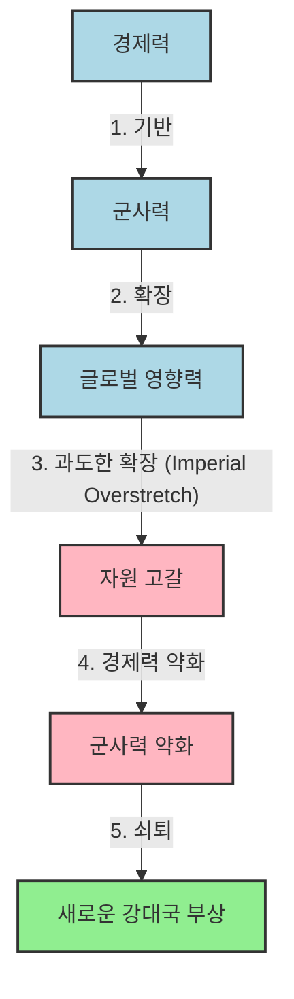

## 강대국의 흥망성쇠: 경제력과 군사력의 춤
이 책은 1500년부터 2000년까지 500년 동안 강대국들이 어떻게 흥하고 쇠했는지 알려주는 역사 이야기야. 경제력이 강해야 군사력도 강해지고, 그래야 나라가 힘을 가질 수 있다는 게 이 책의 핵심 메시지라고 보면 돼. 마치 몸이 튼튼해야 운동도 잘할 수 있는 것과 같다고 할 수 있지.

## 1. 서양 세계의 부상: 1500년경의 역설 

1. **1500년 세계의 모습**:
  1. **동양의 거대 제국들**:
  - 명나라(중국), 오스만 제국(중동), 무굴 제국(인도) 같은 동양의 큰 나라들은 엄청난 부와 군대를 가지고 있었어. 
  - 여행자들의 이야기는 이들의 부와 군사력을 과장하기도 했지만, 실제로도 문화와 기술이 아주 발달한 중심지였지. 
  - 기술적으로나 군사적으로도 유럽의 나라들보다 전혀 뒤떨어지지 않았어. 
  - 마치 지금의 큰 회사들처럼, 그 당시에는 세계를 주름잡는 강자들이었다고 보면 돼.
  2. **유럽의 초라한 시작**:
  - 유럽은 여러 작은 왕국과 공국으로 쪼개져 있었고, 서로 싸우기 바빴어. 
  - 자연적인 방어선도 부족하고, 동쪽에서는 침략에 시달리고, 남쪽에서는 오스만 제국의 위협을 받았지. 
  - 1453년 콘스탄티노플이 함락된 기억은 유럽인들에게 큰 충격이었고, 오스만 군대가 발칸반도로 진격하는 모습은 위협이 사라지지 않았음을 보여줬어. 
  - 마치 작은 동네 가게들이 모여 있는 것처럼, 힘도 없고 분열되어 있었다고 보면 돼.
  3. **세계 문명의 균형**:
  - 1500년경에는 세계의 주요 문명들이 대략 비슷한 발전 단계에 있었어. 어떤 분야는 앞서고, 어떤 분야는 뒤처지는 식이었지. 
  - 아프리카, 아메리카, 오세아니아 지역이 상대적으로 변두리였고, 유럽은 아직 특별히 두드러지지 않았어. 
  - 지금처럼 서양이 압도적으로 강할 거라고는 아무도 상상하지 못했지.

2. **명나라 중국의 역설적인 후퇴**:
  1. **압도적인 초기 우위**:
  - 명나라는 1억 명이 넘는 인구, 거대한 운하 시스템, 잘 정비된 중앙집권적 관료제를 갖춘 당대 최고의 문명이었어. 
  - 기술력도 뛰어났는데, 구텐베르크보다 수세기 전에 활판 인쇄술이 발달했고, 유럽이 산업혁명 때나 따라잡을 만한 엄청난 철강 산업을 가지고 있었어. 
  - 화약과 나침반도 중국에서 먼저 발명되었지. 
  - 정화(鄭和) 제독의 대규모 함대는 동아프리카까지 진출하며 중국의 힘을 과시했어. 
  - 이런 함대 규모를 보면 중국이 포르투갈보다 수십 년 먼저 유럽에 도달할 수도 있었을 거야. 
  - 마치 세계 최고의 기술력을 가진 회사가 갑자기 문을 닫아버린 것과 같다고 할 수 있어.
  2. **갑작스러운 쇄국 정책**:
  - 하지만 1436년, 명나라는 해외 항해용 선박 건조를 금지하는 황제의 명령을 내렸어. 
  - 이후에는 돛대가 두 개 이상인 배의 존재 자체를 금지하는 더 강력한 명령까지 나왔지. 
  - 한때 인도양을 누비던 선원들은 대운하의 작은 배에서 일하게 되었고, 거대한 함대는 항구에서 썩어갔어. 
  - 이런 결정 뒤에는 유교 학자 관료들과 상인 계층 사이의 깊은 갈등이 있었어. 
  - 관료들은 상업을 천시하고, 무역을 통한 부의 축적을 천박하고 사회를 불안하게 만드는 것으로 여겼지. 
  - 국가의 통제를 벗어난 해외 무역은 더욱 위험하게 보였어. 
  - 결국, 중국의 뛰어난 기술력은 지속적인 경제 발전으로 이어지지 못했어. 
  - 18세기 유럽에서 산업혁명이 시작될 때, 한때 서양을 압도했던 중국의 용광로는 수세기 동안 버려진 채 침묵했지. 
  - 마치 최고의 기술을 가지고도 스스로 발전을 멈춰버린 것과 같아.

3. **이슬람 제국들의 정체**:
  1. **초기 번영과 한계**:
  - 오스만 제국, 사파비 제국(페르시아), 무굴 제국(인도) 같은 이슬람 세계도 16세기에 크게 번성했어. 
  - 오스만 군대는 헝가리를 점령하고 빈을 위협했으며, 지중해를 장악했지. 
  - 하지만 명나라처럼 이들 국가도 과도한 확장, 내부 경직성, 변화에 대한 저항 때문에 쇠퇴했어. 
  - 오스만 제국은 한 세기 동안의 확장 후 내부로 눈을 돌렸고, 무굴 제국은 막대한 조공을 거두었지만 장기적인 권력을 유지할 경제적, 제도적 기반을 마련하지 못했어. 
  - 마치 한때 잘나가던 회사들이 변화를 거부하다가 뒤처지는 것과 비슷해.

4. **유럽의 역설적인 강점: 분열과 경쟁**:
  1. **분열이 낳은 혁신**:
  - 유럽은 부, 규모, 문화적 화려함 면에서 다른 문명보다 뛰어나지 않았어. 
  - 오히려 하나의 제국 시스템으로 통일되지 않고 분열되어 있다는 점이 특징이었지. 
  - 하지만 이 분열이 역설적으로 강점이 되었어. 
  - 서로 경쟁하는 왕국들과 도시 국가들은 끊임없이 혁신할 수밖에 없었어. 더 좋은 배, 더 효율적인 금융 시스템, 더 치명적인 무기를 찾아야 했지. 
  - 마치 여러 스포츠팀이 서로 경쟁하면서 실력이 계속 느는 것과 같다고 보면 돼.
  2. **경제 성장과 **군사력** 발전의 선순환**:
  - 이러한 경쟁의 용광로 속에서 중앙집권적인 제국들과는 다른 역동성이 생겨났어. 
  - 경제 성장과 군사력 발전이 서로를 부추기며 나선형으로 발전했고, 시간이 지나면서 유럽은 경쟁자들을 앞서나가게 되었지. 
  - 1500년에는 방어적인 대륙처럼 보였던 유럽이 다양성과 끊임없는 경쟁 덕분에 현대 세계를 만든 힘을 움직이게 된 거야. 
  - 이것이 바로 역사가들이 말하는 '유럽의 기적'이라고 할 수 있어. 

## 2. 합스부르크 왕가의 지배 시도: 1519-1659년 

1. **합스부르크 왕가의 야망과 도전**:
  1. **유럽 통일의 꿈**:
  - 16세기 초, 유럽은 경제적, 군사적으로 발전하기 시작했지만, 이 활기차고 분열된 대륙이 하나의 강력한 왕조 아래 통일될 수 있을지가 큰 질문이었어. 
  - 1500년 이후 150년 동안, 유럽의 다원주의(여러 나라가 공존하는 체제)에 가장 심각한 도전은 합스부르크 가문에서 나왔어. 
  - 스페인과 오스트리아의 왕관을 쓰고, 부르고뉴, 저지대 국가(네덜란드, 벨기에 등), 보헤미아, 헝가리까지 영토를 확장했으며, 신대륙 정복으로 스페인 국고를 채우면서 합스부르크 가문은 '보편 군주국(Universal Monarchy)'을 건설할 수 있을 것처럼 보였지. 
  - 마치 여러 나라를 합쳐서 하나의 거대한 제국을 만들려는 야심 찬 계획과 같았어.
  2. **실패로 끝난 야망**:
  - 하지만 이 거대한 계획은 결국 실패로 돌아갔고, 1659년 피레네 조약으로 유럽은 하나의 제국이 아닌 여러 강대국이 공존하는 체제로 남게 되었어. 
  - 이 과정은 피비린내 나고 불확실했지만, 유럽 역사의 중요한 특징이 되었지. 
  - 합스부르크 가문의 실패는 한 나라의 야망이 경제적 능력을 넘어설 때 어떤 결과가 오는지 보여주는 중요한 교훈이야. 

2. **전쟁의 변화와 새로운 도전**:
  1. **종교 개혁과 **군사 혁명:
  - 합스부르크 가문의 싸움은 유럽 분쟁의 성격을 완전히 바꿔놓았어. 
  - 전쟁은 더 이상 이웃 왕자들 간의 지역 분쟁이 아니었어. 16세기 중반에는 대륙 전체로 확대되었고, 종교적 분열의 열정까지 더해졌지. 
  - 마르틴 루터의 종교 개혁(1517년)은 기독교 세계의 깨지기 쉬운 종교적 단결을 산산조각 냈고, 왕조 전쟁을 신앙 전쟁으로 만들었어. 
  - 또 다른 변화는 '군사 혁명'이었어. 전쟁 비용이 전례 없는 수준으로 치솟았지. 
  - 상비군(늘 유지하는 군대)은 점점 더 전문적이고 훈련된 군대가 되었고, 지속적인 자금 지원이 필요했어. 
  - 보병(창과 총으로 무장한 군인)이 결정적인 역할을 했고, 포병과 요새 시스템은 더욱 복잡해졌어. 
  - 1630년대에는 병력과 자금 동원 규모가 한 세기 전보다 훨씬 커졌지. 
  - 마치 작은 싸움이 전면전으로 확대되고, 싸움 방식도 완전히 달라진 것과 같아.
  2. **합스부르크의 광대한 영토와 적들**:
  - 합스부르크 가문의 영토는 스페인, 아라곤, 부르고뉴, 오스트리아 왕관을 포함했고, 나중에는 보헤미아, 헝가리, 포르투갈, 심지어 결혼을 통해 잠시 영국까지 얻었어. 
  - 아메리카 대륙 정복으로 신대륙의 은이 스페인으로 흘러들어와 유럽 전역의 전쟁 자금을 댔지. 
  - 1600년경에는 유럽 인구 1억 5백만 명 중 약 4분의 1인 2천 5백만 명이 합스부르크의 지배를 받았어. 
  - 이런 자원 덕분에 합스부르크 군대는 군사 혁명의 정수를 보여주었어. 카를 5세 때 군대는 3만 명 미만에서 15만 명으로 늘었고, 펠리페 4세 때는 30만 명까지 늘어났지. 
  - 스페인의 테르시오(창병과 머스킷병으로 구성된 정예 부대)는 초기 근대 군사력의 모델이었어. 
  - 하지만 카를 5세는 프랑스, 오스만 제국, 지중해의 해적들로부터 사방에서 적들을 맞이해야 했어. 
  - 심지어 프랑스의 프랑수아 1세는 오스만 제국의 술탄 쉴레이만과 동맹을 맺기도 했지. 
  - 마치 거대한 회사가 너무 많은 사업을 벌이다가 사방에서 경쟁자들에게 공격받는 것과 같아.

3. **합스부르크 제국의 몰락: 과도한 확장과 경제적 약점**:
  1. **자원 낭비와 재정 위기**:
  - 합스부르크 제국은 겉보기만큼 견고하지 않았어. 
  - 광대한 영토는 오히려 해결하기 어려운 문제들을 만들었지. 
  - 신대륙에서 들어온 막대한 수입은 군사 작전에 낭비되었고, 재정 능력보다 전쟁 규모가 계속 커졌어. 
  - 제국의 영토는 여러 전선에서 적들을 상대해야 했고, 이는 자원을 고갈시키고 보급망을 한계까지 몰아붙였어. 
  - 네덜란드에서 카탈루냐에 이르는 내부 반란은 다양한 전통, 언어, 자유를 가진 많은 땅을 통치하는 어려움을 보여주었어. 
  - 마치 돈을 아무리 많이 벌어도 계속해서 밑 빠진 독에 물 붓듯이 쓰는 것과 같아.
  2. **경직된 경제 구조와 경쟁자들의 부상**:
  - 합스부르크 왕가는 군사력이 경제 기반보다 훨씬 커지는 '군사적 비대화(militarily top-heavy)' 상태에 빠졌어. 
  - 세금을 올리고, 특권과 독점권을 팔고, 은행가들에게 미래의 세금 수입이나 신대륙의 은을 담보로 대출을 받았지. 
  - 1543년에는 일반 수입의 거의 3분의 2가 이미 이자 지불에 사용되었어. 
  - 이런 재정 정책은 무역과 산업 같은 생산적인 분야에서 자본을 빼앗아 빚 갚고 전쟁하는 데만 쓰이게 했어. 
  - 반면 프랑스는 리슐리외 추기경의 영리한 지도력 아래 반(反)합스부르크 연합의 지휘자 역할을 하며 합스부르크의 힘을 약화시켰어. 
  - 영국은 국내 안정과 재정 건전성을 강조하며 무역을 확장했고, 네덜란드 공화국은 상업, 금융, 해군력을 기반으로 한 새로운 형태의 국가를 만들었어. 
  - 오스만 제국도 합스부르크와 마찬가지로 과도한 확장과 경제적 역동성 부족으로 약화되었지. 
  - 마치 한 회사가 빚만 늘리다가 망하는 동안, 다른 회사들은 효율적인 경영으로 성장하는 것과 같아.
  3. **유럽 다원주의의 확립**:
  - 1659년 합스부르크의 계획이 무너진 것은 군사적 패배뿐만 아니라 경제적 패배이기도 했어. 
  - 이는 장기적으로 국가의 생산 및 세수 능력과 군사력을 유지하는 능력 사이에 깊은 상관관계가 있다는 원칙을 명확히 보여주었지. 
  - 다른 유럽 강대국들은 경제 기반과 군사적 의무 사이의 균형을 더 잘 유지했어. 
  - 결국 유럽은 하나의 보편 군주국 대신, 각자 독립적인 국가들의 집합체가 되었고, 이들은 종교적 연대보다는 '국가 이익'이라는 관점에서 정책을 수립하게 되었어. 
  - 이제 유럽의 전쟁과 평화는 '세력 균형'에 의해 결정될 거야. 
  - 마치 한 회사가 무리하게 사업을 확장하다 망하고, 여러 경쟁 회사들이 각자의 강점을 살려 공존하게 된 것과 같아.

## 3. 재정, 지리, 그리고 전쟁의 승리: 1660-1815년 

1. **다극 체제의 등장과 국가 이익의 시대**:
  1. **새로운 **강대국** 구도**:
  - 17세기 중반부터 19세기 초까지 유럽의 패권 다툼은 합스부르크 시대와는 다른 형태로 나타났어. 
  - 더 이상 하나의 왕조가 대륙의 중심에서 다른 모든 나라를 지배하려 하지 않았지. 
  - 대신, 프랑스, 영국, 러시아, 오스트리아, 프로이센이라는 다섯 강대국이 유럽 외교와 군사 무대를 지배하는 '다극 체제(multipolar system)'가 등장했어. 
  - 이들은 놀라운 속도로 연합을 바꾸어가며 끊임없이 충돌했고, 간헐적인 평화 조약도 오래가지 못했어. 
  - 마치 여러 강팀이 서로 경쟁하며 리그를 이끌어가는 것과 같아.
  2. **프랑스의 야망과 좌절**:
  - 루이 14세와 나폴레옹 시대의 프랑스는 유럽을 통일하는 데 가장 근접했지만, 다른 국가들의 연합된 저항에 항상 마지막 순간에 저지당했어. 
  - 이 시기의 가장 중요한 변화는 전쟁과 평화에 대한 계산이 종교적 수사보다는 '국가 이익'이라는 언어에 점점 더 기반을 두게 되었다는 점이야. 
  - 동맹은 일시적이고 유동적이었으며, 한 전쟁의 적이 다음 전쟁에서는 동맹이 될 수도 있었지. 
  - 이것은 통치자들이 신앙의 부름보다는 '세력 균형(balance of power)'이라는 영구적인 기준에 따라 약속을 저울질하는 '현실 정치(realpolitik)'의 새로운 시대였어. 
  - 마치 종교보다는 실용적인 이익을 따지는 비즈니스 세계와 같다고 보면 돼.
  3. **스페인과 네덜란드의 쇠퇴**:
  - 이러한 환경에서 스페인과 네덜란드 공화국은 이전의 명성을 잃었어. 
  - 스페인은 무의미한 전쟁과 제국 유지 비용으로 지쳐서 2류 국가로 전락했지. 
  - 네덜란드는 여전히 강력한 무역 및 금융 강국이었지만, 대규모 군대를 유지하는 능력은 빠르게 약화되었어. 
  - 마치 한때 잘나가던 회사들이 시대의 변화에 적응하지 못하고 뒤처지는 것과 같아.

2. **전쟁의 비용과 **금융 혁명:
  1. **막대한 전쟁 비용**:
  - 18세기에는 대규모 상비군과 해군을 유지하는 비용이 엄청나게 커졌어. 
  - 전쟁은 더 이상 한 계절에 끝나는 짧은 작전이 아니라, 오랜 인내심을 요구하는 장기적인 싸움이 되었지. 
  - 승리는 단순히 서류상으로 가장 강한 나라에게 돌아가는 것이 아니라, 신용, 보급품, 그리고 사회가 전쟁의 부담을 견딜 의지가 있는 나라에게 돌아갔어. 
  - 마치 마라톤처럼, 누가 더 오래 버틸 수 있느냐가 중요해진 거야.
  2. **영국의 금융 혁명**:
  - 17세기 후반에서 18세기 초반의 '금융 혁명(financial revolution)'은 전략적으로 매우 중요했어. 
  - 일부 국가들은 즉각적인 세금 수입 한계를 훨씬 뛰어넘는 자원을 활용할 수 있는 정교한 신용 및 은행 시스템을 개발했지. 
  - 영국은 1688년 명예혁명 이후 전례 없는 규모로 전쟁 자금을 조달할 수 있는 금융 시스템을 만들었어. 
  - 영국은 세금 수입만으로는 불가능했을 정도로 적들보다 훨씬 많은 돈을 쓸 수 있었지. 
  - 이러한 신용 시스템은 영국에 결정적인 우위를 제공했어. 더 많은 배를 바다에 띄우고, 더 많은 병력을 전장에 보낼 수 있었지. 
  - 정부가 빚을 갚을 능력이 있다는 확신은 투자자들을 안심시켰고, 자금이 계속 흘러들어와 런던은 유럽 전쟁의 금융 중심지가 되었어. 
  - 마치 신용카드를 잘 활용해서 필요한 투자를 제때 할 수 있었던 회사와 같아.
  3. **금융 역량이 경제 발전에 미친 영향**:
  - 이러한 재정 능력은 전장 너머까지 영향을 미쳤어. 
  - 해군 계약은 목재, 철, 캔버스, 밧줄을 필요로 했고, 군대 보급 계약은 식량, 의류, 운송을 요구했지. 
  - 국가의 꾸준한 수요는 영국 산업을 자극하고 기술 혁신을 장려하며 산업 성장의 기반을 마련하는 선순환을 만들었어. 
  - 결국, 전쟁 자금 조달 메커니즘 자체가 영국의 장기적인 경제 발전을 촉진했고, 미래에 큰 이점을 주었어. 
  - 마치 전쟁 때문에 생긴 수요가 오히려 산업 발전을 이끈 것과 같아.

3. **프랑스의 한계와 지리의 중요성**:
  1. **프랑스의 재정적 약점**:
  - 프랑스는 인구 2천만 명, 풍부한 자원, 대규모 군대(1659년 3만 명에서 1710년 35만 명 이상)를 가진 대륙의 강대국이었어. 
  - 하지만 영국의 유연하고 신뢰할 수 있는 금융 시스템과는 달리, 프랑스의 재정 시스템은 비효율적이었어. 
  - 세금 징수원들이 수입을 빼돌리고 비효율성이 만연했지. 
  - 게다가 프랑스의 전략은 대륙의 패권국 역할과 해상 및 식민지에서 영국에 도전하려는 야망 사이에서 분열되어 있었어. 
  - 이러한 이중적인 역할은 프랑스를 위험하게 만들었고, 어느 한 분야에도 완전히 집중할 수 없게 했어. 
  - 마치 여러 사업을 동시에 벌이다가 어느 하나도 제대로 성공시키지 못한 회사와 같아.
  2. **지리적 이점과 영국-러시아의 부상**:
  - 지리도 유럽 강대국들의 운명을 결정하는 데 중요한 역할을 했어. 
  - 특히 영국과 러시아는 대륙의 변두리에 위치하여 독특한 안보와 영향력을 가질 수 있었지. 
  - 영국은 섬나라라는 지리적 이점 덕분에 직접적인 침략으로부터 보호받으며 해상 강국으로 성장할 수 있었어. 
  - 영국은 해군력을 바탕으로 유럽 대륙의 분쟁에 개입하면서도 자국 영토가 황폐해지는 것을 막을 수 있었지. 
  - 영국은 프랑스가 유럽을 완전히 지배하는 것을 막기 위해 해군력과 함께 대륙 동맹국들에게 보조금을 지원하는 정책을 폈어. 
  - 러시아는 유럽 국가 중 가장 많은 인구를 가지고 있었고, 그 결과 가장 많은 군대를 보유했어. 
  - 동쪽 변두리에 위치한 지리적 이점 덕분에 갑작스러운 정복으로부터 안전했고, 서쪽으로 힘을 투사할 수 있었지. 
  - 마치 섬에 있어서 방어하기 쉽고, 넓은 땅을 가지고 있어서 병력이 많은 나라들이 유리했던 것과 같아.
  3. **나폴레옹 전쟁의 교훈**:
  - 스페인 왕위 계승 전쟁에서 영국은 재정적, 해군적 우위를 보여주며 연합을 지원하고 해상권을 장악했어. 
  - 산업혁명은 영국에 새로운 경제적 역동성을 부여했고, 이는 해군과 육군을 지원하면서 동시에 해외 식민지 제국을 확장할 수 있게 했어. 
  - 18세기 말에는 영국이 전 세계적인 전쟁과 대륙 전쟁을 동시에 수행할 수 있었는데, 이는 다른 어떤 나라도 할 수 없는 일이었지. 
  - 프랑스 혁명과 나폴레옹 시대는 유럽 전쟁의 규모와 맹렬함을 변화시켰어. 
  - 나폴레옹은 한때 무한한 인력과 에너지를 활용하는 것처럼 보였지만, 그의 제국의 물질적 기반은 겉보기만큼 견고하지 않았어. 
  - 장기적인 소모전에서 영국의 재정 능력이 결정적이었어. 
  - 영국의 국가 신용 시스템은 1813년에 45만 명의 연합군 병력을 지원할 수 있을 정도로 막대한 보조금을 유지할 수 있게 했지. 
  - 결국 나폴레옹 제국은 전장에서의 패배뿐만 아니라, 영국이 독점적으로 승리할 수 있었던 재정적 인내와 해상 봉쇄, 소모전의 누적된 무게 때문에 무너졌어. 
  - 1815년까지 150년간의 갈등에서 얻은 교훈은 분명했어. 유리한 지리적 조건과 재정 혁신, 조직적 회복력을 결합할 수 있는 강대국만이 살아남고 승리한다는 것이었지. 
  - 마치 돈이 많고 지리적으로 유리한 나라가 결국 마라톤에서 승리하는 것과 같아.

## 4. 산업화와 변화하는 세계 균형: 1815-1885년 

1. **산업혁명과 새로운 세계 질서**:
  1. **산업화의 불균등한 영향**:
  - 나폴레옹의 패배는 새로운 유럽 정치의 시작이자, 변화된 세계 질서의 시작을 알렸어. 
  - 1815년에서 1885년 사이에 국제 시스템은 현대 시대의 시작을 알리는 특징들을 갖게 되었지. 
  - 가장 결정적인 변화는 '산업화'의 불균등한 영향이었어. 이는 국가 간의 힘의 격차를 극적으로 심화시켰지. 
  - 경제 및 기술 혁명은 힘의 균형을 기울게 하여, 19세기 말에는 소수의 강대국들이 한 세기 전에는 상상할 수 없었던 방식으로 경쟁자들을 압도하게 되었어. 
  - 마치 어떤 회사들은 최신 기술을 도입해서 엄청나게 성장하고, 어떤 회사들은 옛날 방식만 고수하다가 뒤처지는 것과 같아.
  2. **유럽의 안정과 세계 경제의 성장**:
  - 나폴레옹 전쟁 이후 수십 년 동안은 이례적인 안정기가 이어졌어. 
  - 승전국들이 만든 '유럽 협조 체제(Concert of Europe)'는 1793-1815년의 혼란으로 돌아가는 것을 막으려 했지. 
  - 이러한 안정 덕분에 상업, 금융, 산업이 더 큰 자신감을 가지고 확장될 수 있었어. 
  - 무역로가 넓어지고 투자가 늘어나면서 서유럽, 특히 영국을 중심으로 한 진정한 '세계 경제'의 초기 기반이 마련되었지. 
  - 1820년대부터 1840년대까지의 상대적인 평온은 철도, 은행, 공장이 뿌리내릴 수 있는 토양을 제공했어. 
  - 마치 전쟁이 끝나고 평화가 찾아오면서 경제가 안정적으로 성장할 수 있었던 것과 같아.

2. **산업혁명의 파급력과 힘의 재편**:
  1. **생산력의 폭발적 증가**:
  - 1860년대에 이르러 주요 강대국들은 다시 전쟁을 벌일 준비를 갖추기 시작했어. 
  - 동시에 산업 기술은 힘의 기반 자체를 변화시키고 있었지. 
  - 석탄과 철이 풍부하고 자본 시장과 공학 기술이 동원될 수 있는 곳에서는 힘의 성장이 기하급수적이었어. 
  - 산업혁명의 핵심은 인간과 동물의 노동력을 무생물 에너지원으로 대체하여, 이전에는 생산을 제한했던 '생물학적 한계(biological ceiling)'를 돌파했다는 점이야. 
  - 그 결과는 엄청났어. 1870년 영국은 1억 톤의 석탄을 소비했는데, 이는 8억 5천만 명의 성인 남성이 1년 내내 일하는 것과 맞먹는 열량이었어. 실제 인구는 3천 1백만 명에 불과했지. 
  - 이 석탄으로 움직이는 증기기관은 4백만 마력의 힘을 생산했는데, 이는 4천만 명의 노동자와 같았어. 
  - 산업화는 특정 국가의 부와 생산량을 자연적인 인구 한계를 훨씬 뛰어넘어 증폭시키는 '승수 효과(multiplier effect)'를 만들어냈어. 
  - 마치 손으로 만들던 물건을 기계로 만들면서 생산량이 폭발적으로 늘어난 것과 같아.
  2. **산업 역량이 전쟁의 승패를 좌우**:
  - 국제 정치에 미치는 영향은 엄청났어. 
  - 16세기와 17세기에는 주로 금융과 신용이 연합의 지속 여부를 결정했지만, 19세기 중반에는 산업 및 기술 역량이 승패를 결정했어. 
  - 이 시대의 전쟁은 일반적으로 짧았지만(크림 전쟁, 독일 통일 전쟁), 그 결과는 누가 더 오래 돈을 빌릴 수 있느냐보다는 누가 철도, 강철, 강선포(rifled artillery)를 동원할 수 있느냐에 달려 있었어. 
  - 마치 돈 많은 사람이 이기는 싸움에서, 이제는 기술력과 생산력이 좋은 사람이 이기는 싸움으로 바뀐 것과 같아.
  3. **비유럽 세계의 쇠퇴**:
  - 이 시기에 비유럽 세계는 상대적으로나 절대적으로나 이중적인 쇠퇴를 겪었어. 
  - 산업혁명 이전에는 아시아가 1인당 생산량 면에서 유럽과 비슷했고, 중국과 인도의 방대한 인구는 세계 생산량에서 유럽보다 더 큰 비중을 차지했어. 
  - 하지만 증기기관과 기계화된 섬유 기계가 모든 것을 바꾸었지. 
  - 서양의 산업 강국들은 생산성을 몇 배로 늘린 반면, 아시아 경제는 정체되었어. 
  - 경제적 우위는 빠르게 군사적 지배로 이어졌어. 
  - 유럽 해군은 아시아와 아프리카의 큰 강을 따라 내륙으로 진출했고, 1차 아편전쟁에서 사용된 철갑 증기선 '네메시스'는 중국의 방어선을 압도적인 힘으로 뚫었어. 
  - 육상에서도 화력의 격차는 엄청나게 벌어졌어. 1870년대에는 선진국들이 약한 사회보다 수십 배 더 큰 힘을 투사할 수 있었지. 
  - 서양의 세계 지배는 더 이상 지리나 항해술의 문제가 아니라, 산업과 무기의 압도적인 우위가 되었어. 
  - 마치 옛날에는 손으로 만들던 물건을 팔던 상인들이, 이제는 공장에서 대량 생산된 물건을 파는 대기업에 밀려난 것과 같아.

3. **영국의 전성기와 새로운 경쟁자들**:
  1. **영국의 산업 **패권:
  - 나폴레옹 전쟁 이후 반세기 동안 영국은 가장 큰 수혜자였어. 
  - 1860년대 후반에는 생산력과 세계적 영향력의 정점에 도달했지. 
  - 영국은 세계 무역, 금융, 해운 시스템의 중심지였고, 파운드화는 상업의 윤활유 역할을 했어. 
  - 런던 금융 시장은 세계 신용의 결제소였고, 영국 제조업자들은 전 세계 모든 대륙에 상품을 수출했어. 
  - 영국은 물질적으로나 상징적으로나 세계 최초의 진정한 '산업 패권국(industrial hegemon)'처럼 보였지. 
  - 마치 세계 경제를 움직이는 거대한 엔진과 같았어.
  2. **군사비 지출의 역설**:
  - 하지만 영국의 패권은 경제적 잠재력을 군사적 목적으로 완전히 동원했다는 의미는 아니었어. 
  - 오히려 정책 입안자들은 이전 세기의 막대한 재정 부담을 피하기 위해 의도적으로 군사적 약속을 줄였어. 
  - 관세 폐지, 항해법 폐지, 첨단 기계 수출 금지 해제, 식민지 특혜 폐지 등 옛 중상주의(mercantilist) 구조는 하나씩 해체되었지. 
  - 가장 놀라운 것은 국방비 지출을 최소한으로 유지했다는 점이야. 1815년 이후 50년 이상 국내총생산(GDP)의 2~3%를 넘지 않았는데, 이는 18세기 전쟁 수준이나 20세기 총동원 수준보다 훨씬 낮은 수치였어. 
  - 마치 세계 최고의 회사가 방어 비용을 최소화하고, 대신 경제 성장에 집중한 것과 같아.
  3. **도전받는 영국의 독점**:
  - 하지만 1870년대에 이르러 영국의 산업 시대 독점은 약화되기 시작했어. 
  - 미국은 무한한 자원과 가속화되는 공장으로, 일본은 빠른 근대화 수용으로 산업 지도를 변화시키기 시작했지. 
  - 유럽 내에서는 독일이 놀라운 속도로 강력한 경쟁자로 부상했어. 
  - 1870년 독일은 이미 세계 산업 생산량의 13%를 차지했고, 미국은 23%라는 더 인상적인 수치를 기록했어. 
  - 산업의 확산은 유럽 협조 체제를 분열시켰고, 국제 시스템에 새로운 긴장을 불러왔어. 
  - 한때 비교적 안정적이었던 세력 균형은 이제 옛 구조로는 담을 수 없는 새로운 경제 강국들의 야망으로 복잡해졌지. 
  - 마치 한때 독점적이었던 시장에 새로운 경쟁자들이 나타나 시장 점유율을 빼앗아가는 것과 같아.

4. **구(舊) 농업 제국의 쇠퇴와 새로운 전쟁의 양상**:
  1. **러시아와 **합스부르크** 제국의 후퇴**:
  - 동시에 오래된 농업 제국들은 뒤처지기 시작했어. 
  - 러시아는 막대한 인구와 끝없는 군대를 가지고 있었지만, 상대적인 힘은 뒤처지기 시작했어. 
  - 국민 총생산은 주로 인구 증가를 통해 확장되었을 뿐, 생산성 향상을 통한 것이 아니었지. 
  - 1인당 소득은 오히려 더 급격히 뒤처져 1890년에는 영국의 4분의 1 수준에 불과했어. 
  - 크림 전쟁(Crimean War) 동안 물류 무능, 구식 무기, 약한 산업 인프라가 러시아 군사력을 약화시키면서 이러한 후진성이 드러났어. 
  - 합스부르크 제국도 마찬가지였어. 농업 중심적이고, 부적절한 교통망에 시달렸으며, 중공업 투자에 주저하면서 북부 및 서부 경쟁자들에게 점점 더 뒤처졌지. 
  - 마치 옛날 방식만 고수하는 회사들이 신기술을 도입한 회사들에게 밀려나는 것과 같아.
  2. **미국 남북전쟁의 교훈**:
  - 전쟁 자체도 이러한 새로운 현실을 반영했어. 
  - 갈등은 종종 짧고, 날카롭고, 결정적이었으며, 수년간의 소모전을 견디는 능력보다는 집중된 힘으로 공격하는 능력에 의해 좌우되었지. 
  - 하지만 한 가지 큰 예외가 있었는데, 바로 1861-65년의 미국 남북전쟁이야. 
  - 유럽에서는 프로이센의 번개 같은 승리에만 주목하여 남북전쟁을 제대로 평가하지 못했지만, 이 전쟁은 20세기 산업화된 학살을 예고했어. 
  - 60만 명 이상이 사망했는데, 이는 19세기 가장 피비린내 나는 전쟁이었고, 같은 시대 유럽 분쟁을 압도하는 규모였지. 
  - 북부 연방의 승리는 인구 우위뿐만 아니라, 더 중요하게는 '산업적 우위'에서 비롯되었어. 
  - 북부 공장들은 무기를 공급했고, 철도는 병력과 보급품을 운반했으며, 해상 봉쇄는 남부 연합을 고립시켰어. 
  - 이 전쟁은 대량 산업 시대에 승리는 자원을 가장 효과적으로 동원할 수 있는 쪽에 돌아간다는 것을 보여주었어. 
  - 마치 공장 생산력이 뛰어난 팀이 결국 승리하는 스포츠 경기와 같아.
  3. **유럽의 오해와 비극적 결과**:
  - 반면 유럽의 주목을 받은 전쟁은 1866년 프로이센과 오스트리아의 전쟁, 그리고 1870년 프로이센과 프랑스의 전쟁이었어. 
  - 이 전쟁들은 짧고, 결정적이며, 화려해서 현대 전쟁이 훈련, 화력, 뛰어난 전략을 통해 빠르게 승리할 수 있다는 환상을 강화했지. 
  - 하지만 이 시대의 더 깊은 교훈은 이러한 짧은 전쟁이 아니라, 대서양 건너편에서 벌어진 더 길고 피비린내 나는 싸움에 있었어. 즉, 완전히 동원된 산업 전쟁은 사회 전체를 소모시킬 수 있다는 것이었지. 
  - 유럽이 이 교훈을 흡수하지 못한 것은 20세기에 비극적인 결과를 초래할 거야. 
  - 마치 짧은 경기에서 이긴 경험 때문에 장기전의 위험을 간과한 것과 같아.

## 5. 양극 세계의 도래와 중간 강대국들의 위기: 1885-1942년 

1. **유럽 중심 시대의 종말과 새로운 힘의 균형**:
  1. **유럽 5대 강국의 균형 붕괴**:
  - 1880년대 중반부터 1차 세계대전의 마지막 격변기까지 국제 시스템의 전체 구조가 변화했어. 
  - 이전에 산업화 시대에 처음 나타났던 패턴들이 이제는 유럽의 어떤 정치가도 무시할 수 없는 구조적 변화로 굳어졌지. 
  - 20세기 초에는 워털루 전투 이후 신중하게 유지되었던 유럽 5대 강국(영국, 프랑스, 오스트리아-헝가리, 프로이센/독일, 러시아)의 오랜 균형이 무너지고 있다는 것이 분명해졌어. 
  - 미국과 러시아(소련)의 중력 중심이 유럽의 전통적인 강대국들을 점점 더 압도하는 새로운 세계 질서가 나타나고 있었지. 
  - 마치 여러 팀이 경쟁하던 리그에서 갑자기 두 개의 거대 팀이 등장해서 다른 팀들을 압도하는 것과 같아.
  2. **산업화의 확산과 힘의 격차 심화**:
  - 산업혁명은 한때 영국과 서유럽 일부 지역에 국한되었지만, 대서양을 건너 미국으로, 그리고 독일 깊숙이 퍼져나갔어. 
  - 1870년 독일은 세계 산업 생산량의 13% 이상을 차지했고, 미국은 훨씬 더 놀라운 4분의 1 가까이를 생산했어. 
  - 이러한 수치는 추상적인 것이 아니라, 일부 국가를 다른 국가보다 2~3배 더 강하게 만드는 실질적인 능력을 반영했고, 전쟁과 평화의 계산을 변화시켰어. 
  - 이전 세기에는 금융과 신용이 장기적인 갈등의 부담을 누가 견딜 수 있는지를 결정했지만, 19세기 후반에는 산업과 기술이 결과를 결정했어. 
  - 마치 돈으로 싸우던 시대에서 기술력으로 싸우는 시대로 바뀐 것과 같아.
  3. **1차 세계대전의 교훈**:
  - 이 시대의 전쟁은 여전히 대부분 짧고 결정적이었으며, 기존의 병력으로 싸웠어. 
  - 하지만 1914-18년의 대격변은 이러한 가정을 뒤엎었어. 
  - 수년간 이어진 세계대전에서 승리는 용기나 초기 병력보다는, 가장 깊은 산업 생산과 수입원을 가진 연합군에게 기울었어. 
  - 통계 기록은 점점 더 벌어지는 격차를 보여주었어. 1880년에서 1913년 사이에 미국은 세계 최고의 생산국으로 급부상하여 세계 제조업 점유율이 4분의 1 미만에서 거의 5분의 2로 증가했어. 
  - 독일도 8.5%에서 14% 이상으로 급증했지. 
  - 한때 독보적이었던 영국은 거의 23%에서 13.5%로 하락했어. 
  - 이러한 수치는 군함, 포병, 철도, 석탄 재고로 이어졌고, 새로운 힘의 지도를 정의했어. 
  - 마치 마라톤에서 누가 더 오래 달릴 수 있는지가 아니라, 누가 더 많은 에너지를 가지고 있는지가 중요해진 것과 같아.

2. **중간 강대국들의 위기**:
  1. **러시아와 오스트리아-헝가리의 후진성**:
  - 도시 인구 규모, 에너지 소비량, 1인당 산업화 수준을 보면 이러한 대조가 더욱 분명했어. 
  - 러시아는 광대한 영토에도 불구하고 1인당 수치가 유럽 최하위였어. 
  - 오스트리아-헝가리도 마찬가지로 경제적 능력 면에서 꾸준히 뒤처졌지. 
  - 반면 독일과 영국은 높은 1인당 지수를 유지했고, 미국은 광대한 영토, 풍부한 천연자원, 빠르게 도시화되는 사회를 결합하여 거대한 규모와 첨단 산업 현대성을 모두 갖춘 유일한 국가로 두드러졌어. 
  - 마치 옛날 방식만 고수하는 회사들이 신기술을 도입한 회사들에게 밀려나는 것과 같아.
  2. **새로운 양극 체제의 윤곽**:
  - 이러한 변화의 의미는 분명했어. 1차 세계대전 직전에는 대략 비슷한 5대 강국의 오랜 균형이 새로운 것으로 바뀌었지. 
  - 한쪽에는 대서양 건너편에 생산력이 독보적인 미국이 있었고, 다른 한쪽에는 인구 규모와 영토가 광대한 러시아가 있었어. 
  - 이 두 거인 사이에는 영국, 프랑스, 독일, 오스트리아-헝가리, 이탈리아 같은 전통적인 유럽 국가들이 모여 있었는데, 이들은 여전히 강력했지만 상대적인 힘이 약해지고 있다는 냉혹한 현실에 직면했어. 
  - 중간 강대국들은 자신들보다 더 큰 힘에 의해 지배되는 시스템에서 어떻게 영향력을 유지할 것인가 하는 적응의 위기에 직면했지. 
  - 마치 두 개의 거대 기업이 시장을 장악하고, 나머지 기업들은 어떻게 살아남을지 고민하는 것과 같아.
  3. **1차 세계대전의 최종 판결**:
  - 1차 세계대전은 전략이나 외교보다는 산업력이 세계 강대국의 궁극적인 결정 요인이 되었다는 것을 잔인하게 분명히 보여주었어. 
  - 군대 간의 경쟁으로 시작된 것이 곧 경제 간의 싸움이 되었지. 
  - 가장 큰 규모로 강철, 석탄, 신용을 동원할 수 있는 국가들이 그렇지 못한 국가들을 능가할 수 있었어. 
  - 1918년에는 판결이 분명했어. 다극 유럽의 시대는 지나가고 있었고, 대륙을 가로지르는 양극 세계의 윤곽이 나타나기 시작했지. 
  - 마치 누가 더 오래 버티고 더 많이 생산할 수 있는지가 승패를 가르는 싸움이 된 것과 같아.

3. **유럽 중간 강대국들의 취약성**:
  1. **독일의 전략적 양면성**:
  - 19세기에서 20세기로 넘어갈 때 유럽 중간 강대국들의 곤경은 점점 더 분명해졌어. 
  - 겉으로는 여전히 강력해 보였지만, 그들의 경제 기반은 새로운 산업 강국들의 surging momentum을 따라잡을 수 없었지. 
  - 독일은 엄청난 산업 확장에도 불구하고 위험한 '전략적 양면성(strategic ambivalence)'을 드러냈어. 
  - 독일 지도자들은 군대를 통해 대륙을 지배하는 동시에, 영국 해군에 필적하는 해군으로 영국에 도전하려 했어. 
  - 이러한 분열된 야망은 자원을 분산시켰고, 그들이 가장 두려워했던 포위망을 자초했지. 
  - 1914년 독일 장군들과 정치인들은 프랑스, 러시아, 영국의 힘이 커지는 것을 보며 위기감을 느꼈어. 
  - 마치 두 마리 토끼를 잡으려다 둘 다 놓친 것과 같아.
  2. **프랑스의 불안감과 오스트리아-헝가리의 쇠퇴**:
  - 프랑스의 불안감은 뚜렷했어. 전쟁 발발 시 독일은 프랑스보다 거의 두 배 많은 기관총을 보유하고 있었는데, 이는 격차가 벌어지고 있음을 상징하는 것이었지. 
  - 오스트리아-헝가리는 쇠퇴의 전형이었어. 경제는 느리게 움직였고, 산업은 뒤처졌으며, 재정 자원은 현대 전쟁의 요구를 충족시키기에 부족했어. 
  - 제국의 가장 큰 약점은 여러 민족으로 이루어진 '누더기 같은 민족 구성(patchwork of nationalities)'에 있었어. 
  - 1914년 동원령은 15개 언어로 인쇄되어야 했는데, 이는 군대 내 응집력 부족을 보여주는 상징적인 비유였어. 
  - 자원 부족으로 소수의 병력만이 훈련을 받았고, 그마저도 2개월도 채 안 되어 전선으로 보내졌어. 
  - 해군은 자원 부족으로 이탈리아 함대조차 따라잡을 수 없었지. 
  - 오스트리아-헝가리는 강대국이라는 이름만 가지고 있었을 뿐, 군사력은 속이 텅 비어 있었어. 
  - 마치 겉만 번지르르하고 속은 부실한 회사와 같아.
  3. **러시아의 거인과 영국의 미묘한 침식**:
  - 러시아는 '진흙 발을 가진 거인(giant with feet of clay)'처럼 보였어. 
  - 인구는 경쟁국들을 압도했고, 군대는 엄청난 규모였지. 
  - 하지만 현대화 지수(산업 생산량, 1인당 소득, 도시화)로 판단하면 러시아는 유럽 강대국 중 최하위였어. 
  - 1905년 이후의 산업 성장조차도 국민 총생산이 주로 인구 증가 때문이지, 진정한 생산성 향상 때문이 아니라는 사실을 감출 수 없었어. 
  - 일부 관찰자들은 러시아를 막을 수 없는 거인으로 보았지만, 다른 이들은 잠재된 힘을 효과적인 힘으로 전환할 수 없는, 후진적이고 멀리 떨어진 '과도하게 확장된 제국(overextended empire)'으로 보았어. 
  - 영국은 한때 세계의 독보적인 공장이었지만, 더 미묘한 침식을 겪었어. 
  - 1860년대에 지배적이었던 세계 제조업 점유율은 독일과 미국의 경쟁으로 꾸준히 줄어들었지. 
  - 워털루 전투 이후 반세기 동안 국방비 지출은 놀랍도록 낮았는데, 이는 자유주의 경제 정책과 일치했지만, 철강 무기의 새로운 시대에는 점점 더 맞지 않았어. 
  - 20세기 초 영국은 뒤늦게 군사력을 확장하려 애썼지만, 이제 영국의 대전략은 대륙 동맹국들과 글로벌 제국에 대한 취약한 통제에 크게 의존하게 되었어. 
  - 마치 덩치는 크지만 속은 부실한 회사와, 한때 잘나가던 회사가 경쟁자들에게 서서히 밀려나는 것과 같아.
  4. **프랑스의 고통스러운 현실**:
  - 프랑스는 자부심이 강하고 단호했지만, 가장 고통스러운 현실에 직면했어. 
  - 독일 이웃 국가에 비해 용납할 수 없을 정도로 열등하다고 느꼈지. 
  - 1870년의 기억과 알자스-로렌 상실은 이러한 취약감을 더욱 심화시켰어. 
  - 문화적 탁월함과 상당한 제국에도 불구하고, 프랑스는 라인강 건너편의 인력과 무기 불균형을 날카롭게 인식하며 20세기에 진입했어. 
  - 마치 옆집 경쟁자에게 계속 밀리는 회사와 같아.

4. **2차 세계대전: 산업력의 최종 판결**:
  1. **소모전으로 변한 전쟁**:
  - 1차 세계대전은 이러한 모순들을 가장 혹독하게 시험했어. 
  - 많은 전략가들이 빠르고 결정적인 타격전으로 상상했던 것이 장기적인 소모전으로 변했지. 
  - 산업 시대의 전쟁은 엄청나게 비쌌어. 몇 번의 빠른 기동이 아니라, 금융, 공장, 인력이 장군들의 탁월함보다 더 중요했던 수년간의 지루한 소모전이었지. 
  - 싸움이 길어질수록 경제적 잠재력이 더욱 결정적이 되었어. 
  - 사회적 긴장과 산업적 약점으로 인해 러시아가 점진적으로 붕괴된 것은 현대 전쟁에서 단순한 숫자가 얼마나 소용없는지 보여주었어. 
  - 마치 단거리 경주가 아니라 누가 더 오래 버티고 더 많이 생산할 수 있는지를 겨루는 마라톤이 된 것과 같아.
  2. **미국의 개입과 추축국의 패배**:
  - 결정적으로 미국의 개입은 신선한 군대와 함께, 세계 최대 산업 경제의 무게를 가져와 저울을 되돌릴 수 없게 기울게 했어. 
  - 1918년에는 국가 경제력과 군사적 성공 사이의 상관관계가 분명했어. 
  - 1919년 이후의 국제 구조는 취약했고, 유럽의 세계적 우위는 눈에 띄게 약화되고 있었어. 
  - 베르사유 체제는 지속 가능한 균형을 제공하지 못했지. 
  - 이러한 전간기(interwar world)의 특징은 전통적인 유럽 강대국들의 가속화되는 쇠퇴와, 대륙 경쟁자들을 훨씬 능가하는 총력전 수행 능력을 가진 두 잠재적 초강대국, 즉 미국과 소련의 통합이었어. 
  - 마치 두 개의 거대 기업이 시장을 장악하고, 나머지 기업들은 어떻게 살아남을지 고민하는 것과 같아.
  3. **미국의 경제적 거인과 소련의 군사적 성장**:
  - 미국은 전쟁에서 위대한 금융 및 산업 거인으로 부상했어. 
  - 주요 국가들 중 유일하게 전쟁으로 물질적 이득을 얻었지. 
  - 1918년에는 세계 최고의 채권국이었고, 1929년에는 산업 생산량이 다른 모든 국가를 압도했어. 
  - 1인당 공산품 수출은 영국이나 독일의 거의 두 배, 이탈리아나 소련의 10배 수준이었어. 
  - 국민 총생산 면에서 격차는 엄청났어. 20세기 중반에는 미국 GDP가 3,810억 달러에 달했고, 소련은 1,260억 달러, 영국은 겨우 710억 달러였지. 
  - 하지만 미국은 이러한 독보적인 경제적 잠재력에도 불구하고 의도적으로 세계적 리더십을 회피했어. 
  - 전간기는 고립주의적 본능, 내향적인 정치 문화, 경제력을 전략적 약속으로 전환하려는 의지 부족으로 특징지어졌지. 
  - 국방비 지출은 놀랍도록 낮았어. 1937년에는 국민 소득의 1.5%에 불과하여, 미국은 세계 경제 거인이었지만 군사적으로는 중간급 국가에 머물렀어. 
  - 마치 돈은 많지만 싸움에는 나서지 않으려는 부자처럼 행동한 거야.
  4. **소련의 다른 궤적**:
  - 반면 소련은 매우 다른 궤적을 따라 움직였어. 
  - 국가의 지휘 아래 무기와 중공업에 자원을 쏟아부어, 예산의 12~16%를 국방에 할당했지. 
  - 1920년대에도 스탈린의 5개년 계획은 놀라운 결과를 낳았어. 산업 생산량이 급증했고, 세계 제조업에서 소련의 점유율은 1913년 2.5%에 불과했지만 1938년에는 17% 이상으로 증가했어. 
  - 이러한 중공업 집중은 거대한 군대를 만들 수 있게 했어. 1935년 붉은 군대는 130만 명에 달했고, 다른 어떤 나라도 따라잡기 어려운 규모로 탱크와 항공기를 생산할 수 있는 산업 기반을 갖추었지. 
  - 이러한 변화의 인적, 사회적 비용은 엄청났지만, 그 결과는 한 세대 만에 유럽의 오래된 강대국들에게 도전할 수 있는 국가가 탄생했다는 것이었어. 
  - 마치 가난했지만 모든 자원을 군사력 강화에 쏟아부어 강대국이 된 것과 같아.

5. **2차 세계대전 직전의 양극 체제와 중간 강대국들의 위기**:
  1. **양극 체제의 윤곽**:
  - 2차 세계대전 직전에는 이미 양극 체제의 윤곽이 보였어. 
  - 한쪽에는 역사상 어떤 국가보다 부유했지만 세계 문제에 힘을 휘두르기를 주저하는 미국이 있었어. 
  - 다른 한쪽에는 경제적으로는 더 가난했지만 군사적으로는 강력하고, 소비보다는 동원을 우선시하는 계획 경제에 의해 추진되는 소련이 있었지. 
  - 이들 사이에서 전통적인 중간 강대국들(영국, 프랑스, 독일, 이탈리아, 일본)은 적응하기 위해 고군분투했어. 
  - 1차 세계대전의 유산으로 가속화된 그들의 상대적 쇠퇴는 1940년대 전장에서 곧 확인될 거야. 
  - 마치 두 개의 거대 기업이 시장을 장악하고, 나머지 기업들은 어떻게 살아남을지 고민하는 것과 같아.
  2. **수정주의 강대국들의 절박한 확장**:
  - 1930년대 후반, 수정주의 강대국들(독일, 이탈리아, 일본)은 시간이 자신들의 편이 아니라는 것을 절박하게 인식했어. 
  - 미국과 소련의 막대한 산업 잠재력이 완전히 동원되면 결국 자신들의 능력을 압도할 것이라는 냉혹한 현실에 직면했지. 
  - 그들의 곤경은 균형이 돌이킬 수 없을 정도로 기울기 전에 이점을 확보하기 위해 공격적인 재무장과 무모한 확장으로 이끌었어. 
  - 히틀러 치하의 독일은 이러한 절박한 가속화를 상징했어. 
  - 재무장은 전례 없는 수준으로 치솟아 1938년에는 국방비 지출이 55억 달러에 달했어. 
  - 1937년에는 국민 소득의 23.5%가 군사에 할당되었는데, 이는 유럽의 다른 어떤 곳에서도 볼 수 없는 놀라운 비율이었지. 
  - 독일은 1938년 1인당 산업화 지수가 120에 달하는 고도로 산업화된 국가였어. 
  - 하지만 '전격전(blitzkrieg)'이라는 전략 자체가 그들의 근본적인 취약성을 보여주는 것이었어. 
  - 승리는 빨라야 했어. 전쟁이 장기적인 소모전으로 이어진다면, 연합군의 압도적인 자원이 필연적으로 결과를 결정할 것이었지. 
  - 마치 시간이 없으니 빨리 승부를 봐야 한다고 생각하는 도박꾼과 같아.
  3. **일본의 딜레마와 이탈리아의 약점**:
  - 일본은 다르지만 똑같이 해결하기 어려운 딜레마에 직면했어. 
  - 군사적 전통과 야망은 풍부했지만, 원자재와 외화는 부족했지. 
  - 일본 경제는 주로 영국과 미국 같은, 자신들이 도전하려는 국가들로부터의 수입에 크게 의존했어. 
  - 해군 계획자들은 워싱턴 해군 조약에 따라 미국 전력의 70% 수준으로 유지되던 일본 함대가 현재 추세가 계속되면 1944년에는 30% 수준으로 떨어질 것이라고 우려했어. 
  - 중국에서의 피비린내 나는 수렁은 이러한 절박함을 더욱 심화시켰지. 
  - 피할 수 없는 쇠퇴에 대한 두려움은 일본이 먼저 공격하여, 미국과 영국의 압력이 저항을 무의미하게 만들기 전에 동남아시아 자원을 확보하도록 이끌었어. 
  - 이탈리아는 수정주의 3국 중 가장 약한 국가였어. 경제가 너무 취약해서 무솔리니의 제국주의적 야망을 지탱할 수 없었지. 
  - 1938년 1인당 산업화 지수가 29에 불과했던 이탈리아는 산업 시대의 작은 플레이어에 머물렀어. 
  - 하지만 1937년 국방비 지출은 국민 소득의 14.5%를 차지했는데, 이는 이미 취약한 경제에 부담을 주었어. 
  - 아프리카와 지중해에서의 로마의 모험은 산업 기반의 한계를 훨씬 뛰어넘는 자원을 소모시켰고, 이탈리아는 추축국 진영 내에서도 신뢰할 수 없는 파트너가 되었어. 
  - 마치 자원은 부족한데 무리하게 사업을 확장하려다가 실패한 회사와 같아.
  4. **영국과 프랑스의 유화 정책**:
  - 영국과 프랑스라는 두 전통적인 유럽 강대국은 '유화 정책(appeasement)'을 통해 단순히 용기 부족이 아니라, 전쟁 피로와 경제적 제약의 유산을 드러냈어. 
  - 광대한 제국의 방어를 책임지던 영국은 1937년 GDP의 5.7%만을 국방에 할당했어. 
  - 전략적 선택은 대륙에 대한 약속보다는 폭격기의 그림자에 시달리며 '공중 방어(air defense)'를 강조했지. 
  - 사회적, 경제적 정체로 마비된 프랑스는 정적인 방어에 희망을 걸었어. 
  - 마지노선(Maginot line)은 결단력과 절망을 동시에 상징했는데, 이는 기계화 전쟁의 새로운 현실에 충분히 빠르게 적응하지 못했음을 보여주는 것이었어. 
  - 마치 전쟁에 지쳐서 싸움을 피하려다가 더 큰 위험에 빠진 것과 같아.
  5. **2차 세계대전의 최종 결과**:
  - 1939년 전쟁이 발발했을 때, 독일의 초기 전격전 승리는 도박이 성공한 것처럼 보였어. 
  - 전격전 작전은 폴란드를 무너뜨리고, 프랑스를 점령했으며, 영국 자체를 위협했지. 
  - 하지만 전쟁이 길어질수록 자원의 산술이 다시 중요해졌어. 
  - 1937년 통계 비교는 이미 불균형을 드러냈어. 미국 단독으로 세계 전쟁 잠재력의 41.7%를 보유하고 있었고, 독일은 14.4%, 소련은 14.0%, 일본은 4.2%에 불과했지. 
  - 미국이 전쟁에 참전하자, 그 막대한 생산력은 붉은 군대의 희생과 동원 능력과 결합되어, 추축국들이 어떤 장기적인 갈등에서도 압도당할 것임을 보장했어. 
  - 결국 2차 세계대전은 1차 세계대전이 예고했던 것을 확인시켜 주었어. 
  - 산업 역량, 지속적인 신용, 그리고 사회 전체를 동원할 수 있는 능력이 궁극적인 결과를 결정한다는 것이었지. 
  - 추축국의 단기적인 승리가 아무리 눈부셨더라도, 전쟁이 소모전이 되자 그들은 구조적으로 패배할 수밖에 없었어. 
  - 1942년까지 유럽 중간 강대국들의 쇠퇴는 완료되었어. 
  - 한때 세계 질서의 중심이었던 영국과 프랑스는 이제 미국 산업의 생명선과 소련 인력의 회복력에 의존하게 되었지. 
  - 독일, 이탈리아, 일본은 속도와 대담함에 모든 것을 걸었지만, 생산의 흐름은 이미 그들에게 불리하게 돌아가고 있었어. 
  - 국제 시스템은 더 이상 다극적이지 않았어. 두 초강대국(미국과 소련)이 지배하는 명백한 양극 체제가 되었고, 이들의 막대한 자원과 산업 잠재력은 다른 모든 국가와 차별화되었지. 
  - 미국과 소련은 20세기의 운명을 결정할 거야. 
  - 마치 두 개의 거대 기업이 시장을 장악하고, 나머지 기업들은 어떻게 살아남을지 고민하는 것과 같아.

## 6. 양극 세계의 안정과 변화: 1943-1980년 

1. **2차 세계대전 이후의 세계 질서 재편**:
  1. **유럽의 쇠퇴와 초강대국의 부상**:
  - 2차 세계대전의 여파는 세계 균형을 결정적으로 재편했어. 
  - 19세기와 20세기 초 유럽의 다극 체제는 사라지고, 미국과 소련이라는 두 초강대국이 유럽의 오래된 국가들을 훨씬 능가하는 경제적, 군사적 힘을 지배하는 '양극 세계(bipolar world)'로 대체되었지. 
  - 이후에는 정적인 상태가 아니라, 불균등한 경제 성장, 글로벌 약속의 부담, 동맹의 취약성으로 형성된 역동적이고 변화하는 경쟁이 이어졌어. 
  - 총력전의 결론은 물질적 생산과 군사적 효율성 사이의 밀접한 연관성을 논쟁의 여지 없이 확인시켜 주었어. 
  - 2차 세계대전은 기동의 탁월함보다는, 연합군이 탱크, 비행기, 선박 생산에서 추축국을 능가하고 6년간의 전투를 지속할 수 있는 능력으로 승리했지. 
  - 마치 전쟁에서 이기려면 단순히 싸움만 잘하는 게 아니라, 물건을 많이 만들고 오래 버틸 수 있는 힘이 중요하다는 걸 깨달은 것과 같아.
  2. **미국의 전례 없는 책임**:
  - 승리가 확보되자 미국은 전례 없는 규모의 책임을 떠안게 되었어. 
  - 영국 제국의 전성기에도 런던은 평시에 그렇게 많은 병력과 함선을 해외에 유지한 적이 없었어. 
  - 1985년, 2차 세계대전 종전 40년 후에도 워싱턴은 52만 명 이상의 군인을 해외에 배치했고, 이 중 6만 5천 명은 해상에 있었어. 
  - 하지만 합동참모본부와 민간 전문가들은 이것만으로는 미국이 맡은 전략적 의무를 이행하기에 충분하지 않다고 경고했지. 
  - 마치 세계 최고의 회사가 너무 많은 지점을 내고, 그 지점들을 관리하는 데 엄청난 비용과 노력이 드는 것과 같아.
  3. **유럽의 쇠퇴와 초강대국의 격차**:
  - 전후 수십 년간의 광범위한 전략적 환경은 유럽의 쇠퇴를 강조했어. 
  - 숫자가 이를 명확하게 보여주었지. 1950년 미국의 국민 총생산은 3,810억 달러였고, 소련은 그 3분의 1 수준인 1,260억 달러였어. 
  - 영국, 프랑스, 새로 건국된 서독은 재건과 회복에도 불구하고 훨씬 뒤처졌어. 
  - 1951년 영국의 생산량은 710억 달러, 프랑스는 500억 달러, 서독은 480억 달러였지. 
  - 국방비 지출에서는 격차가 더욱 두드러졌어. 1951년 영국, 프랑스, 이탈리아의 군사비 지출을 합쳐도 미국의 5분의 1 미만이었고, 소련의 3분의 1도 되지 않았어. 
  - 유럽의 전통적인 강대국들은 경제적으로나 군사적으로나 2류 국가로 전락했어. 
  - 마치 한때 잘나가던 회사들이 이제는 두 개의 거대 회사에 밀려 작은 회사로 전락한 것과 같아.

2. **냉전의 전개와 미국의 글로벌 약속**:
  1. **한국 전쟁과 미국의 개입**:
  - 이러한 배경 속에서 냉전은 일련의 위기와 약속으로 전개되었는데, 제3세계에서 가장 분명하게 나타났어. 
  - 한국 전쟁은 새로운 환경을 극적으로 보여주었지. 
  - 1949년 중국이 공산화되고 아시아에서 '도미노 효과(domino effect)'에 대한 두려움이 확산되면서, 미국 정책 입안자들은 봉쇄(containment)가 말이나 도덕적 설득 이상을 필요로 한다고 확신했어. 
  - 1950년 6월 북한이 남한을 침략하자, 미국은 놀라운 속도로 움직여 유엔 연합군을 이끌었고, 곧바로 압록강 건너편에서 중국군과 대치하게 되었어. 
  - 한국 전쟁은 범위는 제한적이었지만, 결과는 엄청났어. 
  - 미국은 500억 달러와 5만 4천 명 이상의 사망자를 냈지. 
  - 하지만 그 유산은 훨씬 더 컸어. 워싱턴은 한반도에 영구적인 군사 주둔을 약속했고, 더 나아가 아시아 전역에 걸쳐 심화된 안보 보장 시스템을 구축했어. 
  - 대만 방어는 제7함대에 맡겨졌고, 인도차이나의 프랑스군에게 군사 원조가 흘러들어가기 시작했어. 
  - 필리핀, 호주, 뉴질랜드, 일본과도 안보 조약으로 묶였지. 
  - 마치 한 번의 싸움으로 인해 전 세계에 걸쳐 엄청난 책임과 약속을 떠안게 된 것과 같아.
  2. **미국의 글로벌 약속 확대**:
  - 1960년대 중반까지 미국은 더 이상 전간기의 고립된 거인이 아니라, 거대한 글로벌 약속의 웹(web)의 중심이 되었어. 
  - 100만 명 이상의 미군이 30개국에 주둔했고, 워싱턴은 4개의 지역 방위 기구에 참여했으며, 5번째 기구에도 적극적으로 관여했어. 
  - 42개국과 방위 조약을 맺었고, 거의 100개국에 군사 또는 경제 지원을 제공하고 있었지. 
  - 이러한 부담은 단순히 냉전 불안감의 표현이 아니었어. 이는 양극 세계의 더 깊은 변화를 반영하는 것이었지. 
  - 워싱턴은 더 이상 서구 문화나 자유주의 제도의 내재적인 매력만으로는 공산주의 확산을 막을 수 없다고 믿었어. 
  - 약속은 구체적이고, 실질적이며, 지구상에서 가장 큰 경제의 자원으로 뒷받침되어야 했지. 
  - 마치 세계 최고의 회사가 단순히 제품만 파는 게 아니라, 전 세계에 지점을 내고 서비스 네트워크를 구축하는 것과 같아.
  3. **역설적인 안정과 미래의 긴장**:
  - 이런 의미에서 전후 세계의 안정은 역설적이었어. 
  - 이는 여러 강대국 간의 균형에 기반한 것이 아니라, 두 거대한 국가가 대륙을 가로질러 압도적인 힘을 투사하려는 의지에 달려 있었지. 
  - 하지만 그 구조 안에는 미래의 긴장 요인들이 숨어 있었어. 불균등한 성장 리듬, 동맹 내의 분쟁, 그리고 초강대국조차 유지하기 힘든 글로벌 의무의 엄청난 무게가 그것이었지. 
  - 마치 두 개의 거대 기업이 시장을 장악하고 있지만, 그 안에는 언제 터질지 모르는 문제들이 숨어 있는 것과 같아.

3. **양극 세계의 균열과 새로운 경제 강국들의 부상**:
  1. **중소 분쟁과 베트남 전쟁의 한계**:
  - 1950년대와 1960년대 내내 양극 세계의 이미지는 생생했지만, 이미 균열이 나타나기 시작했어. 
  - 1945년 이후 가장 중요한 전략적 발전은 '중소 분쟁(Sino-Soviet split)'이었어. 이는 공산주의 블록을 변화시켰을 뿐만 아니라, 더 큰 세계 균형을 재편했지. 
  - 모스크바와 베이징 사이의 불신은 꾸준히 깊어졌어. 마오쩌둥은 흐루쇼프의 서방과의 화해 정책에 점점 더 의심을 품었고, 특히 1959년 소련 지도자가 중국과의 핵 협정을 취소한 이후 더욱 심해졌지. 
  - 적대감은 빠르게 고조되었고, 1960년대 후반에는 소련이 유럽에서의 약속을 압도할 정도로 동부 국경을 강화해야 했어. 
  - 1967년 중국 국경에 주둔한 15개 사단에서 1972년에는 44개 사단으로 늘어났는데, 이는 동유럽에 배치된 소련군보다 더 많은 수였어. 
  - 동시에 미국의 길고 고통스러운 베트남 전쟁 개입은 미국의 글로벌 우위의 한계를 드러냈어. 
  - 이 전쟁은 냉정한 교훈을 주었지. 압도적인 물질적 풍요와 산업 생산성이 자동으로 군사적 효율성으로 이어지지 않는다는 것이었어. 
  - 핵 확산에 대한 두려움은 워싱턴의 선택지를 제한했고, 지도자들은 모스크바나 베이징의 직접적인 개입을 유발하는 것을 주저했어. 
  - 점점 늘어나는 사상자와 개입의 도덕적 모호함에 지친 국내 여론은 냉전 초기에 미국 전략을 뒷받침했던 국가적 합의를 약화시켰어. 
  - 베트남 전쟁은 인플레이션을 촉발하고, 군대 내 사기를 저하시켰으며, 높은 국방 예산을 유지하려는 대중의 의지를 약화시켰어. 
  - 1978년에는 국가 안보 지출이 GDP의 5%로 떨어져 30년 만에 최저치를 기록했어. 
  - 마치 두 개의 거대 기업이 서로 싸우다가 한쪽이 내부 문제로 흔들리고, 다른 쪽은 동맹국과의 관계가 틀어지는 것과 같아.
  2. **닉슨-키신저의 외교 혁명과 다극 경제의 등장**:
  - 이러한 긴장과 불확실성 속에서 리처드 닉슨과 헨리 키신저는 스스로 '외교 혁명(diplomatic revolution)'이라고 부르는 것을 시작했어. 
  - 키신저는 세계가 더 이상 단순히 양극적이지 않다는 것을 인식했어. '경제적 다극성(economic multipolarity)'이 나타났고, 영향력은 여러 중심지에서 방출되고 있었지. 
  - 그는 미국, 소련, 중국, 일본, 서유럽이라는 다섯 개의 힘의 축을 식별했고, 이들 각각이 더 복잡한 전략적 틀에 통합되어야 한다고 보았어. 
  - 1971년 이후 워싱턴과 베이징 간의 화해는 세계 방정식을 극적으로 변화시켰고, 소련이 SALT 협정(전략 무기 제한 협정)에 서명하도록 강요했으며, 철의 장막 너머로 조심스러운 다리를 놓도록 장려했어. 
  - 이러한 전략적 재편의 기저에는 더 깊은 경제적 이야기가 있었어. 
  - 닉슨의 "경제력이 다른 모든 형태의 힘의 궁극적인 기반으로 남을 것"이라는 관찰은 예언적이었지. 
  - 1950년에서 1980년까지 세계 산업 생산량은 특히 1953년에서 1973년 사이의 '황금의 20년' 동안 놀라운 속도로 확장되었어. 
  - 하지만 성장은 불균등했고, 이러한 성과의 차이는 세계 힘의 분포를 재편했어. 
  - 마치 여러 팀이 경쟁하던 리그에서 갑자기 두 개의 거대 팀이 등장해서 다른 팀들을 압도하는 것과 같아.
  3. **일본과 중국의 경제적 부상**:
  - 일본은 가장 눈에 띄는 사례였어. 경제적 부상은 놀라웠지. 
  - 1970년대 후반까지 일본의 국민 총생산은 영국과 프랑스의 경제를 합친 것과 같았고, 미국의 절반을 넘어섰어. 
  - 세계 산업 생산량과 GDP에서 일본의 점유율은 2~3%에서 거의 10%로 급증했어. 
  - 5개년 계획의 강제적인 행진 동안 소련만이 그렇게 빠르게 성장했었지. 
  - 하지만 일본은 훨씬 적은 강압과 훨씬 더 넓은 기반 위에서 이러한 변화를 달성했어. 
  - 중국은 선진국들보다 훨씬 가난했지만, 산업적 추진력을 보여주기 시작했어. 
  - 1980년까지 중국은 연간 3,700만 톤의 강철을 생산했는데, 이는 영국이나 프랑스보다 많은 양이었고, 세계 산업 생산량에서 중국의 점유율은 1973년 3.9%에서 5%로 증가했어. 
  - 이러한 성장은 지정학적 야망에 걸맞은 경제 기반을 구축하려는 중국의 결의를 강조했어. 
  - 마치 두 개의 거대 기업이 시장을 장악하고 있지만, 그 안에는 언제 터질지 모르는 문제들이 숨어 있는 것과 같아.
  4. **서유럽의 침식과 미국의 상대적 쇠퇴**:
  - 서유럽은 유럽 경제 공동체(EEC)라는 제도를 통해 여전히 주요 경제 블록으로 남아 있었지만, 아시아 경쟁에 직면하여 세계 생산량에서 그들의 점유율은 점차 침식되었어. 
  - 한편 미국은 여전히 다른 어떤 국가보다 훨씬 더 큰 총체적 힘을 유지했지만, 그 상대적 우위는 눈에 띄게 감소했어. 
  - 예를 들어, 세계 금 보유량에서 미국의 점유율은 1950년 68%에서 1973년에는 27%로 떨어졌어. 
  - 이러한 손실은 절대적인 것이 아니라 상대적인 것이었으며, 유럽의 극적인 회복과 일본, 그리고 점점 더 중국의 폭발적인 성장으로 인한 것이었지. 
  - 1970년대 말까지 양극 세계는 처음보다 더 복잡하고 취약해졌어. 
  - 미국과 소련은 여전히 군사력 면에서 다른 국가들을 압도했지만, 그들의 경제 기반은 긴장 상태에 있었고, 동맹은 어려움을 겪었으며, 새로운 성장 중심지들이 나타나고 있었지. 
  - 마치 두 개의 거대 기업이 시장을 장악하고 있지만, 그 안에는 언제 터질지 모르는 문제들이 숨어 있는 것과 같아.

## 7. 21세기를 향하여: 경제력과 군사력의 균형 

1. **경제력과 군사력의 영원한 관계**:
  1. **역사의 교훈**:
  - 이 책의 마지막 부분은 역사적 재구성에서 미래 예측으로 넘어가는 부분이야. 미래를 예측하는 것은 불확실성으로 가득하다는 것을 인정하면서 시작하지. 
  - 하지만 흥망성쇠의 긴 주기를 가진 역사는 우리에게 길을 안내해 줘. 
  - 경제 성과와 군사력 사이의 지속적인 관계는 분명해. 
  - 국민 총생산의 너무 많은 부분을 국방에 투입하는 국가들은 단기적으로는 스스로를 안전하게 지킬 수 있지만, 장기적인 번영의 기반을 약화시키고 그에 따라 세계적 영향력도 잃을 위험이 있어. 
  - 마치 몸이 튼튼해야 운동도 잘할 수 있는 것과 같다고 할 수 있지.

2. **태평양 시대의 도래와 새로운 경제 중심지**:
  1. **태평양 분지의 중요성 증가**:
  - 20세기 후반을 형성하는 가장 분명한 발전 중 하나는 '태평양 분지(Pacific basin)'의 중요성이 커지고 있다는 점이야. 
  - 한때 유럽과 대서양이 경제적 중심지였지만, 1980년대 초에는 태평양이 세계 역동성의 새로운 중심지로 부상하고 있다는 것이 점점 더 분명해졌어. 
  - 일본, 중국, 동아시아의 신흥 공업국들, 아세안(ASEAN) 국가들은 미국, 소련, 서유럽 경제를 능가하는 지속적이고 종종 놀라운 성장을 경험했어. 
  - 1960년 아시아-태평양 지역(미국 제외)은 세계 생산량의 7.8%에 불과했지만, 1982년에는 그 비중이 16.4%로 두 배 이상 증가했어. 
  - 경제학자들은 2000년까지 이 지역이 세계 GDP의 절반을 차지할 수 있을 것이라고 자신 있게 예측했는데, 이는 세계 경제 중심의 심오한 변화를 예고하는 것이었지. 
  - 마치 세계 경제의 중심이 서쪽에서 동쪽으로 이동하는 것과 같아.

3. **강대국들의 딜레마: 군사 안보 vs. 경제 건강**:
  1. **총과 버터의 딜레마**:
  - 강대국들이 직면한 본질적인 딜레마는 즉각적인 군사 안보와 장기적인 경제 건강 사이의 긴장이야. 
  - 한쪽에는 일본, 스위스, 스웨덴, 오스트리아 같은 '무역 국가(trading states)'가 있어. 이들은 국방비를 의도적으로 낮게 유지하여 자원을 생산, 투자, 소비에 집중시키지. 
  - 다른 한쪽에는 소련과 중동의 분쟁 지역 국가들처럼 '고도로 군사화된 경제(heavily militarized economies)'가 있어. 이들은 국민 소득의 10분의 1 이상을 국방에 투입하고, 그 결과 생활 수준 저하와 성장 정체를 겪어. 
  - 대부분의 주요 국가들은 이 두 극단 사이 어딘가에 있지만, '총과 버터(guns and butter)' 사이의 상충 관계는 피할 수 없으며, 각 사회가 이를 어떻게 해결하느냐에 따라 21세기 궤적이 결정될 거야. 
  - 마치 회사가 연구 개발에 투자할지, 아니면 당장 필요한 장비에 투자할지 고민하는 것과 같아.

4. **중국의 독특한 위치와 전략**:
  1. **가장 가난하지만 가장 일관된 전략**:
  - 이러한 변화하는 균형 속에서 중국은 특히 흥미로운 위치를 차지하고 있어. 
  - 주요 강대국 중 가장 가난하고, 지리적으로 가장 제약을 많이 받는 국가이기도 해. 
  - 하지만 중국은 가장 일관되고 미래 지향적인 '대전략(grand strategy)'을 시작했어. 
  - 덩샤오핑의 지도 아래 베이징은 노골적으로 실용적인 의제를 채택했지. 
  - '네 가지 현대화(four modernizations)'는 농업, 산업, 과학 기술, 그리고 마지막으로 국방 순으로 우선순위를 두었어. 
  - 마치 가난한 학생이 가장 중요한 공부부터 차근차근 해나가는 것과 같아.
  2. **엄청난 장애물과 놀라운 성과**:
  - 장애물은 엄청났어. 1인당 GDP는 겨우 500달러에 불과했고, 이미 엄청난 인구는 2000년까지 12억~13억 명으로 증가할 것으로 예상되었지. 
  - 미국 인구의 5분의 1에 불과한 4억 에이커의 경작지에 비해, 2억 5천만 에이커의 경작지로 인구를 먹여 살리는 것은 엄청난 도전이었어. 
  - 하지만 1970년대 후반과 1980년대 초반의 개혁, 특히 시장 인센티브와 곡물 조달 가격 인상으로의 전환은 놀라운 성과를 가져왔어. 
  - 1979년에서 1983년 사이에 중국 농민 8억 명의 농촌 소득은 70% 증가했지. 
  - 농업에서 8%, 산업에서 12%의 성장률을 유지할 수 있다면 그 의미는 엄청났어. 
  - 중국의 GDP는 2000년 훨씬 이전에 영국과 이탈리아를 넘어설 것이고, 2020년에는 어떤 유럽 강대국의 국민 소득도 초과할 것이었지. 
  - 마치 가난한 학생이 엄청난 노력으로 성적을 급상승시킨 것과 같아.
  3. **군사 전략의 변화와 국방비 통제**:
  - 중국 전략의 군사적 측면도 마찬가지로 의미심장했어. 
  - 베이징은 인민해방군 규모를 420만 명에서 300만 명으로 줄이고, 단순한 숫자보다는 '질(quality)'을 강조했어. 
  - 징병제와 장교 훈련 개혁은 더 전문적인 군대를 약속했고, 자원은 첨단 기술로 재분배되었지. 
  - 중국은 소련 영토 전체와 미국 일부 지역에 도달할 수 있는 대륙간 탄도 미사일(ICBM)을 시험하며 핵 능력을 가속화하는 동시에, 잠수함 기반 미사일 시스템도 추진했어. 
  - 아마도 이러한 변화의 가장 놀라운 특징은 국방비 지출에 부과된 '규율(discipline)'이었을 거야. 
  - 1971년 GDP의 17.4%를 차지했던 군사비 지출은 1985년에는 7.5%로 떨어졌어. 
  - 군사적 우위에 대한 모스크바의 집착과 레이건 행정부의 국방력 증강과는 대조적으로, 베이징은 즉각적인 권력 추구를 장기적인 경제 성장 목표에 의도적으로 종속시켰어. 
  - 이는 본질적으로 군사력만으로는 안 되고, 산업력이 앞으로 중국의 위상을 결정할 것이라는 인정을 의미했지. 
  - 마치 돈을 아껴서 미래를 위한 투자에 집중하는 현명한 회사와 같아.

5. **일본의 딜레마와 유럽 경제 공동체의 한계**:
  1. **일본의 경제 기적과 불균형**:
  - 일본의 전후 궤적은 놀라웠어. 
  - 1970년대 후반까지 일본의 경제 생산량은 영국과 프랑스의 국민 총생산을 합친 것과 같았고, 미국의 절반 이상에 달했지. 
  - 하지만 이러한 놀라운 성공은 불안한 불균형을 숨기고 있었어. 
  - 일본은 한편으로는 신흥 공업국들의 저비용 아시아 경쟁자들에게, 다른 한편으로는 급증하는 무역 흑자에 대한 미국과 유럽의 보호주의적 반발에 시달리는 '가위 효과(scissors effect)'에 갇혔어. 
  - 노동 집약적 상품 생산국에서 첨단 산업의 글로벌 리더로 변모한 일본의 변화는 극적인 성과였어. 
  - 컴퓨터, 통신, 항공우주, 로봇 공학, 생명공학이 일본의 새로운 강점 분야가 되었지. 
  - 이러한 변화 뒤에는 연구 개발에 대한 인상적인 투자가 있었어. 
  - R&D에 할당된 GDP 비중은 1990년까지 3.5%로 증가할 것으로 예상되었는데, 이는 군사 연구를 제외하면 미국 수준을 능가하는 것이었어. 
  - 일본은 단순히 기술 강국이 아니었어. 자본 수출과 해외 투자가 급증하면서 세계 최고의 채권국으로 부상했지. 
  - 1986년 미국의 대일 무역 적자는 620억 달러에 달했는데, 이는 서방 동맹 내의 커지는 긴장을 상징하는 수치였어. 
  - 하지만 일본의 경제력과 군사적 역할 사이에는 눈에 띄는 비대칭성이 남아 있었어. 
  - 국방비 지출은 의도적으로 낮게 유지되었는데, 이는 군국주의적 재앙의 기억에 시달리는 국내 대중과 일본의 재무장에 깊이 경계하는 이웃 국가들이 용인하고 환영하는 정책이었지. 
  - 미국의 안보 우산 아래 보호받던 일본은 노선을 바꿀 유인이 거의 없었어. 
  - 하지만 만약 일본이 더 적극적인 군사적 태세를 추구한다면, 그것은 도쿄의 지도자들이 무역 국가 역할만으로는 국가 이익을 더 이상 확보할 수 없다고 결론 내렸기 때문일 거야. 
  - 역사는 엄중한 경고를 주었어. 한 국가가 자원의 과도한 부분을 무장에 투입하면 생산적 투자가 위축되고, 성장이 둔화되며, 힘의 기반 자체가 침식되기 시작한다는 것이었지. 
  - 일본은 그 실수를 반복하지 않기로 결심했어. 
  - 마치 돈은 많이 벌지만, 군사력에는 돈을 쓰지 않고 경제 성장에만 집중하는 회사와 같아.
  2. **유럽 경제 공동체의 잠재력과 문제점**:
  - 유럽 경제 공동체(EEC)는 20세기 후반의 또 다른 역설을 대표했어. 
  - 서류상으로는 세계에서 가장 큰 단일 경제 블록을 형성했지만, 통일된 권력이라기보다는 '지리적 표현(geographical expression)'에 가까웠어. 
  - 헌법적 틀이나 정치적 응집력 없이는 EEC가 진정한 초국가적 권위로 일관되게 행동할 수 없었지. 
  - 세계 생산량에서 그들의 점유율은 여전히 인상적이었지만, 태평양의 surging economies에 의해 상대적 비중이 점차 깎여나가고 있었어. 
  - 이 집단 내에서 서독은 논쟁의 여지 없는 경제 강국이었어. 
  - 1953년에서 1962년 사이에 서독의 1인당 GDP는 연평균 거의 4% 성장했지. 
  - 하지만 독일인들은 국방에 과도하게 투자하는 것을 극도로 경계했어. 
  - 정책 입안자들은 너무 무거운 군사적 부담이 그들의 '경제 기적(economic miracle)'의 장기적인 전망을 위태롭게 할 것이라고 우려했어. 
  - 샤를 드골 치하의 프랑스는 워싱턴과 모스크바에 대한 전략적 동등성을 주장하며 더 독립적인 노선을 추구하려 했어. 
  - 하지만 1963년 세계 생산량에서 제조업 점유율이 3.5%에 불과했던 프랑스는 그러한 야망을 지탱할 경제적 규모가 부족했어. 
  - 1968년 소련이 체코슬로바키아의 개혁 세력을 진압한 것은 미국과 구별되는 유럽 블록을 이끌려는 프랑스의 야망의 한계를 더욱 강조했지. 
  - 마치 여러 회사가 모여서 큰 회사를 만들었지만, 각자의 이익만 챙기다가 제대로 된 힘을 발휘하지 못하는 것과 같아.

6. **소련의 모순과 미국의 상대적 쇠퇴**:
  1. **소련의 군사적 강점과 경제적 정체**:
  - 일본이 무역 국가의 강점을 구현하고 유럽이 부분적 통합의 좌절을 반영했다면, 소련은 '내부 모순(internal contradictions)'의 전형적인 사례였어. 
  - 역사상 가장 강력한 군사 기계 중 하나를 지휘했으며, 세계 GDP의 12~13%를 국방에 투입한 것으로 추정되었어. 
  - 군대는 방대했고, 무기고는 엄청났지. 
  - 하지만 이러한 군사적 겉모습 아래에는 정체된 경제가 숨어 있었어. 
  - 계획 경제는 비효율성을 낳았어. 중공업에 너무 많은 강조가 있었고, 소비자 수요나 기술 혁신에는 너무 적게 투자되었지. 
  - 성장은 주로 인구 증가에 의해 주도되었을 뿐, 생산성 향상에 의한 것이 아니었고, 특히 농업 부문은 훨씬 뒤처졌어. 
  - 중국에서 진행 중인 개혁과는 극명한 대조를 이루며, 소련은 농업 생산성을 높이는 데 실패하여 점점 더 수입에 의존하게 되었어. 
  - 마치 겉으로는 강해 보이지만, 속으로는 병들어가는 회사와 같아.
  2. **전략적 부담과 기술적 도전**:
  - 전략적 부담은 이러한 긴장을 더욱 심화시켰어. 
  - 베이징과의 잠재적 갈등에 대비하기 위해 모스크바는 동부에 약 50개 사단과 1만 3천 대 이상의 탱크를 배치했어. 
  - 동시에 유럽의 NATO(북대서양 조약 기구)에 대규모 병력을 유지해야 했지. 자원 소모는 엄청났어. 
  - 한편 기술적 도전은 커져갔어. 
  - 소련은 특정 국방 관련 분야에서 인상적인 결과를 달성했지만, 경제 전체는 새로운 기술 변화의 물결에 빠르게 적응할 수 없었어. 
  - 미국의 전략 방위 구상(SDI), 즉 '스타워즈(Star Wars)'의 등장은 소련의 불안감을 더욱 고조시켰는데, 이는 그들이 감당하기 어려운 고기술 경쟁에 또 다른 값비싼 자원 전환을 강요할 위험이 있었기 때문이야. 
  - 1980년대까지 소련의 경제 상황은 점점 더 위태로워 보였어. 
  - 이미 일본에 추월당했고, 현재 추세가 유지된다면 한 세대 안에 중국에 추월당할 가능성에 직면했지. 
  - 그렇게 고도로 군사화된 국가에게 지속적인 경제적 역동성을 창출할 수 없다는 것은 단순한 약점이 아니었어. 
  - 그것은 장기적인 쇠퇴의 잠재적 원인이었지. 
  - 장기적인 갈등이 발생할 경우, 소련 시스템의 회복력 부족은 치명적일 거야. 
  - 마치 기술 발전은 못 따라가고, 돈은 계속 써야 하는 회사와 같아.
  3. **미국의 딜레마: 세계적 약속과 상대적 쇠퇴**:
  - 미국은 모든 광범위한 측정에서 세계 경제 질서의 중심 기둥이자, 여전히 어떤 경쟁자보다 훨씬 더 큰 경제력을 가진 유일한 국가로 남아 있었어. 
  - 하지만 20세기 말에 워싱턴은 심오한 딜레마에 직면했어. 
  - 전 세계적인 약속과 실제 능력 사이의 격차가 커지고 있었지. 
  - 미국의 전략적 의무 규모는 전례가 없었어. 
  - 1985년까지 미국은 52만 명 이상의 군인을 해외에 주둔시켰는데, 이는 평시 영국 제국의 전성기보다 더 많은 해외 배치였어. 
  - 이러한 글로벌 존재는 국제 안보의 최고 보증인으로서 미국의 위상을 상징했지만, 동시에 그러한 역할을 유지하는 데 드는 엄청난 비용을 강조했어. 
  - 동시에 미국의 상대적 경제 위상은 분명히 약화되고 있었어. 
  - 1950년대 이후 미국의 세계 생산량과 제조업 점유율은 꾸준히 감소했어. 
  - 미국은 섬유, 철강, 조선 같은 전통 산업뿐만 아니라, 한때 독보적인 리더십을 가졌던 로봇 공학, 공작 기계, 컴퓨터 같은 신흥 첨단 기술 분야에서도 뒤처지고 있었어. 
  - 1986년에는 1980년 270억 달러에 달했던 첨단 기술 상품 무역 흑자가 사실상 사라졌어. 
  - 이러한 쇠퇴의 상징적 힘은 숫자 자체만큼이나 놀라웠어. 
  - 미국 지배의 미래를 대표해야 할 바로 그 산업들이 이제 경쟁자들에게 도전받고 있었지. 
  - 국방비 지출은 이러한 긴장을 악화시켰어. 
  - 워싱턴은 GDP의 약 7% 이상을 군사 목적으로 계속 투입했는데, 이는 주요 경제 경쟁국들이 부담하는 것보다 훨씬 무거운 부담이었어. 
  - 예를 들어 일본은 국방비를 그 수준의 일부로 유지하여 번성했고, 대신 자원을 민간 투자와 기술 혁신에 돌렸어. 
  - 반면 미국 연구 개발의 상당 부분은 군사 프로젝트에 흡수되어, 장기적인 이점을 확보할 수 있었을 상업 산업에 필요한 돌파구를 제공하지 못했어. 
  - 그 결과 경쟁자들에 비해 경제 성장이 둔화되고, 세계 생산량에서 미국의 점유율이 눈에 띄게 감소했어. 
  - 아마도 가장 우려스러운 것은 미국의 국제 금융 지위 역전이었을 거야. 
  - 한때 세계 최대 채권국이었던 미국은 1980년대 중반까지 세계 최대 채무국이 되었어. 
  - 확장적인 군사 시설과 관대한 국내 소비라는 두 가지 요구를 충족시키기 위해서는 점점 더 많은 차입이 필요했지. 
  - 연방 적자는 1979년 400억 달러에서 1985년에는 약 2천억 달러로 치솟았어. 
  - 이러한 부채 의존은 역사적인 역전이었고, 미국의 글로벌 역할 지속 가능성에 대한 의문을 제기했어. 
  - 케네디의 분석은 냉정한 결론으로 끝났어. 
  - 미국이 국가 생산량의 너무 많은 부분을 부의 창출에서 군사 소비로 계속 전환한다면, 이전 강대국들을 파멸시켰던 바로 그 패턴을 재현할 것이라는 경고였지. 
  - 경제 활력의 느린 부식은 필연적으로 상대적 쇠퇴로 이어진다는 거야. 
  - 국제 시스템의 미래 균형은 정부가 단기적인 군사적 필수 요소와 국가 경제의 장기적인 건강 사이의 미묘한 긴장을 성공적으로 관리할 수 있는지 여부에 달려 있을 것이라고 그는 경고했어. 
  - 미국도 이전 강대국들과 마찬가지로, '넘버원'의 운명은 권력의 주장보다는 자원의 신중한 관리에 달려 있을 거야. 
  - 마치 돈을 너무 많이 쓰다가 빚더미에 앉게 된 회사와 같아.

## 8. 강대국의 흥망성쇠 법칙: 경제력과 군사력의 균형 

1. **강대국의 흥망성쇠 법칙**:
  1. **경제력이 군사력의 기반**:
  - 이 책은 국가들이 어떻게 위대해지고 쇠퇴하는지에 대한 오랜 이야기를 다루고 있어. 이는 수세기 동안 세계 역사를 형성해 온 반복되는 패턴이지. 
  - 이것은 단순히 전쟁의 기록이 아니라, 경제력, 기술 혁신, 사회 조직이 군사적, 정치적 힘의 기반을 어떻게 형성하는지에 대한 탐구야. 
  - 역사는 아무리 영광스러운 제국이라도 군사적 야망이 경제적 능력을 초과하면 지속될 수 없다는 것을 보여줘. 
  - 마치 몸이 튼튼해야 운동도 잘할 수 있는 것과 같다고 할 수 있지.
  2. **유럽의 부상과 동양의 정체**:
  - 1500년경 세계는 새로운 시대로 접어들었어. 한때 분열되고 후진적이었던 유럽은 경쟁, 무역, 발견을 통해 앞서나가기 시작했지. 
  - '유럽의 기적'은 단결이 아니라 다양성과 경쟁에서 비롯되었어. 
  - 각 국가는 끊임없는 갈등 속에서 살아남기 위해 혁신하고, 더 좋은 배를 만들고, 새로운 무기를 개발하고, 재정을 더 효과적으로 관리하는 법을 배웠지. 
  - 한편 명나라 중국, 오스만 제국, 무굴 제국 같은 동양의 거대 제국들은 경직된 계층 구조와 변화에 대한 두려움 때문에 정체되었어. 
  - 그 결과 힘의 중심이 동양에서 서양으로 크게 이동했지. 
  - 마치 여러 팀이 경쟁하면서 실력이 느는 동안, 한 팀은 변화를 거부하다가 뒤처지는 것과 같아.
  3. **경제 성장과 전략적 야망의 균형**:
  - 이 시점부터 국가의 운명은 경제 성장과 전략적 야망의 균형을 얼마나 잘 맞추느냐에 따라 결정될 거야. 
  - 18세기 영국처럼 재정 관리에 능숙했던 국가들은 오랜 전쟁을 지속하고 승리할 수 있었어. 
  - 합스부르크 왕가나 나폴레옹의 프랑스처럼 과도하게 확장했던 국가들은 결국 제국의 무게 아래 무너졌지. 
  - 산업혁명과 함께 이 과정은 극적으로 가속화되었어. 기술과 생산성이 지배의 새로운 무기가 되었지. 
  - 영국은 한동안 최고였지만, 곧 독일, 미국, 러시아, 일본의 도전에 직면했어. 이들 각국은 산업력을 사용하여 세계 질서에서 자신들의 위치를 주장했지. 
  - 20세기의 두 차례 세계대전은 단순히 군사적 갈등이 아니었어. 그것은 생산과 인내의 싸움이었고, 경제를 가장 효과적으로 동원할 수 있는 국가들이 승리했지. 
  - 마치 돈을 잘 관리하고 기술력이 뛰어난 회사가 결국 승리하는 것과 같아.

2. **제국적 과잉 확장(**Imperial Overstretch**)의 개념**:
  1. **경제적 능력 이상의 군사적 약속**:
  - 내가 '제국적 과잉 확장(imperial overstretch)'이라고 부르는 개념은 이러한 역사적 주기에서 비롯돼. 
  - 강대국이 경제가 감당할 수 있는 수준 이상으로 약속을 확장할 때, 쇠퇴는 필연적이 돼. 
  - 17세기 스페인, 19세기 영국, 20세기 미국 모두 같은 딜레마에 직면했어. 자원을 고갈시키지 않고 어떻게 글로벌 영향력을 유지할 것인가 하는 문제였지. 
  - 20세기가 전개되면서 힘의 균형은 다시 이동하기 시작했어. 미국과 소련이 지배하게 되었지만, 그들 역시 경제를 압박하는 값비싼 군비 경쟁과 글로벌 책임에 갇히게 되었지. 
  - 한편 유럽, 일본, 아시아 신흥 국가들 같은 새로운 힘의 중심지들이 경제 지형을 재편하기 시작했어. 
  - 마치 회사가 너무 많은 사업을 벌이다가 자원이 고갈되어 망하는 것과 같아.
  2. **힘은 영원하지 않다**:
  - 궁극적으로 역사의 교훈은 분명해. 힘은 결코 영원하지 않아. 
  - 힘은 적응하고, 혁신하고, 부와 야망 사이의 균형을 유지할 수 있는 자들에게 속해. 
  - 제국은 정복당해서 무너지는 것이 아니라, 수단 이상으로 지출하고, 진정한 힘이 군대에서 오는 것이 아니라 경제와 사회의 지속적인 활력에서 온다는 것을 잊기 때문에 무너져. 
  - 따라서 강대국의 흥망성쇠 이야기는 운명의 이야기가 아니라 선택의 이야기야. 
  - 국가들이 번영과 권력, 야망과 절제 사이의 미묘한 균형을 어떻게 관리하느냐에 대한 성찰이지. 
  - 마치 회사가 돈을 잘 벌고 미래를 위해 투자해야만 오래 살아남을 수 있는 것과 같아.

