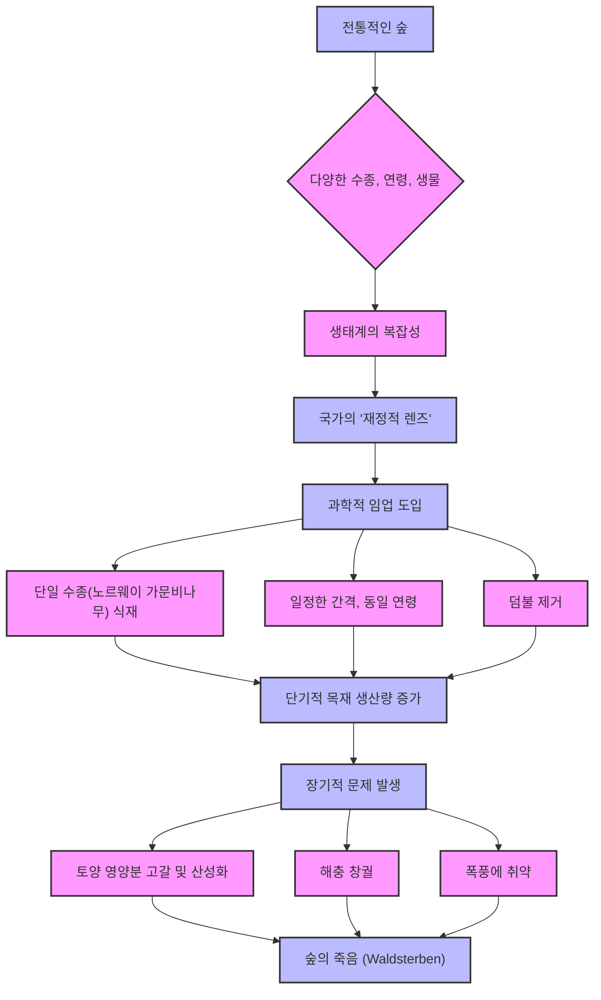
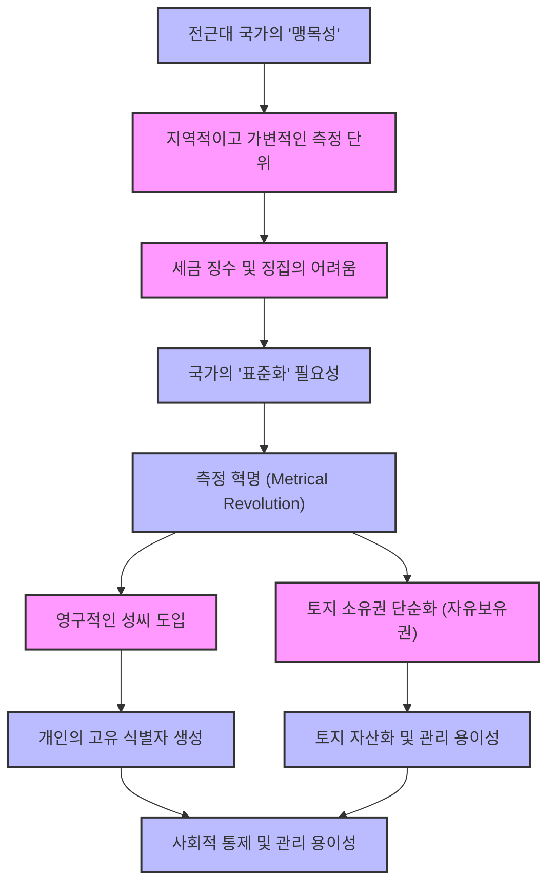
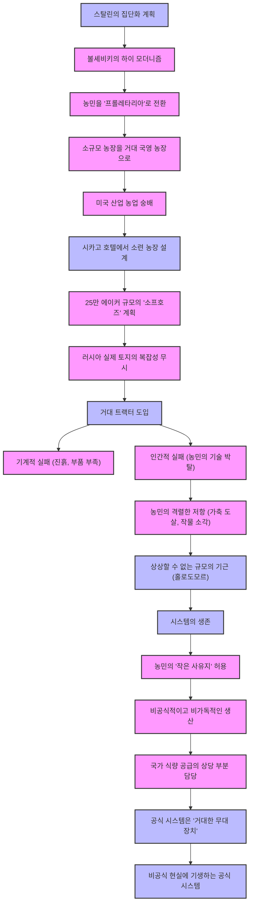
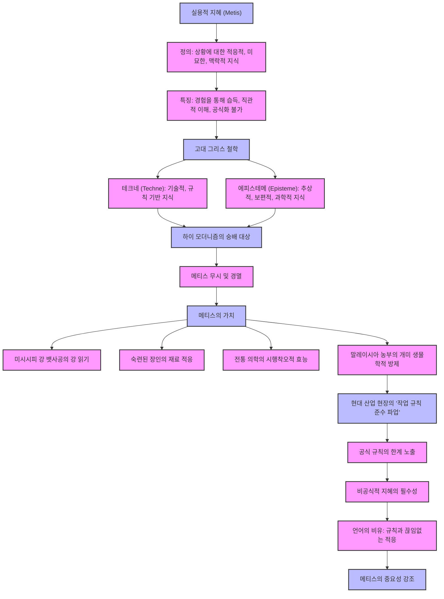

## 제임스 C. 스콧의 '국가처럼 보기': 왜 거대한 계획은 실패하는가?
이 책은 정부나 대규모 조직이 사회를 단순화하고 통제하려는 시도가 왜 종종 재앙으로 이어지는지 탐구한다. 저자는 복잡한 현실을 무시하고 위에서 아래로 계획을 강요할 때 발생하는 문제점들을 역사적 사례를 통해 보여주며, 지역의 실용적인 지식의 중요성을 강조한다.

## 1. '국가처럼 보기'의 핵심 개념: 가독성 (Legibility) 

국가가 사회를 '읽을 수 있게' 만드는 과정은 마치 거대한 창고를 정리하는 것과 같다고 보면 된다. 물건들이 뒤죽박죽 섞여 있으면 무엇이 어디에 있는지 알 수 없듯이, 국가는 복잡한 사회를 이해하고 통제하기 위해 모든 것을 명확하게 정리하고 분류하려고 한다.

1. **가독성의 의미**:
  1. 국가나 대규모 조직이 복잡하고 혼란스러운 세상을 이해하고 통제하기 쉽게 만드는 과정이다. 
  2. 마치 라벨이 붙지 않은 거대한 창고를 깔끔하게 정리하고 분류하는 것과 같다. 
  3. 이를 통해 국가는 영토와 국민을 파악하고, 측정하고, 관리하고, 조작할 수 있게 된다. 

2. **역사적 배경**:
  1. 과거의 국가는 '부분적으로 눈이 먼' 상태였다. 
  2. 국민의 재산, 토지 소유 현황, 수확량, 심지어 거주지나 신분(성씨)에 대한 정보가 거의 없었다. 
  3. 이러한 정보 부족으로 인해 세금 징수, 군대 징집 등 기본적인 국가 기능조차 제대로 수행하기 어려웠다. 
  4. 다양하고 복잡한 지역 지식을 표준화된 형식으로 전환할 수단이 없었기 때문에, 국가의 개입은 종종 '어설프고 자멸적'이었다. 

## 2. 가독성을 추동하는 '하이 모더니즘' 

하이 모더니즘은 마치 '과학 만능주의'와 같다고 보면 된다. 과학과 기술의 힘으로 자연과 사회를 완벽하게 이해하고, 더 나아가 완전히 재설계할 수 있다고 믿는 강력한 신념이다.

1. **하이 모더니즘의 정의**:
  1. 과학과 기술의 진보에 대한 강력하고 거의 유토피아적인 믿음이다. 
  2. 충분한 과학적 지식, 합리적인 계획, 적절한 기술 도구만 있다면 인류가 자연과 사회를 더 나은 방향으로 완전히 재편할 수 있다고 확신한다. 
  3. 과거의 지식이나 전통은 '쓰레기'나 '비효율'로 치부하고, 자격 있는 전문가들이 주도하는 합리적인 설계가 모든 인간 문제를 해결할 수 있다고 믿는다. 

2. **하이 모더니즘의 특징**:
  1. **시각적 미학**: 직선, 기하학적 형태(격자, 원, 사각형), 시각적 질서, 그리고 '분리'를 숭배한다. 
  2. **기능과 형태의 혼동**: 시각적인 질서가 곧 기능적인 질서라고 착각한다. 
  - 예시: 완벽한 대형으로 행진하는 군대는 시각적으로 질서 정연해 보이지만, 밀림에서의 게릴라전에는 전혀 쓸모가 없다. 
  - 예시: 구불구불하고 복잡한 중세 거리는 혼란스러워 보이지만, 상업과 공동체, 안전을 위한 매우 효율적이고 탄력적인 시스템일 수 있다. 
  3. **전문가 중심**: 과학적 전문성을 가진 사람들이 유일하게 자격 있는 의사결정자라고 여긴다. 
  4. **정치적 스펙트럼 초월**: 좌파와 우파를 막론하고 국가 권력을 이용해 사회를 유토피아적으로 변화시키려는 야망을 공유한다. 

3. **하이 모더니즘의 위험성**:
  1. 하이 모더니즘 자체는 나쁘지 않다. 민주적인 과정, 공개 토론, 다양한 이해관계자와의 협상 등을 통해 조절될 때는 개혁과 발전을 이끌 수 있다. 
  2. 하지만 이 강력한 이데올로기가 <mark>권위주의적 권력</mark>과 결합될 때 진정한 위험이 발생한다. 
  3. 반대 의견이나 협상의 여지가 거의 없는 상황에서, 사회를 합리적으로 재편하려는 야망은 지상의 미묘한 현실이나 예상치 못한 결과를 무시하고 <mark>위에서 아래로 단일한 비전을 강요하는 명령</mark>이 된다. 
  4. 국가는 인구 조사원이나 측량사가 만든 인위적인 분류 체계를 사람들에게 강요하고, 경찰과 군대를 동원하여 '종이 위의 허구적인 사실'을 현실로 만들 수 있다. 

## 3. '얇은 범주'의 문제점: 복잡한 현실의 단순화 

국가가 세상을 '읽을 수 있게' 만들려고 할 때, 마치 복잡한 그림에서 몇 가지 색깔만 골라 단순하게 그리는 것과 같다고 보면 된다. 이렇게 만들어진 그림은 '얇은 범주'에 속하며, 실제 세상의 대부분의 사실을 의도적으로 무시한다.

1. **'**얇은 범주**'의 의미**:
  1. 국가나 대규모 조직이 세상을 가독성 있게 만들려고 할 때, 현실을 <mark>극도로 단순화한 모델</mark>을 만든다. 
  2. 이 모델은 국가의 <mark>매우 구체적이고 종종 놀랍도록 좁은 목표</mark>와 관련 없는 대부분의 사실을 의도적으로 무시하기 때문에 '얇다'고 표현한다. 

2. **언어와 관점의 변화**:
  1. 국가의 좁은 관심사를 반영하여 사용하는 언어 자체가 바뀐다. 
  2. 자연은 '천연자원'으로, 다양한 식물은 특정 목적에 유용한 '작물'로, 경쟁하는 식물은 '잡초'로 축소된다. 
  3. 복잡한 숲 생태계는 '목재'만 남고, 나머지는 '쓸모없는 나무'나 '덤불'로 치부된다. 
  4. 동물은 '사냥감'이나 '가축'이 되고, 포식자는 '해로운 동물'이 된다. 
  5. 이러한 언어는 단순한 묘사가 아니라, 특정 행정적, 종종 <mark>착취적인 목적</mark>에 봉사하는 재정의이다. 

3. **재앙의 씨앗**:
  1. 이러한 급진적인 단순화는 국가에게는 매우 편리하지만, 종종 재앙의 씨앗이 된다. 
  2. 이는 국가의 깔끔하고 '얇은 범주' 밖에 존재하는 수많은 상호 연결된 변수들을 고려하지 못하기 때문이다. 

## 4. 과학적 임업의 비극: 숲의 죽음 (Waldsterben) 

과학적 임업은 마치 '숲을 공장처럼' 만드는 것과 같다고 보면 된다. 숲의 복잡한 생태계를 무시하고 오직 목재 생산량만을 극대화하려다 결국 숲 전체를 망가뜨린 비극적인 이야기이다.

1. **전통적인 숲의 모습**:
  1. 18세기 후반 프로이센과 작센 지역의 숲은 다양한 수종(참나무, 너도밤나무, 서어나무, 소나무, 자작나무 등)과 다양한 연령의 나무들이 뒤섞여 있었다. 
  2. 죽은 나무와 썩어가는 통나무, 두꺼운 덤불, 덩굴 식물들이 얽혀 있는 '혼란스럽고 활기찬' 생태계였다. 
  3. 이 숲은 생물학적으로뿐만 아니라 사회적으로도 중요한 공간이었다. 지역 농민들은 돼지를 방목하고, 땔감을 모으고, 열매, 버섯, 약초를 채집하는 등 숲을 '식료품 저장고, 약국, 연료 창고'로 활용했다. 

2. **국가의 '**재정적 렌즈**'**:
  1. 국가 입장에서는 이러한 복잡한 숲은 '완전한 악몽'이었다. 
  2. 농민들이 고대의 관습적 권리에 따라 땔감을 가져가는 숲에 어떻게 세금을 부과할 수 있을까? 
  3. 모든 나무가 다른 종, 다른 크기, 다른 연령인 상황에서 목재 수확량을 어떻게 계산할 수 있을까? 
  4. 국가는 이 복잡한 생태계를 '자원'으로만 보았고, 오직 '얼마나 많은 목재가 있고, 얼마나 많은 현금을 벌 수 있는가'라는 재정적 질문에만 관심이 있었다. 

3. **과학적 임업의 도입**:
  1. 국가는 이 문제를 해결하기 위해 1765년에서 1800년 사이에 '과학적 임업'을 개발했다. 
  2. 목표는 숲을 <mark>균일하고 </mark>가독성<mark> 있게</mark> 만들어, 국가 산림 관리인들이 쉽게 세고, 관리하고, 평가할 수 있도록 하는 것이었다. 
  3. **'**표준 나무**'의 발명**: 초기 과학자들은 나무의 목재량을 계산하기 위한 복잡한 수학적 표를 만들었지만, 실제 숲의 나무들은 이 방정식에 맞지 않았다. 
  4. 그들은 수학을 현실에 맞추는 대신, <mark>현실을 수학에 맞추기로 결정</mark>했다. 
  5. **숲의 재설계**:
  - 혼란스러운 기존 숲을 <mark>모두 벌목</mark>했다. 
  - 농민들의 방목이나 땔감 채취를 금지했다. 
  - 단일 수종인 <mark>노르웨이 가문비나무</mark>를 심었다. 
  - 나무들을 <mark>완벽하게 직선의 기하학적 줄</mark>로 심고, 모두 같은 시기에 심어 같은 연령과 크기가 되도록 했다. 
  - 가문비나무가 아닌 모든 덤불과 덩굴을 제거했다. 
  6. 이것은 숲을 '지붕 없는 목재 공장'처럼, <mark>단일 상품 생산 기계</mark>로 만든 것이었다. 

4. **단기적 성공과 장기적 재앙**:
  1. 초기 80년 동안, 목재 수확량은 <mark>놀랍도록 증가</mark>했다. 
  2. 하지만 2세대와 3세대에 이르러 시스템 전체가 붕괴하기 시작했다. 
  3. **'**숲의 죽음** (Waldsterben)'**: 수확량은 급감하고, 나무들은 병들고 성장이 멈췄다. 
  4. **계획자들이 놓친 것**:
  - **생태계의 복잡성**: 덤불과 활엽수를 제거함으로써 해충을 억제하던 새와 곤충의 서식지를 파괴했다. 
  - **토양 영양분 고갈**: 단일 수종인 가문비나무만 심어 토양에 필요한 특정 영양분을 고갈시켰다. 
  - 자연림에서는 다양한 나무의 낙엽이 풍부하고 다양한 부엽토를 만들어 영양분을 보충하지만, 가문비나무 잎은 천천히 분해되어 토양을 산성화시키고 황폐하게 만들었다. 
  - 이것은 더 이상 생명 주기가 아니라 '토양의 비옥도를 채굴하는 작업'이었다. 
  - **취약한 단일 재배**: 단일 재배(모노컬처)는 극도로 취약했다. 
  - 다양한 숲에서는 특정 해충이 참나무를 공격해도 다른 나무들은 살아남아 숲 전체는 유지되지만, 단일 수종 숲에서는 해충이 창궐하면 모든 나무가 죽는다. 
  - **바람에 대한 취약성**: 실제 숲에서는 고르지 않은 캐노피가 바람을 막아주지만, 과학적 숲에서는 바람이 완벽한 직선의 줄을 따라 터널처럼 불어와 전체 구역을 쓰러뜨렸다. 
  5. 결과적으로, 숲을 단순화하여 관리하고 통제하려던 시도는 숲의 <mark>자체 면역 체계를 파괴</mark>하고, 생물학적으로 죽은 존재로 만들었다. 

## 5. 사회적 패턴의 표준화: 인간을 '읽을 수 있게' 만들기 

국가가 사람들을 '읽을 수 있게' 만드는 과정은 마치 복잡한 벌집을 현대적인 벌통으로 바꾸는 것과 같다고 보면 된다. 벌집을 부수지 않고도 꿀을 쉽게 얻을 수 있도록, 국가는 사회를 표준화하여 지속적으로 감시하고 자원을 추출하려 한다.

1. **전근대 국가의 '맹목성'**:
  1. 1400년대 프랑스의 왕은 자신의 영토를 다스린다고 주장했지만, 실제로는 왕국에 누가 사는지, 몇 명인지, 무엇을 하는지, 심지어 마을의 경계나 사람들이 무엇을 소유하는지 정확히 알지 못했다. 
  2. 모든 지식과 관습이 <mark>극도로 지역적이고 고집스럽게 지역적</mark>이었다. 

2. **지역적 측정 단위의 복잡성**:
  1. 과거의 측정 단위는 '인간 규모'였고, 특정 작업과 장소에 묶여 있었다. 
  2. **토지 측정**: 추상적인 에이커나 헥타르 대신 '아침'이라는 단위로 측정했다. 
  - '아침'은 한 남자가 한 쌍의 소로 한 번의 아침에 갈 수 있는 땅의 양을 의미하며, 이는 남자의 힘, 소의 능력, 토양의 종류, 경사 등에 따라 크게 달라졌다. 
  - 이는 추상적인 기하학이 아닌 <mark>실용적인 현실에 뿌리내린 측정</mark>이었다. 
  3. **곡물 측정**: '수레 한 짐'으로 측정했지만, 마을마다 수레의 크기가 달라 실제 양은 천차만별이었다. 
  4. 이러한 지역적이고 유동적인 시스템은 중앙집권적인 세금 징수를 거의 불가능하게 만들었다. 

3. **국가의 표준화 욕구**:
  1. 국가는 이러한 '혼란'에 질려 모든 것을 표준화하고 균일한 격자를 부과해야 했다. 
  2. **벌집 비유**:
  - 전근대 국가의 통치는 꿀(세금)을 얻기 위해 벌집을 파괴하는 구식 양봉과 같았다. 
  - 현대 국가는 벌통을 파괴하지 않고도 여왕벌과 꿀 생산 구역을 분리하고, 쉽게 검사하고 꿀을 추출할 수 있는 현대식 벌통과 같다. 
  - 현대 국가는 사회 전체를 깔끔하고 가독성 있는 '하얀 상자'로 만들고 싶어 했다. 

4. **저항과 생존 전략**:
  1. 사람들은 벌보다 영리해서 감시와 추출을 위해 상자에 갇히는 것을 좋아하지 않았다. 
  2. 대부분의 역사에서 '읽을 수 없는 상태', 즉 <mark>복잡하고 세기 어렵고 찾기 어려운 상태</mark>는 평범한 사람들의 생존 전략이자 강력한 형태의 <mark>수동적 저항</mark>이었다. 

5. **측정 혁명 (**Metrical Revolution**)**:
  1. 국가는 사회를 표준화하기 위해 '측정 혁명'을 단행했다. 
  2. **영구적인 성씨 도입**:
  - 대부분의 사람들은 고정된 성씨를 가지지 않았다. 아버지의 이름, 직업, 출신지에 따라 이름이 바뀌었다. 
  - 국가는 효율적인 세금 징수, 정확한 재산 추적, 군대 징집, 심지어 질병 추적과 같은 공중 보건 조치를 위해 성씨가 필수적이라고 판단했다. 
  - 나폴레옹은 1808년 유대인들에게 성씨를 의무화하는 법령을 발표했고, 이는 행정적 표준화와 시민권을 연결하는 것이었다. 
  - 초기 성씨 중 상당수는 서류상으로만 존재하던 '행정적 허구'였지만, 국가의 힘이 커지면서 20세기에는 대부분의 사람들이 국가가 부여한 성씨를 갖게 되었다. 
  - 이는 개인의 신원이 국가의 시선 안에서 어떻게 식별되고 분류되는지에 대한 거대한 변화를 의미했다. 
  3. **토지 소유권의 **단순화:
  - 전통적인 마을에서 토지 권리는 복잡하게 얽혀 있었다. 
  - 예시: 특정 밭에 밀을 심을 권리가 있지만, 수확 후에는 다른 사람이 양을 방목할 권리가 있고, 또 다른 사람은 밭 가장자리에서 땔감을 모을 권리가 있었다. 
  - 이러한 중첩되고 공유된 계절적 권리는 재산 증서에 기록하기 불가능했다. 
  - 국가는 이를 급진적으로 단순화하여 <mark>자유보유권 (</mark>Freehold property<mark>)</mark>을 발명했다. 
  - 측량사를 보내 지도에 선을 긋고, 특정인이 이 직사각형의 땅을 '모든 권리'를 가지고 '항상' 소유한다고 선언했다. 
  - 이것은 다른 모든 복잡한 공동체적 권리를 소멸시키고, 단순한 과세 가능하고 담보 가능한 자산, 즉 '격자'를 만들기 위해 '사회적 숲'을 파괴하는 것이었다. 

6. **지도는 영토가 아니다**:
  1. 가독성은 국가 통치의 핵심 문제이다. 통치하기 위해서는 단순화해야 하고, 영토의 지도를 만들어야 한다. 
  2. 하지만 <mark>지도는 영토가 아니다</mark>. 
  3. 국가의 지도는 국가가 중요하게 여기는 것만을 기록하는 '관심 있는 허구'이다. 
  4. 지도는 토지의 질, 신성한 숲, 이웃 간의 오랜 불화 등을 보여주지 않는다. 
  5. 지도는 <mark>삶의 모든 현실</mark>을 생략한다. 
  6. 진정한 위험은 국가가 <mark>영토를 지도처럼 보이도록 강요할 만큼 강력해질 때</mark> 발생한다. 
  7. 지도가 더 깔끔하고, 정돈되어 있고, 관리하기 쉽고, 합리적이기 때문이다. 

## 6. 도시 계획의 실패: 르 코르뷔지에와 브라질리아 

도시 계획의 실패는 마치 '도시를 조각품처럼' 만드는 것과 같다고 보면 된다. 르 코르뷔지에와 같은 하이 모더니즘 건축가들은 도시를 위에서 내려다보는 완벽한 그림처럼 설계했지만, 실제 사람들이 살아가는 복잡하고 활기찬 삶의 공간을 파괴했다.

1. **르 코르뷔지에의 '**빛나는 도시**'**:
  1. 르 코르뷔지에는 하이 모더니즘의 '대사제'이자 이 사고방식의 순수한 형태를 보여주는 인물이다. 
  2. 그는 1920년대 파리 도시 계획에서 파리의 역사적인 중심부를 <mark>불도저로 밀어버리고</mark> 싶어 했다. 
  3. 그의 '부아쟁 계획'은 파리 중심부의 거대한 부분을 허물고, 18개의 거대하고 동일한 60층짜리 십자형 타워를 광활한 공원에 배치하며, 거대한 다차선 고속도로로 연결하는 것이었다. 
  4. 그는 이를 '빛나는 도시 (Radiant City)'라고 불렀다. 
  5. **거리의 죽음**: 르 코르뷔지에는 거리를 '혼돈과 비효율의 원천'으로 보았고, "우리는 거리를 죽여야 한다"고 직접적으로 말했다. 
  6. 그의 비전은 기능의 엄격한 분리에 기반했다. 사람들은 타워에서 살고, 공장에서 일하며, 상업 지구에서 쇼핑하고, 이 모든 구역을 자동차 전용 도로로 이동하는 식이었다. 
  7. 이는 공공 공간의 죽음, 즉 <mark>사회적 교류와 우연한 만남의 부재</mark>를 의미했다. 

2. **제인 제이콥스의 비판**:
  1. 제인 제이콥스는 르 코르뷔지에의 하이 모더니즘적 비전을 날카롭게 비판한 인물이다. 
  2. 그녀는 도시의 안전, 활력, 영혼이 거대한 개방 공간이나 경찰 감시탑에서 오는 것이 아니라, '거리의 눈'에서 온다고 주장했다. 
  3. 상점 주인, 현관에 앉아있는 사람들, 길거리에서 노는 아이들, 창문에서 수다 떠는 이웃들 등 <mark>복잡하고 밀집된 혼합 용도 지역</mark>에서 끊임없이 발생하는 비공식적인 감시와 공공 안전을 강조했다. 
  4. 르 코르뷔지에의 계획은 사람들을 고립된 타워에 가두고 텅 빈 공원으로 둘러쌈으로써 <mark>공동체와 안전의 기반 자체를 파괴</mark>했다. 

3. **브라질리아의 비극**:
  1. 브라질리아는 르 코르뷔지에의 하이 모더니즘 꿈이 실제로 건설된 곳이다. 
  2. 1950년대 브라질 내륙의 아무것도 없는 곳에 '백지 상태'에서 건설되어, 계획자들이 기존 도시 조직의 제약 없이 비전을 완전히 구현할 수 있었다. 
  3. **시각적 아름다움**: 비행기에서 보면 새나 비행기 모양으로 배치된 거대한 기념비적인 축과 현대적인 건물들이 시각적으로 놀랍다. 
  4. **사회적 악몽**: 하지만 브라질리아는 '사회적 악몽'으로 악명 높다. 
  - 친구와 우연히 마주칠 수 있는 길모퉁이가 없다. 
  - 주거 블록은 상업 중심지에서 고립되어 있고, 거리가 너무 멀어 걸어 다닐 수 없다. 
  - 사람들은 자동차나 아파트 건물에 갇혀 지낸다. 
  - 계획자들은 도시가 위에서 내려다보는 조각품이 아니라, <mark>땅 위에서 살아가는 유기체</mark>라는 사실을 잊었다. 
  - 그들은 시민들의 일상생활을 완전히 희생시키고, 계획자의 미학적 욕구를 충족시켰다. 

## 7. 재앙의 공식: 네 가지 요소의 결합 

스콧은 대규모 재앙이 발생하려면 마치 화학 반응처럼 네 가지 특정 요소가 모두 결합되어야 한다고 말한다. 이 네 가지 요소가 함께 작용할 때, 사회 시스템은 붕괴하고 비극적인 결과를 낳는다.

1. **요소 1: 자연과 사회의 행정적 질서화**:
  1. 이것은 국가의 '도구 상자'이다. 
  2. 복잡한 현실을 가독성 있게 만들기 위해 단순화된 지도, 인구 조사, 재산 기록 등을 만들 수 있는 능력이다. 

2. **요소 2: **하이 모더니즘 이데올로기:
  1. 이것은 '오만함'이다. 
  2. 국가의 도구를 사용하여 세상을 처음부터 재설계해야 할 뿐만 아니라, 그렇게 할 수 있다고 믿는 확고한 자신감이다. 
  3. 자신의 과학적 계획이 어떤 형태의 지역 전통 지식보다 본질적으로 우월하다고 믿는 것이다. 

3. **요소 3: 권위주의 국가**:
  1. 이것은 '엔진'이자 '강제력'이다. 
  2. 자신들의 거대한 계획을 원치 않을 수도 있는 인구에게 강요할 수 있는 힘을 가진 국가가 필요하다. 
  3. 민주주의 국가에서는 정부가 고속도로를 건설하기 위해 이웃을 철거하려 하면 사람들이 시위하고, 조직하고, 소송을 걸고, 투표로 정부를 끌어내릴 수 있다. 
  4. 하지만 권위주의 국가에서는 계획자가 경찰과 군대를 마음대로 동원하여 "좋든 싫든, 더 큰 선을 위해 이주해야 한다"고 말할 수 있다. 

4. **요소 4: 무력화된 **시민 사회:
  1. 이것은 '권력 공백'을 만든다. 
  2. 주로 세계 대전, 혁명, 식민주의와 같은 큰 격변 이후에 발생한다. 
  3. 인구는 지쳐 있고, 무질서하며, 전통적인 사회 구조가 무너져 있다. 
  4. 종종 공포에 질려 있거나 절박한 상태여서 국가의 거대한 계획에 저항할 능력이 없다. 

5. **완벽한 폭풍**:
  1. 이 네 가지 요소(가독성 도구, 하이 모더니즘 이데올로기, 압도적인 권위주의적 권력, 약화된 사회)가 결합될 때 '완벽한 폭풍'이 발생한다. 
  2. 이것이 바로 <mark>국가 주도 재앙의 레시피</mark>이다. 

## 8. 소련 집단화의 비극: 거대한 실패와 숨겨진 생존 

소련의 집단화는 마치 '농장을 거대한 공장처럼' 만들려던 시도와 같다고 보면 된다. 농민들의 지식과 자율성을 빼앗고 위에서 내려온 계획을 강요하다가 대규모 기근을 초래했지만, 결국 농민들의 '작은 텃밭'이라는 비공식적인 시스템 덕분에 겨우 살아남았다.

1. **스탈린의 **집단화** 계획**:
  1. 1920년대 후반에서 1930년대 초반, 스탈린은 러시아 농업을 <mark>완전히 폭력적으로 변혁</mark>하려는 계획을 세웠다. 
  2. 볼셰비키는 <mark>하이 모더니즘의 핵심</mark>이었다. 그들은 러시아 농민들의 작은 가족 농장과 고대 농업 방식에서 자신들이 경멸하는 모든 것(낙후성, 비효율성, 미신)을 보았다. 
  3. 그들은 농민을 '프롤레타리아', 즉 <mark>땅 위의 규율 잡힌 공장 노동자</mark>로 만들고 싶어 했다. 
  4. 수백만 개의 작은 농장을 거대한 국영 곡물 공장으로 바꾸려 했다. 

2. **시카고 호텔에서의 농장 설계**:
  1. 볼셰비키는 미국 산업 농업에 완전히 매료되어 있었다. 그들은 포드와 캐터필러 트랙터를 숭배했고, 미국이 대규모 경제를 달성하는 비결을 알아냈다고 믿었다. 
  2. 1928년 시카고의 한 호텔 방에서 소련 계획자들은 미국 농업 엔지니어들과 함께 <mark>25만 에이커 규모의 거대한 소련 농장 (소프호즈)</mark>을 종이 위에 설계했다. 
  3. 호텔 방의 지도는 완벽한 기하학적 격자를 기다리는 '텅 비고 평평한 표면'이었다. 
  4. 하지만 러시아의 실제 땅은 협곡, 늪, 개울, 다양한 토양 유형으로 가득했지만, 지도는 이러한 현실을 전혀 보여주지 않았다. 
  5. 지도는 가독성 있었지만, <mark>땅은 그렇지 않았다</mark>. 

3. **현실에서의 실패**:
  1. 거대한 트랙터는 토양에 너무 무거워 진흙에 빠졌다. 
  2. 트랙터가 고장 나면 수백 마일 떨어진 중앙 수리 센터 때문에 예비 부품이나 정비사가 없었다. 
  3. 가장 큰 실패는 <mark>인간적인 실패</mark>였다. 계획은 농민들의 모든 자율성과 지식을 체계적으로 박탈했다. 
  4. 농민들은 수 세대에 걸친 '메티스 (metis, 실용적 지혜)'를 가지고 있었다. 특정 밭은 모래가 많아 호밀이 필요하고, 저 밭은 점토여서 밀이 더 좋다는 것을 알았다. 
  5. 하지만 중앙 사무실에서 "이날 이 밭을 갈고, 이 깊이로 이 씨앗을 심어라"는 지시를 받았다. 
  6. 이는 지능적이고 적응력 있는 농민들을 작동하지 않는 기계의 '생각 없는 톱니바퀴'로 만들었다. 

4. **농민들의 저항과 대기근**:
  1. 농민들은 집단 농장에 가축을 넘겨주기보다 <mark>자신들의 가축을 도살</mark>했다. 
  2. 작물을 불태웠다. 
  3. 이는 국가의 추상적인 격자와 사람들의 생존 투쟁 사이의 <mark>잔혹한 내전</mark>이었다. 
  4. 결과는 <mark>상상할 수 없는 규모의 기근</mark>이었다. 우크라이나의 홀로도모르에서 수백만 명이 굶어 죽었다. 

5. **시스템의 생존과 숨겨진 진실**:
  1. 놀랍게도 이 거대한 실패에도 불구하고 시스템 전체는 살아남았다. 
  2. 소련 국가는 사유 재산을 공개적으로 비난하면서도, 농민들이 <mark>집 뒤에 작은 사유지 (텃밭)</mark>를 가꾸는 것을 조용히 허용했다. 
  3. 이 작은 텃밭은 전체 농업 토지의 3% 미만이었지만, 소련 연방의 육류와 우유의 약 40%, 감자와 채소의 절반 이상을 생산했다. 
  4. 거대한 하이 모더니즘의 꿈, 즉 곡물 공장은 사실상 <mark>거대한 무대 장치</mark>에 불과했다. 
  5. 그들은 현대적으로 보였고, 트랙터와 5개년 계획, 인상적인 통계가 있었지만, 실제로는 <mark>낙후된 농민들이 전통적인 소규모 방식으로</mark> 자신들의 뒷마당에서 나라를 먹여 살리고 있었다. 
  6. 공식적이고 가독성 있는 계획은 비공식적이고 읽을 수 없는 현실의 에너지에 <mark>기생하는 존재</mark>였다. 

## 9. 탄자니아 강제 이주: 선의의 재앙 

```mermaid
graph TD
    A["탄자니아 독립 후 개발 목표"] --> B["줄리어스 니에레레 대통령의 선의"]
    B --> C["농촌 인구의 분산 문제 인식"]
    C --> D["서비스 제공 및 현대화의 어려움"]
    D --> E["강제 이주 (Villagization) 정책 도입"]
    E --> F["500만 명 강제 이주 (1973-1976)"]
    F --> G["하이 모더니즘적 마을 설계"]
    G --> H["주요 도로 근처 위치 선정"]
    H --> I["토양 비옥도, 물 공급 등 지역 지식 무시"]
    I --> J["집단 농장 (단일 작물, 직선 재배)"]
    J --> K["전통적인 혼합 작물 재배 (Polycropping) 금지"]
    K --> L["식량 생산량 급감"]
    L --> M["기근 및 국제 식량 원조 의존"]
    M --> N["국가의 실패 인정 거부"]
    N --> O["모델 마을 (Model Village) 집중 투자"]
    O --> P["외국 원조 관계자 및 언론에 과시"]
    P --> Q["근본적인 설계 결함 은폐"]
    Q --> R["농민들의 비공식적 생존 전략 (옛 땅으로 회귀, 비밀 밭 경작)"]
    R --> S["비공식 현실에 기생하는 공식 계획"]
    style A fill:#bbf,stroke:#333,stroke-width:2px
    style B fill:#f9f,stroke:#333,stroke-width:2px
    style C fill:#f9f,stroke:#333,stroke-width:2px
    style D fill:#f9f,stroke:#333,stroke-width:2px
    style E fill:#bbf,stroke:#333,stroke-width:2px
    style F fill:#f9f,stroke:#333,stroke-width:2px
    style G fill:#f9f,stroke:#333,stroke-width:2px
    style H fill:#f9f,stroke:#333,stroke-width:2px
    style I fill:#f9f,stroke:#333,stroke-width:2px
    style J fill:#f9f,stroke:#333,stroke-width:2px
    style K fill:#f9f,stroke:#333,stroke-width:2px
    style L fill:#bbf,stroke:#333,stroke-width:2px
    style M fill:#f9f,stroke:#333,stroke-width:2px
    style N fill:#bbf,stroke:#333,stroke-width:2px
    style O fill:#f9f,stroke:#333,stroke-width:2px
    style P fill:#f9f,stroke:#333,stroke-width:2px
    style Q fill:#f9f,stroke:#333,stroke-width:2px
    style R fill:#bbf,stroke:#333,stroke-width:2px
    style S fill:#bbf,stroke:#333,stroke-width:2px
```

탄자니아의 강제 이주는 마치 '좋은 의도를 가진 부모가 아이의 모든 것을 통제하려다 망치는 것'과 같다고 보면 된다. 국가 지도자가 국민을 돕고 싶었지만, 지역의 복잡한 현실을 무시하고 위에서 내려온 계획을 강요하다가 결국 더 큰 고통을 안겨주었다.

1. 줄리어스 니에레레** 대통령의 선의**:
  1. 탄자니아의 줄리어스 니에레레 대통령은 스탈린과 같은 괴물이 아니었다. 
  2. 그는 존경받는 지식인이자 반식민주의 지도자, 철학자, 교사였으며, 진심으로 자신의 나라를 발전시키고 국민을 빈곤에서 벗어나게 하고 싶어 했다. 
  3. 하지만 그 역시 하이 모더니즘의 함정에 빠졌다. 

2. **강제 이주 (**Villagization**) 정책**:
  1. 니에레레는 자신의 나라를 보면서 국가가 항상 보는 문제, 즉 '가독성 부족'을 보았다. 
  2. 대부분의 농촌 인구가 광활한 지역에 흩어져 살고 있었기 때문에, 효과적으로 돕고, 학교를 짓고, 깨끗한 물을 공급하기 어렵다고 생각했다. 
  3. 현대화하고 서비스를 제공하려면 사람들을 '적절한 마을'로 모아야 한다고 주장했다. 
  4. 그는 '계획된 마을 작전 (Operation Planned Villages)'이라는 대규모 프로그램을 시작했다. 
  5. 1973년에서 1976년 사이에 정부는 군대와 당 관료를 동원하여 <mark>약 500만 명의 사람들을 강제로 이주시켰다</mark>. 

3. **맹목적인 계획과 지역 지식의 무시**:
  1. 이 계획은 너무나 급하게 진행되었고, 하이 모더니즘적 미학에 의해 추진되었기 때문에 거의 <mark>완전히 맹목적으로</mark> 이루어졌다. 
  2. 계획자들은 수도의 사무실에 앉아 지도를 보며 수천 개의 새로운 마을 위치를 선정했다. 
  3. 그들은 토양 비옥도나 지역 지식을 기반으로 위치를 선택하지 않았다. 
  4. 대신 <mark>지도에서 </mark>가독성<mark> 있는 곳</mark>을 선택했다. 주로 주요 도로 근처였다. 
  - 행정가에게 도로는 마을을 검사하고, 물품을 전달하고, 작물을 수집하는 '생명선'이었기 때문이다. 
  5. 하지만 도로 바로 옆 땅은 종종 늪지대이거나 바위투성이거나 안정적인 수원지가 없었다. 
  6. 지도는 이러한 지역 지식을 무시했고, 수백만 명의 사람들을 그곳으로 이주시켰다. 

4. **마을의 배치와 농업 방식**:
  1. 마을 자체의 배치도 유기적이지 않았다. 
  2. <mark>격자형</mark>으로, 집들이 도로를 따라 완벽한 직선으로 배치되었다. 
  3. 니에레레와 그의 계획자들은 직선이 현대적이고 과학적이라고 진심으로 믿었다. 
  4. 그들은 전통적인 아프리카의 '혼합 작물 재배 (polycropping)' 방식을 지저분하고 원시적이라고 보았다. 
  - 혼합 작물 재배는 옥수수, 콩, 호박 등을 같은 밭에 함께 심는 것으로, 식물들이 서로를 지탱하고, 토양의 수분을 유지하며, 해충을 혼란시키는 <mark>매우 정교한 생태학적 전략</mark>이었다. 
  - 이는 수 세기에 걸쳐 축적된 <mark>고도로 적응된 실용적 지식 (</mark>metis<mark>)</mark>이었다. 
  5. 하지만 국가 관료들은 농민들에게 깔끔한 단일 작물 줄로 심도록 강요했다. 
  6. 단일 작물 줄은 세기 쉽고 감독하기 쉬웠기 때문이다. 즉, 가독성이 있었다. 

5. **계획의 실패와 국가의 반응**:
  1. 프로이센 숲과 소련 집단 농장처럼, 이 시스템도 <mark>재앙적으로 실패</mark>했다. 
  2. 식량 생산이 급감했고, 식량 수출국이었던 탄자니아는 기근을 막기 위해 국제 식량 원조에 의존하게 되었다. 
  3. 국가는 이 실패에 대해 "우리의 근본적인 가정이 틀렸을지도 모른다"고 말하지 않았다. 
  4. 대신 '완벽의 소형화'로 후퇴했다. 
  5. 한두 개의 마을을 선정하여 <mark>막대한 자원을 쏟아부어 완벽하게 작동하도록 만들었다</mark>. 
  6. 외국 원조 관계자들과 국제 언론인들을 데려와 빛나는 '모델 마을'을 보여주었다. 
  7. 이것은 <mark>끔찍한 망상의 피드백 루프</mark>를 만들었다. 
  8. 수도의 엘리트들은 모델 마을을 보고 "봐라, 우리 계획은 훌륭하다. 작동한다. 다른 마을들이 실패하는 이유는 농민들이 게으르거나 저항적이거나 멍청하기 때문일 것이다"라고 생각했다. 
  9. 이는 시스템이 <mark>자신의 근본적인 설계 결함을 보지 못하게</mark> 만들었다. 

6. **농민들의 생존 전략**:
  1. 한편, 실제 마을의 사람들은 조용히 '발로 투표'했다. 
  2. 그들은 옛 땅으로 돌아가거나, 공식적인 마을 격자에서 멀리 떨어진 곳에 <mark>비밀스러운 비공식 밭</mark>을 가꾸며 생존했다. 
  3. 다시 한번, 비공식적이고 읽을 수 없는 세상이 공식적이고 가독성 있는 계획의 실패로부터 사람들을 구했다. 

## 10. 실용적 지혜 (Metis): 숨겨진 영웅 

메티스 (Metis)는 마치 '길거리에서 배우는 지혜'와 같다고 보면 된다. 책에서 배울 수 있는 딱딱한 규칙이나 추상적인 과학 지식이 아니라, 끊임없이 변하는 상황에 맞춰 유연하게 대처하고 문제를 해결하는 실용적인 능력이다.

1. 메티스** (Metis)의 정의**:
  1. 고대 그리스어에서 유래한 단어로, '교활한 지능'으로 번역되기도 하지만, 그보다 더 깊은 의미를 담고 있다. 
  2. 끊임없이 변화하는 자연 및 인간 환경에 효과적으로 대응하는 데 필수적인 <mark>다양한 실용적 기술과 습득된 지능</mark>을 포괄하는 개념이다. 
  3. 추상적인 보편적 규칙이나 엄격한 계획이 아니라, <mark>적응적이고 미묘하며 강렬하게 맥락적인 지식</mark>이다. 
  4. '길거리에서 배우는 지혜'와 같다. 
  5. 순수한 천재성과 책에서 배울 수 있는 지식 사이의 지혜이며, 주로 <mark>연습을 통해 습득되는 경험과 직관적인 이해</mark>를 포함한다. 
  6. 완전히 글로 쓰거나 공식적인 교육을 통해 쉽게 전달할 수 없다. 

2. **고대 그리스 철학의 지식 분류**:
  1. 스콧은 메티스를 다른 두 가지 그리스어 지식 개념과 대조한다. 
  2. 테크네** (**Techne**)**: 기술적이고 규칙 기반의 지식이다. 매뉴얼에 기록할 수 있는 종류의 지식이다. 
  3. 에피스테메** (**Episteme**)**: 추상적이고 보편적인 과학적 지식, 즉 물리학 법칙과 같은 것이다. 
  4. 하이 모더니즘은 에피스테메와 테크네를 숭배하고, 보편적인 해결책을 믿으며, 맥락을 무시한다. 
  5. 하지만 메티스의 핵심은 '상황에 따라 다르다 (it depends)'는 것이다. 
  6. 메티스는 유연성과 즉흥성에 관한 것이며, 하이 모더니즘은 경직되어 있다. 

3. **메티스의 실제 사례**:
  1. **옥수수 심는 시기**: 아메리카 원주민들은 유럽 정착민들에게 "참나무 잎이 다람쥐 귀만 해질 때 옥수수를 심어라"고 조언했다. 
  - 이는 단순히 매력적인 민속이 아니라, 기온과 기후의 연간 변화에 적응할 수 있는 <mark>정교하게 관찰된 지역 지식</mark>이다. 
  - 마지막 서리가 내린 후, 토양이 충분히 따뜻해졌을 때 옥수수를 심도록 보장하는 실용적이고 정확한 '경험 법칙'이었다. 
  2. **미시시피 강 뱃사공**: 마크 트웨인의 미시시피 강 뱃사공들은 단순히 일반적인 강 지식이나 지도를 읽는 것이 아니라, 계절, 수위, 홍수 후 모래톱 변화에 따른 미시시피 강의 특정 구간에 대한 <mark>친밀한 지식</mark>을 가지고 있었다. 
  - 그들은 말 그대로 '물을 읽을 수 있었다'. 
  3. **숙련된 장인**: 직공이 새로운 실에 적응하거나, 도예가가 새로운 점토에 적응하는 것처럼, 숙련된 장인들은 특정 직기, 트랙터, 점토 유형에 대한 <mark>친밀하고 개인적인 지식을 가지고 있다. </mark>
  - 이는 일반적인 원칙을 상상력으로 번역하는 것을 요구하며, 재료나 도구의 변화에도 불구하고 일관된 결과를 만들어낸다. 
  4. **전통 의학**: 키나 나무껍질을 말라리아에 사용하거나, 대황을 괴혈병에 사용한 것처럼, 전통 의학은 생화학적 원리를 과학적으로 이해하기 훨씬 전부터 <mark>시행착오를 통해 실용적인 효능</mark>을 관찰했다. 
  - 수 세대에 걸친 면밀한 관찰과 실용적인 실험을 통해 축적된 이 지식은 놀랍도록 효과적이고 생명을 구하는 것이었다. 
  5. **말레이시아 농부의 망고나무**: 스콧의 현장 연구에서 맷 이사라는 노인 농부는 망고나무에 붉은 개미가 들끓자 화학 살충제 대신 <mark>지역 생태학적 지식</mark>을 활용했다. 
  - 그는 작은 검은 개미가 붉은 개미의 천적이라는 것을 알고, 검은 개미 여왕이 알을 낳기에 이상적인 마른 니파 야자 잎을 전략적으로 배치했다. 
  - 일주일간의 '개미 전쟁' 끝에 검은 개미가 승리했고, 검은 개미는 망고에 관심이 없어 작물을 완전히 구할 수 있었다. 
  - 이것은 고립된 변수를 가진 과학적 실험이 아니라, 특정 생태계 내에서 <mark>예리한 관찰과 전략적 행동에 기반한 복잡하고 적응적인 개입</mark>이었다. 

4. **현대 산업 환경에서의 **메티스:
  1. 겉보기에 비숙련된 공장 작업에서도, 특히 오래된 기계를 다룰 때, 작업자들은 기계의 고유한 불규칙성, 마모, 재료의 미묘한 변화를 보완하는 <mark>개별적인 기술과 깊은 감각</mark>을 개발한다. 
  2. 이러한 수년간의 경험과 직관에서 나오는 실용적인 조정은 생산을 원활하게 유지하는 데 절대적으로 필요하다. 
  3. 작업자들의 메티스가 없으면, 엄격한 하이 모더니즘 공장은 멈춰 설 것이다. 

5. **'작업 규칙 준수 파업 (Work-to-rule strike)'**:
  1. 이것은 메티스가 얼마나 필수적인지 보여주는 가장 강력한 예시이다. 
  2. 파업은 보통 노동자들이 일을 중단하는 것이지만, '작업 규칙 준수 파업'에서는 노동자들이 출근하여 <mark>공식적인 규칙 책에 명시된 대로 정확하게</mark> 일을 한다. 
  3. 모든 안전 규정, 모든 관료적 절차, 모든 서류 작성 요구 사항을 문자 그대로 따른다. 
  4. 결과는 <mark>시스템 전체의 마비</mark>이다. 공장은 생산을 멈추고, 기차는 운행을 중단하며, 병원은 혼란에 빠진다. 
  5. **이유**: 규칙 책, 즉 국가의 공식적이고 가독성 있는 계획은 <mark>작업의 복잡한 현실에 대한 빈약하고 단순화된 지도</mark>이기 때문이다. 
  6. 이는 모든 우발 상황, 예상치 못한 문제, 작업을 실제로 수행하는 데 필요한 <mark>암묵적인 지식</mark>을 포착할 수 없다. 
  7. 공장, 병원, 학교와 같은 모든 복잡한 시스템은 그 안에 있는 인간들이 <mark>끊임없이 메티스를 사용하여 규칙을 어기기 때문에</mark> 기능한다. 
  8. 그들은 특정 상황에서 어떤 안전 규칙을 어겨도 되는지, 특정 기계를 작동시키기 위해 손잡이를 어떻게 흔들어야 하는지, 환자의 생명을 구하기 위해 어떤 관료적 절차를 건너뛰어야 하는지 안다. 
  9. 결론적으로, 국가의 공식적인 구조는 <mark>노동자들의 비공식적이고 비문자적이며 불법적인 즉흥성</mark>에 전적으로 의존하여 기능한다. 
  10. 공식적인 계획은 비공식적인 메티스에 <mark>기생하는 존재</mark>이다. 

6. **언어의 비유**:
  1. 사회 언어는 문법, 상투어, 공손한 표현 등 '경험 법칙'을 가지고 있지만, 끊임없이 진화한다. 
  2. 새로운 표현, 조합, 말장난, 아이러니가 매일 발명되어 오래된 규칙을 약화시킨다. 
  3. 메티스처럼, 혁신은 어디에서나 오고, 유용하다고 판단되면 유기적으로 채택되고 확산된다. 
  4. 언어는 정적이고 성문화된 시스템이 아니라, <mark>역동적이고 유연하며 적응적</mark>이다. 

## 11. 메티스 경시의 이유: 전문가의 권위와 과학적 방법론 

메티스 (실용적 지혜)가 아무리 강력해도, 공식적인 시스템, 특히 과학적 농업과 국가 계획에 의해 종종 무시되거나 심지어 적극적으로 억압된다. 이는 마치 '전문가들이 자신들의 권위를 지키기 위해' 길거리의 지혜를 인정하지 않는 것과 같다고 보면 된다.

1. **전문가 집단의 편향**:
  1. 농민, 지역 공동체, 원주민 집단의 실용적 지식이 매우 효과적이고 지속 가능한 결과를 낳는다면, 이는 전문가(농업 과학자, 도시 계획가, 개발 엔지니어)와 그들의 기관의 중요성을 <mark>본질적으로 감소</mark>시킨다. 
  2. 공식적인 성문화된 지식을 중심으로 구축된 기관들은 위협을 느낄 수 있다. 
  3. '비과학적인' 지역 주민들이 이미 무엇을 해야 할지 알고 있다면, 왜 전문가를 고용해야 하는가? 

2. **하이 모더니즘의 역사 경멸**:
  1. 하이 모더니즘은 역사와 과거 지식에 대한 <mark>깊은 경멸</mark>을 가지고 있다. 
  2. 하이 모더니즘은 과학, 이성, 거대한 계획을 현대, 즉 <mark>필연적인 진보</mark>와 연결시킨다. 
  3. 원주민이나 전통 지식을 현대주의가 추방할 과거의 유물로 간주한다. 
  4. 과학자나 계획가는 자신들이 미래를 발명하는 것이지, 과거에서 배우는 것이 아니라고 생각한다. 

3. **과학적 방법론과의 비호환성**:
  1. 메티스는 과학적 농업이나 다른 공식 학문 분야에 <mark>본질적으로 부적합한 형태</mark>로 표현되고 성문화된다. 
  2. 과학은 변수를 분리하고, 엄격하게 통제된 실험 환경을 만들어 인과 관계를 명확하게 증명하며, 보편적인 법칙을 추구한다. 
  3. 하지만 메티스는 너무 복잡하고, 가변적이며, 역동적이어서 이러한 종류의 <mark>좁은 실험적 증명</mark>이 불가능한 환경에서 작동한다. 
  4. 과학이 정밀성을 얻기 위해 현실을 단순화하고 변수를 고립시킬 때, 종종 <mark>맹점을 만들고</mark> 현실의 중요한 측면(장기적인 결과, 외부 비용, 복잡하고 예측 불가능한 상호작용)을 놓친다. 
  5. 이러한 단순화는 과학이 극도로 정밀할 수 있는 좁은 영역을 정의하는 데 도움이 되지만, 메티스가 번성하는 광대한 현실 영역을 과학의 이해와 평가 범위 밖에 둔다. 

## 12. 개발 계획 개선을 위한 제안 

개발 계획을 개선하는 것은 마치 '조심스럽게 걷는 여행자'와 같다고 보면 된다. 미래를 예측할 수 없다는 것을 인정하고, 작은 발걸음을 내딛고, 필요하면 되돌아갈 수 있도록 유연하게 계획하며, 사람들의 지혜를 믿어야 한다.

1. **점진적인 단계 수용**:
  1. 모든 개입의 결과를 예측할 수 없다는 것을 인정해야 한다. 
  2. 신중한 접근 방식을 채택하여 <mark>작은 단계</mark>를 밟고, 결과를 관찰한 다음 다음 행동을 계획해야 한다. 
  3. 시스템에 개입할 때 실수를 저지를 수 있다는 것을 인정하고, 점진적으로 접근하여 부정적인 피드백에 주의를 기울여야 한다. 

2. **가역성 (Reversibility) 우선**:
  1. 필요할 경우 <mark>되돌릴 수 있는 행동</mark>을 선택해야 한다. 
  2. 특히 생태계 개입에서 되돌릴 수 없는 행동은 영구적인 결과를 초래한다. 
  3. 수정하는 동안 모든 구성 요소를 유지하는 것이 현명하다. 

3. **예상치 못한 상황 대비**:
  1. 예상치 못한 변화에 <mark>적응할 수 있는 계획</mark>을 선택해야 한다. 
  2. 농업에서는 다양한 작물을 위한 토지를 준비하고, 주택에서는 변화하는 가족 역학에 대한 유연성을 구축하며, 제조업에서는 다용도 위치와 장비를 선택하는 것을 의미한다. 
  3. 이는 '안티프래질 (Antifragile)' 접근 방식과 유사하며, 모든 것을 예측할 수 없으므로 시스템을 스트레스나 문제로부터 성장할 수 있도록 만들어야 한다. 

4. **인간의 독창성 신뢰**:
  1. 미래의 참여자들이 프로젝트를 개선할 통찰력을 가져오거나 개발할 것이라고 가정하고, 잠재적인 기여를 염두에 두고 설계해야 한다. 
  2. 인류는 지난 100년간 인구가 두 배 이상 증가했음에도 불구하고 수많은 문제를 해결하고 빈곤을 근절해왔다. 
  3. 인간은 문제 해결 능력이 있으므로, 돌이킬 수 없는 실수를 저지르지 않는 한, 새로운 해결책을 찾을 수 있다는 믿음을 가져야 한다. 
  4. 사람들이 해결책을 찾아야 하는 상황에 처하면 종종 그렇게 한다. 
  5. 문제는 종종 우리가 <mark>잘못된 문제를 해결하고 있거나</mark>, 문제를 다른 방식으로 정의해야 한다는 것이다. 
  6. 많은 사람들이 이론만 배우고 실제 문제를 경험하지 못하기 때문에 문제를 해결할 위치에 있지 않다. 

