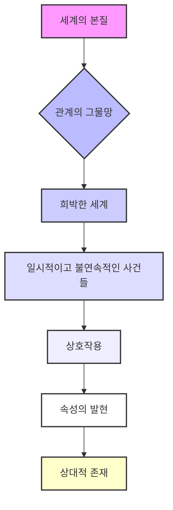
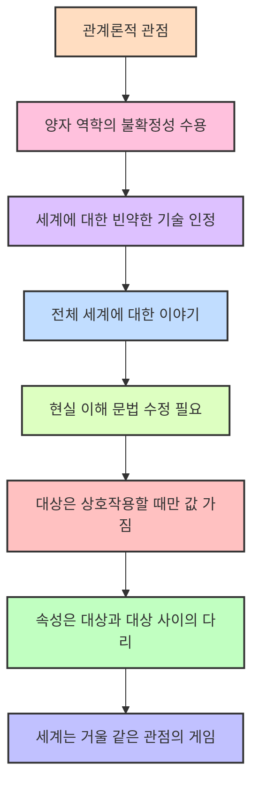

## 책 소개
이 책, '나 없이는 존재하지 않는 세상'은 우리가 세상을 바라보는 방식을 완전히 바꿔줄 거야. 양자 역학이라는 어려운 과학 이론을 통해 세상의 모든 존재가 서로 관계를 맺고 상호작용하며 존재한다는 사실을 알려주는 책이야. 단순히 과학 지식을 전달하는 게 아니라, 철학과 예술을 넘나들며 우리 삶과 세상의 본질에 대해 깊이 생각하게 해주는 책이라고 보면 돼.

## 본문 정리

## 1. 세상은 관계의 그물망으로 이루어져 있어 

우리가 사는 세상은 마치 거미줄처럼 촘촘하게 연결된 관계의 그물망과 같아.

1. **모든 것은 서로 상호작용해**:
  - 이 세상의 모든 존재와 사물은 혼자 고립되어 있는 게 아니라, 서로 영향을 주고받으며 관계를 맺고 있어 .
  - 이 상호작용이 바로 양자 역학에서 말하는 '관찰'의 의미라고 저자는 이야기해 .
  - 예를 들어, 고양이가 시계 소리에 귀를 기울이고, 소년이 던진 돌이 공기를 움직이고 다른 돌에 부딪히는 것처럼 말이야 .
  - 나무가 태양 에너지를 받아 산소를 만들고, 사람들이 그 산소를 마시며 별을 관찰하는 것도 모두 상호작용이야 .
  - 별들도 서로의 중력에 이끌려 움직이는 것처럼, 세상은 끊임없이 상호작용하고 있어 .

2. 상호작용** 없이는 존재도 없어**:
  - 만약 어떤 대상이 아무것도 영향을 주지 않고, 빛도 방출하지 않고, 끌어당기지도 밀어내지도 않고, 만져지지도 냄새도 나지 않는다면, 그건 존재하지 않는 것과 마찬가지야 .
  - 상호작용하지 않는 대상에 대해 이야기하는 건, 설령 그런 게 있다고 해도 우리와는 아무 상관없는 것에 대해 이야기하는 셈이지 .
  - 우리가 '실제'라고 부르는 세상은 바로 이렇게 상호작용하는 존재들의 거대한 네트워크야 .
  - 대상들은 상호작용을 통해 서로에게 자신을 드러내고, 우리도 마찬가지로 이 네트워크의 일부인 거야 .

3. **양자론의 **관계론적 해석:
  - 양자론은 어떤 물리적 대상이 다른 임의의 물리적 대상에게 어떻게 나타나는지를 설명하는 이론이야 .
  - 즉, 사물들이 서로에게 영향을 주고받는 방식을 기술하는 것이지 .
  - 사물의 속성(성질)은 다른 사물과의 상호작용 속에서만 존재한다고 보는 거야 .
  - 이런 관점에서 보면, 양자 역학에서 말하는 '관찰'은 특별한 게 아니야. 두 물리적 대상 사이의 모든 상호작용을 관찰로 볼 수 있어 .
  - 어떤 대상이든 다른 대상의 속성이 자신에게 어떻게 나타나는지를 고려할 때 '관찰자'로 간주할 수 있는 거지 .

## 2. 상호작용 없이는 속성도 없어 

어떤 물건의 성질(속성)은 혼자 있을 때는 정해져 있지 않고, 다른 것과 만났을 때 비로소 나타나는 거야.

1. 보어의** 통찰**:
  - 물리학자 보어는 현상이 일어나는 조건을 알아내기 위해 쓰는 측정 장비와 원자 사이의 상호작용을 원자의 행동과 명확히 분리할 수 없다고 말했어 .
  - 이 이론은 처음에는 원자를 측정하는 실험실에서만 적용된다고 생각했지만, 지금은 우주의 모든 물체에 적용된다는 사실이 밝혀졌어 .
  - 즉, 대상의 속성은 그 속성이 나타날 때의 상호작용과 분리할 수 없고, 그 속성이 나타나는 상대 대상과도 분리할 수 없다는 거야 .
  - 대상의 속성이라는 건, 그 대상이 다른 대상에 작용하는 방식 그 자체라고 보면 돼 .

2. 하이젠베르크의** 급진적인 생각**:
  - 하이젠베르크는 상호작용이 없으면 속성도 없다고 직관적으로 생각했어 .
  - 전자가 어떤 것과도 상호작용하지 않을 때, 전자의 궤도가 무엇인지 묻는 건 의미 없는 질문이라는 거지 .
  - 왜냐하면 전자의 물리적인 속성은 전자가 다른 것(예를 들어, 빛)에 어떻게 영향을 미치는지에 따라 결정되기 때문이야 .
  - 상호작용을 하지 않는 전자에는 아무런 속성도 없어. 위치도 없고 속도도 없는 거야 .
  - 이건 정말 파격적인 생각인데, 모든 것이 다른 것에 작용하는 방식에 대해서만 생각해야 한다는 뜻이야 .

3. **속성은 상대적일 뿐이야**:
  - 이 결론은 더더욱 파격적이야 .
  - 슈뢰딩거의 고양이 실험을 예로 들어볼게. 상자 안에 있는 고양이(당신)는 수면제가 방출되면 잠들고, 아니면 깨어 있어. 고양이에게는 잠들었거나 깨어 있거나 둘 중 하나인 거지 .
  - 하지만 상자 밖에 있는 나에게는 고양이(당신)가 잠든 상태와 깨어 있는 상태가 동시에 중첩되어 있는 것처럼 보일 수 있어. 내가 나중에 상자를 열어보기 전까지는 말이야 .
  - 즉, 당신에게는 실제하는 것이 나에게는 실제하지 않을 수 있다는 거야 .
  - 어떤 대상 A의 속성이 대상 B에 대해서는 실제하더라도, 대상 C에 대해서는 실제하지 않을 수 있다는 거지 .
  - 이걸 요약하면, 대상의 속성은 상호작용하는 순간에만 존재하고, 그 속성이 한 대상과의 관계에서는 실제하지만 다른 대상과의 관계에서는 실제하지 않을 수 있다는 거야 .

## 3. 모든 속성은 관계적이야 

속도처럼 모든 물리적인 성질(속성)은 혼자서 존재하는 게 아니라, 다른 것과의 관계 속에서만 의미를 가져.

1. **속도의 **상대성:
  - 속도는 한 물체가 다른 물체에 대해 갖는 속성이지 .
  - 유람선 위를 걸을 때, 당신은 유람선에 대해서는 특정 속도로, 강물에 대해서는 다른 속도로, 지구에 대해서는 또 다른 속도로 움직이는 거야 .
  - 무언가를 기준점으로 삼지 않은 속도라는 건 존재하지 않아. 속도는 두 대상 사이의 관계인 거지 .
  - 마찬가지로 지구는 둥글기 때문에 '위'와 '아래'도 절대적인 개념이 아니라, 내가 지구상 어디에 있느냐에 따라 달라지는 상대적인 속성인 거야 .
  - 아인슈타인의 상대성 이론도 '동시성'이라는 개념이 관찰자의 운동 상태에 따라 상대적이라는 걸 발견했어 .

2. **양자론의 더 급진적인 발견**:
  - 양자론은 모든 대상의 모든 속성이 속도와 마찬가지로 '관계적'이라는 걸 발견했어 .
  - 물리적 변수(측정값)는 사물 자체를 설명하는 게 아니라, 사물이 서로에게 어떻게 나타나는지를 설명하는 거야 .
  - 상호작용이 일어나고 있지 않을 때는 변수에 값을 부여하는 것이 의미가 없어 .
  - 변수는 어떤 대상과 상호작용하는 동안, 그 대상과 관련해서만 상대적인 값을 갖는 거지 .

3. **희박한 세계**:
  - 세상은 이러한 상호작용의 네트워크로 이루어져 있어 .
  - 물리적 물체가 상호작용할 때 관계가 성립하는 거야. 돌이 다른 돌과 부딪히고, 햇빛이 피부에 닿고, 당신이 이 글을 읽는 것처럼 말이야 .
  - 이렇게 드러나는 세계는 '희박한 세계'라고 할 수 있어 .
  - 이 세계 속에는 확정된 속성을 가진 독립적인 존재가 있는 게 아니라, 다른 것과의 관계 속에서만, 그것도 상호작용할 때만 속성과 특징을 갖는 존재들이 있는 거야 .
  - 돌은 그 자체로 위치가 없고, 충돌하는 다른 돌에 대해서만 위치를 가져 .
  - 하늘은 그 자체로 색깔이 있는 게 아니라, 하늘을 올려다보는 나의 눈에 대해서만 색깔을 갖는 거지 .
  - 하늘의 별도 독립적으로 빛나는 게 아니라, 그 별이 속한 은하계를 이루는 상호작용 네트워크의 한 부분으로 존재해 .

## 4. 세계는 불연속적인 사건들의 그물망이야 

우리가 사는 세상은 마치 베네치아 레이스처럼 섬세하고 연약하게 짜인, 순간적인 사건들로 이루어져 있어.

1. **모든 상호작용은 사건이야**:
  - 양자 세계는 기존 물리학에서 상상했던 것보다 훨씬 무르고, 일시적이고 불연속적인 사건들과 상호작용으로 이루어져 있어 .
  - 마치 베네치아 레이스처럼 정교하고 복잡하면서도 연약하게 짜인 세계라고 보면 돼 .
  - 실제라는 건, 철학에서 말하는 절대적인 속성을 지닌 무거운 물체 같은 게 아니라, 가볍고 덧없는 '사건'들이 엮여 있는 거야 .
  - 전자의 일생은 공간 속에서 하나의 선으로 존재하는 게 아니야. 다른 것과 상호작용할 때 한 번은 여기, 또 한 번은 저기, 이렇게 사건으로 나타나는 점선과 같아 .
  - 이런 사건들은 비약적이고 불연속적이며 확률적이고 상대적이지 .

2. **전자는 실체가 아니라 패턴이야**:
  - 물리학자 세바스찬 이킬에는 전자가 우리가 측정하고 관찰하는 중에 나타나는 특정 유형의 규칙성이라고 말했어 .
  - 전자는 하나의 실체라기보다는 패턴이고 질서에 가깝다는 거지 .
  - 우리가 사물을 계속 쪼개다 보면, 결국 그 조각들은 존재하지 않고 단지 조각들이 배열되는 방식만 있을 뿐이라는 거야 .
  - 배나 도시, 손톱 같은 것들도 결국 '형태'이고, 그 형태가 질서이며, 그 질서를 규정하는 것이 우리라면, 그것들은 우리와 우주에 의해 창조되고 우리와 우주의 관계 속에서만 존재하는 셈이지 .
  - 부처라면 이런 것들을 '공(空)'이라고 불렀을 거야 .

3. **세계는 견고하지 않아**:
  - 일상에서 우리는 이 세계가 견고하고 연속적이라고 생각하지만, 사실은 그렇지 않아 .
  - 견고하다고 느끼는 건 우리가 거시적으로(크게) 보고 있기 때문이야 .
  - 전구는 연속적인 빛을 내는 게 아니라, 수많은 아주 작은 광자들을 내뿜고 있는 거지 .
  - 실제 세계는 작은 규모에서는 연속적이지도 견고하지도 않아. 불연속적인 사건들과 상호작용이 드문드문 흩어져 있을 뿐이야 .

4. **슈뢰딩거의 항복**:
  - 슈뢰딩거는 양자의 불연속성에 맞서 싸웠어. 보어의 양자 도약이나 하이젠베르크의 행렬 세계와도 맹렬히 싸웠지 .
  - 그는 고전 물리학처럼 연속적인 실제의 이미지를 지키려고 했어 .
  - 하지만 수십 년이 지나 결국 슈뢰딩거도 항복하고 패배를 인정했어 .
  - 그는 "입자를 영구적인 실체로 생각하기보다는 순간적인 사건으로 생각하는 편이 더 낫다"고 말했어 .
  - 이 사건들은 마치 영구적인 것처럼 보이지만, 특수한 상황에서 아주 짧은 시간 동안만 그럴 뿐이라는 거지 .

5. **파동은 확률을 계산하는 것**:
  - 그렇다면 파동은 뭘까? 파동은 어떤 사건이 우리와의 관계에서 어디에서 일어날 것인가를 확률로 계산하는 것이라고 보면 돼 .
  - 각각의 대상은 하나의 파동을 가지고 있는 게 아니라, 그 대상과 상호작용하고 있는 다른 모든 물체에 대해 다른 파동을 갖는 거야 .
  - 한 사물과의 관계에서 발생한 사건은 다른 사물과의 관계에서 발생하는 사건의 확률에는 영향을 미치지 않아 .
  - 따라서 파동에 의해 설명되는 양자 상태는 항상 상대적인 상태일 뿐이지 .

## 5. 관계론적 관점: 세계는 다양한 관점의 게임이야 

양자 역학을 이해하려면 우리가 현실을 이해하는 방식을 바꿔야 해. 세상은 하나의 정해진 모습이 아니라, 서로가 서로에게 비춰져야만 존재하는 다양한 관점들의 놀이터 같은 거야.

1. 양자** 역학을 있는 그대로 받아들이기**:
  - '다세계 해석'이나 '숨은 변수 해석' 같은 다른 이론들은 우리가 보는 것 너머에 또 다른 실제를 덧붙여서 양자의 불확정성을 없애려고 해 .
  - 하지만 관계론적 관점에서는 양자 역학이 세계를 '빈약하게' 기술하는 것까지 포함해서 있는 그대로 받아들여 .
  - 큐비즘(양자 역학의 코펜하겐 해석)처럼 불확정성을 인정하지만, 큐비즘이 관찰자(주체)에 대한 정보를 이야기하는 것과 달리, 관계론적 해석은 '전체 세계'에 대해 이야기하는 것이 달라 .

2. **현실 이해의 문법 수정**:
  - 양자론을 제대로 이해하려면 우리가 현실을 이해할 때 쓰는 '문법'을 고쳐야 해 .
  - 마치 옛날 사람들이 '위'와 '아래'라는 개념을 바꿔서 지구가 둥글다는 걸 이해한 것처럼 말이야 .
  - 대상은 상호작용할 때 어떤 값을 갖는 변수에 의해 설명되고, 그 값은 다른 대상이 아니라 '상호작용하는 대상'과의 관계에서 결정돼 .
  - 이탈리아 작가 피란델로의 말처럼, 대상은 '아무도 아닌 동시에 만인 어떤 것'인 셈이지 .

3. **다양한 관점의 세계**:
  - 이렇게 보면 세계는 다양한 관점들의 게임 속에서 산산조각 나고, 하나의 포괄적인 시각은 허용되지 않아 .
  - 세상은 확정된 속성이나 단일한 사실을 가진 실체들의 세계가 아니라, 다양한 관점과 표현이 존재하는 세계인 거야 .
  - 속성이라는 건 대상 안에 있는 게 아니라, 대상과 대상 사이에 놓인 '다리'와 같아 .
  - 대상은 다른 대상과의 관계 속에서만 존재하며, 그 관계의 '다리'가 만나는 지점인 거지 .
  - 이 세계는 마치 거울처럼 서로가 서로에게 비춰져야만 존재하는 관점들의 게임이라고 할 수 있어 .
  - 사물의 미세한 입자들은 변수들이 상대적이고, 미래가 현재에 의해 결정되지 않는 기묘하고 작은 세계를 이루고 있어 .
  - 이 환상적인 양자 세계가 바로 우리가 살고 있는 세계인 거야 .

## 6. 장자와 해시의 대화: 앎의 본질 

고대 중국의 철학자 장자와 해시의 대화는 우리가 무엇을 '안다'는 것이 어떤 의미인지 깊이 생각하게 해줘.

1. **물고기의 즐거움 논쟁**:
  - 장자가 호수 위 물고기를 보며 "저것이 바로 물고기의 즐거움이지"라고 말하자 .
  - 해시는 "자네는 물고기가 아닌데 어떻게 물고기의 즐거움을 아는가?"라고 반문했어 .
  - 장자는 "자네는 내가 아닌데 내가 물고기의 즐거움을 알지 못한다고 어떻게 아는가?"라고 되받아쳤지 .
  - 해시는 다시 "나는 자네가 아니니 당연히 자네가 어떤지 알지 못하지만, 자네는 물고기가 아니니 물고기의 즐거움을 모른다고 추론하기에 충분하다"고 주장했어 .
  - 장자는 마지막으로 "어떻게 물고기의 즐거움을 아는가라고 자네가 물었을 때, 자네는 내가 안다는 것을 알고 있었네. 나는 여기 호수 위에서 알았지"라고 말을 맺었어 .

2. **앎은 자연의 일부**:
  - 이 대화는 '박쥐가 된다는 것은 어떤 느낌일까?'라는 철학적 질문처럼, 주관적인 관점은 외부에서 접근할 수 없다는 문제를 다루고 있어 .
  - 하지만 장자는 해시의 질문 자체가 그가 어떤 생각을 가지고 있음을 전제한다는 점을 지적해 .
  - 장자는 논점의 초점을 '말의 내용'에서 '말 자체'로 옮긴 거야 .
  - 즉, 앎, 마음, 물고기가 느끼는 즐거움 같은 것들은 자연의 바깥에 있는 게 아니라는 거지 .
  - 그것들은 자연의 정상적인 측면이고, 우리가 자연의 복합적인 구조에 부여하는 이름이며, 우리도 그 일부인 거야 .
  - 우리가 그것들에 대해 이야기하고 앎을 얻는 것 역시 자연의 한 측면이야. 앎은 자연 세계의 일부인 거지 .
  - 이것은 주체와 객체를 철저히 구분해서 인식의 문제를 공식화하는 것에 대한 가장 날카로운 반론이라고 할 수 있어 .

## 7. 인류의 미래: 협력과 이성 

우리는 지금 생태계 재앙과 전쟁의 위협에 직면해 있어. 이 위기를 극복하려면 서로 대립하기보다 협력하고 이성적으로 생각해야 해.

1. **다가오는 재앙**:
  - 생태계 재앙이 다가오고 있지만, 우리는 귀찮고 성가시다는 이유로 필요한 일을 하지 않고 있어 .
  - 제3차 세계대전으로 향해 가고 있으며, 이는 우리 삶에 가장 심각한 위협이야 .
  - 국가들은 협력하고 해결책을 찾기보다 서로를 배척하고 도발하며 싸우고 있어 .
  - 다른 나라를 침략하고 전쟁을 부추기며 분쟁을 벌이고 있지 .
  - 국제적 긴장이 이토록 고조된 적은 없었어 .

2. **군사비 지출의 문제**:
  - 우리는 엄청난 금액인 연간 25억 유로(약 3조 7,970억 원)를 군사비로 지출하고 있어. 15년 전보다 두 배 이상 증가한 금액이고 계속 늘고 있지 .
  - 군사비 급증은 전쟁의 시작을 알리는 신호와 같아 .
  - 우리가 가진 자원을 병원, 학교, 음악, 일자리, 좋은 세상을 만드는 일에 쓰는 대신, 무기를 만들고 서로를 죽이는 일에 사용하고 있어 .
  - 이보다 더 어리석은 일이 있을까? 그 이유는 바로 '권력에 대한 갈망' 때문이야 .
  - 세상의 권력자들은 대화하고 해결책을 찾기보다 저마다 최강자가 되기를 원해 .
  - 모두가 평화를 말하지만, 많은 사람이 '먼저 이겨야 한다'는 말을 덧붙여. 승리한 후에 평화를 원한다는 뜻이지 .

3. **핵 재앙의 위협**:
  - 수만 개의 핵폭탄이 모든 사람의 머리 위에서 폭발할 준비가 되어 있고, 지금처럼 핵 재앙이 가까운 적은 없었어 .
  - 이건 정말 미친 상황이야 .
  - 누군가 "정치에는 관여하지 말고 너 자신만 생각해라"라고 말할 수도 있지만, 이건 편협한 근시안적인 태도가 되라는 이야기와 같아 .
  - 불만, 이루지 못한 꿈, 푸념, 타인에게 좌우되는 미래에 대한 불안감을 안고 살지 말고, 우리 자신의 미래를 우리 손에 맡겨야 해 .
  - 서로 맞서는 것이 아니라 함께 더불어 살면서 세상을 바꾸는 일이 가장 아름다운 모험이야 .
  - 인생은 타오르며 빛날 때 아름다운 것이니, 미래를 군벌에게 넘겨주지 말고 우리 자신의 손에 맡겨야 해 .

## 8. 예술과 과학의 마술: 새로운 관점의 탐구 

예술과 과학은 서로 다른 방식으로 세상을 탐구하지만, 결국 아무도 가보지 않은 곳으로 나아가 새로운 관점을 제시한다는 점에서 마술과 같아.

1. 애니시** 커프어의 예술**:
  - 애니시 커프어라는 예술가는 아무도 가보지 않은 곳, 앎의 끝자락으로 과감히 나아가 .
  - 그는 우리 모두를 함께 데리고 가고 싶어 하면서 새로운 공간, 새로운 관점, 스케일, 색상, 소재를 제시해 .
  - 우리가 인식하는 것과 인식하지 못하는 것 사이의 가느다란 줄 위에서 아슬아슬하게 균형을 잡는 그의 작품은 마치 마술과 같아 .

2. **과학의 탐구와 마술**:
  - 이러한 예술가의 탐구는 최고의 과학이 하는 일과 같아 .
  - 과학도 아무도 가보지 않은 곳, 앎의 끝자락으로 나아가 세계를 이해하는 방식을 재편하고 이해의 폭을 넓히고자 해 .
  - 우리에게 새로운 공간, 새로운 관점, 새로운 척도를 제공하고, 우리가 인식하는 것과 인식하지 못하는 것 사이에서 균형을 잡으려 하는 것이 바로 과학의 마술인 거지 .

3. **사물은 해석된 대상일 뿐**:
  - 애니시의 작품을 볼 때, 우리는 대상 자체를 보는 게 아니야 .
  - 우리에게 도달한 색은 대상 자체보다는 막의 구조에 의해 결정되고, 형태와 질감은 우리 뇌가 해석하고 연결한 것이지 .
  - 우리가 보는 모든 것은 '공명'해. 의자를 보면 그것이 의자라는 것을 알고, 우리가 아는 기능과 경험한 다른 의자들과 연결된 수많은 기억과 공명하는 것처럼 말이야 .
  - 그냥 사물이기만 한 것은 존재하지 않아. 우리에게는 오직 '해석된 대상'만 있을 뿐이지 .
  - 그 대상은 주변 환경과 우리 자신, 그리고 뇌에서 일어나는 복잡한 일이 연결되어 해석된 결과로 구성되는 거야 .
  - 어떤 사물이 더 크게 공명하거나 우리의 손을 잡고 기존 범주에 의문을 품게 할 때, 그 공명과 질문은 우리와 사물 사이의 연결고리를 확장시키고 새로운 시각을 제공해 .
  - 이것이 바로 최고의 예술이야. 사물을 바라보는 새로운 방식을 섬세하게 제안하는 것이지 .
  - 과학도 다른 수단을 통해 이 일을 하는 거야. 그래서 드물고 한계에 도달하며 인식할 수 없는 것과 형언할 수 없는 것에 인접해 있는 것이지 .
  - 과학은 우리가 일상적으로 사용하는 지루한 분류보다 현실이 훨씬 풍요롭다는 사실을 상기시켜 줘 .

## 9. 천하 체계: 인류 전체의 공존을 위한 정치 

고대 중국의 '천명' 사상처럼, 이제는 개별 국가의 이익을 넘어 '인류 전체'의 관점에서 국제 정치를 다시 생각해야 할 때야.

1. **천명 사상**:
  - 아시아에서 가장 오래된 정치 신조 중 하나는 주 왕조의 '천명' 개념이야 .
  - 주 왕조는 민족들 사이의 조화를 기대하며 천명에 따른 통치권을 주장했어 .
  - 이는 왕조의 통치권이 피지배자의 안녕과 판단에 달려 있다는 의미였지 .
  - 천명은 특정 지역에 국한된 것이 아니라 '하늘 아래 모든 것'과 관련되어 있었어 .
  - '천하(天下)'라는 표현에는 정치가 배타적이기보다 포용적이어야 한다는 생각이 담겨 있어 .
  - 천명은 대립보다 조화에 관심을 기울이는 정치 신조였고, 황제의 책임은 국경을 강화하는 것이 아니라 모든 민족과의 조화나 타협을 위해 노력하는 것이었지 .

2. **자오팅양의 천하 체계**:
  - 중국의 정치 철학자 자오팅양은 '천하 체계'를 통해 국제 정치가 개별 국가 내의 공존 문제는 해결했지만, 국가들 간의 공존 문제는 해결하지 못했다고 지적했어 .
  - 국제 정치는 혼돈이자 무정부 상태이며, 오직 힘의 법칙이 지배하는 전쟁과 학살, 긴장의 연속이라는 거지 .
  - UN 같은 기관은 설립 의도는 좋지만 무력하고, 각 세계 강대국들은 집단적 결정을 존중하지 않아 .
  - 정치가 함께 살아가는 기술이라면, 국제 정치는 아직 탄생하지도 않은 것 같다고 그는 말했어 .
  - 주권이 개별 국가에만 속해야 한다는 전통적인 원칙은 우리를 안정적인 세계로 이끌지 못한다고 자오팅양은 주장해 .
  - 이제는 '인류 전체'라는 새로운 정치적 주체를 구상하고, 대립이 아닌 포용의 관점에서 국제 정치를 다시 생각해야 해 .
  - 영구적인 분쟁이 아닌 협력이 더 나은 결과를 가져온다는 사실을 깨달아야 한다는 거지 .

## 10. 전쟁을 피하는 방법: 협력과 타협 

전쟁에서 이기는 방법을 찾는 대신, 전쟁을 피하는 방법을 찾아야 해. 그러려면 단기적인 이익을 넘어 장기적인 협력과 타협을 선택해야만 해.

1. **게임 이론의 한계**:
  - 게임 이론은 개인 이익의 최대화가 합리적 행위자의 목표라고 보지만, 이는 근본적인 모순을 드러내 .
  - 실제 행위자들은 내적이고 외적인 협력 네트워크의 산물이기 때문에, 단기적인 개인 이익 극대화가 아닌 장기적이고 진화적인 이해관계를 목표로 해야 해 .
  - 간단히 말해, 단기적인 이익을 위해 협동보다 대결을 선호하는 것은 이성적인 관점에서 볼 때 근시안적이라는 거지 .
  - 하지만 오늘날 국제 정치는 이러한 근시안적인 논리에 따라 움직이고 있어 .

2. **21세기의 문제**:
  - 지금 세계의 문제는 21세기가 20세기와 같은 재앙(두 차례 세계대전으로 1억 명 사망)을 겪는 것을 어떻게 막을지야 .
  - 누가 이길지가 아니라, '누가 이길 것인가' 하는 게임을 '공동의 이익을 위해 어떻게 협력할 것인가' 하는 게임으로 바꾸는 것이 문제인 거지 .
  - 전쟁에서 이기는 방법이 아니라, 전쟁을 피하는 방법이 문제인 거야 .

3. **투키디데스의 함정**:
  - 그리스 역사가 투키디데스는 스파르타와 아테네의 펠로폰네소스 전쟁이 거의 피할 수 없는 전쟁이었다고 말했어 .
  - 새로운 경제 강국이 성장하고 기존 지배 강국의 경제적 비중이 감소하면, 두 나라는 필연적으로 충돌할 수밖에 없다는 거지 .
  - 이러한 상황에서 모두가 대가를 치르는 충돌을 피하려면 큰 지혜와 선견지명이 필요해 .
  - 중국은 아직 군사력이 열세라 충돌을 두려워하고, 미국도 충돌을 두려워하고 있어 .
  - 미국은 지역 강대국이었던 중국이 글로벌 강대국이 되어 자신들의 군사적 지배력에 도전할까 염려하는 거지 .

4. **미국의 선택**:
  - 미래는 중요한 역사적 선택의 기로에 있어 .
  - 미국은 지배력을 유지하고 특권을 확대하기 위해 전쟁을 준비할지, 아니면 경쟁과 양극화 대신 협력의 관점에서 지구를 다시 생각할지 결정해야 해 .
  - 모두가 '하나의 하늘 아래 인류'라는 새로운 정치적 주체를 중심에 두는 정치를 추구하는 것이 전 세계 사람들이 원하는 것이라고 저자는 믿어 .

5. **공포의 논리에서 벗어나기**:
  - 히틀러의 '나의 투쟁'은 인간이 타인을 두려워해야 한다는 사실에 기초하고 있어 .
  - 호전성에서 벗어나는 첫걸음은 우리가 '공포의 논리'에서 벗어나는 거야 .
  - 러시아는 우크라이나에 나토의 핵미사일이 배치될까 봐 겁먹었고, 미국도 쿠바 미사일 위기 때 핵전쟁을 감수할 준비가 되어 있었지 .
  - 케네디와 흐루쇼프는 터키에 미국 미사일을 철수하는 대가로 소련이 쿠바 미사일 배치를 포기하는 외교적 합의를 이뤘어 .
  - 지금보다 더 이념적으로 양극화된 상황에서도 양측 모두 한 발 물러서서 평화로 가는 길을 찾은 거지 .
  - 우리도 폭력을 조장해 폭력에 대응하는 논리에서 벗어나 대화와 정치로 타협점을 찾아야 해 .

## 11. 서구의 위선과 군사적 우위 

서구는 국제법을 짓밟고 군사적 우위를 내세워 폭력을 행사하면서도, 자신들이 정의와 합법성의 편에 있다고 주장하는 위선적인 태도를 보여왔어.

1. **누가 제국주의 정책을 가지고 있는가?**:
  - 신문은 중국과 러시아의 제국주의적 행태를 이야기하지만, 중국은 국제적으로 인정된 국경 바깥에 군인이 거의 없어 .
  - 러시아는 국경 몇 km 이내에 병력을 두고 있지만, 미국은 유럽에 10만 명의 군인을 주둔시키고 전 세계 곳곳에 군사 기지를 두고 있지 .
  - 우크라이나에도 설치를 시작했고, 남중국해에는 항공모함을 배치하고 있어 .
  - 중국 해안에서는 미국 군함이 보이지만, 뉴욕에서는 중국 군함이 보이지 않는다는 사실은 누가 제국주의 정책을 가지고 있는지 보여줘 .

2. **핵무기 사용의 역사**:
  - 우리는 원자폭탄 사용에 대한 공포가 있지만, 실제로 원자폭탄을 사용한 것은 서구가 유일해 .
  - 전쟁에서 이미 승리한 상태였음에도 불구하고, 자신들의 무조건적인 지배를 확립하고자 인류 역사상 가장 극단적인 폭력을 행사한 것이지 .
  - 미국은 순수한 전쟁 억제와 국경 방어 이외의 이유로도 핵무기를 사용할 준비가 되어 있다고 공언하는 유일한 국가이며, 전 세계를 핵무기 기지로 채운 유일한 나라야 .

3. **서방의 전쟁 역사**:
  - 중국이 호전적이라고들 이야기하지만, 서방은 지난 80년 동안 전 세계에서 끊임없이 전쟁을 벌여왔어 .
  - 러시아도 서방이 계속 저지르고 있는 끔찍한 일 중 하나를 저질렀지만, 서방은 이라크와 아프가니스탄을 침공해 수십만 명의 목숨을 앗아갔지 .
  - 이러한 서방이 러시아를 떳떳하게 비난할 수 있을까? .
  - 러시아를 비난하려면 서방은 먼저 "더 이상 다른 나라를 침략하지 않고, 전쟁을 일으키지 않고, 정부를 전복시키지 않고, 국가 원수를 암살하지 않고, 폭력으로 세계를 지배하지 않겠다"고 약속해야 할 거야 .

## 12. 다극화된 세계를 향하여 

누가 더 나은지 논쟁하는 대신, 어떻게 함께 살고 서로 관용하며 협력할지 배워야 해. 서방은 군사적 지배를 고집하기보다 다극화된 세계를 위해 노력해야만 해.

1. **함께 사는 법 배우기**:
  - 누가 더 나은지 논쟁하는 것은 어리석은 일이야 .
  - 모두가 같은 일을 하고, 같은 생각을 하고, 같은 정치 체제에 따라 살아야 할까? 왜 꼭 누군가 다른 사람을 이겨야만 할까? .
  - 세상의 문제는 누가 이겨야 하는지, 누가 지휘해야 하는지, 어떤 정치 체제를 부과해야 하는지가 아니야 .
  - 세상의 문제는 어떻게 함께 살고, 서로 관용하고, 존중하고, 협력하는 법을 배울지인 거지 .

2. **서구의 위험한 행보**:
  - 서방은 중국이 너무 커지기 전에 군사적으로 굴복시키려 하는 것 같아 .
  - 서구의 지배층은 우리를 제3차 세계대전으로 몰아가고 있어 .
  - 텔레비전 속 서방 지도자들은 항공모함, 원자폭탄, 수조 달러의 무기로 세계 문제를 해결할 수 있다며 만족하지만, 그것들은 오히려 폭력적인 세계 지배를 강화하는 데 사용될 뿐이야 .
  - 스위스 역사학자 다니엘레 간저는 나토의 불법 전쟁에 대해 쓴 책에서, 미국이 지배하는 서구가 국제적 합법성을 가장 많이 짓밟고 방해했다고 말했어 .
  - 그들은 힘을 내세워 불법을 저지르고 면책을 받을 권리를 주장해 왔고, 이는 오늘날도 이어지고 있지 .

3. **서구의 위선과 군사력**:
  - 서구는 위선에 기반한 서사에 빠져 있어. 자신들이 정의와 합법성의 편에 있다고 스스로 말하지만, 현실은 그 반대야 .
  - 막대한 군사력을 가진 서방이 국제적 불법의 편에 서는 경우가 훨씬 많지 .
  - 서방은 전 세계적으로 매우 뚜렷한 군사적 우위를 점하고 있어. 군비 지출이 지구상의 다른 나라들보다 훨씬 높아 .
  - 미국의 1인당 군사비 지출은 중국의 14배가 넘고, 전 세계 인구의 4%도 되지 않는 미국이 전 세계 군사비의 40%를 차지해 .
  - 미국은 고대 그리스의 스파르타처럼 실질적으로 군사 국가이며, 이 군사력은 방어를 위한 것이 아니야 .
  - 서방 군대는 지구에 기지를 두고 모든 바다를 장악하며, 제2차 세계대전 이후에도 전 세계에서 끊임없이 전쟁을 벌여왔어 .

4. **정치로 해결책 모색**:
  - 서방이 멀리 내다볼 줄 안다면, 분명 국제적 안정과 합법성을 위해 일할 거야 .
  - 다른 사람들의 이익을 고려하고, 무기가 아닌 정치로 해결책을 모색하는 다극화된 세계를 위해 일할 것이 분명하지 .
  - 하지만 간저의 책은 지금 세상이 그렇지 않다는 것을 명확하게 보여줘 .
  - 정치는 무기보다 모두에게 더 좋은 것이야 .
  - 우리는 주권 국가 내에서 서로를 죽이지 않고 함께 사는 법을 배웠지만, 주권 국가들 간에는 아직 서로를 죽이지 않고 함께 사는 법을 배우지 못했어 .
  - 우리 모두를 위해 이것을 배워야만 해 .

## 13. 이성과 토론의 힘 

누가 맞고 틀리는지 밝히는 가장 좋은 방법은 차분한 대화와 이성적인 토론이야. 인류 문명은 이성을 통해 발전해 왔고, 앞으로도 그럴 거야.

1. **지구의 형태를 둘러싼 논쟁**:
  - 고대 중국의 '주비산경'은 남쪽으로 갈수록 태양의 높이가 변한다는 사실을 논의하며, 지구가 평평하고 태양이 멀리 떨어져 있다고 계산했어 .
  - 비슷한 시기에 이집트의 에라토스테네스는 같은 관측을 했지만, 태양의 높이 변화는 지구가 둥글기 때문이라고 해석하고 지구의 둘레를 정확하게 계산했지 .
  - 차분히 대화하면 누가 맞고 누가 틀리는지 밝힐 수 있어 .
  - 과학의 역사는 이성의 효력에 대한 긴 증명과 같아. 논쟁은 치열하지만, 조만간 누가 맞고 틀리는지 알게 되지 .

2. **이탈리아의 토론 문화**:
  - 이탈리아는 차분한 대화와 경청으로 더 근거 있는 믿음이나 해결책을 함께 찾는 데 어려움을 겪어 .
  - 토론을 통해 합리적인 해결책을 찾기보다 외국의 통치자나 카리스마 있는 지도자가 결정하게 두는 것에 익숙하고, 설득력 있는 논증보다는 동맹과 친분에 의존하는 경향이 있어 .
  - 텔레비전 토론에서 서로 끼어들어 말을 가로채는 나라는 전 세계에서 이탈리아밖에 없는데, 이는 그 사람에게 좋은 논거가 없다는 뜻으로 받아들여지지 .

3. **이성과 토론의 중요성**:
  - 아테네의 민주주의에서 프랑스 혁명까지, 인류가 미디어의 전횡과 권력 집중으로부터 자신을 방어하는 무기는 바로 '이성'이었어 .
  - 19세기에는 과학이 확실한 답을 줄 것 같았지만, 뉴턴의 이론조차 아인슈타인에 의해 의문시된다는 사실을 알게 되었지 .
  - 우리는 그 어떤 것도 확실성을 보증할 수 없음을 알게 되었어 .
  - 하지만 그렇다고 해서 가장 합리적인 해결책과 가장 신뢰할 수 있는 지식을 알아낼 수 없다는 말은 아니야 .
  - 유일하고 절대적인 진리를 설교하는 사람들과, 의견들 사이에서 선택의 일반적 기준이 없다고 주장하는 사람들 사이에는 '토론과 이성의 길'이라는 세 번째 길이 있어 .
  - 중국은 다시 지구상 가장 큰 강대국이 되기 위한 길을 가고 있지만, 그 생각에 태양이 일만 리 떨어져 있고 지구가 평평하다는 것은 포함되지 않을 거야 .
  - 왜냐하면 초기에는 차이점이 있었지만, 서로 다른 해석들 사이의 대화와 차분한 대결을 통해 지구가 정말 둥글다고 믿을 만한 아주 좋은 근거들을 찾았기 때문이지 .

## 14. 팬데믹의 교훈: 겸손과 협력 

역사 속 팬데믹은 우리에게 겸손의 교훈을 주었어. 우리는 약하지만, 협력하면 위기를 극복할 수 있다는 것을 깨달아야 해.

1. **역사 속 전염병**:
  - 서양 문학의 위대한 작품들은 전염병으로 시작하는 경우가 많아. '일리아스'나 '오이디푸스 왕'처럼 말이야 .
  - 아테네의 황금기를 황폐화한 역병은 세계의 상상력에 깊은 각인을 남겼고, 투키디데스와 루크레티우스의 생생한 묘사 덕분에 그 끔찍함을 알 수 있지 .
  - 마르쿠스 아우렐리우스 황제 통치 기간의 안토니우스 역병, 유스티니아노스의 역병, 중세 말기의 흑사병 등 수많은 전염병이 인류를 황폐화시켰어 .
  - 마르세유에서는 1720년 페스트로 도시 인구의 절반 가까이가 사망했고, 한 세기 전에는 스페인 독감으로 5천만 명이 사망했지 .

2. **팬데믹의 깨달음**:
  - 우리는 역사책을 읽으며 이 모든 것을 과거의 일로 여겼지만, 오늘날 팬데믹은 이러한 환상에서 우리를 깨어나게 했어 .
  - 진보는 우리의 생각만큼 강력하지 않았다는 겸손의 교훈을 명심해야 해. 우리의 약함을 깨달아야 하는 거지 .
  - 인류는 오랫동안 전염병 앞에서 완전히 무력했지만, 더 이상 같은 상황에 있지 않아 .
  - 검사, 병원의 집중 치료, 항생제, 사회적 거리두기 정책 등은 수많은 생명을 구하고 의료 시스템 붕괴를 막았어 .
  - 우리가 전능하다고 생각하는 실수를 범해서는 안 되지만, 우리가 가진 수많은 의학적, 과학적, 문화적, 경제적 도구의 가치를 무시해서도 안 돼 .
  - 우리가 과거보다 잘 방어할 수 있었던 것은 '인류가 협력했기 때문'이야 .

3. **미래를 결정할 두 가지 본능**:
  - 공포를 느낄 때 우리는 두 가지 상반된 본능을 발휘해. 서로를 돕거나, 소규모 집단에 갇혀 자신을 방어하기 위해 타인과 맞서는 것이지 .
  - 오늘날 이 두 가지 본능 중 어느 것이 우세한지에 세계의 미래가 달려 있다고 저자는 생각해 .
  - 폐쇄와 갈등의 본능이 우세해지고 '나만 살면 된다'는 논리가 지배적이라면, 인류는 재앙을 향하게 될 거야 .
  - 우리가 위기로부터 스스로를 방어할 수 있는 유일한 전략은 정치, 경제, 과학 분야 모두에서 '전 지구적 협력'을 강화하는 것이야 .
  - 하지만 우리가 스스로를 고립시키고 "우리 먼저"라는 파괴적인 논리에 지배된다면, 우리는 스스로를 해칠 거야 .
  - 우리는 만물의 주인이 아니고 불멸의 존재도 아니야. 언제나 그랬듯이 가을바람에 흩날리는 낙엽에 불과하지 .
  - 그러니 이 삶을 더 길게 이어가기 위해 노력하고, 힘을 다해 함께 싸워야 해. 왜냐하면 삶은 아름답고, 삶을 살아가는 것이야말로 우리가 가장 소중히 여기는 일이기 때문이야 .

## 15. 부의 불평등과 사회적 협약 

전 세계적으로 부의 불평등이 심화되고 있어. 부유층은 더욱 부유해지고 빈곤층은 더 가난해지는 상황은 사회적 협약을 흔들고 있어. 이제는 부의 재균형을 위한 용기가 필요해.

1. **심화되는 부의 집중**:
  - 전 세계적으로 빈곤층과 중산층은 더욱 가난해지고, 부유층은 부를 축적한다는 사실이 데이터로 투명하게 드러나고 있어 .
  - 지난 수십 년 동안 지속된 부의 집중 현상은 더욱 심화하고 있지 .
  - 이것이 과연 공정한 일일까? .
  - 2007년부터 2018년까지 이탈리아 국민의 평균 재산은 줄었지만, 가장 부유한 10명의 평균 재산은 거의 두 배로 증가했어 .
  - 2018년 이탈리아에서 가장 부유한 10명의 재산은 가장 가난한 20%의 총재산과 맞먹는 것으로 나타났지 .

2. **사회적 협약의 위기**:
  - 전통적으로 우파는 부자가 더 부유해지면 결국 모두가 부유해진다고 주장했지만, 지금은 부자가 더 부유해지고 다른 사람들은 더 가난해지는 상황이야 .
  - 사람들의 생명을 구하기 위해 치러야 하는 비용이 가난한 사람들에게만 집중되고 있지 .
  - 이런 상황에서는 사회적 협약의 핵심이 흔들릴 수밖에 없어. 지금이야말로 가장 큰 연대가 필요한 시기인데 말이야 .

3. **부의 재균형 필요성**:
  - 볼셰비키 혁명을 이야기하는 게 아니라, 단지 세금을 수십 년 전으로 되돌리자는 거야 .
  - 이탈리아에는 한때 높은 누진 세율을 적용한 상속세가 있었고, 프랑스에는 지금도 남아 있어 .
  - 큰 부를 가진 사람들은 나누기를 원하지 않으며, 권력에 직접 영향을 미치고 여론을 조작할 수 있는 도구를 가지고 있지 .
  - 하지만 대다수 시민은 부유층에 속하지 않고, 멍청하지도 않고, 투표할 권리도 가지고 있어 .
  - 지금은 어려운 시기이며, 그렇기에 연대가 필요한 순간이야 .
  - 정치인들은 다시 부의 재균형을 시작할 용기를 가져야 해. 그것이 사회적 협약이기 때문이지 .

## 16. 평균값과 중앙값: 미국과 이탈리아의 경제적 불평등 

평균값과 중앙값이라는 두 가지 지표를 통해 미국과 이탈리아의 경제적 불평등을 비교하면, 미국이 훨씬 더 심각한 부의 집중 현상을 겪고 있다는 것을 알 수 있어.

1. **두 가지 부 측정 방법**:
  - 부를 평균적으로 측정하는 방법에는 '평균값'과 '중앙값'이라는 대표적인 두 가지가 있어 .
  - '총계적 평균값'은 한 나라의 총재산을 전체 인구로 나눈 값이야. 모든 부를 균등하게 나누면 미국인 한 명은 얼마나 부유한가를 나타내는 지표지 .
  - '중앙값'은 한 나라의 국민을 부의 순서대로 나열했을 때 중간에 있는 사람의 부의 수준을 나타내는 다른 의미에서 평균적인 지표야 .

2. **미국과 이탈리아의 비교**:
  - 통계를 보면, 평균값 재산은 미국인이 이탈리아인보다 1.5배 이상 많아 .
  - 하지만 중앙값 재산은 이탈리아인이 미국인보다 1.5배, 약 500 가까이 많지 .
  - 평균값으로 보면 미국인이 이탈리아인보다 부유하지만, 중앙값으로 보면 오히려 이탈리아인이 더 부유한 거야. 이건 큰 차이지 .

3. **경제적 불평등의 증거**:
  - 평균값과 중앙값 두 수치의 차이는 언뜻 보기에 놀랍지만, 사실 그 이유는 분명해 .
  - 바로 미국이 이탈리아보다 경제적 불평등이 심하다는 것이지 .
  - 미국에서는 부가 소수에게 극단적으로 집중되어 있어 .
  - 평균적인 미국인은 평균적인 이탈리아인보다 가난해. 즉, 대다수의 이탈리아인이 대다수의 미국인보다 부유하다는 거야. 그리고 그 차이는 작지 않아 .

4. **일상적인 경험과의 일치**:
  - 이러한 데이터는 이탈리아인이 미국을 여행하며 경험하는 일상적인 느낌과도 잘 맞아떨어져 .
  - 미국은 전체적으로 부유하고 강한 나라이지만, 길거리에 나가면 이탈리아보다 훨씬 가난해 보이는 사람들이 많아 .
  - 도시와 시골을 막론하고 미국의 많은 지역이 낙후되어 있고, 많은 사람이 비참해 보이지 .
  - 화려한 지역을 벗어나면 미국의 거리는 이탈리아보다 훨씬 황량하고 뒤떨어진 경우가 많아 .
  - 많은 이탈리아인이 미국을 방문할 때 이런 이상한 역설을 느끼지만, 그것은 진짜 역설이 아니라 부가 소수의 손에 집중되어 있다는 구체적인 사실 때문이야 .

## 17. 죽음과 의미: 우리 내면의 여정 

죽음에 대한 공포는 종교가 부추겨 온 면이 있지만, 의미의 근원은 우리 바깥의 초월적인 존재가 아니라 우리 내면에서 찾아야 해.

1. **죽음에 대한 아버지의 태도**:
  - 저자의 아버지는 긴 생의 마지막에 죽음 이후에 아무것도 없다고 생각했지만, 평온하게 임종을 맞이했어 .
  - 돌아가시던 날 아침, 아버지는 주변 사람들에게 그날이 마지막 날이 될 것 같다고 말했고, 당혹스러운 표정을 짓자 웃으며 "뭐, 너무 심각하게 생각할 일은 아니잖아"라고 덧붙이며 미소를 띈 채 세상을 떠났지 .

2. **종교와 죽음의 공포**:
  - 몇몇 종교는 여러 이유로 죽음에 대한 공포를 부추겨 왔지만, 저자는 그것이 좋지 않은 일이었다고 생각해 .
  - 역경을 받아들이는 방식에는 여러 가지가 있어. 무슬림은 신의 전능함에, 기독교인은 신의 사랑에 의지하고, 불교인에게 종교는 고통에서 벗어나는 길로 시작되지 .
  - 저자는 다른 사람들의 선택, 특히 고통과 관련된 개인적인 선택에 대해 판단하고 싶지 않다고 말해 .

3. **내면에서 찾는 의미**:
  - 하지만 저자에게 기독교가 제안하는 방식은 도움이 되지 않고 매력적이지 않으며 부분적으로 거짓처럼 들린다고 해 .
  - 영원한 삶에 끌리지 않고, 신에게 자신을 맡기고자 하는 마음도 이해하지만, 그러한 위로가 불완전하고 다소 유치한 내적 여정처럼 들린다는 거지 .
  - 저자는 우리가 경험하는 여정이 본질적으로 내면적인 것이라고 믿으며, 그것을 왜 우리 바깥에 있는 어떤 존재에 투사해야 하는지 의문이라고 말해 .
  - 의미의 근원을 우리 바깥에 있는 초월적인 무언가에 투사하는 것은 실수야 .
  - 의미는 외부가 아니라 우리 내면에서 오고, 의미를 만드는 것은 우리 본성인 거지 .
  - 우리는 끊임없이, 때로는 강렬하게 의미를 만들어 .

## 18. 다양한 관점의 수용과 자연주의적 과학 철학 

우리는 의심할 여지 없는 진리에 자신을 가두기보다 다양한 관점을 수용해야 해. 앎의 주체인 우리 자신도 세계의 일부이며, 세계는 우리에게 하나의 만남이자 관계인 거야.

1. **다양한 관점의 수용**:
  - 저자는 사람들이 의심할 여지가 없는 진리에 자신을 가두는 대신, 다양한 관점을 좀 더 수용했으면 한다고 말해 .
  - 일부 일신교들은 다른 관점들의 존재를 너무 인정하지 않으려는 경향이 있고, 그것을 공격으로 느끼기도 해 .
  - 저자가 책에서 무신론을 언급했을 때 일부 기독교인들이 모욕을 받은 것처럼 느낀 반응이 흥미로웠다고 해 .
  - 저자는 인격적인 신이 존재한다고 믿지 않으며, 그것이 너무 순진한 생각처럼 보인다고 말해 .
  - 하지만 만약 신이 존재한다면 질투신만은 신일 것 같지 않고, 오히려 간디가 말했듯이 신에게는 종교가 없으리라고 생각해 .

2. **아인슈타인과 스피노자의 신**:
  - 아인슈타인의 "신은 주사위 놀이를 하지 않는다"는 말은 세계를 조율하는 형이상학적인 존재가 있다는 의미일까, 아니면 정확한 법칙에 의해 움직이는 우주가 존재한다는 의미일까? .
  - 아인슈타인은 스피노자를 좋아했으며 그의 언어를 자주 사용했어. 스피노자는 인격적인 신의 존재를 부정하고, '신'이라는 표현을 자연과 동의어로 사용하며 모든 존재의 총체를 나타냈지 .

3. **부버의 '**나와 너**'**:
  - 철학자 마르틴 부버는 우리가 세상과 관계 맺을 수 있는 태도에 두 가지가 있다고 말해 .
  - 첫 번째는 '그것을 대하는 나'라는 태도야. 여기서 '그것'은 우리가 이야기할 수 있는 어떤 대상, 생각, 사람을 의미하지 .
  - 두 번째는 '너를 향한 나'라는 태도야. 이 태도에서는 관계 자체가 강조되며, 두 요소가 동등하고 상호보완적인 존재로 인식돼 .
  - 부버의 관심은 신학적, 윤리적, 정치적인 것이지만, 그의 사상의 핵심은 완전히 자연주의적인 과학 철학을 위해 필수적인 것으로 보여 .
  - 즉, 앎의 주체는 세계와 다른 어떤 존재가 아니라 '세계의 일부'라는 것이지 .
  - 우리는 세계의 안쪽으로부터 세계를 연구하며, 우리가 세계의 일부임을 인식해 .
  - 그러므로 세계란 우리에게 있어 하나의 만남, 하나의 관계인 거야 .
  - 우리는 자연 사물들의 형제이지 재판관이 아니야. 우리는 거대한 네트워크의 일부이며, 자연은 우리의 집인 거지 .
  - 우리 인간뿐만 아니라 모든 것과 가까운 형제인 셈이야 .
  - 장자의 말처럼 "앎은 영혼처럼 천상계 어딘가에 머물러 있지 않아. 앎은 바로 여기 호수 위에 살고 있지" .

## 19. 인공지능(AI)의 발전과 윤리적 과제 

인공지능(AI)은 놀라운 속도로 발전하여 우리 삶에 깊숙이 들어왔어. 이제는 AI가 인간의 지능을 뛰어넘는 '일반 인공지능'의 시대가 시작되고 있는데, 이에 따라 AI를 어떻게 통제하고 윤리적으로 책임지게 할 것인지 심각하게 고민해야 할 때야.

1. **AI 발전의 역사와 현재**:
  - AI의 발전 역사는 20세기 중반부터 시작되었지만, 특히 2016년 알파고의 등장은 우리를 놀라게 했어 .
  - 알파고는 인간보다 더 창의적인 생각으로 바둑을 이겼고, 최소한 지능 면에서는 인간을 뛰어넘었다고 평가받았지 .
  - 이후 딥러닝을 기반으로 한 AI는 병원 의사, 법조계 판사나 변호사 등 여러 전문 분야에서 인간보다 뛰어난 정보 분석, 요약, 정리 능력으로 활동하고 있어 .
  - 2023년에는 챗GPT의 등장이 일반인들에게 AI를 더욱 가깝게 만들었어 .
  - 챗GPT는 우리가 궁금해하는 모든 질문을 학습 재원으로 삼아, 인류의 모든 관심사에 대한 방대한 데이터를 가지게 되었지 .
  - 저자는 이것을 '일반 지능'의 등장이라고 생각해. 인간처럼 아주 자연적인 일반 지능을 갖춘 AI가 등장할 수 있게 된 거야 .
  - 많은 AI 전문가들은 이런 일반 인공지능을 '강인공지능' 또는 '초인공지능'이라고 부르며, 2~30년 뒤쯤 등장할 것으로 예상했지만, 챗GPT의 등장은 이러한 일반 인공지능의 시작을 알린 셈이지 .

2. **AI의 **실존적 위험** 경고**:
  - 이런 상황에서 중요한 것은 AI가 인간 삶에 매우 유용하다는 점은 분명하지만, 인간을 뛰어넘는 능력을 갖추게 되었을 때 '인간이 AI를 통제할 수 있을까?' 하는 문제야 .
  - 만약 통제할 수 없는 위험이 있다면, 그것은 인간에게 '실존적 위험'으로 다가올 수 있어 .
  - 2023년 챗GPT 등장 이후, 딥러닝 개발자 제프리 힌턴 교수는 AI가 인간에게 실존적 위험으로 다가올 것이라는 경고성 기고문을 냈어 .
  - 구글에서 람다를 개발했던 개발자는 람다가 의식을 가지고 있다고 주장하며 신문에 기고했다가 구글에서 쫓겨나기도 했지 .
  - AI를 개발하고 훈련시키는 사람들이 인공지능이 의식을 가지고 있고 인간의 지능을 뛰어넘는 것처럼 느끼기 시작한 것이 2023년부터 본격화되었다고 저자는 생각해 .

3. **AI 윤리의 업그레이드 필요성**:
  - 아무리 훌륭한 기술이라도 인간의 통제 범위 안에 있도록 조율하는 것이 인류의 미래 생존에 매우 중요해 .
  - 이를 위해 꼭 필요한 것이 바로 '윤리'야 .
  - 지금까지 인공지능 윤리는 주로 AI 개발자, 연구자, 사용자, 서비스 제공자 등 '사람'의 윤리를 다루는 것이었어 .
  - 하지만 이런 윤리 규범만으로는 일반 인공지능으로 발전하는 AI를 통제할 수 없어. 그것은 인간 행동에 대한 규제일 뿐, AI 자체에 대한 규제가 아니기 때문이지 .
  - AI가 자율적인 사고 능력을 가지고 자율주행차, 자율형 군사 로봇, 자율형 돌봄 로봇 등 다양한 사회적 행위를 하게 될 미래 사회에서는 사고가 발생했을 때 '누가 책임을 져야 하는가' 하는 문제가 반드시 대두될 거야 .
  - 자율주행차가 사고를 냈을 때, 인간의 잘못으로 인한 것이라면 인간에게 책임을 물으면 되지만, AI가 자율적인 판단에 의해 선택해서 나온 사고라면 'AI에게 책임을 물어야 할 성질의 것'이라는 거지 .
  - 하지만 우리는 수천 년간 '책임은 인간의 고유한 영역'이라고 한정해 왔어. "기계한테 무슨 책임이야?"라고 생각하는 것이 일반적이지 .

4. **AI에게 '**비인간 인격체**' 지위 부여**:
  - 이제 우리는 AI 윤리를 한 단계 업그레이드해야 할 상황이야 .
  - 이를 위해 AI를 단순한 기계나 도구로 보는 것이 아니라, '비인간 인격체'라는 새로운 존재적 지위를 부여할 필요가 있어 .
  - 물론 AI가 감정이나 의식이 없는데 어떻게 인격체라고 할 수 있느냐는 논란이 있을 수 있지만 .
  - 그럼에도 불구하고 미래의 AI가 사회적인 행위를 했을 때 책임을 지도록 하려면, 인간과는 동일할 수 없지만 인간에 준하는 어떤 비인간 인격체로서의 지위를 갖도록 하고, 거기에 적합한 책임을 부여하는 문제들이 앞으로는 중요한 문제가 될 거야 .
  - 특히 일반 인공지능이 등장하게 되면 이 문제는 더욱 중요해질 것이라고 저자는 생각해 .

