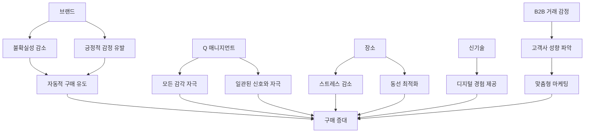

## 뇌, 욕망의 비밀을 풀다: 인간의 소비 심리를 지배하는 뇌 속 비밀
이 책은 인간의 소비 심리를 지배하는 뇌 속의 비밀을 파헤치는 내용이야. 우리가 물건을 왜 사고, 어떤 과정을 거쳐 구매하는지, 그리고 어떻게 하면 더 많이 구매하게 만들 수 있는지 마케팅 관점에서 쉽게 설명해 줄 거야. 특히 뇌 과학과 심리학을 바탕으로 사람들이 이성보다는 감정과 무의식에 의해 구매 결정을 내린다는 점을 강조하고 있어. 

## 1. 고객이 제품을 구매하는 진짜 이유: 무의식과 감정의 힘 

우리가 물건을 살 때 이성적으로 판단한다고 생각하지만, 사실은 뇌 속의 무의식과 감정이 대부분의 결정을 내린다는 거야. 마치 우리가 모르는 사이에 뇌가 '사!' 하고 명령을 내리는 것과 같아. 

1. **뇌는 생각보다 게으르다: 에너지 절약 모드** 
  - 뇌는 우리 몸무게의 2%밖에 안 되지만, 에너지의 20%를 사용해. 특히 집중하거나 이성적으로 생각할 때 에너지를 많이 써. 
  - 그래서 뇌는 에너지를 아끼려고 해. 마치 스마트폰 배터리를 아끼려고 절전 모드를 쓰는 것처럼 말이야. 
  - 익숙한 브랜드나 제품을 보면 뇌는 굳이 생각하지 않고 '이건 괜찮아!' 하고 바로 구매 명령을 내려. 에너지를 아끼는 거지. 
  - 이런 자동 모드에서는 뇌 에너지 소비량이 5%로 확 줄어든대. 
  - 이게 바로 우리가 코카콜라 같은 유명 브랜드를 보면 무의식적으로 끌리는 이유야. 

2. **감정 시스템, 뇌 속의 '빅 3'** 
  - 우리 뇌 속에는 구매 결정을 이끄는 세 가지 큰 감정 시스템이 있어. 마치 우리 마음속에 세 명의 보스가 있는 것과 같아. 
  - 균형 시스템** (안정감 추구):** 안전하고 평화로운 것을 좋아하고, 위험하거나 불확실한 것을 피하려는 마음이야. 마치 편안한 집을 좋아하는 마음과 같아. 
  - 예시: 보험, 노후 대비 금융 상품, 의약품, 안전벨트, 품질 보증, 믿을 수 있는 서비스, 전통 제품 등. 
  - 하위 모듈: 결합 (자손 보호, 소속감), 돌봄 (반려동물, 선물, 환경 보호). 
  - 자극 시스템** (새로운 경험 추구):** 지루한 걸 싫어하고, 새롭고 재미있는 것을 찾아 나서려는 마음이야. 마치 신나는 놀이공원을 좋아하는 마음과 같아. 
  - 예시: 미디어, 관광, 엔터테인먼트 산업, 혁신 제품, 쇼핑 체험, 여행 등. 
  - 하위 모듈: 놀이 (게임, 스포츠, 도박). 
  - 지배 시스템** (우월감 추구):** 다른 사람보다 뛰어나고 싶고, 권력을 얻고 싶어 하는 마음이야. 마치 게임에서 이기고 싶어 하는 마음과 같아. 
  - 예시: 명품 시계, 고급 자동차, 엘리트 클럽 멤버십, VIP 서비스, 체력 향상 제품, 효율성 높은 제품 등. 
  - 하위 모듈: 포획/사냥 (싼 물건 찾기, 경쟁), 싸움 (스포츠 시합, 경쟁). 
  - 성욕** 모듈:** 구매에 아주 중요한 영향을 미쳐. 우리가 사는 대부분의 사치품은 성욕과 관련이 깊어. 
  - 예시: 화장품, 자동차, 꽃, 선물, 섹스 용품. 

3. **구매 결정은 무의식에서 시작된다** 
  - 우리가 어떤 물건을 살지 말지 고민할 때, 뇌 속에서는 이미 감정과 욕구가 싸우고 있어. 
  - 이성적인 판단은 그저 감정의 결정을 '합리화'하는 도우미 역할만 할 뿐이야. 
  - 예를 들어, 비싼 시계를 살 때 '멋져 보여서'라는 감정이 먼저 작용하고, 나중에 '이 시계는 수제라서 가치가 있어'라고 이성적으로 합리화하는 식이지. 
  - 구매 후에도 우리는 '내가 잘 산 걸까?' 하고 계속 의심하다가, 더 비싸게 파는 곳을 발견하면 '역시 잘 샀어!' 하고 안심해. 이것도 무의식적인 합리화 과정이야. 

## 2. 뇌 속 '림빅 맵': 감정의 지도를 읽다 

우리 뇌 속에는 감정과 동기가 어떻게 연결되어 있는지 보여주는 '림빅 맵'이라는 지도가 있어. 이 지도를 보면 사람들이 왜 특정 물건에 끌리는지 알 수 있지. 

1. 림빅** 맵의 세 가지 축** 
  - 자극** (Stimulation):** 새롭고 재미있는 것을 추구하는 마음. 
  - 지배** (Dominance):** 우월하고 싶고, 통제하고 싶은 마음. 
  - 균형** (Balance):** 안정적이고 평화로운 것을 추구하는 마음. 
  - 이 세 가지 축 사이에 다양한 감정 모듈들이 위치해 있어. 
  - 예시: 모험, 스릴, 통제, 환상, 돌봄, 놀이, 사냥, 싸움 등. 

2. **상반된 욕구들의 긴장 관계** 
  - 우리 뇌 속에는 서로 반대되는 욕구들이 항상 긴장 상태로 존재해. 마치 시소처럼 말이야. 
  - **쾌락주의 vs 금욕주의:** 어제는 맛있는 음식과 술로 즐거웠지만, 오늘은 '단식해야지!' 하고 다짐하는 것처럼, 쾌락과 절제가 공존해. 
  - **혁명적 vs 보존적:** 새롭고 혁신적인 제품을 좋아하면서도, 오래되고 전통적인 제품에서 안정감을 느끼는 마음이야. 
  - **이기주의 vs 이타주의:** 낮에는 냉혹하게 일하던 사람이 저녁에는 자선 활동을 하거나 가족을 돌보는 것처럼, 이기심과 이타심이 함께 존재해. 
  - 이런 긴장 관계를 이해하면 시장의 트렌드를 더 잘 파악할 수 있어. 모든 트렌드에는 반대 트렌드가 있기 마련이거든. 
  - 예시: 세계화(확장) vs 지역성(지역 제품 선호), 유전자 조작 식품 논쟁 vs 유기농 식품 시장 성장, 해외여행 욕구 vs 코쿤족(집에서 즐기는) 욕구. 

3. **돈과 시간, 보편적인 욕구 충족 수단** 
  - 돈과 시간은 그 자체로 독립적인 동기라기보다는, 우리의 모든 욕구를 충족시켜주는 보편적인 수단이야. 
  - **돈:** 대형차를 사거나, 건강 관리를 하거나, 세계 여행을 하는 등 모든 욕구를 충족시켜주는 '만능 열쇠'와 같아. 
  - **시간:** 즐거운 활동을 하려면 시간이 필요하고, 불쾌한 활동은 시간을 아끼려고 해. 하지만 시간은 돈처럼 비축할 수 없다는 차이가 있어. 

## 3. 상품의 가치는 뇌를 얼마나 '유혹'하는가에 달려있다 

모든 상품은 우리 뇌를 얼마나 자극하고 유혹하는지에 따라 가치가 달라져. 마치 영화가 얼마나 재미있는지에 따라 관객 수가 달라지는 것과 같아. 

1. **뇌를 지루하게 만드는 상품 (가치 낮음)** 
  - 연필, 청소용품, 화장지처럼 일상생활에 꼭 필요하지만, 뇌 속 감정 시스템을 거의 자극하지 않는 상품이야. 
  - 이런 상품에는 돈을 많이 쓰고 싶지 않아 하고, 다른 저렴한 제품으로 쉽게 바꿀 수 있지. 

2. **뇌를 활성화하는 상품 (중간 가치)** 
  - 과자, 옷, 신발, 비타민제, 가전제품처럼 뇌 속 감정 시스템을 어느 정도 자극하는 상품이야. 
  - 이런 상품에는 기꺼이 돈을 쓰지만, 꼭 필요하지 않을 때는 포기할 수도 있어. 

3. **뇌를 유혹하는 상품 (가치 높음)** 
  - 스포츠카, 유명 브랜드 화장품, 디자이너 패션, 최신 스마트폰처럼 뇌 속 감정 시스템을 아주 강하게 자극하는 상품이야. 
  - 이런 상품은 엄청난 매력을 발산하고, 사용하는 사람의 지위나 개성을 드러내 줘. 
  - 소비자들은 이 상품 없이는 살아갈 수 없다고 믿을 정도로 동경하고, 비싼 돈을 기꺼이 지불해. 

4. 피트니스**, 건강, **웰니스**: 개념의 차이** 
  - 이 세 가지는 비슷해 보이지만, 뇌 속에서 자극하는 감정 시스템이 완전히 달라. 
  - **웰니스 (Wellness):** 마사지, 스파처럼 온화한 즐거움과 진정 효과를 주는 작은 사치야. 자극 시스템과 균형 시스템 사이에 위치해. 
  - **건강 (Health):** 질병 치료나 통증 완화처럼 효능과 효율성이 중요해. 근심과 두려움이 가장 큰 영향을 미쳐. 
  - **피트니스 (Fitness):** 강함, 우월함, 역경을 헤쳐나갈 힘과 관련이 있어. 지배 시스템과 성욕 모듈이 작용해. 
  - 남성에게는 힘과 지구력, 여성에게는 매력적인 몸매 가꾸기가 피트니스의 목표가 될 수 있어. 

5. **가격의 비밀: 감정적 가치** 
  - 가격은 단순히 숫자가 아니라, 우리 뇌 속에서 감정적으로 받아들여지는 가치야. 
  - **합리성:** 사람마다 합리성의 기준이 달라. 
  - 자극을 중요하게 여기는 사람은 적은 돈으로 많은 경험을 하는 것을 합리적이라고 생각해. 
  - 금욕주의자는 돈을 아껴서 통장 잔고가 늘어나는 것을 행복해하지. 
  - 균형** 시스템과 절약:** 균형 시스템은 미래를 위해 저축하게 하고, 위험을 감수하거나 돈을 많이 쓰는 것을 싫어해. 
  - **복잡성 감소:** 비슷한 제품들 사이에서 고민할 때, 가격은 선택을 쉽게 해주는 '참조 사항' 역할을 해. 
  - **감정적 가치:** 상품 자체가 높은 감정적 가치를 전달하면 더 비싼 값을 받을 수 있어. 
  - 지배 시스템은 가격을 깎는 것을 능력의 척도로 여기지만, 상품이 높은 지위나 독점권을 약속하면 기꺼이 비싼 값을 지불해. 
  - 명품 브랜드가 비싼 가격을 책정하는 것도 가격 자체가 이미 '독점적'이라는 것을 보여주기 때문이야. 

## 4. 뇌 유형에 맞춰 고객의 마음을 사로잡는 방법 

사람들은 뇌 속 감정 시스템의 활성화 정도에 따라 7가지 유형으로 나눌 수 있어. 각 유형에 맞춰 마케팅 전략을 세우면 고객의 마음을 더 효과적으로 사로잡을 수 있지. 

1. **7가지 뇌 유형** 
  - 전통주의자** (Traditionalist):** 균형 시스템에 가깝고, 꼼꼼하게 검증하고 안정성을 최고로 여겨. 오래된 단골을 좋아하고, 비판적 사고를 많이 해. 
  - 자동차 선택 시: 안전성, ABS, 에어백, 성능 평가 등을 중요하게 봐. 
  - 선호 상품: 정원 용품, 집안 데코레이션. 
  - 규율 숭배자** (Disciplinarian):** 균형 시스템과 지배 시스템 사이에 있고, 브랜드에 강하게 반응하며 전통과 역사를 중요하게 여겨. 
  - 자동차 선택 시: 유명 브랜드, 오랜 역사, 맛집처럼 오래된 곳을 선호해. 
  - 선호 상품: 정원 용품, 집안 데코레이션. 
  - 실행가** (Performer):** 지배 시스템에 가깝고, 목표 달성에 집중하며 자신이 최고라는 것을 증명하고 싶어 해. 돈을 잘 버는 경향이 있어. 
  - 자동차 선택 시: 멋진 디자인, 알루미늄 휠, 배기음, 제로백 속도 등 성능을 중요하게 봐. 
  - 선호 상품: 자신의 지위와 영리함을 상징하는 고급 가방, 옷 등. 생필품은 할인점에서 구매해. 
  - 모험가** (Adventurer):** 지배 시스템과 자극 시스템 사이에 있고, 스릴과 재미를 즐기며 새로운 것을 탐험하고 싶어 해. 충동적이고 품질보다는 성능을 중요하게 여겨. 
  - 자동차 선택 시: 오프로드, 제로백 속도, 스포츠적인 요소를 선호해. 
  - 선호 상품: 성능이 뛰어난 제품. 브랜드 충성도가 낮아. 
  - 쾌락주의자** (Hedonist):** 자극 시스템에 가깝고, 심사숙고하지 않고 하고 싶은 것을 바로 해. 유행에 민감하고 항상 새로운 것을 추구해. 
  - 자동차 선택 시: 사운드, 신기술, 편의성, 선루프 등을 중요하게 봐. 
  - 선호 상품: 신제품, 유행하는 화장품, 패션 등. 
  - 개방주의자** (Open-minded):** 자극 시스템과 균형 시스템 사이에 있고, 개방적이고 긍정적이며 꿈과 환상을 동경해. 직접 체험하는 것을 선호해. 
  - 자동차 선택 시: 안정적인 운전, 편안함, 편의성을 중요하게 봐. 
  - 선호 상품: 체험형 상품, 문화 관련 상품. 
  - 조화로운 자** (Harmonizer):** 균형 시스템에 가깝고, 돌봄과 결합을 핵심 동기로 삼아. 가족과 안정감을 중요하게 생각하고 사회적 관계를 중시해. 
  - 자동차 선택 시: 가족용 차량, 편안한 차량을 선호해. 
  - 선호 상품: 가정용품, 반려동물 관련 용품, 정원 용품. 

2. **남녀의 뇌 차이** 
  - 남성과 여성은 뇌 구조와 호르몬(테스토스테론, 에스트로겐 등)의 차이로 인해 기본적인 성향이 달라. 
  - **남성:** 왼뇌가 크고 공격적이며 단순해. 질서와 체계를 중요하게 생각하고, 구매 시 '기능'을 중요하게 봐. 
  - **여성:** 돌봄과 사교적인 태도가 강해. 정리정돈을 잘하고 가정의 행복을 중요하게 생각하며, 구매 시 '소통'을 중요하게 봐. 
  - 이러한 차이 때문에 남성은 실행가나 모험가 유형이 많고, 여성은 조화로운 자 유형이 많은 경향이 있어. 

3. **나이에 따른 구매 심리 변화** 
  - 나이에 따라서도 구매 심리와 태도가 달라져. 
  - **14~20대:** 젊음과 즐거움을 추구하는 경향이 있어. 
  - **20~30대:** 쇼핑을 즐거움으로 생각해. 
  - **30~40대:** 가정 관련 제품에 관심이 많아. 
  - **40~50대:** 가치 중심적이고, 요란한 것보다는 품질을 추구해. 

## 5. 구매를 유도하는 효과적인 마케팅 전략 

고객의 뇌를 이해했다면, 이제 그 지식을 활용해서 효과적인 마케팅 전략을 세울 수 있어. 마치 고객의 마음을 읽고 맞춤형 선물을 주는 것과 같지. 

1. **브랜드의 힘: 불확실성 감소와 긍정적 감정** 
  - 브랜드는 고객의 뇌 속에서 '불확실성'을 줄여주고 '긍정적인 감정'을 불러일으켜. 
  - **에너지 절약:** 익숙한 브랜드는 뇌가 생각할 필요 없이 바로 구매해도 된다는 명령을 내려. 마치 '나이키' 신발은 고민 없이 사는 것처럼 말이야. 
  - **대체 불가능:** 이미 긍정적인 감정이 활성화된 브랜드는 다른 브랜드로 바꾸기 어려워. 
  - **성공적인 **브랜딩** 전략** 
  - **동일한 신경 네트워크 활성화:** 특정 감정 시스템(자극, 지배, 균형)을 꾸준히 자극하고 강화해야 해. 
  - **본질적 가치:** 고객의 머릿속에 있는 가치를 중요하게 생각해야 해. 
  - **기업의 의식:** '브랜드 경영'이라는 의식이 기업 전체에 심어져 있어야 해. 
  - **사례:**
  - **벡스 (맥주):** 모험가들을 위한 브랜드로, 배를 타고 떠나는 광고처럼 '모험'과 '스킬'을 강조해. 
  - **크롬 마커 (맥주):** 조용하고 안정적인 편안함을 강조하며 '균형 시스템'을 자극해. 
  - **포르쉐:** 모험가와 실행가들이 좋아하는 브랜드로, '모험'과 '멋져 보임'을 강조해. 
  - **실패 사례: 카멜 담배:** 처음에는 모험가들을 위한 담배였지만, 판매량 확장을 위해 트렌드를 따르거나 여성을 공략하는 등 브랜딩 방향을 계속 바꿨어. 그 결과 브랜드 이미지가 망가져 판매량이 급감했지. 
  - **브랜딩을 위한 팁** 
  - **기본 영역에 집중:** 처음부터 특정 감정 영역에 집중하고, 그 후에 다른 요소를 추가해. 
  - **다양한 채널 활용:** SNS, 이메일 등 여러 채널을 통해 기본 감정을 자극하고, 점차 다른 영역을 섞어줘. 
  - **세밀한 컨셉:** 디테일과 신호에 신경 써서 세밀하게 컨셉을 잡아야 해. 

2. Q 매니지먼트**: 유혹의 기술** 
  - Q 매니지먼트는 고객의 모든 감각을 일깨워 무의식적으로 구매를 유도하는 기술이야. 
  - **성별에 따른 메시지 차이:**
  - **남성 (효율성 중시):** '하이테크 정교 기계로 생산되었으나, 멀티센서 기술을 적용한 기능은 정밀함과 품질면에서 독보적입니다'처럼 효율성과 성능을 강조해. 
  - **여성 (**돌봄**, 안정 중시):** '천연 목재로 세심하게 수작업으로 제작했습니다. 쾌적한 실내 공기를 유지시켜 주어 가족과 함께 행복함을 느낄 수 있습니다'처럼 안정감과 가족의 행복을 강조해. 
  - **마지막 인상:** 사람들은 경험의 마지막을 가장 잘 기억해. 제품 광고가 별로라도 마지막을 잘 만들면 좋은 인상으로 남을 수 있어. 
  - **일관성:** 모든 신호와 자극은 일관성이 있어야 해. 카멜 담배 사례처럼 일관성을 잃으면 브랜드가 망가질 수 있어. 

3. **장소의 중요성: 스트레스 감소와 동선 최적화** 
  - 매장이나 웹사이트 같은 '장소'도 고객의 구매 결정에 큰 영향을 미쳐. 
  - 균형 시스템**:** 단순하고 신뢰할 수 있는 장소를 선호해. 
  - 자극 시스템**:** 세련되고 영감을 주는 장소를 중시해. 
  - 지배 시스템**:** 효율적이고 쉬운 접근을 중요하게 생각해. 
  - **스트레스 낮추기:** 입구에서 고객의 스트레스를 낮추고, 서서히 구매를 유도해야 해. 
  - **이마트 사례:** 마트 입구에 과일, 채소, 정육 코너를 배치하는 것은 사람의 오감을 자극하고, 신선하고 믿을 만한 상품이라는 인상을 줘서 마음을 편안하게 해. 
  - **동선 최적화:** 대부분의 사람은 오른쪽으로 이동하는 경향이 있어. 동선을 짤 때 이를 고려하면 더 많은 고객에게 효과적이야. 
  - **묶음 상품의 마법:** 묶음 상품은 고객에게 '더 싸겠지'라는 인식을 줘서 판매량을 높일 수 있어. 실제 가격이 올라도 판매량이 늘어난 사례도 있어. 
  - 이것은 이성적인 계산보다는 '감정적으로 싸게 느껴지는' 무의식적인 판단 때문이야. 
  - **색상의 영향:** 빨간색은 판매량을 높이는 효과가 있어. 
  - **일관된 **브랜딩**:** 미디어 마켓(자극적, 자유로운 상품)이나 DM(가정용품)처럼 특정 컨셉을 꾸준히 유지하는 것이 중요해. 

4. **신기술과 감정: 디지털 시대의 마케팅** 
  - **전자책 vs 종이책:** 전자책은 편리하지만, 종이책의 '감성'을 따라올 수 없어. 
  - 책을 좋아하는 사람들은 내성적이고 사색적인 경향이 있어 '균형 시스템'에 가깝기 때문에 종이책의 아날로그 감성을 선호해. 
  - 디지털 상품은 '목표'와 '스릴', '자극'처럼 '지배 시스템'과 '자극 시스템'에 관련된 것을 만들어야 해. 
  - **웹사이트 디자인:** 웹사이트도 고객의 감정 시스템에 맞춰 디자인해야 해. 
  - '균형'과 '돌봄' 관련 웹사이트는 안정적이고 편안하게, '자극' 관련 웹사이트는 자유롭고 꿈같은 느낌으로, '지배' 관련 웹사이트는 효율적이고 자율적인 기능을 강조해야 해. 
  - B2B 거래도 감정의 지배를 받는다**:** 기업 간 거래(B2B)에서도 감정은 중요해. 
  - **고객사 성향 파악:** 거래처가 '안정'을 중시하면 '신뢰성'을, '성과'를 중시하면 '혁신'과 '효율성'을, '자극'을 중시하면 '디자인'과 '새로움'을 강조해야 해. 
  - 결국 B2B 거래에서도 고객사의 '감정'을 이해하고 그에 맞춰 마케팅하는 것이 중요해. 

