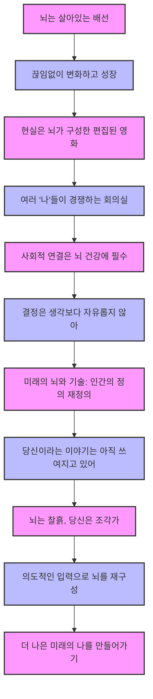

## 데이비드 이글먼의 '더 브레인: 당신이라는 이야기' 요약
이 책은 우리 뇌가 어떻게 작동하고, 우리의 현실, 결정, 기억, 감정을 어떻게 만들어내는지 알려주는 놀라운 이야기야. 저자인 데이비드 이글먼은 유명한 신경과학자로, 이 책을 통해 우리가 누구인지, 우리의 생각이 어떻게 만들어지는지, 그리고 미래에 기술과 인공지능이 우리 뇌와 만나면 어떤 모습이 될지 깊이 탐구하고 있어. 이 책은 단순히 과학책이 아니라, 우리 자신을 더 잘 이해하고 삶을 더 나은 방향으로 이끌어갈 수 있는 실용적인 지침서라고 보면 돼. 

## 1. 뇌는 고정된 컴퓨터가 아니라, 끊임없이 변하는 '이야기꾼'이야 

우리는 뇌를 그냥 딱딱한 컴퓨터처럼 생각하기 쉽지만, 이글먼은 그런 생각을 뒤집어. 뇌는 고정된 기계가 아니라, 우리 삶의 모든 것을 만들어내는 <mark>‘이야기꾼’</mark>이라는 거야. 

1. **뇌는 우리만의 현실을 만들어내는 건축가야.** 
  - 우리 눈, 귀, 코 같은 감각 기관에서 들어오는 모든 정보를 뇌가 자기 마음대로 편집하고, 하나의 연속적인 이야기로 엮어내는 거지. 
  - 이 이야기가 바로 '나'라는 존재를 만들어내는 거야. 
2. **뇌를 고정된 하드웨어가 아니라, 역동적인 이야기 과정으로 봐야 해.** 
  - 우리의 정체성, 선택, 세상을 보는 방식 이 모든 것이 뇌 속에서 끊임없이 일어나는 신경 과정의 결과라는 거야. 
3. **이 사실을 알면 우리는 겸손해지고, 호기심이 생기고, 힘을 얻을 수 있어.** 
  - 우리가 얼마나 많은 것을 자동적으로 처리하는지 알게 되면 겸손해지고, 우리 의식 뒤에 숨겨진 것들이 궁금해질 거야. 
  - 가장 중요한 건, 뇌가 어떻게 이야기를 만들고, 편집하고, 빈틈을 채우고, 여러 부분이 경쟁하는지 알면, 우리가 그 이야기에 영향을 줄 수 있다는 거야. 
  - 순간순간 모든 것을 통제할 수는 없겠지만, 장기적으로는 우리 삶의 방향을 바꿀 수 있는 힘이 생기는 거지. 
  - 수동적으로 경험만 하는 게 아니라, 우리 마음이 어떻게 발전할지 적극적으로 참여할 수 있게 되는 거야. 
4. **뇌는 밤의 거대한 도시와 같아.** 
  - 뇌를 회색 덩어리 그림으로만 보지 말고, 밤에 불빛이 반짝이는 거대한 도시를 상상해봐. 
  - 수십억 개의 건물들은 신경세포(뉴런)이고, 불빛이 환한 도로와 고속도로는 신경세포들이 정보를 주고받는 연결 통로(시냅스)라고 보면 돼. 
  - 이 도시에는 기억을 담당하는 동네, 감정을 처리하는 동네, 도덕적 선택을 하는 동네처럼 각자 다른 일을 하는 구역들이 있어. 
  - 가장 중요한 건, 이 도시는 절대 가만히 있지 않는다는 거야. 끊임없이 재건축되고, 새로운 길이 생기고, 낡은 건물이 허물어지는 것처럼 계속 변하고 있어. 
  - 지금 이 글을 읽고 배우고 생각하는 순간에도, 우리 뇌 속에서는 낡고 비효율적인 건물들이 허물어지고 새로운 연결들이 만들어지고 있는 거야. 
  - 이런 끊임없는 변화가 바로 우리를 정의하고, 우리가 어떤 사람이 될 수 있는지를 결정하는 거지. 

## 2. 뇌는 '고정 배선'이 아니라 '살아있는 배선'이야: 끊임없이 변하고 성장하는 뇌 

뇌는 한 번 만들어지면 끝나는 게 아니야. 마치 살아있는 전선처럼 계속해서 변하고 새로운 길을 만들어낸다는 뜻이야. 

1. **뇌는 '**살아있는 배선(livewired)**'이야, '**고정 배선**(hardwired)'이 아니야.** 
  - 이건 어릴 때만 신경 가소성(뇌가 변하는 능력)이 일어나는 게 아니라, 평생 동안 뇌가 작동하는 기본적인 방식이라는 거야. 
  - 우리의 습관, 기억, 성격, 기술을 조절하는 신경 회로들은 돌에 새겨진 것처럼 고정된 길이 아니야. 
  - 우리가 무엇을 하고 경험하느냐에 따라 끊임없이 강해지거나 약해지고, 심지어 완전히 새로운 길을 만들기도 해. 
  - 이런 유연한 성질을 가소성이라고 부르는데, 뇌는 죽을 때까지 계속 변해. 
2. **우리가 배우고 느끼고 연습할 때마다 뇌의 물리적인 연결이 변해.** 
  - 신경세포(뉴런) 사이의 연결(시냅스)이 강해져서 정보가 더 빠르고 효율적으로 전달되거나, 사용하지 않는 길은 사라지기도 해. 
  - 이걸 '사용하거나 잃어버리거나(use it or lose it)'라고 부르는데, 말 그대로야. 
  - 예를 들어, 새로운 언어를 배우는 사람은 단순히 단어를 외우는 게 아니라, 뇌의 특정 부분(측두엽)을 물리적으로 재구성하고 새로운 신경망을 통합하는 거야. 
3. **뇌는 대리석이 아니라 찰흙 같아.** 
  - 옛날에는 뇌가 대리석처럼 한 번 만들어지면 변하기 어렵다고 생각했어. 그래서 '나는 원래 수학을 못 해'라거나 '나는 원래 비관적인 사람이야'라고 말하곤 했지. 
  - 하지만 뇌가 찰흙 같다는 걸 알면, 이런 생각은 완전히 무너져. 찰흙은 말랑말랑해서 우리가 조각가가 되어 원하는 대로 만들 수 있잖아. 
  - 우리는 20대나 30대에 가졌던 습관이나 성격에 갇혀 있지 않아. 
  - 미루는 습관과 싸우거나 기타를 배우려고 노력하는 건, 말 그대로 신경 경로를 바꾸는 물리적인 과정이야. 
  - 진정한 변화의 가능성이 우리 생물학 안에 이미 내장되어 있는 거지. 우리가 의도적으로 올바른 자극을 주면 돼. 
4. **우리는 순간적인 의지력보다는 전략적인 노력을 통해 뇌를 바꿀 수 있어.** 
  - 순간적인 유혹에 맞서 싸우는 것보다, 꾸준한 노력을 통해 뇌의 물리적인 구조가 새로운 습관에 적응하도록 만드는 게 중요해. 
  - 우리는 매 순간 완벽하게 통제할 수는 없지만, 우리 삶의 방향을 바꿀 수 있는 힘은 있어. 
  - 실패를 성격 결함으로 보지 말고, 우리가 뇌에 주는 자극을 조절하거나 접근 방식을 바꿔야 한다는 신호로 받아들이는 거야. 
  - 뇌는 항상 변할 준비가 되어 있으니, 우리가 명확한 지시를 주기만 하면 돼. 
5. **인간의 뇌는 태어난 후에 배선돼.** 
  - 다른 동물들처럼 유전적으로 미리 정해진 형태가 아니야. 
  - 유전자는 신경 연결망의 아주 대략적인 설계도만 제시하고, 세상에서의 경험이 나머지 배선을 미세하게 조절하게 해. 
  - 덕분에 인간의 뇌는 태어난 환경에 적응할 수 있고, 지구상의 모든 지역에서 살 수 있게 된 거야. 
  - 우리가 누구인지는 신경세포의 수가 아니라, 신경세포의 연결 방식과 그 연결이 어떻게 가지치기되느냐에 따라 결정돼. 
6. **뇌는 시냅스 가지치기를 통해 효율적으로 변해.** 
  - 아기는 태어난 후 2년 동안 신경세포(뉴런) 연결(시냅스)이 어른보다 두 배나 많아. 
  - 하지만 나무를 깎듯이 불필요한 시냅스를 가지치기해서 수를 줄여. 
  - 우리는 2살 때보다 시냅스 연결이 절반으로 줄어든 상태야. 
  - 환경 적응에 필요한 연결만 남기고, 나머지 연결은 약해지거나 없어져. 
  - 이 가지치기 과정은 우리가 성숙해지는 동안 계속돼. 
  - 성공적으로 회로에 참여하는 시냅스는 강화되고, 불필요한 시냅스는 약화되어 제거돼. 
  - 마치 숲속의 오솔길처럼, 사용하지 않는 연결은 사라지는 거야. 
  - 어떤 의미에서 지금의 '나'가 되는 과정은 이미 있었던 가능성들을 쳐내는 과정이라고 볼 수 있어. 
  - 이 가지치기 결과로 신경세포 연결의 수는 줄어들지만, 연결의 강도는 더 강해져. 
  - 예를 들어, 어릴 때 영어를 접하면 특정 소리를 듣는 능력은 향상되지만, 다른 언어의 소리를 듣는 능력은 약화되는 식이야. 
7. **성인기에도 뇌는 계속 변해.** 
  - 우리는 25세 정도가 되면 뇌의 형성이 완료되고, 정체성과 성격에 관한 구조적 변화가 끝났다고 생각하기 쉽지만, 성인기에도 뇌는 계속 변해. 
  - 런던 택시 운전사들은 런던 지식 시험을 통과하기 위해 4년 동안 훈련을 받는데, 이 과정에서 뇌의 변화가 일어나. 
  - 런던 대학 신경과학자들이 택시 운전사들의 뇌를 스캔한 결과, 기억에 필수적인 뇌 구역인 <mark>해마의 뒷부분</mark>이 더 커졌다는 것을 발견했어. 
  - 운전 경력이 길수록 해마의 변화가 더 컸어. 
  - 우리가 보는 영화부터 하는 일까지 모든 것이 끊임없이 신경 연결망을 재구성하고, 우리는 그 신경 연결망을 조정하면서 살아가는 거야. 

## 3. 현실은 뇌가 만들어낸 '편집된 영화'야: 우리가 보는 세상은 진짜 세상이 아니야 

우리가 보고 듣고 느끼는 세상은 있는 그대로의 세상이 아니야. 우리 뇌가 우리를 위해 만들어낸 '버전'이라는 거야. 

1. **우리의 감각은 세상을 완벽하게 기록하는 비디오카메라가 아니야.** 
  - 우리는 눈, 귀, 피부가 모든 것을 수동적으로 기록한다고 착각하기 쉽지만, 사실은 완전히 틀린 생각이야. 
  - 우리가 경험하는 현실은 뇌가 적극적으로 만들어내는 '건설 작업'이야. 
  - 이 현실은 생존과 효율성을 위해 최적화된 개인 맞춤형 버전이지, 객관적이고 완벽하게 정확한 버전이 아니야. 
2. **뇌는 생존에 유용한 것을 우선시하기 때문에 현실을 단순화해.** 
  - 매 순간 우리에게 쏟아지는 엄청난 양의 감각 정보는 너무나 압도적이고 혼란스러워. 
  - 만약 뇌가 망막에 닿는 모든 빛, 공기압의 미세한 변화, 모든 신경 말단에서 발생하는 신호를 의식적으로 처리해야 한다면, 우리는 완전히 마비될 거야. 
  - 그래서 뇌는 강력한 예측 엔진을 사용해서 관련 없다고 판단되는 수많은 세부 정보를 걸러내. 
  - 우리 시야의 맹점이나 코가 항상 시야에 들어와 있다는 사실 같은 것을 매끄럽게 무시하고, 과거 경험과 기대를 바탕으로 빈틈을 채워 넣어. 
  - 뇌는 끊김 없는 경험을 적극적으로 만들어내지만, 그 대가로 어떤 것을 빼거나 추가하기도 해. 
3. **뇌는 능숙한 '영화 편집자'와 같아.** 
  - 삶의 원본 영상은 지저분하고, 파편적이며, 감각적인 소음으로 가득 차 있어. 
  - 뇌라는 편집자는 이 영상을 잘라내고, 시간 순서를 조금 바꾸기도 해. 그래서 우리가 사건이 일어난 시점을 인식하는 것이 때때로 조금 틀릴 수 있어. 
  - 그리고 이 모든 것을 매끄럽고 일관성 있으며 보기 쉬운 영화로 이어 붙여. 
  - 최종 영화는 이해하기 쉽지만, 편집실 바닥에 버려진 수많은 원본 영상과는 부분적으로만 닮아 있어. 
4. **우리는 우리가 본 것에 대해 덜 확신해야 해.** 
  - 뇌가 적극적으로 세부 정보를 버리고 빈틈을 채워 넣는다면, 우리가 '완벽하게 봤어, 모든 세부 사항을 기억해'라고 자신 있게 말하는 것에 대해 훨씬 덜 확신해야 할 거야. 
  - 이것은 기억이나 논쟁 같은 것에 큰 영향을 미쳐. 
  - 목격자 증언이 믿을 수 없는 이유도 바로 이것 때문이야. 
  - 뇌는 모든 원본 데이터를 기록하는 것보다, 말이 되는 이야기를 만드는 것을 우선시했기 때문이야. 
  - 이글먼은 "현실은 단순히 밖에 존재하는 것이 아니다. 그것은 당신의 뇌가 당신을 위해 만들어내는 것이다"라고 단호하게 말해. 
5. **'지각적 겸손'을 가져야 해.** 
  - 우리가 뇌가 제공하는 매끄러운 이야기에 의문을 제기하는 법을 배워야 해. 
  - 우리의 주관적인 현실이 여러 가능한 해석 중 하나일 뿐이라는 것을 인정하는 거야. 
  - 이런 생각은 우리를 더 현명하고 인간적으로 만들어 줄 거야. 

## 4. 우리는 '하나의 나'가 아니라, 여러 '나'들이 경쟁하는 '회의실'이야 

우리는 보통 '나'라는 존재가 하나로 통일되어 있다고 생각하지만, 이글먼은 그게 환상이라고 말해. 뇌는 사실 여러 신경망이 통제권을 놓고 싸우는 '전장'과 같다는 거야. 

1. **뇌는 '단일 CEO'가 아니라 '전문 시스템들의 연합'이야.** 
  - 우리는 모든 것을 결정하는 합리적인 사령부가 있다고 생각하고 싶어 하지만, 신경학적으로 볼 때 뇌는 여러 전문화된 시스템들의 연합으로 보는 게 훨씬 정확해. 
  - 이 시스템들은 종종 서로 상충되는 목표를 가지고 있어. 
  - 예를 들어, 당장 도넛을 먹고 싶어 하는 즉각적인 보상 회로(변연계와 관련)와 다이어트를 지키려는 장기적인 계획 및 억제 회로(전두엽과 관련)가 서로 싸우는 식이야. 
  - 이런 내적인 줄다리기는 우리가 결함이 있다는 신호가 아니라, 뇌가 원래 그렇게 만들어졌다는 뜻이야. 
2. **이 내적 갈등은 '**인지 부조화**'를 설명해줘.** 
  - 헬스장에 가야 한다는 걸 알면서도 소파에 앉아 TV를 보고 싶은 강력한 충동을 느끼는 것처럼, 의식적으로는 한 가지를 결정했지만, 무의식적인 다른 신경망이 반대 방향으로 강하게 끌어당기는 거야. 
  - 이런 상황은 우리에게 많은 자기비판을 불러일으켜. '왜 나는 일관성이 없을까? 왜 의지력이 부족할까?' 하고 자책하게 되지. 
  - 이글먼은 일관성이 본질적으로 어렵다고 말해. 왜냐하면 이런 내부 신경망들은 거의 항상 최종 행동에 대한 통제권을 놓고 경쟁하기 때문이야. 
  - 우리의 의식적인 마음은 보통 최종 결정이라는 결과만 등록할 뿐, 그 밑에서 일어난 복잡하고 지저분한 협상 과정은 알지 못해. 
3. **'하나의 나'라는 느낌은 뇌가 만들어내는 '요약 보고서'와 같아.** 
  - 뇌가 모든 것을 일관성 있게 느끼도록 사후에 생성하는 편리한 요약 보고서 같은 거야. 
  - 마치 우리 마음이 여러 발표자로 가득 찬 회의실 같다고 상상해봐. 
  - '나'라는 의식적인 자아는 회의를 관리하려는 의장과 같아. 
  - 한쪽에는 설탕이 든 간식을 당장 요구하는 배고픔 신경망처럼 시끄럽고 끈질긴 발표자가 있고, 다른 쪽에는 건강이나 절제 같은 장기적인 목표를 나타내는 조용하고 미묘한 발표자가 있어. 
  - 결국 쿠키를 먹을지 사과를 먹을지는 어떤 발표자가 방의 관심을 사로잡느냐, 어떤 목소리가 가장 크게 들리느냐, 그리고 의장인 '나'가 전략적으로 어떤 목소리에 귀 기울이고 증폭시키느냐에 달려 있어. 
4. **이해는 책임감을 없애는 것이 아니라, 재구성하는 거야.** 
  - 우리가 여러 경쟁하는 신경망의 집합체라면, 개인적인 책임감이나 도덕성, 잘못에 대한 개념이 약해지는 걸까? 
  - 이글먼은 뇌의 작동 방식을 이해하는 것이 책임감을 완전히 없애는 것이 아니라, 그것을 근본적으로 재구성한다고 말해. 
  - 도덕적 실수나 나쁜 결정을 단순히 성격이나 정신의 실패로 보기보다는, 신경 경쟁의 불균형으로 볼 수 있다는 거야. 
5. **목표는 경쟁하는 신경망을 없애는 것이 아니라, 더 잘 관리하는 거야.** 
  - 즉각적인 만족을 추구하는 시스템도 중요한 기능을 하니까 없앨 필요는 없어. 
  - 목표는 경쟁을 더 잘 인식하고, 우리의 의식적인 가치와 장기적인 목표에 부합하는 목소리(신경망)를 전략적으로 강화하는 거야. 
  - 우리가 복잡한 시스템을 관리하고 있다는 것을 깨달으면, 결함 있는 존재로 자신을 벌하는 대신, 복잡한 구조를 더 잘 관리하는 방법을 찾는 쪽으로 바뀌게 돼. 
  - 이런 이해에서 오는 자기 연민은 역설적으로 장기적으로 더 신중하고 사려 깊은 선택으로 이어지기도 해. 

## 5. 우리는 '다른 사람들을 위해' 배선되어 있어: 사회적 연결은 뇌 건강에 필수적이야 

우리 뇌는 단순히 사회 집단 속에서 진화한 것이 아니라, <mark>사회 집단을 위해 진화</mark>했어. 우리는 다른 사람들과 연결되도록 만들어진 존재라는 거야. 

1. **우리는 근본적으로 '사회적 동물'이야.** 
  - 우리의 정체성, 감정을 조절하는 능력, 심지어 다음에 무슨 일이 일어날지 예측하는 능력까지, 이 모든 것이 다른 사람들과 어떻게 상호작용하고, 인식하고, 피드백을 받느냐에 깊이 의존하고 있어. 
  - 우리는 단순히 다른 사람들과 함께 있는 것을 좋아하는 게 아니라, 함께 있어야만 해. 
  - 거울 신경세포 시스템(mirror neuron systems)처럼 우리 뇌의 구조 자체가 주변 사람들의 정신 상태를 끊임없이 시뮬레이션하고 이해하려고 설계된 것 같아. 
  - 우리는 연결을 위해 만들어졌어. 
2. **고립은 단순히 외롭거나 슬픈 것이 아니라, 생물학적으로 해로워.** 
  - 고립은 우리 시스템의 균형(항상성)에 대한 적극적인 위협과 같아. 
  - 이글먼은 장기간의 고립, 따돌림, 심지어 만성적인 오해도 단순히 감정적으로 나쁘게 느껴지는 것이 아니라, 몸에 측정 가능한 스트레스 반응을 유발한다고 지적해. 
  - 이런 스트레스는 면역 체계를 망가뜨리고, 인지 능력을 저하시키며, 심지어 주요 신경전달물질의 균형을 바꾸기도 해. 
  - 우리 자신에 대한 정의 자체가 관계적이야. 다른 사람들과 연결되어 있어. 그 신호를 끊으면 시스템이 오작동하기 시작해. 
3. **뇌는 '사회적 상호작용'이라는 특정 방송에 맞춰진 라디오와 같아.** 
  - 그 방송은 끊임없는 사회적 상호작용, 피드백, 공유된 경험, 이해의 흐름이야. 
  - 그 신호가 명확하게 들어오지 않으면, 라디오는 그저 침묵하거나, 더 나쁘게는 짜증 나는 잡음(정적)으로 가득 차게 돼. 
  - 현대 사회의 문제는 종종 우리가 고품질의 신호(진정한 연결)를 단순히 볼륨만 큰 잡음(정적)으로 대체하려고 한다는 거야. 
  - 예를 들어, 무의미하게 소셜 미디어 피드를 스크롤하거나, 사회적으로 느껴지지만 실제로는 상호작용이 없는 온라인 콘텐츠를 수동적으로 시청하는 것들이 그래. 
  - 뇌는 풍부하고 실시간으로 주고받는 상호작용을 위해 진화했어. 그것이 우리 자신에 대한 감각을 제대로 안정시키고 감정을 조절하는 데 필요한 것이야. 
  - 따라서 진정한 관계에 투자하는 것은 말 그대로 뇌를 건강하고 잘 작동하게 유지하는 데 투자하는 것과 같아. 
4. **유아기의 양육 환경은 뇌 발달에 필수적이야.** 
  - 인간의 뇌가 태어난 후에 배선된다는 것은 아기를 키우는 사람들에게 매우 중요한 의미를 가져. 
  - 유아기에 적절한 정서적 지원이나 자극이 주어지지 않으면, 뇌 세포의 연결이 제대로 이루어지지 않아 뇌의 능력이 현저히 떨어질 수 있어. 
  - 루마니아 고아원 사례는 이를 극명하게 보여줘. 
  - 1966년 루마니아 대통령 니콜라이 체우세스쿠는 인구 증가를 위해 피임과 낙태를 제한하는 법을 시행했어. 
  - 이로 인해 많은 아이들이 고통받았고, 살아남은 아이들 중에는 지적 장애를 가진 아이들이 많았어. 
  - 가난한 가정들은 자식을 감당할 수 없어 국영 고아원에 맡겼고, 1989년에는 고아원 아동 수가 17만 명에 달했어. 
  - 보스턴 아동병원 소아과 교수 찰스 넬슨 박사가 1999년 루마니아 고아원을 방문했을 때, 아이들은 어떤 감각 자극도 받지 못한 채 우리 속에 갇혀 있었어. 
  - 보모 한 명이 아동 15명을 담당했고, 아이가 울어도 안아주거나 애정을 표현하지 말라는 지시를 받았어. 
  - 아이들은 울어도 소용없자 울지 않는 법을 배웠고, 아무도 아이들을 안아주거나 함께 놀아주지 않았어. 
  - 먹이고 씻기고 옷을 갈아주는 것은 했지만, 감정적 돌봄과 지원은 물론 어떤 유형의 자극도 없었어. 
  - 그 결과 아이들은 무차별적인 호의(누구에게나 달려들어 안기는 행동)를 발달시켰는데, 이는 무시당하는 아이들의 대응 전략이며 장기적인 애착 문제와 관련이 있어. 
  - 과학자들은 루마니아 고아원 영유아가 뇌 발달에 미치는 영향을 밝혀냈는데, 지능지수가 평균보다 한참 못 미치는 60~82였고, 뇌 발달 저하 징후를 보였으며 언어 습득이 매우 더뎠어. 
  - 이 연구들은 정부 정책에 영향을 미쳐, 루마니아는 2세 미만 아동을 고아원에 보내는 것을 불법화했어. 
  - 유아기를 희생해서는 안 되며, 뇌 발달에 양육 환경이 필수적이라는 점을 감안할 때, 아이들에게 적절한 뇌 발달을 돕는 환경을 제공하는 것은 정부의 중요한 의무 중 하나야. 
5. **10대 사춘기 행동은 뇌의 큰 변화와 관련이 있어.** 
  - 10대 사춘기 행동의 특징은 호르몬 변화뿐만 아니라 뇌의 내적 변화에 의한 것이야. 
  - 유아기 때와 마찬가지로, 10대 뇌에서는 뉴런 연결이 과도하게 형성되고, 그 후 10년 동안 가지치기가 돼. 
  - 10대에는 자기 자신에 대한 감정적 의미를 관장하는 뇌 영역(안쪽 앞이마 엽피질)은 활성화되어 있지만, 충동을 조절하는 영역은 아직 덜 발달되어 있어. 
  - 이글먼의 실험에서 10대 청소년들은 어른들보다 낯선 사람들에게 구경당하는 상황에서 훨씬 더 큰 불안을 느꼈어. 
  - 이는 10대 청소년들에게 사회적 상황이 감정적으로 큰 무게를 가지기 때문에 강렬한 자기 의식과 스트레스 반응을 일으키기 때문이야. 
  - 10대 시절에는 자아에 대한 생각, 즉 자기 평가는 매우 절박한 사안이야. 
  - 성숙한 쾌락 추구 시스템과 미성숙한 안쪽 앞이마 엽피질의 조합은 10대 청소년이 감정적으로 과민할 뿐만 아니라, 감정 통제 능력이 성인보다 더 약하다는 것을 의미해. 
  - 10대 시절 내내 비교적 약한 연결은 제거되고, 강한 연결은 강화돼. 
  - 이 가지치기 결과로 10대 시절 동안 안쪽 앞이마 엽피질의 부피는 매년 약 2%씩 감소해. 
  - 10대 시절에 이루어지는 뇌 회로의 형성은 우리가 성인이 되어가는 과정에서 배우는 교훈의 기반이 돼. 
  - 10대의 모습은 계속해서 일어나는 뇌 변화와 깊이 관련되어 있어. 이 변화는 10대를 자기 의식이 더 강하고, 위험 감수 성향이 더 강하며, 또래 압력에 휘둘려 행동하는 성향이 더 강한 사람으로 만들어. 
  - 10대 청소년들의 성품은 단순히 선택이나 마음가짐의 결과가 아니라, 피할 수 없는 신경학적 변화 기간이 만들어낸 산물이라는 것을 이해해야 해. 

## 6. 결정은 생각보다 '자유롭지 않아': 무의식적인 과정이 우리의 선택을 미리 만들어 

우리는 우리가 모든 결정을 자유롭게 내린다고 생각하지만, 이글먼은 그렇지 않다고 말해. 무의식적인 과정이 우리가 결정했다고 느끼기 훨씬 전에 이미 그 결정을 형성하고 있다는 거야. 

1. **뇌 활동은 우리가 의식적으로 결정하기 전에 이미 시작돼.** 
  - 이글먼은 많은 실험 증거를 제시하는데, 예를 들어 버튼을 누르기로 결정하는 것과 같은 행동 의도를 나타내는 뇌의 전기 활동이, 사람이 의식적으로 누르기로 결정했다고 보고하기 최대 1초 전에 이미 운동 피질에서 시작된다는 것을 보여주는 연구들이 있어. 
  - 만약 뇌가 이미 파란색 셔츠를 고르기로 준비하고 있다면, 내가 의식적으로 파란색 셔츠를 선택했다고 느끼는 순간에 내 의식적인 마음은 무엇을 하고 있는 걸까? 
2. **의식적인 마음은 '관찰자'이거나 '거부권'을 가진 존재일 수 있어.** 
  - 이 관점에 따르면, 우리가 선택을 한다고 경험하는 의식적인 마음은 빙산의 일각에 불과해. 
  - 그것은 이미 아래에서 끓어오르는 충동을 등록하고, 잠재적인 결과를 빠르게 분석한 다음, 행동을 진행시키거나 억제하려고 시도할 수 있어. 
  - 즉, 의식적인 마음은 행동을 시작하는 것이 아니라, 승인하거나 차단하는 역할을 할 수 있다는 거야. 
  - 한편, 의식적인 인식 아래에 있는 거대한 기계(빙산의 나머지 부분)는 이미 수십 년간 학습된 습관, 과거 경험, 즉각적인 환경을 바탕으로 모든 필터링, 예측, 준비 작업을 마쳤어. 
  - 이글먼은 "우리는 통제하고 있다고 느낄 수 있지만, 우리가 그것을 알 때쯤이면 뇌는 이미 행동했다"고 말해. 
3. **우리의 진정한 힘은 '뇌의 기계를 프로그래밍하는 것'에 있어.** 
  - 만약 무의식적인 뇌 기계가 이미 항로를 설정했고, 내 의식적인 자아는 잠시 후에야 알아차린다면, 내가 의식적으로 애쓰는 의미는 무엇일까? 
  - 이글먼은 자유 의지가 완전히 사라지는 것이 아니라, 그 초점이 바뀐다고 말해. 
  - 우리는 즉각적인 순간의 충동을 통제하는 데는 서툴 수 있어. 왜냐하면 무의식적인 뇌 기계가 너무 빠르기 때문이야. 
  - 하지만 우리가 엄청난 힘을 발휘할 수 있는 곳은, 시간이 지남에 따라 그 기계를 프로그래밍하는 '입력'에 있어. 
  - 마치 의식적인 자아가 배의 키를 잡고 있는 선장이라면, 우리의 진정한 힘은 순간순간 키와 씨름하는 것이 아니라, 배 자체를 설계하고, 선원들을 훈련시키고, 항해를 시작하기 훨씬 전에 엔진을 조절하는 것에 있어. 
  - 우리는 유혹의 순간에 연약한 의지력을 통해서가 아니라, 몇 주, 몇 달, 심지어 몇 년 전에 무의식적인 충동을 지시할 환경과 습관을 의식적으로 형성함으로써 우리의 자유 의지를 행사하는 거야. 
4. **환경을 설계하여 무의식적인 선택을 좋은 방향으로 유도해야 해.** 
  - 우리가 나중에 더 나은 선택을 하고 싶다면, 지금 환경을 설정해서 그 더 나은 선택이 빠르고 무의식적인 엔진의 쉬운 기본 옵션이 되도록 해야 해. 
  - 예를 들어, 설탕 섭취를 줄이려고 할 때, 눈앞에 있는 컵케이크를 먹고 싶은 충동에 저항하는 것은 대부분 실패하는 싸움이야. 
  - 진정한 성공은 컵케이크를 아예 사지 않거나, 건강한 간식을 쉽게 잡을 수 있는 곳에 두는 것처럼, 미리 환경을 설계하는 데서 와. 
  - 이렇게 하면 번개처럼 빠른 충동적인 신경망이 쉽게 이길 기회를 얻지 못하는 시스템을 만드는 거야. 
  - 이것은 전략적인 인식을 통한 힘 부여야. 우리의 자유가 순간적인 생물학과 싸우는 것보다 우리의 기본값을 설계하는 데 더 많이 있다는 것을 이해하는 거지. 

## 7. 미래의 뇌와 기술: 인간의 정의를 재정의할 기술의 발전 

이글먼은 미래 기술이 우리를 돕는 것을 넘어, '인간이라는 것이 무엇인지'를 근본적으로 재정의할 것이라고 말해. 

1. **뇌는 '찰흙'처럼 적응력이 뛰어나고, 기술은 강력한 '조각 도구'가 될 거야.** 
  - 인공지능(AI), 뇌-기계 인터페이스(BMI), 그리고 감각 증강(sensory augmentation)의 놀라운 잠재력에 대해 이야기해. 
  - 특히 그의 연구인 '감각 대체(sensory substitution)'는 뇌가 얼마나 유연한지 보여주는 완벽한 예시야. 
2. **'**VEST**' 장치는 뇌의 놀라운 유연성을 보여줘.** 
  - VEST는 '다용도 초감각 변환기(versatile extra sensory transducer)'의 약자야. 
  - 이 조끼는 작은 진동 모터들로 이루어져 있는데, 소리 정보를 착용자의 몸통에 복잡한 진동 패턴으로 변환해서 전달해. 
  - 처음에는 착용자가 복잡한 윙윙거리는 패턴을 촉각으로만 느껴. 
  - 하지만 놀라운 점은, 꾸준히 착용하면 뇌가 적응하기 시작한다는 거야. 
  - 뇌는 그 진동을 단순히 촉각으로만 처리하는 것이 아니라, 그 촉각 경로를 재활용해서 그 패턴을 새로운 형태의 청각, 또는 소리로 보는 것처럼 해석하기 시작해. 
  - 이것은 뇌가 수술 없이도 피부를 통해 새로운 일관된 정보 흐름을 받음으로써, 본질적으로 새로운 감각, 즉 '제6의 감각'을 만들어내는 것을 보여줘. 
  - 뇌는 근본적으로 '입력-출력 장치'이며, 우리가 생각했던 것보다 훨씬 덜 전문화되어 있고 훨씬 더 유연하다는 것을 보여주는 거야. 
  - 뇌는 신뢰할 수 있는 정보를 기다리고 있을 뿐이야. 어떤 채널을 통해서든 일관된 입력을 제공하면, 뇌는 그것을 처리하는 방법을 알아내고, 신경 영역을 할당해서 의미를 부여할 거야. 
3. **기술은 인간의 경계를 흐리게 하고, '우리는 누구인가'라는 질문을 던져.** 
  - 피부를 통해 소리를 듣도록 뇌를 훈련시킬 수 있다면, 뇌-기계 인터페이스(BMI)를 통해 외부 메모리 칩을 직접 통합하거나, AI 인터페이스를 통해 전 세계 정보 데이터베이스에 즉각적으로 접근할 수 있게 되면 어떻게 될까? 
  - 우리는 생물학적인 자아와 우리가 사용하는 도구 사이의 경계를 심각하게 흐리게 하고 있어. 
  - 이러한 확장은 거의 존재론적인 질문을 던져. 우리는 누구이며, 무엇이 되어가고 있는가? 
  - 이글먼은 "기술이 발전함에 따라 우리는 뇌와 도구 사이의 경계를 흐리게 할 것이다. 그리고 그때 우리는 '우리는 누가 될 것인가?'라고 묻게 될 것이다"라고 단호하게 말해. 
  - 이것은 먼 미래의 공상 과학 시나리오가 아니라, 지금 미묘한 방식으로 일어나고 있는 일이야. 
  - 우리가 스마트폰을 외부 기억 장치로 얼마나 많이 의존하는지, 또는 정교한 의수족이 신경 경로와 직접 통합되기 시작하는 방식을 생각해봐. 
  - 우리는 이미 기본 인간 소프트웨어를 업그레이드하고 있는 셈이야. 
4. **우리는 기술 업그레이드를 의식적으로 선택해야 해.** 
  - 이글먼은 우리가 기술을 의식적으로 받아들여야 한다고 강조해. 
  - 단순히 모든 새로운 앱이나 장치를 수동적으로 받아들이는 것이 아니라, 의도적으로 업데이트 패키지를 선택해야 해. 
  - 우리가 통합하는 도구들이 깊은 집중, 학습, 연결을 장려하는지, 아니면 근본적으로 우리를 산만함, 피상성, 끊임없는 도파민 중독으로 재배선하고 있는지 물어봐야 해. 
  - 선택은 점점 더 우리에게 달려 있어. 

## 8. 뇌를 위한 실용적인 지침: 의도적인 '조각가'가 되는 방법 

우리는 역동적이고, 구성되며, 내적으로 갈등하고, 깊이 사회적이며, 무의식적인 힘에 의해 미묘하게 통제되고, 특히 기술과 함께 끊임없이 진화하는 존재야. 이 모든 뇌 과학 지식을 바탕으로, 우리 뇌의 의도적인 '조각가'가 되는 방법을 알아보자. 

1. **변화를 호기심 있게 받아들여: 뇌는 찰흙 같다는 것을 기억해.** 
  - '살아있는 배선(livewired)' 개념을 정말로 내면화하고, 과거의 실패나 한계에 너무 강하게 자신을 동일시하는 것을 멈춰. 
  - '나는 아침형 인간이 아니야', '나는 이름 외우는 데 젬병이야' 같은 말들을 그만두는 거야. 
  - 뇌가 변할 수 있다는 것을 아니까, 오늘 당장 아주 작은 새로운 기술이나 습관을 하나 선택해봐. 
  - 다른 언어로 새로운 단어 하나를 배우거나, 5분 명상 연습을 하는 것처럼 말이야. 
  - 가장 중요한 건, 처음에는 얼마나 어렵고 어색하게 느껴지는지 의식적으로 알아차리는 거야. 
  - 그리고 2주 정도 꾸준히 해보고, 그 초기 마찰이 어떻게 줄어드는지 느껴봐. 
  - 이것은 말 그대로 신경 가소성(뇌가 변하는 능력)이 실시간으로 일어나는 것을 관찰하는 거야. 
  - 우리가 의도적으로 자극을 주었기 때문에 새로운 경로가 강화되는 것을 느끼는 거지. 
  - 뇌 세포들을 살려주지 않으면 연결이 없어져 인지 능력이 감퇴할 수 있으니, 적극적으로 도전하고 새로운 경험과 사회적 연결을 만들어가야 해. 
2. **인식을 멈추고 질문해: 우리 뇌가 만들어낸 현실에 의문을 제기해.** 
  - 어떤 문제에 대해 정말 확고하게 주장하거나, 누군가가 한 일 때문에 화가 날 때, 즉시 자신의 현실 버전을 방어하기보다는 한 발 물러서서 생각해봐. 
  - '내 뇌의 어떤 부분이 지금 이 경험을 걸러내고 있을까?', '내 내부의 영화 편집자가 어떤 중요한 세부 사항을 편리하게 빼놓았을까?', '내 뇌는 어떤 기대를 가지고 빈틈을 채웠을까?'라고 스스로에게 질문해봐. 
  - 이런 질문을 하는 것만으로도 잠시 멈추고 객관적인 순간을 가질 수 있어. 
  - 그 상황의 원본 영상을 해석하는 다른 유효한 방법이 있을 수도 있다는 것을 고려하게 해줘. 
  - 이런 생각은 우리를 더 현명하고 인간적으로 만들어 줄 거야. 
3. **내적 갈등을 알아차려: 죄책감 대신 관리자가 되어봐.** 
  - 알람을 다섯 번이나 끄고 싶지 않았는데도 끄거나, 중요한 프로젝트를 미루고 있을 때, 무슨 일이 일어나고 있는지 인식해. 
  - 이것을 여러 신경망이 싸우는 것으로 봐. 마치 회의실 비유처럼 말이야. 
  - 죄책감이나 자책에 귀중한 정신 에너지를 낭비하지 마. 
  - 대신, 어떤 '선수'들이 싸우고 있는지 파악하려고 노력해봐. 
  - '아, 저건 즉각적인 편안함을 외치는 변연계(감정을 담당하는 뇌 영역)이고, 지금은 미래를 위한 전두엽(계획을 담당하는 뇌 영역)의 계획을 압도하고 있네'라고 말이야. 
  - 그리고 의식적으로, 의도적으로, 전략적으로 당신이 이기기를 원하는 신경망을 지원하려고 노력해. 
  - 어려운 일을 했을 때 작은 즉각적인 보상을 주는 것처럼, 다음번에 내적 갈등이 생겼을 때 장기 계획 신경망에 조금 더 큰 목소리를 내도록 도와주는 거지. 
  - 회의에 끌려다니는 것이 아니라, 회의를 관리하는 거야. 
4. **연결에 투자해: 뇌는 고품질의 사회적 상호작용이 필요해.** 
  - 피상적인 스크롤링은 그저 잡음일 뿐이야. 뇌는 진정한 신호가 필요해. 
  - 이것은 의미 있는 상호작용을 의식적으로 우선시하는 것을 의미해. 
  - 친한 친구와 영상 통화를 하거나, 더 좋게는 직접 만나서 약속을 잡아. 
  - 그리고 그 자리에서는 진정한 참여, 솔직함, 공유된 관심, 진정한 경청을 목표로 해. 
  - 사회적 접촉을 흉내 내는 미디어를 수동적으로 소비하는 시간을 적극적으로 줄이고, 그것을 당신의 신경 구조가 안정적이고 건강하게 유지하는 데 필요한 고품질 신호를 제공하는 몇몇 깊은 관계를 적극적으로 가꾸는 것으로 대체해. 
  - 양보다는 질이 중요해. 
5. **결정 완충 장치를 만들어: 무의식적인 선택을 좋은 방향으로 유도해.** 
  - 빠르고 충동적인 신경망이 우리의 의식적인 인식이 완전히 따라잡기 전에 행동하는 경우가 많다는 것을 아니까, 우리는 의도적으로 나쁜 선택에는 마찰을 만들고, 좋은 선택은 더 매끄럽고 쉽게 만들어야 해. 
  - 그래서 정말 중요한 결정, 예를 들어 큰 구매, 감정적인 이메일 보내기, 논쟁에서 반응하기 같은 것에 대해서는 스스로에게 '잠시 멈춤'을 명령하는 규칙을 만들어. 
  - '나는 이것을 즉시 결정하지 않을 거야'라고 말이야. 
  - 대신 정보를 수집하고, 한 시간 동안 물리적으로 자리를 비우거나, 가능하다면 하룻밤 자고 나서 결정해. 
  - 이 '잠시 멈춤'은 뇌의 느리고 분석적인 신경망이 충동적인 시스템이 조종간을 가로채기 전에 옵션을 제대로 평가하는 데 필요한 시간을 줘. 
  - 느린 신경망을 위한 공간을 만드는 거야. 
6. **기술 습관을 점검해: 우리 뇌의 업그레이드를 의도적으로 관리해.** 
  - 스마트폰, 앱, 일상적인 디지털 루틴을 중립적인 도구가 아니라, 제공하는 입력을 통해 우리 신경 배선을 끊임없이 형성하는 적극적인 힘으로 보기 시작해. 
  - 솔직하게 스스로에게 물어봐. '이 특정 앱이 깊이 집중하고, 비판적으로 생각하고, 의미 있게 연결하는 능력을 강화하고 있는가, 아니면 근본적으로 내 뇌를 끊임없는 산만함, 피상적인 참여, 빠른 도파민 중독으로 훈련시키고 있는가?' 
  - 당신이 거주하는 디지털 환경에 대해 의도적으로 행동해. 
  - 만약 어떤 앱이 산만함처럼 당신이 중요하게 생각하지 않는 신경망을 지속적으로 강화한다면, 진지하게 삭제를 고려해. 
  - 만약 새로운 기술이 학습이나 창의성을 위한 도구처럼 강력한 증강을 제공한다면, 의식적이고 의도적으로 그 힘을 당신의 목표를 향해 사용해. 
7. **환경을 통해 변화를 길러: 미래의 나를 위한 환경을 설계해.** 
  - 뇌는 가장 일관되게 받는 입력에 끊임없이 적응할 것이기 때문에, 당신의 물리적 공간, 일정, 사회적 관계, 디지털 세계를 의식적으로 설계해서 당신이 되고 싶은 미래의 자아를 강화해야 해. 
  - 글을 더 많이 쓰고 싶다면, 글쓰기 공간을 매력적이고 방해 요소가 없게 만들어. 
  - 더 건강하게 먹고 싶다면, 건강한 옵션이 가장 쉽게 잡을 수 있는 것이 되도록 해. 
  - 이것은 본질적으로 당신의 의도적인 목표 지향적 신경망이 내적 싸움에서 더 많이 이길 수 있도록 마찰이 적은 경로를 만드는 거야. 
  - 당신의 놀랍도록 적응력 있는, 살아있는 배선 뇌가 당신이 선택한 방향으로 스스로를 재배선하도록 보장하는 거지. 
8. **긍정적인 자세와 도전, 사회적 연결을 통해 뇌를 활발하게 유지해.** 
  - 나이가 들수록 긍정적인 자아상과 사회적 상호작용, 신선하고 어려운 과제들을 뇌에 부과해야 해. 
  - 그래야 시냅스 연결이 강화되어 뇌가 활발하게 유지돼. 
  - 과학자들은 심리적, 경험적 요인이 인지 능력 상실 여부를 결정한다는 것을 발견했어. 
  - 특히, 십자말풀이, 독서, 운전, 새로운 기술 학습, 책임감을 가지는 것 등 뇌를 활발하게 유지시키는 활동들은 인지 능력을 보호하는 효과가 컸어. 
  - 사회 활동, 사회적 관계망과의 교류, 신체 활동도 마찬가지였어. 
  - 반대로 외로움, 불안, 우울, 심리적 고통에 잘 빠지는 성향 등의 부정적인 심리적 요인은 인지 능력을 감소시켰어. 
  - 성실함, 확고한 삶의 목적, 부지런한 생활 유지와 같은 긍정적인 특징들은 인지 능력을 보호했어. 
  - 알츠하이머나 파킨슨병으로 신경 조직이 병들었지만, 인지 능력이 줄어들지 않는 사람들의 뇌에는 특별한 점이 있었어. 
  - 그들은 이른바 인지 유지력을 개발했는데, 뇌 조직의 일부 구역이 퇴화하는 동안 다른 구역을 잘 훈련하여 퇴화된 구역의 기능을 대신하거나 넘겨받은 거야. 
  - 뇌를 인지적으로 건강하게 유지할수록 신경망에서 새로운 도로가 더 많이 형성돼. 
  - 전형적인 방법은 사회적 상호작용을 비롯해 신선하고 어려운 과제들을 뇌에 부과하는 것이야. 
  - 뇌를 연장통에 비유할 수 있다면, 좋은 연장통에는 당신의 작업에 필요한 연장들이 다 들어 있을 거야. 
  - 볼트를 풀어야 하는데 렌치가 없다면 스패너를 집어 들고, 스패너도 없다면 집게로 작업을 대신할 수 있는 것처럼 말이야. 
  - 인지적으로 건강한 뇌도 이와 마찬가지야. 많은 경로가 퇴화하더라도 다른 방법을 찾아낼 수 있어. 
  - 노년기에도 뇌 세포가 노화된 부분이 있더라도, 긍정적인 자세와 도전, 사회적 연결을 통해 새로운 연결을 강화하며 인지 능력을 강화할 수 있어. 
  - 뇌의 변화는 성격에도 변화를 주어 더 나은 나 자신이 되어갈 수 있게 해. 

## 9. 핵심 요약: 당신이라는 이야기는 아직 쓰여지고 있어 

'더 브레인: 당신이라는 이야기'는 단순히 과학책이 아니라, 우리 자신을 위한 강력한 '사용 설명서'와 같아. 

1. **뇌는 고정된 정체성을 가진 수동적인 관찰자가 아니야.** 
  - 우리는 역동적이고 복잡하며 끊임없이 진화하는 신경 현실 그 자체야. 
2. **뇌가 '**살아있는 배선**'이라는 것을 이해하면, 우리는 더 적극적으로 변할 수 있어.** 
  - 뇌에 어떤 입력(경험, 학습, 관계)을 제공할지 더 주도적으로 생각하게 돼. 
3. **우리가 경험하는 자아가 뇌가 끊임없이 편집하는 '이야기'라는 것을 깨달으면, 우리는 더 의도적으로 삶을 살아갈 수 있어.** 
  - 우리는 생물학의 산물이지만, 동시에 그 생물학을 관리하고 형성하는 '최고 건축가'라는 것을 깨닫게 돼. 
4. **다섯 가지 핵심 교훈을 기억해.** 
  1. **뇌는 '살아있는 배선'이야.** 
  - 우리는 근본적으로 찰흙 같고, 평생 동안 끊임없이 성장하고 변화하도록 만들어졌어. 
  2. **현실은 뇌가 '구성'하는 거야.** 
  - 현실은 완벽한 기록이 아니라 편집된 영화라는 것을 기억하고, 항상 우리의 필터와 첫인상에 의문을 제기해야 해. 
  3. **여러 '나'들이 우리 안에 살아.** 
  - 뇌는 군주제가 아니라 회의실과 같아. 자기비판 대신 인식을 가지고 경쟁하는 신경망을 관리하는 법을 배워야 해. 
  4. **우리는 '연결'을 위해 깊이 배선되어 있어.** 
  - 뇌의 기본적인 건강과 안정을 위해 고품질의 사회적 상호작용이 필요해. 그에 따라 투자해야 해. 
  5. **기술과 뇌는 '미래의 당신'이야.** 
  - 경계가 흐려지고 있으니, 의식적인 의도를 가지고 기술 환경과 업그레이드를 설계해야 해. 
5. **'당신이라는 이야기는 아직 쓰여지고 있고, 당신의 뇌가 그 펜이다.'** 
  - 우리의 잠재력은 어제의 우리에게 제한되는 것이 아니라, 오늘부터 우리가 놀라운 뇌에 제공하기로 선택하는 입력의 질, 일관성, 의도에 의해서만 제한된다는 강력한 메시지야. 
  - 뇌의 놀라운 변화 능력, 감각 대체 능력, 새로운 입력을 통합하는 능력을 고려할 때, 우리가 내일부터 급진적으로 새롭고 신뢰할 수 있는 감각적 또는 인지적 입력을 뇌에 제공하기로 진정으로 결심한다면, 어떤 새롭고 특별하며 완전히 알려지지 않은 능력을 발휘할 수 있을까? 

