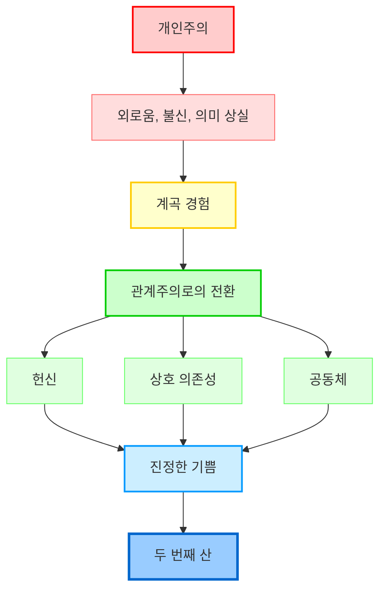
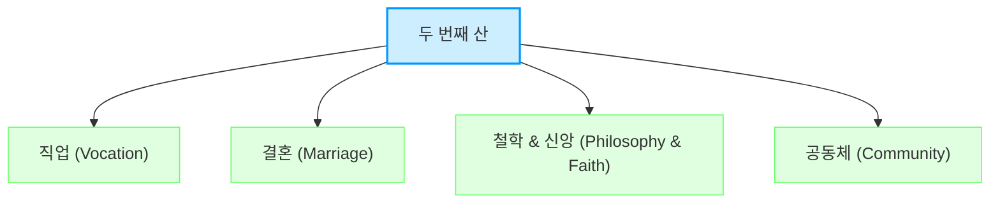
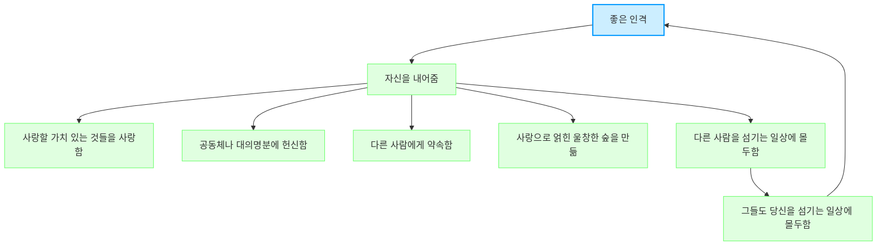

## 데이비드 브룩스의 '두 번째 산': 도덕적 삶을 향한 여정
이 책은 우리가 흔히 추구하는 개인적인 성공(첫 번째 산)을 넘어, 타인과 공동체에 헌신하며 진정한 의미와 기쁨을 찾는 삶(두 번째 산)으로 나아가야 한다고 말한다. 인생의 후반전에서 마주하는 혼란과 공허함을 극복하고, 관계와 헌신을 통해 더 깊고 풍요로운 삶을 살아가는 방법을 제시하는 책이다.

## 1. 첫 번째 산과 두 번째 산: 인생의 두 가지 여정 

우리의 인생은 크게 두 개의 산을 오르는 여정과 같다고 보면 돼.

1. 첫 번째 산**: 개인적인 성공을 향한 질주**
  - 이 산은 우리가 사회에서 흔히 말하는 성공을 좇는 시기야. 마치 게임에서 레벨업하고 아이템을 모으는 것처럼, 개인적인 성공, 명성, 돈, 소유 같은 것들을 추구하는 단계라고 보면 돼 .
  - 주로 20대에서 40대까지 사람들이 이 산을 열심히 오르지 . 학교를 졸업하고 좋은 직장을 얻고, 결혼하고 아이를 낳는 것까지도 이 첫 번째 산의 목표가 될 수 있어 .
  - 이 시기에는 '나' 자신을 확립하고, '나'의 능력을 증명하는 데 집중하는 경향이 강해. 이걸 '초개인주의(hyper-individualism)'라고 부르는데, 마치 내가 다른 사람들보다 더 뛰어나다고 생각하는 것과 같아 .
  - 예를 들어, 인스타그램에 멋진 여행 사진이나 비싼 물건 사진을 올리면서 '나 이렇게 잘 살아!' 하고 자랑하는 모습이 바로 이 '인스타그램식 삶(aesthetic life)'이야 .
  - 이런 삶은 성과와 업적을 중요하게 여기는 '능력주의(meritocracy)' 사회에서 더 심해지지. 사랑이나 봉사보다는 생산성, 끈기, 자기 훈련 같은 개인적인 능력에만 초점을 맞추는 거야 .
  - 하지만 이 산의 정상에 오르면 '이게 다인가?' 하는 허무함이나 공허함을 느끼는 경우가 많아 . 마치 열심히 게임을 깼는데, 막상 엔딩을 보니 별 감흥이 없는 것과 비슷하다고 보면 돼.

2. 계곡**: 전환점과 고통의 시간**
  - 첫 번째 산의 정상에서 허무함을 느끼거나, 예상치 못한 실패, 질병, 이혼 같은 큰 어려움을 겪으면 '계곡'으로 내려오게 돼 .
  - 이 계곡은 심리적인 고통과 삶의 괴로움이 가득한 곳이야. 마치 깊은 늪에 빠진 것처럼 느껴질 수 있지 .
  - 이 시기에는 '내가 왜 살고 있지?', '내 삶의 진짜 목적은 뭐지?' 같은 근본적인 질문을 다시 던지게 돼 .
  - 고통은 우리에게 세 가지 중요한 교훈을 준다고 해 .
  - <mark>감사함</mark>을 알게 해줘: 고통을 겪어봐야 평범한 일상에 감사하게 되지.
  - <mark>반응</mark>을 요구해: 고통을 덜기 위해 뭔가를 하려고 노력하게 돼.
  - <mark>자기 충족감의 환상</mark>을 깨뜨려: '나 혼자서도 다 할 수 있어!'라는 생각이 얼마나 어리석었는지 깨닫게 해줘.
  - 이 계곡은 혼자 힘으로는 벗어나기 어려워. 누군가의 도움이 필요하고, 공동체 안에서 구원을 찾게 된다고 해 .

3. 두 번째 산**: 헌신과 관계의 삶**
  - 계곡을 지나면 비로소 '두 번째 산'을 오를 준비가 돼. 이 산은 첫 번째 산과는 완전히 다른 목표를 가지고 있어 .
  - 두 번째 산은 '나'를 잊고 <mark>타인, 직업, 신앙, 공동체</mark>에 온전히 헌신함으로써 진정한 기쁨을 발견하는 단계야 .
  - 이 산에서는 '나'의 성공보다는 '우리'의 성장을 중요하게 여겨. 다른 사람들을 돕고, 세상에 기여하는 삶을 추구하는 거지 .
  - 이것을 '관계주의(relationalism)'라고 부르는데, 극단적인 개인주의나 집단주의가 아닌, 개인과 공동체가 서로 연결되어 따뜻한 관계를 맺는 것을 의미해 .
  - 관계주의는 헌신을 통해 관계를 만들고, 인간의 초월성(인간이 가진 위대한 가능성)을 높이는 행동을 우선시해 .
  - 예를 들어, 함께 이야기하고, 춤추고 노래하고, 공동 프로젝트를 하고, 식사를 나누고, 서로 위로하며 공동선을 위해 함께 노력하는 것들이 여기에 해당돼 .
  - 두 번째 산을 오르는 여정은 결코 고독하지 않아. 함께 가는 사람들이 있고, 이 산의 정상에 이르면 '나' 자신을 내려놓고 더욱 충만한 삶을 추구하게 된다고 해 .

## 2. 첫 번째 산의 문제점: 초개인주의가 가져온 위기 

데이비드 브룩스는 우리가 살고 있는 현대 사회가 '초개인주의' 때문에 여러 가지 심각한 위기를 겪고 있다고 진단해. 마치 혼자서만 잘 살겠다고 아등바등하다가 결국 모두가 불행해지는 상황과 같다고 보면 돼.

1. **초개인주의의 역사와 특징** 
  - 1910년대부터 1950년대까지는 세계 대전 같은 큰 사건들 때문에 사람들이 서로 돕고 함께하는 '공동체' 문화가 강했어 .
  - 하지만 1950년대와 60년대를 거치면서 '나는 나야! 내 마음대로 살 거야!' 하는 개인의 자유를 추구하는 움직임이 생겨났고, 1970년대에 절정에 달했지 .
  - 이런 흐름 속에서 '나'에게 초점을 맞추는 문화가 생겨났고, 이게 바로 '초개인주의'야 .
  - 초개인주의는 '인스타그램식 삶'으로 나타나는데, 사람들은 자신의 삶에서 가장 멋지고 행복한 순간들만 골라 보여주면서 자신의 성공을 과시하려고 해 .
  - 이런 문화는 '업적 중심주의'를 낳아. 학생들은 공부나 스포츠에서 최고가 되려고 하고, 어른들은 직장에서 성공하기 위해 끊임없이 경쟁하지 .
  - 결국, 이런 초개인주의는 '나'의 성공과 업적에만 몰두하게 만들고, 다른 사람들과의 관계나 공동체의 가치를 소홀히 하게 만들어 .

2. **초개인주의가 가져온 네 가지 사회적 위기** 
  - **외로움의 위기**: 초개인주의는 사람들을 서로 분리시키고 고립시켜. 마치 혼자 사는 섬처럼 외롭게 만드는 거지 .
  - 한국 사회만 봐도 13세 이상 인구의 38.2%가 외로움을 느낀다고 해 .
  - 외로움은 고독사, 은둔형 외톨이, 우울증 증가 같은 심각한 사회 문제로 이어지고 있어 .
  - 심지어 월 소득이 낮은 사람일수록 외로움을 더 많이 느낀다고 하니, 경제적인 어려움도 외로움을 심화시키는 요인이 돼 .
  - **불신의 위기**: 사람들이 서로를 믿지 못하게 돼. 마치 '나만 믿어야지' 하는 생각 때문에 다른 사람들을 의심하게 되는 거지 .
  - 불신은 사회적 관계의 질을 떨어뜨리고, 결국 외로움으로 다시 이어지는 악순환을 만들어 .
  - 하버드 대학교 로버트 퍼트넘 교수는 불신이 가장 큰 사회적 병리 현상이라고 말했어. 사람들이 실제로 서로를 덜 신뢰하게 되면서 사회적 자본(사람들 간의 신뢰와 협력)이 약화된다는 거지 .
  - **의미의 위기**: 삶의 목적이나 의미를 찾지 못하고 방황하게 돼. 마치 나침반 없이 망망대해를 떠도는 배처럼 말이야 .
  - 장 폴 사르트르 같은 실존주의 철학자들은 '인간은 던져진 존재이고, 스스로 의미를 찾아야 한다'고 말했지만, 데이비드 브룩스는 대부분의 사람들이 혼자서는 삶의 의미를 찾기 어렵다고 지적해 .
  - 삶이 힘들어지는 순간에 기댈 만한 의미 있는 이야기를 찾지 못하면 정신 건강에 심각한 위기가 올 수 있어 .
  - 발자크는 '도덕적 고독'이 가장 끔찍하다고 말했는데, 이는 삶의 의미를 잃었을 때 느끼는 깊은 외로움을 의미해 .
  - **부족주의의 위기**: 외로움과 불신 속에서 사람들은 자신과 비슷한 사람들끼리만 뭉치게 돼. 마치 자기들만의 울타리를 치고 '우리 편'과 '남의 편'을 가르는 것과 같아 .
  - 부족주의는 공동체의 어두운 면이야. 서로 사랑하고 연결되기보다는, 공통의 적을 만들고 서로를 미워하는 데 기반을 두지 .
  - 이런 사고방식은 '제로섬 게임(zero-sum game)'처럼 삶을 희소한 자원을 둘러싼 투쟁으로 만들어. '내가 이기려면 네가 져야 해'라는 식이지 .
  - 결국 부족주의는 외로운 나르시시스트(자기애가 강한 사람)들을 위한 공동체일 뿐이라고 데이비드 브룩스는 비판해 .

## 3. 자유의 역설: 무제한의 자유가 가져온 끔찍함 

우리는 흔히 자유가 좋은 것이라고 생각하지만, 데이비드 브룩스는 '자유는 끔찍하다(Freedom is terrible)'고 말해 . 마치 너무 많은 장난감을 가진 아이가 오히려 뭘 가지고 놀아야 할지 몰라 혼란스러워하는 것과 같다고 보면 돼.

1. **무제한의 선택권과 고립** 
  - 현대 사회는 개인에게 너무나 많은 '무제한의 선택권'을 줘. '네 마음대로 해', '자유롭게 살아'라고 말하지 .
  - 하지만 이런 무제한적인 자유는 오히려 사람들을 고립시키고 삶의 의미를 잃게 만들어 .
  - 모든 사회적 상호작용이 '이해타산(나에게 이득이 되는지 따지는 것)'으로 변질되면서, 사람들은 공동체로부터 단절돼 .
  - '내 인생은 나의 것'이라는 생각에만 몰두하다 보면, 결국 다른 사람들과의 유대감이 약화될 수밖에 없어 .

2. 자유의 역설**(Paradox of Freedom)** 
  - 진정으로 가치 있는 삶은 '선택지를 계속 열어두는 것'이 아니라고 해. 오히려 자유를 제한하고, 특정 대상에 '헌신(commitment)'할 때 시작된다는 거지 .
  - 이것을 '달콤한 강제(sweet compulsion)'라고 부르는데, 마치 결혼이나 공동체 생활처럼 겉보기에는 자유를 구속하는 것처럼 보이지만, 실제로는 삶에 활력을 주고 더 큰 기쁨을 선사한다는 의미야 .
  - 결혼, 자녀 양육, 공동체 활동, 신앙생활 같은 것들은 모두 '제약'이 따르지만, 이런 제약 속에서 우리는 더 높은 수준의 자유와 기쁨을 경험하게 돼 .
  - 예를 들어, 아이를 키우는 것은 엄청난 희생과 노력이 필요하지만, 아이를 낳은 것을 후회하는 부모는 거의 없잖아? 아이는 '살아있는 선물'이고, 아이에게 헌신하면서 부모는 더 풍요로운 삶을 경험하게 되는 거지 .

3. **헌신을 통한 해방** 
  - 진정한 자유는 '헌신'을 통해 얻을 수 있어. '나'에게만 집중하던 것에서 벗어나, '공동체'를 향해 '나' 자신을 기꺼이 내어줄 때 비로소 해방감을 느끼게 돼 .
  - 이것을 '소명(calling)'이라고 부르는데, 마치 이 세상에 태어난 목적을 발견하고 그 목적을 위해 자신을 바치는 것과 같아 .
  - 우리는 게으름, 무기력, 타인의 기대, 나약함, 두려움 같은 것들로부터 자유로워져야 해. 그리고 이런 자유는 '자기 절제'와 '의식적인 노력'을 통해 얻을 수 있다고 해 .
  - 독서와 여행을 통해 내면의 힘을 기르고, 버킷리스트(죽기 전에 하고 싶은 일 목록)를 작성해서 도전적인 목표를 세우는 것도 좋은 방법이야 .

## 4. 관계주의로의 전환: 함께하는 삶의 중요성 

데이비드 브룩스는 개인주의를 극복하고 '관계주의'로 나아가야 한다고 강조해. 마치 혼자서는 아무리 맛있는 음식을 먹어도 허전하지만, 사랑하는 사람들과 함께 먹으면 더 행복한 것과 같다고 보면 돼.

1. **관계주의의 정의와 특징** 
  - 관계주의는 극단적인 개인주의와 집단주의 사이의 '중도'를 의미해 .
  - 극단적인 개인주의는 개인을 모든 깊은 관계로부터 분리시키고, 집단주의는 개인을 지워버리고 집단을 얼굴 없는 무리로 보지 .
  - 관계주의는 각 개인을 따뜻한 헌신으로 촘촘하게 연결된 그물망의 한 부분으로 봐 .
  - 관계주의자들은 다양한 방식으로 헌신하며, 신성한 끈으로 묶인 다양한 사람들과 함께 이웃, 국가, 세계를 건설하고자 해 .
  - 첫 번째 산에서는 주로 '사고파는 관계(거래)'가 많지만, 두 번째 산에서는 '주고받는 관계'를 갖게 돼 .
  - '내가 남에게 무언가를 줄 때만 나는 무언가를 소유하며, 위대한 무언가에 굴복할 때 나는 강하다'는 말이 관계주의의 핵심을 잘 보여줘 .

2. **관계주의자들이 추구하는 삶** 
  - 헌신을 심화시키고 관계를 구축하며, 인간의 초월성(인간이 가진 위대한 가능성)을 높이는 행동을 우선시해 .
  - 구체적으로는 다음과 같은 행동들을 포함해 .
  - 주고 이야기하기, 춤추고 노래하기
  - 공동 프로젝트, 모임, 식사, 의식
  - 심오한 공동 기도, 용서
  - 아름다움 창조
  - 슬픔과 위협의 시기에 서로 위로하기
  - 공동선을 위한 공동 노동

3. **대화의 중요성: 감소자와 **조명자 
  - 우리의 대화는 대부분 '얼마나 바쁜지'에 대한 이야기로만 이루어져 있어 .
  - 이런 '바쁜 삶의 함정'은 대화의 질을 떨어뜨리고, 인간관계의 깊이를 상실하게 만들어 .
  - 데이비드 브룩스는 사람을 두 종류로 나눠 .
  - 감소자**(Diminisher)**: 빛을 줄이는 사람. 삶의 연결성이 떨어지고, 유대감이 약하며, 쉽게 외로워지고 소외감을 스스로 만들어내 . 상대방을 가치 없는 존재로 여기는 경향이 있어 .
  - **조명자(Illuminator)**: 빛을 비추는 사람. 마치 세상의 빛처럼 다른 사람들을 밝혀주는 사람이야 .
  - 조명자가 되기 위해서는 '대화의 기술'과 '존중'이 필요해 .
  - 상호 존중의 분위기 속에서 마음 놓고 대화할 수 있어야 해 .
  - '생각하며 말하기(articulating)'와 '사랑스럽게 듣기(lovely listening)'가 중요하다고 해 .
  - '적극적인 경청(active listening)'을 통해 상대방에게 주의를 집중하고 이해하려는 노력이 필요해 .
  - 결국, '사랑은 모든 허물을 덮는다'는 말처럼, 사랑으로 대화하고 관계를 맺는 것이 중요하다고 해 .

## 5. 두 번째 산을 오르는 네 가지 헌신 

두 번째 산을 오르기 위해서는 네 가지 영역에서 헌신해야 한다고 데이비드 브룩스는 말해. 마치 인생이라는 큰 그림을 완성하기 위해 네 가지 색깔의 물감이 필요한 것과 같다고 보면 돼.

1. **직업(**Vocation**)에 대한 **헌신 
  - '직업(career)'은 첫 번째 산에서 성공을 위해 거쳐가는 일의 경로를 말하지만, '소명(vocation)'은 자신의 내면적인 욕구와 다른 사람들을 돕는 방법을 찾아가는 것을 의미해 .
  - 소명은 '나'의 이득보다는 '다른 사람'을 돕고, '나'의 열정을 통해 세상에 기여하는 데 초점을 맞춰 .
  - **수태고지(Annunciation)의 순간**: 살면서 문득 어떤 일에 강하게 이끌리거나, '이것이 내 길이다!' 하고 깨닫는 순간이 있어. 마치 운명처럼 느껴지는 그 순간이 바로 수태고지의 순간이야 .
  - 이런 순간은 보통 어릴 때 찾아오지만, 나중에야 그 의미를 깨닫는 경우도 많아 .
  - 예를 들어, 어릴 때 막연히 '목회자가 되어야겠다'고 생각했던 사람이 나중에 교회에서 일하게 되는 경우가 여기에 해당돼 .
  - **관심과 동기 부여의 중요성**: 직업을 선택할 때는 '관심'을 무시하지 말아야 해. 지식은 많지만, 어떤 일을 꾸준히 해나갈 '동기 부여'는 희소하기 때문이야 .
  - **'예스'라고 말하기**: 젊은 시절에는 다양한 경험을 위해 '모든 것에 예스'라고 말해보는 것이 중요해. 어떤 경험이 나를 어디로 이끌지 알 수 없기 때문이야 .
  - 마치 물고기가 낚싯바늘에 걸리기를 기다리는 것처럼, 다양한 기회에 자신을 노출시키고, 강하게 이끌리는 것이 있다면 '이것이 나에게 충분히 큰 일인가?', '내가 이 일을 할 수 있는 독특한 위치에 있는가?', '정말 열정적인가?'라고 질문해야 해 .
  - **빅터 프랭클의 교훈**: 빅터 프랭클의 '죽음의 수용소에서'라는 책에서처럼, 고통 속에서도 삶의 의미를 찾고, 다른 사람을 돕는 데서 진정한 소명을 발견할 수 있어 .

2. **결혼(Marriage)에 대한 **헌신 
  - 결혼은 수십 년에 걸친 '헌신'이야. 열정은 젊을 때 절정에 달하지만, 결혼은 나이가 들어서야 진정한 의미를 찾게 된다고 해 .
  - 결혼은 '계약(transaction)'이 아니라 '관계(relationship)'라고 보면 돼. 계약은 이득을 따지지만, 관계는 서로의 변화와 성장을 중요하게 여기지 .
  - **최고의 결혼(**Maximal Marriage**)**: 개인주의 문화는 결혼의 진정한 의미를 약화시키지만, 최고의 결혼은 '나'의 목표에서 벗어나 '우리'의 목표를 향해 나아가는 거야 .
  - '상대방의 승리에서 기쁨을 찾는 것'이 중요해. 마치 내 배우자가 잘 되는 것이 내가 잘 되는 것보다 더 기쁜 것과 같다고 보면 돼 .
  - 결혼은 '두 사람이 함께 시작하는 희망찬 혁명'과 같아. 서로가 어떤 변화를 겪을지 모르지만, 관계에 헌신하며 함께 헤쳐나가는 거지 .
  - 상호 의존성**(**Interdependence**)**: 결혼은 '상호 의존성'에 대한 헌신이야. '나' 혼자 잘 사는 것보다는 '우리'가 함께 잘 사는 것을 목표로 하는 거지 .
  - 서로의 미묘한 차이를 이해하고, 상대방의 필요를 채워주기 위해 노력해야 해 .
  - **다리를 불태우는 **용기: 결혼은 '모든 것을 걸고 뛰어드는 것'이 안전하다고 해. 반쯤만 발을 담그는 것은 위험하다는 거지 .
  - 이혼은 갈등이 늘어날 때보다 '긍정적인 것'이 줄어들 때 발생해 .
  - 상대방에게 기쁨, 놀라움, 사랑을 주려고 노력하면 긍정적인 관계를 만들 수 있어 .
  - 결혼은 '열정과 냉정 사이', '두통과 기쁨 사이'를 오가는 여정과 같지만, 이 모든 것을 통해 우리는 성장하고 더 깊은 사랑을 배우게 돼 .

3. **철학 및 신앙(Philosophy & Faith)에 대한 **헌신 
  - 이 부분은 저자의 개인적인 신앙 여정(유대교에서 기독교로의 전환)을 깊이 다루고 있어 .
  - **대학 교육의 변화**: 과거 미국 대학들은 학생들에게 삶의 궁극적인 질문에 답하고 '전인적인 인간'으로 성장하도록 돕는 '인본주의적 이상'을 추구했어 .
  - 하지만 시간이 지나면서 '연구 중심'으로 바뀌면서, 삶의 전체적인 그림보다는 작은 부분에만 집중하게 됐지 .
  - **벽과 **경사로: 사람들에게 신앙이나 영적인 가치를 전할 때 '벽'을 쌓는 행동과 '경사로'를 놓는 행동이 있다고 해 .
  - **벽을 쌓는 행동**: 나쁜 경청, 침해적인 도움(상대방이 원하지 않는데 도와주려는 것), 지적인 평범함 같은 것들이 여기에 해당돼 .
  - **경사로를 놓는 행동**: 의식, 꾸밈없는 믿음, 기도, 영적인 의식, 선과 악의 언어 같은 것들이 사람들이 영적인 가치를 받아들이기 쉽게 만들어 .
  - **'아래에서 위로(down-and-out)'의 접근 방식**: '내가 더 잘 알아!'라고 주장하기보다는, 먼저 다른 사람들을 진심으로 돌보고 그들의 상황을 개선하려는 노력이 중요해 .
  - 예를 들어, 교회가 지역 주민들을 위해 무료로 축제를 열고 음식을 나누어주면서 '하나님이 당신을 사랑합니다'라고 말하는 것이 여기에 해당돼 .
  - **지성과 신앙의 균형**: 지성(이성)과 신앙(영성, 감성)은 서로 모순되는 것처럼 보일 수 있지만, 이 둘의 균형을 맞추는 것이 진정한 지혜라고 해 .
  - 도덕적 자유: 진정한 자유는 '도덕적 자유'에서 온다고 해. 양심에 떳떳하고, 옳다고 생각하는 대로 행동할 수 있는 자유를 의미해 .
  - 경제적 자유를 넘어 도덕적 자유를 추구해야 해. 인생 후반전에 망가지는 사람들은 경제적 자유는 얻었지만 도덕적 자유를 잃은 경우가 많다고 해 .

4. **공동체(Community)에 대한 **헌신 
  - 공동체는 우리가 함께 삶을 나누고, 서로 관계를 맺으며, 세상을 더 나은 곳으로 만드는 데 기여하는 중요한 영역이야 .
  - **공동체의 성장**: 공동체는 저절로 만들어지는 것이 아니라, '유기적으로' 성장하고 발전해야 해 .
  - 공동체는 '맥락(framing)', '이야기(narrative)', '정체성(identity)', '행동(behavior)'이라는 네 가지 요소를 가지고 있어 .
  - 이런 요소들을 설정하고, 필요에 따라 유연하게 변화시키는 것이 중요해 .
  - **연결을 촉진하는 방법**: 공동체 안에서 사람들이 서로 연결되도록 돕는 것이 중요해 .
  - 모임이나 이벤트를 통해 사람들이 서로 소통하고 관계를 맺을 수 있는 기회를 만들어야 해 .
  - 이때 '의도적인 노력'이 중요해. 장기적인 계획보다는, 매 순간의 상호작용에서 어떻게 연결을 만들지 고민해야 해 .
  - **관계는 확장되지 않는다**: 관계는 기술이나 효율성으로 '확장(scale)'할 수 없어. 마치 자동화할 수 없는 것처럼, 관계를 맺는 데는 '시간'과 '노력'이 필요해 .
  - 하지만 관계는 그만큼 가치 있는 것이고, 사람이야말로 가장 중요한 존재라고 해 .
  - **'온 마을이 필요하다'**: 아프리카 속담처럼 '한 아이를 키우려면 온 마을이 필요하다'는 말은 공동체의 중요성을 잘 보여줘 .
  - 어린아이들에게 좋은 말을 해주고, 작은 선물이라도 나누어주면서 '주는 정신'을 가르치는 것이 중요해 .
  - 노인들에게도 따뜻한 인사와 공감을 건네는 것이 큰 위로가 될 수 있어 .
  - **소속감의 중요성**: 사람들은 '소속감'을 통해 안정감을 느껴. 하지만 현대 사회는 소속감을 거부하고 혼자 있으려는 경향이 강해 .
  - 어떤 공동체에 소속되기 위해서는 '회비'나 '등록금'처럼 대가를 지불해야 할 때도 있지만, 그만큼 자부심과 성장을 얻을 수 있어 .

## 6. 삶의 목표: 행복을 넘어 기쁨으로 

우리는 모두 행복해지고 싶어 하지만, 데이비드 브룩스는 '행복'은 결함이 있는 목표라고 말해. 마치 파랑새를 쫓는 것처럼, 행복은 잡으려 할수록 멀어지는 것과 같다고 보면 돼.

1. **행복의 결함과 한계** 
  - 행복은 '일시적인 상태'야. 성취감이나 만족감과 관련이 있지만, 이런 감정은 오래가지 않아 .
  - 행복을 쫓는 삶은 '만족의 순간'과 '불만족의 시간'을 끊임없이 오가는 여정과 같아 .
  - 행복은 '자기 중심적'인 경향이 있어. '나'의 목표와 욕망에 모든 것을 두기 때문에, 다른 사람의 불행을 보면서 오히려 기뻐하는 이기적인 마음이 생길 수도 있지 .
  - '당신 자신만을 위해 사는 삶에는 왜소함이 있고, 타인을 위해 사는 삶에는 웅대함이 있다'는 말이 행복의 한계를 잘 보여줘 .

2. **기쁨(Joy)의 발견** 
  - 기쁨은 행복보다 더 깊고 지속적인 감정이야. 마치 하나님이 주신 선물처럼, 공동체에 헌신할 때 얻을 수 있는 소중한 감정이지 .
  - 기쁨은 '나'를 잊고 '다른 사람'을 돌아보는 삶을 살 때 얻게 돼 .
  - '남을 행복하게 해야 본인도 행복해지는 법'을 깨닫는 것이 중요해 .
  - 기쁨은 '내면의 충만함'과 '도덕적 자유'에서 와. 양심에 떳떳하고, 다른 사람을 사랑하며, 세상에 기여하는 삶을 살 때 진정한 기쁨을 느낄 수 있어 .

3. **반란에 맞서 반란을 일으키다** 
  - 우리는 이제 '시간 낭비'를 멈추고 '두 번째 산'을 오르기 시작해야 해 .
  - 이것은 기존의 사회, 저질적인 문화, 부패, 방종에 대한 '반란'을 의미해 .
  - 넓은 길(대부분의 사람들이 가는 길)을 거부하고, 좁은 문(헌신과 관계의 길)을 향해 주체적으로 나아가는 것이 바로 이 반란이야 .
  - 두 번째 산의 정신은 '세상은 마법과도 같은 세상이며, 도덕적이고 감정적인 드라마'라고 말해 .
  - '타인을 사랑하기 전에 먼저 자신을 사랑해야 한다'는 개인주의의 주장과 달리, 두 번째 산의 정신은 '사랑받기 위해서는 먼저 사랑해야 한다'고 말해 .

## 7. 좋은 인격과 삶의 선물 

결국 데이비드 브룩스는 '좋은 인격'이야말로 두 번째 산을 오르는 여정의 최종 목적지라고 말해. 마치 잘 가꾼 정원이 아름다운 꽃을 피우는 것처럼, 좋은 인격은 풍요로운 삶을 만들어낸다고 보면 돼.

1. **좋은 인격의 본질** 
  - 좋은 인격은 '자신을 내어주는 것'의 결과물이야. 마치 씨앗이 자신을 흙 속에 내어주어야 열매를 맺는 것처럼 말이야 .
  - 사랑할 가치가 있는 것들을 사랑하고, 공동체나 대의명분(큰 뜻)에 헌신하며, 다른 사람에게 약속하고, 사랑으로 얽힌 울창한 숲을 만드는 것이 좋은 인격의 특징이야 .
  - 다른 사람들을 섬기는 일상에 몰두하는 동시에, 그들도 당신을 섬기는 일상에 몰두하는 '주고받는 관계'가 좋은 인격의 핵심이라고 해 .

2. **삶은 선물이다** 
  - 삶은 그 자체로 '선물'이야. 매 순간이 영원한 행복이 될 수 있는 소중한 것이지 .
  - 우리는 지금 이 순간에 행복하고, 그 행복을 다른 사람들에게 나누어주는 사람이 되어야 해 .
  - 내면의 기쁨(joy)과 도덕적 자유, 그리고 양심을 가지고 삶의 후반전을 헌신된 삶으로 살아가야 한다고 데이비드 브룩스는 강조해 .
  - '어메이징 그레이스'의 작가 존 뉴턴처럼, 노예선 선장에서 목회자로 변모하여 노예 해방에 기여한 삶이 바로 두 번째 산을 오르는 헌신적인 삶의 예시라고 할 수 있어 .

3. **남은 시간의 중요성** 
  - 우리는 '남은 시간이 지나온 시간보다 적다'는 것을 깨달을수록 더 깊은 관계를 추구하게 돼 .
  - 감정 조절 능력과 공감 능력 같은 관계 영성은 나이가 들수록 더욱 발달하게 된다고 해 .
  - 데이비드 브룩스는 우리를 '두 번째 고개'와 '약속의 땅'으로 이끌어줄 원동력이 될 수 있다고 말하며, 이 여정에 동참할 것을 권유해 .

