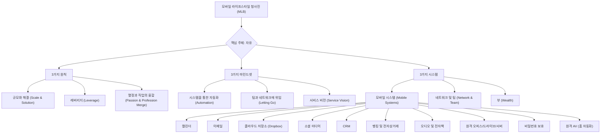

## 레버리지: 자본주의 속에 숨겨진 부의 비밀
이 책은 우리가 돈을 위해 열심히 일하는 방식에서 벗어나, 더 적은 노력과 시간으로 더 많은 것을 성취하는 '레버리지'의 비밀을 알려준다. 단순히 돈을 빌리는 것을 넘어, 삶의 모든 영역에서 지렛대 원리를 활용해 원하는 삶을 살고, 풍요로운 유산을 남기는 방법을 제시한다.

## 1. 레버리지란 무엇일까? 

1. 지렛대 원리
  1. 레버리지는 마치 지렛대처럼 작은 힘으로 무거운 것을 들어 올리는 원리이다. 
  2. 이 책에서 말하는 레버리지는 단순히 대출(돈을 빌리는 것)만을 의미하지 않는다. 
  3. 우리의 삶에서 생산성을 높이고, 더 많은 부가가치를 만들며, 부자가 되기 위해 반드시 알아야 할 지렛대 원리를 설명한다. 
  4. 레버리지는 <mark>당신이 살아있음을 느끼지 못하게 만드는 모든 것을 아웃소싱하는 기술</mark>이다. 
  5. 당신의 목표와 비전에 따라 삶을 살아가는 태도이며, 돈을 벌고 지속적인 변화를 만들기 위해 당신의 가치를 우선하고 그 외의 모든 것을 줄이거나 제거하는 기술이다. 
  6. 당신의 시간을 가장 크고 지속적인 부를 창조하는 데 사용하고, 할 수 없거나 하기 싫지만 성취해야 하는 시간 낭비를 없애는 시스템이다. 
  7. 당신이 잘하는 일을 하고, 잘하지 못하는 것은 다른 사람에게 맡기는 기술이다. 
  8. 어린이집에 아이를 보내는 것도 시간과 노동력을 레버리지하는 한 가지 방법이다. 
  9. 결국, 내가 원하는 삶을 살기 위해 중요한 시간과 가장 큰 소득을 만들어내는 시간을 제외하고는 모두 다른 사람이나 시스템에 맡기는 삶의 방식이다. 

2. **레버리지의 두 얼굴: 포식자와 먹잇감** 
  1. 자본주의는 야생과 같아서 포식자와 먹잇감이 존재한다. 
  2. 우리는 누구나 레버리지를 경험하는데, 당신은 누군가를 레버리지하는 포식자인가, 아니면 레버리지 당하는 먹잇감인가? 
  3. 대부분의 사람들은 레버리지 당하고 있다고 생각하며 화를 내지만, 동시에 우리도 누군가를 레버리지할 수 있다는 사실을 잊는다. 
  4. 마치 먹이사슬의 최상단에 있는 사자나 호랑이도 결국 죽으면 땅으로 돌아가 다른 생명체의 먹이가 되는 것처럼, 세상은 순환한다. 
  5. 중요한 것은 내가 레버리지 당하는 동시에 레버리지하겠다는 마음을 갖는 것이다. 

3. **부자들의 **레버리지** 활용법** 
  1. 부자들은 레버리지를 이용해 더 적은 것으로 더 많은 것을 성취한다. 
  2. 더 적은 돈으로 더 많은 돈을 벌고, 더 짧은 시간을 투자해서 더 많은 시간을 얻으며, 더 적은 노력으로 더 많은 성과를 얻는 방법을 알고 있다. 
  3. 이것을 '최소 노력의 법칙'이라고 부른다. 
  4. 경제적으로 여유가 생긴 직장인들은 보통 차를 사지만, 이는 낮은 수준의 레버리지 활용이다. 
  5. 진짜 부자들은 돈을 벌기 위해 모든 것을 직접 하기보다, 누군가에게 위임하거나 다른 사람의 자원을 끌어들인다. 
  6. 예를 들어, 벤츠를 1억 주고 사는 대신 카카오 택시를 타거나 기사를 고용한다. 
  - 벤츠의 연간 감가상각비(가치가 줄어드는 비용)가 2천만 원이라면, 월 150~160만 원 정도인데, 이 돈이면 직접 운전할 필요가 없다. 
  - 운전하는 시간에 책을 읽거나 업무를 정리하며 더 많은 부가가치를 창출할 수 있다. 
  - 유명 유튜버 신사임당도 타다를 타고 이동하며 유튜브 방송 편집을 했다고 한다. 
  7. 부자들은 청소나 요리 같은 집안일을 직접 하지 않고 위임한다. 
  - 많은 사람들이 '그래도 어떻게 맡겨?', '성에 차지 않아'라며 직접 하지만, 부자가 될 사람들은 이런 부분을 잘 활용한다. 
  - 작가는 아내가 힘들어하자 청소 도우미를 고용했는데, 한 번에 4만 원 정도의 비용으로 아내가 쉬거나 아이와 시간을 보낼 수 있게 했다. 
  - 이것이 바로 레버리지 개념이다. 
  8. 워렌 버핏은 자신이 대주주로 있는 회사의 직원이 수십만 명이지만, 버크셔 해서웨이 본사 직원은 50명도 안 된다. 
  - 그는 믿을 만한 회사와 경영자가 있으면 주식만 사서 보유하고, 기업 가치가 올라가면 함께 부를 늘린다. 
  - 이것이 바로 '만사 레버리지'이다. 
  9. 부자들은 내가 직접 부가가치를 창출할 필요가 없다고 생각하며, 직접 하면 안 된다고 말한다. 
  10. 모든 소득이 월급이나 연봉처럼 내가 직접 일해서만 나온다면, 부자가 되기 어려운 구조라고 깨달아야 한다. 

## 2. 시간의 가치를 높이는 레버리지 전략 

1. **세 가지 시간 유형** 
  1. 낭비된 시간** (**Time Wasted**)**: 쓸데없는 일에 허비하는 시간이다. 
  - 누구나 낭비에 중독되기 쉽다. 
  - 이 시간은 완전히 없애야 한다. 
  2. 소비된 시간** (**Time Spent**)**: 지속적인 이익을 창출하지 못하는 시간이다. 
  - 시급으로 일하거나 기계적인 업무를 수행하는 데 소비되는 시간이다. 
  - 성공하지 못하는 사람들은 대부분의 시간을 소비해 버린다. 
  - 이 시간은 절대로 되돌릴 수 없다. 
  - 하지만 살아가기 위해 반드시 필요한 소비된 시간도 있다. 
  - 직장인에게는 회사에서 일하는 시간이 이에 해당하며, 이 시간이 없으면 투자할 종잣돈(시드머니)이 나오지 않는다. 
  3. 투자된 시간** (**Time Invested**)**: 업무가 완료된 이후에도 지속적이고 반복적인 수익을 올리거나 레버리지 효과를 제공하는 시간이다. 
  - 부동산 투자나 지식을 쌓는 것이 대표적인 예이다. 
  - 새로운 지식은 남은 삶을 레버리지할 수 있게 만든다. 
  - 낭비된 시간을 없애고, 소비된 시간을 줄이며, 투자된 시간을 늘려야 한다. 

2. **시간 가계부 작성** 
  1. 당신의 시간이 얼마의 가치가 있는지 측정해 보아야 한다. 
  2. 예를 들어, 일주일에 55시간 일해서 80만 원을 벌었다면, 시간당 소득은 약 1,500원이다. 
  3. 이제 당신은 1,500원을 초과하여 벌 수 있는 일은 직접 하고, 1,500원 미만의 금액을 지불하고 위임할 수 있는 일은 모두 위임해야 한다. 
  4. 마치 가계부를 쓰듯이, 당신의 24시간을 낭비된 시간, 소비된 시간, 투자된 시간으로 나누어 정리해 보아야 한다. 
  5. 각 시간의 부가가치가 얼마인지 체크해 본다. 
  6. 부자가 되는 사람들은 투자된 돈이 많을수록 부자가 될 확률이 높듯이, 시간도 마찬가지이다. 

3. 시간의 복리 효과 
  1. 복리의 법칙은 어떤 일을 더 오래할수록, 즉 끝에 더 가까이 다가갈수록 최대의 이익과 가속도를 얻는다는 것을 의미한다. 
  2. 하지만 대부분의 사람들은 보상을 얻기 직전에 포기하고 방향을 바꾼다. 
  3. 마치 씨앗을 심은 다음 날에 나무가 어디 있냐고 소리치는 사람은 없는 것처럼, 과일을 얻으려면 먼저 나무가 뿌리를 내려야 한다. 
  4. 눈에 보이지 않는 것이 드러나기를 원한다면, 눈에 보이지 않는 것을 볼 수 있어야 한다. 
  5. 작가는 4년 만에 억만장자가 되었고, 그 후 14억 이상의 수익을 올렸는데, 처음 14억을 버는 데 걸린 시간의 4분의 1도 안 되는 시간에 그 이상의 수익을 올렸다. 
  6. 그 시간은 작가가 살아온 시간 중에서 가장 게을렀던 시간이었고, 가장 적은 양의 일을 하고 최대의 소득을 올린 것이다. 
  7. 하룻밤 사이에 성공을 이룬 것처럼 보이는 사람들은 실제 과정을 위해 뿌리가 깊게 자리 잡을 때까지 시간을 투자한 사람들이다. 
  8. 시간이 지나면 그 시간은 반드시 복수한다. 
  - 시간을 준비했으면 보상을 줄 것이고, 준비하지 않고 흘려보내면 그에 따른 대가를 치르게 된다. 
  - 직장 생활을 하는 사람들 중 퇴근 후 시간을 어떻게 쓰느냐에 따라 처음에는 차이가 보이지 않지만, 2~3년이 지나면 2배, 3배의 차이로 돌아온다. 
  9. 돈그릇을 키우기 위한 방법은 책, 강의, 인맥 등과 같은 인풋(투자)과 시간의 복리를 얻는 것이다. 

4. **포기하지 않는 인내심** 
  1. 많은 사람들이 투자를 시작하고 시간이 지나도 눈에 보이는 결과가 없으면 포기한다. 
  2. 하지만 씨앗이 새싹이 되고 줄기가 자라 열매를 맺는 것처럼, 기다림이 중요하다. 
  3. 작가는 2009년 분당 아파트를 최고점에 샀지만, 2015년까지 가격 변동이 없었다. 
  4. 많은 사람들이 팔았지만, 기다리자 갑자기 2억, 3억 5천, 6억, 7억까지 올랐다. 
  5. 복리 법칙을 누리려면 '우량 자산'을 보유하고 기다리는 인내심이 매우 중요하다. 
  6. 손흥민 선수나 황희찬 선수처럼, 겉으로 보이는 화려한 성공 뒤에는 꾸준한 노력과 인내심이 쌓여 있다. 
  7. 지금처럼 주식이나 부동산 시장이 안 좋을 때는 인내심을 확인하기 좋은 시기이다. 

## 3. 레버리지를 위한 VVKIK 전략 

1. **V1: **가치** (Value)** 
  1. **나에게 가장 중요한 가치는 무엇인가?** 
  - 자기계발서에서 흔히 나오는 것처럼, 종이에 당신에게 가장 중요한 가치들을 적어보고 우선순위를 매겨본다. 
  - 건강, 가족, 재물, 자유, 모험, 창의력 등 다양한 가치들이 있을 수 있다. 
  - 가족이 가장 중요한 가치일 수도 있고, 건강이나 돈일 수도 있다. 
  2. **가치를 판단할 때 고려할 점** 
  - 어떤 일에 대부분의 시간을 보내고 있는가? 당신이 적어놓은 가치와 실제로 보내는 시간이 일치하는지 생각해 본다. 
  - 외부적인 압력 없이 하루 종일 하고 싶은 일은 무엇인가? 
  - 무엇에 대해 지속적으로 생각하는가? 당신이 생각하는 가치와 실제 생각이 엇나가지 않는지 따져본다. 
  3. **주기적인 점검** 
  - 매주, 매달, 6개월마다 이 가치 리스트를 다시 정리하고 변하는 것이 없는지 판단해 본다. 

2. **V2: **비전** (Vision)** 
  1. **삶의 목적을 명확히 하라** 
  - 당신은 삶의 명확한 비전을 가지고 있는가? 
  - 비전은 삶의 목적과 같다. 
  - 작가는 죽을 때까지 다른 사람에게 영감, 지식, 삶의 용기를 줄 수 있는 사람이 되고 싶다는 비전을 가지고 있다. 
  - 구글의 비전은 전 세계 정보를 체계화하고 누구나 접근하여 사용할 수 있게 만드는 것이고, 아마존은 사람들이 온라인에서 사고 싶은 상품을 찾을 수 있는 장소를 구축하는 것이다. 
  - 비전이 명확해야 레버리지가 가능해진다. 
  2. **비전을 찾는 질문들** 
  - 당신의 삶은 어떤 목적에 기여하는가? 
  - 다른 사람에게 기여할 수 있는 당신만의 비전은 무엇인가? 
  - 그 비전이 당신에게 중요한 이유는 무엇인가? 
  - 3년, 5년, 10년, 25년, 50년 후에 삶이 어떤 모습이기를 원하는가? 
  - 사람들에게 어떻게 기억되기를 원하는가? (예: 다정한 사람, 재밌는 사람, 음식을 잘하는 사람, 돈도 많은 사람) 
  - 당신만의 가치에 따라 비전을 고민해 보아야 한다. 

3. **K1: **핵심 결과 영역** (Key Result Areas, KRAs)** 
  1. **비전 달성을 위한 핵심 영역** 
  - KRAs는 비전을 성취하기 위해 초점을 맞춰야 하는 최고의 가치 영역이다. 
  - 당신의 기업, 팀, 개인을 변화시키기 위해 대부분의 시간을 투자해야 하는 핵심 중의 핵심 가치이다. 
  - 구글의 OKR(목표 및 핵심 결과) 기법처럼, 구체적인 행동 강령을 만들어 지표를 설정할 수 있다. 
  - 예를 들어, '다정한 사람'이 비전이라면, '아이에게 매일 사랑한다고 말하고 안아주기'와 같은 지표를 만들 수 있다. 
  - 돈을 버는 비전이라면, '하루에 50만 원의 가치를 만드는 일을 4번 하기'와 같이 지정할 수 있다. 
  2. **KRAs의 중요성** 
  - KRAs는 당신의 팀, 회사, 유산에 최대한의 영향을 미치기 위해 대부분의 시간을 투자하는 3~7가지 핵심 영역이다. 
  - 전략적이고 레버리지 가능한 업무와 기능(예: 관계 개발, 네트워크 구축, 시스템 개발, 자금 조달, 사업 계획, 자기 교육 등)이 이에 해당한다. 
  - 일상적인 세부 업무에 갇히거나 다른 사람의 KRAs에 휘둘리면, 당신의 KRAs에 대한 집중력을 잃게 된다. 
  - KRAs는 명확성을 제공하고, 목표와 비전으로 가는 가장 짧은 길을 제시하며, 압도감과 좌절감을 즉시 해소해 준다. 
  - 직원들에게도 명확한 KRAs를 부여하여 업무에 대한 목적의식과 가치를 느끼게 해야 한다. 

4. **I: **소득 창출 업무** (Income Generating Tasks, IGTs)** 
  1. **수익과 직결되는 핵심 업무** 
  - IGTs는 당신이나 당신의 회사에 가장 높은 가치를 제공하며, KRAs와 일치하는 업무이다. 
  - 시간당, 분당, 초당 최대의 수익을 창출하고, 최소한의 시간 낭비로 최대한의 이익을 가져오는 업무이다. 
  - 당신이 하는 일이 정확히 소득을 창출하는 업무인지 계속 체크해야 한다. 
  2. 80/20** 법칙 (**파레토의 법칙**) 적용** 
  - 20%의 시간이 80%의 소득을 만드는 시간일 수 있다. 
  - 하루 업무 중 20%의 중요한 일을 한 시간이 회사에서 만들어낸 가치의 80%일 수 있다. 
  - 나머지 80%의 시간은 버려질 수 있다. 
  - 만약 20%만 일하고 80%를 놀아도 충분한 소득이 발생한다면, 그렇게 해도 된다. 
  - 하지만 더 많은 소득을 원한다면, 20%가 아닌 40%로 소득 창출에 집중하는 등 행동 패턴을 바꿔야 한다. 
  - 부동산 투자나 사업처럼 소득 창출 능력이 높은 분야에 힘을 쏟을 필요가 있다. 
  - 회사에서 영업이나 디자인 분야에서 소득 창출에 집중하여 높은 성과를 내면, 회사에서 인정받고 승진하거나 자신의 사업을 시작할 수 있다. 
  3. **자기 위안과 실제 소득** 
  - 아무리 일찍 일어나 책을 읽고 자기계발을 해도, 소득 창출 업무가 없으면 헛헛함을 느낄 수 있다. 
  - 실제 소득 창출 업무에 집중하는 것이 중요하다. 

5. **K2: **핵심 성과 지표** (Key Performance Indicators, KPIs)** 
  1. **측정하지 않으면 마스터할 수 없다** 
  - KPIs는 사업, 기업, 개인 목표를 발전시키고 실수를 줄이며 레버리지를 최적화하는 중요한 지표이다. 
  - 측정하지 않으면 마스터할 수 없다. 
  - KPIs는 당신의 사업에서 실시간으로 무엇이 잘되고 무엇이 잘못되고 있는지 알려주는 중요한 데이터이다. 
  2. **KPIs의 중요성** 
  - 사업이 성장할수록 KPIs는 더욱 중요해진다. 
  - 가장 흔한 실수는 KPIs를 너무 늦게 설정하거나 아예 설정하지 않는 것이다. 
  - KPIs는 KRAs에 대한 실시간 피드백을 제공하여, KRAs와 IGTs가 올바른 결과를 내고 있는지 알려준다. 
  - KPIs가 없으면 당신이 잘못된 방향으로 열심히 일하고 있을 수도 있다. 
  - 예를 들어, 판매 조직에서 판매 지표가 없으면 손실을 내는 제품을 많이 팔고 있을 수도 있다. 
  - 대부분의 소규모 사업체가 KPIs를 충분히 시스템화하지 못해 실패하는 경우가 많다. 
  3. **KPIs 설정 방법** 
  - 개인과 사업을 위한 KPIs를 지금 바로 만들기 시작한다. 
  - 목표, 판매, 마케팅, 재무 보고서와 같은 기본적인 지표부터 시작한다. 
  - 데이터 및 사업 성장 관련 서적을 읽는다. 
  - 더 큰 사업을 운영하는 사람들에게 무엇을 측정하는지 묻는다. 
  - 사업의 문제점을 해결하기 위해 노력한다. 
  - 기존 KPIs를 분석하여 새로운 아이디어를 얻는다. 
  - 팀과 고객에게 가장 중요한 부분이 무엇인지, 어떤 정보가 부족한지, 무엇을 시작하고 멈추고 유지해야 하는지 설문조사한다. 

## 4. 레버리지 스킬: 시간 보존을 위한 생산성 해킹 

1. **터치 타이핑** 
  1. 터치 타이핑은 최대의 복합적인 이점을 제공하는 레버리지 기술이다. 
  2. 데이터에 따르면, 평균적인 사무직 근로자는 하루 2시간 30분 동안 이메일 작업을 한다. 
  - 이는 연간 81일에 해당한다. 
  3. 평균적인 사람은 평생 2백만 단어 이상을 타이핑한다. 
  4. 터치 타이핑은 우리 모두에게 필요한 삶의 기술이며, 적은 초기 투자로 문자 그대로 몇 년의 시간을 절약할 수 있다. 
  5. 분당 30단어에서 60단어로 속도를 높이면, 평생 4백만 단어를 더 쓸 수 있다. 
  - 이는 40권의 책을 더 출판하는 것과 같으며, 추가 시간 없이 수백만 파운드의 인세를 벌 수 있다. 
  - 또는 타이핑에 쓰는 시간을 절반으로 줄여 556시간, 즉 23일의 시간을 되찾을 수 있다. 
  6. 지금 바로 터치 타이핑을 배워라. 인터넷으로 독학하거나, 교재를 사거나, 코치를 고용할 수 있다. 

2. **외국어 학습** 
  1. 외국어를 배우는 것은 그 어느 때보다 쉬워졌다. 
  2. 오디오 학습 프로그램을 활용하여 운전 중, 줄 서 있을 때, 산책 중, 헬스장에서 '넷 타임(Net Time)'을 활용할 수 있다. 
  - 넷 타임은 추가 시간 없이 여러 가지 일을 동시에 하는 것을 의미한다. 
  - 모든 것을 기억하려 애쓰지 말고, 배경음악처럼 틀어놓고 무의식에 스며들게 한다. 
  3. 물론 대면 학습이 더 효과적이라는 주장도 있지만, 넷 타임을 활용하면 언어를 전혀 배우지 않는 것, 또는 대면 학습으로 몇 년을 보내는 것보다 훨씬 효율적으로 시간을 절약하며 배울 수 있다. 
  4. 실제로 해당 국가를 여행할 때 부족한 부분을 보완할 수 있다. 
  5. 레버리지의 핵심은 <mark>없는 시간을 쪼개서 무언가를 더 하는 것이 아니라, 더 적은 시간에 더 많은 것을 해내는 것</mark>이다. 

3. **속독** 
  1. 독서 속도를 2배 또는 4배로 늘리는 것은 매우 간단하다. 
  2. 일부 속독가는 분당 1,500단어 이상을 읽을 수 있다. 
  3. 만약 독서 속도를 2배로 늘리면, 하루에 24,000단어를 더 읽을 수 있고, 이는 연간 175권의 책을 더 읽는 것과 같다. 
  4. **속독을 위한 빠른 시작 팁** 
  - **머릿속으로 소리 내어 읽지 마라**: 말을 하듯이 머릿속으로 단어를 소리 내어 읽지 않는다. 연습이 필요하지만 속도를 크게 높일 수 있다. 
  - **뒤로 돌아가지 마라**: 단어나 문장을 다시 읽지 않는다. 이는 많은 시간을 낭비한다. 무의식이 기억할 것이라고 믿고 계속 읽는다. 
  - **줄을 따라가지 말고 훑어보라**: 주변 시야를 활용하여 한 줄 전체를 시각적으로 한 덩어리로 받아들인다. 
  5. 이러한 기술은 몇 분 만에 독서 속도를 2배로 늘릴 수 있다. 

4. **2배속 오디오 학습** 
  1. 2배속 오디오 학습은 삶에서 가장 큰 이점 중 하나이다. 
  2. 오디오는 헬스장, 이동 중, 요리, 청소 등 '넷 타임'을 활용하여 들을 수 있다. 
  3. 처음에는 너무 빠르다고 느껴지지만, 시간이 지나면 2배속이 새로운 표준이 된다. 
  4. 이 기술을 통해 작가는 한 해 동안 109권의 책을 읽었고, 이는 545시간의 학습 시간을 추가 시간 없이 얻은 것이다. 
  5. 아이들과 함께 차 안에서 교육용 오디오를 들려줄 수도 있다. 
  - 작가의 아들은 4살에 세계적인 수준으로 골프를 쳤는데, 이는 골프 오디오를 들려준 덕분이라고 생각한다. 

## 5. 소비를 투자로 바꾸는 재정 레버리지 

1. **소비를 투자 습관으로 전환** 
  1. 소비 습관을 투자 습관으로 바꾸면 80/20 복리 효과를 얻을 수 있다. 
  2. 모든 물질적인 구매를 부채(현금 유출)로 생각하고, 투자자의 관점으로 접근한다. 

2. **구매 전 네 가지 질문** 
  1. **1단계: 그것 없이 지낼 수 있는가?** 
  2. **2단계: **감가상각** 곡선의 바닥에서 중고로 살 수 있는가?** 
  - 작가는 2,000파운드짜리 스피커를 600파운드에 중고로 샀다가 700파운드에 팔아 100파운드의 이득을 보았다. 
  - 다른 사람이 1,000파운드를 손해 보게 하여 당신은 소유 비용을 0으로 만드는 것이 현명하다. 
  - 더 좋은 물건을 즐기면서 동시에 현금을 보존할 수 있다. 
  3. **3단계: 자산으로 바꿀 수 있는가?** 
  - 가치가 오를 수 있는 물건(시계, 보석, 예술품, 골동품 등)을 사는 것은 더 높은 수준의 투자이다. 
  - 희귀하거나 인기 있는 물건은 가치를 유지하거나 상승한다(예: 에르메스 핸드백, 디자이너 가구, 롤렉스 데이토나). 
  - 롤렉스 데이토나와 같은 시계는 인플레이션으로부터 현금을 보호하고 연 7%의 수익을 낼 수 있다. 
  - 데이토나는 초기 자본이 더 많이 들지만, 3년 후 오메가나 브라이틀링보다 실제 소유 비용이 적게 든다. 
  - 오래 소유할수록 복리 효과는 더욱 커진다. 
  4. **4단계: 가치가 더 떨어지기 전에 팔거나 교환할 수 있는가?** 
  - 6~12개월마다 고가 품목의 잔존 가치를 확인한다. 
  - 중고 판매 사이트, 중고차 매매 회사, 인터넷을 활용한다. 
  - 구매 비용을 안전한 폴더에 저장하고 확인한다. 
  - 이를 통해 투자에 대해 계속 배우고, 구매 및 판매 시점을 잘 맞춰 돈을 절약하거나 벌 수 있다. 
  - **자동차 리스/렌트 vs 구매 비교** 
  - 새 차를 구매하면 2년 만에 2만 파운드(약 3천만 원)가 감가상각될 수 있다. 
  - 리스나 계약 렌트는 초기 비용과 월 납입금을 합쳐도 2년 동안 구매보다 훨씬 적은 비용이 든다. 
  - 3년 된 중고차를 구매하는 경우도 감가상각이 느려져 소유 비용이 줄어들 수 있다. 
  - 항상 구매하거나 투자하는 모든 품목의 실제, 때로는 숨겨진 총 소유 비용과 금융 비용을 고려해야 한다. 
  - 이것이 당신의 열정이라면 직접 하고, 그렇지 않다면 모든 조사와 견적을 아웃소싱한다. 

## 6. 개인 생활 레버리지: 일상 업무 아웃소싱 

1. **개인 생활 아웃소싱의 필요성** 
  1. 개인 생활의 잡일(허드렛일)을 최대한 빨리 아웃소싱하는 것을 목표로 삼아야 한다. 
  2. 시간을 소비하거나 낭비하는 모든 것은 지금 바로 아웃소싱해야 한다. 
  3. 이는 당신이 절대 되찾을 수 없는 시간을 태우는 것이며, 80/20 금전 복리 효과를 감소시킨다. 

2. 아웃소싱** 가능한 개인 업무** 
  1. 요리사, 정원사, 청소부, 다림질, 식료품 쇼핑, 처방전 수령, 온라인 구매(조사 포함), 여행 티켓 예약, 운전, 파일 복사, 보험 갱신, 주소 변경, 차량 서비스, 물건 수령, 보모, 공과금 및 신용카드 납부 등. 
  2. 이러한 개인 업무들은 당신의 성공을 가로막고 있다. 

3. **부자들이 아웃소싱하는 이유** 
  1. 대부분의 사람들은 부자가 되기 위해 너무 열심히 일한다. 
  2. 다림질, 청소, 정원 가꾸기, 집안일은 수입을 전혀 가져다주지 않지만 많은 시간을 소모한다. 
  3. 이러한 저수준 업무에 주당 10~20시간을 낭비하면, 수천 파운드의 기회비용을 잃는 셈이다. 
  4. 백만장자는 시간당 5,000파운드 이상의 가치를 가지므로, 이러한 저수준 업무에 10~20시간을 쓰는 것은 5만~10만 파운드의 기회비용을 날리는 것이다. 
  5. 사람들은 백만장자가 부자이기 때문에 이러한 서비스를 누린다고 생각하지만, 실제로는 시간을 소중히 여기고 가장 높은 가치의 업무(IGT)만 수행하며 나머지는 아웃소싱했기 때문에 백만장자가 된 것이다. 

4. **아웃소싱의 이점 및 시작 방법** 
  1. 개인적인 이점 외에도 경제 활성화와 지역 고용 창출에 기여한다. 
  2. 당신을 방해하는 삶의 부분을 아웃소싱함으로써 더 많은 호의와 돈을 끌어들일 수 있다. 
  3. 아웃소싱을 사치가 아닌 필수품으로 여겨야 한다. 
  4. 처음에는 가족 구성원을 활용하여 돈과 시간을 가족 내에서 순환시킬 수 있다. 
  - 작가는 어머니를 요리사로 고용하여 맛있는 음식을 먹고, 어머니는 수입을 얻으며, 아이들은 조부모와 소중한 시간을 보낼 수 있었다. 

## 7. 시간 관리의 오해와 진정한 레버리지 

1. **시간 낭비의 주범: 중복 작업** 
  1. 가장 큰 시간 낭비 중 하나는 중복 작업, 즉 하나의 결과를 얻기 위해 여러 번 작업을 하는 것이다. 
  2. 이는 삶을 소모시키고 좌절감을 유발한다. 
  3. 예를 들어, 중요한 문서를 작성하다가 컴퓨터가 고장 나 파일을 잃어버리면 엄청난 좌절감을 느낀다. 
  4. 주당 1시간씩 중복되는 작업은 40년 동안 2,080시간을 낭비하며, 시간당 50파운드의 가치로 계산하면 14만 파운드의 손실을 초래한다. 
  5. 사람들은 같은 실수를 두 번 하지 않는다고 말하지만, 실제로는 117번이나 반복하다가 결국 상황이 심각해져서야 변화를 강요받는다. 
  6. 자기 인식, 지속적인 피드백, 그리고 중복 작업에 대한 완전한 혐오가 필수적이다. 

2. **중복 작업의 원인과 해결책** 
  1. **인식 부족**: 무엇이 중복되고 있는지 모르면 영원히 계속된다. 
  - 자신, 팀, 고객에게 '무엇을 시작하고, 멈추고, 계속해야 하는가?'를 계속 질문해야 한다. 
  2. **시스템 및 중앙화 부족**: 중요한 이메일을 잃어버리거나, 파일을 찾는 데 오래 걸리거나, 비밀번호에 접근하지 못하는 등 반복적인 작업이 발생한다. 
  - 클라우드(예: 드롭박스)를 사용하여 데이터, 로그인 정보, 파일을 중앙화한다. 
  - 파일 이름을 논리적으로 지정하고, 한 페이지 체크리스트를 사용하며, 갱신 알림을 설정하고, 자동 로그인 등을 활용한다. 
  - 모든 중복 파일과 종이 문서를 제거한다. 
  3. **부적절한 인력 배치**: 싫어하는 일을 맡기면 제대로 하지 못하고, 결국 모든 것을 망칠 수 있다. 
  - 작가는 자신이 싫어하고 못하는 연구 및 분석 작업을, 그것을 좋아하고 잘하는 사람에게 아웃소싱했다. 
  - 직무 기술서를 명확히 하고, 프로젝트 브리핑만큼이나 원하는 인재상에 대해 명확하게 정의해야 한다. 
  4. 비전** 및 계획 부족**: 계획 부족은 시간 낭비를 초래한다. 
  - 브라이언 트레이시에 따르면, 10~12분의 계획은 100~120분의 시간 낭비를 절약한다. 
  - 작업을 묶어서 처리하여 작업 간의 낭비 시간을 줄인다. 
  - 집중적인 작업을 위한 환경을 조성하고, 모든 것을 한 번의 클릭으로 접근할 수 있게 한다. 

3. **시간 모델: TIE (**Time Invested**, **Time Spent**, **Time Wasted**)** 
  1. **시간 낭비 (Time Wasted)**: 시간을 갉아먹는 모든 것은 낭비된 시간이다. 
  - 이러한 요소들을 완전히 제거해야 한다. 
  2. 시간 소비** (Time Spent)**: 재정적 또는 감정적으로 가치가 낮거나 높을 수 있지만, 지속적인 이점이 없는 시간이다. 
  - 시급으로 일하거나 시간을 돈과 교환하는 것이 이에 해당한다. 
  - 이 시간은 되돌릴 수 없으며, 지속적인 가치나 이점을 얻을 수 없다. 
  - 성공하지 못하는 사람들은 대부분의 시간을 여기에 소비한다. 
  3. 시간 투자** (Time Invested)**: 작업이 완료된 후에도 계속해서 수익을 창출하거나 레버리지를 제공하는 시간이다. 
  - 부동산 구매, 팀 구축 및 훈련, 새로운 지식 습득 등이 이에 해당한다. 
  - 가장 가치 있는 투자 시간 업무는 즉시 수익을 내지 못하지만, 장기적으로는 영원히 수익을 낼 수 있다. 
  - 레버리지, 리더십, 영감, 영향력, 관리, 아웃소싱, 네트워킹, 훈련, 시스템 구축 등이 투자 시간의 예이다. 
  4. **시간 관리의 핵심** 
  - 당신이 시간을 어디에 쓰고 있는지 인식해야 한다. 
  - 시간을 낭비하지 말고, 소비하는 시간을 줄이고, 투자하는 시간을 늘려야 한다. 
  - 수동 소득(Passive Income)은 시간 투자에서 나온다. 
  - 시간을 측정하고 모니터링하여 마스터해야 한다. 
  - 당신이 하는 일의 양이 아니라, 세상이 당신과 당신의 비전을 위해 얼마나 많은 일을 하고 있는지가 중요하다. 
  - 당신이 사랑하고, 잘하고, 돈을 버는 일만 선택적으로 할 수 있다. 
  - 나머지는 위임하고, 레버리지하고, 이끌 수 있다. 

## 8. 모바일 라이프스타일 청사진 (MLB) 

1. **MLB의 핵심: 자유** 
  1. 자유는 마인드셋이자 스킬셋이며, 철학이자 시스템이다. 
  2. 아무리 시스템을 잘 갖춰도 예상치 못한 문제가 발생할 수 있으므로, 시스템만으로는 진정한 자유를 얻을 수 없다. 
  3. 자유는 궁극적으로 마음에서 오며, 감사하는 마음가짐을 통해 자유를 경험할 수 있다. 
  4. 시스템 완성에만 행복을 걸면, 일시적인 문제 발생 시 좌절감을 느끼게 된다. 

2. **MLB의 세 가지 원칙** 
  1. **규모와 해결 (Scale and Solution)**: 당신의 결과, 재정, 자유는 당신이 해결하는 문제의 규모에 비례한다. 
  - 문제를 해결하는 데 집중하면, 당신이 겪는 문제의 수가 줄어든다. 
  - 노트북만 있으면 돈을 벌 수 있다는 환상에 빠지지 말고, 규모, 직원, 고객, 프로세스를 포용해야 한다. 
  2. 레버리지** (**Leverage**)**: 고용, 아웃소싱, KRAs 및 IGTs, 80/20 사고방식, 개인 시간 절약, 성장을 위한 위임 등 모든 레버리지 철학이 여기에 통합된다. 
  3. **열정과 직업의 융합 (Passion and Profession Merge)**: 당신의 직업이 휴가와 같고, 열정이 직업과 같을 때 진정한 자유를 얻는다. 
  - 도망칠 일이 없는 삶, 모든 것이 하나의 영감받은 삶으로 통합된다. 

3. **MLB의 세 가지 마인드셋** 
  1. **시스템을 통한 자동화 (Automation)**: 당신 자신을 프로세스에서 불필요하게 만드는 것이다. 
  - 시스템과 앱을 통해 병목 현상을 제거하고, 당신에 대한 의존도를 없앤다. 
  - 자동화는 중복과 낭비를 싫어하며, 최대의 생산성을 위한 가장 짧고, 간단하며, 쉬운 방법을 추구한다. 
  2. **팀과 네트워크에 위임 (Letting Go)**: 팀과 네트워크에 업무를 맡기는 것이다. 
  - 당신의 네트워크는 당신의 순자산에 직접적인 영향을 미친다. 
  - 당신이 가장 많은 시간을 보내는 다섯 사람의 합이 당신이 된다. 
  - 네트워크에서 가장 경험이 적거나 재산이 적은 사람이 되려고 노력하면, 그들의 수준으로 더 빨리 끌어올려질 것이다. 
  3. **서비스 **비전** (Service Vision)**: 부와 유산을 위한 서비스 비전에 집중하는 것이다. 
  - 돈이 중요하지 않다고 주장하는 사람들도 있지만, 자본주의 사회에서는 돈의 메커니즘을 받아들이거나, 아니면 그 노예가 된다. 
  - 부의 공식은 가치<mark> + 교환 x 레버리지</mark>이다. 
  - **가치**: 다른 사람에게 제공하는 서비스이다. 
  - **교환**: 다른 사람이 기꺼이 돈을 지불할 만큼 가치 있다고 인식하는 제품이나 아이디어를 제공하는 것이다. 
  - **레버리지**: 서비스를 제공하고 문제를 해결하는 규모와 속도이다. 

4. **MLB의 세 가지 시스템** 
  1. **모바일 시스템 (Mobile Systems)**: 언제 어디서든 일할 수 있는 환경을 구축하는 것이다. 
  - **캘린더**: 모든 중요한 일정을 미리 예약하고, '삭제 금지'로 설정하여 다른 일들이 그 주변에 맞춰지도록 한다. 
  - **이메일**: 이메일은 가장 큰 시간 낭비 중 하나이므로, 마스터하는 것이 중요하다. 
  - 4D 시스템(Do, Delegate, Defer, Delete)을 활용하여 받은 편지함을 비워둔다. 
  - 중요하지 않은 이메일은 일반 메일함으로 옮겨 주 2~3회만 확인하고, 중요한 이메일은 즉시 응답 폴더로 옮겨 하루 2회 집중해서 처리한다. 
  - **클라우드 저장소 (Dropbox)**: 드롭박스나 위트랜스퍼 같은 클라우드 플랫폼을 사용하여 전 세계 어디서든 파일, 프레젠테이션, 비디오, 오디오를 공유할 수 있다. 
  - **소셜 미디어**: 모든 소셜 미디어 앱을 모든 기기에 설치하고 비밀번호를 저장하여 실시간으로 마케팅 활동을 수행할 수 있다. 
  - **CRM (고객 관계 관리)**: CRM 및 이메일 마케팅 데이터베이스에 원격으로 접근하여 전 세계 어디서든 판매, 비즈니스 통화, 마케팅을 수행할 수 있다. 
  - **뱅킹 및 전자상거래**: 대부분의 은행 앱을 통해 계좌를 관리하고, 온라인 결제 시스템(페이팔 등)을 활용하여 전 세계 어디서든 돈을 지불, 이동, 수령할 수 있다. 
  - **오디오 및 전자책**: 킨들, 아이튠즈, 오디블 등을 통해 전 세계 어디서든 수천 권의 책에 접근하여 학습할 수 있다. 
  - 오디오 녹음 소프트웨어를 사용하여 업무 지시나 운영 매뉴얼을 만들고, 이를 아웃소싱할 수 있다. 
  - **원격 오피스/드라이브/서버**: LogMeIn이나 원격 연결을 통해 전 세계 어디서든 사무실 파일에 접근할 수 있다. 
  - **비밀번호 보호**: Msecure와 같은 마스터 비밀번호 앱을 사용하여 모든 비밀번호와 민감한 데이터를 안전하게 관리하고, 자동 로그인 소프트웨어를 활용하여 편리하게 접근한다. 
  - **원격 AV (홈 자동화)**: Control 4와 같은 앱을 통해 집의 CCTV, 조명, TV, 음악, 난방, 문 잠금, 커튼 등을 전 세계 어디서든 제어할 수 있다. 
  2. **네트워크 및 팀 (Network and Team)**: 유능한 팀과 네트워크를 구축하는 것이 레버리지 철학의 가장 중요한 원칙이자 지름길이다. 
  - **PA (개인 비서) 및 VA (가상 비서)**: 가능한 한 빨리 PA나 VA를 고용해야 한다. 
  - 대부분의 기업가들이 사업 내에서 너무 열심히 일하는 실수를 저지르는데, PA/VA는 이러한 문제를 해결해 준다. 
  - Elance, People Per Hour, Fiverr 같은 아웃소싱 웹사이트를 통해 전 세계적으로 인력을 고용할 수 있다. 
  - 작은 일부터 아웃소싱하여 테스트하고, 나중에 중요한 업무를 맡길 수 있는 관계를 구축한다. 
  - 결국에는 당신의 모든 업무를 관리할 수 있는 유능한 PA를 고용하는 것이 목표이다. 
  - **운영 관리자 (Operations Manager)**: 대부분의 기업가들은 관리 능력이 부족하고 관리 업무를 싫어하므로, 운영 관리자를 가능한 한 빨리 고용해야 한다. 
  - 운영에서 벗어나야 사업을 확장하고, 서비스하며, 레버리지를 활용할 수 있다. 
  - **상무이사 (Managing Director, MD)**: MD는 운영 관리자와 달리 더 전략적이고 비전적인 역할을 수행한다. 
  - MD는 당신의 비전과 전략 업무를 많이 넘겨받아 당신의 시간과 정신적 여유를 확보해 준다. 
  - 오늘날의 빠른 비즈니스 환경에서는 첫 다섯 명의 직원 중 MD를 포함할 수도 있다. 
  - **재정 전문가 (Financiers)**: 현금과 자금에 대한 접근성이 높을수록 사업을 더 빠르고 크게 확장할 수 있다. 
  - 은행, JV 파트너, 개인 대출 기관과의 관계를 개발하고 육성하는 것을 최우선 KRA로 삼아야 한다. 
  3. **부 (Wealth)**: 서비스 비전을 통한 부와 유산이다. 
  - 부의 공식은 <mark>가치 + 교환 x </mark>레버리지이다. 
  - 이 공식을 존중하고 겸손하게 따르면, 모든 것을 끌어들이고 유지할 수 있다. 

## 9. 레버리지 마인드셋: 성공을 위한 사고방식 

1. **감정 관리의 세 단계: 오용, 관리, 숙달** 
  1. **감정 오용 (Misuse)**: 감정에 의해 통제당하는 상태이다. 
  - 강한 감정을 느끼고, 부정적으로 반응하며, 나중에 후회하는 패턴이 반복된다. 
  - 대부분의 사람들은 자신의 감정을 통제할 수 있다는 사실조차 모른다. 
  2. **감정 관리 (Manage)**: 감정을 통제하고 책임감을 가지는 단계이다. 
  - 전략적인 결정을 내리고, 감정의 균형을 받아들인다. 
  - 압도감, 혼란, 좌절감은 의사결정과 행동을 방해하는 가장 흔한 감정이다. 
  - **압도감 해소 5단계 시스템** 
  - **혼란 해소 5단계 시스템**: 혼란은 '명확성 부족'에서 온다. 
  - 빠르게 결정하고 즉시 행동하면 혼란을 없앨 수 있다. 
  - 장기적으로 올바른 결정이 아니더라도, 일단 움직여서 추진력을 얻는 것이 중요하다. 
  - **좌절감 해소 2단계 시스템**: 좌절감은 불만족스러운 감정이며, 종종 압도감과 혼란에서 비롯된다. 
  3. **감정 숙달 (Master)**: 감정을 느끼기 전에 어떻게 느낄지 알고, 라이프스타일, 환경, 시스템을 설정하여 집중력을 돕는 단계이다. 
  - 위기 상황에서도 침착하고, 권력이나 중요성을 요구하기보다 해결책을 찾는다. 
  - 가장 중요한 업무를 먼저, 빠르게 처리하고, 이메일이나 소셜 미디어 확인을 거부하며, 자신과 대화하며 관리한다. 
  - 압도감은 해야 할 모든 일에 대해 생각하는 것일 뿐이며, 현재 업무에만 집중하면 사라진다. 
  - 브라이언 트레이시의 '개구리 먹기' 비유처럼, 가장 크고 싫은 일을 먼저 처리하면 나머지 하루가 훨씬 수월해진다. 
  - 규율은 하고 싶지 않아도 해야 할 일을 하는 것이다. 
  - 자신의 시간을 관리하고, 다른 사람에게 휘둘리지 않으며, 정중하게 거절하는 법을 배워야 한다. 
  - 계획이 없으면 다른 사람의 계획의 일부가 된다. 

2. **'열심히 일하는 것'에 대한 **환상** 깨기** 
  1. **노력과 보상의 비례 관계는 망상이다** 
  - 성공하려면 남들보다 더 열심히, 더 오래 일해야 한다는 것은 가장 큰 신화 중 하나이다. 
  - 결과를 낼 가능성이 없는 직업에 시간과 노력을 쏟는 것은 미친 짓이다. 
  - 기술 변화로 쓸모없어질 수 있는 기술에 평생을 바치는 것도 망상이다. 
  - 다른 사람을 부자로 만들면서 재정적 이점을 통제할 수 없다면, 더 열심히 일하는 것은 망상이다. 
  - 대부분의 사람들은 시간과 돈이 직접적으로 관련되어 있다고 착각한다. 
  - 초과 근무는 더 많은 돈을 버는 것처럼 보이지만, 실제로는 줄어드는 수익으로 더 많은 시간을 교환하는 것이다. 
  2. **직장인의 함정** 
  - 대부분의 직장인들은 주택 대출, 고정 지출, 안정과 은퇴에 대한 환상에 갇혀 있다. 
  - 언제든 연금이 사라지거나, 직업이 없어지거나, 상사의 결정으로 해고될 수 있다. 
  - 대부분의 직장인들은 인정받지 못하고, 기대치가 비현실적이며, 재충전할 휴식이 부족하다고 느낀다. 
  - 주 55시간 근무는 뇌졸중 위험을 33% 증가시킨다. 
  - 65세에 은퇴하기 위해 이 모든 것을 감수하지만, 88%는 국가 연금에 의존하게 되며, 연금은 부족하다. 
  - 영국 인구의 거의 30%는 저축이 없다. 
  - 직장인들이 행복하고, 건강하며, 만족스러운 삶을 살고 있다는 증거는 많지 않다. 
  - 그들은 자유와 선택권이 없다고 느끼며, 안정감은 사실 가장 큰 위험에 노출된 것이다. 
  3. **세금의 불평등** 
  - 기업가는 돈을 먼저 받고 VAT를 몇 달 동안 보유하며 이자를 벌 수도 있다. 
  - 하지만 직장인은 개인 소득세, 국민 보험, 학자금 대출 등이 급여에서 원천 징수되어 절반 가까이를 세금으로 낸다. 
  - 공제 가능한 경비가 없고 세금을 줄일 기회도 없다. 
  - 정부, 청구서, 고정 지출을 제외하면 실제 생활에 쓸 수 있는 돈은 35% 정도밖에 되지 않는다. 
  4. **인터넷 시대의 기회** 
  - 인터넷 덕분에 자신의 재정 생활을 통제하는 것이 생각보다 어렵지 않다. 
  - 무료로 온라인 계정을 만들고, 불필요한 물건을 팔고, 창업 자본을 모을 수 있다. 
  - 사무실이나 재고 없이 하나의 기기로 전 세계 어디서든 사업을 운영하고, 소셜 미디어를 통해 무료로 고객을 찾을 수 있다. 
  - 하지만 대부분의 사람들은 여전히 어렵다고 생각한다. 
  5. **대중의 세 가지 망상** 
  - 자신이 할 수 없다고 생각한다. 
  - 선택권이 없다고 생각한다. 
  - 어떻게 해야 할지 모른다. 
  - 하지만 레버리지는 당신에게 방법을 보여줄 것이고, 당신은 선택권이 있다. 

3. **일-삶의 균형(Work-Life Balance)은 망상이다** 
  1. 인생의 3분의 1 이상을 거의 50년 동안 일하면서, 모든 행복과 자유 시간을 나중으로 미루는 것이 어떻게 균형일 수 있을까? 
  2. 이는 잠자는 시간보다 더 많은 시간이며, 놀고, 탐험하고, 창조하고, 나누는 시간의 총합보다 더 많은 시간이다. 
  3. 이것은 균형이 아니라 <mark>자발적인 노예 생활</mark>이다. 
  4. 주중에는 일하고 주말에는 쉬는 것, 오전 8시에 시작해서 오후 6시에 끝내는 것, 생계를 위해 일하는 것은 사회와 기업이 부과한 규칙이다. 
  5. 당신은 다른 사람이 부과한 규칙을 따르며 살 필요가 없다. 
  6. **진정한 균형은 진자 운동과 같다** 
  - 진자는 한 극단에서 다른 극단으로 움직이며, 중간에 머무는 시간은 거의 없다. 
  - 균형과 집중은 이렇게 작동한다. 
  - 때로는 일에 극단적으로 집중하고, 다른 때에는 가족 생활에 집중하여 경력이 정체될 수도 있다. 
  - 성공한 사람들은 일-삶의 균형에 대해 불평하지 않는다. 그들은 일을 사랑하거나, 고통을 이겨낼 더 큰 비전을 가지고 있기 때문이다. 
  - 일과 삶을 분리하지 마라. 일은 삶이고, 삶은 일이다. 
  - 모든 일이 고통이고, 모든 비업무가 즐거움이라는 생각은 망상이다. 
  - 가장 큰 행복과 자유를 얻으려면, 열정이 직업이 되는 것을 선택하고, 일과 삶을 하나로 통합해야 한다. 
  - 집에서 일하는 것을 즐기고, 일하면서 사교적인 여행을 떠나며, 끊임없이 작은 은퇴를 즐긴다. 
  - 가족과 취미를 일에 포함시키고, 더 유동적으로 움직이며, 사회가 부과한 경직된 구조를 깨고 자신만의 것을 창조한다. 
  - 주말을 위해 살지 말고, 언제든, 어디서든, 무엇이든 즐기며 살아라. 

4. 레버리지** 철학의 핵심 원칙** 
  1. **명확한 비전을 가져라** 
  - 집착할 만한 것을 찾고, 당신이 해야 할 운명이라고 생각하는 것을 찾아라. 
  - 그것은 당신에게 큰 자존감과 목적의식을 주고, 다른 사람들에게 진정한 변화를 만들어야 한다. 
  - 모든 사람에게 모든 것이 되려 하지 마라. 
  - 비전과 목적에 극도로 집중하고, 다른 모든 것에는 극도로 집중하지 마라. 
  - 열정이 직업이 되고, 당신보다 더 큰 비전을 가질 때, 일은 더 이상 일이 아니다. 
  2. **낮은 우선순위를 포기하라** 
  - 포기는 약점으로 여겨지지만, 가치 없는 것을 포기하는 것은 가장 현명하고 강하며 용기 있는 행동이다. 
  - 작가는 건축학 학위가 자신에게 맞지 않다는 것을 알면서도, 포기하는 것이 약해 보일까 봐 3년을 더 다녔다. 
  - 중요하지 않은 것들은 지금 바로 포기하라. 
  - 싫어하지만 압력 때문에 계속하는 일들을 포기하라. 
  - 하지만 힘들다고 해서 당신에게 중요한 것을 포기하지 마라. 
  3. **놓아주고 거절하라** 
  - 다른 사람들이 당신에게 기대한다고 해서 일을 하지 마라. 
  - 가치 없는 것, 당신의 비전에 도움이 되지 않는 것을 놓아주어라. 
  - 다른 사람에게 맡기고, 그들이 잘하도록 내버려 두며, 마이크로매니징하지 마라. 
  - 모든 것을 할 수 없다는 것을 인정하고, 그 에너지를 의미 있는 일에 쏟아라. 
  - 사람들은 당신이 무엇을 말하고 하든 판단할 것이므로, 당신에게 옳은 것을 말하고 행하라. 
  4. 레버리지** 철학의 정의** 
  - 더 적은 시간으로 더 많은 것을 성취하고, 모든 것을 아웃소싱하며, 이상적인 모바일 라이프스타일을 만드는 삶의 방식이다. 
  - 열정을 직업과, 직업을 휴가와 융합하여 순간순간을 살아간다. 
  - 은퇴를 미루지 않고, 지속적인 미니 은퇴를 즐긴다. 
  - 비전, 가치, 핵심 결과 영역(KRAs), 소득 창출 업무(IGTs), 핵심 성과 지표(KPIs)에 맞춰 끊임없이 점검한다. 
  - 관습적인 방식에 의문을 제기하고, 가장 짧고 지속 가능한 길을 찾는다. 
  - 다른 사람의 긴급한 일이 당신의 것이 되게 하지 않는다. 
  - '내가 어떻게 할 수 있을까?' 대신 '누가 이것을 할 수 있을까?'라고 묻는다. 
  - 당신을 살아있게 하지 않는 모든 것을 아웃소싱한다. 
  - 당신이 잘하는 일에 집중하고, 못하는 일은 아웃소싱한다. 
  - 행복과 만족은 지금, 현재에 있으며, 연금이나 은퇴처럼 나중으로 미루는 환상이 아니다. 

5. 복리의 법칙**: 부의 비밀** 
  1. **돈은 돈을 끌어들인다** 
  - 아인슈타인은 복리의 법칙을 '세계 8대 불가사의'라고 불렀다. 
  - 골프 내기에서 1파운드씩 베팅을 두 배로 늘리면, 9홀 만에 256파운드, 15홀 만에 16,384파운드, 18홀 만에 131,072파운드가 된다. 
  - 자산, 현금 흐름, 브랜드, 명성, 지식, 교육 모두 같은 방식으로 작동한다. 
  - 가장 중요한 것은 '시간'도 같은 방식으로 작동한다는 것이다. 
  2. **수련의 비유** 
  - 수련은 매일 전날의 두 배 면적을 덮는다. 
  - 처음 며칠은 눈에 띄지 않지만, 30일 후에는 연못 전체를 덮는다. 
  - 이는 29일째에는 연못의 절반만 덮여 있었고, 나머지 절반은 마지막 하루 만에 덮였다는 것을 의미한다. 
  - 이것은 복리의 법칙이 후반부에 최대의 이점을 가져온다는 것을 보여준다. 
  3. **장기적인 관점의 중요성** 
  - 최대 레버리지를 얻으려면 가능한 한 긴 시간 관점이 필요하다. 
  - 시간을 시간 단위로 생각하는 사람은 임금을 벌고 소비한다. 
  - 시간을 일 단위로 생각하는 사람은 관리자가 부과한 업무를 수행한다. 
  - 시간을 월 단위로 생각하는 관리자도 있지만, 사업주는 3~5년 후의 비전을 가지고 계획한다. 
  - 비전가들은 시간을 수십 년 단위로 본다. 
  - 비전의 규모는 시간 관점의 길이에 직접적으로 비례한다. 
  - 존 F. 케네디 대통령의 달 착륙 목표, 시스티나 성당 그림, 기자의 대피라미드 건설 모두 장기적인 비전과 인내가 필요했다. 
  - 명성을 쌓는 데 20년이 걸리고, 잃는 데 5분밖에 걸리지 않는다는 말처럼, 장기적인 관점은 필수적이다. 
  - 처음에는 가장 적은 결과를 위해 가장 열심히 일하지만, 나중에는 가장 적은 노력으로 가장 높은 복리 결과를 얻는다. 
  - '빨리 부자 되기' 마인드셋은 이 법칙의 반대이다. 
  - 평균적인 수준으로 꾸준히 하는 것이, 짧은 시간 동안 아주 잘하다가 포기하는 것보다 항상 낫다. 
  - 우주왕복선이 연료의 절반을 이륙하는 데 사용하고, 나머지 20%를 전체 비행에 사용하는 것처럼, 시작 단계에 많은 에너지가 필요하다. 
  - 이것을 알면 사람들은 포기하는 것에 대해 훨씬 더 신중하게 생각할 것이다. 
  - 씨앗을 심고 다음 날 나무를 찾는 사람은 없다. 열매를 보려면 뿌리를 키워야 한다. 
  4. **복리의 역설** 
  - 변화를 시도하는 비용은 복리를 0으로 재설정하는 비용과 같다. 
  - 타이거 우즈가 18세에 골프를 포기했다면 16년의 투자 시간이 사라졌을 것이다. 
  - 에디슨이 9번째 시도에서 전구를 포기했다면 어땠을까? 
  - 복리는 돈, 시간, 에너지, 명성 모두에 적용되며, 가속되거나 역전될 수 있다. 
  - 이것은 열심히 일해야 한다는 것이 아니라, <mark>오래 지속할수록 실제로는 덜 열심히 일해도 된다</mark>는 의미이다. 
  - 작가는 4년 만에 백만장자가 되었고, 다음 해에는 4분의 1도 안 되는 시간에 훨씬 더 많은 돈을 벌었으며, 그 해가 가장 게으른 해였다. 
  - 부자들은 복리가 복리에 복리를 더하기 때문에 더 부자가 된다. 
  - 복리가 당신을 위해 일하게 하려면, 끊임없이 변화하지 말고, 인내심을 가지고 매일 배우고 성장하며, 가장 중요한 것을 유지해야 한다. 

6. **전략적 사고: 비전과 계획의 중요성** 
  1. **명확한 비전이 없는 삶은 방황이다** 
  - 많은 사람들이 자신의 삶을 원하는 대로 통제하지 못하는 이유는, 원하는 삶이 어떤 모습인지 정의하지 않았기 때문이다. 
  - 비전이 없으면 목적지가 없는 자동차를 운전하는 것과 같아서, 많은 시간과 연료를 낭비하며 아무데도 가지 못한다. 
  - 레버리지 철학은 '명확성'을 기반으로 한다. 
  2. **생각과 행동의 균형** 
  - 생각하거나 행동할 수는 있지만, 동시에 둘 다 할 수는 없다. 
  - 전략은 행동보다 생각에 가깝다. 
  - 대부분의 바쁜 사람들은 더 많은 행동이 더 많은 결과와 돈으로 이어진다고 생각하기 때문에 행동에 더 많은 시간을 쓴다. 
  - 잘못된 방향으로 더 빠르고 열심히 달리는 것은 여전히 잘못된 방향이다. 
  - 대부분의 사람들은 사업을 시작한 이유를 잊고, 열정적이었던 일의 노예가 된다. 
  - 너무 바쁘다는 이유로 계획과 비전을 포기한다. 
  3. **골프 비유: 전략적 연습** 
  - 골프에서 14개의 클럽을 모두 똑같이 연습하는 것은 비전략적인 생각이다. 
  - 통계적으로 라운드 샷의 65%는 100야드 이내에서 이루어지며, 이에는 2~4개의 클럽만 필요하다. 
  - 따라서 퍼터와 단거리 클럽에 가장 많은 연습 시간을 할애하고, 가장 적게 사용하는 클럽에는 가장 적게 연습하는 것이 전략적이다. 
  - 이것이 바로 80/20 레버리지 결과를 창출하는 전략적 사고 과정이다. 

7. 가치**, **비전**, **KRA**, **IGT**, **KPI** (**VVKIK**)의 중요성** 
  1. **VVKIK 아키텍처** 
  - 당신이 하는 일이 올바른 일인지 어떻게 알 수 있을까? 당신의 비전과 유산을 향해 나아가고 있는가? 
  - 대부분의 사람들은 바닥에서 시작하여 더 많이 일하고, 더 열심히 일하며, 생산적인 것처럼 자신을 속이기 위해 바쁜 일에 매달린다. 
  - 하지만 그들은 잘못된 방향으로 더 빠르고 깊게 파고들고 있을 뿐이다. 
  - 진행 상황을 확인하려면 최상단에서 시작해야 한다. 
  - VVKIK 아키텍처의 상위 단계에서 일할수록, 하위 단계는 최소한의 노력으로 제자리를 찾는다. 
  2. **VVKIK의 순환 피드백 루프** 
  - VVKIK는 당신의 가장 높은 고유 가치부터 미세 지표까지, 그리고 다시 위로 올라가는 순환 피드백 루프를 제공한다. 
  - 이를 통해 끊임없이 올바른 방향으로 나아가고, 더 많은 흐름 속에 머무르며, 덜 바쁘게 움직일 수 있다. 
  - 명확성과 방향을 제공하는 시스템과 계층 구조를 통해 당신에게 가장 중요한 일을 하고, 가장 많은 사람들에게 봉사하며, 당신만의 독특한 유산을 만들 수 있다. 
  - 조용하고 방해받지 않는 시간을 갖고, 위에서부터 아래로 작업하면, 당신의 삶이 가장 큰 변화를 만들고 즉각적인 만족감과 감사함을 주는 방향으로 나아가는 것을 볼 수 있다. 
  - 레버리지 철학 전체는 VVKIK(비전, 가치, 핵심 결과 영역, 소득 창출 업무, 핵심 성과 지표)의 근본적인 아키텍처를 기반으로 한다. 
  - VVKIK에 집중하고 지속적으로 진행 상황을 평가하면, 당신이 사랑하는 삶을 살 수 있다. 
  - 명확성, 비전, 유산, 부, 자유는 모두 VVKIK에서 비롯된다. 
  - 전략적이고 방해받지 않는 시간을 투자하여 VVKIK를 발견하고, 개발하며, 발전시키고, 최소 6개월마다 평가해야 한다. 

8. **봉사와 문제 해결: 가치 증대의 핵심** 
  1. **가치와 진화** 
  - 인류는 가치가 없으면 목적이 없으며, 종의 진화에서 도태된다. 
  - 두 명의 인간이 같은 DNA, 지문, 가치관을 가질 수 없듯이, 당신은 당신만의 독특한 가치를 가진 존재이다. 
  - 인류에게 독특한 가치를 제공하는 방법은 봉사하고 문제를 해결하는 것이다. 
  - 당신이 더 많은 가치를 더할수록, 당신은 전체의 일부로서 더 가치 있는 존재가 되고, 전체는 당신의 발전에 더 의존하게 된다. 
  - 레버리지 철학에서는 당신이 다른 사람들에게 더 많이 봉사할수록, 당신 자신의 삶에 더 많은 가치를 더하게 된다. 
  2. **축구 선수 비유: 서비스와 보상** 
  - 축구 선수가 골을 넣거나 막는 것으로 팀에 가장 잘 봉사하면, 그에 상응하는 보상을 받는다. 
  - 그들의 연봉과 스폰서 계약은 그들이 제공하는 서비스에 직접적으로 비례한다. 
  - 더 많은 가치를 더하는 선수들이 더 높은 연봉을 받는다. 
  - 서비스를 제공하지 않으면 자리를 잃는다. 
  - 축구 선수들의 연봉은 세상이 어떻게 돌아가는지 보여주는 작은 통찰이다. 
  - 선수들이 더 나아지면, 스폰서십, 광고, 유료 소셜 미디어 게시물과 같은 부수적인 계약을 끌어들인다. 
  - 크리스티아누 호날두는 트윗당 23만 유로를 받을 수 있는데, 이는 수년간의 노력과 숙달의 복합적인 결과이다. 
  - 이러한 가치가 사라지면 보상도 줄어든다. 
  3. **문제 해결의 가치** 
  - 봉사하고 문제를 해결하는 것은 당신의 가치를 높이는 잘 알려지지 않은 비밀이다. 
  - 포스트잇은 연간 500억 개가 팔려 10억 달러의 수익을 창출하는데, 이는 많은 사람들의 작고 단순한 문제를 여러 번 해결하기 때문이다. 
  - 빌 포그는 천연두 백신으로 1억 3천 1백만 명의 생명을 구했다. 그는 봉사하고 문제를 해결했다. 
  - 레버리지 철학은 당신이 충분한 사람들이 원하는 것을 얻도록 도우면, 당신도 원하는 것을 얻을 것이라고 이해한다. 
  - 당신의 가치는 고립된 것이 아니라, 상호 연결된 문제 해결사이다. 
  - 당신의 보상, 소득 창출 가치, 자존감은 봉사하고 문제를 해결하려는 당신의 헌신과 직접적으로 연결되어 있다. 
  - 삶이 힘들다면, 더 많은 사람들을 도우면 삶이 당신을 도울 것이다. 
  - 다른 사람들을 위해 더 많은 돈을 벌어줄수록, 당신 자신을 위해 더 많은 돈을 벌게 된다. 
  - 큰 문제를 피하지 말고, 해결하면 당신의 가치는 증가할 것이다. 
  - 열정을 직업으로, 직업을 휴가로 바꾸는 방법을 찾아라. 
  - 열정을 통해 봉사하고 문제를 해결하라. 
  - 성장과 발전은 더 큰 도전을 받아들이고, 더 많은 사람들을 위해 더 큰 문제를 해결하는 데서 온다. 

9. **레버리지 전략의 8가지 영역** 
  1. **시간 (Time)** 
  - 시간 관리는 존재하지 않는다. 당신의 유일한 목표는 시간을 보존하여 시간을 얻는 것이다. 
  - 시간은 카운트다운 시계와 같아서, 태어나는 순간부터 줄어든다. 
  - 더 많이 투자하고 덜 낭비할수록, 더 많이 보존하고 덜 소비할수록, 당신이 사랑하는 사람들과 사랑하는 시간에 사랑하는 일을 할 시간이 더 많아진다. 
  - 시간을 어떻게 인식하느냐가 시간을 통제하고 레버리지하는 능력에 직접적인 영향을 미친다. 
  - 시간을 가장 소중한 자원으로 여기고, 모든 순간을 최대한 활용하며, 시간을 곱하고 레버리지하려고 노력해야 한다. 
  2. **지식 (Knowledge)** 
  - 워렌 버핏은 '궁극적으로 다른 모든 것을 능가하는 투자는 바로 자신에게 투자하는 것'이라고 말했다. 
  - 윌 스미스는 성공의 열쇠가 '달리기와 독서'라고 말하며, 책을 통해 다른 사람들이 이미 겪고 해결한 문제들을 배울 수 있다고 강조했다. 
  - 부자들의 85%는 한 달에 2권 이상의 자기계발서를 읽는 반면, 가난한 사람들은 15%만이 그렇다. 
  - 지식을 늘리는 모든 것은 위험을 줄이고 가치를 높인다. 
  - 돈은 벌 수도 잃을 수도 있지만, 일단 배운 가치 있는 것은 잊을 수 없다. 
  - 가장 많이 아는 사람, 특정 분야에서 최고인 사람은 불균형적으로 많은 돈을 번다. 
  - 골프는 세계에서 네 번째로 높은 수입을 올리는 직업이며, F1 드라이버나 복서보다 훨씬 긴 경력을 가질 수 있다. 
  - 지식 노동자(골드 칼라)는 더 많은 돈과 자유를 가진다. 
  - 더 많이 배울수록 더 많이 번다. 
  3. **사람과 기술 (People and Skills)** 
  - 다른 사람의 기술을 레버리지하는 것을 의미한다. 
  - 학교 선생님, 운전 강사, 의사에게 의존하는 것처럼, 사업에서도 코치, 트레이너, 멘토를 두어야 한다. 
  - 대부분의 사람들은 삶의 가장 중요한 영역에서 길을 더듬으며 모든 실수를 스스로 저지른다. 
  - 하지만 부자들은 네트워크에 지속적으로 투자한다. 
  - 빌 게이츠는 워렌 버핏을 멘토로 삼아 어려운 상황에 대처하고 장기적으로 생각하는 법을 배웠다. 
  - 성공한 사업가들은 항상 훌륭한 멘토가 있었다고 말한다. 
  - 멘토를 비용이 아닌 투자로 보아야 한다. 
  - 멘토를 두지 않는 이유는 지식 부족, 비용, 두려움, 질투, 망상(혼자 할 수 있다는 생각) 때문이다. 
  4. **돈 (Money)** 
  - 당신이 돈을 위해 열심히 일하거나, 돈이 당신을 위해 열심히 일하게 할 수 있다. 
  - 돈의 노예가 되거나, 돈을 당신의 하인으로 만들 수 있다. 
  - 수입을 창출하면서 시간을 보존하는 유일한 방법은 자산(부동산, 지적 재산, 투자)을 통해서이다. 
  - 부자들은 가치가 떨어지는 부채에 돈을 쓰는 대신, 수입을 창출하는 자산에 투자하고, 그 자산이 만들어내는 수입을 소비한다. 
  - 저축은 중요하지만, 저축만으로는 부자가 될 수 없다. 
  - 소비에서 저축, 투자, 투기, 보험, 그리고 궁극적으로 기부의 단계로 나아가야 한다. 
  - 최대 수입 창출과 최소 시간 교환이 승리하는 방법이다. 
  - 부자가 될수록 세금, 유지보수 비용, 도난 및 손상 위험이 증가하므로, 성장이 아닌 보호가 더 중요해진다. 
  - 돈에 대한 잘못된 믿음(돈은 나무에서 자라지 않는다, 돈은 모든 악의 근원이다)을 버려야 한다. 
  - 돈은 문제를 해결하고 행복을 줄 수 있다. 
  5. **아이디어와 정보 (Ideas and Information)** 
  - 정보는 일종의 통화가 되었다. 
  - 산업 시대에는 기계가 육체노동을 대체했고, 정보 시대에는 데이터가 폭발적으로 증가했다. 
  - 자동화로 인해 생산성은 높아졌지만, 일자리는 줄어들었다. 
  - 사람들은 지식 노동자(엔지니어, 컨설턴트, 경영진)가 되거나, 저임금 서비스 직업을 선택해야 했다. 
  - 정보는 빛의 속도로 이동하며, 구글 덕분에 전 세계 정보에 빠르고 편리하게 접근할 수 있다. 
  - 오디오, 비디오, 킨들, 30분 요약본 등을 통해 언제 어디서든 무엇이든 배울 수 있다. 
  - 정보 마케팅은 전 세계적으로 1천억 달러 이상의 가치를 지닌 현대 산업이다. 
  - 육체노동의 가치가 줄어들면서 정보의 가치는 더욱 높아졌다. 
  - 당신의 아이디어, 지식, 음악, 심지어 불평이나 트윗까지 팔 수 있다. 
  - 재고나 고정 지출 없이 와이파이만 있으면 사업을 시작할 수 있다. 
  - 한 번 만들면 수십 년 동안 반복적으로 수동적, 반복적 수입을 창출할 수 있다. 
  - 당신은 독특한 재능을 가지고 있으며, 다른 사람들이 겪는 고통을 해결할 수 있다. 
  - 거의 모든 사람이 책을 쓸 수 있지만, 대부분은 아직 쓰지 않았다. 
  6. **일과 사업 (Work and Business)** 
  - 열정과 직업, 직업과 휴가를 융합하는 것이 레버리지 철학이다. 
  - 일과 집을 분리하면 양쪽 모두에서 불만족을 느끼게 된다. 
  - 당신이 세상을 바꾸는 사람이라면, 일과 삶을 분리하지 않는다. 
  - 당신이 이 직업을 정말로 원하는지 스스로에게 물어보라. 
  - 행복은 가치 있는 목표를 향한 진전에서 온다. 
  - 가장 불행한 목록 1위는 직업을 싫어하는 것이다. 
  - 당신의 직업은 만족의 원천이거나 불행의 원천이 될 수 있다. 
  - 올바른 직업에 있고, 올바른 일을 하며, 열정과 과정을 융합하고, 올바른 사람들과 함께해야 한다. 
  - 만약 그렇지 않다면, 지금 바로 계획을 세워야 한다. 
  - 단기적인 수입 감소를 두려워하지 마라. 당신은 생각보다 훨씬 더 수완이 좋다. 
  - 관리 업무에서 벗어나고, KRAs를 명확히 문서화하라. 
  7. **가정생활과 가족 (Home Life and Family)** 
  - 일이 너무 많으면 가정에 불화가 생기고, 가정생활에 너무 많은 시간을 보내면 돈을 벌거나 경력을 발전시키기 어렵다. 
  - 어느 쪽이든 희생은 내적 갈등과 불만을 초래한다. 
  - 일과 삶을 분리하거나 균형을 맞추려 하지 말고, 동시에 둘 다 사랑해야 한다. 
  - 가족과 함께 휴가를 보내면서 오전에 비즈니스 미팅을 하거나, 해외 강연을 하면서 가족과 미니 휴가를 즐길 수 있다. 
  - 자녀를 좋은 사립학교에 보내고, 학부모들과 사업 기회를 모색할 수 있다. 
  - 자녀의 파티에 가서 책 한 챕터를 쓰거나, 코스, 교육, 컨퍼런스에 참석할 때 가족과 함께 여행할 수 있다. 
  - 백만장자들과 골프를 치거나, 취미와 피트니스를 위한 최고의 클럽과 헬스장에 가입하여 좋은 사람들을 만날 수 있다. 
  - 미리 가족과의 시간을 예약하고, '삭제 금지'로 설정하면, 다른 모든 일들이 그 주변에 맞춰진다. 
  - 작가는 예전에는 휴가를 싫어했지만, 이제는 모든 업무 관련 행사를 가족 휴가와 통합하여 모두의 필요와 가치를 충족시킨다. 
  - 가족 구성원들의 가치를 파악하고, 그들의 가치를 존중하는 삶을 구축해야 한다. 
  - 가족과 핵심 파트너를 사업 계획, 목표 설정, 비전에 참여시킨다. 
  - 매년 가족 비전 회의를 열어 각 가족 구성원이 전체 가족 가치와 비전에 기여하도록 한다. 
  - 어린 나이부터 자녀와 목표를 설정하여 가치 있는 목표를 달성하고, 좋은 기분을 느끼며, 평생 도움이 될 기술을 가르친다. 
  8. **사회생활과 취미 (Social and Hobbies)** 
  - 취미와 사회생활을 직업과 융합할 수 있다. 
  - 네트워크를 성장시킬 수 있는 사람들을 만날 수 있는 취미를 선택한다. 
  - 가장 좋은 클럽에 가입하고, 헬스장에서 회의를 하거나, 운동 자전거를 타면서 통화를 할 수 있다. 
  - 저녁 식사를 잠재적인 사업 기회와 결합한다. 
  - 쇼핑이나 극장에 갈 때, 행사나 세미나 전날에 가서 두 가지를 결합한다. 
  - 교육적이고 영감을 주는 다큐멘터리를 시청하고, 자기계발 서적을 읽으며, 소셜 미디어를 사업에 활용한다. 
  - 배울 수 있는 친구들을 사귄다. 
  - 희생을 멈추고 사회생활과 사업을 융합하여 더 완전한 삶을 살아라. 

10. **네트워크와 리더십: 성장을 위한 필수 요소** 
  1. **네트워크는 순자산이다** 
  - 대부분의 사람들은 부자가 되기 위해 너무 열심히 일한다고 생각하지만, 성공한 사람들은 훌륭한 사람들을 주변에 두었다. 
  - 당신의 네트워크는 당신의 순자산이며, 그 네트워크와의 관계가 당신이 레버리지할 수 있는 돈의 양을 결정한다. 
  - 당신은 모든 답을 가지고 있지 않으므로, 브로커, 변호사, 은행, 건축업자, 세금 전문가 등 전문가들의 네트워크를 활용해야 한다. 
  - 가장 좋은 네트워크를 구축하는 것이 최대의 결과를 얻기 위한 가장 쉬운 길이다. 
  - 똑똑한 사람들이 아는 비밀은 그들이 아는 똑똑한 사람들이다. 
  - 당신의 확장된 은행 계좌는 당신의 네트워크의 범위이다. 
  - 돈은 당신이 은행에 가지고 있는 것보다 당신의 네트워크가 접근할 수 있는 것에 더 가깝다. 
  2. 네트워크 활용** 5가지 방법** 
  - **네트워킹**: 부유한 사람들이 모이는 행사를 전략적으로 선택하여 더 많이 참여한다. 
  - **긍정적인 또래 압력 (Positive Peer Pressure)**: 당신을 더 높은 수준으로 성장하도록 압력을 가하는 사람들과 어울린다. 
  - 가장 큰 이점을 얻는 사람은 방에서 가장 가난한 사람이다. 
  - 당신이 원하는 라이프스타일을 가진 사람들을 전략적으로 찾아내고, 그들을 당신의 동료로 만든다. 
  - **역할 모델링 (Role Modeling)**: 성공한 스포츠 선수나 사업가들은 여러 코치와 멘토를 두었다. 
  - 당신이 하고 싶은 일을 이미 해낸 사람들에게서 배울 수 있다. 
  - 이것은 최대의 레버리지를 창출하는 가장 간단한 방법 중 하나이다. 
  - **멘토링 (Mentoring)**: 멘토는 당신의 성공에 진정으로 투자하는 사람이다. 
  - 모든 성공한 사람들은 코치나 멘토를 두었다. 
  - 무료 조언은 그만한 가치가 없으므로, 가능한 한 높은 수준의 멘토를 목표로 삼아야 한다. 
  - 훌륭한 멘토를 두는 것은 최고의 투자 중 하나이며, 무지는 매우 비싸다. 
  - **마스터마인딩 (Masterminding)**: 마스터마인드는 전체가 부분의 합보다 더 강력한 집단이다. 
  - 훌륭한 사람들을 모아 문제를 해결하게 하면 가장 큰 통찰력을 얻을 수 있다. 
  - 멘토가 있는 마스터마인드는 결과를 가속화한다. 
  3. **리더십과 관리: 성장을 위한 변화** 
  - **리더십의 역할**: 리더는 방향을 설정하고, 영감을 주는 비전을 구축하며, 사람들이 믿는 새롭고 가치 있는 것을 창조한다. 
  - 레버리지 철학을 가장 잘 구현하는 직업은 리더십이다. 
  - 하지만 당신은 팀만큼만 훌륭하다. 
  - **직원과 성장**: 직원은 문제가 아니라 성장을 위한 필수 요소이다. 
  - 사업을 빠르게 구축한 사고방식이 성장을 가로막는 가장 큰 장애물이 될 수 있다. 
  - 대부분의 기업가들은 자신을 미화된 직원으로 여기며, 자신의 사업의 노예가 된다. 
  - 작가는 더 적은 시간을 열심히 일하고, 더 많은 시간을 비전, 전략, 채용에 투자했을 것이다. 
  - PA나 MD와 같은 핵심 인력을 더 일찍 고용해야 한다. 
  - 다양한 유형의 사람들과 극단적인 기술을 가진 팀을 전략적으로 구축해야 한다. 
  - **위임과 피드백**: 모든 약점을 아웃소싱하거나 합작 투자해야 한다. 
  - 피드백은 모든 것이 올바른 방향으로 나아가고 있는지 확인하는 메커니즘이다. 
  - 감정적으로 격앙된 피드백은 항상 얻는 것보다 잃는 것이 많다. 
  - 피드백을 장려하고, 겸손하게 경청해야 한다. 
  - 팀원들의 가치를 파악하고, 그들의 가치에 기반하여 비전을 제시하고 업무를 위임한다. 
  - 프로젝트에 팀을 참여시켜 그들이 주인의식을 갖게 하고, 자율성을 부여한다. 
  - 짧은 회의를 통해 지속적으로 방향을 평가하고, 한 사람이 전체 프로젝트에 대한 책임을 지게 한다. 
  - **성장을 위한 '놓아주기'**: '여기까지 오게 한 것이 당신을 저기로 데려다주지 않을 것'이라는 멘토의 말처럼, 성장을 위해서는 변화가 필수적이다. 
  - 사업이 성장하려면 기업가는 끊임없이 변화해야 한다. 
  - 월마트의 샘 월튼이나 아카디아 그룹의 필립 그린처럼, 수많은 직원을 직접 관리할 수 없으므로 핵심 인력을 신뢰하고 위임해야 한다. 
  - '놓아주기'는 성공의 가장 큰 장벽 중 하나이다. 
  - 대부분의 기업가들은 혼자라고 생각하며, 고객이 자신을 개인적으로 원하고 필요로 한다고 착각한다. 
  - 성장에는 필연적으로 일부 고객 이탈, 핵심 팀원 이탈, 시스템 고장과 같은 문제가 발생한다. 
  - 위대한 사람들을 고용하고, 그들을 신뢰해야 한다. 
  - 마이크로매니징은 팀의 가장 큰 동기 저해 요인이다. 
  - 사업을 통제하려면, 사업의 통제권을 놓아야 한다. 
  - 작게 시작하여 사람들에게 은행 계좌 접근 권한이나 영업 리드를 부여하며 신뢰를 쌓는다. 
  - 비전, 전략, 훈련을 위한 시간을 일기장에 '삭제 금지'로 예약해야 한다. 
  - 코칭할 시간이 없다면, 확장할 시간도 없다. 
  - 피드백을 요청하고, 경청하며, 조정해야 한다. 
  - 성장할 때는 일찍 사람들에게 비전을 공유하고, 솔직하게 어려움을 말하며, 비판에 신경 쓰지 마라. 
  - **'아니오'라고 말하기**: '아니오'라고 말하는 것은 놀랍게도 매우 어렵다. 
  - '아니오'라고 말하지 못하는 것은 불행, 압도감, 불만의 원천이다. 
  - 너무 많은 일을 저글링하며 순교자가 되려 하지만, 결국 아무것도 제대로 하지 못한다. 
  - 다른 사람들이 어떻게 생각할지 두려워하고, 거절당할까 봐 걱정하지만, 이는 망상이다. 
  - 정중하고 단호하게 '아니오'라고 말하면, 압도감과 스트레스를 없앨 수 있다. 
  - 놓아주지 않으면 성장할 수 없다. 
  - 다른 사람이 당신만큼 일을 잘할 수 없다는 생각은 틀렸다. 그들은 할 수 있다. 
  - 비판에 신경 쓰지 마라. 그들은 당신보다 잘하지 못하므로, 그들의 생각은 중요하지 않다. 

11. **시간 관리 도구 및 시스템** 
  1. **일기장 관리 (Diary Management)** 
  - **일기장 정리**: 최소 1년에 한 번, 이상적으로는 8월이나 12월처럼 세상이 쉬는 시기에 일기장을 완전히 정리한다. 
  - 모든 반복되는 약속을 확인하고, 오래되거나 관련 없는 항목을 삭제한다. 
  - 모든 기기에서 일기장을 정리하고, 가족 및 사회생활과 일치하는지 확인한다. 
  - **일기장 동기화 및 공유**: 모든 기기와 중요한 사람들(PA, 사업 파트너, 배우자 등)과 일기장을 동기화하고 가시성을 부여한다. 
  - 이를 통해 중복 예약을 피하고, 당신의 '삭제 금지' 시간은 방해받지 않는다. 
  - **가장 중요한 시간 먼저 예약**: 가족 및 사회 행사, 업무 관련 VIP 기능 등 모든 중요한 기능을 최소 1년 전에 먼저 예약한다. 
  - 이러한 '삭제 금지' 시간은 당신의 삶을 통제하고, 최대의 집중력과 최소한의 시간 낭비로 비전에 도달하는 가장 빠른 길을 제공한다. 
  - **생산적인 시간에 중요한 업무 배치**: 당신의 일일 에너지 및 생산성 주기를 관찰한다. 
  - 가장 생산적이고 몰입하는 시간을 파악하고, 그 시간에 고가치 업무를 배치한다. 
  - 에너지 소모가 큰 시간에는 관리 업무나 중요하지 않은 업무를 배치한다. 
  - 2주 동안 업무 및 에너지 기록을 작성하여 자신의 일상 루틴에 대한 통찰력을 얻고, 업무를 자연스러운 습관과 일치시킨다. 
  - **반복 및 초대 기능 활용**: 일기장의 반복 기능을 사용하여 중요한 기능들을 '삭제 금지'로 설정하고, 모든 관련자들을 초대한다. 
  - 약속에 충분한 세부 정보와 의제를 포함하여 명확성을 확보한다. 
  2. **집중력 향상 도구** 
  - **지금 바로 시작**: 미루지 말고, 변명하지 말고, 지금 바로 시작한다. 
  - 완벽은 나중에 추구하고, 일단 시작하면 진전이 생기고 엔도르핀이 분비되어 기분이 좋아진다. 
  - **FOCUS (Follow One Course Until Successful)**: 성공할 때까지 한 가지 길을 따른다. 
  - 30~90분 동안 하나의 KRA 또는 IGT에 집중하고, 자신을 고립시킨 후 짧은 휴식으로 보상한다. 
  - 여러 작업을 동시에 처리하려 하지 마라. 이는 시간 낭비이다. 
  - 작업을 전환할 때마다 다시 집중하는 데 시간이 걸리므로, 유사한 작업을 묶어서 처리한다. 
  - **방해 요소 제거**: 유혹에 빠질 기회조차 주지 마라. 
  - 큰 헤드폰을 착용하여 사람들이 말을 걸지 못하게 한다. 
  - 이메일, 소셜 미디어, 전화 알림, 인터넷 서핑, 잡다한 심부름 등 주요 시간 낭비 요소를 피한다. 
  - 다른 사람의 긴급한 문제에 휘둘리지 말고, 전화는 KRA 또는 IGT 시간에는 받지 않는다. 
  - 모든 알림 소리를 끈다. 
  3. **넷 타임 (**Net Time**): 추가 시간 없이 여러 일 하기** 
  - 넷 타임은 하나의 시간 단위로 여러 결과를 얻는 레버리지 기술이다. 
  - 여러 작업을 동시에 처리하거나, 사랑을 나누면서 휴대폰을 확인하는 것이 아니다. 
  - **넷 타임 활용 예시** 
  - 이동 중, 헬스장, 산책 중 오디오 프로그램 듣기 
  - 이동 중 전화 통화하기 
  - 집에서 머리 자르면서 소셜 미디어 활용하기 
  - 운전사를 고용하여 이동 시간에 콘텐츠를 만들거나 업무를 처리하기 
  - 휴가를 비즈니스 계획이나 강연과 결합하기 
  - 교육용 오디오를 들으면 독서에 필요한 시간을 절약할 수 있다. 
  - 하루 1시간씩 2배속 오디오를 들으면 10년 동안 3,650시간을 확보하여 3~4개의 대학 학위에 해당하는 지식을 얻을 수 있다. 
  - 운전사를 고용하면 주 3시간을 절약하여 40년 동안 6,240시간을 확보하고, 시간당 100파운드의 수익을 창출하면 거의 50만 파운드를 벌 수 있다. 
  - 정원사, 청소부, 요리사, 보모를 고용하여 주 18시간을 절약하면 40년 동안 37,440시간을 확보하고, 3백만 파운드를 추가로 벌 수 있다. 
  - 부자들은 이러한 서비스를 사치가 아닌 필수품으로 여겨 투자한다. 
  - 휴가와 비즈니스 계획을 결합하여 일과 삶을 분리하지 않고 균형을 이룬다. 
  - 쇼핑이나 여행을 교육 과정이나 행사와 결합하여 학습 및 수익 창출 시간으로 바꾼다. 
  - 멘토나 사업가들과 저녁 식사를 하며 비즈니스와 즐거움을 결합한다. 
  - 취미와 사회생활을 직업과 융합하여 네트워크를 확장한다. 
  4. **우선순위와 후순위 (Priorities and **Posteriorities**)** 
  - **후순위 (Posteriorities)**: 가장 가치가 낮고, 시간을 낭비하며, 수익을 갉아먹는 업무이다. 
  - 부정적인 사람들, 대부분의 이메일, 가십, 지루한 관리 업무 등이 이에 해당한다. 
  - 낮은 가치의 업무에 대한 미루기는 훌륭하다. 
  - 이러한 후순위 업무를 수행하면서 열심히 일한다고 자신을 속이는 것은 망상이다. 
  - 파킨슨의 법칙** (Parkinson's Law)**: 일은 주어진 시간을 채우기 위해 늘어난다. 
  - 우선순위를 정하지 않으면 모든 업무가 동등해지고, 중요하지 않은 업무가 중요한 업무보다 우선순위를 차지하여 모든 시간을 채운다. 
  - 따라서 KRAs와 IGTs에 대한 높은 우선순위와 저가치 업무에 대한 철저한 미루기가 최대의 생산성과 레버리지를 위해 필수적이다. 
  - **우선순위 설정 기술** 
  - 비전**, **가치**, KRA, IGT 확인**: 우선순위 부족, 압도감, 혼란의 해결책은 항상 당신의 비전, 가치, KRA, IGT를 확인하는 것이다. 
  - **목표를 매일 두 번 읽기**: 잠들기 전과 일어난 직후에 목표를 읽으면, 무의식에 지시를 내려 밤새도록 목표를 생각하고 해결하게 한다. 
  - 이는 뇌의 망상 활성 시스템(RAS)을 활성화하여 불필요한 정보를 걸러내고 목표에 집중하게 한다. 
  - 목표를 향해 나아갈 때 뇌에서 도파민이 분비되어 기분이 좋아지고 동기 부여가 된다. 
  - 목표를 읽지 않으면 부정적인 정보가 뇌에 프로그래밍되어 목표 달성에 실패할 가능성이 높다. 
  - **휴가 전날처럼 매일 살기**: 휴가 전날처럼 모든 일을 효율적으로 처리하면, 매일 최적의 효율성으로 일할 수 있다. 
  - 모든 업무는 동등하지 않으므로, KRA와 연결된 고가치 업무를 최우선으로 한다. 
  - 비전에 가까워지는 일이라면 최상단에, 그렇지 않다면 다른 사람에게 위임하거나 버린다. 
  5. **계절별 정리 (Seasonal Clear-out)** 
  - 시간이 지나면 물건이 쌓여 혼란을 야기하고, 병목 현상, 업무 지연, 시간 낭비를 초래한다. 
  - 프린스턴 대학교 신경과학 연구소에 따르면, 환경이 어수선하면 집중력이 저하되고 정보 처리 능력이 제한된다. 
  - 이메일 받은 편지함, 일기장, 컴퓨터 파일, 사무실, 개인 공간 모두에 해당한다. 
  - 정기적인 대청소는 기분을 좋게 하고, 세로토닌과 엔도르핀을 분비시킨다. 
  - 8월과 12월은 사업에 미치는 영향이 가장 적으면서 정리하기 좋은 시기이다. 
  - 종이 서류, 이메일, 일기장, 할 일 목록 등을 정리하고, 목표 달성에 도움이 되지 않는 것은 제거한다. 
  - 삶을 정리하면 뇌 기능이 향상되고, 평온한 환경에서 더 생산적이 될 수 있다. 
  - 오디오를 들으면서 정리하면 넷 타임을 활용할 수 있다. 

## 10. 부의 공식: 가치 + 교환 x 레버리지 

1. **부의 공식** 
  1. 부의 공식은 <mark>부 = 가치 + 교환 x </mark>레버리지이다. 
  2. 이 공식을 존중하고 겸손하게 따르면, 모든 것을 끌어들이고 유지할 수 있다. 

2. 가치** (Value)** 
  1. 가치는 당신이 다른 사람들에게 제공하는 서비스이다. 
  2. 만약 당신이 어려움을 겪고 있다면, 다른 사람들에게 어떻게 봉사하고 문제를 해결할 수 있을지 더 많이 찾아보아야 한다. 

3. **교환 (Exchange)** 
  1. 교환은 다른 사람이 기꺼이 돈을 지불할 만큼 가치 있다고 인식하는 제품이나 아이디어를 제공하는 것이다. 
  2. 가치만 제공하고 교환이 없으면, 당신의 삶에 재정적인 공백이 생기고 감정적인 불만이 쌓일 것이다. 

4. 레버리지** (**Leverage**)** 
  1. 레버리지는 서비스를 제공하고 문제를 해결하는 규모와 속도이다. 
  2. 더 많은 사람들에게 봉사할수록 거래량은 높아진다. 
  3. 문제의 규모가 클수록 거래 금액은 높아진다. 
  4. 가치와 교환을 마스터했지만 규모가 없다면 부를 얻을 수 없다. 
  5. 가치와 레버리지를 마스터했지만 교환이 없다면, 당신의 삶에 부를 허용하지 않는 것이다. 

