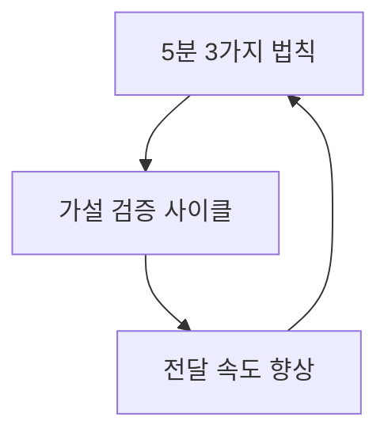

## 로지컬 씽킹의 기술: 탁월한 기획을 이끌어내는 생각 정리의 힘
이 책은 논리적으로 생각하고 소통하는 기술을 알려주는 가이드북이야. 복잡한 문제를 명확하게 해결하고, 다른 사람들을 설득하는 데 필요한 생각 정리의 힘을 키우는 방법을 배울 수 있어. 논리적 사고는 타고나는 것이 아니라, 연습을 통해 누구나 개발할 수 있는 기술이라는 게 이 책의 핵심 메시지야. 

## 1. 로지컬 씽킹이란 무엇일까? 

논리적으로 생각한다는 건, 마치 복잡한 퍼즐을 맞추는 것과 같아. 단순히 정답을 찾는 게 아니라, 내가 생각한 결론에 대해 다른 사람들이 '아, 그렇구나!' 하고 고개를 끄덕일 수 있도록 적절한 근거와 사실을 제시해서 설득력 있는 이야기를 만드는 과정이라고 보면 돼. 

1. **논리적 사고는 정답 찾기가 아니야** 
  1. 쥐와 코끼리 중 누가 더 무거울까? 보통은 코끼리라고 생각하겠지만, '지구상의 모든 쥐'와 '지구상의 모든 코끼리'를 비교하면 쥐가 더 무거울 수도 있어. 
  2. 또는 '내 앞에 있는 쥐 인형'과 '코끼리 인형'을 비교하면 쥐 인형이 더 무거울 수도 있지. 
  3. 이처럼 어떤 기준을 가지고 보느냐에 따라 답이 달라질 수 있다는 거야. 중요한 건 내가 어떤 기준을 가지고 어떤 결론을 내렸을 때, 다른 사람들이 그 기준과 결론을 납득할 수 있느냐는 거지. 
2. **생각과 고민은 달라** 
  1. 우리는 흔히 '생각한다'와 '고민한다'를 비슷하게 쓰지만, 이 책에서는 둘을 다르게 봐. 
  2. <mark>생각</mark>은 긍정적이고, 앞으로 나아가려는 마음이 담겨 있어. 어떤 가설을 세우고 해결책을 찾으려는 과정이 있지. 나를 중심으로 문제를 해결하려는 태도라고 보면 돼. 
  3. <mark>고민</mark>은 부정적이고, 제자리에 멈춰 있는 느낌이야. 가설이나 해결 과정 없이 감정에 휩쓸리기 쉽고, 내가 어찌할 수 없는 다른 요인들 때문에 힘들어하는 상태를 말해. 
  4. 논리적으로 사고하려면 고민하는 상태가 아니라, 생각하는 상태로 마음을 바꿔야 해. 
3. **논리적 사고가 필요한 **이유 
  1. **정보의 홍수 속에서 길을 찾기 위해**: 요즘은 정보가 너무 많아서 뭘 믿어야 할지, 뭘 버려야 할지 헷갈릴 때가 많지? 논리적 사고는 이 많은 정보를 잘 정리하고 핵심을 파악하는 데 도움을 줘. 
  2. **다양한 사람들과 소통하기 위해**: 회사나 조직에는 나이가 다르고, 배경이 다르고, 생각하는 방식이 다른 사람들이 모여 있어. 예전처럼 '대충 알아듣겠지' 하는 식으로는 소통이 어려워. 논리적으로 명확하게 이야기해야 서로 오해 없이 이해할 수 있어. 
  3. **빠른 결정을 내리기 위해**: 세상이 너무 빨리 변해서, 중요한 결정을 빨리빨리 내려야 할 때가 많아. 논리적 사고는 불필요한 생각을 줄이고, 가설을 세워 빠르게 검증하면서 신속하게 행동할 수 있도록 도와줘. 
4. **논리적 사고의 장점** 
  1. **상대방을 쉽게 이해시킬 수 있어**: 내 이야기를 상대방의 입장에서 이해하기 쉽게 만들 수 있는 기술이 늘어나. 
  2. **핵심을 꿰뚫어 보는 눈이 생겨**: 정보를 새로운 시각으로 바라보고, 이전에는 생각하지 못했던 새로운 아이디어나 가설을 세울 가능성이 높아져. 
  3. **일 처리 속도가 빨라져**: 불필요한 생각을 줄이고, 다음 단계에 필요한 일을 명확히 알 수 있어서 일의 진행이 빨라지고 행동으로 옮기는 데 망설임이 없어져. 

## 2. 논리적 사고력을 키우는 방법 

논리적 사고는 타고나는 게 아니라, 마치 운동처럼 꾸준히 연습하면 누구나 잘할 수 있는 기술이야. 

1. **논리적인 사람을 모방해 봐** 
  1. 주변에 논리적으로 생각하고 말하는 사람을 보면 '와, 대단하다' 하고 끝내지 말고, '저 사람은 나랑 뭐가 다를까?', '어떻게 하면 나도 저 사람처럼 할 수 있을까?' 하고 궁금해하고 따라 해 보려고 노력해야 해. 
  2. 그들의 사고방식과 행동 패턴을 분석하고 모방하다 보면, 어느새 나도 논리적인 사람이 될 수 있어. 
2. **논리적인 사람들의 특징** 
  1. **사고 측면**:
  - 방향이 명확해. 
  - 고민하기보다 생각해. 
  - 부정적이기보다 긍정적이야. 
  2. **행동 측면**:
  - 발언이 명확하고 요약 중심이야. 
  - 데이터에 강하고, 정리 지향적이야. 
  - 결론부터 이야기해. 
  - 마치 대통령에게 보고할 때, 정치인 출신 장관이 '사고가 발생했습니다. 몇 명 죽고 다쳤습니다. 원인은 화학 반응 폭발입니다.'라고 핵심부터 말하고, 질문이 들어오면 구체적으로 설명하는 것과 같아. 
  - 컨설팅 회사 베인앤컴퍼니가 '서퍼스트(Answer First)' 방식으로, 답을 먼저 내놓고 일을 시작하거나 발표하는 것과도 비슷해. 
3. **일상에서 논리적 습관 들이기** 
  1. **메일 쓰기부터 바꿔 봐**:
  - 질문을 받으면 결론부터 말하고 근거를 제시해. 
  - 메일을 받으면 바로 회신하고 내용은 간단하게 작성해. 만약 바로 답하기 어려운 내용이라면, '며칠 뒤에 답을 드리겠습니다'라고 먼저 알려줘. 
  - 의견을 전달할 때는 '말씀드릴 내용은 세 가지입니다. 첫째는 ~이고, 둘째는 ~입니다'처럼 체계적으로 정리해서 설명해. 
  - 사실에 근거해서 말하고, 가능한 짧은 문장으로 말하는 습관을 들여. 
  - 예를 들어, '지난번 건에 대해 여러 이야기를 나눴는데, 재료를 줄여 비용 절감, 품질 관리, 납기 속도 중요성을 알았습니다. 본사는 이 모든 점을 만족시킬 수 있습니다. 계속 검토 부탁드립니다'라는 메일은 제목이 애매하고, 내용이 중언부언하며, 결론이 명확하지 않아. 
  - 이것을 '상품 기준에 대한 건: 지난번 미팅 감사합니다. 상품 선정 시 중요했던 점은 첫째 저비용, 둘째 품질 관리, 셋째 납품 속도였습니다. 본사는 이 세 가지를 모두 충족할 수 있습니다. 계속 검토 부탁드립니다'라고 바꾸면 훨씬 깔끔하고 명확하게 전달돼. 
  2. **환경을 논리적으로 만들어 봐**:
  - 우리의 생각과 소통 방식은 주변 환경에 큰 영향을 받아. 
  - 논리적 사고력을 키우는 환경은 다음과 같아. 
  - 내용을 많이 시각화해. 
  - 질문을 많이 해. 
  - 시간에 엄격해. 
  - 발언과 반론이 자유로워. 
  - 자료가 잘 정리되어 있어. 
  - 특히 내용을 시각화하고 자료를 정리하는 건 혼자서도 할 수 있는 좋은 훈련이야. 핸드폰 앱 정리, 파일 정리, 북마크 정리처럼 일상생활 속에서 정리하는 습관을 들이는 것이 논리적 사고의 첫걸음이 될 수 있어. 
  - 같은 문화적 배경을 공유하는 곳에서는 굳이 논리적으로 설명하지 않아도 서로 알아듣는 경향이 강하지만, 글로벌 시대에는 논리적 사고와 소통 능력이 더욱 중요해져. 

## 3. 로지컬 커뮤니케이션: 효과적으로 말을 전달하는 기술 

로지컬 커뮤니케이션은 내가 하고 싶은 말을 상대방이 이해하기 쉽고 효과적으로 전달하는 기술이야. 

1. **논리의 틀을 세우는 두 기둥** 
  1. **관계성을 생각하고 전제를 일치시켜**:
  - '비가 오면 택시가 돈을 번다. 왜냐하면 빨리 비를 피하고 싶으니까'라는 말은 언뜻 맞는 것 같지만, 자세히 보면 주어와 서술어가 일치하지 않고 범위도 불명확해. 
  - 정확히 말하면 '비가 오면 택시 회사가 돈을 번다. 왜냐하면 평소 대중교통을 이용하던 사람들이 빨리 비를 피하기 위해 택시를 이용하기 때문이다'라고 해야 해. 
  - 이처럼 주어와 서술어를 명확히 연결하고, 범위를 분명히 하며, 관계성을 의식해서 단어를 선택해야 해. 
  - 가장 중요한 건, 내가 세운 논리를 상대방도 똑같이 받아들이지 않을 수 있다는 점을 명심하고, 상대방의 상황과 전제를 파악해서 거기에 맞춰 논리를 세워야 한다는 거야. 
  2. **피라미드 구조로 논리를 확보해**: 
  - 피라미드 구조는 논리적으로 생각하고 이해하기 쉬운 주장을 펼치는 데 아주 중요한 도구야. 
  - 이 구조는 위에서부터 논점<mark>(이야기의 중심 주제)</mark>, <mark>결론</mark>, 근거, <mark>사실(증거)</mark>로 이루어져 있어. 
  - **피라미드 구조의 5가지 조건**: 
  - 논점(이야기의 테마)이 명확해야 해. 
  - 결론이 논점과 연결되어야 해. 
  - 결론에 대한 근거가 하나 이상 있어야 해. 
  - 근거가 객관적인 사실로 뒷받침되어야 해. 
  - 전체 흐름이 상대방 입장에서 이해하기 쉬워야 해. 
2. **피라미드 구조로 논리를 전개하는 두 가지 방법** 
  1. **바텀업(**Bottom-up**) 방식**: 
  - 마치 바닥에서부터 벽돌을 쌓아 올리듯이, 먼저 여러 사실(정보)들을 모으고, 그것들을 그룹으로 묶어서 핵심 메시지를 찾아내. 그리고 이 핵심 메시지들을 바탕으로 결론을 도출하는 귀납적인 방식이야. 
  - 예를 들어, '해당 사업을 추진해야 하는가?'라는 논점에 대해 시장 점유율, 잠재력, 고객 성향 등 다양한 정보를 수집해. 
  - 이 정보들을 3C(시장, 경쟁사, 자사) 같은 틀에 맞춰 그룹핑하고, 각 그룹에서 '시장이 매력적이다', '경쟁사가 없다'와 같은 핵심 메시지를 뽑아내. 
  - 이 메시지들을 종합해서 '우리 회사는 해당 사업을 추진해야 한다'는 결론을 내리고, 다시 한번 '진짜 그런가?' 하고 검증하는 거야. 
  2. 탑다운**(**Top-down**) 방식**: 
  - 마치 높은 곳에서 아래를 내려다보듯이, 일반적인 현상이나 이론, 또는 기존 경험을 바탕으로 먼저 결론(가설)을 세워. 그리고 이 가설이 맞는지 사실에 비추어 검증하면서 논리를 만들어가는 연역적인 방식이야. 
  - '해당 사업을 추진해야 한다'는 가설을 먼저 세우고, '왜 그래야 하는가?'를 계속 질문하면서 그 이유와 원인을 찾아나가는 방식이야. 
  - 이 방식은 가설이 틀렸을 경우, 가설을 수정하는 과정을 거쳐. 
3. **전달의 완성은 이해다: 상대방의 입장에서 생각하기** 
  1. **복잡한 문제를 쪼개서 이해시켜**: 
  - 스파게티가 맛있다고 느낄 때, '왜 맛있을까?' 하고 막연히 생각하면 답이 안 나와. 
  - 이럴 때는 스파게티를 '면', '소스', '조리 방법'으로 쪼개서 생각해 보는 거야. 
  - 면은 모양, 종류, 산지로, 소스는 어떤 종류인지, 조리 방법은 면 삶는 정도, 재료, 섞는 방식 등으로 더 세분화해서 보면, '아, 이런 특징 때문에 맛있구나!' 하고 명확하게 이해할 수 있어. 
  - 복잡한 문제에 부딪혔을 때도 마찬가지야. 문제를 분해하고 나누면서 이해하기 쉽게 만드는 것이 중요해. 
  2. **이해의 기준은 내가 아닌 상대방이야**: 
  - 아인슈타인은 "여섯 살짜리에게 설명할 수 없다면, 당신은 그것을 제대로 이해한 게 아니다"라고 말했어. 
  - 논리는 어려우면 아무 의미가 없어. 이해하기 쉬워야 논리적인 거고, 논리적이면 이해하기 쉬운 거야. 
  - 내가 이해하는 것을 넘어, 상대방을 이해시키는 것이 중요해. 상대방의 상황과 입장에 맞춰 구체적인 내용과 전달 범위를 조절해야 해. 
  - 마치 산 정상에 있는 사람이 8부 능선, 5부 능선, 1부 능선에 있는 사람들에게 각기 다른 방식으로 길을 설명해야 하는 것과 같아. 
  - 도표나 차트 같은 시각 자료를 활용하면 상대방이 내 생각을 더 쉽게 이해하고 공감할 수 있어. 
4. **정보를 한눈에 보이게 만들어라** 
  1. 사람은 기본적으로 잘 잊어버리는 동물이야. 책을 읽어도 5% 정도만 기억한다고 해. 
  2. 기억과 전달을 효과적으로 돕는 도구가 바로 <mark>도식(그림으로 나타내는 것)</mark>과 <mark>차트(표나 그래프)</mark>야. 
  3. **자주 활용되는 도식과 도구**: 
  - 로직 트리**(**Logic Tree**)**: 전체 구조를 명확하게 보여줄 때 사용해. 마치 나무 가지처럼 뻗어나가면서 내용을 분류하는 거야. 
  - 매트릭스**(**Matrix**)**: 여러 항목을 비교할 때 사용해. 가로축과 세로축을 나눠서 표 형태로 정리하는 거지. 
  - 프로세스**(**Process**)**: 시간의 흐름이나 어떤 일의 단계를 순서대로 보여줄 때 사용해. 
  4. 이런 도구들을 활용해서 복잡한 대상을 나누고 분해하면 이해하기 쉬워져. 
  5. **컨설팅 상황 예시**: 
  - 고객사 사장이 '국내 시장 축소, 해외 진출 필요성, 모회사와의 관계, 직원들의 위기 의식 부족' 등으로 고민할 때, 컨설턴트는 다음과 같은 단계를 거쳐. 
  - **논점 확인**: 사장이 진짜 고민하는 게 뭔지 질문을 통해 명확히 해. '해외 진출을 해야 하는지, 어떤 방법이 있는지 고민이신 거죠?' 
  - **프레임으로 정리**: 들은 이야기를 3C(시장 동향, 경쟁사 움직임, 자사 상황) 같은 틀에 맞춰 정리하고, 추가 질문으로 정보를 채워 넣어. 
  - 의미 추출** 및 견해 일치**: 정리된 정보에서 핵심 메시지를 뽑아내고, 사장의 생각과 내 생각이 일치하는지 확인해. '국내 시장 포화, 경쟁사 해외 진출, 그룹 요청' 등으로 정리할 수 있겠네요. 
  - **결론 도출**: 핵심 메시지를 바탕으로 여러 가지 결론(선택지)을 제시해. '국내 시장 고집, 모회사 요청에 따라 해외 진출, 다른 회사와 협력' 등 세 가지 정도가 있을 것 같네요. 
  - **기준 설정 및 최종 결론**: 사장이 선택할 수 있도록 기준(성장 가능성, 직원 역량, 사회 상황)을 제시하고, 그 기준에 맞춰 가장 적절한 최종 결론을 도출해. '국내에서 경쟁사의 빈틈을 노려 시장 점유율을 높이는 것이 가장 적절할 것 같습니다.' 

## 4. 논리적 문제 해결 방법 

문제를 해결할 때는 눈에 보이는 것만 해결하면 안 돼. 마치 두더지 잡기처럼, 하나를 잡으면 다른 곳에서 또 튀어나오거든. 근본적인 원인을 찾아 해결해야 해. 

1. **프레임워크를 짜서 전체상을 파악해** 
  1. 사람은 자기가 가진 경험과 지식 안에서만 사물을 보려는 경향이 있어. 그래서 새로운 문제에 부딪히면 섣불리 판단하는 실수를 저지를 수 있지. 
  2. 문제를 해결하려면 눈에 보이는 것 너머의 전체상을 파악해야 해. 그러려면 프레임워크<mark>(틀)</mark>를 활용해서 정보를 <mark>누락 없이, 중복 없이</mark> 정리해야 해. 
  3. 이 '누락 없이, 중복 없이'를 영어로 줄여서 MECE<mark>(</mark>Mutually Exclusive<mark> and </mark>Collectively Exhaustive<mark>)</mark>라고 해. 
  - 예를 들어, 여러 도형이 뒤섞여 있을 때, 그냥 세는 것보다 세모, 동그라미, 네모, 별로 구분해서 정리하면 훨씬 쉽게 개수를 파악할 수 있어. 
  4. **프레임워크를 만들 때의 3가지 규칙**: 
  - **흔들리지 않는 기준을 잡아**: 대상을 어떻게 나눌지 명확한 기준(성별, 연령별, 직종별 등)을 정해야 해. 기준이 흔들리면 남성, 여성, 대리처럼 섞이거나, 30대가 빠지는 등의 문제가 생길 수 있어. 
  - **계층이 중복되지 않도록 해**: 동일한 계층에는 동일한 기준을 적용해야 해. 한국, 중국, 동경처럼 크기나 개념이 다른 단어를 섞으면 안 돼. 한 번에 여러 요소로 나누지 말고, 단일한 기준으로 분류해야 해. 
  - 예를 들어, 슈퍼마켓 매출 구성 요소를 볼 때, 품목, 면적, 연령을 한꺼번에 보지 말고, 먼저 '상품'을 기준으로 품목, 가격, 생산지, 이익으로 나누거나, '매장'을 기준으로 면적, 입점 연수, 지역으로 나누는 식이야. 
  - 나누기가 어려우면 크게 두 가지로 나누고, 그걸 다시 두 개로 나누는 식으로 반복하면 계층이 섞이는 걸 막을 수 있어. 
  - **단어의 정의를 명확히 해**: '통에 물이 절반 있다'처럼 모호한 표현은 사람마다 다르게 해석될 수 있어. '통에 물이 50% 담겨 있다'처럼 수치적으로 객관적으로 정의해야 오해를 줄일 수 있어. 
  5. **다양한 기준으로 현상을 파악해**: 
  - 문제 해결 능력이 뛰어난 사람은 여러 기준을 가지고 다양한 측면에서 상황을 분석해. 
  - 대상을 파악하는 기준을 많이 생각해낼수록 문제 해결 가능성이 높아져. 질보다 양이 중요하다고 볼 수 있지. 
  - 예를 들어, 슈퍼마켓 장사가 안 될 때, 매출을 분류하는 기준을 상품, 고객, 종업원 등으로 다양하게 찾아내고, 각 기준별로 세부적인 기준(상품 종류, 단가, 구입처 등)을 마련해서 전년도와 비교해 보면, '식료품 매출이 줄었네', '5만 원 미만 제품이 안 팔리네' 같은 구체적인 문제점을 발견할 수 있어. 
  - 이때 문제 발견과 가설 수립에 도움이 되는 기준을 감도가 좋은 기준이라고 해. 반대로 도움이 안 되는 기준은 <mark>감도가 나쁜 기준</mark>이지. 
  - 다양한 기준을 세우려면 평소에도 고객, 거래처, 상사, 부하직원 등 여러 관점에서 사물을 바라보는 연습을 해야 해. 
  6. **프레임이 어려우면 '대비'를 활용해 봐**: 
  - 회의가 비효율적일 때, 처음부터 복잡한 프레임을 짜기 어렵다면, '안의 문제'와 '밖의 문제'처럼 대비되는 개념으로 나누는 것이 효과적이야. 
  - 하드한 것/소프트한 것, 형식적인 측면/내용적인 측면, 비용의 문제/효과의 문제처럼 대비되는 개념을 활용하면 처음 시작하기 좋아. 
  7. **더하기, 곱하기, 순열 형식으로 프레임을 세워**: 
  - **더하기 형식**: 대상을 여러 구성 요소의 합으로 보는 방식이야. 예를 들어, 상품을 식료품, 의류품, 생활용품의 합으로 보거나, 햄버거를 빵, 고기, 채소, 소스의 합으로 보는 거지. 
  - **곱하기 형식**: 독립 변수들을 곱해서 전체를 구성하는 개념이야. 예를 들어, 매출을 단가와 수량의 곱으로 보고, 각각의 구성 요소를 분석하는 거지. 
  - 순열 형식: 시간의 흐름이나 업무의 흐름을 파악하는 방식이야. 제조업의 업무 흐름을 연구 개발, 조달, 생산, 판매, AS 순으로 보거나, 라면 끓이는 순서처럼 단계별로 보는 거지. 
2. **문제를 발견하고 해결하는 로직 **프로세스 
  1. **목적을 가지고 기준을 잡아**: 
  - 책상을 정리할 때, '자주 사용하는 물건을 꺼내기 쉽게'라는 목적이 있다면 '활용 빈도'를 기준으로 정리해야 해. '특정 제조사 제품을 선호한다'는 목적이 있다면 '제조사별'로 정리하는 거지. 
  - 이처럼 문제 해결 도구를 사용할 때는 목적에 따라 적절한 기준을 잡는 것이 중요해. 
  2. **문제를 구체적으로 시각화하는 도구**: 
  - 로직 트리**(**Logic Tree**)**: 문제를 나무 모양으로 전체적으로 형식화해서 만드는 도구야. 
  - <mark>왓 트리(What Tree)</mark>: 구성 요소를 파악해서 문제가 무엇인지 파악하는 도구야. '고객 조사'라는 단어가 있을 때, 고객 조사에 무엇이 있는지 계속 생각하고 MECE하게 구성 요소를 파악하는 거지. 
  - 와이<mark> 트리(</mark>Why Tree<mark>)</mark>: 문제의 원인을 파악하는 도구야. '왜'를 반복해서 물어가며 근본적인 원인을 찾아내. 잔업이 많다면 '왜 잔업이 많아졌는지', 업무 효율이 나쁘면 '왜 나쁜지'를 계속 파고드는 거야. 
  - 하우 트리(How Tree): 해결 방안을 찾는 도구야. '어떻게'를 반복해서 구체적인 해결책을 찾아내. 상품 이익을 개선하려면 '어떻게 개선할지'를 계속 생각하는 거지. 
  - 이 세 가지 트리를 연결해서 문제를 정리하고, 원인을 파악하고, 해결책을 이끌어내 실행으로 옮기는 거야. 
  - 매트릭스**(**Matrix**)**: 가로축과 세로축을 나눠서 사물의 요소들을 정리하는 표 형태의 도구야. 여러 대상을 비교하고 우열 관계를 이해할 목적으로 사용해. 
  - A 제품과 B 제품의 가격, 장점, 충격 강도 등을 비교할 때 유용해. 
  - 중요한 건 누락과 중복이 생기지 않게 기준을 정하는 거야. 
3. **생각을 업그레이드하려면 **제로 베이스** 관점으로 가야 해** 
  1. **제로 베이스란?** 
  - '다시 생각해 봐'라는 말은 사실 '제로 베이스에서 생각해 봐'라는 뜻이야. 
  - 모든 고정관념을 버리고, 기존의 방식이나 성공 경험까지도 모두 리셋(초기화)하고, 원점으로 돌아가서 '목적'을 기준으로 다시 생각하는 것을 말해. 
  - 과거에는 변화의 폭이 작아서 기존 방식이 통했지만, 이제는 세상이 너무 빨리 변해서 과거의 성공 경험이 오히려 발목을 잡을 수 있어. 
  2. 제로 베이스** 사고를 위한 습관**: 
  - **상식을 의심해 봐**: 목적에 충실하고, 고정관념이나 기존 개념에서 벗어나려고 노력해야 해. 
  - **진짜 목적이 뭔지 생각해 봐**: 두께 10cm, 무게 1톤의 강철판에 구멍을 뚫어야 할 때, 구멍을 뚫는 것이 목적이 아니라 '뭔가를 하기 위한 것'이 진짜 목적일 수 있어. 그렇다면 구멍을 뚫지 않고도 목적을 달성할 다른 방법을 찾아볼 수 있지. 
  - **까칠하게 질문해 봐**: 뭔가 이상하다고 느낄 때, 바꾸는 용기를 가져야 해. 질문은 이야기를 깊이 이해하고, 반론을 제시해서 내용을 확장하며, 새로운 관점을 제시하는 데 효과적이야. 
  - 제로 베이스** 사고에서 기억할 3가지**: 
  - **목적을 가지고 생각해**: 뚜렷한 목적이 없으면 혼란이 생겨. '업무 효율을 통해 잔업 줄이기'가 목적이었는데, 잔업 줄이기는 사라지고 업무 효율 자체가 목적이 되어버려 잔업이 더 늘어나는 경우도 있어. 
  - **사실을 제로 베이스에서 생각해**: 현장에서 직접 보고, 현실을 인식한 다음에 문제 해결 방안을 찾아야 해. 그래야 사실을 나에게 도움이 되도록 인식하고 판단할 수 있어. 
  - **방법을 제로 베이스에서 생각해**: 기존의 수단, 공간, 시간, 대상에 얽매이지 않고 브레인스토밍 등을 활용해서 새로운 방법을 찾아봐. 
  - '안다'고 생각하는 순간 사고는 멈춰버려. 모르는 사람의 사고 범위가 더 넓을 수 있어. 제로 베이스에서 생각하는 것은 사고의 정지 상태에서 벗어나 스스로 생각하는 힘을 기르는 효과가 있어. 
  3. **애매한 말 없이 말하는 습관을 들여**: 
  - **정의를 명확히 해**: '매우', '많이', '막대한' 같은 추상적인 단어는 사람마다 다르게 해석될 수 있어. 이런 사고 정지 언어가 나오면 상대방이 이해한 의미를 먼저 확인하고 거기에 맞춰서 생각해야 해. 
  - **사고 습관을 체크해**: '그건 이렇다', '이렇게 하면 저렇게 된다'처럼 습관적으로 단정하거나 비약하는 생각을 자주 하는 건 아닌지 스스로 점검해야 해. 그렇지 않으면 고정관념에 빠지기 쉬워. 

## 5. 로지컬 씽킹을 가속화하는 힘 

논리적인 사람은 시작부터 달라. 효율적으로 생각하고 빠르게 행동하는 습관을 가지고 있어.

1. **'5분 3가지 법칙'을 활용해 봐** 
  1. **5분 안에 스토리를 만들어**: 
  - 일 처리가 빠른 사람은 처음 5분을 효과적으로 사용해서 적절한 가설을 도출해. 
  - 5분 안에 결과물의 이미지를 그리고, 할 일의 내용을 파악한 다음, 시작부터 끝까지의 스토리를 작성하는 거야. 
  2. **스토리를 강화하는 '세 가지로 나누는 기법'**: 
  - 나누면 이해하기 쉽고, 그중에서도 세 가지로 나누는 것이 상대방이 기억하고 납득하기 가장 좋은 방법이야. 이걸 <mark>파워 오브 스토리(Power of Story)</mark>라고 해. 
  - 심기체(정신, 기술, 체력), 과거/현재/미래, 아침/점심/저녁처럼 세 가지로 나누는 것이 효과적이야. 
  - 비즈니스 프레임워크인 3C(Customer, Competition, Company)도 이 세 가지로 나누는 기법과 같은 맥락이야. 
2. 가설 검증** 사이클을 활용해 속도를 높여** 
  1. 처음에 세운 가설이 잘못됐으면 바로 수정하는 게 정답이야. 
  2. 사람들은 한번 경험하고 나면 스키마<mark>(Schema)</mark>라는 정신적 틀이 생겨서, 그 안에서만 판단하려는 경향이 있어. 이게 고정관념으로 이어질 수 있으니 조심해야 해. 
  3. 가설을 검증할 때는 반드시 사실에 근거해서 검토하고, 잘못된 부분이 있으면 즉시 수정해야 해. 
  4. 가설을 세우고 검증하는 속도를 빨리 해야 해. 그러려면 가설과 관련된 사실 정보만 얻고, 불필요한 정보 수집으로 시간을 낭비하지 않아야 해. 
  5. 피라미드 구조를 활용해서 전체 그림을 그리고, 검증에 필요한 정보의 범위를 정의해 놓으면 필요한 정보를 빠르게 찾을 수 있어. 
3. **전달의 속도를 높이는 법** 
  1. 사람들은 바빠서 남의 이야기를 잘 들어주지 않아. 긴 이야기보다 짧은 시간에 핵심을 전달하는 이야기를 선호해. 
  2. 상대방은 자기에게 필요한 <mark>결론, </mark>근거<mark>, 사실</mark>을 접해야 내 이야기를 받아들여. 
  3. 따라서 전달하고 싶은 결론을 가장 위에 두고, 상대방의 입장에서 의사 결정에 필요한 정보를 근거와 사실로 정리해서 피라미드 구조로 이야기하면 돼. 
  4. 결론을 먼저 던지고, 상대방이 반응하면 근거를 던지고, 또 반응이 오면 사실을 던지는 식으로 대화하는 것이 효과적이야. 
  5. 중요한 건 내 논리가 아니라, 상대방이 납득할 수 있는 논리로 구성해야 한다는 거야. 
  6. **질문을 활용해**: 상대방의 생각과 상황, 그가 보고 있는 부분과 보지 못하는 부분을 질문을 통해 파악하면, 거기에 맞춰 이야기를 전개할 수 있어. 좋은 질문은 사람을 움직이는 힘을 가지고 있어. 
  7. **확실한 한마디로 전달해**: 
  - 이해하기 쉽게 말하는 사람들은 명확하게 이야기해. 
  - 반면, 이해되지 않게 이야기하는 사람들은 상대방을 배려한다고 정보를 최대한 많이 모아서 다 던져버려. 하지만 상대방 입장에서는 정보가 너무 많아서 뭐가 뭔지 모르게 돼. 
  - 진정으로 상대방을 위한다면, 필요한 정보만 단적으로 명확하게 전달해야 해. 전체 시나리오를 그린 다음, 상대방의 상황과 목적을 고려해서 불필요한 정보는 계속 버려야 해. 더 이상 버릴 수 없는 정보가 바로 정말 중요한 정보야. 
4. **프로는 결코 변명하지 않아** 
  1. 고민하는 사람은 바꿀 수 있는 것과 바꿀 수 없는 것을 구분하지 못해. 하지만 생각하는 사람은 자기가 할 수 있는 것과 할 수 없는 것을 명확히 구분해. 
  2. 프로는 자신이 영향을 미칠 수 없는 주제(과거의 사실, 타인의 문제 등)에 대해서는 마음을 비우고, 오직 자기 자신에게 집중해. 
  3. 일의 결과를 자신의 책임으로 받아들이고, 스스로를 바꿔서 미래를 바꾸려고 노력해. 
  4. 항상 '내가 어떻게 할 수 있을까?'를 생각하며 자기 자신을 주어로 이야기하는 습관을 들이는 것이, 신속하게 생각하고 이해하기 쉬우면서도 핵심을 말하는 최고의 습관이야. 

