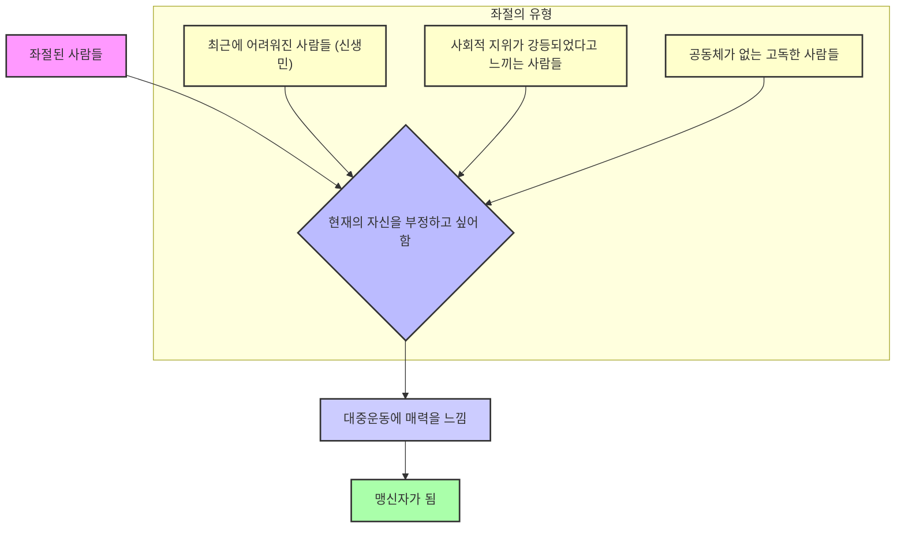
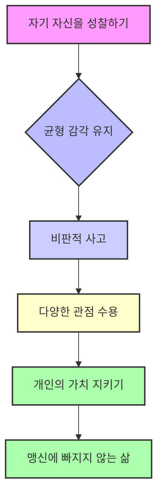

## 맹신자들: 대중운동의 숨겨진 진실을 파헤치다
이 책은 종교, 정치, 민족주의 등 모든 대중운동이 어떻게 사람들을 끌어들이고 움직이는지, 그 숨겨진 심리와 본질을 파헤치는 책이야. 저자는 대중운동이 지지자들에게 맹목적인 신념과 충성심을 요구하며, 목숨까지 바치려는 의지를 불러일으키는 공통된 특성이 있다고 말해. 이 책은 대중운동의 본질에 대한 125가지 단상을 통해, 우리가 세상을 이해하고 더 나은 방향으로 나아가는 데 필요한 통찰을 제공하고 있어.

## 1. 대중운동은 왜 사람들을 끌어들일까? 

대중운동은 사람들이 자신의 삶에 대해 극심한 좌절감을 느낄 때, 마치 구세주처럼 나타나 사람들을 끌어들이는 힘이 있어.

1. **좌절된 사람들의 마음을 사로잡는 거야.** 
  - 자기 인생이 낭비되었다고 느끼거나, 헛살았다고 생각하는 사람들이 바로 대중운동의 주된 대상이야.
  - 이런 사람들은 의식적으로는 자신이 좌절했다고 인정하지 않아. 왜냐하면 그렇게 생각하면 자기 자신을 지탱할 수 없기 때문이야. 
  - 하지만 마음속으로는 현재의 자신을 부정하고 싶어 하는 강한 욕구가 있어. 
  - 대중운동은 이런 사람들에게 "너의 무의미한 삶에 새로운 의미를 부여해주겠다"고 속삭이는 것과 같아. 

2. **현재의 자신을 부정하고 싶어 하는 심리를 이용해.** 
  - 맹신자들은 기본적으로 현재의 자신과 자신의 삶을 부정하는 특성을 가지고 있어.
  - 좌절한 사람들은 자신이 좌절했기 때문에 현재의 자신을 부정하고 싶어 해.
  - 대중운동은 이런 사람들에게 "지금까지 너는 찌질하고 바보 같았지만, 이 운동에 참여하면 다시 태어날 수 있다"고 말하며 의미를 부여해줘. 
  - 이것은 자기 발전 욕구보다는 자기 부정 욕구를 충족시켜주는 거야. 

3. **외부에서 불행의 원인을 찾으려는 인간의 본성 때문이야.** 
  - 사람들은 자기 존재를 형성하는 힘을 스스로에게서 찾기보다 외부에서 찾으려는 경향이 있어.
  - "내가 이렇게 된 건 엄마, 아버지를 잘못 만나서 그래", "남편을 잘못 만나서 그래" 같은 식으로 불행의 원인을 외부로 돌리는 거지.
  - 이런 심리는 자신이 무가치하다는 느낌을 억누르고, "이것만 있으면 행복해질 거야"라는 욕망을 가지게 해. 
  - 결국, 자신의 내면이 무가치하다는 것을 인정하기 싫어서 외부의 욕망만 추구하게 되는 거야. 

4. **자유보다는 평등과 우애를 갈망하게 만들어.** 
  - 대중운동에 가담하는 사람들은 자기 자신의 책임을 회피하고, 자유로부터 자유로워지기 위해 참여하는 경우가 많아. 
  - 능력 없는 사람에게 순수한 자유는 따분하고 부담스러운 것이거든. 
  - "네가 이런 것도 네가 선택해라"라고 하면 사람들은 못 견뎌. 차라리 "이거 해라"라고 정해주면 편안함을 느껴. 
  - 모두가 같아지면 비교할 필요가 없고, 자신의 열등감이 드러나지 않으니까 "너나 나나 다 똑같다"는 평등을 갈망하게 되는 거야. 

## 2. 대중운동은 어떻게 사람들을 맹신하게 만들까? 

대중운동은 사람들의 마음을 사로잡고 맹목적인 믿음을 심어주기 위해 몇 가지 전략을 사용해.

1. **순고한 대의와 희망을 제시해.** 
  - 모든 대중운동은 "잘 먹고 잘 살자"는 것 이상의 순고한 대의(큰 뜻)를 만들어내야 성공할 수 있어. 
  - 사람들은 유토피아(이상향)가 없는 세계 지도는 지도가 아니라고 생각하듯이, 미래에 대한 환상과 희망을 필요로 해. 
  - "천년왕국", "더 좋은 진보" 같은 희망을 호소하지 않으면 어떤 믿음도 힘을 발휘하지 못해. 
  - 이 희망은 "바로 내일 이루어질 거야!"처럼 눈앞에 있는 것처럼 느껴져야 해. 
  - 예를 들어, 트럼프의 "미국을 다시 위대하게 만들겠다"는 구호처럼, 즉각적인 변화를 약속하는 거지. 

2. **경험 없는 사람들을 선호해.** 
  - 대중운동을 주도하는 사람들은 오히려 경험이 없는 경우가 많아.
  - 경험이 많으면 "이건 이래서 안 되고, 저건 저래서 안 된다"며 주춤거리게 되거든. 
  - 무식한 사람이 "제가 하면 다 됩니다!"라고 자신감 있게 말할 때 사람들이 더 잘 따라. 
  - 프랑스 혁명이나 볼셰비키 혁명, 나치 운동을 주도했던 사람들 중에는 제대로 된 경험이 없는 사람들이 많았어. 

3. **자기 자신을 버리고 대의에 헌신하게 만들어.** 
  - 사람들은 자신이 쓸모없다고 생각할 때 못 견뎌 해.
  - 대중운동은 "지금까지 너는 찌질했지만, 이 운동에 참여하면 새로운 투사로 태어난다"고 말하며 의미를 부여해줘. 
  - 개인의 이익은 더럽고 부패한 것이라고 비난하며, 순고한 대의(조국과 민족, 신과 영혼)에 자신을 일치시키도록 유도해. 
  - 이렇게 되면 실패해도 괜찮아. 왜냐하면 나는 이미 가치 있는 존재라는 의식을 얻었기 때문이야. 
  - "내가 위대한 사람을 지켜준다"고 생각하면, 자신이 그 위대한 사람과 똑같이 되어버린다고 느껴 엄청난 자부심을 가지게 돼. 

4. **고독한 개인을 조직으로 끌어들여.** 
  - 공동체가 없는 파편화된 개인은 고독감을 느끼고, 이를 해소하기 위해 조직에 몰리게 돼.
  - 조직은 고독한 개인에게 유일한 공동체가 되어주고, 소속감을 제공해줘.
  - 이들은 철저하게 사심을 말하면 안 되는, 즉 서로를 신뢰하지 못하는 파편화된 사회에서 최상의 토양을 얻게 돼. 
  - 조직은 개인을 철저하게 노예화시켜. 기댈 수 있는 공동체를 모두 박살내고, 조직만이 유일한 안식처라고 믿게 만드는 거지. 

5. **카리스마적 지도자를 숭배하게 해.** 
  - 대중운동은 무에서 시작되는 것이 아니라, 복종할 대상인 우상(지도자)이 있어야 가능해.
  - 지도자의 말은 진리의 심오함을 담기보다는, 개인을 현실로부터 격리시키고 확신을 가지게 만드는 데 초점을 맞춰. 
  - 사람들은 지도자의 말 같지도 않은 세상을 멋대로 휘두르는 자신감에 빠져들어. 
  - 지도자와 자신을 동일시하며, 지도자가 꿈꾼 세상이 나의 세상이라고 믿게 돼. 

## 3. 맹신자들은 어떤 사람들일까? 

맹신자가 될 가능성이 높은 사람들은 특정 유형의 특징을 가지고 있어.

1. **최근에 어려워진 사람들(신생민)이야.** 
  - 원래 가난했던 사람보다는 최근에 경제적으로 어려워지거나 사회적 지위가 낮아진 사람들이 대중운동에 더 잘 빠져들어.
  - 이들은 좋았던 과거의 기억이 생생해서, 현재의 비참함을 더 견디기 힘들어해. 
  - 예를 들어, 17세기 잉글랜드의 청교도 혁명은 농지가 목초지로 바뀌면서 소작농들이 어려워진 것이 배경이었어. 
  - 1차 세계대전 이후 독일과 이탈리아의 중산층이 무너지면서 파시즘과 나치즘이 확산된 것도 같은 이유야. 
  - 이들은 단순한 경제적 어려움뿐만 아니라, 사회적 지위가 강등되었다고 느껴 자존심에 큰 상처를 입거든. 

2. **공동체가 없는 고독한 사람들이야.** 
  - 의지할 곳이 있는 사람들은 대중운동의 유혹에 쉽게 넘어가지 않아.
  - 대중운동은 가족이나 기존 공동체의 유대를 철저히 무너뜨리는 것부터 시작해. 
  - 예수는 "나는 가족을 부화시키기 위해 왔다"고 말했고, 혁명 운동가들은 일부러 감옥에 들어가 가족과의 유대를 끊으라고 권하기도 했어. 
  - 고독한 개인은 유일한 공동체인 조직으로 몰리게 되고, 조직은 이들에게 소속감을 제공해줘. 

3. **불만이 많지만, 어느 정도 살만해진 사람들이야.** 
  - 아주 극빈층은 매일매일 생존에 바빠서 대중운동에 신경 쓸 여유가 없어. 
  - 오히려 삶의 수준이 조금 나아졌을 때, 사람들의 불만이 가장 높아져. 
  - 프랑스 혁명이나 러시아 혁명도 아예 못 살았을 때가 아니라, 처지가 좋아질수록 더 못 견디겠다고 생각할 때 일어났어. 
  - 불만의 강도는 열망하는 대상과의 거리가 가까울수록 더 커지거든. 
  - "조금만 더 하면 될 것 같은데"라는 생각이 들 때 불만이 폭발하는 거야. 

4. **창조적 재능이 없는 사람들이야.** 
  - 아무리 가난해도 창조적 재능이 있는 사람은 좌절하지 않아. 스스로 꿈꾸는 것이 있기 때문이야. 
  - 창조적 물줄기가 메말라가는 작가, 과학자, 예술가, 그리고 성적 무능력자들이 대열에 더 열정적으로 참여하는 경향이 있어. 
  - 예술가나 지식인들은 대중운동에 들어갔다가 나중에 배신당하는 경우가 많아. 왜냐하면 그들은 자유를 가장 원하는 사람들이지만, 집단은 자유를 허용하지 않거든. 

## 4. 대중운동의 위험성과 우리가 경계해야 할 것들 

대중운동은 강력한 힘을 가지고 있지만, 그만큼 위험한 측면도 있어. 우리는 이런 위험을 알고 경계해야 해.

1. **균형 감각을 잃으면 도덕성까지 무너져.** 
  - 균형 감각을 가지는 것이 정말 중요해. 균형 감각을 잃고 극단적인 생각에 빠지면 도덕적 기준까지 흐트러져 버리거든.
  - 극단주의로 갈수록 "다 필요 없어, 다 부정해야 해"라는 생각이 지배하게 돼.
  - "누군가를 위해 죽을 수 있다"는 생각은 "누군가를 죽일 수 있다"는 생각으로 이어질 수 있어. 
  - 탈레반 자폭 테러범들이 "알라를 위해 한 몸 불사르겠다"고 생각하며 사람들을 죽이는 것처럼 말이야. 

2. **무관심한 사람들이 가장 위험한 존재야.** 
  - 히틀러나 종교 광신자들이 가장 싫어하는 사람들은 무신론자가 아니야. 오히려 무신론자는 "우리 편이 될 수 있다"고 생각해. 
  - 가장 미워하는 사람들은 바로 무관심한 사람들이야. 관심 자체가 없는 사람은 어떻게 할 수가 없거든. 
  - 심드렁한 사람이 광신주의 입장에서는 제일 위험하다고 보는 거지. 

3. **개인의 자유를 억압하고 단결을 강요해.** 
  - 대중운동이 굴러가기 시작하면 개인의 자유는 절대 허용되지 않아. 단결과 자기희생이 가장 중요한 가치가 되거든.
  - 개인의 의지, 판단, 이익은 포기해야 해. "네가 억울해도 조직을 위해 참아야 한다"는 논리가 지배하게 돼. 
  - 로베스피에르가 "혁명 정부는 폭정에 맞서는 자유의 독재다"라고 말했듯이, 자유를 주겠다고 했지만 실제로는 폭정이 필요하다고 주장하는 거야. 
  - 이 운동에 들어갈 때는 자기를 축소하고, 사생활, 개인의 생각, 재산, 심지어 목숨까지 포기해야 한다고 요구해. 

4. **진실을 외면하고 자기합리화에 빠져.** 
  - 맹신자들은 강령(운동의 목표나 규칙) 이외에는 어떤 진리도 없다고 주장해.
  - 자신의 경험이나 사고가 아니라 경전(성경, 교리 등)에서 나온 사실만을 믿으려고 해. 
  - 일본이 패전했다는 증거를 받아들이지 않았던 광신적 일본인들처럼, 자신에게 불리한 보도나 증거는 일체 믿지 않아. 
  - 이들은 위험이 닥쳐도 겁내지 않고, 장애에 기죽지 않으며, 반박에 당황하지 않아. 그런 것의 존재 자체를 부정하기 때문이야. 
  - 이성적인 비판은 "악마의 속삭임"으로 치부하며, 자기합리화의 도구로 사용해. 

## 5. 대중운동 속에서 자기 자신을 지키는 방법 

대중운동의 흐름 속에서도 자기 자신을 잃지 않고 올바른 판단을 내리기 위해서는 몇 가지 노력이 필요해.

1. **자기 자신을 항상 바깥에서 바라봐야 해.** 
  - 대중운동에 참여하더라도 자기 자신을 객관적으로 바라보는 것이 중요해.
  - 이것이 자기 자신을 온전하게 바라보고, 운동에 참여하는 자기 자신을 더 알차게 만드는 길이야.
  - 무조건적으로 따르기만 하는 것은 위험해.

2. **무식이 도움이 된 적은 한 번도 없다는 것을 기억해.** 
  - 마르크스가 말했듯이, 많이 알면 알수록 세상을 대하고 컨트롤하며 같이 살아가는 데 도움이 돼.
  - 다양한 각도에서 알아보고 살펴봐야 해. 이런 과정을 거쳐야만 오래가고 살아남는 운동이 될 수 있어.
  - 지도자나 참가자 모두 자기 자신을 성찰하는 삶을 살아야 해.

3. **사회적으로 위대하다고 생각하는 기준에 얽매이지 마.** 
  - "나는 이 정도 대학을 나왔고, 이 정도 돈을 벌고, 사회가 이 정도 하면 의식이 있어 보이지" 같은 사회가 원하는 가치 기준에 매여 살지 말라는 거야.
  - 자신의 삶에 열심히 사는 것이 중요하며, 스스로를 비열하고 열등한 존재로 볼 필요 없어.
  - 항상 성찰하고 배우는 삶을 살아가야 해.

4. **대중운동의 이면을 항상 고민해 봐.** 
  - 대중운동이 고상한 명분과 이상을 내걸지만, 그 이면에는 자원 경쟁, 지위 경쟁 같은 요소가 분명히 존재해.
  - 겉모습에 속지 말고, 어떤 말을 듣거나 읽을 때도 그 이면의 생각들이 무엇일까를 항상 고민해 봐야 해.
  - 여러분이 지지했던 누군가가 약속했던 것들이 얼마나 이루어졌는지 따져보는 것도 좋은 방법이야. 

5. **사회적 완충 장치가 필요해.** 
  - 개인의 좌절과 실패를 개인의 책임으로만 몰아붙이는 사회 분위기는 위험해.
  - 실패자들이 다시 일어서거나 회복할 수 있는 가능성을 원천 봉쇄할 수 있거든.
  - 사회에는 실패자들이 기댈 수 있는 쿠션, 즉 완충 장치가 필요해.
  - 극단적으로 몰리면 "나만 망할 것이 아니라 다 망해라"는 마음이 들 수도 있기 때문이야. 

