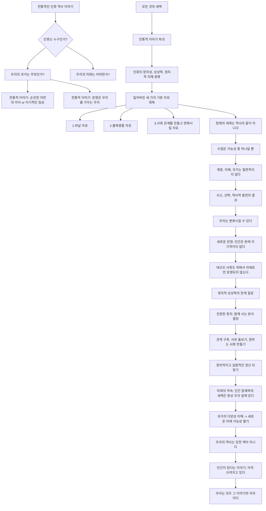

## 모든 것의 새벽: 인류의 새로운 역사
이 책은 우리가 인류의 역사에 대해 알고 있던 전통적인 이야기들을 완전히 뒤집는 책이야. 고대 사회가 얼마나 복잡하고 다양했는지, 그리고 계층이나 불평등이 어떻게 생겨났는지에 대한 새로운 시각을 제시하면서, 인류의 역사가 정해진 길을 따라온 것이 아니라 수많은 선택과 실험의 결과였다는 것을 보여준다. 

## 1. 인류 역사의 전통적인 이야기, 정말 그럴까? 

우리는 보통 인류의 역사를 하나의 정해진 이야기처럼 생각하는 경향이 있다. 마치 동화책처럼 말이야. 

1. **루소의 이야기: 순수했던 어린 시절과 타락** 
  - 옛날 옛적에 사람들은 수렵 채집인으로 살았어. 마치 어린아이들처럼 순수하고 평등하게 살았지. 
  - 그러다 농업을 시작하면서 모든 게 변했어. 땅을 자기 것이라고 주장하기 시작하고, 도시가 생기고, 문명이 발전하면서 왕, 군대, 관료, 그리고 가부장제 같은 것들이 생겨났지. 
  - 이때 우리는 자유를 잃고 속박에 갇히게 된 거야. 마치 자유를 주고 안전을 얻은 것처럼 말이야. 
2. **홉스의 이야기: 원래부터 이기적이었던 인간** 
  - 루소의 이야기와는 반대로, 홉스는 인간이 원래부터 이기적이고 서로 싸우는 존재라고 봤어. 문명 이전의 삶은 "고독하고, 가난하고, 불쾌하고, 잔인하고, 짧은" 끊임없는 전쟁 상태였다는 거지. 
  - 그래서 경찰, 법, 정부 같은 문명의 요소들이 우리를 지켜주는 유일한 방법이라고 생각했어. 
3. **두 이야기의 공통점: 피할 수 없는 불평등** 
  - 루소와 홉스의 이야기는 시작은 다르지만, 결국 큰 사회가 되면 자유를 잃고 계층 사회가 되는 건 피할 수 없다는 결론으로 끝나. 
  - 이런 이야기들은 우리가 지금 겪는 불평등과 지배가 문명의 피할 수 없는 대가라고 믿게 만들어서, 역사를 비관적으로 보게 해. 

## 2. 유럽 계몽주의 사상에 영향을 준 북미 원주민들의 비판 

이 책의 저자들은 이런 전통적인 이야기들이 사실은 "신화"라고 말한다. 그리고 이런 생각들이 어디서 왔는지 찾아봤더니, 놀랍게도 유럽인들 스스로 만들어낸 것이 아니라, 북미 원주민들의 비판에 대한 반응으로 생겨났다는 것을 발견했어. 

1. **유럽인들을 놀라게 한 원주민들의 시각** 
  - 17세기와 18세기에 유럽 탐험가들과 선교사들은 북미 원주민들과 많은 대화를 나눴어. 특히 프랑스 예수회 선교사들은 유럽에서 가장 교육받은 사람들이었지만, 자신들이 "미개하다"고 생각했던 원주민들과의 논쟁에서 계속 졌다고 해. 
  - 원주민들은 유럽 사회를 보고 경악했어. 미크맥족 남성은 프랑스 선교사에게 "당신들은 항상 싸우고 다투지만, 우리는 평화롭게 산다. 당신들은 탐욕스럽고, 도둑이며, 속이는 자들이다. 우리는 빵 한 조각이라도 이웃과 나눈다"고 말했다. 
  - 원주민들은 유럽인들이 경쟁적이고 이기적이며 계층적이라고 봤고, 무엇보다 "자유롭지 못하다"고 생각했어. 
2. **웬닷족의 칸디아론: 유럽 사회에 대한 날카로운 비판** 
  - 웬닷족(지금의 온타리오 남부에 살던 농경민족)은 지도자가 있었지만, 그들의 권위는 "혀끝에 달려 있었다"고 해. 즉, 사람들을 설득할 수는 있었지만 강제로 명령할 수는 없었어. 
  - 웬닷족에게 프랑스인들은 상사에게 굽실거리고, 돈 때문에 부자가 가난한 사람을 지배하는 "노예"처럼 보였다. 
  - 웬닷족의 정치가이자 철학자인 칸디아론은 1600년대 후반 프랑스 귀족과 논쟁을 벌였는데, 이 내용이 책으로 출판되어 유럽 전역에서 큰 반향을 일으켰어. 
  - 칸디아론은 유럽의 사유재산, 돈, 강제적인 법률 같은 제도들이 모든 악의 근원이라고 주장했어. 이런 것들이 사람들이 경쟁하고, 거짓말하고, 속이고, 훔치게 만든다는 거야. 
  - 그는 "돈은 악마 중의 악마이며, 프랑스인의 폭군이자 모든 악의 근원"이라고 말했어. 웬닷족은 돈이 없기 때문에 판사나 감옥이 필요 없다고 했지. 
3. **원주민 비판이 유럽 계몽주의에 미친 영향** 
  - 자유와 평등이 인간의 자연스러운 상태이고, 유럽 문명이 그것을 타락시켰다는 칸디아론의 생각은 파리의 살롱과 커피하우스에 퍼져 루소, 볼테르, 몽테스키외 같은 계몽주의 사상가들에게 큰 영향을 주었다. 
  - 우리가 지금 생각하는 자유와 평등의 이상은 유럽인들만의 머리에서 나온 것이 아니라, 유럽 사회의 문제점을 날카롭게 꿰뚫어 본 원주민 비평가들과의 대화 속에서 만들어진 것이다. 
4. **유럽의 반격: 진화론적 서사의 탄생** 
  - 하지만 유럽 사상가들은 "미개한" 사람들이 자신들보다 우월하다는 것을 받아들일 수 없었어. 
  - 그래서 그들은 새로운 이야기를 만들어냈어. 역사는 수렵 채집에서 목축, 농업, 상업 사회로 발전하는 "단계"를 거친다는 거야. 
  - 원주민들의 자유와 평등은 우월함이 아니라, 그들이 가난하고 사회가 작았기 때문에 가능했던 "단순함"의 결과라고 주장했지. 
  - 사회가 커지고 기술이 발전하면 불평등은 필연적이라는 논리를 만들었고, 이것이 오늘날 우리가 아는 "위대한 진화론적 서사"가 되었다. 
  - 이 이야기는 원주민들의 비판을 무력화하고, 현재의 불평등이 문명의 대가라는 안심시키는 이야기로 바뀌었다. 

## 3. 선사시대 인류의 놀라운 다양성과 유연성 

"모든 것의 새벽"은 이런 진화론적 가정을 버리고, 고고학적, 인류학적 증거를 새로운 시각으로 보라고 말한다. 그렇게 보면 인류의 역사는 훨씬 더 놀랍고 희망적이라는 것을 알 수 있다. 

1. **빙하기 시대의 "왕자"와 "공주"들** 
  - 우리는 보통 석기 시대 조상들을 작고 단순한 수렵 채집인 무리로 상상하지만, 고고학은 다른 이야기를 들려준다. 
  - 러시아 모스크바 근처의 수니르 유적지에서는 3만 4천 년 전 두 청소년의 매장지가 발견되었어. 수천 개의 매머드 상아 구슬, 여우 이빨 장식, 매머드 엄니로 만든 거대한 창 등 엄청난 양의 부장품이 함께 묻혀 있었다. 
  - 이것은 단순한 평등주의 사회가 아니라, "왕자"나 "공주" 같은 계층이 있었음을 보여준다. 
  - 흥미로운 점은 이 빙하기 시대의 "왕자"와 "공주"들 중 상당수가 신체적 특징이 남다른 사람들이었다는 거야. 수니르의 소년들은 선천적 기형이 있었고, 이탈리아 로메오 동굴의 매장자는 심한 왜소증을 앓고 있었다. 
  - 이는 석기 시대 사회가 단순히 계층을 가진 것이 아니라, 남다른 사람들을 특별히 존중하고 기념했을 가능성을 시사한다. 
2. **기념비적인 건축물과 사회 실험** 
  - 빙하기 조상들은 기념비적인 건축물도 지었다. 터키의 괴베클리 테페에서는 농업이 시작되기 훨씬 전인 1만 1천 년 전에 수렵 채집인들이 정교하게 조각된 거대한 석조 사원을 세웠다. 
  - 동유럽에서는 수십 마리의 매머드 뼈와 엄니로 만든 원형 구조물, 즉 거대한 계절별 집회 장소도 발견되었다. 
  - 이런 증거들은 우리 조상들이 단순히 작은 평등주의 무리로 살았던 것이 아니라, 대담한 사회 실험을 했다는 것을 보여준다. 
3. **계절에 따라 변하는 사회 구조: **이중 형태론 
  - 많은 사회는 인류학자 마르셀 모스(Marcel Mauss)가 "이중 형태론(double morphology)"이라고 부른 것을 가지고 있었다. 즉, 1년 중 다른 시기에 두 가지 다른 사회 조직 방식을 가지고 있었다는 거야. 
  - **북극 이누이트족** 
  - 여름에는 작은 가부장적 가족 단위로 흩어져 살았고, 남성 장로들이 거의 독재적인 권력을 행사했다. 
  - 하지만 긴 겨울철에는 큰 정착지에 모여 큰 회관을 짓고, 평등하게 살면서 공유하고, 심지어 배우자를 교환하는 성적 자유까지 누렸다. 
  - 이들은 매년 권위주의적인 시스템과 평등주의적인 시스템 사이를 오갔다. 
  - **대평원 수렵 채집인** 
  - 19세기 대평원 수렵 채집인들은 대부분의 시간을 작은 자율적인 무리로 살았다. 
  - 하지만 엄청난 조율이 필요한 연례 버팔로 사냥 기간에는 모여서 절대적인 강제력을 가진 부족 경찰을 임명했다. 
  - 이 경찰은 사냥을 위협하는 사람을 채찍질하고, 투옥하고, 심지어 처형할 수도 있었다. 
  - 하지만 사냥이 끝나자마자 경찰은 해산되었고, 사회는 다시 무정부 상태로 돌아갔다. 
4. **정치적으로 자각했던 조상들** 
  - 이런 사례들은 우리 조상들이 순진하거나 단순하지 않았다는 것을 보여준다. 그들은 정치적으로 자각하고 있었어. 
  - 그들은 다양한 사회 조직 방식이 가능하다는 것을 이해했고, 그 사이를 오갈 수 있었다. 
  - 계층을 만들었다가 해체할 수도 있었고, 사회 질서의 가능성을 가지고 놀았다. 
  - 이런 제도적 유연성 덕분에 그들은 자신들의 사회를 고정된 현실이 아니라, 만들고 해체할 수 있는 것으로 볼 수 있었다. 

## 4. 농업 혁명: 피할 수 없는 운명이 아니었다 

농업 혁명에 대한 일반적인 이야기는 농업의 발명이 단 한 번의 사건이었고, 그로 인해 우리가 새로운 삶의 방식에 갇히고 불평등의 길로 들어섰다는 것이다. 하지만 고고학은 훨씬 더 느리고 복잡하며 흥미로운 과정을 보여준다. 

1. **"놀이 농업"과 유연한 전략** 
  - 사람들이 처음 식물을 재배하는 법을 배운 후에도 수천 년 동안 전업 농업에 전념하지 않았다. 
  - 그들은 "놀이 농업(play farming)"이라고 부를 만한 것을 했다. 정원을 가꾸고 작물을 돌봤지만, 이는 사냥, 낚시, 채집을 포함하는 광범위하고 유연한 전략의 일부일 뿐이었다. 
  - 농업은 그들이 빠져든 함정이 아니라, 그들이 가지고 놀았던 "선택"이었다. 
2. **비옥한 초승달 지대의 두 가지 농업 문화** 
  - 농업의 발상지라고 불리는 비옥한 초승달 지대에서는 농업이 두 가지 매우 다른 문화적 맥락에서 나타났다. 
  - **저지대 강 계곡의 **평등주의** 농업 공동체** 
  - 이곳의 초기 농업 공동체는 놀랍도록 평등주의적이었다. 
  - 그들의 예술과 의례는 여성 인물들로 가득했는데, 이는 식물, 직물, 도자기에 대한 여성의 지식이 사회의 중심이었음을 시사한다. 
  - 그들은 노동력이 적게 들고 사유재산으로 이어지지 않는 "홍수 후퇴 농업"을 실천했다. 
  - **고지대 괴베클리 테페의 계층적 수렵 채집 사회** 
  - 이곳의 예술은 사자, 멧돼지, 맹금류 같은 남성 포식자와 참수된 인간 형상 같은 폭력적인 장면으로 지배적이었다. 
  - 이들은 저지대의 평등주의 농업 공동체와는 대조적으로 계층적이고 남성 중심적인 사회였다. 
  - 분열 발생**(**Schismogenesis**)** 
  - 이것은 전형적인 "분열 발생(schismogenesis)"의 예시이다. 두 집단이 서로 접촉하면서 자신들을 상대방과 반대되는 방식으로 정의하는 현상이다. 
  - 저지대 사람들이 여성 중심의 평등주의 농업에 집중할수록, 고지대 사람들은 남성 중심의 계층적 사냥을 강조했고, 그 반대도 마찬가지였다. 
  - 중요한 점은 농업이 자동으로 불평등으로 이어진 것이 아니라는 것이다. 많은 곳에서 농업은 여성의 노동과 지식을 중심으로 하는 더 평등주의적인 정신을 육성한 것으로 보인다. 
3. **농업을 의도적으로 거부한 사회들** 
  - 더욱 놀라운 것은, 많은 수렵 채집 사회가 농업의 존재를 알고 있었음에도 의도적으로 거부했다는 것이다. 
  - **캘리포니아 원주민들** 
  - 캘리포니아 원주민들은 지구상에서 가장 풍요로운 지역 중 하나에 살았다. 그들은 남쪽 이웃들로부터 옥수수 농업에 대해 알고 있었지만, 훨씬 더 노동 집약적인 도토리 가공을 기반으로 하는 경제를 선택했다. 
  - 저자들은 이것이 정치적인 선택이었다고 주장한다. 그들은 태평양 북서부 해안의 이웃들과 자신들을 차별화하고 있었다. 
  - 북서부 해안 사회는 귀족적이고 호전적이었으며, 대규모 노예 제도를 시행했다. 그들의 경제는 연어의 대량 수확에 기반을 두었는데, 이는 약탈될 수 있는 저장 가능한 잉여를 만들어냈다. 
  - 캘리포니아인들은 수확 후 많은 노동이 필요한 도토리와 같은 "후처리" 주식을 선택함으로써, 사실상 약탈 방지 경제를 만들었다. 
  - 그들은 노예 제도와 귀족 제도를 가능하게 하는 생존 방식을 거부함으로써 노예 제도와 귀족 제도를 거부했다. 그들은 의도적으로 자유로운 사회를 건설하고 있었다. 

## 5. 도시화의 수수께끼: 계층 없는 도시들 

일반적인 이야기는 인구가 충분히 커지면 계층과 권위주의적 통치가 필연적이 된다는 것이다. 수만 명의 사람들을 왕, 관료, 경찰 없이 조직할 수는 없다고 생각한다. 하지만 다시 한번, 증거는 다른 이야기를 들려준다. 

1. **세계 최초의 도시들: 놀랍도록 평등주의적이었다** 
  - **우크라이나의 메가사이트** 
  - 기원전 4000년경 우크라이나에서는 메소포타미아 도시들보다 더 큰 거대한 정착지, 즉 "메가사이트"가 발견된다. 
  - 탈리안키(Taljanki)와 같은 유적지에는 수천 명이 깔끔하게 배열된 동심원 형태의 주택에서 살았지만, 궁전, 사원, 중앙 행정 건물, 지배 계급의 증거는 없다. 
  - 이들은 오늘날 바스크 지방의 전통 마을처럼 이웃 협의회와 순환 근무를 통해 평등주의적 원칙으로 조직된 도시 규모의 사회였던 것으로 보인다. 
  - **메소포타미아의 초기 도시들** 
  - 문명의 요람이라고 불리는 메소포타미아의 우루크(Uruk)와 같은 초기 도시들도 왕이 등장하기 수세기 전에는 대중 의회에 의해 통치되었던 것으로 보인다. 
  - 인더스 계곡 문명 
  - 모헨조다로(Mohenjo-Daro)와 하라파(Harappa) 같은 인더스 계곡의 위대한 도시들은 "얼굴 없는 문명"을 보여준다. 통치자를 위한 웅장한 기념물, 왕릉, 왕의 묘사는 없다. 
  - 대신, 정교한 공중 위생 시설과 중앙에 거대한 목욕탕이 있는, 순수함과 청결함에 집착하는 도시를 발견한다. 
  - 이곳은 매우 불평등했을 수도 있지만, 우리가 예상하는 군주제적 권력이 아니라 카스트와 의례적 순수성의 원칙에 따라 조직되었다. 
2. 테오티우아칸**: 사회 혁명을 겪은 도시** 
  - 가장 극적인 예시는 오늘날 멕시코시티 근처의 위대한 도시 테오티우아칸(Teotihuacan)에서 온다. 서기 400년경 전성기에는 10만 명의 인구를 가진 세계에서 가장 큰 도시 중 하나였다. 
  - 초기에는 기념비적인 피라미드와 대규모 인신공희의 증거가 있는 전형적인 메소아메리카 왕국으로 향하는 것처럼 보였다. 
  - 하지만 서기 300년경 뭔가 변화가 일어났다. 도시의 주요 사원인 깃털 달린 뱀의 사원이 훼손되었고, 모든 새로운 피라미드 건설이 중단되었다. 
  - 도시의 자원은 전례 없는 대규모 공공 주택 프로젝트로 전환되었다. 다음 몇 세기 동안 테오티우아칸의 모든 주민들은 가장 부유한 사람부터 가장 가난한 사람까지 넓고 편안한 석조 아파트 단지에 거주했다. 
  - 이 도시는 권위주의적 통치에 등을 돌리고 수세기 동안 지속된 더 집단적이고 평등주의적인 형태의 통치를 만들면서 사회 혁명을 겪은 것으로 보인다. 

## 6. 지배의 세 가지 기본 형태와 국가의 탄생 

만약 도시가 왕을 필요로 하지 않고, 농업이 불평등으로 이어지지 않는다면, 우리는 어떻게 오늘날 우리가 사는 세상에 갇히게 되었을까? 지배 구조가 어떻게 그렇게 널리 퍼지고 벗어나기 어려워졌을까? 

1. **국가의 단일한 기원은 없다** 
  - 저자들은 국가의 단일한 기원을 찾는 것을 멈추고, 대신 역사 전반에 걸쳐 다양한 조합으로 존재했던 세 가지 기본 형태의 지배를 살펴보자고 제안한다. 
2. **지배의 세 가지 기본 형태** 
  - **폭력의 통제 (**주권**)** 
  - 이것은 왕이나 국가가 처벌받지 않고 행동할 수 있는 권력, 즉 법 위에 서는 권력이다. 
  - **정보의 통제 (**관료제**)** 
  - 이것은 지식, 비밀, 행정 시스템을 관리하는 데서 오는 권력이다. 
  - 카리스마적 경쟁** (정치)** 
  - 이것은 개인의 성취, 영웅주의, 경쟁적인 장에서 추종자를 얻는 데서 오는 권력이다. 
3. **국가의 탄생: 지배 원칙의 융합** 
  - 인류 역사의 대부분 동안 이 세 가지 형태의 권력은 분리되어 존재했다. 
  - 메소아메리카의 올멕 문명은 의례적인 구기 게임을 중심으로 한 카리스마적 정치에 거의 전적으로 기반을 둔 "제1차 정권"이었다. 
  - 안데스 산맥의 차빈 데 우안타르(Chavín de Huántar) 의례 중심지는 난해한 샤머니즘 지식 통제에 기반을 둔 정권이었다. 
  - 루이지애나의 나체즈족은 절대적인 주권적 권력을 가진 신성한 왕을 가졌지만, 그의 즉각적인 존재 안에서만 그랬다. 그에게는 관료제도 없었고, 경쟁적인 정치도 없었다. 
  - 우리가 "국가"라고 부르는 것은 훨씬 더 최근의 현상으로, 이 원칙들 중 두 가지 이상이 융합된 것이다. 
  - 고대 이집트는 주권과 관료제를 결합했다. 
  - 고전 마야 왕국은 주권과 카리스마적 정치를 융합했다. 
  - 초기 메소포타미아 도시 국가들은 행정과 정치를 결합했지만, 주권은 신들에게 있다고 보았다. 
  - 현대 국민 국가는 주권적 권력, 거대한 관료적 장치, 그리고 우리가 민주주의라고 부르는 경쟁적인 정치 분야라는 세 가지의 특이한 조합이다. 
4. **지배 구조가 우리의 삶에 얽히게 된 순간** 
  - 이러한 융합은 필연적인 것이 아니었다. 이러한 요소들은 다른 시간, 다른 장소에서 다른 이유로 결합되었고, 결정적으로 다시 분리될 수도 있다. 
  - 저자들은 우리가 갇히게 된 진정한 순간은 이러한 지배 구조가 우리 삶의 가장 친밀한 측면, 특히 가정 내의 돌봄 관계와 얽히게 되었을 때라고 주장한다. 
  - 로마의 "파밀리아(familia)" 개념은 원래 노예를 포함하여 남성 가장의 절대적인 권위 아래 있는 모든 사람들을 지칭했다. 
  - 다른 사람들에 대한 권력은 가정 영역을 모델로 삼았다. 왕은 백성의 아버지가 되어 그들을 돌보고 처벌할 권리를 가졌다. 폭력과 양육이 얽히게 된 것이다. 
  - 이러한 돌봄과 지배의 융합은 우리의 기본적인 인간 자유, 즉 떠날 자유, 불복종할 자유, 새로운 사회적 현실을 만들 자유를 단절시킨 것으로 보인다. 

## 7. 북미 원주민 비판의 지속적인 유산: 저항과 혁신의 역사 

우리는 이야기의 시작으로 돌아와 북미 동부 삼림 지대, 칸디아론과 웬닷족의 고향으로 돌아온다. 유럽인들이 그곳에서 만난 사회는 과거 시대의 원시적인 잔재가 아니었다. 그들은 길고 복잡한 정치 역사의 정교한 산물이었다. 

1. **카호키아의 흥망성쇠와 새로운 선택** 
  - 유럽인들이 오기 수세기 전, 미국 중서부에는 카호키아(Cahokia)라는 위대한 도시 국가가 번성했다. 
  - 이곳은 신성한 통치자, 대규모 인신공희, 엄격한 계급 제도를 가진 계층적이고 권위주의적인 사회였다. 여러 면에서 전형적인 곡물 국가였다. 
  - 하지만 몇 세기 후, 카호키아는 붕괴했다. 그곳에 살았던 사람들은 단순히 떠났다. 
  - 그들은 카호키아의 권력 모델을 의도적으로 거부하고, 초기 프랑스 정착민들에게 깊은 인상을 주었던 부족 공화국과 연맹으로 재조직되었다. 
  - 이것은 자유, 토론, 그리고 자의적인 권위에 대한 거부를 기반으로 하는 사회였다. 
  - 카호키아 사람들은 국가로 향하는 사회적 행진을 멈추고, 다른 길을 선택할 수 있다는 강력한 진실을 보여주었다. 
2. 하우데노사우니 연맹**: 자유를 설계하다** 
  - 하우데노사우니(Haudenosaunee) 또는 이로쿼이 연맹이 대표적인 예이다. 그들의 건국 서사시인 "가아나샤(Gaanasha)"는 정치적 혁명에 대한 이야기이다. 
  - 이 서사시는 위대한 평화 조성자가 합의, 견제와 균형, 그리고 여성의 정치적 권력을 기반으로 하는 헌법을 만들어 혼돈과 식인 풍습의 시대를 끝냈다고 전한다. 
  - 그들은 우연히 자유를 얻은 것이 아니라, 자유를 "설계"했다. 
  - 따라서 원주민 비판은 다른 것을 전혀 몰랐던 사람들의 순진한 이상주의가 아니었다. 그것은 대안을 보고 다른 것을 만들기로 선택한 사람들의 노련한 정치적 지혜였다. 

## 8. 인류 역사의 새로운 시각과 미래의 가능성 

이 책은 인류의 역사에 대한 우리의 생각을 완전히 뒤집는 혁명적인 책이다. 

1. **우리는 우리가 생각하는 우리가 아니다** 
  - 우리는 오랫동안 우리가 자연의 순진한 아이들이거나 이기적이고 잔인한 짐승이며, 문명은 모든 경이로움에도 불구하고 우리를 가두는 우리라고 믿는 이야기에 갇혀 있었다. 
  - "모든 것의 새벽"은 그 우리를 부수고, 우리에게 타락의 이야기가 아니라 인간의 창의성, 상상력, 정치적 지혜에 대한 증거인 역사를 돌려준다. 
2. **잃어버린 세 가지 기본 자유** 
  - 이 책의 가장 심오한 교훈은 "자유"에 관한 것이다. 이 책은 우리 종의 존재 대부분 동안 인간이 거의 완전히 잃어버린 세 가지 기본적인 자유를 가지고 살았다는 것을 상기시킨다. 
  - **떠날 자유:** 마음에 들지 않는 상황이나 사회에서 벗어나 다른 곳으로 갈 수 있는 자유. 
  - **불복종할 자유:** 부당하다고 생각하는 명령이나 권위에 따르지 않을 자유. 
  - **사회 관계를 만들고 변화시킬 자유:** 우리가 원하는 방식으로 사회를 조직하고, 관계를 맺고, 새로운 현실을 만들 수 있는 자유. 
  - 우리는 이러한 자유를 유토피아적인 꿈으로 여기게 되었지만, 증거는 그것들이 한때 인간 사회의 기본 토대였다는 것을 보여준다. 
3. **미래는 열려 있다** 
  - 이것을 아는 것은 모든 것을 바꾼다. 오늘날 우리가 사는 국가, 임금 노동, 거대한 불평등이 역사의 끝이 아니라는 것을 의미한다. 
  - 그것은 수많은 가능성 중 하나일 뿐이며, 우리 조상들이 적극적으로 실험하고 종종 거부했던 것이다. 
  - 계층, 지배, 국가는 필연적인 것이 아니다. 그것들은 우연, 선택, 그리고 역사적 발전의 결과이며, 해체될 수 있다. 
4. **우리의 삶에 적용하기: 관점의 전환** 
  - 이러한 기념비적인 아이디어를 우리 삶에 어떻게 적용할 수 있을까? 그것은 관점의 전환에서 시작된다. 
  - 다음에 누군가 "인간은 본래 이기적이다" 또는 "대규모 사회는 위에서 아래로만 운영될 수 있다"고 말하는 것을 들으면, 증거는 그렇지 않다고 말할 수 있다. 
  - 우리의 정치적 상상력을 제한하는 상식적인 이야기들에 의문을 제기하기 시작할 수 있다. 
  - 저자들은 진정한 의미의 정치는 우리가 함께 어떻게 살고 싶은지 결정하는 집단적인 과정이라고 보여준다. 
  - 그것은 단순히 선거에 관한 것이 아니다. 그것은 관계를 구축하고 유지하며, 서로를 돌보고, 우리가 속하고 싶은 종류의 사회를 만드는 일상적인 작업에 관한 것이다. 
  - 이 책은 수십만 년 동안 우리 종의 특징이었던 창의적이고, 유희적이며, 실험적인 정신을 되찾으라는 초대이다. 
  - "모든 것의 새벽"이라는 제목은 먼 과거의 잃어버린 황금기를 의미하는 것이 아니다. 그것은 미래에 대한 약속이다. 
  - 인간 잠재력의 새벽은 우리 뒤에 있는 것이 아니라, 항상 우리 앞에 있다는 것을 시사한다. 
  - 우리의 과거의 진정한 다양성과 풍요로움을 이해함으로써, 우리는 우리가 될 수 있는 새로운 가능성을 열 수 있다. 
  - 우리의 역사는 닫힌 책이 아니며, 인간이 된다는 이야기는 아직 쓰여지고 있다. 우리는 모두 그 이야기의 저자이다. 

