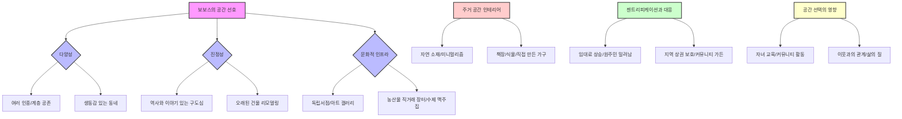

안녕하세요! 책 읽을 시간 없는 여러분을 위해, 데이비드 브룩스의 명작 <보보스 인 파라다이스>를 쉽고 재미있게 요약해 줄게. 이 책은 2000년대 초 미국 사회에 나타난 새로운 지배 계층인 '보보스'에 대한 이야기인데, 지금 우리가 살아가는 방식과 생각에 엄청난 영향을 미쳤다고 해. 마치 우리 주변의 공기처럼 스며들어 있는 보보스 문화를 함께 파헤쳐 보자!
## 1. 보보스, 새로운 지배 계층의 탄생 

옛날에는 부자와 예술가를 딱 잘라 구분할 수 있었어. 부자는 돈 많고 보수적인 사람들이었고, 예술가는 자유롭고 반항적인 사람들이었지. 그런데 1990년대 후반 미국에 돌아온 저자는 이 둘이 뒤섞인 이상한 현상을 발견했어. 마치 에스프레소를 마시는 예술가와 카푸치노를 마시는 은행가를 구분하기 어려워진 것처럼 말이야. 이게 바로 '보보스'의 시작이야.

1. **보보스란 무엇일까?** 
  - 보보스는 '부르주아(Bourgeois)'와 '보헤미안(Bohemian)'을 합친 말이야.
  - 부르주아는 돈 많고 성공을 추구하는 사람들을 뜻하고, 보헤미안은 자유롭고 예술적인 감성을 가진 사람들을 뜻해.
  - 이들은 경제적으로는 성공했지만, 문화적으로는 자유로운 영혼을 가진 사람들이라고 보면 돼.
  - 마치 돈은 많지만 겉으로는 티 내지 않고, 친환경 제품이나 수공예품을 선호하는 사람들 같은 거야.
2. **보보스의 등장 배경** 
  - 저자는 1990년대 초 벨기에 브뤼셀에서 4년 동안 지내다가 미국으로 돌아왔을 때, 사회 전반에 큰 변화가 일어났다는 걸 느꼈어.
  - 부유한 동네에 예술적인 카페가 생기고, 예술가들이 사는 동네에는 비싼 건물들이 들어서는 등 기존의 구분이 사라진 거야.
  - 이런 변화는 '정보화 시대'가 오면서 지식과 정보가 돈만큼 중요해졌기 때문이야.
  - 똑똑한 사람들이 경제적으로 성공하면서, 그들의 문화적 취향까지 사회 전반에 퍼지게 된 거지.
  - 마치 옛날에는 힘이나 돈이 최고였지만, 이제는 똑똑하고 센스 있는 사람이 최고가 된 것과 같아.
3. **보보스의 특징** 
  - 보보스는 세속적인 성공과 문화적인 진보성을 동시에 추구해.
  - 겉으로는 돈에 신경 쓰지 않는 척하지만, 실제로는 돈을 아주 전략적으로 잘 모으는 사람들이야.
  - 그들은 겸손한 척하지만, 자신들만의 우아한 엘리트 의식을 가지고 사회의 가치관을 바꾸고 있어.
  - 마치 비싼 명품 대신 '의미 있는 소비'를 선호하면서, 자신들이 더 도덕적이고 문화적으로 우월하다고 생각하는 사람들 같은 거야.
  - 이들은 더 이상 금이나 은 같은 물질적인 것으로 부를 과시하지 않고, 자신들의 '취향'과 '의미'로 사회적 지위를 드러내.

## 2. 보보스의 일과 직업관: 자아실현의 공간 

보보스에게 일은 단순히 돈을 버는 수단이 아니야. 마치 게임 속 캐릭터를 키우듯이, 일을 통해 자신을 성장시키고 세상을 더 좋게 만드는 '미션'이라고 생각하는 거지.

1. **직업은 자아실현의 공간** 
  - 옛날 사람들은 직업을 생계 수단이나 사회적 지위를 위한 것으로 여겼어.
  - 하지만 보보스에게 직업은 '자아실현'의 공간이자 '도덕적 사명'이야.
  - 자신이 하는 일이 세상에 어떤 긍정적인 영향을 미치는지 끊임없이 고민해.
  - 마치 좋아하는 취미를 직업으로 삼아서, 돈보다는 보람을 더 중요하게 생각하는 사람들과 비슷해.
2. **의미 있는 노동의 추구** 
  - 보보스는 높은 연봉의 대기업 대신, 사회적 기업이나 비영리 단체에서 일하는 것을 주저하지 않아.
  - 수입이 조금 줄더라도, 자신의 일이 세상에 좋은 영향을 준다는 믿음이 더 중요하다고 생각하기 때문이야.
  - 실리콘밸리의 스타트업, 국제 인권 단체, 환경 NGO 같은 곳에서 의미 있는 일을 찾으려고 해.
  - 마치 돈을 많이 벌기보다는, 내가 만든 제품이나 서비스가 사람들에게 도움이 되는 것을 더 중요하게 여기는 개발자들 같은 거야.
3. **수평적이고 창의적인 직장 문화 선호** 
  - 보보스는 위계질서가 강한 조직을 싫어하고, 수평적이고 창의적인 분위기를 좋아해.
  - 칸막이 없는 사무실, 자유로운 복장, 유연한 근무 시간 등을 통해 자신들의 자유로운 감성을 표현하려고 해.
  - '워라벨(일과 삶의 균형)'이라는 개념도 보보스 세대에서 대중화된 거야.
  - 마치 학교에서 선생님이 시키는 대로만 하는 것보다, 친구들과 자유롭게 토론하고 아이디어를 내는 것을 더 좋아하는 학생들 같은 거지.
4. **성공의 새로운 기준** 
  - 보보스도 성공에 집착하지만, 그 표현 방식이 달라.
  - 고급차나 명품 시계 대신, 자신만의 브랜드를 만들거나 특별한 정체성을 갖는 것을 최고의 성공으로 여겨.
  - 유명 레스토랑 셰프, 사회적 스타트업 창업자, 강연자 같은 직업이 보보스에게는 최고의 성공 표지야.
  - 마치 비싼 옷을 입는 것보다, 자신만의 독특한 스타일을 만들어서 사람들에게 인정받는 것을 더 중요하게 생각하는 패션 디자이너와 비슷해.
5. **일과 돈에 대한 철학** 
  - 보보스의 직업 윤리는 '돈을 벌기 위해 일하는 것이 아니라, 일하다 보니 돈이 따라온다'는 사고방식에 가까워.
  - 자신의 일을 통해 자아를 실현하고, 세상과 연결되며, 동시에 문화적 우월감도 갖기를 원해.
  - 마치 좋아하는 그림을 그리다 보니 유명해지고 돈도 벌게 된 화가처럼, 일 자체가 삶의 철학이 되는 거지.

## 3. 보보스의 소비 방식: 가치와 철학을 담다 

보보스는 돈이 많지만, 옛날 부자들처럼 비싼 명품을 자랑하지 않아. 마치 겉모습보다는 그 안에 담긴 '이야기'와 '의미'를 더 중요하게 생각하는 사람들처럼 말이야.

1. **가치와 철학을 반영하는 소비** 
  - 보보스는 단순히 비싼 물건을 사는 것이 아니라, 자신이 추구하는 가치와 철학을 반영하는 소비를 선호해.
  - 무엇을 샀느냐보다 '왜' 그것을 샀느냐가 더 중요하다고 생각해.
  - 마치 옷을 살 때도 단순히 디자인만 보는 게 아니라, 어떤 소재로 만들어졌는지, 누가 만들었는지, 환경에 해롭지는 않은지 따져보는 것과 같아.
2. **지역 장인과 유기농 선호** 
  - 럭셔리 브랜드보다는 지역 장인이 만든 수공예품을 선호하고, 대형 체인 레스토랑보다는 숨겨진 유기농 카페를 찾아다녀.
  - 수백만 원짜리 명품 시계 대신, 북유럽 디자이너가 만든 미니멀한 시계를 차면서 그 시계의 '철학'에 더 관심을 둬.
  - 그들에게 '스타일'은 단순한 외형이 아니라, 의미와 이야기를 담고 있는 것이라고 보면 돼.
  - 마치 유명 브랜드의 대량 생산된 가구보다, 작은 공방에서 장인이 직접 만든 세상에 하나뿐인 가구를 더 좋아하는 사람들처럼 말이야.
3. **윤리적 소비의 중요성** 
  - 보보스의 소비는 '윤리적'이야.
  - 공정 무역, 환경 보호, 로컬 푸드(지역 농산물) 같은 가치를 매우 중요하게 생각해.
  - 슈퍼마켓에서 유기농 토마토를 살 때도, 어느 지역 농장에서 어떻게 재배되었는지 꼼꼼히 따져봐.
  - 소비를 통해 세상을 더 좋게 만들 수 있다는 믿음이 보보스 소비 문화의 핵심이야.
  - 마치 플라스틱 빨대 대신 종이 빨대를 사용하고, 일회용품 사용을 줄이려고 노력하는 사람들처럼, 작은 소비 하나하나에도 의미를 부여하는 거지.
4. **주거 공간의 취향** 
  - 과시적인 대저택보다는 자연 친화적이고 감각적인 공간을 선호해.
  - 친환경 자재로 지은 작은 집, 복고풍이 가미된 모던 인테리어, 미드센츄리 디자인 가구 등이 보보스의 라이프스타일을 구성하는 중요한 요소야.
  - 인테리어는 개인의 안목을 드러내는 수단이자, 그 자체가 하나의 문화적 언어가 돼.
  - 마치 넓고 화려한 아파트보다, 작지만 개성 있고 아늑하게 꾸민 집을 더 좋아하는 사람들처럼 말이야.
5. **경험 중심의 소비** 
  - 보보스는 제품을 사는 것보다, 그 제품을 사용하는 '경험'에 더 큰 가치를 둬.
  - 비싼 골프 클럽보다 친구들과 함께하는 주말 캠핑, 혹은 북유럽 소도시에서 즐기는 한 달간의 디지털 노마드 여행 같은 것에 기꺼이 투자해.
  - 나를 풍요롭게 만드는 경험이 곧 최고의 소비라는 철학이 이들에게 내재되어 있어.
  - 마치 비싼 카메라를 사는 것보다, 그 카메라로 멋진 풍경을 찍으러 여행을 떠나는 것을 더 중요하게 생각하는 사진작가들 같은 거지.

## 4. 보보스의 교육관: 아이는 인간 프로젝트 

보보스에게 자녀 교육은 단순히 공부를 잘하게 만드는 게 아니야. 마치 아이를 하나의 예술 작품처럼 생각하고, 올바른 세계관과 균형 잡힌 감성을 가진 멋진 사람으로 키우는 '인간 프로젝트'라고 보면 돼.

1. **인격체로 키우는 것이 최우선** 
  - 보보스에게 아이는 '인간 프로젝트'이며, 올바른 세계관과 균형 잡힌 감성을 갖춘 인격체로 키우는 것이 가장 중요해.
  - 단순히 성적이나 명문대 진학만을 목표로 하지 않아.
  - 마치 좋은 씨앗을 심어서 튼튼하고 아름다운 나무로 키우듯이, 아이의 내면을 가꾸는 것을 더 중요하게 생각하는 거지.
2. **자기 주도 학습과 감성 지능 강조** 
  - 자기 주도적 학습, 감성 지능, 창의성, 공감 능력 등을 강조해.
  - 수학 문제를 많이 푸는 것보다, '왜' 이 문제가 중요한가를 생각하게 만드는 교육이 더 의미 있다고 여겨.
  - 아이를 단순한 경쟁자로 키우는 것이 아니라, 사회적 책임을 지닌 시민으로 키우는 것이 보보스 교육관의 핵심이야.
  - 마치 정답을 외우는 것보다, 스스로 질문하고 답을 찾아가는 과정을 중요하게 생각하는 교육 방식과 비슷해.
3. 경험 중심 교육** 중시** 
  - 아이와 함께 박물관, 자연사 체험관, 농장, 공방 등을 자주 찾아 직접 체험하게 해.
  - 유럽이나 아시아로 가족 여행을 가서 문화적 다양성을 직접 경험하게 하기도 해.
  - 그들에게 여행은 단순한 놀이가 아니라, 살아 있는 교육의 장이야.
  - 마치 책으로만 배우는 것보다, 직접 보고 만지고 느끼면서 배우는 것을 더 중요하게 생각하는 것과 같아.
4. **의미 있는 질문과 내용에 집중** 
  - "이 문제의 답이 뭐야?"보다는 "왜 이런 현상이 생겼을까?", "너는 어떻게 생각해?" 같은 질문을 통해 사고력과 자기 표현 능력을 키우려 해.
  - 소규모 토론형 수업, 프로젝트 기반 학습, 철학적 질문을 던지는 수업 같은 대안 교육을 적극적으로 수용해.
  - 국제학교나 몬테소리, 발도르프 같은 교육 모델이 보보스에게 인기를 끄는 것도 이와 관련이 있어.
  - 마치 선생님이 일방적으로 가르치는 것보다, 학생들이 서로 토론하고 발표하면서 배우는 것을 더 효과적이라고 생각하는 것과 비슷해.
5. **도덕적 감수성 함양** 
  - 자녀가 성공하되 타인을 배려할 줄 아는 사람으로 자라기를 바라.
  - 자원봉사, 환경 보호, 사회적 약자에 대한 관심 같은 주제를 자연스럽게 일상 교육에 녹여내.
  - '공감 능력'은 이들에게 가장 고급스러운 교육 목표야.
  - 마치 공부만 잘하는 것보다, 친구를 돕고 약한 사람을 배려하는 마음을 더 중요하게 가르치는 부모님들 같은 거지.

## 5. 보보스의 도덕성과 영성: 내면의 질문 

보보스는 겉으로는 도시의 세련된 전문가처럼 보이지만, 속으로는 '나는 어떤 삶을 살아야 하는가?', '무엇이 옳고 그른가?' 같은 질문을 끊임없이 던지는 사람들이야. 마치 겉은 화려한 스마트폰이지만, 그 안에는 깊은 생각과 고민이 담겨 있는 것과 같아.

1. **개인적인 영적 경험 중시** 
  - 종교를 맹목적으로 따르지는 않지만, 종교적 가치나 영적인 질문을 아주 중요하게 생각해.
  - 교회나 사찰에 정기적으로 나가기보다는 명상, 요가, 자연 속 걷기, 심리 상담 등을 통해 내면의 평화를 찾아.
  - "나는 종교적이지 않지만 영적인 사람이다"라는 말을 자주 해.
  - 마치 정해진 종교 의식보다는, 혼자서 조용히 산책하며 마음을 다스리는 것을 더 좋아하는 사람들처럼 말이야.
2. **스스로 선택하고 실천하는 윤리** 
  - 도덕은 강압적인 규범이 아니라, 스스로 선택하고 실천하는 윤리적 감수성이라고 생각해.
  - 남을 해치지 않는 것은 물론, 더 나아가 타인을 돕고 사회적 약자를 위한 삶을 살고 있는지를 늘 고민해.
  - 이런 성찰은 공정 무역 커피를 마시는 습관, 비건 식단, 기부 문화 같은 생활 방식으로 이어져.
  - 마치 누가 시켜서 하는 게 아니라, 스스로 옳다고 생각하는 일을 실천하는 사람들처럼 말이야.
3. **문화적 세련됨과 영성 추구의 모순** 
  - 삶의 의미를 찾기 위해 철학 서적이나 자기 계발서를 읽고, TED 강연을 보며 인문학 강좌에 참석해.
  - 하지만 이런 활동조차도 문화적 세련됨의 일환으로 소비되기도 해.
  - 도덕적 삶을 살되, 그 도덕조차도 세련되게 표현하고자 하는 욕망이 이들에게는 존재해.
  - 마치 건강을 위해 운동을 하지만, 운동복도 비싸고 예쁜 것을 고르는 사람들처럼, 영성 추구에도 '스타일'을 중요하게 생각하는 거지.
4. **환경주의를 종교적 차원에서 수용** 
  - 환경주의를 거의 종교적 차원에서 받아들여.
  - 지구를 보호하고 지속 가능한 삶을 사는 것을 도덕적 의무로 여기며, 이를 통해 내면의 만족감과 영적 충만함을 얻어.
  - 자연과의 조화로운 삶이야말로 현대인이 추구해야 할 최고의 가치라고 믿어.
  - 마치 자연을 신성하게 여기고 보호하는 것을 삶의 중요한 부분으로 생각하는 사람들처럼 말이야.

## 6. 보보스의 정치 성향: 실용주의적 문화 정치 

보보스는 정치적으로 어느 한쪽에 완전히 서지 않아. 마치 요리할 때 정해진 레시피만 따르지 않고, 상황에 따라 재료를 바꾸고 새로운 맛을 시도하는 셰프처럼, 실용적이고 유연한 관점으로 정치 문제를 바라봐.

1. **실용주의적이고 문화적인 관점** 
  - 전통적인 보수와 진보의 경계를 넘나들며, 실용주의적이고 문화적인 관점에서 정치 문제를 바라봐.
  - 그들에게 중요한 것은 정당이 아니라 '문제 해결 방식'이며, 정치 역시 삶의 연장선이라고 생각해.
  - 마치 어떤 팀이 이기느냐보다, 경기가 얼마나 재미있고 공정하게 진행되느냐를 더 중요하게 생각하는 스포츠 팬과 비슷해.
2. **진보적 가치와 자유 시장 옹호의 공존** 
  - 사회적 평등과 환경 보호 같은 진보적 가치를 지지하지만, 동시에 자유 시장과 기업의 혁신을 옹호해.
  - 정부의 개입보다는 개인과 공동체의 자율적인 행동을 더 신뢰해.
  - 그래서 '리버럴한 자본가'나 '환경주의적 기업가' 같은 모순된 정체성을 자연스럽게 받아들여.
  - 마치 환경을 보호하면서도, 친환경 기술로 돈을 버는 기업을 응원하는 사람들처럼 말이야.
3. **감성 중심의 정치 성향** 
  - 감동적인 연설, 정의로운 행동, 문화적으로 세련된 표현에 약해.
  - 정치인보다 오히려 시민 단체 리더나 사회 운동가에게 더 많은 감동을 느낄 때가 많아.
  - 마치 논리적인 설명보다, 진심이 담긴 이야기나 감동적인 영상에 더 마음이 움직이는 사람들처럼 말이야.
4. **구체적이고 실용적인 해결책 선호** 
  - 거대 담론보다는 구체적이고 실용적인 해결책을 선호해.
  - "기후 변화를 막자"는 추상적인 구호보다는, "우리 동네에 전기차 충전소를 늘리자", "학교 급식을 유기농으로 바꾸자" 같은 구체적인 프로젝트에 더 적극적으로 참여해.
  - 마치 큰 목표만 세우는 것보다, 작은 것부터 하나씩 실천해 나가는 것을 더 중요하게 생각하는 사람들처럼 말이야.
5. **정치적 양극화 거부와 유연한 사고** 
  - 정치적 양극화를 거부하고, "우리 편 vs 너희 편" 식의 대립보다는 문제를 함께 해결해 나가는 협력적인 접근을 선호해.
  - 이런 성향 때문에 때로는 우유부단하다거나 일관성이 없다는 비판을 받기도 하지만, 그들 나름대로는 복잡한 현실에 맞는 유연한 사고라고 생각해.
  - 마치 편을 갈라 싸우기보다는, 서로 다른 의견을 가진 사람들이 함께 머리를 맞대고 해결책을 찾는 것을 더 중요하게 생각하는 사람들처럼 말이야.
6. **생활 정치이자 **문화 정치 
  - 투표 참여는 물론이고, 지역 사회 자원봉사, 캠페인, 후원, 온라인 청원 참여 등을 통해 자신의 의견을 적극적으로 표현해.
  - 하지만 이들의 정치 참여는 더 이상 누가 대통령이 되느냐가 아니라, '내가 사는 동네가 어떻게 바뀌느냐'에 집중되어 있어.
  - 결국 보보스의 정치는 '생활 정치'이자 '문화 정치'라고 할 수 있어.
  - 마치 거창한 정치 이념보다는, 우리 동네의 작은 변화를 통해 더 나은 삶을 만들려고 노력하는 사람들처럼 말이야.

## 7. 보보스의 공간 철학: 정서적 질감을 중시 

보보스는 단순히 돈이 많은 동네에 살지 않아. 마치 그림을 고를 때 색깔만 보는 게 아니라, 그 그림이 주는 '느낌'과 '분위기'를 더 중요하게 생각하는 사람들처럼, 공간의 '정서적 질감'을 중시해.

1. **전통 부촌보다 감성적인 공간 선호** 
  - 전통적인 부촌보다 감성이 살아 있는 도시 근교, 재개발된 구도심, 문화적 분위기가 짙은 동네를 선호해.
  - 미국의 브루클린, 포틀랜드, 샌프란시스코의 미션 디스트릭트 같은 곳이 보보스의 대표적인 서식지야.
  - 마치 넓고 으리으리한 집보다, 작지만 개성 있고 이야기가 있는 동네의 집을 더 좋아하는 사람들처럼 말이야.
2. **선호하는 동네의 공통점** 
  - **다양성**: 여러 인종과 계층이 섞여 살며 다양한 문화가 공존하는 곳을 좋아해. 획일적이고 폐쇄적인 곳보다는 약간은 거칠지만 생동감 있는 동네를 선택해.
  - **진정성**: 인위적으로 조성된 신도시보다는 역사와 이야기가 있는 구도심을 선호해. 오래된 건물을 리모델링한 로프트나 공장 건물을 주거 공간으로 바꾼 곳에서 매력을 느껴.
  - **문화적 인프라**: 독립 서점, 아트 갤러리, 소규모 극장, 농산물 직거래 장터, 수제 맥주집 같은 곳들이 걸어서 갈 수 있는 거리에 있어야 해. 이런 공간들은 단순한 상업 시설이 아니라 보보스들의 문화적 정체성을 확인하는 장소야.
  - 마치 대형 마트보다는 동네 작은 서점이나 카페에서 시간을 보내는 것을 더 좋아하는 사람들처럼 말이야.
3. **주택 인테리어와 자기 표현** 
  - 화려한 장식 대신 자연 소재와 북유럽풍 미니멀리즘이 선호되고, 집 안에는 책장, 식물, 직접 만든 가구가 놓여 있어.
  - 집을 '나만의 세계'로 꾸미며, 방문객에게 문화적 메시지를 전하려 해.
  - 거실 한쪽 벽에는 현대 미술 작품이나 여행 사진이 걸려 있고, 부엌에는 유기농 식재료와 수제 조미료가 가득해.
  - 마치 집을 단순한 거주 공간이 아니라, 자신의 취향과 가치관을 보여주는 갤러리처럼 꾸미는 것과 같아.
4. **젠트리피케이션과 대응** 
  - 흥미롭게도 보보스는 '젠트리피케이션(낙후된 지역이 개발되면서 임대료가 오르고 원주민이 밀려나는 현상)'의 주역이면서 동시에 그 피해자이기도 해.
  - 그들이 문화적으로 매력적인 동네로 이주하면서 임대료가 오르고, 결국 그 동네의 원주민들이 밀려나는 현상이 발생해.
  - 하지만 이런 문제에 대해서도 보보스는 나름의 대안을 찾으려 노력해. 지역 상권 보호 운동에 참여하거나, 커뮤니티 가든을 만들거나, 동네 축제를 기획하는 등의 방식으로 지역 사회와 상생하려 해.
  - 마치 자신이 좋아하는 동네가 너무 유명해져서 임대료가 오르는 것을 보면서, 그 동네의 원래 모습을 지키려고 노력하는 사람들처럼 말이야.

## 8. 보보스 문화의 영향과 모순: 현대 사회의 거울 

```mermaid
graph TD
    A["보보스 문화의 영향"] --> B["문화 권력 장악"];
    A --> C["새로운 사회 기준 제시"];
    A --> D["구체적 현상으로 나타남"];
    B --> B1["미디어, 교육, 테크, 문화예술 영향력"];
    C --> C1["어떤 삶을 사는가가 중요"];
    C --> C2["의미 있는 일, 윤리적 소비, 감성적 공간, 깊이 있는 교육"];
    D --> D1["워라벨, 가성비, 착한 소비, 힐링, 미니멀 라이프"];
    D --> D2["스타벅스, 애플의 성공 전략"];

    E["보보스의 모순"] --> F["위선적이고 문화 안에 갇힘"];
    E --> G["특권 누리며 다른 계층과 거리감"];
    E --> H["문화적 우월감에 도취"];
    F --> F1["다양성 외치지만 여전히 특권"];
    G --> G1["최고 교육 기회 제공, 비싼 소박함"];
    H --> H1["다른 계층 문화 무시/판단"];

    I["긍정적 영향"] --> J["물질 만능주의 넘어 삶의 의미 추구"];
    I --> K["환경/사회적 책임 인식 증대"];
    I --> L["개인의 창의성/다양성 존중"];

    style A fill:#f9f,stroke:#333,stroke-width:2px
    style B fill:#bbf,stroke:#333,stroke-width:2px
    style C fill:#bbf,stroke:#333,stroke-width:2px
    style D fill:#bbf,stroke:#333,stroke-width:2px
    style E fill:#fcc,stroke:#333,stroke-width:2px
    style F fill:#cfc,stroke:#333,stroke-width:2px
    style G fill:#cfc,stroke:#333,stroke-width:2px
    style H fill:#cfc,stroke:#333,stroke-width:2px
    style I fill:#ffc,stroke:#333,stroke-width:2px
    style J fill:#bbf,stroke:#333,stroke-width:2px
    style K fill:#bbf,stroke:#333,stroke-width:2px
    style L fill:#bbf,stroke:#333,stroke-width:2px
```

보보스는 단순한 라이프스타일을 넘어, 21세기 문화 권력을 실질적으로 장악한 계층이야. 마치 유행을 선도하는 인플루언서처럼, 사회의 기준을 만들고 세상을 이끌어왔지. 하지만 그들에게도 그림자처럼 따라다니는 모순이 있어.

1. 보보스** 문화의 광범위한 영향력** 
  - 보보스는 미디어, 교육, 테크 산업, 문화 예술 등 거의 모든 분야에서 영향력을 행사하며 사회의 기준을 재정의해 왔어.
  - 과거의 정치적 권력이나 경제적 지배가 아니라, '문화적 기준'을 만드는 방식으로 세상을 이끌고 있는 거야.
  - 이제는 '얼마나 부자인가'보다 '어떤 삶을 사는가'가 중요해졌어.
  - 워라벨, 가성비, 착한 소비, 힐링, 미니멀 라이프 같은 개념들이 모두 보보스 문화에서 비롯된 거야.
  - 스타벅스가 '제3의 공간'을 표방하며 성공하고, 애플이 기술과 인문학의 결합을 내세운 것도 모두 보보스의 가치관을 반영한 전략이었어.
  - 마치 우리가 매일 사용하는 앱이나 즐겨 찾는 카페, 심지어 생각하는 방식까지 보보스 문화의 영향을 받고 있는 것과 같아.
2. **보보스의 모순적인 모습** 
  - 보보스는 때로 위선적이고 자신들만의 문화 안에 갇히기도 해.
  - 다양성과 평등을 외치지만, 실제로는 여전히 특권을 누리며 다른 계층과의 거리감을 좁히지 못하는 경우도 있어.
  - 공정과 정의를 말하면서도 자녀에게는 최고의 교육 기회를 제공하려 하고, 소박한 삶을 추구한다면서도 그 소박함조차 매우 비싼 취향이 되기도 해.
  - 자신들의 문화적 우월감에 도취되어 다른 계층의 문화를 무시하거나 판단하는 경향도 보여. 그들이 '교양'이라고 부르는 것들이 실제로는 특정 계층만의 문화 코드일 수 있음을 간과하는 거지.
  - 마치 환경 보호를 외치면서도 비싼 친환경 제품만 고집하고, 다른 사람들의 소비 방식을 비판하는 사람들처럼 말이야.
3. **데이비드 브룩스의 자기 비판과 변화** 
  - 데이비드 브룩스는 2021년에 <아틀란틱>에 쓴 글에서 자신이 보보스에 대해 많이 틀렸다고 인정했어.
  - 그는 보보스(자신을 포함한 엘리트 계층)가 문화적 지배력을 너무 공격적으로 행사하고, 경제적 특권을 보호하기 위해 장벽을 세웠으며, 이념적 다양성에 대한 관용이 부족했다고 말했어.
  - 특히 엘리트들이 다른 계층의 목소리를 무시하면서, 트럼프 지지자들처럼 '보이지 않는 존재'로 느껴진 사람들이 반발하게 되었다고 진단했어.
  - 마치 자신이 쓴 책의 내용이 현실과 다르게 흘러가자, 솔직하게 자신의 잘못을 인정하고 반성하는 것과 같아.
4. **보보스가 현대 사회에 미친 긍정적 영향** 
  - 물질 만능주의를 넘어서 삶의 의미를 추구하게 만들었어.
  - 환경과 사회적 책임에 대한 인식을 높였어.
  - 개인의 창의성과 다양성을 존중하는 문화를 만들어냈어.
  - 마치 어두운 면도 있지만, 전체적으로는 사회에 좋은 영향을 준 혁신적인 아이디어처럼 말이야.
5. **보보스, 끝나지 않은 이야기** 
  - 보보스는 단순히 미국만의 현상이 아니라, 전 세계적으로 그리고 우리나라에서도 비슷한 흐름을 찾아볼 수 있어.
  - 한국의 홍대, 이태원, 성수동 같은 지역에서 볼 수 있는 문화적 풍경이나, 젊은 세대들이 추구하는 '소확행(소소하지만 확실한 행복)'이나 '가치 소비' 같은 트렌드들도 모두 보보스적 가치관에 영향을 받은 것들이야.
  - 보보스는 우리에게 "성공이란 무엇인가?", "좋은 삶이란 무엇인가?", "우리는 어떤 가치를 추구하며 살아야 하는가?" 같은 중요한 질문을 던져.
  - 물질적 풍요와 정신적 만족, 개인적 성취와 사회적 책임, 전통과 혁신 사이에서 어떻게 균형을 찾을 것인가 하는 문제 말이야.
  - 마치 우리가 어떤 길을 선택하느냐에 따라 미래가 달라지듯이, 보보스 문화가 앞으로 어떻게 발전할지는 우리 모두의 선택에 달려 있어.

## 9. 데이비드 브룩스에 대한 비판: 왜 그를 읽어야 하는가? 

데이비드 브룩스의 책은 새로운 계층을 잘 묘사했지만, 동시에 많은 비판을 받기도 했어. 마치 맛있는 음식인데, 재료가 어디서 왔는지, 어떻게 만들어졌는지 제대로 설명하지 않는 식당 같은 거지.

1. **피상적인 관찰과 분석의 부재** 
  - 책을 읽는 압도적인 경험은 '사상'이 아니라 '피상적인 얕음'이야.
  - 데이비드 브룩스는 "요즘 사람들이 카푸치노를 많이 마시는 것 같지 않아?" 같은 피상적인 관찰에만 관심이 있어.
  - 실제 분석이나 사람들과의 인터뷰는 전혀 없어. 수천만 명에 달하는 '보보스'에 대한 책인데, 단 한 번의 인터뷰도 없다는 점이 놀라워.
  - 마치 겉모습만 보고 사람을 판단하는 것처럼, 깊이 있는 이해 없이 현상만 나열하는 거야.
2. **사실 확인 없는 일화와 **스테레오타입 
  - 그는 자신의 주장을 뒷받침하기 위해 '일화'를 많이 사용하는데, 이 일화들이 사실이 아닌 경우가 많아.
  - 예를 들어, 뉴욕타임스 결혼 기사에 나온 커플들이 마라톤에서 만났거나 미얀마로 신혼여행을 갔다는 주장이 사실과 달랐어.
  - 스쿠버 마스크에 반지를 넣어 프러포즈했다는 이야기는 현실적으로 말이 안 돼.
  - 그는 자신의 주장이 틀렸다는 지적에 "지적인 독자라면 농담인 줄 알았을 것"이라고 변명하기도 했어.
  - 버몬트 벌링턴에서 차가 멈춰 선 것을 보고, 운전자가 보행자를 윤리적으로 우월하게 생각해서 멈췄다고 멋대로 해석하는 등, 평범한 상황에 이상한 의미를 부여하기도 해.
  - 마치 "옛날에 어떤 사람이 그랬대"라고 하면서, 그 이야기가 진짜인지 확인도 안 하고 믿어버리는 것과 같아.
3. **위선적인 비판과 계층에 대한 오해** 
  - 그는 '보보스'를 비판하면서도, 정작 자신은 그 계층에 속해 있어.
  - 기업들이 직원들에게 '자아실현'을 내세우며 더 열심히 일하게 만드는 현상을 지적하면서도, 그 기업들의 '속셈'에 대해서는 깊이 있게 다루지 않아.
  - 그는 '보보스'가 새로운 지배 계층이 되면서 자신들만의 규칙을 만들고, 이전 계층만큼이나 위선적이라고 비판해.
  - 예를 들어, BDSM(성적 취향 중 하나) 모임에서 재활용을 안 하면 쫓겨날 것이라고 상상하며, 보보스의 도덕성이 위선적이라고 주장해.
  - 하지만 이런 주장은 '계층 의식'이 부족해서 생기는 문제라는 비판도 있어. CEO와 저임금 노동자를 같은 '보보스'로 묶는 것은 현실을 제대로 반영하지 못한다는 거야.
  - 마치 자신도 똑같은 행동을 하면서, 남의 행동만 비판하는 사람처럼 보이는 거지.
4. **데이비드 브룩스의 역할: 엘리트층의 안심제** 
  - 데이비드 브룩스 자체보다는, 그가 필요한 '이유'가 문제라는 지적도 있어.
  - 그는 뉴욕타임스 같은 주류 언론에서 '보수 논객' 역할을 하면서, 진보적인 엘리트층에게 "우리는 다른 의견도 듣는 합리적인 사람들"이라는 안도감을 주는 역할을 해.
  - 하지만 그는 어떤 분야의 전문가도 아니고, 깊이 있는 취재를 하지도 않으며, 과거에 옳았던 적도 거의 없어.
  - 그는 보수주의자들에게는 영향력이 없고, 오히려 진보적인 엘리트층을 위해 존재한다는 비판을 받아.
  - 마치 맛은 없지만, "그래도 건강에 좋대"라는 말에 속아 계속 먹게 되는 약 같은 존재라고 할 수 있어.

