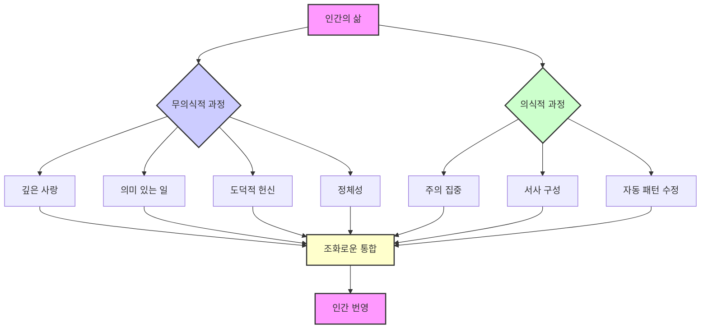

데이비드 브룩스의 "소셜 애니멀"은 우리가 의식하지 못하는 무의식적인 힘이 우리의 삶, 사랑, 성격, 성공, 그리고 지능까지 어떻게 형성하는지 과학적인 연구를 통해 깊이 파고드는 책이다. 이 책은 인간이 합리적인 존재라는 통념에 도전하며, 우리의 행동과 결정 뒤에 숨겨진 복잡한 무의식적 메커니즘을 이해하도록 돕는다.
## 1. 무의식의 숨겨진 힘: 우리의 삶을 움직이는 진짜 원동력 

우리는 스스로를 논리적이고 의식적인 결정을 내리는 존재라고 생각하지만, 사실 우리 삶의 가장 중요한 결정들은 우리가 알지 못하는 사이에 무의식적으로 일어난다.

1. **의식과 무의식의 차이**:
  - 우리는 의식적인 마음이 모든 것을 통제한다고 믿지만, 현대 연구는 의식적인 마음이 인간 행동을 이끄는 가장 작은 부분임을 보여준다. 
  - 무의식은 혼란스럽거나 원시적이지 않고, 매우 정교하고 패턴을 찾으며 놀랍도록 지능적이다. 
  - 우리의 깊은 가치, 강한 유대감, 중요한 삶의 선택들은 주로 이 무의식적인 기반에서 나온다. 
2. **해럴드와 에리카의 이야기**:
  - 데이비드 브룩스는 해럴드와 에리카라는 가상의 인물들의 삶을 통해 이러한 통찰력을 설명한다. 
  - 그들의 삶을 따라가며 신경과학, 심리학, 사회학 등 최신 연구가 인간 존재의 숨겨진 차원을 어떻게 밝혀내는지 탐구한다. 
  - 이 이야기는 우리 자신과 타인을 이해하는 데 영향을 미치는 보이지 않는 정신 과정을 생생하게 보여준다. 

## 2. 초기 애착의 중요성: 사회적 본성의 시작 

우리의 사회적 본성은 태어날 때부터 시작된다. 아기들은 얼굴을 인식하고, 표정을 모방하며, 보호자와 정서적 조화를 이루려는 능력을 가지고 태어난다.

1. **선천적인 연결 능력**:
  - 아기들은 연결을 위해 뇌가 이미 그렇게 만들어져서 태어난다. 
  - 이것은 학습된 행동이 아니라, 우리의 신경 구조에 내장되어 있는 것이다. 
2. **애착 관계의 영향**:
  - 초기 애착 관계의 질은 발달에 깊은 영향을 미친다. 
  - 보호자가 일관되고 민감하게 반응하는 '안정 애착'은 모든 미래 관계에 영향을 미치는 신뢰의 기반을 만든다. 
  - 안정 애착을 가진 아이들은 감정 조절을 더 잘하고, 세상을 탐험하는 데 더 높은 자신감을 가지며, 스트레스 상황에서 더 큰 회복력을 보인다. 
3. **해럴드의 사례**:
  - 해럴드는 세심한 부모님과 함께 중산층 가정에서 태어나 안정적인 기반을 경험한다. 
  - 그의 어머니는 심리학자들이 '우발적 의사소통'이라고 부르는 것을 직관적으로 제공하며, 해럴드가 이해받는다고 느끼도록 그의 필요에 반응한다. 
  - 이러한 초기 조화의 경험은 해럴드에게 세상이 본질적으로 안전하고, 자신의 감정이 중요하며, 환경에 영향을 미칠 수 있다는 것을 가르친다. 
4. **뇌 발달에 미치는 영향**:
  - 이러한 안정적인 기반은 해럴드를 더 행복하게 할 뿐만 아니라, 그의 뇌 발달을 근본적으로 형성한다. 
  - 초기 상호작용 동안 형성되는 신경 경로는 그가 평생 감정 정보를 처리하는 방식의 '템플릿(틀)'이 된다. 
  - 유아기에 확립된 무의식적인 패턴은 그가 미래의 모든 사회적 경험을 해석하는 '필터(여과 장치)'를 만든다. 
  - 연구에 따르면 이러한 초기 애착은 학업 성공부터 관계 안정성까지 모든 것을 예측한다. 
  - 아이가 누군가의 마음속에 안전하게 자리 잡고 있다는 느낌은 탐험, 학습, 건강한 독립을 위한 심리적 기반을 만든다. 
  - 이것은 단순히 정서적 편안함이 아니라, 인지 발달이 구축되는 필수적인 플랫폼이다. 

## 3. 사회적 뇌: 공감과 협력의 진화 

인간의 뇌는 주로 사회적 기관으로 진화했다. 사회적 처리에 대한 우리의 막대한 신경 투자는 다른 사람의 의도를 이해하고, 행동을 조율하며, 복잡한 문화 시스템을 만드는 데 탁월한 능력을 부여한다.

1. **사회적 처리 능력**:
  - 해럴드의 발달하는 뇌는 바로 이러한 기술에 특화되어 있다. 
  - 4세가 되면 해럴드는 '마음 이론(Theory of Mind)'을 보여주는데, 이는 다른 사람이 자신과 다른 신념과 관점을 가지고 있음을 이해하는 능력이다. 
  - 이 인지적 이정표는 단순히 덜 자기중심적이 되는 것을 넘어, 공감, 복잡한 협력, 그리고 공동체 생활에 필요한 도덕적 상상력의 기반이 된다. 
2. **거울 뉴런의 역할**:
  - 우리 뇌에는 '거울 뉴런'을 포함한 사회적 인지를 위한 특화된 시스템이 있다. 
  - 거울 뉴런은 우리가 어떤 행동을 할 때와 다른 사람이 같은 행동을 하는 것을 관찰할 때 모두 활성화된다. 
  - 이 신경 미러링은 다른 사람의 경험에 대한 '구체화된 시뮬레이션(몸으로 느끼는 모방)'을 만들어, 우리가 말 그대로 그들이 느끼는 것을 어느 정도 느낄 수 있게 한다. 
  - 해럴드는 친구가 슬플 때 단순히 지적으로 이해하는 것이 아니라, 그의 뇌가 자신의 감정 시스템 내에서 그 슬픔을 부분적으로 재현한다. 
3. **사회적 동기 부여**:
  - 이러한 사회적 지향성은 우리의 가장 깊은 동기까지 확장된다. 
  - 뇌의 보상 시스템은 사회적 수용에 강력하게 반응하고, 거부에 고통스럽게 반응한다. 
  - 신경 스캔은 사회적 고통이 신체적 고통과 동일한 뇌 영역을 많이 활성화한다는 것을 보여준다. 
  - 이러한 연결은 왜 배제가 그렇게 본능적으로 아픈지, 그리고 왜 소속감이 행복에 그렇게 필수적인지 설명한다. 
4. **복잡한 사고의 진화**:
  - 우리가 가장 중요하게 여기는 인지 능력(추상적 추론, 계획, 메타인지)조차도 주로 기술적 문제 해결을 위해서가 아니라, 점점 더 복잡해지는 사회 집단을 탐색하기 위해 사회적 맥락 내에서 진화했다. 
  - 해럴드의 지능은 그의 사회적 본성과 분리된 것이 아니라, 그것의 표현이다. 

## 4. 성격의 발달: 무의식적 패턴의 형성 

성격은 가치에 대한 의식적인 강의를 통해서 형성되는 것이 아니라, 무의식적인 반응과 인식 패턴을 형성하는 수천 가지의 작은 상호작용을 통해 형성된다.

1. **가정생활의 암묵적 교육**:
  - 해럴드의 도덕적 발달은 명시적인 규칙보다는 그의 가정생활의 '암묵적 교육과정(명시적으로 가르치지 않아도 자연스럽게 배우는 것)'을 통해 일어난다. 
  - 그의 부모님은 가치를 논하는 것이 아니라, 그것을 삶으로 보여줌으로써 핵심적인 미덕을 모델링한다. 
  - 그들이 어려움에 직면했을 때 끈기를 보여주거나, 갈등을 해결할 때 공정함을 보여주거나, 도움이 필요한 사람들에게 연민을 보여줄 때, 해럴드의 뇌는 이러한 패턴을 말보다 더 깊은 수준에서 흡수한다. 
  - 이러한 '감정 교육'은 주로 의식 밖에서 일어나지만, 그의 성격을 깊이 형성한다. 
2. **자기 통제력의 발달**:
  - 연구에 따르면 삶의 성공에 가장 중요한 성격 강점인 '자기 통제력'은 일관되고 예측 가능한 환경에서 발달한다. 
  - 이러한 환경에서는 작은 노력이 보상받고 충동이 즉시 만족되지 않는다. 
  - 해럴드는 의지력만으로 만족을 지연하는 것을 배우는 것이 아니라, 반복적인 경험을 통해 구축된 무의식적인 조절 시스템을 통해 배운다. 
3. 공감** 능력의 발달**:
  - 마찬가지로, 그의 공감 능력은 그 자신이 이해받는 것을 통해 발달한다. 
  - 그의 감정을 정확하게 인지하고 확인해주는 부모를 가짐으로써, 그는 다른 사람들에게도 같은 이해를 확장할 수 있는 신경 패턴을 만든다. 
  - 이러한 '정서적 상호성'은 공정성과 타인에 대한 보살핌에 대한 그의 도덕적 직관의 기반이 된다. 
4. **정체성의 형성**:
  - 해럴드의 정체성조차도 의도적인 자기 성찰을 통해 구성되기보다는 주로 무의식적으로 형성된다. 
  - 그의 자기 개념은 다른 사람들이 그에게 어떻게 반응하고 그가 환경에 어떻게 영향을 미치는지에 대한 축적된 경험에서 나온다. 
  - 그의 뇌는 이러한 사회적 상호작용을 기반으로 '나는 누구인가'에 대한 암묵적인 이론을 지속적으로 업데이트한다. 
5. **문화적 강조와의 대비**:
  - 이러한 무의식적인 성격 형성은 가치의 명시적인 가르침에 대한 우리의 문화적 강조와는 대조적이다. 
  - 의식적인 도덕적 추론이 중요하지만, 브룩스는 성격이 주로 일상생활의 숨겨진 교육과정, 가정의 정서적 분위기, 성공과 실패에 대한 일관된 반응, 그리고 가장 중요한 것에 대한 암묵적인 가정에서 나온다고 강조한다. 

## 5. 교육과 학습: 무의식적 학습의 중요성 

전통적인 교육은 의식적이고 명시적인 지식을 지나치게 강조하는 반면, 우리의 능력 대부분을 형성하는 무의식적이고 암묵적인 학습을 과소평가한다.

1. **전통 교육의 한계**:
  - 해럴드의 정규 교육은 주로 언어로 표현하고 시험할 수 있는 사실과 개념에 거의 전적으로 초점을 맞춘다. 
  - 학습의 정서적, 사회적 차원은 크게 무시된다. 
2. **효과적인 학습의 본질**:
  - 연구에 따르면 효과적인 학습은 여러 뇌 시스템을 포함한다. 
  - 여기에는 무엇에 주의를 기울일 가치가 있는지 결정하는 감정 네트워크와 구체화된 이해를 만드는 운동 시스템이 포함된다. 
  - 해럴드가 천문학에 대한 호기심을 불러일으키는 선생님을 만났을 때, 그의 학습은 단순히 인지적인 것이 아니다. 
  - 그의 주의 시스템, 감정 반응, 심지어 자세 변화까지 뇌 전체의 참여를 반영한다. 
3. **전문성의 발달**:
  - 진정한 전문성은 주로 추상적인 규칙을 통해서가 아니라, 무의식적인 패턴 인식을 만드는 수천 가지 사례에 노출됨으로써 발달한다. 
  - 체스 마스터는 가능한 모든 수를 계산하는 것이 아니라, 암묵적인 지식을 기반으로 유망한 구성을 즉시 본다. 
  - 마찬가지로, 해럴드의 글쓰기 실력은 문법 규칙을 암기하는 것보다 효과적인 표현의 수많은 사례를 흡수하는 것에서 나온다. 
4. **학습의 사회적 맥락**:
  - 학습의 사회적 맥락은 매우 중요하다. 
  - 해럴드의 동기 부여와 성과는 그가 교육 환경에서 소속감을 느끼는지 여부에 따라 극적으로 영향을 받는다. 
  - '고정관념 위협(Stereotype Threat)'은 자신의 집단에 대한 부정적인 고정관념을 확인하는 것에 대한 불안감인데, 이는 인지 능력을 크게 손상시킬 수 있다. 
  - 이는 사회적 정체성이 지적 성취를 무의식적으로 어떻게 형성하는지 보여준다. 
5. **데카르트 모델의 한계**:
  - 브룩스는 교육이 마음과 몸, 이성과 감정, 개인과 공동체를 분리하는 '데카르트 모델'에 갇혀 있다고 강조한다. 
  - 이러한 파편화된 접근 방식은 학습이 본질적으로 감정적이고, 구체화되며, 사회적이라는 것을 인식하지 못한다. 
  - 해럴드의 가장 변화적인 교육 경험은 선생님들이 그의 의식적인 추론 능력뿐만 아니라 그의 전체 존재를 참여시키는 환경을 만들 때 일어난다. 

## 6. 사랑과 관계: 무의식적 끌림의 복잡성 

낭만적인 끌림은 우리가 깨닫는 것보다 훨씬 더 정교한 무의식적인 메커니즘을 통해 주로 작동한다.

1. **무의식적 끌림**:
  - 해럴드가 에리카를 만났을 때, 그의 의식적인 경험은 단순히 그녀에게 끌리는 것이다. 
  - 그가 인지하지 못하는 것은 유전적 적합성, 지위 지표, 애착 잠재력, 그리고 그의 끌림을 형성하는 수십 가지 다른 변수를 평가하는 복잡한 시스템이다. 
  - 연구에 따르면 우리는 잠재적인 파트너를 만난 지 수 밀리초(1000분의 1초) 내에 인상을 형성한다. 
  - 이는 초기 애착 경험과 문화적 노출을 통해 무의식적으로 형성된 내부 '템플릿(이상형의 틀)'과 비교하는 무의식적인 패턴 매칭 시스템에 의해 주도된다. 
  - 우리는 종종 우리 자신과 닮은 사람들에게 무의식적으로 끌린다. 
  - 외모뿐만 아니라 행동, 정신, 심지어 얼굴 특징(미소의 너비, 눈 간격 등)까지도 유사한 파트너를 선택하는 경향이 있다. 
  - 파트너는 일반적으로 비슷한 사회적, 교육적, 경제적 배경을 가진 경우가 많다. 
  - 1950년대 콜럼버스 오하이오의 한 연구에서는 결혼 허가 신청 커플의 절반 이상이 데이트 전에 16블록 이내에 살았고, 37%는 5블록 이내에 살았다는 것을 보여주었다. 
  - 이는 단순히 공유된 가치나 관심사뿐만 아니라, 일상생활에서의 '근접성'이 커플을 묶어준다는 것을 시사한다. 
2. **보편적인 매력의 신호**:
  - 특정 신체적 특성은 문화와 성별을 초월하여 보편적으로 매력적이다. 
  - 이성애자 여성은 일반적으로 키가 크고, 대칭적인 특징을 가지며, 강인함의 징후를 보이는 남성에게 끌린다. 
  - 놀랍게도, 여성은 동공이 더 큰 남성에게 더 강한 성적 매력을 느낀다. 
  - 반대로, 포괄적인 글로벌 연구에 따르면 이성애자 남성은 일반적으로 허리-엉덩이 비율이 0.7에 가까운 여성을 선호한다. 
  - 이와 함께, 통통한 입술, 깨끗한 피부, 건강한 머리카락과 같은 특징도 일관되게 선호된다. 
  - 이러한 선호는 깊이 뿌리박혀 있고 종종 무의식적이며, 파트너 선택이 근접성, 신체적 특징, 그리고 우리가 알든 모르든 우리 자신을 상기시키는 얼굴의 친숙함이라는 복잡한 조합에 의해 영향을 받는다는 것을 보여준다. 
3. 정서적 동기화:
  - 초기 끌림을 넘어, 관계 성공은 무의식적인 '정서적 동기화(감정의 조화)'에 크게 의존한다. 
  - 해럴드와 에리카의 궁합은 공유된 관심사나 의식적인 가치보다는 그들의 감정 조절 시스템이 어떻게 상호작용하는지에 달려 있다. 
  - 그들의 신경계는 말 그대로 '공동 조절(서로의 감정을 조절)'하며, 각 파트너의 생리적 상태가 의식 밖에서 발생하는 복잡한 피드백 루프에서 다른 파트너에게 영향을 미친다. 
4. **비언어적 의사소통**:
  - 파트너 간의 의사소통은 주로 비언어적 채널(얼굴 표정, 목소리 톤, 자세, 타이밍)을 통해 이루어진다. 
  - 이러한 비언어적 신호는 말보다 더 강력하게 감정 정보를 전달한다. 
  - 관계가 어려움을 겪을 때, 문제는 일반적으로 두 파트너가 무엇이 잘못되었는지 말로 표현하기 전에 이러한 무의식적인 신호에서 먼저 나타난다. 
5. **어린 시절 애착 패턴의 영향**:
  - 어린 시절에 확립된 애착 패턴은 성인 관계에 깊은 영향을 미친다. 
  - 해럴드의 안정 애착 이력은 그가 갈등 중에도 연결을 유지할 수 있게 하는 반면, 에리카의 더 불안한 애착 스타일은 불일치 중에 강렬한 버림받을까 봐 하는 두려움을 활성화시킨다. 
  - 두 사람 모두 이러한 근본적인 패턴을 인식하기 전까지는 왜 그렇게 반응하는지 완전히 이해하지 못한다. 
6. 긍정성 비율:
  - 성공적인 장기 관계는 낭만적인 열정으로 유지되는 것이 아니라, 연구자들이 '긍정성 비율(긍정적인 상호작용과 부정적인 상호작용의 균형)'이라고 부르는 것을 통해 유지된다. 
  - 잘 지내는 커플은 부정적인 상호작용 1회당 최소 5회의 긍정적인 교환을 유지하여, 피할 수 없는 갈등에 대비하는 선의의 정서적 분위기를 조성한다. 
7. **문화적 서사의 한계**:
  - 브룩스는 의식적인 궁합과 의사소통을 강조하는 낭만적인 사랑에 대한 우리의 문화적 서사가 관계 성공을 실제로 결정하는 더 깊은 무의식적 차원을 놓치고 있음을 보여준다. 
  - 해럴드와 에리카의 여정은 파트너십이 주로 의도적인 노력보다는 정렬된 감정 시스템과 무의식적인 조화를 통해 번성한다는 것을 보여준다. 

## 7. 경력과 성취: 무의식적 동기 부여의 역할 

전통적인 경력 성공 모델은 의식적인 목표, 전략적 계획, 공식적인 자격을 강조한다. 그러나 연구에 따르면 성취는 동기 부여, 끈기, 사회적 탐색의 무의식적인 패턴에 훨씬 더 많이 의존한다.

1. **무의식적 동기 부여**:
  - 에리카의 경력 궤적은 이러한 현실을 보여준다. 
  - 그녀의 의식적인 야망은 '숙달에 대한 암묵적인 추진력(무의식적인 성취 욕구)'보다 덜 중요하다. 
  - 이러한 동기 부여는 의식적인 선택에서 오는 것이 아니라, 성취를 긍정적인 감정과 연결시킨 초기 경험에서 온다. 
2. **전문성의 발달**:
  - 전문적인 전문성은 주로 명시적인 규칙이 아니라 '패턴 인식'을 통해 발달한다. 
  - 에리카가 사업 경험을 쌓으면서, 그녀는 방대한 양의 정보를 통합하는 빠르고 무의식적인 평가인 '얇게 썰기 능력(Thin Slicing Abilities)'을 개발한다. 
  - 그녀의 직관적인 판단은 종종 그녀의 의식적인 분석보다 더 정확하다는 것이 입증되며, 이는 그녀의 무의식적인 마음의 정교한 처리를 반영한다. 
3. **사회적 지능의 중요성**:
  - '사회적 지능'은 경력 발전에 매우 중요하다. 
  - 에리카는 계산적인 전략을 통해서가 아니라, 미묘한 지위 단서, 감정적 흐름, 관계 역학에 대한 무의식적인 독해를 통해 직장 정치를 탐색한다. 
  - 다른 성격에 맞게 의사소통 스타일을 조정하는 그녀의 능력은 암묵적인 사회적 지식을 활용하여 주로 자동으로 일어난다. 
4. **실용적 지능**:
  - 가장 성공적인 전문가들은 심리학자들이 '실용적 지능(Practical Intelligence)'이라고 부르는 것을 개발한다. 
  - 이는 공식적인 규칙이 적용되지 않을 때 상황을 읽고 무엇을 해야 할지 아는 능력이다. 
  - 이러한 '암묵적 지식(Tacit Knowledge)'은 직접적으로 가르칠 수 없다. 
  - 이는 가치와 판단이 관찰과 실습을 통해 전달되는 전문 문화에 몰입함으로써 발달한다. 
5. **경력 선택에 대한 도전**:
  - 브룩스는 기술과 시장 수요에 대한 합리적인 평가를 기반으로 경력 선택을 해야 한다는 생각에 도전한다. 
  - 대신, 그는 지속 가능한 성공이 일과 우리의 무의식적인 동기 부여 패턴 간의 '정렬(일치)'에서 온다는 것을 보여준다. 
  - 에리카가 자율성, 숙달, 목적에 대한 그녀의 암묵적인 욕구를 충족시키는 일을 찾았을 때, 그녀의 생산성과 만족도는 자연스럽게 증가한다. 

## 8. 집단과 문화: 무의식적 사회적 영향 

인간은 '초사회적(Ultra-social)' 존재이며, 그들의 행동은 의식적인 인식 아래에서 작동하는 집단 역학에 의해 깊이 형성된다. 해럴드와 에리카의 결정은 소비 구매부터 정치적 견해에 이르기까지 그들이 깨닫는 것보다 훨씬 더 무의식적인 사회적 순응에 의해 영향을 받는다.

1. **자동 모방 시스템**:
  - 연구에 따르면 우리는 자동 '모방 시스템(Mimicry Systems)'을 통해 주변 사람들의 행동, 감정, 심지어 신체 자세까지 무의식적으로 채택한다. 
  - 해럴드는 남부 동료들 주변에서는 자동으로 더 느리게 말하고, 뉴욕에서는 더 빠르게 말하는데, 이는 의도적인 의도 없이 이루어지는 조정이다. 
  - 이러한 무의식적인 동기화는 사회적 응집력과 공유된 감정 상태를 만든다. 
2. **문화적 규범의 영향**:
  - 문화적 규범은 주로 명시적인 규칙을 통해서가 아니라, 사회학자들이 '상황의 정의(Definition of the Situation)'라고 부르는 것을 통해 행동을 형성한다. 
  - 이는 맥락이 무엇을 의미하고 어떻게 행동해야 하는지에 대한 암묵적인 이해를 말한다. 
  - 해럴드는 무의식적인 문화적 틀에 따라 직장, 교실, 사교 모임에서 동일한 행동을 다르게 인식하고 반응한다. 
3. **집단 정체성의 편향**:
  - 우리의 집단 정체성(국가, 종교, 직업, 정치적)은 인식을 깊이 형성한다. 
  - 연구에 따르면 집단 구성원은 무의식적으로 정보 처리에 편향을 주어, 사회적 정체성에 따라 동일한 사실을 다르게 인식하게 된다. 
  - 해럴드와 에리카는 모두 정치적 정보를 객관적으로 평가한다고 믿지만, 그들의 집단 소속이 무엇을 설득력 있게 여기는지 어떻게 걸러내는지 알지 못한다. 
4. **다양한 팀의 이점**:
  - 이러한 집단 영향은 왜 다양한 팀이 최고의 개인들의 집합보다 더 나은 결과를 산출하는지 설명한다. 
  - 다른 문화적 틀은 다양한 무의식적인 가정과 지각 필터를 가져와 더 포괄적인 집단 지능을 만든다. 
  - 해럴드가 다양한 동료들과 일할 때, 그들의 상호 보완적인 맹점과 통찰력은 더 우수한 해결책으로 이어진다. 
5. **개인주의적 서사에 대한 도전**:
  - 브룩스는 인간을 독립적인 의사 결정자로 묘사하는 개인주의적 서사에 도전한다. 
  - 대신, 그는 우리의 생각과 행동이 우리가 거의 인식하지 못하는 방식으로 우리를 형성하는 사회적 네트워크에서 나온다는 것을 보여준다. 
  - 해럴드와 에리카는 독립적인 선택을 하는 자율적인 단위가 아니다. 
  - 그들은 그들의 인식, 가치, 행동에 깊은 영향을 미치는 사회적 네트워크의 '노드(연결점)'이다. 

## 9. 의사 결정: 감정과 직관의 통합 

합리적인 선택에 대한 우리의 믿음에도 불구하고, 대부분의 결정은 감정적 가치, 사회적 영향, 암묵적 지식을 통합하는 무의식적인 과정에서 나온다.

1. **감정 처리의 중요성**:
  - 해럴드가 중요한 경력 결정에 직면했을 때, 그의 의식적인 숙고는 그의 선택을 결정하는 신경 활동의 작은 부분에 불과하다. 
  - 연구에 따르면 효과적인 결정은 '감정 처리'에 달려 있다. 
  - 감정 생성 뇌 영역에 손상을 입은 환자들은 온전한 추론 능력에도 불구하고 치명적인 실용적 결정을 내린다. 
  - 그들의 결정은 더 깊은 가치와 일치하는 옵션을 나타내는 '감정 태그(감정적 신호)'에 접근할 수 없기 때문에 실패한다. 
  - 해럴드의 경력 경로에 대한 '직감(Gut Feelings)'은 비합리적인 방해가 아니다. 
  - 그것들은 그의 전체 삶의 경험을 활용하는 정교한 통합 메커니즘이다. 
2. **인식 주도 의사 결정**:
  - 많은 결정은 심리학자들이 '인식 주도 의사 결정(Recognition-Primed Decision Making)'이라고 부르는 것을 통해 일어난다. 
  - 이는 이전에 경험했던 상황과 유사한 상황을 식별하는 '패턴 매칭'이다. 
  - 경험 많은 소방관은 비상 상황에서 의식적으로 옵션을 저울질하는 것이 아니라, 패턴을 인식하고 직관적으로 무엇을 해야 할지 안다. 
  - 마찬가지로, 해럴드의 가장 성공적인 결정은 종종 명시적인 분석보다는 무의식적인 인식에서 나온다. 
3. **과도한 사고의 함정**:
  - 이는 선호도에 대한 이유를 분석하는 것이 실제로 더 나쁜 결정으로 이어질 수 있는 이유를 설명한다. 
  - 사람들이 한 가지 옵션을 선호하는 이유를 말로 표현하도록 강요받을 때, 그들은 쉽게 설명할 수 있는 속성에 초점을 맞추는 반면, 종종 더 나은 선택을 안내하는 복잡한 암묵적 지식을 무시한다. 
  - 해럴드는 과도한 사고가 그의 무의식적인 지혜에 대한 접근을 방해할 때 때때로 더 나쁜 결정을 내린다. 
4. **무의식적 처리의 이점**:
  - 복잡한 선택은 무의식적 처리 기간으로부터 이점을 얻는다. 
  - '하룻밤 자고 나면 지혜가 생긴다(Sleep on it wisdom)'는 말은 과학적 현실을 반영한다. 
  - 문제 해결 메커니즘은 의식적인 사고가 할 수 없는 방식으로 정보를 통합하며, 인식 아래에서 계속 작동한다. 
  - 해럴드의 획기적인 아이디어는 종종 문제를 제쳐두고 그의 무의식적인 마음이 방해받지 않고 작동하도록 허용한 후에 나온다. 
5. **의식과 무의식의 파트너십**:
  - 브룩스는 명시적인 추론에 대한 우리의 문화적 강조가 우리의 가장 중요한 결정을 실제로 안내하는 정교한 무의식적인 시스템을 무시한다고 밝힌다. 
  - 해럴드와 에리카는 감정이나 직관을 무시함으로써가 아니라, 이러한 신호를 의식적인 성찰과 통합함으로써 가장 현명한 선택을 한다. 
  - 좋은 판단은 의식적 처리와 무의식적 처리 간의 '파트너십'에서 나온다는 것을 인식한다. 

## 10. 도덕과 의미: 직관과 연결의 원천 

도덕적 판단은 이성적인 원리보다는 직관적인 반응에서 주로 나온다.

1. **도덕적 직관의 역할**:
  - 해럴드가 윤리적 딜레마에 직면했을 때, 그의 즉각적인 감정적 반응은 의식적인 추론이 시작되기 전에 그의 판단을 형성한다. 
  - 이러한 '도덕적 직관(Moral Intuitions)'은 접근 또는 회피에 대한 빠르고 자동적인 반응으로, 윤리적 삶의 기반을 형성한다. 
  - 연구에 따르면 도덕적 추론은 종종 판단의 원인이라기보다는 직관적인 판단에 대한 '사후 정당화(Post-hoc Justification)' 역할을 한다. 
  - 해럴드가 자신의 윤리적 입장을 설명할 때, 그는 자신의 이유가 먼저 왔다고 진심으로 믿지만, 그의 직관이 일반적으로 그의 결론을 이끈다는 것을 알지 못한다. 
  - 이것은 도덕성을 비합리적으로 만드는 것이 아니라, 사회적 조정을 위해 진화한 감정적 반응에 그 뿌리를 두고 있음을 보여준다. 
2. **의미의 원천**:
  - 우리의 가장 깊은 의미감은 의식적인 철학에서 오는 것이 아니라, 명시적인 인식 아래에서 작동하는 '연결 경험'에서 온다. 
  - 해럴드의 가장 심오한 순간들(자녀의 탄생, 오랫동안 추구했던 목표의 달성, 자연의 아름다움 경험)은 연구자들이 '고양감(Elevation)'이라고 부르는 것을 만든다. 
  - 고양감은 평범한 행복을 초월하고 우리를 우리 자신보다 더 큰 무언가와 연결시키는 독특한 감정이다. 
3. **종교와 영적 전통**:
  - 종교와 영적 전통은 이러한 무의식적인 도덕적 감정과 의미 시스템을 참여시키는 의례적 관행을 만듦으로써 부분적으로 작동한다. 
  - 종교 공동체에 정기적으로 참여하는 것은 주로 의식적인 신념을 통해서가 아니라, 소속감과 초월에 대한 깊은 무의식적인 필요를 충족시키는 '구체화된 관행(몸으로 하는 실천)'과 사회적 유대를 통해 더 큰 행복과 상관관계가 있다. 
4. **노년기의 의미 변화**:
  - 해럴드가 나이가 들면서, 그의 의미감은 성취에서 '생성성(Generativity)'으로 바뀐다. 
  - 생성성은 미래 세대에 기여하려는 욕구이다. 
  - 이러한 진화는 철학적 성찰만으로 일어나는 것이 아니라, 그의 무의식적인 동기 부여 시스템을 재구성하는 신경생물학적 변화와 사회적 경험을 통해 일어난다. 
  - 그의 가장 깊은 만족감은 개인적인 성취보다는 다른 사람의 성장을 육성하는 것에서 점점 더 많이 온다. 
5. **세속적 합리주의와 종교적 문자주의에 대한 도전**:
  - 브룩스는 세속적 합리주의와 종교적 문자주의 모두에 도전하며, 의미가 의식적인 서사와 무의식적인 감정적, 사회적 과정의 통합에서 나온다고 주장한다. 
  - 해럴드의 가장 의미 있는 삶은 순수한 이성이나 맹목적인 믿음을 통해서가 아니라, 그의 의식적인 가치를 인간 번영을 진정으로 이끄는 무의식적인 사회적, 감정적 시스템과 '정렬(일치)'시킴으로써 달성된다. 

## 11. 노화와 지혜: 통합의 기회 

해럴드가 노년기에 접어들면서, 그의 뇌는 도전과 기회를 모두 만드는 예측 가능한 변화를 겪는다. 처리 속도와 일부 형태의 기억력은 감소하지만, 감정 조절은 향상되고 특정 통합 능력은 실제로 강화된다.

1. **뇌의 변화와 지혜**:
  - 이러한 신경학적 변화는 '지혜'의 잠재력을 만든다. 
  - 지혜는 인지 시스템과 감정 시스템의 통합에서 나오는 독특한 형태의 인지이다. 
2. **긍정성 편향과 감정 조절**:
  - 연구에 따르면 노인들은 '긍정성 편향(Positivity Bias)'을 보인다. 
  - 이는 긍정적인 정보에 더 많은 주의를 기울이고 부정적인 경험 동안 더 나은 감정 조절을 하는 것이다. 
  - 이것은 단순한 부정이 아니라, 감정적으로 의미 있는 경험을 우선시하는 신경 재조직을 반영한다. 
  - 해럴드는 사소한 좌절에 덜 자극받고 긍정적인 순간을 더 잘 음미할 수 있음을 발견한다. 
  - 이러한 변화는 그의 뇌의 주의 시스템 변화에 의해 주도된다. 
3. **패턴 인식과 통합**:
  - 지혜는 부분적으로 이질적인 영역에 걸친 '패턴 인식'을 통해 나타난다. 
  - 해럴드의 평생 경험은 젊은 사람들이 놓치는 연결을 그가 인식할 수 있게 하는 풍부한 연관성 네트워크를 만든다. 
  - 그의 이해는 동시에 더 구체적(미묘한 패턴 인식)이고 더 통합적(상황 전반의 근본적인 공통점 인식)이 된다. 
  - 이는 지혜의 역설적인 통합 특성이다. 
4. **노년기 창의성**:
  - 노년기 창의성은 종종 이전에 분리된 영역을 연결하는 '종합적 사고(Synthetic Thinking)'를 포함한다. 
  - 젊은 혁신가들이 강도와 전문화를 통해 획기적인 기여를 하는 반면, 나이 든 창작자들은 이질적인 분야를 연결함으로써 통찰력을 생성하는 경우가 더 많다. 
  - 해럴드의 후기 경력 기여는 순수한 지적 능력보다는 다른 사람들이 놓치는 연결을 보는 것에서 나온다. 
5. 사회정서적 선택성:
  - 인지 자원이 더 제한됨에 따라, 노인들은 종종 주의와 관계에서 더 선택적이 된다. 
  - 이러한 '사회정서적 선택성(Socioemotional Selectivity)'은 단순히 쇠퇴에 대한 보상이 아니라, 감정적으로 의미 있는 경험에 대한 의도적인 우선순위 지정을 반영한다. 
  - 해럴드는 더 적은 관계에 더 깊이 투자하며, 사회적 폭보다는 감정적 깊이에서 더 큰 만족감을 찾는다. 
6. **노화에 대한 문화적 서사에 대한 도전**:
  - 브룩스는 노화를 단순히 쇠퇴로만 보는 문화적 서사에 도전하며, 노년기가 통합과 지혜를 위한 독특한 기회를 제공한다고 밝힌다. 
  - 해럴드의 여정은 노화가 상실뿐만 아니라 '변형(Transformation)'을 가져올 수 있음을 보여준다. 
  - 이는 그 자체의 보상과 기여를 가져오는 독특한 존재 방식이다. 

## 12. 사회적 동물: 무의식적 삶의 통합 

해럴드와 에리카의 삶을 통틀어 그들의 가장 중요한 경험들(가장 깊은 사랑, 가장 의미 있는 일, 심오한 도덕적 헌신, 정체성)은 주로 사회적 연결에 의해 형성된 무의식적인 과정에서 나온다.

1. **인간 본성에 대한 이해**:
  - 그들의 이야기는 인간을 자율적인 합리적 행위자가 아니라, 마음이 다른 사람들과의 끊임없는 상호작용 속에서 발달하고 기능하는 근본적으로 '사회적 존재'로 드러낸다. 
  - 이러한 이해는 몇 가지 강력한 문화적 신화에 도전한다. 
2. **문화적 신화에 대한 도전**:
  - 경제학, 교육, 공공 정책의 핵심인 인간 행동의 '합리적 선택 모델'은 결정이 실제로 어떻게 나오는지 근본적으로 잘못 나타낸다. 
  - 개인적인 노력을 통한 성공에 대한 '개인주의적 서사'는 성취가 사회적 네트워크와 관계를 통해 형성된 무의식적인 패턴에 어떻게 의존하는지 간과한다. 
  - 심지어 의식에 대한 우리의 개념조차도 대부분의 행동을 안내하는 똑같이 정교하지만 '암묵적인 이해(Implicit Understanding)'보다 언어로 표현된 지식에 대한 문화적 편향을 반영한다. 
3. **의식과 무의식의 통합**:
  - 브룩스는 경험의 의식적 차원과 무의식적 차원을 통합하는 '인간적인 비전'을 제시한다. 
  - 무의식적인 마음이 주로 우리의 삶을 이끌지만, 의식은 주의를 지시하고, 일관성을 만드는 서사를 구성하며, 잘못된 길로 이끌 때 자동적인 패턴을 가끔씩 무효화하는 데 중요한 역할을 한다. 
  - 해럴드와 에리카의 가장 만족스러운 순간은 이성이나 감정 중 하나를 특권화하는 것이 아니라, 둘 다 조화로운 전체로 통합하는 것에서 온다. 
4. **사회적 함의**:
  - 이러한 통합은 우리가 교육, 일, 정치, 공동체를 어떻게 구성해야 하는지에 대한 심오한 함의를 제공한다. 
  - 교육 시스템은 지적 기술과 함께 감정적, 사회적 발달을 강조할 수 있다. 
  - 직장은 외부 인센티브에만 의존하기보다는 내재적 동기를 유발하는 환경을 설계할 수 있다. 
  - 정치적 담론은 이념적 정당화 아래에서 정책 선호를 형성하는 도덕적 직관과 집단 정체성을 인정할 수 있다. 
5. **겸손의 중요성**:
  - 아마도 가장 중요한 것은 이러한 이해가 '겸손'을 촉진한다는 것이다. 
  - 우리 삶의 많은 부분이 의식적인 통제 너머에서 작동한다는 것을 인식하는 것은 완전한 '자기 저작권(Self-authorship)'이라는 환상에 도전한다. 
  - 해럴드의 여정은 완전한 자기 통달로 끝나지 않고, 생물학적 유산, 문화적 전통, 그리고 가장 중요하게는 그의 무의식적인 마음을 형성한 수많은 관계와 같은 자신보다 더 큰 힘에 의해 그의 삶이 어떻게 형성되었는지에 대한 감사하는 인식으로 끝난다. 
  - 이러한 겸손한 통합은 무의식적인 영향을 제거하는 것이 아니라, 그것들을 의식적인 이해와 '파트너십'으로 가져오는 것으로, 인간 잠재력의 가장 높은 표현을 나타낸다. 
  - 진정으로 발달된 사람은 이성으로 감정을 정복한 사람이 아니라, 여러 지식 시스템을 일관된 전체로 '정렬(조화)'시킨 사람이다. 

## 13. 통합된 삶: 인간 번영의 길 

인간 삶의 무의식적인 기반을 탐구하면서, 브룩스는 궁극적으로 어떤 단일 정신 시스템의 승리보다는 '통합'을 주장한다.

1. **조화로운 통합**:
  - 해럴드와 에리카의 가장 의미 있는 성취와 가장 깊은 만족감은 이성을 감정보다, 의식을 무의식보다, 또는 개인을 사회보다 특권화하는 것이 아니라, 이러한 차원들을 '조화'시키는 것에서 온다. 
  - 이러한 통합된 비전은 합리성만을 강조하는 모델보다 인간 번영에 대한 더 '인간적인 이해'를 제공한다. 
  - 우리가 본질적으로 감정적이고 사회적인 존재이며, 우리의 무의식적인 시스템이 때때로 편향과 함께 심오한 지혜를 포함하고 있음을 인식한다. 
  - 이는 발달이 우리의 사회적 본성을 극복하는 것이 아니라, 우리의 연결성에서 나오는 무의식적인 패턴을 '정제하고 지시하는 것'을 포함한다고 제안한다. 
2. **진정으로 발달된 사람**:
  - 진정으로 발달된 사람은 완전한 의식적인 통제(불가능한 목표)를 달성한 사람이 아니라, 여러 지식 시스템을 '일관된 전체'로 정렬시킨 사람이다. 
  - 이러한 정렬은 독특한 종류의 자유를 만든다. 
  - 무의식적인 영향으로부터의 독립이 아니라, 그것들을 의식적으로 선택된 목표를 향해 '지시할 수 있는 능력'이다. 
3. **인간 잠재력의 실현**:
  - 브룩스는 우리의 전체 정신 구조를 인식하고 가치 있게 여기도록 우리에게 도전한다. 
  - 우리의 가장 높은 인간 가능성은 우리의 사회적, 감정적 본성을 부정하는 것이 아니라, 그것을 '포용'하는 것에서 나온다. 
  - 이성을 직관과, 의식적인 목표를 무의식적인 동기와, 개인적인 성취를 사회적 연결과 통합하는 것이다. 
  - 가장 풍요로운 인간의 삶은 우리 본성의 보이는 차원과 숨겨진 차원 모두를 '존중하는 삶'이다. 

