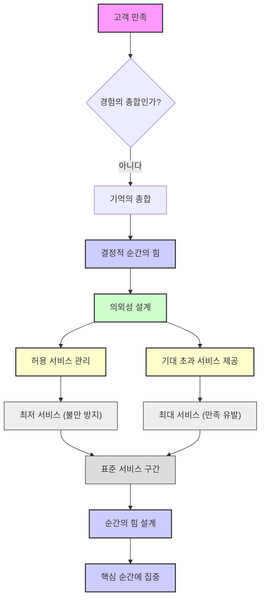

## 『순간의 힘』: 평범한 일상 속 특별한 순간을 만드는 비법
이 책은 우리 삶의 만족도가 모든 경험의 평균값이 아니라, <u>기억에 남는 결정적인 순간들</u>에 의해 결정된다는 핵심 메시지를 전달한다. 저자 칩 히스와 댄 히스 형제는 이러한 '순간의 힘'을 의도적으로 설계하여 개인의 삶과 비즈니스 경험을 더욱 풍요롭게 만들 수 있다고 말한다. 

## 1. 인간의 기억은 '평균'이 아닌 '결정적 순간'에 좌우된다 

우리는 살면서 수많은 경험을 하지만, 그 모든 것을 똑같이 기억하지 않는다. 마치 여행을 다녀와서 모든 순간을 다 기억하는 게 아니라, 가장 좋았던 순간이나 가장 힘들었던 순간, 그리고 마지막 순간을 또렷하게 기억하는 것과 같다. 

1. **경험의 평균값이 아닌 결정적 순간이 만족도를 결정한다.** 
  - 인간은 1년 동안 사귄 연인과의 관계를 365일의 평균으로 기억하지 않는다. 
  - 대신, <u>가장 좋았던 순간이나 가장 나빴던 순간, 그리고 마지막 순간</u>을 기억한다. 
  - 이것을 심리학에서는 '최고-최종 규칙(Peak-End Rule)'이라고 부른다. 
  - 경험의 길이가 얼마나 길었는지는 크게 중요하지 않다. 
  - 예시: 과학자들이 사람들에게 57도(약 14도)의 차가운 물에 손을 넣게 하는 실험을 했다. 
  - 첫 번째는 60초 동안 손을 넣게 했다. 
  - 두 번째는 90초 동안 손을 넣게 했는데, 마지막 30초 동안 물 온도를 2도(약 16도) 올려주었다. 
  - 놀랍게도 69%의 사람들이 더 길고 고통스러웠던 90초짜리 경험을 다시 하고 싶다고 선택했다. 
  - 이는 <u>마지막 순간이 조금 더 나았기 때문</u>이다. 
2. **대부분의 삶은 '평평한' 일상으로 채워져 있다.** 
  - 우리는 문제 해결이나 불편함 제거에만 집중하다가, <u>기억에 남을 만한 특별한 순간을 만드는 것을 잊는다</u>. 
  - 하지만 기억에 남는 것은 바로 '정점(Peak)'이다. 
  - 모든 순간을 특별하게 만들 필요는 없다. <u>몇몇 순간을 의도적으로 특별하게 만드는 것이 중요</u>하다. 

## 2. 결정적 순간을 찾아내는 '순간 포착자' 되기 

특별한 순간을 만들려면, 먼저 그런 순간을 찾아낼 줄 알아야 한다. 마치 보물찾기를 하듯이, 우리 삶에서 '결정적 순간'이 될 수 있는 세 가지 상황에 주목해야 한다. 

1. **변화의 순간 (**Transitions**): 삶의 전환점** 
  - 졸업, 결혼, 새로운 직장 시작 등 <u>삶의 중요한 변화가 일어나는 시점</u>이다. 
  - 많은 문화권에서는 이런 전환점을 기념하는 의식(예: 성인식)이 있지만, 현대 사회에서는 그냥 지나치는 경우가 많다. 
  - 이런 순간을 놓치면 사람들은 불안감을 느끼고 어떻게 행동해야 할지 모를 수 있다. 
  - **예시 1: 신입사원 첫 출근 경험** 
  - 대부분의 회사: 리셉션에서 기다리게 하고, 컴퓨터가 세팅되어 있지 않고, 윤리 강령 책자를 읽게 하는 등 <u>불편하고 평범한 경험</u>을 제공한다. 
  - 존 디어(John Deere) 회사: 
  - 입사 전: '존 디어 친구'가 유용한 팁을 이메일로 보내준다. 
  - 첫 출근: 로비 화면에 이름으로 환영 메시지가 뜨고, 책상에는 환영 배너와 "당신이 할 가장 중요한 일에 오신 것을 환영합니다"라는 메시지가 담긴 모니터 사진이 있다. 
  - CEO의 환영 이메일도 기다리고 있다. 
  - 결과: 신입사원은 첫날부터 "나는 여기에 속해 있고, 내 일이 중요하며, 회사도 나를 중요하게 생각한다"고 느끼게 된다. 
  - 이처럼 <u>평범한 전환점을 특별한 순간으로 바꾼 것</u>이다. 
  - **예시 2: 피자몰 시스템의 시작과 끝** 
  - 고객이 문을 열고 입장하는 순간이 시작이고, 피자몰을 기억하며 퇴장하는 순간이 끝이다. 
  - 이 과정에서 <u>어떤 순간에 '</u>순간의 힘<u>'을 줄지 설계</u>해야 한다. 
  - **예시 3: 개인 병원의 시작과 끝** 
  - 환자가 문을 열고 입장하거나 예약 문의를 하는 것이 시작이다. 
  - 재방문 일정을 예약하는 것이 마무리다. 
  - **예시 4: 주말 가족 여행의 시작과 끝** 
  - 엄마의 결정이 여행 시스템의 시작이다. 
  - 아빠는 아들과 딸이 좋아하는 것을 찾아보고, <u>어떤 순간에 '결정적 </u>의외성<u>'을 줄지 고민</u>해야 한다. 
  - 예시: 1박 2일 여행이라면 마지막 식사나 펜션에 들어갈 때의 느낌, 다음 날 아침 아빠가 미리 일어나 토스트와 커피를 준비하는 것 등이 될 수 있다. 
2. **이정표의 순간 (**Milestones**): 여정 속 중요한 성취** 
  - 40번째 생일이나 25주년 기념일처럼 <u>큰 성취를 축하하는 순간</u>이다. 
  - 하지만 우리는 작고 빈번한 이정표를 만들 기회를 놓치는 경우가 많다. 
  - **예시 1: 'Couch to 5K' 달리기 프로그램** 
  - 막연하게 '조깅 시작'이 아니라, '9주 후에 5km 마라톤 완주'라는 <u>명확한 목표</u>를 제시한다. 
  - 매주, 매 운동마다 작은 목표(예: 1주차에는 60초 조깅)를 달성하게 하여 성취감을 느끼게<u> 한다</u>. 
  - 이처럼 <u>작은 이정표들을 통해 자부심을 느끼게 하는 것</u>이다. 
  - **예시 2: 기업 목표 설정** 
  - 단순히 '시장 점유율 23% 달성'과 같은 숫자는 동기 부여가 어렵다. 
  - 비디오 게임처럼 '레벨'과 '보스전'을 만들어 목표를 재설계할 수 있다. 
  - 예시: '스페인어 배우기' 대신, 1단계는 '스페인어로 식사 주문하기', 보스전은 '스페인어만 사용해서 스페인 도시에서 주말 보내기'로 설정하는 것이다. 
  - 이렇게 하면 <u>여정 자체가 동기 부여가 되는 이정표들로 가득 차게 된다</u>. 
3. **어려움의 순간 (**Pits**): 고난, 고통, 실패** 
  - <u>부정적인 경험이나 실패의 순간</u>을 의미한다. 
  - 우리는 보통 이런 어려움을 피하거나 빨리 해결하려고 하지만, <u>어려움은 오히려 특별한 순간을 만들 기회</u>가 될 수 있다. 
  - **예시 1: 고객 서비스 실패** 
  - 연구에 따르면, 가장 긍정적인 고객 서비스 경험 중 거의 1/4이 <u>예약 누락, 비행 지연, 잘못된 주문과 같은 실패에서 시작</u>되었다. 
  - 직원들이 이런 문제를 잘 해결하면, 부정적인 순간을 긍정적인 순간으로 바꿀 수 있다. 
  - **예시 2: GE의 MRI 기계 재설계** 
  - GE 디자이너 더그 디츠(Doug Deetsz)는 2년간 MRI 기계를 개발했지만, 병원에서 아이들이 MRI 촬영을 무서워하며 우는 모습을 보고 충격을 받았다. 
  - 아이들의 80%가 진정제를 맞아야 촬영할 수 있다는 사실에 그는 기술이 아닌 '경험'에 집중해야 한다고 깨달았다. 
  - 그는 MRI 기계를 <u>해적선이나 정글 탐험선처럼 보이도록 재설계</u>했다. 
  - 아이들은 해적선에 오르거나, 정글을 떠다니는 카누에 누워 움직이지 않도록 지시받았다. 
  - 결과: 진정제 사용률이 80%에서 거의 0%로 떨어졌고, 한 아이는 촬영 후 "내일 또 올 수 있어요?"라고 물었다. 
  - 이처럼 <u>아이들의 가장 깊은 고통의 순간을 특별한 경험으로 바꾼 것</u>이다. 

## 3. 결정적 순간을 만드는 네 가지 요소 

결정적 순간을 만들 기회를 포착했다면, 이제 그 순간을 어떻게 특별하게 만들지 알아야 한다. 마치 요리사가 맛있는 음식을 만들 때 여러 재료를 조합하듯이, 결정적 순간을 만드는 데는 네 가지 핵심 요소가 있다. 이 네 가지 요소가 모두 필요하지는 않지만, <u>더 많이 포함될수록 그 순간은 더욱 강력해진다</u>. 

1. 고양의 순간** (**Elevation**): 일상을 뛰어넘는 특별함** 
  - <u>평범한 일상에서 벗어나 특별함을 느끼게 하는 순간</u>이다. 
  - 이런 순간을 만들려면 세 가지 방법을 사용할 수 있다. 
2. **긍지의 순간 (**Pride**): 성취감과 인정** 
  - <u>자신이 최고라고 느끼는 순간, </u>성취감<u>, 용기, 인정을 경험하는 순간</u>이다. 
  - 이런 순간을 만드는 가장 쉬운 방법 중 하나는 '인정'이다. 
  - 하지만 우리는 직원들에게 충분한 인정을 해주지 못하고 있다. 
  - 연구에 따르면, 관리자의 80% 이상이 직원들에게 자주 감사하다고 말한다고 생각하지만, 직원 중 20% 미만이 이에 동의한다. 
  - 이것을 '인정 격차(Recognition Gap)'라고 부른다. 
  - 효과적인 인정은 <u>개인적이고 구체적</u>이어야 한다. 
  - 단순히 '이달의 직원' 같은 일반적인 칭찬이 아니라, <u>상대방이 무엇을 했고 그것이 얼마나 가치 있었는지 구체적으로 보여주는 것</u>이다. 
  - **예시 1: 키라 슬룹(Kira Sloop)의 노래 선생님** 
  - 6학년 때 합창 선생님에게 "네 목소리는 다르다"는 모욕적인 말을 듣고 2년간 노래를 멈췄던 키라. 
  - 여름 캠프에서 새로운 선생님이 키라의 목소리를 듣고 "너는 독특하고 표현력이 풍부하며 아름다운 목소리를 가졌다. 밥 딜런과 조안 바에즈의 사랑의 결실 같구나"라고 칭찬했다. 
  - 이 <u>한 번의 인정이 키라의 자신감을 회복시키고 삶을 변화시켰다</u>. 
  - **예시 2: 내슈빌 시위대의 용기 훈련** 
  - 미국 민권 운동 당시, 존 루이스와 다이앤 내시 같은 활동가들이 이끄는 젊은 흑인 학생들은 백인 전용 식당에서 연좌 시위를 벌였다. 
  - 그들은 모욕과 폭력, 체포에도 불구하고 흔들림 없는 규율과 평화를 유지했다. 
  - 이 용기는 <u>제임스 로슨 목사가 이끄는 워크숍에서 연습된 것</u>이었다. 
  - 다른 학생들이 화난 백인 폭도로 분장하여 학생들에게 담배 연기를 뿜고, 욕설을 퍼붓고, 밀치는 등 <u>극심한 압박 속에서 침착함을 유지하는 방법을 연습</u>했다. 
  - 그들은 <u>용기를 바라기만 한 것이 아니라, 연습을 통해 용기를 만들어냈다</u>. 
  - **예시 3: **게임화**(Gamification)를 통한 **긍지** 부여** 
  - 한국 게임은 15초마다 사용자에게 긍지를 느끼게 하는 요소를 도입하여 성공한다. 
  - 스타벅스의 스탬프 제도, 대한항공의 마일리지, 당근마켓의 매너 온도, 배달의 민족의 등급 제도 등은 <u>사용자에게 긍지를 느끼게 하여 지속적인 참여를 유도</u>한다. 
  - 이러한 시스템은 <u>작은 성공을 맛보게 하고, 그것을 자랑할 수 있게 해준다</u>. 
  - **예시 4: 직업별 긍지 시스템** 
  - 파일럿, 간호사, 셰프, 티켓 판매원 등 <u>입사 첫날과 30년 차의 업무가 크게 다르지 않은 직업</u>에서는 긍지를 느끼게 하는 시스템이 매우 중요하다. 
  - 간호사의 옷, 기장의 계급장, 셰프의 검은색 복장 등은 <u>직급과 경험에 따른 긍지를 시각적으로 보여주는 장치</u>이다. 
  - **예시 5: 피자몰 지점장의 알바생 관리** 
  - 지점장은 알바생들의 이름을 붙여놓고, 칭찬을 듣거나 일찍 출근하면 스티커를 주어 긍지를 느끼게 했다. 
  - 한 달 동안 가장 많은 스티커를 받은 알바생에게는 시급을 50원 더 주는 방식으로 <u>작은 보상과 함께 긍지를 부여</u>했다. 
3. 통찰의 순간** (**Insight**): 깨달음과 이해의 전환** 
  - <u>자신이나 세상에 대한 이해를 완전히 바꾸는 '아하!' 하는 깨달음의 순간</u>이다. 
  - 이런 순간은 우연히 찾아오는 것처럼 보이지만, <u>사람들이 스스로 진실을 발견하도록 유도함으로써 의도적으로 만들 수 있다</u>. 
  - 이때 중요한 것은 <u>시간이 압축되어 있고 감정적인 영향이 큰 경험</u>이어야 한다. 
  - **예시 1: **바울의 회심** 이야기** 
  - 기독교인을 박해하던 사울(바울의 옛 이름)은 다마스커스로 가던 중 하늘에서 강한 빛을 보고 쓰러진다. 
  - 그 순간, 그는 자신이 잘못 알고 있었음을 깨닫고 예수님이 메시아일 수 있다고 생각하게 된다. 
  - 이 <u>강렬한 깨달음의 순간이 그의 인생을 완전히 바꾸어 기독교 전파의 선구자가 된다</u>. 
  - 이처럼 <u>기존의 사실을 뒤엎는 깨달음의 순간</u>이 찾아올 수 있다. 
  - **예시 2: 지역사회 주도형 완전 위생 프로그램 (**CLTS**)** 
  - 이 프로그램은 농촌 마을의 노천 배변 문제를 해결하기 위해 고안되었다. 
  - 과거에는 화장실을 지어주어도 사람들이 사용하지 않는 문제가 있었다. 
  - 키말 카르 박사는 이것이 '하드웨어' 문제가 아니라 '행동' 문제임을 깨달았다. 
  - 진행자는 마을 사람들과 함께 배변 장소를 직접 걸어 다니며 지도에 표시하게 한다. 
  - 그리고 충격적인 '점화의 순간'을 만든다. 
  - 진행자가 물 한 잔에 자신의 머리카락을 담그고, 그 머리카락을 다시 대변에 담갔다가 물에 휘젓는다. 
  - 그리고 그 물을 마을 사람들에게 마시라고 권한다. 
  - 마을 사람들은 역겨워하며 거부한다. 
  - 진행자는 "파리는 다리가 몇 개냐? 파리가 내 머리카락보다 더 많은 것을 옮기지 않느냐? 음식에 파리가 앉는 것을 보지 않느냐? 그럼 너희는 무엇을 먹고 있는 것이냐?"라고 묻는다. 
  - 이 <u>피할 수 없는 진실은 마을 사람들에게 엄청난 충격으로 다가왔고, 그들은 즉시 변화할 동기를 얻었다</u>. 
  - **예시 3: '**스트레칭**'을 통한 자기 **통찰 
  - 실패의 위험이 있는 상황에 자신을 놓이게 하는 것이다. 
  - 반성만으로는 알 수 없는 <u>자신의 능력과 정체성을 행동을 통해 발견</u>할 수 있다. 
  - 스팽스(Spanx) 창업자 사라 블레이클리(Sarah Blakeley)의 아버지: 
  - 매주 저녁 식사 자리에서 자녀들에게 "이번 주에 무엇을 실패했니?"라고 물었다. 
  - 실패한 것이 없으면 실망했다. 
  - 그는 <u>실패를 나쁜 결과가 아니라 '노력 부족'으로 재정의</u>하며, 자녀들이 용기를 내어 도전하고 회복력을 기르도록 가르쳤다. 
4. 교감의 순간** (**Connection**): 관계의 심화** 
  - <u>다른 사람들과 관계를 깊게 만드는 순간</u>이다. 
  - 집단에게는 '공유된 의미'를 통해 교감의 순간이 만들어진다. 
  - 개인에게는 '반응성(Responsiveness)'이라는 심리적 원리를 통해 교감의 순간이 깊어진다. 
  - 반응성은 거창한 행동이 아니라, 세 가지를 보여주는 것이다. 
  - **이해 (Understanding):** "나는 당신을 보고 당신을 이해한다." 
  - **인정 (Validation):** "나는 당신의 있는 그대로의 모습을 존중한다." 
  - **관심 (Caring):** "나는 당신을 위해 여기 있다." 
  - **예시 1: 샤프 헬스케어(Sharp Healthcare)의 전 직원 집회** 
  - 이 병원 시스템은 환자 경험을 혁신하기 위해 <u>12,000명의 전 직원을 한자리에 모아 집회를 열었다</u>. 
  - 모두를 물리적으로 한자리에 모음으로써 "우리는 함께하고, 이것은 중요하며, 우리는 한 팀이다"라는 강력한 메시지를 전달했다. 
  - 이를 통해 <u>서로 </u>연결되어 있다는<u> 느낌을 받고 공동의 목표를 향해 나아가는 공동체 의식을 강화</u>했다. 
  - **예시 2: 스탠튼 초등학교의 가정 방문 프로그램** 
  - 한때 미국에서 가장 나쁜 학교 중 하나로 여겨지던 스탠튼 초등학교는 교사와 학부모 간의 신뢰가 무너져 있었다. 
  - 학교는 '가정 방문' 프로그램을 시작했다. 
  - 교사들은 어떤 서류나 안건도 가져가지 않고, <u>오직 학부모의 이야기를 듣는 데 집중</u>했다. 
  - 그들은 학부모에게 네 가지 질문을 했다. 
  - "자녀의 학교 경험에 대해 말씀해주세요." 
  - "학부모님의 학교 경험은 어떠셨나요?" 
  - "자녀의 미래에 대한 희망과 꿈은 무엇인가요?" 
  - "자녀가 더 효과적으로 배우도록 제가 무엇을 해야 할까요?" 
  - 많은 학부모에게는 <u>학교 관계자가 자녀의 꿈에 대해 물어본 첫 경험</u>이었다. 
  - 이 <u>한 시간의 의도적인 '반응성'이 관계를 변화시켰고, 신뢰를 구축</u>했다. 
  - 이전에는 25명만 참석했던 개학 준비의 밤 행사에 250명 이상이 참석하는 등 학교는 혼란에서 질서로 바뀌었다. 
  - 이처럼 <u>관계는 시간이 지나면서 천천히 깊어지는 것이 아니라, 올바른 순간을 만들면 즉시 변화할 수 있다</u>. 
  - **예시 3: '친밀감'을 통한 **교감 
  - 사람들은 자신이 하는 행동이 <u>고결한 인류의 보편적 가치와 연결되어 있다고 느낄 때, 이익을 뛰어넘는 행동</u>을 한다. 
  - "이 신발을 사면 아르헨티나 아동들에게 신발 하나가 기부된다"는 메시지는 <u>구매자에게 이익 이상의 큰 가치(아이덴티티)를 느끼게 하여 교감을 형성</u>한다. 
  - **예시 4: '종적인 교감'** 
  - 우리의 후손이나 선조들과의 연결, 또는 <u>죽음 이후에도 나를 어떻게 기억해 줄 것인가와 같은 </u>초월적인<u> 가치와의 연결</u>을 의미한다. 
  - 인간은 항상 초월적인 것을 갈망하며, 이런 <u>영원한 가치와의 연결을 통해 교감을 느낀다</u>. 

## 4. 결정적 순간을 설계하는 방법: '허용 서비스'와 '의외성'의 조화 

결정적 순간을 설계할 때는 모든 것을 완벽하게 하려고 하기보다는, <u>어떤 부분에 집중할지 전략적으로 선택</u>해야 한다. 마치 요리사가 모든 반찬을 최고급으로 만들 수 없으니, 메인 요리에 힘을 쏟는 것과 같다. 

1. **'**허용 서비스**' 구간 이해하기:** 
  - 고객이 <u>'이 정도는 해줘야 한다'고 생각하는 최소한의 서비스</u>를 '최저 서비스(Minimum Service)'라고 한다. 
  - 예시: 편의점에서 계산을 틀리지 않거나, 직원이 노느라 기다리게 하지 않는 것. 
  - 이것이 충족되지 않으면 불만이 발생한다. 
  - 고객이 <u>'이 정도 해주면 만족한다'고 생각하는 최대한의 서비스</u>를 '최대 서비스(Maximum Service)'라고 한다. 
  - 이 두 구간 사이를 '허용 서비스 구간' 또는 '표준 서비스 구간'이라고 부른다. 
  - 이 구간의 서비스는 고객에게 '만족'을 주지만, <u>기억에 남는 '특별함'을 주지는 못한다</u>. 
  - 예시: 모텔에 갔는데 수건이 없는 것은 불만이지만, 이불에서 냄새가 나도 그냥 자는 것은 허용 구간 안에 있다. 
  - 하지만 하와이 신혼여행에서 50만원짜리 호텔에 갔는데 수건이 없으면 환불을 요구할 정도로 불만이 커진다. 
  - 이는 <u>고객의 기대 수준(허용 서비스 구간)이 상황에 따라 달라지기 때문</u>이다. 
2. **'**의외성**'을 설계하여 결정적 순간 만들기:** 
  - 모든 서비스 영역에서 의외성을 제공할 수는 없다. 
  - <u>핵심적인 순간을 발견하여 그곳에 집중(몰빵)하는 것이 중요</u>하다. 
  - **예시 1: 편의점 알바의 한마디** 
  - 편의점 알바가 "오늘 날씨 춥죠?"라고 한마디 건네는 것은 <u>기대하지 않았던 '의외성'</u>이다. 
  - 이것이 고객에게 '순간의 힘'으로 작용하여 기억에 남는다. 
  - 하지만 신세계백화점에서 200만원어치 물건을 사고 이런 말을 들으면 만족하지 않는다. 
  - 이는 <u>고객의 기대 수준에 따라 의외성의 효과가 달라지기 때문</u>이다. 
  - **예시 2: 매장 설계와 서비스의 조화** 
  - 편의점처럼 매장을 설계했다면, 점원들의 높은 서비스를 기대하지 말아야 한다. 
  - 올리브영처럼 가성비에 집중하고 직원 인건비에 많이 투자하지 않는다면, 고객에게 "설명은 다른 곳에서 듣고 물건만 빨리 사가세요"라는 메시지를 주는 것과 같다. 
  - 반대로 고급 식당처럼 매장을 설계했다면, 직원 서비스도 그에 맞춰야 한다. 
  - <u>매장 설계와 서비스 수준이 일치하지 않으면 고객은 불만을 느낀다</u>. 
3. NPS** (순 추천 지수)를 통한 고객 만족도 측정:** 
  - 요즘 기업들은 고객 만족도를 측정할 때 <u>평균값이 아닌 '순 추천 지수(Net Promoter Score, NPS)'를 사용</u>한다. 
  - NPS는 고객을 세 그룹으로 나눈다. 
  - **추천 고객 (Promoters):** 5점(매우 만족)을 준 고객. 이들은 <u>기대 이상의 서비스를 경험하고 다른 사람에게 적극적으로 추천</u>한다. 
  - **중립 고객 (Passives):** 3~4점(보통~만족)을 준 고객. 이들은 만족도 불만족도 아닌 '허용 서비스 구간'에 있는 고객으로, NPS 계산에서 제외된다. 
  - **비추천 고객 (Detractors):** 1~2점(불만족~매우 불만족)을 준 고객. 이들은 <u>불만을 느끼고 다른 사람에게 비추천</u>한다. 
  - NPS 계산: (추천 고객 비율) - (비추천 고객 비율) 
  - 예시: 20명씩 5개 점수에 고르게 분포되어 있다면 평균은 50점이지만, NPS는 -20점이다. 
  - NPS는 <u>고객이 '야, 거기 좋아!'라고 말하는 사람의 수를 측정</u>하는 것이다. 
  - 기업들은 <u>고객의 기대치를 높이면서도, 그 기대치를 뛰어넘는 '의외성'을 제공하여 NPS를 높이려 노력</u>한다. 
  - 나이키는 NPS 50점, 스타벅스는 30점 정도를 기록한다. 
  - NPS가 높다는 것은 <u>고객이 자발적으로 브랜드를 추천하는 '</u>순간의 힘<u>'을 경험했다는 의미</u>이다. 
4. **기대치 관리의 중요성:** 
  - 결정적 순간을 설계하는 것은 결국 <u>상대방의 기대치를 관리하는 것</u>이다. 
  - 상대방이 특정 기대치를 설정하게 하고, <u>그 기대치 이상을 제공하는 방식</u>이 '순간의 힘'을 관리하는 핵심이다. 
  - 이때 기대치는 <u>소비자가 인식하고 수용할 수 있는 범위 내</u>에 있어야 한다. 
  - 모든 관계(부부, 친구 등)에서도 이 원칙은 동일하게 적용된다. 

## 5. 일상 속 '순간의 힘' 적용하기 

우리는 삶의 문제점을 고치고 평탄하게 만드는 데 많은 에너지를 쏟지만, 그 결과는 종종 '그저 괜찮은' 삶이 된다. 하지만 <u>삶에 의미와 기쁨을 주는 것은 바로 '정점(Peaks)'</u>이다. 

1. **삶은 '순간'으로 측정된다.** 
  - 우리는 '회상 돌출(Reminiscence Bump)'이라는 시기, 즉 15세에서 30세 사이에 가장 생생한 기억들을 형성한다. 
  - 이 시기는 첫사랑, 첫 직장, 첫 독립 등 '처음' 경험들로 가득 차 있어 자연스럽게 '정점'이 많다. 
  - 하지만 나이가 들면서 일상이 반복되고 '처음' 경험이 줄어들면, 시간은 빠르게 흐르는 것처럼 느껴진다. 
  - 이 책은 <u>평범함에 맞서 싸우고, 삶을 특별한 경험의 '산맥'으로 만드는 방법</u>을 알려준다. 
2. **결정적 순간은 '사려 깊음'과 '의도'에서 시작된다.** 
  - 거창한 행동이나 큰 예산이 필요한 것이 아니다. 
  - <u>작은 행동으로도 특별한 순간을 만들 수 있다</u>. 
3. **오늘부터 실천할 수 있는 세 가지 행동:** 
  1. **인정의 기술 연습하기:** 
  - 주변 사람 중 한 명(친구, 부모님, 선생님 등)을 찾아 <u>구체적으로 인정하고 감사함을 표현</u>한다. 
  - 단순히 "고마워"가 아니라, <u>무엇을 했고 그것이 자신에게 어떤 영향을 주었는지 구체적으로 말하거나 편지에 쓴다</u>. 
  - 키라 슬룹의 사례처럼, 진심 어린 몇 마디가 누군가의 세상을 바꿀 수 있다. 
  2. **주말 깜짝 이벤트 계획하기:** 
  - 평범한 주말 계획(잠자기, 숙제하기, 친구 만나기, TV 보기)에서 벗어나 <u>의도적으로 '</u>고양의 순간<u>'을 주입</u>한다. 
  - 거창할 필요는 없다. 가보지 않은 동네 탐험하기, 새로운 요리 시도하기 등 <u>작고 예상치 못한 즐거운 일을 계획</u>한다. 
  - 스스로에게 놀라움을 선사하는 것이다. 
  3. 관계** 깊게 만들기:** 
  - 친구 또는 가족과 대화할 때 <u>가벼운 대화를 넘어 더 나은 질문을 던진다</u>. 
  - 예시: "오늘 하루 어땠어?" 대신 "완벽한 하루는 어떤 모습일까?"라고 묻는다. 
  - 또는 <u>자신에 대해 조금 더 솔직하고 취약한 부분을 공유하는 작은 위험을 감수</u>한다. 
  - '반응성'은 신뢰의 작은 제안이 더 깊은 유대감을 형성하는 순환을 시작하게 한다. 

결론적으로, 우리는 삶이 우리에게 결정적 순간을 가져다주기를 기다릴 필요가 없다. <u>우리가 직접 그 순간들을 만들어낼 수 있다</u>. 첫 출근을 잊을 수 없는 환영으로 바꾸고, 아이에게 MRI 기계를 우주선으로 보이게 하며, 다른 사람의 용기와 기여를 알아봐 주는 사람이 될 수 있다. 우리는 <u>삶을 만드는 순간들의 '작가'가 될 수 있다</u>. 

