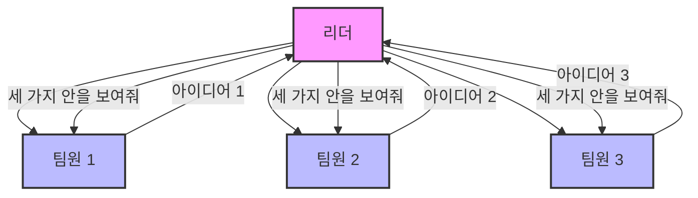
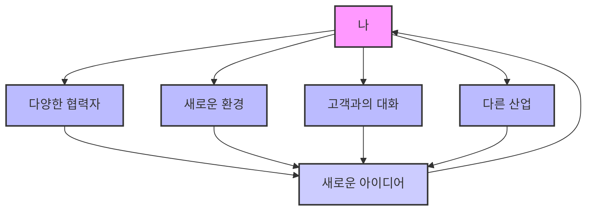

## 아이디어 흐름: 유일하게 중요한 비즈니스 지표
이 책은 혁신이 특별한 사람들의 전유물이 아니라, 누구나 연습을 통해 발전시킬 수 있는 기술이라고 말한다. 아이디어를 많이 만들고, 다양한 시도를 통해 최고의 결과를 얻는 '아이디어 흐름(Ideaflow)'을 마스터하는 방법을 알려준다. 이 책은 혁신에 대한 잘못된 생각들을 바로잡고, 일과 삶에서 만족감과 몰입감을 높이는 실용적인 전략을 제시한다.

## 1. 혁신에 대한 오해: '제로 투 원'은 환상일 뿐이야 

혁신은 마치 아무것도 없는 상태에서 갑자기 대단한 하나를 만들어내는 것처럼 보일 때가 많다. 이걸 '제로 투 원(Zero to One)'이라고 부르는데, 이 책은 이런 생각이 혁신을 방해하는 가장 큰 오해라고 말한다.

1. **'**제로 투 원**'은 특별한 사람만 할 수 있는 게 아니야** 
  - 많은 사람들이 스티브 잡스나 마크 저커버그 같은 사람들을 '제로 투 원'의 천재라고 생각한다.
  - 이들은 아무것도 없는 상태에서 위대한 것을 만들어낸 것처럼 보이지만, 사실은 그렇지 않다.
  - 이런 생각은 "나는 저런 사람이 아니니까 혁신할 수 없어"라는 마음을 갖게 만들어서, 사람들이 스스로의 창의력을 믿지 못하게 한다.
2. **아무것도 없는 상태에서 시작하는 사람은 없어** 
  - 뇌는 완전히 새로운 것을 만들어낼 수 없다.
  - 뇌는 이미 알고 있는 것들 사이에서 예상치 못한 연결을 만들어내는 방식으로 아이디어를 낸다.
  - 마치 레고 블록처럼, 이미 있는 조각들을 새롭게 조합하는 것과 같다.
3. **혁신은 연습하면 늘 수 있는 기술이야** 
  - 혁신은 타고나는 재능이 아니라, 연습을 통해 갈고닦을 수 있는 기술이다.
  - 누구나 올바른 마음가짐과 방법을 배우면 혁신적인 사고를 할 수 있다.

## 2. 양이 질을 만든다: 많이 시도할수록 좋은 아이디어가 나와 

좋은 아이디어를 얻으려면, 일단 많은 아이디어를 내는 것이 중요하다. 양이 많아야 그 안에서 질 좋은 아이디어가 나올 확률이 높아진다.

1. **사진 수업 실험: 양이 질을 이긴다** 
  - 플로리다 대학교의 사진학과 교수 제리 율스만(Jerry Uelsmann)은 학생들을 두 그룹으로 나눴다.
  - **품질 그룹**: 학기 말에 '최고 품질'의 사진 한 장만 제출하면 A를 준다고 했다.
  - **수량 그룹**: 학기 말에 사진 100장 이상을 제출하면 품질과 상관없이 A를 준다고 했다.
  - **결과**: 품질 그룹에서는 A를 받은 학생이 한 명도 없었다. 반면, 수량 그룹에서는 많은 학생이 A를 받았을 뿐만 아니라, 그들의 사진 중에는 품질 면에서도 뛰어난 작품들이 많았다.
  - **교훈**: 이 실험은 놀랍게도 '최고의 결과'를 원한다면 '양'이 '질'을 이끈다는 것을 보여준다.
2. **아이디어 깔때기: 2,000개의 아이디어에서 1개의 성공으로** 
  - 스탠퍼드 대학교의 밥 서튼(Bob Sutton) 교수의 연구에 따르면, 하나의 상업적 성공(제품이나 서비스)을 위해서는 엄청난 양의 아이디어가 필요하다.
  - 아이디어 비율:
  - 2,000개의 아이디어
  - → 100개의 프로토타입 (시제품)
  - → 5개의 시장 출시 제품
  - → 1개의 상업적 성공
  - 이것은 혁신이 '하나의 완벽한 아이디어'를 찾는 것이 아니라, '수많은 아이디어를 만들고 걸러내는 과정'이라는 것을 의미한다.
  - 타코벨의 식품 혁신 연구소는 매년 2,000가지의 타코 껍질을 시도하고, 제임스 다이슨은 먼지 없는 진공청소기를 만들기 위해 5,000개의 시제품을 만들었다. 
3. **'좋은 아이디어'라는 생각부터 버려야 해** 
  - 사람들은 보통 "어떻게 하면 좋은 아이디어를 낼 수 있나요?"라고 묻는다.
  - 하지만 이 책은 "좋은 아이디어라는 생각 자체를 멈추고, 일단 많은 아이디어를 내는 데 집중하라"고 조언한다.
  - 양이 많아지면 자연스럽게 질 좋은 아이디어가 따라온다.

## 3. 스티브 잡스의 비밀: '멍청한 아이디어'를 두려워하지 마 

혁신은 '집중'하는 것이라고 생각하기 쉽지만, 사실은 '다양한 아이디어'를 허용하는 것이 더 중요하다. 심지어 멍청해 보이는 아이디어까지도 말이다.

1. **스티브 잡스는 '멍청한 아이디어'를 원했어** 
  - 스티브 잡스는 "혁신은 천 가지에 '아니오'라고 말하는 것"이라고 유명하게 말했다.
  - 하지만 그가 '아니오'라고 말할 수 있었던 것은, 애초에 '천 가지의 아이디어'가 있었기 때문이다.
  - 애플의 전설적인 디자이너 조니 아이브(Jony Ive)는 잡스가 매일 점심시간에 "조니, 멍청한 아이디어 좀 들려줘"라고 말했다고 회상했다.
  - 대부분의 아이디어는 정말 멍청했지만, 가끔은 숨 막힐 정도로 놀라운 아이디어가 나왔다고 한다.
2. **아이디어는 '**정규 분포**'를 따라** 
  - 아이디어의 품질은 마치 자연 현상처럼 '정규 분포(bell curve)'를 따른다.
  - **소수**: 아주 훌륭하거나 (천재적인 아이디어)
  - **대부분**: 평범하거나 (보통 아이디어)
  - **소수**: 아주 엉뚱하거나 (멍청한 아이디어)
  - 사람들은 보통 멍청한 아이디어를 없애고 싶어 하지만, 멍청한 아이디어를 없애면 훌륭한 아이디어도 함께 사라진다.
  - 다양한 아이디어를 허용해야만, 그 안에서 정말 뛰어난 아이디어를 발견할 수 있다.
  - 마치 씨앗을 많이 뿌려야 그중에서 튼튼한 나무가 자라나는 것과 같다.

## 4. 아이디어는 '연결'이야: 세상의 모든 것이 레고 블록이 될 수 있어 

아이디어는 완전히 새로운 것을 만들어내는 것이 아니라, 이미 알고 있는 것들 사이에서 새로운 '연결'을 찾아내는 것이다. 세상의 모든 것이 아이디어를 만드는 레고 블록이 될 수 있다.

1. **뇌는 '연결'을 만든다** 
  - 뇌는 아무것도 없는 상태에서 새로운 내용을 만들어낼 수 없다.
  - 대신, 이미 알고 있거나 배우고 있는 것들 사이에서 예상치 못한 연결을 만들어낸다.
  - 이것이 바로 '아이디어'가 탄생하는 방식이다.
2. **화이트아웃(Liquid Paper)의 탄생: 페인트와 타자기의 연결** 
  - 베티 네스미스 그레이엄(Bette Nesmith Graham)은 1950년대 중반, 타자기 오타 때문에 스트레스를 받던 비서였다.
  - 그녀는 부업으로 백화점 창문에 그림을 그리다가 실수를 했다.
  - 그때 화가 동료가 "화가는 실수를 지우지 않고, 덧칠한다"고 말했다.
  - 이 말을 들은 그녀는 '타자기 오타'와 '페인트로 덧칠하기'를 연결하여 화이트아웃을 발명했다.
  - 이것은 마치 '페인트'라는 레고 블록과 '타자기'라는 레고 블록을 합쳐 새로운 것을 만든 것과 같다.
3. **전기차 **주행 거리 불안**: 공중 급유와 전기차의 연결** 
  - 어떤 전기차 회사 엔지니어는 '주행 거리 불안(range anxiety)' 문제를 해결하려 했다.
  - 그녀는 커피숍에서 우연히 전투기 조종사들의 대화를 엿듣게 되었다.
  - 조종사들은 전투기가 연료통이 작아 전투 중에 기지로 돌아갈 수 없어 '공중 급유(mid-air refueling)'를 한다는 이야기를 했다.
  - 엔지니어는 '공중 급유'와 '전기차 주행 거리 불안'을 연결하여, 전기차도 이동 중에 충전할 수 있는 방법을 떠올렸다.
  - 이처럼 서로 관련 없어 보이는 두 가지 지식이 예상치 못한 방식으로 결합될 때 아이디어가 생긴다.

## 5. 아이디어 흐름을 높이는 도구들: 일상에서 아이디어를 찾아라 

아이디어 흐름을 높이려면 일상생활에서 아이디어를 찾고, 새로운 연결을 만들려는 노력이 필요하다. 몇 가지 간단한 도구와 습관이 도움이 될 수 있다.

1. **'**버그 리스트**'를 만들어봐** 
  - 스탠퍼드 d.school의 교수들은 학생들에게 '버그 리스트(Bug List)'를 만들라고 가르친다.
  - **버그 리스트란?**: 일상생활에서 불편하거나 신경 쓰이는 문제들을 적어두는 목록이다.
  - **활용법**:
  - 작은 수첩을 가지고 다니면서 하루 종일 떠오르는 생각이나 불편한 점을 메모한다.
  - 이것은 마치 머릿속에 '해결해야 할 문제'를 가지고 다니면서, 새로운 경험이나 사람들을 만날 때마다 그 문제와 부딪히게 하는 것과 같다.
  - 리처드 파인만(Richard Feynman)도 항상 12가지 좋아하는 문제를 가지고 다니라고 말했다.
  - **효과**: 이렇게 하면 외부 세상의 다양한 정보들이 문제 해결의 재료가 될 수 있다.
2. **'연결'을 찾으려는 마음가짐이 중요해** 
  - 1930년대 칼 덩커(Carl Dunker)의 연구에 따르면, 어려운 문제는 '유추(analogy)'를 통해 해결될 수 있다.
  - 사람들에게 문제와 관련된 비유를 제시했을 때, 단순히 비유를 듣는 것보다 "이 비유가 문제와 어떤 관련이 있을지 생각해보라"고 했을 때 문제 해결 능력이 훨씬 높아졌다.
  - 즉, 적극적으로 '연결'을 찾으려는 의지가 중요하다.
3. **나이키 '**와플 트레이너**'의 탄생: 와플 기계와 신발 밑창의 연결** 
  - 나이키 공동 창업자 빌 바워만(Bill Bowerman)은 육상 코치이자 끊임없이 실험하는 사람이었다.
  - 어느 날 아내가 와플을 만드는 것을 보다가, 와플 기계에 폴리우레탄을 부어 신발 밑창을 만들 생각을 했다.
  - 그는 선수들의 문제점(신발 접지력)을 인지하고 있었고, 해결책을 찾고 있었다.
  - 와플 기계는 그에게 '영감'을 준 것이 아니라, 그가 이미 가지고 있던 문제 의식과 연결될 수 있는 '재료'가 된 것이다.
  - 이처럼 아이디어는 '아무것도 없는 상태'에서 나오는 것이 아니라, 기존의 지식과 경험을 연결하는 과정에서 탄생한다.
4. **일상적인 습관으로 만들어야 해** 
  - 혁신은 해커톤이나 워크숍처럼 '이벤트'가 아니라, 매일 꾸준히 하는 '연습'이다.
  - 일상적인 루틴 속에서 새로운 연결을 만들 가능성을 높이는 습관을 들여야 한다.
  - **간단한 시작**:
  - 오늘 해결하고 싶은 '질문'을 명확하게 정한다.
  - 예를 들어, "회의를 어떻게 재미있게 시작할까?" 같은 질문을 머릿속에 담고 하루를 보낸다.
  - 팟캐스트를 듣거나, 사람들의 자기소개를 들으면서 관련된 아이디어를 메모한다.
  - 이렇게 몇 시간 동안 5~6개의 아이디어를 모으는 연습을 한다.
  - 아이디어 할당량**(**Idea Quota**)**: 매일 아침, 어떤 문제에 대해 '정답'을 찾으려 하지 말고, 최소 10가지의 '가능한 답'을 내보는 연습을 한다. 
  - 이것은 스스로를 검열하는 습관을 줄이고, 엉뚱한 아이디어도 허용하게 만든다.
  - "불법적인 아이디어를 생각해보라"고 스스로에게 말하면 더 좋은 아이디어가 나온다는 사람도 있다.

## 6. 창의성은 '첫 번째 생각 이상'을 하는 거야 

창의성은 특별한 재능이 아니라, '첫 번째 떠오르는 생각 이상'을 시도하는 것이다.

1. **창의성의 가장 쉬운 정의**: 오하이오주의 한 7학년 학생은 "창의성은 첫 번째 떠오르는 생각 이상을 하는 것"이라고 말했다. 
  - 이 정의는 매우 심오하면서도 실천하기 쉽다.
  - 이메일 제목을 생각할 때, 회의를 시작할 방법을 생각할 때, 계약을 성사시킬 방법을 생각할 때, 항상 '하나 이상'의 아이디어를 내보려고 노력하는 것이 창의적인 행동이다.
  - 이것은 그림을 그리는 것과 같은 예술적인 표현에만 국한되지 않는다.
2. **'정답'이 하나뿐이라는 생각에서 벗어나야 해** 
  - 대부분의 문제는 수학 문제처럼 '하나의 정답'이 있는 것이 아니다.
  - 수많은 가능한 답이 있고, 그중에서 가장 좋은 것을 찾아야 한다.
  - '정답이 뭘까?'라는 생각에서 '첫 번째 생각 이상은 뭘까?'로 관점을 바꾸는 것이 중요하다.
  - 이런 연습은 문제 해결 능력과 유연성을 길러준다.

## 7. 실행은 아이디어의 연료야: 실험을 통해 아이디어를 발전시켜 

아이디어는 많을수록 좋지만, 결국 실행을 통해 발전한다. 실행은 아이디어의 가치를 증명하고, 새로운 아이디어를 위한 연료가 된다.

1. **아이디어는 싸지만 필수적이야** 
  - "아이디어는 싸다"는 말은 맞다. 하지만 물이 싸다고 해서 중요하지 않은 것은 아니다.
  - 아이디어는 실행의 연료이며, 없어서는 안 될 존재다.
  - 아이디어가 없으면 실행할 것도 없다.
2. **실행은 끊임없는 '반복 과정'이야** 
  - 어떤 아이디어도 고객과 처음 만났을 때 완벽하게 살아남지 못한다.
  - 사업 계획도 시장과 만나면 항상 바뀐다.
  - '버전 2.0'은 또 다른 아이디어다. 2,000개의 아이디어는 단순히 다른 2,000가지가 아니라, 모든 변형, 조합, 반복을 포함한다.
3. **실험은 아이디어의 연료다** 
  - 훌륭한 기업가는 '빠르고 허술한 실험'을 잘한다.
  - 실험을 하다 보면 아이디어가 더 필요하다는 것을 깨닫게 된다.
  - A/B 테스트를 하려면 'B'라는 또 다른 아이디어가 필요하다.
  - 아이디어는 실험을 위한 연료이며, 실험을 통해 어떤 아이디어가 성공할지 알 수 있다.
4. **'가장 위험한 행동은 아무것도 하지 않는 것'이야** 
  - 아무것도 하지 않으면 새로운 정보(데이터)를 얻을 수 없다.
  - 회의에서 결정을 내리지 못하고 다음 회의를 잡는 것은, 새로운 정보 없이는 새로운 대화도 없다는 것을 의미한다.
  - 뭔가를 시도해야만 새로운 정보를 얻고 앞으로 나아갈 수 있다.
  - 마치 코미디언 제리 사인펠트(Jerry Seinfeld)가 HBO 스페셜을 위해 수많은 클럽에서 농담을 시험하고 실패하는 과정을 거치는 것과 같다. 
  - 그는 수많은 실패를 통해 최고의 농담을 찾아낸다.
  - 기업들은 종종 출시일까지 어떤 데이터도 얻지 못하고 완벽하게 준비하려 하지만, 이는 실패 비용이 가장 큰 시점에 실패하는 것과 같다.

## 8. '작은 데이터'의 힘: 설문조사보다 실제 행동이 중요해 

데이터는 중요하지만, '더 좋은 데이터'가 중요하다. 설문조사 같은 '큰 데이터'보다 실제 행동을 보여주는 '작은 데이터'가 훨씬 신뢰할 수 있다.

1. **'더 좋은 데이터'가 중요해** 
  - 모두가 데이터를 좋아하지만, '더 많은 데이터'가 항상 '더 좋은 데이터'는 아니다.
  - 설문조사는 원하는 답을 얻기 쉽지만, 그 데이터의 신뢰도는 낮다.
  - 수많은 사람에게 설문조사를 하는 것보다, 소수의 사람이라도 실제 행동을 통해 얻는 데이터가 훨씬 가치 있다.
2. **웨스트필드 몰의 '맥주 정원' 실험** 
  - 웨스트필드 몰은 4층의 상점들이 부진하자, '맥주 정원'을 만들 아이디어를 냈다.
  - **설문조사**: 1,000명의 고객에게 설문조사를 했더니, 800명 이상이 맥주 정원이 생기면 방문하겠다고 답했다.
  - **실제 실험**: 몰 1층에 "4층에 맥주 정원이 있습니다. 방문하세요!"라는 표지판을 설치하고, 4층에는 맥주통 몇 개와 작은 테이블만 놓았다.
  - **결과**: 몇 달 동안 겨우 10명 정도만 4층으로 올라왔다.
  - **교훈**: 설문조사 데이터만 믿었다면 수십만 달러를 들여 실패작을 만들었을 것이다. 고객들은 당신의 기분을 상하게 하고 싶지 않아서 '예스'라고 말할 뿐이다.
  - **가장 좋은 데이터는 '결정 데이터'**: 고객이 실제로 엘리베이터 버튼을 누르거나 에스컬레이터를 타는 것과 같은 '행동'이 진짜 데이터다.
3. **'배움보다 앞서 투자하지 마라'** 
  - 어떤 스타트업은 AI를 이용해 부동산 중개인을 대체하려 했지만, 시장이 아직 준비되지 않았다는 것을 실험을 통해 깨달았다.
  - 그들은 수백만 달러를 투자하기 전에 아이디어가 시기상조임을 알고 투자를 철회했다.
  - 이처럼 '배움'이 있기 전에 '투자'하는 것은 위험하다.

## 9. 창의적인 문화를 만드는 리더의 역할: '세 가지 안'을 보여줘 

리더는 조직 내에서 아이디어 흐름을 촉진하는 문화를 만드는 데 중요한 역할을 한다. 단순히 지시하는 것이 아니라, 다양한 아이디어를 장려하고 실험을 독려해야 한다.

1. **리더십은 중요하지만, 핑계가 될 수 없어** 
  - 리더의 역할은 매우 중요하며, 리더는 조직의 행동에 큰 영향을 미친다.
  - 하지만 "리더가 허락하지 않아서" 또는 "조직 정책 때문에" 실험할 수 없다고 핑계를 대는 경우가 많다.
  - 실험은 때로 두렵기 때문에, 사람들은 편리한 핑계를 찾기도 한다.
2. **'세 가지 안을 보여줘' 원칙** 
  - 스탠퍼드 교수 밥 맥킴(Bob McKim)은 학생들에게 피드백을 줄 때 항상 "세 가지 안을 보여줘(Show me three)"라고 말했다.
  - 리더는 팀원들에게 '하나의 정답'을 가져오라고 요구하기보다, 항상 '세 가지 이상의 대안'을 가져오라고 요청해야 한다.
  - 이것은 팀원들이 다양한 아이디어를 내고, 선택지를 넓히도록 장려하는 훌륭한 방법이다.
  - 리더는 '옵션'과 '다양성'이 중요하다는 메시지를 끊임없이 전달해야 한다.
3. **'아래로 관리하라(Manage Down)'** 
  - 상사의 행동이나 회사 정책을 바꾸기는 어렵다.
  - 하지만 당신에게 보고하는 사람들에게는 "세 가지 안을 보여줘"라고 요구할 수 있다.
  - 자신이 통제할 수 있는 범위 내에서 창의적인 문화를 만들어나가는 것이 중요하다.
4. **'멍청한 아이디어'를 허용하는 분위기** 
  - 리더는 팀원들이 엉뚱하거나 터무니없는 아이디어를 자유롭게 말할 수 있는 안전한 환경을 만들어야 한다.
  - "멍청한 아이디어는 없어"라는 분위기는 오히려 좋은 아이디어를 억압한다.
  - 가장 엉뚱한 아이디어가 때로는 가장 혁신적인 해결책으로 이어질 수 있다.
  - 아타리(Atari)의 창업자 놀란 부쉬넬(Nolan Bushnell)은 팀원들에게 가장 나쁜 아이디어 6개를 고르게 한 다음, 그 아이디어를 어떻게 하면 멋지게 만들 수 있을지 고민하게 했다. 
  - 이런 방식으로 '덕 헌트(Duck Hunt)' 같은 게임 아이디어가 나왔다.
5. **아이디어 흐름을 측정하고 보상하라** 
  - 리더는 팀의 아이디어 흐름을 측정하는 지표를 만들어야 한다.
  - 예를 들어, 미쉐린(Michelin)의 필립(Philippe)은 만들어진 시제품의 수, 심지어 '실패 횟수'까지 측정한다.
  - 충분한 실패가 있어야 올바른 방향으로 가고 있다고 믿기 때문이다.
  - 회의에서 하나의 아이디어만 45분 동안 논의하는 대신, 20개의 아이디어를 논의하도록 장려해야 한다.

## 10. '생각할 시간'을 확보해: 달력을 무기로 활용해 

바쁜 일상 속에서 아이디어를 내고 혁신하려면, 의도적으로 '생각할 시간'을 확보해야 한다. 달력을 수동적으로 따르지 말고, 적극적으로 활용해야 한다.

1. **'인큐베이션(Incubation)' 시간이 부족해** 
  - 창의적인 문제 해결 과정은 보통 네 단계로 나뉜다.
  - **준비(Preparation)**: 문제에 대해 정보를 모으는 단계.
  - **인큐베이션(Incubation)**: 문제를 잠시 내려놓고 무의식적으로 생각하는 단계.
  - **영감(Illumination)**: 갑자기 '아하!' 하고 아이디어가 떠오르는 단계.
  - **검증(Verification)**: 아이디어를 구체화하고 테스트하는 단계.
  - 오늘날의 바쁘고 효율성을 중시하는 환경에서는 '인큐베이션' 단계가 심각하게 부족하다.
  - 효율성에만 집중하다 보면 효과적인 결과를 얻지 못할 수 있다.
2. **칼 리버트(Carl Liebert)의 '금요일 비우기'** 
  - 켈러 윌리엄스(Keller Williams)의 칼 리버트는 매주 금요일을 '생각할 시간'으로 비워둔다.
  - 그는 금요일에는 회의를 잡지 않고, 영감을 얻고 흥미로운 것을 탐색하는 데 시간을 보낸다.
  - 이것은 달력을 '무기'처럼 활용하여 자신의 생각할 시간을 보호하는 좋은 예시다.
3. **제프 베이조스(Jeff Bezos)와 빌 게이츠(Bill Gates)의 '생각 시간'** 
  - 아마존 초창기 제프 베이조스는 매주 월요일과 목요일에 정기 회의를 잡지 않고, 인터넷을 탐색하거나 회사 내부를 돌아다니며 영감을 얻었다.
  - 뮤지컬 '해밀턴'의 작가 린-마누엘 미란다(Lin-Manuel Miranda)는 휴가 중에 최고의 아이디어를 얻었다. 그의 아내는 그에게 매주 휴가를 가야 한다고 농담하기도 했다.
  - 빌 게이츠는 정기적으로 '생각 주간(think weeks)'을 가졌다. 외딴 오두막에서 일주일 내내 책을 읽으며 생각에 잠겼다.
  - 이처럼 혁신적인 사람들은 의도적으로 '생각할 시간'을 확보한다.
4. **달력을 '무기'로 활용해** 
  - "시간이 나면 다르게 일해야지"라고 생각하면 절대 시간이 나지 않는다.
  - 달력에 '실험 실행'이나 '데이터 검토'와 같은 시간을 미리 블록으로 지정해야 한다.
  - 달력의 희생자가 되지 말고, 달력을 활용하여 자신의 창의적인 시간을 보호해야 한다.

## 11. 영감은 '훈련'이야: 의도적으로 새로운 자극을 찾아 

영감은 우연히 찾아오는 것이 아니라, 의도적으로 새로운 자극을 찾아 나서는 '훈련'이다. 다양한 입력(input)을 통해 새로운 출력(output)을 만들어낼 수 있다.

1. **영감은 '예상치 못한 입력'에서 시작돼** 
  - 상상력은 '예상치 못한 입력'에 의해 촉발된다.
  - 일상적인 루틴을 바꾸는 것은 새로운 인지적 입력(cognitive inputs)에 자신을 노출시키는 간단한 방법이다.
  - 매일 다른 길로 출근하거나, 오랫동안 만나지 않았던 동료와 커피를 마시는 것 등이 좋은 예시다.
  - 힙합 아티스트 르크래(Lecrae)는 "영감은 훈련이다(Inspiration is a discipline)"라고 말했다.
  - 운동이 훈련이듯, 영감도 의도적으로 새로운 정보를 찾는 시간을 할애해야 얻을 수 있다.
2. **'입력'이 '출력'을 이끈다** 
  - 생각의 '입력'이 '출력'을 이끈다.
  - 새로운 입력을 찾지 않으면 새로운 출력도 기대하기 어렵다.
  - 새로운 출력이 필요하다면, 의도적으로 새로운 입력을 찾아야 한다.
3. **다양한 사람들과 교류해봐** 
  - 협력자들의 포트폴리오를 점검해본다.
  - 매주 만나는 사람들이 모두 같은 팀, 같은 조직, 같은 산업에 속해 있다면 'F학점'이다.
  - 산업을 넘어선 다양한 배경의 사람들과 의도적으로 교류해야 한다.
  - 벤자민 프랭클린(Ben Franklin)은 30년 동안 다양한 분야의 사람들과 매주 '준토(Junto)'라는 모임을 가졌다.
4. **'**아이디어 충돌기**(Idea Collider)'를 활용해봐** 
  - 해결하려는 문제를 머릿속에 담고 세상 밖으로 나간다.
  - 그리고 주변 환경에서 그 문제와 관련된 영감을 찾을 가능성을 열어둔다.
  - 예를 들어, '공급망 파트너 간 신뢰 구축'이라는 문제를 생각하며 산책을 하다가, 놀이터의 '출입 금지' 표지판이나 카메라 경고문, 혹은 아마존 트럭을 보면서 아이디어를 연결해본다.
  - 세상은 영감으로 가득 찬 곳이며, 문제를 해결하려 할 때 이메일에만 파묻히지 말고 주변을 둘러봐야 한다.
5. **스티브 잡스의 '쿠진아트(Cuisinart)' 영감** 
  - 스티브 잡스는 초기 매킨토시 컴퓨터 디자인에 불만족했지만, 어떻게 바꿔야 할지 몰랐다.
  - 그는 메이시스 백화점 가전제품 코너를 걷다가 쿠진아트 주방용품을 보고 영감을 얻었다.
  - 그는 쿠진아트 제품 몇 개를 들고 애플 사무실로 돌아와 "이게 바로 내가 원하는 디자인이야!"라고 말했다.
  - 이것은 '출력 지향적' 사고(어떻게 바꿔야 할까?)가 아니라, '입력 지향적' 사고(어디에서 배워야 할까?)의 좋은 예시다.

