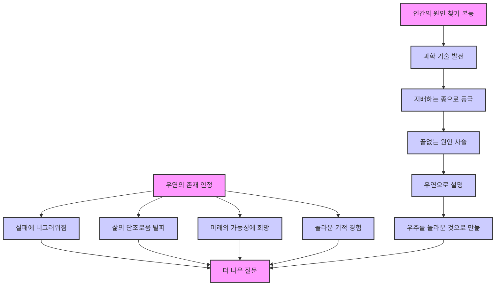

## 우연은 얼마나 내 삶을 지배하는가: 성공과 실패, 그리고 우주의 비밀 
이 책은 우리가 생각하는 것보다 훨씬 더 많은 부분이 '우연'에 의해 결정된다는 사실을 과학적인 관점에서 쉽고 재미있게 설명한다. 성공과 실패의 원인을 개인의 노력만으로 돌리는 능력주의 사회의 오류를 지적하고, 카오스 이론과 양자 물리학을 통해 우연이 우리 삶과 우주에 얼마나 깊이 뿌리내리고 있는지 알려준다. 궁극적으로 우연을 이해하고 받아들이는 것이 더 풍요로운 삶을 위한 지혜임을 강조한다.

## 1. 우연은 우리 삶의 거대한 행운 게임이다 

1. **우연은 우리를 지배한다** 
  1. 우리는 모두 우연의 산물이며, 우연 없이는 존재할 수 없었을 것이다. 
  2. 삶은 마치 거대한 행운 게임과 같아서, 미래를 정확하게 계획할 수 있다고 믿는 것은 잘못된 생각일 수 있다. 
  3. 예를 들어, 로또 번호를 이모 할머니 생일로 기입해서 부자가 되거나 , 정원에 물을 주다가 운석이 떨어져 정원이 파괴되는 일  모두 개인의 잘잘못과는 상관없이 우연히 일어나는 일이다. 
2. **과학이 밝혀낸 우연의 의미** 
  1. 150년 전만 해도 사람들은 우연을 그저 환상이라고 생각했지만, 현대 과학은 우연에 대한 새로운 시각을 제시한다. 
  2. 카오스 이론은 아주 작은 우연이 얼마나 극적인 영향을 미칠 수 있는지 보여준다. 
  3. 양자 물리학은 아주 작은 입자들의 세계에서 우연이 매우 특별한 의미를 갖는다는 것을 알려준다. 
  4. 진화 생물학에서도 우연은 중요한 역할을 하지만, 우리의 뇌는 우연을 잘 받아들이지 못하도록 발달해 왔다. 
3. **우연을 받아들이는 것의 중요성** 
  1. 우연은 우리가 원하든 원하지 않든 우리 삶의 중요한 부분이다. 
  2. 우연, 우주, 그리고 우리 자신에 대해 깊이 생각해보는 시간을 갖는 것은 의미 있는 일이다. 

## 2. 성공과 실패에 대한 오해: 우연을 무시하는 우리의 경향 

1. **행복한 우연과 성취를 혼동하는 오류** 
  1. 로또 당첨자가 자신의 능력을 자랑한다면 비웃겠지만 , 우리는 행복한 우연과 자신의 성취를 자주 혼동한다. 
  2. **축구 선수**가 승리 후 팀의 정신력을 강조하지만, 상대 팀 골이 골대에 맞고 튕겨 나간 행운을 잊는 것처럼 말이다. 
  3. **신입 매니저**가 자신의 합격을 자랑스러워하지만, 아버지와 회사 임원이 동창이라는 우연한 사실을 언급하지 않는 경우도 있다. 
  4. 부유한 가정에서 태어나거나, 질병에 걸리지 않거나, 좋은 사람들을 만나는 행운을 대수롭지 않게 생각하는 경향이 있다. 
2. 능력주의** 사회의 착각** 
  1. 우리는 직장 생활이나 경제 활동에서의 성공이 오직 우리 손에 달렸다고 스스로에게 주입한다. 
  2. 능력주의 사회에서는 탁월한 아이디어, 근면 성실함, 노력과 공부가 성공으로 이어진다고 믿는다. 
  3. "운이 좋은 사람은 열심히 노력했다"고 생각하지만, 실제 직업적 성공은 포커 게임과 같다. 
  1. 우리는 최선을 다하지만, 우연이 우리 편이 아니면 이길 수 없다. 
  4. 우연의 의미를 무시하고 개인의 노력만이 성공과 실패를 결정한다고 믿으면, 다음과 같은 문제가 생긴다. 
  1. 자신을 자격 없는 패자로 여기는 우울한 패배자들이 생긴다. 
  2. 자신은 우월하며 성공이 당연하다고 여기는 오만한 승리자들이 생긴다. 
  3. "더 열심히 노력했어야 했고, 노력했다면 성공했을 것이다"라는 생각이 종교적 신념처럼 뿌리내린다. 
3. **성공 자기계발서의 함정** 
  1. 우연히 성공한 사람들이 성공 비법을 알려주겠다며 자기계발서를 쓰거나 세미나를 개최한다. 
  2. 이런 책들은 쓸데없는 조언으로 가득하며, 독자들의 뇌를 가볍고 부풀려진 글로 채우지만 실제 도움이 되는 내용은 없다. 
  3. 작가들이 거짓말을 하는 것은 아니지만, 그들의 성공 전략이 모든 사람에게 통하는 것은 아니다. 
  4. 똑같은 노력에도 실패한 사람들이 많지만, 그들에게는 아무도 전략을 묻지 않는다. 
4. 생존자 편향** (Survivor Bias)** 
  1. 성공한 사람들에게만 집중하면 잘못된 결론을 내리게 되는데, 이를 생존자 편향이라고 한다. 
  2. **2차 세계 대전 전투기 사례** 
  1. 귀환한 전투기들을 조사해보니 특정 부분에 총탄 자국이 집중되어 있었다. 
  2. 엔지니어들은 총탄 자국이 많은 부분을 보강해야 한다고 생각했다. 
  3. 하지만 통계학자 아브라함 월드는 이것이 잘못된 결정임을 알아차렸다. 
  4. 격추된 전투기들은 중요한 부분에 총탄을 맞아 돌아오지 못했을 것이므로, 오히려 총탄 흔적이 없는 부분을 보강해야 한다고 주장했고, 그의 주장은 옳았다. 
  3. **생존자 편향의 다른 예시** 
  1. 100세 노인이 건강 비결로 숲 운동과 코담배를 꼽지만, 같은 생활 방식을 고수하다 일찍 사망한 사람도 많다. 
  2. 유명 할리우드 배우가 하루 촬영으로 수백억을 벌지만, 비슷한 재능과 외모를 가졌음에도 실패한 배우들이 훨씬 많다. 
  3. 월스트리트에서 놀라운 수익을 내는 펀드 매니저가 있지만, 비슷한 감각을 지녔음에도 실적이 부진한 동료들도 셀 수 없이 많다. 
  4. **기이하고 역설적인 효과** 
  1. 수많은 재능 있는 사람들이 같은 목표를 향해 노력하지만 소수만이 대가를 받는다. 
  2. 성공할 수 있다는 막연한 가능성만으로도 많은 사람들에게 동기 부여가 된다. 
  3. 이런 위험 부담이 높은 직업은 돈을 받는 것이 아니라, 돈을 벌 수 있는 기회를 받는 것과 같다. 
  4. 인턴 생활처럼 돈이 아닌 '기회'를 지불하는 전략이 더욱 확산되고 있다. 
5. **실패에 대한 너그러움** 
  1. 우연이 우리 삶을 언제든지 새로운 방향으로 이끌 수 있다는 사실을 받아들여야 한다. 
  2. 이는 실패를 조금 더 편안하고 너그럽게 대할 줄 알아야 한다는 의미이다. 
  3. 어떤 일이 잘못된 것이 반드시 우리 탓은 아니다. 
  1. 주식 투자 실패, 중고차 고장, 승진 누락 등은 그저 운이 안 좋았던 것일 수 있다. 
  2. 우리가 위험을 줄일 수는 있었겠지만, 책임을 전적으로 질 필요는 없다. 
  3. 그저 우연이 우리 편이 아니었을 뿐이다. 

## 3. 우연을 제대로 이해하지 못하는 인간의 한계 

1. **우연과 **가능성** 판단의 미숙함** 
  1. 우리는 날씨나 음식 맛처럼 직관적인 것은 잘 알아차리지만, 가능성, 통계, 행운, 우연에 대해서는 직감이 비참하게 실패한다. 
  2. 인간이 우연과 가능성을 판단하는 능력은 마치 귀가 어두운 고양이가 피아노를 치는 실력과 비슷하다. 
  3. 우리는 백상어를 두려워하지만 심장병은 두려워하지 않고 , 룰렛에서 빨간 공이 연속으로 나오면 다음엔 검은 공이 나올 것이라고 확신한다. 
2. **믿을 수 없는 사건들의 연속** 
  1. 우리의 뇌는 믿을 수 없는 사건들이 계속 일어나는 것을 쉽게 받아들이지 못한다. 
  2. 순전한 우연은 의심스럽게 느껴지기 때문에 숨은 원인을 찾으려 한다. 
  3. 하지만 세상에는 날마다 수많은 우연이 일어나기 때문에 항상 믿을 수 없는 일들이 벌어진다. 
  4. 가능성이 있는 일만 일어날 가능성은 매우 낮고, 가능성이 없는 일이 일어나지 않을 가능성도 가장 낮다. 
3. **미신과 의식의 탄생** 
  1. 미국의 심리학자 버러스 프레더릭 스키너의 비둘기 실험처럼, 우리는 우연한 사건과 자신의 행동을 연관 짓는 경향이 있다. 
  1. 스키너는 배고픈 비둘기들이 우리 안에서 무작위로 행동하다가 먹이가 나오면, 그 행동과 먹이 사이에 상관관계가 없는데도 연관 지었다. 
  2. 인간의 사회적 전통과 의식도 이와 비슷하다. 
  1. 봄 축제 후 날씨가 따뜻해지면 축제가 좋은 이유가 되고 , 기우제 후 비가 내리면 춤 덕분이라고 믿는다. 
  2. 겨울에 오렌지를 먹고 감기에 걸리지 않으면 오렌지 덕분이라고 생각하고 , 레드 와인 얼룩을 화이트 와인으로 지우는 것도 미신일 수 있다. 
  3. 이런 미신적인 의식들이 강박이 되거나 위험을 초래하면 문제가 된다. 
  1. 야구 선수가 엄격한 규칙 때문에 사회생활이 불가능하거나 , 원자력 발전소 안전 책임자가 행운의 속옷을 믿는다면 심각한 상황이다. 
4. **기적과 통계적 **필연성 
  1. 프랑스의 유명한 성지순례 장소인 루르드에는 성모 마리아의 기적적인 치유를 믿고 수많은 사람이 모여든다. 
  2. 하지만 일부 질병은 특별한 이유 없이 저절로 낫는 경우가 있는데, 이를 자연적 소멸이라고 한다. 
  1. 암의 자연적 소멸 확률은 10만분의 1 정도로 보고 있으며, 어떤 연구는 더 높게 보기도 한다. 
  3. 매년 수백만 명이 루르드를 방문하고 그중 일부가 암 환자라면, 1~2년에 한 번씩 암이 자연 치유되는 사례가 관찰될 수 있다. 
  4. 천문학자 칼 세이건은 루르드 순례자들의 질병 자연 소멸 비율이 일반 국민보다 오히려 낮다는 사실에 실소했다. 
  5. 어떤 장소에 아픈 사람들이 충분히 많이 모이면, 그들 중 몇 명이 불가사의하게 치유되는 것은 놀라운 일이 아니라 통계적인 필연성이다. 
  1. 마치 충분히 많은 사람이 로또 게임에 참여하면 누군가는 당첨되는 것과 같다. 
  6. 우연히 건강을 회복하면 신비함을 느끼며 기념하지만, 과학적인 치료법으로 건강을 회복하면 당연하게 여긴다. 
  1. 방사선 치료나 정형외과를 숭배하는 성당은 왜 없는 것일까? 

## 4. 우주와 삶을 지배하는 카오스 이론 

1. **모든 것은 서로 연결되어 있다** 
  1. 우리는 세상을 편리하게 이해하기 위해 부분으로 나누는 데 익숙하다. 
  1. 독일에서 전동기를 조립하는 사람이 부에노스아이레스의 날씨를 생각하지 않거나 , 세탁기 작동이 아프리카 코끼리와 상관없다고 생각하는 것처럼 말이다. 
  2. 하지만 실제로는 세계 전체가 원인과 결과로 이루어진 촘촘한 그물이며, 결코 간단한 부분으로 나눌 수 없다. 
  3. 나비 효과는 작은 나비의 날개짓이 멀리 떨어진 곳에서 폭풍을 몰고 올 수 있다는 것을 보여준다. 
  1. 나비 효과는 눈사태 효과와 다르다. 눈사태는 작은 돌멩이라는 분명한 원인이 있지만 , 나비는 폭풍우의 직접적인 원인이 아니라 수많은 초기 조건 중 하나일 뿐이다. 
  2. 화성의 운석 충돌도 우리의 삶을 완전히 뒤바꿔 놓을 수 있다. 
  4. 물리학적 관점에서 우리의 모든 발걸음, 호흡, 눈 깜빡임 하나하나가 인류 역사의 흐름을 바꿀 수 있다. 
2. 예측 불가능한** 영향** 
  1. 모든 것이 논리적으로 연결되어 있다고 해서, 나비를 연구하면 목성의 폭풍을 알 수 있다는 뜻은 아니다. 
  2. 우리가 카오스적으로 확산되는 작은 원인들을 이용해 미래에 의도적인 영향을 끼칠 가능성은 전혀 없다. 
  3. 우리가 하는 모든 일, 또는 하지 않는 모든 일은 우주에 있는 다른 모든 것에 영향을 미칠 수 있다. 
  4. 하지만 그것은 그저 우연히, 예측할 수 없이, 그리고 무계획적으로 이루어질 뿐이다. 
  5. 우리는 매 순간 어떤 결정을 내림으로써 미래를 엄청나게 바꿔놓는다. 
  1. 우리의 작은 손짓 하나가 역사의 흐름을 바꾸고, 호흡 하나가 세상에 일어날 일들의 수많은 원인 중 하나가 된다. 
  2. 심지어 우리가 더 이상 존재하지 않는 순간에도 말이다. 
  3. 우리 옆 잔디밭에 앉아 있는 나비들도 모두 우리와 똑같은 힘을 지니고 있다. 

## 5. 양자 물리학과 우연의 신비 

1. 양자 중첩 상태** (Quantum **Superposition**)** 
  1. 양자 물리학은 신비롭거나 비밀스러운 것이 아니라, 다른 물리학 이론과 마찬가지이다. 
  2. 다만, 우리 일상의 대상, 특성, 범주로는 설명할 수 없다는 어려움이 있다. 
  3. 양자 물리학의 가장 놀라운 특성은 대상들이 여러 가지 상태로 동시에 존재할 수 있다는 것이다. 이를 **양자 중첩 상태**라고 부른다. 
  1. 고전 물리학에서는 동전을 던지면 앞면 또는 뒷면 중 하나만 나오지만 , 양자 시스템은 앞면과 뒷면 상태를 동시에 가질 수 있다. 
  2. 원자가 왼쪽으로 돌면서 동시에 오른쪽으로 도는 것도 가능하다. 
  4. 전자가 실제로 어디에 있는지를 묻는 것은 의미가 없다. 
  1. 마치 악어가 얼마나 꼬꼬댁 소리를 낼 수 있는지, 숫자 4가 무슨 색인지 묻는 것과 같다. 
  2. 날아다니는 전자는 실제 위치가 없고, 산만하게 분포하며 움직인다. 
  5. 입자를 가만히 두면 여러 곳에 동시에 머물 수 있다. 
  1. 전자를 어두운 상자에 가두면 상자 안 모든 곳에 존재하지만, 뚜껑을 열어 들여다보면 특정 한 곳에만 존재하는 것을 볼 수 있다. 
2. **측정과 **파동 함수의 붕괴** (**Wave Function** Collapse)** 
  1. 중첩 상태는 입자가 외부 세계의 영향을 받지 않을 때만 가능하다. 
  2. 모든 측정은 상태를 변화시키고, 자연으로 하여금 확정 짓도록 강요한다. 
  1. 흐릿하고 분포되어 있던 것이 측정 순간에 명백하고 확정적인 것이 된다. 
  3. 똑같은 양자 실험을 반복해도 측정 결과는 예측 불가능하고 순전히 우연이다. 
  4. **측정이란 무엇인가?** 
  1. 측정 없이 세계는 질서 정연하고 입자는 중첩 상태에 놓여 있다. 
  2. 양자 우연성은 측정의 순간에 본격적인 문제가 된다. 
  3. 동시에 존재하는 상태 중에서 어떤 것이 실제 측정 결과가 되어야 할지 자연이 결정해야 하는 순간이다. 
  5. 슈뢰딩거의 고양이** 상자**처럼, 상자 뚜껑을 열어보거나 , 광선으로 비추거나 , 발열 정도를 측정하거나 , 진동 측정기를 설치하는 것  모두 측정에 해당한다. 
  1. 이 모든 행위는 **파동 함수의 붕괴**를 가져오고 중첩 상태를 끝내며, 우연하지만 확실한 결과를 이끌어낸다. 
  2. 마술 상자 안의 비둘기가 닫혀 있을 때는 어디에나 있지만, 상자를 열면 사라지는 것처럼 말이다. 
  3. 입자 자체도 자신의 위치를 모르고, 자연은 이런 정보를 미리 준비해 놓지 않는다. 
  4. 측정 전에는 어디에나 동시에 존재하며, 어떤 계산법으로도 결과를 예측할 수 없다. 
3. 양자 얽힘** (Quantum Entanglement)** 
  1. 양자 우연성은 서로 직접적인 영향을 미칠 수 없는 대상들을 결합한다. 
  2. 아무리 거리가 멀어도 작용하고, 아주 순간적으로 지체 없이 이루어진다. 
  3. 아인슈타인은 이를 믿으려 하지 않았다. 
  1. 그는 빛보다 빠르게 확산되는 것은 없다는 상대성 이론을 정립했다. 
  2. 멀리 떨어진 입자의 양자 측정 작용을 "유령 같은 원격 작용"이라고 칭하며, 양자 이론이 불완전하다고 주장했다. 
  4. 하지만 반복된 연구 결과 양자 이론이 옳았음이 밝혀졌다. 
  5. 그럼에도 정보가 빛보다 빠르게 확산될 수 없다는 아인슈타인의 규칙은 여전히 유효하다. 
  1. 양자 얽힘을 정보 전달에 이용할 수 없기 때문이다. 
  2. 두 입자가 주고받는 것은 순전히 우연한 과정이며, 우리가 통제 불가능하다. 
4. **다중 우주 개념 (Many-Worlds Interpretation)** 
  1. 휴 에버렛은 모든 가능성이 또 다른 평행 우주에서 현실이 된다는 다중 우주 개념을 제시했다. 
  2. 이는 우리가 살고 있는 현실의 가치에 대한 질문을 던지게 한다. 

## 6. 우리가 존재하는 것 자체가 엄청난 우연의 결과이다 

1. **우주적 **우연의 축적 
  1. 우리가 오늘날 여기에 존재하는 것은 엄청난 우연들이 축적된 결과이다. 
  2. 우리가 존재하지 않았을 수도 있고, 믿을 수 없는 수많은 사건들이 일어나야만 했다. 
  3. **생명 탄생을 위한 조건들** 
  1. 초신성이 충분한 양의 무거운 원소들을 남겨 놓은 우주 어딘가에 적당한 크기의 별이 생성되어야 했다. 
  2. 카오스적인 혼돈 속에 날아다니는 물질들로 행성이 만들어져야 했고, 살기 좋은 온도를 유지하기 위해 별과 정확한 거리를 두고 궤도를 돌아야 했다. 
  3. 그 행성에서 분자들이 제대로 조합되어 스스로 재생산이 가능한 구조가 만들어져야 했다. 
  4. 이렇게 시작된 진화는 예측 불가능한 수백만 년 동안의 우연한 일들을 통해 항상 제대로 된 방향으로 진행되어야 했다. 
2. **개인적 우연의 연결고리** 
  1. 셀 수 없이 많은 우리 조상들은 우리가 만들어지기 위해 엄청난 양의 기가 막힌 우연들을 경험해야 했다. 
  2. 끔찍한 전쟁터에서 조상들은 운 좋게도 화살, 칼, 총알을 피할 수 있었다. 
  3. 고조 할머니가 고조 할아버지를 우연히 만나게 된 계기는, 할아버지가 타고 가던 말이 다리를 다쳐 하룻밤 그 동네에 묵게 되었기 때문이다. 
  4. 이런 기막힌 우연들이 없었다면 우리는 오늘날 존재하지 않았을 것이다. 
  5. 대신 다른 누군가가 자신의 존재의 놀라운 우연에 감탄하고 있을 것이다. 
  6. 우리가 살아가고 있는 이 행운은 더 많은 기이한 우연의 연결고리에 달려 있다. 

## 7. 우연을 이해하고 받아들이는 지혜 

1. **원인 찾기 본능과 그 한계** 
  1. 우리 인간은 어떤 일에 대해 열정적으로 원인을 찾으려 한다. 이것이 우리의 강점이다. 
  2. 어린아이들도 달의 모양이나 눈사람이 녹는 이유를 궁금해한다. 
  3. 이러한 원인 찾기를 통해 우리는 과학과 기술을 발전시켰고, 태양계에서 지배하는 종으로 등극했다. 
  4. 우리는 원인에 대한 질문을 멈춰서는 안 되지만, 모든 대답이 더 깊은 원인으로 이어지는 끝없는 사슬에 얽히지 않으려면 어떤 지점에서 끝을 낼 수 있어야 한다. 
2. **우연은 우리의 인식 속에 있다** 
  1. 우리는 이유를 찾을 수 없는 것을 우연이라고 설명한다. 
  2. 우연성은 우주의 특성이 아니라 우리의 머릿속에 들어 있는 범주이다. 
  3. 우연은 우리가 결국 세계를 완전히 이해할 수 없다는 것을 의미한다. 
3. **우연이 주는 삶의 의미** 
  1. 만약 모든 것을 이해할 수 있다면 삶은 상당히 단조로워질 것이다. 
  2. 우연은 우리가 예상하지 못한 것을 경험하고, 혼란 속에서도 다채로운 미래의 가능성에 희망을 걸어도 된다는 것을 의미한다. 
  3. 세상 곳곳에서 날마다 놀라운 기적들이 일어난다는 뜻이기도 하다. 
  4. 우연의 존재로 우주는 정말 놀라워진다. 
  5. 아무도 놀라지 않는 기적이 무슨 소용이 있겠는가? 
4. **우연을 받아들이는 자세** 
  1. 수많은 우연들로 우리가 지금 이 자리에 있다는 사실에 감사하면서도, 때로는 무력감을 느낄 수 있다. 
  2. 하지만 성공의 확률을 높이도록 노력하면 우연이 우리 편일 가능성이 더 커질 것이다. 
  3. 동시에 실패에 대해서는 조금 더 너그럽게 생각해야 한다. 
  4. 우연은 사실이며 우리 삶의 일부분이므로, 우연의 가장 깊은 원인을 연구하는 것은 별로 도움이 되지 않는다. 
  5. 대신, 우리의 삶에 있어 우연이 어떤 의미가 있는지, 왜 우리가 우연을 잘못 판단하는지, 설명할 수 없는 현상들이 우연인지, 성공과 실패가 우연인지 등 더 나은 질문을 던지는 것이 중요하다. 

