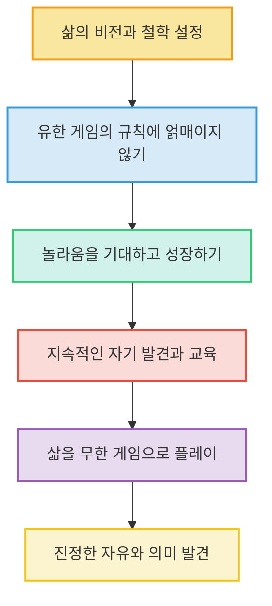
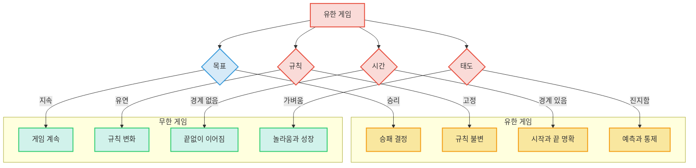

## 1. '유한 게임'과 '무한 게임'이란 무엇일까? 
이 책은 인생을 두 가지 게임, 즉 '유한 게임'과 '무한 게임'으로 나누어 설명하며, 우리가 삶을 어떻게 바라보고 플레이해야 하는지에 대한 깊은 통찰을 제공한다. 이 두 가지 게임의 차이를 이해하면 삶의 다양한 측면을 새로운 시각으로 볼 수 있을 거야.

### 1.1. 유한 게임: 정해진 규칙 안에서 승리를 목표로 하는 게임 
유한 게임은 마치 운동 경기처럼 정해진 규칙과 목표가 있고, 결국 승자와 패자가 나뉘는 게임이야.

1. **승리가 목적이야.**
  1. 유한 게임은 누가 이기는지가 가장 중요해. 
  2. 모든 플레이어가 누가 이겼는지 동의하면 게임이 끝나. 
  3. 관중이나 심판의 승인도 중요하지만, 플레이어들이 동의하지 않으면 게임은 끝난 게 아니야. 
2. **시간과 공간의 경계가 명확해.**
  1. 유한 게임은 시작과 끝이 정해져 있어. 
  2. 플레이어들은 게임이 진행될 장소와 참여할 사람의 수에도 동의해야 해. 
  3. 예를 들어, 2차 세계대전 때 교전국들은 특정 도시(하이델베르크, 파리)는 폭격하지 않기로 합의했고, 스위스는 전쟁 지역에서 제외했어. 
  4. 만약 규칙을 어기면, 예를 들어 미국 남북전쟁 때 셔먼 장군이 애틀랜타를 초토화했을 때처럼, 그 승리의 정당성에 의문이 제기될 수 있어. 
3. **참가자 수가 정해져 있어.**
  1. 유한 게임은 특정 사람들을 선정해서 플레이해. 
  2. 혼자서는 게임을 할 수 없고, 함께 플레이할 상대나 팀원을 찾아야 해. 
  3. 모든 사람이 뉴욕 양키스에서 뛸 수 없는 것처럼, 특정 자격이 필요할 수도 있어. 
  4. 참가자들이 마음대로 경기장을 드나들면 누가 참가자인지 불분명해지고, 확실한 승자도 없어지기 때문에 참가자 수가 정해져야 해. 
4. **규칙이 정해져 있고 바뀌지 않아.**
  1. 유한 게임의 규칙은 플레이어들이 동의하는 계약 조건과 같아. 
  2. 규칙은 게임 시작 전에 공표되고, 플레이어들은 이에 동의해야 해. 
  3. 규칙은 플레이어들의 자유로운 선택에 의해 존재하며, 강제로 복종해야 하는 규칙은 없어. 
  4. 게임 도중에 규칙이 바뀌면, 그건 다른 게임이 되는 것과 같아. 
5. **진지함과 연극성이 있어.**
  1. 유한 게임을 할 때는 모두가 진지하게 승리를 위해 노력해. 
  2. 마치 배우가 역할을 연기하듯이, 플레이어들은 자신의 역할을 진지하게 받아들이고 연기해. 
  3. 승리라는 보상이 없으면 삶이 무의미하게 느껴질 수도 있어. 
  4. 이러한 진지함은 예측할 수 없는 결과를 두려워하기 때문에 생기는 거야. 

### 1.2. 무한 게임: 게임 자체를 계속하는 것이 목적인 게임 
무한 게임은 삶 자체처럼 끝없이 이어지는 게임이야. 승패보다는 게임을 계속하는 것이 중요해.

1. **게임의 지속이 목적이야.**
  1. 무한 게임의 유일한 목적은 게임이 끝나지 않도록 계속 플레이하는 거야. 
  2. 누가 이겼다고 말할 수 없어. 예를 들어, 인생에서 누가 이겼다고 말할 수 있을까? 
2. **시간과 공간의 경계가 없어.**
  1. 무한 게임은 언제 시작했는지, 언제 끝날지 정해져 있지 않아. 
  2. 특정 장소나 참가자 수에 제한이 없어. 
  3. 무한 게임의 시간은 게임 안에서 창출되는 시간이야. 
  4. 각 경기는 경계들을 제거하며 플레이어들에게 새로운 시간의 지평을 열어줘. 
3. **규칙이 유연하게 변해.**
  1. 무한 게임의 규칙은 플레이를 계속하기 위해 필요하면 바뀔 수 있어. 
  2. 규칙은 게임이 중단되는 것을 막기 위해 만들어져. 
  3. 마치 언어의 문법처럼, 대화를 지속시키기 위해 규칙을 지키는 것과 같아. 
4. **가벼운 마음과 **극적인** 경험을 추구해.**
  1. 무한 게임은 진지함보다는 가벼운 마음으로 플레이해. 
  2. 가볍다는 것은 사소하다는 뜻이 아니라, 자유로운 사람들로서 관계를 맺고 놀라움에 열려 있다는 뜻이야. 
  3. 무한 게임은 항상 미래를 열어두고, 모든 대본을 부질없는 것으로 여기며, 모든 결말을 피하기 때문에 '극적'이라고 할 수 있어. 
5. **놀라움을 기대하고 성장해.**
  1. 무한 게임 플레이어는 놀라움을 기대하며 플레이를 계속해. 
  2. 놀라움은 유한 게임을 끝내지만, 무한 게임에서는 플레이를 계속할 이유가 돼. 
  3. 놀라움은 과거에 대한 미래의 시작이며, 미래는 항상 놀랍기 때문에 과거는 계속 변해. 
  4. 놀랄 준비를 한다는 것은 '교육'을 받는다는 뜻이야. 교육은 끊임없는 자기 발견으로 이끌어. 

### 1.3. 유한 게임과 무한 게임의 관계 
이 두 가지 게임은 서로 독립적이지 않고, 서로 영향을 주고받을 수 있어.

1. **유한 게임은 **무한 게임** 안에서 진행될 수 있어.**
  1. 무한 게임 플레이어들은 유한 게임에 참여하지만, 유한 게임 플레이어들처럼 진지하게 임하지는 않아. 
  2. 마치 배우가 역할을 연기하듯이, 무한 게임 플레이어들은 가면을 쓰지만, 자신이 가면을 쓰고 있다는 사실을 스스로와 다른 사람들에게 인정해. 
  3. 예를 들어, 축구 경기(유한 게임)는 스포츠라는 무한 게임 안에서 진행되는 거야. 
2. **무한 게임은 **유한 게임** 안에서 진행될 수 없어.** 
3. **두 게임의 플레이어가 만났을 때.**
  1. 무한 게임 플레이어와 유한 게임 플레이어가 만나면, 유한 게임 플레이어가 어려움을 겪을 수 있어. 
  2. 유한 게임 플레이어는 정해진 규칙에 따라 플레이하려 하지만, 무한 게임 플레이어는 규칙을 바꿀 수 있기 때문이야. 

## 2. 삶의 다양한 영역에서 유한 게임과 무한 게임을 찾아보자 
이 책은 스포츠, 비즈니스, 심지어 사랑까지 다양한 영역에서 유한 게임과 무한 게임의 개념을 적용해 설명하고 있어.

### 2.1. 스포츠: 승패를 넘어 게임 자체를 사랑하는 마음 
스포츠는 유한 게임의 대표적인 예시지만, 그 안에서도 무한 게임의 정신을 찾을 수 있어.

1. **축구 경기(**유한 게임**)와 스포츠 정신(**무한 게임**).**
  1. 축구 경기는 정해진 시간, 규칙, 승패가 있는 유한 게임이야. 
  2. 하지만 스포츠 자체를 사랑하고 계속 발전시키려는 마음은 무한 게임의 정신과 같아. 
2. **조니 워렌의 사례.**
  1. 호주 축구 선수 조니 워렌은 선수로서 유한 게임(경기 승리)을 했어. 
  2. 하지만 그는 은퇴 후에도 축구를 홍보하고, 호주가 월드컵에 진출하도록 노력하는 등 축구라는 무한 게임을 계속 플레이했어. 
  3. 이처럼 한 사람이 유한 게임을 하면서도 무한 게임의 정신을 가질 수 있다는 것을 보여주는 좋은 예시야. 

### 2.2. 비즈니스: 경쟁을 넘어 지속 가능한 성장을 추구하는 것 
비즈니스도 단순히 경쟁에서 이기는 것을 넘어, 장기적인 관점에서 지속 가능성을 추구하는 것이 중요하다고 말해.

1. **비즈니스 자체는 무한 게임이야.**
  1. 비즈니스는 인류 역사상 오랫동안 존재해왔고, 앞으로도 계속될 거야. 
  2. 어떤 회사도 '비즈니스에서 이겼다'고 말할 수 없어. 
  3. 회사가 망하거나 합병되어도, 비즈니스라는 게임 자체는 계속돼. 
2. **회사들은 유한 게임을 해.**
  1. 회사들은 목표, KPI(핵심 성과 지표) 등을 설정하고 이를 달성하기 위해 경쟁해. 
  2. 이것은 비즈니스라는 큰 무한 게임 안에서 스스로와 경쟁자들과 함께 하는 유한 게임인 셈이야. 
3. **애플과 마이크로소프트의 예시.**
  1. 애플은 고객을 위해 더 나은 것을 만들고, 비전을 통해 브랜드를 확장하려는 무한 게임의 사고방식을 가지고 있어. 
  2. 반면, 마이크로소프트는 한때 애플을 '이기는 것'에만 집중하며 유한 게임의 사고방식에 갇혔었어. 
  3. 이처럼 어떤 회사는 무한 게임처럼, 어떤 회사는 유한 게임처럼 비즈니스를 할 수 있어.

### 2.3. 삶의 다른 영역: 관계, 교육, 역할 등 
우리의 일상생활에서도 유한 게임과 무한 게임의 개념을 적용해 볼 수 있어.

1. **역할과 **자기 은폐**.**
  1. 우리는 변호사, 요리사, 엄마 등 다양한 역할을 맡아. 
  2. 이러한 역할은 다른 사람들이 규정한 제한과 기대에 둘러싸여 있어. 
  3. 역할을 제대로 수행하려면, 우리는 어느 정도 '자기 자신을 감추고' 그 역할에 몰입해야 해. 
  4. 마치 배우가 오필리아 역할을 연기할 때, 자신이 오필리아가 아니라는 사실을 잠시 잊는 것과 같아. 
  5. 하지만 우리는 언제든 그 역할을 그만둘 자유가 있다는 사실을 잊지 말아야 해. 
2. **훈련과 교육.**
  1. 유한 게임에서는 '훈련'을 통해 미래를 예측하고 통제하려 해. 
  2. 훈련은 과거를 끝난 것으로 보고, 미래에서 반복하려 해. 
  3. 반면, 무한 게임에서는 '교육'을 통해 놀라움을 기대하고 성장해. 
  4. 교육은 끊임없는 자기 발견으로 이끌고, 미완의 과거를 미래로 이어가. 
3. 천재성**(Genius)과 **창조**(Poiesis).** 
  1. '천재성(Genius)'은 모든 사람, 장소, 사물에 존재하는 신성한 본성의 개별적인 표현을 의미해. 마치 수호천사나 영혼과 같아. 
  2. '창조(Poiesis)'는 이전에 존재하지 않던 것을 만들어내는 활동이야. 
  3. 무한 게임에서는 자신의 개성과 창의성을 표현하며 새로운 것을 만들어낼 수 있어. 
  4. 반면, 유한 게임에서는 정해진 틀 안에서 최고가 되려 하기 때문에, 이러한 창조성이 발휘되기 어려워. 
  5. 예를 들어, 병을 '치료하는' 외과의사(유한 게임)는 당장의 문제를 해결하지만, 병을 '치유하는' 의사(무한 게임)는 근본적인 원인을 찾아내고 새로운 해결책을 모색해. 
  6. 유혹하는 사람(유한 게임)은 순간적인 정복을 원하지만, 사랑하는 사람(무한 게임)은 가족을 만들고 관계를 지속시키려 해. 

## 3. 삶을 무한 게임으로 플레이하는 지혜 
이 책은 우리가 삶을 어떻게 바라보고 어떤 태도로 살아가야 하는지에 대한 중요한 메시지를 전달해.

### 3.1. 자신의 '무한한 비전'을 가지고 살아가기 
우리가 어떤 게임을 하고 있는지 이해하는 것이 중요하며, 특히 삶을 무한 게임으로 인식하는 것이 중요해.

1. **삶의 핵심 가치와 신념을 세워야 해.**
  1. 자신의 삶에 대한 '무한한 비전'과 신념, 철학을 바탕으로 결정을 내려야 해. 
  2. 만약 이런 핵심 가치가 없으면, 우리는 계속해서 단기적인 유한 게임의 규칙에 얽매여 반응적인 결정을 내리게 될 거야. 
  3. 마치 나침반 없이 항해하는 배처럼, 어디로 가야 할지 모르고 표류하게 되는 것과 같아.
2. **유한 게임의 규칙에 갇히지 않기.**
  1. 우리는 은행과의 계약, 직장에서의 승진 경쟁 등 다양한 유한 게임에 참여하고 있어. 
  2. 하지만 이러한 유한 게임의 규칙이나 경쟁에만 집중하면, 삶이라는 큰 무한 게임에서 길을 잃을 수 있어. 
  3. 마치 숲을 보지 못하고 나무만 보는 것과 같아.

### 3.2. 놀라움을 환영하고 끊임없이 배우는 자세 
무한 게임을 플레이하는 사람은 예측 불가능한 상황과 놀라움을 두려워하지 않고 오히려 환영해.

1. **놀라움은 성장의 기회야.**
  1. 무한 게임 플레이어는 놀라움을 기대하며 플레이를 계속해. 
  2. 놀라움이 없으면 모든 플레이는 멈추게 돼. 
  3. 놀라움은 과거를 바꾸고 새로운 시작을 가져다주기 때문에, 우리는 이를 통해 극적인 변화를 겪게 돼. 
  4. 마치 예상치 못한 선물을 받았을 때처럼, 새로운 가능성에 기뻐하고 이를 통해 성장하는 거야.
2. **교육을 통해 자신을 발견해.**
  1. 놀랄 준비를 한다는 것은 '교육'을 받는다는 뜻이야. 
  2. 교육은 과거에서 풍요로움을 발견하고, 끊임없는 자기 발견으로 이끌어. 
  3. 마치 새로운 지식을 배우면서 '아하!' 하고 깨닫는 순간처럼, 자신과 세상을 더 깊이 이해하게 되는 과정이야.

### 3.3. 진정한 자유와 의미를 찾는 여정 
궁극적으로 이 책은 우리가 삶에서 진정한 자유와 의미를 어떻게 찾을 수 있는지에 대한 질문을 던져.

1. **자기 은폐를 인정하는 용기.**
  1. 우리는 유한 게임을 할 때 스스로의 자유를 의도적으로 잊고, 역할을 진지하게 맡아. 
  2. 하지만 언제든 경기장을 떠날 수 있는 자유가 있다는 사실을 인정하는 것이 중요해. 
  3. 마치 연극 무대에서 배우가 역할을 연기하지만, 무대 뒤에서는 자기 자신으로 돌아오는 것처럼, 우리는 언제든 가면을 벗을 수 있다는 것을 기억해야 해.
2. **가벼운 마음으로 관계 맺기.**
  1. 무한 게임 플레이어는 다른 사람들과 '가벼운 마음'으로 관계를 맺어. 
  2. 이것은 사소하다는 뜻이 아니라, 자유로운 사람들로서 관계를 맺고 놀라움에 열려 있다는 뜻이야. 
  3. 마치 친구와 함께 여행을 떠날 때, 모든 것을 계획하기보다는 예상치 못한 일들을 즐기는 것처럼, 열린 마음으로 관계를 맺는 거야.
3. **삶을 계속하는 것이 승리야.**
  1. 무한 게임에서는 '승리'라는 개념이 없어. 게임을 계속하는 것 자체가 목적이자 승리야. 
  2. 우리는 다른 사람을 이기려 하기보다는, 자신의 신념과 가치를 지키며 삶이라는 무한 게임을 계속 플레이해야 해. 
  3. 마치 마라톤에서 1등을 하는 것보다, 완주하는 것 자체에 의미를 두는 것과 같아.

## 4. 유한 게임과 무한 게임의 결정적인 차이점 
이 두 가지 게임은 여러 면에서 정반대의 특징을 가지고 있어. 이 차이점을 명확히 이해하는 것이 중요해.

### 4.1. 규칙의 변화 여부 
가장 결정적인 차이는 규칙이 변하는지 여부야.

1. **유한 게임의 규칙은 변하지 않아.**
  1. 규칙이 바뀌면 다른 게임이 되는 것과 같아. 
  2. 마치 축구 경기 중에 갑자기 손으로 공을 잡아도 된다고 규칙이 바뀌면, 그건 더 이상 축구가 아닌 것과 같아.
2. **무한 게임의 규칙은 플레이 과정에서 바뀌어야 해.**
  1. 게임이 중단되는 것을 막고, 가능한 많은 사람이 계속 플레이할 수 있도록 규칙이 변해. 
  2. 마치 언어가 시대에 따라 변하듯이, 무한 게임의 규칙도 계속 진화하는 거야. 

### 4.2. 놀라움에 대한 태도 
놀라움을 어떻게 받아들이는지도 큰 차이를 보여.

1. **유한 게임은 놀라움을 피하려 해.**
  1. 상대를 놀라게 하는 것이 승리할 가능성을 높여주기 때문에, 유한 게임에서는 놀라움이 중요해. 
  2. 하지만 동시에 상대의 놀라운 수에 대비하고, 미래를 통제하려 해. 
  3. 마치 바둑 기사가 상대의 모든 수를 예측하고 대비하려는 것처럼, 예측 불가능한 상황을 최소화하려는 거야.
2. **무한 게임은 놀라움을 기대해.**
  1. 놀라움은 무한 게임을 계속할 이유가 돼. 
  2. 놀라움이 발생할 때마다 과거는 새로운 시작을 드러내고, 미래는 항상 놀랍기 때문에 과거는 계속 변해. 
  3. 마치 새로운 모험을 떠날 때, 어떤 일이 일어날지 모르지만 그 자체를 즐기는 것과 같아.

### 4.3. 자기 은폐와 솔직함 
자신을 드러내는 방식에서도 차이가 있어.

1. 유한 게임** 플레이어는 자신을 감춰.**
  1. 미래가 과거를 바꾸는 것을 막기 위해, 자신의 진짜 모습을 감춰야 해. 
  2. 상대를 속이고 방심하게 만드는 '기만술'을 사용하기도 해. 
  3. 마치 포커 게임에서 자신의 패를 숨기고 상대를 속이려는 것처럼, 전략적으로 자신을 감추는 거야.
2. 무한 게임** 플레이어는 열린 상태로 일해.**
  1. 미래의 놀랄 준비가 되어 있기 때문에, 완벽하게 열린 상태로 플레이해. 
  2. 이것은 솔직함이라기보다는 '취약함'과 같은 열림이야. 
  3. 자신의 끝없는 성장을 드러내는 방식이며, 놀라움으로 인해 극적인 변화를 겪게 되기를 기대해. 
  4. 마치 어린아이가 새로운 것을 배우면서 실수하는 것을 두려워하지 않고 자신을 드러내는 것과 같아.

### 4.4. 훈련과 교육 
미래를 준비하는 방식도 달라.

1. **유한 게임은 '**훈련**'을 통해 미래를 준비해.**
  1. 훈련은 과거를 끝난 것으로 간주하고, 미래에서 반복하려 해. 
  2. 궁극적인 자기 확인으로 이끌어. 
  3. 마치 운동선수가 정해진 동작을 반복해서 완벽하게 만드는 것처럼, 이미 정해진 목표를 달성하기 위해 반복하는 거야.
2. **무한 게임은 '교육'을 통해 미래를 준비해.**
  1. 교육은 과거에서 풍요로움을 발견하고, 미완의 과거를 미래로 이어가. 
  2. 끊임없는 자기 발견으로 이끌어. 
  3. 마치 탐험가가 미지의 세계를 탐험하며 새로운 것을 발견하고 배우는 것처럼, 끝없이 자신을 확장하고 성장시키는 거야.

## 5. 유한 게임과 무한 게임의 실제 사례들 
이 책은 다양한 실제 사례를 통해 유한 게임과 무한 게임의 개념을 더욱 명확하게 설명해.

### 5.1. 전쟁의 사례: 2차 세계대전 vs 프랑스 혁명 
전쟁도 유한 게임과 무한 게임으로 나눌 수 있어.

1. **2차 세계대전은 유한 게임이야.**
  1. 어느 편이 누구인지 명확했고, 스위스처럼 공격하지 않기로 합의된 중립국도 있었어. 
  2. 고문 같은 특정 행동은 게임의 규칙을 어기는 것으로 간주되었어. 
  3. 독일이 항복하고 일본이 항복하면서 명확한 승자와 패자가 있었고, 게임이 끝나는 시점도 분명했어. 
  4. 마치 권투 경기처럼, 시작과 끝이 명확하고 승패가 갈리는 거야.
2. **프랑스 혁명은 무한 게임에 가까워.**
  1. 누가 혁명의 승자인지 명확하지 않았고, 혁명이 언제 끝났는지도 불분명했어. 
  2. 승패가 명확하지 않고, 계속해서 변화하고 이어지는 흐름이 있었어. 
  3. 마치 사회의 변화처럼, 명확한 시작과 끝, 승패를 가리기 어려운 복잡한 과정인 거야.

### 5.2. 지식과 학위의 사례 
학위는 유한 게임이지만, 진정한 지식은 무한 게임에 가까워.

1. **학위는 유한 게임이야.**
  1. 공학 학위처럼, 특정 과정을 마치면 주어지는 '타이틀'이야. 
  2. 이것은 특정 수준의 기술을 가지고 있음을 증명하는 게임의 일부일 뿐이야. 
  3. 마치 자격증 시험처럼, 합격하면 자격증이라는 타이틀을 얻는 거야.
2. **진정한 지식은 무한 게임이야.**
  1. 학위가 없어도 다리를 짓고 문제를 해결할 수 있는 '진정한 지식'은 달라. 
  2. 이것은 끊임없이 배우고 경험하며 쌓아가는 과정이야. 
  3. 마치 평생 학습처럼, 끝없이 탐구하고 발전시키는 과정인 거야.

### 5.3. 사회와 문화의 사례 
사회는 유한 게임의 규칙을 가지고 있지만, 문화는 무한 게임처럼 흘러가.

1. **사회는 유한 게임이야.**
  1. 사회는 운전 규칙, 폭력 금지 등 정해진 규칙과 구조를 가지고 있어. 
  2. 이러한 규칙을 어기면 제재를 받게 돼. 
  3. 마치 게임의 규칙처럼, 정해진 틀 안에서 행동해야 하는 거야.
2. **문화는 무한 게임이야.**
  1. 르네상스처럼, 누가 이겼다고 말할 수 없고, 언제 끝났는지도 명확하지 않아. 
  2. '역대 최고의 노래' 같은 것은 시대와 사람에 따라 계속 변해. 
  3. 마치 예술이나 유행처럼, 끊임없이 변화하고 발전하며 흐름을 이어가는 거야.

### 5.4. 유한 게임에 주입된 무한 게임의 요소 
때로는 유한 게임 안에서도 무한 게임의 창의적이고 예측 불가능한 요소가 나타나기도 해.

1. 포스베리 플롭**(높이뛰기 기술)의 사례.**
  1. 높이뛰기 선수가 등을 대고 바를 넘는 '포스베리 플롭'이라는 혁신적인 기술을 개발했어. 
  2. 이것은 기존의 가위뛰기 방식과는 완전히 다른 창의적인 방법이었어. 
  3. 사람들은 "와, 대단한 기술이다!"라고 감탄하기보다는 "저렇게 해도 되는 거야?"라며 규칙 위반 여부를 먼저 생각했어. 
  4. 마치 정해진 틀 안에서 예상치 못한 새로운 시도가 나왔을 때, 사람들이 혼란스러워하는 것과 같아.
2. **블리츠크리크(**전격전**)의 사례.**
  1. 2차 세계대전 당시 독일의 '블리츠크리크'는 기존 전쟁 방식과는 완전히 다른 혁신적인 전술이었어. 
  2. 보급선을 유지하는 등의 기존 규칙을 무시하고 빠르게 돌파하는 방식이었지. 
  3. 이 역시 "이런 식으로 싸워도 되는 거야?"라는 반응을 불러일으켰어. 
  4. 마치 정해진 게임에서 갑자기 새로운 규칙을 만들어버린 것처럼, 기존의 틀을 깨는 시도였던 거야.

### 5.5. 무한 게임에 침범하는 유한 게임의 요소 
반대로, 무한 게임을 하고 있는 사람에게 유한 게임의 요소가 강제로 침범할 수도 있어.

1. **유명인의 사생활 침해 사례.**
  1. 유명 배우가 가족과 함께 평범한 일상을 보내고 있을 때(무한 게임), 팬이 다가와 영화 속 캐릭터로 대하는 경우가 있어. 
  2. 이것은 배우가 연기하는 역할(유한 게임)을 사적인 삶(무한 게임)에 강제로 들이미는 것과 같아. 
  3. 마치 쉬고 있는 배우에게 갑자기 대본을 들이밀며 연기하라고 하는 것과 같아서, 유명인들이 화를 내는 이유가 되기도 해. 
2. **종교에 대한 정치적 개입 사례.**
  1. 종교인이 자신의 신앙생활을 하고 있을 때(무한 게임), 정치인이 다가와 특정 정당을 지지해달라고 요청하는 경우가 있어. 
  2. 이것은 종교라는 무한 게임에 정치라는 유한 게임의 요소를 강제로 주입하려는 시도와 같아. 
  3. 마치 신성한 공간에 갑자기 선거 유세장이 들어서는 것처럼, 본질과 다른 목적이 개입되는 거야.

