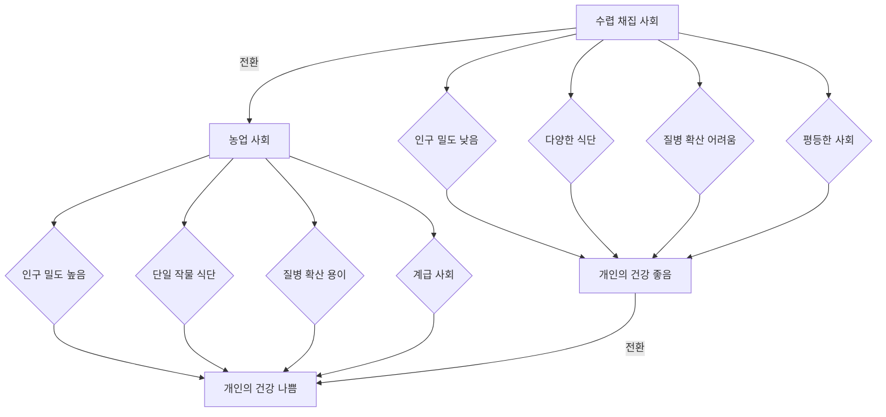
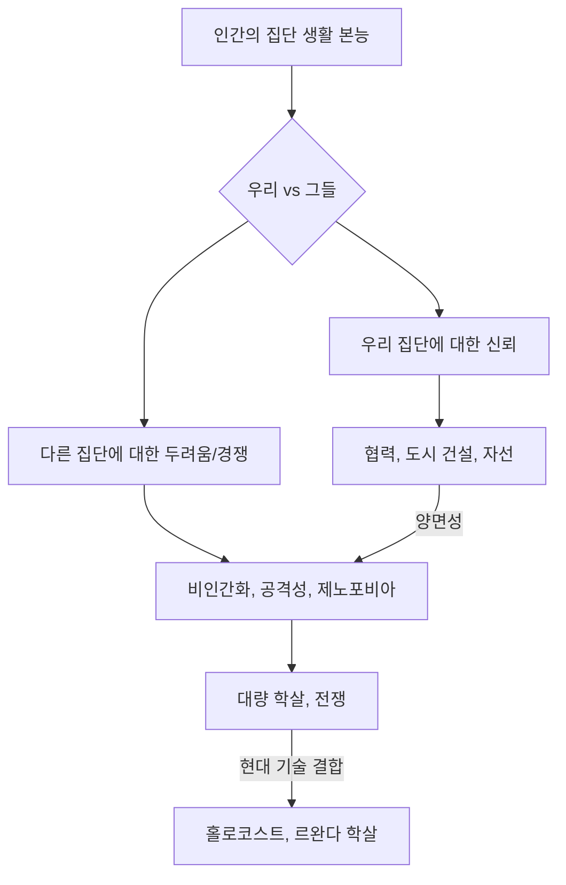
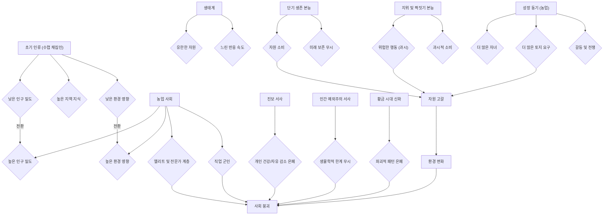
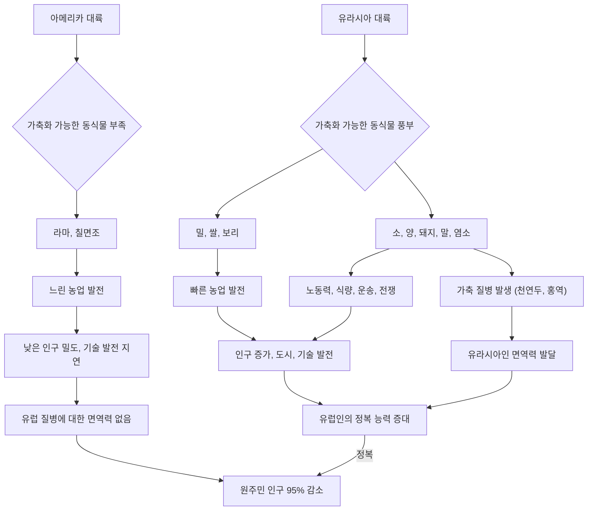

## 제3의 침팬지: 인간이라는 동물의 진화와 미래
이 책은 우리가 왜 특별한 존재인지, 그리고 우리를 다른 동물과 다르게 만드는 아주 작은 차이가 무엇인지 탐구하는 책이야. 저자인 재레드 다이아몬드는 우리가 사실 침팬지와 크게 다르지 않은 '제3의 침팬지'라고 말하면서, 인간의 진화와 문명, 그리고 미래에 닥칠 위험까지 깊이 있게 다루고 있어. 이 책은 우리가 어디에서 왔고, 왜 지금의 모습이 되었는지, 그리고 앞으로 어떻게 살아가야 할지에 대한 근본적인 질문을 던지고 있지.

## 1. 우리는 사실 '제3의 침팬지'야 

우리가 다른 동물들과 얼마나 다른지 궁금해한 적 있어? 이 책은 우리가 생각하는 것보다 훨씬 더 동물에 가깝다고 말해.

1. **화성에서 온 분류학자의 시선**:
  1. 만약 화성에서 온 과학자가 아무런 편견 없이 지구의 생물들을 분류한다면, 인간을 특별한 존재로 보지 않을 거야 .
  2. 그들은 유전자를 분석해서 우리를 침팬지의 한 종류로 분류할 거야 .
  3. 보통 침팬지, 보노보, 그리고 인간, 이렇게 세 종류의 침팬지로 말이야 .
  4. 이게 바로 우리의 생물학적인 진짜 모습이라고 해 .
2. **DNA가 말해주는 진실**:
  1. 우리는 침팬지와 DNA의 98.4%를 공유하고 있어 .
  2. 이 말은 침팬지와 우리 사이의 유전적 차이가 고작 1.6%밖에 안 된다는 뜻이야 .
  3. 이 1.6%라는 작은 차이가 우리가 베토벤의 교향곡을 만들고, 우주 정거장을 짓고, 핵무기를 만들 수 있게 한 거야 .
  4. 이 작은 차이가 어떻게 이렇게 엄청난 결과를 가져왔는지가 이 책의 가장 큰 질문이지 .
3. **개와 침팬지, 그리고 인간**:
  1. 우리는 침팬지와 유전적으로 얼마나 가까울까? 이걸 이해하기 위해 개를 예로 들어볼게 .
  2. 그레이트 데인과 말티즈는 겉모습이 아주 다르지만, 유전적으로는 같은 종이야 .
  3. 이 개들 사이의 유전적 차이보다 침팬지와 인간의 유전적 차이가 훨씬 작다고 해 .
  4. 심지어 침팬지는 고릴라보다 인간과 더 가깝다고 해 .
  5. 이런 사실은 우리가 얼마나 침팬지와 가까운 친척인지 보여주는 거야 .
4. **진화의 시간**:
  1. 인간과 침팬지는 약 700만 년 전에 공통 조상으로부터 갈라져 나왔어 .
  2. 이 700만 년이라는 시간은 진화의 관점에서 보면 아주 짧은 시간이라고 해 .
  3. 마치 어제 헤어진 사촌 같은 느낌이라고 보면 돼 .
  4. 이런 유전적, 시간적 근접성은 우리가 침팬지를 어떻게 대해야 할지에 대한 윤리적인 질문을 던져 .

## 2. DNA 하이브리드화: 유전적 거리를 재는 방법 

우리가 침팬지와 얼마나 가까운지 어떻게 알 수 있을까? 과학자들은 아주 똑똑한 방법으로 이걸 알아냈어.

1. DNA** 지퍼 비유**:
  1. DNA는 두 개의 사슬이 꼬여 있는 이중 나선 구조야 .
  2. 이걸 마치 지퍼처럼 생각하면 돼. 두 개의 사슬이 지퍼의 양쪽이고, 지퍼의 이빨들이 화학적인 염기쌍이라고 보면 돼 .
  3. 이 염기쌍들이 DNA를 튼튼하게 붙잡고 있지 .
2. **DNA 녹이기**:
  1. DNA 용액을 가열하면 이 지퍼가 열려 .
  2. 열이 염기쌍 사이의 화학 결합을 끊어서 두 사슬이 분리되는 거야 .
  3. 이걸 DNA를 '녹인다'고 표현해 .
3. **하이브리드 DNA 만들기**:
  1. 이제 인간 DNA 사슬 하나와 침팬지 DNA 사슬 하나를 가져와서 시험관에 넣고 식혀 .
  2. 그러면 이 두 사슬이 다시 지퍼처럼 서로 붙으려고 할 거야 .
  3. 인간과 침팬지는 유전적으로 아주 비슷하기 때문에, 많은 부분이 서로 딱 맞아떨어져서 '하이브리드 지퍼'를 만들게 돼 .
4. **차이점 측정**:
  1. 하지만 유전 코드가 다른 부분에서는 지퍼가 제대로 닫히지 않고 작은 거품이나 틈이 생겨 .
  2. 이런 틈이 있는 지퍼는 완벽한 지퍼보다 약하겠지? .
  3. 과학자들은 이 하이브리드 DNA를 다시 가열해서 언제 분리되는지 측정해 .
  4. 만약 완벽하게 일치하는 DNA(예: 인간-인간 DNA)라면 높은 온도에서 녹지만, 틈이 있는 하이브리드 DNA는 더 낮은 온도에서 녹아 .
  5. DNA 서열이 1% 다르면 녹는점이 섭씨 1도 정도 낮아진다는 사실을 알아냈어 .
  6. 인간과 침팬지 DNA를 섞었을 때 녹는점이 약 1.6도 낮아졌고, 이는 유전적 차이가 1.6%라는 것을 의미해 .
5. **놀라운 발견**:
  1. 더 놀라운 건, 침팬지와 고릴라 DNA를 섞었을 때는 녹는점이 더 많이 떨어졌다는 거야 .
  2. 이 말은 침팬지가 고릴라보다 인간과 더 가깝다는 것을 화학적으로 증명한 셈이지 .
  3. 이 발견은 우리가 특별한 존재라는 자만심을 깨뜨리고, 우리가 침팬지 가지의 한 부분일 뿐이라는 것을 보여줬어 .

## 3. 진화적 유산: 우리의 '전함' 몸 

우리의 몸은 마치 전쟁에 나가는 전함과 같아. 어떤 부분은 아주 강력하지만, 다른 부분은 약점을 가지고 있지.

1. **영국 해군의 전함 비유**:
  1. 1차 세계대전 당시 영국 해군은 '전함 순양함(battle cruiser)'이라는 거대한 전함을 만들었어 .
  2. 이 전함들은 일반 전함처럼 거대한 대포를 가지고 있었고, 적을 따돌릴 수 있을 만큼 엄청나게 빨랐지 .
  3. 하지만 공학에서는 모든 것을 최고로 만들 수는 없어. 예산과 타협이 필요하거든 .
  4. 큰 대포와 빠른 속도를 얻기 위해, 이 전함들은 장갑(armor)을 희생해야 했어 .
  5. 선체를 얇게 만들고 탄약고의 장갑도 가볍게 만들었지 .
  6. 결국 이 전함들은 유틀란트 해전에서 적의 공격을 받자 몇 분 만에 폭발해 버렸어. 설계상의 치명적인 결함이 있었던 거야 .
2. **인간의 몸도 전함과 같아**:
  1. 우리 인간의 몸도 마찬가지야. 우리는 특정 능력들을 극대화했어 .
  2. 엄청나게 크고 에너지를 많이 쓰는 뇌, 그리고 다른 포유류에 비해 상대적으로 긴 수명이 바로 그것이지 .
  3. 하지만 자연도 예산이 있어. 모든 것에 투자할 수는 없지 .
  4. 그래서 우리는 늙고, 몸이 망가지고, 세포가 완벽하게 스스로를 고치지 못하는 거야 .
  5. 진화는 우리가 성공적으로 번식하고 자녀를 키우는 데까지만 관심이 있어 .
  6. 만약 조상들이 40세쯤 사자에게 잡아먹혔을 텐데, 200년 동안 살 수 있는 몸을 만드는 데 엄청난 에너지를 투자할 필요가 없었겠지? .
  7. 이건 시스템 관점에서 보면 자원 낭비인 셈이야 .
3. **계획된 노후화**:
  1. 전함처럼 우리도 '계획된 노후화'를 가지고 태어났어 .
  2. 세포는 느슨해지고, 수리 메커니즘은 고장 나고, 결국 우리는 서서히 무너져 내리는 거야 .
  3. 우리는 빠르고, 똑똑하고, 번식하고, 그리고는 서서히 망가지도록 설계된 '패키지 상품'인 셈이지 .
4. **행동의 양면성**:
  1. 이런 설계는 우리의 행동에도 적용돼. 우리는 인간의 창의성, 사랑, 공감 능력은 원하지만, 공격성, 부족주의, 혐오감은 원하지 않잖아 .
  2. 하지만 이 특성들은 종종 같은 진화적 뿌리에서 나온 거야 .
  3. 우리가 집단과 강렬하게 협력하는 놀라운 능력(도시를 짓고 병원을 만들고 자선단체를 만드는 본능)은 다른 집단에 대해 깊은 의심과 적대감을 갖는 경향의 정확한 반대편에 있는 동전의 양면과 같아 .
  4. 장갑을 벗겨내지 않고는 속도와 화력을 유지할 수 없는 전함처럼, 우리는 이 복잡한 패키지 전체를 받아들여야 하는 시스템적 제약에 갇혀 있는 거야 .
  5. 사랑과 전쟁이 우리 안의 같은 회로 기판에서 나온다는 생각은 정말 씁쓸한 진실이지 .

## 4. 위대한 도약: 언어라는 '킬러 앱' 

오랜 시간 동안 우리는 그저 돌멩이를 부딪치며 살았어. 그러다 갑자기 모든 것이 바뀌었지. 마치 스마트폰에 '킬러 앱'이 깔린 것처럼 말이야.

1. **오랜 정체기**:
  1. 해부학적으로 현대인과 같은 모습의 인간은 약 20만 년 전부터 존재했어 .
  2. 하지만 그 오랜 시간 동안 우리는 그저 돌멩이를 부딪치며 살았을 뿐이야 .
  3. 모나리자를 그리거나 달에 가지도 못했지. 15만 년 동안 우리는 그저 잡아먹히지 않으려고 애쓰는 영리한 동물 중 하나였어 .
  4. 기술적, 문화적으로 아주 긴 정체기가 있었던 셈이야 .
2. **갑작스러운 변화: **위대한 도약:
  1. 그러다 약 6만 년 전(지질학적 시간으로 보면 눈 깜짝할 사이) 갑자기 모든 것이 바뀌었어 .
  2. 고고학 기록에는 새로운 것들이 폭발적으로 나타나기 시작했지 .
  3. 복잡하고 아름다운 도구들, 최초의 뼈바늘(추위를 이기기 위해 옷을 꿰매 입었다는 뜻), 동굴 벽화 같은 예술 작품, 장신구, 종교를 암시하는 정교한 매장 방식 등이 발견되었어 .
  4. 특히 호주까지 건너갈 수 있는 배가 만들어진 것은 엄청난 인지적 도약이었어. 계획하고, 만들고, 협력해야만 가능한 일이었지 .
3. **변화의 촉매제: **언어:
  1. 무엇이 이런 변화를 일으켰을까? 뇌가 업그레이드된 걸까? 갑자기 똑똑한 유전자가 돌연변이로 생긴 걸까? .
  2. 직관적으로는 그렇게 생각하기 쉽지만, 증거는 그렇지 않다고 말해 .
  3. 두개골은 크게 변하지 않았고, 심지어 당시 살았던 네안데르탈인은 우리보다 뇌가 약간 더 컸어 .
  4. 다이아몬드는 하드웨어(뇌 크기)의 업그레이드가 아니라 소프트웨어(언어)의 업데이트, 즉 '킬러 앱'이 등장했다고 주장해 .
  5. 그 촉매제는 바로 목소리 상자(후두)의 아주 작은 해부학적 변화였을 가능성이 커 .
  6. 우리는 놀라운 정밀도로 말하는 법을 배웠어 .
  7. 침팬지도 소리를 내고 으르렁거리거나 소리 지르지만, 물리적으로 공기를 복잡하고 빠르게 움직이는 소리(음소)로 만들 수는 없어 .
  8. 후두가 낮아지는 작은 변화가 복잡한 구어(말하는 언어)를 가능하게 했고, 언어가 생기자 모든 것을 바꾸는 피드백 루프가 시작된 거야 .
4. **지식의 축적: **래칫 효과:
  1. 언어는 단순히 생각하는 것을 자세히 말하는 것 이상이야 .
  2. 지식을 세대 간에 보존하고 축적하는 것이 가능해졌지 .
  3. 만약 천재 침팬지가 돌로 견과류를 깨는 더 좋은 방법을 알아냈다고 해도, 그걸 설명할 수 없으면 그 지식은 그 침팬지와 함께 사라져 .
  4. 하지만 인간 혁신가가 더 좋은 낚시 바늘을 만드는 방법을 알아내면, 그 부족 전체에게 그 개념을 설명할 수 있어 .
  5. 어떤 나무가 좋고, 각도는 어떻게 해야 날카롭고, 어떤 덩굴이 낚싯줄에 좋은지 설명할 수 있지 .
  6. 그러면 다음 세대는 낚시 바늘을 처음부터 다시 발명할 필요 없이, 이전 세대의 디자인에서 시작해서 더 개선할 수 있어 .
  7. 이것이 바로 '래칫 효과(ratchet effect)'야. 지식이 누적되고, 문화는 생물학적 진화보다 훨씬 빠르게 진화하기 시작한 거지 .
  8. 우리는 느리고 더딘 유전적 진화로부터 우리의 힘을 효과적으로 분리시킨 셈이야 .
  9. 빙하기를 견디기 위해 털가죽을 기르려고 수백만 년을 기다릴 필요 없이, 오후에 바늘을 발명해서 동물 가죽으로 옷을 꿰매고 부족의 모든 사람에게 그 방법을 알려줄 수 있게 된 거야 .
  10. 우리는 진화 시스템을 '해킹'한 거지 .
  11. 하지만 이 놀라운 이점은 우리를 파괴할 수도 있는 시스템을 포함하여 모든 것을 가능하게 하는 문을 열었어 .

## 5. 농업 혁명: 인류 역사상 최악의 실수? 

우리는 농업 혁명을 인류의 위대한 승리라고 배워왔어. 하지만 다이아몬드는 이 농업 혁명을 '인류 역사상 최악의 실수'라고 부르며 정면으로 반박하고 있어.

1. **농업에 대한 전통적인 시각**:
  1. 우리는 농업이 인류의 큰 승리라고 배워왔어 .
  2. 숲을 헤매던 야만인 생활을 멈추고 정착해서 농사를 짓고 문명을 만들었다고 말이야 .
  3. 이것은 인류의 진보에 대한 아주 강력한 이야기지 .
2. **다이아몬드의 반박: 농업은 재앙이었다**:
  1. 하지만 다이아몬드는 농업을 '재앙'이라고 부르며 이 이야기를 정면으로 반박해 .
  2. 그는 농업을 도덕적 승리가 아니라 '구조적인 덫'으로 본다고 해 .
  3. 우리는 빵을 좋아하고 겨울에 굶어 죽을 걱정을 하지 않는 것을 좋아하지만, 다이아몬드는 농업이 안정적인 식량 공급원이 아니라 '덫'이라고 말해 .
3. **고고학적 증거: 뼈가 말해주는 진실**:
  1. 현대인의 경험을 잠시 접어두고, 고고학적 증거를 살펴보면 충격적인 사실을 알 수 있어 .
  2. 고병리학자들(옛날 사람들의 병을 연구하는 학자들)이 마지막 수렵 채집인(사냥하고 열매 따먹고 살던 사람들)과 최초의 농부들의 뼈를 비교했을 때, 데이터는 정말 충격적이었어 .
  3. **키**: 농부들은 수렵 채집인보다 평균적으로 몇 인치 더 작았어 .
  4. **영양실조**: 뼈에는 빈혈 같은 심각한 스트레스와 영양실조의 흔적이 있었지 .
  5. **치아**: 농부들의 치아는 썩고, 충치와 농양으로 가득했으며, 덧니도 많았어 .
  - 수렵 채집인들은 야생 식물, 견과류, 고기 등 매우 다양한 저당 식단을 먹었기 때문에 치아가 건강했어 .
  - 최초의 농부들은 주로 밀, 옥수수, 쌀 같은 녹말 많고 설탕 많은 곡물만 먹었거든 .
  6. **전염병**: 뼈에는 전염병이 크게 증가했음을 나타내는 병변(상처)도 있었어 .
  - 농부들은 처음으로 밀집된 마을에 정착해서 살았기 때문에, 자신들의 배설물 옆에서 살았고, 가축(돼지, 소, 닭)과 가까이 지내면서 병균을 주고받았어 .
  - 수렵 채집인들은 작은 무리를 지어 떠돌아다녔기 때문에 전염병이 퍼지기 어려웠지 .
4. **더 많은 노동, 더 적은 여가**:
  1. 최초의 농부들은 키도 작고, 병에 더 잘 걸렸고, 치아도 나빴을 뿐만 아니라 훨씬 더 힘들게 일했어 .
  2. 농사는 수렵 채집 생활보다 훨씬 힘들고 고된 노동이었지 .
  3. 연구에 따르면 수렵 채집인들은 훨씬 더 많은 여가 시간을 가졌다고 해 .
5. **농업을 선택한 이유: 덫에 걸리다**:
  1. 그렇다면 농업이 개인에게 그렇게 나빴는데, 왜 사람들은 농업을 선택했을까? .
  2. 다이아몬드는 이것이 '덫'이자 '래칫 효과' 때문이라고 설명해 .
  3. 농업은 수렵 채집보다 한 가지 엄청난 이점이 있었어. 바로 '단위 면적당 칼로리'였지 .
  4. 경작된 밀 1에이커(약 1,224평)에서 야생 숲 1에이커보다 10배, 어쩌면 100배 더 많은 사람을 먹여 살릴 수 있었어 .
  5. 농업을 받아들인 인구는 폭발적으로 증가했지 .
  6. 일단 인구가 늘어나면 다시 수렵 채집 생활로 돌아갈 수 없어 .
  7. 500명이 사는 마을이 있다면, 주변 땅만으로는 그 많은 사람을 먹여 살릴 수 없거든 .
  8. 결국 농업 시스템에 갇히게 되고, 더 많은 사람을 먹여 살리기 위해 계속 농사를 지어야 했어. 이는 더 많은 인구를 낳고, 더 많은 땅을 개간하고, 더 집중적으로 농사를 짓는 악순환으로 이어졌지 .
  9. 이것은 출구가 없는 '일방통행'이자 '긍정적 피드백 루프'였어 .
6. **새로운 사회 구조: 잉여 식량과 계급**:
  1. 농업은 인간 사회에 완전히 새로운 구조적 결과를 가져왔어. 바로 '잉여 식량'이었지 .
  2. 수렵 채집인들은 사냥한 사슴을 잡으면 나눠 먹고 끝이었어. 자원을 많이 저장할 수 없었기 때문에 모두가 거의 평등했지 .
  3. 하지만 곡물 창고가 생기면서 처음으로 저장 가능하고 방어 가능한 잉여 식량이 생겼어 .
  4. 이 잉여 식량은 인류 역사상 새롭고 혁명적인 것을 가능하게 했어. 바로 '비생산 계급'의 탄생이야 .
  5. 왕, 관료, 사제, 직업 군인 같은 사람들이 농사를 짓지 않고도 잉여 식량을 통제하고 농민들의 노동으로 살 수 있게 된 거지 .
  6. 결국 계급 분화, 폭정, 직업 군대, 그리고 엄청난 불평등은 인간의 잔인함이나 도덕적 실패의 산물이 아니라, 농업 시스템 자체의 구조적 결과였어 .
  7. 군인들에게 급료를 줄 곡물 창고가 없으면 왕도 있을 수 없었던 거야 .
7. **개미 농부와 인간 농부**:
  1. 다이아몬드는 이 점을 강조하기 위해 우리를 개미에 비유해 .
  2. 잎꾼개미는 수백만 년 동안 농사를 지어왔어. 지하 굴에서 특정 종류의 곰팡이를 재배하지 .
  3. 우리처럼 농업 시스템 때문에 이 개미들도 거대하고 밀집된 군집을 이루고 살아 .
  4. 일꾼, 병정, 여왕 같은 전문화된 계급이 있고, 거대하고 잔인한 영토 전쟁을 벌이기도 해 .
  5. 농업은 큰 뇌를 가진 영장류든 곤충이든 상관없이 같은 구조적 결과를 낳는다는 거야 .
  6. 우리의 사회가 우리의 가치나 철학의 산물이라고 생각하지만, 어쩌면 그 대부분은 그저 우리의 식량원(음식)의 산물일지도 모른다는 겸손한 생각을 하게 해 .

## 6. 자기 파괴적 행동: 위험한 과시의 본능 

우리는 왜 스스로에게 해로운 행동을 할까? 담배를 피우거나 위험한 운전을 하는 것처럼 말이야. 이 책은 이런 행동이 아주 오래된 본능에서 온다고 설명해.

1. **가젤의 '스토팅'**:
  1. 이해하기 위해 아프리카 초원의 가젤을 생각해봐 .
  2. 가젤이 사자나 치타 같은 포식자를 보면, 논리적으로는 즉시 최대한 빨리 도망쳐야 해 .
  3. 하지만 어떤 가젤들은 그렇게 하지 않아. 대신 그 자리에서 네 다리를 뻣뻣하게 세운 채 위아래로 뛰어오르지 .
  4. 이건 귀중한 시간을 낭비하고, 에너지를 소모하며, 포식자에게 자신을 더 잘 보이게 하는 행동이야 .
  5. 자살 행위처럼 보이지만, 사실은 '신호'를 보내는 거야 .
  6. 가젤은 사자에게 "봐! 내가 얼마나 높이 뛸 수 있는지! 나는 너무 건강하고 강해서 이렇게 시간과 에너지를 낭비해도 너보다 빨리 달릴 수 있어. 그러니 날 쫓아오지 마. 저기 약한 놈이나 쫓아가"라고 말하는 거지 .
  7. 이건 '힘을 과시하는 행동'이야 .
  8. 이 이론을 제시한 생물학자 아모츠 자하비는 이런 신호가 '비용이 많이 들기 때문에' 정직한 신호라고 주장했어 .
  9. 병들거나 약한 가젤은 효과적으로 스토팅을 할 수 없거든. 속일 수 없는 거지 .
  10. 포식자들도 이걸 이해하는지, 종종 스토팅하는 가젤을 포기하고 더 쉬운 먹이를 찾아 .
2. **인간의 위험한 행동도 '신호'**:
  1. 이 원리가 인간에게도 똑같이 적용돼. 다만 현대 문화와 화학 물질에 의해 '납치'된 것뿐이야 .
  2. 예를 들어, 30만 달러짜리 페라리를 사는 것을 생각해봐 .
  3. 평범한 토요타 코롤라도 직장에 가는 데 페라리만큼 잘 작동하고, 사실 더 좋지. 기름도 덜 쓰고 보험료도 싸고 .
  4. 페라리를 사는 것은 엄청난 재정적 '핸디캡(불리함)'이야. 돈을 낭비하는 거지 .
  5. 이건 세상에 "나는 잉여 자원이 너무 많아서 이렇게 쓸모없이 빠른 차에 4분의 1백만 달러를 낭비해도 파산하지 않을 거야"라고 신호를 보내는 거야 .
  6. 돈을 태울 자원이 있다는 것을 증명하는 '정직한 부의 신호'인 셈이지 .
  7. 다이아몬드는 약물 남용이나 위험한 행동도 같은 방식으로 작동한다고 주장해 .
  8. 술을 많이 마시거나 담배를 피우거나 엄청난 위험을 감수하는 사람은 동료나 잠재적인 짝에게 신호를 보내는 거야 .
  9. 그 신호는 "내 신체는 너무 튼튼하고, 내 유전자는 너무 우수해서 이 독극물이나 핸디캡을 견뎌내고도 버틸 수 있어. 나는 타격을 받고도 계속 갈 수 있어"라는 거지 .
  10. 이건 '지위를 과시하는 행동'이자 '비용이 많이 드는 신호'를 통해 적합성을 증명하려는 고대 본능이야 .
  11. 하지만 현대 사회에서는 이 본능이 잘못 작동하고 있는 거야 .
  12. 우리는 더 이상 사자에게서 도망치는 가젤이 아니라, 복잡한 사회적 지위 계층을 헤쳐나가는 사회적 유인원이지 .
  13. "내가 얼마나 강한지 봐! 내가 얼마나 많은 것을 감당할 수 있는지 봐!"라는 근본적인 욕구는 여전히 우리 안에 깊이 박혀 있는 거야 .
  14. 이런 관점에서 보면, "그냥 하지 마" 같은 캠페인이 실패하는 이유를 설명할 수 있어 .
  15. 이런 캠페인들은 논리와 안전에 호소하지만, 행동을 이끄는 깊은 본능은 안전에 관한 것이 아니거든 .
  16. 위험을 견딜 수 있는 능력을 보여주는 것이 중요하기 때문에, 위험 자체가 핵심인 거야. 위험하지 않다면 유효한 신호가 될 수 없지 .

## 7. 제노포비아와 대량 학살: 우리 안의 어두운 본능 

우리 안에는 낯선 사람을 두려워하고, 심지어 죽이려는 어두운 본능이 숨어 있어. 이 책은 이런 본능이 침팬지에게서도 발견된다고 말해.

1. **침팬지의 전쟁**:
  1. 우리는 조직적인 전쟁이나 대량 학살이 인간만의 발명품이라고 생각하기 쉽지 .
  2. 하지만 다이아몬드는 우리의 가장 가까운 친척인 침팬지도 우리가 상상하는 평화로운 모습이 아니라고 지적해 .
  3. 침팬지도 전쟁을 벌인다고 해 .
  4. 제인 구달은 침팬지들이 무리를 지어 영토 경계를 조용히 순찰하는 것을 관찰했어 .
  5. 만약 이웃 무리의 수컷 침팬지를 발견하면, 그들은 그 침팬지를 붙잡고 잔인하게 때리고 물어뜯어 죽여 .
  6. 이것은 '우리 대 그들'이라는 사고방식이 문화적 구성물이 아니라, 우리 안에 깊이 박혀 있는 본능이라는 것을 보여줘 .
2. **생존을 위한 '우리'와 '그들'**:
  1. 우리 조상들의 작은 무리나 다이아몬드가 뉴기니에서 연구했던 부족들에게는 이런 명확한 구분이 생존에 매우 중요했어 .
  2. 자신의 부족, 즉 '우리'를 믿어야 했어. 왜냐하면 그들에게 목숨이 달려 있었거든 .
  3. 낯선 사람, 즉 '그들'을 두려워했어. 왜냐하면 낯선 사람은 희소한 자원을 놓고 경쟁하는 잠재적인 위협이었기 때문이지 .
3. **규모가 커지면서 문제 발생**:
  1. 하지만 농업으로 인해 인구가 엄청나게 늘어나면서 문제가 발생했어 .
  2. '우리'의 개념이 50명 규모의 무리에서 5천만 명 규모의 국가로 훨씬 커졌지 .
  3. 하지만 '그들'을 비인간화하는 원시적인 본능은 여전히 남아 있었어 .
  4. 이 고대 침팬지의 공격성이 기관총, 가스실, 드론 같은 현대 기술과 결합되면서 홀로코스트나 르완다 학살 같은 끔찍한 일이 벌어진 거야 .
4. **환경 파괴도 같은 본능**:
  1. 다이아몬드는 이런 폭력 본능이 다른 인간뿐만 아니라 환경 자체에도 적용된다고 말해 .
  2. 우리가 현재 겪고 있는 생태 위기를 이해하는 데 중요한 개념이 바로 '블리츠크리크(Blitzkrieg)'야 .
  3. 산업화 이전의 인간이 자연과 완벽한 조화를 이루며 살았다는 '생태학적 인디언 신화'나 '황금 시대 신화'가 널리 퍼져 있지만, 다이아몬드는 이것이 명백히 거짓이라고 말해 .
  4. 고고학 및 화석 기록을 보면, 해부학적으로 현대인과 같은 인간이 이전에 인간을 본 적 없는 새로운 생태계에 들어갈 때마다(예: 아메리카 대륙이나 뉴질랜드에 처음 도착했을 때) 거대 동물군(메가파우나)이 거의 즉시 사라졌어 .
  5. 매머드, 거대한 땅늘보, 뉴질랜드의 모아 새 같은 큰 동물들이 지질학적으로 눈 깜짝할 사이에 사라진 거야 .
  6. 다이아몬드는 인간이 이 동물들을 멸종시켰다고 주장해 .
  7. 이 동물들은 수백만 년 동안 고립되어 진화했기 때문에 인간을 본 적이 없었고, 뾰족한 막대기를 든 두 발 달린 영장류에 대한 본능적인 두려움이 없었어 .
  8. 우리는 '침입종'이었던 셈이지 .
  9. 우리는 위험한 존재라는 것을 전혀 모르는 거대한 땅늘보에게 그냥 다가가서 죽일 수 있었어 .
  10. 이 동물들이 두려움을 진화시킬 기회도 갖기 전에 우리는 그들을 멸종시켰지 .
5. **모아 새의 예시**:
  1. 뉴질랜드의 모아 새를 예로 들어볼게 .
  2. 이 새들은 날지 못하는 거대한 새였고, 어떤 종은 키가 3미터에 달했어 .
  3. 천적이 없었지 .
  4. 그러다 서기 1300년경 마오리족의 조상들이 도착했어 .
  5. 한 세기, 길어야 두 세기 안에 모든 모아 종이 멸종했어 .
  6. 고고학 유적지에는 수만 개의 모아 뼈가 쌓여 있었는데, 이는 그들이 너무 쉽게 죽일 수 있었기 때문에 무차별적으로 사냥당했음을 보여줘 .
6. **파괴적인 본능은 고대부터**:
  1. 우리가 한때 자연의 평화로운 관리자였다는 생각은 위안을 주는 허구일 뿐이야 .
  2. 데이터는 우리가 항상 매우 효율적인 포식자였다는 것을 보여줘 .
  3. 아메리카 남서부의 아나사지족이나 이스터섬 주민들의 사례에서도 인간이 정착한 곳마다 삼림 벌채와 멸종 사건의 패턴이 나타났어 .
  4. 오늘날의 차이점은 우리가 조상들보다 더 나쁘거나 탐욕스럽다는 것이 아니라, 이제 '산업적 효율성'을 가지고 있다는 거야 .
  5. 우리는 매머드에게 했던 것과 똑같은 일을 불도저와 공장식 어선으로 전체 생물권에 한꺼번에 하고 있는 거지 .

## 8. 시스템 분석: 인류의 위기 요인 

우리가 겪는 문제들은 우연이 아니야. 수백만 년 전부터 시작된 진화적, 문화적 시스템의 논리적인 결과라고 해.

1. **시스템의 행위자들**:
  1. **초기 인류(수렵 채집인)**: 낮은 인구 밀도, 높은 지역 지식, 상대적으로 낮은 환경 영향이 특징이야 .
  2. 농업** 사회**: 높은 환경 영향, 높은 인구 밀도가 특징이지. 여기서는 엘리트(지배층)와 전문가(직업 군인 포함) 같은 새로운 행위자들이 등장해 .
  3. **생태계**: 유한한 자원 기반을 가지고 있고, 우리의 빠른 기술 변화에 매우 느리게 반응하는 것이 특징이야. 즉각적인 피드백을 주지 않지 .
2. **행위자들을 움직이는 동기**:
  1. **단기 생존**: 가장 원시적인 동기는 '지금 당장 모아 새를 먹어라'는 논리야 .
  - 내가 죽이지 않고 먹지 않으면 다른 사람이 먹거나 내일 사라질 수도 있거든 .
  - 미래를 위해 보존할 동기가 없어. 어차피 내일 죽을 수도 있으니까 .
  2. **지위와 짝짓기**: 위험한 행동(과시)이나 과시적 소비(페라리 구매)를 유발하는 동기야 .
  3. **성장(농업)**: 농업은 더 많은 자녀를 낳아 농장 노동력을 확보하도록 유도해 .
  - 이것은 인구 폭발을 일으키고, 더 많은 땅을 요구하며, 이웃과의 갈등과 전쟁으로 이어지지 .
3. **우리가 스스로에게 들려주는 이야기(내러티브)**:
  1. **진보의 내러티브**: 우리는 더 나아지고, 더 똑똑해지고, 더 문명화되고 있다는 이야기야 .
  - 하지만 이 이야기는 농업과 함께 개인의 건강과 자유가 종종 감소했다는 사실을 가려버려 .
  2. 인간** 예외주의 내러티브**: 우리는 동물이 아니며, 생물학의 규칙이 우리에게는 적용되지 않는다는 이야기야 .
  - 우리는 어떤 한계도 극복할 수 있다고 믿게 만들지 .
  3. **황금 시대 내러티브**: 과거의 인간이 자연과 완벽한 조화를 이루며 살았다는 잘못된 생각이야 .
  - 이것은 우리의 파괴적인 패턴이 현대적인 것이 아니라 고대부터 이어져 왔다는 사실을 보지 못하게 해 .
4. **피드백 루프: 붕괴의 고리**:
  1. 이런 행위자, 동기, 내러티브가 모두 합쳐져 '피드백 루프'를 만들어 .
  2. 다이아몬드가 반복해서 지적하는 주요 루프는 '붕괴 루프'야 .
  3. **인구 증가**는 **자원 고갈**로 이어져 .
  - 이스터섬을 생각해봐. 조각상을 옮기거나 카누를 만들기 위해 마지막 나무를 베어버렸지 .
  4. 그러면 **토양이 침식**되고, **새들이 사라지고**, **식량원이 고갈**돼 .
  5. **환경이 변하고**, **시스템이 취약해지면서**, 결국 **사회가 붕괴**하는 거야 .
  6. 이런 패턴은 차코 캐니언이나 마야 문명에서도 반복적으로 나타났어 .
5. **왜 우리는 배우지 못할까?**:
  1. 왜 이런 덫에 계속 빠질까? 왜 배우지 못할까? .
  2. 우리의 진화적 계산에서는 단기적인 이점(지위, 식량, 권력)이 장기적인 붕괴 위험보다 거의 항상 우선하기 때문이야 .
  3. 우리는 50년 후의 막연한 위협보다 오늘날의 구체적인 이점을 우선하도록 설계되어 있지 않아 .
  4. 우리는 '단기적인 게임'에 맞춰져 있어 .
  5. 구석기 시대에는 오늘 매머드를 먹지 않으면 내년은 없었기 때문에, 오늘 매머드를 먹는 것이 합리적인 선택이었어 .
  6. 하지만 지금 매머드를 먹는다는 것은 화석 연료를 태우거나 오갈라 대수층(지하수)을 고갈시키는 것을 의미해 .
  7. 근본적인 논리는 같지만, 판돈이 '우리 부족이 굶주릴 수도 있다'에서 '지구 전체가 과열된다'로 바뀌었지 .

## 9. 현대적 함의: 돌도끼 감성과 신의 기술 

우리는 돌도끼 시대의 감성과 중세 시대의 제도를 가지고 신과 같은 기술을 다루고 있어. 이 불균형이 엄청난 위험을 초래하고 있지.

1. 불일치 이론**(Mismatch Theory)**:
  1. 다이아몬드는 우리가 '돌도끼 시대의 감정', '중세 시대의 제도', 그리고 '신과 같은 기술'을 가지고 있다고 말해 .
  2. 이것은 위험의 무서운 조합이야 .
  3. 이 불일치 때문에 우리에게 두 가지 거대한 실존적 위험이 드리워져 있다고 해 .
2. **두 가지 실존적 위험**:
  1. **핵 위협**: 20세기부터 잘 알려진 위험이야. 완전한 자기 파괴의 즉각적이고 무서운 위험이지 .
  - 이것은 '제3의 침팬지'가 부족적인 지혜에 비해 너무 많은 화력을 갖게 된 직접적인 결과야 .
  2. **환경 위협**: 다이아몬드는 장기적으로 볼 때 이 두 번째 위험이 더 위험하다고 생각해 .
  - 왜냐하면 우리의 돌도끼 시대 뇌가 이 위협을 인지하기 더 어렵기 때문이지 .
  - 이것은 '느린 블리츠크리크'와 같아. 미묘하고, 누적적이며, 수십억 개의 작고 사소해 보이는 행동들의 결과야 .
  - 비닐봉투를 사용하고, 차를 운전하고, 작은 숲을 개간하는 것들이 모여서 큰 위협이 되는 거지 .
  - 이것은 단 한 번의 무서운 폭발로 일어나는 것이 아니기 때문에 우리의 뇌가 위협으로 인식하기 훨씬 더 어려워 .
3. **살아있는 시체들(**Living Dead**)**:
  1. 다이아몬드는 현대의 멸종률을 언급해 .
  2. 우리는 자연적인 배경 멸종률보다 약 200배 빠른 속도로 종들을 잃고 있어 .
  3. 하지만 이 숫자도 추상적으로 느껴질 수 있지. 그래서 그는 '살아있는 시체들(the living dead)'이라는 섬뜩한 표현을 사용해 .
  4. 이것은 기술적으로는 아직 살아있지만, 사실상 멸종된 종들을 말해 .
  5. 동물원이나 아주 작은 보호 구역에 몇백 마리만 남아 있을 수 있지만, 개체 수가 너무 적고 유전적 다양성이 너무 좁아서 지속 가능하게 회복될 수 없는 상태인 거야 .
  6. 그들은 그저 시간이 다할 때까지 기다리는 '걸어 다니는 유령'인 셈이지 .
  7. 그리고 무서운 함의는, 우리 인류 문명도 '살아있는 시체들'일 수 있다는 거야 .
  8. 만약 우리가 아직 보지 못하는 자원 고갈의 보이지 않는 문턱, 즉 기후나 해양의 중요한 전환점을 이미 넘어섰다면, 우리는 모든 것이 괜찮다고 생각하며 걸어 다니고 있지만, 시스템은 이미 우리의 궁극적인 붕괴를 확정했을 수도 있다는 거지 .

## 10. 지리적 운명: 누가 정복자가 되었는가? 

왜 유럽인들이 아메리카 대륙을 정복했을까? 그들이 더 똑똑하거나 용감해서가 아니야. 그건 순전히 '지리적 운' 때문이었다고 해.

1. **인종적 우월주의 신화 깨기**:
  1. 역사를 괴롭혀온 인종적 우월주의라는 유해한 이야기를 없애는 데 이 부분이 아주 중요해 .
  2. 다이아몬드는 이 질문에 정면으로 맞서. 16세기 유럽인들이 아즈텍이나 잉카인들보다 더 똑똑하거나 용감하거나 유전적으로 우월했기 때문에 정복자가 되었을까? .
  3. 절대 아니라고 그는 말해 .
  4. 그 답은 '생물지리학(biogeography)', 즉 '지도'에 있었다고 해 .
  5. 어떤 야생 종들을 가축화할 수 있었는지에 대한 '운'에 달려 있었다는 거지 .
2. **가축화 가능한 동식물의 차이**:
  1. 특히 '빅 파이브'라고 불리는 다섯 가지 주요 가축 동물(말, 소, 돼지, 양, 염소)이 중요했어 .
  2. 이 다섯 가지 매우 귀중한 동물들은 모두 '유라시아'라는 하나의 연속된 대륙에 고유하게 존재했어 .
  3. 이 동물들은 고기, 우유, 양모, 가죽을 제공했고, 가장 중요하게는 '인간이 아닌 동력'을 제공했지 .
  4. 말이나 소를 쟁기에 연결해서 광대한 밭을 경작할 수 있었고, 말을 타고 전투에 나갈 수도 있었어 .
  5. 반면 아메리카 대륙에는 라마밖에 없었어 .
  6. 라마를 타고 전투에 나갈 수도 없고, 무거운 쟁기를 끌어 광활한 평원의 단단한 흙을 갈 수도 없었지 .
3. **더 큰 요인: 병균**:
  1. 하지만 더 큰, 정말 결정적인 요인은 '병균'이었어 .
  2. 유라시아인들은 수천 년 동안 가축(소, 돼지, 닭)과 가까이 살면서 끊임없이 바이러스와 박테리아를 주고받았어 .
  3. 천연두, 홍역, 인플루엔자 같은 질병들은 모두 가축의 질병에서 진화한 거야 .
  4. 수세기 동안 유라시아인들은 이런 질병으로 고통받았고, 수백만 명이 죽었지만, 살아남은 사람들은 어느 정도 면역력을 갖게 되었어 .
  5. 그들은 자신도 모르게 '걸어 다니는 생물학적 무기'가 된 셈이지 .
  6. 콜럼버스와 코르테스가 아메리카 대륙에 도착했을 때, 원주민들은 가축이 없었기 때문에 이런 질병에 대한 면역력이 전혀 없었어 .
  7. 병균은 원주민 인구의 최대 95%를 죽였고, 군대가 본격적으로 교전하기도 전에 그들의 사회를 완전히 불안정하게 만들었어 .
  8. 결국 우월성이 아니라 '지리적 운'이 유럽인들을 정복자로 만들었던 거야 .
  9. 그것은 조상들이 우연히 살았던 곳에 기반한, 엄청나게 불공평한 '시스템적 이점'이었지 .
4. **시스템적 관점**:
  1. 오늘날 부유한 나라와 가난한 나라를 볼 때, 우리는 문화나 근면함, 정치 같은 이야기를 만들어내고 싶어 해 .
  2. 하지만 시스템적 관점에서 보면, 소, 병균, 그리고 위도(지리)의 오랜 그림자를 보게 돼 .
  3. 환경 붕괴와 마찬가지로, 아나사지족이 마지막 나무를 베어버린 것은 그들이 어리석거나 사악해서가 아니었어 .
  4. 그들은 생존과 성장의 논리에 갇혀 있었고, 전환점을 보지 못했던 거지 .
  5. 그들은 자신들이 아는 규칙에 따라 게임을 하고 있었던 거야 .
  6. 이것이 바로 '진보에 대한 인식'의 위험성이지 .
  7. 우리는 슈퍼마켓을 보고 풍요로움을 보지만, 시스템은 공급망의 취약성, 단일 작물 재배의 위험, 표토 고갈을 보고 있어 .
  8. 우리는 반짝이는 표면을 보고 있지만, 시스템 자체는 속으로 비명을 지르고 있는 거야 .
  9. 다이아몬드는 독일 탐험가 위치만(Witchman)의 말을 인용해 "아무것도 배우지 못하고, 모든 것을 잊었다"고 말했어 .
  10. 우리는 이스터섬의 실수를 반복하고 있는 걸까? 과도한 사냥, 과도한 수확을 산업적 효율성으로 하고 있는 걸까? .
  11. 우리는 붕괴를 향한 같은 곡선 위에 더 가파르게 서 있는 걸까? .

## 11. 결론: 제3의 침팬지, 우리의 선택 

우리는 핵무기를 가진 침팬지이고, 농업이라는 덫에 갇혀 있으며, 낡은 소프트웨어로 지구를 태우며 지위를 과시하고 있어. 하지만 우리에게는 선택권이 있어.

1. 인간** 본성에 대한 재정의**:
  1. 우리는 '제3의 침팬지'라는 사실을 받아들이는 것이 첫걸음이야 .
  2. 이것은 우리의 공격성, 성생활, 비합리성을 설명하는 데 도움이 돼 .
  3. 우리는 타락한 천사가 아니라, 진화한 유인원인 셈이지 .
2. **성공의 의미 재평가**:
  1. 진화는 오직 한 가지 척도로 성공을 측정해. 바로 '자손'이지 .
  2. 그 척도로 보면 우리는 진화 게임에서 승리했어. 80억 명의 인구가 있으니, 우리는 엄청나게 성공한 거지 .
  3. 하지만 우리는 스스로를 죽음으로 몰아넣고 있을지도 몰라 .
  4. 자신에게 너무 빠르고 강력했던 전함처럼, 우리는 지구에게 너무 성공적일 수도 있어 .
3. **시스템의 결함과 탈출구: 언어와 역사**:
  1. 이 덫에서 벗어날 방법이 있을까? .
  2. 있어. 그리고 그것은 가젤이나 침팬지와 우리를 근본적으로 구별하는 한 가지야. 바로 '언어'이지 .
  3. 언어가 우리에게 주는 것은 '역사'야 .
  4. 우리는 파괴된 문명(페트라, 이스터섬, 마야 문명의 유적)을 보고 "야, 저렇게 하지 말자"고 말할 수 있는 유일한 종이야 .
  5. 가젤은 사자에게 잡아먹힌 가젤에 대한 역사책을 읽고 새로운 전략을 결정할 수 없어 .
  6. 가젤은 본능에 따라 행동하지만, 우리는 정보에 따라 행동할 수 있어 .
  7. 우리에게는 '예측 능력'이라는 독특하고 놀라운 능력이 있어 .
  8. 이론적으로 우리는 유전적 프로그래밍을 무시할 수 있어 .
  9. 자원을 소비하여 지위를 과시하지 않기로 선택할 수 있고, 낯선 사람을 두려워하지 않기로 선택할 수 있으며, 식량 공급의 절대적인 한계까지 번식하지 않기로 선택할 수 있어 .
  10. 우리는 소프트웨어를 다시 작성할 수 있어. 하지만 의식적으로 그렇게 하기로 선택해야만 해 .
  11. 우리는 아나사지족이나 이스터섬 주민들과 똑같은 벼랑 끝에 서 있어 .
  12. 우리는 데이터를 가지고 있고, 숲이 얇아지는 것을 볼 수 있으며, 마지막 나무가 사라지면 무슨 일이 일어나는지 알고 있어 .
  13. 결국 마지막 질문은 이거야. 우리의 단기적인 동기에 이끌리는 침팬지 뇌가 차를 절벽으로 몰고 가게 할까? 아니면 예측 능력과 역사적 지식이라는 독특한 인간의 능력이 운전대를 잡게 할까? .
  14. 이것이 바로 우리 시대의 질문이고, 모아 새나 매머드와 달리 우리에게는 선택권이 있어 .

