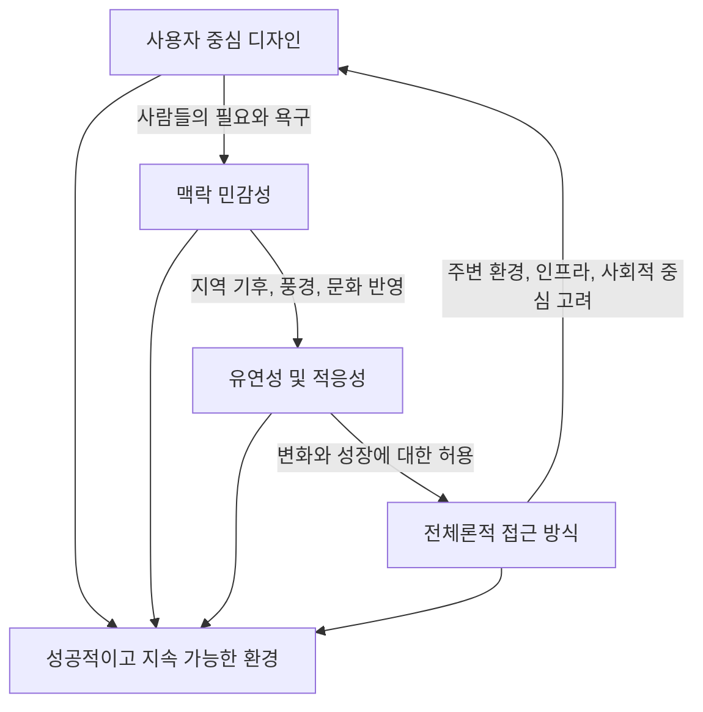

## 크리스토퍼 알렉산더의 '패턴 랭귀지': 모두를 위한 건축 디자인 언어
'패턴 랭귀지'는 건축과 도시 디자인에 대한 책으로, 단순히 이론이나 역사책이 아니라 누구나 도시, 건물, 방을 디자인하는 데 사용할 수 있는 <u>디자인 시스템</u>이자 <u>언어</u>를 제안한다 . 이 책은 좋은 환경이 건축가에 의해서만 만들어지는 것이 아니라, 평범한 사람들이 자신의 공간을 직접 만들 때 탄생한다고 주장한다 . 저자 크리스토퍼 알렉산더는 살아있고 인간적인 느낌을 주는 장소들을 관찰하여 얻은 디자인 규칙들을 모아 '패턴 랭귀지'를 만들었다 . 이 책에는 <u>253가지 패턴</u>이 담겨 있으며, 지역 전체 규모부터 창문 배치, 방의 형태까지 다양한 스케일을 다룬다 . 각 패턴은 건축 환경에서 반복적으로 발생하는 문제와 시간이 지나면서 성공적임이 입증된 특별한 해결책을 설명한다 . 이 패턴들은 언어의 단어처럼 조합하여 무한히 다양한 디자인을 만들어낼 수 있다 . 알렉산더는 사람들이 이 언어를 배우면, 우리 도시를 더 인간적이고, 적응력 있으며, 아름다운 방식으로 재건할 수 있다고 믿었다 .

## 1. 크리스토퍼 알렉산더는 누구일까? 

1. **수학적 배경을 가진 건축가**:
  - 크리스토퍼 알렉산더는 1936년 오스트리아 빈에서 태어나 나치 점령으로 인해 2년 후 영국으로 이주했다 .
  - 영국 케임브리지 트리니티 칼리지에서 공부한 후, 1950년대 후반 미국 케임브리지 매사추세츠의 하버드와 MIT에서 연구했다 .
  - 그는 건축과 수학을 모두 공부했는데, 이는 그의 디자인 이론 접근 방식에 큰 영향을 주었다 .
  - 이후 캘리포니아 버클리 대학교에서 오랫동안 건축학 교수로 재직하며 '환경 구조 센터'를 설립했다 .
2. 모더니즘** 비판**:
  - 알렉산더는 1960년대 초 '도시는 나무가 아니다(The City Is Not a Tree)'라는 책으로 큰 영향력을 얻었다 .
  - 이 책은 모더니즘(현대 건축 양식으로, 도시를 위에서 아래로 완전히 설계하여 모든 문제를 해결하려는 방식)에 대한 비판을 담고 있었다 .
  - 그는 현대 건축이 추상적이고, 경직되며, 인간 경험과 단절되었다고 믿었다 .
  - 반면, 중세 도시나 전통 가옥 같은 <u>전통적인 환경</u>이 더 편안하고 생동감 있게 느껴지는 이유를 이해하고 싶어 했다 .
  - 그는 추상적인 이론을 설계하는 대신, 실제 장소들을 관찰하기 시작했고, 그의 연구팀은 다양한 문화와 역사를 통틀어 성공적인 환경들을 연구하며 반복적으로 나타나는 공간 해결책들을 찾았다 .
3. **'**패턴** 랭귀지' 시리즈**:
  - 이러한 연구 결과가 바로 '패턴 랭귀지'로 이어졌으며, 이 책은 '건축의 영원한 방식(The Timeless Way of Building)'과 '오리건 실험(The Oregon Experiment)'과 함께 3부작을 이룬다 .
  - 이 책들은 살아있는 구조와 참여적 디자인을 중심으로 하는 건축 철학을 설명한다 .

## 2. '패턴 랭귀지'란 무엇일까? 

1. **디자인 지식을 패턴으로 정리한 것**:
  - '패턴 랭귀지'의 핵심 아이디어는 매우 간단하다. 디자인 지식을 <u>패턴</u>으로 정리할 수 있다는 것이다 .
  - 패턴은 환경에서 반복적으로 발생하는 문제와 그에 대한 검증된 해결책을 설명한다 .
  - 마치 문장이 단어를 조합하듯이, 건물은 패턴을 조합하여 만들어진다 .
2. **'**창가 자리**' 패턴의 예시**:
  - 예를 들어, 많은 사람이 밖을 보면서도 보호받는 느낌을 주는 곳에 앉는 것을 좋아한다 .
  - 알렉산더는 이를 '창가 자리(Window Place)' 패턴이라고 부른다 .
  - 해결책은 창문 옆에 편안하게 앉아 바깥세상을 관찰할 수 있는 <u>좌석이나 작은 공간</u>을 만드는 것이다 .
  - 이러한 패턴은 좋은 환경을 만드는 근본적인 구성 요소라고 알렉산더는 주장한다 .
3. **책의 구성**:
  - 이 책은 253개의 개별 패턴으로 구성되어 있으며, 각 패턴은 <u>문제 진술</u>, <u>해결책 구성 요소에 대한 자세한 설명</u>, 그리고 <u>제안된 해결책</u>으로 이루어져 있다 .
  - 패턴들은 계층 구조로 조직되어 있는데, 상위 레벨 패턴은 더 일반적이고 하위 레벨 패턴은 더 구체적이다 .
  - 이를 통해 독자는 디자인 과정에 대한 포괄적인 개요를 얻으면서도 관련 정보를 빠르게 찾을 수 있다 .

## 3. 패턴의 규모와 연결성 

1. **다양한 규모로 조직된 **패턴:
  - 패턴들은 규모에 따라 조직된다 .
  - <u>지역 계획</u>(도시 전체를 계획하는 것), <u>도시와 동네</u>, <u>건물</u>, <u>방</u>, 그리고 건축<u> 세부 사항</u>(건물을 짓는 아주 작은 부분들) 순으로 나뉜다 .
2. **패턴 간의 연결**:
  - 패턴들은 서로 연결되어 있다 .
  - 각 패턴은 그보다 <u>더 큰 상위 패턴</u>과 <u>더 작은 하위 패턴</u>을 제안한다 .
  - 예를 들어, 도시 패턴은 '작은 공공 광장(Small Public Squares)'을 추천할 수 있다 .
  - 더 작은 패턴은 광장의 가장자리가 건물과 울타리로 어떻게 형성되어야 하는지 설명할 수 있다 .
  - 더 작은 패턴은 벤치나 나무의 배치까지 구체적으로 지정할 수 있다 .
  - 이러한 관계를 통해 패턴들은 디자인 지식의 <u>네트워크</u>를 형성한다 .
  - 그 결과는 고정된 청사진(미리 정해진 설계도)이 아니라, 무한히 다양한 환경을 만들어낼 수 있는 생성 시스템(새로운 것을 계속 만들어내는 시스템)이다 .

## 4. 도시 규모의 패턴들 

1. 독립적인 지역** (Independent Regions)** :
  - 알렉산더는 지나치게 크고 중앙집권화된 도시가 제대로 기능하지 못한다고 주장한다 .
  - 대신, 지역은 서로 연결된 <u>반독립적인 공동체</u>로 구성되어야 한다 .
  - 각 공동체는 주거, 직장, 학교, 지역 상업 등 <u>일상생활에 필요한 모든 것</u>을 포함해야 한다 .
  - 이는 먼 공동체에 대한 의존도를 줄이고 <u>사회적 정체성</u>을 강화한다 .
  - 이 패턴은 도시 중심이 문화적, 사회적으로 자급자족해야 하며, 분권화된 정부 형태를 가져야 한다고 주장한다 .
  - 제안된 해결책은 전 세계적으로 <u>200만에서 1천만 명 사이의 인구</u>를 가진 독립적인 지역의 발전을 위해 노력하는 것이다 .
2. **7천 명 공동체 (**Community of 7,000**)** :
  - 알렉산더는 동네가 약 <u>7천 명의 인구</u>를 가질 때 가장 잘 기능한다고 제안한다 .
  - 이 숫자는 학교와 지역 기관을 지원하기에 충분히 크지만, 주민들이 서로를 알아볼 수 있을 만큼 충분히 작다 .
3. 식별 가능한 동네** (Identifiable Neighborhood)** :
  - 동네는 종종 도로, 공원 또는 자연 지형으로 형성되는 <u>명확한 경계</u>를 가져야 한다 .
  - 이 경계 내에서 거리와 공공 공간은 <u>지역 주민 간의 상호작용</u>을 장려해야 한다 .
  - 알렉산더는 대규모 <u>슈퍼 블록</u>(현대 도시 계획에서 흔히 볼 수 있는, 크고 획일적인 건물 단지)과 모더니스트 계획에 강력히 반대했다 .
  - 대신, 그는 세밀한 도시 구조(작고 다양한 건물과 공간으로 이루어진 도시 형태)를 옹호했다 .
4. 작은 공공 광장** (Small Public Squares)** :
  - 도시는 몇 개의 크고 기념비적인 공간보다는 <u>많은 작은 광장</u>을 포함해야 한다고 제안한다 .
  - 작은 광장은 친밀한 느낌을 주고 <u>일상적인 사회 활동</u>을 장려한다 .
  - 이러한 패턴들은 서로 연결된 <u>인간적인 규모의 공동체</u>로 이루어진 도시를 설명한다 .

## 5. 건물 규모의 패턴들 

1. 입구 전환** (Entrance Transition)** :
  - 건물은 갑작스러운 출입구 대신, 공공 공간과 사적 공간 사이에 <u>점진적인 전환</u>을 가져야 한다 .
  - 이는 현관, 작은 안뜰, 계단 또는 문턱 공간을 포함할 수 있다 .
  - 이러한 전환은 사람들이 심리적으로 외부에서 내부로 이동하는 데 도움을 준다 .
2. **모든 방의 **양면 채광** (Light on Two Sides of Every Room)** :
  - 알렉산더는 방이 <u>최소 두 방향에서 빛이 들어올 때</u> 더 쾌적하고 균형 잡힌 느낌을 준다고 관찰했다 .
  - 이 패턴은 현대 건물에서 흔한 깊은 바닥판(건물 내부가 깊어서 창문이 한쪽에만 있는 구조)과 좁은 창문 배열에 도전한다 .
3. 계단과 무대** (Staircases and Stage)** :
  - 계단을 좁은 복도에 숨기는 대신, 알렉산더는 계단을 <u>눈에 띄고 중앙에 배치</u>하여 건물 내 사회생활을 풍요롭게 할 것을 제안한다 .
4. 친밀도 경사** (Intimacy Gradient)** :
  - 잘 설계된 집에서는 공간이 공공에서 사적인 영역으로 <u>점진적으로 이동</u>해야 한다 .
  - 예를 들어, 현관, 거실, 식사 공간, 침실 순으로 배치하는 것이다 .
  - 이러한 경사는 일상생활을 조직하고 공공 활동과 사적 활동이 겹치는 것을 방지하는 데 도움을 준다 .

## 6. 건축 세부 사항 패턴 

1. 두꺼운 벽** (Thick Walls)** :
  - 벽은 깊이를 가져야 하며, 창가 자리, <u>벽감</u>(벽을 파서 만든 작은 공간), 그리고 <u>수납공간</u>을 포함해야 한다 .
  - 이러한 두께는 벽을 단순한 경계에서 <u>거주 가능한 공간</u>으로 변화시킨다 .
2. 기둥** 간격 (Column Distribution)** :
  - 이 패턴은 벽을 지지하는 <u>보조 기둥의 간격</u>이 천장 높이, 층수, 방 크기에 따라 어떻게 달라져야 하는지 다룬다 .
  - 알렉산더는 건물과 공동체의 모든 측면을 고려해야 한다는 전체론적 접근<u> 방식</u>(모든 것을 하나로 연결하여 보는 방식)을 강조한다 .
  - 제안된 해결책은 <u>1층에서 기둥을 가장 멀리 배치</u>하고, 건물 위로 올라갈수록 더 가깝게 배치하는 것이다 .
  - 또한, 작은 방의 벽을 따라서는 기둥을 더 가깝게, 큰 방의 벽을 따라서는 더 멀리 배치해야 한다 .

## 7. '패턴 랭귀지'의 영향과 비판 

1. **예상치 못한 분야로의 확장**:
  - '패턴 랭귀지'의 영향은 건축을 훨씬 넘어선다 .
  - 가장 예상치 못한 분야 중 하나는 <u>소프트웨어 공학</u>이었다 .
  - 1990년대에 프로그래머들은 소프트웨어 시스템에서 반복되는 해결책을 설명하기 위해 디자인 패턴 개념을 사용하기 시작했다 .
  - 이는 유명한 책 '디자인 패턴: 재사용 가능한 객체 지향 소프트웨어의 요소들'로 이어졌는데, 이 아이디어는 알렉산더의 '패턴 랭귀지'에서 직접 영감을 받았다 .
2. 도시 계획** 및 **참여적 디자인:
  - 도시 계획가와 <u>참여적 디자인 옹호자</u>(전문가에게만 의존하지 않고 공동체가 직접 환경을 만드는 것을 지지하는 사람들)들도 이 책을 받아들였다 .
  - 이 책은 공동체가 전문 디자이너에게만 의존하기보다는 <u>자신들의 환경을 형성하는 데 참여해야 한다</u>는 아이디어를 지지했다 .
  - 오늘날에도 많은 건축가, 도시 계획가, 디자이너들이 인간 중심 디자인(사람들의 필요와 경험을 최우선으로 생각하는 디자인)을 논할 때 알렉산더의 작업을 참고한다 .
3. **신도시주의 (**New Urbanism**)와의 관계**:
  - <u>신도시주의</u>(1980년대부터 1990년대에 걸쳐 발전한 도시 계획 운동으로, 인간적인 규모의 공동체와 전통적인 도시 형태를 강조한다)는 알렉산더의 사상에서 파생된 것이라고 볼 수 있다 .
  - 알렉산더는 1987년 '새로운 도시 디자인 이론(A New Theory of Urban Design)'이라는 책에서 <u>대규모 인간 정착지 디자인</u>에 대한 추가적인 설명을 제공했다 .
  - 그는 성장 규칙을 통해 매우 만족스러운 인간 정착지를 만들 수 있다고 설명했다 .
  - 알렉산더는 이러한 규칙들이 추상적인 것이 아니라 <u>실제로 </u>건설<u> 가능하며 건설되어야 한다</u>고 믿었고, 자신의 원칙을 구현한 여러 건물을 직접 지었다 .
  - 하지만 알렉산더가 직접 시도한 공동체는 <u>중세 이탈리아 마을</u>처럼 보인다는 비판을 받기도 했다 .
  - 이는 그의 작업이 현대 도시의 빠른 건설 속도와 양립하기 어렵고, <u>특정 시대와 형태의 디자인</u>(예: 고풍스러운 중세 정착지)을 낭만화한다는 비판으로 이어졌다 .
4. **비판과 논쟁**:
  - 영향력에도 불구하고 '패턴 랭귀지'는 비판에 직면하기도 했다 .
  - 일부 건축가들은 패턴이 <u>너무 규범적</u>(너무 구체적으로 지시하는)이라고 주장한다 .
  - 패턴을 너무 문자 그대로 따르면 <u>예측 가능하거나 향수를 불러일으키는 디자인</u>만 나올 수 있다고 우려한다 .
  - 다른 이들은 이 책이 <u>전통적인 환경을 이상화</u>하는 반면, 현대 도시의 복잡성을 과소평가한다고 주장한다 .
  - 또한, 이 책은 1970년대의 문화적 규범과 성 역할을 반영하여, 여성이 주로 육아와 가사 노동을 담당한다고 가정하는 등 <u>시대에 뒤떨어진 견해</u>를 포함하고 있다는 비판도 있다 .
  - 사회적 지속 가능성을 강조하는 것은 강점이지만, <u>환경 의식</u>은 충분히 고려되지 않았다 .
  - 알렉산더는 모더니즘과 획일적인 디자인을 거부하지만, 이는 포스트모던(현대 이후의 다양한 양식)이라기보다는 <u>프리모던</u>(현대 이전의 전통적인 양식)에 가깝다 .
  - 오랜 전통 사회가 지속 가능한 디자인을 위한 충분한 미적, 기능적 틀을 제공한다고 본다 .
5. **여전히 유효한 메시지**:
  - 비판에도 불구하고, 비평가들조차 이 책의 중요성을 인정한다 .
  - 알렉산더는 형식적인 미학에서 <u>인간 경험</u>으로 관심을 돌렸다 .
  - 그는 건축이 궁극적으로 사람들을 위해 존재한다는 것을 디자이너들에게 상기시켰다 .
  - 출판된 지 40년이 넘었지만, '패턴 랭귀지'는 건축에 관한 가장 독창적인 책 중 하나로 남아 있다 .
  - 그의 핵심 아이디어는 강력하다. 좋은 환경은 고립된 천재가 아니라 공유된 디자인 지식에서 나온다는 것이다 .
  - 반복되는 공간 해결책을 식별함으로써, 알렉산더는 사람들이 협력하여 장소를 디자인할 수 있는 언어를 만들었다 .
  - 급속한 도시화, 주택 부족, 기후 변화와 같은 도전에 직면한 시대에, 이 아이디어는 그 어느 때보다 중요할 수 있다 .
  - 건축은 단순히 사물에 관한 것이 아니라 <u>삶의 패턴</u>에 관한 것이며, 이러한 패턴을 이해하는 것이 진정으로 살아있는 장소를 만드는 열쇠일 수 있다 .

## 8. '패턴 랭귀지'의 핵심 가치 

1. **사용자 **중심** 디자인 (**User-Centered Design**)** :
  - 이 책의 핵심 주제 중 하나는 <u>사용자 중심 디자인의 중요성</u>이다 .
  - 저자들은 건물이나 공동체의 디자인이 추상적인 미학 원칙이나 선입견이 아니라, <u>실제로 사용하는 사람들의 필요와 욕구</u>에 따라 이루어져야 한다고 주장한다 .
  - 디자이너는 단순히 집이나 학교의 기능적 요구 사항을 충족시키는 것을 넘어, <u>인간의 행복을 지원하는 환경</u>을 만드는 데 집중해야 한다 .
2. 맥락** 민감성 (Context Sensitivity)** :
  - 이 책의 주요 강점 중 하나는 <u>맥락의 중요성</u>을 강조한다는 점이다 .
  - 저자들은 건물이나 공동체의 디자인이 <u>특정 위치, 문화, 역사를 고려</u>해야 한다고 주장한다 .
  - 디자인은 외래적인 생활 방식이나 미학을 강요하기보다는 <u>지역의 기후, 풍경, 문화를 반영</u>해야 한다 .
3. 유연성** 및 적응성 (Flexibility and Adaptability)** :
  - 이 책은 시간이 지남에 따라 <u>유연하고 적응 가능한 환경</u>을 만드는 것의 중요성도 강조한다 .
  - 저자들은 건물과 공동체가 <u>변화와 성장을 허용</u>하도록 설계되어야 하며, 경직되고 융통성 없어서는 안 된다고 주장한다 .
  - 다양한 사용자와 활동을 수용하고, 시간이 지남에 따라 사람들의 변화하는 요구를 충족시키기 위해 <u>진화할 수 있는 공간</u>을 만드는 것의 중요성을 강조한다 .
4. 전체론적 접근** 방식 (Holistic Approach)** :
  - 이 책은 디자인에 대한 <u>전체론적 접근 방식</u>으로도 주목할 만하다 .
  - 저자들은 건물이나 공동체의 디자인이 고립되어 고려되어서는 안 되며, <u>주변 경관, 인프라, 사회적 중심을 포함하는 더 큰 시스템의 일부</u>로 보아야 한다고 주장한다 .
  - 디자이너는 이러한 모든 요소의 <u>상호 연관성</u>을 고려하고, 모든 사람들의 전반적인 삶의 질을 지원하고 향상시키는 환경을 만들기 위해 노력해야 한다 .

