## 팩트풀니스: 세상을 있는 그대로 바라보는 지혜
이 책은 우리가 세상을 오해하고 비관적으로 바라보게 만드는 10가지 본능을 파헤치고, 사실(팩트)에 기반하여 세상을 더 명확하고 희망적으로 이해하는 방법을 알려준다. 저자는 통계와 데이터를 통해 세상이 생각보다 훨씬 더 나아지고 있음을 보여주며, 막연한 불안감에서 벗어나 현실적인 문제 해결에 집중하도록 돕는다.

## 1. 세상을 오해하는 우리의 본능 

1. **세상을 걱정하는 우리의 마음**: 우리는 아침부터 밤까지 전쟁, 질병, 빈곤, 환경 파괴 같은 소식에 둘러싸여 세상이 벼랑 끝으로 가고 있다고 확신하는 경향이 있다. 
  1. 이러한 거대한 슬픔은 세상의 실체라기보다는 우리가 세상을 바라보는 방식에서 비롯된 것일 수 있다. 
2. **침팬지보다 낮은 정답률**: 전 세계의 똑똑한 사람들에게 세상의 현재 상태에 대한 질문을 던졌을 때, 무작위로 답을 고른 침팬지보다 정답률이 낮았다. 
  1. 이는 우리가 단순히 정보를 몰라서 틀리는 것이 아니라, 세상을 잘못된 방향으로 오해하고 있음을 보여준다. 
3. **생존 본능의 역설**: 우리의 뇌는 오래전부터 생존을 위해 위험을 즉각적으로 감지하고 비극적인 상황에 민감하게 반응하도록 발달해왔다. 
  1. 과거에는 우리를 보호하는 방패였던 이 본능들이, 데이터와 통계가 지배하는 복잡한 현대 사회에서는 진실을 왜곡하는 굴절 렌즈가 되어버렸다. 
  2. 우리는 사실을 보고 있다고 믿지만, 실제로는 뇌가 편집하고 가공한 드라마틱한 세계관을 보고 있는 셈이다. 
4. **심리적 환영**: 우리가 세상을 바라보며 느끼는 압도적인 비관과 무력감은 사실에 기반한 진실이라기보다, 우리 뇌가 만들어낸 정교한 심리적 환영일 수 있다. 
  1. 세상은 완벽하지 않고 고통이 산재해 있지만, 우리가 믿는 것만큼 무질서하고 절망적이지는 않다. 
  2. 편견이라는 무거운 외투를 벗고 세상을 맑고 투명하게 바라보는 것이 불안으로부터 자신을 구원하는 첫걸음이 될 것이다. 

## 2. 간극 본능: 세상을 둘로 나누는 오래된 습관 

1. **이분법적 사고의 유혹**: 우리는 본능적으로 모든 대상을 둘로 나누어 서로 반대되는 상자에 넣으려는 강한 유혹을 느낀다. 
  1. 선과 악, 부유함과 가난함, 선진국과 개발도상국처럼 세상을 명쾌하고 단순하게 정리하는 듯한 안도감을 준다. 
  2. 하지만 이러한 마음의 평온은 사실과 거리가 먼 경우가 많다. 
2. **사라지는 중간 지대**: 우리가 '그들'과 '우리' 사이에 건널 수 없는 절벽이 있다고 믿는 순간, 그 사이를 채우고 있는 수억 명의 구체적이고 역동적인 삶은 차가운 안개 속으로 사라져 버린다. 
  1. 우리가 흔히 떠올리는 개발도상국의 이미지는 굶주린 아이들과 척박한 땅이지만, 통계를 통해 보면 이러한 극단 사이의 거대한 구렁텅이는 상상 속에만 존재한다. 
  2. 오늘날 전 세계 인구의 압도적인 다수는 우리가 나눈 두 개의 상자 중 어디에도 속하지 않는 광활한 중간 지대에서 살아가고 있다. 

## 3. 4단계 소득 수준으로 세상을 이해하기 

1. **점진적인 삶의 여정**: 저자는 인류의 삶을 4단계의 소득 수준으로 나누어 이해할 것을 제안한다. 
  1. 이 점진적인 여정은 세상을 보는 고정된 프레임을 부드럽게 무너뜨리는 지적인 자극이 된다. 
2. **각 단계의 삶**:
  1. 1단계: 하루 2달러 미만의 소득으로 생존한다. 신발 없이 흙길을 걷고, 더러운 물을 길어오며, 진흙 바닥에서 잠을 잔다. 언론에서 보는 극빈층의 고통스러운 삶이다. 
  - 다행히 지난 수십 년간 1단계 인구는 급격히 줄어들었다. 
  2. **2단계**: 하루 2~8달러의 소득으로 살아간다. 가족 모두 신발이 생기고, 아이들은 학교에 가며, 작은 전구 하나가 밤을 밝혀준다. 
  3. **3단계**: 하루 8~32달러의 소득을 올린다. 집안에 깨끗한 수도가 연결되고, 작은 오토바이가 생기며, 냉장고를 누리며 식탁의 풍요를 꿈꾼다. 
  4. **4단계**: 하루 32달러 이상의 소득을 올리며 고등 교육을 누리고 해외여행을 떠나는 삶을 향유한다. 우리가 속한 단계이다. 
3. **중간층의 중요성**: 전 인류의 약 75%가 2단계와 3단계에 거주한다. 
  1. 우리가 막연히 상상하는 처참한 빈곤 속에 갇혀 있는 것이 아니라, 어제보다 나은 내일을 위해 부지런히 계단을 오르고 있는 중이다. 

## 4. 간극 본능을 극복하는 방법 

1. **시각적 착각**: 우리가 4단계라는 높은 봉우리에서 아래를 내려다볼 때 발생하는 시각적 착각 때문에 여전히 세상을 잘 사는 나라와 못 사는 나라로만 기억하려 한다. 
  1. 높은 빌딩 꼭대기에서 땅을 내려다보면 집들의 높낮이가 구별되지 않고 모두 납작하게 보이는 것과 같다. 
  2. 우리의 높은 위치가 타인의 성장을 제대로 보지 못하게 만드는 가림막이 된 셈이다. 
2. **오해와 무력감**: 이러한 이분법적 본능은 우리에게 은밀한 우월감을 주지만, 동시에 세상에 대한 깊은 오해와 무력감을 심어준다. 
  1. 중간층이 사라진 세상에서 우리는 타자의 고통을 멀리 있는 비극으로 치부하거나, 가진 것을 잃을까 두려워하는 방어적인 자세를 취하게 된다. 
3. **정서적 연결감**: 세상이 끊어지지 않는 연속적인 선상 위에 있다는 것을 깨닫는 순간, 우리는 그들에게서 우리의 옛 모습을 발견하는 따뜻한 경험을 하게 된다. 
  1. 3단계의 삶은 불과 몇십 년 전 우리 부모님의 삶이었고, 2단계의 고단함은 우리 할아버지 세대가 견뎌냈던 시간이었음을 이해하게 된다. 
  2. 이러한 연결감은 단순한 연민을 넘어, 인류가 공통으로 겪는 장엄한 성장의 서사에 동참하고 있다는 위안을 준다. 
4. **데이터의 중요성**: 간극 본능에 휘둘리지 않으려면, 평균이라는 수치 뒤에 숨겨진 실제 데이터의 풍성한 분포를 살피는 세심함이 필요하다. 
  1. 평균은 양 극단 사이의 역동적인 움직임과 수많은 예외를 지워버려 우리를 눈멀게 할 수 있다. 
5. **뉴스의 함정**: 우리가 매일 접하는 뉴스는 자극적이고 극단적인 사례들만을 선별하여 보여준다. 
  1. 평범한 다수가 누리는 잔잔한 일상의 개선은 뉴스거리가 되기 어렵기 때문에, 우리는 세상의 가장 비극적이거나 화려한 단면만을 소비하게 된다. 
  2. 마치 다른 사람의 화려한 SNS 게시물만 보고 자신의 평범한 하루를 초라하다고 느끼는 것처럼, 세상의 양 극단만을 보며 인류의 거대한 진보를 외면하고 있었을지도 모른다. 
6. **세상을 향한 새로운 시선**: 세상은 흑백의 강렬한 대조가 아니라, 수만 가지 다채로운 색채가 겹치고 이어지는 풍성한 그라데이션에 가깝다. 
  1. 이 사실을 겸허하게 받아들이는 것만으로도 마음이 가벼워질 수 있다. 
  2. 우리가 적대시하거나 과도하게 동정했던 수많은 존재가 사실은 우리와 비슷한 고민을 하며 비슷한 속도로 생의 계단을 오르고 있다는 사실은 커다란 위안이 된다. 
  3. 우리는 서로 고립된 섬이 아니라, 인류라는 거대한 흐름 속에서 함께 노를 저으며 흘러가는 소중한 동반자들이다. 

## 5. 부정 본능: 나쁜 소식에 주목하는 자연스러운 경향 

1. **비극에 이끌리는 시선**: 우리는 매일 아침 눈을 뜨자마자 세상의 비극과 마주한다. 
  1. 끔찍한 사고, 정치적 갈등, 경제 위기, 환경 파괴에 관한 경고들이 쉴 새 없이 우리를 찾아온다. 
  2. 이런 소식들을 접할 때마다 세상이 점점 더 깊은 수렁으로 빠져들고 있다는 강력한 인상을 받게 된다. 
  3. 마치 우리가 탄 배가 서서히 가라앉는 것 같은 막막한 기분은 우리를 깊은 무력감 속에 가두곤 한다. 
2. **생존을 위한 뇌의 설계**: 왜 우리는 좋은 소식보다 나쁜 소식에 그토록 쉽고 빠르게 마음을 내어주는 것일까? 
  1. 우리의 뇌는 수만 년 전부터 위험을 감지하는 데 최적화되어 왔다. 
  2. 평화로운 풍경보다는 숲 너머에서 들리는 작은 바스락거림에 온 신경을 집중해야만 살아남을 수 있었던 조상들의 유산이 우리 안에 흐르고 있는 셈이다. 
  3. 오늘날 그 '수풀 속 바스락거림'은 자극적인 뉴스 헤드라인으로 바뀌었다. 
3. **언론의 역할**: 언론은 우리의 이러한 생존 본능을 정확하게 꿰뚫고 있다. 
  1. 점진적으로 개선되는 상황은 매력적인 기사거리가 되지 못한다. 
  2. "지난해 전 세계 영아 사망률이 조금 더 낮아졌습니다"라는 소식보다는 "어느 지역에서 수백 명이 질병으로 목숨을 잃었습니다"라는 소식이 훨씬 더 많은 사람의 시선을 붙잡기 때문이다. 
  3. 결국 우리가 매일 마주하는 정보의 강물은 세상의 전체 모습이 아니라, 필터로 걸러진 가장 어둡고 날카로운 조각들의 집합일 가능성이 크다. 

## 6. 나쁜 상태와 나아지는 상태를 혼동하지 않기 

1. **인식의 오류**: 우리는 어떤 상황이 여전히 고통스럽고 나쁘다는 사실만을 근거로, 그것이 나아지고 있다는 변화의 흐름을 통째로 부정해 버리곤 한다. 
  1. 마치 중환자실 환자가 여전히 위독하지만, 어제보다 혈압이 안정되고 호흡이 편안해졌다면 분명히 나아지고 있는 상태인 것과 같다. 
  2. 세상도 이와 같다. 지구상에는 여전히 굶주림과 전쟁으로 고통받는 이들이 존재하지만, 지난 20년 동안 그 수치가 절반 가까이 줄어들었다는 사실 또한 엄연한 진실이다. 
  3. 나쁜 것과 나아지는 것이 동시에 존재할 수 있다는 단순한 진리를 받아들일 때, 우리는 비로소 세상을 있는 그대로 바라볼 수 있는 지혜의 입구에 서게 된다. 

## 7. 장밋빛 과거를 조심하라 

1. **뇌의 망각 기술**: 우리는 흔히 "옛날이 좋았지"라며 지나간 시간을 그리워하지만, 이는 우리 뇌가 가진 교묘한 망각의 기술이 만들어낸 환상일 수 있다. 
  1. 인간은 현재의 고통을 견디기 위해 과거에 힘들었던 기억은 희미하게 지우고, 아름다웠던 순간들만을 선명하게 남겨두는 경향이 있다. 
  2. 낡은 사진을 보며 미소 짓는 동안, 우리는 그 시절 겪어야 했던 수많은 질병과 부조리했던 사회적 관습들을 쉽게 잊어버린다. 
  3. 과거를 실제보다 더 아름답게 채색하고 현재를 실제보다 더 비관적으로 바라보는 이 마음의 습관이, 우리로 하여금 세상은 점점 나빠지고 있다는 거대한 오해에 빠지게 만든다. 
2. **인류의 놀라운 진보**: 실제로 데이터를 통해 확인해 본 세상은 우리의 우려와는 사뭇 다른 이야기를 들려준다. 
  1. 지난 100년 동안 인류는 믿기 힘들 정도의 진보를 이루어냈다. 
  2. 1800년대에는 전 인류의 약 85%가 극빈층이었지만, 오늘날 그 수치는 9%대로 떨어졌다. 
  3. 노예제는 거의 모든 국가에서 법으로 금지되었고, 여성의 투표권은 당연한 권리가 되었으며, 평균 수명은 두 배 이상 늘어났다. 
  4. 이러한 변화는 단번에 일어난 기적 같은 사건이 아니라, 수많은 사람이 각자의 자리에서 조금씩 더 나은 세상을 만들기 위해 애써온 결과이다. 
  5. 하지만 안타깝게도 이런 점진적인 개선은 너무 느리게 진행되기에 우리의 눈에는 잘 보이지 않는다. 
  6. 마치 매일 자라나는 아이의 키를 느끼지 못하다가 어느 날 문득 훌쩍 커버린 모습에 놀라는 것처럼, 세상의 성장에 대해서도 무감각해져 있었던 것은 아닐까? 

## 8. 부정 본능을 극복하는 실천적 지혜 

1. **질문하는 습관**: 나쁜 소식의 홍수 속에서도 평온을 유지하려면, 나쁜 뉴스를 접할 때마다 스스로에게 질문을 던지는 연습이 필요하다. 
  1. "이 소식이 세상의 전체를 대변하고 있는가?" 
  2. "이 비극 뒤에 우리가 놓치고 있는 긍정적인 변화의 흐름은 무엇인가?" 
2. **낙관론이 아닌 공정한 평가**: 사실을 기반으로 세상을 바라본다는 것은 결코 낙관론자가 되어 현실을 회피하자는 뜻이 아니다. 
  1. 오히려 세상의 나쁜 면을 정확히 인지하되, 그것을 해결할 수 있는 인류의 역량과 그동안 이뤄온 성과를 공정하게 평가하자는 초대이다. 
3. **두려움에서 벗어나 집중하기**: 세상의 나아짐을 신뢰하게 될 때, 우리는 비로소 막연한 두려움에서 벗어나 우리가 해야 할 일들에 더 집중할 수 있게 된다. 
  1. 세상이 나빠지고 있다는 생각은 우리를 지적으로 보이게 할지는 몰라도, 우리를 행복하게 만들거나 세상을 바꾸는 동력을 주지는 못한다. 
  2. 팩트에 기반한 따뜻한 시선을 가질 때, 세상은 그 거칠고 날선 외피를 벗고 우리에게 속삭이기 시작한다. "우리는 여전히 부족하지만 분명히 더 나은 방향으로 나아가고 있다"고 말이다. 
  3. 이러한 믿음은 우리를 지치게 만드는 비관주의로부터 지켜주는 가장 단단한 방패가 될 것이다. 

## 9. 공포 본능: 원초적인 공포에 사로잡히는 이유 

1. **경고음을 울리는 내면**: 명확한 지표들이 있음에도 불구하고, 우리가 세상이 곧 무너질 것처럼 느끼는 데는 또 다른 설명이 필요하다. 
  1. 그것은 단지 소식의 성격 때문만이 아니라, 우리 내면 깊숙한 곳에서 끊임없이 경고음을 울리며 우리를 긴장시키는 원초적인 공포 때문이다. 
2. **막연한 불안과 재난 소식**: 우리는 고요하고 평온한 일상 속에서도 종종 이름 모를 막연한 불안에 깊이 휩싸이곤 한다. 
  1. 스마트폰 화면 속에서는 비행기 추락 사고, 대지진, 테러 위협 같은 참혹한 재난과 사고 소식이 쉴 새 없이 쏟아져 나온다. 
  2. 이러한 소식들은 우리의 논리적인 사고 체계를 순식간에 마비시키고, 우리를 거대한 공포의 소용돌이 속으로 밀어넣는다. 
3. **비합리적인 반응**: 왜 우리는 통계적으로 발생할 확률이 극히 드문 일들에 이토록 민감하게 반응하며, 정작 우리의 삶을 서서히 잠식하는 실제적인 위험들에 대해서는 이토록 무감각한 것일까? 

## 10. 생존을 위한 진화의 유산 

1. **위험 감지 시스템**: 인간의 뇌는 사실을 냉철하게 분석하기보다는, 생존을 위해 위험한 상황을 즉각적으로 감지하도록 오래전부터 설계되어 왔다. 
  1. 아주 먼 조상들이 야생에서 살아남아야 했던 시절, 숲에서 들리는 작은 바스락거림을 맹수의 공격이라 가정하고 즉시 도망쳤던 이들이 살아남아 우리의 조상이 되었다. 
  2. 즉, 공포는 우리가 진화의 기나긴 여정 속에서 획득한 가장 강력하고 효율적인 생존 도구였다. 
2. **편도체의 역할**: 뇌 깊숙한 곳에 자리 잡은 편도체는 논리적인 분석이 채 되기도 전에 위험 신호를 온몸으로 보내고, 우리의 심장과 근육을 즉각적인 긴장 상태로 만든다. 
  1. 이러한 원초적 시스템은 현대 사회에서도 여전히 활발히 작동하지만, 오늘날 우리가 마주하는 위협은 과거처럼 눈에 보이는 포식자가 아니라 훨씬 더 복잡하고 추상적인 형태로 찾아온다. 

## 11. 공포의 유형과 언론의 활용 

1. **특정 유형의 **공포: 우리가 특히 강력하게 느끼는 공포에는 몇 가지 뚜렷한 유형이 있다. 
  1. 신체적 폭력에 대한 두려움, 감금이나 통제당하는 것에 대한 공포, 치명적인 독이나 오염에 대한 거부감 같은 것들이다. 
  2. 자연재해, 비행기 사고, 테러는 이러한 인간의 근원적인 공포를 가장 직접적이고 강력하게 자극하는 소재들이다. 
2. **언론의 심리 포착**: 언론과 미디어는 본능적으로 이러한 대중의 심리를 정확하게 포착해 낸다. 
  1. 수만 명이 매일 교통사고로 목숨을 잃거나 만성 질환으로 서서히 사그라지는 이야기는 충분히 드라마틱하지 않기에 보도되지 않는다. 
  2. 하지만 단 한 번의 비행기 사고는 전 세계 모든 언론의 헤드라인을 며칠씩 장식하곤 한다. 
  3. 우리는 반복되는 비극적인 영상과 자극적인 언어를 접하며, 비행기를 타는 행위가 일상적으로 자동차를 운전하는 것보다 수만 배는 더 위험하다는 거대한 착각에 빠지게 된다. 
  4. 이것이 바로 공포 본능이 우리에게 씌우는 지독하고 정교한 환상이다. 

## 12. 데이터로 본 재난의 진실 

1. **사망자 수의 감소**: 데이터를 통해 재난의 역사를 차분히 들여다보면 놀라운 진실과 마주하게 된다. 
  1. 지난 100년 동안 자연재해로 목숨을 잃은 사람의 수는 무려 90% 이상 감소했다. 
  2. 이는 인류의 기술 발달, 정교해진 기상 예보 시스템, 국제적인 구호 체계와 안전 설계 덕분이다. 
  3. 세상이 훨씬 더 위험해졌다는 우리의 주관적인 느낌과는 정반대로, 사실 인류는 역사상 그 어느 때보다 안전하고 보호받는 시대에 살고 있다. 
2. 공포** 본능의 방해**: 하지만 공포 본능은 이러한 객관적인 수치를 있는 그대로 보지 못하게 집요하게 가로막는다. 
  1. 한번 뇌리에 각인된 강렬한 비극의 이미지와 공포는 숫자가 주는 차분한 안도감보다 훨씬 강력한 힘을 발휘하기 때문이다. 
  2. 우리는 비행기 사고가 날 확률을 이성적으로 계산하기보다는, 추락하는 비행기 안에서 느낄 형용할 수 없는 두려움을 먼저 상상하며 괴로워한다. 

## 13. 위험을 정확하게 인지하는 지혜 

1. **주관적 공포와 실제적 위험 구별**: 위험을 정확하게 인지하고 마음의 평화를 얻기 위해서는, 우리가 느끼는 주관적인 공포와 실제적인 위험을 엄격하게 구별하는 연습이 필요하다. 
2. **위험 산식**: 지혜로운 이들은 위험을 바라볼 때 다음과 같은 단순하지만 명확한 산식을 가슴에 새기려 했다. 
  1. 위험 = (사건 발생 시 치명적인 정도) × (일상에서 사건에 노출되는 빈도) 
  2. 테러는 분명 끔찍하고 치명적인 사건이지만, 평범한 개인이 직접 노출될 확률은 살면서 번개에 맞을 확률보다 현저히 낮다. 
  3. 반면, 매년 수백만 명의 목숨을 소리 없이 앗아가는 과도한 설탕 섭취, 앉아서 생활하는 습관, 보이지 않는 대기오염은 우리에게 테러만큼의 즉각적인 공포를 주지는 않는다. 
  4. 그러나 실제로는 우리 삶에 훨씬 더 크고 실질적인 위험을 끼치고 있다. 
  5. 공포스러운 것이 반드시 위험한 것은 아니며, 진짜 위험한 것이 언제나 공포스러운 형태로 우리 앞에 나타나지는 않는다는 사실을 늘 기억해야 한다. 
3. **진화된 본능과 현실의 괴리**: 우리가 느끼는 불안의 상당 부분은 이렇듯 우리의 진화된 본능과 현대의 객관적 현실 사이에 깊은 괴리에서 발생한다. 
4. **관조하는 자세**: 사실적으로 세상을 바라본다는 것은 우리가 느끼는 자연스러운 공포를 무조건 무시하거나 억누르라는 뜻이 아니다. 
  1. 오히려 우리가 왜 이토록 두려움을 느끼는지 그 진화론적 기원을 깊이 이해하고, 그 감정이 우리의 눈을 가려 진실을 왜곡하지 않도록 한 걸음 뒤로 물러나 관조하는 일이다. 
  2. 공포가 내리는 성급한 지시에 따라 충동적으로 세상을 판단하기보다는, 잠시 숨을 고르고 객관적인 데이터를 찾아보는 사소한 습관만으로도 우리는 많은 심리적 고통에서 자유로워질 수 있다. 
  3. 진정한 평온함이란 위험이 전혀 존재하지 않는 진공 상태가 아니라, 우리를 위협하는 것들의 크기를 정확하게 가늠하고 통제할 수 있을 때 비로소 찾아오는 마음의 상태이기 때문이다. 

## 14. 숫자의 환상: 문맥 없는 숫자의 위험성 

1. **이성적인 도구의 역설**: 우리의 이성을 마비시키고 시야를 흐리게 만드는 것은 강렬한 감정의 파도뿐만이 아니다. 
  1. 때로는 우리를 도와줄 것이라 굳게 믿었던 이성적인 도구들, 특히 눈앞에 펼쳐진 거대한 숫자와 수많은 지표들이 오히려 우리를 더 큰 혼란과 착각 속에 빠뜨리기도 한다. 
2. **숫자에 대한 맹신**: 우리는 숫자가 지닌 특유의 명징함과 객관성을 신뢰한다. 
  1. 숫자는 인간의 변덕스러운 감정에 휘둘리지 않고 오직 차가운 진실만을 정확하게 말해 줄 것이라 기대하기 때문이다. 
  2. 하지만 역설적이게도 숫자는 때때로 세상의 실체를 가장 교묘하게 가리는 정교한 가림막이 되기도 한다. 
  3. 특히 문맥에서 툭 떨어진 채 홀로 외롭게 존재하는 고독한 숫자를 마주할 때, 우리의 마음은 그 숫자가 뿜어내는 압도적인 크기에 매료되어 이성적인 판단의 끈을 너무나 쉽게 놓쳐 버리곤 한다. 

## 15. 숫자를 지혜롭게 활용하는 법 

1. **비교 대상의 중요성**: 뉴스 화면을 가득 채우는 "한 해 동안 전 세계에서 수백만 명의 아이들이 목숨을 잃었다"는 비극적인 숫자를 접하며 깊은 슬픔과 무력한 절망을 느낀다. 
  1. 이는 분명 가슴 아픈 일이지만, 그 숫자가 작년보다 혹은 10년 전보다 얼마나 경이롭게 줄어든 수치인지 차분히 비교해 보지 않는다면, 인류가 그동안 묵묵히 이뤄온 소중한 개선의 흔적들을 영영 발견하지 못할 수도 있다. 
  2. 우리의 뇌는 거대한 숫자를 마주하면 본능적으로 긴장하며 그것을 즉각적인 위기로 인식하도록 길들여져 있다. 
  3. 하지만 세상을 향한 지혜로운 시선을 갖기 위해서는, 이 고독한 숫자에게 다정한 친구를 만들어 주는 연습이 필요하다. 
  4. 어떤 수치가 유독 크거나 작아 보일 때, 우리는 반드시 그 옆에 비교 대상이 되는 다른 숫자를 나란히 세워 보아야 한다. 
2. **비율과 비중의 중요성**: 전체를 아우르는 총합의 숫자보다는 비율과 비중을 세심하게 살피는 것이 무엇보다 중요하다. 
  1. 천 명 중 열 명이 겪는 일과 백만 명 중 열 명이 겪는 일은 그 통계적 무게감이 전혀 다르기 때문이다. 
  2. 우리는 종종 눈앞의 총합에 마음을 빼앗겨, 그 이면에 도도하게 흐르는 변화의 속도와 방향을 놓치곤 한다. 
3. **숫자는 유연한 좌표**: 숫자는 그 자체로 완성된 진실이라기보다, 진실을 찾아가기 위해 우리가 붙잡아야 할 하나의 유연한 좌표에 가깝다. 
  1. 그 좌표가 어디에서 출발했으며 지금 어느 지점을 향해 가고 있는지 묻지 않는다면, 숫자는 우리를 세상을 향한 끝없는 비관의 늪으로 안내하는 잘못된 지도가 될 수 있음을 늘 경계해야 한다. 

## 16. 80대 20 법칙과 핵심에 집중하기 

1. **불필요한 짐 덜어내기**: 세상의 수많은 복잡한 문제에 압도되어 마음이 무거워질 때, 우리는 80대 20의 법칙을 떠올려 보며 마음에 불필요한 짐을 덜어낼 수 있다. 
  1. 우리를 괴롭히는 수십 가지 산적한 문제 중에서, 실제로 우리의 운명에 가장 결정적인 영향을 미치는 핵심적인 원인은 대개 상위 몇 가지에 불과한 경우가 많다. 
2. **냉철한 지성**: 모든 비극에 똑같은 무게의 에너지를 쏟으며 무분별하게 절망하기보다는, 데이터라는 투명한 여과기를 통해 가장 시급하고 중요한 지점이 어디인지 가려내는 냉철한 지성이 필요하다. 
  1. 이는 단순히 차가운 계산이라기보다, 우리가 가진 한정된 자원과 소중한 마음을 가장 필요한 곳에 효율적으로 쏟아붓기 위한 인류애적인 선택이기도 하다. 
  2. 세상의 모든 숫자를 다 끌어안으려 애쓰며 소진되기보다는, 그중에서 우리 인류의 삶을 실제로 결정짓는 결정적인 숫자들에 집중할 때, 우리의 막연한 불안은 비로소 구체적인 해결책으로 건강하게 변모할 수 있다. 

## 17. 일반화 본능: 세상을 단순하게 범주화하려는 경향 

1. **효율적인 인지 도구의 함정**: 숫자가 주는 환상만큼이나 우리의 시야를 어지럽히는 또 다른 강력한 본능은 바로 일반화 본능이다. 
  1. 우리는 복잡하고 다단한 세상을 최대한 효율적으로 이해하기 위해 끊임없이 대상을 분류하고 범주화하는 습관을 지니고 있다. 
  2. 탐스러운 사과를 보고 '과일'이라는 익숙한 주머니에 넣고, 처음 보는 낯선 사람을 마주하며 그가 속한 국가나 인종이라는 상자에 담는 식이다. 
  3. 이러한 범주화는 뇌의 에너지를 절약해 주는 아주 유용한 인지적 도구임에 분명하지만, 그 주머니가 지나치게 커지거나 딱딱하게 굳어지는 순간, 우리는 그 안에 담긴 개별적이고 고유한 삶의 진실을 놓치게 된다. 
  4. 우리는 '아프리카 사람들' 혹은 '저소득 국가'라는 하나의 커다란 이름표를 무심코 붙여 놓고, 그 안에서 숨 쉬는 수억 명의 사람이 저마다 다른 꿈을 꾸고 각기 다른 소득 수준에서 고군분투하며 살아가고 있다는 생생한 사실을 너무나 쉽게 잊어버린다. 
  5. 일반화는 세상을 이해하는 편리한 지름길이 될 수도 있지만, 때로는 타인의 고유한 얼굴을 지워버리는 가혹한 지우개가 되기도 한다. 

## 18. '다수'라는 모호한 표현의 위험성 

1. **'다수'의 함정**: 우리가 특히 일상에서 경계해야 할 단어 중 하나는 바로 '다수'라는 모호한 표현이다. 
  1. 어떤 통계에서 "다수의 사람이 가난의 굴레에 갇혀 있다"라고 말할 때, 그 '다수'가 51%를 의미하는지 아니면 99%를 의미하는지에 따라 세상의 실질적인 모습은 완전히 달라진다. 
  2. 51%라면 그것은 변화가 이미 시작되어 역동적으로 움직이고 있는 희망적인 상태를 뜻할 수도 있지만, 99%라면 그것은 아무런 활력도 찾을 수 없는 정체된 절망을 의미할 수도 있다. 
  3. 하지만 우리의 뇌는 이 섬세하고도 결정적인 차이를 무시하고, '다수'라는 매력적인 단어를 듣는 순간 '전체가 그러하다'는 성급한 결론을 내려버리곤 한다. 
2. **편견의 고착화**: 이러한 일반화는 우리로 하여금 세상을 생명력 없는 정체된 이미지로 기억하게 만들며, 우리가 속하지 않은 다른 집단을 향한 근거 없는 편견을 마음속 깊이 고착화한다. 
  1. "그들은 원래부터 그래"라는 짧고 단호한 문장은 우리가 타자를 이해하려는 숭고한 노력을 멈추게 만드는 가장 위험한 마법의 주문일지도 모른다. 

## 19. 일반화 본능을 벗어나기 위한 노력 

1. **유연하고 열린 사고**: 일반화의 깊은 늪에서 벗어나 세상을 있는 그대로 투명하게 바라보기 위해서는, 우리가 만든 범주 안에서 차이점을 세밀하게 찾아보고, 범주 밖에서 공통점을 발견하려 노력하는 유연하고 열린 사고가 필요하다. 
  1. 같은 집단에 속해 있다고 굳게 믿었던 사람들 사이에서도 얼마나 다채롭고 이질적인 삶의 양식이 존재하는지 발견할 때, 우리의 낡은 고정관념은 기분 좋게 무너져 내린다. 
  2. 반대로 전혀 다른 세계에 산다고 믿었던 사람들과 우리 사이에서 발견하는 사소하고도 소중한 공통점들은, 우리를 인류라는 하나의 따뜻한 공동체로 단단하게 묶어준다. 
2. **인류의 공통점**: 우리는 국적과 소득을 떠나 모두 아이의 천진난만한 웃음에 행복해하고, 소중한 사람을 잃었을 때 깊은 슬픔에 잠기며, 어제보다 더 나은 미래를 꿈꾸는 지극히 비슷한 존재들이다. 
  1. 이 명확하고도 아름다운 진실을 가리는 것은 우리의 부족한 지능이 아니라, 세상을 너무 성급하고 단순하게 요약해 버리려는 마음의 조급함일 뿐이다. 
3. 지적인 정직함: 숫자의 매혹적인 마법에 홀리지 않고 일반화의 오류에 빠지지 않으려 정성스럽게 노력할 때, 세상은 비로소 숨겨두었던 입체적이고 풍성한 얼굴을 우리에게 보여준다. 
  1. 숫자는 우리에게 근거 없는 두려움을 주기 위한 공포의 도구가 아니라, 우리가 얼마나 먼 길을 걸어왔는지 알려주는 다정한 이정표가 되어주고, 범주화는 타인을 차별하기 위한 차가운 벽이 아니라, 서로를 더 잘 이해하기 위해 마련된 선반이 되어줄 것이다. 
  2. 이러한 지적인 정직함은 우리를 맹목적인 낙관주의자로 만들지는 않지만, 적어도 사실에 기반하지 않은 비관주의의 어두운 그늘에서 우리를 온전히 구원해 줄 것이다. 

## 20. 운명 본능: 세상의 흐름은 정해져 있다는 믿음 

1. **변하지 않는 것에 대한 믿음**: 우리가 아무리 정성스럽게 세상의 진실을 확인하려 해도, 마음 깊은 곳에서는 여전히 "아무리 그래도 결코 변하지 않는 것들이 있다"는 무거운 목소리가 들려오곤 한다. 
  1. 이는 세상의 흐름이 이미 거부할 수 없는 힘에 의해 정해져 있으며, 특정 문화나 지역의 운명은 아무리 노력해도 결코 바꿀 수 없다는 아주 오래된 믿음에서 시작된 것이다. 
2. **고정된 사진첩 같은 세상**: 우리는 흔히 어떤 민족이나 국가, 혹은 종교가 가진 고유한 특성이 그들의 미래를 영원히 결정짓는다고 생각하곤 한다. 
  1. 아프리카 대륙은 영원히 가난의 굴레에서 벗어나지 못할 것이라거나, 특정 종교를 가진 사회는 근대적 가치관을 결코 수용할 수 없을 것이라는 식의 단정들 말이다. 
  2. 이러한 운명 본능은 세상을 아주 고정된 사진첩처럼 바라보게 만든다. 
  3. 하지만 역사의 페이지를 아주 조금만 뒤로 넘겨 보아도, 우리가 지금 당연하게 여기는 풍경들이 사실은 얼마나 극적인 변화의 산물인지를 금세 알아차릴 수 있다. 

## 21. 변화의 속도와 운명 본능의 허구 

1. **느리게 느껴지는 변화**: 우리는 왜 이토록 운명이라는 단어에 쉽게 매료되는 것일까? 
  1. 아마도 그것은 변화의 속도가 우리의 짧은 생애 주기와 비교했을 때 너무나도 느리게 느껴지기 때문일 것이다. 
  2. 산비탈에 놓인 거대한 바위는 아이의 눈에는 수만 년 동안 그 자리에 머물러 있는 부동의 존재처럼 보이지만, 지질학적인 시간의 관점에서는 끊임없이 깎이고 이동하는 역동적인 흐름 속에 있다. 
  3. 인류의 문화와 사회적 가치 역시 이와 같다. 우리가 전통 혹은 본질이라 부르는 것들은 사실 고정된 바위가 아니라, 아주 느린 속도로 흐르는 거대한 강물과 같다. 
  4. 우리가 그 흐름을 감지하지 못하는 것은 강물이 멈춰 있어서가 아니라, 우리가 그 강물 위에 떠 있는 작은 잎사귀처럼 짧은 순간만을 살아가고 있기 때문이다. 
2. 출산율** 변화의 사례**: 저자가 제시하는 흥미로운 사례 중 하나는 바로 출산율의 변화이다. 
  1. 과거 서구 사회에서는 이슬람교나 특정 아시아 문화권의 높은 출산율을 보며, 그들의 종교와 문화가 인구 폭발을 정해 놓은 운명이라고 속단하곤 했다. 
  2. 하지만 실제 데이터를 들여다보면, 종교와 상관없이 소득 수준이 높아지고 여성의 교육 기회가 확대되는 순간 출산율은 마법처럼 급격히 하락했다. 
  3. 이란이나 튀니지 같은 국가들이 겪은 출산율의 변화는 그 어떤 서구 국가보다도 빨랐다. 
  4. 이는 운명이라고 믿었던 문화적 특성이 사실은 경제적 상황과 교육이라는 환경적 요인에 의해 언제든 유연하게 변화할 수 있음을 증명한다. 
  5. 문화는 경제 발전의 결과물이지, 결코 그 발전을 가로막는 영원한 쇠창살이 아니다. 

## 22. 아프리카와 아시아의 성장: 운명 본능의 함정 

1. **아프리카에 대한 **비관주의: 오늘날 우리가 아프리카 대륙을 바라보며 느끼는 막연한 비관주의 역시 이 운명 본능의 함정일 가능성이 크다. 
  1. 불과 수십 년 전, 세계는 아시아의 가난을 보며 비슷한 한숨을 내쉬었다. 
  2. "저들은 유교적 가치관이나 정체된 문화 때문에 결코 서구식 성장을 따라잡을 수 없다"는 목소리가 지배적이었다. 
  3. 하지만 오늘날 그 예측이 얼마나 허망한 것이었는지 우리는 몸소 목격하고 있다. 
  4. 아프리카의 많은 국가 또한 현재 교육과 보건 지표에서 과거 유럽의 전성기보다 더 빠른 개선 속도를 보여주고 있다. 
  5. 변화는 단지 우리의 인내심보다 조금 더 느리게 진행될 뿐, 결코 멈춘 적이 없다. 

## 23. 직선 본능: 영원히 뻗어나갈 것이라는 착각 

1. **영원한 상승에 대한 **공포: 우리를 또 한 번 불안하게 만드는 것은 직선 본능이다. 
  1. 우리는 어떤 지표가 상승하는 것을 보면, 그것이 영원히 같은 각도로 치솟아 결국 파국에 이를 것이라고 상상하며 공포에 질리곤 한다. 
  2. 전 세계 인구 증가가 대표적인 예이다. "인구가 지금처럼 계속 늘어난다면 조만간 지구는 포화 상태가 되어 멸망할 것이다"라는 주장은 우리를 깊은 허무주의로 몰아넣는다. 
2. **S자 곡선의 진실**: 하지만 자연계와 인간 사회에서 직선으로 뻗어 나가는 성장은 거의 존재하지 않는다. 
  1. 인구 증가 그래프는 직선이 아니라 완만한 S자 곡선을 그리며 안정기로 접어들고 있다. 
  2. 아이들의 생존율이 높아지고 노후에 대한 불안이 줄어들면, 인간은 본능적으로 많은 자녀를 두기보다 적은 자녀를 정성껏 키우는 방식을 선택하기 때문이다. 
3. **성장에는 한계와 변곡점**: 우리의 삶을 돌이켜 보아도 직선 본능의 허구를 쉽게 발견할 수 있다. 
  1. 아이의 키가 매달 조금씩 자라는 것을 보고 "이 속도라면 20년 뒤에는 5m가 되겠구나"라고 걱정하는 부모는 없다. 
  2. 모든 성장에는 한계와 변곡점이 존재하며, 시스템은 어느 수준에 도달하면 자연스럽게 균형을 찾아간다. 
  3. 세상의 많은 데이터도 이와 같은 궤적을 그리며 움직인다. 때로는 빠르게 가속되다가도 어느 시점이 되면 부드럽게 꺾이며 평온한 안정기에 진입한다. 
  4. 우리가 막연한 두려움에 사로잡히는 이유는 단지 지금 눈앞에 보이는 가파른 경사면만을 보고, 그 이후에 찾아올 완만한 평지를 상상하지 못하기 때문이다. 

## 24. 운명 본능과 직선 본능을 극복하는 지혜 

1. **지적인 게으름에서 벗어나기**: 운명론은 우리에게 지적인 게으름을 허용한다. 
  1. "저들은 원래 저렇게 살 팔자다"라는 생각은 우리가 타인의 고통에 대해 책임감을 느끼지 않아도 되게끔 면제부를 주기 때문이다. 
  2. 하지만 사실에 기반한 시선을 회복한다는 것은 이러한 무책임한 안락함에서 벗어나는 것을 의미한다. 
  3. 변화가 느리다는 이유로 변화가 없다고 단정 짓는 것은, 자라나는 나무를 보며 미동도 하지 않는다고 투덜거리는 것과 같다. 
  4. 지혜로운 정원사는 나무의 성장을 의심하지 않고 그저 묵묵히 물을 주며 시간을 견뎌낸다. 우리에게 필요한 것도 바로 이러한 지적인 인내심이다. 
2. **타인을 향한 존중과 연대감**: 우리가 운명론에서 벗어날 때, 비로소 타인을 향한 진정한 존중의 마음을 가질 수 있다. 
  1. "그들은 원래 그래"라는 말로 다른 사회의 고통을 외면하는 대신, 그들도 우리처럼 변화의 과정에 있으며, 우리 또한 지금의 자리에 오기까지 수많은 시행착오와 느린 걸음을 거쳐왔다는 사실을 인정하게 되는 것이다. 
  2. 이러한 인식은 우리에게 깊은 겸허함과 동시에 인류를 향한 따뜻한 연대감을 선사한다. 
  3. 우리는 과거에 우리를 마주하듯 그들을 바라보게 되고, 미래에 우리를 꿈꾸듯 그들의 내일을 응원하게 된다. 
3. **희망의 동력**: 세상이 나빠지고 있다는 고정관념은 우리를 지치게 만들지만, 세상이 변하고 있다는 데이터는 우리에게 다시 일어설 용기를 준다. 
  1. 변화는 비록 느리지만 분명히 일어나고 있으며, 우리가 그 속도를 인내하며 지켜볼 때 세상은 조금씩 더 투명한 진실을 우리에게 보여준다. 

## 25. 비난 본능: 문제의 원인을 악당에게 돌리려는 경향 

1. **책임의 화살**: 복잡하고 거대한 변화의 흐름을 목격하면서도, 우리의 마음 한구석에는 여전히 떨쳐버리기 힘든 유혹이 하나 남아 있다. 
  1. 무언가 일이 잘못되었을 때, 혹은 세상이 기대만큼 빠르게 나아지지 않을 때, 우리는 그 모든 책임의 화살을 돌릴 명확한 대상을 찾으려 애쓰게 된다. 
  2. 시스템의 결함을 살피기보다 누군가의 얼굴을 악의 상징으로 규정하고 비난하는 것이 훨씬 더 쉽고 명쾌한 해결책처럼 보이기 때문이다. 
2. **원초적인 본능**: 우리는 좋지 않은 일이 발생했을 때, 그 고통의 원인을 단 하나의 명확한 악당에게 전가하려는 매우 강렬하고 원초적인 본능을 가지고 있다. 
  1. 비극적인 사고가 일어나면 당장 책임자의 머리를 요구하고, 경제가 어려워지면 특정 정치인이나 탐욕스러운 기업가를 지목하며, 사회적 갈등이 깊어지면 특정 집단을 비난의 과녁으로 삼곤 한다. 
  2. 이러한 비난 본능은 우리 내면에서 끓어오르는 통제할 수 없는 분노를 배출할 편리한 통로를 만들어 주고, 복잡한 인과관계를 단숨에 정리해 주는 마법 같은 도구가 된다. 
  3. 하지만 안타깝게도 우리가 누군가의 멱살을 잡는 데 온 정신을 몰두하는 동안, 정작 그 비극을 만들어낸 거대하고 정교한 시스템의 결함은 우리의 시야 밖으로 유유히 빠져나가 버린다. 

## 26. 비난 본능의 심리적 기원과 위험성 

1. **복잡성 회피**: 우리가 그토록 필사적으로 비난할 대상을 찾는 이유는, 어쩌면 이 세상이 우리가 통제할 수 없을 정도로 복잡하다는 사실을 받아들이기 두려워하기 때문일지도 모른다. 
  1. 수많은 우연과 정교한 시스템, 예측 불가능한 변수들이 촘촘히 얽혀 만들어낸 비극적인 결과물보다는, 누군가의 의도적인 악의가 만들어낸 결과라고 믿는 편이 우리의 연약한 마음을 훨씬 더 편안하게 해준다. 
  2. 악당을 처단하기만 하면 모든 문제가 일시에 해결될 것이라는 환상은 우리에게 달콤하지만 위험한 가짜 희망을 심어주기도 한다. 
2. **진정한 변화의 시작**: 하지만 역사는 우리에게 반복해서 다정하게 속삭인다. 
  1. 단 한 명의 지도자를 교체하거나 특정 기업을 징벌한다고 해서 세상의 근본적인 고통이 마법처럼 사라지지는 않는다고 말이다. 
  2. 진정한 변화는 비난의 대상을 찾는 서두른 분노가 아니라, 왜 그런 일이 일어날 수밖에 없었는지 시스템의 지도를 차분하고 세밀하게 그려보는 냉철한 호기심에서 비로소 시작된다. 

## 27. 영웅 숭배의 함정: 좋은 일에도 비난 본능이 작동한다 

1. **좋은 성과에 대한 오해**: 비난의 유혹은 비단 나쁜 일에만 국한되지 않는다. 
  1. 우리는 좋은 성과가 났을 때도 그것을 단 한 명의 영웅 덕분으로 돌리려는 경향이 있다. 
  2. 찬란한 경제 성장이나 혁신적인 기술의 탄생을 바라보며, 우리는 특정 인물의 천재성을 찬양하고 그를 신격화하곤 한다. 
2. **보이지 않는 노력**: 물론 그들의 헌신과 노력을 부정할 수는 없겠으나, 사실 그 이면에는 수많은 이들의 보이지 않는 노동과 오랜 시간 정비된 사회적 인프라, 그리고 때마침 찾아와 준 시대적 운이 촘촘하게 얽혀 있다. 
  1. 영웅을 숭배하거나 악당을 저주하는 일은 서사적으로는 매우 흥미롭고 자극적인 일이지만, 세상을 사실적으로 이해하는 데에는 커다란 장애물이 된다. 
  2. 우리가 인물을 지우고 그 자리에 시스템과 제도를 채워 넣을 때, 비로소 세상을 실질적으로 개선할 수 있는 가장 확실한 열쇠를 손에 쥐게 된다. 

## 28. 단일 관점 본능: 하나의 정답만을 고수하려는 경향 

1. **전문가의 좁은 시야**: 비단 사람뿐만이 아니다. 우리는 세상을 이해할 때도 단 하나의 정답, 즉 단 하나의 관점만을 고수하려는 단일 관점 본능에 너무나 자주 빠지곤 한다. 
  1. 전문가들은 종종 자신의 전문 분야라는 좁은 창을 통해서만 거대한 세상을 보려 한다. 
  2. "망치를 든 사람에게는 모든 것이 못으로 보인다"는 격언처럼, 경제학자는 모든 문제를 시장의 원리로만 풀려 하고, 활동가는 모든 문제를 권력 구조의 불평등으로만 치환하려 한다. 
2. **지적 쾌감과 외면**: 하나의 강력한 아이디어는 복잡한 세상을 명쾌하게 설명해 주는 지적 쾌감을 선사하지만, 동시에 그 틀에 맞지 않는 수많은 진실을 외면하게 만든다. 
  1. 우리는 지적으로 유능해 보이고 싶은 은밀한 욕망 때문에 세상을 너무 단순한 공식에 가두어 버리고 있는 것은 아닐까? 
  2. 세상을 이해하려는 우리의 노력이 오히려 세상을 가두는 감옥이 되고 있는 것은 아닌지 스스로에게 물어보게 된다. 

## 29. 단일 관점 본능을 극복하는 지적인 용기 

1. **내가 틀릴 수도 있다는 겸허함**: 이 단순화의 유혹에서 벗어나려면, "내가 틀릴 수도 있다"는 사실을 겸허하게 받아들이는 지적인 용기가 필요하다. 
  1. 내가 사랑하는 이론이나 굳게 믿어온 신념이 세상의 모든 문제를 해결할 수 없다는 것을 인정하는 것은, 우리의 자존심에 작지만 아픈 상처를 줄 수도 있다. 
  2. 하지만 지혜로운 이들은 정답을 이미 가진 자가 아니라, 질문을 멈추지 않는 자들이다. 
2. **다양한 관점 수용**: 세상은 단 하나의 색깔로 칠해진 평면이 아니라, 수없이 많은 실이 얽혀 짜인 입체적이고 풍성한 태피스트리와 같다. 
  1. 다양한 관점을 기꺼이 수용하고 나의 편견을 끊임없이 수정해 나갈 때, 우리는 비로소 세상이라는 거대한 유기체의 맥박을 정확히 짚어낼 수 있다. 
  2. 하나의 도구만을 고집하기보다, 세상이 내미는 다양한 문제에 맞춰 우리의 도구함을 늘려가는 과정, 그것이 바로 진정한 지성이 나아가야 할 길이다. 

## 30. 다급함 본능: 조급한 결정의 위험성 

1. **'지금 당장'의 압박**: 우리를 조급하게 만드는 가장 강력한 유혹 중 하나는 바로 다급함 본능이다. 
  1. "지금 당장 결정하지 않으면 영영 늦어 버릴 것이다"라는 외침은 우리의 이성적인 필터를 순식간에 우회하여 본능적인 공포를 자극한다. 
  2. 활동가들이나 마케터들, 그리고 때로는 우리 자신의 마음이 만들어내는 이 다급함의 목소리는 우리가 차분히 데이터를 확인하고 대안을 검토할 시간을 허락하지 않는다. 
2. **후회스러운 결정**: 하지만 우리가 인생에서 내린 가장 후회스러운 결정들을 떠올려 보면, 대개 '지금 당장'이라는 압박감 속에서 충분한 생각 없이 내려진 것들이 많다. 
  1. 정말로 중요한 결정일수록 우리는 잠시 숨을 고르고 지표를 확인하며, 그 조급함의 정체를 들여다보아야 한다. 
  2. 다급함은 세상을 바꾸는 동력이 되기도 하지만, 동시에 진실을 가리는 가장 짙은 안개가 되기도 하기 때문이다. 

## 31. 비난, 단순화, 조급함에서 벗어나기 

1. **이해와 연민으로의 변화**: 우리가 비난을 멈추고 단순화의 유혹을 뿌리칠 때, 그리고 조급한 마음을 잠재울 때, 우리를 지배하던 날선 분노와 불안은 어느덧 깊은 이해와 연민으로 천천히 변모해 간다. 
  1. 누군가를 미워하거나 당장 결론을 내야 한다는 강박에 에너지를 쏟는 일은 우리를 쉽게 지치게 만들고 마음을 황폐하게 하지만, 시스템을 이해하고 보완하려는 정성 어린 노력은 우리에게 지속 가능한 희망과 활력을 준다. 
2. **세상의 아름다움**: 세상은 우리가 생각하는 것보다 훨씬 더 복잡하고, 그래서 어쩌면 더 아름다운 곳일지도 모른다. 
  1. 그 복잡함을 있는 그대로 껴안는 일은 우리를 혼란스럽게 만드는 것이 아니라, 오히려 우리를 불필요한 증오와 조급함으로부터 해방하여 진정으로 가치 있는 변화에 집중하게 도와준다. 
  2. 타인의 잘못을 찾아내어 단죄하기보다, 우리가 함께 발 딛고 선 이 구조를 어떻게 하면 조금 더 단단하게 만들 수 있을지 고민하는 것이 우리를 더 높은 차원의 인간으로 만들어 준다. 

## 32. 사실에 기반한 세계관: 평화와 희망의 선물 

1. **본능의 이해와 통제**: 우리는 스스로에게 조금 더 다정한 시선을 던져 주어도 좋다. 
  1. 우리가 그동안 세상을 오해하고 누군가를 손가락질하며 비난해 왔던 것은, 우리가 본질적으로 나쁜 사람이어서가 아니다. 
  2. 단지 우리 안에 오래된 생존 본능이 지시하는 대로 충실히 반응해 왔기 때문이다. 
  3. 하지만 이제 우리는 그 본능의 정체를 명확히 알게 되었고, 그것을 다스릴 수 있는 '사실'이라는 소중하고 강력한 무기를 얻었다. 
2. **따뜻한 인문학적 실천**: 사실에 입각해 세상을 바라보는 일은 결코 차가운 통계학의 영역이 아니다. 
  1. 그것은 우리 자신과 이웃을 불필요한 불안과 근거 없는 공포로부터 온전히 구원해내는 가장 따뜻한 인문학적 실천이 된다. 
  2. 사실을 안다는 것은 곧 마음의 평화를 얻는 일과 같다. 
3. **나아진 세상과의 재회**: 이 모든 본능의 안개를 걷어내고 마주한 세상은 비록 완벽하지는 않지만, 분명히 어제보다 조금 더 나아진 얼굴로 우리를 반겨준다. 
  1. 우리가 그동안 무심코 놓치고 있었던 세상의 수많은 다정한 신호들과, 인류가 쌓아 올린 끈기 있는 진보의 기록들이 이제야 선명하게 눈에 들어오기 시작한다. 
  2. 이러한 깨달음은 우리를 다시 세상과 단단히 연결해 주고, 우리가 발 딛고 선 이 땅을 다시금 사랑하게 만드는 강력한 힘이 되어준다. 
  3. 진실을 마주하는 것은 때로 두렵기도 하지만, 그 끝에는 언제나 우리를 자유롭게 하는 해방감이 기다리고 있다. 
4. **삶의 태도 변화**: 우리가 사실에 근거한 세계관을 갖는다는 것은 단순히 지식을 확장하는 차원을 넘어, 우리 삶의 태도를 근본적으로 변화시키는 고귀한 여정이다. 
  1. 이 여정의 끝에서 우리는 비로소 막연한 두려움을 떨쳐내고, 진정으로 자유롭고 평온한 마음으로 내일을 꿈꿀 수 있게 될 것이다. 
5. **희망을 품을 만한 곳**: 사실이 우리에게 주는 가장 큰 선물은 세상이 여전히 희망을 품을 만한 곳이라는 확신이다. 
  1. 우리는 그동안 세상을 너무나 무겁고 비극적인 눈으로 바라보며 스스로를 불안의 감옥에 가두어 왔을지도 모른다. 
  2. 매일같이 쏟아지는 자극적인 뉴스들과 우리 안에 뿌리 깊은 본능들이 결합하여 만든 거대한 환영은, 인류의 진보가 금방이라도 무너져 내릴 것 같은 착각을 불러일으켰다. 
  3. 하지만 우리가 용기를 내어 데이터라는 정직한 거울 앞에 섰을 때, 공포의 실체가 얼마나 연약했는지를 깨닫게 된다. 
6. **고요한 중심 잡기**: 사실에 기반한 세계관은 단순히 정보를 소유하는 것이 아니다. 
  1. 그것은 세상의 소음 속에서도 흔들리지 않는 고요한 중심을 잡는 지혜를 얻는 일이다. 
  2. 우리는 이제 세상이 나쁘다는 단정 대신, "나쁘지만 동시에 나아지고 있다"는 입체적인 진실을 받아들인다. 
  3. 이 인식의 차이가 가져다주는 자유는 결코 가볍지 않다. 
  4. 배가 가라앉고 있다는 믿음은 절망을 낳지만, 목적지를 향해 전진하고 있다는 사실은 동료의 손을 잡고 내일을 준비할 여유를 준다. 

## 33. 비관주의를 넘어 책임감과 호기심으로 

1. **비관주의의 한계**: 비관주의는 똑똑해 보일지는 몰라도, 세상을 따뜻하게 변화시키지는 못한다. 
  1. 우리가 마주한 진실은 이 땅이 수많은 평범한 사람의 선의와 끈기 있는 노력으로 이뤄온 소중한 터전임을 증명한다. 
  2. 막연한 무력감은 사실을 마주하는 순간 구체적인 책임감으로 변모한다. 
2. **겸허함과 성숙**: 사실을 아는 것은 우리를 겸허하게 만든다. 
  1. 두려워하고 비난했던 것들이 우리의 무지와 본능이 만든 그림자였음을 인정하는 과정은 성숙으로 인도한다. 
  2. 이제 우리는 비극에 압도되어 눈을 감는 대신, 문제를 해결하기 위해 할 수 있는 실질적이고 구체적인 일들을 차분히 들여다본다. 
  3. 공포가 떠난 자리에는 건강한 호기심과 인류를 향한 신뢰가 채워진다. 
  4. 인류는 완벽하지 않으나, 문제를 해결해 온 저력이 있다. 그 증거들이 데이터 속에 고스란히 담겨 있다. 

## 34. 세상을 향한 새로운 발걸음 

1. **진보의 현장**: "세상은 정말 나빠지고 있는가?" 이제 우리는 미소 지으며 대답할 수 있다. 
  1. 세상은 드라마틱한 비극의 무대가 아니라, 시행착오 속에서도 빛을 향해 나아가는 거대한 진보의 현장이다. 
  2. 사실에 근거한 믿음은 불필요한 슬픔에서 우리를 구원하고, 사랑해야 할 삶의 순간들로 데려다준다. 
2. **맑은 눈으로 바라보기**: 진정한 자유란 세상을 입맛대로 바꾸는 것이 아니라, 있는 그대로 바라볼 수 있는 맑은 눈을 갖는 것이다. 
  1. 안경의 얼룩을 닦아내었을 때, 세상은 이전보다 선명하고 다정한 모습으로 우리를 기다리고 있을 것이다. 
  2. 이제 가벼워진 마음으로 각자의 일상을 향해 걸어 나간다. 
  3. "당신이 보는 세상이 당신의 마음이며, 당신이 믿는 사실이 당신의 미래가 된다." 
  4. 오늘 마주할 세상에서 작지만 소중한 나아짐의 신호들을 발견하시길 바란다. 
  5. 사실이 주는 고요하고 단단한 평화가 당신의 삶 속에 깊이 뿌리내리기를 응원한다. 
  6. 우리가 사실을 도구 삼아 세상을 이해하려 노력하는 한, 인류의 여정은 결코 멈추지 않을 것이다. 
  7. 그 여정 위에 당신의 평온한 발걸음이 늘 함께하기를 기원한다. 

## 35. 팩트풀니스 테스트와 우리의 오해 

1. **뒤통수를 맞을 준비**: 이 책을 아직 안 읽은 사람들은 뒤통수를 제대로 맞을 준비를 해야 할지도 모른다. 
  1. 책을 읽으면서 정신이 번쩍 드는 순간이 여러 번 있었다. 
2. 팩트풀니스** 테스트**: 책에는 세계의 현재 상태에 관한 13개의 질문이 등장한다. 
  1. 이 질문들은 3지선다형으로, 무작위로 답을 고른 침팬지가 확률상 33%의 정답률(4개)을 맞출 수 있다. 
  2. 저자는 강연을 다니며 14개 국가의 1만 2천 명에게 이 테스트를 해봤는데, 평균 정답률은 2개에 불과했다. 
  3. 심지어 0점을 받은 사람도 15%나 되었다. 
  4. 이 테스트는 우리가 침팬지보다 나은 지적인 수준에 있는지를 알아보는 좋은 방법이다. 
  5. 이 테스트를 통해 우리가 세상을 얼마나 오해하고 있는지 깨닫게 된다. 

## 36. 식도가 납작하다는 팩트: 검 삼키는 서커스의 비밀 

1. **불가능을 가능하게 하는 팩트**: 저자는 책을 시작하며 검을 삼키는 서커스 이야기를 꺼낸다. 
  1. 사람들은 불가능하다고 생각하지만, 사실 모든 것이 불가능한 것은 아니라는 메시지를 전달하고 싶었던 것 같다. 
  2. 강연 중에 실제로 검을 삼키기도 하고, 엑스레이 사진까지 보여준다. 
2. **식도의 비밀**: 식도는 평소에 납작하다는 팩트를 알면 검을 삼킬 수 있다. 
  1. 동그란 것을 집어넣으려면 안 들어가지만, 납작한 검을 집어넣으면 들어간다. 
  2. 식도가 납작하다는 팩트 없이는 검을 삼킬 수 없다. 
  3. 이처럼 팩트의 중요성을 매우 시각적이고 충격적인 방식으로 이야기한 것이다. 

## 37. 갭마인더(Gapminder): 움직이는 물방울 도표로 세상 보기 

1. **데이터 시각화의 혁신**: 저자 한스 로슬링은 아들 올라 로슬링, 며느리 안나 로슬링 뢴룬드와 함께 '갭마인더(Gapminder)'라는 단체를 만들었다. 
  1. 이들은 움직이는 물방울 도표를 통해 시계열 변화(시간의 흐름에 따른 변화)를 시각적으로 잘 보여준다. 
  2. 이 도표는 통계학의 회귀 및 상관관계에 관한 것으로, 가로축에 소득 수준, 세로축에 기대 수명을 놓고 각 나라를 물방울로 표현한다. 
  3. 물방울의 크기는 인구 크기를 나타낸다. 
2. **세상의 변화를 한눈에**:
  1. 가난하고 수명이 짧은 나라는 왼쪽 아래에, 부유하고 오래 사는 나라는 오른쪽 위에 배치된다. 
  2. 시간이 지나면서 물방울들이 왼쪽 아래에서 오른쪽 위로 이동하며, 소득과 수명의 증가를 보여준다. 
  3. 예를 들어, 한국은 1960~70년대에는 왼쪽 아래에 있다가 경제 발전과 함께 오른쪽 위로 빠르게 이동하는 모습을 볼 수 있다. 
  4. 이러한 시각 자료는 그 사회의 상황에 대한 많은 정보를 집약해서 보여준다. 
3. **새로운 발명품은 아니지만**: 갭마인더의 도표는 완전히 새로운 발명품은 아니지만, 기존 학자들이 사용하던 도표를 보통 사람들이 오감으로 이해할 수 있게 해준다는 점에서 혁신적이다. 
  1. 갭마인더 웹사이트(gapminder.org)에 접속하면 다양한 재미있는 동영상을 볼 수 있다. 

## 38. 상관관계와 인과관계의 함정 

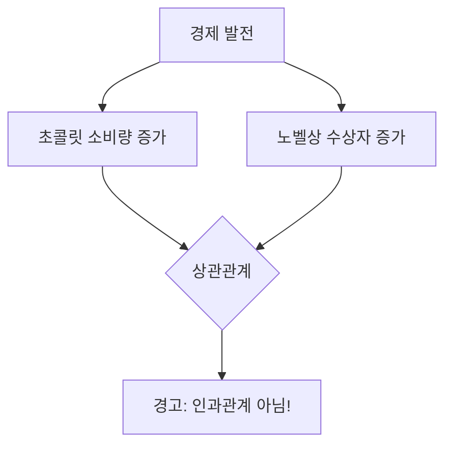
```mermaid
graph TD
    A["초콜릿 소비량 증가"] --> C{"상관관계"}
    B["노벨상 수상자 증가"] --> C
    D["경제 발전"] --> A
    D --> B
    C --> E["경고: 인과관계 아님!"]
```

1. **데이터 해석의 어려움**: 가로축과 세로축에 적절한 파라미터(변수)를 넣는 것이 매우 어렵고 실수하기 쉽다. 
  1. 두 숫자가 같이 움직인다고 해서 전혀 무관한 정보를 넣으면 참사가 발생할 수 있다. 
2. **독감 예방접종 사례**: 가로축에 독감 예방접종 숫자, 세로축에 접종 후 사망자 정보를 넣으면 둘 다 같이 올라간다. 
  1. 접종을 할수록 죽는 것처럼 보이지만, 이는 당연히 사망자는 항상 일정하게 존재하기 때문에 전 국민이 예방접종을 하면 접종 후 사망자도 늘어나는 것이다. 
  2. 이것은 가짜 상관관계이다. 
3. **초콜릿과 노벨상**: 한 나라의 초콜릿 소비량과 노벨상 수상자 수를 비교하면 깨끗한 직선 관계가 나타난다. 
  1. 초콜릿을 많이 먹을수록 노벨상을 타는 것처럼 보이지만, 이는 상관관계일 뿐 인과관계가 아니다. 
  2. 경제 발전이 초콜릿 소비량과 과학 투자(노벨상 수상 가능성)를 모두 늘리기 때문에 나타나는 현상이다. 
  3. 고급 스포츠카 대수와 노벨상 수상자 수도 비슷한 관계를 보인다. 
4. **통계학의 양면성**: 통계학은 매우 재미있기도 하지만, 한편으로는 무섭기도 하다. 
  1. 어떤 데이터를 어떻게 해석하는지는 정말 조심해야 한다. 

## 39. 간극 본능: 저소득 국가에 대한 오해 

1. **초등학교 교육을 받은 여성 비율**: 오늘날 세계 모든 저소득 국가에서 초등학교를 나온 여성은 얼마나 될까? 
  1. 보기는 20%, 40%, 60%인데, 정답은 60%이다. 
  2. 대부분의 사람들이 40%밖에 안 될 것이라고 생각하며 틀린다. 
2. **세계 인구의 다수는 어디에 살까**: 세계 인구의 다수는 저소득 국가, 중간소득 국가, 고소득 국가 중 어디에 살까? 
  1. 정답은 중간소득 국가인데, 대부분의 사람들이 저소득 국가에 살 것이라고 답한다. 
  2. 이는 우리가 보고 있는 대상이 양극단으로 갈리고, 중간에 겹치는 부분이 많지 않다고 오해하는 간극 본능 때문이다. 
3. **수학 점수 분포의 예**: 여학생이 남학생보다 수학 점수가 낮다고 생각하지만, 평균 점수에는 약간의 차이가 있을 수 있어도, 실제 확률 분포는 거의 겹친다. 
  1. 현실에 없는 차이를 확대하고 과장해서 보는 것이 간극 본능이다. 
4. **저소득 국가의 삶에 대한 편견**: 사람들은 저소득 국가의 삶을 현실보다 훨씬 더 안 좋게 생각하는 경향이 있다. 
  1. 이러한 편견의 덫을 치우고 오해를 들여다봐야 한다. 

## 40. 4단계 구분법: 로그 스케일로 본 소득 수준 

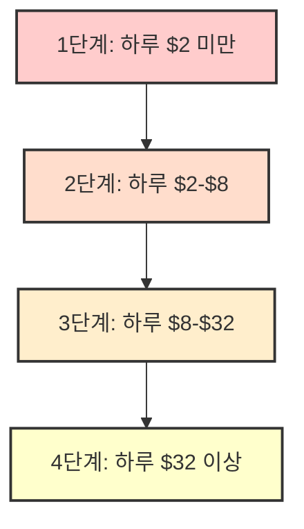
```mermaid
graph TD
    A["1단계: 하루 $2 미만"] --> B["2단계: 하루 $2-$8"]
    B --> C["3단계: 하루 $8-$32"]
    C --> D["4단계: 하루 $32 이상"]
    style A fill:#FFCCCC,stroke:#333,stroke-width:2px
    style B fill:#FFDDCC,stroke:#333,stroke-width:2px
    style C fill:#FFEECC,stroke:#333,stroke-width:2px
    style D fill:#FFFFCC,stroke:#333,stroke-width:2px
```

1. **소득 수준의 4단계 구분**: 저자는 세계를 4단계 소득 수준으로 구분하는 방법을 제시한다. 
  1. 이 구분법은 로그 스케일(log scale)로 그려져 차이가 명확하게 보인다. 
  2. 각 단계는 이전 단계보다 평균 소득이 4배씩 늘어난다. 
  3. 사람들의 실제 차이는 어떤 절대적인 차이가 아니라 비율로 비교하는 것이 맞다는 것을 보여준다. 
2. **로그 스케일의 예시**:
  1. 사람의 소득이 그렇다. 만 원짜리 와인을 마시다가 2만 원짜리 와인을 마시면 차이를 느끼지만, 100만 원짜리 와인을 마시다가 101만 원짜리 와인을 마신다고 해서 큰 차이를 느끼지 못한다. 
  2. 우리가 세상을 보고 느끼는 것은 로그 스케일로 많이 늘어나는 것들이 갑자기 뛰는 경우가 많다. 
  3. 월급이 2배가 된다고 해서 생활이 질적으로 크게 달라지지 않을 수 있지만, 4배가 된다면 생활이 완전히 바뀔 것이다. 
3. **단계별 소득 기준**:
  1. 1단계: 하루 2달러 미만 (연간 약 700달러 수준) 
  2. 2단계: 하루 2~8달러 (연간 약 3천 달러 수준) 
  3. 3단계: 하루 8~32달러 (연간 약 만 달러 수준) 
  4. 4단계: 하루 32달러 이상 
4. **한국의 변화**: 한국은 1959년 1인당 GDP가 80달러 미만(하루 30센트)으로 1단계 국가였다. 
  1. 1977년에 1인당 GDP 1천 달러를 넘어 2단계에 진입했고, 김영삼 대통령 재직 시절인 1995~96년 무렵 만 달러를 넘어 4단계에 들어섰다. 
  2. 약 50년 동안 1단계에서 4단계 국가까지 올라온 것이다. 
5. **중간소득 국가의 다수**: 현재 전 세계 인구 70억 명 중 약 50억 명(70%)이 2단계와 3단계(중간소득 국가)에 살고 있다. 
  1. 10억 명 정도가 4단계 국가에 살고 있다. 
  2. 대부분의 인구는 저소득 국가가 아니라 중간소득 국가에 살고 있다는 결론이다. 
6. **두 단계에서 네 단계로**: 서구에서 만든 선진국과 저개발국(또는 개발도상국)이라는 두 단계 구분법(극단 본능)을 허물고, 네 단계로만 나눠도 세상이 달라 보인다. 
  1. 넷이라는 숫자는 데이터의 연속성을 반영하면서도 사람들이 쉽게 그 모습을 상상할 수 있게 해주는 현명한 선택이다. 

## 41. 글로벌 불평등과 국내 불평등의 차이 

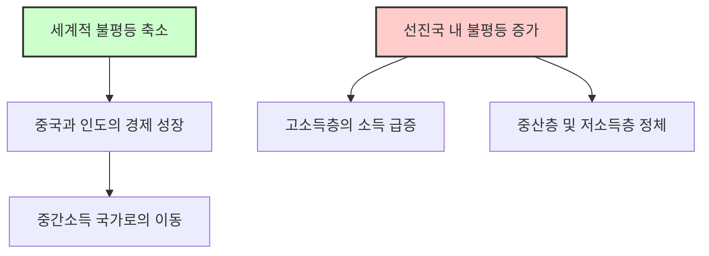
```mermaid
graph TD
    A["세계적 불평등 축소"] --> B["중국과 인도의 경제 성장"]
    C["선진국 내 불평등 증가"] --> D["고소득층의 소득 급증"]
    C --> E["중산층 및 저소득층 정체"]
    B --> F["중간소득 국가로의 이동"]
    style A fill:#CCFFCC,stroke:#333,stroke-width:2px
    style C fill:#FFCCCC,stroke:#333,stroke-width:2px
```

1. **세계적 불평등 축소**: 경제학자들의 결론도 비슷하다. 세계적으로는 불평등이 축소되고 있다. 
  1. 가장 중요한 동력은 중국과 인도 같은 인구 대국들이 경제 성장을 했기 때문이다. 
  2. 이들이 중간소득 국가로 이동하면서 세계화가 세계적 불평등을 축소시킨 것이 맞다. 
  3. 이는 아주 좋은 일이다. 
2. **선진국 내 불평등 증가**: 하지만 선진국들 내에서는 소득 격차가 늘었다. 
  1. 저소득층과 중산층은 제자리에 머물렀지만, 가장 상위의 고소득층(전문 기술인)은 마치 로켓을 탄 것처럼 소득이 올라갔다. 
  2. 이러한 국내 불평등 때문에 선진국에서는 정치가 작동하기 어려워지는 문제가 발생한다. 
3. **두 가지 층위의 팩트**: 세계적 불평등과 국내 불평등은 구분해서 봐야 할 두 가지 층위의 팩트이다. 
  1. 신자유주의가 불평등을 늘렸다고 단적으로 말하기 어렵다. 세계적으로는 불평등을 줄였기 때문이다. 

## 42. 부정 본능: 나쁜 것에 주목하는 경향 

1. 극빈층** 비율의 변화**: 지난 20년간 세계 인구에서 극빈층 비율은 어떻게 변화했을까? 
  1. 보기는 '거의 2배로 늘었다', '거의 같다', '거의 절반으로 줄었다'인데, 정답은 '거의 절반으로 줄었다'이다. 
  2. 하지만 이 문제의 정답률은 7%에 불과하며, 특히 미국인의 정답률은 3%밖에 안 된다. 
  3. 많은 사람들이 극빈층 비율이 늘었다고 생각한다. 
2. **세계 기대수명**: 오늘날 세계 기대수명은 몇 살일까? 
  1. 보기는 50세, 60세, 70세인데, 정답은 70세이다. 
  2. 대부분의 사람들이 60세 정도밖에 안 될 것이라고 생각한다. 
3. 부정적인 뉴스** 선호**: 우리가 부정적인 뉴스를 더 좋아하는 본능이 있으며, 많은 언론이 이러한 본능을 자극하고 생산하기 때문에 이런 문제가 생긴다. 
  1. 위험에 대한 반응은 생존에 중요한 뉴스이기 때문에 자연스러운 것이다. 
  2. 숲에서 어른거리는 사자 이야기가 정확히 그런 예이다. 
  3. 부정적인 위험에 대해 반응하는 것은 당연한 것이다. 

## 43. '나아지지만 나쁘다'는 진실 

1. **축하와 발전의 공존**: "축하하는 것과 더 큰 발전을 위해 계속 싸우는 것은 상충하지 않는다." 
  1. 한국이 산업화를 잘해왔다고 하면 박정희를 찬양하는 것이냐는 식으로 반응하는 경우가 많다. 
  2. 하지만 잘해온 것은 잘해온 것이고, 더 나갈 수 있다고 이야기하는 순간 공적 토론의 공간이 생긴다. 
  3. 우리의 공적 토론은 산업화 편이냐 민주화 편이냐는 식으로 극단적으로 나뉘는 경우가 많다. 
  4. 저자는 세상을 더 좋게 만들려면 세상을 더 정확하게 이해해야 하고, 더 좋아졌던 지점들을 바탕으로 더 나아가려면 어떻게 해야 하는지 사실에 근거해서 생각해야 한다고 말한다. 
2. **본능의 기울어짐**: 부정적인 것에 더 관심을 기울이고 나쁜 것에 더 신경을 쓰는 것은 자연스러운 본능이다. 
  1. 하지만 이 본능이 너무 과하다는 것이 저자의 비판이다. 
  2. 정확한 판단을 위해서는 이 기울어진 본능을 의식적으로 펴야 한다. 
  3. 이것이 바로 저자들이 '사실충실성(팩트풀니스)'을 위한 훈련을 이야기하는 이유이다. 
3. **언론의 역할과 시장 경제**: 언론은 부정적인 뉴스에 사람들이 더 반응한다는 것을 알기 때문에, 끔찍한 일이나 부정적인 일들을 상세하고 지속적으로 보도하는 경향이 있다. 
  1. 이는 클릭 수와 열독률을 높이는 시장 경제의 원리 때문에 생기는 불가피한 측면이 있다. 
  2. 하지만 언론이 이러한 시장의 구조를 어떻게 하면 펼 수 있을까라는 질문을 해야 한다. 
  3. 이는 어려운 일이지만, 언론의 역할에 대한 고민이 필요하다. 
4. 나아지지만 나쁘다: 부정 본능을 극복하기 위해서는 '나아지지만 나쁘다'는 것을 예상해야 한다. 
  1. 현재의 수준과 변화의 방향을 구별하는 연습을 해야 한다. 
  2. 상황은 나아지는 동시에 나쁠 수도 있다는 것을 늘 생각해야 한다. 
  3. 물리학에서 입자의 상태를 설명할 때 위치와 속도가 중요한 것처럼, 현재 위치는 나쁠 수 있지만 속도가 나아지는 방향으로 가고 있다면 '여전히 나쁘지만 나아지고 있다'고 말할 수 있다. 
5. **좋은 소식은 뉴스가 안 된다**: 점진적인 개선은 뉴스거리가 되지 않는다. 
  1. 뉴스가 많이 나온다고 해서 고통이 더 큰 것은 아니다. 
  2. 예를 들어, 기후 위기 관련 사진으로 북극곰이 많이 쓰이지만, 북극곰이 기후 위기에서 가장 피해를 보는 생물종이라고 말하기는 어렵다. 
  3. 동물원에서 가장 고통받는 동물이 돌고래라고 말하기 어려운 것과 같다. 
  4. 뉴스는 총체적 사실을 찾아내는 방식이 아니라, 사람들이 가장 반응하기 좋은 방식으로 생산된다. 
6. **장밋빛 과거를 조심하라**: 사람들은 옛날을 미화하는 경향이 있으므로, 장밋빛 과거를 조심해야 한다. 

## 44. 정치적 양극화와 부정 본능 

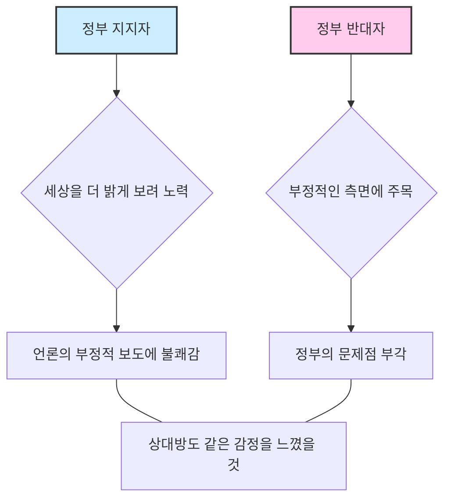
```mermaid
graph TD
    A["정부 지지자"] --> B{"세상을 더 밝게 보려 노력"}
    C["정부 반대자"] --> D{"부정적인 측면에 주목"}
    B --> E["언론의 부정적 보도에 불쾌감"]
    D --> F["정부의 문제점 부각"]
    E --- G["상대방도 같은 감정을 느꼈을 것"]
    F --- G
    style A fill:#CCEEFF,stroke:#333,stroke-width:2px
    style C fill:#FFCCEE,stroke:#333,stroke-width:2px
```

1. **정치적 편향**: 어떤 정부가 들어서면, 그 정부를 지지하는 사람들은 세상을 더 밝게 보려고 노력한다. 
  1. 언론에서 부정적인 뉴스만 나오면 "왜 나쁜 것만 보도하냐"고 불쾌해한다. 
  2. 반대로 자신이 지지하지 않는 정부가 들어서면 그런 느낌을 갖지 않는다. 
  3. 지금도 현 정부를 지지하는 사람들은 언론 보도를 보며 불쾌해할 것이고, 이는 과거 다른 정부를 지지했던 사람들도 똑같이 느꼈던 감정이다. 
2. 간극** 본능과 부정 본능의 혼합**: 간극 본능과 부정 본능이 혼합되면 정치적인 영역에서 이슈가 떠오를 때 더욱 심해진다. 
  1. 한 걸음 거리감을 유지하고 입장을 바꿔놓고 생각해보면 서로 간에 좀 더 너그러워질 수 있다. 
3. **타인의 관점 취하기**: 타인의 관점을 취할 줄 아는 능력(역지사지)은 문명화의 핵심이다. 
  1. 소설을 읽는 것이 다른 사람의 입장을 상상하는 훈련을 하는 데 도움이 된다. 
4. **국회 법안 발의 데이터**: 국회의원들의 법안 발의 데이터를 보면, 소속 정당에 따라 발의 패턴이 거의 일치한다. 
  1. 이는 민주화 이후 모든 국회가 그랬는지, 아니면 특정 시점부터 그런 현상이 나타났는지 시계열로 분석해 볼 필요가 있다. 
  2. 국회의원들이 자신의 일처럼 법을 제대로 토론하지 않고 정당에 따라 움직이는 것은 문제이다. 
  3. 지지층의 요구에 순응하는 정치, 인간관계의 압박, 그리고 유권자들의 극단 본능과 부정 본능이 결합된 '구름 안티' 형성 등이 복합적으로 작용한다. 

## 45. 직선 본능: 변화를 직선으로만 보는 오류 

1. **미래를 예측하는 오류**: 직선 본능은 과거에서 현재까지 진행된 방식대로 미래에도 계속 진행될 것이라고 생각하는 오류이다. 
  1. 에볼라 감염자 수가 처음에는 직선처럼 늘어나는 것처럼 보이지만, 실제로는 폭발적으로 늘어나다가 결국 수그러든다. 
  2. 폭발적으로 늘어나는 단계를 보면서 세상의 종말이 올 것이라고 생각하는 것도 또 다른 직선 본능이다. 
  3. 사람들은 과거로부터 현재까지 이어진 패턴이 앞으로도 계속될 것이라고 본다. 
2. **미래 인구 증가 예측**: 유엔은 2100년까지 세계 인구가 40억 명 늘어날 것이라고 예상한다. 
  1. 주로 어떤 인구층이 늘어날까? 15세 미만 아동, 15~74세 성인, 75세 이상 노인 중 정답은 '15~74세 성인 인구'이다. 
  2. 대부분의 사람들이 노인 인구가 늘어날 것이라고 생각하며 틀린다. 
3. **인구 증가의 예측은 이미 정해진 것**: 미래 인구에 대한 예측은 사실 예측이 아니라 이미 정해져 있는 것이다. 
  1. 예를 들어, 20년 뒤 20살이 될 젊은이의 수는 이미 금년에 정해져 있다. 
  2. 세계 아동 인구(0~15세)는 현재 20억 명인데, 유엔이 예상하는 2100년에도 20억 명으로 지금과 똑같다. 
  3. 이는 세계 인구 증가 문제가 앞으로 100년 정도 지나면 더 이상 큰 문제가 아닐 것이라는 것을 보여준다. 
4. **한국의 저출산과 세계의 인구 변화**: 한국 사람들은 한국의 고령화와 저출산 상황 때문에 세계적으로도 노인 인구가 늘어날 것이라고 생각하며 틀린다. 
  1. 한국의 합계출산율은 작년에 0.8 수준으로 떨어져 세계 최저가 되었다. 
  2. 하지만 전 세계 평균 합계출산율은 2017년에 2.5명이다. 
  3. 이는 20~30년 전 한국 수준으로, 전 세계가 중위소득 국가로 흡수되고 시장 시스템으로 통합되면서 산업 국가들이 겪었던 인구 변화의 과정을 따르고 있음을 보여준다. 
  4. 이러한 인구 변화는 '팩트폭행'처럼 느껴질 수 있지만, 사실은 각 층위에 맞는 축척에 따른 데이터가 어떤 진실의 축척 단위가 다르고, 이 장면에서는 이 데이터, 이 장면에서는 이 축척이 필요하다는 것을 체계적으로 보여준다. 

## 46. 세계 기대수명의 놀라운 변화 

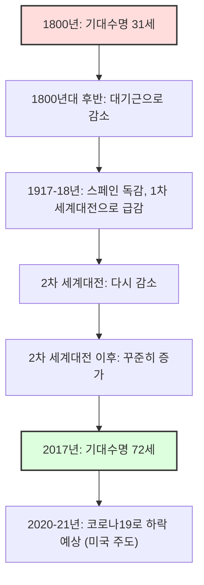
```mermaid
graph TD
    A["1800년: 기대수명 31세"] --> B["1800년대 후반: 대기근으로 감소"]
    B --> C["1917-18년: 스페인 독감, 1차 세계대전으로 급감"]
    C --> D["2차 세계대전: 다시 감소"]
    D --> E["2차 세계대전 이후: 꾸준히 증가"]
    E --> F["2017년: 기대수명 72세"]
    F --> G["2020-21년: 코로나19로 하락 예상 (미국 주도)"]
    style A fill:#FFDDDD,stroke:#333,stroke-width:2px
    style F fill:#DDFFDD,stroke:#333,stroke-width:2px
```

1. **기대수명의 장기적 증가**: 83쪽에 실린 세계 인구 증가 그래프를 보면, 1800년부터 2017년까지 평균 기대수명의 변화를 알 수 있다. 
  1. 1800년에는 31세였던 기대수명이 2017년에는 세계 평균 72세로 늘어났다. 
  2. 한국은 현재 80세가 넘는다. 
2. **역사적 사건과 기대수명**:
  1. 1800년대 후반 대기근(아일랜드 등)으로 기대수명이 감소했다. 
  2. 1917~18년 스페인 독감과 1차 세계대전(사망자 약 3천만 명)으로 크게 감소했다. 
  3. 2차 세계대전 때도 기대수명이 감소했다. 
  4. 하지만 2차 세계대전 이후에는 한 번도 이상 기류 없이 70년 넘게 꾸준히 증가했다. 
  5. 2020~21년에는 코로나19로 인해 하락이 예상되며, 특히 미국이 이 하락을 주도할 것이라는 소식도 있다. 
3. **인구 증가의 조건**: 전쟁, 기근, 전염병 이 세 가지가 없으면 인구는 증가한다. 
  1. 맬더스(Malthus)는 이 세 가지가 노동력 공급을 줄이는 전통적인 요소이므로, 이것을 막지 말아야 한다고 주장했다. 
  2. 14세기 유럽 흑사병 이후 농노들의 힘이 세지고 임금이 올라갔던 사례도 있다. 
  3. 일부 불평등 연구자들은 전쟁, 전염병, 혁명 외에는 불평등 추세를 반전시키기 어렵다고 주장하기도 한다. 
4. **한국의 인구 감소**: 한국의 합계출산율이 1명 미만인 것은 한 세대가 지날 때마다 태어나는 인구가 절반씩 줄어든다는 의미이다. 
  1. 이는 노동 임금의 상승을 예견하지만, 매우 급격하게 다가올 일이라 걱정된다. 
  2. 하지만 인구가 많다고 좋은 것은 아니며, 적절한 수의 사람들이 더 잘 사는 것이 중요하다는 관점도 있다. 
  3. 지금의 감소 추세가 계속되면 인구가 제로가 될 것이라는 생각은 직선 본능의 오류이다. 
  4. 저출산이 정착되어 인구 구조가 조정되면, 기술 변화와 삶의 양식 변화를 통해 적정 수준의 출산이 다시 이루어질 것이다. 

## 47. 공포 본능: 미지의 것에 대한 두려움 

1. **공포 본능의 시작**: 저자는 자신이 응급실에서 일할 때, 비행기에서 떨어져 피를 흘리며 실려 온 조종사를 보고 3차 세계대전이 시작된 줄 착각했던 경험을 이야기한다. 
  1. 어릴 때도 3차 세계대전이 일어날까 봐 악몽을 꾸고 부모님 침대로 달려가곤 했다. 
  2. 두려움에 떨 때는 비판적 사고를 하기가 거의 불가능하며, 머릿속이 공포에 사로잡혀 있으면 사실이 들어올 틈이 없다. 
2. **언론의 공포 조장**: 언론은 공포 본능을 조장하지 않으면 편집장을 통과하지 못한다는 에피소드도 있다. 
  1. 해외 출장을 가서 터키 시민들을 만났을 때, 그들은 서울에서 어떻게 사느냐고 물었다. 
  2. 그들이 보는 한국 뉴스는 북한의 핵 위협 소식뿐이었기 때문에, 언제라도 핵이 날아올 수 있는 곳에서 태평하게 사는 한국인들이 신기했던 것이다. 
  3. 언론은 어떻게 쓰면 사람들이 더 많이 읽을까를 먼저 생각하지, 민주주의 체제에서 헌법적으로 어떤 의무를 부과받고 있는가 하는 관점에서 출발하지는 않는다. 
  4. 언론이라는 사기업의 속성이 있기 때문에, 사람들이 반응하기 좋은 방식으로 뉴스를 생산하도록 구조가 짜여 있다. 
  5. 하지만 언론이 이러한 시장의 구조를 어떻게 하면 펼 수 있을까라는 질문을 해야 한다. 

## 48. 자연재해 사망자 수의 감소 

1. **자연재해 사망자 수 변화**: 지난 100년간 연간 자연재해 사망자 수는 어떻게 변했을까? 
  1. 보기는 '2배 이상 늘었다', '거의 같다', '절반 이하로 줄었다'인데, 정답은 '절반 이하로 줄었다'이다. 
  2. 이 문제도 오답률이 꽤 높으며, 정답률은 10%밖에 안 된다. 
  3. 90%의 사람이 틀렸는데, 공포 본능 때문에 사람들이 더 늘었을 것이라고 생각한다. 
  4. "사상 최대의 폭우", "사상 최초의 폭설" 같은 보도가 워낙 많기 때문이다. 
2. **3대 공포 유형**: 저자는 사람이 3가지 유형의 공포를 느낀다고 분석한다. 
  1. 신체 손상에 대한 공포, 감금에 대한 공포, 오염에 대한 공포이다. 
  2. 이것들이 언론 뉴스 생산자가 정보를 선별할 때 가장 작동시키게 하는 공포 본능 중 하나이다. 

## 49. 오염에 대한 공포와 혐오 

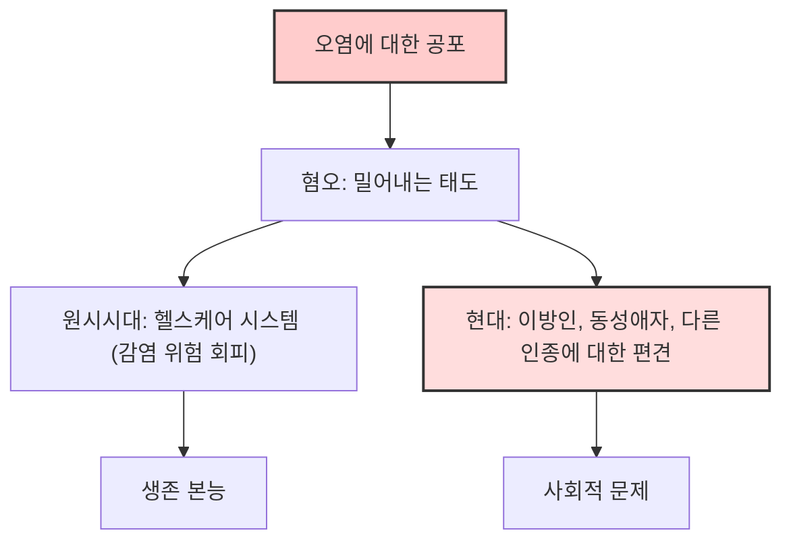
```mermaid
graph TD
    A["오염에 대한 공포"] --> B["혐오: 밀어내는 태도"]
    B --> C["원시시대: 헬스케어 시스템 (감염 위험 회피)"]
    B --> D["현대: 이방인, 동성애자, 다른 인종에 대한 편견"]
    C --> E["생존 본능"]
    D --> F["사회적 문제"]
    style A fill:#FFCCCC,stroke:#333,stroke-width:2px
    style D fill:#FFDDDD,stroke:#333,stroke-width:2px
```

1. **혐오의 심리적 기원**: 오염 물질에 대한 공포는 '혐오'라는 현상과 연결된다. 
  1. 혐오라는 태도를 심리적으로 분석해 보면, 오염물에 대한 밀어내는 태도에서 나온다고 연구자들은 말한다. 
  2. 원시 시대에는 몸 안에 무엇이 있는지 알 수 없었기 때문에, 감염 위험이 있어 보이는 것들에 대해 역겨운 반응(토할 것 같고 도망가고 싶은)을 보였다. 
  3. 이것이 일종의 헬스케어 시스템이었다. 
2. **이방인에 대한 **공포: 같은 집단 안에서는 세균도 공유하기 때문에 위험하지 않지만, 위험한 것은 이방인들이다. 
  1. 유럽인들이 아메리카 대륙에 도착했을 때, 총칼이 아니라 천연두로 아메리카 문명이 무너진 사례가 있다. 
  2. 오염에 대한 밀어내는 태도는 사람에 대한, 특히 나와 이질적인 사람(이방인, 동성애자, 다른 인종)에 대한 태도로 쉽게 넘어간다. 
  3. 이것이 혐오의 심리적 기원이며, 뿌리 뽑기 어려운 내재된 본능이다. 
  4. 하지만 내재되어 있다고 해서 정당하다는 것은 아니다. 
  5. 인간이 살아가면서 만든 규칙과 맞지 않으면, 이 본능을 어떻게 누를 것인가에 대한 고민을 해야 한다. 

## 50. 비행기 사고와 자동차 사고: 공포 본능의 역설 

1. **비행기 사고에 대한 과도한 **공포: 비행기 사고 사망자 수는 항공기 100억 승객 마일당 연간 사망자 수가 거의 제로에 가까울 정도로 낮아졌다. 
  1. 확률상 비행기 사고는 거의 없지만, 사람들은 비행기 탈 때 사고가 나서 죽으면 어쩌지 하는 고민을 한다. 
  2. 이는 데이터와 전혀 맞지 않는 공포이다. 
2. **9.11 테러 이후의 역설**: 9.11 테러 직후, 사람들이 비행기를 무서워해서 자동차 이동이 훨씬 늘었다. 
  1. 어떤 연구자가 테러 때문에 추가로 생긴 자동차 이동의 양을 측정한 후, 거기서 생긴 추가 사망자 수를 계산해 보니 9.11 테러 사망자보다 10배나 많았다. 
  2. 우리의 공포 본능이 사실은 더 위험을 감수하게 만들기도 한다. 

## 51. 후쿠시마 원전 사고와 DDT: 공포 본능의 과대 해석? 

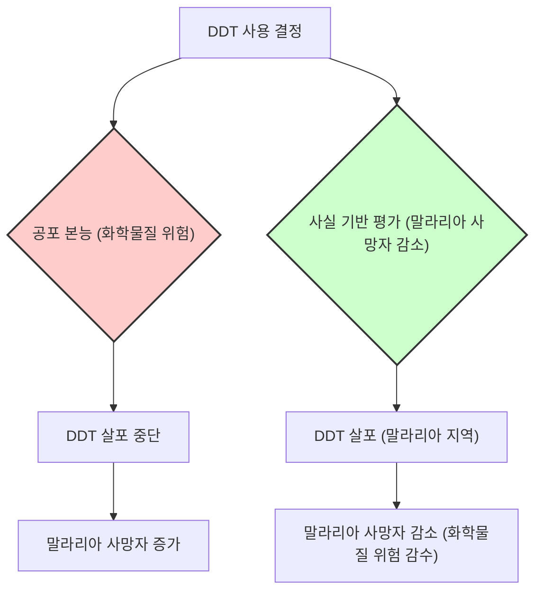
```mermaid
graph TD
    A["DDT 사용 결정"] --> B{"공포 본능 (화학물질 위험)"}
    A --> C{"사실 기반 평가 (말라리아 사망자 감소)"}
    B --> D["DDT 살포 중단"]
    D --> E["말라리아 사망자 증가"]
    C --> F["DDT 살포 (말라리아 지역)"]
    F --> G["말라리아 사망자 감소 (화학물질 위험 감수)"]
    style B fill:#FFCCCC,stroke:#333,stroke-width:2px
    style C fill:#CCFFCC,stroke:#333,stroke-width:2px
```

1. **후쿠시마 원전 사고**: 저자는 후쿠시마 원전 사고로 원자력이 새어 나와 죽은 사람보다, 허둥지둥 대피하려고 하다가 죽은 노인이 더 많았다고 분석한다. 
  1. 원전 사고는 사람들에게 엄청난 장기 효과를 주는데, 사고 후 몇 년 안 지난 시점에서 직접적인 피해를 추정하기는 어렵다. 
  2. 저자가 너무 스코프(범위)를 좁게 잡았다는 비판이 있다. 
2. **DDT 사용 논란**: 저자는 DDT 관련해서도 사람이 그것 때문에 직접적으로 죽었다는 통계는 명확하지 않다고 말하며, 우리가 이에 대해 공포 본능을 심하게 가지고 있다고 분석한다. 
  1. DDT를 살포하여 말라리아 같은 질병으로 죽어가는 어린아이들을 살릴 수 있는 생명이, DDT 살포로 인한 화학적인 이유로 죽는 사람 숫자보다 많다면, 어쩌면 DDT를 사용해야 할 수도 있다는 입장이다. 
  2. 누군가는 사람의 생명을 숫자로 놓고 계산하는 사람들이 있어야 많은 사람을 살릴 수 있다는 관점이다. 
  3. DDT는 쉽지 않은 문제이며, 저자의 주장에 근거는 있어 보인다. 
3. 케모포비아**(화학물질 공포증)**: '침묵의 봄' 같은 책으로 DDT 살포가 중단되고 긍정적인 효과가 있었지만, 우리 사회에서 화학물질에 대한 공포를 과도하게 유발하는 것은 걱정스럽다. 
  1. 과학적인 측정 기술이 발달하면 모든 것에서 모든 화학물질을 찾을 수 있지만, 언론에서는 어떤 화학물질이 발견되었다고 보도하며 사람들이 겁을 먹게 한다. 
  2. 막상 계산해 보면 전혀 걱정할 만한 수준이 아닌데도 사람들이 걱정하는 경우가 많다. 
  3. 사람들이 화학적인 방법으로 만들면 해롭다는 인식을 너무 과하게 하고 있는 것 같다. 
  4. 이러한 뭉툭한 렌즈(화학물질이면 다 해롭다)는 안 위험한 것을 위험하게 보기도 하지만, 가습기 살균제처럼 실제로 위험한 것을 놓치기도 한다. 

## 52. 미지의 공포와 인지적 자원 

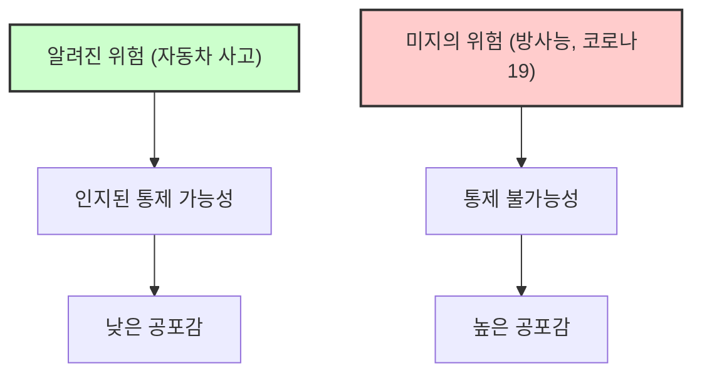
```mermaid
graph TD
    A["알려진 위험 (자동차 사고)"] --> B["인지된 통제 가능성"]
    B --> C["낮은 공포감"]
    D["미지의 위험 (방사능, 코로나19)"] --> E["통제 불가능성"]
    E --> F["높은 공포감"]
    style A fill:#CCFFCC,stroke:#333,stroke-width:2px
    style D fill:#FFCCCC,stroke:#333,stroke-width:2px
```

1. **미지의 것에 대한 **공포: 우리가 알고 있는 것은 별로 두렵지 않다. 
  1. 자동차 사고 같은 위험은 익히 알고 있고, 이 위험을 피하기 위해 내가 뭘 할 수 있는지 어느 정도 알기 때문에 통제할 수 있다고 생각한다. 
  2. 하지만 진짜 공포는 미지의 것, 잠재적인 것에 대한 공포이다. 
  3. 코로나19 사태도 마찬가지이다. 신종플루나 계절 인플루엔자는 치사율이 낮고 우리가 이미 알고 있기 때문에 통제할 수 있다고 생각한다. 
  4. 하지만 코로나19는 아직 잘 모르기 때문에 더 겁이 나는 것이다. 
2. **눈에 보이지 않는 공포**: 방사능이나 화학물질에 대한 공포는 '인비저블(invisible)', 즉 눈에 보이지 않는다는 것 때문에 더 커진다. 
  1. 실체를 명확히 오감으로 확인할 수 없는 대상에 대한 공포감은 그렇지 않은 대상에 대한 공포감보다 훨씬 크다. 
  2. 저자가 모든 공포 본능을 자극하는 현상에 대해 동일한 잣대를 적용한 것은, 우리가 익히 알고 있는 것과 아직 모르고 있는 것 사이의 공포 강도 차이를 간과한 것일 수 있다. 
3. 인지적 리소스** 사용**: 공포 본능 같은 이 책에서 비판하는 본능을 극복하려면 사람들이 어떤 인지적인 리소스(자원)를 사용해야 한다. 
  1. 즉, 사람들이 뭔가 생각을 하게 만들어야 하는데, 사람들은 에너지를 써서 생각하는 것을 싫어한다. 
  2. 사람들은 대부분의 순간에 직관적으로 판단하고, 아주 드문 경우에만 인지 자원을 쓰겠다고 시동을 건다. 
  3. 대니얼 카너먼(Daniel Kahneman) 같은 인지심리학자는 우리가 어떻게 체계적으로 틀리는가를 연구했는데, 이를 알면 내가 지금 틀리고 있구나 하는 판단을 하는 것이 더 쉬워진다. 
4. **'사실이 아닐 거야'라는 요령**: 인지를 위한 지적 자원을 안 써도 되는 요령은 '이게 다 사실은 아닐 거야'라고 생각하는 것이다. 
  1. 즉, 회의하고 의심해 보는 것이다. 
  2. 대개 사람들이 함정에 빠지는 이유는 내가 잘 아는 분야이거나 나와 관련되어 있거나 나의 이익과 관련된 문제들은 의심하지 않기 때문이다. 
  3. 모든 주장이 사실이 아닐 수 있다고 일단 생각하고 보면, 어떤 경우에는 확실한 사실들이 확인되기도 하고, 어떤 경우에는 나온 모든 주장들이 사실이 아니라는 것을 알게 되기도 한다. 

## 53. 크기 본능: 숫자의 크기에 압도되는 경향 

1. **세계 인구 분포 문제**: 오늘날 세계 인구 약 70억 명 중 거주 분포를 가장 잘 나타낸 것은 무엇일까? 
  1. 보기는 아시아, 유럽, 아프리카, 남미의 인구 비율을 다르게 제시한다. 
  2. 정답은 아시아에 약 40억 명, 유럽 10억 명, 아프리카 10억 명, 남미 10억 명이다. 
  3. 이 문제의 정답률은 30% 정도이다. 
  4. 많은 사람들이 아시아에 이렇게 많이 살 것이라고 생각하지 못하고, 아프리카 인구가 엄청 많을 것이라고 착각한다. 
2. **크기 본능의 의미**: 크기 본능은 숫자의 크기에 압도되어 이성적인 판단을 놓치는 경향을 말한다. 
  1. 이 본능을 극복하기 위한 가장 중요한 메시지는 '비교해야 한다'는 것이다. 
  2. 예를 들어, 키가 크냐고 물을 때 누구와 비교하느냐에 따라 다르듯이, 비교가 중요하다. 
  3. '뾰족할 첨(尖)' 한자를 보면, 위가 작고 아래가 큰 것을 비교해야 뾰족하다고 할 수 있듯이, 비교해야만 어떤 것을 이야기할 수 있다. 

## 54. 잘못된 비교의 함정 

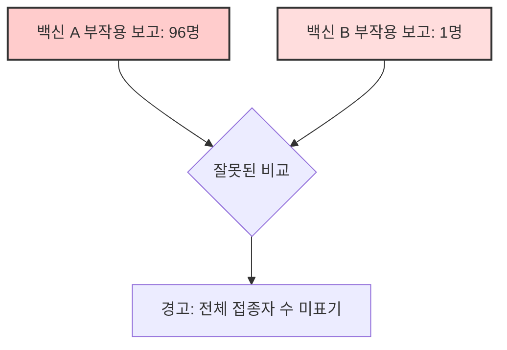
```mermaid
graph TD
    A["백신 A 부작용 보고: 96명"] --> C{"잘못된 비교"}
    B["백신 B 부작용 보고: 1명"] --> C
    C --> D["경고: 전체 접종자 수 미표기"]
    style A fill:#FFCCCC,stroke:#333,stroke-width:2px
    style B fill:#FFDDDD,stroke:#333,stroke-width:2px
```

1. **백신 부작용 사례**: 백신 접종 초기에 아스트라제네카는 96명, 모더나는 1명의 부작용 보고가 있었다는 기사가 나왔다. 
  1. 이것은 비극처럼 보이지만, 사실은 접종자 수가 100배 넘게 차이가 나기 때문에 부작용 비율로 계산하면 비슷하다. 
  2. 비교라는 방식도 왜곡하기 쉽기 때문에, 언론이 의도적으로 왜곡하거나 본능이 작동해서 상황을 왜곡해서 보고 싶을 때 사용되는 방법이기도 하다. 

## 55. 베트남 전쟁 기념탑과 CO2 배출량: 크기 본능의 오해 

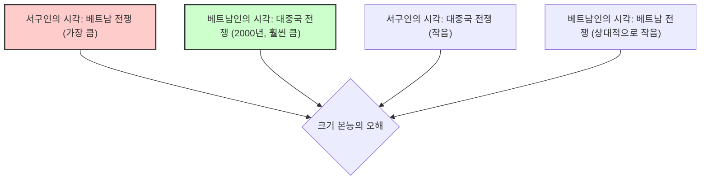
```mermaid
graph TD
    A["서구인의 시각: 베트남 전쟁 (가장 큼)"] --> C{"크기 본능의 오해"}
    B["베트남인의 시각: 대중국 전쟁 (2000년, 훨씬 큼)"] --> C
    D["서구인의 시각: 대중국 전쟁 (작음)"] --> C
    E["베트남인의 시각: 베트남 전쟁 (상대적으로 작음)"] --> C
    style A fill:#FFCCCC,stroke:#333,stroke-width:2px
    style B fill:#CCFFCC,stroke:#333,stroke-width:2px
```

1. **베트남 전쟁의 크기**: 프랑스인이 베트남에 가서 베트남 전쟁 희생자 기념탑을 보고 "이거 말고 더 큰 건 없냐"고 묻는다. 
  1. 베트남 사람 입장에서는 프랑스와의 전쟁(150년)보다 중국과의 전쟁(2000년)이 훨씬 더 크다. 
  2. 서구인들이 볼 때는 베트남 전쟁이 가장 크게 보이기 때문에, 당연히 그게 가장 클 것이라는 크기 본능이 있었던 것이다. 
2. **CO2 배출량 논쟁**: 다보스 세계경제포럼에서 유럽연합 환경부 장관이 인도와 중국의 CO2 배출량이 많다고 비난하자, 중국과 인도 대표가 1인당 배출량으로 계산하자고 반박한다. 
  1. 1인당으로 계산하면 미국과 유럽이 훨씬 높다. 
  2. 이처럼 총량만 보고 판단하는 것은 크기 본능의 오류이다.

## 56. 데이트 폭력과 곰 습격 사건: 언론의 선택적 보도 

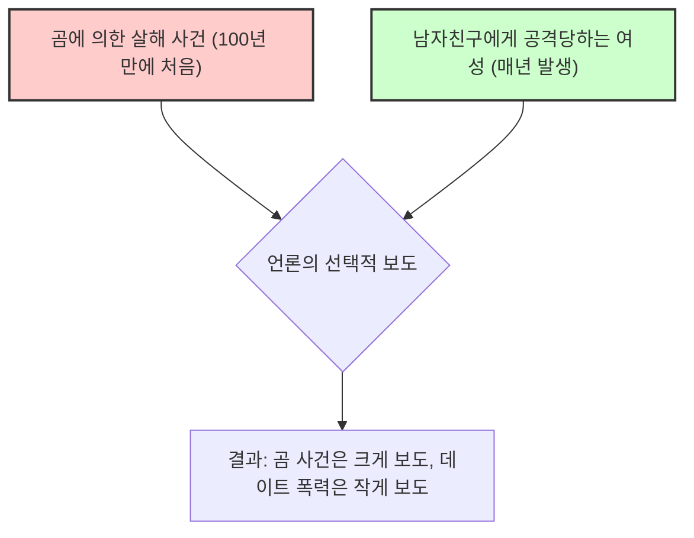
```mermaid
graph TD
    A["곰에 의한 살해 사건 (100년 만에 처음)"] --> C{"언론의 선택적 보도"}
    B["남자친구에게 공격당하는 여성 (매년 발생)"] --> C
    C --> D["결과: 곰 사건은 크게 보도, 데이트 폭력은 작게 보도"]
    style A fill:#FFCCCC,stroke:#333,stroke-width:2px
    style B fill:#CCFFCC,stroke:#333,stroke-width:2px
```

1. **뉴스 가치의 기준**: 곰에 의해 살해당한 남자는 100년 만에 처음 있는 일이라 엄청나게 많은 기사가 나온다. 
  1. 반면, 남자친구에게 맞거나 살해당하는 여성(데이트 폭력) 사건은 늘 있는 일이라 안 쓰거나 조그맣게 보도된다. 
  2. 더 중요한 사회 현상인데도 불구하고 더 적게 보도되는 것이다. 
2. **새로움이 중요**: 언론은 '무엇이 중요하냐'보다 '무엇이 더 새로운가'를 먼저 물어본다. 
  1. 사람이 개를 물면 뉴스가 되지만, 개가 사람을 물면 뉴스가 안 되는 것과 같다. 
  2. 크기 본능을 억제하기 위해서는 제대로 된 비교를 해야 한다. 
  3. 총량만 비교하는 것이 아니라, 각각의 경우에 대한 비율을 계산한 다음 그 비율을 비교하는 것이 맞다. 

## 57. 일반화 본능: 전 세계 아동 예방접종률 

1. **예방접종률 문제**: 오늘날 전 세계 1세 아동 중 어떤 질병이든 예방 접종을 받은 비율은 몇 퍼센트일까? 
  1. 보기는 20%, 50%, 80%인데, 정답은 80%이다. 
  2. 이 문제는 가장 오답률이 높은 문제 중 하나이다. 
  3. 많은 사람들이 50% 정도밖에 안 될 것이라고 생각하며 틀린다. 
2. **국가 시스템의 역할**: 예방접종은 국가 시스템, 행정 역량이 필요한 일이라고 생각하기 때문에, 저소득 국가에서는 낮을 것이라고 예상한다. 
  1. 하지만 1단계 국가를 제외하고 2단계 이상에서는 대부분 지역에서 많이 생겼던 질병에 대한 예방 접종을 하고 있다. 
  2. 이는 세계보건기구(WHO)나 유엔(UN) 같은 국제기구들이 전염병에 대한 관심을 가질 수밖에 없기 때문이다. 
  3. 어느 한 지역에서 치명적인 전염병이 발생하면 다른 지역으로 넘어갈 확률이 매우 높다는 것을 모두 알기 때문이다. 
  4. 말라리아처럼 광역화되지 않는 질병에 대해서는 관심이 적다. 

## 58. 소득 수준에 따른 삶의 방식: 문화보다 소득이 중요하다 

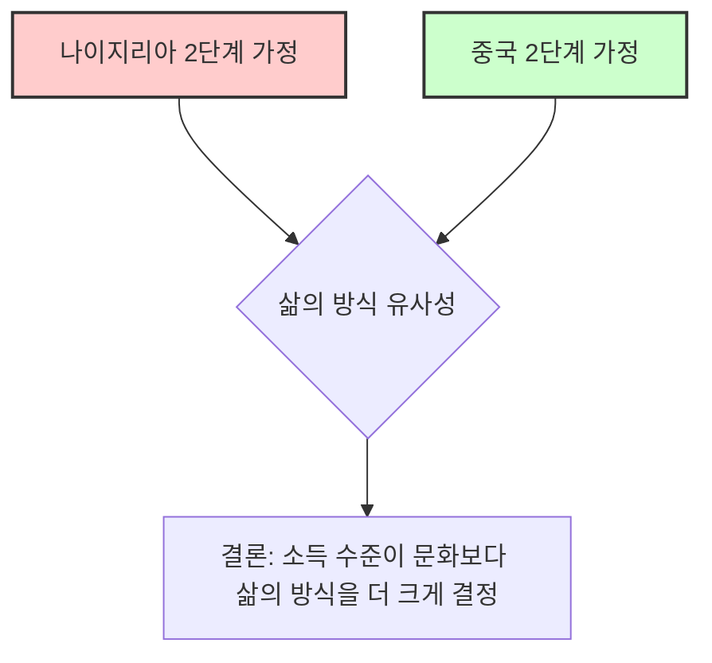
```mermaid
graph TD
    A["나이지리아 2단계 가정"] --> C{"삶의 방식 유사성"}
    B["중국 2단계 가정"] --> C
    C --> D["결론: 소득 수준이 문화보다 삶의 방식을 더 크게 결정"]
    style A fill:#FFCCCC,stroke:#333,stroke-width:2px
    style B fill:#CCFFCC,stroke:#333,stroke-width:2px
```

1. **소득이 결정하는 삶**: 저자는 사람들의 삶이 종교나 문화, 국가에 따라 달라지는 것이 아니라, 사실은 소득에 따라 달라진다고 주장한다. 
  1. 책의 앞부분에 다양한 나라에서 소득 수준이 비슷한 사람들의 생활 모습을 찍은 사진들이 있는데, 정말 놀랍도록 똑같다. 
  2. 1단계에 사는 사람이라면 어느 나라에서 살더라도 사는 모습이 너무 똑같다. 
  3. 소득 수준이 그 사람이 어떤 종교를 가졌는지, 어느 나라에 사는지보다도 가장 크게 결정한다는 것은 매우 설득력 있다. 
2. **콩고의 벌레 요리 사례**: 저자가 콩고에 갔을 때 주민들이 벌레 요리를 대접했는데, 같이 간 덴마크 사람은 잘 먹었지만 저자는 토할 것 같았다. 
  1. 저자는 '우리 같은 유럽인이지만 이 사람은 덴마크 사람이고 나는 스웨덴 사람이라 민족이 달라 안 먹는 거야'라고 생각했다. 
  2. 하지만 이런 식의 일반화가 과연 타당한가에 대해 저자는 반박한다. 
  3. 우리는 너무 쉽게 사람들의 생활 방식 차이를 민족적, 문화적, 종교적으로 일반화해서 차이를 두드러지게 만들지만, 사실은 소득 수준의 차이에 기인한 경우가 대부분이다. 
3. **나이지리아와 중국의 조리 도구**: 나이지리아와 중국의 2단계 가정이 사용하는 조리 도구가 얼마나 닮았는지 보면 놀랍다. 
  1. 중국에서 물을 끓이는 모습을 보고 '중국 문화'라고 생각할 수 있지만, 사실은 전 세계 어디든 2단계 나라에서는 흔히 물을 그렇게 끓인다. 
  2. 그것은 소득의 문제이다. 
  3. 모든 나라가 그렇듯, 중국 안에서도 문화가 아니라 소득 수준에 따라 요리 방식이 다르다. 
  4. 2단계 정도의 소득(하루 2달러)으로는 가스레인지나 스토브를 가질 수 없기 때문에 그럴 수밖에 없다. 

## 59. 과도한 일반화의 오류와 사회적 낙인 

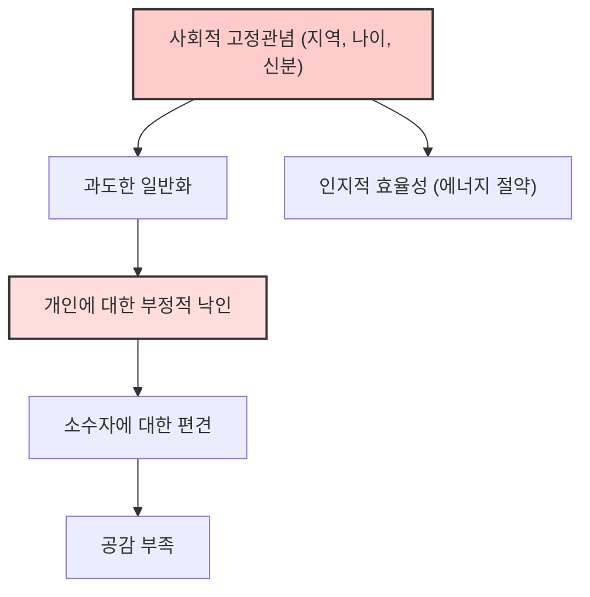
```mermaid
graph TD
    A["사회적 고정관념 (지역, 나이, 신분)"] --> B["과도한 일반화"]
    B --> C["개인에 대한 부정적 낙인"]
    C --> D["소수자에 대한 편견"]
    D --> E["공감 부족"]
    A --> F["인지적 효율성 (에너지 절약)"]
    style A fill:#FFCCCC,stroke:#333,stroke-width:2px
    style C fill:#FFDDDD,stroke:#333,stroke-width:2px
```

1. **문화 상대주의와 **일반화: 문화에 대한 상대주의적인 입장에 익숙하지만, 아직도 해결해야 할 일반화 본능이 많다. 
  1. '화성 남자 금성 여자' 같은 책이나 혈액형, MBTI 같은 것들이 과도한 일반화의 예시이다. 
  2. 이러한 것들은 재미로 하는 것은 괜찮지만, 사회적으로는 빨리 극복해야 할 문제이다. 
2. **한국 사회의 일반화 경향**: 한국 사회는 일반화에 강한 사회일 수 있다. 
  1. 예전에는 지역에 따른 일반화가 많았다면, 지금은 나이나 사회적 신분에 따라 '돌싱은 어쩔 거야', '관종 아니야?' 같은 식으로 특성이 보이면 전체 특성을 가졌을 것이라고 몰아가는 경향이 있다. 
  2. 이는 보통 소수자(마이너리티), 여성, 특정 지역 출신 등 사회적 약자에게 더 자주 일어난다. 
  3. 어떤 좋은 대학 나온 사람이 사고를 치면 '저저저 서울대 나와서 사고 쳤다'고 하지만, 그렇지 않은 경우는 '저 지역은 원래 그래'라고 말하는 식이다. 
  4. 이는 마이너리티를 대하는 태도와 이어져 있으며, 비난 본능과도 연결된다. 
3. **인지적 효율성으로서의 유형화**: 합리적으로 해석해 보면, 모르는 사람을 만났을 때 '저 사람이 나한테 해가 될까 안 될까'를 판단하기 위해 정보가 필요하다. 
  1. 시간과 에너지를 들이지 않고 그 사람을 어떻게 대해야 할지 결정하기 위해, 학력, 직업, 직장, 성별 등 쉽게 알아볼 수 있는 정보를 뽑고, 그것에 의거해서 유형화하고 태도를 결정하는 것이다. 
  2. 이는 어찌 보면 많은 사람들과 접촉하며 살게 된 문명 발생 이후에 사람들에게 도움이 되었을 본능이다. 
4. 자연주의적 오류: 하지만 '본능이니까 그렇게 살 수밖에 없어'라고 하는 것은 자연주의적 오류이다. 
  1. 그 본능은 잘못된 것이고, 작동하지 않는 것이며, 본능을 뛰어넘으려면 우리가 어떤 본능이 왜 있는지를 정확하게 이해하는 것이 첫 번째이다. 
  2. 과도한 일반화의 오류에 빠지지 않기 위해서는 끊임없이 비교하고 팩트를 보며, 자신의 판단이 지나친 일반화가 아닌지 다시 한번 생각해 봐야 한다. 
5. **인종주의와 집단 구분 본능**: 인간은 대부분 인종주의자이지만, 인종주의는 본능이 아니다. 
  1. 인종주의적인 본능이 진화할 만큼 서로 다른 인종들을 만나며 살지 않았기 때문이다. 
  2. 본능은 '힐끗 보고 저 사람이 우리 집단 안의 사람인지, 내 집단 외의 사람인지 판단하는 것'이다. 
  3. 수렵 채집인들이 몸에 복잡한 그림을 그리는 이유도 '이게 우리 집단이다'라는 신호를 보내는 것이다. 
  4. 현대에도 10대들이 알아듣기 어려운 말을 쓰는 이유도 의사소통 목적이 아니라, '내 집단이 누구인지 확인하는 것'이다. 
  5. 피부색은 나중에 인류가 섞여 살면서 다른 사람을 구분하는 지표로 쓰이게 된 것이다. 

## 60. 운명 본능: 남성과 여성의 교육 수준 

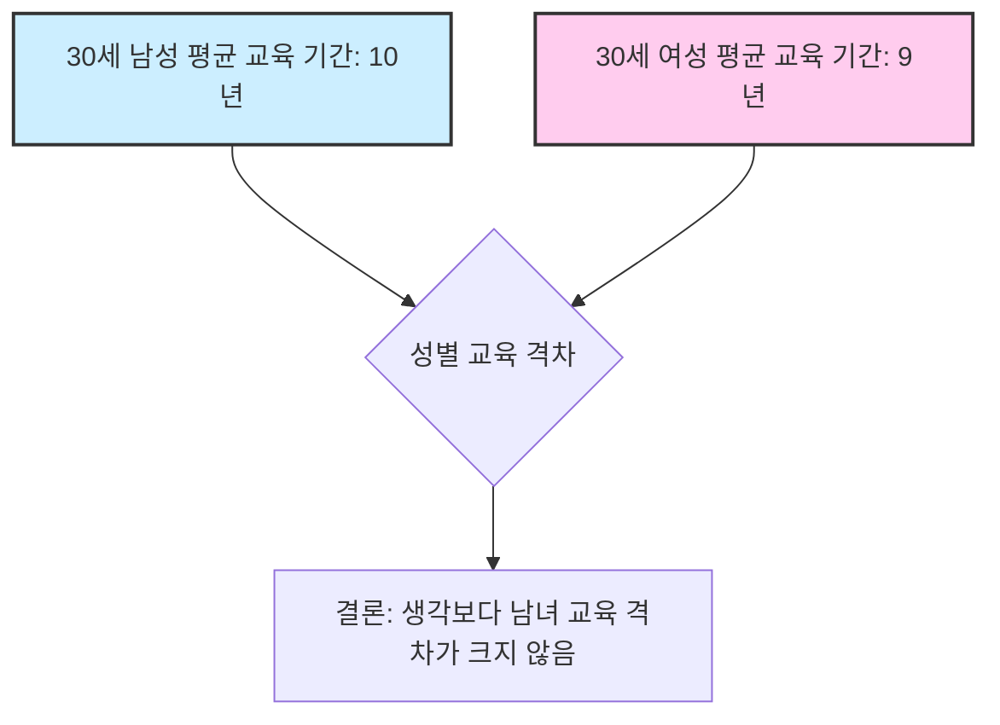
```mermaid
graph TD
    A["30세 남성 평균 교육 기간: 10년"] --> C{"성별 교육 격차"}
    B["30세 여성 평균 교육 기간: 9년"] --> C
    C --> D["결론: 생각보다 남녀 교육 격차가 크지 않음"]
    style A fill:#CCEEFF,stroke:#333,stroke-width:2px
    style B fill:#FFCCEE,stroke:#333,stroke-width:2px
```

1. **남녀 교육 수준 문제**: 전 세계 30세 남성은 평균 10년간 학교를 다닌다. 같은 나이의 여성은 평균 몇 년간 학교를 다닐까? 
  1. 보기는 2년, 6년, 9년인데, 정답은 9년이다. 
  2. 많은 사람들이 아프리카나 저소득 국가에서는 여성들의 교육 수준이 훨씬 낮을 것이라고 생각하며 6년 정도를 고른다. 
  3. 하지만 남성은 10년, 여성은 9년으로 큰 차이가 없다. 
2. **운명 본능의 의미**: 운명 본능은 과거에 형성된 잣대로 현재를 판단하고, 과거는 이랬으니 지금도 그럴 것이라고 생각하는 오류이다. 
  1. "아프리카는 변하지 않아" 같은 생각이나, 직선 본능처럼 주어져야 할 궤적이 쭉 이어질 것이라고 생각하는 것이다. 

## 61. 아프리카의 비전: 운명 본능에 대한 반성 

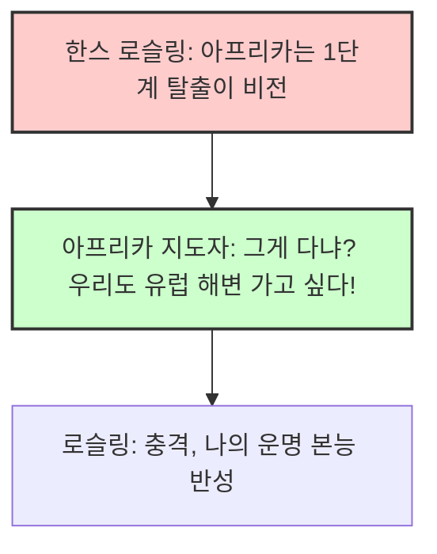
```mermaid
graph TD
    A["한스 로슬링: 아프리카는 1단계 탈출이 비전"] --> B["아프리카 지도자: 그게 다냐? 우리도 유럽 해변 가고 싶다!"]
    B --> C["로슬링: 충격, 나의 운명 본능 반성"]
    style A fill:#FFCCCC,stroke:#333,stroke-width:2px
    style B fill:#CCFFCC,stroke:#333,stroke-width:2px
```

1. **저자의 반성**: 저자는 자신이 운명 본능에 빠졌던 경험을 이야기한다. 
  1. 저개발 국가에 가서 컨퍼런스에서 여성 지도자들에게 '저개발 국가들이 2단계, 3단계로 갈 수 있는가'에 대한 강의를 하고 뿌듯해했다. 
  2. 하지만 아프리카 연합의 사무국장인 드라미니 주마(Dlamini Zuma)가 와서 "도표도 훌륭하고 말씀도 좋았지만, 비전이 없다"고 지적했다. 
  3. 저자는 '저개발 국가가 2단계, 3단계로 올라가는 것이 거대한 비전이 아니냐'고 생각했지만, 상대는 "아프리카 사람들은 극빈층이 사라지면 그걸로 만족하는 사람들이냐? 우리도 유럽의 해변으로 관광 갈 수 있고, 4단계 소득 수준까지 올라갈 수 있는 사람들인데, 왜 당신은 1단계만 탈출하는 것을 비전이라고 얘기하냐"고 반문했다. 
  4. 저자는 자신이 부지불식간에 아프리카의 운명을 상정하고 있었던 것이다. 
  5. 한국의 경우에도, 유럽이나 미국의 위치에 오르기 어렵다는 인식을 자신도 모르게 하고 있었던 것이다. 
  6. 이는 과거에서 온 편견이며, 저자는 이 지적에 무너져 내렸다고 고백한다. 

## 62. 아프리카에 대한 일반화와 한국의 위상 

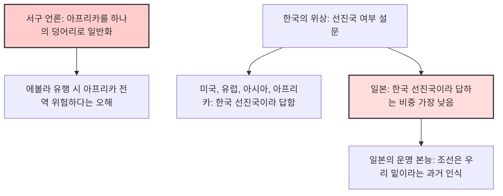
```mermaid
graph TD
    A["서구 언론: 아프리카를 하나의 덩어리로 일반화"] --> B["에볼라 유행 시 아프리카 전역 위험하다는 오해"]
    C["한국의 위상: 선진국 여부 설문"] --> D["미국, 유럽, 아시아, 아프리카: 한국 선진국이라 답함"]
    C --> E["일본: 한국 선진국이라 답하는 비중 가장 낮음"]
    E --> F["일본의 운명 본능: 조선은 우리 밑이라는 과거 인식"]
    style A fill:#FFCCCC,stroke:#333,stroke-width:2px
    style E fill:#FFDDDD,stroke:#333,stroke-width:2px
```

1. **아프리카에 대한 **일반화: 에볼라가 유행하면 아프리카 전역이 위험하다고 생각하지만, 아프리카는 하나의 덩어리가 아니다. 
  1. 언론 보도에서도 개발도상국 이름을 유난히 안 부르고 '아프리카'라고 부르는 경우가 많다. 
  2. 특정 국가에서 온 노동력을 노예처럼 부린 사건이 있었을 때도 '아프리카 노예 사건'이라고 불렀다. 
2. **한국의 위상에 대한 인식**: 한국의 위상에 대한 설문조사에서 한국이 선진국이냐고 물으면, 한국인 스스로 선진국이라고 대답하는 비중도 높아졌고, 미국, 유럽, 아시아, 아프리카 등 다른 나라에서는 엄청 높게 답한다. 
  1. 하지만 전 세계에서 한국이 선진국이라고 대답하는 비중이 가장 낮은 나라는 일본이다. 
  2. 일본인들은 과거 일제강점기 때 '조선은 우리 밑이야'라고 생각했던 운명 본능을 여전히 가지고 있기 때문이다. 
  3. 한국에 대한 신뢰도가 전 세계 모든 나라 중 일본이 제일 낮다. 
  4. 일본은 이미 구매력 기준 1인당 GDP가 한국보다 낮아졌음에도 불구하고, 이를 믿어주지 않는다. 
  5. 코로나19 대처 과정에서도 일본은 형편없는 모습을 보였지만, 일본 사람들은 일반적으로 유럽 사람들이 아프리카를 보듯이 한국을 보고 있는 것이다. 
  6. 이는 우리가 뭘 잘못한 것이 아니라, 그들이 운명 본능에 사로잡혀 있기 때문이다. 
3. **한국과 일본의 인식 차이**: 팩트풀니스 책의 부록에는 각 국가의 정답률이 그래프로 나와 있다. 
  1. 각 국가가 12문제에 대해 얼마나 맞췄는지를 숫자로 적은 다음, 두 나라 사이의 거리를 재면 세상을 보는 눈이 얼마나 비슷한지 알 수 있다. 
  2. 분석 결과, 전 세계 국가들을 3개 그룹으로 나눌 수 있었는데, 한국은 미국, 캐나다, 호주와 비슷한 그룹에 속했다. 
  3. 반면 일본은 동유럽 국가들과 비슷한 그룹에 속했다. 
  4. 즉, 한국 사람들이 세상을 보는 눈은 일본보다 미국에 가깝고, 일본 사람들은 동유럽에 가깝다는 것이다. 

## 63. 이란의 출산율 변화: 문화보다 교육과 소득이 중요 

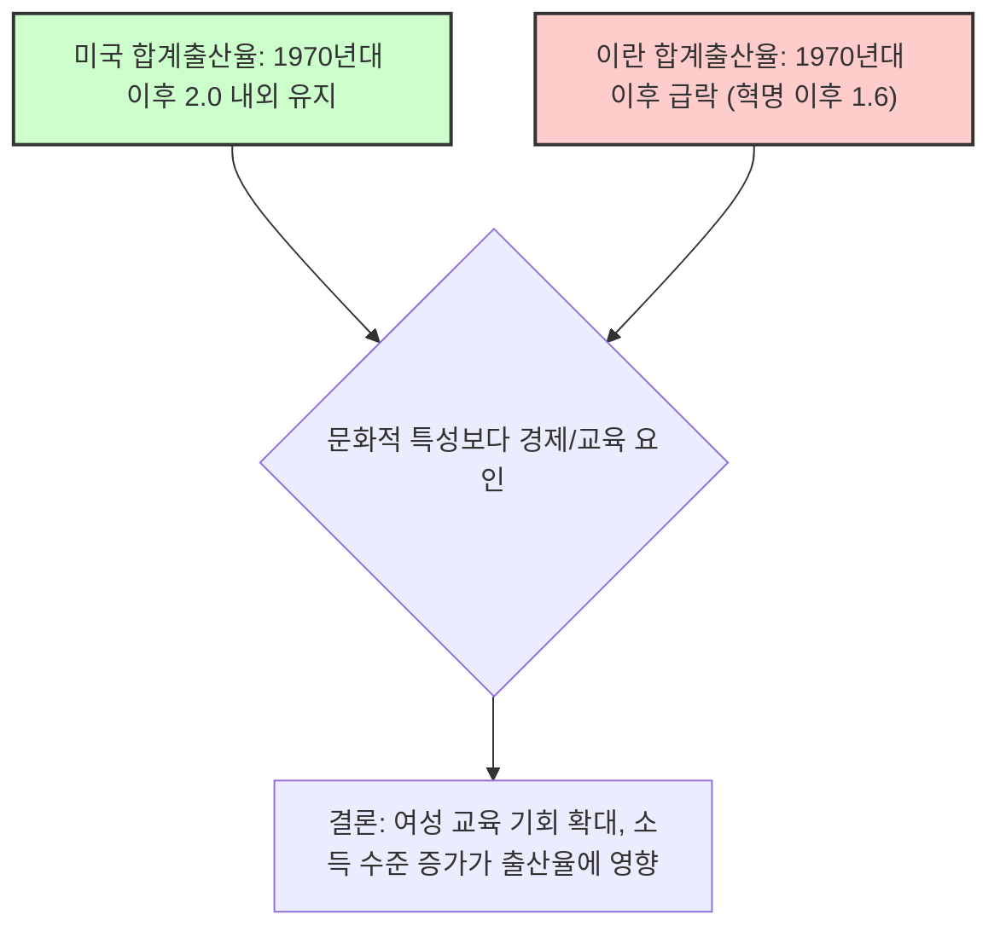
```mermaid
graph TD
    A["미국 합계출산율: 1970년대 이후 2.0 내외 유지"] --> C{"문화적 특성보다 경제/교육 요인"}
    B["이란 합계출산율: 1970년대 이후 급락 (혁명 이후 1.6)"] --> C
    C --> D["결론: 여성 교육 기회 확대, 소득 수준 증가가 출산율에 영향"]
    style A fill:#CCFFCC,stroke:#333,stroke-width:2px
    style B fill:#FFCCCC,stroke:#333,stroke-width:2px
```

1. **이란의 **합계출산율: 248쪽에 실린 미국과 이란의 합계출산율 그래프는 매우 충격적이다. 
  1. 미국은 1970년대 이후 2.0 내외에서 변화했고, 2017년에는 1.9였다. 
  2. 이란은 1970년대 이후(이란 혁명 이후) 출산율이 절벽처럼 떨어져 지금은 1.6으로 미국보다 더 낮다. 
  3. 이는 우리가 가지고 있는 '이슬람 여성들은 집에만 머무르고, 남자는 부인을 여럿 거느린다'는 일반화된 관념과 전혀 맞지 않는 데이터이다. 
2. **문화적 특성의 변화**: 이 데이터는 운명이라고 믿었던 문화적 특성이 사실은 경제적 상황과 교육이라는 환경적 요인에 의해 언제든 유연하게 변화할 수 있음을 증명한다. 
  1. 이란 사회 내부에서 굉장히 빠른 사회 문화적인 변화가 이루어지고 있을 것이라는 추측을 가능하게 한다. 
  2. 여성들의 출산율이 낮아졌다는 것은 이란 여성들의 세계관과 가치관, 자기 삶에 대한 태도와 삶의 방식이 바뀌었다는 의미이다. 
  3. 유엔에서 계속 강조했던 소녀 교육의 중요성도 떠올리게 한다. 
3. **이란 출신 대학생과의 대화**: 저자가 강의실에서 이란 출신 대학생과 나누었던 대화도 감동적이었다. 
  1. 저자도 이란 대학원생을 만났을 때 놀랐지만, 만나서 같이 연구하고 얘기해 보면 굉장히 열려있고 아무런 차이를 못 느꼈다. 
  2. 이란과 이라크는 멀리서 보면 비슷해 보여도 사실은 정말 다르다. 
  3. 이란은 페르시아 쪽이고 이라크는 아랍인이며, 종교적인 갈등도 심하다. 
  4. 이처럼 우리가 세상을 뭉뚱그려 보는 경향이 있다. 

## 64. 단일 관점 본능: 평균 수명과 국민 소득의 관계 

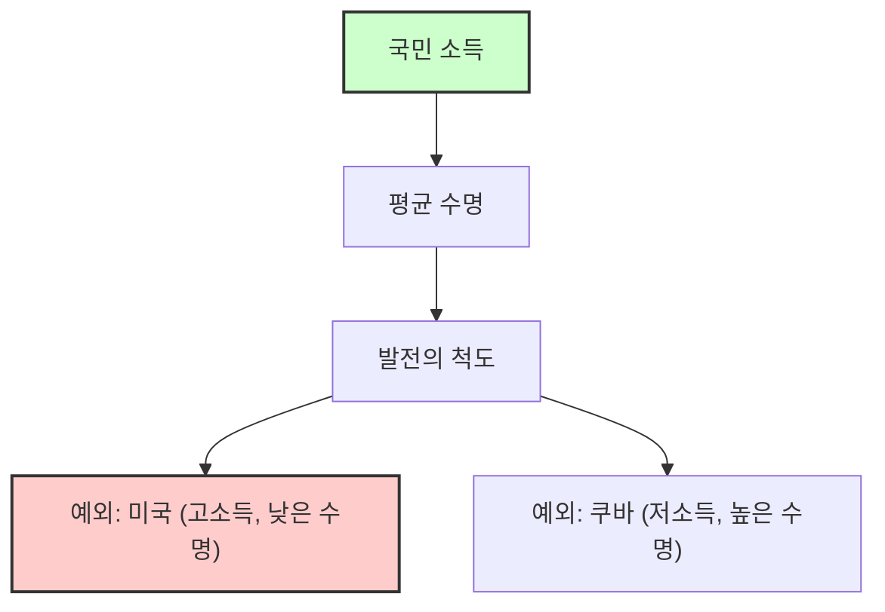
```mermaid
graph TD
    A["국민 소득"] --> B["평균 수명"]
    B --> C["발전의 척도"]
    C --> D["예외: 미국 (고소득, 낮은 수명)"]
    C --> E["예외: 쿠바 (저소득, 높은 수명)"]
    style A fill:#CCFFCC,stroke:#333,stroke-width:2px
    style D fill:#FFCCCC,stroke:#333,stroke-width:2px
```

1. **오래된 그래프의 통찰**: 281~282쪽에 나오는 평균 수명과 국민 소득 사이의 관계 그래프는 보건 경제학 분야에서 50년 전부터 유행하던 그래프이다. 
  1. 이 그래프를 통해 오래 사는 나라 사람들은 왜 오래 사는지 알 수 있다. 
  2. 국민의 평균 수명을 발전의 척도로 선택할 수 있다면, 그것이 유일한 척도는 아니지만, 사람들이 평균적으로 오래 산다는 것은 그렇지 못한 나라에 비해 모든 것이 좋을 가능성이 높다. 
  3. 출생 시 기대여명 또는 평균 수명이 일반적인 발전의 지표로 채택될 경우, 어떤 요소가 평균 수명의 연장을 가져왔는지 흥미로운 분석을 담고 있다. 
2. **의료 기술의 한계**: 우리는 보통 병원이 잘 되어 있고, 의사 선생님들이 훌륭한 의료 기술을 갖추고 있으며, 좋은 약이 많으면 그 나라 사람들도 오래 살 것이라고 생각한다. 
  1. 하지만 이 데이터는 그렇지 않다는 것을 보여준다. 

## 65. 미국의 수수께끼: 높은 의료비 지출과 낮은 평균 수명 

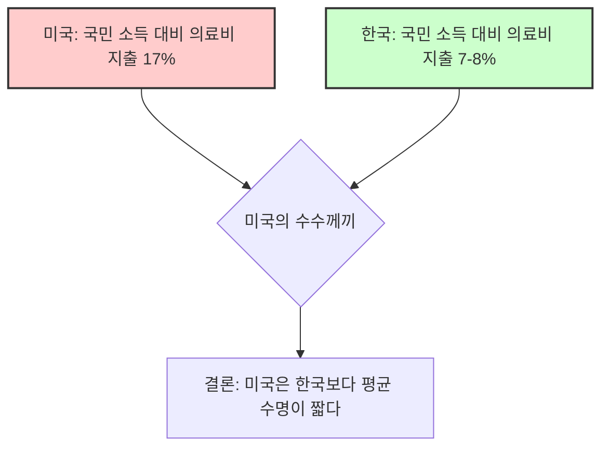
```mermaid
graph TD
    A["미국: 국민 소득 대비 의료비 지출 17%"] --> C{"미국의 수수께끼"}
    B["한국: 국민 소득 대비 의료비 지출 7-8%"] --> C
    C --> D["결론: 미국은 한국보다 평균 수명이 짧다"]
    style A fill:#FFCCCC,stroke:#333,stroke-width:2px
    style B fill:#CCFFCC,stroke:#333,stroke-width:2px
```

1. **미국의 역설**: 미국은 세계 최강국이고 국민 소득도 높으며, 의료 기술도 세계 최고 수준이지만, 한국보다 평균 수명이 짧다. 
  1. 미국은 국민 소득 대비 의료비 지출 비중이 17%로, 한국(7~8%)보다 2배 반이 높다. 
  2. 이것은 매우 흥미로운 수수께끼이다. 
2. 단일 관점** 본능의 오류**: 의료비 지출을 많이 한다고 해서 사람들이 다 오래 산다는 것은 단일 관점 본능의 오류이다. 

## 66. 한국의 발전과 군부 독재: 단일 관점의 위험성 

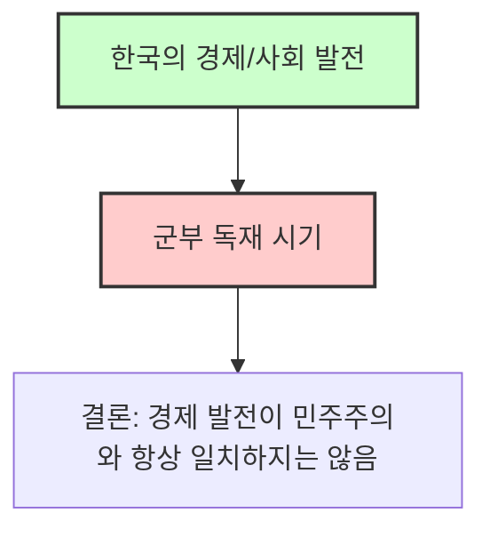
```mermaid
graph TD
    A["한국의 경제/사회 발전"] --> B["군부 독재 시기"]
    B --> C["결론: 경제 발전이 민주주의와 항상 일치하지는 않음"]
    style A fill:#CCFFCC,stroke:#333,stroke-width:2px
    style B fill:#FFCCCC,stroke:#333,stroke-width:2px
```

1. **한국 사례에 대한 불만**: 286쪽에 "경제와 사회가 크게 발전한 나라라고 해서 다 민주 국가는 아니다"라는 예시로 한국이 등장한다. 
  1. 한국은 어느 나라보다 빨리 1단계에서 3단계로 넘어갔고, 그 시기는 줄곧 군부 독재가 이어졌다고 설명한다. 
  2. 이는 한국에 대해 아주 짧게 보고 근거로 삼은 것이 아닌가 하는 불만이 있다. 
2. **군부 독재와 경제 발전**: 이 문장 자체는 오류가 아니지만, 군부 독재가 한국의 경제 발전에 도움이 되었다고 결론 내리기는 어렵다. 
  1. 군부 독재가 개발에 미치는 영향에 대해서는 여전히 논쟁 중이다. 
  2. 이집트 출장 시 학자 책상에서 박정희 리더십과 새마을 운동에 대한 논문이 쌓여 있는 것을 본 적이 있다. 
  3. 개발도상국, 특히 군부의 힘이 센 나라들에서는 박정희에 대해 우리가 생각하는 것보다 훨씬 더 열심히 연구하고 좋아한다. 
  4. 개발 독재 시절의 경제 발전 속도가 빨랐다는 것은 합의할 수 있는 부분이다. 

## 67. 보건 경제학의 통찰: 평균 수명을 결정하는 요인 

```mermaid
pie title 평균 수명 결정 요인
    라이프스타일 : 40
    영양 상태 : 25
    전염병 예방 : 20
    의료 기술 및 병원 : 10
    기타 : 5
```

1. **정치 체제와 보건 발전의 관계**: 보건 경제학의 데이터는 정치 체제 시스템과 보건 의료 발전 사이에 뚜렷한 상관관계나 인과관계를 설정할 수 없다는 쪽으로 기울어진다. 
  1. 중국은 국민 소득 수준이 낮고 의료비 지출 비중이 작으며 공산당 일당 독재를 하는 시기에 보건 데이터가 엄청나게 좋아졌다. 
  2. 개혁 개방 정책을 시작한 이후에는 더 빠르게 좋아졌다. 
  3. 이러한 나라들의 보건 데이터 향상을 무엇으로 설명할 것인가가 큰 연구 과제였다. 
2. 평균 수명** 결정의 핵심 요인**: 보건 데이터가 말해주는 것은 군부 독재와 보건 상황의 관계나 민주주의와 보건 데이터 향상 사이에 필연적인 인과관계가 없다는 것이다. 
  1. 핵심은 평균 수명을 결정하는 요인 중 제일 압도적 비중을 가진 것이 '라이프스타일'이다. 
  - 개인의 위생이 좋아지고 주변 환경이 청결해지는 등 건강한 생활을 하는 것이 가장 중요하다. 
  2. 두 번째는 '영양 상태'인데, 이는 국민 소득 수준과 직결된다. 
  3. 세 번째는 '전염병 예방'이다. 여기에는 도시 재설계 같은 것도 포함된다. 
  4. 우리가 흔히 생각하는 의료비 지출, 고급 병원, 고급 의료 기술 등이 국민 전체의 평균 수명 연장에 미치는 영향은 10% 수준밖에 되지 않는다. 
3. **중국과 한국의 사례**: 중국은 사회주의 국가 수립 이후 의료 인프라가 전혀 없었을 때, 초급 의료 교육을 받은 젊은이들을 각 마을까지 보냈다. 
  1. 한국도 박정희 대통령 시절에 보건소와 보건진료소를 만들고 간호사를 파견하여 기본적인 방역, 개인 위생 캠페인, 기생충 퇴치 사업 등을 했다. 
  2. 이처럼 의료 기술과는 무관한 것들이 압도적인 영향을 발휘한 것이다. 
4. **미국의 문제점**: 미국은 기본적인 전염병 관리가 안 되고 있고, 빈부 격차와 인종 간의 갈등이 심해서 양질의 의료 관리가 안 되는 경우가 많다. 
  1. 의료 기술은 최고급으로 발전했지만, 국민 건강 보험 제도 같은 것이 미비해서 제때 치료받지 못하는 사람도 많다. 
  2. 그래서 보건 경제학 분야에서는 미국을 오래전부터 후진국 취급해 왔다. 

## 68. 민주주의와 정책 결정: 단일 관점의 한계 

```mermaid
graph TD
    A["민주주의"] --> B["시민 의사 반영"]
    A --> C["통치 체제 원리"]
    B --> D["기능이 잘 돌아가면 됨"]
    C --> D
    E["민주주의에 대한 과도한 기대"] --> F["민주주의 위태롭게 함"]
    style A fill:#CCFFCC,stroke:#333,stroke-width:2px
    style E fill:#FFCCCC,stroke:#333,stroke-width:2px
```

1. **독재와 공공 의료**: 중국의 경우 독재 정권으로 운영하면서 공공 의료가 발달할 수 있는 조건이 된 것은 맞다. 
  1. 박정희 시절 독재 정권 시절에 경제가 발전한 것도 맞다. 
  2. 하지만 반드시 독재해야 그 조건이 갖춰지느냐는 것은 팩트풀니스 영역이 아니다. 
  3. 정부가 나서서 강제로 해주면 된다고 생각하는 경향이 있지만, 평가는 똑바로 하는 것이 중요하다. 
2. **민주주의의 역할**: "민주주의는 만능 통치학이 아니다." 
  1. 민주주의가 모든 문제를 풀어줄 만능 열쇠라고 생각하는 것은 민주주의 자체를 위태롭게 할 수 있다. 
  2. 민주주의는 통치 체제의 원리를 이야기하는 것이고, 시민들의 의사가 어떻게 정치 결정에 반영되는가에 대한 이야기이므로, 그 기능이 잘 돌아가면 된다. 
  3. 민주주의는 그러한 논의를 시작하기 위한 전제 조건이다. 
3. **미국 민주주의의 한계**: 미국이 전국민 건강보험 제도를 도입하지 못하는 이유도 어찌 보면 민주주의 때문이다. 
  1. 미국 특유의 민주주의는 금권 정치가 거의 무제한적으로 허용되어 있다. 
  2. 제약사들부터 시작해서 이익 집단들이 로비를 어마어마하게 해서 입법이 안 된다. 
  3. 보건 분야에 관해서는 미국 민주주의가 무능의 극치를 보여주고 있다. 

## 69. 비난 본능: 할머니를 패자고? 

```mermaid
graph TD
    A["학생: 말라리아 약 개발 안 하는 제약회사 CEO를 패자!"] --> B["로슬링: CEO 패면 해결될까?"]
    B --> C["다른 학생: 이사회 결정이니 이사를 패자!"]
    C --> D["로슬링: 이사 패면 해결될까?"]
    D --> E["로슬링: 주주가 연기금인데, 결국 자네 할머니가 문제다!"]
    style A fill:#FFCCCC,stroke:#333,stroke-width:2px
    style E fill:#CCFFCC,stroke:#333,stroke-width:2px
```

1. **비난 본능의 에피소드**: 저자는 '할머니를 패자'는 제목의 에피소드로 비난 본능을 시작한다. 
  1. 학생들에게 제약회사들이 말라리아 약을 독처럼 연구하지 않는다고 얘기해 주면서, 그중 한 거대 제약회사에 강의하러 갈 것이라고 했더니, 한 학생이 "가서 면상을 한 대 갈겨 주세요"라고 말했다. 
  2. 저자가 "사장을 갈기면 문제가 해결될까?"라고 묻자, 옆에 있던 학생이 "이사회 결정이니까 이사를 갈겨야 한다"고 했다. 
  3. 저자가 "이사를 때리면 문제가 해결될까?"라고 묻자, 사실 그 거대 제약회사 주식을 누가 갖고 있냐면 은퇴 기금, 즉 우리 국민 연금 같은 곳이 갖고 있기 때문에, 결국 "자네의 할머니가 문제다"라고 결론이 났다. 
2. **단순한 원인 찾기**: 비난 본능은 안 좋은 일이 일어났을 때, 사람들은 어떤 명확하고 단순한 원인을 찾으려는 본능이 있다는 것이다. 
  1. 큰 사고가 일어날 때마다 책임자 처벌을 이야기하는 것과 비슷하다. 
  2. 우리 사회는 책임자를 처벌한 다음에 마치 문제가 해결된 것처럼 넘어가려는 경향이 있다. 
  3. 그래서 똑같은 일들이 계속 반복되는 것이다. 
  4. 비난 본능은 우리 사회에서 꽤 중요한 문제이다. 

## 70. 복잡한 문제와 언론의 책임 

```mermaid
graph TD
    A["복잡한 문제 (세월호, 메르스)"] --> B["비난 본능 (개인 책임 전가)"]
    B --> C["언론의 속보 경쟁"]
    C --> D["선정적 기사, 시스템 분석 부족"]
    D --> E["문제 해결 지연, 반복"]
    style A fill:#FFCCCC,stroke:#333,stroke-width:2px
    style D fill:#FFDDDD,stroke:#333,stroke-width:2px
```

1. **책임자 처벌 이후의 문제**: 세월호 참사 같은 문제가 반복되었을 때도, 복잡한 해결책이 필요한데도 처벌을 늘리거나 해당 경찰관을 파면하는 식으로 대응한다. 
  1. 조두순 사건 이후 전체 형법의 유기징역 형량이 2배로 늘었지만, 조두순은 당시 법으로 12년을 받는 데 그쳤다. 
  2. 아동 성범죄에 대한 복잡다단한 시스템 해결책을 찾는 대신, 국회에서는 당시 그렇게 입법하고 넘어갔다. 
  3. 이는 비난 본능에 의해 사람들이 비난하는 것을 국회에서 당장 그렇게 입법함으로써 피할 수 있었기 때문일 수 있다. 
2. **인지적 자원의 소모**: 사람들은 문제가 잘못되었을 때 원인을 알고 싶어 하지만, 복잡하게 잘못되어 있을 때 이를 하나하나 따져가면서 아는 것은 인지적 자원을 많이 써야 하는 일이다. 
  1. '누가 문제야'라고 하는 것은 직관적이고 쉽기 때문에, 생각하지 않는 쪽으로 많이 기울게 된다. 
  2. 하지만 백날 그래도 똑같은 일들이 계속 일어나는데, 이는 원인이 다른 데 있다는 뜻이다. 
3. **메르스 사태와 언론**: 2015년 메르스(MERS)가 유행할 때, 언론이 지퍼야 했던 문제는 '왜 한국 의료 시스템은 응급실 감염에 취약한가', '왜 6인실 같은 감염에 취약한 시스템이 국민건강보험의 보호까지 받으면서 유지되는가' 같은 것이었다. 
  1. 이러한 질문들을 하나하나 푸는 것이 훨씬 더 중요한 질문이었지만, 당시 한국 언론이 압도적으로 제기했던 것은 '38번 의사가 어디에 모임에 나갔다', '서울시장이 문제다', '대통령이 문제다' 같은 것이었다. 
  2. 이러한 목소리, 그런 기사들이 훨씬 더 잘 팔린다. 
  3. 구조를 차분하게 천착한 기사가 없었던 것은 아니지만, 우리 눈에 안 보였을 뿐이다. 
  4. 속보 경쟁에 매몰되면서 진지하게 문제를 종합적으로 분석하고 해설해 주는 목소리는 거의 다 묻혀 버리고, 선정적인 기사만 난무하게 된다. 
4. **행위자 가정 본능**: 진화 심리학에서도 과거에는 설명할 수 없는 현상이 있으면 항상 행위자가 있다고 가정했다. 
  1. 지금도 우리는 여전히 거기에 매여 있는 것 같다. 
  2. 뭔가 일이 있으면 '누군가 나쁜 사람이 뭘 했다'고 하는 것이다. 
  3. 이러한 일종의 음모론까지 번지는 것들이 우리 사회의 모든 영역에 다 똑같다고 본다. 

## 71. 정치 지도자의 덕목: 시스템 이해와 공감 

```mermaid
graph TD
    A["이상적인 정치 지도자"] --> B["팩트풀니스 사고방식에 익숙"]
    B --> C["다양한 관점 수용"]
    B --> D["시스템 이해 및 개선 노력"]
    D --> E["국민의 인지적 왜곡 이해"]
    E --> F["정책적 판단 우선"]
    style A fill:#CCFFCC,stroke:#333,stroke-width:2px
```

1. 비난 본능** 극복의 해결책**: 저자는 비난 본능을 이기기 위해 '영웅을 보려고 하지 말고 시스템에 주목하라'고 제시한다. 
2. **팩트풀니스에 부합하는 지도자상**: 정치 지도자라면 이 책에 담긴 사고방식에 익숙해 있는 분이어야 한다. 
  1. 이러한 사고를 하는 사람들의 목소리에 귀를 기울이고, 그 사람들의 제안을 받아들일 수 있는 지도자 정도를 기대할 수 있다. 
  2. 이러한 내용들을 잘 이해하는 정치 지도자는 인간이 어떻게 사실에 가깝게 다가갈 수 있는지도 이해해야 하지만, 보통 사람들이 인지 자원을 쓰지 않을 때 어떻게 판단이 왜곡되는가에 대한 이해도 정말 중요하다. 
  3. 이는 무작위로 틀리는 것이 아니라, 특정한 방향으로 체계적으로 틀리는 것이기 때문에, 이 틀리는 방향에 대해 이해하고 있는 것도 지도자에게 중요한 덕목일 수 있다. 
3. **정책적 판단 우선**: 정치공학적으로 정략적인 판단을 하는 지도자보다는, 정책적 판단을 해주는 지도자를 원한다. 
  1. 정치인의 욕망은 없앨 수 없고 인정해야 하지만, 그 욕망이 공적으로 좋은 방향으로 갈 수 있도록 어떻게 이끌 수 있느냐는 질문이 더 중요하다. 
  2. 정치인의 욕망을 인정할 때, 재선되고 싶다는 욕망이 어떻게 사회를 좋은 방향으로 끌고 나갔을 때 달성될 수 있는 체제를 만들 것인가를 고민해야 한다. 

## 72. 다급함 본능: 조급한 결정의 위험성 

1. **멍청한 결정**: 323쪽 아래쪽에 "두렵고 시간에 쫓기고 최악의 시나리오가 생각날 때면, 인간은 정말로 멍청한 결정을 내리는 성향이 있다"는 문장이 있다. 
  1. "빨리 결정하고 즉각 조치 취해야 한다"는 다급함에 쫓기다 보면 분석적으로 생각하기 어렵다. 
  2. 이는 바늘 허리에 실 묶어 쓰랴, 우물가에서 숭늉 찾는다 같은 말처럼 당연한 것인데도, 이 다급한 분위기가 매우 위험하다. 
2. **보이스피싱의 원리**: 위험이 임박했다고 느낄 때 즉각 행동하고 싶은 본능이 다급함 본능이다. 
  1. 이 챕터를 차분히 읽으면 보이스피싱에 걸릴 확률이 낮아진다. 
  2. 사기꾼들이 다급한 상태로 말하면서 "정말 큰일 났어", "빨리 돈을 보내야 해"라고 하면, 듣고 싶었던 대로 들려 버리는 것이다. 

## 73. 기후 문제와 다급함 본능: 두려움 조장의 딜레마 

```mermaid
graph TD
    A["앨 고어: 기후 문제 해결 위해 두려움 만들어야"] --> B["로슬링: 그건 아닌 것 같다 (사실 기반 소통 주장)"]
    B --> C["딜레마: 시간이 없는데 두려움이 필요한가?"]
    C --> D["과학자: 다급하다면 다급하게 알려야 한다"]
    C --> E["유시민: 모든 사람이 매일 느끼는 순간엔 이미 늦다"]
    style A fill:#FFCCCC,stroke:#333,stroke-width:2px
    style B fill:#CCFFCC,stroke:#333,stroke-width:2px
```

1. **앨 고어의 제안**: 327쪽에 보면 앨 고어(Al Gore) 전 미국 부통령이 저자에게 기후 문제 해결을 위해 "두려움을 만들어야 한다"고 제안했다. 
  1. 저자는 "그건 아닌 것 같다"고 얘기했다는 에피소드가 있다. 
  2. 교육이 급박하고 과학적으로 사실이며, 인구의 계통 철학을 예측 가능하고 사실인데, 이에 대해 정치가 행동할 여지가 갈수록 좁아지고 시간은 계속 없어지는 상황이다. 
  3. 사람들이 사실을 정확하게 이해하면 행동할 것인가에 대한 확신이 없다. 
  4. 그래서 두려움을 만들어야 할 필요가 있다는 주장과, 그것이 좋은 의사 결정 방식인가에 대한 회의가 양쪽 다 있다. 
2. **과학자의 입장**: 과학자들은 기후 위기에 대한 부분이 너무 소심하게 행동하는 것 같다는 느낌을 받는다. 
  1. 시간은 없어지고 정치인들은 잘 안 움직일 때, 과연 과학자들이 어떤 이야기를 하는 것이 맞는 것인지는 답이 없다. 
  2. 가짜 데이터를 갖고 엉뚱하게 이야기하는 것은 당연히 하면 안 되지만, 만약 상황이 다급하다면 다급하다는 것을 다급하게 알려줘야 한다고 생각한다. 
3. **정치적 다급함의 역사**: 박정희 대통령 치하에서 국가 안보가 위험하다거나 국가 경제 발전을 위해 긴급한 조치를 취해야 한다고 강조하는 이야기를 들었다. 
  1. 선거를 할 때마다 모든 정당들이 "우리 역사의 결정적으로 중요한 선거입니다"라고 말하지 않은 적이 없다. 
  2. 하지만 기후 변화는 사실 레벨이 다르다. 
  3. 모든 사람이 기후 변화가 정말 심각한 문제라고 매일매일의 생활에서 느끼게 되는 순간에는 이미 바꿀 수 없는 상황이 될 가능성이 크다. 
4. **개인의 무력감과 시스템의 역할**: 평범한 사람들에게 기후 위기가 문제가 있는지 물어보면 다 문제 있다고 답한다. 
  1. 하지만 몰라서 행동을 못 하는 것이 아니라, 내가 무슨 행동을 해야 결과를 바꿀 수 있는지를 알 수가 없는 것이다. 
  2. 이는 너무나 큰 일이고, 70억 인구가 동시에 집합 행동을 해야 하는 어려운 문제인데, 나 개인이 무엇을 했을 때 어떤 차이를 만들어낼 수 있을 것인가 부분에서 답이 안 나오기 때문이다. 
  3. 정치가 이 답을 주면 좋겠다고 생각한다. 
  4. 정부나 정치에서 할 수 있는 일이 많으며, 경제 발전의 기회로 삼을 수도 있다. 

## 74. 팩트풀니스 실천 방안 

```mermaid
graph TD
    A["교육"] --> B["사실과 통계 널리 알리기"]
    C["업계 변화"] --> D["기업의 윤리적 실천"]
    E["언론인, 활동가, 정치인 변화"] --> F["책임감 있는 소통"]
    G["조직 변화"] --> H["사실 기반 의사 결정"]
    B --> I["더 나은 세상"]
    D --> I
    F --> I
    H --> I
    style A fill:#CCFFCC,stroke:#333,stroke-width:2px
    style C fill:#FFDDCC,stroke:#333,stroke-width:2px
    style E fill:#FFEECC,stroke:#333,stroke-width:2px
    style G fill:#FFFFCC,stroke:#333,stroke-width:2px
```

1. **실천 편**: 11장은 팩트풀니스를 일상에서 어떻게 실천할 것인가에 대한 내용이다. 
  1. **교육**: 사실과 통계 자체가 널리 알려져야 한다. 
  2. **업계의 변화**: 기업이 뭔가 해야 할 것 같다. 
  3. **언론인, 활동가, 정치인의 변화**: 이들의 변화가 필요하다. 
  4. **조직의 변화**: 자신이 속한 조직들이 변화해야 한다. 
2. **저자의 마지막 당부**: 저자가 이 책을 쓸 때 어떤 심정이었을까 하는 생각이 든다. 
  1. 자신이 떠난 뒤에도 세상이 더 나아지기를 바라는 마음이 책 전체에 흐르는 태도이다. 
  2. 세상은 더 나아졌고, 어떻게 나아졌는지를 우리가 제대로 이해할수록 좀 더 나아지게 만들 수 있다는 메시지이다. 
  3. 이 마지막 당부는 평범한 이야기처럼 들리지만, 저자가 생명이 얼마 남지 않았을 때 쓴 글이라 더욱 의미가 깊다. 
  4. 책의 마무리 부분에 도와준 사람들의 이름을 여러 페이지에 걸쳐 나열한 것도 인상적이다. 

## 75. 팩트풀니스를 읽고 얻은 것 

1. **세상을 더 좋게 만들려는 노력**: 이 책을 읽은 사람들 중에는 "세상이 좋아지고 있구나. 그럼 뭐 나아서 얘들이 매일 때 그러니까, 이대로 가도 되겠네"라고 읽는 사람들도 있다. 
  1. 하지만 저자가 하고 싶었던 이야기는 정확히 그 반대이다. 
  2. 어떤 층위에 그냥 사실을 모아놓으면 그게 답이라고 얘기하는 것이 아니라, 어떤 렌즈를 쓰느냐에 따라서 또, 그 층위에 맞는 사실들이 무엇이냐, 그 맥락까지 고려해야 판단을 할 수 있다는 것이다. 
  3. 맹목적으로 낙관적으로 읽지도 말고, 사실이 어떻게 다른가에 대한 태도를 가질 때 다음 도전들도 넘어갈 수 있다는 가능성에 대한 이야기이다. 
  4. 이것이 저자가 '사실충실성'이라고 말한 것 같다. 
2. **세상을 이해하고 바꾸는 방법**: "세상을 이해하고 바꾸고 싶다면, 수치를 보되 수치만 보지 말아라." 
  1. 물리학 같은 정량 과학 백그라운드를 가진 사람은 자꾸 숫자만 보려고 하는 경향이 있는데, 숫자만으로 세상을 이해하지 말아야겠다는 교훈을 얻었다. 
  2. 하지만 그럼에도 불구하고 어떤 숫자, 어떤 정량화된 데이터의 중요성 같은 것을 아주 강하게 어필하는 의미 있는 책이다. 
3. **문제는 있지만 나아지고 있다**: 한국 사회도 인류 문명도 여전히 문제가 있지만, 그래도 조금씩 계속 나아져왔다고 믿는다. 
  1. 그리고 그렇게 나아오는 과정에서 부정 본능의 역할이 굉장히 컸다. 
  2. 세상이 지옥 같다고 생각하면서 뛰는 분들을 욕할 필요는 없을 것 같다. 
  3. 부정 본능이 강력한 분들이 계속 문제를 제기하고 있으니, 이것도 많이 심화되어 있는 결과인 데이터의 개선이 이루어진 것이다. 
  4. 부정 본능이 발현되는 분들에 대해 "맨날 나쁜 얘기만 한다"고 하지 말고, "이 문제가 살아남으려면 부정 본능이 강력한 분들이 필요하다"는 점을 이해해 주면 좋겠다. 
4. **생각의 힘을 기르는 습관**: 팩트에 입각한 이성이 수천 년간 축적된 본능을 이길 수 있을까? 
  1. 저자의 말대로 두려움과 다급함에서 벗어나서, 대상을 있는 그대로 바라보는 습관이야말로 생각의 힘을 기르는 데 중요하다. 

