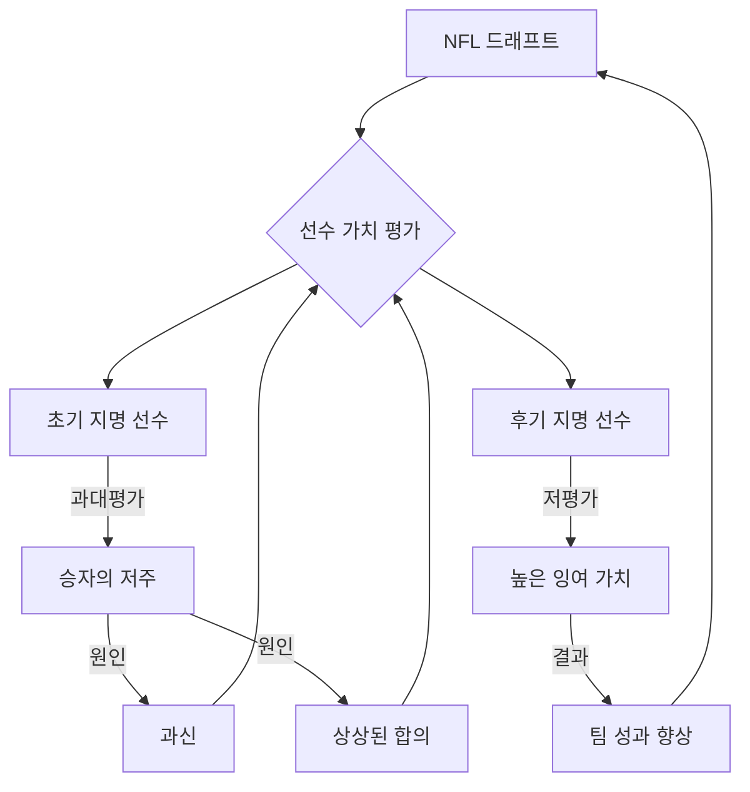

## 행동경제학의 탄생: 인간의 '잘못된 행동'을 이해하다
이 책은 사람들이 경제 활동에서 비합리적으로 행동하는 다양한 사례를 통해 전통 경제학의 한계를 지적하고, 심리학을 접목한 행동경제학이 어떻게 탄생하고 발전했는지 저자의 경험을 바탕으로 쉽고 재미있게 설명하는 책이다. 인간의 '잘못된 행동'이 경제 이론과 정책에 어떤 중요한 영향을 미치는지 보여준다.

## 1. '이콘'과 '인간': 경제학의 두 얼굴 

전통 경제학은 사람들이 항상 합리적으로 행동한다고 가정하는데, 저자는 이런 가상의 존재를 '이콘(econs)'이라고 부른다. 하지만 현실 속 우리는 '인간(humans)'이며, 이콘과는 다르게 행동하는 경우가 많다.

1. **이콘의 특징**:
  - 수학을 아주 잘하고, 간디처럼 자기 통제력이 뛰어나다. 
  - 완전한 이기주의자라서, 지갑이 떨어져 있어도 잡히지 않을 것이 확실하면 가져갈 것이다. 
  - 다시는 가지 않을 식당에서는 팁을 남기지 않는다. 
  - 최적의 몸무게를 유지해서 다이어트할 필요가 없고, 숙취도 겪지 않는다. 
  - 모든 돈을 똑같이 생각하고, 감정이나 상황에 휘둘리지 않는다. 

2. **인간의 '**잘못된 행동**'**:
  - 이콘의 기준에서 보면, 인간은 '잘못된 행동(misbehave)'을 한다. 
  - 예를 들어, 다시는 가지 않을 식당에도 팁을 남긴다. 
  - 이런 행동을 연구하는 것 자체가 전통 경제학자들에게는 '잘못된 행동'으로 여겨졌다. 
  - 책의 제목인 'Misbehaving'은 이런 인간의 비합리적인 행동과, 이를 연구하는 저자 자신의 '잘못된 행동', 그리고 전통적인 책 쓰기 방식에서 벗어난 책의 구성을 모두 의미한다. 

3. **행동경제학의 역할**:
  - 행동경제학은 이런 인간의 비합리적인 행동을 경제 이론에 접목하여, 경제 모델이 현실을 더 정확하게 예측하도록 돕는다. 
  - 이는 경제학을 더 재미있고 흥미롭게 만드는 일이기도 하다. 

## 2. '이상한 행동' 목록: 행동경제학의 시작 

저자는 사람들이 하는 '이상한 행동'들을 목록으로 만들면서 행동경제학 연구를 시작했다. 이 목록은 전통 경제학으로는 설명할 수 없는 현상들을 모아놓은 것이다.

1. **캐슈넛 이야기**:
  - 저자가 대학원생 시절, 저녁 식사 중 캐슈넛을 너무 많이 먹어 식사를 망칠까 봐 그릇을 치웠다. 
  - 경제학 이론에 따르면, 선택지가 줄어들면 사람들은 더 나빠져야 하지만, 모두가 캐슈넛이 사라진 것에 만족했다. 
  - 이것은 사람들이 자기 통제에 어려움을 겪으며, 때로는 선택지를 줄이는 것이 더 행복하게 만들 수 있음을 보여준다. 

2. **생명의 가치와 **소유 효과** (**Endowment Effect**)**:
  - 저자의 박사 학위 논문은 '생명의 가치'에 대한 것이었다. 정부가 안전에 얼마를 써야 하는지 결정하기 위한 연구였다. 
  - 저자는 사람들에게 두 가지 질문을 했다. 
  - 치명적인 질병에 걸릴 위험(1/1000)을 줄이기 위해 얼마를 지불할 것인가?
  - 같은 위험을 감수하는 실험에 참여하기 위해 얼마를 받아야 하는가?
  - 경제학 이론에 따르면 두 질문의 답은 비슷해야 하지만, 실제로는 사람들이 위험을 줄이기 위해 지불하려는 금액은 적고, 위험을 감수하기 위해 요구하는 금액은 훨씬 많았다. 
  - 이것이 바로 **소유 효과(endowment effect)**인데, 사람들은 자신이 소유한 것(혹은 잃을 수도 있는 것)을 소유하지 않은 것보다 더 가치 있게 여긴다는 것이다. 
  - 농구 경기 티켓을 예로 들면, 티켓을 사기 위해 1,000달러를 지불할 의사는 없지만, 이미 가지고 있다면 1,000달러에 팔지도 않을 것이다. 
  - 이 효과는 사람들이 현재 상태(status quo)를 유지하려는 경향(status quo bias)과도 연결된다. 

3. 매몰 비용** (**Sunk Costs**)**:
  - 친구와 함께 농구 경기 티켓을 받았는데, 폭설 때문에 경기를 보러 가지 않았다. 
  - 하지만 만약 티켓을 돈 주고 샀다면, 폭설에도 불구하고 경기를 보러 갔을 것이라고 친구가 말했다. 
  - 경제학에서는 이미 지불한 돈(매몰 비용)은 의사 결정에 영향을 주어서는 안 된다고 가르치지만, 사람들은 매몰 비용에 얽매여 비합리적인 결정을 내린다. 
  - 예를 들어, 1,000달러짜리 테니스 회원권을 샀는데 팔꿈치가 아파도 계속 테니스를 치거나, 돈을 냈으니 맛없는 음식도 억지로 다 먹는 행동이 이에 해당한다. 

4. **선물과 감정**:
  - 어떤 남자가 너무 비싸서 캐시미어 스웨터를 사지 않았는데, 아내가 같은 스웨터를 크리스마스 선물로 주자 매우 기뻐했다. 
  - 전통 경제학에 따르면, 가치가 없는 물건은 선물로 받아도 기쁘지 않아야 하지만, 현실에서는 감정, 관계, 상황이 선물의 가치를 결정한다. 

## 3. 전통 경제학에 대한 도전: '이콘'은 현실이 아니다 

저자는 전통 경제학이 현실을 제대로 설명하지 못한다고 비판하며, '이콘'이라는 가상의 존재에 기반한 이론의 한계를 지적한다.

1. **'마치 ~인 것처럼' 논리 (As-if Argument)**:
  - 전통 경제학자들은 사람들이 실제로는 복잡한 계산을 하지 않아도, '마치 합리적으로 계산하는 것처럼' 행동한다고 주장한다. 
  - 예를 들어, 당구 선수가 기하학을 몰라도 공을 잘 치는 것처럼, 기업가도 한계 비용과 한계 수입을 계산하지 않아도 이윤을 극대화하는 것처럼 행동한다는 것이다. 
  - 하지만 저자는 이런 접근 방식이 인간 현실의 많은 부분을 간과한다고 반박한다. 
  - 경제 이론은 워렌 버핏처럼 투자하거나 5성급 셰프처럼 요리하지 않는 평범한 사람들의 행동도 정확하게 설명해야 한다. 

2. **시장의 합리화 압력**:
  - 또 다른 주장은 시장의 경쟁이 사람들을 합리적으로 만들 것이라는 것이다. 
  - 하지만 저자는 제너럴 모터스(GM)가 수십 년간 비효율적으로 운영되었음에도 업계 선두를 유지했던 사례를 들며, 시장이 항상 비합리적인 행동을 제거하지는 않는다고 말한다. 
  - 결국, 경제학은 편리한 가정에 의존하기보다, 사람들이 실제로 살고 느끼고 때로는 비합리적으로 행동하는 현실에서 출발해야 한다고 강조한다. 

## 4. 가치 이론과 손실 회피: 감정이 돈을 움직인다 

대니얼 카너먼과 아모스 트버스키의 '가치 이론(value theory)', 즉 **전망 이론(prospect theory)**은 사람들이 돈을 대하는 방식에 감정이 얼마나 큰 영향을 미치는지 보여주었다.

1. **기준점과 변화**:
  - 전망 이론은 사람들이 최종 자산이 아니라, 어떤 기준점(reference point)을 기준으로 이득(gain)과 손실(loss)의 '변화'를 통해 모든 것을 평가한다고 말한다. 
  - 이것은 마치 우리가 어떤 물건의 가치를 절대적인 가격으로만 보는 것이 아니라, '원래 예상했던 가격보다 싸게 샀는지 비싸게 샀는지'를 기준으로 기분 좋거나 나쁘게 느끼는 것과 비슷하다. 

2. 손실 회피** (Loss Aversion)**:
  - 가장 중요한 발견은 '손실은 같은 크기의 이득보다 두 배 더 고통스럽다'는 것이다. 
  - 이것을 **손실 회피(loss aversion)**라고 부르는데, 사람들은 이득을 얻는 것보다 손실을 피하는 것에 더 강하게 반응한다. 
  - 예를 들어, 10만 원을 잃는 고통은 10만 원을 얻는 기쁨보다 훨씬 크다. 

3. 거래 효용** (Transaction Utility)**:
  - 사람들은 물건 자체의 가치뿐만 아니라, '거래에서 얻는 만족감'도 중요하게 생각한다. 
  - 만약 어떤 물건이 예상보다 싸면 '싸게 샀다'는 기쁨(거래 효용)을 느끼고, 비싸면 '바가지 썼다'고 불쾌해한다. 
  - 같은 맥주라도 고급 해변 바에서 사면 비싼 가격을 받아들이지만, 식료품점에서 사면 더 낮은 가격을 기대하는 것이 그 예다. 
  - 이것은 전통 경제학의 '모든 돈은 똑같다'는 가정과는 다르다. 

4. **하우스 머니 효과 (House Money Effect)**:
  - 포커 게임에서 크게 이긴 사람들은 자기 돈이 아닌 '딴 돈'이라고 생각해서 더 과감하게 베팅하는 경향이 있다. 
  - 이것은 돈의 출처가 사람들의 위험 감수 행동에 영향을 미친다는 것을 보여준다. 

## 5. 정신 회계: 돈에도 이름표를 붙인다 

사람들은 돈을 쓸 때, 모든 돈을 똑같이 생각하지 않고, 마치 돈에 이름표를 붙여서 여러 개의 '정신적인 통장(mental accounts)'이나 '예산 바구니(buckets)'에 넣어둔다. 이것을 **정신 회계(mental accounting)**라고 부른다.

1. **돈의 분류**:
  - 전통 경제학은 모든 돈이 똑같다고(fungible) 보지만, 사람들은 수입원이나 목적에 따라 돈을 다르게 분류한다. 
  - 예를 들어, 월급은 신중하게 쓰지만, 보너스는 쉽게 써버리는 경향이 있다. 
  - 이것은 돈이 어떤 '바구니'에 들어가느냐에 따라 감정과 인식이 달라지기 때문이다. 

2. 부채** 상환 방식**:
  - 논리적으로는 이자가 가장 높은 빚부터 갚는 것이 맞지만, 많은 사람들은 이자가 낮더라도 작은 빚부터 갚아서 '하나를 끝냈다'는 심리적인 만족감을 얻으려 한다. 
  - 이것은 최적의 재정 계산보다 감정적인 완결을 우선시하는 행동이다. 

3. **주택 자산**:
  - 집은 단순한 자산이 아니라, 많은 사람들에게 '안전과 안정의 성역'과 같은 감정적인 의미를 지닌다. 
  - 그래서 합리적일지라도 주택 담보 대출을 활용하는 것을 주저하는 경우가 많다. 

## 6. 자기 통제: 미래의 나와 싸우는 현재의 나 

사람들은 미래를 계획하는 '합리적인 나(planner)'와 당장의 유혹에 약한 '충동적인 나(doer)' 사이에서 끊임없이 갈등한다. 이것이 바로 **자기 통제(self-control)** 문제다.

1. **계획하는 자와 행동하는 자 모델 (**Planner-Doer Model**)**:
  - 저자와 허쉬 셰프린은 사람들이 합리적이고 미래 지향적인 '계획하는 자'와 충동적이고 현재에 집중하는 '행동하는 자'라는 두 가지 자아를 가지고 있다고 설명한다. 
  - '계획하는 자'는 '행동하는 자'를 통제하기 위해 스스로 한계를 설정하거나, 미리 약속을 하거나, 죄책감을 유발하는 등의 전략을 사용한다. 
  - 이것은 마치 오디세우스가 세이렌의 유혹을 피하기 위해 자신을 돛대에 묶었던 것처럼, 미래의 합리적인 결정을 위해 현재의 자유를 제한하는 것과 같다. 

2. 현재 편향** (**Present Bias**)**:
  - 사람들은 미래의 보상보다 당장의 보상을 훨씬 더 가치 있게 여긴다. 
  - 예를 들어, 다이어트는 '내일부터' 시작하고, 청소는 '나중에' 미루는 것이 이에 해당한다. 
  - 이것은 **현재 편향(present bias)**이라고 불리며, 시간이 지남에 따라 의사 결정이 일관되지 않게 변하는 현상이다. 

3. **뜨겁고 차가운 공감 격차 (Hot-Cold Empathy Gap)**:
  - 우리가 침착할 때는 감정적인 상태에서의 유혹을 상상하기 어렵다. 
  - 일찍 일어나거나, 다이어트하거나, 저축하겠다고 다짐하지만, 막상 그 순간이 오면 감정이 이성을 압도하는 경우가 많다. 

4. **자기 통제 전략**:
  - 월터 미셸의 유명한 마시멜로 실험은 보상을 제시하는 방식을 바꾸는 것만으로도 아이들의 만족 지연 능력을 크게 높일 수 있음을 보여주었다. 
  - 이러한 통찰은 사람들이 더 나은 결정을 내리도록 돕는 환경을 설계하는 데 중요하다. 

## 7. 공정성: 가격은 합리적이어야 하는가? 

사람들은 돈을 벌고 쓰는 과정에서 '공정성(fairness)'을 매우 중요하게 생각한다. 단순히 가격이 싸고 비싼 것을 넘어, 그 가격이 어떻게 형성되었는지에 따라 감정이 달라진다.

1. **공정성의 기준**:
  - 사람들은 투입 비용이 증가해서 가격이 오르는 것은 받아들이지만, 단순히 수요가 많다는 이유로 가격이 오르는 것은 '착취'라고 생각하며 불공정하다고 느낀다. 
  - 예를 들어, 눈보라가 친 다음 날 삽 가격을 올리는 것은 불공정하다고 생각한다. 
  - 우버(Uber)가 폭설 시 택시 요금을 10배 올렸을 때, 많은 사람이 불공정하다고 비판했고, 결국 우버는 비상시 요금 인상 폭을 제한하는 합의를 해야 했다. 
  - 이것은 비상 상황에서는 서로 돕는 것이 사회적 규범(social norms)이기 때문이다. 

2. **기업의 실수**:
  - 퍼스트 시카고 은행이 ATM 사용을 장려하기 위해 창구 거래에 수수료를 부과하자, 노인 고객들에게 불이익을 준다는 비난을 받았다. 
  - 코카콜라 CEO가 더운 날 자판기 가격을 올리자고 제안했다가 '갈증을 이용한다'는 비판을 받고 사임했다. 
  - 이처럼 기업들이 공정성에 대한 사람들의 인식을 과소평가하면 큰 대가를 치를 수 있다. 

3. **공정성 게임**:
  - 최후통첩 게임**(ultimatum game)**: 한 사람이 돈을 나누는 방식을 제안하고, 다른 한 사람이 수락하거나 거부할 수 있다. 거부하면 둘 다 아무것도 얻지 못한다. 이론적으로는 어떤 금액이든 받는 것이 합리적이지만, 많은 사람들은 불공정한 제안을 거부하며 불공정함을 처벌하려 한다. 
  - 독재자 게임**(dictator game)**: 한 사람이 돈을 나누는 방식을 전적으로 결정하고, 다른 한 사람은 아무런 발언권이 없다. 제약이 없어도 많은 사람들은 일부를 공유하는데, 이는 이타심이 존재함을 보여준다. 
  - **공공재 게임(public goods game)**: 사람들은 다른 사람들도 협력할 것이라고 믿으면 협력하는 경향이 있다. 신뢰가 깨지면 협력을 철회하지만, 그룹이 바뀌면 협력이 다시 살아날 수 있다. 

4. 사회적 규범** (Social Norms)**:
  - 사람들은 다른 사람들이 어떻게 행동하는지에 영향을 받는다. 
  - 영국 정부의 세금 징수 실험에서, "맨체스터 주민의 90%가 세금을 제때 낸다"는 문구를 편지에 추가하자, 세금 납부율이 5%포인트 증가했다. 
  - 이것은 사람들이 사회적 규범에 긍정적으로 반응한다는 것을 보여준다. 

## 8. 효율적 시장 가설에 대한 반론: 시장은 항상 옳지 않다 

전통 금융 경제학의 핵심은 효율적 시장 가설**(**Efficient Market Hypothesis**, **EMH**)**이다. 이 가설은 시장 가격이 항상 모든 정보를 완벽하게 반영하며, 누구도 시장을 꾸준히 이길 수 없다고 주장한다. 하지만 저자는 이 가설에 강력하게 반대한다.

1. **시장 예측 불가능성**:
  - EMH의 첫 번째 주장은 시장을 이길 수 없다는 것이다. 즉, 과거 정보나 다른 어떤 것으로도 미래를 예측할 수 없다는 것이다. 
  - 저자는 이 부분은 어느 정도 맞다고 인정한다. 

2. **가격은 항상 옳다?**:
  - EMH의 두 번째 주장은 자산 가격이 항상 본질적인 가치와 같다는 것이다. 
  - 하지만 저자는 이 주장이 틀렸다고 말한다. 가격은 항상 옳지 않으며, 때로는 매우 잘못될 수 있다. 

3. **케인스의 미인 선발 대회 비유**:
  - 존 메이너드 케인스는 주식 시장을 '미인 선발 대회'에 비유했다. 
  - 참가자들은 자신이 가장 예쁘다고 생각하는 얼굴을 고르는 것이 아니라, '다른 사람들이 가장 예쁘다고 생각할 것 같은' 얼굴을 고른다. 
  - 이것은 투자자들이 자산의 가치 자체를 평가하기보다, '다른 투자자들이 어떻게 생각할지'를 예측하려 한다는 것을 보여준다. 
  - 기대가 정보를 대체할 때, 시장은 합리적인 놀이터가 아니라 심리의 미로가 된다. 

4. **시장 과잉 반응 (Market Overreaction)**:
  - 케인스는 주식 시장이 합리적인 기계가 아니라, 일시적인 뉴스에도 과잉 반응하는 변동성 있는 유기체와 같다고 보았다. 
  - 벤저민 그레이엄의 가치 투자 철학은 저평가된 주식에 투자하여 시장이 그 가치를 인식할 때까지 기다리는 것인데, 이는 시장이 종종 기업의 진정한 가치를 간과하거나 과소평가한다는 믿음에 기반한다. 
  - 1987년 '블랙 먼데이'처럼 아무런 나쁜 소식 없이 주식 시장이 하루 만에 20% 이상 폭락한 사건은 가격이 감정과 비합리적인 기대에 의해 움직일 수 있음을 보여준다. 

5. **폐쇄형 펀드 (Closed-End Funds)의 수수께끼**:
  - 폐쇄형 펀드는 주식 가격이 순자산 가치(NAV)와 크게 차이 나는 경우가 많다. 
  - 예를 들어, 'C-U-B-A'라는 티커(종목 코드)를 가진 펀드는 쿠바에 투자할 수 없음에도 불구하고, 오바마 대통령이 쿠바와의 관계 완화를 발표하자 주가가 폭등했다. 
  - 이는 사람들이 펀드의 실제 가치보다는 이름이나 시장의 분위기에 따라 투자한다는 것을 보여준다. 
  - 이러한 현상은 EMH가 설명할 수 없는 명백한 비효율성이다. 

6. **팜(Palm)과 쓰리콤(3Com) 사례**:
  - 2000년, 쓰리콤이 자회사 팜의 일부를 IPO로 분사했을 때, 팜의 주가는 폭등했다. 
  - 그 결과, 쓰리콤의 나머지 부분은 시장에서 마이너스 230억 달러의 가치를 가지게 되었다. 
  - 이것은 시장 가격이 본질적인 가치를 항상 반영한다는 믿음에 대한 설명 불가능한 역설이다. 
  - 이러한 비합리성은 정보 부족 때문이 아니라, 투자자들이 팜을 '인기 있는 기술주'로만 보았기 때문이다. 

## 9. 행동경제학의 실제 적용: 더 나은 선택을 위한 '넛지' 

행동경제학은 사람들이 비합리적으로 행동한다는 것을 이해하고, 이를 바탕으로 더 나은 결정을 내리도록 돕는 정책이나 시스템을 설계하는 데 활용된다. 이것을 넛지**(**nudge**)**라고 부른다.

1. **은퇴 저축**:
  - 행동경제학이 가장 큰 영향을 미친 분야 중 하나는 은퇴 저축이다. 
  - 과거에는 사람들이 직접 401(k) 플랜에 가입해야 했지만, 이제는 **자동 가입(**automatic enrollment**)** 제도를 통해 기본적으로 가입되도록 한다. 
  - 사람들은 복잡한 서류를 작성하지 않으면 가입되지 않는 것보다, 아무것도 하지 않으면 자동으로 가입되는 것을 선호한다. 
  - 하지만 많은 회사가 초기 저축률을 3%로 설정하는데, 이는 과거 재무부의 예시 편지에 3%가 언급되었기 때문이다. 
  - 이러한 '의도치 않은 앵커(unintentional anchor)' 효과 때문에 저축률이 낮게 고정되는 문제가 발생한다. 
  - 이를 해결하기 위해 저자와 슐로모 베나르치(Shlomo Benartzi)는 **'내일 더 저축하기(**Save More Tomorrow**)'** 프로그램을 개발했다. 
  - 이 프로그램은 사람들이 미래에 임금 인상을 받을 때 저축률을 자동으로 올리도록 유도한다. 
  - 사람들은 '지금 당장' 저축률을 올리는 것보다 '미래에' 올리는 것에 더 쉽게 동의한다. 
  - 핵심은 사람들이 무언가를 하도록 만들려면 '쉽게' 만들어야 한다는 것이다. 

2. **장기 기증**:
  - 저자는 장기 기증을 늘리기 위해 '옵트아웃(opt-out)' 방식(거부하지 않으면 자동으로 기증 동의)보다는 **'프롬프트 선택(**prompted choice**)'** 방식을 선호한다. 
  - 운전면허증 갱신 시 "장기 기증자가 되겠습니까? 예/아니오"라고 명확하게 묻는 방식이다. 
  - 이 방식은 가족들이 고인의 의사를 알 수 있게 하고, 고인의 의사가 우선시되는 법률과도 잘 맞는다. 
  - 구글과 같은 기업이 온라인에서 장기 기증 등록을 쉽게 할 수 있도록 돕는다면 큰 영향을 미칠 수 있다. 

3. **정부의 '**넛지** 부대'**:
  - 저자가 캐스 선스타인(Cass Sunstein)과 함께 쓴 책 '넛지(Nudge)' 이후, 영국 정부는 '행동 통찰 팀(Behavioral Insights Team)', 일명 '넛지 부대(Nudge Unit)'를 만들었다. 
  - 이 팀은 행동경제학 원리를 활용하여 세금 징수율을 높이거나, 사람들의 저축을 늘리는 등 다양한 공공 정책에 적용하고 있다. 

4. **자유주의적 개입주의 (**Libertarian Paternalism**)**:
  - 사람들이 체계적인 실수를 저지른다면, 강요 없이 더 나은 결정을 내리도록 돕는 정책을 설계하는 것이 중요하다. 
  - 이것이 바로 **자유주의적 개입주의(libertarian paternalism)**인데, 정부가 시민의 선택의 자유를 빼앗지 않으면서도 '넛지'를 통해 부드럽게 개입하여 더 나은 선택을 지원하는 것이다. 

## 10. 행동경제학의 미래: 거시경제학의 변화 

저자는 행동경제학이 앞으로 **행동 거시경제학(**behavioral macroeconomics**)** 분야에서 큰 발전을 이룰 것이라고 기대한다.

1. **거시경제학의 한계**:
  - 현재 거시경제학은 가장 많은 연구가 필요한 분야이며, 그 상태가 매우 안타깝다. 
  - 예를 들어, 그리스가 긴축 정책을 늘려야 하는지 줄여야 하는지에 대해 경제학자들 사이에 의견이 극명하게 갈린다. 
  - 이는 거시경제학이 기본적인 원칙에 대해서도 합의를 이루지 못하고 있음을 보여준다. 

2. **미시경제학의 중요성**:
  - 거시경제학은 결국 미시경제학(개별 경제 주체의 행동)을 합산한 것에 불과하다. 
  - 따라서 행동적으로 건전한 미시경제학을 기반으로 거시경제학을 재구성해야 한다. 

3. **케인스의 재조명**:
  - 20세기 가장 잘 알려진 행동 거시경제학자는 존 메이너드 케인스(John Maynard Keynes)이다. 
  - 그의 저서 '고용, 이자 및 화폐의 일반 이론(The General Theory of Employment, Interest and Money)'에는 사람들이 실제로 어떻게 행동하는지에 대한 예리한 관찰이 가득하다. 
  - 따라서 미래의 행동 거시경제학자들은 케인스의 저서를 읽는 것부터 시작해야 한다. 

## 11. 일상생활 속 '잘못된 행동'과 행복 

우리는 일상생활에서도 비합리적인 '잘못된 행동'을 많이 하는데, 이를 이해하면 더 행복한 삶을 사는 데 도움이 될 수 있다.

1. **좁은 목표 설정 (Narrow Goals)**:
  - 사람들은 종종 매우 좁은 목표를 설정하는 경향이 있다. 
  - 예를 들어, 박사 과정 학생들은 가장 명문 대학의 일자리를 수락하는 경향이 있는데, 이는 대학의 명성 외에 날씨, 도시, 개인적인 행복 등 다른 중요한 요소들을 간과할 수 있다. 
  - 이것은 마치 '승진'이라는 좁은 목표에 갇혀서, 실제로 더 행복할 수 있는 다른 선택지를 보지 못하는 것과 같다. 

2. **배우자 행복 규칙 (Roth's Rule)**:
  - 저자는 학생들에게 '배우자보다 더 행복할 수는 없다'는 규칙을 알려준다. 
  - 이것은 부부 중 덜 행복한 사람이 다른 사람을 자신의 불행 수준으로 끌어내린다는 의미이다. 
  - 따라서 일시적으로 더 행복한 사람이라면, 배우자를 더 행복하게 만들어야만 자신의 행복을 유지할 수 있다. 
  - 이 규칙은 결혼 생활에서 이혼율을 줄이는 데 도움이 될 수 있다. 

## 12. NFL 드래프트와 승자의 저주: 완벽하지 않은 시장 

NFL 드래프트처럼 수백만 달러와 팀의 명성이 걸린 합리적인 세계에서도 인간의 행동 편향은 여전히 드러난다.

1. 승자의 저주** (Winner's Curse)**:
  - 저자와 케이드 매시(Cade Massie)의 연구에 따르면, 드래프트 초기에 지명되는 스타 선수들은 종종 과대평가된다. 
  - 가장 먼저 선수를 지명하는 팀은 가장 높은 기대를 가지고 가장 많은 비용을 지불하기 때문에, 이것이 **승자의 저주(winner's curse)**의 전형적인 예시가 된다. 
  - 반면, 나중에 지명되는 선수들은 기대치가 낮고 비용이 저렴하기 때문에, 팀에 가져다주는 잉여 가치(비용 대비 선수 가치)가 더 높은 경우가 많다. 

2. **과신과 상상된 합의**:
  - 팀 매니저들은 자신의 직관을 과신할 뿐만 아니라, 다른 팀들도 자신과 비슷하게 평가할 것이라고 믿는 경향이 있다. 
  - 이러한 '상상된 합의(imagined consensus)'는 서둘러 선수를 확보하려는 성급한 결정으로 이어진다. 

3. **시장 참여자의 불완전성**:
  - 데이터가 넘쳐나고 명확한 재정적 인센티브가 있는 환경에서도 인간의 행동은 편향에서 벗어날 수 없다. 
  - 시장이 완벽하지 않은 이유는 시장 참여자들이 완벽하지 않기 때문이다. 
  - NFL 드래프트는 이러한 행동 편향이 다른 곳에서도 사라지지 않는다는 것을 보여주는 거울과 같다. 

