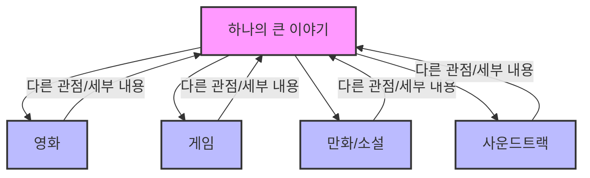
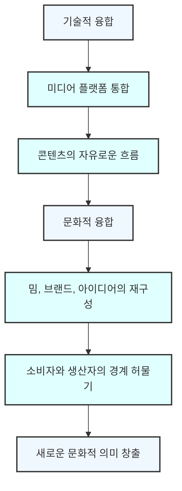

## 헨리 젠킨스의 '컨버전스 컬처' 요약: 미디어의 변화와 우리의 참여 
이 책은 미디어와 문화가 어떻게 변화하고 있는지, 그리고 우리가 그 변화 속에서 어떤 역할을 하는지 알려주는 책이야. 헨리 젠킨스는 미디어 융합, 참여 문화, 집단 지성이라는 세 가지 핵심 개념을 통해 오늘날의 미디어 환경을 설명하고 있어. 기술 발전이 우리 삶과 문화를 어떻게 바꾸고 있는지 궁금하다면 이 책이 좋은 길잡이가 될 거야.

## 1. 웹 1.0에서 웹 2.0으로: 인터넷의 진화 

옛날 인터넷(웹 1.0)은 마치 도서관 같았어. 정보를 찾아보기는 좋았지만, 내가 직접 뭔가를 만들어서 올리기는 정말 어려웠지.

1. **웹 1.0의 특징**:
  - **전문가 중심**: 1995년쯤 내가 대학생일 때만 해도 인터넷은 컴퓨터 전문가나 학자들이 쓰는 아주 전문적인 공간이었어 .
  - **정보 소비 위주**: 하인즈 케첩 회사 같은 곳이 웹사이트를 만들면 뉴스에 나올 정도로 신기한 일이었지 . 사람들은 '왜 저런 걸 만들까?', '돈은 어떻게 벌까?' 하면서 회의적이었어 .
  - **높은 진입 장벽**: 시인이었던 내 친구가 직접 HTML 태그나 자바스크립트를 배워서 자기 시를 올리는 웹사이트를 만들었는데, 그게 정말 대단한 일로 여겨졌어 . 마치 혼자서 복잡한 기계를 조립하는 것과 같았지.

2. **웹 2.0으로의 전환**:
  - **쉬워진 콘텐츠 제작**: 시간이 지나면서 지오시티(Geocities)나 앙헬파이어(Angel Fire) 같은 서비스들이 생겨나서 웹사이트를 쉽게 만들 수 있게 됐어 . 결혼식이나 아기 사진을 올리거나, 시를 공유하는 등 개인적인 용도로 많이 쓰였지 .
  - **마이스페이스와 워드프레스**: 마이스페이스(MySpace)는 아마추어 음악가들이 자기 밴드를 홍보하고 팬들과 소통하는 데 큰 역할을 했어 . 워드프레스(WordPress) 같은 블로그 플랫폼이 나오면서는 마이크로소프트 워드를 쓸 줄 아는 사람이라면 누구나 쉽게 글을 올릴 수 있게 됐지 .
  - **낮아진 기술 장벽**: 이제는 서버나 도메인 이름을 몰라도 돼. 기술적인 지식이 없어도 누구나 온라인에 콘텐츠를 올릴 수 있게 된 거야 . 마치 누구나 쉽게 그림을 그릴 수 있는 도구가 생긴 것과 같아.

## 2. 집단 지성: 모두가 함께 만드는 지식 

집단 지성은 여러 사람이 각자 아는 것을 모아서 더 큰 지식을 만드는 것을 말해. 마치 여러 조각의 퍼즐을 각자 가지고 있다가 다 같이 모아서 하나의 큰 그림을 완성하는 것과 같지.

1. **아마존의 사례**:
  - **집단 지성의 활용**: 아마존(Amazon)은 전문가들만 제품을 평가하던 방식에서 벗어나, 일반 고객들이 자유롭게 상품 리뷰를 쓰고 별점을 매기도록 했어 .
  - **판매 촉진 효과**: 다양한 경험을 가진 일반인들의 솔직한 리뷰는 제품 판매에 큰 영향을 미쳤지 . 뉴욕타임스 편집자 같은 소수의 전문가 의견보다 훨씬 강력한 힘을 발휘한 거야 .

2. **TV 시청 방식의 변화와 **집단 지성:
  - **복잡해진 TV 프로그램**: 옛날에는 TV 프로그램을 녹화하기 어려워서 드라마 내용이 단순했어. 한두 회 놓쳐도 이해하는 데 문제가 없었지 . 하지만 티보(TiVo)나 넷플릭스(Netflix)처럼 녹화하고 다시 볼 수 있는 서비스가 생기면서, 드라마는 훨씬 복잡해졌어 .
  - **'왕좌의 게임' 같은 복잡한 드라마**: '왕좌의 게임'처럼 등장인물과 스토리가 복잡한 드라마는 시청자들이 내용을 따라가기 위해 메모까지 해야 할 정도야 . 스티븐 존슨(Steven Johnson)은 이런 드라마가 마치 '두뇌 운동' 같다고 말했어 .
  - **온라인 토론의 활성화**: 복잡한 드라마는 시청자들이 서로 내용을 토론하고 궁금증을 해결하는 '집단 지성'의 장을 만들었어 . '오징어 게임'처럼 내용이 명확하게 설명되지 않는 드라마는 레딧(Reddit) 같은 온라인 커뮤니티에서 수많은 사람들이 모여 토론하고 추측하는 현상을 낳았지 .
  - **'**서바이버**'의 예시**: '서바이버(Survivor)' 같은 리얼리티 쇼는 누가 우승할지 예측하기 위해 구글 위성 사진까지 동원하는 등, 팬들이 거의 과학적인 수준으로 정보를 모으고 분석했어 .
  - **게임 공략의 **집단 지성: '월드 오브 워크래프트(World of Warcraft)' 같은 온라인 게임에서는 혼자서 모든 전략이나 공략법을 알기 어려워 . 그래서 많은 게이머들이 레딧이나 스팀(Steam) 같은 온라인 커뮤니티에서 정보를 공유하고, 서로 팁을 주면서 함께 게임을 즐기지 . 위키피디아(Wikipedia)처럼 한 사람이 모든 것을 알지 못해도, 수많은 사람이 각자 아는 것을 모으면 엄청난 지식을 만들 수 있다는 원리와 같아 .

## 3. 참여 문화: 소비자가 곧 생산자 

참여 문화는 소비자들이 단순히 콘텐츠를 즐기는 것을 넘어, 직접 콘텐츠를 만들고 공유하며 서로 소통하는 문화를 말해. 마치 팬들이 좋아하는 가수의 노래를 듣는 것을 넘어, 직접 커버 영상을 만들고 팬아트도 그리는 것과 같지.

1. **참여 문화의 조건**:
  - **낮은 진입 장벽**: 예술적 표현이나 사회 활동에 참여하는 데 기술적인 어려움이 적어야 해 . 유튜브(YouTube)에 휴대폰으로 찍은 영상을 올리는 것처럼, 누구나 쉽게 콘텐츠를 만들 수 있어야 한다는 뜻이야 .
  - **강력한 지원**: 자신이 만든 것을 공유하고 다른 사람들과 소통할 수 있는 환경이 잘 갖춰져 있어야 해 .

2. **참여 문화의 다양한 예시**:
  - 팬픽션**(**Fan Fiction**)**: '해리 포터' 팬들이 원작 캐릭터나 세계관을 가지고 자신만의 이야기를 쓰는 것이 대표적인 예시야 .
  - **비공식 멘토링**: 팬픽션 사이트에 글을 올리면 다른 팬들이 피드백을 주고, 더 나은 글쓰기를 위한 조언을 해주기도 해 . 학교에서 선생님에게 글쓰기 지도를 받는 것보다 훨씬 재미있고 효과적인 학습 방법이 될 수 있지 . 위키피디아 편집자들이 서로 돕고 배우는 것과 비슷해 .
  - **팬 영화(Fan Movies)**: '스타트렉(Star Trek)' 팬들이 직접 영화를 만들어서 온라인에 올리는 것도 참여 문화의 한 형태야 .
  - **높아진 제작 수준**: 옛날에는 아마추어 티가 많이 났지만, 요즘은 영상 편집 소프트웨어가 좋아지고 팬들이 자원을 모으면서 전문가가 만든 영화와 견줄 만한 수준의 작품도 나와 .
  - **저작권 문제**: 팬들이 만든 콘텐츠가 너무 인기를 얻거나 상업적으로 이용되면, 원작 스튜디오(예: 파라마운트)는 저작권 문제로 고민하게 돼 . 하지만 팬들을 너무 억압하면 오히려 팬들이 등을 돌릴 수도 있어서, 적절한 균형점을 찾는 것이 중요해 .
  - 모딩**(Modding)과 사용자 제작 콘텐츠(**UGC**)**: 게임에서 기존 게임의 엔진을 이용해 새로운 레벨이나 스토리를 만드는 것을 '모딩'이라고 해 . '하프라이프(Half-Life)'를 기반으로 '카운터 스트라이크(Counter-Strike)'가 만들어진 것처럼, 소비자가 직접 콘텐츠를 만드는 창의적인 활동이지 .
  - **마시니마(**Machinima**)**: '월드 오브 워크래프트' 같은 게임 속 캐릭터와 배경을 이용해서 애니메이션 영화를 만드는 것을 '마시니마'라고 해 . 친구들과 함께 대본을 쓰고 연극처럼 촬영해서 유튜브에 올리는 창의적인 놀이와 같아 .
  - 인공 언어**(Conlangs)**: '왕좌의 게임'의 도트라키어, '스타트렉'의 클링온어, '반지의 제왕'의 엘프어처럼 가상의 언어를 팬들이 직접 배우고 실생활에서 사용하기도 해 . 심지어 클링온어로 결혼식을 하거나 성경을 번역하는 팬들도 있어 . 원작자가 생각지도 못했던 방식으로 팬들이 콘텐츠를 확장하고 발전시키는 거지 .

## 4. 트랜스미디어 스토리텔링: 하나의 이야기가 여러 매체로 확장되는 방식 

트랜스미디어 스토리텔링은 하나의 큰 이야기를 영화, 게임, 만화, 소설 등 여러 매체를 통해 각각 다른 방식으로 풀어내는 것을 말해. 마치 여러 권의 책이 모여 하나의 거대한 세계관을 이루는 것과 같지. 각 매체는 그 매체만의 강점을 활용해서 이야기의 다른 부분을 보여주거나, 새로운 관점을 제시해.

1. **'**매트릭스**'의 사례**:
  - **다양한 매체 활용**: '매트릭스'는 영화로 시작했지만, 게임과 만화(만가) 시리즈로도 이야기가 확장되었어 .
  - **각 매체의 고유한 이야기**: 게임이나 만화는 영화의 내용을 단순히 반복하는 것이 아니라, 영화에서는 볼 수 없었던 새로운 이야기나 세부 정보를 제공했어 . 영화만 봐서는 '매트릭스'의 전체 스토리를 다 알 수 없는 거지 .
  - **소비자의 적극적인 참여 유도**: '매트릭스'는 현실과 환상의 경계가 모호한 세계관을 제시하며, 관객들에게 영화 속 개념에 대해 깊이 생각하고 토론하게 만들었어 .

2. **'해밀턴'의 사례**:
  - **사운드트랙의 역할**: 뮤지컬 '해밀턴(Hamilton)'은 공연 외에 사운드트랙에도 이야기가 담겨 있어 . 공연에서는 잘린 노래들이 사운드트랙에 포함되어 있어서, 이것을 들으면 공연에서 다루지 않은 이야기의 일부를 알 수 있지 .

3. **'워킹 데드'의 사례**:
  - **게임의 상호작용**: '워킹 데드(The Walking Dead)'는 드라마, 게임, 만화 등 다양한 형태로 존재하는데, 특히 게임에서는 플레이어가 직접 선택을 하면서 이야기가 달라져 . 드라마처럼 일방적으로 보는 것이 아니라, 내가 이야기의 흐름에 영향을 미치는 거지 .

4. **스튜디오의 관점**:
  - **다양한 관객층 확보**: 스튜디오 입장에서는 트랜스미디어 스토리텔링이 아주 좋은 전략이야 . 게임을 좋아하는 사람, 만화를 좋아하는 사람, 책을 좋아하는 사람 등 각 매체마다 다른 관객층이 있기 때문이야 .
  - **하나의 세계관으로 유입**: 이들은 모두 '매트릭스'나 '워킹 데드' 같은 하나의 큰 세계관에 관심이 있지만, 각자 선호하는 매체를 통해 그 세계로 들어오는 거지 . 이렇게 다양한 시장과 인구 통계를 아우르면서 전체적인 이야기의 힘을 키울 수 있어 .

## 5. 컨버전스 컬처: 기술을 넘어선 문화적 융합 

컨버전스 컬처(Convergence Culture)는 단순히 기술이 합쳐지는 것을 넘어, 문화 자체가 융합되는 현상을 말해. 마치 여러 가지 색깔이 섞여 새로운 색깔을 만들어내는 것과 같지.

1. **문화적 과정으로서의 융합**:
  - **기술을 넘어선 변화**: 젠킨스는 융합이 기술적인 과정이라기보다는 문화적인 과정이라고 강조해 .
  - **모든 것이 연결되는 세상**: 이제는 모든 이야기, 이미지, 소리, 아이디어, 브랜드, 관계가 다양한 미디어 플랫폼을 넘나들며 퍼져나가 .
  - **페이스북 밈의 예시**: 페이스북에서 볼 수 있는 밈(meme)처럼, 사람들이 유명한 이미지나 아이디어, 브랜드를 가져다가 자신만의 방식으로 재창조하고 공유하는 것이 대표적인 예시야 . 나이키(Nike) 같은 기업이 자기 브랜드가 밈으로 사용되는 것을 싫어할 수도 있지만, 이미 너무 많은 사람들이 사용하고 있어서 막기 어려운 경우도 많아 .

## 6. 컨버전스 컬처의 기회와 문제점 

컨버전스 컬처는 우리에게 많은 기회를 주지만, 동시에 여러 가지 문제점도 안겨줘. 마치 양날의 검과 같아서 잘 쓰면 이롭지만, 잘못 쓰면 다칠 수도 있지.

1. **창작자의 딜레마**:
  - **자부심과 통제력 상실**: 작가나 스튜디오 입장에서는 팬들이 자신의 작품을 가지고 새로운 것을 만들어내는 것을 보면 뿌듯할 수 있어 . 하지만 동시에 자신의 작품에 대한 통제력을 잃을 수도 있지 .
  - **부적절한 사용**: 팬들이 만든 콘텐츠 중에는 원작자가 원치 않거나 부적절한 내용도 있을 수 있어 . 원작자는 이런 콘텐츠와 연관되고 싶지 않을 수도 있지 .

2. **저작권 문제**:
  - **복잡한 저작권**: 리믹스(remix)나 팬 창작물에 대한 저작권 문제는 매우 복잡하고 해결하기 어려워 .
  - **클링온어 소송**: 실제로 '스타트렉'의 클링온어를 사용하는 것에 대해 소송이 걸린 적도 있어 . 결국 법정 밖에서 합의했지만, 이런 문제가 계속 발생할 수 있다는 것을 보여주는 사례야 .

3. **팬덤의 힘**:
  - **팬들의 반발**: 만약 스튜디오가 팬들의 창작 활동을 너무 강하게 막으면, 팬들이 화를 내고 보이콧(boycott) 운동을 벌일 수도 있어 . 이는 오히려 스튜디오에 큰 손해를 입힐 수 있지 .
  - **균형점 찾기**: 그래서 스튜디오는 팬들의 창작 활동을 적절히 허용하면서도, 저작권을 보호할 수 있는 균형점을 찾아야 해 .

4. **팬덤을 넘어선 활동**:
  - **사회적 참여로의 확장**: 젠킨스는 팬덤의 에너지가 단순히 가상의 세계에 머무르지 않고, 실제 사회 문제 해결에 기여할 수 있는지 질문을 던져 .
  - **'**팬덤 포워드**'의 예시**: '해리 포터 얼라이언스(Harry Potter Alliance)'라는 팬 그룹은 자신들의 집단 지성과 온라인 커뮤니티를 활용해서 실제 사회 변화를 위한 활동을 벌였어 . 좋아하는 작품을 통해 배운 가치를 현실 세계에 적용하는 좋은 예시라고 할 수 있지 .

