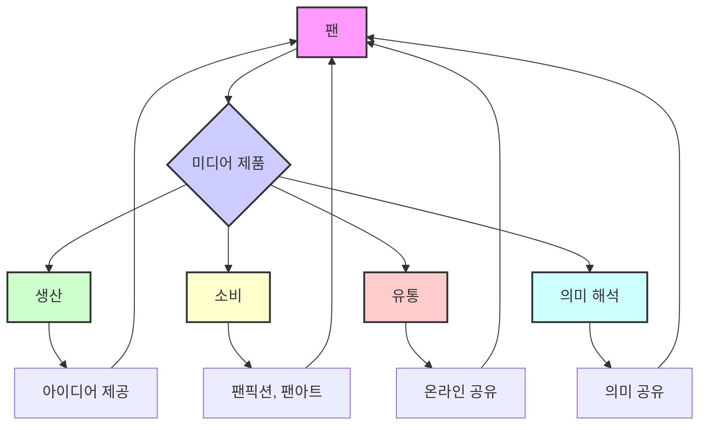

## 헨리 젠킨스의 팬덤 이론: 미디어와 팬의 상호작용
이 책은 헨리 젠킨스의 팬덤 이론을 통해 미디어 소비자들이 어떻게 단순한 수용자를 넘어 적극적인 참여자가 되는지 설명한다. 팬들이 미디어 콘텐츠를 자신만의 방식으로 재해석하고, 새로운 콘텐츠를 만들며, 커뮤니티를 형성하는 과정을 다양한 사례로 보여준다. 이를 통해 팬덤이 미디어 산업과 사회에 미치는 영향력을 이해할 수 있다.

## 1. 팬덤이란 무엇일까? 

1. **팬덤은 단순한 시청이 아니야**:
  - 우리가 보통 영화나 드라마를 볼 때, 그냥 앉아서 보는 수동적인 관객(audience)이라고 생각하잖아. 
  - 하지만 팬덤(fandom)은 이와 완전히 다른 개념이야. 팬덤은 미디어 제품을 정말 좋아하는 사람들이 모여서, 그 제품을 가지고 뭔가 적극적으로 활동하는 걸 말해. 
  - 마치 좋아하는 가수의 노래를 듣고 끝나는 게 아니라, 그 노래를 나만의 방식으로 커버해서 부르거나 춤을 추는 것과 같다고 보면 돼.

2. **헨리 젠킨스의 핵심 주장**:
  - 헨리 젠킨스(Henry Jenkins)는 팬들이 미디어 제작자가 전혀 예상하지 못한 방식으로 미디어 제품을 가져다(appropriate) 쓰거나, 가지고 논다고(do stuff with) 주장했어. 
  - 이걸 '텍스트 밀렵(textual poaching)'이라고 부르는데, 마치 남의 밭에 들어가서 허락 없이 꿩을 잡는 것(poaching an egg가 아니라)처럼, 팬들이 미디어 콘텐츠의 일부를 가져다가 자기 마음대로 사용하는 걸 의미해. 
  - 예를 들어, 게임을 그냥 플레이하거나 TV 쇼를 시청하는 것을 넘어, 팬들은 그 미디어 제품을 가지고 완전히 새로운 사회적 네트워크를 만들기도 하고, 심지어 자신의 정체성(personality)을 만들기도 해. 
  - 온라인 포럼(Reddit 같은 곳)에 참여해서 새로운 친구를 사귀기도 하는 거지. 

## 2. 팬들의 창의적인 활동: 텍스트 밀렵 

1. **캐릭터 따라 하기와 **팬픽션:
  - 팬들은 특정 캐릭터에 깊이 공감해서 그 캐릭터처럼 옷을 입기도 해. 
  - 이런 텍스트 밀렵의 아주 좋은 예시 중 하나는 '팬픽션(fan fiction)'이야. 
  - 팬픽션은 팬들이 미디어 제품의 특정 부분을 자기 마음대로 다시 쓰는 것을 말해. 
  - 예를 들어, 두 캐릭터가 서로 사랑하길 바라는 팬들이 그 둘의 성적인 관계를 다룬 이야기를 쓰는 '슬래시 픽션(slash fiction)' 같은 것도 있어. 

2. **유튜브를 통한 **팬** 활동**:
  - 팬들이 비디오 게임과 상호작용하는 중요한 방법 중 하나는 유튜브(YouTube)를 이용해서 '팬 비디오(fan videos)'를 만드는 거야. 
  - 인기 있는 예시로 '다크 소울(Dark Souls)' 게임 시리즈가 있어. 
  - 다크 소울은 엄청나게 어렵고 난해한 게임인데, 스토리가 게임 속에 숨겨져 있어서 정확히 무슨 일이 일어나는지 알기 어려워. 
  - 이때 '로어 비디오(lore videos)'를 만드는 팬들이 등장하는데, 이들은 게임의 숨겨진 의미와 스토리를 깊이 파고들어 분석하는 영상이야. 
  - '바티 비디아(Vaati Vidya)'라는 유튜버는 다크 소울 로어 비디오로 수백만 조회수를 기록하며, 게임을 해킹하고 여러 캐릭터를 모아 스토리를 재구성하는 등 엄청난 연구와 높은 제작 수준을 보여줘. 
  - 이런 활동은 '팬 노동(fan labor)'의 예시인데, 아무도 이들에게 돈을 주고 이런 영상을 만들라고 시키지 않아. 
  - 물론 조회수로 돈을 벌 수도 있지만, 그게 주된 목적이 아니라, 팬들이 게임을 자신만의 방식으로 해석하고 다른 팬들과 지식을 공유하고 싶어서 하는 활동이야. 

3. **다양한 팬 활동의 형태**:
  - 팬덤의 표현 방식은 정말 다양해. 
  - 렛츠 플레이**(Let's Plays)**: 사람들이 게임을 플레이하면서 자신을 녹화하고, 게임에 대해 코멘트하는 영상이야. 트위치(Twitch) 같은 플랫폼에서 특히 인기가 많아. 
  - **팬 에디트(**fan edits**)**: 팬들이 게임을 해킹해서 자신만의 방식으로 게임을 수정하는 거야. 예를 들어, 유명한 인디 게임 '언더테일(Undertale)'은 원래 '어스바운드(Earthbound)'라는 오래된 게임의 팬 에디트에서 시작되었어. 
  - **온라인 포럼(online forums)**: 레딧(Reddit) 같은 온라인 커뮤니티에서 게임에 대해 토론하고 정보를 공유해. 
  - 코스프레**(cosplay)**: 좋아하는 캐릭터처럼 옷을 입고 분장하는 활동이야. 
  - 팬픽션**(**fanfiction**)**: 이미 설명했듯이, 팬들이 게임 속 캐릭터나 스토리에 대해 자신만의 이야기를 쓰는 거야. 

## 3. 팬 커뮤니티와 참여 문화 

1. **팬들은 커뮤니티를 형성해**:
  - 팬들은 단순히 게임만 하는 게 아니라, 온라인에서 사람들과 소통하고 친구를 사귀며 커뮤니티를 만들어. 
  - 때로는 실제로 만나기도 해. 
  - 이런 현상을 '관객-생산자 융합(audience-producer convergence)'이라고 하는데, 관객이 미디어 제품을 가지고 무언가를 만들거나 활동하는 것을 의미해. 
  - 예를 들어, '어쌔신 크리드(Assassin's Creed)' 게임의 레딧(Reddit) 서브레딧(subreddit)에는 29만 2천 명의 '바이킹(구독자)'들이 모여 게임에 대해 이야기하고 있어. 

2. **팬들의 창작 활동 예시**:
  - 팬** 아트(fan art)**: 어떤 팬은 '카산드라(Cassandra)' 캐릭터를 그리스 버전으로 그린 팬 아트를 올렸는데, 4천 개의 좋아요와 67개의 댓글을 받으며 인기를 얻었어. 
  - 코스프레**(cosplay)**: 다른 팬들은 게임 캐릭터처럼 옷을 입고 분장한 사진을 올리기도 해. 
  - 이런 활동들은 전문가처럼 보이지만, 대부분 돈을 받지 않고 온라인 커뮤니티와 소통하기 위해 하는 거야. 
  - 이것이 바로 '능동적인 관객 참여(active audience participation)'의 예시야. 

3. 참여 문화**(**Participatory Culture**)**:
  - 헨리 젠킨스는 팬들이 '참여 문화(participatory culture)'에 참여한다고 말했어. 
  - 이건 팬들이 스스로 조직하고 노력해서 미디어 제품에 참여하는 것을 의미해. 
  - 가장 중요한 점은, 팬들이 이런 활동으로 돈을 받는 경우가 거의 없다는 거야. 
  - 코스플레이어가 사진을 팔아도 아주 적은 돈을 벌 뿐, 생계를 유지할 정도는 아니야. 
  - 또한, 이런 활동은 미디어 제품 소유자(예: 유비소프트)에게 직접적인 금전적 보상을 주지 않아. 
  - 오히려 코스프레 같은 활동은 저작권법을 위반할 수도 있지만, 제작사들은 보통 신경 쓰지 않아. 왜냐하면 팬들이 제품을 홍보하고 인지도를 높이는 데 기여하기 때문이야. 
  - 팬들은 직접적으로 팬들과 소통하며 참여 문화를 만들어가는 거야. 

4. **참여 문화의 역사와 특징**: 
  - 참여 문화는 19세기 중반의 '아마추어 인쇄 운동(Amateur Printing-press movement)'까지 거슬러 올라가. 당시 고등학생들이 직접 출판물을 만들고 전국적으로 공유했어. 
  - 이것이 20세기 과학 소설 팬덤, 아마추어 라디오, 펑크 록(punk rock)의 진(zine) 운동, 그리고 디지털 미디어의 등장으로 이어졌어. 
  - 참여 문화는 '민속 문화(folk culture)'와 비슷한 특징을 가지고 있어. 
  - 민속 문화에서는 돈을 벌기 위해 미디어를 생산하는 것이 아니라, 서로 아이디어를 공유하기 위해 만들어. 
  - 예를 들어, 할머니가 퀼트(quilt)를 만들 때처럼, 전문가 없이 사람들이 서로 배우고 기술을 전수하며 함께 만드는 사회적 생산 방식이야. 
  - 퀼트는 보통 선물로 주어지고, 최근까지는 팔리지 않고 공동체 구성원에게 전달되었어. 

## 4. 디지털 시대의 참여 문화와 사회적 영향 

1. **인터넷과 **팬** 커뮤니티**:
  - 인터넷의 미디어도 민속 문화와 비슷한 방식으로 작동해. 
  - 팬 커뮤니티는 돈을 벌기 위해서가 아니라, 이야기를 만드는 것을 좋아하고 서로 이야기를 공유하고 싶어서 글을 써. 
  - 유튜브의 많은 사람들도 공유하고 싶은 것이 있어서 미디어를 만들어. 
  - 멋진 스턴트를 한 스케이트보더가 친구들이 찍은 영상을 올리거나, 좋아하는 TV 쇼에 음악을 입히는 아마추어 리믹스 아티스트, 또는 일상생활을 이야기하는 비디오 블로거 등 모두 참여 문화의 일부야. 

2. **참여 문화에서 시민 참여로**:
  - 중요한 질문은, 우리가 문화에 참여하는 것을 넘어 어떻게 정치적, 시민적 구조에 참여할 수 있을까 하는 거야. 
  - 예를 들어, 오바마 선거 운동을 지지하는 비디오를 만든 젊은이들 중 많은 수가 스케이트보드 영상이나 팬 필름을 만들면서 기술을 익혔어. 
  - 이들은 기술을 가지고 '이것저것 해보면서(messing around)' 배우고, 특정 주제에 '열광하는(geeking out)' 과정을 거쳤어. 
  - 젠킨스는 '민주주의를 위해 열광하는 것(geek out for democracy)'이 무엇을 의미하는지 궁금해해. 
  - 애니메이션이나 게임에 열정적인 것처럼, 우리 사회의 미래에 대해서도 열정적일 수 있을까? 

3. **해리포터 동맹(**Harry Potter Alliance**) 사례**:
  - '해리포터 동맹(Harry Potter Alliance)'은 전 세계 인권 문제를 다루는 단체야. 
  - 이 단체의 리더인 앤드류 슬랙(Andrew Slack)은 '해리포터'를 읽고, 주인공 해리포터가 사회의 악을 알아보고 덤블도어의 군대(Dumbledore's Army)를 조직해 세상을 바꾼 이야기라고 해석했어. 
  - 그는 "우리 세상에도 덤블도어의 군대가 있다면 어떤 문제를 해결할까?"라고 생각했고, 이 판타지를 이용해 10만 명의 젊은이들을 동원했어. 
  - 이들은 다르푸르(Darfur), 우간다(Uganda)의 인권 침해, 월마트(Walmart)의 노동자 권리 문제, 동성 결혼 문제, 아이티(Haiti) 구호품 지원 등 다양한 활동을 해. 
  - 이들은 학생회에 가입하는 아이들이 아니라, '던전 앤 드래곤(Dungeons and Dragons)'을 하거나 몬스터 잡지를 모으고 과학 소설을 많이 읽던 아이들이야. 
  - 이런 관심 기반 네트워크(interest-driven networks)를 통해 정치적으로 생각하고, 온라인 커뮤니티에서 개발한 기술을 사회 변화에 활용하는 방법을 배우고 있어. 

4. **교육의 역할**:
  - 젠킨스는 학교 밖에서 일어나는 이런 활동들에 대해 매우 열정적이지만, 이것을 그냥 내버려 두면 많은 아이들이 뒤처질 수 있다고 경고해. 
  - 아이들은 어른의 지도와 참여, 그리고 그들의 기술에 대한 인정이 필요해. 
  - 우리가 아이들의 어깨 너머로 엿볼 필요는 없지만, 그들의 뒤를 봐줄 필요는 있어. 
  - 혁신적인 교사들은 교육의 미래에 대해 개방적인 사고를 가지고 이런 변화를 시도하고 있어. 
  - 하지만 학교 시스템이나 연방 정책 때문에 참여 문화의 장점들이 학교에서 배제되는 경우가 많아. 
  - 중요한 것은 참여 문화를 교육 과정으로 어떻게 가져올지 알아내는 거야. 
  - 예를 들어, '모비 딕(Moby Dick)' 수업에서 학생들은 위키피디아(Wikipedia)의 멜빌(Melville)과 모비 딕 항목을 수정하고, 커뮤니티의 검증 과정을 통해 자신들의 변경 사항을 옹호했어. 
  - 이 과정에서 아이들은 큰 성취감을 느꼈지만, 많은 학교에서는 "위키피디아는 나쁘다"며 교실에서 사용하지 못하게 해. 
  - 단기적으로는 변화를 만들고 싶어 하는 교사들에게 이런 도구들을 제공하고, 새로운 미디어 리터러시(new media literacies)를 위해 싸울 수 있도록 격려하는 것이 중요해. 

## 5. 미디어 생산, 소비, 유통에서의 팬의 역할 

1. **팬은 미디어 과정의 핵심**:
  - 헨리 젠킨스는 관객, 특히 팬들이 미디어의 생산, 소비, 유통(배포), 그리고 순환 과정에서 정말 중요한 부분이라고 믿어. 
  - 팬들은 특정 TV 쇼, 음악 아티스트, 또는 온라인 인물을 엄청나게 좋아하는 사람들이야. 
  - 이런 팬들이 미디어에서 아주 큰 역할을 해. 

2. **팬의 다양한 기여**:
  - **생산(**production**)**: 팬들은 좋아하는 브이로거(vlogger)에게 다음 영상에서 다룰 내용에 대한 아이디어를 보내기도 해. 
  - **유통(distribution)**: 팬들은 댓글을 달고 공유하면서 친구들에게 제품을 퍼뜨려, 사실상 제품을 직접 유통하는 역할을 해. 
  - **의미 **해석**(interpretation)**: 팬들은 영화 예고편을 보고 "아, 범인이 누군지 알겠어!"라고 추측한 다음, 그 아이디어를 다른 팬들과 온라인에서 공유하기도 해. 
  - 젠킨스는 팬들이 미디어 제품 내에서 많은 것들을 책임지고, 특히 자신만의 의미를 만들고 다른 사람들과 공유한다고 믿어. 

3. 팬픽션** 사례: 드라마 '**휴먼스**(Humans)'**:
  - 드라마 '휴먼스(Humans)'의 팬픽션(fanfiction)을 온라인에서 찾아보면, 전 세계 팬들이 쇼의 캐릭터들에 대한 자신만의 이야기를 엄청나게 많이 만들었어. 
  - 주인공인 십대 소녀 '매티(Matty)'는 많은 팬픽션의 주제가 되는데, 아마도 시청자 중 많은 십대 소녀들이 그녀를 강한 여성 캐릭터로 존경하고 동경하기 때문일 거야. 
  - 많은 팬픽션은 매티가 대학에 가거나, 연애를 하거나, 새로운 것을 발명하거나, 신스(synths)와 관련된 컴퓨터 코딩 세계에 참여하는 이야기를 다뤄. 
  - 이 팬들은 '휴먼스'라는 아이디어를 가져다가 자신만의 생각으로 재해석하고, 온라인에서 자신만의 이야기를 만들어낸 거야. 
  - 이런 팬픽션은 수십만 페이지에 달할 정도로 많아. 

4. **팬이 만든 비디오의 증가**:
  - 유튜브에는 '조엘라(Zoella)'나 '알피 데이즈(Alfie Deyes)' 같은 온라인 인물들에게 헌정된 팬이 만든 비디오(fan-made videos)가 수백 개나 있어. 
  - 팬들은 이들을 얼마나 사랑하는지 계속 이야기하고, 조엘라의 비디오를 리뷰하거나, 그녀의 비디오 클립을 가져다가 자신만의 비디오를 만들기도 해. 
  - 팬이 만든 제품(fan-made products)은 점점 더 흔해지고 있는데, 이는 스마트폰으로 쉽게 영상을 찍고 인터넷에 바로 올릴 수 있는 기술 발전 덕분이야. 
  - 젠킨스는 팬이 만든 비디오와 제품이 이제는 매우 흔한 현상이라고 보고 있어. 

