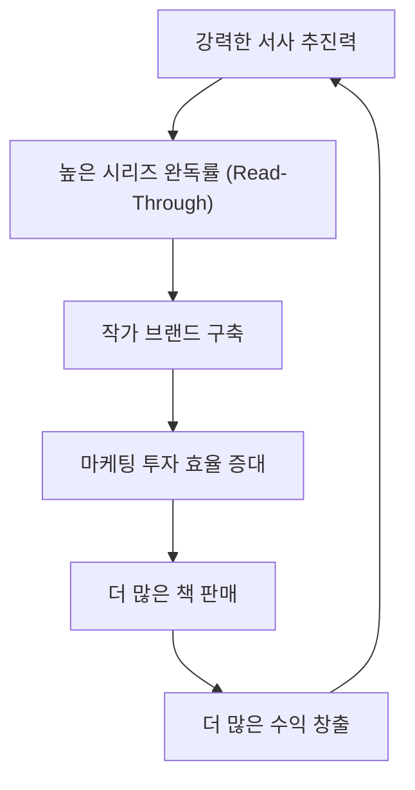
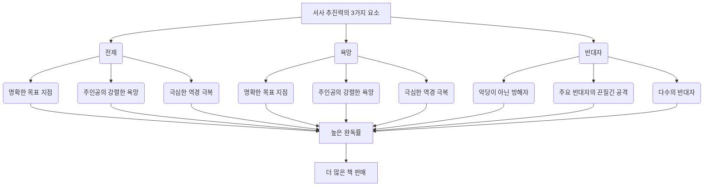

## 존 트루비의 스토리 해부학: 마스터 스토리텔러가 되는 22단계
이 책은 스크린 작가, 소설가 등 스토리를 쓰는 모든 사람을 위한 책이야. 훌륭한 스토리를 만드는 데 필요한 구체적인 기술과 유기적인 글쓰기 과정을 알려줘. 단순히 이야기를 잘 쓰는 것을 넘어, 독자들이 다음 책을 간절히 원하게 만드는 <mark>강력한 서사 추진력</mark>을 만드는 방법을 배울 수 있을 거야.

## 1. 스토리텔링의 어려움과 흔한 오해 

이야기를 만드는 건 누구나 할 수 있지만, <mark>훌륭한 이야기를 만드는 건 정말 어려운 일</mark>이야. 왜냐하면 인간의 삶이라는 복잡한 주제를 깊이 이해하고, 그걸 다시 이야기로 풀어내야 하거든.

1. **오래된 용어의 한계**:
  - '발단', '절정', '결말' 같은 옛날 용어들은 너무 추상적이라서 실제로 이야기를 쓸 때 별 도움이 안 돼. 
  - 예를 들어, 주인공이 절벽 끝에 매달려 죽기 직전인 장면이 '발단'일까, '절정'일까? 이런 용어로는 어떻게 써야 할지 알 수 없어. 
  - 이런 용어들은 이야기의 본질이나 작동 방식을 제대로 설명해주지 못해. 

2. **세 가지 구성(**3막 구조**)의 문제점**:
  - 아리스토텔레스의 이론보다 이해하기 쉽지만, 너무 단순하고 틀린 부분이 많아. 
  - 이야기를 '시작(30페이지)', '중간(60페이지)', '끝(30페이지)'으로 기계적으로 나누는 건데, 이건 마치 <mark>레고 블록을 아무렇게나 쌓는 것</mark>과 같아. 
  - 이런 방식은 이야기의 <mark>내부적인 흐름이나 논리와 상관없이</mark> 외부에서 억지로 끼워 맞추는 거야. 
  - 결과적으로 이야기가 <mark>각각 따로 노는 에피소드</mark>처럼 느껴지고, 독자에게 깊은 감동을 주지 못해. 

3. **기계적인 글쓰기 과정**:
  - 많은 작가들이 이야기를 만들 때도 기계적인 방법을 사용해. 
  - 예를 들어, 예전에 본 영화를 대충 베끼거나, 두세 가지 이야기를 섞어서 대충 아이디어를 내. 
  - 주인공에게 특징만 잔뜩 붙이고, 조연들은 대충 만들고, 주제는 대사로 직접 말해버리는 식이야. 
  - 이런 방식은 <mark>독창성 없는 뻔한 이야기</mark>를 만들게 돼. 

## 2. 훌륭한 스토리의 특징: 유기적이고 살아있는 이야기 

훌륭한 이야기는 마치 <mark>살아있는 생명체</mark>처럼 유기적으로 발전해야 해. 

1. **유기적인 스토리**:
  - 이야기는 기계가 아니라 <mark>살아있는 몸</mark>처럼 스스로 성장하고 발전해야 해. 
  - 수많은 요소들이 서로 연결되어 하나의 거대한 생명체처럼 느껴져야 해. 
  - 마치 운동선수가 기술을 완벽하게 익혀서 자연스럽게 움직이는 것처럼, 작가는 기술을 마스터해서 캐릭터가 스스로 움직이는 것처럼 보이게 해야 해. 

2. **스토리의 정의**:
  - 이야기는 <mark>"화자가 청자에게 누군가가 무엇을 원했고, 그것을 얻기 위해 무엇을 했으며, 왜 그랬는지"를 말해주는 것</mark>이야. 
  - 여기에는 <mark>화자(작가), 청자(독자), 그리고 이야기</mark>라는 세 가지 요소가 있어. 

3. **스토리텔러의 역할**:
  - 스토리텔러는 독자와 함께 <mark>언어 게임</mark>을 하는 사람이야. 
  - 단순히 과거 사건을 나열하는 게 아니라, <mark>강렬한 순간들을 선택하고 연결해서</mark> 독자가 마치 그 삶을 직접 경험하는 것처럼 느끼게 해야 해. 
  - 좋은 이야기는 독자에게 <mark>감정적인 지식, 즉 지혜</mark>를 전달해줘. 
  - 작가는 정보를 <mark>드러내기도 하고 숨기기도 하면서</mark> 독자가 퍼즐을 풀도록 유도해야 해. 
  - 독자가 더 이상 퍼즐을 풀 필요가 없으면, 이야기는 재미없어지고 독자는 떠나게 돼. 

## 3. 드라마틱 코드: 인간의 성장과 변화 

모든 이야기는 <mark>드라마틱 코드</mark>를 표현하는 일종의 소통 방식이야. 

1. **드라마틱 코드의 본질**:
  - 드라마틱 코드는 인간의 마음속 깊이 박혀 있는 것으로, <mark>사람이 어떻게 성장하고 발전할 수 있는지</mark>를 예술적으로 보여주는 거야. 
  - 이 코드는 모든 이야기의 밑바탕에 깔려 있는 과정인데, 작가는 이걸 특정 캐릭터와 행동 뒤에 숨겨 놓지. 
  - 독자는 좋은 이야기를 통해 궁극적으로 이 <mark>성장의 코드</mark>를 얻게 돼. 

2. **변화의 원동력: **욕망:
  - 드라마틱 코드에서 <mark>변화는 욕망에서 시작돼</mark>. 
  - "나는 생각한다, 고로 존재한다"가 아니라, <mark>"나는 원한다, 고로 존재한다"</mark>라고 볼 수 있어. 
  - 욕망은 모든 의식 있는 생명체를 움직이고 방향을 제시하는 힘이야. 
  - 이야기는 한 사람이 무엇을 원하는지, 그것을 얻기 위해 무엇을 할지, 그리고 그 과정에서 어떤 대가를 치를지를 추적해. 

3. **이야기의 두 기둥: 행동과 학습**:
  - 캐릭터가 욕망을 가지면 이야기는 <mark>행동(acting)과 학습(learning)</mark>이라는 두 다리로 움직여. 
  - 캐릭터는 원하는 것을 얻기 위해 행동하고, 더 나은 방법을 배우면서 새로운 정보를 얻게 돼. 
  - 새로운 정보를 배울 때마다 결정을 내리고 행동 방식을 바꾸지. 
  - 어떤 이야기는 행동을 강조하고(신화, 액션), 어떤 이야기는 학습을 강조해(탐정 소설, 다중 시점 드라마). 

4. **변화의 중요성**:
  - 욕망을 쫓는 캐릭터는 <mark>반드시 고난을 겪게 되고</mark>, 그 고난이 캐릭터를 변화시켜. 
  - 드라마틱 코드와 스토리텔러의 궁극적인 목표는 <mark>캐릭터의 변화를 보여주거나, 왜 변화하지 못했는지</mark>를 설명하는 거야. 
  - 드라마는 <mark>성숙의 코드</mark>라고 할 수 있어. 습관과 약점에서 벗어나 더 풍요로운 자신으로 변모하는 순간에 초점을 맞춰. 
  - 인간이 심리적으로, 도덕적으로 더 나은 존재가 될 수 있다는 생각을 표현하기 때문에 사람들이 드라마를 좋아하는 거야. 

## 4. 스토리 세계: 삶의 응축과 고조 

이야기 세계는 현실 세계를 그대로 보여주는 게 아니야. 

1. **상상 속의 삶**:
  - 이야기 세계는 <mark>인간이 상상하는 삶</mark>의 모습이야. 
  - 인간의 삶을 <mark>응축하고 고조시켜서</mark>, 독자들이 삶 자체를 더 잘 이해할 수 있도록 돕는 거지. 

2. **스토리의 유기적인 구성**:
  - 훌륭한 이야기는 인간이 유기적인 과정을 겪는 것을 묘사하지만, 그 자체로도 살아있는 유기체와 같아. 
  - 아주 단순한 동화조차도 신경계, 순환계처럼 <mark>서로 연결되고 영향을 주고받는 여러 부분(하위 시스템)</mark>으로 이루어져 있어. 
  - 이 하위 시스템에는 <mark>캐릭터, 플롯, </mark>반전<mark>(revelation) 순서, 스토리 세계, </mark>도덕적 논쟁<mark>(주제), 상징망, 장면 구성, 교향곡 같은 대화</mark> 등이 있어. 

3. **스토리의 비유**:
  - <mark>주제(도덕적 논쟁)</mark>는 이야기의 <mark>뇌</mark>와 같아. 
  - <mark>캐릭터</mark>는 <mark>심장과 순환계</mark>이고. 
  - <mark>반전</mark>은 <mark>신경계</mark>, <mark>스토리 구조</mark>는 <mark>뼈대</mark>야. 
  - <mark>장면</mark>은 <mark>피부</mark>라고 할 수 있지. 

4. **요소 간의 관계**:
  - 이야기의 각 하위 시스템은 <mark>다른 요소들을 정의하고 구별하는 요소들의 연결망</mark>으로 이루어져 있어. 
  - 주인공을 포함한 어떤 개별 요소도 <mark>다른 모든 요소들과의 관계 속에서 만들어지고 정의되지 않으면</mark> 제대로 작동하지 않아. 

## 5. 스토리의 움직임: 자연의 패턴을 닮은 서사 구조 

유기적인 이야기가 어떻게 움직이는지 보려면 <mark>자연</mark>을 보면 돼. 

1. **자연의 패턴**:
  - 자연은 요소들을 선형<mark>, 구불구불, </mark>나선형<mark>, 가지치기, </mark>폭발형 같은 몇 가지 기본적인 패턴으로 연결해. 
  - 스토리텔러는 이 패턴들을 단독으로 또는 조합해서 시간의 흐름에 따라 이야기 사건들을 연결해. 

2. **다섯 가지 스토리 패턴**:
  - **선형(Linear) 스토리**: 
  - <mark>하나의 주요 캐릭터</mark>를 처음부터 끝까지 따라가는 이야기야. 
  - 마치 <mark>직선 도로</mark>처럼 한 가지 일이 다른 일 뒤에 일어나는 거지. 
  - 대부분의 할리우드 영화가 이 형태를 띠며, 주인공이 특정 욕망을 강렬하게 추구하고 그 결과로 변화하는 과정을 보여줘. 
  - **구불구불(**Meandering**) 스토리**: 
  - <mark>뚜렷한 방향 없이 구불구불한 길</mark>을 따라가는 이야기야. 
  - 강, 뱀, 뇌의 형태와 비슷해. 
  - 주인공에게 욕망은 있지만 강렬하지 않고, 여러 사회 계층의 다양한 인물들을 만나면서 많은 지역을 무작위로 돌아다녀. 
  - 예시: <mark>포레스트 검프</mark>, <mark>오디세이</mark>, <mark>돈키호테</mark>, <mark>허클베리 핀의 모험</mark>. 
  - **나선형(Spiral) 스토리**: 
  - <mark>중심을 향해 안쪽으로 맴도는 길</mark>이야. 
  - 사이클론, 뿔, 조개껍데기에서 볼 수 있는 패턴이지. 
  - 캐릭터가 <mark>하나의 사건이나 기억으로 계속 돌아가서</mark> 점점 더 깊은 수준으로 탐구하는 이야기야. 
  - 예시: <mark>현기증</mark>, <mark>블로우 업</mark>, <mark>컨버세이션</mark>, <mark>메멘토</mark>. 
  - **가지치기(**Branching**) 스토리**: 
  - 몇 개의 중심점에서 시작해서 <mark>점점 더 작게 갈라지는 길</mark>들의 시스템이야. 
  - 나무, 잎, 강 유역에서 볼 수 있어. 
  - 각 가지는 보통 <mark>완전한 사회</mark>나 주인공이 탐험하는 <mark>같은 사회의 상세한 단계</mark>를 나타내. 
  - 예시: <mark>걸리버 여행기</mark>, <mark>멋진 인생</mark>, <mark>내슈빌</mark>, <mark>아메리칸 그래피티</mark>, <mark>트래픽</mark>. 
  - **폭발형(Explosive) 스토리**: 
  - <mark>여러 부분이 동시에 확장되는</mark> 패턴이야. 
  - 화산이나 민들레에서 볼 수 있지. 
  - 이야기에서는 모든 것을 동시에 보여줄 수 없지만, 교차 편집 같은 기술로 <mark>동시성</mark>을 표현할 수 있어. 
  - 여러 요소들을 한 번에 보여줌으로써, 각 요소에 담긴 핵심 아이디어를 독자가 파악하게 해. 
  - 이런 이야기는 <mark>스토리 세계를 탐구하는 데 더 중점</mark>을 두며, 다양한 요소들 간의 연결과 전체 속에서 어떻게 어울리는지를 보여줘. 
  - 예시: <mark>펄프 픽션</mark>, <mark>시리아나</mark>, <mark>크래쉬</mark>. 

## 6. 유기적인 글쓰기 과정: 내부에서 외부로 

최고의 이야기를 만들려면 <mark>내부에서 외부로</mark> 스토리를 구성해야 해. 

1. **기존의 잘못된 글쓰기 과정**:
  - 대부분의 작가들은 <mark>외부적, 기계적, 파편적, 일반적인</mark> 방식으로 글을 써. 
  - <mark>뻔한 아이디어</mark>로 시작해서, 주인공에게 특징만 잔뜩 붙이고, 조연들은 대충 만들어. 
  - 주제는 대사로 직접 말하거나 아예 피하고, 3막 구조 같은 외부적인 틀에 맞춰 플롯을 짜. 
  - 결과적으로 이야기는 <mark>각각 따로 노는 에피소드</mark>가 되고, 독자에게 깊은 감동을 주지 못해. 

2. **새로운 유기적인 글쓰기 과정**:
  - 이 책에서 제시하는 과정은 <mark>내부적, 유기적, 상호 연결적, 독창적</mark>이야. 
  - 이 과정은 쉽지 않지만, <mark>진정으로 작동하는 유일한 방법</mark>이라고 믿어. 
  - 스토리 구성 기술을 <mark>이야기를 만드는 순서대로</mark> 배우게 될 거야. 
  - 가장 중요한 건, <mark>스토리를 내부에서 외부로</mark> 만들어야 한다는 거야. 
  - 이것은 <mark>이야기를 개인적이고 독특하게 만드는 것</mark>을 의미해. 
  - 그리고 <mark>원래의 스토리 아이디어 안에 있는 독창적인 것을 찾아 발전시키는 것</mark>을 의미해. 
  - 각 장을 거치면서 이야기는 성장하고 더 자세해지며, <mark>각 부분이 다른 모든 부분과 연결</mark>될 거야. 

3. **글쓰기 과정의 단계**:
  - 전제**(**Premise**)**: 
  - 이야기 전체를 <mark>한 문장으로 압축한 것</mark>이야. 
  - 이 전제가 이야기의 본질을 제시하고, 아이디어를 최대한 활용하는 방법을 찾는 데 사용돼. 
  - **7가지 핵심 스토리 구조 단계**: 
  - 이야기 발전의 주요 단계이자, 그 밑에 숨겨진 드라마틱 코드의 주요 단계야. 
  - 이야기의 <mark>DNA</mark>라고 생각하면 돼. 
  - 이야기에 <mark>견고하고 안정적인 기반</mark>을 제공해 줄 거야. 
  - **캐릭터**: 
  - 캐릭터는 <mark>원래의 스토리 아이디어에서 자연스럽게</mark> 만들어져. 
  - 각 캐릭터는 다른 모든 캐릭터와 연결되고 비교되어 <mark>강하고 잘 정의</mark>되도록 해. 
  - 각 캐릭터가 주인공의 발전을 돕는 <mark>기능</mark>을 수행하도록 설정해. 
  - **주제(**도덕적 논쟁**)**: 
  - 작가의 <mark>도덕적 비전</mark>, 즉 세상에서 사람들이 어떻게 행동해야 하는지에 대한 견해야. 
  - 캐릭터를 메시지를 전달하는 도구로 만들지 않고, <mark>스토리 아이디어에 내재된 주제</mark>를 스토리 구조를 통해 표현해서 독자를 놀라게 하고 감동시켜. 
  - **스토리 세계**: 
  - 주인공의 성장<mark> 과정에서 자연스럽게</mark> 만들어져. 
  - 주인공을 정의하고, 그의 목표를 <mark>물리적으로 표현</mark>하는 데 도움을 줘. 
  - **상징망(Symbol Web)**: 
  - <mark>고도로 압축된 의미 덩어리</mark>인 상징들을 활용해. 
  - 캐릭터, 스토리 세계, 플롯의 다양한 측면을 강조하고 전달하는 <mark>상징들의 연결망</mark>을 만들어. 
  - **플롯**: 
  - <mark>독특한 캐릭터들로부터</mark> 올바른 스토리 형태를 발견해. 
  - <mark>22가지 스토리 구조 단계</mark>(7가지 핵심 단계 + 15가지 추가 단계)를 사용하여 플롯을 만들어. 
  - 모든 사건이 표면 아래에서 연결되고, <mark>놀랍지만 논리적으로 필연적인 결말</mark>로 이어지도록 플롯을 설계해. 
  - **장면 구성(Weave)**: 
  - 장면을 쓰기 전 마지막 단계로, <mark>모든 플롯 라인과 주제가 엮인</mark> 이야기의 모든 장면 목록을 만들어. 
  - **장면 구성 및 교향곡 같은 대화**: 
  - 각 장면이 주인공의 발전을 더욱 촉진하도록 구성하면서 이야기를 써. 
  - 플롯만 진행시키는 대화가 아니라, <mark>여러 악기와 여러 층이 동시에 어우러지는 교향곡 같은 대화</mark>를 써. 

## 7. 전제(Premise): 이야기의 씨앗을 심는 방법 

전제는 이야기 전체를 <mark>한 문장으로 요약한 것</mark>이야.  마치 <mark>작은 씨앗</mark>처럼 보이지만, 이 씨앗이 잘 심어져야 튼튼한 나무로 자랄 수 있어.

1. **전제의 중요성**:
  - 상업적 성공: 할리우드는 전 세계에 영화를 팔아야 하므로, <mark>한 문장으로 쉽게 설명할 수 있는 '하이 콘셉트' </mark>전제를 선호해. 
  - **영감과 끈기**: 전제는 작가에게 <mark>영감</mark>을 주고, 몇 달, 몇 년간의 힘든 글쓰기를 버틸 수 있는 <mark>끈기</mark>를 줘. 
  - **이야기의 기반**: 전제는 <mark>캐릭터, 플롯, 주제, 상징 등</mark> 글쓰기 과정에서 내리는 모든 결정의 기반이 돼. 
  - **성공의 핵심**: <mark>무엇을 쓸지 선택하는 것</mark>이 어떻게 쓸지 결정하는 것보다 훨씬 중요해. 
  - <mark>건물의 기초</mark>와 같아서, 전제가 약하면 아무리 다른 부분을 잘 만들어도 이야기는 무너져. 

2. 전제** 개발의 어려움**:
  - 대부분의 작가들이 전제 단계에서 실패하는데, 그 이유는 <mark>아이디어 속에 숨겨진 가치를 파내는 방법</mark>을 모르기 때문이야. 
  - '하이 콘셉트' 전제는 마케팅에는 좋지만, <mark>이야기 전체를 유기적으로 이끌어갈 힘</mark>이 부족할 수 있어. 
  - 하이 콘셉트 전제는 보통 <mark>두세 장면</mark>밖에 주지 못하는데, 영화는 40~70장면, 소설은 그 두세 배가 필요해. 
  - 전체 스토리텔링 기술을 알아야만 하이 콘셉트의 한계를 극복하고 성공적인 이야기를 만들 수 있어. 

3. 전제** 개발을 위한 시간 투자**:
  - 글쓰기 과정 초기에 <mark>충분한 시간</mark>을 들여야 해.  몇 시간, 며칠이 아니라 <mark>몇 주</mark>를 투자해야 해. 
  - 아마추어처럼 좋은 전제를 얻자마자 바로 장면을 쓰기 시작하면, 20~30페이지 만에 막다른 길에 부딪히게 될 거야. 
  - 이 초기 단계는 <mark>이야기의 큰 그림을 보고 전체적인 모양과 발전을 파악하는</mark> 전략을 탐색하는 시기야. 
  - 이때는 <mark>유연하고 개방적인 태도</mark>를 유지하며 다양한 가능성을 탐색해야 해. 

## 8. 전제 개발 1단계: 삶을 바꿀 이야기를 찾아라 

네 삶을 바꿀 만한 이야기를 쓰는 것이 가장 중요해. 

1. **왜 삶을 바꿀 이야기인가?**:
  - 이야기가 너에게 그만큼 중요하다면, <mark>많은 독자들에게도 중요할 가능성이 커</mark>. 
  - 이야기를 다 쓰고 나면, 어떤 일이 일어나든 <mark>너의 삶 자체가 변해 있을 거야</mark>. 

2. **자기 탐색의 중요성**:
  - 대부분의 작가들은 다른 사람의 영화나 책을 대충 베낀 전제를 생각하는데, 이건 <mark>개인적이지 않아서 뻔한 이야기</mark>가 될 수밖에 없어. 
  - 너의 삶을 바꿀 이야기를 쓰려면 <mark>자기 자신을 탐색</mark>해야 해. 
  - 너의 내면에 있는 것을 밖으로 끄집어내서 객관적으로 살펴봐야 해. 

3. **자기 탐색을 위한 두 가지 연습**:
  - **위시리스트(Wishlist) 작성**: 
  - 영화, 책, 연극에서 보고 싶은 모든 것을 적어봐. 
  - 네가 <mark>열정적으로 관심 있는 것, 너를 즐겁게 하는 것</mark>들을 적는 거야. 
  - 상상했던 캐릭터, 멋진 플롯 아이디어, 대사, 관심 있는 주제나 장르 등 <mark>떠오르는 모든 것을</mark> 종이에 다 적어. 
  - "돈이 너무 많이 들 거야" 같은 생각은 버리고, <mark>아이디어가 다른 아이디어를 불러일으키도록</mark> 자유롭게 적어. 
  - 전제** 리스트(**Premise** List) 작성**: 
  - 지금까지 생각해본 <mark>모든 전제</mark>를 한 문장으로 요약해서 적어봐. 
  - 이것은 각 아이디어를 <mark>명확하게</mark> 하고, 모든 전제를 한눈에 볼 수 있게 해줘. 

4. **패턴 찾기**:
  - 두 리스트를 펼쳐놓고 <mark>반복되는 핵심 요소</mark>를 찾아봐. 
  - 특정 캐릭터 유형, 대화 스타일, 장르, 주제, 시대 등이 반복될 수 있어. 
  - 이것이 바로 <mark>너의 비전</mark>이자 작가로서, 인간으로서 너의 모습이야. 
  - 이 연습은 너를 개방시키고, <mark>너의 내면에 깊이 있는 것을 통합</mark>하도록 도와줘. 
  - 이 과정을 거치면, 어떤 전제를 생각해내든 <mark>더 개인적이고 독창적인</mark> 이야기가 될 가능성이 커져. 

## 9. 전제 개발 2단계: 가능성을 탐색하고 '만약 ~라면?' 질문하기 

전제 단계에서 막히는 가장 큰 이유 중 하나는 <mark>이야기의 진정한 잠재력을 알아보는 방법</mark>을 모르기 때문이야. 

1. **가능성 탐색**:
  - 아이디어가 <mark>어떻게 발전하고 꽃을 피울지</mark>를 찾아야 해. 
  - 아무리 좋아 보여도 <mark>하나의 가능성에 바로 뛰어들지 말고</mark>, 여러 선택지를 탐색해야 해. 
  - 이것은 아이디어가 취할 수 있는 <mark>다양한 경로를 브레인스토밍하고, 그중 최고를 선택하는 것</mark>을 의미해. 

2. **'만약 ~라면?(What if?)' 질문**:
  - 아이디어 속에서 무엇이 가능한지 알아보는 데 아주 유용한 기술이야. 
  - 이 질문은 <mark>이야기 아이디어</mark>와 <mark>너 자신의 마음</mark>이라는 두 가지 영역으로 이끌어줘. 
  - 이야기 세계에서 <mark>무엇이 허용되고 무엇이 허용되지 않는지</mark>를 정의하는 데 도움이 돼. 
  - 또한, <mark>상상 속의 풍경 속에서 너의 마음이 어떻게 노는지</mark>를 탐색하는 데도 도움이 돼. 
  - '만약 ~라면?' 질문을 더 자주 할수록, 이 상상 속의 풍경을 더 완벽하게 채우고, 세부 사항을 구체화하며, 독자에게 <mark>더욱 매력적인 이야기</mark>를 만들 수 있어. 
  - 이때는 <mark>마음을 자유롭게</mark> 풀어주고, 스스로를 검열하거나 판단하지 마. 
  - '어리석은 아이디어'라고 생각하지 마. <mark>어리석은 아이디어가 창의적인 돌파구</mark>로 이어지는 경우가 많아. 

3. **'만약 ~라면?' 질문의 예시**:
  - **위트니스(Witness)**: 
  - **원래 아이디어**: 범죄를 목격한 소년의 스릴러.
  - **'만약 ~라면?'**:
  - 미국 사회의 폭력을 더 깊이 탐구한다면?
  - 평화로운 아미쉬 공동체에서 폭력적인 도시로 소년이 이동한다면?
  - 폭력적인 경찰 영웅이 아미쉬 세계에 들어가 사랑에 빠진다면?
  - 평화주의의 심장부에 폭력을 가져온다면?
  - **투씨(Tootsie)**: 
  - **원래 아이디어**: 남자가 여자로 변장하는 코미디.
  - **'만약 ~라면?'**:
  - 남자가 여자로 변장한 모습을 최대한 많은 어려운 상황에 놓이게 한다면?
  - 남자들이 사랑 게임을 어떻게 하는지 내부에서 보여주기 위해 주인공의 전략을 강조한다면?
  - 여성 혐오자인 주인공이 성장하기 위해 가장 싫어하는 여성으로 변장해야 한다면?
  - 많은 남녀가 동시에 서로를 쫓는 빠른 전개로 이야기를 고조시킨다면?
  - **차이나타운(Chinatown)**: 
  - **원래 아이디어**: 1930년대 LA에서 살인 사건을 조사하는 남자.
  - **'만약 ~라면?'**:
  - 범죄가 계속해서 커진다면?
  - 탐정이 가장 작은 범죄(간통)를 조사하다가 도시 전체가 살인 위에 세워졌다는 것을 알게 된다면?
  - 미국 생활의 가장 깊고 어두운 비밀을 드러낼 때까지 반전을 점점 더 크게 만든다면?
  - **대부(The Godfather)**: 
  - **원래 아이디어**: 마피아 가족에 대한 이야기.
  - **'만약 ~라면?'**:
  - 가족의 수장을 미국의 왕처럼 더 크게 만든다면?
  - 그가 공식적인 미국 대통령만큼이나 강력한 지하 세계의 수장이라면?
  - 단순한 범죄 이야기를 어두운 미국 서사시로 바꾼다면?
  - **오리엔트 특급 살인(Murder on the Orient Express)**: 
  - **원래 아이디어**: 기차 안에서 살해된 남자를 천재 탐정이 조사하는 이야기.
  - **'만약 ~라면?'**:
  - 정의의 개념을 살인자 체포 이상으로 확장한다면?
  - 살해당한 남자가 죽을 만한 자격이 있고, 12명의 배심원이 그의 재판관이자 처형자 역할을 한다면?
  - **빅(Big)**: 
  - **원래 아이디어**: 갑자기 어른이 된 소년의 코미디 판타지.
  - **'만약 ~라면?'**:
  - 멀리 떨어진 기이한 세계가 아니라, 평범한 아이가 알아볼 수 있는 세계를 배경으로 한다면?
  - 그를 실제 소년들의 유토피아(장난감 회사)로 보내고, 예쁜 여자들과 데이트하게 한다면?
  - 단순히 소년이 육체적으로 커지는 이야기가 아니라, 행복한 성인 생활을 위한 남자와 소년의 이상적인 조화를 보여주는 이야기라면?

## 10. 전제 개발 3단계: 이야기의 도전과 문제점 파악하기 

모든 이야기에는 <mark>고유한 규칙과 도전 과제</mark>가 있어.  마치 <mark>보물 지도</mark>에 숨겨진 함정들을 미리 파악하는 것과 같아.

1. **문제점의 본질**:
  - 이것들은 아이디어 속에 <mark>깊이 박혀 있는 특정한 문제들</mark>이야. 
  - 이 문제들을 피할 수도 없고, 피해서도 안 돼. 
  - 이 문제들은 <mark>너의 진정한 이야기를 찾는 이정표</mark>가 돼. 
  - 이야기를 잘 실행하려면 이 문제들을 <mark>정면으로 마주하고 해결</mark>해야 해. 

2. **문제점 파악 시기**:
  - 대부분의 작가들은 이야기를 다 쓰고 나서야 문제점을 파악하는데, 그때는 <mark>너무 늦어</mark>. 
  - 가장 좋은 방법은 전제<mark> 단계에서부터 내재된 문제점들을 파악하는 것</mark>이야. 
  - 캐릭터, 플롯, 주제, 스토리 세계, 상징, 대화 등 핵심 기술을 마스터하면, 어떤 아이디어든 어려움을 파악하는 데 능숙해질 거야. 

3. **이야기 도전 과제의 예시**:
  - **스타워즈(Star Wars)**: 
  - **도전**: 다양한 캐릭터를 빠르게 소개하고, 광대한 시공간 속에서 계속 상호작용하게 해야 해.
  - **문제**: 미래적인 이야기를 현재에도 믿을 수 있고 공감할 수 있게 만들어야 해. 도덕적으로 선한 주인공이 변화하는 과정을 어떻게 만들까?
  - **포레스트 검프(Forrest Gump)**: 
  - **도전**: 40년간의 역사적 순간들을 어떻게 응집력 있고 유기적이며 개인적인 이야기로 만들까?
  - **문제**: 정신적으로 미숙한 주인공이 플롯을 이끌고, 믿을 수 있는 깊은 통찰력을 가지며, 진정한 감정 속에서 캐릭터 변화를 경험하게 하는 방법은?
  - **빌러비드(Beloved)**: 
  - **도전**: 주인공이 희생자로 묘사되지 않는 해방 이야기를 쓰는 방법은?
  - **문제**: 과거와 현재를 끊임없이 오가면서도 서사적 추진력을 유지하는 방법은? 먼 과거의 사건들이 오늘날 독자들에게 의미 있게 다가오도록 하는 방법은? 수동적인 캐릭터로 플롯을 이끌고, 노예 제도가 사람들의 마음에 미친 영향과 그 영향이 노예 해방 후에도 계속해서 고통을 주는 방식을 보여주는 방법은?
  - **죠스(Jaws)**: 
  - **도전**: 인간의 자연 포식자 중 하나인 상어가 등장하는 현실적인 공포 이야기를 쓰는 방법은?
  - **문제**: 지능이 제한된 상대와 공정한 싸움을 만드는 방법은? 상어가 자주 공격할 수 있는 상황을 설정하고, 주인공이 상어와 일대일로 맞서는 방식으로 이야기를 끝내는 방법은?
  - **허클베리 핀의 모험(Adventures of Huckleberry Finn)**: 
  - **도전**: 한 국가의 도덕적 구조 전체를 소설적으로 보여주는 방법은?
  - **문제**: 소년이 행동을 이끌고, 여행하는 에피소드 구조 속에서 이야기의 추진력과 강력한 반대 세력을 유지하는 방법은? 단순하고 완전히 칭찬할 수 없는 소년이 위대해지는 것을 믿을 수 있게 보여주는 방법은?
  - **위대한 개츠비(The Great Gatsby)**: 
  - **도전**: 타락하고 명성과 돈을 위한 경쟁으로 전락한 아메리칸 드림을 보여주는 방법은?
  - **문제**: 주인공이 다른 사람의 조력자일 때 서사적 추진력을 만드는 방법은? 독자들이 피상적인 사람들에 대해 듣게 하고, 작은 사랑 이야기를 어떻게 미국에 대한 은유로 바꿀까?
  - **세일즈맨의 죽음(Death of a Salesman)**: 
  - **도전**: 평범한 남자의 삶을 위대한 비극으로 바꾸는 방법은?
  - **문제**: 과거와 현재 사건을 혼동 없이 섞고, 서사적 추진력을 유지하며, 절망적이고 폭력적인 결말 속에서 희망을 제공하는 방법은?

## 11. 전제 개발 4단계: 설계 원칙(Designing Principle) 찾기 

이야기의 <mark>설계 원칙</mark>은 마치 <mark>건물의 설계도</mark>와 같아.  이 설계도가 있어야 모든 부품이 유기적으로 연결되어 하나의 훌륭한 건물이 될 수 있지.

1. **설계 원칙의 정의**:
  - 아이디어에 내재된 문제점과 가능성을 고려하여, <mark>이야기를 어떻게 전달할지에 대한 전체적인 전략</mark>이야. 
  - 한 문장으로 표현된 <mark>전체적인 스토리 전략</mark>이 바로 설계 원칙이야. 
  - 설계 원칙은 전제를 <mark>깊은 구조</mark>로 확장하는 데 도움을 줘. 
  - 이야기 전체를 <mark>조직하는 것</mark>이자, 이야기의 <mark>내부 논리</mark>야. 
  - 각 부분이 유기적으로 연결되어 <mark>전체 이야기가 부분의 합보다 위대해지도록</mark> 만들어. 
  - 이야기를 <mark>독창적으로 만드는 핵심 요소</mark>야. 
  - 요약하자면, 설계 원칙은 <mark>이야기의 씨앗이며, 이야기를 독창적이고 효과적으로 만드는 가장 중요한 단일 요소야. </mark>

2. **전제와 설계 원칙의 차이**:
  - 전제: <mark>구체적</mark>이고, 실제로 <mark>무슨 일이 일어나는지</mark>를 나타내. 
  - 설계 원칙: <mark>추상적</mark>이고, 이야기 속에서 진행되는 <mark>더 깊은 과정</mark>을 독창적인 방식으로 한 문장으로 표현한 것이야. 
  - <mark>설계 원칙 = 스토리 과정 + 독창적인 실행</mark> 
  - 모든 이야기는 전제를 가지고 있지만, <mark>좋은 이야기만이 설계 원칙</mark>을 가지고 있어. 

3. **설계 원칙 찾는 방법**:
  - 대부분의 작가들은 독특한 설계 원칙을 찾는 대신, <mark>장르를 선택하고 전제에 억지로 끼워 맞춰</mark>. 
  - 이것은 <mark>기계적이고 뻔한 이야기</mark>를 만들게 돼. 
  - 설계 원칙은 <mark>가장 단순한 한 문장 전제에서 유추</mark>해서 찾아야 해. 
  - 하나의 아이디어에 <mark>여러 가지 가능한 설계 원칙</mark>이 있을 수 있어. 
  - 각각은 다른 가능성을 제공하고, 해결해야 할 고유한 문제점을 가져. 

4. **설계 원칙을 찾는 기술**:
  - **여정 또는 여행 비유 사용**: 
  - <mark>허클베리 핀</mark>: 짐과 함께 미시시피 강을 따라 내려가는 거친 여행.
  - <mark>암흑의 핵심</mark>: 강을 거슬러 정글로 들어가는 보트 여행.
  - <mark>율리시스</mark>: 더블린을 통한 블룸의 여행.
  - <mark>이상한 나라의 앨리스</mark>: 토끼굴로 떨어져 뒤집힌 세상으로 들어가는 여행.
  - 이들은 모두 <mark>여행 비유</mark>를 사용하여 이야기의 더 깊은 과정을 조직해. 
  - **단일 상징 사용**: 
  - <mark>주홍글씨</mark>의 붉은 글자, <mark>템페스트</mark>의 섬, <mark>모비 딕</mark>의 고래, <mark>마의 산</mark>의 산.
  - **두 가지 상징 연결**: 
  - <mark>나의 계곡은 푸르렀다</mark>의 푸른 자연과 검은 슬랙스.
  - **시간 단위 사용**: 
  - 낮, 밤, 가을, 계절 등.
  - **독특한 스토리텔러 또는 이야기 전개 방식 사용**: 

5. **설계 원칙의 예시**:
  - **모세(출애굽기)**: 
  - 전제: 한 나라의 왕자가 자신이 히브리인임을 알고 백성을 노예 상태에서 이끌어낸다.
  - 설계 원칙: 자신이 누구인지 모르는 한 남자가 백성을 자유로 이끌고, 자신과 백성을 정의할 새로운 도덕률을 받기 위해 고군분투한다.
  - **율리시스(Ulysses)**: 
  - 전제: 더블린에서 한 평범한 남자의 하루를 추적한다.
  - **설계 원칙**: 도시를 가로지르는 현대판 오디세이에서, 하루 동안 한 남자는 아버지를 찾고, 다른 남자는 아들을 찾는다.
  - **네 번의 결혼식과 한 번의 장례식(Four Weddings and a Funeral)**: 
  - **전제**: 한 남자가 한 여자와 사랑에 빠지지만, 그 여자와 다른 남자가 약혼한 상태다.
  - **설계 원칙**: 한 무리의 친구들이 네 번의 유토피아(결혼식)와 한 번의 지옥(장례식)을 경험하며 모두 결혼할 올바른 상대를 찾는다.
  - **해리 포터 시리즈(Harry Potter books)**: 
  - **전제**: 한 소년이 마법 능력을 발견하고 마법 학교에 다닌다.
  - **설계 원칙**: 마법사 왕자가 7년간의 학창 시절 동안 마법 학교에 다니며 남자이자 왕이 되는 법을 배운다.
  - **스팅(The Sting)**: 
  - **전제**: 두 사기꾼이 친구 중 한 명을 죽인 부자를 속인다.
  - **설계 원칙**: 상대방과 관객 모두를 속이는 '스팅'의 형태로 스팅 이야기를 들려준다.
  - **밤으로의 긴 여로(Long Day's Journey into Night)**: 
  - **전제**: 한 가족이 어머니의 중독 문제에 대처한다.
  - **설계 원칙**: 가족이 낮에서 밤으로 이동하면서, 그 구성원들은 과거의 죄와 목표에 직면한다.
  - **세인트루이스에서 만나요(Meet Me in St. Louis)**: 
  - **전제**: 한 젊은 여자가 옆집 소년과 사랑에 빠진다.
  - **설계 원칙**: 4계절의 각 사건을 통해 1년 동안 가족의 성장을 보여준다.
  - **코펜하겐(Copenhagen)**: 
  - **전제**: 세 사람이 제2차 세계대전의 결과를 바꾼 만남에 대해 서로 다른 이야기를 한다.
  - **설계 원칙**: 물리학의 하이젠베르크 불확정성 원리를 사용하여 그것을 발견한 사람의 모호한 도덕성을 탐구한다.
  - **크리스마스 캐럴(A Christmas Carol)**: 
  - **전제**: 세 유령이 인색한 노인을 방문하자 그는 크리스마스 정신을 되찾는다.
  - **설계 원칙**: 한 남자가 크리스마스 이브 동안 자신의 과거, 현재, 미래를 보도록 강요당함으로써 다시 태어나는 과정을 추적한다.
  - **멋진 인생(It's a Wonderful Life)**: 
  - **전제**: 한 남자가 자살을 준비할 때, 천사가 그에게 그가 태어나지 않았다면 세상이 어땠을지 보여준다.
  - **설계 원칙**: 한 남자가 살지 않았더라도 한 마을, 한 국가가 어땠을지를 보여줌으로써 개인의 힘을 표현한다.
  - **시민 케인(Citizen Kane)**: 
  - **전제**: 부유한 신문 재벌의 일대기를 들려준다.
  - **설계 원칙**: 여러 스토리텔러를 사용하여 한 남자의 삶은 결코 완전히 알 수 없다는 것을 보여준다.

## 12. 전제 개발 5단계: 최고의 캐릭터 찾기 

설계 원칙을 정했다면, 이제 <mark>이야기 속 최고의 캐릭터</mark>에 집중할 시간이야. 

1. **최고의 캐릭터란?**:
  - '최고'라는 것은 <mark>가장 착하다는 뜻이 아니야</mark>. 
  - <mark>가장 매력적이고, 도전적이며, 복잡한 캐릭터</mark>를 의미해. 
  - 심지어 그 캐릭터가 <mark>별로 호감이 가지 않아도</mark> 상관없어. 

2. **최고의 캐릭터를 선택하는 이유**:
  - 너의 관심사와 독자의 관심사가 <mark>필연적으로 이 캐릭터에게 향할 것이기 때문</mark>이야. 
  - 이 캐릭터가 <mark>항상 행동을 이끌어가도록</mark> 해야 해. 

3. **최고의 캐릭터를 찾는 질문**:
  - <mark>"내가 누구를 사랑하는가?"</mark>라는 중요한 질문을 스스로에게 던져봐. 
  - 더 구체적인 질문들을 통해 답을 찾을 수 있어. 
  - <mark>그가 행동하는 것을 보고 싶은가?</mark> 
  - <mark>그가 생각하는 방식을 좋아하는가?</mark> 
  - <mark>그가 극복해야 할 도전 과제에 대해 신경 쓰는가?</mark> 
  - 만약 이야기 아이디어에서 <mark>사랑하는 캐릭터를 찾을 수 없다면</mark>, 다른 아이디어로 넘어가야 해. 
  - 만약 사랑하는 캐릭터를 찾았는데 그가 현재 주인공이 아니라면, <mark>지금 바로 전제를 바꿔서 그를 주인공으로 만들어야 해</mark>. 
  - 여러 주인공이 있는 아이디어라면, <mark>각 스토리라인마다 최고의 캐릭터</mark>를 찾아야 해. 

## 13. 전제 개발 6단계: 핵심 갈등 파악하기 

이야기를 이끌어갈 주인공을 정했다면, 이제 <mark>이야기가 가장 본질적인 수준에서 무엇에 관한 것인지</mark> 파악해야 해. 

1. **핵심 갈등의 정의**:
  - 이야기의 핵심 갈등을 결정하는 것이야. 
  - <mark>"누가 누구와 무엇을 놓고 싸우는가?"</mark>라는 질문에 한 문장으로 간결하게 답해봐. 
  - 이 답이 바로 <mark>너의 이야기가 진정으로 무엇에 관한 것인지</mark>를 알려줄 거야. 
  - 이야기 속의 모든 갈등은 궁극적으로 이 <mark>하나의 쟁점</mark>으로 귀결될 것이기 때문이야. 

2. **핵심 갈등의 중요성**:
  - 이 한 문장으로 된 갈등 진술과 설계 원칙을 <mark>항상 눈앞에 두고</mark> 있어야 해. 
  - 이것이 이야기의 <mark>방향을 잃지 않게</mark> 도와줄 거야.

## 14. 전제 개발 7단계: 단일 인과 관계 경로 파악하기 

모든 좋은 유기적인 이야기에는 <mark>단일한 인과 관계 경로</mark>가 있어.  마치 <mark>척추</mark>처럼, A가 B로 이어지고, B가 C로 이어져서 Z까지 가는 식이야.

1. **단일 **인과 관계** 경로의 중요성**:
  - 이것이 바로 <mark>이야기의 척추</mark>야. 
  - 척추가 없거나 너무 많으면 이야기는 무너져. 
  - 이 기술을 사용하면 전제<mark> 단계에서 문제점을 훨씬 쉽게 발견하고 해결</mark>할 수 있어. 
  - 이야기 전체를 쓰고 나서 문제점을 발견하면 마치 <mark>콘크리트에 박힌 것처럼</mark> 바꾸기 어렵지만, 한 문장일 때는 쉽게 바꿀 수 있지. 

2. **단일 인과 관계 경로를 찾는 방법**:
  - 스스로에게 <mark>"내 주인공의 기본적인 행동은 무엇인가?"</mark>라고 물어봐. 
  - 주인공은 이야기 과정에서 많은 행동을 하겠지만, <mark>가장 중요하고 다른 모든 행동을 통합하는 하나의 행동</mark>이 있어야 해. 
  - 그 행동이 바로 <mark>인과 관계 경로</mark>야. 

3. **단일 **인과 관계** 경로의 예시**:
  - **스타워즈(Star Wars)**: 
  - 전제: 공주가 죽을 위험에 처했을 때, 한 젊은이가 전투 기술을 사용하여 그녀를 구하고 은하 제국의 악한 세력을 물리친다.
  - 기본 행동: 영화의 수많은 행동을 통합하는 하나의 행동은 <mark>"전투 기술을 사용한다"</mark>는 것이야.
  - **대부(The Godfather)**: 
  - 전제: 마피아 가족의 막내아들이 아버지를 쏜 남자에게 복수하고 새로운 대부가 된다.
  - **기본 행동**: 마이클이 이야기에서 하는 모든 행동을 연결하는 하나의 행동은 <mark>"복수한다"</mark>는 것이야.

4. **다중 주인공 이야기**:
  - 여러 주인공이 있는 전제를 개발한다면, <mark>각 스토리라인마다 단일한 인과 관계 경로</mark>가 있어야 해. 
  - 그리고 모든 스토리라인은 <mark>더 크고 포괄적인 척추</mark>를 형성하기 위해 함께 모여야 해. 
  - 예시: <mark>캔터베리 이야기(The Canterbury Tales)</mark>에서 각 여행자는 단일한 척추를 가진 이야기를 하지만, 이 이야기들은 모두 캔터베리로 여행하는 영국 사회의 축소판인 <mark>하나의 그룹의 일부</mark>야. 

## 15. 전제 개발 8단계: 주인공의 가능한 캐릭터 변화 결정하기 

설계 원칙 다음으로 전제에서 얻을 수 있는 가장 중요한 것은 <mark>주인공의 근본적인 캐릭터 변화</mark>야. 

1. **캐릭터 변화의 중요성**:
  - 이것이 독자에게 <mark>가장 깊은 만족감</mark>을 줘. 
  - 캐릭터 변화가 부정적일 때도 마찬가지야(예: <mark>대부</mark>). 
  - 캐릭터 변화는 주인공이 <mark>고난을 겪으면서 경험하는 것</mark>이야. 

2. **캐릭터 변화의 간단한 공식**:
  - <mark>W(약점) × A(기본 행동을 달성하기 위한 고군분투) = C(변화된 인물)</mark> 
  - 대부분의 이야기에서 약점을 가진 캐릭터가 무언가를 달성하기 위해 고군분투하고, 그 결과 <mark>긍정적 또는 부정적으로 변화</mark>해. 
  - 기본 행동<mark>(A)</mark>은 <mark>지렛대</mark> 역할을 해. 
  - 특정 약점을 가진 캐릭터가 특정 고난을 겪으면서 <mark>단련되고 변화된 존재</mark>로 거듭나는 거지. 

3. **캐릭터 변화를 찾는 방법**:
  - <mark>기본 행동</mark>에서 시작해서 그 행동의 <mark>반대</mark>로 가봐. 
  - 이것이 이야기 시작 시 주인공의 <mark>약점</mark>과 이야기 끝 시 주인공의 <mark>변화된 모습</mark>을 알려줄 거야. 
  - **단계**: 

4. **기본 행동의 반대로 가는 것의 중요성**:
  - 변화가 일어나려면 <mark>반대로 가는 것이 필수적이야. </mark>
  - 만약 주인공의 약점이 이야기에서 취할 기본 행동과 비슷하다면, 그는 단순히 그 약점을 <mark>더 심화시키고 원래 모습 그대로</mark> 남을 거야. 

5. 캐릭터 변화** 옵션 작성**:
  - 전제를 개발하는 다양한 가능성이 있듯이, 주인공의 약점과 변화된 인물에 대해서도 <mark>많은 옵션</mark>이 있어. 
  - 예시: 주인공의 기본 행동이 <mark>무법자가 되는 것</mark>이라고 가정해보자. 
  - **옵션 1**: 깐깐하고 고지식한 남자가 무법자 갱단에 연루되어 <mark>이혼</mark>하게 된다.
  - 약점: 깐깐하고 고지식한 남자.
  - 변화: 이혼.
  - **옵션 2**: 깐깐하고 거만한 은행가가 무법자 갱단에 연루되어 <mark>가난한 사람들을 돕게</mark> 된다.
  - 약점: 깐깐하고 거만한 은행가.
  - 변화: 가난한 사람들을 돕는다.
  - **옵션 3**: 수줍고 소심한 남자가 무법자 갱단에 연루되어 <mark>명성에 취하게</mark> 된다.
  - 약점: 수줍고 소심한 남자.
  - 변화: 명성에 취한다.

6. **익숙한 이야기의 캐릭터 변화 예시**:
  - **스타워즈(Star Wars)**: 
  - 전제: 공주가 죽을 위험에 처했을 때, 한 젊은이가 전투 기술을 사용하여 그녀를 구하고 은하 제국의 악한 세력을 물리친다.
  - **약점(시작)**: 순진하고, 성급하며, 마비되어 있고, 집중하지 못하며, 자신감이 부족하다.
  - 기본 행동: 전투 기술을 사용한다.
  - **변화된 인물**: 자존감을 얻고, 선택받은 소수 중 한 명이 되며, 선을 위한 전사가 된다.
  - 루크의 초기 약점은 전사의 자질이 아니지만, 끊임없이 전투 기술을 사용하도록 강요받으면서 <mark>자신감 있는 선의 전사</mark>로 강해진다.
  - **대부(The Godfather)**: 
  - 전제: 마피아 가족의 막내아들이 아버지를 쏜 남자에게 복수하고 새로운 대부가 된다.
  - **약점(시작)**: 무관심하고, 두려워하며, 주류적이고, 합법적이며, 가족과 분리되어 있다.
  - **기본 행동**: 복수한다.
  - **변화된 인물**: 폭군적이고, 가족의 절대적인 통치자가 된다.
  - 마이클이 복수심에 불타는 사람으로 시작한다면 캐릭터 변화가 없겠지만, <mark>무관심하고 두려워하던 사람이 복수하면서 폭군적인 대부가 되는 것</mark>은 급진적이지만 완전히 믿을 수 있는 변화야.

## 16. 전제 개발 9단계: 주인공의 가능한 도덕적 선택 파악하기 

이야기의 <mark>핵심 주제</mark>는 종종 주인공이 <mark>도덕적 선택</mark>을 해야 하는 순간에 결정돼. 

1. **도덕적 선택의 중요성**:
  - 이 선택은 보통 이야기의 <mark>끝 부분</mark>에서 나타나. 
  - <mark>주제</mark>는 세상에서 어떻게 행동해야 하는지에 대한 너의 견해, 즉 <mark>너의 도덕적 비전</mark>이야. 
  - 이것이 네가 이야기를 쓰는 <mark>주요 이유 중 하나</mark>야. 
  - 주제는 도덕적 논쟁이라고 부르는 스토리 구조를 통해 가장 잘 표현돼. 
  - 작가는 철학적인 주장 대신 <mark>캐릭터의 행동</mark>을 통해 어떻게 살아야 하는지에 대한 주장을 펼쳐. 
  - 이 논쟁에서 가장 중요한 단계는 주인공에게 주어지는 최종 도덕적 선택이야. 

2. **진정한 선택 만들기**:
  - 많은 작가들이 주인공에게 <mark>가짜 선택</mark>을 주는데, 이는 긍정적인 것과 부정적인 것 사이의 선택이야. 
  - 예를 들어, 감옥에 갈 것인가, 여자를 얻을 것인가 하는 선택은 결과가 뻔하지. 
  - 진정한 선택이 되려면, 주인공은 <mark>두 가지 가능한 결과 중 하나를 선택하거나, 두 가지 부정적인 결과 중 하나를 피해야 해</mark>. 
  - 선택지들을 <mark>가능한 한 동등하게</mark> 만들고, 하나가 다른 것보다 아주 약간만 더 나아 보이게 해야 해. 
  - 고전적인 예시는 <mark>사랑과 명예 사이의 선택</mark>이야. 
  - <mark>무기여 잘 있거라</mark>에서는 주인공이 사랑을 선택해. 
  - <mark>말타의 매</mark>와 거의 모든 탐정 이야기에서는 주인공이 명예를 선택해. 

3. **도덕적 선택의 유동성**:
  - 이 기술은 <mark>가능한 </mark>도덕적 선택을 찾는 것에 관한 것이야. 
  - 지금 생각해낸 선택이 이야기를 다 쓸 때쯤에는 <mark>완전히 바뀔 수도 있어</mark>. 
  - 이 기술은 글쓰기 과정의 <mark>아주 초기부터 주제에 대해 실용적인 관점에서 생각하도록</mark> 강제하는 역할을 해. 

## 17. 전제 개발 10단계: 대중적 매력 측정하기 

전제 작업을 모두 마쳤다면, 마지막으로 스스로에게 <mark>하나의 질문</mark>을 던져봐. 

1. **대중적 매력 질문**:
  - <mark>"이 독특한 이야기가 나 말고도 많은 사람들의 흥미를 끌 만큼 독특한가?"</mark> 
  - 이것은 <mark>인기, 즉 상업적 매력</mark>에 대한 질문이야. 
  - 이 질문에 <mark>냉정하게</mark> 답해야 해. 
  - 만약 너의 전제를 봤을 때 너와 너의 직계 가족만이 이야기를 보고 싶어 할 것 같다면, 그 전제를 <mark>전체 이야기의 기반으로 사용하는 것을 강력히 만류</mark>해. 

2. **'둘 중 하나' 사고방식의 함정 피하기**:
  - 작가들이 저지르는 가장 큰 실수 중 하나는 <mark>'둘 중 하나' 사고방식</mark>에 빠지는 거야. 
  - "내가 관심 있는 것을 쓰거나, 팔릴 만한 것을 쓰거나" 하는 식이지. 
  - 이것은 <mark>잘못된 구분</mark>이야. 
  - 때로는 꼭 써야만 하는 아이디어를 얻거나, 관객이 좋아할지 모르는 훌륭한 아이디어를 얻을 수도 있어. 
  - 하지만 기억해, 너의 삶에는 <mark>완전한 이야기로 발전시킬 수 있는 것보다 훨씬 더 많은 아이디어</mark>가 있을 거야. 
  - 항상 <mark>네가 관심 있는 것</mark>을 쓰려고 노력하고, 동시에 <mark>관객에게도 어필할 것</mark>이라고 생각하는 것을 써야 해. 
  - 너의 글쓰기는 너에게 개인적으로 큰 의미가 있어야 하지만, <mark>관객을 위해 쓰는 것</mark>이 네가 좋아하는 일을 하는 것을 훨씬 쉽게 만들어 줄 거야. 

## 18. 전제(Premise) 작성 연습: 10단계 요약 

이제 배운 내용을 바탕으로 너의 이야기를 위한 전제를 만들어 볼 시간이야.

1. 전제**(**Premise**)**: 
  - 너의 전제를 <mark>한 문장으로</mark> 적어봐.
  - 이 전제가 <mark>너의 삶을 바꿀 만한 이야기</mark>의 가능성이 있는지 스스로에게 물어봐.

2. **위시리스트(Wishlist)와 전제 리스트(Premise List)**: 
  - 너의 위시리스트와 전제 리스트를 작성해.
  - 두 리스트를 함께 살펴보면서 <mark>네가 중요하게 생각하고 즐기는 핵심 요소</mark>들을 파악해.

3. **가능성(Possibilities)**: 
  - 전제 속에서 <mark>무엇이 가능한지</mark> 찾아봐.
  - 다양한 <mark>선택지</mark>들을 적어봐. (예: 단순한 스포츠 이야기, 코치와 선수 관계, 부자 관계, 조직과의 갈등 등)

4. **이야기 도전 과제와 문제점(Story Challenges and Problems)**: 
  - 너의 아이디어에 <mark>고유한 이야기 도전 과제와 문제점</mark>들을 최대한 많이 적어봐. (예: 코치의 과거 트라우마, 선수의 신체적 한계, 사회적 압력 등)

5. 설계 원칙**(Designing Principle)**: 
  - 너의 스토리 아이디어의 <mark>설계 원칙</mark>을 생각해내.
  - 이 원칙은 이야기가 <mark>독특한 방식으로 전개될 더 깊은 과정</mark>을 설명한다는 것을 기억해. (예: 아버지가 아들을 찾는 여정, 한 국가 스포츠의 운명 등)

6. **최고의 캐릭터(Best Character)**: 
  - 아이디어 속에서 <mark>최고의 캐릭터</mark>를 결정해.
  - 그 캐릭터를 너의 전제의 <mark>주인공</mark>으로 만들어. (예: 코치 또는 선수)

7. 갈등**(Conflict)**: 
  - 스스로에게 <mark>"주인공이 누구와 무엇을 놓고 싸우는가?"</mark>라고 물어봐. (예: 자신과의 싸움, 가족과의 갈등, 사회와의 대립 등)

8. 기본 행동**(Basic Action)**: 
  - 주인공이 이야기에서 취할 <mark>기본적인 행동</mark>을 파악하여 <mark>단일한 </mark>인과 관계 경로를 찾아. (예: 다시 코치가 되는 것)

9. 도덕적 선택**(Moral Choice)**: 
  - 이야기 끝 부분에서 주인공이 할 수 있는 <mark>도덕적 선택</mark>을 나열해.
  - <mark>어렵지만 그럴듯한 선택</mark>인지 확인해. (예: 선수를 아들로 받아들일 것인가, 아니면 또 다른 상처를 피하기 위해 거리를 둘 것인가)

10. 캐릭터 변화**(Character Change)**: 
  - 주인공의 <mark>가능한 캐릭터 변화</mark>를 파악해.
  - 기본 행동에서 시작해서 그 행동의 <mark>반대</mark>로 가서, 시작 시점의 <mark>약점</mark>과 끝 시점의 <mark>변화된 모습</mark>을 결정해. (예: 코치의 약점은 과거의 상실감, 기본 행동은 코치가 되는 것, 변화는 선수를 아들로 받아들이는 것)

11. **대중적 매력(Audience Appeal)**: 
  - 스스로에게 <mark>"너의 전제가 더 넓은 대중에게 어필할 가능성이 있는가?"</mark>라고 물어봐.
  - 그렇지 않다면, <mark>다시 처음부터</mark> 시작해.

## 19. <mark>팬 암(Pan Am)</mark> 파일럿 에피소드 분석: 장면 엮기(Scene Weave)와 서브플롯 구조 

<mark>팬 암</mark>은 2011년에 방영된 TV 쇼인데, 이 파일럿 에피소드는 <mark>장면 엮기(Scene Weave)</mark>와 플롯 스레드<mark>(Plot Threads)</mark>를 아주 잘 활용한 예시야. 

1. **장면 엮기(**Scene Weave**)와 플롯 스레드(**Plot Threads**)**:
  - TV 쇼는 대부분 <mark>다중 플롯</mark>으로 이루어져 있어. 
  - 여러 캐릭터들이 함께 등장하기 때문에, <mark>다양한 이야기 줄기(플롯 스레드)</mark>들이 서로 엮여서 진행되지. 
  - 이 분석에서는 <mark>플롯 스레드</mark>들을 추적하고, 그것들이 <mark>장면 엮기</mark>를 통해 어떻게 함께 짜여지는지 살펴볼 거야. 

2. **첫 10분 분석: 설정과 **갈등** 심기**:
  - **시간과 장소 설정**: 뉴욕, 1963년. 공항의 활기찬 모습과 시대적 분위기를 보여줘. 
  - **라이프(Life)**** 잡지 노출**: 승무원들이 잡지를 읽으며 당시 승무원들의 위상(대졸, 결혼 전까지 근무)을 설명해. 
  - **로라(Laura)****와 권력 역학**: 잡지 표지 모델인 로라가 상사에게 검사를 받으며 권력 관계를 보여줘. 
  - 호기심 씨앗**(Curiosity **Seed**) 심기**:
  - **씨앗 1**: 로라가 팬 암에 온 지 3주밖에 안 됐는데 어떻게 <mark>라이프</mark> 잡지 표지 모델이 되었을까? 
  - **씨앗 2**: <mark>케이트(Kate)</mark>가 로라를 질투하는 듯한 시선과 둘 사이의 미묘한 긴장감은 무엇일까? 
  - **씨앗 3**: <mark>브리짓(Bridget)</mark>은 어디에 있을까? 
  - **씨앗 4**: 케이트는 누구를 위해 일하며, <mark>비자 교환 임무</mark>는 무엇일까? 
  - **주요 드라마틱 질문**: 케이트는 비자를 성공적으로 바꿀 수 있을까? 
  - **매기(Maggie)****의 등장**: 자유분방한 매기가 비행에 합류하기 위해 헬리콥터까지 타는 모습으로 이야기의 <mark>스케일</mark>을 키워. 
  - **딘(Dean)****과 ****테드(Ted)****의 긴장**: 기장 딘과 부기장 테드 사이의 미묘한 경쟁 관계를 보여줘. 
  - **'시계(**Clock**)' 설정**: 비행기 이륙이라는 <mark>시간 제한</mark>을 설정하여 이야기의 <mark>추진력</mark>을 높여. 
  - **첫 번째 **반전: <mark>존(John)</mark>과 <mark>콜레트(Colette)</mark>의 로맨스에 존의 아내가 등장하며 예상치 못한 <mark>갈등</mark>을 만들어. 
  - **호기심 씨앗 2 해결**: 매기가 승무원 명단을 보고 로라의 이름을 발견하자 케이트가 <mark>"내 동생이야"</mark>라고 말하며 둘의 관계를 밝혀. 
  - 초반에 호기심 씨앗을 해결하는 것은 <mark>작가에 대한 관객의 신뢰</mark>를 높여줘. 
  - **이륙**: 딘이 이륙 허가를 받으며 '시계'가 끝나고, 새로운 모험의 시작을 알리는 흥분과 경외감을 선사해. 

3. 플롯 스레드** 요약**:
  - **호기심 씨앗(**정보 플롯**)**:
  - **씨앗 1**: <mark>라이프</mark> 잡지 표지 사진: 로라가 어떻게 표지 모델이 되었는지. 
  - **씨앗 2**: 로라와 케이트의 관계: 자매 관계임이 밝혀짐. 
  - **씨앗 3**: 브리짓은 어디에 있는가? 
  - **씨앗 4**: 케이트는 무엇을 하고 누구를 위해 일하는가? 
  - **갈등/플롯 스레드**:
  - **갈등 A**: <mark>케이트 vs 로라</mark> (신분 투쟁, 로라의 성장 이야기). 
  - **갈등 B**: <mark>케이트의 임무</mark> (비자 교환, 액션 플롯). 
  - **갈등 C**: <mark>콜레트와 존</mark> (사랑 이야기, 신분 역학). 
  - **갈등 D**: <mark>딘과 테드</mark> (순수한 신분 투쟁, 권력 역학). 

4. **2막: 과거 회상과 캐릭터 심화**:
  - **로라의 신입 포지션 강화**: 로라가 신혼부부에게 어색하게 말을 걸고 질문하는 모습으로 신입임을 강조해. 
  - **과거 회상(**Flashback**)의 활용**:
  - 보통 플래시백은 피하라고 하지만, 이 에피소드에서는 <mark>초반 10분 동안 모든 플롯 스레드를 설정했기 때문에</mark> 효과적이야. 
  - **로라의 결혼식**: 로라의 결혼식 플래시백은 <mark>케이트 vs 로라</mark> 갈등을 심화시켜. 
  - 케이트는 반항아, 로라는 완벽한 동생이라는 가족 역학을 보여줘. 
  - 케이트가 로라에게 "웃어넘겨, 얘"라고 말하는 장면은 엄마의 말을 따라 한 <mark>가족 간의 농담</mark>이었음이 밝혀져. 
  - 로라가 처음으로 스스로 결정을 내리고 결혼식에서 도망쳐 팬 암 승무원이 되는 과정을 보여줘. 
  - 로라가 케이트의 영역을 침범하여 케이트가 불편해하는 현재의 역학 관계를 설명해. 
  - **다른 플롯 스레드 진행**:
  - **브리짓 정보 플롯**: 딘이 팬 암에 브리짓을 찾아달라고 요청해. 
  - **케이트 임무**: 케이트가 목표 인물을 다시 확인해. 
  - **콜레트와 존**: 콜레트가 존의 아내를 도와 짐을 올려줘. 
  - **딘과 테드**: 테드가 딘에게 "캡틴이라고 부르지 못할 것 같다"고 농담하며 긴장감을 유지해. 

5. 3막**: 로마 회상과 스파이 플롯의 시작**:
  - **콜레트와 존의 **갈등** 심화**: 존이 콜레트에게 "다시 만날 줄 몰랐다"고 사과하자, 콜레트는 "남편이 있는 줄 몰랐다"고 응수하며 <mark>미묘한 긴장감</mark>을 보여줘. 
  - **로마 회상**: 존의 아들이 조종실을 보고 싶어 하자 콜레트가 데려가고, 이때 로마 회상이 시작돼. 
  - 콜레트와 존이 로마에서 밀회하는 장면이 나오지만, 이는 이미 예상된 내용이라 <mark>관계의 대비</mark>나 세계관 구축에 더 중점을 둔 것으로 보여. 
  - **브리짓 정보 플롯과 스파이 플롯의 연결**: 
  - 딘이 로마에서 브리짓과 대화하는 장면이 나오는데, 브리짓이 케이트와 대화했던 남자(리처드)와도 함께 있는 것이 밝혀져. 
  - 케이트는 브리짓이 그 남자와 함께 있었다는 것을 모르고, 딘도 그 남자가 누구인지 몰라 <mark>드라마틱 아이러니</mark>가 발생해. 
  - 브리짓과 케이트가 점심을 먹으러 가지만 브리짓이 금방 자리를 뜨고, 리처드와 브리짓이 서로 아는 사이임에도 처음 만난 척하는 모습에서 <mark>수상한 점</mark>이 드러나. 
  - **케이트의 스파이 임무 시작**: 
  - 리처드가 케이트에게 자신이 <mark>미국 정보기관</mark>에서 일하며 그녀를 <mark>스카우트</mark>하려 한다고 말해. 
  - 케이트는 "승무원이 완벽한 위장이다"라고 농담하며, 그녀가 <mark>CIA 또는 미국 정보기관</mark>에서 일하고 있음을 암시해. 
  - **케이트 vs 로라 갈등 심화**: 로마 카페에서 케이트가 "내 동생은 미인 대회 출신이었다"고 말하자 리처드가 "누군가 착각한 것 같다"고 답하고, 케이트는 "그녀를 봐야 할 것"이라고 말하며 <mark>자매 간의 긴장감</mark>을 다시 보여줘. 
  - **플롯의 얽힘**: <mark>로라 vs 케이트</mark> 갈등과 <mark>케이트의 비자 임무</mark>가 얽히며 복잡성을 더해. 
  - 케이트가 여권을 빼돌리려 할 때 로라가 커피를 쏟을 뻔하고, 케이트는 로라에게 "너는 완벽해서 아무것도 어렵지 않다", "길 잃은 강아지는 필요 없다"고 화를 내. 
  - 이는 로라가 항상 완벽한 아이였고 케이트는 문제아로 여겨졌던 과거를 보여주며, 로라가 케이트에게 <mark>부담</mark>이 되고 있음을 암시해. 

6. **4막: 쿠바 회상과 브리짓의 실종**:
  - **콜레트와 존의 갈등**: 존의 아내가 콜레트에게 친절하게 대하고 아들의 그림을 보여주며, 콜레트는 죄책감을 느껴. 
  - 존은 콜레트에게 음료를 가져다 달라고 하며 두 여자가 대화하는 것을 피하려 해. 
  - **브리짓 정보 플롯의 진행**: 
  - 브리짓이 런던 지사에서 <mark>사임</mark>했다는 소식이 스피커로 나와 <mark>점진적인 복잡성</mark>을 더해. 
  - 딘은 브리짓이 약혼했기 때문에 그만뒀을 것이라고 생각하며 미소 짓지만, 관객은 케이트와 리처드, 브리짓의 스파이 상황을 알고 있어 <mark>드라마틱 아이러니</mark>가 발생해. 
  - 동료가 "약혼했다면 왜 브리짓이 런던에 있느냐"고 묻고, 테드는 "그녀는 쿠바에서도 비행기에 겨우 탔다"고 말하며 <mark>쿠바 회상</mark>으로 이어져. 
  - **쿠바 회상(Bay of Pigs)**: 
  - <mark>피그스만 침공 포로 교환</mark>이라는 실제 역사적 사건을 배경으로 <mark>냉전 시대의 첩보 세계</mark>를 보여줘. 
  - 브리짓이 마지막 포로를 구출하는 모습에서 <mark>스파이 임무의 위험성</mark>을 보여주고, 케이트가 같은 역할을 맡게 될 것임을 암시하며 <mark>위험 수위</mark>를 높여. 
  - 딘이 브리짓에게 청혼하지만, 브리짓은 "지금은 안 된다"고 답하며 비행기 날개 배지를 건네줘. 
  - 이 장면은 <mark>높은 긴장감과 혼란스러운 상황</mark> 속에서 개인적인 관계의 역학을 잘 보여줘. 

7. **5막: 플롯의 마무리와 새로운 시작**:
  - **케이트와 로라의 **갈등** 해결**: 
  - 로라가 케이트에게 "방해해서 미안하다"며 재배치를 요청해. 
  - 케이트는 로라에게 샴페인을 가져다 달라고 부탁하고, 로라가 목표 인물(MI6 요원)과 대화하는 동안 여권을 다시 넣어. 
  - 호기심 씨앗** 1 해결**: 로라가 승무원 학교를 졸업하고 언니에게 전화하러 가던 중 우연히 찍힌 사진이었음이 밝혀져. 
  - 로라가 케이트를 존경하고 언니처럼 되고 싶어 한다는 것을 보여주며, 잡지 표지 사진에 대한 긴장감이 해소돼. 
  - 케이트는 여권을 다시 넣는 임무를 성공적으로 수행해. 
  - **MI6 요원과의 만남과 케이트의 역할**: 
  - 호텔 방에서 MI6 요원이 케이트를 기다리고 있었고, 이는 <mark>테스트</mark>였음이 밝혀져. 
  - 케이트는 <mark>브리짓을 대신하여</mark> 외교관 식별, 특정 인물 감시, 정보 전달 등의 <mark>스파이 임무</mark>를 수행하게 될 것임을 알게 돼. 
  - 이로써 케이트의 역할이 위험할 수 있다는 긴장감이 조성돼. 
  - **콜레트와 존의 갈등 해결**: 
  - 존의 아내가 지갑을 가지러 돌아오면서 <mark>남편의 불륜을 이미 알고 있었다</mark>는 사실이 밝혀져 <mark>큰 </mark>반전을 선사해. 
  - 아내는 콜레트에게 아들의 사진을 주며 "다른 여자의 남편과 자지 말라"고 경고해. 
  - 이 플롯 스레드는 콜레트에게 큰 영향을 미치지 않고 마무리되는 경향이 있어, 다른 플롯 스레드처럼 <mark>성공-실패의 가치 변화</mark>가 뚜렷하지 않아. 
  - **브리짓의 실종과 딘의 슬픔**: 
  - 딘이 브리짓에게 전화하지만 연결되지 않고, 그녀의 아파트도 비어 있어. 
  - 딘은 브리짓이 남긴 날개 배지를 발견하고, 그녀가 청혼을 거절하고 사라졌음을 알게 돼. 
  - 이는 브리짓의 행방에 대한 미스터리를 남기며 시즌 전체의 <mark>핵심 질문</mark>이 돼. 
  - **딘과 테드의 관계 회복**: 
  - 딘이 브리짓을 찾지 못해 슬퍼하자, 테드는 "브리짓이 예측 가능했다면 흥미를 잃었을 것"이라고 위로해. 
  - 테드는 딘에게 "잘했다"고 말하며 <mark>"캡틴"</mark>이라고 불러, 둘 사이의 <mark>권력 균형이 회복</mark>되고 우정이 깊어졌음을 보여줘. 
  - **새로운 시대의 시작**: 
  - 브리짓이 창밖에서 슬픈 표정으로 그들을 바라보는 모습이 나와 그녀가 죽지 않았음을 암시해. 
  - 테드는 승무원들이 "평범한 여자가 아니다", "비행하려는 충동이 있다"고 말해. 
  - 케이트는 로라에게 "너는 이 일에 아주 잘할 것이다", "이것은 너 혼자가 아니라 우리 모두를 대표하는 새로운 시대의 시작이다"라고 말해. 
  - 마지막 장면은 어린 소녀가 승무원들을 경외심 가득한 눈으로 바라보는 모습으로, <mark>현대 여성의 시대</mark>가 시작되었음을 상징적으로 보여줘. 

## 20. 서사 추진력(Narrative Drive)의 중요성: 독자를 사로잡는 힘 

<mark>서사 추진력</mark>은 독자를 이야기 속으로 <mark>맹렬한 속도로 몰아붙이는 힘</mark>이야.  마치 <mark>롤러코스터</mark>처럼 독자를 끝까지 몰입하게 만들지.

1. **서사 추진력의 정의**:
  - 독자를 <mark>마지막 페이지까지 몰아붙이는 강력한 추진력</mark>이야. 
  - 이것이 <mark>완독률(</mark>read-through<mark>)의 핵심</mark>이야. 

2. **서사 추진력의 중요성**:
  - **시리즈 완독률**: 독자들이 시리즈의 <mark>다음 책, 그 다음 책을 계속해서 읽고 구매하게 만드는</mark> 핵심 요소야. 
  - **수익 창출**: 광고비가 비싸기 때문에 한 권만 쓰면 손해를 보고, 완독률이 낮으면 많은 책을 써도 돈을 벌기 어려워. 하지만 <mark>높은 완독률</mark>을 얻으면 많은 돈을 벌 수 있어. 
  - **플롯의 양**: 베스트셀러 소설은 <mark>엄청난 양의 플롯</mark>과 <mark>강렬한 서사 추진력</mark>이 필요해. 
  - 대부분의 소설 시리즈에서 <mark>플롯 부족</mark>이 가장 큰 문제야. 
  - 플롯의 양이 <mark>최고 판매자들과 다른 작가들을 구분하는 기준</mark>이 돼. 
  - **캐릭터와 플롯의 관계**: <mark>캐릭터와 플롯은 가장 깊은 수준에서 같은 것</mark>이야. 
  - 캐릭터는 <mark>이야기 과정에서 무엇을 하는지에 따라 정의</mark>돼. 
  - 플롯은 단순히 <mark>행동하는 캐릭터</mark>라고 할 수 있어. 
  - <mark>캐릭터는 독자를 사로잡고, 플롯은 독자를 붙잡아 둬</mark>. 
  - **다른 매체로의 확장**: 서사 추진력이 강한 소설은 영화나 TV 같은 <mark>다른 매체로도 제작될 가능성이 커</mark>, 이는 다시 책 판매를 증가시켜. 

3. **잘못된 스토리 이론의 한계**:
  - 영웅의 여정**(Hero's Journey)**: 
  - 너무 <mark>단순해서 많은 플롯을 만드는 데 부족</mark>해. 
  - 독자들이 이미 수천 번 봐서 <mark>지루해</mark>해. 
  - 3막 구조**(**Three-Act Structure**)**: 
  - 연극에서 유래한 것으로, <mark>빠르게 전개되는 소설에는 부적합</mark>해. 
  - 실제 영화에서는 존재하지 않는 <mark>가짜 이론</mark>이야. 
  - '1막은 시작, 3막은 끝, 2막은 그 사이의 모든 것'이라는 모호한 가이드일 뿐, <mark>실제 플롯을 만드는 데는 도움이 안 돼</mark>. 
  - 이것으로는 한 권의 소설은 물론, 세 권 이상의 소설에 필요한 <mark>충분한 플롯을 만들 수 없어</mark>. 

## 21. 서사 추진력을 만드는 세 가지 핵심 요소: 전제, 욕망, 반대자 

강력한 서사 추진력을 만드는 데는 <mark>세 가지 주요 요소</mark>가 있어.  마치 <mark>삼각대</mark>처럼 이 세 가지가 균형을 이루어야 튼튼한 이야기를 만들 수 있지.

1. 욕망**(Desire)**: 
  - **정의**: 주인공이 이야기에서 <mark>무엇을 원하는지</mark>를 나타내. 
  - **중요성**: 올바른 욕망은 소설 시리즈에 <mark>강력한 서사 추진력을 보장</mark>해줘. 
  - 욕망은 <mark>서사 추진력의 원천</mark>이자 <mark>책의 척추</mark>이며, <mark>플롯 라인</mark>을 제공해. 
  - **명확한 **목표 지점: 주인공의 목표에 대한 <mark>명확한 끝 지점</mark>이 있어야 해. 
  - 주인공이 목표를 달성했는지 실패했는지 알 수 있는 <mark>구체적인 사건</mark>이 있어야 해. 
  - 이 끝 지점이 없으면 욕망 라인이 무너져. 
  - 이 욕망 라인은 책과 시리즈의 척추뿐만 아니라, 독자가 책을 사랑하고 다음 책을 원하게 만드는 <mark>이야기 끝의 절정적인 한 방</mark>을 제공해. 
  - **시리즈를 위한 욕망 설정**: 
  - <mark>시리즈 전체를 위한 하나의 목표</mark>와 <mark>각 책을 위한 하나의 목표</mark>를 주인공에게 줘야 해. 
  - **해리 포터**** 시리즈**: 
  - **시리즈 전체 목표**: 볼드모트를 물리치는 것. 
  - **1권 목표 1**: 마법사의 돌 도난을 막는 것 (시리즈 전체 목표와 연결). 
  - **1권 목표 2**: 그리핀도르를 위해 기숙사 우승컵을 따는 것 (1권에만 해당). 
  - **명확한 끝 지점**: 해리가 볼드모트를 물리치고, 학교 총회에서 그리핀도르가 우승컵을 탔음을 알게 돼. 
  - **반지의 제왕**** 시리즈**: 
  - **시리즈 전체 목표**: 프로도가 반지를 운명의 산 불꽃에 되돌려놓는 것 (매우 구체적이고 명확한 끝 지점). 
  - 이 목표는 세 권의 책 전체를 기반으로 하는 <mark>여정</mark>을 만들고, 이야기의 끝을 제공하며, 수많은 서브플롯들이 이 강력한 척추를 중심으로 엮일 수 있게 해줘. 
  - 특히 세계관 구축이 중요한 신화, 판타지, SF 장르에서는 이 강력한 척추가 서사 추진력을 해치지 않도록 매우 중요해. 
  - **욕망의 강도 높이기**: 
  - 주인공이 목표를 <mark>정말 간절히 원하도록</mark> 만들어야 해. 
  - 이것은 <mark>이야기의 위험 수위(</mark>stakes<mark>)를 높이는 것</mark>과 같아. 
  - 위험 수위는 주인공이 목표를 얻음으로써 <mark>얻거나 잃을 수 있는 것</mark>과 관련이 있어. 
  - <mark>위험 수위가 높을수록 책이 더 많이 팔린다</mark>는 규칙이 있어. 
  - 그래서 소설 시리즈는 종종 <mark>사회적 또는 전 세계적인 위험 수위</mark>를 포함해. 

2. 전제**(**Premise**)**: 
  - **정의**: 이야기의 <mark>로그라인</mark>이라고도 하며, <mark>한 문장으로 요약된 이야기</mark>야. 
  - **중요성**: <mark>전체 글쓰기 과정의 첫 단계</mark>이자 가장 중요한 단계야. 
  - <mark>99%의 이야기가 전제 단계에서 실패</mark>해. 
  - 전제가 제대로 되지 않으면, 아무리 많은 시간과 노력을 들여도 소용없어. 
  - 성공적인 소설가는 <mark>이 실수를 절대 하지 않아</mark>. 
  - 잘못된 전제는 특정 소설뿐만 아니라 <mark>전체 작가 경력에 치명적</mark>일 수 있어. 
  - **강력한 전제 만드는 기술**: 
  - <mark>하이 콘셉트(</mark>High Concept<mark>)</mark>: <mark>큰 플롯 반전이나 대비</mark>가 있어서 독자를 크게 놀라게 하는 스토리 아이디어야. 
  - <mark>주인공이 극심한 역경을 극복</mark>하여 구체적이고 어려운 목표를 달성해야 해. 
  - 독자들은 <mark>약자를 응원</mark>하기 때문에, 주인공에게 즉시 <mark>공감</mark>하고 관심을 갖게 돼. 
  - 예시: <mark>마션(The Martian)</mark>의 전제는 "고립된 우주비행사가 살 수 없는 행성에서 살아남아 지구로 돌아와야 한다"는 것이야. 
  - 서사 추진력을 설정하기 위해 <mark>소설의 전체 플롯을 파악할 때까지 기다리지 마</mark>. 
  - <mark>전제 단계에서부터</mark> 설정해야 해. 전제는 <mark>전체 플롯의 축소판</mark>이기 때문이야. 

3. 반대자**(Opponent)**: 
  - **정의**: 주인공이 목표를 달성하는 것을 <mark>방해하려는 모든 사람</mark>이야. 
  - **중요성**: 이 캐릭터는 다른 어떤 스토리 요소보다 소설 시리즈에 <mark>서사 추진력을 부여하고 판매를 촉진</mark>할 거야. 
  - **잘못된 오해**: 많은 작가들이 반대자를 단순히 <mark>악당</mark>이라고 생각하는데, 이는 큰 실수야. 
  - 악당은 단순히 나쁜 사람처럼 보이고 행동하는 캐릭터일 뿐, <mark>소설 전체를 지속할 수 있는 갈등을 만들어내지 못해</mark>. 
  - 갈등이 꾸준히 구축되지 않으면 서사 추진력이 없고, 아무도 그 책을 읽지 않을 거야. 
  - **강력한 반대자 설정 기술**: 
  - 반대자는 주인공이 목표를 달성하는 것을 <mark>방해하려는 모든 사람</mark>이야. 
  - 반대자가 주인공의 목표를 방해하려 하기 때문에 <mark>갈등이 끊임없이 발생</mark>하고, 이는 세 권 이상의 소설에 걸쳐 서사 추진력을 구축할 수 있어. 
  - <mark>하나의 주요 반대자</mark>가 주인공을 <mark>끊임없이 공격</mark>하고, 주인공의 행동에 맞춰 공격을 <mark>조정</mark>해야 해. 
  - 하나의 주요 반대자는 주인공과 이야기에 <mark>집중력</mark>을 줘. 
  - 독자들은 그 캐릭터를 <mark>미워하면서도 사랑하게</mark> 돼. 
  - 좋은 반대자는 주인공의 목표 달성을 막고 자신의 목표를 얻는 데 <mark>집착</mark>하기 때문에 끊임없이 공격해. 
  - 반대자가 주인공의 행동에 맞춰 공격을 조정할수록 <mark>더 교활하고 이기기 어려워</mark>져. 
  - 주인공이 <mark>주요 반대자 외에 더 많은 반대자들과 싸우도록</mark> 해야 해. 
  - 반대자의 수를 늘리면 이야기의 <mark>플롯 양이 기하급수적으로 증가</mark>해. 
  - 각 반대자가 다른 방향으로 주인공을 공격하기 때문에 <mark>갈등이 끊이지 않고 서사 추진력이 최고조</mark>에 달해. 
  - 이것은 세 권, 네 권, 심지어 열두 권의 책을 채울 만큼 충분한 플롯을 제공해. 

## 22. 서사 추진력 요약 및 성공 전략 

오늘 이야기한 서사 추진력의 핵심 사항들을 다시 한번 정리해볼게. 

1. **서사 추진력의 세 가지 주요 요소**: 전제<mark>, </mark>욕망<mark>, </mark>반대자야. 
2. **목표의 끝 지점을 명확히 해야 해**. 
3. **주인공이 목표를 원하는 강도를 높여야 해**. 
4. **주인공은 구체적이고 어려운 목표를 달성하기 위해 극심한 역경을 극복해야 해**. 
5. **반대자를 단순히 악당이라고 생각하지 마**. 
6. **이야기 속 진정한 반대자는 주인공이 목표를 달성하는 것을 방해하려는 모든 사람이야**. 
7. **하나의 주요 반대자가 주인공을 끊임없이 공격하고, 주인공의 시도에 맞춰 공격을 조정해야 해**. 
8. **주인공은 주요 반대자 외에 더 많은 반대자들과 싸워야 해**. 

이러한 점들을 적용하면 <mark>너의 작품 가치가 높아지고</mark>, 이는 <mark>완독률 증가</mark>로 이어져.  결과적으로 <mark>마케팅 비용 대비 효과가 커지고</mark>, <mark>더 많은 책을 팔아 더 많은 돈을 벌게 될 거야</mark>.  이것이 바로 선순환이야. 

너의 책에 쏟은 모든 노력에 대한 보상을 받을 수 있을 거야.  너에게 주어진 <mark>시간과 기회</mark>를 최대한 활용해서 <mark>모든 책과 모든 단어가 중요하게</mark> 만들어야 해.  지금이 바로 너의 <mark>큰 기회</mark>야.  서사 추진력을 최대한 높여서 <mark>최대 완독률</mark>을 얻는 것이 너의 <mark>전체 작가 경력의 핵심</mark>이라고 할 수 있어. 

