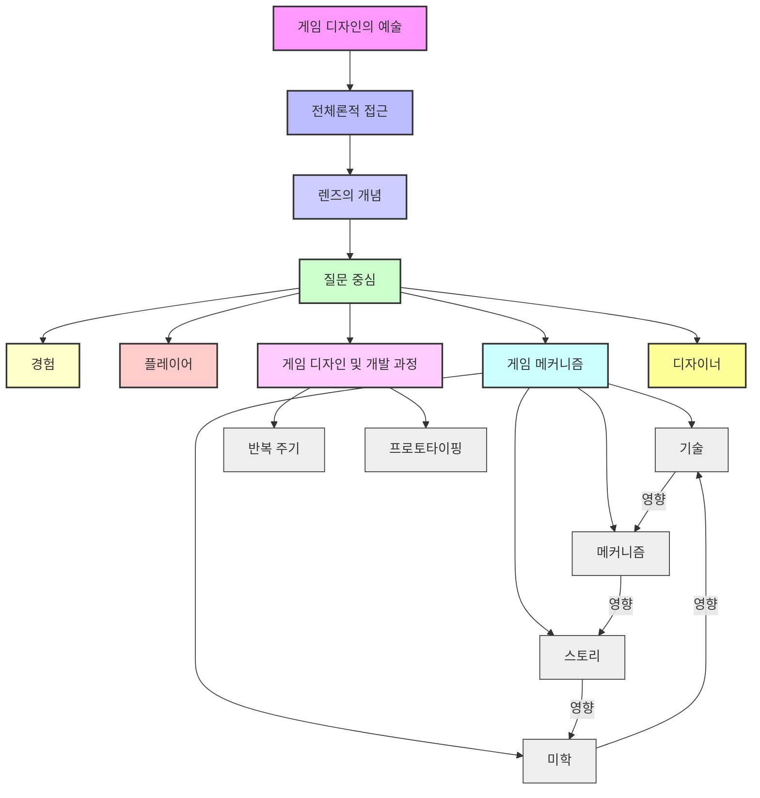

## 게임 디자인의 예술: 게임 개발자의 삶과 철학
이 책은 게임 디자인이 단순히 기술적인 작업이 아니라, 창의적인 글쓰기, 건축, 수학이 결합된 예술이라는 것을 알려주는 책이야. 게임 디자이너들이 어떻게 영감을 얻고, 어떤 과정을 거쳐 게임을 만들며, 미래의 게임 산업이 어떻게 변화할지에 대한 깊이 있는 통찰을 제공해.

## 1. 게임 디자이너, 그들은 누구인가? 

게임 디자이너는 단순히 게임을 만드는 사람이 아니라, 다양한 경험과 상상력을 바탕으로 새로운 세상을 창조하는 사람이라고 보면 돼.

1. **어릴 적 경험이 게임 디자인의 씨앗이 되다** 
  - 어릴 때 아빠가 읽어주던 '반지의 제왕' 책, '닥터 후'나 쿵푸 영화, 만화책 같은 것들이 게임 디자이너들의 상상력을 키워줬어.
  - 비디오 게임, 보드 게임, '던전 앤 드래곤(D&D)' 같은 것들을 하면서 자연스럽게 게임에 대한 흥미를 키웠지.
  - 이런 경험들이 나중에 게임 산업에 뛰어들 때 아주 중요한 영감과 배경, 그리고 기술이 됐다고 해.
2. **다양한 분야를 섭렵한 창의적인 아이들** 
  - 게임 디자이너들은 기술적인 능력만 뛰어난 게 아니야. 글쓰기, 그림 그리기 등 다양한 창의적인 분야에 대한 넓은 이해를 가지고 있었어.
  - 영화, 만화책 일러스트레이터 등 여러 분야를 경험하다가 결국 게임 디자인으로 오게 된 경우가 많아.
3. **보드 게임이 상상력을 폭발시키다** 
  - '던전 앤 드래곤' 같은 보드 게임은 디자이너들에게 엄청난 영향을 줬어.
  - '리스크'나 '모노폴리' 같은 게임은 정해진 규칙 안에서 플레이하지만, D&D는 직접 이야기를 만들고 플레이어를 모험으로 이끌 수 있었거든.
  - 이런 경험을 통해 '규칙을 따르지 않고 원하는 대로 상상하고 만들 수 있다'는 것을 깨달았다고 해.
  - 어릴 때부터 종이에 지도를 그리고, RTS(실시간 전략 게임) 게임을 상상해서 그리는 등 창의적인 활동을 많이 했어.
4. **나만의 이야기를 만드는 즐거움** 
  - D&D는 단순히 던전이나 용에 대한 게임이 아니었어. 우주 정거장이나 다른 행성에 대한 이야기도 만들 수 있었지.
  - 이 게임은 정해진 규칙 안에서 원하는 어떤 이야기든 만들 수 있다는 것을 알려줬어.
  - 나중에 '둠'이나 '퀘이크' 같은 게임의 엔진을 가지고 '로보텍'이나 '에일리언' 레벨을 만드는 것처럼, 기존 게임을 자기만의 방식으로 바꾸는 '모딩(Modding)' 경험으로 이어졌어.
  - 이런 경험은 '내 창의력과 상상력으로 무엇이든 만들 수 있다'는 자신감을 심어줬어.
5. **덕후 문화의 힘과 공유 경험** 
  - 어릴 때 일본에서 온 변신 로봇 장난감 '마이크로너츠'나 '쇼군 워리어' 같은 것들을 가지고 놀면서, D&D 같은 보드 게임에 이런 요소들을 포함시켰어.
  - D&D는 단순히 대화만 하는 게 아니라, 보드와 피규어 같은 물리적인 요소가 있어서 모든 '덕후스러움'과 대중문화 사랑을 담을 수 있는 경험이었지.
  - 예전에는 이런 '덕후' 문화가 '쿨'하지 않았지만, 지금은 모두가 즐기는 주류 문화가 됐어.
  - 인터넷이 없던 시절에는 이런 취미를 가진 사람들끼리 모여서 커뮤니티를 만들고, 서로의 경험을 공유하면서 영감을 얻었어.
  - 이런 다양한 경험들이 나중에 게임 디자이너로서 성공하는 데 결정적인 역할을 했어.
6. **모든 경험은 좋은 경험이다** 
  - 어릴 때부터 음악, 영화, 책, 만화 등 다양한 창의적인 매체에 노출되는 것이 중요하다고 해.
  - '레드 데드 리뎀션' 같은 서부극 게임은 수많은 서부 영화에서 영감을 받았듯이, 게임은 이제 단순한 클리셰를 넘어 예술적인 표현의 경지에 이르렀어.
  - 어떤 경험이든 나중에 게임 디자인에 활용될 수 있기 때문에, 지금 관심 있는 모든 것이 중요하다고 강조해.
  - 남들이 뭐라고 하든 자신의 길을 가고, 자신만의 독특한 경험을 개발하는 것이 중요하다고 말해.

## 2. 게임 산업의 변화: '덕후'에서 '주류'로 

예전에는 게임이 '악마의 놀이'처럼 여겨지기도 했지만, 지금은 모두가 즐기는 멋진 문화가 됐어.

1. **'악마의 놀이'에서 '최고의 경험'으로** 
  - 영화 'E.T.'에서는 D&D가 악마적인 것으로 묘사됐지만, '기묘한 이야기'에서는 최고의 어린 시절 경험으로 그려져.
  - 이처럼 게임에 대한 사회의 인식이 크게 변했어.
2. **단순한 장난감에서 몰입형 세계로** 
  - 1980년대 초창기 비디오 게임은 '아타리 2600'처럼 짧고 재미있는 어린이용 오락이었고, 깊이가 없는 일회성 장난감으로 여겨졌어.
  - 하지만 게임 디자이너들은 '젤다' 같은 원시적인 게임에서도 더 크고 방대한 세계의 가능성을 봤어.
  - 지금은 '월드 오브 워크래프트'나 '엘더스크롤 스카이림'처럼 사람들이 완전히 몰입하고 실제 삶과 같은 경험을 할 수 있는 세계가 만들어졌어.
  - 게임 산업은 이제 음악이나 영화 산업보다 더 큰 '거물'이 되었고, 많은 사람들이 뛰어들고 싶어 하는 '최고의 창의적 매체'가 됐어.
3. **창의성의 폭발과 시장의 확장** 
  - 지난 10년간 게임 산업은 엄청나게 성장했고, 다양한 종류의 게임들이 사랑받고 있어.
  - '스팀(Steam)' 같은 플랫폼 덕분에 옛날 게임들도 쉽게 다시 플레이할 수 있게 됐고, 사람들은 그 가치를 인정하게 됐어.
  - 이제는 '콜 오브 듀티' 같은 대작 게임부터 인디 게임까지, 어떤 게임이든 만들고 즐길 수 있는 시대가 됐어.

## 3. 게임 산업의 성장 동력: 접근성과 공유 경험 

게임이 이렇게 대중화된 데에는 두 가지 중요한 이유가 있어.

1. **접근성의 혁명** 
  - 예전에는 아케이드 게임을 하려면 아이들이 갈 수 없는 어두운 곳에 가야 했어. 담배 냄새가 나고 위험한 동네에 있는 오락실에 부모님 손을 잡고 가야 했지.
  - 하지만 시간이 지나면서 '서커스 서커스' 같은 곳처럼 가족 친화적인 공간으로 바뀌었고, 미니 골프장이나 볼링장, 심지어 슈퍼마켓에도 아케이드 게임이 생겼어.
  - 1970년대에는 미국 전역의 모든 장소에 아케이드 게임이 있었을 정도야.
2. **공유 경험의 확산** 
  - 인터넷의 등장으로 사람들은 서로 소통하고, '나도 어릴 때 D&D를 했어!'라고 말하며 같은 경험을 가진 사람들과 커뮤니티를 형성할 수 있게 됐어.
  - 예전에는 D&D를 하는 사람이 소수라고 생각했지만, 지금은 수백만 명이 즐기는 대중적인 취미가 됐지.
  - 이런 공유 경험은 게임을 대중문화의 일부로 만들고, 모두에게 받아들여지게 하는 데 큰 역할을 했어.

## 4. 스팀(Steam)과 게임 개발의 민주화 

'스팀'이라는 플랫폼은 게임을 만드는 사람과 즐기는 사람 모두에게 엄청난 변화를 가져왔어.

1. **모두를 위한 접근성** 
  - 스팀은 게임을 플레이하고 싶은 사람이라면 누구나 쉽게 게임을 찾고 즐길 수 있는 '포털' 같은 역할을 해.
  - 예전에는 오래된 게임을 하려면 해당 콘솔이나 기술이 필요해서 접근하기 어려웠지만, 스팀은 이런 장벽을 허물었어.
  - 컴퓨터만 있으면 방대한 게임 라이브러리에 접근할 수 있게 되면서, 모두에게 공평한 기회를 제공했지.
2. **개발의 자유와 독립 게임의 부상** 
  - 스팀은 젊은 개발자들이 자신의 아이디어를 일찍 출시하고, 사람들의 피드백을 받을 수 있는 통로가 됐어.
  - 예전에는 콘솔 개발사나 대형 PC 게임 시장이 게임 출시를 엄격하게 통제했지만, 스팀은 이런 통제에서 벗어나게 해줬어.
  - 이제는 누구나 게임을 개발해서 스팀에 올리고 시장의 반응을 볼 수 있게 됐어.
  - '플래시 게임'이나 '8비트 스프라이트' 같은 작은 게임들이 무료 사이트에서 개발되고 테스트되면서, 독립 게임 시장이 크게 성장했어.
  - 스팀과 모바일 앱 시장의 폭발적인 성장은 더 많은 사람들이 원하는 게임을 개발하고 출시할 수 있는 길을 열어줬어.
3. **'허락'이 필요 없는 시대** 
  - 예전에는 '세가'나 '닌텐도' 같은 회사에 허락을 받아야만 게임을 만들 수 있었고, 많은 비용이 들었어.
  - 하지만 지금은 누구의 허락도 없이 원하는 게임을 만들 수 있는 시대가 됐어.
  - 이런 변화는 창의적인 자유를 크게 확장시켰어.

## 5. 게임 디자이너의 성장 과정: 교육과 경험 

게임 디자이너가 되기까지는 다양한 교육과 경험, 그리고 끈기가 필요해.

1. **창의적인 환경에서 자라다** 
  - 어머니가 예술가이고 아버지가 사진작가인 가정에서 자란 디자이너는 자연스럽게 창의적인 환경에 노출됐어.
  - 다양한 나라와 박물관을 여행하고, 음악, 미술, 도예, 목공, 심지어 자동차 정비 같은 수업을 들으면서 창의적인 기술을 익혔어.
  - 고등학교 때 '공상 과학 수업'에서 '낯선 땅의 이방인', '라마와의 랑데부', '유년기의 끝' 같은 깊이 있는 SF 소설을 읽으면서 상상력을 키웠어.
2. **열정적인 멘토의 영향** 
  - 커리큘럼을 넘어 개인적인 경험과 사랑을 바탕으로 가르치는 선생님들을 만나면서, 학생들은 자신만의 열정을 키울 수 있었어.
3. **다양한 꿈과 진로 탐색** 
  - 어릴 때는 수의사나 우주 비행사를 꿈꾸기도 했지만, 현실적인 어려움 때문에 포기했어.
  - 결국 영화, 게임, TV 같은 창의적인 분야로 진로를 정하게 됐지.
4. **변화무쌍한 경험의 중요성** 
  - 영국에서 팀 버튼의 '배트맨', 테리 길리엄의 '시간 도둑들', '타이탄 족의 습격' 촬영 현장을 보고, 스톱모션 애니메이션의 대가 레이 해리하우젠과 함께 시간을 보낸 경험은 디자이너에게 큰 영향을 줬어.
  - 이런 기회를 놓치지 않고 적극적으로 활용하는 것이 중요하다고 해.
5. **부모님의 지지와 자유로운 선택** 
  - 어릴 때부터 '고질라' 영화를 보며 괴물을 그리는 데 몰두했고, '터미네이터'나 '에일리언' 같은 영화를 보면서 그림을 그리고 싶다는 열정을 키웠어.
  - 부모님은 '인생은 네가 원하는 대로 살아야 한다'고 가르쳤고, 덕분에 자유롭게 예술을 공부할 수 있었어.
  - 고등학교 때 '배트맨' 티셔츠를 입고 다녔던 것처럼, 남들의 시선에 얽매이지 않고 자신의 관심사를 좇는 것이 중요하다고 말해.
  - 정식 교육을 받기 전까지는 혼자서 그림을 그리며 기술을 익혔어.
6. **선생님과의 소통과 질문의 중요성** 
  - 학생들은 선생님에게 적극적으로 질문하고, '무엇을 해야 할까요?'라고 물어보면서 더 흥미롭고 재미있는 길을 찾을 수 있어.
  - 좋은 선생님들은 학생들을 창의적인 길로 이끌어주는 '부드러운 조언자' 역할을 한다고 해.

## 6. 게임 산업 진출: 우연과 노력의 교차점 

게임 산업에 들어가는 길은 결코 쉽지 않았지만, 우연한 기회와 끊임없는 노력이 결합되어 가능했어.

1. **우연한 기회와 호기심** 
  - 샌디에이고에 있는 '그렘린(Gremlin)'이라는 회사(나중에 세가에 인수됨)에서 친구 어머니가 아케이드 게임 설명서를 덴마크어로 번역하는 일을 했어.
  - 방과 후에 회사에 가서 시제품 아케이드 게임을 플레이하고 피드백을 주는 경험을 하면서 게임 산업에 대한 호기심을 키웠어.
  - '매드맨'이라는 드라마의 대사처럼, '어떤 직업을 생각하고 그 직업을 하는 사람이 되어라'는 말처럼, 주변 사람들의 다양한 직업에 대해 호기심을 가지고 질문하면서 '나도 할 수 있다'는 가능성을 발견했어.
2. **다중 직업과 기술 습득** 
  - 대학 시절 돈이 없어서 친구의 제안으로 흑백 영화를 프레임별로 컬러링하는 일을 시작했어.
  - 밤샘 근무를 하면서 4년 동안 이 일을 했는데, 이 과정에서 다양한 기술과 영화에 대한 깊은 이해를 얻었어.
  - '멋진 인생'이라는 영화를 프레임별로 보면서 카메라 앵글, 미술 감독의 결정, 의상, 세트 연출 등에 대해 배우고 흡수했지.
  - 이 일을 통해 '앰블린(Amblin)', '마블(Marvel)', '플레이보이(Playboy)' 같은 다양한 회사와 협력할 기회를 얻고, 애니메이션, 영화, 만화 분야에서 성공한 사람들과 인맥을 쌓았어.
3. **게임 테스터에서 디자이너로** 
  - 컬러링 회사에서 만난 동료의 남자친구가 세가 스포츠 게임을 만드는 회사에서 일했는데, 그에게 게임 테스터 자리를 제안받았어.
  - 당시 서점, 영화 컬러링, 게임 테스터 세 가지 일을 동시에 하면서, 미술, 프로그래밍, 그리고 게임에 대한 해박한 지식을 인정받아 '세가 오브 아메리카'에 첫 직장으로 입사하게 됐어.
4. **일러스트레이터의 꿈과 좌절** 
  - 미술 대학에서 일러스트레이션을 전공했지만, 졸업 후 프리랜서 일러스트레이터로 성공하기 어렵다는 것을 깨달았어.
  - 당시에는 전화로 직접 영업하고, 카드와 샘플을 보내는 등 마케팅이 훨씬 어려웠어. 지금은 소셜 미디어나 이메일, 링크드인으로 훨씬 간단해졌지.
  - 하지만 그림 그리는 것을 포기하지 않고, 끊임없이 새로운 것을 배우려고 노력했어.
5. **만화, 영화를 거쳐 게임으로** 
  - 만화책 산업에 도전했지만, 시장이 붕괴되면서 일자리를 찾기 어려웠어.
  - 이후 영화 엑스트라로 출연하고, 만화책 경험을 살려 영화 스토리보드를 그리는 일을 했지만, 영화 산업은 관계가 단절되고 불안정해서 마음에 들지 않았어.
  - 그러다 '레지던트 이블 1'을 플레이하고 나서 '이거다!' 싶어서 게임 산업으로 진로를 바꿨어.
  - 3D 맥스, 포토샵을 배우고 게임 회사 인턴으로 들어가 '다크 소드', '매직 소드' 같은 작은 아이콘을 만드는 일을 시작했어.
6. **끈기와 인맥의 중요성** 
  - 첫 회사가 문을 닫았지만, 그곳에서 만난 사람들과 계속 연락하면서 '데이브 미라 BMX' 게임을 만드는 'Z-Axis'라는 회사에 취직하게 됐어.
  - 그때부터 1997~98년 이후로 단 한 번도 쉬지 않고 계속 일할 수 있었어.
  - 창의적인 분야에서는 한 가지 일만 하는 것이 아니라, 단기 프로젝트, 장기 계약, 프리랜서 등 다양한 일을 하면서 끊임없이 배우고 새로운 사람들을 만나는 것이 중요하다고 해.

## 7. 게임 디자이너의 삶: 창의성과 문제 해결 

게임 디자이너의 삶은 끊임없이 창의력을 발휘하고 문제를 해결하며, 새로운 기회를 찾아 나서는 여정이라고 할 수 있어.

1. **창의성은 근육과 같다** 
  - 창의력은 마치 근육과 같아서, 매일 꾸준히 사용하고 훈련해야 더 강해진다고 해.
  - 새로운 것을 배우고, 자신을 표현하는 등 매일 창의적인 활동을 해야 한다고 강조해.
  - 게임 산업에서 오래 살아남는 비결은 '안주하지 않는 것'이라고 말해.
  - 매번 새로운 기술, 새로운 기회, 새로운 사람, 새로운 프로젝트를 통해 끊임없이 변화하고 성장해야 해.
2. **인생은 **RPG** 게임과 같다** 
  - 학생들에게 '커리어를 한 회사에만 국한해서 생각하지 말라'고 조언해.
  - 인생은 마치 RPG(역할 수행 게임)와 같아서, 처음에는 가진 것이 별로 없고 이상한 미션들을 수행해야 하지만, 계속 노력하고 '레벨업'하면서 성장해 나가는 거야.
  - '사이드 퀘스트(Side quest)'를 피하지 않고 모든 기회를 잡아서 무엇을 얻을 수 있을지 탐색하는 것이 중요하다고 해.
  - 끊임없이 창의적이고 호기심을 가져야 한다고 말해.
3. **네트워킹과 기회 포착** 
  - '허슬(Hustle)'이라는 단어가 기업적으로 들릴 수 있지만, 긍정적이고 적극적으로 사람들과 관계를 맺는 것이 중요하다고 해.
  - 게임 잼(Game Jam) 같은 행사에 참여해서 다른 개발자들과 교류하고 우정을 쌓다 보면, 예상치 못한 기회가 찾아올 수 있어.
  - 생존 호러 게임을 좋아하는 사람과 대화하다가 1년 뒤에 그 게임을 만드는 회사에서 일할 기회를 얻을 수도 있는 것처럼 말이야.
  - 창의적인 삶은 프로젝트마다 옮겨 다니고, 단기 계약과 프리랜서 일을 병행하는 경우가 많아.
  - 이런 불안정한 생활 방식을 스트레스가 아닌 즐거움으로 받아들이고, 끊임없이 새로운 일을 찾아야 한다고 해.

## 8. 게임 디자이너는 무엇을 하는가? 

게임 디자이너는 단순히 게임을 만드는 사람이 아니라, 게임의 모든 것을 설계하고 조율하는 '만능 해결사'라고 보면 돼.

1. **창의적인 글쓰기, 건축, 수학의 결합** 
  - 게임 디자이너는 '창의적인 글쓰기', '건축', '수학'을 결합하는 직업이라고 설명해.
  - 이 세 가지는 전혀 관련 없어 보이지만, 게임 디자이너는 이 모든 것을 함께 다뤄.
  - 공간을 만들고, 그 공간의 규칙을 정하고, 플레이어가 그 공간을 즐길 수 있도록 논리를 만드는 일을 해.
2. **게임의 모든 것을 알아야 하는 전문가** 
  - 게임 디자이너는 오디오, 애니메이션, 스크립팅, 건축, 캐릭터 메커니즘, 전투 등 게임의 모든 것에 대해 알아야 해.
  - '캐릭터', '전투', '레벨 디자인' 같은 매력적인 단어들을 사용해서 사람들이 게임 디자인을 더 잘 이해하도록 설명해.
  - 플레이어가 게임을 왜 플레이하는지, 무엇이 재미있는지, 게임의 목표는 무엇인지 찾아내는 사람이야.
  - 끊임없이 게임을 조율하고, 구현하고, 변경하면서 게임을 더 재미있고 좋게 만드는 일을 해.
  - 팀 전체를 이끌고, 게임의 특정 부분을 책임지며, 다른 사람들에게 무엇을 해야 할지 지시하는 역할을 해.
3. **'만능 해결사'의 미학** 
  - 어떤 사람들은 게임 디자이너를 '여러 가지를 잘하지만, 어느 것 하나 제대로 못 하는 사람(jack of all trades, but a master of none)'이라고 폄하하기도 해.
  - 하지만 게임 디자이너는 모든 것에 대해 어느 정도 알아야 하는 '만능 해결사'라고 할 수 있어.
  - 게임 디자인의 본질은 '문제 해결'이야. '어떻게 하면 재미있게 만들까?', '어떻게 캐릭터를 만들까?' 같은 질문에 답을 찾는 것이지.
  - 이런 아이디어를 미술, 프로그래밍, 애니메이션, 사운드 같은 다른 개발 분야(discipline)에 전달하고, 팀이 함께 게임을 만들도록 이끄는 역할을 해.
4. **협업과 경험의 집합체** 
  - 게임 디자이너는 다른 사람들과 협업하면서 서로의 아이디어를 발전시키고, 프로젝트의 질을 높여.
  - 사진, 사운드 디자인, 건축, 게임 플레이, 전투 등 다양한 기술을 아는 것이 협업에 큰 도움이 돼.
  - '전문가(expert)'라는 말보다는 '경험과 모범 사례의 집합체'라고 표현하는 것이 더 적절하다고 해.
  - 모두가 각자의 분야에서 잘할 때, 그 집단적인 노력과 경험이 진정한 '전문성'을 만들어낸다고 믿어.

## 9. 게임 디자이너가 되려면: 포트폴리오와 멘토링 

게임 디자이너가 되기 위해서는 단순히 재능만으로는 부족하고, 체계적인 교육과 끊임없는 노력, 그리고 멘토의 지도가 필요해.

1. **높아진 진입 장벽과 포트폴리오의 중요성** 
  - 예전에는 게임에 관심 있고 배우려는 의지만 있으면 게임 산업에 들어갈 수 있었지만, 지금은 진입 장벽이 훨씬 높아졌어.
  - 이제는 팀 작업과 협업 경험을 보여주는 훌륭한 포트폴리오가 필수적이야.
  - 미술팀과 디자이너가 협업하고, 미술 감독이 품질을 관리하는 것처럼, 다양한 사람들과 협업하는 경험이 중요해.
2. **다재다능한 기술과 아이디어의 한계** 
  - 게임 디자이너는 오디오를 게임에 넣고, 프로토타입(시제품)을 만드는 등 다양한 기술을 알아야 해.
  - 단순히 아이디어만 내는 사람은 성공하기 어려워. 아이디어를 현실로 만들 수 있는 기술과 노력이 필요해.
  - '마리오' 게임의 '뿅뿅' 소리처럼, 게임에 필요한 모든 요소를 직접 구현할 수 있어야 해.
3. **멘토의 가치와 체계적인 교육** 
  - 산업에서 경험과 성공을 거둔 '베테랑(veteran)' 멘토의 지도는 매우 중요해.
  - 멘토는 학생들이 산업이 무엇을 원하는지, 인터뷰는 어떻게 진행되는지 등 실질적인 조언을 해줄 수 있어.
  - 교육은 학습에 '구조'를 제공하고, 멘토들이 기술과 경험을 공유하면서 학생들이 성장할 수 있도록 도와줘.
  - 마치 장인이 견습생에게 기술을 가르치는 것과 같다고 보면 돼.
4. **자기 주도 학습과 비판 수용** 
  - 학교에서는 기초를 가르쳐주지만, 그 이상은 학생 스스로의 '훈련(discipline)'에 달려 있어.
  - 수업 과제를 단순히 끝내는 것을 넘어, 배운 기술을 적용하고 끊임없이 발전시키려는 노력이 필요해.
  - 학교에서 배우는 것 중 가장 중요한 것 중 하나는 '비판을 수용하는 방법'이야.
  - 자신의 '자존심(ego)'을 내려놓고 비판을 경청하며 개선하는 것이 중요해.
  - 긍정적인 피드백보다는 부정적인 피드백을 통해 자신이 부족한 부분을 개선하고 발전할 수 있다고 말해.
  - 수업 후에도 선생님을 찾아와 피드백을 구하고, 끊임없이 노력하는 학생이 결국 성공한다고 강조해.

## 10. 게임 디자이너가 된 이유: 다양성과 기회 제공 

게임 디자이너들은 단순히 게임을 만드는 것을 넘어, 더 나은 산업을 만들고 다음 세대에게 기회를 제공하기 위해 노력하고 있어.

1. **성숙과 나눔의 가치** 
  - 게임 디자이너들은 나이가 들면서 사람들을 돕고 가르치는 것에 더 큰 흥미를 느끼게 돼.
  - 산업에서 가르치고 이끄는 기회가 생겼을 때, 단순히 지시하는 것이 아니라 교육하고 안내하는 책임을 느꼈어.
  - 게임 엔진이 더 접근하기 쉬워지고 무료로 제공되면서, 게임 디자인 교육이 가능해졌다고 말해.
2. **젊은 세대와의 교류와 영감** 
  - 젊은 세대와 함께 일하면서 그들의 열정과 다양한 장르에 대한 관심, 게임을 플레이하는 방식 등을 통해 새로운 영감을 얻어.
  - 학생들과 함께 게임을 플레이하면서 '다시 한번 게임이 정말 멋지다'는 느낌을 받는다고 해.
  - 이제는 누구나 게임을 만들고 가르칠 수 있는 시대가 됐어.
3. **다양성 증진과 장벽 허물기** 
  - 게임 디자이너의 목표는 '자신과 같은 사람들의 군대'를 만들어 게임 산업을 더 나은 곳으로 만드는 것이라고 말해.
  - 예전에는 게임 회사에 백인 남성들만 가득했지만, 지금은 훨씬 더 다양한 사람들이 유입되고 있어.
  - 다양한 사고방식, 문화적 배경을 가진 사람들이 모이면서 게임 개발 과정과 게임의 질이 훨씬 좋아졌다고 강조해.
  - 누구나 게임을 만들 수 있고, 어떤 장벽도 있어서는 안 된다는 메시지를 전파하는 것이 중요하다고 믿어.
4. **멘토의 영향과 성장 지원** 
  - 자신에게 영감을 준 선생님처럼, 학생들의 강점을 파악하고 그들이 '킬러 게임 디자이너'가 되기보다는 '더 나은 사람'으로 성장하도록 돕는 것이 중요하다고 해.
  - 학생들이 게임 디자인을 전공했지만 다른 창의적인 분야로 나아갈 수도 있다는 것을 인정하고 지원해야 한다고 말해.
5. **기회 제공과 '페이 포워드(Pay it forward)'** 
  - 학생들에게 단순히 기회를 잡는 것을 넘어, 다른 사람들에게 기회를 제공하는 사람이 되어야 한다고 가르쳐.
  - 모든 기회를 자신과 주변 사람들이 함께 성장하는 방법으로 바라봐야 한다고 강조해.

## 11. 게임 산업 진출을 위한 조언: 끊임없는 창조와 인내 

게임 산업에 뛰어들고 싶다면, 끊임없이 만들고 배우며, 인내심을 가지고 과정을 즐기는 것이 중요해.

1. **항상 창조하라** 
  - 포트폴리오가 없다면, 좋아하는 게임을 선택하고 도구를 사용해서 레벨을 만들어봐.
  - 항상 무언가를 만들고, 보여줄 것을 가지고 있어야 해.
  - 현재에 만족하지 말고, 항상 개선할 기회를 찾아야 해.
2. **기회를 찾아 나서라** 
  - '아프로 코믹콘(Afro Comic-Con)' 같은 행사에 참여해서 사람들의 이야기를 듣고 영감을 얻어봐.
  - IGDA(국제 게임 개발자 협회) 같은 지역 게임 개발 단체나 컨벤션, 팬클럽 등에서 같은 생각을 가진 사람들을 만나 기회를 찾아야 해.
  - 이런 만남은 직간접적으로 원하는 일을 할 기회를 제공할 수 있어.
3. **호기심을 가지고 탐구하라** 
  - 강연에서 언급된 대중문화 레퍼런스(가메라, 던전 앤 드래곤 등)에 대해 메모하고 찾아보는 것이 중요해.
  - 좋아하는 밴드가 있다면 그들의 모든 앨범과 사이드 프로젝트를 찾아보고, 그들의 음반사에서 다른 밴드들을 찾아보는 것처럼 말이야.
  - 좋아하는 게임이 있다면 어떤 회사가 개발하고 퍼블리싱(배급)했는지 찾아보고, 그들의 다른 작품들을 탐구해봐.
  - 이런 탐구는 디자이너들이 어릴 때 얻었던 것과 같은 경험을 할 수 있는 출발점이 될 수 있어.
4. **인내심을 가져라** 
  - 가장 중요한 것은 '긍정적인 태도'와 '인내심'이야.
  - 기술을 익히는 데는 오랜 시간이 걸려. 3D 모델링이나 3D 소프트웨어 작업은 한 학기 내내 씨름해야 하는 일이야.
  - 모든 과정이 자연스럽게 발전하도록 인내심을 가지고 기다려야 해.
  - 모든 수업과 학기가 중요하다고 생각하고, 조급해하지 않는 것이 중요해.
  - '월드 오브 워크래프트'나 'GTA 5' 같은 대작 게임을 만들 생각보다는, 작은 기술들을 하나씩 배우는 데 집중해야 해.
5. **포트폴리오에 대한 오해** 
  - 포트폴리오는 생각보다 거대한 작업이 아니야. 게임 디자이너의 경우, 3~4개의 대표작과 몇 개의 작은 작품으로 자신의 기술을 보여줄 수 있어.
  - 모든 과제가 포트폴리오 수준의 품질이어야 한다고 생각해서 압도당할 필요는 없어.
  - 막대기 그림(stick figure)으로 소통하고, 그림을 그리고, 화이트보드에 글을 쓰는 것 같은 기본적인 기술들도 게임 디자이너에게는 중요해.
  - 이런 과정들을 즐기면서 창의적인 삶을 살아간다면 결국 성공할 수 있을 거야.

## 12. 게임 디자인의 본질: 경험과 질문 

게임 디자인은 단순히 기술적인 구현이 아니라, 플레이어에게 어떤 경험을 제공할 것인지 깊이 고민하고 질문하는 과정이야.

1. **게임 디자인의 '대부' 같은 책** 
  - '게임 디자인의 예술(The Art of Game Design)'은 게임 개발자들이 꼭 읽어야 할 '고전' 같은 책이야.
  - 이 책은 게임 디자인에 대한 '전체론적인(holistic)' 접근 방식을 취하며, 모든 요소를 종합적으로 다뤄.
  - 학생들이 게임을 만들 때 겪는 기술적인 어려움에서 벗어나, 게임 디자인의 큰 그림을 볼 수 있도록 도와줘.
2. **다양한 분야를 아우르는 통찰** 
  - 이 책은 게임 디자인뿐만 아니라, 연극, 미술 등 다른 분야들이 어떻게 게임과 상호작용하는지 보여줘.
  - 보드 게임, 테이블탑 RPG, 방 탈출 게임 등 다양한 종류의 게임에 적용할 수 있는 폭넓은 내용을 담고 있어.
  - 저자인 제시 셸(Jesse Schell)은 디즈니 이매지니어(Imagineer) 출신으로, MMO(대규모 다중 사용자 온라인 게임)나 혼합 현실(Mixed Reality) 놀이기구 같은 독특한 경험을 디자인한 사례들을 많이 제시해.
3. **이론과 실제의 균형** 
  - 일부 사람들은 이 책이 너무 '이론적'이고 '비실용적'이라고 비판하기도 해.
  - 하지만 게임 디자인은 단순히 기술적인 구현이 아니라, 게임을 '좋게' 만들고 '즐거운 경험'으로 만드는 것에 대한 고민이야.
  - 이 책은 게임 밸런스를 맞추는 방법처럼, 실제 게임 개발에 적용할 수 있는 실용적인 조언들도 많이 담고 있어.
  - 예를 들어, 게임의 변수들을 스프레드시트에 모아두면 밸런스를 맞추기 훨씬 쉽다는 식의 조언을 해줘.
4. **'**렌즈**'를 통한 질문의 힘** 
  - 이 책은 '렌즈(Lenses)'라는 개념을 사용하는데, 이는 '오블리크 스트래티지(Oblique Strategies)' 카드처럼 게임에 대해 생각할 수 있는 '질문'들을 제공해.
  - 이 렌즈 카드들을 무작위로 뽑아서 게임에 대한 특정 문제를 고민하거나, 게임과 관련된 질문을 던져볼 수 있어.
  - 저자는 게임이 너무 다양해서 '이래야 한다'는 식의 조언은 틀릴 수 있다고 생각했어.
  - 하지만 '질문'은 틀릴 수 없기 때문에, 질문을 중심으로 책을 구성했다고 해.
5. **다학제적 접근과 인간 심리** 
  - 이 책은 게임뿐만 아니라 심리학 논문, 미스터 로저스(Mr. Rogers)의 의회 인터뷰 등 다양한 분야의 이론을 게임 디자인과 연결시켜.
  - 각 렌즈는 게임에 대해 생각할 거리를 제공하며, 자신의 강점과 약점을 파악하는 데 도움을 줘.
  - 저자는 게임이 너무 다양해서 좋은 책을 쓸 수 없다는 비판에 대해, '질문은 틀릴 수 없다'는 철학으로 접근했어.
  - 이론의 상당 부분은 게임이 아닌 인간 심리, 지각, 그리고 다양한 분야의 사례에서 가져왔어.
  - 예를 들어, 사람들이 너무 많은 선택지에 혼란스러워하는 심리를 설명하기 위해 놀이공원에서 캔디를 파는 자신의 경험을 이야기하기도 해.
  - 저자는 저글러(juggler) 출신으로, 마술과 사람들을 즐겁게 하는 경험을 통해 게임 디자인에 대한 통찰을 얻었어.

## 13. 게임 디자인의 핵심 요소: 경험, 플레이어, 게임, 디자이너 

이 책은 게임을 구성하는 다양한 요소들을 체계적으로 설명하며, 이들이 어떻게 서로 연결되어 있는지를 보여줘.

1. **게임 디자인의 '큰 그림'** 
  - 책은 '경험', '플레이어', '게임 메커니즘', '게임 디자인 및 개발 과정', '디자이너'라는 큰 틀을 바탕으로 게임의 모든 요소를 설명해.
  - 각 장을 진행하면서 이 요소들이 어떻게 서로 연결되어 있는지를 보여주는 '지도'를 확장해 나가.
2. 엘리멘탈 테트라드**(Elemental Tetrad)** 
  - 이 책의 핵심 개념 중 하나는 '엘리멘탈 테트라드'라는 4가지 요소 모델이야.
  - 이 모델은 '기술', '메커니즘', '스토리', '미학'으로 구성돼.
  - **미학(Aesthetics)**: 플레이어가 가장 눈으로 보고 느끼는 부분이야. 게임의 시각적인 스타일이나 분위기 같은 거지.
  - **기술(Technology)**: 플레이어에게는 보이지 않지만, 게임을 작동시키는 근본적인 부분이야. 게임 엔진이나 프로그래밍 같은 거야.
  - **메커니즘(Mechanics)**: 게임의 규칙과 상호작용 방식이야. 버튼을 누르면 캐릭터가 점프하는 것처럼 말이야.
  - **스토리(Story)**: 게임의 서사나 배경 이야기 같은 거야.
  - 이 네 가지 요소는 서로 긴밀하게 연결되어 있어서, 하나가 바뀌면 다른 요소에도 영향을 미쳐.
3. **기존 게임 분석에 활용** 
  - 이 모델은 기존 게임을 분석할 때 유용하게 사용될 수 있어.
  - 예를 들어, '락 밴드(Rock Band)' 게임에서 플라스틱 기타(기술)는 화면에 나타나는 색깔 버튼을 누르는 메커니즘과 연결되고, 게임의 약간 우스꽝스러운 만화 같은 미학과도 연결되는 식이야.
  - 기타를 들고 있어야 '락 스타'가 된 기분을 느낄 수 있는 것처럼, 모든 요소가 유기적으로 연결되어 있어.

## 14. 게임 디자인 교육: 아이디어 발상부터 프로토타이핑까지 

게임 디자인을 가르칠 때는 학생들이 아이디어를 내고, 시제품(프로토타입)을 만들고, 피드백을 통해 개선하는 과정을 중요하게 다뤄.

1. **아이디어 발상(Brainstorming)의 중요성** 
  - 학생들은 아이디어를 내는 데 어려움을 겪는 경우가 많아. 뇌는 익숙한 방식으로만 생각하려는 경향이 있거든.
  - 그래서 다양한 '브레인스토밍' 기법을 통해 새로운 각도에서 문제를 해결하도록 유도해.
  - '주스(Juice)'라는 개념도 중요하게 다루는데, 이는 게임의 상호작용을 더 풍부하고 만족스럽게 만드는 시각적, 청각적 피드백을 말해.
  - 학생 게임은 시간 제약 때문에 '주스'가 부족한 경우가 많아서, 게임 개발 막바지에 '주스'를 추가하는 시간을 따로 두기도 해.
  - 아이디어를 종이에 적어두면 머릿속의 '가상 램(Virtual RAM)'을 비워서 더 명확하게 생각할 수 있다는 조언도 해줘.
  - 창의적인 활동을 하는 사람들과 교류할 기회가 없는 사람들에게는 이런 기본적인 창의적 사고 방식이 매우 중요해.
2. **아이디어의 질에 대한 두려움 극복** 
  - 많은 학생들이 아이디어의 '질'에 대해 걱정하지만, 처음에는 형편없는 아이디어라도 괜찮다고 격려해.
  - '살바도르 달리(Salvador Dali)'가 잠들기 직전에 열쇠를 떨어뜨려 깨어나면서 꿈같은 아이디어를 얻었던 것처럼, 기발한 아이디어를 얻기 위한 다양한 방법들이 있어.
  - 일본의 한 발명가는 산소 부족 상태에서 최고의 아이디어를 얻기 위해 수영장 바닥에서 오랫동안 숨을 참기도 했다고 해.
3. **프로토타이핑(Prototyping)의 본질** 
  - '프로토타입'은 단순히 게임 개발의 초기 단계를 의미하는 것이 아니라, '질문에 답하기 위한' 목적을 가진 시제품이야.
  - '이 게임을 계속 만들어야 할까?'와 같은 질문에 답하기 위해 프로토타입을 만들어.
  - 이 책은 프로토타이핑에 대한 매우 강력한 설명을 제공하며, '페이퍼 프로토타이핑(Paper Prototyping)'처럼 구체적인 방법들을 제시해.
  - 저자는 자신의 스튜디오 경험과 '시드 마이어(Sid Meier)' 같은 다른 게임 개발자들의 조언을 인용하며, 게임 개발의 첫 30%가 프로토타입 단계라고 말해.
  - 프로토타이핑은 '빠르게 실패하고 재미를 찾아라(fail fast and find the fun)'는 원칙을 따르는데, 이는 어떤 것이 재미있을지 직접 상호작용하기 전까지는 알 수 없기 때문이야.
  - '마인크래프트(Minecraft)'의 '크리퍼(Creeper)'처럼 버그가 오히려 재미있는 기능이 되는 경우도 있고, 반대로 재미있을 줄 알았던 기능이 그렇지 않은 경우도 있어.
  - '스카이림(Skyrim)'에서 말 타는 기능이 만족스럽지 않아서 핵심 콘텐츠에서 제외된 것처럼 말이야.
  - 프로토타입은 게임 디자인뿐만 아니라, 기술적인 문제(예: 카메라에 몇 개의 에셋을 동시에 사용할 수 있는지)를 테스트하는 데도 사용될 수 있어.
  - '콘셉트 아트(Concept Art)'도 일종의 프로토타이핑으로 볼 수 있는데, 이는 게임의 일부가 어떻게 보일지 미리 보여주는 역할을 해.
  - 프로토타이핑의 핵심은 너무 깊이 파고들지 않고, 문제가 생기면 과감히 버릴 수 있도록 가볍게 만드는 것이야.

## 15. 게임 수학과 확률: 인간의 인지적 편향 

게임 디자인에서 확률과 수학은 매우 중요하며, 사람들은 확률을 제대로 예측하지 못하는 경향이 있어.

1. **확률과 게임 수학의 중요성** 
  - 이 책은 확률, 게임 수학, 그리고 우연에 대한 20페이지 분량의 섹션을 할애하고 있어.
  - 이 주제는 다른 책에서 한 권 전체를 다룰 정도로 중요해.
  - 예를 들어, '손실 회피(loss aversion)'처럼 사람들이 확률을 잘못 계산하고 편향된 판단을 내리는 경향에 대해 설명해.
  - 확률 수학 자체가 주사위 게임의 확률에 대한 질문에서 시작되었다는 흥미로운 역사적 사실도 언급해.
2. **인간의 확률 예측 능력 부족** 
  - 사람들은 일반적으로 확률을 잘 예측하지 못하거나 매우 서투르게 예측해.
  - 이 책은 '블랙잭'이나 '포커'처럼 확률을 잘 판단하는 것이 기술이 될 수 있다는 점을 지적해.
3. **상상된 통제력과 즐거움** 
  - 사람들은 완전히 무작위적인 것을 예측할 수 있다는 '상상된 기술'을 가지고 있어.
  - 심지어 가장 합리적인 사람도 주사위를 굴리면서 '제발!'이라고 외치거나, 주사위가 1이 나오면 '주사위 감옥'에 가두는 것처럼, 완전히 무작위적인 것을 통제할 수 있다고 상상하는 데서 즐거움을 얻어.
4. **다학제적 통찰** 
  - 저자는 인간 심리, 수학, 확률 등 다양한 주제에 대해 해박한 지식을 바탕으로 이 모든 것을 유기적으로 연결해.
  - 과학적인 데이터와 개인적인 일화를 넘나들며, 게임 디자인에 대한 깊이 있는 통찰을 제공해.
  - 이 책은 '실증주의(positivist)'적인 과학적 접근과 '현상학적(phenomenological)'인 경험적 접근을 모두 사용하여 게임을 이해해야 한다고 주장해.

## 16. 게임 밸런스와 난이도 곡선: 재미를 위한 조율 

게임의 밸런스와 난이도 조절은 플레이어에게 지속적인 재미와 몰입감을 주기 위해 매우 중요해.

1. **수학적 사고의 어려움** 
  - 학생들은 확률이나 게임의 수학적 측면에 대해 어려움을 겪는 경우가 많아.
  - 하지만 이 부분을 이해하면 게임이 왜 밸런스가 맞지 않는지 파악하고 개선하는 데 큰 도움이 돼.
2. **상대적 가치와 밸런싱** 
  - 게임에서는 '초당 공격력(DPS)'처럼 아이템이나 유닛의 상대적인 가치를 계산하는 것이 중요해.
  - 예를 들어, 초당 1회 공격에 6데미지를 주는 총과 초당 6회 공격에 1데미지를 주는 총은 DPS가 같아서 비슷한 가치를 가진다고 볼 수 있어.
  - 이런 방식으로 유닛의 체력과 속도 등을 조절하여 게임의 밸런스를 맞춰.
3. **'울퉁불퉁한' 난이도 곡선** 
  - 게임 디자인에서 '흐름 이론(flow theory)'은 플레이어가 게임에 완전히 몰입하는 상태를 설명해.
  - 이 책은 난이도가 부드럽게 증가하는 것보다는 '울퉁불퉁한(bumpy)' 난이도 곡선이 더 효과적이라고 말해.
  - 게임이 너무 쉽다고 느껴지는 순간과 너무 어렵고 좌절감을 주는 순간이 번갈아 나타나야 플레이어가 더 재미를 느낀다는 거야.
  - 플레이어는 자신을 계속 죽였던 몬스터를 결국 물리쳤을 때 큰 만족감을 느끼기 때문에, 난이도가 자동으로 조절되어 몬스터가 약해지는 것을 싫어해.
  - '플랜츠 vs 좀비(Plants Versus Zombies)'의 개발자는 자신의 어머니도 즐길 수 있는 타워 디펜스 게임을 만들기 위해, 모든 디자인 결정을 '어머니가 이해할 수 있을까?'라는 질문을 통해 내렸다고 해.

## 17. 스토리텔링의 구조: 플레이어 판타지에서 시작하라 

게임의 스토리는 단순히 이야기를 쓰는 것이 아니라, 플레이어가 어떤 경험을 하고 싶은지(플레이어 판타지)에서 시작해서 점진적으로 쌓아 올려야 해.

1. 스토리 스택**(Story Stack) 개념** 
  - 이 책은 '스토리 스택'이라는 개념을 통해 게임의 스토리를 설명해.
  - **중앙 판타지(**Central Fantasy**)**: 게임 스토리의 가장 근본적인 토대야. 해적 게임이라면 사람들이 해적에게 기대하는 특정한 요소들이 있는 것처럼 말이야.
  - **액션(Actions)**: 중앙 판타지를 뒷받침하는 게임 내 행동들이야. 해적 게임에서 배를 조종하고 싸우는 것처럼 말이야.
  - **경제(Economy)**: 게임 내 자원과 교환 시스템이야. 해적 게임에서 동전 대신 물물교환 시스템을 사용하는 것처럼 말이야.
  - **줄거리/스토리(Plot/Story)**: 가장 유연한 부분으로, 이 모든 것 위에 쌓아 올려지는 실제 이야기야.
  - 스토리는 가장 유연한 부분이기 때문에, 플레이어 판타지에서 시작해서 위로 쌓아 올려야 해.
2. **팅커벨 게임 사례** 
  - 팅커벨 게임을 만들 때, 처음에는 요정들이 할 수 있는 다양한 행동들을 넣었어.
  - 하지만 플레이 테스터들이 '날고 싶다'고 하자, 요정의 핵심 판타지인 '나는 것'을 액션에 추가했어.
  - 이후 동전 경제가 요정의 판타지에 맞지 않는다고 생각해서, 도토리나 베리 같은 것을 교환하는 물물교환 시스템으로 바꿨어.
3. **루도-내러티브 불협화음(**Ludo-narrative dissonance**) 문제** 
  - 영화 작가들을 게임 스크립트 작가로 데려오면, 게임의 스토리와 게임 플레이가 충돌하는 '루도-내러티브 불협화음' 문제가 발생할 수 있어.
  - 컷신(cutscene)에서는 멋진 스토리가 진행되지만, 실제 게임 플레이에서는 그 스토리를 완전히 훼손하는 행동을 하게 되는 경우가 많아.
4. **장르 판타지에서 스토리 도출** 
  - '디스코 엘리시움(Disco Elysium)'처럼 내러티브가 강한 게임도 모든 경찰 영화의 클리셰(trope)를 가지고 노는 것에서 시작했어.
  - 다섯 가지 유형의 경찰(액션 영화 속 경찰, 지적인 셜록, 감성적인 캐릭터, 기묘한 데일 쿠퍼 등) 판타지에서 모든 스토리와 메커니즘을 도출했지.
  - '역전재판(Phoenix Wright)'처럼 변호사가 범죄 현장을 수사하는 독특한 법률 시스템도 장르 판타지에서 시작된 거야.
5. **매력적인 캐릭터와 미디어의 비밀** 
  - '젤다'나 '메트로이드바니아' 같은 인디 게임에서 주인공이 매력적이지 않은 경우가 많아.
  - '링크(Link)'가 왜 멋진 캐릭터인지, '소닉(Sonic)'이 왜 8살 아이들에게 멋있었는지처럼, 성공적인 미디어는 수많은 의도적인 결정들이 완벽하게 결합된 결과라는 것을 이해해야 해.
  - 이 책은 사람들이 당연하게 여기는 창의적인 과정들을 '탈신비화(demystifying)'하고, 게임 디자인에 대한 언어와 인지적 도구를 제공하는 데 큰 역할을 해.

## 18. 게임 디자인의 약점과 논쟁: 세계관, 성별, 그리고 플레이어 페르소나 

이 책에는 게임 디자인의 특정 측면이나 사회적 논쟁에 대한 약점이나 논쟁적인 부분도 존재해.

1. **세계관(World-building)에 대한 부족한 설명** 
  - 저자는 '게임은 세계에서 일어난다'고 말하면서도, 정작 '게임 세계를 만드는 방법'에 대해서는 깊이 있게 다루지 않아.
  - 대신 '트랜스미디어(Transmedia)'처럼 이미 만들어진 세계관을 영화 등으로 확장하는 이야기에 집중해.
  - 이는 저자가 디즈니 이매지니어처럼 독특한 환경에서 일했기 때문일 수 있어. 대부분의 게임 개발은 이미 존재하는 IP(지적 재산)를 활용하는 경우가 많거든.
  - 인디 개발자들은 자신만의 IP를 개발해야 하는데, 이때는 '스펠렁키(Spelunky)'나 '아이작의 번제(Binding of Isaac)'처럼 미니멀리즘적인 접근 방식이 더 성공적일 수 있어.
2. **IP의 제약과 개발자의 역할** 
  - 다른 사람의 IP로 게임을 만들 때는 IP를 훼손하지 않기 위해 게임의 특정 부분을 희생해야 할 수도 있어.
  - 학생들이 방대한 세계관과 배경 이야기를 가지고 오지만, 정작 게임 플레이는 부족한 경우가 많아.
  - 플레이어는 게임을 직접 플레이하기 전까지는 방대한 '설정(lore)'에 관심이 없는 경우가 많아.
3. **성별에 대한 보수적인 **관점 
  - 이 책에는 남성과 여성, 소년과 소녀의 차이에 대한 다소 '보수적인(conservative)' 이야기가 많이 나와.
  - 저자는 이러한 내용이 '고정관념(stereotype)'이며 모든 사람에게 적용되는 것은 아니라고 전제하지만, 10~20페이지에 걸쳐 이 주제를 다루면서 그 전제가 희석되는 경향이 있어.
  - 디즈니 놀이기구에서 엄마들이 가족을 보호하려는 '자연스러운 역할'을 맡는다는 관찰처럼, 특정 상황에서의 행동 패턴을 설명하기도 해.
  - 여성들이 '숨은 그림 찾기 게임'을 즐기는 경향에 대해 '진화 심리학적(evolutionary psych)' 설명을 제시하기도 하는데, 이는 다소 환원주의적(reductive)일 수 있어.
  - 하지만 저자는 이를 '하나의 관점'으로 제시하며, 사람들의 '운명'이 아니라고 강조해.
  - 여전히 게임 장르에는 성별에 따른 선호도가 존재하며, '코지 게임(cozy game)'처럼 특정 성별이나 성 정체성을 가진 사람들이 선호하는 장르가 있어.
4. **변화하는 사회와 인구 통계** 
  - 이 책의 내용 중 '인구 통계(demographics)'에 대한 부분은 사회의 변화에 따라 가장 빠르게 변하고 있는 부분이라고 할 수 있어.
  - 학생들은 성 소수자(trans, gay) 학생들이 이 부분에 대해 비판적인 반응을 보이기도 하는데, 이는 수업에서 인구 통계, 역할 변화, 사회적 행동 등에 대한 토론으로 이어질 수 있어.
5. 플레이어 페르소나**(Player Persona)와 상업적 디자인** 
  - 전문적인 게임 디자인은 '다른 사람들을 위한' 게임을 만드는 것이기 때문에, '가상의 플레이어(imaginary player)'를 설정하고 그들이 어떻게 느낄지 상상하는 것이 중요해.
  - 대형 매치-3 게임 회사에서는 '플레이어 아키타입(player archetype)'을 설정하고 디자인 결정을 내리기도 해.
  - 하지만 인디 게임 개발자들은 자신과 같은 취향을 가진 사람들을 위해 게임을 만드는 경우가 많아.
  - 이 책은 상업적인 디자인 접근 방식에서 '어떤 게임이든 좋은 게임이 될 수 있다'는 관점을 제시하며, 모든 것이 '맥락(context)'에 달려 있다고 말해.
  - 디자인은 '좋은 게임이란 무엇인가'에 대한 자신만의 의견과 철학을 가지고 그것을 게임으로 표현하는 것이라고 할 수 있어.

## 19. 게임 디자인의 본질: 문제 해결과 끊임없는 질문 

게임 디자인은 본질적으로 문제를 해결하고, 끊임없이 질문을 던지며, 플레이어의 경험을 개선하는 과정이야.

1. **문제 해결로서의 디자인** 
  - 디자인은 본질적으로 '문제'나 '일련의 문제'를 해결하는 것이야.
  - 문제를 해결하지 않는다면, 그것은 디자인이 아니라 다른 사람의 디자인을 모방하는 것에 불과해.
2. **게임 디자인의 3단계** 
  - 이 책은 게임 디자인 과정을 세 단계로 요약해.
  - **1단계: 게임 아이디어를 생각한다.**
  - **2단계: 시도해 본다.** (게임을 플레이해서 작동하는지 확인해야 해.)
  - **3단계: 무엇이 잘못되었는지 파악하고 더 좋게 바꾼다.** (그리고 다시 2단계로 돌아간다.)
  - '렌즈 덱(deck of lenses)'은 3단계에서 게임 문제를 찾고 해결하는 데 도움을 주기 위해 특별히 고안되었어.
3. **개발과 디자인의 분리** 
  - 이 과정에서 '디자인'은 '개발(development)', 즉 구현이나 제작과는 별개라는 것을 알 수 있어.
  - 2단계인 '시도해 본다'는 것은 실제로 게임을 만들어봐야 한다는 의미야.
  - 게임 엔진을 사용해본 적이 없거나, 보드 게임을 지루하게 생각해서 아이디어를 테스트하지 않는 사람들은 이 책을 이해하기 어려울 수 있어.
4. **플레이어와의 소통 부족** 
  - 많은 게임 개발자들이 플레이어가 게임을 이해할 것이라고 '당연하게' 생각해서 소통에 실패하는 경우가 많아.
  - 예를 들어, 캐릭터가 피해를 입었을 때 체력 바가 줄어드는 것 외에, 캐릭터가 다쳤다는 것을 보여주는 다른 시각적, 청각적 피드백이 없는 경우가 많아.
  - UI(사용자 인터페이스) 디자이너는 게임의 모든 변수 중에서 어떤 정보를 플레이어에게 전달할지 결정하는 역할을 해.
5. **인간의 인지적 편향 활용** 
  - 이 책에 나오는 모든 '신경 인지적(neurocognitive)' 내용은 게임 개발자라면 누구에게나 유용해.
  - 인간의 지각, 인지적 편향, 즐거움과 보상, 처벌의 심리 등은 게임의 보편적인 규칙을 이해하는 데 도움이 돼.
6. **질문 중심의 접근 방식** 
  - 이 책은 독자에게 끊임없이 질문을 던지도록 유도해.
  - 만약 어떤 질문이 자신과 관련이 없다면 무시하고, 자신에게 의미 있는 질문을 찾아야 해.
  - 책의 3분의 1만 유용하더라도, 그 유용한 부분을 찾아 활용하는 것이 중요하다고 말해.
7. **경험에 대한 '마초적' 거부감** 
  - 일부 게임 문화에서는 '경험'에 대해 이야기하는 것을 싫어하는 '마초적(macho)'인 경향이 있어.
  - 게임에서 감정, 기쁨, 즐거움에 대해 이야기하면 '나는 돈을 벌기 위해 게임을 만들 뿐'이라고 반응하기도 해.
  - 하지만 좋은 게임을 만들려면 이런 요소들을 고민해야 한다고 강조해.
8. **디지털 렌즈 덱의 활용** 
  - 이 책의 '렌즈 덱' 디지털 버전은 온라인에서 무료로 이용할 수 있어.
  - 이를 통해 게임에 대한 아이디어를 얻고, 현재 작업 중인 게임에 적용해볼 수 있어.
  - 책 전체를 읽지 않더라도, 이 렌즈 덱을 활용하는 것만으로도 큰 가치를 얻을 수 있다고 말해.

## 20. 게임 디자인의 마법: 경험을 창조하고 공유하다 

게임 디자인은 평범한 것에서 마법 같은 경험을 창조하고, 플레이어가 그 경험의 일부가 되도록 하는 특별한 과정이야.

1. **마법 같은 경험의 추구** 
  - 저자는 어릴 때부터 '마법'처럼 느껴지는 것에 매료되었어.
  - 무대 마술, 저글링, 컴퓨터 과학, 일반 과학, 심령학 등 다양한 분야에서 마법 같은 요소를 찾았어.
2. **평범함 속의 마법** 
  - 게임은 평범한 종이 조각이나 컴퓨터 회로 같은 것을 가지고 사람들이 강한 감정을 느끼는 경험에 몰입하게 만드는 '마법' 같은 존재야.
  - 저자는 항상 '새로운' 게임 경험, 아무도 시도해본 적 없는 게임 경험에 가장 큰 관심을 가졌어.

## 21. 제시 셸의 게임 디자인 여정: 디즈니에서 셸 게임즈까지 

제시 셸은 서커스에서 컴퓨터 과학, 그리고 디즈니 이매지니어링을 거쳐 자신만의 게임 스튜디오를 설립하기까지 독특한 여정을 걸어왔어.

1. **디즈니 이매지니어링에서의 경험** 
  - 서커스에서 일하고 컴퓨터 과학을 공부한 후, 가상 현실(VR) 연구를 통해 디즈니 이매지니어링에 합류했어.
  - VR 스튜디오의 크리에이티브 디렉터로 7년 동안 일하며, 디즈니의 VR 테마파크인 '디즈니 퀘스트(Disney Quest)'와 온라인 게임 '툰타운 온라인(Toontown Online)'을 개발했어.
  - '툰타운 온라인'은 그렉 코스티키안(Greg Costikyan)의 테이블탑 RPG '툰(Toon)'에서 큰 영감을 받았어.
2. **카네기 멜론과 **셸** 게임즈 설립** 
  - 20년 전 카네기 멜론 대학교의 엔터테인먼트 기술 센터에서 가르치기 시작했고, 동시에 자신의 스튜디오인 '셸 게임즈(Schell Games)'를 설립했어.
  - 셸 게임즈는 20년 동안 150명의 직원과 함께 100개 이상의 게임을 출시했어.

## 22. '게임 디자인의 예술' 집필 동기: 질문의 힘 

제시 셸은 게임 디자인에 대한 책을 쓰면서, '조언은 틀릴 수 있지만 질문은 틀릴 수 없다'는 깨달음을 얻었어.

1. **엔터테인먼트 심리학에 대한 관심** 
  - 저자는 엔터테인먼트와 게임 디자인에 대해 항상 흥미를 느꼈고, 사람들이 엔터테인먼트와 게임에 몰입할 때 인간의 마음이 어떻게 작동하는지 매료되었어.
  - 디즈니에서 일한 후 카네기 멜론에서 게임 디자인 수업을 가르치기 시작했어.
2. **출판사의 제안과 방향 전환** 
  - 출판사로부터 기술적인 책을 써달라는 제안을 받았지만, 저자는 '엔터테인먼트 심리학'에 대한 책을 쓰고 싶어 했어.
  - 출판사는 그 책은 아무도 원하지 않을 것이라고 했지만, 게임 디자인에 대한 책을 써보라고 제안했고, 저자는 엔터테인먼트 심리학이 곧 게임 디자인이라고 생각하며 수락했어.
3. **'조언은 틀릴 수 있다'는 통찰** 
  - 당시 경험 많은 게임 디자이너들은 게임 디자인에 대한 좋은 책을 쓸 수 없다고 말했어.
  - 게임마다 너무 달라서, 어떤 조언은 한 게임에는 맞지만 다른 게임에는 틀릴 수 있기 때문이라고 했어.
4. **'질문은 틀릴 수 없다'는 깨달음** 
  - 저자는 이 문제에 대해 깊이 고민하다가 '질문은 틀릴 수 없다'는 것을 깨달았어.
  - 질문은 관련이 없을 수는 있지만, 결코 틀릴 수는 없다는 것이지.
  - 그래서 책을 '게임에 대해 스스로에게 던져야 할 질문들의 목록'으로 구성하기로 했고, 이것이 '렌즈의 책(Book of Lenses)'이라는 아이디어의 핵심이 됐어.

## 23. '패턴 랭귀지'의 영향: 건축에서 게임 디자인으로 

제시 셸은 건축가 크리스토퍼 알렉산더(Christopher Alexander)의 '패턴 랭귀지(A Pattern Language)'라는 책에서 큰 영감을 받아 게임 디자인에 적용했어.

1. **'**패턴 랭귀지**'와의 만남** 
  - 디즈니 이매지니어링의 도서관에서 '패턴 랭귀지'를 발견하고 큰 감명을 받았어.
  - 이 책은 '경험 디자인'과 '사람들이 세상과 상호작용하는 심리'에 대한 깊은 통찰을 제공했어.
  - 사람들이 공간과 장소에 상호작용하는 방식을 정의하는 수많은 '패턴'들을 담고 있었어.
2. **'툰타운 온라인' 디자인에 적용** 
  - 당시 저자는 대규모 다중 사용자 온라인 게임인 '툰타운 온라인'을 매우 접근하기 쉽게 만드는 데 어려움을 겪고 있었어.
  - '패턴 랭귀지'를 읽은 후, 게임 디자인에 적용할 수 있는 패턴들을 발견하고 문제를 해결할 수 있었어.
3. **인간과 공간의 관계 이해** 
  - 이 책은 인간이 공간과 어떻게 관계를 맺는지 이해하는 데 매우 중요했어. 이는 특히 비디오 게임 디자인에 필수적인 요소야.
4. **'**게임 디자인의 예술**'에 미친 영향** 
  - '게임 디자인의 예술'에 가장 큰 영향을 준 두 권의 책은 스콧 맥클라우드(Scott McCloud)의 '만화의 이해(Understanding Comics)'와 크리스토퍼 알렉산더의 '패턴 랭귀지'라고 말해.
5. **알렉산더의 천재성** 
  - 저자는 크리스토퍼 알렉산더를 우리 시대의 가장 위대한 천재 중 한 명으로 평가하며, 그의 작품이 미래에 아인슈타인처럼 인정받을 것이라고 믿어.

## 24. 게임 디자인의 복잡성과 매력: 집을 짓는 것과 같다 

게임 디자인은 복잡한 퍼즐을 푸는 것과 같지만, 동시에 사람들이 자신의 삶을 투영하고 공유하는 '집'을 짓는 것과 같은 마법 같은 일이야.

1. **복잡한 퍼즐 풀이** 
  - 게임 디자인은 수많은 움직이는 부분과 요소들이 있어서 매우 복잡해.
  - 이 복잡성 때문에 항상 흥미롭고, 문제를 해결하고, 모든 것을 맞춰나가는 과정이 매력적이야.
2. **플레이어가 주인이 되는 경험** 
  - 게임 디자인은 단순히 무언가를 만드는 것을 넘어, 경험하는 사람이 그 경험의 일부가 되고 '소유'하게 하는 마법 같은 일이야.
  - 책을 쓰거나 영화를 만드는 것과는 달리, 게임은 마치 '집'을 짓는 것과 같아.
  - 디자이너는 집을 짓지만, 사람들이 그 집에 들어와서 자신만의 '집'으로 만드는 것처럼, 플레이어가 게임에 들어와 자신만의 경험을 만들어가.
3. **인간의 창조 욕구와 의미** 
  - 사람들은 창조자로서 무언가를 만들고 싶어 하는 본능적인 욕구가 있어.
  - 게임은 사람들에게 매우 의미 있는 존재가 될 수 있어.
  - 어떤 사람들은 골프나 스크래블처럼 특정 게임을 평생 즐기며, 그 게임이 자신의 사회생활의 일부가 되기도 해.
  - 게임은 현실 세계에서 쉽게 연결될 수 없는 사람들과 연결되고, 자신을 표현할 수 있는 공간을 제공해.
  - 모든 게임 디자이너는 '어떻게 하면 더 좋은 게임을 만들 수 있을까?'라는 열망을 가지고 끊임없이 노력해.

## 25. 게임 개발의 '운'과 '노력': 로비오의 43번째 게임 

게임 개발에서 '운'은 매우 큰 부분을 차지하지만, 동시에 끊임없이 노력하고 많은 게임을 만들어야 성공할 수 있어.

1. **운의 거대한 역할** 
  - 게임 개발에서 '운(luck)'은 엄청나게 큰 부분이야.
  - 이것을 깨닫는 것이 중요해.
2. **복권과 게임 개발의 비유** 
  - 복권에 당첨되고 싶다면, 완벽한 복권 한 장을 계획하는 것보다 많은 복권을 사는 것이 더 효과적이야.
  - 게임도 마찬가지야. 완벽한 게임 하나를 계획하는 것보다, 최선을 다해 게임을 만들고, 또 다른 게임을 계속 만드는 것이 중요해.
  - 많은 게임을 만들수록 사람들의 마음을 사로잡을 수 있는 게임을 찾을 가능성이 높아져.
  - 또한, 게임을 많이 만들수록 더 많이 배우고 더 나아질 수 있어.
3. **'앵그리 버드'의 성공 비결** 
  - 전 세계적인 센세이션을 일으킨 '앵그리 버드(Angry Birds)'는 '로비오(Rovio)'의 43번째 게임이었다고 해.
  - 아무도 로비오의 첫 42개 게임의 이름을 기억하지 못하는 것처럼, 성공은 많은 시도 끝에 찾아올 수 있어.

## 26. 미래 기술과 게임 디자인: VR/AR의 시대 

미래의 게임 디자인은 가상 현실(VR)과 증강 현실(AR) 기술을 통해 새로운 차원의 경험을 제공할 거야.

1. **교육을 통한 최신 기술 습득** 
  - 교육은 최신 기술을 따라가는 데 큰 도움이 돼.
  - 카네기 멜론의 엔터테인먼트 기술 센터에서는 학생들이 현재 기술에만 집중하면 과거를 준비하는 것이라고 생각해.
  - 그래서 학생들이 미래의 트렌드와 기술에 집중하도록 유도해.
  - 이를 통해 시장에서는 시도하기 어려운 미래 지향적인 프로젝트들을 실험할 수 있어.
2. **미래 지향적 프로젝트의 가치** 
  - 학생들이 만든 미래 지향적인 프로젝트들은 실제 시장에 새로운 기술이 출시될 때 큰 도움이 돼.
  - 예를 들어, 6년 전 학생들이 시도했던 프로젝트에서 얻은 교훈을 바탕으로 새로운 기술을 활용할 수 있어.
  - 이는 기술뿐만 아니라, 시장성이 없다고 여겨지는 새로운 유형의 게임 플레이를 실험하는 데도 유용해.
3. **작지만 열정적인 시장** 
  - 시장이 작다고 해서 가치가 없는 것은 아니야.
  - 매우 작지만 열정적인 시장을 찾아, 아무도 제공하지 않았던 것을 제공하면 사람들은 그것을 매우 소중하게 여길 수 있어.
4. VR**/AR의 시대가 오고 있다** 
  - VR은 '3D TV'처럼 일시적인 유행이 아니야.
  - 3D TV가 실패한 이유는 사람들이 '입체 영상(stereoscopy)'에 대한 이해가 부족했기 때문이야.
  - 알프레드 히치콕(Alfred Hitchcock)조차 3D 영화 '다이얼 M을 돌려라'를 만들고 실패를 인정했던 것처럼, 3D TV는 본질적인 한계가 있었어.
5. **VR의 핵심: '현존감(**Presence**)'** 
  - VR은 단순히 3D가 아니라, '현존감(presence)'이라는 환상을 만들어내는 것이 핵심이야.
  - 실제로 존재하지 않는 공간에 있는 것처럼 느끼게 하는 것이지.
  - 평면 미디어(PC 게임, TV 쇼, 영화)는 이런 경험을 제공할 수 없어.
  - VR에서는 사람들이 가상 테이블에 기대려다 넘어지는 것처럼, 몸이 가상 현실을 실제처럼 받아들이는 경우가 많아.
  - 이러한 몰입감과 다른 사람들과 함께 다른 공간에 있는 듯한 느낌이 VR의 진정한 힘이야.
6. **VR 시장의 폭발적인 성장** 
  - '메타 퀘스트(Meta Quest)' 헤드셋은 이미 현재 세대 엑스박스(Xbox)보다 더 많이 팔렸어.
  - VR 헤드셋 판매량은 지난 4~5년간 매년 두 배씩 증가하고 있으며, 앞으로도 계속 성장할 것으로 예상돼.
  - VR은 이미 '대중 시장(Mass Market)'에 진입했다고 볼 수 있어.
7. **AR의 잠재력: 테이블탑 RPG의 미래** 
  - 메타(Meta)와 애플(Apple)이 개발 중인 새로운 헤드셋의 핵심 기능은 '패스스루 증강 현실(pass-through augmented reality)'이야.
  - 이는 가상 현실과 증강 현실을 모두 지원하는 기술이야.
  - 이 기술은 '테이블탑 RPG(Tabletop Role-Playing Game)' 분야에 큰 영향을 미칠 거야.
  - 실제 방에서 실제 테이블을 보면서, 가상의 친구들이 맞은편에 앉아 있고, 애니메이션화된 상황이 테이블 위에서 펼쳐지는 것을 직접 조작할 수 있게 될 거야.

## 27. '언틸 유 폴' 사례: VR 검술 게임의 혁신 

제시 셸의 '언틸 유 폴(Until You Fall)'은 VR 검술 게임의 한계를 극복하고, 플레이어가 진정한 영웅이 된 듯한 경험을 제공한 혁신적인 사례야.

1. **검술 게임의 오랜 꿈** 
  - 저자는 '던전 앤 드래곤'이 처음 나왔을 때부터 검과 마법 게임을 좋아했어.
  - 하지만 검술 게임을 일반적인 게임 컨트롤러로 번역하는 것은 항상 어색하게 느껴졌어.
  - 총을 쏘는 것은 엄지손가락으로 버튼을 누르는 것과 비슷하지만, 검술은 몸을 움직이는 물리적인 활동이기 때문이야.
2. **VR 검술의 도전 과제** 
  - VR 경험을 디자인할 때는 '이 경험이 내 몸을 어떻게 사용하는가?'라는 질문을 던져야 해.
  - VR 검술 게임의 가장 큰 문제는 플레이어의 움직임을 추적할 수는 있지만, 물리적으로 제한할 수는 없다는 점이야.
  - 칼이 방패에 부딪혔을 때, 플레이어가 팔을 계속 움직이는 것을 어떻게 막을 수 있을까?
  - 초기 VR 검술 게임에서는 플레이어가 칼을 적의 몸에 꽂고 빠르게 흔드는 '와글 팩터(waggle factor)' 문제가 있었는데, 이는 실제 검술과는 거리가 멀었어.
3. **영웅적인 움직임 유도** 
  - '언틸 유 폴' 개발팀은 플레이어가 올바른 방식으로 움직이도록 유도하는 여러 방법을 개발했어.
  - 몸의 움직임이 감정에 영향을 미친다는 점을 활용했어. 억지로 미소를 지으면 기분이 좋아지는 것처럼 말이야.
  - 플레이어가 크고 넓은 '영웅적인 움직임'을 하고, 영웅처럼 자세를 취하고 움직이도록 유도하면, 실제로 영웅처럼 느끼게 될 것이라고 생각했어.
  - 게임은 플레이어가 크고 넓은 동작을 하도록 유도하고, 이에 대해 보상했어.
  - 또한, 잘못된 움직임을 막을 수는 없지만, 멈추도록 '인센티브(incentivize)'를 제공했어.
  - 빠르게 칼을 휘두르다가 멈추는 것이 중요하다고 느끼게 하면, 근육이 그 동작을 수행하면서 실제로 무언가를 때리는 듯한 '촉각적(tactile)' 느낌을 받게 돼.
4. **전략적인 타격과 양손 검술** 
  - '언틸 유 폴'은 플레이어가 단순히 칼을 휘두르는 것이 아니라, 적에게 가장 큰 효과를 줄 수 있는 '약점(sword fighter site)'을 파악하고 전략적으로 타격하도록 유도했어.
  - 양손 검술을 채택하여 플레이어의 '전신(full body)'을 게임에 몰입시켰어.
  - 이 게임은 검술의 느낌을 그 어떤 게임보다 잘 포착했다고 자부해.

## 28. 테이블탑 RPG의 진화: 디지털화와 상상력의 균형 

테이블탑 RPG는 디지털 기술의 발전과 함께 진화하고 있지만, 상상력과 인간적인 상호작용이라는 본질적인 가치를 잃지 않는 것이 중요해.

1. **D&D의 단순함과 본질** 
  - '언틸 유 폴'을 개발할 때, 저자는 오래된 '던전 앤 드래곤' 박스 세트를 참고했어.
  - 원래 D&D의 흰색 매뉴얼처럼 단순한 것에서 무엇이 중요했는지 고민했어.
  - '언틸 유 폴'이 더 큰 세계로 성장할 수 있을지 고민하면서, D&D의 본질을 되짚어봤어.
2. **디지털 테이블탑의 등장** 
  - '원 D&D(One D&D)'와 '하스브로(Hasbro)'가 발표한 가상 테이블탑(Virtual Tabletop)은 3D 환경에서 게임을 플레이하는 것을 목표로 해.
  - 이는 마치 가상 체스를 두는 것처럼, 보드 위에서 피규어를 가상으로 움직이는 것과 같아.
  - 이것이 가상 공간으로 나아가기 위한 다음 단계인지에 대한 질문이 제기돼.
3. **테이블탑 RPG의 본질에 대한 논쟁** 
  - 테이블탑 RPG의 '최고의 경험'이 무엇인지에 대한 논쟁은 40년 넘게 이어져 왔어.
  - 주사위, 미니어처, 카드 등 새로운 요소가 도입될 때마다 '이것이 상상력과 스토리텔링, 인간적인 상호작용이라는 게임의 본질을 해치는가?'라는 질문이 제기됐어.
4. **상상력과 디지털화의 균형** 
  - 이러한 논쟁은 '이 경험이 무엇이 되고 싶은가?'라는 근본적인 질문으로 귀결돼.
  - 테이블과 차트를 들여다보는 경험인가, 아니면 이야기를 들려주는 경험인가?
  - 디지털 기술은 이러한 경험을 강화할 수도 있지만, 때로는 '상상력의 렌즈'를 통해 플레이어의 상상력을 너무 많이 빼앗아갈 수도 있어.
  - 너무 많은 그림이나 애니메이션은 오히려 상상력을 저해할 수 있다는 점을 경계해야 해.
5. **테이블탑 어드벤처 수업 사례** 
  - 저자는 게임 디자인 수업에서 학생들에게 기본적인 구조를 가진 테이블탑 어드벤처를 만들게 했어.
  - 학생들은 비디오 게임의 고정된 세계에 익숙해져 있어서, 테이블탑 RPG의 '자유로움'에 놀라워했어.
  - '무엇이든 일어날 수 있고, 언제든 신이 나타날 수 있다'는 자유는 학생들에게 새로운 경험이었어.
  - 이러한 자유는 너무 기계적인 시스템이나 미니어처를 사용할 때 위험에 처할 수 있어.
6. **디지털화의 장점과 위험** 
  - 디지털화는 차트와 테이블을 배경으로 처리하여 게임 플레이를 더 복잡하게 만들 수 있어.
  - 또한, 상상력이 부족하거나 게임을 이해하기 어려워하는 사람들에게는 디지털 요소가 게임에 더 몰입하도록 도울 수 있어.
  - 하지만 이는 매우 섬세한 균형이 필요해.
  - 증강 현실(AR) 헤드셋은 실제 방에서 가상의 친구들과 함께 애니메이션화된 미니어처를 조작하며 테이블탑 RPG를 즐길 수 있게 하여, 이 분야에 엄청난 변화를 가져올 잠재력이 있어.

## 29. AI의 미래: 게임 마스터와 인간적 상호작용 

인공지능(AI)은 게임 캐릭터와의 상호작용 방식을 혁신하고, 미래에는 가상 게임 마스터의 등장까지 가능하게 할 거야.

1. **AI의 오랜 약속과 최근의 변화** 
  - AI는 지난 40년 동안 '실현 불가능한 약속'을 해왔고, 많은 사람들이 AI 스토리텔링에 대해 회의적이었어.
  - 하지만 최근에는 AI가 실제로 가능해지기 시작했어.
  - 학생 팀들이 AI 챗봇을 게임에 어떻게 활용할지 탐구하고 있어.
2. **AI 던전의 한계: '꿈의 세계'** 
  - 'AI 던전(AI Dungeon)'이라는 게임은 AI가 가상 세계를 즉석에서 만들어내는 흥미로운 사례야.
  - 처음에는 놀랍지만, 계속 플레이하다 보면 '진짜 세계'가 아니라 '꿈의 세계' 같다는 것을 알게 돼.
  - 문을 통과했다가 다시 돌아오면 방이 달라져 있거나, 만났던 캐릭터가 이전 대화를 기억하지 못하는 것처럼, AI가 '의식의 흐름(stream of consciousness)' 방식으로 작동하기 때문이야.
  - 이는 '재미있는 속임수(parlor trick)'에 가깝고, 오래 지속되지 못해.
3. **인간적인 AI 캐릭터의 등장** 
  - 곧 인간처럼 상호작용하는 AI 캐릭터들을 게임에서 볼 수 있을 거야.
  - 크리스 스웨인(Chris Swain) 교수는 영화가 무성 영화에서 유성 영화로 바뀌면서 20세기 문학의 지배적인 매체가 된 것처럼, 게임도 AI를 통해 '지능적인 방식'으로 상호작용할 수 있게 되면 크게 변화할 것이라고 예측했어.
  - 현재 비디오 게임의 '동사(verb)'는 대부분 '목 아래'의 행동(달리기, 점프, 쏘기, 때리기)에 집중되어 있어.
  - 하지만 '설득하기', '속이기', '속임수로 이기기' 같은 '목 위'의 지능적인 행동은 게임에서 잘 구현되지 못하고 있어.
  - 테이블탑 RPG는 지능적인 던전 마스터(Dungeon Master) 덕분에 이러한 '목 위'의 행동이 가능해.
4. **D&D의 탄생과 컴퓨터 게임의 영향** 
  - 저자는 '던전 앤 드래곤'이 1970년대 초에 등장한 이유에 대한 논쟁적인 이론을 제시해.
  - 왜 D&D가 10년, 100년, 1000년 전에 나타나지 않았을까? 종이와 주사위는 이미 존재했는데 말이야.
  - 저자는 D&D가 사실 '컴퓨터 게임'의 파생물이라고 주장해.
  - 1970년대 초 대학 캠퍼스에 있던 컴퓨터로 만들어진 '던전 크롤(Dungeon Crawl)' 게임들이 형편없었지만, 대학생들은 '만약 이 게임이 더 좋았다면 어땠을까?'라고 생각했고, 컴퓨터 대신 '인간'이 그 역할을 하는 것이 바로 던전 마스터라고 말해.
5. **AI 게임 마스터의 가능성** 
  - '시리(Siri)'나 '알렉사(Alexa)'는 인간처럼 대화하지 못하고 명령을 수행하는 '개'처럼 상호작용하지만, 곧 인간처럼 의미 있고 리듬감 있는 대화를 할 수 있는 AI가 등장할 거야.
  - 이는 게임에서 NPC(Non-Player Character)가 더 지능적으로 대화하고 이해하는 방식으로 상호작용하게 만들 거야.
  - 궁극적으로는 '가상 게임 마스터(Virtual Game Master)'가 등장할 수도 있어.
  - 하지만 NPC는 상점 주인처럼 역할이 제한적이지만, 던전 마스터는 우주 전체와 모든 캐릭터에 대해 알아야 하므로 AI 게임 마스터는 더 어려운 과제가 될 거야.
  - 하지만 AI 기술은 빠르게 발전하고 있으며, 향후 5년 내에 의미 있는 진전을 볼 수 있을 것이라고 예측해.

## 30. 게임 디자이너를 위한 조언: '나쁜 게임'부터 시작하라 

게임 디자이너가 되고 싶다면, 완벽함을 추구하기보다는 당장 시작해서 '나쁜 게임'부터 만들어보는 것이 중요해.

1. **망설이지 말고 시작하라** 
  - 가장 중요한 조언은 '기다리지 말라'는 것이야.
  - 무엇이 당신을 시작하지 못하게 막고 있는지 파악해야 해.
2. **'나쁜 게임'은 성공의 필수 과정** 
  - 대부분의 사람들은 자신이 만드는 것이 좋지 않을까 봐 두려워하지만, 사실 대부분의 작품은 처음에는 좋지 않아.
  - 중요한 것은 일단 시작하고, 무엇이 잘못되었는지 배우고, 조금씩 개선해 나가는 것이야.
  - 좋은 게임을 만들기 위한 유일한 방법은 '나쁜 게임'부터 만드는 것이라고 강조해.
  - 그러니 지금 당장 '나쁜 게임'을 만들기 시작하라고 조언해.

## 31. 제시 셸의 다음 행보: 교육용 게임과 VR/AR의 미래 

제시 셸은 현재 교육용 게임 디자인에 대한 책을 쓰고 있으며, 셸 게임즈는 VR/AR 기술을 활용한 혁신적인 게임 개발에 집중하고 있어.

1. **교육용 **게임 디자인** 책 집필** 
  - 현재 바바라 챔벌레인(Barbara Chamberlain)과 함께 '교육용 게임 디자인의 예술(The Art of Educational Game Design)'이라는 책을 쓰고 있어.
  - 교육용 게임은 사람들을 더 나은 방향으로 변화시키는 특별한 측면이 많기 때문이야.
2. 셸** 게임즈의 **VR**/AR 집중** 
  - 셸 게임즈는 특정 기술에만 얽매이지 않고 20년 동안 번성해왔지만, 현재는 VR과 AR 분야에 집중하고 있어.
  - '어몽 어스 VR(Among Us VR)'과 같은 VR/AR 타이틀을 개발 중이며, 이 기술 혁명의 일부가 되어 의미 있는 게임을 만들고자 노력하고 있어.

