## 1. 책 소개
이 책은 비즈니스 전략과 디자인 사이의 간극을 메우는 방법을 알려주는 책이다. 로고나 마케팅 자료 같은 시각적인 요소뿐만 아니라, 고객의 감정적인 반응과 경험을 통해 브랜드를 어떻게 구축하고 강화할 수 있는지에 대한 통찰을 제공한다. 이 책은 기업이 강력하고 매력적인 브랜드를 만들 수 있도록 돕는 실용적인 가이드 역할을 한다.

## 2. 본문 정리

### 2.1. 브랜드란 무엇인가? 

1. **브랜드는 '사람의 **직감**'이다.** 
  - 브랜드는 단순히 로고나 색깔, 광고 같은 시각적인 요소가 아니다. 
  - 어떤 제품이나 서비스, 회사에 대해 사람들이 느끼는 <u>감정적이고 직관적인 느낌</u>이다. 
  - 우리는 모두 감정적이고 직관적인 존재이기 때문에, 아무리 이성적으로 생각하려 해도 결국은 '직감'으로 브랜드를 느낀다. 
  - 이 직감은 회사나 시장, 대중이 정의하는 것이 아니라, <u>각 개인이 스스로 만들어내는 것</u>이다. 
  - 회사는 이 과정을 직접 통제할 수는 없지만, 제품의 특징을 잘 전달해서 사람들의 직감에 영향을 줄 수는 있다. 
  - 예를 들어, LA 다저스 야구팀이라는 브랜드를 생각하면, 어떤 사람은 할아버지와 라디오로 야구 경기를 듣던 추억을 떠올리며 깊은 감정을 느낀다. 
  - 다른 사람들은 그 브랜드에 대해 완전히 다른 감정을 가질 수 있는데, 이것이 바로 브랜드가 얼마나 개인적인 경험인지 보여준다. 

2. **브랜드는 로고가 아니다.** 
  - 과거에는 기업 디자인의 역사에서 로고, 로고 타입, 헤더 같은 시각적인 요소들이 브랜딩의 전부라고 생각했다. 
  - 하지만 저자는 이런 것들은 단지 '시각적인 포장'일 뿐이라고 말한다. 
  - 그래픽 디자이너였던 저자도 로고와 브랜드 사이에 간극이 있다는 것을 깨달았다. 
  - 물론 로고와 디자인이 브랜딩을 전달하는 중요한 수단이 될 수는 있지만, 브랜드 자체는 아니다. 
  - 브랜드는 시각적인 브랜딩보다 훨씬 더 큰 개념이다. 

3. **브랜드는 무형의 자산이다.** 
  - 브랜드는 눈에 보이지 않는 감정이나 정체성 같은 것이지만, 기업의 가치에 큰 영향을 미친다. 
  - 코카콜라 병의 예시처럼, 브랜드 가치가 더해지면 제품의 가치가 50% 이상 높아질 수 있다. 
  - 브랜드는 재무제표에 쉽게 측정되지는 않지만, 그 중요성은 매우 크다. 
  - 브랜드가 진화하면서 기업들은 브랜드 성장을 측정하는 방법을 찾고 있으며, 이는 앞으로 더 많은 기업이 브랜딩에 집중하게 만들 것이다. 

### 2.2. 브랜드 간극(Brand Gap)이란 무엇인가? 

1. **브랜드 간극은 **비즈니스 전략과 디자인** 사이의 단절이다.** 
  - 이 책의 핵심 주제는 '브랜드 간극'을 메우는 것이다. 
  - 브랜드 간극은 기업의 비즈니스 전략과 디자인 및 브랜딩 노력 사이에 단절이 있을 때 발생한다. 
  - 이 간극을 메우는 것이 브랜드 성공에 필수적이다. 
  - 큰 회사에서는 보통 이 두 가지(전략과 디자인)를 담당하는 팀이 완전히 다르다. 
  - 하지만 이 책은 이 간극을 메우는 것이 얼마나 중요한지, 그리고 어떻게 메울 수 있는지를 알려준다. 

2. **브랜드 간극의 두 가지 측면.** 
  - **부정적인 측면: 소통의 장벽을 만든다.** 
  - 디자인과 전략 사이에 단절이 있으면, 고객과의 소통이 어려워진다. 
  - 이는 고객이 브랜드를 '알고, 좋아하고, 신뢰'하는 데 방해가 된다. 
  - **긍정적인 측면: 경쟁에 대한 장벽을 만든다.** 
  - 이 간극을 올바르게 메우면, 즉 디자인과 전략을 책에서 제시하는 방식으로 통합하면, 경쟁사보다 엄청난 이점을 얻을 수 있다. 
  - 브랜드 메시지가 왜곡이나 잡음 없이 고객의 마음에 명확하고 강력하게 전달된다. 
  - 이는 회사와 고객 사이의 심리적 거리를 줄여 관계가 발전할 수 있도록 돕는다. 
  - 이러한 '간극을 넘고 거리를 줄이는' 메시지들이 바로 카리스마 있는 브랜드를 만드는 요소가 된다. 
  - 이케아, BMW, 디즈니, 애플, 코카콜라 같은 브랜드들이 이런 방식으로 감정과 연결되어 상징적인 브랜드가 되었다. 

### 2.3. 브랜딩의 5가지 핵심 원칙 

브랜딩에는 5가지 핵심 원칙(규율)이 있다. 이 원칙들은 브랜드를 구축하고 강화하는 데 필수적인 요소들이다. 

#### 2.3.1. 차별화 (Differentiate) 

1. **경쟁사와 다르게 정의하는 것이다.** 
  - 전통적인 비즈니스에서는 '고유한 판매 제안(Unique Selling Proposition)'이라고 부르기도 한다. 
  - 이 차별화는 브랜딩의 모든 요소에 스며들어야 한다. 
  - 브랜드는 고객이 당신의 브랜드에 대해 느끼는 '직감'이므로, 차별화는 고객의 관점에서 이루어져야 한다. 

2. **차별화의 중요성.** 
  - 자신을 다르게 정의하면, 대중과의 경쟁에서 벗어날 수 있다. 
  - 대중과 경쟁하면 가격을 낮추거나 가치를 떨어뜨려야 할 수도 있다. 
  - 하지만 최고의 브랜드가 되기 위해 경쟁하고, 고객의 신뢰를 얻으면 차별화는 가장 현명한 전략이 된다. 
  - 큰 바다의 작은 물고기가 되기보다는, 작은 연못의 큰 물고기가 되는 것이 더 많은 관심을 받을 수 있다. 

3. **차별화의 예시.** 
  - **영상 콘텐츠:** 대부분의 사람들이 아이폰으로 영상을 찍을 때, 전문 카메라로 찍은 고품질 영상은 그 자체로 차별화가 된다. 
  - **자동차 브랜드:**
  - **도요타 프리우스:** 과거에는 효율성과 경제성으로만 알려졌지만, 이제는 빠르고 세련된 디자인의 차로 이미지를 변신시켰다. 
  - **볼보:** 전통적으로 '안전한 차'로 유명했지만, 이제는 안전하면서도 세련되고 재미있는 차를 만들려고 노력하며 브랜드를 확장하고 있다. 
  - **포르쉐:** 고급스럽고 날렵한 브랜드로 알려져 있지만, SUV 모델을 출시했을 때는 너무 멀리 나갔다는 평가를 받기도 했다. 
  - **'지그재그' **전략**:** 다른 사람들이 모두 한 방향으로 갈 때(zig), 반대 방향으로 가는 것(zag)이 차별화의 핵심이다. 

#### 2.3.2. 협력 (Collaborate) 

1. **브랜드를 구축하는 데는 '마을'이 필요하다.** 
  - 혼자서는 전쟁에서 이길 수 없듯이, 브랜드를 만드는 데도 많은 사람의 도움이 필요하다. 
  - 다른 사람들과 관계를 맺고 커뮤니티를 구축하는 것이 매우 중요하다. 

2. **협력의 이점.** 
  - **다른 사람의 잠재 고객(**OPP**) 활용:** 각자의 잠재 고객을 공유하고, 서로의 전문 분야를 소개하며 함께 성장할 수 있다. 
  - **풍요로운 사고방식:** 경쟁자가 내 사업을 침해할 것이라는 생각 대신, 모두에게 충분한 기회가 있다는 풍요로운 사고방식을 가져야 한다. 
  - **가격 경쟁 대신 가치 상승:** 경쟁사와 협력하여 가격을 낮추는 대신, 함께 가격을 올리고 신뢰를 구축하여 모두가 성공할 수 있다. 
  - **시너지 효과 (1+1=11):** 한 사람이 1,500파운드를 끌 수 있다면, 두 사람이 함께하면 3,000파운드가 아니라 10배 더 많은 무게를 끌 수 있다. 
  - **음악 산업의 예시:** Run DMC와 Aerosmith의 협업처럼, 서로 다른 장르의 아티스트들이 만나 새로운 음악을 만들고 더 많은 대중에게 다가갈 수 있다. 

3. **올바른 협력자를 찾는 방법.** 
  - 단기적인 이익보다는 장기적인 관계를 중요하게 생각해야 한다. 
  - 단순히 멋진 일을 하는 사람과 협력하는 것이 아니라, <u>당신의 비전과 목표에 공감하고 당신의 성공을 자신의 성공처럼 기뻐하는 사람</u>을 찾아야 한다. 
  - 이런 사람들은 당신의 사업을 자신의 사업처럼 생각하고, 기꺼이 서로에게 도움을 줄 것이다. 
  - 기업가로서 외로운 길을 갈 때, 협력은 큰 힘이 된다. 

4. **고객과의 **협력**:** 
  - 모든 거래와 고객과의 연결 순간을 '협력의 기회'로 생각해야 한다. 
  - 고객과 협력하면 사업에 엄청난 변화를 가져올 수 있다. 
  - 서로에게 가치를 제공하고, 함께 성장하며, 신뢰를 구축하는 관계를 만들어야 한다. 

#### 2.3.3. 혁신 (Innovate) 

1. **혁신은 진화와 같다.** 
  - 혁신은 고객이 무엇을 원하는지 파악하고, 그들의 요구에 맞춰 메시지, 제품, 서비스를 지속적으로 개선하는 것이다. 
  - 브랜드는 당신에 관한 것이 아니라, 고객이 무엇을 요구하고 갈망하는지에 관한 것이다. 
  - 혁신하지 않으면 도태될 수밖에 없다. 

2. 혁신적인** 콘텐츠 제작.** 
  - 대부분의 사람들이 유행을 좇아 비슷한 콘텐츠를 만들 때, 자신만의 독특한 관점을 제시하는 것이 혁신이다. 
  - 고객이 당장 원하지 않을 수도 있지만, 장기적으로 필요로 할 '시대를 초월하는(timeless)' 콘텐츠를 만드는 것이 중요하다. 
  - '만들지 말고 기록하라(document, don't create)'는 원칙처럼, 자신의 경험과 관점을 솔직하게 보여주는 것이 차별화된 콘텐츠를 만든다. 
  - 유행을 좇기보다는 새로운 것을 시도하고, 사람들이 예상치 못한 가치를 제공하는 것이 혁신이다. 

3. **로고 디자인의 **혁신**.** 
  - **과거의 로고:** IBM 로고처럼 단순한 글자 형태(flat logotypes)는 브랜드의 개성을 잘 나타내지 못한다. 
  - **현재의 로고:** 움직이는 그래픽(motion graphics)이나 애니메이션 로고는 브랜드에 생명력과 개성을 불어넣는다. 
  - **심리적 효과:** 움직이는 로고는 사람들의 시선을 더 오래 붙잡아두는 심리적 효과도 있다. 
  - **간결함의 중요성:** 이제는 로고나 화려한 인트로 없이도 브랜드의 핵심 메시지를 빠르게 전달하는 것이 중요하다. 

4. **브랜드의 청각적 **혁신**: **징글**.** 
  - 로고 디자인을 넘어, 브랜드에 징글(jingle)을 더하는 것은 청각적인 혁신이다. 
  - "I'm loving it" 같은 징글은 사람들이 듣는 순간 특정 브랜드를 떠올리게 하고, 감정을 유발한다. 

#### 2.3.4. 검증 (Validate) 

1. **새로운 소통 모델: 대화(Dialogue)이다.** 
  - **기존의 소통 모델:** 발신자(회사)가 메시지(광고, 웹페이지 등)를 만들어 수신자(고객)에게 보내면 끝나는 일방적인 방식이었다. 
  - **문제점:** 이 모델은 수신자가 실제로 어떻게 반응하는지 알 수 없었고, 관심도 없었다. 
  - **새로운 소통 모델:** 이제는 발신자가 메시지를 보내면, 수신자가 다시 메시지를 보내는 '대화' 방식이다. 
  - **피드백의 중요성:** 피드백은 소통을 단순한 공연이 아닌, 상호작용으로 만든다. 
  - 피드백을 통해 메시지는 더 강력하고 집중되며, 회사와 고객의 관계가 강화된다. 
  - 이 새로운 모델은 마케팅 소통을 '접촉 스포츠'로 바꾸고, 관객을 '완전한 참가자'로 만든다. 

2. **피드백의 활용.** 
  - **'피드백 없음'도 피드백이다:** 고객이 반응하지 않는다면, 그것 자체가 '관심 없음'이라는 피드백이다. 
  - **디지털 시대의 피드백 기회:**
  - **댓글:** 댓글 섹션에서 고객과 대화하며 소통할 수 있다. 
  - **라이브 스트림:** 실시간으로 질문에 답하고, 의견을 나누며, 심지어 고객을 화면에 초대하여 대화할 수 있다. 
  - **분석(Analytics):** 광고 대시보드나 웹사이트 분석을 통해 고객의 반응을 수치로 확인할 수 있다. 
  - **유사 잠재 고객(Look-alike audiences):** 기존 고객과 비슷한 새로운 잠재 고객을 찾아 피드백 루프를 확장할 수 있다. 

3. **저자의 피드백 경험.** 
  - 저자는 자신의 비디오를 링크드인에 올리고 마티 뉴마이어를 언급했는데, '레벨 C(Level C)'라는 계정으로부터 댓글을 받았다. 
  - 레벨 C는 마티 뉴마이어와 앤디 스타가 만든 브랜딩 프로그램으로, 저자의 활동을 보고 직접 연락을 취한 것이다. 
  - 이는 피드백 루프가 실제로 어떻게 새로운 기회와 파트너십, 심지어 새로운 친구를 만들 수 있는지 보여주는 좋은 예시이다. 

#### 2.3.5. 육성 (Cultivate) 

1. **브랜드 육성은 '끈기'가 필요하다.** 
  - 브랜드를 육성하는 것은 약한 마음으로는 할 수 없는 일이다. 
  - 처음에는 '아니오(no)'라는 대답을 많이 들을 수 있지만, 매번 '아니오'를 들을 때마다 목표에 더 가까워지고 있다는 것을 알아야 한다. 
  - 성공은 즉각적으로 오지 않는다. 

2. **관계와 브랜드 육성.** 
  - 좋아하는 노래를 처음 들었을 때는 별로였지만, 계속 듣다 보면 좋아지는 것처럼, 브랜드도 시간이 지나면서 고객에게 '익숙해지고' '성장'한다. 
  - 씨앗을 심고 물을 주듯이, 관계를 소중히 가꾸고(nurture), 끊임없이 베풀어야 한다. 
  - 이는 고객과의 관계를 지속적으로 강화하고, 브랜드에 대한 충성도를 높이는 과정이다. 

### 2.4. 책의 총평 및 다음 책 소개 

1. **"**The Brand Gap**"에 대한 평가.** 
  - 이 책은 지금도, 그리고 앞으로 5년 후에도 여전히 유효하고 중요한 책이다. 
  - 참가자들은 이 책에 대해 만장일치로 '최고'라는 평가를 내렸다. 
  - 이 책은 비즈니스와 브랜딩에 대한 우리의 생각을 혁신적으로 바꾸는 데 큰 도움이 되었다. 

2. **다음 책 소개: "Facebook Ads" by Nicholas Kuzmic.** 
  - 페이스북은 구글 다음으로 큰 광고 플랫폼이다. 
  - 사업주가 모든 것을 직접 할 수는 없지만, 다른 사람에게 광고를 맡기더라도 최소한 그 돈이 어디에 쓰이는지 알아야 한다. 
  - 과거에 페이스북 광고로 실패한 경험이 있다면, 이 책을 통해 광고에 대한 이해를 높일 수 있다. 
  - 이 책은 짧고 빠르게 읽을 수 있어, 바쁜 여름에도 부담 없이 읽을 수 있다. 

```mermaid
graph TD
    A["브랜드 간극"] --> B{"브랜드란 무엇인가?"}
    B --> C["사람의 직감"]
    B --> D["로고가 아니다"]
    B --> E["무형의 자산"]

    A --> F{"브랜드 간극의 두 가지 측면"}
    F --> G["부정적: 소통의 장벽"]
    F --> H["긍정적: 경쟁에 대한 장벽"]

    A --> I{"브랜딩의 5가지 핵심 원칙"}
    I --> J["차별화 (Differentiate)"]
    I --> K["협력 (Collaborate)"]
    I --> L["혁신 (Innovate)"]
    I --> M["검증 (Validate)"]
    I --> N["육성 (Cultivate)"]

    J --> J1["경쟁사와 다르게 정의"]
    J --> J2["차별화의 중요성"]
    J --> J3["차별화 예시"]

    K --> K1["브랜드 구축은 '마을'이 필요"]
    K --> K2["협력의 이점"]
    K --> K3["올바른 협력자 찾기"]
    K --> K4["고객과의 협력"]

    L --> L1["혁신은 진화와 같다"]
    L --> L2["혁신적인 콘텐츠 제작"]
    L --> L3["로고 디자인의 혁신"]
    L --> L4["브랜드의 청각적 혁신: 징글"]

    M --> M1["새로운 소통 모델: 대화"]
    M --> M2["피드백의 활용"]
    M --> M3["저자의 피드백 경험"]

    N --> N1["브랜드 육성은 '끈기' 필요"]
    N --> N2["관계와 브랜드 육성"]

    A --> O["책의 총평 및 다음 책 소개"]
    O --> O1["The Brand Gap 평가"]
    O --> O2["다음 책: Facebook Ads"]

    style A fill:#f9f,stroke:#333,stroke-width:2px
    style B fill:#bbf,stroke:#333,stroke-width:2px
    style F fill:#bbf,stroke:#333,stroke-width:2px
    style I fill:#bbf,stroke:#333,stroke-width:2px
    style O fill:#bbf,stroke:#333,stroke-width:2px
```

