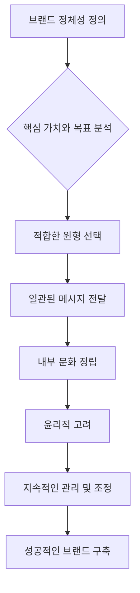

## 영웅과 무법자: 원형의 힘으로 특별한 브랜드를 만들다
이 책은 혼란스러운 현대 사회에서 브랜드가 어떻게 의미, 관심, 가치, 시장 점유율을 얻고 잃는지에 대한 새로운 시각을 제공한다. 고대부터 전해 내려오는 인간의 깊은 심리적 패턴인 '원형(Archetype)'을 활용하여 브랜드에 의미를 부여하고, 이를 통해 성공적인 마케팅 전략을 구축하는 방법을 체계적으로 설명한다. 

## 1. 이야기가 필요한 세상: 브랜드의 의미가 중요해진 이유 

1. **정보 과부하 시대의 혼란**:
  - 1987년 10월, 전 세계 금융 시장이 붕괴하는 혼란 속에서 사람들은 왜 이런 일이 일어나는지 이해하지 못했다. 
  - 이때, 지도자들은 새로운 이야기를 제시하지 못했고, 사람들은 1929년 대공황이라는 과거의 이야기를 다시 떠올리며 불안해했다. 
  - 오늘날에도 미디어는 13년 전보다 훨씬 많은 데이터, 뉴스, 엔터테인먼트, 광고로 넘쳐난다. 
  - 하지만 좋은 이야기가 없으면 메시지는 그저 흘러갈 뿐, 사람들에게 흡수되지 않는다. 
2. **인간은 이야기를 갈망한다**:
  - 우리는 본능적으로 이야기를 좋아하고 필요로 한다. 
  - 이야기는 거대하고 추상적인 힘에 인간적인 맥락을 제공하며, 최고의 스승 역할을 한다. 
  - 이 책은 바로 '올바른 이야기'를 찾는 방법에 대한 것이다. 
3. **브랜드는 단순한 제품이 아니다**:
  - 오늘날 브랜드는 단순한 기능적 특성을 넘어, 의미와 가치를 담는 저장소 역할을 한다. 
  - 코카콜라처럼 크고 오래가는 브랜드는 기업을 넘어 문화 전체의 상징이 된다. 
4. **의미가 중요해진 이유**:
  - 과거에는 수요가 공급을 초과하고 시장이 단순해서 제품의 물리적 차이만으로도 브랜드를 만들 수 있었다. 
  - 하지만 경쟁이 심화되면서 모든 기업은 제품이나 서비스의 차별점을 쉽게 모방당하게 되었다. 
  - 이러한 상황에서 기업은 두 가지 전략적 선택에 직면한다. 
  - 가격을 낮추거나 
  - 제품에 의미를 부여하거나 
  - 분명히 의미를 창조하고 관리하는 것이 더 바람직한 선택이었다. 
  - 1983년 폴 호켄은 제품의 '물리적 질량'보다 '의미'의 중요성이 커졌다고 지적했으며, 월스트리트도 강력한 브랜드 자체를 인수하는 현상을 발견했다. 
  - 수억 달러가 특정 브랜드를 구매하는 데 사용되었는데, 이는 혁신적인 기능이나 이점뿐만 아니라, 이러한 특성들이 강력한 의미로 전환되어 보편적이고 상징적인 가치를 지녔기 때문이다. 
  - 이러한 브랜드들은 마치 '원초적인 자산(primal assets)'처럼 신중하게 관리되어야 하지만, 이를 위한 체계적인 시스템이 없었다. 

## 2. 원형(Archetype)이란 무엇인가? 

1. **칼 융의 정의**:
  - 원형은 신화의 구성 요소이자 무의식적 기원의 개별 산물로서, 지구상 거의 모든 곳에서 발견되는 '집단적 성격의 형태나 이미지'이다. 
  - 융은 행동주의자들과 달리, 사람들이 무엇을 느끼고 무엇을 상상하는지에 초점을 맞춰 연구했다. 
  - 원형은 단순한 '기본적인 아이디어'를 넘어, '기본적인 감정', '기본적인 환상', '기본적인 비전'을 포함한다. 
  - 마치 우리가 모두 가지고 있는 마음속의 <mark>공통된 그림</mark>이나 <mark>이야기 틀</mark> 같은 거야. 
2. **원형의 보편성**:
  - 고대 로마의 키케로, 플리니, 아우구스티누스 같은 고전 학자들도 이 개념을 사용했다. 
  - 아돌프 바스티안은 이를 '기본적인 아이디어'라고 불렀고, 산스크리트어로는 '주관적으로 알려진 형태', 호주에서는 '꿈의 영원한 존재들'이라고 불렀다. 
  - 이러한 원형은 모든 사람에게 존재하며, 모든 사람이 12가지 원형을 모두 가지고 있다. 
  - 마치 <mark>별자리</mark>처럼 '당신의 원형은 무엇인가요?'라고 묻는 것이 아니라, 상황에 따라 특정 원형이 더 강하게 나타나는 식이다. 
3. **원형의 힘**:
  - 영화나 엔터테인먼트 산업의 슈퍼스타들은 자신의 인기가 단순히 작품의 질이나 성공에 달려있지 않다는 것을 안다. 
  - 그들은 독특하고 매력적인 정체성(의미)을 창조하고, 육성하며, 끊임없이 재해석한다. 
  - 마돈나는 라이프스타일과 헤어스타일을 바꾸지만, 항상 '파격적인 반항아'이다. 
  - 잭 니콜슨은 스크린 안팎에서 '나쁜 남자 무법자'이다. 
  - 멕 라이언과 톰 행크스는 모든 역할에 '순진한 눈빛의 순수함'을 불어넣는다. 
  - 이러한 정체성은 일관적이고 매력적이어서, 좋든 싫든 사람들의 시선을 사로잡는다. 
  - OJ 심슨 사건, 다이애나 스펜서의 이야기, 엘리안 곤잘레스 사건 등 대중의 관심을 사로잡는 뉴스 스토리나 흥행 영화들은 거의 항상 원형적 구조를 가지고 있다. 
  - 조지 루카스의 <스타워즈> 시리즈는 조셉 캠벨의 <천의 얼굴을 가진 영웅>에 나오는 '영웅의 여정'을 의식적으로 활용하여 원형적 캐릭터와 신화적 줄거리를 전달한다. 

## 3. 브랜드에 원형을 적용하는 방법 

1. **의미는 브랜드의 본질에서 시작된다**:
  - 의미는 제품에 억지로 덧붙일 수 있는 것이 아니다. 특히 품질이 떨어지는 제품에는 더욱 그렇다. 
  - 고객을 유치하고 유지하려면 의미는 브랜드의 '본질적인 가치', 즉 제품이 실제로 무엇이고 무엇을 하는지에 충실해야 한다. 
  - 따라서 원형 관리는 광고를 시작하기 훨씬 전, 즉 '실질적인 이점을 제공하는 제품이나 서비스 개발'에서부터 시작되어야 한다. 
2. **원형을 활용한 **브랜드 구축:
  - 수세기 동안 창의적인 사람들은 직감과 천재성으로 브랜드에 맞는 원형을 발견해왔다. 
  - 하지만 이제는 원형과 올바른 이야기를 찾는 과정이 '체계적이고 과학적'으로 이루어질 수 있다. 
  - 브랜드는 일시적인 광고 캠페인에서 의미를 빌려오는 것이 아니라, '의미의 일관되고 지속적인 표현'이 되어야 한다. 
  - 나이키, 코카콜라, 랄프 로렌, 말보로, 디즈니, 아이보리 같은 강력한 브랜드들이 그렇게 해왔다. 
  - 아이보리 비누는 단순한 청결을 넘어 '갱신, 순수함, 순진함'이라는 의미를 전달한다. 
  - 광고 캠페인의 세부 사항은 바뀌었지만, '정화'라는 깊은 상징적 메시지는 변함없이 유지되었다. 
  - 브랜드가 특정 원형을 구현하면, 고객 동기 부여와 제품 사이를 중재하며 '의미의 무형적 경험'을 제공한다. 
  - 이는 마케터에게 '나침반' 역할을 하여, 어디에 있고 어디로 가야 할지 알려주는 고정된 지점이 된다. 
3. 원형** 관리의 중요성**:
  - 리바이스는 한때 강력한 '탐험가' 브랜드였지만, '무법자', '영웅', '평범한 사람', '광대' 등 여러 원형 사이를 오가며 혼란스러운 정체성을 보여주었고, 그 결과 시장 점유율이 하락했다. 
  - 나이키는 위대한 '영웅' 브랜드였지만, 진부해지고 자신감을 잃어 광고 대행사와 브랜드 관리자를 바꾸는 실수를 저질렀다. 
  - 이러한 기업들은 유능한 마케팅 전문가들이 있었음에도 길을 잃었는데, 이는 '의미 관리 시스템'이 없었기 때문이다. 
  - 마케팅에서 의미 관리 시스템이 없다는 것은 재무 관리 시스템 없이 돈을 관리하려는 것과 같다. 
  - 브랜드의 의미는 가장 소중하고 대체 불가능한 자산이다. 
  - 사람들에게 '이것이 옳다'거나 '이것이 나를 위한 것이다'라고 느끼게 하는 것은 바로 의미이기 때문이다. 
  - 의미는 대중의 감정적, 직관적 측면에 호소하여 '정서적 친밀감'을 형성하고, 이를 통해 합리적인 주장이 받아들여지게 한다. 

## 4. 12가지 브랜드 원형: 네 가지 욕구 영역 

브랜드 원형은 인간의 네 가지 기본적인 욕구 영역에 따라 12가지로 나눌 수 있다. 

1. **안정성(Stability) 추구 **원형:
  - 사람들의 두려움: 재정적 파멸, 질병, 혼돈, 통제 불능. 
  - 브랜드가 제공하는 것: 사람들이 안전함을 느끼도록 돕는다. 
  - 원형:
  - 창조자**(**Creator**)**: 새로운 것을 만들고, 자기표현을 돕는다. (예: 마사 스튜어트, 피카소) 
  - 보호자**(**Caregiver**)**: 다른 사람을 돌보고, 연민과 도움을 제공한다. (예: 마더 테레사, 플로렌스 나이팅게일) 
  - 지배자**(**Ruler**)**: 질서를 유지하고, 통제력을 행사한다. (예: 마가렛 대처, 대기업 CEO) 
2. **독립성(Independence) 추구 원형**:
  - 사람들의 두려움: 갇히는 느낌, 억압당하는 느낌, 공허함. 
  - 브랜드가 제공하는 것: 사람들이 행복을 찾도록 돕는다. 
  - 원형:
  - 순수주의자**(**Innocent**)**: 자유, 단순함, 꿈을 실현하는 메시지를 전달한다. (예: 맥도날드, 케즈, 디즈니) 
  - 탐험가**(**Explorer**)**: 자유, 비순응, 더 나은 세상을 추구하는 이야기를 대표한다. (예: 이동 중 소비 가능한 제품) 
  - 현자**(**Sage**)**: 지혜를 추구하고, 자유로운 사고와 개인적 성장을 통해 진실을 찾는다. (예: 전문 지식, 정보, 데이터 제공 브랜드) 
  - 현자의 가장 큰 소망은 진실을 발견하는 것이고, 목표는 지능을 사용하여 세상을 이해하는 것이다. 
  - 가장 큰 두려움은 속임을 당하고 무지한 상태로 남는 것이다. 
  - 전략은 비판적 사고와 사고 과정을 이해하기 위한 충분한 정보를 찾는 것이다. 
  - 함정은 영원히 공부만 하고 행동하지 않을 수 있다는 것이다. 
  - 선물은 지혜와 지능이다. 
  - 현자의 그림자(어두운 면)는 독단주의, 폐쇄적인 사고, 현실과의 단절이다. 
3. **숙달(Mastery) 추구 원형**:
  - 사람들의 두려움: 비효율성, 무력감, 무능력. 
  - 브랜드가 제공하는 것: 사람들이 무언가를 성취하도록 돕는다. 
  - 원형:
  - 영웅**(**Hero**)**: 역경을 극복하고, 중요한 사회 문제에 혁신적인 해결책을 제시한다. 
  - 무법자**(**Outlaw**)**: 규칙을 깨고, 사회에 불만을 가진 고객을 유치한다. 
  - 마법사**(**Magician**)**: 규칙을 이해하고 목표 달성을 위해 활용하며, 변혁적이고 사용자 친화적인 제품에 적합하다. (예: 토니 로빈스처럼 삶의 변화를 제안하는 코치) 
4. **소속감(Belonging) 추구 원형**:
  - 사람들의 두려움: 추방, 고아, 버림받음, 무력감. 
  - 브랜드가 제공하는 것: 사람들에게 사랑과 공동체를 제공한다. 
  - 원형:
  - 평범한 사람**(**Regular Guy/Gal**)**: 평범한 사람들을 대표하며, 소속감을 느끼게 하는 친근한 매력을 지닌다. 
  - 연인**(**Lover**)**: 친밀함과 우아함을 대표하며, 아름다움과 우정을 촉진한다. 
  - 광대**(**Jester**)**: 즐거움을 대표하며, 혁신을 촉진하는 힘을 지닌다. 
  - 광대의 그림자(어두운 면)는 심술궂은 장난과 무책임함이 될 수 있다. 

## 5. 브랜드 원형 관리의 실제 

1. 원형** 선택과 커뮤니케이션**:
  - 브랜드가 강력한 원형을 나타내는 것이 중요한 이유는 단순히 제품을 넘어 '경험'을 팔기 때문이다. 
  - 선택한 원형에 따라 브랜드가 어떻게 보여야 하고, 어떻게 소통해야 하는지 결정된다. 
  - 예를 들어, '현자' 원형을 가진 브랜드는 고객에게 오만하게 굴거나 '내가 너보다 더 많이 안다'는 식으로 말해서는 안 된다. 
  - 현자를 추구하는 고객은 비판적 사고를 가지고 진실을 찾기 때문에, 오만한 소통 방식은 오히려 역효과를 낸다. 
2. **비영리 단체와 정치 후보자에게도 적용**:
  - 의미 관리는 영리 기업뿐만 아니라 비영리 단체나 정치 후보자에게도 중요하다. 
  - 기부자들은 특정 단체의 의미가 자신의 가치와 가장 잘 맞는지에 따라 기부를 결정한다. 
  - 정치 후보자들도 유권자들과 연결되기 위해 시대에 맞는 의미 있는 약속을 제시해야 한다. 
  - 존 F. 케네디는 '카멜롯'을 언급하며 이를 효과적으로 수행했다. 
3. **윤리적 고려사항**:
  - 마케터는 원형 이미지를 사용할 때 윤리적 측면을 신중하게 고려해야 한다. 
  - 상징의 힘은 유익할 수 있지만, 원형은 비도덕적일 수 있으므로 그 영향을 주의 깊게 평가해야 한다. 
  - 원형의 사용이 해를 끼치거나 공중 관계 재앙을 초래해서는 안 된다. 
  - 예를 들어, 만화 낙타를 사용하여 담배를 팔거나 달라이 라마를 사용하여 컴퓨터를 파는 것은 문제가 될 수 있다. 
  - 마케터는 재량권을 행사하고 원형 이미지 사용의 광범위한 의미를 고려해야 한다. 
4. **강력한 브랜드 문화 구축**:
  - 브랜드의 원형을 정의하는 것은 성공적인 브랜드 정체성을 개발하고 강력한 기업 문화를 구축하는 데 매우 중요하다. 
  - 회사 이름, 로고, 직원 행동, 사무실 건축 등에 대한 질문을 통해 기업의 문화적 뿌리를 파악하고 팀 간의 협업을 개선할 수 있다. 
  - 이러한 도구는 기업이 강점을 이해하고 문화 내에서 성공하는 방법을 파악하여 궁극적으로 브랜드의 성공적인 미래로 이어진다. 
  - 결론적으로, 이 책은 원형을 인식하고 활용하는 것이 강력한 브랜드 정체성을 확립하고 유지하는 데 얼마나 중요한지 보여준다. 
  - 적절한 원형과 회사를 연결하면 의미와 진정성을 깊게 할 뿐만 아니라, 타겟 고객과의 지속적인 관계를 강화할 수 있다. 

