## 르네 지라르의 '세상 시초부터 감춰진 것들' 요약
이 책은 인간의 욕망, 폭력, 그리고 문화의 기원에 대한 근본적인 질문을 던지는 책이야. 르네 지라르는 우리가 왜 남들이 원하는 것을 원하는지, 그리고 종교와 사회 제도가 어떻게 폭력에서 시작되었는지를 '모방 욕망'이라는 개념으로 설명하고 있어. 이 책을 읽으면 세상이 돌아가는 방식에 대한 너의 생각 자체가 완전히 바뀔 수도 있을 거야.

## 1. 모방 욕망: 우리는 왜 남의 것을 탐낼까? 

우리는 흔히 내가 뭔가를 원하면 그 물건 자체가 좋아서라고 생각하잖아? 그런데 르네 지라르는 그게 아니라고 말해. 우리는 남들이 원하는 것을 보고 따라 원하게 된다는 거야. 마치 친구가 새로 산 장난감을 보고 나도 갖고 싶어지는 것처럼 말이야. 이걸 '모방 욕망'이라고 부르는데, 이 욕망이 인간 행동의 아주 깊은 곳에 숨어있는 비밀이라고 해. 

1. 욕망의 본질:
  1. 우리는 물건 자체의 가치 때문에 욕망하는 게 아니야. 
  2. 다른 사람이 그 물건을 욕망하는 것을 보고 나도 욕망하게 되는 거지. 
  3. 예를 들어, 새 차를 갖고 싶어 하는 건 그 차가 정말 좋아서라기보다, 이웃이 그 차를 모는 걸 보고 '나도 저런 차를 가져야겠다'고 생각하는 것과 같아. 
2. **모방의 중요성**:
  1. 인간 행동의 거의 모든 것이 모방에서 시작돼. 
  2. 만약 사람들이 모방을 멈춘다면, 모든 문화 형태가 사라질 거라고 해. 
  3. 우리가 배우는 모든 것이 모방을 기반으로 하고 있다는 거야. 
3. **두 가지 욕망**:
  1. 형이상학적 욕망** (Metaphysical **Desire**)**:
  - 이건 '내가 어떤 사람이 되고 싶은가'에 대한 욕망이야. 
  - 어떤 물건이 나에 대해 무엇을 말해주는지, 즉 나의 정체성과 관련된 욕망이지. 
  - 예를 들어, 명문대에 가는 건 그 공부 자체가 좋아서라기보다, '명문대생'이라는 타이틀이 주는 사회적 인정과 정체성을 원하는 것과 비슷해. 
  2. 물리적 욕망** (Physical Desire)**:
  - 이건 물건 자체의 효용성, 즉 '그 물건이 나에게 무엇을 해줄 수 있는가'에 대한 욕망이야. 
  - 예를 들어, 배고플 때 밥을 먹고 싶어 하는 것처럼, 물건 자체의 기능이나 즐거움을 원하는 거지. 
  3. 지라르는 우리가 형이상학적 욕망에 의해 움직이는 경우가 훨씬 많다고 봐. 
4. **모방의 작동 방식**:
  1. 모방은 단순히 남을 따라 하는 게 아니야. 
  2. 우리는 남의 '가치'를 모방하는 거야. 
  3. 예를 들어, 친구가 팟캐스트를 해서 인기를 얻는 걸 보고, 나도 팟캐스트를 하지는 않더라도, 다른 방식으로 사람들의 관심을 얻으려고 노력하는 것과 같아. 
  4. 모방은 긍정적으로도, 부정적으로도 작동해. 
  - 긍정적 모방: 우리가 존경하는 사람의 행동이나 가치를 따라 하는 것. 
  - 부정적 모방: 사회에서 소외된 사람들과 관련된 것을 피하려는 것. 
5. **모델과 대상**:
  1. **대상 (Object)**: 우리가 욕망할 수 있는 거의 모든 것을 말해. 
  - 아이폰 같은 물건, 직업 타이틀, 심지어 역사 속의 어떤 위치까지도 대상이 될 수 있어. 
  2. **모델 (Model)**: 우리가 모방하는 사람을 말해. 
  - 유명인일 수도 있고, 존경하는 형제자매일 수도 있어. 
  - 심지어 신화 속 영웅이나 소설 속 인물도 우리의 모델이 될 수 있지. 
  - 우리는 자신과 비슷하다고 생각하고, 자주 접하며, 매우 존경하는 사람을 더 많이 모방하는 경향이 있어. 

## 2. 모방 위기: 욕망이 폭력으로 변하는 순간 

모방 욕망은 처음에는 별것 아닌 것처럼 보이지만, 이게 심해지면 큰 문제가 돼. 모두가 똑같은 것을 원하게 되면, 결국 서로 경쟁하고 싸우게 되잖아? 마치 두 마리 원숭이가 같은 바나나를 잡으려고 할 때 싸움이 나는 것처럼 말이야.  지라르는 이런 상황을 '모방 위기'라고 불러. 

1. **갈등의 시작**:
  1. 모두가 같은 것을 원하면 필연적으로 갈등이 생겨. 
  2. 특히 자원이 부족한 세상에서는 더욱 심해지지. 
  3. 예를 들어, 트로이 전쟁에서 파리스가 스파르타 왕의 아내 헬레네를 원했던 것처럼, 남이 가진 것을 탐내면서 큰 싸움이 시작될 수 있어. 
2. **폭력의 확산**:
  1. 폭력은 마치 전염병처럼 서서히 퍼져나가 더 많은 사람들을 끌어들여. 
  2. 모두가 자신이 정당방위라고 생각하며 복수를 정당화하기 때문에 폭력의 악순환이 끊이지 않아. 
  3. 제1차 세계대전이 프란츠 페르디난트 대공 암살로 시작되어 유럽 전체로 퍼진 것처럼 말이야. 
3. 모방** 위기의 심화**:
  1. 개인적인 차원에서는, 자신이 얼마나 형편없다고 느끼는지와 얼마나 높은 이상을 추구하는지 사이의 차이가 클수록 형이상학적 욕망이 더 강해져. 
  2. 사회적인 차원에서는, 사회적 거리나 물리적 거리가 줄어들수록 모방 욕망이 더 빠르게 퍼져. 
  - 과거에는 사람들이 자기 마을 밖을 잘 벗어나지 못해서 모방의 대상이 제한적이었지만, 지금은 SNS를 통해 전 세계 사람들의 삶을 보면서 욕망이 폭발적으로 늘어날 수 있어. 
  - 사회적 차이(성별, 계급, 신분 등)가 줄어들수록 '나도 저 사람처럼 될 수 있다'는 생각이 커지면서 모방 욕망이 더 심해져. 
  - 현대 사회의 '평등' 개념은 이런 사회적 차이를 허물어뜨려 모방 욕망의 확산을 가속화시키지. 
  - '너는 무엇이든 될 수 있다'는 메시지는 실패했을 때 더 큰 좌절감을 안겨주기도 해. 
4. **욕망과 **희소성:
  1. 우리는 풍부한 것보다는 희소한 것을 더 욕망하는 경향이 있어. 
  2. 예를 들어, 산소는 생명에 필수적이지만 너무 흔해서 아무도 싸우지 않아. 
  3. 하지만 금은 생명에 필요 없지만 희소하기 때문에 역사상 가장 많이 싸운 대상 중 하나가 되었지. 
  4. 권력이나 높은 직책처럼 희소한 대상은 더 큰 욕망과 갈등을 불러일으켜. 
  5. 지라르는 심지어 세상이 풍요로워져도, 우리의 욕망이 모방적이기 때문에 결국 우리는 제한된 대상을 놓고 싸우게 될 거라고 말해. 
  - 아이들에게 똑같은 장난감을 여러 개 줘도 결국 한 장난감을 놓고 싸우는 것처럼 말이야. 
  - 경쟁 자체가 희소성을 만들어내기도 해. 

## 3. 희생양 메커니즘: 폭력을 잠재우는 거짓말 

모방 위기가 극에 달해 사회가 완전히 무너질 위기에 처하면, 사람들은 무의식적으로 한 가지 방법을 찾아내. 바로 '희생양'을 찾는 거야.  모든 사람의 비난과 분노를 한 명 또는 소수의 희생양에게 돌리고, 그들을 추방하거나 죽임으로써 사회는 일시적인 평화를 되찾게 돼. 마치 끓어오르는 냄비의 압력을 한 번에 빼주는 것과 같지. 

1. **희생양의 선택**:
  1. 희생양은 종종 임의로 선택돼. 
  2. 다른 사람들과 다르거나, 외부인이거나, 단순히 운이 나쁜 사람이 희생양이 될 수 있어. 
  3. 실제로 죄가 없는 사람이라도 상관없어. 
  4. 모든 사회의 비난과 좌절감을 짊어질 누군가가 필요한 거지. 
2. **폭력의 해소와 평화**:
  1. 희생양을 추방하거나 죽이는 행위는 공동체에 '카타르시스(감정의 정화)'를 가져다줘. 
  2. 모두가 희생양을 비난하는 데 집중하면서, 서로에 대한 갈등과 경쟁을 잊고 하나로 뭉치게 돼. 
  3. 이 폭력적인 행위는 역설적으로 질서와 통일감을 회복시켜. 
  4. 나치 독일이 유대인을 희생양으로 삼아 사회의 모든 문제를 그들에게 돌렸던 것처럼 말이야. 
3. **거짓말 위에 세워진 평화**:
  1. 이 평화는 근본적으로 '거짓말' 위에 세워져 있어. 
  2. 모방 위기 상황에서는 모두가 어느 정도 잘못이 있는데, 한 사람에게 모든 책임을 전가하는 것은 진실이 아니기 때문이야. 
  3. 하지만 이 거짓말은 군중의 만장일치(모두가 믿는 것)에 의해 유지돼. 
4. **희생양의 **신성함:
  1. 희생양은 자신의 희생을 통해 역설적으로 '신성한 존재'가 돼. 
  2. 그들은 혼란의 원인이자 동시에 평화의 해결책으로 여겨지기 때문에, 위험과 구원의 상징이 되는 거지. 
  3. 이것이 신화, 의례, 심지어 종교의 기초가 된다고 지라르는 주장해. 
5. **제도와 **금기:
  1. 사회는 이런 희생양 메커니즘을 통해 폭력의 위험을 인식하고, 이를 막기 위한 규칙과 금기(prohibitions)를 만들어. 
  2. 예를 들어, 십계명 중 '네 이웃의 아내를 탐내지 말라', '도둑질하지 말라', '살인하지 말라' 같은 계명들은 모방 욕망과 그로 인한 폭력을 막기 위한 금기라고 볼 수 있어. 
  3. 의례(rituals)는 폭력을 통제된 방식으로 표출하는 수단이야. 
  - 사회는 의례를 통해 모방 위기를 상징적으로 재현하고, 쌓여있던 공격성을 희생양에게 돌려 폭발하기 전에 해소하는 거지. 
  - 이런 의례에는 종종 상징적인 희생이 포함돼. 

## 4. 그리스도의 계시: 희생양 메커니즘의 폭로 

지라르는 예수 그리스도의 이야기가 인류 역사에서 아주 중요한 전환점이라고 봐.  그리스도는 인류가 오랫동안 무의식적으로 사용해왔던 '희생양 메커니즘'의 진실을 폭로했기 때문이야.  마치 어둠 속에 감춰져 있던 비밀을 밝은 빛으로 드러낸 것과 같지. 

1. 희생양** 메커니즘의 폭로**:
  1. 그리스도 이전에는 아무도 희생양 메커니즘이 어떻게 작동하는지 알지 못했어. 
  2. 그리스도는 당시의 종교 지도자들이 무고한 사람들을 박해하는 것을 비판하며, 희생양 메커니즘을 폭로하려고 했어. 
  3. 그리스도가 살해당한 것은 역설적으로 그의 메시지를 더욱 강력하게 만들었어. 
  4. 그의 죽음 자체가 희생양 메커니즘의 완벽한 '덫'이 되어 그 실체를 만천하에 드러낸 거지. 
2. **피해자에 대한 인식 변화**:
  1. 그리스도의 계시 이후, 사회는 피해자를 대하는 방식이 완전히 바뀌었어. 
  2. 과거에는 피해자를 처벌하고 비난했지만, 이제는 피해자를 보호하고 옹호하는 사회가 된 거야. 
  3. 예를 들어, 고대 사회에서는 상상하기 어려웠던 개발도상국 지원 같은 행동들이 현대에는 당연하게 여겨지지. 
3. **양날의 검**:
  1. 희생양 메커니즘이 폭로된 것은 분명 좋은 일이지만, 동시에 위험한 결과를 낳기도 해. 
  2. 왜냐하면 희생양 메커니즘은 사회의 폭력을 억제하는 '훈련용 바퀴' 같은 역할을 했기 때문이야. 
  3. 이제 우리는 그 바퀴를 떼어냈고, 그 결과 폭력이 더 심해질 수도 있게 된 거지. 
4. **현대 사회의 희생양**:
  1. 20세기에는 소련의 공산주의자들이 부르주아 계급을, 나치 독일이 유대인을 희생양으로 삼아 대규모 박해를 저질렀어. 
  2. 현대인들은 과거처럼 한 사람에게 모든 문제를 뒤집어씌우는 것을 믿지 않아. 
  3. 하지만 여전히 '특정 계급'이나 '특정 인종' 전체를 비난하는 것은 가능하다고 믿지. 
  4. 이것은 과거보다 훨씬 더 많은 사람들을 희생양으로 삼을 수 있게 만들었어. 
  5. 오늘날에는 '피해자를 보호한다'는 명분 아래에서만 희생양을 만들 수 있어. 
  - 예를 들어, '남성 특권'이나 '백인 특권' 같은 것을 비난하는 것은 피해자를 보호한다는 명분으로 정당화될 수 있지. 
  - 전체주의 정권들이 '프롤레타리아(노동자 계급)를 보호한다'는 명분으로 대규모 학살을 저지른 것처럼 말이야. 
5. **종말론적 비관론**:
  1. 지라르는 이 메커니즘을 아는 것만으로는 폭력을 멈출 수 없다고 봐. 
  2. 인간의 이성은 매우 약하기 때문에, 근본적인 내면의 변화가 필요하다고 말해. 
  3. 모두가 일방적으로 폭력을 포기하고 무조건적인 사랑을 실천하는 '신의 왕국'은 논리적으로는 가능하지만, 통계적으로는 불가능하다고 생각해. 
  4. 그래서 지라르는 말년에 세상의 종말이 임박했다고 보며 극도로 비관적인 입장을 취했어. 

## 5. 현대 사회와 폭력: 종말론적 역설 

그리스도의 계시 이후, 사회는 많은 변화를 겪었지만, 폭력의 본질은 크게 달라지지 않았어.  오히려 희생양 메커니즘이 폭로되면서 폭력이 더 교묘하고 대규모로 나타나게 되었지.  지라르는 현대 사회가 '종말론적 역설'에 빠져있다고 경고해. 

1. **사회적 차이의 해체**:
  1. 현대 사회는 과거의 계급, 성별 역할 같은 사회적 차이들을 허물어뜨렸어. 
  2. 이런 차이들은 과거에는 폭력을 억제하는 '방어막' 역할을 했지만, 이제는 그 방어막이 사라진 거야. 
  3. 이것은 모방 폭력이 더 빠르게 확산될 수 있는 조건을 만들었어. 
  4. 하지만 동시에 진정한 사랑이 싹틀 수 있는 조건도 만들었지. 
2. **전쟁의 변화**:
  1. 과거에는 전쟁에도 나름의 규칙과 의례가 있었어. 
  2. 고대 그리스에서는 정해진 장소에서 결투하듯이 싸웠고, 17~18세기에는 '신사의 전쟁'이라고 불리며 겨울에는 휴전하기도 했어. 
  3. 심지어 적국의 최고 사령관을 암살하는 것을 비신사적이라고 여겨 피하기도 했지. (조지 워싱턴 사례) 
  4. 하지만 나폴레옹 시대부터 '총력전' 개념이 도입되면서 전쟁은 완전히 달라졌어. 
  - 모든 국민이 전쟁에 참여해야 하고, 더 잔인한 방법이 사용되었지. 
  - 전쟁이 더 '합리적'이 되었지만, 그만큼 더 치명적이고 파괴적으로 변한 거야. 
  5. 핵무기의 발명은 인류가 스스로를 완전히 파괴할 수 있는 능력을 갖게 만들었어. 
  - 이것은 과거에는 상상할 수 없었던 '게임 자체를 끝낼' 수 있는 위험을 가져왔지. 
3. **화폐와 **폭력:
  1. 지라르는 자본주의의 기원을 '선물 주기'에서 찾아. 
  2. 초기 사회에서는 물물교환보다 선물 교환이 더 흔했는데, 이는 물질적 도움보다는 '자존심'과 관련이 깊었어. 
  3. 선물 교환은 누가 이득을 보고 손해를 보는지 불분명해서, 너무 빠르게 이루어지면 폭력을 유발할 수 있었지. 
  4. 화폐는 이런 문제를 해결해 줬어. 
  - 화폐는 물건의 가치를 명확히 하고, 관계를 끊어줌으로써 더 빠르고 광범위한 교환을 가능하게 했어. 
  - 이것이 자본주의와 생산성 증가의 기반이 되었지. 
  5. 나폴레옹이 '피아트 화폐(정부의 명령으로 가치가 부여된 화폐)'를 대규모로 발행하여 전쟁 자금을 조달한 것은, 전쟁을 더욱 총력전으로 만드는 데 기여했어. 
  - 이것은 국민 전체에게 보이지 않는 세금을 부과하고, 전쟁에 대한 참여를 강제하는 것과 같았지. 
4. **비트코인과 **모방 욕망:
  1. 비트코인은 희소성 때문에 사람들의 모방 욕망을 강하게 자극해. 
  2. 금처럼 희소한 자산은 사람들이 서로 탐내고 싸우게 만들지만, 비트코인은 물리적 희소성 외에 '디지털 희소성'이라는 새로운 차원을 제공해. 
  3. 정부가 통제할 수 없고, 위조할 수 없으며, 공급량이 고정되어 있다는 특성 때문에 비트코인은 가장 강력한 모방 욕망을 불러일으키는 자산이 될 수 있어. 
  4. 사람들이 비트코인을 욕망하고, 그 욕망이 서로를 강화하면서 비트코인은 전 세계적인 돈이 될 가능성이 있어. 
  5. 이것은 마치 그리스도가 희생양 메커니즘의 진실을 드러낸 것처럼, 비트코인이 '돈의 진실(희소성)'을 드러내는 것과 비슷하다고 볼 수 있어. 
  6. 비트코인은 '숨겨진 것이 없는' 투명한 시스템으로, 승자에 의해 역사가 다시 쓰여지지 않는 완벽한 경제 역사를 제공해. 
  7. 이것은 중앙화된 화폐 시스템이 야기하는 '피아트 모방 위기(모두가 돈을 통제하려고 싸우는 위기)'를 해결할 수 있는 잠재력을 가지고 있어. 

```mermaid
graph TD
    A["모방 욕망"] --> B{"모방 위기 발생"};
    B --> C["사회적 갈등 및 폭력 심화"];
    C --> D{"희생양 메커니즘 발동"};
    D --> E["희생양 선택 및 추방/살해"];
    E --> F["사회적 카타르시스 및 일시적 평화"];
    F --> G["신화, 의례, 제도 형성"];
    G --> H["사회적 차이 및 금기 생성"];
    H --> I["폭력 억제 및 사회 질서 유지"];
    I --> J["그리스도의 계시"];
    J --> K["희생양 메커니즘 폭로"];
    K --> L["피해자 보호 의식 강화"];
    L --> M["사회적 차이 해체 가속화"];
    M --> N["모방 폭력 확산 및 종말론적 위기"];
    N --> O["핵무기, 총력전 등 파괴력 증대"];
    O --> P["비트코인 등장"];
    P --> Q["희소성 기반 모방 욕망 재편"];
    Q --> R["새로운 화폐 질서 가능성"];

    style A fill:#FFDDC1,stroke:#FF9966,stroke-width:2px;
    style B fill:#FFECB3,stroke:#FFCC80,stroke-width:2px;
    style C fill:#FFCCBC,stroke:#FF8A65,stroke-width:2px;
    style D fill:#FFF9C4,stroke:#FFEB3B,stroke-width:2px;
    style E fill:#E1BEE7,stroke:#BA68C8,stroke-width:2px;
    style F fill:#C8E6C9,stroke:#81C784,stroke-width:2px;
    style G fill:#BBDEFB,stroke:#64B5F6,stroke-width:2px;
    style H fill:#D1C4E9,stroke:#9575CD,stroke-width:2px;
    style I fill:#F8BBD0,stroke:#F06292,stroke-width:2px;
    style J fill:#B2EBF2,stroke:#4DD0E1,stroke-width:2px;
    style K fill:#DCEDC8,stroke:#A5D6A7,stroke-width:2px;
    style L fill:#FFCDD2,stroke:#EF9A9A,stroke-width:2px;
    style M fill:#F0F4C3,stroke:#DCE775,stroke-width:2px;
    style N fill:#FFAB91,stroke:#FF7043,stroke-width:2px;
    style O fill:#CFD8DC,stroke:#90A4AE,stroke-width:2px;
    style P fill:#FFE0B2,stroke:#FFB74D,stroke-width:2px;
    style Q fill:#C5CAE9,stroke:#7986CB,stroke-width:2px;
    style R fill:#A7FFEB,stroke:#64FFDA,stroke-width:2px;
```

