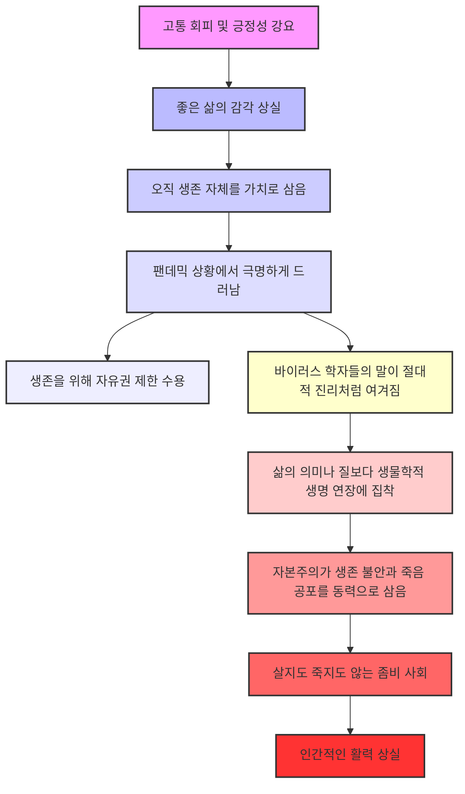
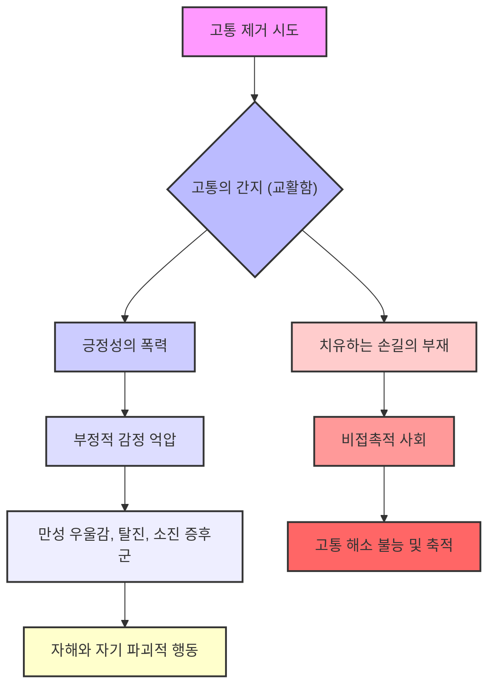

## 한병철의 『고통 없는 사회』: 고통을 피하려는 사회가 잃어버리는 것들
이 책은 현대 사회가 고통을 무조건 나쁜 것으로 여기고 없애려 하는 경향을 비판하며, 이런 태도가 결국 우리 삶과 사회를 어떻게 망가뜨리는지 깊이 파고드는 책이야. 고통을 피하려는 사회는 결국 진실과 멀어지고, 인간다움을 잃어버리며, 심지어 전체주의로 흘러갈 위험까지 있다고 경고하는 거지.

## 1. 고통 공포: 아프기 싫어하는 현대 사회 

1. **고통 공포증 (알고비아)의 확산**:
  - 현대 사회는 고통에 대한 극심한 두려움, 즉 '고통 공포증(알고비아)'에 시달리고 있어 .
  - 이건 단순히 개인적인 감정이 아니라, 사회 전체, 심지어 정치적인 차원까지 퍼져 있는 현상이야 .
  - 마치 아픈 걸 너무 싫어해서 작은 상처에도 호들갑 떠는 것처럼, 고통에 대한 내성이 엄청 약해진 상태라고 보면 돼 .

2. **정치의 진통 지대**:
  - 정치도 고통을 피하려는 경향을 보여. 이걸 '정치의 진통 지대'라고 부르는데 .
  - 마치 아픈 곳에 임시방편으로 진통제만 놓는 것처럼, 근본적인 문제나 갈등을 해결하려 하지 않고 당장의 안정만 추구하는 거야 .
  - 어려운 논쟁 대신 모호한 중도나 대안 없는 현상 유지에만 급급해 .
  - 이런 정치는 샹탈 모패가 말한 '경합적 정치(아고니스틱 폴리틱)'와는 정반대인데, 경합적 정치는 갈등을 건강하게 보고 대결을 통해 변화를 만들어내려 하거든 .
  - 고통스러운 대결을 피하는 정치는 결국 아무런 변화도 만들지 못하고, 마치 마취된 상태처럼 머물러 있게 돼 .

## 2. 행복 강요: 긍정성 뒤에 숨겨진 폭력 

1. **긍정성 사회의 압력**:
  - 현대 사회는 고통을 피하는 것을 넘어, 아예 '부정성' 자체를 사회에서 없애버리려고 해 .
  - 이걸 '긍정성 사회의 압력'이라고 부르는데, 마치 항상 웃고 행복해야 한다고 강요하는 분위기 같은 거야 .

2. **긍정 심리학에 대한 비판**:
  - 심지어 '긍정 심리학'조차 비판의 대상이 돼 .
  - 긍정 심리학에서 말하는 '트라우마 후 성장' 같은 개념들은 결국 고통마저도 성과나 효율성의 논리에 끼워 맞추려는 시도라는 거지 .
  - "고통을 겪었으면 그걸 딛고 더 성장해야 해!" 같은 강박이 생겨서, 고통을 겪는 것 자체를 실패나 약함으로 여기게 만들어 .

3. **진통 사회와 성과 사회의 **연결:
  - 이런 분위기 속에서 고통은 성과와 함께 갈 수 없는 것이 되고, 어떻게든 없애거나 긍정적인 것으로 바꿔야 할 대상이 돼 .
  - 책에서는 "영구적인 행복감은 영구적인 마취 상태와 다르지 않다"고까지 말해 .

4. 오피오이드** 사태와 '좋아요' 문화**:
  - 미국의 오피오이드(마약성 진통제) 사태는 단순히 약물 남용 문제가 아니라, 고통 없는 삶을 헌법이 보장하는 권리처럼 여기는 '진통 사회'의 결과라고 분석해 .
  - 마치 소셜 미디어의 '좋아요' 문화처럼, 불편함 없는 매끄러운 모습만 보여주려 하고, 갈등이나 상처를 유발할 수 있는 '모서리'를 제거하려는 것과 비슷해 .
  - 예술조차도 저항이나 불편함 대신 '좋아요'를 받기 위한 상품으로 변질된다고 지적해 .

## 3. 생존: 좋은 삶을 잃어버린 좀비 사회 

1. **좋은 삶의 상실과 **생존** 지상주의**:
  - 현대 사회는 '좋은 삶'이 뭔지 잊어버리고, 오직 '살아남는 것(생존)' 자체를 가장 중요한 가치로 삼게 되었어 .
  - 마치 게임에서 목숨 하나 더 얻는 게 최고 목표인 것처럼, 삶의 질보다 생물학적인 생명 연장에만 매달리는 거지 .

2. **팬데믹이 드러낸 생존 사회의 모습**:
  - 코로나19 팬데믹 상황은 이런 경향을 아주 분명하게 보여줬어 .
  - 생존을 위해서라면 기본적인 자유권 제한 같은 것도 너무 쉽게 받아들여졌고 .
  - 바이러스 학자들의 말이 마치 새로운 종교의 교리처럼 절대적인 진리로 여겨지기도 했어 .
  - 건강을 위해서라면 삶의 다른 즐거움이나 가치들은 얼마든지 희생될 수 있다는 분위기였던 거야 .

3. **자본주의와 **생존** 불안**:
  - 자본주의는 바로 이런 '생존에 대한 불안'과 '죽음에 대한 공포'를 이용해서 끊임없이 돈을 벌게 만들어 .
  - 죽지 않고 더 오래 살기 위해 우리는 계속 일하고 소비해야 하는 셈이지 .

4. **좀비들의 사회**:
  - 생존만을 걱정하는 사회는 인간적인 활력을 잃어버려 .
  - 책에서는 이런 사회를 "살지도 죽지도 않는 자들의 사회, 좀비들의 사회와 같다"고 아주 섬뜩하게 비유해 .
  - 좋은 삶에 대한 감각 없이 그저 생물학적인 생존에만 집착하는 상태는 진정으로 살아있다고 말하기 어렵다는 강력한 비판이야 .

## 4. 고통의 의미 상실: 불필요한 것으로 전락한 고통 

1. **고통의 종교적 **서사** 상실**:
  - 과거에는 기독교 같은 종교가 고통에 의미를 부여했어. 고통을 통해 정화되거나 어떤 목적과 연결된다고 봤지 .
  - 하지만 현대 사회에서는 이런 큰 이야기들이 힘을 잃으면서, 고통은 그저 불필요하고 제거해야 할 대상으로 전락해 버렸어 .
  - 마치 고장 난 기계를 고치듯, 의학적으로 처리해야 할 문제 정도로만 취급되는 거야 .

2. **고통에 대한 과민 반응**:
  - 고통이 의미를 잃으니 사람들은 고통 자체에 굉장히 민감해지고, 어떻게든 피하려고만 해 .
  - 책에서는 "현대인은 고통에 점점 더 과민해진다"고 표현하는데 .
  - 심지어 사랑에서 오는 고통조차 피하려 들고, 안정적이고 예측 가능한 관계만을 선호하게 돼 .

3. **이야기의 상실과 치유력 약화**:
  - 발터 베냐민은 경험을 공유하고 전달하는 '이야기'가 줄어들면서 치유의 힘도 약해진다고 봤어 .
  - 현대 사회는 정보만 넘쳐날 뿐, 고통의 경험을 나누고 의미를 찾는 깊이 있는 이야기가 사라지고 있다는 거야 .

4. **언어를 잃은 고통**:
  - 폴 라이의 시를 인용하며, 극심한 고통 앞에서 언어를 잃고 그저 자신의 비명 소리만을 객관적으로 관찰하려는 듯한 모습이 현대인의 고통 경험을 보여준다고 해 .
  - 고통이 너무 압도적이어서 말로 표현하거나 소통하기보다는, 그냥 하나의 현상처럼 느끼게 된다는 거지 .

## 5. 고통의 간지: 교묘하게 스며드는 고통 

1. **고통의 교묘한 변신 (간지)**:
  - 에른스트 융어의 개념인 '고통의 간지'는 우리가 고통을 없애려고 할수록 완전히 사라지는 게 아니라, 오히려 더 교묘한 방식으로 우리 삶에 스며든다는 뜻이야 .
  - 마치 잡초를 뽑아도 뿌리가 남아 다른 곳에서 다시 자라나는 것처럼, 겉으로는 고통을 없앤 것 같지만 실제로는 다른 모습으로 존재한다는 거지 .

2. **긍정성의 폭력과 억압된 고통**:
  - 모든 것을 긍정적으로만 보려는 '긍정성의 폭력' 속에서 부정적인 감정이나 고통은 억압돼 .
  - 하지만 그게 완전히 해소되는 게 아니라, 만성적인 우울감이나 탈진, 소진 증후군 같은 형태로 나타날 수 있어 .
  - 겉으로는 다 괜찮아 보이는데 속으로는 병들어가는, 혹은 자해 같은 자기 파괴적인 방식으로 억눌린 고통이 표출되기도 해 .
  - 책에서는 "진통 사회의 시민은 자해하는 주체"라는 표현까지 써 .

3. **치유하는 손길의 부재**:
  - 타인과의 접촉, 따뜻한 손길이 주는 위안이 사라지고 있다는 지적도 있어 .
  - 모든 것이 매끄럽고 비접촉적으로 변해가는 사회에서는 '어루만지는 손길' 같은 직접적인 위로나 치유의 경험이 줄어들어 .
  - 이것 역시 고통이 해소되지 못하고 쌓여가는 한 가지 원인이 될 수 있다는 거야 .

## 6. 진실로서의 고통: 현실과 진실을 마주하게 하는 힘 

1. **고통은 진실을 드러낸다**:
  - 빅토르 폰 바이츠제커라는 사상가는 고통이야말로 진실을 드러낸다고 봤어 .
  - 마치 이별의 고통이 그 관계가 얼마나 진실했는지를 역설적으로 보여주는 것처럼, 고통이 없다면 관계의 깊이나 진실성도 알 수 없었을 거야 .

2. **현실과의 접촉**:
  - 고통은 현실과의 접촉을 의미하기도 해 .
  - 고통을 느낄 때 우리는 현실에 발 딛고 있음을 실감하게 되고, 내가 아닌 다른 존재가 있음을 느끼게 해주는 것도 고통이야 .

3. **진통 사회의 위험**:
  - 그렇다면 고통을 자꾸 없애려고만 하는 '진통 사회'는 어떤 문제가 생길까? 
  - 진실과 현실로부터 멀어질 위험이 있다는 거야 .
  - 모든 것이 매끄럽고 긍정적인 '좋아요' 문화 속에서는 불편한 진실이나 현실의 거친 면들이 가려지기 쉽지 .
  - 책에서는 이를 "같은 것의 지옥에 빠지는 것"에 비유하는데, 모든 것이 비슷해지고 차이나 깊이가 사라지는 상태를 말해 .

4. **고통을 통한 자기 인식**:
  - 고통을 느낄 수 있을 때 자기 자신을 더 깊이 인식하고 진실과 마주할 수 있어 .
  - 고통이 없다면 우리는 눈이 멀고 진실을 구분할 수도, 인식할 능력도 잃는다고까지 말해 .
  - 고통을 통해 우리는 현실을 더 명확히 보고 자신을 더 깊이 이해하며, 때로는 타인과 더 진실하게 연결될 수 있다는 통찰을 주는 장이야 .

## 7. 고통의 미학: 고통을 통해 창조되는 깊이 

1. **예술가들의 고통**:
  - 카프카에게 글쓰기는 고통이라는 대가를 치러야만 얻을 수 있는 '달콤하고 경이로운 보상' 같은 거였어 .
  - 마치 악마에게 시달리는 것처럼 산산조각 나는 고통 속에서만 글쓰기가 가능하다고 봤고, 글쓰기가 없다면 삶은 정신 이상으로 끝날 수밖에 없다고 생각했지 .
  - 프로스트도 고통에 애착을 느낀다고 말할 정도로, 고통을 글쓰기의 핵심 동력으로 삼았어 .
  - 슈베르트 역시 매독이라는 끔찍한 질병과 치료의 고통 속에서도 '겨울 여행' 같은 불멸의 작품을 남겼는데, 이런 사람들을 '고통의 인간(호모 돌로리스)'이라고 부를 수 있어 .
  - '호모 돌로리스'는 단순히 고통받는 존재를 넘어, 고통을 통해 오히려 깊이를 얻는 인간을 의미해 .

2. **고통의 치유적 반세계**:
  - 이런 예술가들의 경험을 보면, 고통에 압도당하지 않고 삶을 계속 살아가기 위해 정신은 현실의 고통을 상쇄하고 견뎌내게 하는 '치유하는 반세계'를 창조해내는 것 같아 .
  - 고통이 오히려 삶의 강력한 흥분제 역할을 하는 상태를 '광란(오르기아스모스)'이라고 불렀다고 해 .

3. **현대 사회의 고통 회피**:
  - 하지만 현대 사회는 고통을 적극적으로 피하려는 '마취 상태'에 빠져 있는 것 같아 .
  - 이런 분위기 속에서는 고통이 가진 깊은 의미나 미학적인 차원 같은 것들이 점점 설 자리를 잃어가고 있지 .
  - 고통은 더 이상 깊은 성찰의 계기가 아니라, 그저 빨리 제거해야 할 의학적, 기술적 문제로 '탈 언어화'되고 있어 .
  - 의미 있는 대화는 사라지고 피상적인 소통의 소음만 가득하며, 모든 것이 비슷비슷해지는 '같은 것의 지옥'이 반복되는 상황이야 .
  - 어쩌면 이런 '같은 것의 반복'을 깨고 새로운 것을 만들어낼 힘은 바로 이렇게 외면받는 고통에 있을지도 모른다는 생각이 들어 .

## 8. 고통의 변증법: 사유와 성장의 동력 

```mermaid
graph TD
    A["헤겔 철학: 정신의 성장"] --> B["고통(부정성)을 통한 성장"];
    B --> C["모순 대면 및 극복"];
    C --> D["더 높은 인식과 의식 단계"];
    D --> E["고통의 부정성이 사유에 필수적"];

    E --> F["인간 사유와 기계 계산의 구분"];
    F --> G["AI는 고통을 통한 경험 능력 없음"];
    G --> H["AI는 깊은 의미의 사유에 도달 불가"];

    I["니체: 커다란 고통의 역할"] --> J["영혼 단련 및 깊은 심연으로 파고듦"];
    J --> K["정신의 마지막 해방자"];
    K --> L["피상적 안락함에서 벗어나 깊은 자기 이해"];

    M["고통 없는 사회의 결과"] --> N["변증법적 변환 동력 상실"];
    N --> O["새로움 없는 같은 것의 지옥에 갇힘"];
    O --> P["니체: 피상적 건강을 넘어선 더 높은 건강"];
    P --> Q["모든 가치의 재평가 가능성"];

    Q --> R["고통의 부정성 없이는 근본적 단절 불가능"];
    R --> S["혁명적 인식 전환 및 미지의 것을 향한 출발 불가능"];
    S --> T["진정한 역사 쓰기 어려움"];
    T --> U["고통의 부정성이 정신을 깨어있게 하는 유일한 힘"];

    style A fill:#f9f,stroke:#333,stroke-width:2px;
    style B fill:#bbf,stroke:#333,stroke-width:2px;
    style C fill:#ccf,stroke:#333,stroke-width:2px;
    style D fill:#ddf,stroke:#333,stroke-width:2px;
    style E fill:#eef,stroke:#333,stroke-width:2px;
    style F fill:#ffc,stroke:#333,stroke-width:2px;
    style G fill:#fcc,stroke:#333,stroke-width:2px;
    style H fill:#f99,stroke:#333,stroke-width:2px;
    style I fill:#f66,stroke:#333,stroke-width:2px;
    style J fill:#f33,stroke:#333,stroke-width:2px;
    style K fill:#f00,stroke:#333,stroke-width:2px;
    style L fill:#c00,stroke:#333,stroke-width:2px;
    style M fill:#900,stroke:#333,stroke-width:2px;
    style N fill:#600,stroke:#333,stroke-width:2px;
    style O fill:#300,stroke:#333,stroke-width:2px;
    style P fill:#000,stroke:#333,stroke-width:2px;
    style Q fill:#333,stroke:#333,stroke-width:2px;
    style R fill:#666,stroke:#333,stroke-width:2px;
    style S fill:#999,stroke:#333,stroke-width:2px;
    style T fill:#ccc,stroke:#333,stroke-width:2px;
    style U fill:#eee,stroke:#333,stroke-width:2px;
```

1. **헤겔 철학의 고통과 사유**:
  - 헤겔 철학의 핵심은 정신이 '고통', 즉 '부정성'을 통해서만 성장한다는 거야 .
  - 마치 근육이 아픔을 겪어야 더 강해지는 것처럼, 정신도 자신과의 모순이라는 고통스러운 대면을 겪고 이걸 극복하는 '변증법적 과정'을 거치면서 더 높은 인식과 의식 단계로 나아간다는 거지 .
  - 결국 고통의 부정성(아픔)이야말로 생각하는 데 필수적이라는 거야 .

2. **인간 사유와 인공지능의 차이**:
  - 이 지점이 바로 인간의 사유와 기계의 계산, 특히 인공지능을 근본적으로 구분 짓는 기준이 될 수 있어 .
  - 인공지능은 방대한 데이터를 학습하고 엄청난 속도로 계산할 수 있지만, 헤겔이 말한 의미에서의 '경험', 즉 고통을 통한 자기 부정과 극복의 과정은 없다는 거야 .
  - 그렇기 때문에 아무리 뛰어나도 깊은 의미의 사유에는 도달할 수 없다는 거지 .

3. **니체의 고통과 해방**:
  - 니체 역시 비슷한 통찰을 보여주는데, 그는 "커다란 고통만이, 특히 길고 느린 고통만이 우리 영혼을 단련시키고 우리를 가장 깊은 심연으로 파고들게 만드는 정신의 마지막 해방자"라고 말했어 .
  - 여기서 '해방자'라는 건 고통이 우리를 피상적인 안락함에서 벗어나 더 깊은 자기 이해로 이끈다는 의미로 해석할 수 있어 .

4. **고통 없는 사회의 위험**:
  - 건강을 최고 가치로 여기며 모든 종류의 고통을 없애려는 '진통 사회'는 어떤 결과를 맞이할까? 
  - 이런 사회는 고통을 통한 '변증법적 변환', 즉 진정한 성장의 동력을 잃어버리고, 결국 아무런 새로움 없이 기존 상태만 반복되는 '같은 것의 지옥'에 갇힐 위험이 있어 .
  - 니체는 오히려 고통을 감내함으로써 얻는 피상적인 건강을 넘어서는 '더 높은 건강'과 기존 가치 체계를 뒤엎는 '모든 가치의 재평가' 가능성을 강조했어 .
  - 결국 고통의 부정성이 없다면, 세상을 새롭게 보게 하는 혁명적인 인식의 전환이나 미지의 것을 향한 진정한 출발은 불가능해진다는 거야 .
  - 진정한 의미의 역사 역시 고통이라는 대가 없이는 쓰이기 어렵고 .
  - 고통이 주는 부정성(아픔)이야말로 정신을 잠들지 않게 계속 깨어 있게 하고, 끝없이 반복되는 '같은 것의 굴레'를 끊어낼 수 있는 유일한 힘일지도 몰라 .

## 9. 존재로서의 고통: 유한성과 타자의 균열 

1. **하이데거의 고통**:
  - 하이데거는 고통을 피하고 싶은 부정적인 것으로만 보지 않아 .
  - 그는 고통의 본질 자체, 그 비밀을 '존재 그 자체'에서 찾으려 했고, 그래서 "존재는 고통이다"라는 유명한 명제가 나와 .
  - 이건 단순히 살면서 힘든 실존적 고통만을 말하는 게 아니라, '존재 자체'와 우리가 경험하는 '개별 존재자들' 사이의 근본적인 차이를 드러내 주는 통로 같은 거야 .

2. **기분과 **마음대로 할 수 없는 것:
  - 하이데거 철학을 이해하려면 '기분'이라는 개념을 먼저 봐야 해 .
  - 기분은 우리가 세상을 이성적으로 판단하기 전에 이미 우리를 사로잡는 어떤 분위기 같은 건데 .
  - 중요한 건 이 기분이 우리가 만들거나 통제할 수 없는 것, 즉 '마음대로 할 수 없는 것(다스 운페후기발레)'에서 온다는 거야 .
  - 마치 날씨를 우리가 마음대로 바꿀 수 없는 것처럼, 이런 근원적인 기분도 우리 마음대로 되는 게 아니야 .
  - 이것이 바로 '존재'가 그 완전한 타자로서 우리에게 말을 거는 '소리 없는 목소리' 같은 거지 .

3. **언어와 **정적:
  - 언어도 우리가 마음대로 만들어 쓰는 도구가 아니야. 하이데거는 언어를 '선물처럼 주어지는 것'으로 봤어 .
  - 그는 "말이 부서지는 곳에서 이스트(존재)가 나타난다"고 말했는데 .
  - 우리가 언어로 모든 걸 표현하려 애쓰지만, 결국 말이 딱 막히는 지점, 표현 불가능한 지점, 그 '침묵' 속에서야 비로소 존재의 깊이, 즉 '마음대로 할 수 없는 것'의 차원을 어렴풋이나마 느낄 수 있다는 거야 .

4. **고통은 균열이다**:
  - 그렇다면 고통은 바로 그 통제 불가능한 '정적', 그 '외부'가 우리 생각 속으로 파고드는 '균열' 같은 거라고 볼 수 있어 .
  - 하이데거는 문학만이 이 '노래할 수 없는 잔여', 즉 언어로 다 표현되지 못하는 그 정적의 소리를 들을 수 있다고 봤어 .

5. **유한성과 사랑**:
  - 결국 고통은 우리 존재가 유한하다는 걸 깨닫게 하는 근본적인 기분이 되는 거야 .
  - 사랑(에로스)도 '마음대로 할 수 없음'과 깊이 관련되어 있어 .
  - 타인을 온전히 내 마음대로 할 수 없다는 사실에서 오는 고통 때문에 오히려 사랑이 가능하다고 하이데거는 봤어 .
  - 상대방을 완전히 조종할 수 있다면 그건 사랑이 아니라 소유욕이겠지 .
  - 그래서 진정한 공존과 관계는 필연적으로 어느 정도의 고통을 수반할 수밖에 없다는 거야 .
  - 고통은 마치 우리 존재의 중력처럼 작용해서, 기쁨과 슬픔이 서로 균형을 이루도록 조율하는 역할을 해 .
  - "기쁨과 슬픔을 조율하는 유희 자체가 고통이다"라는 표현도 써 .

6. **은폐된 대지와 **디지털 질서:
  - 하이데거 사상에서 중요한 '은폐'와 '대지(에르데)' 개념도 '마음대로 할 수 없음'과 중요하게 연결돼 .
  - 대지는 본질적으로 자신을 완전히 드러내지 않고, 기술로 모든 걸 파헤치고 분석하려는 시도에 저항하는 속성을 가져 .
  - 그래서 대지를 제대로 보존하고 마주하려면 '적절한 거리두기'가 필요하다는 거야 .
  - 하지만 오늘날 '디지털 질서'는 정반대 방향으로 가고 있어. 모든 걸 투명하게 드러내고 데이터화하고 관리하려고 하지 .
  - 이 디지털 질서는 땅의 질서를 대체하려 하고, 죽음, 고통, 슬픔, 그리움 같은 '마음대로 할 수 없는 것들'은 전부 시스템의 방해 요소, 제거해야 할 대상으로 취급해 .
  - 모든 것이 즉각적으로 이용 가능하고 소비 가능한 정보나 데이터가 되어버리는 거야 .
  - '마음대로 할 수 있어야 한다'는 강제가 모든 것을 소비재로 만들면서, 사물이 본래 가지고 있던 고유한 분위기(아우라)나 시간 속에서 쌓인 이야기가 사라져 버려 .
  - 투명성이 오히려 모든 것을 납작하게 만들고 깊이를 없애는 셈이지 .

7. **인내와 기다림, 그리고 **포기:
  - 모든 것을 빠르고 효율적으로 처리해야 한다는 압박 속에서 '길고 느린 것'의 가치가 소멸되고 있어 .
  - 하이데거가 강조하는 건 '인내'와 '기다림'인데, 이건 단순히 수동적으로 시간을 보내는 게 아니라, 어떤 것 안에서 머무르며 기다리는 능동적인 태도를 말해 .
  - '포기(포기 슈트)'라는 개념도 단순히 뭔가를 갖지 못하는 결핍 상태가 아니야 .
  - 오히려 '마음대로 할 수 없는 것'을 받아들이는 적극적인 태도를 통해 존재의 깊이를, 존재가 우리에게 오는 것을 '잉태'할 수 있다는 거야 .
  - 그러니까 고통이 주는 일종의 선물일 수도 있다는 거지 .
  - 결국 마음대로 할 수 없는 것을 어떻게든 통제하고 제거하려는 현대 사회의 흐름 속에서, 어쩌면 우리가 존재의 더 깊은 차원, 고통이 열어주는 다른 가시성을 놓치고 있는 건 아닌지 성찰하게 돼 .

## 10. 타자의 소멸: 공감 능력을 잃어버린 사회 

```mermaid
graph TD
    A["현대 매체: 시각 길들이기"] --> B["폭력 중화 및 소비화"];
    B --> C["타인의 고통이 깊은 울림을 주지 못함"];
    C --> D["살인마저 고통 없는 사건처럼 소비"];
    D --> E["공감 능력 상실"];
    E --> F["지각과 행동의 분리"];

    F --> G["진통 사회: 고통으로서의 타자 제거"];
    G --> H["타자를 예측 가능하고 고통 주지 않는 대상으로 사물화"];

    H --> I["팬데믹: 타인을 바이러스 감염자로 여김"];
    I --> J["물리적/정신적 거리두기 심화"];
    J --> K["타자를 위험 요소로만 봄"];

    K --> L["디지털 매체: 타자를 스크린 속 이미지로 만듦"];
    L --> M["타자를 통제 가능한 대상으로 인식"];
    M --> N["타자의 다름, 예측 불가능함 지각 능력 상실"];
    N --> O["나르시시즘적 자아: 타자에게서 자기 모습만 보려 함"];

    O --> P["감수성: 고통에 자신을 노출하는 것"];
    P --> Q["상처받을 가능성 감수"];
    Q --> R["시원적 고통 가능성 없으면 타자를 사물처럼 대함"];
    R --> S["성과 주체: 할 수 없음의 고통, 상처 입는 것 거부"];
    S --> T["엘리아스 카네티: 영혼의 나체성 상실"];
    T --> U["타인으로 인한 불안감, 두려움 사라짐"];
    U --> V["막연하고 산만한 자기 자신으로 인한 두려움만 남음"];
    V --> W["타자에 대한 감각 무뎌짐"];

    style A fill:#f9f,stroke:#333,stroke-width:2px;
    style B fill:#bbf,stroke:#333,stroke-width:2px;
    style C fill:#ccf,stroke:#333,stroke-width:2px;
    style D fill:#ddf,stroke:#333,stroke-width:2px;
    style E fill:#eef,stroke:#333,stroke-width:2px;
    style F fill:#ffc,stroke:#333,stroke-width:2px;
    style G fill:#fcc,stroke:#333,stroke-width:2px;
    style H fill:#f99,stroke:#333,stroke-width:2px;
    style I fill:#f66,stroke:#333,stroke-width:2px;
    style J fill:#f33,stroke:#333,stroke-width:2px;
    style K fill:#f00,stroke:#333,stroke-width:2px;
    style L fill:#c00,stroke:#333,stroke-width:2px;
    style M fill:#900,stroke:#333,stroke-width:2px;
    style N fill:#600,stroke:#333,stroke-width:2px;
    style O fill:#300,stroke:#333,stroke-width:2px;
    style P fill:#000,stroke:#333,stroke-width:2px;
    style Q fill:#333,stroke:#333,stroke-width:2px;
    style R fill:#666,stroke:#333,stroke-width:2px;
    style S fill:#999,stroke:#333,stroke-width:2px;
    style T fill:#ccc,stroke:#333,stroke-width:2px;
    style U fill:#eee,stroke:#333,stroke-width:2px;
    style V fill:#fff,stroke:#333,stroke-width:2px;
    style W fill:#ddd,stroke:#333,stroke-width:2px;
```

1. **매체의 폭력 소비화**:
  - 에른스트 융어는 사진이나 영화 같은 현대 매체가 단순히 오락거리가 아니라, 우리 시각을 길들이는 '규율 기술'이라고 봤어 .
  - 특히 폭력적인 장면을 보여줄 때 우리를 차갑고 잔혹한 시선으로 바라보게 만들고, 카메라의 냉정한 시선 자체가 이미 폭력을 중화시킨다는 거지 .
  - 한병철 교수는 여기서 더 나아가, 현대 사회는 이제 규율 사회를 넘어 모든 것을 소비할 수 있게 만드는 '소비 사회'가 되었다고 지적해 .
  - 폭력까지도 마치 포르노그래피처럼 소비된다는 거야 .
  - 그러다 보니 타인의 고통은 더 이상 우리에게 깊은 울림을 주지 못하고, 심지어 살인 같은 끔찍한 사건마저도 어떤 고통 없는 사건처럼 그냥 하나의 이미지로 소비될 수 있어 .

2. **공감 능력의 상실**:
  - 이런 현상은 결국 '공감 능력의 상실'로 이어져 .
  - 대중매체에서 쏟아지는 고통과 폭력 영상이 오히려 우리를 침묵하는 관객으로 만들고, 수전 손택이 말했던 어떤 행동으로 이어지지 못하게 한다는 거야 .
  - '진통 사회', 즉 고통을 회피하는 사회는 결국 '고통으로서의 타자'를 제거하려고 해 .
  - 타자를 그저 예측 가능하고 고통을 주지 않는 대상으로, 마치 물건처럼 '사물화'시킨다는 거지 .

3. **팬데믹과 디지털 매체의 영향**:
  - 팬데믹 때의 사회적 거리두기는 이런 현상을 더 심화시켰어 .
  - 타인이 바이러스 감염자로 여겨지면서 물리적인 거리뿐만 아니라 정신적인 거리까지 두게 되었고, 이게 공감 능력 상실을 더 부추겼지 .
  - 타자를 그저 위험 요소로만 보게 되는 거야 .
  - 디지털 매체 환경은 이걸 더 부추기는데, 디지털 공간에서는 타자가 스크린 속 이미지, 즉 내가 얼마든지 통제하고 마음대로 할 수 있는 대상처럼 보이잖아 .
  - 그러다 보니 타자의 다름, 예측 불가능함 같은 것을 지각할 능력을 잃어버리는 거지 .
  - 나르시시즘적인 자아는 타인에게서 자기 모습만 보려고 하고 .

4. **감수성과 상처 입을 가능성**:
  - 한병철 교수는 '감수성'이란 고통에 이르기까지 자신을 노출하는 것, 즉 '노출됨'을 전제로 한다고 강조해 .
  - 상처받을 가능성을 감수하는 거지 .
  - 이 '시원적인 고통의 가능성'이 없다면 자아는 타자를 그저 사물처럼 대하게 된다는 거야 .
  - 사랑조차도 우리를 덮치고 상처 입히는 것으로 묘사되는데, 오늘날의 '성과 주체'는 이런 '할 수 없음의 고통', 상처 입는 것을 거부해 .
  - 하지만 타자에 대한 감수성은 바로 이 '상처 입을 수 있음'을 전제로 하거든 .

5. 영혼의 나체성** 상실**:
  - 엘리아스 카네티가 말한 '영혼의 나체성'이라는 개념도 여기서 연결돼 .
  - 타인으로 인한 불안감, 그 근본적인 두려움이 사라지고 '영혼의 굳은살'이 박힌다는 비판이야 .
  - 타인으로 인한 분명한 고통이나 두려움 대신, 그저 막연하고 산만한 자기 자신으로 인한 두려움만 남게 된다는 거지 .
  - 결국 타자에 대한 감각 자체가 무뎌지는 거야 .

## 11. 마지막 인간: 자유의 역설과 전체주의의 그림자 

1. **프랜시스 후쿠야마의 '마지막 인간'**:
  - 프랜시스 후쿠야마는 '역사의 종말'에서 등장하는 '마지막 인간'이 바로 니체가 예견했던 '진통 사회'를 살아가는 존재라고 봤어 .
  - 고통을 피하고 건강을 거의 종교처럼 숭배하며, 마취 상태에서 행복을 추구하는 그런 인간을 말하는 거지 .
  - 후쿠야마는 이걸 자유주의적 민주주의의 완성으로 봤지만 .

2. **한병철의 비판과 21세기의 현실**:
  - 한병철 교수는 여기서 비판적으로 접근해. '마지막 인간'이 꼭 자유주의적 민주주의하고만 결합하는 게 아니라, 전체주의 정권과도 충분히 어울릴 수 있다는 거야 .
  - 실제로 21세기는 후쿠야마의 예측과는 다르게 흘러가는 것 같아. 우파 포퓰리즘이나 새로운 형태의 독재가 유행하고 있잖아 .
  - 융어는 2000년대쯤이면 '마지막 인간'의 시대가 끝날 거라고 봤지만, 한병철 교수는 오히려 21세기가 바로 그 '마지막 인간'의 시대라고 진단해 .

3. **디지털 감시 자본주의와 **자유의 역설:
  - 특히 '디지털 감시 자본주의'가 문제인데, 이게 우리 인간을 그저 이윤을 낳는 '데이터 기록'으로 격하시키고, 웨어러블 기기 같은 걸 통해 우리 몸 자체를 상업적으로 활용해 .
  - 더 무서운 건 이게 '자유의 모습'으로 나타나니까 더 알아차리기 힘들다는 거야 .
  - 이것이 바로 '자유의 변증법'인데, 우리가 자발적으로 내적인 욕구에 따라 데이터를 내놓고 스스로 감시에 순응하는 거지 .
  - 지배가 자유와 일치하는 역설이 완성되는 거야 .
  - 규범적인 장벽 자체가 허물어졌다고 보는 거지 .

4. **전체주의적 감시 정권의 경고**:
  - 그래서 전 세계적으로 이런 '디지털 생명정치적 감시 정권'이 관철될 가능성이 높고, 이게 결국 자유주의의 종말을 의미할 수도 있다는 아주 강력한 경고야 .
  - 스스로를 영구적으로 감시하게 만들고, 일종의 '내면의 독재'를 구축하는 거지 .
  - 근데 이게 또 '건강'이라는 이름으로 이루어지니까 억압으로 느껴지지도 않는다는 거야 .

5. **고통 없는 삶의 역설**:
  - 니체는 이런 고통 없는 사회가 결국 '지루함'을 낳을 거라고 봤지만 .
  - 한병철 교수는 여기서 더 나아가, 행복이 영원히 지속되고 고통이 완전히 없는 삶은 역설적으로 더 이상 '인간적인 삶'이 아닐 거라는 거야 .
  - 죽음과 고통을 완전히 제거하려는 시도가 결국 인간 스스로를 없애고, 삶을 그저 생명력 없는 '좀비 같은 상태'로 만들 수 있다는 거지 .
  - 이 책은 '인간적인 삶이란 무엇인가'에 대한 근본적인 질문을 던지며, 우리 각자의 삶과 사회를 돌아보는 깊은 성찰의 계기가 되기를 바라는 메시지를 전해 .

