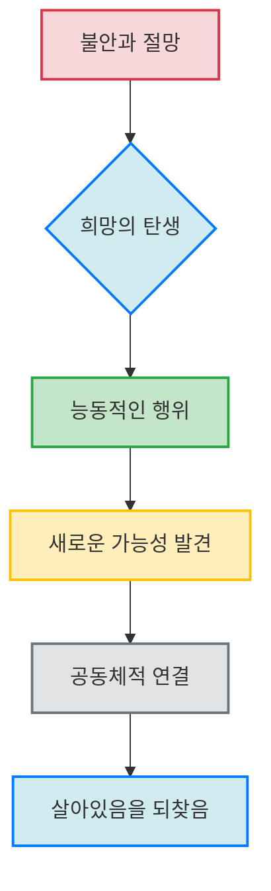
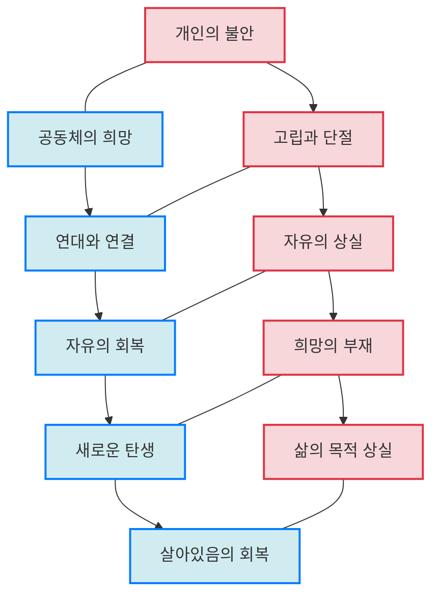

## 불안 사회: 희망을 잃어버린 시대에 다시 희망을 이야기하다
이 책은 우리가 살고 있는 '불안 사회'의 모습을 진단하고, 그 속에서 잃어버린 '희망'의 의미를 철학적, 신학적으로 깊이 탐구하는 책이야. 저자는 불안이 우리를 어떻게 고립시키고 자유를 빼앗는지 보여주면서, 진정한 희망은 절망을 외면하지 않고 오히려 끌어안으며 행동으로 나아가는 힘이라고 말해. 결국 희망은 우리를 연결하고 새로운 탄생으로 이끄는 공동체적인 힘이라는 메시지를 전달하고 있어.

## 1. 불안 사회의 시작: 종말론과 희망의 질식 

우리가 사는 세상은 마치 끝이 다가오는 것처럼 느껴지는 '종말론'이 유행하는 시대야. 

1. **종말론의 만연**:
  - 항상 기후 위기나 팬데믹 같은 위기들이 끊이지 않고, 사람들은 다음 위기가 언제 올지 불안해해. 
  - 이런 위기 속에서 사람들은 오직 '생존'에만 매달리게 되고, 삶의 목적 자체가 생존으로 축소되는 거야. 
  - 심지어 종말론조차도 하나의 상품이 되고, 기후 픽션 같은 새로운 문학 장르까지 생겨날 정도지. 
2. **희망의 질식**:
  - 이렇게 불안한 분위기가 만연하면, 희망의 싹은 자라지 못하고 질식해 버려. 
  - 불안은 사람들을 우파 포퓰리즘(대중의 감정을 자극해서 인기를 얻으려는 정치 방식)으로 이끌고, 혐오를 선동하며, 서로 연대하고 공감하는 마음을 무너뜨려. 
  - 결국 불안은 민주주의를 무너뜨리는 강력한 지배 도구가 될 수 있어. 
  - 불안한 사회에서는 자기 생각을 자유롭게 표현하거나 깊이 고민하는 것조차 어려워져. 

## 2. 불안과 희망의 본질: 상호 배타적이지만 변증법적인 관계 

불안과 희망은 서로 반대되는 개념이지만, 아주 깊이 연결되어 있어. 마치 동전의 양면 같다고 할까?

1. **불안의 특징**:
  - 불안은 원래 '좁은 공간'이라는 뜻을 가진 단어에서 유래했어. 
  - 불안은 우리에게 이정표(방향)를 보여주지 않고, 오직 경고 표지판(위험)만 세워. 
  - 불안은 자유를 빼앗고, 사람들을 고립시키며, 연대의 가능성을 없애 버려. 
  - 불안은 우울한 기분을 퍼뜨려 사회 전체를 붕괴시키고 민주주의를 위협할 수 있어. 
  - 물론 불안 자체는 정당한 감정이지만, 문제는 불안이 사회 전체로 퍼져나가는 거야. 
2. **희망의 특징**:
  - 희망은 언어적으로도 불안의 반대말이야. 
  - 희망은 앞으로 몸을 굽혀 더 멀리, 더 정확히 보려고 하는 자세를 말해. 
  - 희망은 사람들을 분리하지 않고 연결하며 화해시켜. 
  - 희망은 깊은 절망 속에서 비로소 눈을 떠. 절망이 깊을수록 희망도 더 강렬해지는 변증법적인 관계를 가지고 있지. 
  - 희망은 부드럽고 아름다우며 우아한 감정이야. 
3. **신자유주의와 불안**:
  - 신자유주의(개인의 자유로운 경쟁을 강조하는 경제 체제)라는 무한 경쟁 시스템은 본질적으로 '불안의 체제'라고 볼 수 있어. 
  - 자유롭다는 건 원래 어떤 강박(억지로 해야 하는 것)으로부터 자유롭다는 뜻인데, 신자유주의에서는 오히려 자유가 강박을 만들어내. 
  - 예를 들어, '성과 강박'이나 '최적화 강박'처럼 끊임없이 더 잘해야 한다는 압박은 자유가 만들어낸 강박이고, 이는 내부로부터 오는 착취를 통해 불안을 강화해. 
  - 마치 8시간만 일하면 도태될 것 같고, 5시간만 자면 뒤처질 것 같은 느낌이 드는 것처럼 말이야. 

## 3. 희망과 낙관주의의 차이: 절망을 포용하는 힘 

희망은 단순히 '잘 될 거야'라고 막연하게 생각하는 낙관주의와는 완전히 달라. 희망은 절망까지도 끌어안는 용기를 가지고 있어.

1. **낙관주의의 특징**:
  - 낙관주의는 부정적인 것을 전혀 포함하지 않아. 
  - 이유 없이 모든 일이 잘될 거라고 생각하고, 어떤 문제든 해결 가능하다고 믿는 사유 방식이야. 
  - 낙관주의는 외부 세계와 단절되어 있고, 노력을 들이지 않아. 
  - 비관주의도 낙관주의와 비슷하게, 모든 것을 거부하며 변화의 가능성을 보려 하지 않아. 
2. **희망의 특징**:
  - 희망은 절망의 반대말이지만, 절망을 외면하지 않고 오히려 기억하고 받아들이는 태도를 가지고 있어. 
  - 희망은 무언가를 찾아 나서려고 하는 능동적인 태도야. 
  - 절대적인 희망은 희망 없는 상황에서 깨어나고, 완전한 절망을 마주했을 때 더욱 강렬해져. 
  - 희망은 어둠과 답답함, 안 될 것 같은 절망을 포용하면서도 다른 가능성을 찾는 것을 말해. 
  - 희망은 미래를 믿는 것이고, 아직 '아니다'라는 시간적 특징을 가지고 있어. 

## 4. 희망과 행위: 능동적인 실천을 이끄는 힘 

희망은 단순히 바라는 것을 넘어, 실제로 행동하게 만드는 강력한 힘을 가지고 있어.

1. **희망에 대한 비판과 재해석**:
  - 과거에는 카뮈나 스피노자 같은 철학자들이 희망을 '극도의 회피'나 '비이성적인 것'으로 보며 부정적으로 평가하기도 했어. 
  - 이들은 희망이 아무것도 하지 않고 사람을 수동적으로 만든다고 생각했지. 
  - 하지만 저자는 이런 관점이 희망의 복잡성과 내적 긴장을 간과한다고 비판해. 
  - 희망은 이성적으로 접근할 수 없는 '행위의 여지'를 열어주는 것이라고 말이야. 
2. **능동적인 **희망:
  - 진정한 희망은 능동적인 차원으로, '행위'를 이끌어내는 것을 의미해. 
  - 에리히 프롬은 희망을 "도약의 순간이 도래했을 때 도약하고자 웅크리고 있는 호랑이" 같다고 비유했어. 
  - 이는 아직 태어나지 않은 것을 위해 매 순간 준비하고, 새로운 삶을 알리는 모든 전주(미리 알려주는 신호)를 인식하고 사랑하며, 새로 태어나려고 준비된 것을 실제로 태어나도록 돕기 위해 준비된 상태를 말해. 
  - 희망은 단순히 소원하거나 기대하는 것과 달라. 희망은 행위를 이끄는 '서사'(자기 삶의 방향과 가치관을 형성하는 긴 이야기)를 발전시켜. 
3. 한나 아렌트** 비판**:
  - 한나 아렌트는 인간 실존의 본질적 특징 중 하나로 '행위'를 말했지만, 희망을 행위 이론에 체계적으로 통합하지는 못했어. 
  - 아렌트에게 행위는 새로운 것을 시작하는 것이지만, 그 우연성과 예측 불가능성 때문에 '용서와 약속'이 필요하다고 봤지. 
  - 하지만 저자는 인간이 희망할 수 있기 때문에 행위할 수 있다고 주장해. 
  - 새로운 시작은 희망 없이는 불가능하며, 희망이 행위에 선행한다고 말이야. 
  - 희망이 만들어주는 열린 미래가 행위의 죄책(책임감)을 없애준다고 봐. 

## 5. 희망과 인식: 아직 존재하지 않는 것을 보는 눈 

희망은 단순히 눈앞의 현실을 보는 것을 넘어, 아직 존재하지 않는 미래의 가능성을 인식하는 특별한 능력이야.

1. **사유와 감정의 연결**:
  - 생각(사유)은 느낌, 감정, 정서, 자극 없이는 일어날 수 없어. 
  - 이것이 바로 인공지능(AI)이 진정으로 사유할 수 없는 이유라고 저자는 말해. 
  - 우리가 사유한다는 건 신체성을 가지고 직접 마주하고, 느낌과 감정을 가지고 만나야 하는 것이기 때문이야. 
  - 사랑하는 대상만을 알아갈 수 있고, 그 인식이 깊어질수록 사랑과 열정은 더욱 강해진다고 해. 
2. **미래를 향한 인식**:
  - 희망은 기존의 것이 아니라 앞으로 도래할 것(아직 존재하지 않는 것)을 향해 있어. 
  - 희망은 아직 존재하지 않는 것을 인식하는 능력이야. 
  - 이런 관점은 바울이나 루터, 몰트만 같은 신학자들의 사상과도 연결돼. 
  - 특히 몰트만은 "나는 이해하기 위해 희망한다"고 말하며, 희망이 인식을 추구한다고 했어. 
  - 이는 신학에서 '이미와 아직 사이'라는 개념처럼, 이미 왔지만 아직 완전히 도래하지 않은 중간 단계를 표현하는 것과 비슷해. 
3. **블로흐의 '아직 의식되지 않은 것'**:
  - 에른스트 블로흐는 희망의 철학을 이야기하며, '아직 의식되지 않은 것'이라는 개념을 제시했어. 
  - 이것은 정신분석학의 '무의식'(과거에서 비롯된 것)과는 달라. 
  - '아직 의식되지 않은 것'은 앞으로 도래할 일에 대한 사전 의식이자, 심리층에서 새로운 것이 탄생하는 것을 의미해. 
  - 블로흐는 희망하는 일은 "지하실의 냄새가 아닌 아침 공기를 맞는다"고 비유했어. 
  - 꿈이나 몽상도 일종의 '꿈 자본'으로 볼 수 있는데, 현대 사회는 이런 꿈조차도 빼앗아가는 사회가 아닐까 하는 논의도 있어. 

## 6. 삶의 형태로서의 희망: 공동체적 초월성 

희망은 단순히 개인적인 감정을 넘어, 우리 삶의 근본적인 형태이자 공동체적인 성격을 가지고 있어.

1. **불안과 희망의 유사성**:
  - 희망과 불안은 정반대되는 감정이지만, 구조적으로는 유사해. 
  - 둘 다 구체적인 대상이 없는 '근본 기분'(존재의 근원적인 감정)이라는 점에서 비슷해. 
  - 하이데거는 '불안'을 중심으로 인간의 실존을 분석했지만, 저자는 이를 비판해. 
  - 하이데거의 철학은 인간을 세상에 던져진 고립된 존재로 보지만, 저자는 희망을 근간으로 현존재(지금 여기 존재하는 인간) 분석을 다시 해야 한다고 주장해. 
2. **희망의 공동체적 성격**:
  - 희망은 이미 공동체적 성격을 가지고 있어. 
  - 불안은 개인이 고립될 때 나타나는 현상이지만, 희망은 자기 안에서만 만들어지는 힘이 아니야. 
  - 희망은 자기 자신을 넘어서 무언가를 믿고 나아가는 것이 기본 공식이야. 
  - 가브리엘 마르셀의 "나는 우리를 위해 너를 희망한다"는 말처럼, 희망은 자기를 초월하여 '우리'를 향해 있어. 
  - 반면 하이데거의 불안은 한 존재를 고립시켜. 
3. **희망의 초월성**:
  - 희망은 세계 내 사건이나 일의 결과와는 무관해. 
  - 하벨의 말처럼, 희망은 "결과가 어떻게 되든 상관없이 그것이 의미가 있다는 깊은 확신"이야. 
  - 우리가 희망하는 것 자체의 가치, 거기에 투신하는 것 자체에 가치가 있다는 거지. 
  - 희망은 의지의 내재적 성찰을 넘어서는 가능성의 영역에 자리하며, 그 깊은 뿌리는 '초월적인 것'(인간의 경험을 넘어선 어떤 것)에 있어. 
  - 결국 희망은 죽음이 아니라 '탄생'을 향해 가는 것이고, 탄생이 희망의 기본 공식이라고 저자는 말해. 
  - 희망은 우리가 '살아남음'을 넘어서 '살아있음'을 되찾게 해 줄 거야. 

## 7. 불안 사회를 살아가는 우리의 자세: 희망을 통한 연대와 실천 

불안이 가득한 이 사회에서 우리는 어떻게 희망을 붙잡고 나아가야 할까? 이 책은 우리에게 연대와 실천의 중요성을 강조해.

1. **불안의 확산과 사회적 문제**:
  - 현대 사회에서는 불안증을 겪는 사람들이 점점 늘어나고, 그 증상도 다양해지고 있어. 
  - 이런 불안은 개인의 문제만이 아니라, 사회 구조적인 문제에서 비롯되는 경우가 많아. 
  - 신자유주의 체제 아래에서 자유가 극대화되면서 오히려 예측 불가능성이 높아지고, 사람들은 끊임없이 대비해야 한다는 압박감에 시달려. 
  - 자극적인 미디어는 불안을 더욱 조장하고, 세상이 망할 것처럼 느끼게 만들어 무력감을 키우기도 해. 
  - 과거에는 열심히 하면 성공할 수 있다는 희망이 있었지만, 지금은 그런 관념조차 사라지고 있어. 
2. **희망을 통한 연대와 실천**:
  - 희망은 우리를 연결하고 공동체로 만들어. 
  - 불안은 외로움, 소외, 무력감, 불신으로 이어지지만, 희망은 사랑을 포함하고 사람을 연결하며 화해시켜. 
  - 희망은 예측 불가능성을 부정적으로만 보지 않고, 오히려 새로운 가능성으로 연결하는 상상력이야. 
  - 두려움이나 불안 같은 감정 자체는 중립적이고, 우리가 그것을 어떻게 다루느냐에 따라 삶의 동력이 될 수도 있어. 
  - 희망은 결과에 집착하기보다 과정에 집중하는 태도를 요구해. 
  - 마치 동성 결혼이 있는 미래를 상상하기 때문에 지금 혼인 평등 운동을 할 수 있는 것처럼, 아직 오지 않은 미래를 상상하는 힘이 중요해. 
3. **희망을 키우는 방법**:
  - 개인이 혼자 희망을 품기 어려울 때는 공동체의 힘이 필요해. 
  - 종교 공동체든, 사회 운동 단체든, 서로 연결감을 느끼고 지지해주는 공간에서 희망의 에너지를 얻을 수 있어. 
  - 작은 실천이라도 꾸준히 하고, 큰 효과를 기대하기보다 과정 자체에 의미를 두는 것이 중요해. 
  - 불안을 완전히 없애기보다는, 불안을 컨트롤할 수 있는 '중용의 정신'이 필요해. 
  - 희망은 막연한 낙관주의가 아니라, 현실의 부정적인 면을 외면하지 않고 절망을 인정하면서도 더 나아가려는 마음이야. 
  - 결국 희망은 타인에게 투사하는 것이고, 사랑과 믿음과 연결되어 사회적 변화를 가능케 하고 연대를 강화하는 힘이 돼. 
  - 클레어 키건의 소설 "이처럼 사소한 것들"의 주인공처럼, 무서움을 그대로 안고서 타인을 위해 손을 내미는 행위, 그것이 바로 희망인 거야. 
  - 광장 민주주의 시대에 시민들이 모여들 수 있었던 이유도, 어떤 결과가 나오든 상관없이 더 밝은 내일을 만들 수 있다는 희망을 가지고 있었기 때문이야. 

## 8. 불확실한 사회에서 성공하는 사람들의 특징 

불확실한 현대 사회에서 어떤 사람들은 성공하고, 어떤 사람들은 좌절하는데, 그 차이는 무엇일까?

1. **불확실성의 시대**:
  - 과거에는 농사를 짓거나 직장에 다니는 것처럼, 어떻게 살아야 할지 명확한 방향성이 있었어. 
  - 하지만 IMF 이후로 사회는 급변했고, 국가나 대기업이 더 이상 개인의 삶을 보장해주지 않아. 
  - '자유'라는 이름 아래 개인에게 모든 책임이 전가되면서, 사람들은 어디로 가야 할지 혼란스러워하고 불안감에 빠지게 돼. 
  - 네이버 로직이 바뀌고, 새로운 SNS가 계속 등장하는 것처럼, 변화의 속도가 너무 빨라서 과거의 지식이나 방법이 통하지 않는 시대가 되었어. 
  - 이런 불확실성 때문에 사람들은 자기 가치관도 흔들리고, 인생을 통제할 수 없다고 느껴 불안해하는 거야. 
2. **성공하는 사람들의 특징**:
  - 1990년대 농장 시뮬레이션 프로그램 연구 결과, 성공한 사람들은 불확실성을 견디는 능력과 빠르게 적응하는 능력이 뛰어났어. 
  - 특히, '한정된 지식의 틀 안에서도 자신의 의지를 용기 있게 실천에 옮기는 힘'이 가장 중요하게 작용했어. 
  - 이들은 전체 상황을 파악하는 능력을 잃지 않고, 문제를 해결할 수 있다는 자신감을 유지했어. 
  - 자존감이 높아서 자기 감정에 압도되지 않고, 유연하게 대처하며, 실수나 실패를 발전의 기회로 삼는 '강한 학습 욕구'를 가지고 있어. 
  - 또한, '신뢰'라는 중요한 자원을 가지고 있어서, 사회적 지원을 기대하며 위험에 뛰어들 여유가 있어. 
3. **실패하는 사람들의 특징**:
  - 실패하는 사람들은 통제할 수 없는 상황에 대한 걱정 때문에 실패를 거듭하고, 익숙한 방법만 고집해. 
  - 이들은 전체적인 통찰 능력을 잃고, 뭘 어떻게 해야 할지 모르는 상황에 빠져. 
  - 심지어 실패한 결과에도 불구하고, 자신이 한 행동에 만족하며 연구자들을 탓하는 '자기 방어적 전략'을 보이기도 해. 
  - 이런 사람들은 '인지적 일관성 욕구'(질서와 구조에 애착이 강하고, 불확실한 상황에서 괴로움을 느끼는 성향)가 강해서, 변화에 적응하기 힘들어해. 
  - 자신감이 약해서 자신의 능력과 자원을 믿지 못하고, 항상 최악의 상황을 기대하는 경향이 있어. 

## 9. 불안이 이끄는 극단주의와 사회적 고립 

불안은 단순히 개인의 감정을 넘어, 사회 전체를 극단적인 방향으로 이끌고 사람들을 고립시키는 심각한 문제로 이어질 수 있어.

1. **급진 세력의 등장**:
  - 불안하고 불확실한 상황에서 자신의 능력적 한계를 경험할 때, 사람들은 불쾌한 느낌으로부터 자신을 보호하려는 '자기 방어 기제'를 발동해. 
  - 이런 심리는 '급진 세력'(어떤 이념을 극단적으로 추종하는 집단)과 연관이 있어. 
  - 예를 들어, 극단적인 채식주의자, 페미니즘, 인종차별주의자 등 다양한 극단주의에 빠져드는 현상이 나타나. 
  - 이런 이념들은 "이렇게 하면 좋은 세상을 만들 수 있어"라고 대안을 제시하며, 사람들에게 마음의 안정을 찾아주기 때문에 쉽게 빠져들게 돼. 
2. **국가와 사회의 책임 방기**:
  - 신자유주의는 개인에게 자유를 주면 엄청난 기회를 줄 것이라고 생각했지만, 모든 사람이 충분한 자원과 수단을 가지고 있지 못하다는 점을 간과했어. 
  - 국가가 국민들을 하나로 묶지 못하고, 특정 지역이나 집단에만 투자하며 국민들끼리 싸우게 만들기도 해. 
  - 사회적 빈부 격차가 커지고, 교육과 신분 상승의 기회가 불공평해지면서 삶의 조건들이 위태로워지고 있어. 
  - 이런 상황에서 사람들은 대통령이나 국회의원, 심지어 국가조차 믿을 수 없다고 느끼며 무력감과 배신감에 빠져. 
3. **사회적 고립과 의미 상실**:
  - 과거에는 다 같이 못 살았지만 함께 잘 살아보자는 희망이 있었는데, 지금은 많은 사람들이 '사회적 고립감'에 빠져. 
  - 고립감을 느끼는 사람들은 사회에 대한 자신감을 잃고, 주변에서 무슨 일이 일어나는지 그 의미와 감정을 상실하게 돼. 
  - 이런 불안감은 돈, 직업, 학력 같은 '자원과 수단'이 부족하다고 느낄 때 더 크게 다가와. 
  - 객관적인 통계로는 사회가 좋아지고 있다고 해도, 사람들은 여전히 불안감을 느끼고 있어. 왜냐하면 '상대적인 박탈감'이 크기 때문이야. 
  - 결국 사람들은 안전망, 즉 어떤 대안을 제시해주고 보장해 줄 것 같은 곳을 찾게 되고, 그게 바로 극단주의 세력이 되는 거야. 

