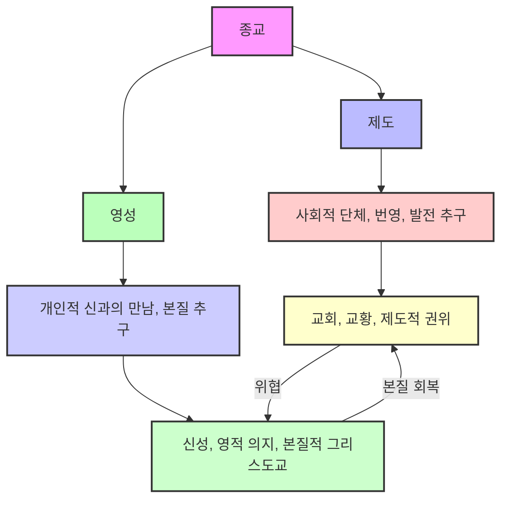

## 한병철의 '신에 관하여: 시몬 베유와의 대화' 요약
이 책은 한국이 낳은 세계적인 철학자 한병철이 프랑스 사상가 시몬 베유의 영성 사상에 주목하며, 탈근대 시대의 핵심 사상을 탐구하는 내용이야. 한병철은 시몬 베유와의 '영혼의 우정'을 통해, 생산과 소비, 정보와 소통이라는 근대적 차원을 넘어선 '더 높은 실제', 즉 영적인 차원의 중요성을 강조하고, 이를 통해 의미를 잃어버린 현대인의 삶에 행복한 존재 충만을 가져올 '초월'의 길을 제시하고 있어.

## 1. 한병철과 시몬 베유의 '영혼의 우정' 

1. 한병철**, 시대를 대표하는 철학자**
  - 한병철은 한국이 낳은 세계적인 철학자이자 사상가야. 
  - 그의 대표작으로는 '피로사회'가 있어. 
  - 그는 신자유주의 자본주의 사회에서 노동자들이 자발적으로 자신을 착취하는 현상을 발견했어. 
  - 이전 마르크스 시대에는 자본가가 노동자를 착취했지만, 지금은 노동자 스스로가 자신을 착취하는 구조라는 거야. 
  - 이러한 '피로사회' 사상은 전 세계 사상가들의 동의를 얻어 기본적인 상식이 되었지. 
  - 마치 예전에는 자본가와 노동자가 싸우는 것처럼 보였지만, 지금은 노동자들이 보너스를 많이 받으며 노조를 비판하는 것처럼 상황이 바뀐 거야. 
  - 한병철의 글쓰기는 니체의 저술처럼 단편적이고 파편적이어서 전체적인 이해가 어렵다는 특징이 있어. 
  - 그의 글은 문학적이고 시적이라서 독자들이 체계를 파악하기 어려워해. 
  - 그래서 이 책은 한병철 사상의 체계를 찾아보려는 시도라고 볼 수 있어. 

2. **시몬 베유와의 만남**
  - 한병철은 시몬 베유의 영성 사상에 깊이 끌려 그녀와 '영혼의 우정'을 느낀다고 고백했어. 
  - 그는 시몬 베유가 자신의 삶에 들어온 시기가 '나 자신도 저물어감을 감지하던 때'였다고 말해. 
  - 시몬 베유는 1937년 성프란체스코 성당에서 '위로부터 온 힘', 즉 신적인 힘을 경험했어. 
  - 한병철은 시몬 베유의 영성 사상이 '탈근대 시대의 핵심 사상'이 될 수 있다고 보았어. 

3. 영성** 사상에 대한 조심스러운 접근**
  - 한병철은 영성 이야기를 하면서도 '영혼' 같은 단어를 직접적으로 많이 사용하지 않아. 
  - 이는 영성 사상이 근대 독자들에게는 환영받지 못할 것이라는 판단 때문인 것 같아. 
  - 마치 사람들이 주말에만 교회에 가고, 평일에는 교회 이야기를 잘 하지 않는 것처럼 말이야. 
  - 하지만 그는 시몬 베유의 사상이 누군가에게는 유용할 것이라는 희망을 가지고 있어. 
  - 특히 '참된 친구', 즉 영적인 차원에서 소통할 수 있는 사람들에게 적합하다고 보았지. 
  - 그래서 한병철은 시몬 베유와 '영혼의 우정'을 느낀다고 표현한 거야. 

4. **근대적 차원을 넘어서는 **영성
  - 한병철은 생산과 소비, 정보와 소통이라는 근대적 차원 '너머'에 '더 높은 실제'가 있다고 말해. 
  - 마치 인간이 육체와 영혼으로 이루어져 있듯이, 물질적이고 현실적인 차원 너머에 영적인 차원이 있다는 거야. 
  - 근대적인 세계관 속에서는 '의미를 깡그리 상실한 삶'을 사는 사람들이 많아. 
  - 실직이나 이혼 같은 상황이 모두에게 의미 상실을 뜻하는 건 아니지만, 어떤 사람들에게는 그럴 수 있다는 거지. 
  - '한낱 생존'은 물질적이고 현실적인 차원에서만 존재하는 것을 의미해. 
  - 성공했다고 착각하지만 사실은 의미 없는 삶을 사는 경우도 여기에 해당해. 
  - '고통스러운 존재 결핍'은 영적인 차원이 결여된 상태를 말해. 
  - 한병철의 글쓰기는 이런 모호한 표현 때문에 독자들이 혼란스러워할 수 있어. 
  - 그래서 이 책은 한병철의 사상을 해설하는 역할을 하려는 거야. 
  - 궁극적으로 한병철은 '행복한 존재 충만'을 줄 수 있는 '초월'을 목표로 해. 
  - 초월은 물질적이고 현실적인 차원을 뛰어넘는 영적인 차원에서의 충만을 의미해. 

## 2. '먹기'와 '바라보기'의 이분법적 대립 

1. **개걸스러운 지각과 **소비** 사회**
  - 한병철은 현대 사회의 지각(인식)이 '더없이 개걸스러워졌다'고 말해. 
  - 이는 신자유주의 사회의 특징으로, 시각, 미각 등 모든 감각이 끊임없이 무언가를 탐하고 소비하는 경향을 보여줘. 
  - 마치 유행이 짧아지고, 쇼츠 영상처럼 짧은 콘텐츠를 계속해서 소비하는 현상과 같아. 
  - '소비가 지각의 기본 태도'가 되었어. 
  - 넷플릭스처럼 드라마를 한꺼번에 몰아보는 '빈지 워칭(binge-watching)'이 대표적인 예시야. 
  - 이는 과거에 드라마를 일주일에 한 번씩 보던 정상적인 틀을 넘어선 과도한 소비 행위라고 볼 수 있어. 
  - 지각은 '정보 쓰레기, 소통 쓰레기, 소리 쓰레기, 광경 쓰레기'를 먹어치우고 있어. 
  - 이는 과도한 정보의 폭식으로 인해 지식이나 지혜를 얻지 못하는 현상을 의미해. 
  - 마치 9.11 테러나 이스라엘-하마스 전쟁처럼 수많은 정보 속에서 적절한 정보를 분석해내지 못하는 상황과 같아. 
  - 이러한 현상은 우리를 '소비 가축'으로 변화시켜. 
  - 단순히 대중뿐만 아니라, 미국 지도층 같은 엘리트들도 이러한 문제에서 자유롭지 못해. 
  - 지각은 점점 더 자극과 충동에 휘둘리게 돼. 
  - 마치 트럼프 대통령처럼 자극과 충동에 휘둘리는 모습이 여기에 해당해. 
  - 누구도 이러한 현상에서 면역되어 있지 않다는 점이 중요해. 

2. **시몬 베유의 '**바라보기**'와 '먹기'**
  - 시몬 베유는 '바라보기와 먹기는 여기 지상에서 다르다'고 말해. 
  - 여기서 '지상'이라는 단어는 이분법적 구분이 지상에 한정된다는 의미를 내포하고 있어. 
  - 둘 중 하나를 선택해야 하며, 둘 다 '사랑'으로 불릴 수 있다고 해. 
  - '한동안 먹지 않고 바라보는 자로 머무르는 일'이 때때로 벌어지는 자들에게만 '구원의 희망이 어느 정도 있다'고 말해. 
  - 여기서 '어느 정도'라는 표현은 바라보기를 선택한다고 해서 무조건 구원받는다는 보장은 없다는 의미를 담고 있어. 
  - '먹기'는 욕구를 충족시킬 뿐이며, '오직 바라보기만이 의미를 상실한 소비의 내제로부터 우리를 구원한다'고 단언해. 
  - 한병철은 시몬 베유의 이러한 주장을 '먹기'와 '바라보기'의 이분법적 대립으로 해석해. 
  - 하지만 이러한 이분법은 근대적인 사고체계를 벗어나지 못하는 한계를 가질 수 있어. 
  - 시몬 베유는 사실 이러한 이분법을 넘어서는 이분법을 제시하려고 했다고 볼 수 있어. 

3. **선과 악, 행위와 무위의 **이분법
  - 한병철은 시몬 베유의 말을 인용하며 '선은 결속하고 화합시키는 반면 악은 분리하고 분열시킨다'고 말해. 
  - 이는 근대적인 이분법처럼 보이지만, 시몬 베유는 그렇게 단순하게 이분법을 사용하지 않아. 
  - '행위 없이 관조할 때', 즉 '무위(無爲)'할 때 우리는 선에 도달한다고 해. 
  - '무위'는 도교나 불교 같은 동양 영성 사상의 핵심 개념이야. 
  - '악은 눈먼 행동으로 표출된다'고 하는데, 이는 근대적인 이분법을 단순하게 따르는 행동을 의미해. 
  - 마치 아우슈비츠 수용소 간수처럼 무조건적으로 명령에 따르는 행위가 악의 평범성을 보여주는 것과 같아. 
  - 시몬 베유는 '악은 다양하고 세분되어 있는 반면 선은 하나다'라고 말해. 
  - 또한 '악은 공공연하지만 선은 은밀하다'고 해. 
  - 가장 중요한 것은 '악은 행위로 이루어지는 반면 선은 무위하는 행위로 이루어진다'는 점이야. 
  - 여기서 '악의 행위'는 물질적이고 현실적인 근대 사회의 행위를 의미하고, '선'은 '무위', 즉 의도적이지 않은 영적인 차원의 행위를 의미해. 
  - 시몬 베유는 탈근대 사상의 핵심 원리를 정확하게 구분하고 있었던 거야. 

4. **'**주의** 깊은 읽기'와 '더 높은 존재 영역'**
  - 시몬 베유는 '바라보기'와 '먹기'의 구분을 '여기 지상'에 한정했어. 
  - 그리고 '어느 정도' 구원의 희망이 있다고 말하며, 이분법적 구분이 절대적이지 않음을 시사했지. 
  - 한병철은 '오직 주의 깊게 읽어야만' 시몬 베유의 사상을 제대로 이해할 수 있다고 말해. 
  - 이는 단순한 '바라보기'가 아니라, '더 높거나 더 깊은 영적인 차원'에서의 읽기를 의미해. 
  - 그는 '중력을 거슬러 더 높은 존재 영역'에 도달해야 한다고 주장해. 
  - '중력'은 물질적이고 현실적인 세상을 의미하고, 이를 거슬러야 영적인 차원에 도달할 수 있다는 거야. 
  - '깊은 주의가 없으면 신을 읽을 수 없다'고 한병철은 말해. 
  - 즉, '신 경험을 위한 관건은 읽기 방식'이며, 이는 근대 시대의 독서 경험과는 다른 '주의 깊은 읽기 방식'을 의미해. 
  - 이는 탈근대 시대를 위한 진정한 인간관계를 위한 준비 과정이라고 볼 수 있어. 
  - 시몬 베유는 '감각 지각 너머의 필연'을 보아야 한다고 말해. 
  - '감각 지각'은 근대적인 차원을 의미하고, 그 너머의 '필연'은 새로운 세계관, 즉 탈근대적인 체계를 의미해. 
  - 시몬 베유의 영성 사상은 100% 탈근대적이었다고 볼 수 있어. 
  - 여기서 '필연'이라는 단어가 두 번 사용되는데, 두 번째 '필연'은 근대적인 필연이 아닌 탈근대적인 담론을 의미해. 
  - 궁극적으로는 '질서 너머에 신을 읽기'가 필요하다고 말해. 

5. **정보와 읽기, 그리고 영혼의 비움**
  - 근대 사회, 특히 신자유주의 사회에서는 '정보는 자극으로서 우리에게 달려든다'. 
  - 반면에 '읽기는 주의를 전제로 한다'. 
  - 시몬 베유는 '내가 나의 영혼에서 물러나 보는 것, 영혼을 비우는 것'이 중요하다고 말해. 
  - 이는 마치 십자가의 성 요한이 말한 '영혼의 어두운 밤'처럼, 자신을 비우고 죽음과 같은 상태에 이르는 것을 의미해. 
  - 이렇게 영혼을 비울 때 '신이 사물들을 바라보는 행운을 사물들이 겪는 것'을 방해하지 않게 돼. 
  - 인간은 자신이 보고, 듣고, 만지고, 먹는 모든 것이 신과 접촉하지 못하도록 방해한다는 사실을 시몬 베유는 알았어. 
  - '내 안에 무언가가 나라고 말하는 한 신이 이 모든 것과 접촉하지 못하게 방해한다'는 거야. 
  - 신을 위해 할 수 있는 일은 '함께 있음을 방해하지 않게 물러나는 것'이야. 
  - 그럴 때 '내가 발디딘 땅과 신의, 그리고 내가 파도 소리를 듣는 바다와 신의 완전한 사랑의 결합이 이루어진다'고 해. 
  - 이는 한병철과 시몬 베유가 영혼의 우정을 통해 영성 차원을 목표로 하고 있음을 보여줘. 

## 3. 문턱에서의 기다림과 겸손 

1. **인간 능력의 한계와 초월적 기다림**
  - 인간의 능력(지성, 의지, 사랑)이 한계에 봉착하고, '인간이 넘을 수 없는 문턱'에 굳건히 머무를 때 '초월적인 것을 향한 넘어감'이 이루어진다고 해. 
  - 이는 물질적이고 현실적인 삶의 끝에서, 삶을 포기하는 것이 아니라 강한 의지를 가지고 문턱에 머무르는 것을 의미해. 
  - 마치 공포 영화에서 서스펜스를 버티는 것처럼, 뭔가 강한 긍정적인 마음가짐으로 기다리는 거야. 
  - '무엇을 열망하는지도 모르면서' 기다린다고 했지만, 이는 겸손의 표현으로 볼 수 있어. 
  - 사실은 문턱 너머에 초자연적인 세상이 있다는 것을 알고 기다리는 거야. 
  - 이러한 설명은 영적인 차원이 있다는 것을 깨달은 소수의 사람들에게 해당해. 
  - 사무엘 베케트의 '고도를 기다리며'의 주인공들처럼, 지루하고 무의미해 보이는 삶 속에서도 초월적인 존재(고도)를 기다리는 행위와 비슷해. 
  - 그들은 무의미한 삶처럼 보이는 하루하루를 의도적으로 선택하며, 초월적인 것을 향한 넘어감을 기다리는 사람들이라고 볼 수 있어. 

2. **겸손의 미덕**
  - 시몬 베유는 문턱에서 굳건히 머무르며 기다리는 것을 '겸손(humility)'이라고 불러. 
  - 이는 셰익스피어의 햄릿이 결투를 앞두고 '겸손'을 가장 중요하게 여겼던 것과 비슷해. 
  - 햄릿은 운명을 수용하는 겸손한 마음가짐을 강조했지. 
  - 이러한 겸손은 근대 시대의 '용감함(bravery)'과는 대조되는 미덕이야. 
  - 결투나 전쟁에서는 용감함이 최고의 덕목으로 여겨졌지만, 탈근대 시대에는 겸손이 중요해지는 거야. 
  - 셰익스피어는 근대 초기에 이미 탈근대 시대의 겸손의 중요성을 예견한 놀라운 사람이라고 볼 수 있어. 
  - 마치 한국의 이상 시인이 근대 초기에 이미 근대를 초극(넘어서는)하는 세계관을 그리려 했던 것과 비슷해. 

3. **신의 침묵과 영적인 강렬함**
  - '신의 침묵'은 결핍이나 부재가 아니라, '무한한 넘침'이자 '감각으로 느낄 수 있는 응축된 강렬함'이야. 
  - 이는 자연의 아름다움마저 능가하는 영적인 강렬함을 의미해. 
  - 마치 고도를 기다리며의 주인공들이 신의 침묵을 결핍으로 오해하는 것과 달리, 신의 침묵은 사실 엄청난 의미를 담고 있다는 거야. 
  - 이때의 '감각'은 근대적인 감수성이 아니라, '정동(情動)'이라는 탈근대적인 영적인 감각을 말해. 
  - 신의 침묵을 듣는 것은 '말이나 음의 부재가 아니'며, '소리를 듣는 것보다 더 긍정적이고 의미심장하다'고 해. 
  - '어떤 말보다도 더 강하고 화려하다'고 말하지. 
  - 이는 불교의 '불립문자(不立文字)'처럼, 인간의 문자 언어로는 설명할 수 없는 영적인 차원을 의미해. 
  - 신은 절대적인 역량의 화신이므로 침묵하는 것이지, 인간을 의지하거나 사랑하지 않아서 침묵하는 것이 아니야. 
  - 무신론자들이 전쟁이나 아동 학대 같은 비극 앞에서 신의 침묵을 비판하지만, 이는 침묵을 제대로 읽지 못하는 것이라고 볼 수 있어. 
  - 침묵은 음의 부재가 아니라, '음보다 더 무한히 실제하는' 영적인 차원이야. 
  - 침묵은 '음들이 통일되어 낼 수 있는 가장 아름다운 화음보다 더 완전한 조화의 현장'이야. 
  - 초자연적인 차원은 자연적인 차원을 포함하면서도 초월하는 상태이기 때문이야. 
  - 이는 탈근대 시대의 세계관이 근대 시대의 세계관을 포함하면서도 초월하는 전략을 보여주는 것과 같아. 
  - 마치 동굴에서부터 계속된 인류의 진화 과정처럼, 영성 차원을 중심으로 하는 새로운 세계관이 도래하고 있다는 거야. 

4. 탈근대** 시대의 기회와 겸손한 **주의
  - AI와 로봇의 등장으로 기존 교육의 의미가 퇴색하고 위기가 닥쳤다고 하지만, 이는 오히려 '인생일대의 엄청난 기회'가 될 수 있어. 
  - 마치 벤처 기업처럼 새로운 기회를 찾을 수 있는 상황이라는 거지. 
  - 하지만 이러한 기회를 제대로 활용하려면 '겸손한 태도를 전제하는 참된 주의'가 필요해. 
  - 요즘 청년층에게서 이러한 겸손한 태도가 많이 보인다고 해. 
  - 근대적인 자아를 가진 사람들은 물질적인 세계관에만 몰입하여 돈, 권력, 명예를 성공의 기준으로 삼아. 
  - 하지만 이는 영혼 안에서 어떤 선한 것도 일으키지 못해. 
  - '영성 차원을 오로지 기다리는 주의', 즉 '참된 주의'가 구원을 약속해. 
  - 한병철도 '피로사회'를 쓴 후 시몬 베유의 영성 사상에 관심을 가지게 된 것은, 기존의 부정적인 상황을 넘어설 '밝은 미래'를 보았기 때문이라고 볼 수 있어. 

5. **이중적인 '의지'와 '부정적인 노력'**
  - 시몬 베유가 말한 '인간이 넘을 수 없는 문턱에 굳건히 머무를 때'의 '의지'는 '영적인 의지'를 의미해. 
  - 반면, 일반적인 '인간의 의지'는 물질적인 세계에서의 의지를 말해. 
  - 이처럼 같은 단어가 근대와 탈근대라는 두 개의 세상을 동시에 읽어야 하는 상황에서 이중적으로 사용될 수 있어. 
  - 마치 데리다의 '구명론'처럼, 근대적인 개념이 아직 완성되지 못한 탈근대적인 개념으로도 사용되는 경우가 많다는 거야. 
  - '기다리는 부정적인 노력'이라는 표현은 모호하게 들릴 수 있지만, 이는 역설적이거나 아이러니한 표현이야. 
  - 마치 시인처럼 멋있게 표현하지만, 사실은 모호하고 어려운 개념을 설명하기 위한 방식인 거지. 
  - 이는 근대적인 문장과 설명 방식으로는 탈근대적인 세계관을 온전히 설명하기 어렵기 때문이야. 
  - 예를 들어, 라틴어나 히브리어 텍스트를 번역할 때 단순히 단어의 의미를 탐색하는 것을 넘어, 감정적이고 사상적이며 영적인 차원까지 포함하는 새로운 개념을 찾아야 해. 
  - 마치 쉬운 수학 문제가 아니라, 차원이 다른 복잡한 문제에 대한 해답을 찾을 때처럼 말이야. 
  - 이는 모든 문제에 적용되는 것이 아니라, '차원이 달라진' 문제에 대한 접근 방식이야. 
  - 글을 쓸 때도 단순히 막 쓰는 것이 아니라, 현실적이고 물질적인 차원을 뛰어넘어 영적인 차원에서 영감을 받아야 좋은 창작물을 만들 수 있어. 
  - 학교에서 연습 문제를 풀 때도 '고유한 방식으로 진실을 기다려야 한다'고 말하지만, 이는 모든 문제에 기계적으로 적용되는 것이 아니야. 
  - 정말로 제대로 공부하고 성공하려면, 기존의 기계적인 방식으로는 해결할 수 없는 '차원이 다른' 문제에 대한 접근이 필요하다는 거야. 
  - 이러한 강의를 듣는 사람들은 남들처럼 평범하게 살지 않고 성공하려는 열망이 있는 사람들이라고 볼 수 있어. 
  - 그들은 '진실을 찾아 나서지 않으면서 열망해야' 해. 
  - 왜냐하면 기존의 진실은 AI나 로봇이 다 찾아낼 수 있기 때문에, 탈근대 시대에는 새로운 방식의 진실 탐구가 필요하다는 거지. 

6. **영혼의 비움과 **관조적** **주의
  - 오늘날 신자유주의 시대에는 '영혼 자체도 검색 엔진 변에서 탐색에 중독'되어 '휴식과 고요를 송두리째 상실'했어. 
  - 성공하려는 사람들은 이러한 영혼 자체에 대한 탐구를 해야 해. 
  - '능동적으로 찾아나서는 대신에 기다리는 부정적인 노력으로서의 관조적 주의'가 중요해. 
  - 여기서 '부정적인 노력'보다는 '관조적 주의', 즉 영적인 차원을 중요하게 여기는 '명상'이 핵심이야. 
  - 끊임없이 찾아 나서려 하는 것 때문에 '온갖 형태의 침착함 결여'가 발생해. 
  - 영성 차원은 현실 뒤쪽에 있기 때문에 차분하게 들여다봐야 해. 
  - 마치 트럼프 대통령처럼 침착함이 결여된 사람은 궁극적으로 실패할 수밖에 없어. 
  - 반면 러시아의 푸틴처럼 침착한 사람은 더 힘든 상황에서도 나아갈 수 있지. 
  - 지금 세상에서는 침착하고 차분함이 매우 중요해. 
  - '신이 인간을 찾아 나서고 있으니까' 인간 쪽에서 '인간 중심적인 사고방식'으로 신을 찾아 나서는 것은 말이 안 돼. 
  - 신은 창조주로서 인간을 사랑하기 때문에 기본적으로 은총을 베풀 준비가 되어 있어. 
  - 인간이 '의지나 근육의 힘만으로' 신을 찾아 나서는 것은 현실 세계의 중력에 종속되는 행위야. 
  - 이는 천국을 향해 날아갈 수 없고 오히려 바닥에 떨어지는 결과를 낳아. 
  - '오직 은총만이 우리에게 날개를 달아준다'고 시몬 베유는 말해. 
  - 마치 그리스 신화의 이카루스가 오만하게 하늘 높이 날아오르다 태양열에 날개가 녹아 떨어져 죽은 것처럼 말이야. 

7. **상상력의 두 차원: 흡수 통일과 **환대
  - 한병철은 '끊임없이 타인을 흡수 통일하려 애쓰는 상상력에서 벗어남으로써 영혼이 비어질 때만 타인을 향한 온전한 주의가 가능해진다'고 설명해. 
  - 이는 근대적인 '권력의 상상력'을 의미해. 
  - 하지만 상상력을 부정적으로만 보는 한병철의 시몬 베유 읽기에는 한계가 있다고 볼 수 있어. 
  - 왜냐하면 '신과 만나는 환대의 상상력'과 같은 긍정적인 상상력도 존재하기 때문이야. 
  - 시몬 베유는 '영혼의 빈자리는 타인을 있는 그대로 나를 섞어 놓음이 없이 타인을 맞이하는 게스트하우스'라고 설명해. 
  - 이는 '탈근대적인 환대 이론'을 의미해. 
  - '빈자리'와 '게스트하우스'는 시적인 은유 표현인데, 이는 상상력에서 비롯된 것이라고 볼 수 있어. 
  - 폴드만의 이론처럼, 모든 언어는 처음에는 시적인 상상력에 의한 은유에서 비롯되었어. 
  - 마치 '한류'라는 단어가 처음에는 '흐름'이라는 은유적인 표현이었지만, 이제는 고유명사가 된 것처럼 말이야. 
  - 따라서 상상력을 근대적인 권력의 상상력으로만 한정해서는 안 돼. 

8. 주의** 깊은 바라보기와 구원**
  - '그 일을 바라볼 줄 아는 것으로 충분하며, 불가결하다'고 해. 
  - 이 '바라보기'는 '주의 깊게 바라보기'를 의미해. 
  - 그렇게 바라볼 때 '영혼은 그 일을 있는 그대로 그의 온전한 진실 그대로 받아들이기 위해 자신의 고유한 내용을 모조리 비운다'. 
  - '주의를 기울일 능력이 있는 자만이 그렇게 바라볼 수 있다'. 
  - 이는 '착한 사마리아인'처럼, 죽은 사람처럼 보이는 이방인을 지나치지 않고 사랑으로 바라보는 행위와 같아. 
  - '영혼이 구원받을 때 하는 노력'은 '바라보고 경청할 때 하는 노력'과 비슷해. 
  - 착한 사마리아인의 영혼은 이러한 사랑 때문에 구원받는 거야. 
  - 한병철이 시몬 베유에게 '영혼의 깊은 우정'을 느낀 것은, '먹기'와 '바라보기'의 단순한 이분법적 대립을 넘어서는 '초자연적 바라봄', 즉 '구원하는 바라봄'의 차원에서였어. 
  - 모든 인간관계가 이러한 차원에 도달하지 못한다면 무의미해질 수 있다고 말할 수 있어. 
  - 현대인의 외로움은 물질적인 성공만을 추구하는 근대적인 사고방식으로는 진정한 인간관계를 맺을 수 없기 때문에 발생해. 

9. **사르트르적 바라봄과 **권력의 경제
  - '주의 깊은 바라봄', 즉 '구원하는 바라봄'은 사르트르가 말하는 '나를 대상으로 격하하고 갑을 매기고 재단하는 최종 판결을 내리는 바라봄'과 대립해. 
  - 사르트르는 실존주의 철학자로, 그의 소설 '구토'처럼 주인공이 세상에서 이방인이 되어버리는 경험을 통해 근대 사상의 한계를 보여주었어. 
  - 사르트르적 바라봄은 '근대적인 권력 관계'에 의해 지배되는 바라봄이야. 
  - 마치 주인이 노예를 바라보는 것처럼, 주체가 대상을 바라보는 시선이지. 
  - 이러한 시선 앞에 놓이면 '부끄러움'이 당연히 일어나. 
  - '부끄러움'은 내가 타인의 시선 앞에서 '대상'이 되고 '물건'이 되어버렸다는 느낌이야. 
  - 내가 주체가 아니라 물건처럼, 노예처럼 느껴질 때 삶의 의미를 잃게 돼. 
  - 타인의 바라봄이 나를 지배하고 나 자신으로부터 소외시킬 때 부끄러움이 발생해. 
  - 이는 나의 존재 기반이 내가 아니라 타인의 시선에 달려 있다는 것을 의미해. 
  - 부끄러움은 '내가 세계 안에 던져졌기 때문'에 느끼는 '원죄'의 느낌과 같아. 
  - 아담과 하와가 벌거벗었음을 알게 된 것처럼, 인간은 타인의 바라봄을 통해 자신의 존재가 노예처럼 되어버렸음을 깨닫게 돼. 
  - '주의 깊은 바라봄'은 이러한 '권력의 경제'를 초월하는 '환대의 경제'에 의한 바라봄이야. 
  - '착한 사마리아인'의 이야기는 이러한 새로운 경제, 즉 사랑하는 바라봄을 보여주는 중요한 예시야. 
  - 타인에게 주의를 선사하는 사람은 '자기를 절제'해. 
  - 이는 끝없는 욕망을 추구하는 근대적인 경제와는 정반대되는 행위야. 
  - 주의 깊은 바라봄은 '나를 나의 존재로부터 소외시키지 않아'. 
  - 오히려 '내가 내 자신에게로 돌아가는 길'을 발견하게 해줘. 
  - 이는 불교의 '참나'나 '진인'처럼, 원래 인간은 신성과 하나로 합일되어 있던 영적인 존재였다는 영성 사상의 특징을 보여줘. 
  - 누구든 자신을 잘 들여다보면 '참나'를 찾을 수 있다는 의미야. 
  - 주의 깊은 바라봄은 '나를 점령하는 대신에 나를 도와 존재에 이르게 한다'. 
  - 근대 사회의 경쟁적인 권력 관계와는 달리, 진정한 존재가 되도록 돕는 거야. 
  - 타인의 주의 깊은 바라봄은 '영혼을 구원하는 바라봄'이며, '평가하지도 최종 판결을 내리지도 않아'. 
  - 이는 '원죄'가 아니라 '은총'을 내리는 바라봄이야. 
  - 나를 떨어뜨리는 대신 해방하고 들어 올리는 은총을 알려줘. 
  - 결론적으로, 근대 세계관에 의한 자연적 바라봄은 주인-노예 이분법과 권력의 경제에 지배되어 나를 소외시키고 대상으로 격하시키는 반면, 환대의 경제에 의한 초자연적 바라봄은 나를 절제하고 나의 존재를 소외시키지 않으며, 내가 나 자신으로 돌아가는 길을 발견하게 해줘. 

## 4. 상상력의 두 차원: 구속과 해방 

1. **시각 중심 문명과 바라보기의 재정의**
  - 인간의 감각 중 시각이 지각 내용을 대부분 결정해. 
  - '당신의 뺨은 장미예요' 같은 은유적 상상력도 시각 인식에서 비롯돼. 
  - '먹기' 행위는 동물적 욕망에 충실한 차원이고, '보기' 행위는 이를 초월하는 인간 문명의 기반이야. 
  - 시몬 베유는 '한동안 먹지 않고 바라보는 자로 머무르는 일'이 때때로 벌어지는 자들에게만 '구원의 희망이 어느 정도 있다'고 말하며, 영적인 차원을 공부하는 사람들에게 '바라보기'의 중요성을 강조했어. 
  - 인간계 내부에서는 근대 시대까지의 '권력 경제의 자연적 바라봄'을 초월하는 '초자연적 바라봄'이 중요해져. 
  - 이는 근대에서 탈근대로 변화하는 역사 의식 때문이야. 
  - '주의 깊은 바라봄'이 없는 '생각하기'는 지능이나 새로운 것을 창조하지 못하는 단순한 계산에 불과해. 
  - 반면 '바라보는 생각하기'는 '이제껏 존재하지 않았던 것을 창출'해. 
  - 그래서 요즘 '창의성'이 중요하다고 말하는 거야. 
  - 시각 중심의 인간 문명에서 '주의 깊은 생각하기만이 바라보기에 도달'하는 이유는, 초시공간의 영성 세계 중심의 탈근대 시대에 성공적으로 대처하려면 '현실 세계 너머를 바라보지 않으면 안 되기 때문'이야. 
  - 새로운 세상, 즉 영성 세상이 온 거지. 

2. **AI 시대의 도전과 **탈근대** 담론의 필요성**
  - '주의 깊은 바라봄'이 없으면 AI와 로봇 같은 추론 기계의 도전 앞에서 무력해져. 
  - AI와 로봇은 물질 문명의 최고 성공작으로, 기존의 근대 교육으로 달성했던 추론 능력을 대신해. 
  - 마치 회계사처럼 추론 전문가들의 일까지 AI가 대신하게 된 거야. 
  - 따라서 '새로운 것을 창출하지 못하는 계산 같은 근대 담론의 한계를 초월'하여, '이제껏 존재하지 않았던 것을 추출하는 탈근대 담론'을 생산해야 해. 
  - 영성 공부를 하지 않으면 살 수 없게 된 상황인 거지. 
  - 근대 사회의 지식인들은 기존의 근대적 바라보기와 탈근대 담론의 차이를 제대로 인식하지 못하고 있어. 
  - 한병철이 상상력 개념 정의에 동의하지 못하는 것도, 그의 탈근대 사회로의 변화 의식이 '다소 평면적'이기 때문이야. 
  - 그의 유명한 책 '피로사회'조차도 탈근대 시대로의 '혁명'이 아니라, '개선이나 개혁'에 국한된다고 느껴지는 이유도 여기에 있어. 
  - 그는 '넘어로 가는 길'을 보지 못하고, 기존의 것을 완전히 버리고 새로운 곳으로 갈 생각을 하지 못하는 것 같아. 

3. **규율 사회에서 성과 사회로, 그리고 신화의 변화**
  - 한병철은 병원, 정신병자 수용소, 감옥, 병영, 공장으로 이루어진 '규율 사회'가 더 이상 오늘의 사회가 아니라고 말해. 
  - 규율 사회는 이미 사라졌고, 그 자리에 '클럽, 오피스 빌딩, 은행, 공항, 쇼핑몰, 유전자 시험실로 이루어진 사회'가 들어섰어. 
  - 즉, 21세기의 사회는 '규율 사회에서 성과 사회로 변모'했다는 거야. 
  - 이는 자본주의 사회의 주인-노예 관계, 즉 근대적인 권력 관계가 훨씬 더 악화되었다는 것을 의미해. 
  - 하지만 한병철은 이러한 변화가 '사회가 멸망했고 새로운 탈근대 사회가 불가피하게 나타난 현상'이라는 점을 충분히 강조하지 못하고 있어. 
  - 이 사회의 주인은 더 이상 복종적인 주체가 아니라 '성과 주체'이며, '스스로를 착취하는 기업가'라고 불려. 
  - 이러한 자기 파괴적인 고통은 지속 불가능하기 때문에, 결국 탈근대라는 혁명적인 사회가 도래할 수밖에 없어. 
  - 한병철이 영성 사상에 관심을 가지게 된 것도, 더 이상 갈 데가 없는 망해버린 세상에서 대책을 마련해야 했기 때문이라고 볼 수 있어. 

4. **롤랑 바르트의 신화론과 근대 신화의 해체**
  - 롤랑 바르트의 신화론에 따르면, 언어(기표와 기의로 이루어진 기호)가 다시 기표가 되어 새로운 기의를 만들고, 이것이 중첩되면 '신화'가 돼. 
  - '근대 신화'는 이러한 언어 체계로 구성된 것이라고 볼 수 있어. 
  - 롤랑 바르트의 분석은 '근대 자아의 천부인권설'처럼, 언어들이 합쳐져 신화가 되고 이것이 근대 국가의 구성 원리가 되는 과정을 설명해. 
  - 이는 전근대 시대의 왕권 중심설을 대체하는 새로운 신화였지. 
  - 이반 일리치는 오늘날 학교 체제가 과거 교회가 했던 '신화를 유지하는 기능'을 수행한다고 말해. 
  - 학교는 사회적 신화의 저장고이자, 신화의 모순을 제도화하고, 신화와 현실 사이의 괴리를 재정산하는 의례 장소 역할을 해. 
  - 심지어 학교는 이러한 신화를 비판하고 저항하는 기회까지 제공하지만, 신화의 근본적인 모순을 받아들이게 하는 '의례 기능'은 여전히 도전을 받지 않고 있어. 
  - 단순한 이데올로기 비판이나 사회적 행동만으로는 새로운 사회를 만들 수 없어. 
  - 혁명적인 변화를 위해서는 '사회 가장 중심에 있는 의례의 미혹'에서 벗어나야 해. 
  - '학교 다니면 최고야'라는 신화를 떨쳐버리고, 그 의례를 해체할 때만 근본적인 변화를 일으킬 수 있다는 거야. 
  - 근대 세계가 '학교, 군대, 국가, 가족 등 근대의 신화'로 구성된 기호 체계라면, '전혀 다른 신화의 체계', 즉 '영성 차원과 연계된 탈근대 시대의 세계관'이 필요해. 
  - 한병철, 이반 일리치, 롤랑 바르트, 데리다 등은 이러한 탈근대 시대가 도래했다고 보고 있어. 

5. **자아 숭배와 타자의 **상상력
  - 한병철은 신자유주의 체제에서 우리는 '충성스럽게 자아를 숭배하고 예배하며, 자기를 생산하고, 자기를 공연하고, 자기를 섬기는 사제이자 자기를 부부리는 사업가'라고 지적하며, 이반 일리치의 근대 이데올로기 비판에 동조해. 
  - 신자유주의 시대의 요란한 자아는 오히려 우리를 진정한 종교로부터 멀리 떼어놓는다는 거야. 
  - '끊임없이 타인을 흡수 통일하려는 애쓰는 상상력에서 벗어남으로써 영혼이 비어질 때만 타인을 향한 온전한 주의가 가능해진다'고 한병철은 설명해. 
  - 이는 근대적인 주인-노예 권력 관계, 즉 주도권 싸움에서 벗어나야 한다는 의미야. 
  - '타자의 상상력의 힘'으로 근대 자아가 흡수 통일되는 주인의 신화 틀을 벗어나야 탈근대 영성 세계를 찾을 수 있다는 거지. 
  - 하지만 한병철은 상상력을 부정적으로만 설명하는 한계가 있어. 
  - 물질 세계의 권력 관계와는 전혀 다른 영성 차원의 '환대 관계' 확산을 위한 '긍정적인 상상력'도 존재하기 때문이야. 

6. **탈창조와 해방의 상상력**
  - 한병철은 '내가 완전히 떨어져 나가면 내가 상상한 실제가 아닌 참된 실제가 드러난다'고 말해. 
  - 우리는 우리의 상상에 기초하여 세계의 실제성을 만들어내는데, 그 실제성은 '나의 실제성'이라는 거야. 
  - '참된 실제, 참된 질서는 오로지 나를 완전히 꺼버릴 때만 경험된다'. 
  - '구속은 어떤 구속이든지 실제를 왜곡한다'. 
  - '내가 물러남으로써, 나를 철회함으로써, 나를 취소함으로써 나는 사물들에게 왜곡되지 않는 실제성, 아름다움을 되돌려준다'. 
  - 그래서 그는 '탈창조(脫創造)'라는 말을 사용해. 
  - '내가 사라진다면 내가 보는 이 사물들은 내가 보는 사물들이기를 끝일 것이므로, 스스로 있는 사물들이 될 것이고 완벽하게 아름다울 것이다'라고 말하며, '탈창조가 창조를 해방한다'고 주장해. 
  - 하지만 여기서 '사라지는 것'은 두 종류로 해석될 수 있어. 
  - 첫째, '육체의 죽음'으로 인한 사라짐이야. 
  - 둘째, '살아 있는 동안 영성 차원으로 돌아가는 것'이야. 
  - 이 두 번째는 내가 없어지는 것이 아니라, '원래 없었던 환상의 자아가 없어져 신 부처가 하나가 되는 것', 즉 '내가 엄청나게 커지는 것'을 의미해. 
  - 이는 '탈근대 환대 영적 상상력'이 근대적 권력의 물질적 상상력을 해방시키는 것을 말해. 
  - '탈창조가 창조를 해방한다'는 말은, '해방'이 구속된 존재의 말살을 요구하기보다 '그 영역을 극적으로 확장하는 일'을 의미해. 
  - 따라서 근대적인 플러스-마이너스 이분법으로 탈창조와 창조를 구분해서는 안 돼. 
  - 영적 탈창조는 물질적 창조를 포함하면서도 초월하는 것이기 때문이야. 
  - 탈근대 시대의 담론은 기존의 근대 담론을 수용하면서도 초월하는, 즉 '포괄하는' 전략이어야 해. 

## 5. 성령과 신성: 제도와 영성의 차이 

1. **종교의 두 가지 측면: 제도와 **영성
  - 종교는 '제도'와 '영성'으로 구성돼. 
  - 종교의 기초는 영성이지만, 사회적으로 존재하기 위해서는 제도화가 필요해. 
  - 하지만 제도화된 교회는 사회적 단체가 됨으로써 자신의 번영과 발전을 추구하게 돼. 
  - 마치 편안한 성직자들로 구성된 단체가 건물을 짓고 번영을 추구하는 것처럼 말이야. 
  - 그리스도교, 불교 같은 고급 종교들은 영성적 측면을 무시해온 경향이 있어. 
  - 예를 들어, 신분 교회에서는 '복음'이 영성적 복음이 아니라 제도적 성공을 의미하게 되었어. 
  - 21세기에 들어서면서 종교 제도가 쇠퇴하고 영성의 시대가 도래했다고 평가돼. 

2. **삼위일체와 신성의 개념**
  - 구약 성경의 주인공이 '성부(하느님 아버지)'였다면, 신약 성경의 주인공은 '예수'야. 
  - 예수는 유대교에 의해 배척되었지만, 성령의 존재를 예고했어. 
  - 예수의 부활은 유대교뿐만 아니라 모든 사람에게 신과 일대일로 만날 수 있는 길을 열어주었어. 
  - 이는 '성부-성자-성령'의 삼위일체 구조를 이루지. 
  - 마이스터 에카르트가 말하는 '신성(Godhead)'은 삼위일체 뒤에 있는, 존재의 인간 차원을 넘어서는 영적인 개념이야. 
  - 이는 영성 사상의 핵심 개념이지. 
  - 마이스터 에카르트의 '신성' 개념은 가톨릭 교회에 위협적이었어. 
  - 왜냐하면 신성이 삼위일체 위에 있는 개념이라면, 교황의 권위가 평가절하될 수 있기 때문이야. 
  - 그래서 마이스터 에카르트는 도미니크회 사상가임에도 불구하고 금기시되었어. 
  - 하지만 최근에는 교회가 영성의 중요성을 인정하면서 그의 사상을 허용하는 경향이 있어. 

3. **성령과 신성의 차이**
  - 성령은 예수가 존재를 알려준 개념으로, 유대교인이 아닌 사람들도 신과 만날 수 있게 해준 제도적 차원의 개념이라고 볼 수 있어. 
  - 반면 신성은 영성의 개념이야. 
  - 마이스터 에카르트가 '신성'이라는 단어를 새롭게 정립해야 했던 이유는, 기존의 '성령' 개념이 제도적 차원에 국한되어 있었기 때문이야. 
  - 신약 성경의 예수를 다시 자세히 읽어보면, 예수가 말한 사랑에는 '실천'이 들어 있어. 
  - '착한 사마리아인'의 행위는 단순히 제도적인 행위가 아니라, 다른 사람을 정말로 사랑해야 한다는 본질적인 가르침이야. 
  - 마이스터 에카르트는 새로운 교회를 찾은 것이 아니라, '그리스도교의 본질'을 정립하려고 했어. 
  - 예수가 말한 '신성'은 삼위일체라는 교리 속에 합성되어 버렸지. 
  - 마이스터 에카르트와 교황청 사이에 치열한 논쟁이 있었고, 마이스터 에카르트의 설교는 대중을 대상으로 했어. 
  - 최근 발굴되는 신약 성경 경전들에서도 영성 중심의 그리스도교를 말하는 내용이 많아. 
  - 이는 마이스터 에카르트나 이 책의 저자가 그리스도교를 반대하는 것이 아니라, '그리스도교 본질의 영성 회복'을 주장하는 것임을 의미해. 
  - 이러한 영성 사상은 동양 신비주의의 '화두 공안'과도 다르지 않은 모습을 보여줘. 
  - 근대에서 탈근대로 전환하는 시대 상황에서는 이러한 상반되는 개념들이 하나의 개념에 사용되는 경우가 많다는 점을 파악하는 것이 중요해. 

