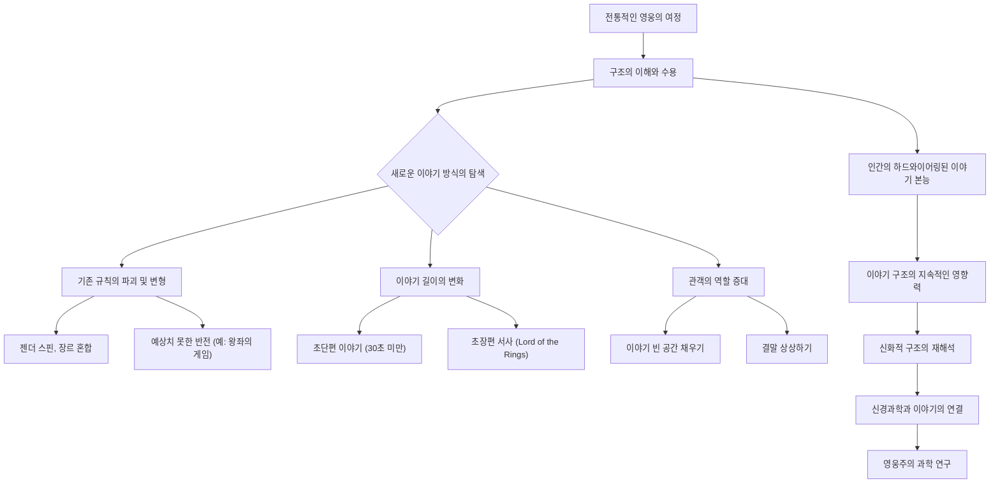

## 작가의 여정: 신화적 구조로 이야기 만들기
이 책은 조셉 캠벨의 '천 개의 얼굴을 가진 영웅'에서 영감을 받아, 모든 이야기의 보편적인 패턴인 '영웅의 여정'을 영화 제작자들을 위해 쉽고 실용적으로 풀어낸 이야기 구조 안내서이다. 작가 크리스토퍼 보글러는 이 신화적 구조가 단지 판타지나 모험 이야기에만 적용되는 것이 아니라, 코미디, 로맨스, 드라마 등 모든 장르의 이야기에 적용될 수 있음을 보여주며, 작가들이 독자와 깊이 연결될 수 있도록 돕는 강력한 도구임을 강조한다.

## 1. '작가의 여정'의 탄생 배경: 조셉 캠벨의 영향과 스타워즈 

1. **이야기에 대한 갈증**:
  1. 크리스토퍼 보글러는 미주리주의 외딴 농장에서 자라면서 친구들과 멀어지자 책과 영화, 특히 드라이브인 극장에서 본 영화에 푹 빠져 지냈다. 
  2. 어머니가 독서광이어서 집안에 책이 가득했고, 작가가 되는 것이 가치 있는 일이라고 생각했다. 
  3. 이러한 경험들이 그를 이야기의 세계로 이끌었다. 
2. **영화 산업으로의 진입**:
  1. 미주리 대학교에서 저널리즘을 공부하며 영화 수업을 들었고, 베트남 전쟁 중 공군 ROTC에 가입하여 졸업 후 로스앤젤레스로 발령받는 행운을 얻었다. 
  2. 공군 싱크탱크에서 우주왕복선과 GPS 시스템에 대한 다큐멘터리 영화를 만들며 영화 제작 경험을 쌓았다. 
  3. 이때 제2차 세계대전 참전 용사였던 카메라맨과 편집자들로부터 멘토링을 받으며 많은 것을 배웠다. 
  4. 이후 USC 영화 대학원에 진학하여 본격적으로 영화를 공부했다. 
3. **'**영웅의 여정**'과의 만남**:
  1. 영화 느와르 수업 중 영화에 '신화적 차원'이 있다고 언급하자, 교수가 조셉 캠벨의 책 <천 개의 얼굴을 가진 영웅>을 추천했다. 
  2. 이 책을 읽고 보글러는 이야기의 규칙을 찾던 자신의 질문에 대한 답을 찾았다고 느꼈다. 
  3. 캠벨의 책은 이야기의 지도이자 인간 두뇌의 지도와 같아서, 우리가 이야기에서 무엇을 찾고 왜 공감하는지를 설명해 주었다. 
4. **스타워즈를 통한 확신**:
  1. 캠벨의 책을 읽은 지 2주 만에 조지 루카스의 <스타워즈>가 개봉했다. 
  2. 보글러는 영화를 보면서 캠벨이 설명한 '영웅의 여정' 단계들이 정확히 영화에 적용되는 것을 발견했다. 
  3. 이는 캠벨의 이론이 상업적으로 유용하며 현대에도 강력하게 적용될 수 있음을 확신시켜 주었다. 
  4. 당시 베트남 전쟁 이후 침체되었던 영웅주의가 <스타워즈>와 <미지와의 조우> 같은 영화를 통해 부활하고 있다고 보글러는 생각했다. 
5. **디즈니 메모의 탄생**:
  1. 보글러는 스크립트 분석가로 일하면서 수천 편의 시나리오를 읽고 보고서를 작성하며 캠벨의 이론을 실제 작품에 적용하고 테스트했다. 
  2. 그는 캠벨의 복잡한 이론을 영화 제작자들이 바로 사용할 수 있도록 7페이지짜리 스튜디오 메모로 요약했다. 
  3. 이 메모는 디즈니 애니메이션 부서에서 큰 반향을 일으켰고, 특히 제프리 카젠버그가 극찬하며 보글러를 애니메이션 팀으로 보냈다. 
  4. 이 메모는 마치 작은 로봇처럼 할리우드에 퍼져나가 보글러의 아이디어를 전파하는 역할을 했다. 

## 2. '작가의 여정'의 핵심: 영웅의 여정 12단계 

크리스토퍼 보글러는 조셉 캠벨의 16단계 또는 36단계 영웅의 여정을 12단계로 간소화하여 영화 제작자들이 쉽게 적용할 수 있도록 만들었다. 이 12단계는 이야기가 어떻게 시작되고, 주인공이 어떤 어려움을 겪으며 성장하며, 결국 어떻게 변화하여 돌아오는지를 보여주는 지도와 같다.

1. 평범한 세계** (Ordinary World)** 
  1. 주인공의 일상적인 삶과 배경을 보여주는 단계이다.
  2. 주인공은 편안하고 안전하지만, 동시에 뭔가 부족하거나 불안함을 느낄 수 있다.
  3. 이 단계에서 주인공의 결점이나 개선해야 할 점을 보여준다.
  4. 예시: <스타워즈>의 루크 스카이워커가 농장에서 평범하게 지내는 모습. 
2. 모험의 부름** (Call to Adventure)** 
  1. 주인공의 평범한 삶을 뒤흔드는 사건이나 메시지가 나타나는 단계이다.
  2. 내부적 또는 외부적 위협이 될 수 있으며, 주인공에게 행동을 촉구한다.
  3. 예시: <스타워즈>에서 드로이드가 오비완의 홀로그램 메시지를 전달하는 것. 
3. 부름의 거부** (Refusal of the Call)** 
  1. 주인공이 모험의 부름에 처음에는 저항하거나 주저하는 단계이다.
  2. 아직 준비되지 않았다고 느끼거나, 익숙한 세계를 떠나기 두려워한다.
  3. 예시: <스타워즈>의 루크가 농장 일을 핑계로 모험을 거부하는 것. 
4. 멘토와의 만남** (Meeting with the Mentor)** 
  1. 주인공이 모험을 준비하도록 돕는 안내자나 현명한 인물을 만나는 단계이다.
  2. 멘토는 조언, 훈련, 또는 어떤 형태의 도움을 제공하여 주인공이 앞으로의 도전에 대비하게 한다.
  3. 예시: <스타워즈>의 루크가 오비완 케노비를 만나 조언을 듣는 것. 
5. **첫 번째 문턱 넘기 (**Crossing the First Threshold**)** 
  1. 주인공이 평범한 세계를 떠나 모험의 세계로 완전히 들어서는 결정적인 순간이다.
  2. 이 지점부터는 되돌아갈 수 없는 '돌이킬 수 없는 지점'이 된다.
  3. 예시: <스타워즈>의 루크가 삼촌과 숙모의 죽음을 목격하고 오비완과 함께 모험을 떠나는 것. 
6. **시험, 동료, 적 (Tests, Allies, Enemies)** 
  1. 주인공이 새로운 특별한 세계에서 다양한 도전과 장애물에 직면하는 단계이다.
  2. 이 과정에서 새로운 동료를 만나고, 적과 대면하며, 자신의 능력을 시험한다.
  3. 예시: <스타워즈>의 루크가 모스 아이슬리 우주항에서 한 솔로와 츄바카를 만나고 위험한 상황을 겪는 것. 
7. **가장 깊은 동굴 접근 (Approach to the Inmost Cave)** 
  1. 주인공이 모험의 핵심 위기에 점점 더 가까워지는 단계이다.
  2. 가장 위험한 장소, 즉 퀘스트의 목표가 숨겨져 있는 곳으로 향하며, 최종적인 시련을 위한 준비를 한다.
  3. 예시: <스타워즈>의 주인공들이 데스 스타에 갇히는 상황. 
8. 시련** (Ordeal)** 
  1. 이야기의 중간 지점으로, 주인공이 가장 큰 두려움이나 죽음에 직면하는 최고조의 긴장 순간이다.
  2. 주인공은 지금까지 얻은 모든 기술과 경험을 총동원하여 이 도전을 극복해야 한다.
  3. 이 단계에서 중요한 동료가 죽거나, 배신을 당하는 등 큰 좌절을 겪을 수 있다.
  4. 예시: <스타워즈>에서 주인공들이 쓰레기 압축기에서 탈출하고 오비완이 죽음을 맞이하는 장면. 
9. 보상** (Reward: Seizing the Sword)** 
  1. 시련을 극복한 후 주인공이 얻는 보상 단계이다.
  2. 이 보상은 비밀스러운 유물, 지혜, 동료와의 화해, 또는 처음의 퀘스트 목표 달성 등 다양한 형태를 띨 수 있다.
  3. 예시: <스타워즈>에서 주인공들이 데스 스타를 탈출하고 반란군 기지에 데스 스타 설계도를 전달하는 것. 
10. **귀환의 길 (The Road Back)** 
  1. 보상을 얻은 주인공이 평범한 세계로 돌아가기 시작하는 단계이다.
  2. 이 과정에서도 새로운 도전이나 위험이 발생할 수 있으며, 이야기의 긴장감이 다시 고조된다.
  3. 예시: <스타워즈>에서 데스 스타가 반란군 기지를 향해 다가오면서 새로운 위협에 직면하는 것. 
11. 부활** (Resurrection)** 
  1. 주인공이 모든 것을 걸고 마지막 시험에 임하는 최종 대결 단계이다.
  2. 이것은 일종의 정화 의식으로, 주인공은 이 과정을 통해 완전히 새로운 존재로 다시 태어난다.
  3. 이 단계에서 주인공은 자신의 성장을 증명하고, 이야기의 핵심 메시지를 구현한다.
  4. 예시: <스타워즈>에서 루크가 조준 컴퓨터를 끄고 포스를 믿으며 데스 스타를 파괴하는 장면. 
12. 엘릭서와 함께 귀환** (Return with the **Elixir**)** 
  1. 주인공이 변화된 모습으로 평범한 세계(또는 새로운 평범한 세계)로 돌아오는 단계이다.
  2. 주인공은 모험을 통해 얻은 지혜, 보물, 또는 깨달음(엘릭서)을 원래의 세계에 가져와 이롭게 한다.
  3. 예시: <스타워즈>의 루크가 새로운 가족과 동료들을 얻고 새로운 삶의 터전을 찾는 것. 

## 3. 이야기 속 캐릭터의 역할: 8가지 원형 

크리스토퍼 보글러는 이야기 속 캐릭터들이 마치 연극에서 모자를 바꿔 쓰는 것처럼 특정 역할을 수행한다고 설명한다. 이 역할들을 '원형(Archetype)'이라고 부르는데, 이 원형들은 주인공의 여정을 돕거나 방해하며 이야기를 풍성하게 만든다.

1. **영웅 (Hero)** 
  1. 이야기의 중심 인물로, 여정을 떠나고 퀘스트를 수행하는 주인공이다.
  2. 모든 이야기는 이 영웅을 중심으로 전개된다.
2. 멘토** (Mentor)** 
  1. 영웅에게 지혜와 조언, 훈련을 제공하는 안내자이다.
  2. 영웅이 필요로 하는 내면의 깨달음이나 이야기의 교훈을 전달하는 역할을 한다.
  3. 예시: <스타워즈>의 오비완 케노비.
3. **문턱의 수호자 (**Threshold Guardian**)** 
  1. 영웅이 익숙한 세계에서 미지의 세계로 넘어가는 경계선에 서 있는 인물이다.
  2. 영웅에게 첫 번째 장애물이나 시험을 제시하며, 영웅이 특정 지식이나 기술을 얻어야만 통과할 수 있게 한다.
  3. 마치 게임의 '미니 보스'와 같은 역할을 한다.
4. 전령** (Herald)** 
  1. 영웅에게 모험의 부름을 전달하여 영웅을 편안한 영역 밖으로 이끄는 인물이다.
  2. 이야기의 '발단 사건'을 가져오는 역할을 한다.
  3. 예시: <스타워즈>에서 홀로그램 메시지를 전달하는 드로이드.
5. **변신술사 (**Shapeshifter**)** 
  1. 예측 불가능한 성격을 가진 인물로, 이야기 속에서 긴장감을 조성한다.
  2. 이야기 전반에 걸쳐 편을 바꾸거나 의도가 불분명하여 영웅에게 혼란을 준다.
  3. 예시: <스타워즈>의 한 솔로가 처음에는 돈 때문에 움직이다가 나중에 영웅을 돕는 모습.
6. 그림자** (Shadow)** 
  1. 이야기의 적대자(악당)로, 영웅의 어두운 면을 상징하기도 한다.
  2. 영웅의 목표에 반대되는 자신만의 목표를 추구하며, 영웅의 길을 방해한다.
  3. 예시: <스타워즈>의 다스 베이더.
7. **동료 (Ally)** 
  1. 영웅에게 지지, 격려, 도움, 정보를 제공하는 인물이다.
  2. 여정의 특정 시점에서 영웅의 동반자가 된다.
  3. 예시: <스타워즈>의 츄바카.
8. 트릭스터** (Trickster)** 
  1. 현상 유지를 뒤흔들고 영웅에게 도전하며, 이야기에 재미와 유머를 더하는 인물이다.
  2. 변화의 주체로서 영웅의 관점을 흔들거나 새로운 시각을 제시할 수 있다.

## 4. '작가의 여정'에 대한 비판과 보글러의 답변 

'작가의 여정'은 이야기 구조를 이해하는 데 큰 도움을 주지만, 일부에서는 '너무 정형화되어 있다'는 비판을 받기도 한다. 보글러는 이러한 비판에 대해 다음과 같이 설명한다.

1. **'정형화' 비판에 대한 오해**:
  1. 일부 비평가들은 '작가의 여정'이 너무 공식적이고, 창의성을 제한하며, 모든 이야기가 똑같아질 위험이 있다고 지적한다. 
  2. 하지만 보글러는 자신의 책이 '공식(Formula)'이 아니라 '형식(Form)'을 제시하는 것이라고 강조한다. 
  3. 마치 요리 레시피처럼, 기본적인 틀을 제공하지만 그 안에서 무한한 변형과 창의성을 발휘할 수 있다는 것이다. 
2. **이야기 구조의 불가피성**:
  1. 보글러는 인간의 뇌가 이야기를 특정 방식으로 받아들이도록 '하드와이어링(Hardwiring)'되어 있다고 믿는다. 
  2. 작가들이 아무리 파격적인 이야기를 만들려고 해도, 관객은 무의식적으로 그 이야기를 익숙한 '영웅의 여정' 틀에 맞춰 해석하려는 경향이 있다. 
  3. 예시: 배경 설명을 해주지 않아도 관객은 캐릭터의 과거를 상상하고, 결말이 없어도 스스로 결말을 만든다. 
  4. 이는 이야기가 인간의 신경계에 깊이 뿌리박혀 있기 때문에, 아무리 파괴하려 해도 결국 어떤 형태로든 살아남는다는 것을 의미한다. 
3. **창의성의 해방**:
  1. 오히려 기본적인 구조를 이해하면 작가들은 그 틀 안에서 예상치 못한 방식으로 이야기를 비틀거나, 관객의 기대를 저버리는 새로운 시도를 할 수 있다. 
  2. 관객은 이미 기본적인 이야기 패턴을 알고 있기 때문에, 작가가 의도적으로 그 패턴을 깨뜨릴 때 더 큰 즐거움과 놀라움을 느낀다. 
  3. 이는 작가에게 창의적인 자유를 주는 동시에, 관객을 이야기에 더 깊이 몰입시키는 효과를 가져온다. 
4. **모든 장르에 적용 가능**:
  1. '영웅의 여정'은 모험, 판타지, SF뿐만 아니라 코미디, 로맨스, 진지한 드라마 등 모든 장르에 적용될 수 있다. 
  2. 이야기의 본질적인 갈등과 변화의 과정을 담고 있기 때문이다.

## 5. 좋은 시나리오를 위한 조언: 명확한 의도와 경제성 

크리스토퍼 보글러는 좋은 시나리오를 쓰기 위해 작가들이 명심해야 할 몇 가지 중요한 원칙을 제시한다. 이는 마치 잘 짜인 건축 설계도처럼, 모든 요소가 목적을 가지고 유기적으로 연결되어야 한다는 의미이다.

1. **명확한 주인공과 욕망**:
  1. 시나리오를 읽을 때 가장 먼저 찾아야 할 것은 '누구의 이야기인가'와 '그들이 무엇을 원하는가'이다. 
  2. 주인공은 완벽하게 행복하지 않고, 뭔가 부족하거나 잘못된 점이 있어야 이야기가 시작될 이유가 생긴다. 
  3. 주인공의 욕망은 대사로 명확히 표현되거나(예: "나는 ~을 원해"), 상황을 통해 분명하게 드러나야 한다. 
  4. 관객은 주인공의 욕망에 공감하며 이야기에 몰입하게 된다. 
2. **모든 요소의 의도성 (**체호프의 총**)**:
  1. 시나리오에 등장하는 모든 소품, 표정, 정보는 반드시 나중에 '결실(Pay off)'을 맺어야 한다. 
  2. 만약 어떤 요소가 나중에 아무런 의미가 없다면, 그것은 시나리오에 불필요한 것이다. 
  3. 히치콕 감독처럼 모든 프레임과 색상, 그림자까지 의도를 가지고 배치해야 한다. 
  4. 이는 작가의 '의도(Intention)'가 시나리오에 명확하게 기록되어 관객에게 전달되어야 함을 의미한다. 
3. **경제적인 서술**:
  1. 영화 시나리오는 매우 경제적이어야 하며, 불필요한 아이디어나 부수적인 내용은 과감히 잘라내야 한다. 
  2. 모든 장면과 대사는 이야기의 핵심을 향해 나아가야 한다. 
  3. 예시: 감기에 걸린 캐릭터가 나중에 전 세계적인 전염병과 관련이 없다면, 그 감기는 불필요한 요소이다. 
4. **이야기가 구조를 결정한다**:
  1. 구조에 이야기를 억지로 끼워 맞추기보다는, 이야기 자체가 어떤 구조를 원하는지 귀 기울여야 한다. 
  2. 회상, 다중 시점, 비선형 구조 등은 이야기의 필요에 따라 자연스럽게 결정되어야 한다. 
  3. 작가 자신의 '내면의 이야기 감각(Inner story sense)'을 믿고 따르는 것이 중요하다. 
5. **진부함을 피하고 기대를 뒤엎기**:
  1. 세상에 완전히 새로운 이야기는 없지만, 아무도 당신처럼 이야기를 조합하지는 않았다. 
  2. 익숙한 구조를 따르되, 세부적인 부분에서 예상치 못한 반전이나 비틀기를 통해 관객을 놀라게 해야 한다. 
  3. 관객의 기대를 의도적으로 깨뜨릴 때, 이야기는 더욱 흥미롭고 보람 있게 느껴진다. 
6. **대사의 의도성**:
  1. 대사는 단순히 현실적인 대화가 아니라, '고조된 언어(Heightened language)'여야 한다. 
  2. 모든 대사는 캐릭터를 구축하고, 이야기를 전진시키며, 관객에게 의미를 전달하는 목적을 가져야 한다. 
  3. 쿠엔틴 타란티노의 <펄프 픽션>처럼 사소해 보이는 대화도 캐릭터의 가치관이나 이야기의 주제를 심오하게 탐구하는 역할을 할 수 있다. 
  4. 대사는 배우들에게 캐릭터의 내면 상태와 순간의 중요성을 전달하는 데 도움을 준다. 

## 6. 이야기의 미래: 진화하는 서사 방식 

크리스토퍼 보글러는 이야기가 끊임없이 진화하고 있으며, '영웅의 여정'이라는 기본 틀을 바탕으로 새로운 서사 방식이 계속해서 등장할 것이라고 전망한다.

1. **기존 구조의 해체와 재구성**:
  1. 이제 많은 사람들이 '영웅의 여정'을 이해하고 있기 때문에, 작가들은 이 구조를 비틀고, 해체하고, 재구성하는 방식으로 새로운 이야기를 만든다. 
  2. 젠더를 바꾸거나(예: 버진의 약속), 장르를 혼합하거나, 관객의 기대를 의도적으로 뒤엎는 방식(예: <왕좌의 게임>에서 주인공의 죽음)이 대표적이다. 
  3. 이는 관객이 이미 규칙을 알고 있기 때문에, 작가가 규칙을 깰 때 더 큰 흥미를 느끼기 때문이다. 
2. **이야기 길이의 변화**:
  1. 전통적인 영화는 90분에서 2시간 정도의 길이를 가지지만, 이야기는 이제 '미시적(Microscopic)' 수준(30초 미만의 짧은 이야기)부터 '서사적(Epic)' 수준(수십 시간의 시리즈)까지 다양한 길이로 확장되고 있다. 
  2. 보글러는 이야기가 어떤 길이로 압축되거나 확장되어도 그 본질적인 영향력은 유지될 것이라고 믿는다. 
3. **관객의 역할 증대**:
  1. 미래의 이야기는 관객에게 더 많은 '빈 공간'을 제공하여, 관객이 스스로 이야기를 채워나가도록 유도할 것이다. 
  2. 이는 관객을 단순히 수동적인 시청자가 아니라, 이야기의 능동적인 '참여자(Participant)'로 만드는 것이다. 
  3. 예시: 캐릭터의 배경을 설명하지 않거나, 결말을 열어두어 관객이 상상하게 하는 방식. 
4. **신경과학과의 연결**:
  1. 보글러는 뇌 과학(신경과학) 연구를 통해 이야기가 인간에게 왜 그렇게 강력한 영향을 미치는지 밝혀질 것이라고 기대한다. 
  2. '거울 뉴런(Mirror neurons)'처럼, 우리가 이야기를 볼 때 실제로 캐릭터의 감정이나 행동을 모방하려는 뇌 활동이 일어난다는 것이다. 
  3. 이는 이야기가 단순히 오락을 넘어 인간 생존에 필수적인 '하드와이어링된(Hardwired)' 패턴임을 시사한다. 
5. **영웅주의 과학**:
  1. '영웅의 여정'과 같은 영웅적 서사 구조가 이제 학문적으로 연구되는 '영웅주의 과학(Science of heroism)'이라는 분야로 발전하고 있다. 
  2. 이는 역경을 극복하고 성장하는 영웅적 패턴이 심지어 단세포 유기체 수준까지 생명체에 내재되어 있다는 믿음에서 출발한다. 
  3. 이러한 연구는 이야기가 인간의 삶과 행동에 미치는 영향을 더 깊이 이해하는 데 기여할 것이다. 

