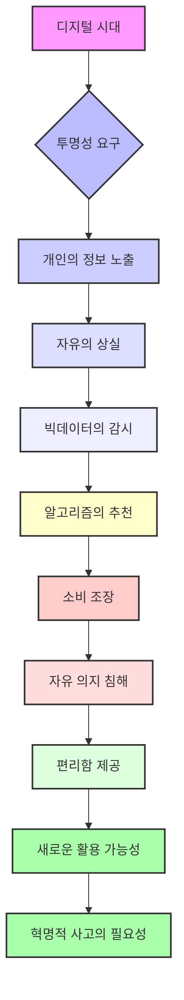
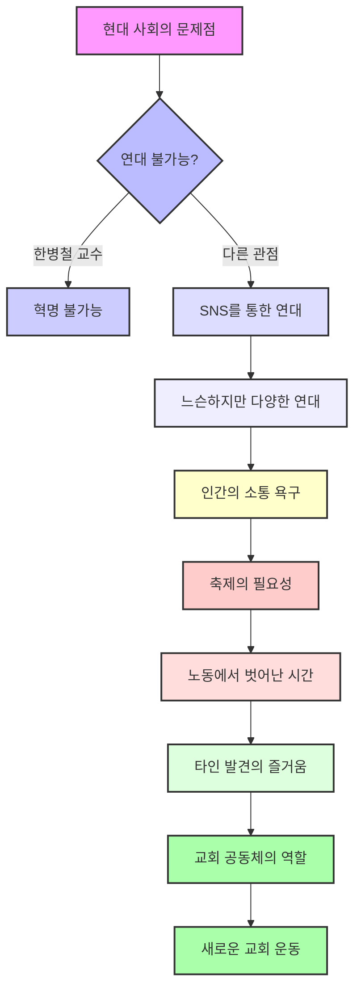

## 오늘날 혁명은 왜 불가능한가?
이 책은 독일 철학자 한병철 교수가 현대 사회에서 혁명이 왜 일어나기 어려운지, 그리고 우리가 어떻게 살아가고 있는지에 대해 깊이 있게 탐구하는 책이다. 특히 신자유주의 시스템이 사람들을 어떻게 착취하고 통제하는지, 그리고 그 안에서 우리가 잃어버린 자유와 존엄은 무엇인지에 대해 이야기한다.

## 1. 혁명이 불가능한 이유: 스스로를 착취하는 사회 

현대 사회에서는 과거와 같은 방식의 혁명이 일어나기 어렵다고 한병철 교수는 말한다. 마치 쳇바퀴를 돌리는 햄스터처럼, 사람들이 스스로를 착취하며 살아가기 때문이다.

1. **대항할 대상이 사라진 사회**:
  - 과거에는 독재자나 특정 체제처럼 명확한 적이 있었다. 그래서 사람들이 뭉쳐서 싸울 수 있었다. 
  - 하지만 지금은 누가 나를 착취하는지 알기 어렵다. 마치 내가 나를 스스로 괴롭히는 것과 같다. 
  - 이런 상황에서는 혁명을 일으킬 의욕 자체가 생기지 않는다. 
2. **스스로 경영자가 되어 스스로를 착취하는 사람들**:
  - 신자유주의 사회에서는 모든 사람이 자기 스스로가 사장님이고, 동시에 자기 자신에게 고용된 직원이라고 생각한다. 
  - 그래서 죽을 때까지 스스로를 채찍질하며 일하고, 끊임없이 자기 계발을 해야만 살아남을 수 있다고 느낀다. 
  - 이것은 마치 무한 경쟁 속에서 스스로 소멸되는 과정과 같다. 
  - 마르크스 시대처럼 고용주와 노동자가 명확히 나뉘어 계급 투쟁을 하던 때와는 다르다. 지금은 자발적으로 이런 시스템에 빠져들고 있다. 
3. **긍정성의 역설**:
  - 우리는 항상 '긍정의 힘'을 강조하고, 긍정적으로 생각해야 한다고 배운다. 
  - 하지만 한병철 교수는 이런 긍정성이 오히려 자기 자신을 소진시키고 스스로를 착취하게 만든다고 지적한다. 
  - 마치 '나는 할 수 있어!'라고 외치며 무리하게 달리다가 결국 지쳐 쓰러지는 것과 같다. 
4. **자본주의는 이미 '형이상학'**:
  - 한병철 교수는 자본주의가 오늘날 우리 시대를 구성하는 기본적인 틀, 즉 '형이상학'이 되었다고 말한다. 
  - 이것은 마치 우리가 숨 쉬는 공기처럼 너무나 당연해서 그 존재조차 의식하지 못하는 것과 같다. 
  - 자본주의 시스템이 우리를 억압하고 착취하고 있지만, 그 이면을 이해하고 벗어나기 위한 옛날 방식의 혁명은 어렵다고 본다. 

## 2. 신자유주의의 교묘한 통제와 '가스라이팅' 

신자유주의는 마치 교묘한 심리 조작(가스라이팅)처럼 사람들을 통제한다. 사람들은 자신이 자유롭다고 생각하지만, 실제로는 시스템에 갇혀 스스로를 착취하고 있다.

1. **자유로운 경영자라는 착각**:
  - 신자유주의는 노동자들이 스스로를 '자유로운 경영자'라고 믿게 만든다. 
  - 마치 회사에서 '너는 이 프로젝트의 주인이니까 네 마음대로 해봐!'라고 말하지만, 결국은 회사의 목표를 위해 밤샘 근무를 하게 되는 것과 같다. 
  - 이런 착각 속에서 사람들은 자기 자신을 끊임없이 착취하게 된다. 
2. **저항감과 비판 의식의 상실**:
  - 사람들은 신자유주의 권력자들에게 가스라이팅 당해서, 자유와 존엄을 잃어가는 상황에서도 저항하거나 비판할 생각을 하지 못한다. 
  - 마치 세뇌당한 것처럼, '원래 이렇게 사는 거야'라고 생각하며 무감각해진다. 
  - 이것은 개인에게 매우 중요한 문제이며, 거창해 보이지만 사실은 우리 모두의 삶에 깊이 연결되어 있다. 
3. **상업화된 친절과 협력 경제의 역설**:
  - 목적 없는 순수한 친절은 더 이상 찾아보기 어렵다. 
  - 상호 평가 사회에서는 사람들이 더 좋은 평가를 받기 위해 친절해진다. 마치 별점 리뷰를 잘 받기 위해 친절하게 행동하는 가게 주인처럼 말이다. 
  - 협력 경제(예: 공유 경제) 안에서도 엄격한 자본주의 논리가 작동한다. 
  - 겉으로는 아름다운 공유의 질서처럼 보이지만, 실제로는 아무도 자발적으로 무언가를 내주지 않는다. 모든 것이 상품처럼 거래된다. 
  - 자본주의가 공산주의(모두가 함께 나누는 이상적인 사회)를 상품으로 팔아버리는 순간, 혁명은 끝나는 것이나 다름없다. 

## 3. 현대인의 '피로'와 '우울' 

현대인들은 끊임없이 무언가를 해야 한다는 압박감 속에서 심한 피로와 우울을 겪는다. 이는 신자유주의 시스템이 우리에게서 '시간'을 빼앗아갔기 때문이다.

1. **성찰할 시간을 빼앗긴 사람들**:
  - 신자유주의 시스템은 사람들이 성찰(자신을 돌아보고 깊이 생각하는 것)할 시간적 여유를 주지 않는다. 
  - 마치 바쁜 직장인이 퇴근 후에도 자기 계발을 하느라 하루 종일 쉴 틈 없이 돌아가는 것과 같다. 
  - 끊임없이 노동하고 착취당해야만 살아남을 수 있다고 생각하기 때문에, 고민하고 대화하고 공동체를 만날 시간조차 없다. 
  - 이것은 신자유주의가 우리에게서 '시간'을 빼앗아갔기 때문이다. 
2. **우울증의 증가**:
  - 특히 젊은 세대(청년들) 사이에서 우울증이 매우 많고 점점 늘어나고 있다. 
  - 직장을 다니거나 사회생활을 할 수 없을 정도로 심한 우울증을 겪는 사람들도 많다. 
  - 이들은 고립되고, 일이 잘 풀리지 않으면 더욱 우울해지며, 우울증 때문에 친구 관계나 사회생활이 어려워지는 악순환에 빠진다. 
3. **'고장 난 상태'로 여겨지는 사람들**:
  - 현대 사회는 모든 상황이 '잘 작동되고 있음' 아니면 '고장' 둘 중 하나라고 본다. 
  - 사회에서 요구하는 기능을 잘 못하거나, 끊임없이 발전하는 과정 중에 있는 사람들은 '고장 난 상태'로 여겨진다. 
  - 마치 고장 난 기계처럼 무가치하게 취급받는 것이다. 
  - 이런 시스템 속에서 사람들은 노력해도 열패감(패배감)에 빠질 수밖에 없다. 
  - 한병철 교수는 이런 현실을 이해하고, '내가 잘못된 것이 아니구나'라는 위로의 메시지가 필요하다고 말한다. 

## 4. 디지털 시대의 '투명성'과 '빅데이터'의 양면성 

디지털 시대의 '투명성'과 '빅데이터'는 우리의 삶을 편리하게 만들지만, 동시에 자유를 억압하고 통제하는 양면성을 가지고 있다.

1. **투명성 사회와 자유의 역설**:
  - 우리는 투명성(모든 것이 드러나는 것)이 자유롭다고 생각하지만, 오히려 벌거벗겨진 채 가장 자유로운 것처럼 살아간다. 
  - SNS에서 사람들이 자신을 드러내고 소통하는 것이 오히려 자신을 얽매는 결과를 낳기도 한다. 
  - 마치 유리 상자 안에 갇혀 모든 것을 보여주지만, 그 안에서 벗어날 수 없는 것과 같다. 
2. **빅데이터의 감시와 편리함**:
  - 빅데이터는 마치 소설 속 '빅 브라더'처럼 사람들의 모든 것을 속속들이 파악하고 있다. 
  - 우리가 나눈 대화 내용이 광고로 뜨는 것처럼, 빅데이터는 우리의 모든 정보를 듣고 분석한다. 
  - 이것은 무섭게 느껴지지만, 동시에 우리가 찾으려던 것을 미리 알려주는 편리함도 제공한다. 
  - 이런 편리함 때문에 우리는 빅데이터의 감시를 자연스럽게 받아들이게 된다. 
3. **자유 의지와 소비 조장**:
  - 빅데이터가 추천하는 상품을 사는 것이 나의 자유 의지인지, 아니면 강요당한 것인지 의문이 생긴다. 
  - 알고리즘은 우리가 원하지 않았던 것까지 광고로 보여주며 소비를 조장한다. 
  - 마치 내가 좋아하는 것을 알아서 추천해주는 비서 같지만, 사실은 내가 무엇을 좋아할지 미리 정해주는 것과 같다. 
4. **긍정성과 낙관주의의 필요성**:
  - 한병철 교수는 긍정성의 폐해를 지적하며 부정성이 사라진 사회를 비판한다. 
  - 하지만 이런 암울한 진단 속에서도, 우리는 빅데이터를 오히려 우리의 자유를 위해 어떻게 이용할 수 있을지 생각해야 한다. 
  - 마치 칼이 위험하지만 요리할 때 유용하게 쓰이는 것처럼, 빅데이터도 우리가 어떻게 활용하느냐에 따라 달라질 수 있다. 
  - 너무 단정적으로 비판하기보다는, 다양한 가능성을 열어두고 낙관적으로 생각하는 태도도 필요하다. 

## 5. 연대의 가능성과 '축제'의 의미 

한병철 교수는 연대가 불가능하다고 보지만, 다른 한편에서는 디지털 공간을 통해 새로운 형태의 연대가 생겨나고 있다. 그리고 이런 연대를 강화하고 사람들을 하나로 모으는 데 '축제'가 중요한 역할을 할 수 있다.

1. **SNS를 통한 새로운 **연대:
  - 한병철 교수는 연대가 불가능하고 그래서 혁명도 불가능하다고 본다. 
  - 하지만 SNS에서는 끊임없이 소통할 수 있는 공간이 만들어지고, 이를 통해 다양한 연대들이 이루어지고 있다. 
  - 마치 온라인 게임에서 처음 만난 사람들이 함께 팀을 이루어 목표를 달성하는 것처럼, 느슨하지만 의미 있는 관계들이 형성된다. 
  - 사람들은 자기 이야기를 하고 싶어 하고, 그에 대한 피드백을 받고 싶어 하는 강한 속성을 가지고 있다. 
  - 이런 인간의 본성은 투명성이나 자유를 내어주는 속성만큼이나 강하다. 
2. **'축제'의 진정한 의미**:
  - 축제는 단순히 노동에서 벗어나 쉬거나 기억을 되살리는 시간이 아니다. 
  - 축제는 전혀 다른 시간이 시작되게 하는 특별한 순간이다. 
  - 마치 일상생활의 규칙을 잠시 잊고 모두가 함께 즐기는 놀이동산처럼, 축제는 세속적인 행위가 끝나는 곳에서 시작된다. 
  - 축제의 시간은 노동 시간과 정반대되는 개념이다. 
3. **축제를 통한 연대와 자기 발견**:
  - 축제는 시간을 효율적으로 써야 한다는 압박에서 벗어나, 모두와 함께하기 위해 '써 버리는' 시간이다. 
  - 이 시간을 통해 사람들은 즐거움을 느끼고, 타인을 발견하며, 서로의 다름을 인정하게 된다. 
  - 마치 함께 춤추고 노래하며 서로의 존재를 느끼는 것처럼, 축제는 교조적(가르치고 강요하는)이지 않으면서도 사람들을 연대하게 하는 최적의 장치이다. 
4. **교회의 역할과 새로운 공동체**:
  - 교회는 원래 상대를 이해하고 교감하며 함께 살아가는 방법을 연구하는 곳이다. 
  - 하지만 지금은 가진 사람들끼리만 모이는 등 교회의 본래 기능이 많이 상실되었다. 
  - 교회는 사람들이 자신의 모습 그대로 와서 사랑받을 수 있는 공간이 되어야 한다. 
  - 마치 부모가 자녀의 있는 모습 그대로를 사랑하는 것처럼, 교회도 성과나 자격 없이 존재 자체로 사랑받을 수 있는 곳이어야 한다. 
  - 새로운 교회는 '놀이'와 '발견'의 공간이 되어야 한다. 예수님도 술꾼이요 먹보라는 별명이 있었던 것처럼, 가르치기보다는 함께 즐기고 소통하는 것이 중요하다. 
  - 작은 교회들이 지혜롭게 다양한 '축제' 같은 모임들을 늘려나가, 사람들이 편안하게 만나고 소통할 수 있는 장을 마련해야 한다. 
  - 결국 사람과의 관계, 소통, 연대가 모든 문제의 답이며, 교회가 이런 역할을 제공해 줄 수 있다면 가장 좋을 것이다. 

